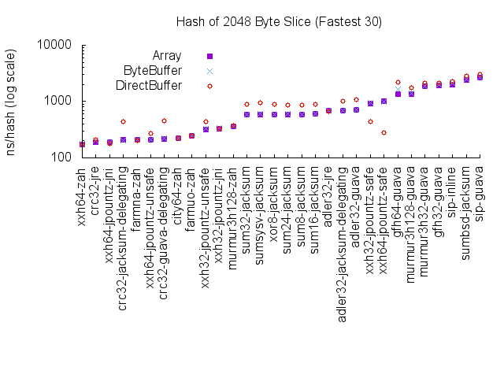

## Overview
Hash-Bench provides a JMH (Java microbenchmark harness) and
[published results](#results) for 114 Java implementations of major
hash, CRC and checksum algorithms. These include:

* [Adler32](https://en.wikipedia.org/wiki/Adler-32)
* [BLAKE2](https://www.blake2.net/)
* [BSD Checksum](https://en.wikipedia.org/wiki/BSD_checksum)
* [CityHash](https://en.wikipedia.org/wiki/CityHash)
* [cksum](https://en.wikipedia.org/wiki/Cksum)
* [crc16](https://en.wikipedia.org/wiki/Crc16)
* [crc24](https://en.wikipedia.org/wiki/Cyclic_redundancy_check#Standards_and_common_use)
* [crc32](https://en.wikipedia.org/wiki/Crc32)
* [crc64](https://en.wikipedia.org/wiki/Crc64)
* [Ed2k Hash](https://en.wikipedia.org/wiki/Ed2k_URI_scheme#eD2k_hash_algorithm)
* [ElfHash](https://en.wikipedia.org/wiki/PJW_hash_function)
* [FarmHash](https://github.com/google/farmhash)
* [Fast Frame Check Sequence (FCS-16)](http://www.ietf.org/rfc/rfc1331.txt)
* [Good Fast Hash](https://github.com/google/guava/wiki/HashingExplained)
* [GOST](https://en.wikipedia.org/wiki/GOST_(hash_function))
* [HAS-160](https://en.wikipedia.org/wiki/HAS-160)
* [HAVAL](https://en.wikipedia.org/wiki/HAVAL)
* [MD2](https://en.wikipedia.org/wiki/MD2_(cryptography))
* [MD4](https://en.wikipedia.org/wiki/MD4)
* [MD5](https://en.wikipedia.org/wiki/MD5)
* [MurmurHash](https://en.wikipedia.org/wiki/MurmurHash)
* [RIPEMD](https://en.wikipedia.org/wiki/RIPEMD) (128, 160, 256 and 320)
* [SHA-1](https://en.wikipedia.org/wiki/SHA-1) (including SHA-0)
* [SHA-2](https://en.wikipedia.org/wiki/SHA-2) (SHA-224, 256, 384, 512, 512/t)
* [SHA-3](https://en.wikipedia.org/wiki/SHA-3)
* [SipHash](https://en.wikipedia.org/wiki/SipHash)
* [Skein](https://en.wikipedia.org/wiki/Skein_(hash_function)) (256, 512, 1024)
* [SM3](http://tools.ietf.org/html/draft-shen-sm3-hash-00)
* [Sum](https://en.wikipedia.org/wiki/List_of_hash_functions#Checksums)
* [SYSV Checksum](https://en.wikipedia.org/wiki/SYSV_checksum)
* [Tiger](https://en.wikipedia.org/wiki/Tiger_(cryptography)) (including Tiger 2)
* [Whirlpool](https://en.wikipedia.org/wiki/Whirlpool_(cryptography))
* [xor8](https://en.wikipedia.org/wiki/Longitudinal_redundancy_check)
* [xxHash](https://github.com/Cyan4973/xxHash) (both XXH32 and XXH64)

Implementations tested:

* [Bouncy Castle](http://bouncycastle.org/java.html)
* Forward Engineering [SipHash_2_4](http://www.forward.com.au/pfod/SipHashJavaLibrary/index.html)
* Google [Guava](https://github.com/google/guava/wiki/HashingExplained)
* Inline [siphash-java-inline](https://github.com/nahi/siphash-java-inline)
* Johann Löfflmann [Jacksum](http://www.jonelo.de/java/jacksum/)
* JRE [Adler32](https://docs.oracle.com/javase/8/docs/api/java/util/zip/Adler32.html)
* JRE [CRC32](https://docs.oracle.com/javase/8/docs/api/java/util/zip/CRC32.html)
* Adrien Grand (@jpountz) [xxHash for Java](https://github.com/jpountz/lz4-java)
* OpenHFT [Zero Allocation Hashing](https://github.com/OpenHFT/Zero-Allocation-Hashing)

## Results
A wide variety of plots are generated, including by byte slice length,
by hash specification, and by implementation. This should let you determine the
lowest latency hash for your target byte size, compare the different
implementations of that hash, and evaluate how well an implementation responds
to different input types (eg ``byte[]`` vs ``ByteBuffer``) and lengths.

An example plot is below, but there are [many more](results/5/README.md):

| Date       | Processor     | JVM              | Results Link             |
| ---------- | ------------- | ---------------- | ------------------------ |
| 2015-09-24 | Xeon E5-2667  | OpenJDK 1.8.0_60 | [1](results/1/README.md) |
| 2015-09-26 | Xeon E5-2667  | OpenJDK 1.8.0_60 | [2](results/2/README.md) |
| 2015-09-30 | Xeon E5-2667  | OpenJDK 1.8.0_60 | [3](results/3/README.md) |
| 2015-10-01 | Xeon E5-2667  | OpenJDK 1.8.0_60 | [4](results/4/README.md) |
| 2015-12-04 | Xeon E5-2667  | OpenJDK 1.8.0_66 | [5](results/5/README.md) |

## Scope
This project is focused on JVM performance.

It does not test the accuracy of the implementations.

Please remember that latency is only one consideration. There is considerable
variation between hash algorithms. Some common variations include:

* Overall hash quality (eg see [SMHasher](http://code.google.com/p/smhasher/))
* Lack of [cryptographic hash](https://en.wikipedia.org/wiki/Cryptographic_hash_function) support
* Whether a hash remains consistent across process restarts or not
* Guarantees around machine-dependence (eg byte order)
* Output length (and associated storage and/or transmission costs)

## Test Configuration
Implementations vary considerably with respect to the inputs they are able to
hash. The most basic support is hashing an entire ``byte[]``. Most
implementations permit an offset and length to be nominated for a ``byte[]``.
Some implementations offer
[ByteBuffer](http://docs.oracle.com/javase/8/docs/api/java/nio/ByteBuffer.html)
awareness, others use ``Unsafe``, and some delegate to native code via JNI.

My motivating use case for developing this benchmark required hashing
variable-length messages from a proprietary framed IO stream. As such this
benchmark populates a 64 KB buffer with random bytes and then requires each
implementation to hash a particular slice of that buffer. In order to provide
each implementation with the best opportunity to efficiently hash such
IO-sourced slices, the following three scenarios are benchmarked:

* ``byte[]`` from a given offset for a given length
* Array-backed ``ByteBuffer`` from a given offset for a given length
* Direct (native) ``ByteBuffer`` from a given offset for a given length

The [adapter pattern](https://en.wikipedia.org/wiki/Adapter_pattern) is used to
abstract each implementation. This ensures each implementation is tested in the
same manner and by the same harness. Each adapter implementation contains the
minimal logic required to support the above three scenarios. For some of the
simpler implementations it was necessary to copy bytes into a dedicated
``byte[]`` or prepare a ``ByteBuffer`` view.

## Preparation
Until [xxHash for Java](https://github.com/jpountz/lz4-java) 1.4 is released,
please clone and build it locally to access the latest buffer fixes. Then
edit the ``hash-bench/pom.xml`` to reflect the locally-installed snapshot.

Hash-Bench also requires [Jacksum](http://www.jonelo.de/java/jacksum/).
Jacksum is not in any Maven repository, so download it, unzip, then

    mvn install:install-file -Dfile=jacksum.jar -DgroupId=jonelo.jacksum -DartifactId=jacksum -Dversion=1.7 -Dpackaging=jar
    mv jacksum-src.zip jacksum-sources.jar
    mvn deploy:deploy-file -Dfile=jacksum-sources.jar -DgroupId=jonelo.jacksum -DartifactId=jacksum -Dversion=1.7 -Dpackaging=jar -Dclassifier=sources -Durl=file://$HOME/.m2/repository/

## Running
You'll need at least Java 8 and Maven 3 installed. Then:

    cd hash-bench
    mvn clean package
    java -jar target/benchmarks.jar

This will run in default mode, testing all known libraries and input lengths.
This takes roughly 15 hours with server-grade (Xeon E5-2667) hardware.

You can append ``-h`` to the ``java -jar`` line for JMH help. For example, use:

  * ``-wi 0`` to run zero warm-ups (not recommended)
  * ``-i 1`` to run one iteration only (not recommended)
  * ``-f 1`` to run one fork only (not recommended)
  * ``-p length=8,1024`` to test input lengths of 8 and 1024 only
  * ``-p algo=xxh64-zah,xxh64-jpountz-unsafe`` to test two XXH64 implementations
  * ``-lp`` to list all available parameter (``-p`` keys and values)
  * ``-rf csv`` to emit CSV output (for use with the ``plot`` command)
  * ``-foe true`` to stop on any error (recommended)

## Naming Convention
Algorithm names (such as ``xxh64-jpountz-unsafe``) are used in reports and
optionally for the ``-p algo`` option. The naming convention is:

    hash-implementation[-qualifier]

The ``hash`` portion denotes the underlying hash specification (and potential
size disambiguation). The ``implementation`` is a short abbreviation that
identifes the implementation from those listed at the top of this document. A
``qualifier`` is used if the implementation has been tested in a specific mode.

## License
MIT License, as per [LICENSE.txt](LICENSE.txt).

This project uses [Jacksum](http://sourceforge.net/projects/jacksum/), which is
GPLv2 licensed. Hash-Bench is not derived from Jacksum and is not
including or redistributing any Jacksum files (you must manually download and
install Jacksum yourself, as described above).

Two hash implementations (SipHash_2_4, Siphash-java-inline) are not available
from any known Maven repository. As each implementation is a single file, they
have been placed in the ``thirdparty`` directory. Their licenses are shown
in those files.

## Contributing
Please send a pull request if you'd like to improve the project (eg use a
particular hash library in a more efficient manner, add new libraries, update
to new library versions etc).
