# Hash-Bench Results
## Contents
* Latency by Byte Slice Length
  * [32](#32-byte-slice-latency)
  * [128](#128-byte-slice-latency)
  * [512](#512-byte-slice-latency)
  * [2048](#2048-byte-slice-latency)
  * [8192](#8192-byte-slice-latency)
  * [16384](#16384-byte-slice-latency)
  * [32768](#32768-byte-slice-latency)
* Latency by Algorithm Implementation
  * [adler32](#adler32-latency)
  * [city64](#city64-latency)
  * [crc32](#crc32-latency)
  * [farm_na](#farm_na-latency)
  * [farm_uo](#farm_uo-latency)
  * [good_fast_hash_32](#good_fast_hash_32-latency)
  * [good_fast_hash_64](#good_fast_hash_64-latency)
  * [md5](#md5-latency)
  * [murmur3_128_guava](#murmur3_128_guava-latency)
  * [murmur3_32_guava](#murmur3_32_guava-latency)
  * [murmur3_zah](#murmur3_zah-latency)
  * [sha1](#sha1-latency)
  * [sha256](#sha256-latency)
  * [sha384](#sha384-latency)
  * [sha512](#sha512-latency)
  * [sip_hash_fwd_eng](#sip_hash_fwd_eng-latency)
  * [sip_hash_guava](#sip_hash_guava-latency)
  * [sip_hash_inline](#sip_hash_inline-latency)
  * [xxh32_jni_jpountz](#xxh32_jni_jpountz-latency)
  * [xxh32_safe_jpountz](#xxh32_safe_jpountz-latency)
  * [xxh32_unsafe_jpountz](#xxh32_unsafe_jpountz-latency)
  * [xxh64_jni_jpountz](#xxh64_jni_jpountz-latency)
  * [xxh64_safe_jpountz](#xxh64_safe_jpountz-latency)
  * [xxh64_unsafe_jpountz](#xxh64_unsafe_jpountz-latency)
  * [xxh64_zah](#xxh64_zah-latency)

---
### 32 Byte Slice Latency

| Algorithm |  Array | ByteBuffer | DirectBuffer |
| --- | ---: | ---: | ---: | 
| [farm_na](#farm_na-latency) | 12.087208 | 32.140884 | 21.503889 |
| [city64](#city64-latency) | 12.115378 | 32.335804 | 21.687884 |
| [farm_uo](#farm_uo-latency) | 12.483210 | 32.362962 | 21.740328 |
| [xxh32_unsafe_jpountz](#xxh32_unsafe_jpountz-latency) | 14.179930 | 17.788305 | 26.542872 |
| [xxh64_unsafe_jpountz](#xxh64_unsafe_jpountz-latency) | 16.310580 | 18.512925 | 21.864946 |
| [murmur3_zah](#murmur3_zah-latency) | 17.554147 | 38.681060 | 26.392410 |
| [xxh64_zah](#xxh64_zah-latency) | 19.815907 | 40.600707 | 31.114544 |
| [xxh32_safe_jpountz](#xxh32_safe_jpountz-latency) | 25.268407 | 27.690253 | 26.710801 |
| [xxh64_safe_jpountz](#xxh64_safe_jpountz-latency) | 28.615564 | 30.383474 | 21.874474 |
| [xxh32_jni_jpountz](#xxh32_jni_jpountz-latency) | 41.931382 | 44.129020 | 33.006633 |
| [xxh64_jni_jpountz](#xxh64_jni_jpountz-latency) | 44.570721 | 44.940414 | 35.612753 |
| [crc32](#crc32-latency) | 46.190738 | 52.028850 | 54.570911 |
| [adler32](#adler32-latency) | 52.972258 | 54.314827 | 31.784963 |
| [sip_hash_inline](#sip_hash_inline-latency) | 55.889074 | 77.602726 | 76.825938 |
| [good_fast_hash_32](#good_fast_hash_32-latency) | 66.438986 | 497.130644 | 101.592597 |
| [murmur3_32_guava](#murmur3_32_guava-latency) | 68.665947 | 703.014863 | 96.416424 |
| [good_fast_hash_64](#good_fast_hash_64-latency) | 105.577787 | 1018.425724 | 158.280359 |
| [sip_hash_fwd_eng](#sip_hash_fwd_eng-latency) | 116.401181 | 130.939103 | 135.438791 |
| [sip_hash_guava](#sip_hash_guava-latency) | 118.345497 | 210.490985 | 144.178051 |
| [murmur3_128_guava](#murmur3_128_guava-latency) | 118.438105 | 140.257024 | 159.185681 |
| [md5](#md5-latency) | 261.766011 | 1951.497074 | 268.603898 |
| [sha512](#sha512-latency) | 823.637726 | 4032.474349 | 816.832552 |
| [sha256](#sha256-latency) | 989.979587 | 471.687015 | 517.227003 |
| [sha384](#sha384-latency) | 1621.222754 | 5860.638437 | 863.912386 |
| [sha1](#sha1-latency) | 1664.636197 | 357.224158 | 376.636229 |

---
### 128 Byte Slice Latency
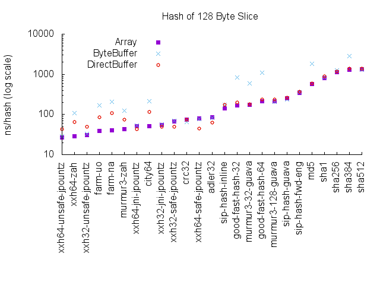

| Algorithm |  Array | ByteBuffer | DirectBuffer |
| --- | ---: | ---: | ---: | 
| [xxh64_unsafe_jpountz](#xxh64_unsafe_jpountz-latency) | 26.967484 | 28.730496 | 43.746722 |
| [xxh64_zah](#xxh64_zah-latency) | 28.658477 | 108.130796 | 64.331864 |
| [xxh32_unsafe_jpountz](#xxh32_unsafe_jpountz-latency) | 30.895100 | 32.711015 | 49.893586 |
| [farm_uo](#farm_uo-latency) | 39.016878 | 168.990953 | 86.255969 |
| [farm_na](#farm_na-latency) | 40.220799 | 204.785456 | 108.082974 |
| [murmur3_zah](#murmur3_zah-latency) | 43.247076 | 125.308220 | 75.726976 |
| [xxh64_jni_jpountz](#xxh64_jni_jpountz-latency) | 50.735327 | 52.830552 | 43.929457 |
| [city64](#city64-latency) | 52.062808 | 211.703575 | 116.079578 |
| [xxh32_jni_jpountz](#xxh32_jni_jpountz-latency) | 55.723651 | 56.256553 | 49.918906 |
| [xxh32_safe_jpountz](#xxh32_safe_jpountz-latency) | 66.756224 | 68.842469 | 49.590282 |
| [crc32](#crc32-latency) | 73.335654 | 65.064849 | 74.752006 |
| [xxh64_safe_jpountz](#xxh64_safe_jpountz-latency) | 78.811309 | 77.074789 | 44.591452 |
| [adler32](#adler32-latency) | 84.136285 | 83.471336 | 63.234167 |
| [sip_hash_inline](#sip_hash_inline-latency) | 144.553132 | 175.966602 | 172.744376 |
| [good_fast_hash_32](#good_fast_hash_32-latency) | 171.039179 | 835.270604 | 202.052303 |
| [murmur3_32_guava](#murmur3_32_guava-latency) | 172.594439 | 594.162575 | 181.449141 |
| [good_fast_hash_64](#good_fast_hash_64-latency) | 215.264698 | 1082.521677 | 233.656021 |
| [murmur3_128_guava](#murmur3_128_guava-latency) | 215.600795 | 205.144769 | 240.456309 |
| [sip_hash_guava](#sip_hash_guava-latency) | 249.348370 | 240.435692 | 258.897780 |
| [sip_hash_fwd_eng](#sip_hash_fwd_eng-latency) | 346.972380 | 362.033486 | 364.683617 |
| [md5](#md5-latency) | 569.156268 | 1811.962714 | 591.825587 |
| [sha1](#sha1-latency) | 808.801129 | 822.425020 | 879.418398 |
| [sha256](#sha256-latency) | 1137.853166 | 1235.408239 | 1160.025164 |
| [sha384](#sha384-latency) | 1311.815065 | 2806.063439 | 1387.734354 |
| [sha512](#sha512-latency) | 1349.112437 | 1306.594385 | 1388.625202 |

---
### 512 Byte Slice Latency
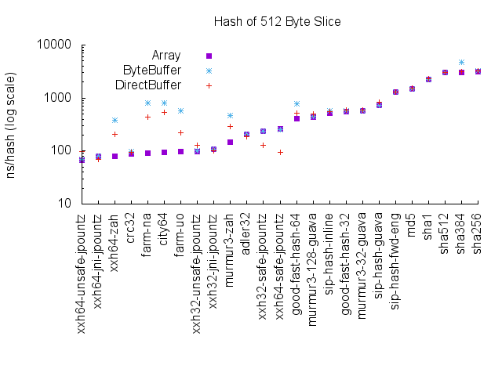

| Algorithm |  Array | ByteBuffer | DirectBuffer |
| --- | ---: | ---: | ---: | 
| [xxh64_unsafe_jpountz](#xxh64_unsafe_jpountz-latency) | 67.823605 | 69.213738 | 96.290682 |
| [xxh64_jni_jpountz](#xxh64_jni_jpountz-latency) | 78.434378 | 78.715060 | 69.322474 |
| [xxh64_zah](#xxh64_zah-latency) | 79.517684 | 377.502845 | 207.512144 |
| [crc32](#crc32-latency) | 88.953299 | 96.806952 | 94.213598 |
| [farm_na](#farm_na-latency) | 91.778816 | 798.573826 | 430.675778 |
| [city64](#city64-latency) | 95.654822 | 800.054492 | 529.709726 |
| [farm_uo](#farm_uo-latency) | 97.019588 | 582.449995 | 221.851551 |
| [xxh32_unsafe_jpountz](#xxh32_unsafe_jpountz-latency) | 98.618809 | 100.416755 | 127.427324 |
| [xxh32_jni_jpountz](#xxh32_jni_jpountz-latency) | 108.918539 | 109.707556 | 99.663665 |
| [murmur3_zah](#murmur3_zah-latency) | 148.326260 | 471.421260 | 292.641948 |
| [adler32](#adler32-latency) | 204.818346 | 207.194834 | 184.058061 |
| [xxh32_safe_jpountz](#xxh32_safe_jpountz-latency) | 234.983405 | 236.236876 | 127.417964 |
| [xxh64_safe_jpountz](#xxh64_safe_jpountz-latency) | 263.176616 | 252.931994 | 94.951095 |
| [good_fast_hash_64](#good_fast_hash_64-latency) | 407.801748 | 783.427858 | 515.645974 |
| [murmur3_128_guava](#murmur3_128_guava-latency) | 443.811885 | 450.161440 | 498.428986 |
| [sip_hash_inline](#sip_hash_inline-latency) | 525.109738 | 570.381419 | 551.089313 |
| [good_fast_hash_32](#good_fast_hash_32-latency) | 560.544789 | 574.828124 | 584.580052 |
| [murmur3_32_guava](#murmur3_32_guava-latency) | 575.445772 | 571.267888 | 595.784080 |
| [sip_hash_guava](#sip_hash_guava-latency) | 725.324480 | 733.775822 | 827.813394 |
| [sip_hash_fwd_eng](#sip_hash_fwd_eng-latency) | 1281.302975 | 1309.802366 | 1306.774184 |
| [md5](#md5-latency) | 1481.040020 | 1499.871033 | 1544.438974 |
| [sha1](#sha1-latency) | 2204.124099 | 2207.800436 | 2287.312104 |
| [sha512](#sha512-latency) | 3011.291838 | 3037.144262 | 3089.980172 |
| [sha384](#sha384-latency) | 3017.006757 | 4803.259799 | 3121.913007 |
| [sha256](#sha256-latency) | 3135.051314 | 3229.650684 | 3229.645840 |

---
### 2048 Byte Slice Latency

| Algorithm |  Array | ByteBuffer | DirectBuffer |
| --- | ---: | ---: | ---: | 
| [xxh64_jni_jpountz](#xxh64_jni_jpountz-latency) | 189.781579 | 190.312062 | 177.792733 |
| [crc32](#crc32-latency) | 203.589956 | 202.709906 | 202.961772 |
| [xxh64_unsafe_jpountz](#xxh64_unsafe_jpountz-latency) | 208.015960 | 208.591520 | 279.232504 |
| [xxh64_zah](#xxh64_zah-latency) | 258.787213 | 1449.883695 | 729.568101 |
| [farm_uo](#farm_uo-latency) | 302.458553 | 2003.846214 | 719.159563 |
| [xxh32_unsafe_jpountz](#xxh32_unsafe_jpountz-latency) | 320.462219 | 322.649874 | 426.732538 |
| [xxh32_jni_jpountz](#xxh32_jni_jpountz-latency) | 328.610205 | 328.506783 | 318.737103 |
| [murmur3_zah](#murmur3_zah-latency) | 518.461005 | 1938.044132 | 1300.789764 |
| [farm_na](#farm_na-latency) | 599.355526 | 3073.317041 | 1458.153438 |
| [adler32](#adler32-latency) | 699.732827 | 704.856013 | 673.106332 |
| [xxh32_safe_jpountz](#xxh32_safe_jpountz-latency) | 920.279230 | 908.898185 | 431.229772 |
| [xxh64_safe_jpountz](#xxh64_safe_jpountz-latency) | 997.604725 | 958.941210 | 271.168501 |
| [city64](#city64-latency) | 1346.826309 | 3110.218352 | 2055.857629 |
| [good_fast_hash_64](#good_fast_hash_64-latency) | 1400.612930 | 1419.282774 | 1828.282805 |
| [murmur3_128_guava](#murmur3_128_guava-latency) | 1436.789198 | 1411.949739 | 1862.661103 |
| [good_fast_hash_32](#good_fast_hash_32-latency) | 1853.979259 | 1847.437731 | 2194.927926 |
| [murmur3_32_guava](#murmur3_32_guava-latency) | 1916.933149 | 1871.718958 | 2214.670935 |
| [sip_hash_inline](#sip_hash_inline-latency) | 1999.313134 | 2169.126912 | 2156.803876 |
| [sip_hash_guava](#sip_hash_guava-latency) | 2720.614003 | 2645.092204 | 2989.958345 |
| [md5](#md5-latency) | 5200.666296 | 5211.919495 | 5463.761502 |
| [sip_hash_fwd_eng](#sip_hash_fwd_eng-latency) | 6185.758342 | 5332.034824 | 5297.741988 |
| [sha1](#sha1-latency) | 7752.031576 | 7725.244593 | 8185.773203 |
| [sha384](#sha384-latency) | 9799.212652 | 10000.078897 | 10235.615505 |
| [sha512](#sha512-latency) | 9912.952847 | 9845.353046 | 10096.925263 |
| [sha256](#sha256-latency) | 11173.375426 | 11592.140207 | 11331.192970 |

---
### 8192 Byte Slice Latency
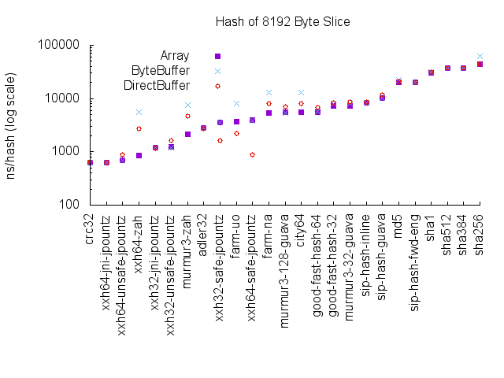

| Algorithm |  Array | ByteBuffer | DirectBuffer |
| --- | ---: | ---: | ---: | 
| [crc32](#crc32-latency) | 623.979681 | 635.433222 | 639.164640 |
| [xxh64_jni_jpountz](#xxh64_jni_jpountz-latency) | 624.217015 | 619.804612 | 617.605401 |
| [xxh64_unsafe_jpountz](#xxh64_unsafe_jpountz-latency) | 695.306670 | 686.681179 | 888.703447 |
| [xxh64_zah](#xxh64_zah-latency) | 866.871826 | 5604.779043 | 2680.871279 |
| [xxh32_jni_jpountz](#xxh32_jni_jpountz-latency) | 1196.140517 | 1186.977864 | 1173.680361 |
| [xxh32_unsafe_jpountz](#xxh32_unsafe_jpountz-latency) | 1220.741856 | 1210.477276 | 1614.777266 |
| [murmur3_zah](#murmur3_zah-latency) | 2140.048267 | 7645.326956 | 4748.958248 |
| [adler32](#adler32-latency) | 2773.183510 | 2778.926385 | 2726.846230 |
| [xxh32_safe_jpountz](#xxh32_safe_jpountz-latency) | 3611.162859 | 3607.416292 | 1646.800814 |
| [farm_uo](#farm_uo-latency) | 3725.400409 | 8023.674350 | 2236.042328 |
| [xxh64_safe_jpountz](#xxh64_safe_jpountz-latency) | 3974.094265 | 3827.008725 | 891.761419 |
| [farm_na](#farm_na-latency) | 5368.322185 | 12762.058723 | 8164.452722 |
| [murmur3_128_guava](#murmur3_128_guava-latency) | 5456.182747 | 5324.696621 | 6939.046797 |
| [city64](#city64-latency) | 5503.846716 | 12808.060649 | 8194.356551 |
| [good_fast_hash_64](#good_fast_hash_64-latency) | 5509.798606 | 5685.437497 | 6797.204392 |
| [good_fast_hash_32](#good_fast_hash_32-latency) | 7253.064536 | 8005.532140 | 8242.700710 |
| [murmur3_32_guava](#murmur3_32_guava-latency) | 7261.502793 | 7961.201847 | 8613.935885 |
| [sip_hash_inline](#sip_hash_inline-latency) | 8430.305397 | 8471.672629 | 8572.980984 |
| [sip_hash_guava](#sip_hash_guava-latency) | 10061.950436 | 10372.779498 | 11628.744323 |
| [md5](#md5-latency) | 20240.709362 | 22072.336256 | 21109.702009 |
| [sip_hash_fwd_eng](#sip_hash_fwd_eng-latency) | 20528.583329 | 20453.908271 | 20137.124390 |
| [sha1](#sha1-latency) | 30205.392789 | 31564.699009 | 30914.175018 |
| [sha512](#sha512-latency) | 36939.807611 | 37028.192114 | 37485.735905 |
| [sha384](#sha384-latency) | 37081.197931 | 37821.148668 | 37148.435546 |
| [sha256](#sha256-latency) | 43572.173356 | 62707.332009 | 44296.499495 |

---
### 16384 Byte Slice Latency
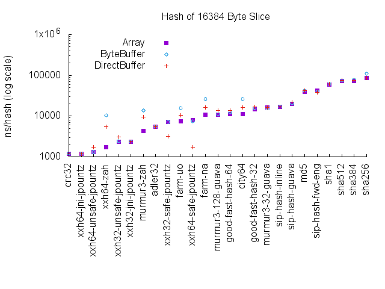

| Algorithm |  Array | ByteBuffer | DirectBuffer |
| --- | ---: | ---: | ---: | 
| [crc32](#crc32-latency) | 1203.595913 | 1212.026723 | 1200.530175 |
| [xxh64_jni_jpountz](#xxh64_jni_jpountz-latency) | 1205.553125 | 1197.927884 | 1192.414594 |
| [xxh64_unsafe_jpountz](#xxh64_unsafe_jpountz-latency) | 1311.952062 | 1301.782158 | 1719.948353 |
| [xxh64_zah](#xxh64_zah-latency) | 1728.992516 | 10520.579071 | 5464.292386 |
| [xxh32_unsafe_jpountz](#xxh32_unsafe_jpountz-latency) | 2335.616398 | 2399.477333 | 3098.726437 |
| [xxh32_jni_jpountz](#xxh32_jni_jpountz-latency) | 2356.505384 | 2341.299662 | 2324.669202 |
| [murmur3_zah](#murmur3_zah-latency) | 4255.969420 | 13779.736416 | 9431.797716 |
| [adler32](#adler32-latency) | 5507.177667 | 5501.464262 | 5487.766970 |
| [xxh32_safe_jpountz](#xxh32_safe_jpountz-latency) | 7210.391151 | 7161.105878 | 3212.310690 |
| [farm_uo](#farm_uo-latency) | 7479.845141 | 16006.828305 | 10386.163451 |
| [xxh64_safe_jpountz](#xxh64_safe_jpountz-latency) | 7907.471605 | 7538.524551 | 1715.649308 |
| [farm_na](#farm_na-latency) | 10688.920315 | 25995.941860 | 16284.997411 |
| [murmur3_128_guava](#murmur3_128_guava-latency) | 10977.501721 | 11167.568858 | 13652.501498 |
| [good_fast_hash_64](#good_fast_hash_64-latency) | 11024.029028 | 12285.510048 | 13686.598827 |
| [city64](#city64-latency) | 11071.077641 | 25856.996518 | 16333.508618 |
| [good_fast_hash_32](#good_fast_hash_32-latency) | 14679.814033 | 15592.981991 | 16638.871366 |
| [murmur3_32_guava](#murmur3_32_guava-latency) | 16024.064941 | 15666.095530 | 16360.973013 |
| [sip_hash_inline](#sip_hash_inline-latency) | 16914.320288 | 16746.536885 | 17087.917254 |
| [sip_hash_guava](#sip_hash_guava-latency) | 20051.665763 | 20855.603134 | 22395.618289 |
| [md5](#md5-latency) | 40042.100214 | 42329.133419 | 42202.982170 |
| [sip_hash_fwd_eng](#sip_hash_fwd_eng-latency) | 42879.230407 | 39534.349154 | 38580.714326 |
| [sha1](#sha1-latency) | 59542.964676 | 61648.419109 | 61479.282153 |
| [sha512](#sha512-latency) | 72564.825590 | 75837.141858 | 74164.052571 |
| [sha384](#sha384-latency) | 72662.814343 | 79244.325660 | 74700.636396 |
| [sha256](#sha256-latency) | 86505.553775 | 110548.431827 | 87472.255792 |

---
### 32768 Byte Slice Latency
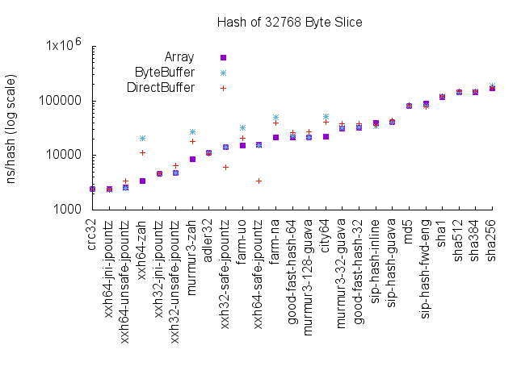

| Algorithm |  Array | ByteBuffer | DirectBuffer |
| --- | ---: | ---: | ---: | 
| [crc32](#crc32-latency) | 2383.600924 | 2385.319684 | 2391.422053 |
| [xxh64_jni_jpountz](#xxh64_jni_jpountz-latency) | 2387.550848 | 2365.415790 | 2353.407635 |
| [xxh64_unsafe_jpountz](#xxh64_unsafe_jpountz-latency) | 2557.828553 | 2546.559003 | 3349.101779 |
| [xxh64_zah](#xxh64_zah-latency) | 3407.388537 | 20871.365346 | 11044.531925 |
| [xxh32_jni_jpountz](#xxh32_jni_jpountz-latency) | 4667.403483 | 4652.530423 | 4621.032100 |
| [xxh32_unsafe_jpountz](#xxh32_unsafe_jpountz-latency) | 4705.823088 | 4728.164430 | 6394.472378 |
| [murmur3_zah](#murmur3_zah-latency) | 8423.481431 | 27234.517942 | 18300.129721 |
| [adler32](#adler32-latency) | 11013.832983 | 11029.687904 | 10905.812506 |
| [xxh32_safe_jpountz](#xxh32_safe_jpountz-latency) | 14131.467590 | 14093.079072 | 6136.334566 |
| [farm_uo](#farm_uo-latency) | 14970.273367 | 31857.505106 | 20765.446448 |
| [xxh64_safe_jpountz](#xxh64_safe_jpountz-latency) | 15718.910334 | 15242.738044 | 3359.510728 |
| [farm_na](#farm_na-latency) | 21243.701572 | 50758.048457 | 39954.891755 |
| [good_fast_hash_64](#good_fast_hash_64-latency) | 21662.437271 | 23072.576697 | 26345.456473 |
| [murmur3_128_guava](#murmur3_128_guava-latency) | 21674.009677 | 21747.407231 | 27525.125505 |
| [city64](#city64-latency) | 21936.739881 | 51492.220676 | 40716.260864 |
| [murmur3_32_guava](#murmur3_32_guava-latency) | 31445.095505 | 31694.213013 | 38127.735329 |
| [good_fast_hash_32](#good_fast_hash_32-latency) | 31700.182429 | 32747.463212 | 38501.132722 |
| [sip_hash_inline](#sip_hash_inline-latency) | 39248.489418 | 34124.837767 | 35336.997040 |
| [sip_hash_guava](#sip_hash_guava-latency) | 40482.156213 | 40253.499501 | 44228.745879 |
| [md5](#md5-latency) | 79906.607883 | 81913.831382 | 83631.964531 |
| [sip_hash_fwd_eng](#sip_hash_fwd_eng-latency) | 90269.343083 | 80552.072496 | 76685.666562 |
| [sha1](#sha1-latency) | 118830.608657 | 120933.259859 | 122518.736476 |
| [sha512](#sha512-latency) | 144155.664718 | 145888.852938 | 148459.541014 |
| [sha384](#sha384-latency) | 144240.651856 | 148104.357664 | 147668.310156 |
| [sha256](#sha256-latency) | 171763.666392 | 187001.849732 | 176430.572119 |

---
### adler32 Latency
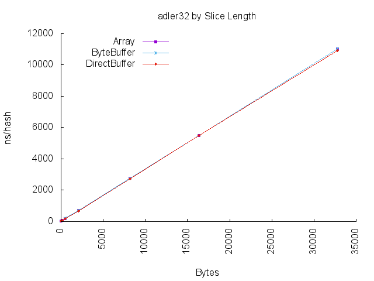

| Length |  Array | ByteBuffer | DirectBuffer |
| --- | ---: | ---: | ---: | 
| [32](#32-byte-slice-latency) | 52.972258 | 54.314827 | 31.784963 |
| [128](#128-byte-slice-latency) | 84.136285 | 83.471336 | 63.234167 |
| [512](#512-byte-slice-latency) | 204.818346 | 207.194834 | 184.058061 |
| [2048](#2048-byte-slice-latency) | 699.732827 | 704.856013 | 673.106332 |
| [8192](#8192-byte-slice-latency) | 2773.183510 | 2778.926385 | 2726.846230 |
| [16384](#16384-byte-slice-latency) | 5507.177667 | 5501.464262 | 5487.766970 |
| [32768](#32768-byte-slice-latency) | 11013.832983 | 11029.687904 | 10905.812506 |

---
### city64 Latency
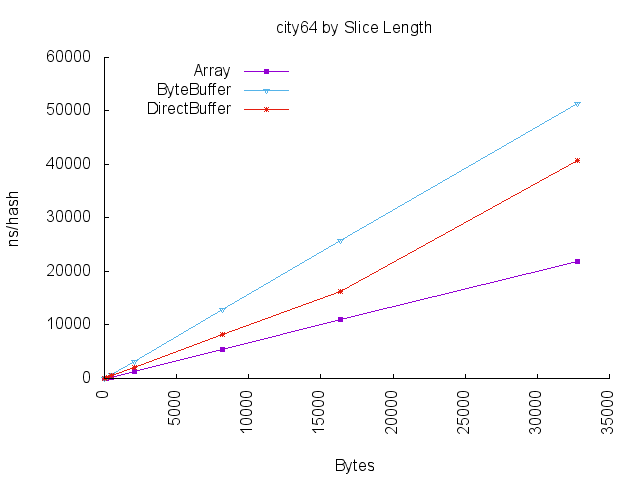

| Length |  Array | ByteBuffer | DirectBuffer |
| --- | ---: | ---: | ---: | 
| [32](#32-byte-slice-latency) | 12.115378 | 32.335804 | 21.687884 |
| [128](#128-byte-slice-latency) | 52.062808 | 211.703575 | 116.079578 |
| [512](#512-byte-slice-latency) | 95.654822 | 800.054492 | 529.709726 |
| [2048](#2048-byte-slice-latency) | 1346.826309 | 3110.218352 | 2055.857629 |
| [8192](#8192-byte-slice-latency) | 5503.846716 | 12808.060649 | 8194.356551 |
| [16384](#16384-byte-slice-latency) | 11071.077641 | 25856.996518 | 16333.508618 |
| [32768](#32768-byte-slice-latency) | 21936.739881 | 51492.220676 | 40716.260864 |

---
### crc32 Latency
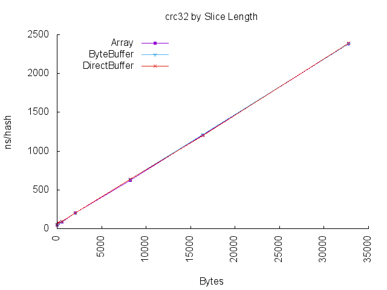

| Length |  Array | ByteBuffer | DirectBuffer |
| --- | ---: | ---: | ---: | 
| [32](#32-byte-slice-latency) | 46.190738 | 52.028850 | 54.570911 |
| [128](#128-byte-slice-latency) | 73.335654 | 65.064849 | 74.752006 |
| [512](#512-byte-slice-latency) | 88.953299 | 96.806952 | 94.213598 |
| [2048](#2048-byte-slice-latency) | 203.589956 | 202.709906 | 202.961772 |
| [8192](#8192-byte-slice-latency) | 623.979681 | 635.433222 | 639.164640 |
| [16384](#16384-byte-slice-latency) | 1203.595913 | 1212.026723 | 1200.530175 |
| [32768](#32768-byte-slice-latency) | 2383.600924 | 2385.319684 | 2391.422053 |

---
### farm_na Latency
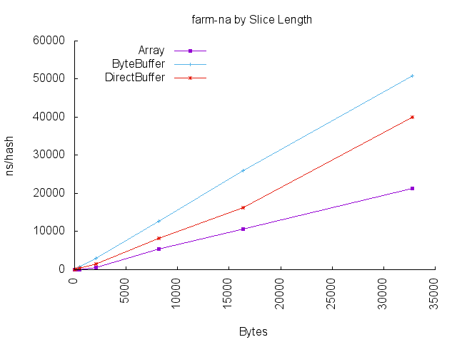

| Length |  Array | ByteBuffer | DirectBuffer |
| --- | ---: | ---: | ---: | 
| [32](#32-byte-slice-latency) | 12.087208 | 32.140884 | 21.503889 |
| [128](#128-byte-slice-latency) | 40.220799 | 204.785456 | 108.082974 |
| [512](#512-byte-slice-latency) | 91.778816 | 798.573826 | 430.675778 |
| [2048](#2048-byte-slice-latency) | 599.355526 | 3073.317041 | 1458.153438 |
| [8192](#8192-byte-slice-latency) | 5368.322185 | 12762.058723 | 8164.452722 |
| [16384](#16384-byte-slice-latency) | 10688.920315 | 25995.941860 | 16284.997411 |
| [32768](#32768-byte-slice-latency) | 21243.701572 | 50758.048457 | 39954.891755 |

---
### farm_uo Latency
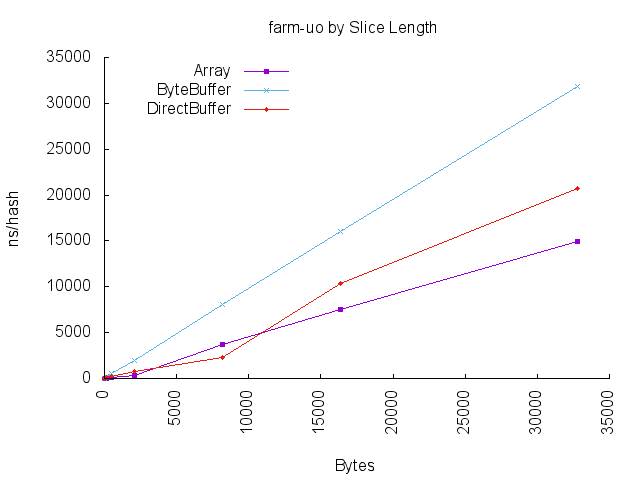

| Length |  Array | ByteBuffer | DirectBuffer |
| --- | ---: | ---: | ---: | 
| [32](#32-byte-slice-latency) | 12.483210 | 32.362962 | 21.740328 |
| [128](#128-byte-slice-latency) | 39.016878 | 168.990953 | 86.255969 |
| [512](#512-byte-slice-latency) | 97.019588 | 582.449995 | 221.851551 |
| [2048](#2048-byte-slice-latency) | 302.458553 | 2003.846214 | 719.159563 |
| [8192](#8192-byte-slice-latency) | 3725.400409 | 8023.674350 | 2236.042328 |
| [16384](#16384-byte-slice-latency) | 7479.845141 | 16006.828305 | 10386.163451 |
| [32768](#32768-byte-slice-latency) | 14970.273367 | 31857.505106 | 20765.446448 |

---
### good_fast_hash_32 Latency
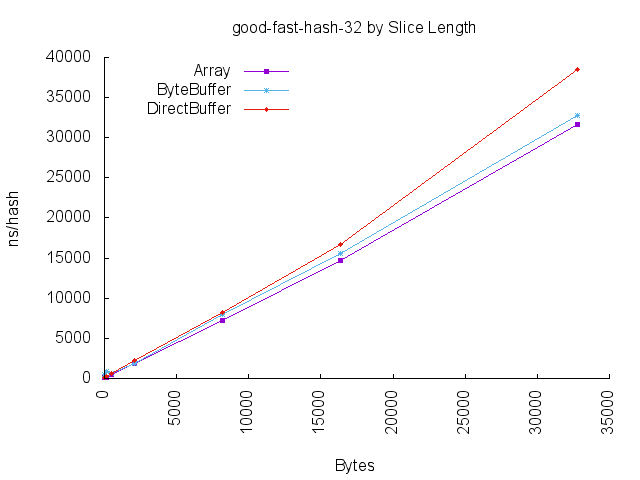

| Length |  Array | ByteBuffer | DirectBuffer |
| --- | ---: | ---: | ---: | 
| [32](#32-byte-slice-latency) | 66.438986 | 497.130644 | 101.592597 |
| [128](#128-byte-slice-latency) | 171.039179 | 835.270604 | 202.052303 |
| [512](#512-byte-slice-latency) | 560.544789 | 574.828124 | 584.580052 |
| [2048](#2048-byte-slice-latency) | 1853.979259 | 1847.437731 | 2194.927926 |
| [8192](#8192-byte-slice-latency) | 7253.064536 | 8005.532140 | 8242.700710 |
| [16384](#16384-byte-slice-latency) | 14679.814033 | 15592.981991 | 16638.871366 |
| [32768](#32768-byte-slice-latency) | 31700.182429 | 32747.463212 | 38501.132722 |

---
### good_fast_hash_64 Latency
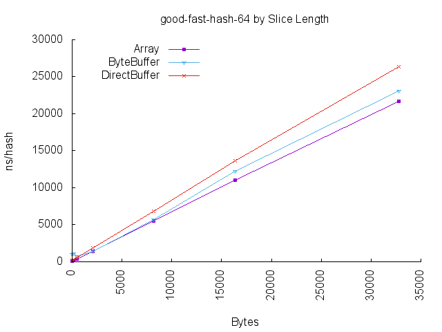

| Length |  Array | ByteBuffer | DirectBuffer |
| --- | ---: | ---: | ---: | 
| [32](#32-byte-slice-latency) | 105.577787 | 1018.425724 | 158.280359 |
| [128](#128-byte-slice-latency) | 215.264698 | 1082.521677 | 233.656021 |
| [512](#512-byte-slice-latency) | 407.801748 | 783.427858 | 515.645974 |
| [2048](#2048-byte-slice-latency) | 1400.612930 | 1419.282774 | 1828.282805 |
| [8192](#8192-byte-slice-latency) | 5509.798606 | 5685.437497 | 6797.204392 |
| [16384](#16384-byte-slice-latency) | 11024.029028 | 12285.510048 | 13686.598827 |
| [32768](#32768-byte-slice-latency) | 21662.437271 | 23072.576697 | 26345.456473 |

---
### md5 Latency
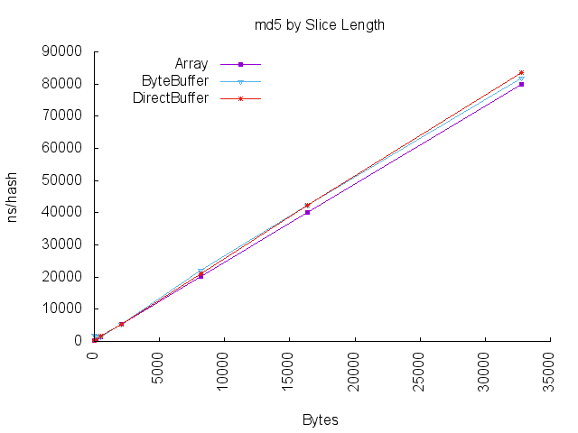

| Length |  Array | ByteBuffer | DirectBuffer |
| --- | ---: | ---: | ---: | 
| [32](#32-byte-slice-latency) | 261.766011 | 1951.497074 | 268.603898 |
| [128](#128-byte-slice-latency) | 569.156268 | 1811.962714 | 591.825587 |
| [512](#512-byte-slice-latency) | 1481.040020 | 1499.871033 | 1544.438974 |
| [2048](#2048-byte-slice-latency) | 5200.666296 | 5211.919495 | 5463.761502 |
| [8192](#8192-byte-slice-latency) | 20240.709362 | 22072.336256 | 21109.702009 |
| [16384](#16384-byte-slice-latency) | 40042.100214 | 42329.133419 | 42202.982170 |
| [32768](#32768-byte-slice-latency) | 79906.607883 | 81913.831382 | 83631.964531 |

---
### murmur3_128_guava Latency
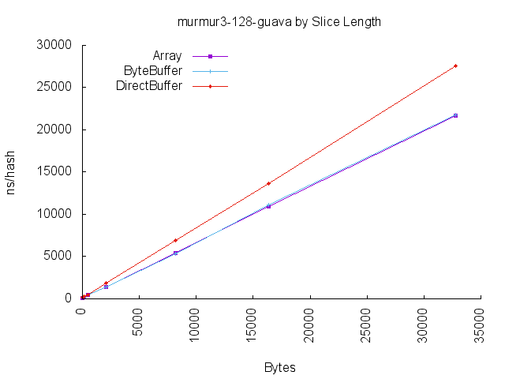

| Length |  Array | ByteBuffer | DirectBuffer |
| --- | ---: | ---: | ---: | 
| [32](#32-byte-slice-latency) | 118.438105 | 140.257024 | 159.185681 |
| [128](#128-byte-slice-latency) | 215.600795 | 205.144769 | 240.456309 |
| [512](#512-byte-slice-latency) | 443.811885 | 450.161440 | 498.428986 |
| [2048](#2048-byte-slice-latency) | 1436.789198 | 1411.949739 | 1862.661103 |
| [8192](#8192-byte-slice-latency) | 5456.182747 | 5324.696621 | 6939.046797 |
| [16384](#16384-byte-slice-latency) | 10977.501721 | 11167.568858 | 13652.501498 |
| [32768](#32768-byte-slice-latency) | 21674.009677 | 21747.407231 | 27525.125505 |

---
### murmur3_32_guava Latency
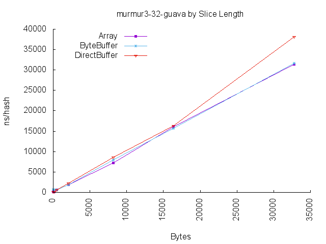

| Length |  Array | ByteBuffer | DirectBuffer |
| --- | ---: | ---: | ---: | 
| [32](#32-byte-slice-latency) | 68.665947 | 703.014863 | 96.416424 |
| [128](#128-byte-slice-latency) | 172.594439 | 594.162575 | 181.449141 |
| [512](#512-byte-slice-latency) | 575.445772 | 571.267888 | 595.784080 |
| [2048](#2048-byte-slice-latency) | 1916.933149 | 1871.718958 | 2214.670935 |
| [8192](#8192-byte-slice-latency) | 7261.502793 | 7961.201847 | 8613.935885 |
| [16384](#16384-byte-slice-latency) | 16024.064941 | 15666.095530 | 16360.973013 |
| [32768](#32768-byte-slice-latency) | 31445.095505 | 31694.213013 | 38127.735329 |

---
### murmur3_zah Latency
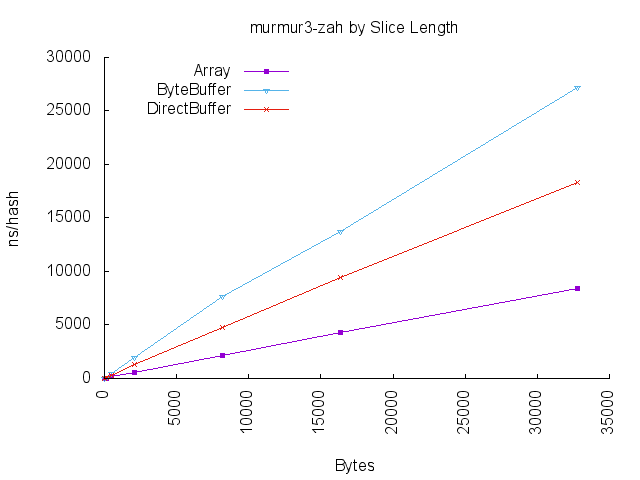

| Length |  Array | ByteBuffer | DirectBuffer |
| --- | ---: | ---: | ---: | 
| [32](#32-byte-slice-latency) | 17.554147 | 38.681060 | 26.392410 |
| [128](#128-byte-slice-latency) | 43.247076 | 125.308220 | 75.726976 |
| [512](#512-byte-slice-latency) | 148.326260 | 471.421260 | 292.641948 |
| [2048](#2048-byte-slice-latency) | 518.461005 | 1938.044132 | 1300.789764 |
| [8192](#8192-byte-slice-latency) | 2140.048267 | 7645.326956 | 4748.958248 |
| [16384](#16384-byte-slice-latency) | 4255.969420 | 13779.736416 | 9431.797716 |
| [32768](#32768-byte-slice-latency) | 8423.481431 | 27234.517942 | 18300.129721 |

---
### sha1 Latency
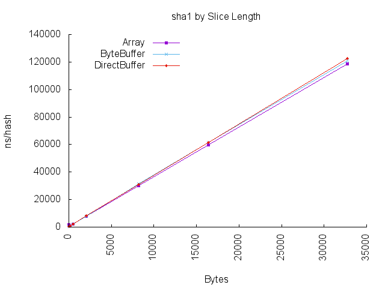

| Length |  Array | ByteBuffer | DirectBuffer |
| --- | ---: | ---: | ---: | 
| [32](#32-byte-slice-latency) | 1664.636197 | 357.224158 | 376.636229 |
| [128](#128-byte-slice-latency) | 808.801129 | 822.425020 | 879.418398 |
| [512](#512-byte-slice-latency) | 2204.124099 | 2207.800436 | 2287.312104 |
| [2048](#2048-byte-slice-latency) | 7752.031576 | 7725.244593 | 8185.773203 |
| [8192](#8192-byte-slice-latency) | 30205.392789 | 31564.699009 | 30914.175018 |
| [16384](#16384-byte-slice-latency) | 59542.964676 | 61648.419109 | 61479.282153 |
| [32768](#32768-byte-slice-latency) | 118830.608657 | 120933.259859 | 122518.736476 |

---
### sha256 Latency
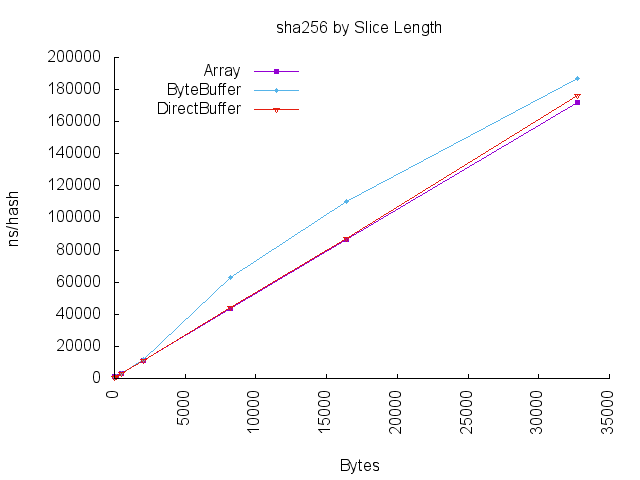

| Length |  Array | ByteBuffer | DirectBuffer |
| --- | ---: | ---: | ---: | 
| [32](#32-byte-slice-latency) | 989.979587 | 471.687015 | 517.227003 |
| [128](#128-byte-slice-latency) | 1137.853166 | 1235.408239 | 1160.025164 |
| [512](#512-byte-slice-latency) | 3135.051314 | 3229.650684 | 3229.645840 |
| [2048](#2048-byte-slice-latency) | 11173.375426 | 11592.140207 | 11331.192970 |
| [8192](#8192-byte-slice-latency) | 43572.173356 | 62707.332009 | 44296.499495 |
| [16384](#16384-byte-slice-latency) | 86505.553775 | 110548.431827 | 87472.255792 |
| [32768](#32768-byte-slice-latency) | 171763.666392 | 187001.849732 | 176430.572119 |

---
### sha384 Latency
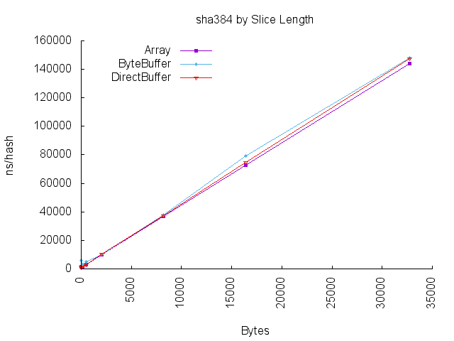

| Length |  Array | ByteBuffer | DirectBuffer |
| --- | ---: | ---: | ---: | 
| [32](#32-byte-slice-latency) | 1621.222754 | 5860.638437 | 863.912386 |
| [128](#128-byte-slice-latency) | 1311.815065 | 2806.063439 | 1387.734354 |
| [512](#512-byte-slice-latency) | 3017.006757 | 4803.259799 | 3121.913007 |
| [2048](#2048-byte-slice-latency) | 9799.212652 | 10000.078897 | 10235.615505 |
| [8192](#8192-byte-slice-latency) | 37081.197931 | 37821.148668 | 37148.435546 |
| [16384](#16384-byte-slice-latency) | 72662.814343 | 79244.325660 | 74700.636396 |
| [32768](#32768-byte-slice-latency) | 144240.651856 | 148104.357664 | 147668.310156 |

---
### sha512 Latency
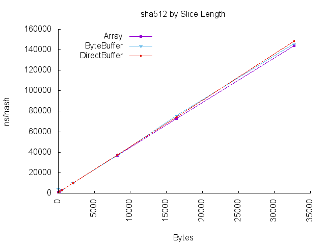

| Length |  Array | ByteBuffer | DirectBuffer |
| --- | ---: | ---: | ---: | 
| [32](#32-byte-slice-latency) | 823.637726 | 4032.474349 | 816.832552 |
| [128](#128-byte-slice-latency) | 1349.112437 | 1306.594385 | 1388.625202 |
| [512](#512-byte-slice-latency) | 3011.291838 | 3037.144262 | 3089.980172 |
| [2048](#2048-byte-slice-latency) | 9912.952847 | 9845.353046 | 10096.925263 |
| [8192](#8192-byte-slice-latency) | 36939.807611 | 37028.192114 | 37485.735905 |
| [16384](#16384-byte-slice-latency) | 72564.825590 | 75837.141858 | 74164.052571 |
| [32768](#32768-byte-slice-latency) | 144155.664718 | 145888.852938 | 148459.541014 |

---
### sip_hash_fwd_eng Latency
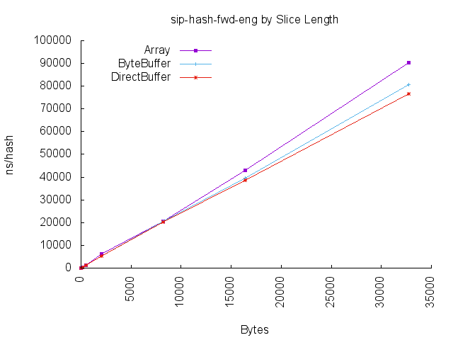

| Length |  Array | ByteBuffer | DirectBuffer |
| --- | ---: | ---: | ---: | 
| [32](#32-byte-slice-latency) | 116.401181 | 130.939103 | 135.438791 |
| [128](#128-byte-slice-latency) | 346.972380 | 362.033486 | 364.683617 |
| [512](#512-byte-slice-latency) | 1281.302975 | 1309.802366 | 1306.774184 |
| [2048](#2048-byte-slice-latency) | 6185.758342 | 5332.034824 | 5297.741988 |
| [8192](#8192-byte-slice-latency) | 20528.583329 | 20453.908271 | 20137.124390 |
| [16384](#16384-byte-slice-latency) | 42879.230407 | 39534.349154 | 38580.714326 |
| [32768](#32768-byte-slice-latency) | 90269.343083 | 80552.072496 | 76685.666562 |

---
### sip_hash_guava Latency
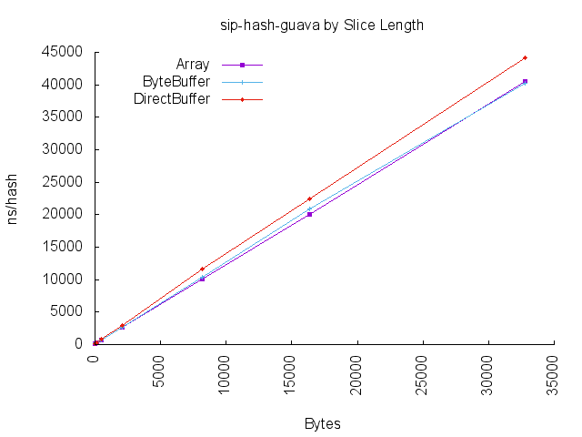

| Length |  Array | ByteBuffer | DirectBuffer |
| --- | ---: | ---: | ---: | 
| [32](#32-byte-slice-latency) | 118.345497 | 210.490985 | 144.178051 |
| [128](#128-byte-slice-latency) | 249.348370 | 240.435692 | 258.897780 |
| [512](#512-byte-slice-latency) | 725.324480 | 733.775822 | 827.813394 |
| [2048](#2048-byte-slice-latency) | 2720.614003 | 2645.092204 | 2989.958345 |
| [8192](#8192-byte-slice-latency) | 10061.950436 | 10372.779498 | 11628.744323 |
| [16384](#16384-byte-slice-latency) | 20051.665763 | 20855.603134 | 22395.618289 |
| [32768](#32768-byte-slice-latency) | 40482.156213 | 40253.499501 | 44228.745879 |

---
### sip_hash_inline Latency
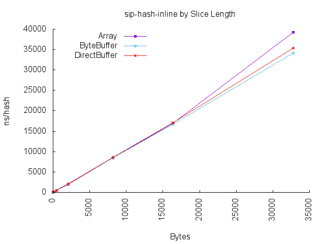

| Length |  Array | ByteBuffer | DirectBuffer |
| --- | ---: | ---: | ---: | 
| [32](#32-byte-slice-latency) | 55.889074 | 77.602726 | 76.825938 |
| [128](#128-byte-slice-latency) | 144.553132 | 175.966602 | 172.744376 |
| [512](#512-byte-slice-latency) | 525.109738 | 570.381419 | 551.089313 |
| [2048](#2048-byte-slice-latency) | 1999.313134 | 2169.126912 | 2156.803876 |
| [8192](#8192-byte-slice-latency) | 8430.305397 | 8471.672629 | 8572.980984 |
| [16384](#16384-byte-slice-latency) | 16914.320288 | 16746.536885 | 17087.917254 |
| [32768](#32768-byte-slice-latency) | 39248.489418 | 34124.837767 | 35336.997040 |

---
### xxh32_jni_jpountz Latency
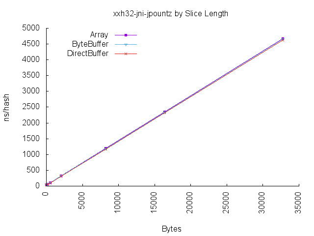

| Length |  Array | ByteBuffer | DirectBuffer |
| --- | ---: | ---: | ---: | 
| [32](#32-byte-slice-latency) | 41.931382 | 44.129020 | 33.006633 |
| [128](#128-byte-slice-latency) | 55.723651 | 56.256553 | 49.918906 |
| [512](#512-byte-slice-latency) | 108.918539 | 109.707556 | 99.663665 |
| [2048](#2048-byte-slice-latency) | 328.610205 | 328.506783 | 318.737103 |
| [8192](#8192-byte-slice-latency) | 1196.140517 | 1186.977864 | 1173.680361 |
| [16384](#16384-byte-slice-latency) | 2356.505384 | 2341.299662 | 2324.669202 |
| [32768](#32768-byte-slice-latency) | 4667.403483 | 4652.530423 | 4621.032100 |

---
### xxh32_safe_jpountz Latency
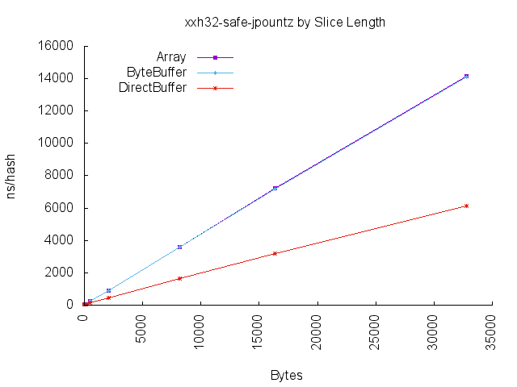

| Length |  Array | ByteBuffer | DirectBuffer |
| --- | ---: | ---: | ---: | 
| [32](#32-byte-slice-latency) | 25.268407 | 27.690253 | 26.710801 |
| [128](#128-byte-slice-latency) | 66.756224 | 68.842469 | 49.590282 |
| [512](#512-byte-slice-latency) | 234.983405 | 236.236876 | 127.417964 |
| [2048](#2048-byte-slice-latency) | 920.279230 | 908.898185 | 431.229772 |
| [8192](#8192-byte-slice-latency) | 3611.162859 | 3607.416292 | 1646.800814 |
| [16384](#16384-byte-slice-latency) | 7210.391151 | 7161.105878 | 3212.310690 |
| [32768](#32768-byte-slice-latency) | 14131.467590 | 14093.079072 | 6136.334566 |

---
### xxh32_unsafe_jpountz Latency
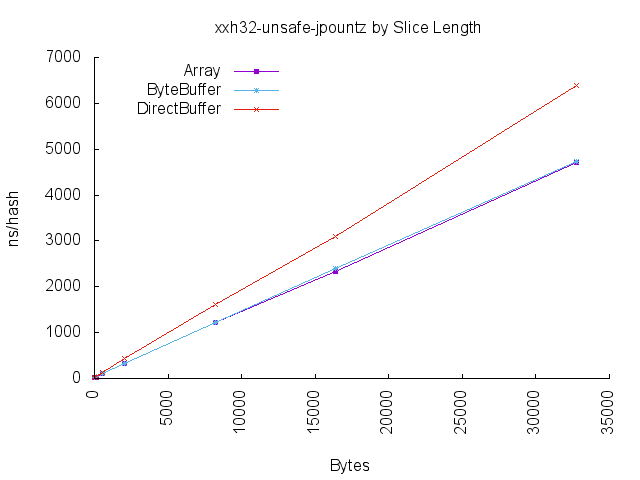

| Length |  Array | ByteBuffer | DirectBuffer |
| --- | ---: | ---: | ---: | 
| [32](#32-byte-slice-latency) | 14.179930 | 17.788305 | 26.542872 |
| [128](#128-byte-slice-latency) | 30.895100 | 32.711015 | 49.893586 |
| [512](#512-byte-slice-latency) | 98.618809 | 100.416755 | 127.427324 |
| [2048](#2048-byte-slice-latency) | 320.462219 | 322.649874 | 426.732538 |
| [8192](#8192-byte-slice-latency) | 1220.741856 | 1210.477276 | 1614.777266 |
| [16384](#16384-byte-slice-latency) | 2335.616398 | 2399.477333 | 3098.726437 |
| [32768](#32768-byte-slice-latency) | 4705.823088 | 4728.164430 | 6394.472378 |

---
### xxh64_jni_jpountz Latency
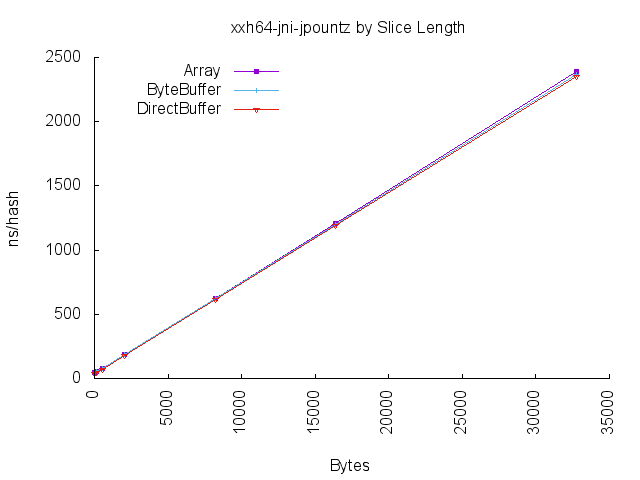

| Length |  Array | ByteBuffer | DirectBuffer |
| --- | ---: | ---: | ---: | 
| [32](#32-byte-slice-latency) | 44.570721 | 44.940414 | 35.612753 |
| [128](#128-byte-slice-latency) | 50.735327 | 52.830552 | 43.929457 |
| [512](#512-byte-slice-latency) | 78.434378 | 78.715060 | 69.322474 |
| [2048](#2048-byte-slice-latency) | 189.781579 | 190.312062 | 177.792733 |
| [8192](#8192-byte-slice-latency) | 624.217015 | 619.804612 | 617.605401 |
| [16384](#16384-byte-slice-latency) | 1205.553125 | 1197.927884 | 1192.414594 |
| [32768](#32768-byte-slice-latency) | 2387.550848 | 2365.415790 | 2353.407635 |

---
### xxh64_safe_jpountz Latency
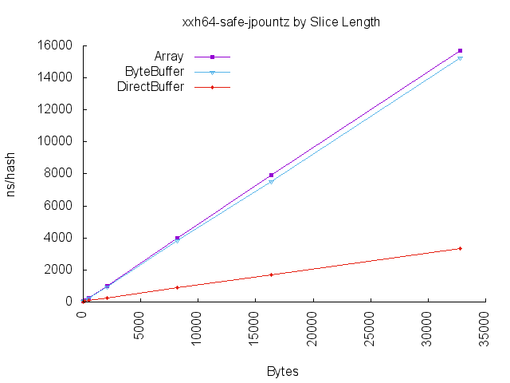

| Length |  Array | ByteBuffer | DirectBuffer |
| --- | ---: | ---: | ---: | 
| [32](#32-byte-slice-latency) | 28.615564 | 30.383474 | 21.874474 |
| [128](#128-byte-slice-latency) | 78.811309 | 77.074789 | 44.591452 |
| [512](#512-byte-slice-latency) | 263.176616 | 252.931994 | 94.951095 |
| [2048](#2048-byte-slice-latency) | 997.604725 | 958.941210 | 271.168501 |
| [8192](#8192-byte-slice-latency) | 3974.094265 | 3827.008725 | 891.761419 |
| [16384](#16384-byte-slice-latency) | 7907.471605 | 7538.524551 | 1715.649308 |
| [32768](#32768-byte-slice-latency) | 15718.910334 | 15242.738044 | 3359.510728 |

---
### xxh64_unsafe_jpountz Latency
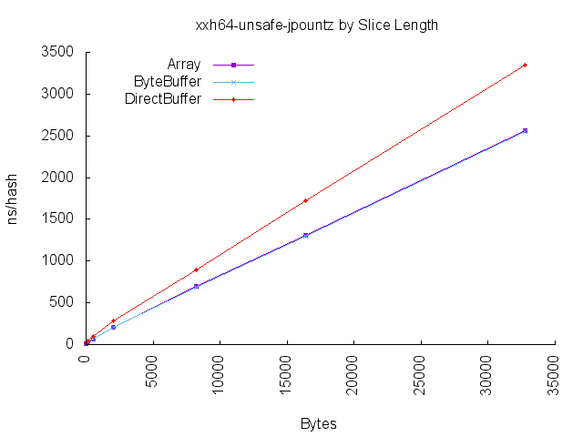

| Length |  Array | ByteBuffer | DirectBuffer |
| --- | ---: | ---: | ---: | 
| [32](#32-byte-slice-latency) | 16.310580 | 18.512925 | 21.864946 |
| [128](#128-byte-slice-latency) | 26.967484 | 28.730496 | 43.746722 |
| [512](#512-byte-slice-latency) | 67.823605 | 69.213738 | 96.290682 |
| [2048](#2048-byte-slice-latency) | 208.015960 | 208.591520 | 279.232504 |
| [8192](#8192-byte-slice-latency) | 695.306670 | 686.681179 | 888.703447 |
| [16384](#16384-byte-slice-latency) | 1311.952062 | 1301.782158 | 1719.948353 |
| [32768](#32768-byte-slice-latency) | 2557.828553 | 2546.559003 | 3349.101779 |

---
### xxh64_zah Latency
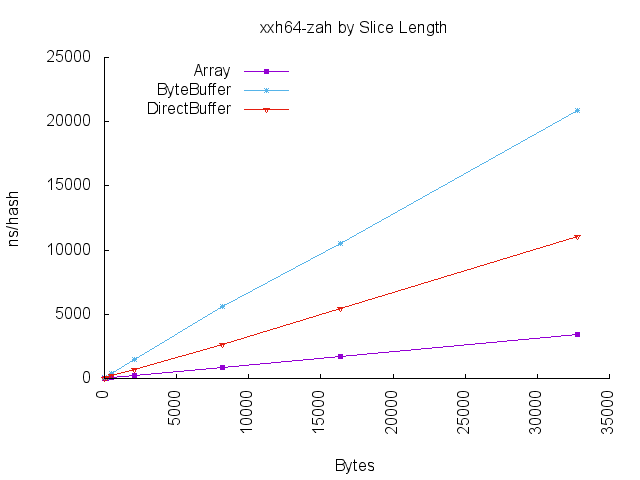

| Length |  Array | ByteBuffer | DirectBuffer |
| --- | ---: | ---: | ---: | 
| [32](#32-byte-slice-latency) | 19.815907 | 40.600707 | 31.114544 |
| [128](#128-byte-slice-latency) | 28.658477 | 108.130796 | 64.331864 |
| [512](#512-byte-slice-latency) | 79.517684 | 377.502845 | 207.512144 |
| [2048](#2048-byte-slice-latency) | 258.787213 | 1449.883695 | 729.568101 |
| [8192](#8192-byte-slice-latency) | 866.871826 | 5604.779043 | 2680.871279 |
| [16384](#16384-byte-slice-latency) | 1728.992516 | 10520.579071 | 5464.292386 |
| [32768](#32768-byte-slice-latency) | 3407.388537 | 20871.365346 | 11044.531925 |

---
Generated from [JMH CSV](jmh-result.csv) on Fri, 25 Sep 2015 05:58:29 +0000 by [Hash-Bench](https://github.com/benalexau/hash-bench).
