# Hash-Bench Results
## Contents
* Latency by Byte Slice Length
  * 32 bytes
    * [All Hashes](#32-byte-slice-latency-all-hashes)
    * [adler32](#32-byte-slice-latency-adler32)
    * [city64](#32-byte-slice-latency-city64)
    * [crc32](#32-byte-slice-latency-crc32)
    * [farmna](#32-byte-slice-latency-farmna)
    * [farmuo](#32-byte-slice-latency-farmuo)
    * [gfh32](#32-byte-slice-latency-gfh32)
    * [gfh64](#32-byte-slice-latency-gfh64)
    * [md5](#32-byte-slice-latency-md5)
    * [murmur3h128](#32-byte-slice-latency-murmur3h128)
    * [murmur3h32](#32-byte-slice-latency-murmur3h32)
    * [sha1](#32-byte-slice-latency-sha1)
    * [sha256](#32-byte-slice-latency-sha256)
    * [sha384](#32-byte-slice-latency-sha384)
    * [sha512](#32-byte-slice-latency-sha512)
    * [sip](#32-byte-slice-latency-sip)
    * [xxh32](#32-byte-slice-latency-xxh32)
    * [xxh64](#32-byte-slice-latency-xxh64)
  * 128 bytes
    * [All Hashes](#128-byte-slice-latency-all-hashes)
    * [adler32](#128-byte-slice-latency-adler32)
    * [city64](#128-byte-slice-latency-city64)
    * [crc32](#128-byte-slice-latency-crc32)
    * [farmna](#128-byte-slice-latency-farmna)
    * [farmuo](#128-byte-slice-latency-farmuo)
    * [gfh32](#128-byte-slice-latency-gfh32)
    * [gfh64](#128-byte-slice-latency-gfh64)
    * [md5](#128-byte-slice-latency-md5)
    * [murmur3h128](#128-byte-slice-latency-murmur3h128)
    * [murmur3h32](#128-byte-slice-latency-murmur3h32)
    * [sha1](#128-byte-slice-latency-sha1)
    * [sha256](#128-byte-slice-latency-sha256)
    * [sha384](#128-byte-slice-latency-sha384)
    * [sha512](#128-byte-slice-latency-sha512)
    * [sip](#128-byte-slice-latency-sip)
    * [xxh32](#128-byte-slice-latency-xxh32)
    * [xxh64](#128-byte-slice-latency-xxh64)
  * 512 bytes
    * [All Hashes](#512-byte-slice-latency-all-hashes)
    * [adler32](#512-byte-slice-latency-adler32)
    * [city64](#512-byte-slice-latency-city64)
    * [crc32](#512-byte-slice-latency-crc32)
    * [farmna](#512-byte-slice-latency-farmna)
    * [farmuo](#512-byte-slice-latency-farmuo)
    * [gfh32](#512-byte-slice-latency-gfh32)
    * [gfh64](#512-byte-slice-latency-gfh64)
    * [md5](#512-byte-slice-latency-md5)
    * [murmur3h128](#512-byte-slice-latency-murmur3h128)
    * [murmur3h32](#512-byte-slice-latency-murmur3h32)
    * [sha1](#512-byte-slice-latency-sha1)
    * [sha256](#512-byte-slice-latency-sha256)
    * [sha384](#512-byte-slice-latency-sha384)
    * [sha512](#512-byte-slice-latency-sha512)
    * [sip](#512-byte-slice-latency-sip)
    * [xxh32](#512-byte-slice-latency-xxh32)
    * [xxh64](#512-byte-slice-latency-xxh64)
  * 2048 bytes
    * [All Hashes](#2048-byte-slice-latency-all-hashes)
    * [adler32](#2048-byte-slice-latency-adler32)
    * [city64](#2048-byte-slice-latency-city64)
    * [crc32](#2048-byte-slice-latency-crc32)
    * [farmna](#2048-byte-slice-latency-farmna)
    * [farmuo](#2048-byte-slice-latency-farmuo)
    * [gfh32](#2048-byte-slice-latency-gfh32)
    * [gfh64](#2048-byte-slice-latency-gfh64)
    * [md5](#2048-byte-slice-latency-md5)
    * [murmur3h128](#2048-byte-slice-latency-murmur3h128)
    * [murmur3h32](#2048-byte-slice-latency-murmur3h32)
    * [sha1](#2048-byte-slice-latency-sha1)
    * [sha256](#2048-byte-slice-latency-sha256)
    * [sha384](#2048-byte-slice-latency-sha384)
    * [sha512](#2048-byte-slice-latency-sha512)
    * [sip](#2048-byte-slice-latency-sip)
    * [xxh32](#2048-byte-slice-latency-xxh32)
    * [xxh64](#2048-byte-slice-latency-xxh64)
  * 8192 bytes
    * [All Hashes](#8192-byte-slice-latency-all-hashes)
    * [adler32](#8192-byte-slice-latency-adler32)
    * [city64](#8192-byte-slice-latency-city64)
    * [crc32](#8192-byte-slice-latency-crc32)
    * [farmna](#8192-byte-slice-latency-farmna)
    * [farmuo](#8192-byte-slice-latency-farmuo)
    * [gfh32](#8192-byte-slice-latency-gfh32)
    * [gfh64](#8192-byte-slice-latency-gfh64)
    * [md5](#8192-byte-slice-latency-md5)
    * [murmur3h128](#8192-byte-slice-latency-murmur3h128)
    * [murmur3h32](#8192-byte-slice-latency-murmur3h32)
    * [sha1](#8192-byte-slice-latency-sha1)
    * [sha256](#8192-byte-slice-latency-sha256)
    * [sha384](#8192-byte-slice-latency-sha384)
    * [sha512](#8192-byte-slice-latency-sha512)
    * [sip](#8192-byte-slice-latency-sip)
    * [xxh32](#8192-byte-slice-latency-xxh32)
    * [xxh64](#8192-byte-slice-latency-xxh64)
  * 16384 bytes
    * [All Hashes](#16384-byte-slice-latency-all-hashes)
    * [adler32](#16384-byte-slice-latency-adler32)
    * [city64](#16384-byte-slice-latency-city64)
    * [crc32](#16384-byte-slice-latency-crc32)
    * [farmna](#16384-byte-slice-latency-farmna)
    * [farmuo](#16384-byte-slice-latency-farmuo)
    * [gfh32](#16384-byte-slice-latency-gfh32)
    * [gfh64](#16384-byte-slice-latency-gfh64)
    * [md5](#16384-byte-slice-latency-md5)
    * [murmur3h128](#16384-byte-slice-latency-murmur3h128)
    * [murmur3h32](#16384-byte-slice-latency-murmur3h32)
    * [sha1](#16384-byte-slice-latency-sha1)
    * [sha256](#16384-byte-slice-latency-sha256)
    * [sha384](#16384-byte-slice-latency-sha384)
    * [sha512](#16384-byte-slice-latency-sha512)
    * [sip](#16384-byte-slice-latency-sip)
    * [xxh32](#16384-byte-slice-latency-xxh32)
    * [xxh64](#16384-byte-slice-latency-xxh64)
  * 32768 bytes
    * [All Hashes](#32768-byte-slice-latency-all-hashes)
    * [adler32](#32768-byte-slice-latency-adler32)
    * [city64](#32768-byte-slice-latency-city64)
    * [crc32](#32768-byte-slice-latency-crc32)
    * [farmna](#32768-byte-slice-latency-farmna)
    * [farmuo](#32768-byte-slice-latency-farmuo)
    * [gfh32](#32768-byte-slice-latency-gfh32)
    * [gfh64](#32768-byte-slice-latency-gfh64)
    * [md5](#32768-byte-slice-latency-md5)
    * [murmur3h128](#32768-byte-slice-latency-murmur3h128)
    * [murmur3h32](#32768-byte-slice-latency-murmur3h32)
    * [sha1](#32768-byte-slice-latency-sha1)
    * [sha256](#32768-byte-slice-latency-sha256)
    * [sha384](#32768-byte-slice-latency-sha384)
    * [sha512](#32768-byte-slice-latency-sha512)
    * [sip](#32768-byte-slice-latency-sip)
    * [xxh32](#32768-byte-slice-latency-xxh32)
    * [xxh64](#32768-byte-slice-latency-xxh64)
* Latency by Algorithm
  * [adler32-guava](#adler32-guava-latency)
  * [adler32-jre](#adler32-jre-latency)
  * [city64-zah](#city64-zah-latency)
  * [crc32-guava-delegating](#crc32-guava-delegating-latency)
  * [crc32-guava-rfc3720](#crc32-guava-rfc3720-latency)
  * [crc32-jre](#crc32-jre-latency)
  * [farmna-zah](#farmna-zah-latency)
  * [farmuo-zah](#farmuo-zah-latency)
  * [gfh32-guava](#gfh32-guava-latency)
  * [gfh64-guava](#gfh64-guava-latency)
  * [md5-guava](#md5-guava-latency)
  * [murmur3h128-guava](#murmur3h128-guava-latency)
  * [murmur3h128-zah](#murmur3h128-zah-latency)
  * [murmur3h32-guava](#murmur3h32-guava-latency)
  * [sha1-guava](#sha1-guava-latency)
  * [sha256-guava](#sha256-guava-latency)
  * [sha384-guava](#sha384-guava-latency)
  * [sha512-guava](#sha512-guava-latency)
  * [sip-fwdeng](#sip-fwdeng-latency)
  * [sip-guava](#sip-guava-latency)
  * [sip-inline](#sip-inline-latency)
  * [xxh32-jpountz-jni](#xxh32-jpountz-jni-latency)
  * [xxh32-jpountz-safe](#xxh32-jpountz-safe-latency)
  * [xxh32-pountz-unsafe](#xxh32-pountz-unsafe-latency)
  * [xxh64-jpountz-jni](#xxh64-jpountz-jni-latency)
  * [xxh64-jpountz-safe](#xxh64-jpountz-safe-latency)
  * [xxh64-jpountz-unsafe](#xxh64-jpountz-unsafe-latency)
  * [xxh64-zah](#xxh64-zah-latency)

---
### 32 Byte Slice Latency (All Hashes)
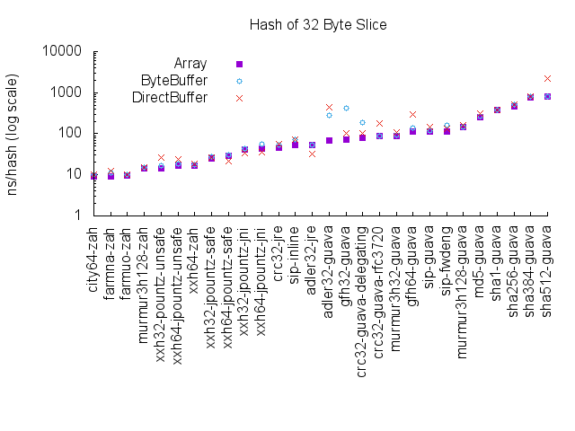

| Algorithm |  Array | ByteBuffer | DirectBuffer |
| --- | ---: | ---: | ---: | 
| [city64-zah](#city64-zah-latency) | 9.305198 | 9.978260 | 10.270309 |
| [farmna-zah](#farmna-zah-latency) | 9.318889 | 11.089306 | 12.435866 |
| [farmuo-zah](#farmuo-zah-latency) | 9.543668 | 9.890599 | 10.181759 |
| [murmur3h128-zah](#murmur3h128-zah-latency) | 14.187194 | 14.816279 | 15.424621 |
| [xxh32-pountz-unsafe](#xxh32-pountz-unsafe-latency) | 14.377955 | 16.747627 | 26.705499 |
| [xxh64-jpountz-unsafe](#xxh64-jpountz-unsafe-latency) | 16.376226 | 18.491530 | 23.900593 |
| [xxh64-zah](#xxh64-zah-latency) | 16.652337 | 17.335254 | 18.093858 |
| [xxh32-jpountz-safe](#xxh32-jpountz-safe-latency) | 25.102526 | 27.732716 | 26.564007 |
| [xxh64-jpountz-safe](#xxh64-jpountz-safe-latency) | 28.635874 | 30.697939 | 21.771566 |
| [xxh32-jpountz-jni](#xxh32-jpountz-jni-latency) | 42.020588 | 43.212266 | 33.348429 |
| [xxh64-jpountz-jni](#xxh64-jpountz-jni-latency) | 44.132549 | 55.304329 | 35.272471 |
| [crc32-jre](#crc32-jre-latency) | 46.249007 | 52.524491 | 55.148369 |
| [sip-inline](#sip-inline-latency) | 53.217922 | 73.818454 | 73.598440 |
| [adler32-jre](#adler32-jre-latency) | 53.687740 | 54.103057 | 31.668335 |
| [adler32-guava](#adler32-guava-latency) | 70.228312 | 276.800252 | 441.129543 |
| [gfh32-guava](#gfh32-guava-latency) | 73.903763 | 426.521775 | 103.386096 |
| [crc32-guava-delegating](#crc32-guava-delegating-latency) | 78.337958 | 189.419387 | 103.814422 |
| [crc32-guava-rfc3720](#crc32-guava-rfc3720-latency) | 86.610668 | 87.137662 | 179.074493 |
| [murmur3h32-guava](#murmur3h32-guava-latency) | 88.787669 | 90.826119 | 105.705922 |
| [gfh64-guava](#gfh64-guava-latency) | 113.700324 | 138.290741 | 294.797689 |
| [sip-guava](#sip-guava-latency) | 114.210181 | 117.734772 | 144.370386 |
| [sip-fwdeng](#sip-fwdeng-latency) | 115.911599 | 160.256986 | 130.118900 |
| [murmur3h128-guava](#murmur3h128-guava-latency) | 143.932781 | 143.667593 | 161.442102 |
| [md5-guava](#md5-guava-latency) | 256.252213 | 264.576888 | 304.423085 |
| [sha1-guava](#sha1-guava-latency) | 373.647209 | 377.206715 | 376.714958 |
| [sha256-guava](#sha256-guava-latency) | 474.348048 | 513.363823 | 508.145193 |
| [sha384-guava](#sha384-guava-latency) | 783.414616 | 809.091938 | 815.982830 |
| [sha512-guava](#sha512-guava-latency) | 809.826353 | 809.898284 | 2193.189417 |

---
### 32 Byte Slice Latency (adler32)
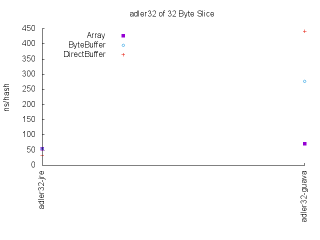

| Algorithm |  Array | ByteBuffer | DirectBuffer |
| --- | ---: | ---: | ---: | 
| [adler32-jre](#adler32-jre-latency) | 53.687740 | 54.103057 | 31.668335 |
| [adler32-guava](#adler32-guava-latency) | 70.228312 | 276.800252 | 441.129543 |

---
### 32 Byte Slice Latency (city64)
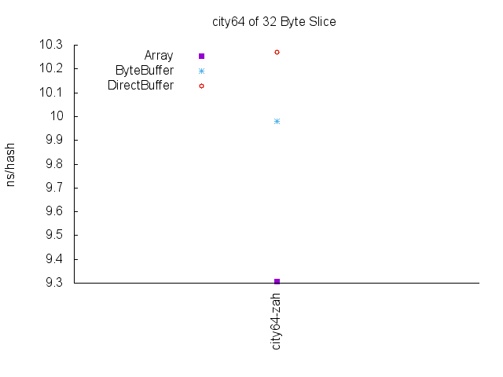

| Algorithm |  Array | ByteBuffer | DirectBuffer |
| --- | ---: | ---: | ---: | 
| [city64-zah](#city64-zah-latency) | 9.305198 | 9.978260 | 10.270309 |

---
### 32 Byte Slice Latency (crc32)
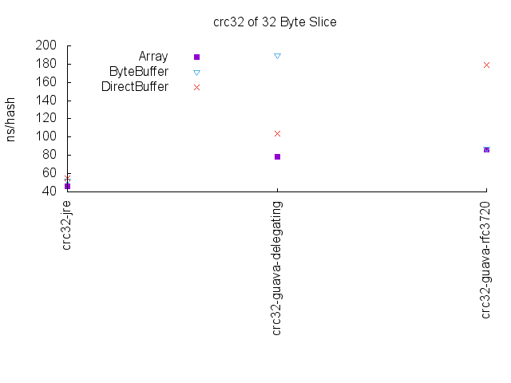

| Algorithm |  Array | ByteBuffer | DirectBuffer |
| --- | ---: | ---: | ---: | 
| [crc32-jre](#crc32-jre-latency) | 46.249007 | 52.524491 | 55.148369 |
| [crc32-guava-delegating](#crc32-guava-delegating-latency) | 78.337958 | 189.419387 | 103.814422 |
| [crc32-guava-rfc3720](#crc32-guava-rfc3720-latency) | 86.610668 | 87.137662 | 179.074493 |

---
### 32 Byte Slice Latency (farmna)
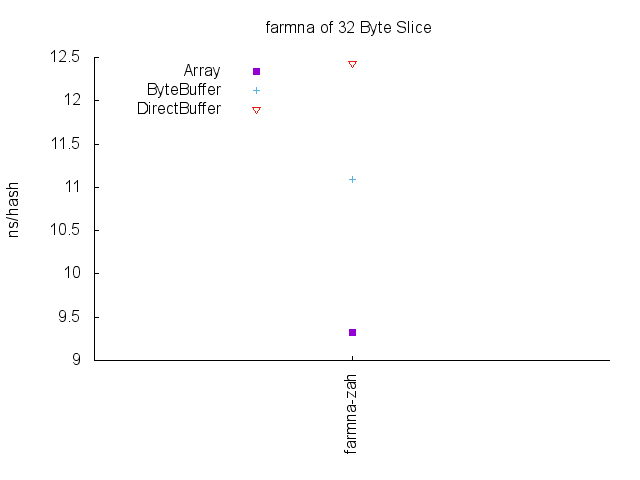

| Algorithm |  Array | ByteBuffer | DirectBuffer |
| --- | ---: | ---: | ---: | 
| [farmna-zah](#farmna-zah-latency) | 9.318889 | 11.089306 | 12.435866 |

---
### 32 Byte Slice Latency (farmuo)
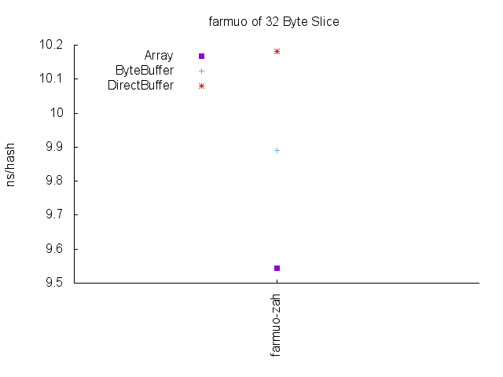

| Algorithm |  Array | ByteBuffer | DirectBuffer |
| --- | ---: | ---: | ---: | 
| [farmuo-zah](#farmuo-zah-latency) | 9.543668 | 9.890599 | 10.181759 |

---
### 32 Byte Slice Latency (gfh32)
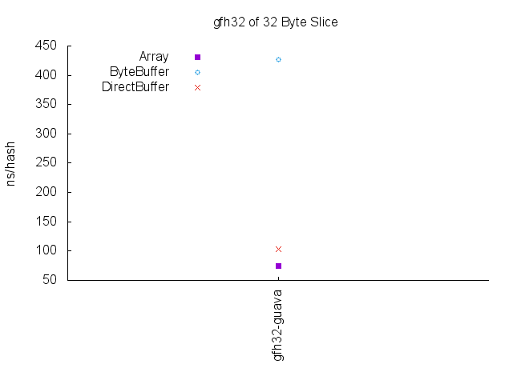

| Algorithm |  Array | ByteBuffer | DirectBuffer |
| --- | ---: | ---: | ---: | 
| [gfh32-guava](#gfh32-guava-latency) | 73.903763 | 426.521775 | 103.386096 |

---
### 32 Byte Slice Latency (gfh64)
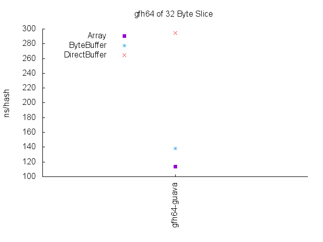

| Algorithm |  Array | ByteBuffer | DirectBuffer |
| --- | ---: | ---: | ---: | 
| [gfh64-guava](#gfh64-guava-latency) | 113.700324 | 138.290741 | 294.797689 |

---
### 32 Byte Slice Latency (md5)
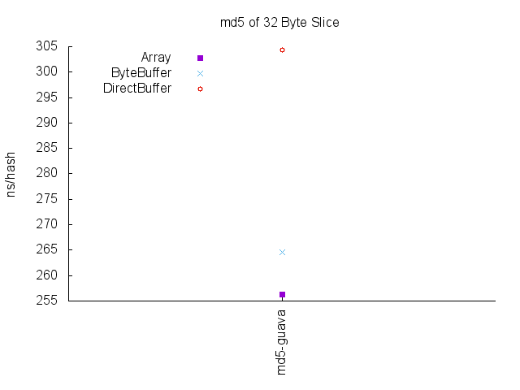

| Algorithm |  Array | ByteBuffer | DirectBuffer |
| --- | ---: | ---: | ---: | 
| [md5-guava](#md5-guava-latency) | 256.252213 | 264.576888 | 304.423085 |

---
### 32 Byte Slice Latency (murmur3h128)
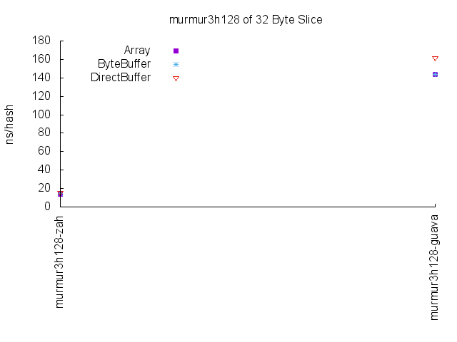

| Algorithm |  Array | ByteBuffer | DirectBuffer |
| --- | ---: | ---: | ---: | 
| [murmur3h128-zah](#murmur3h128-zah-latency) | 14.187194 | 14.816279 | 15.424621 |
| [murmur3h128-guava](#murmur3h128-guava-latency) | 143.932781 | 143.667593 | 161.442102 |

---
### 32 Byte Slice Latency (murmur3h32)
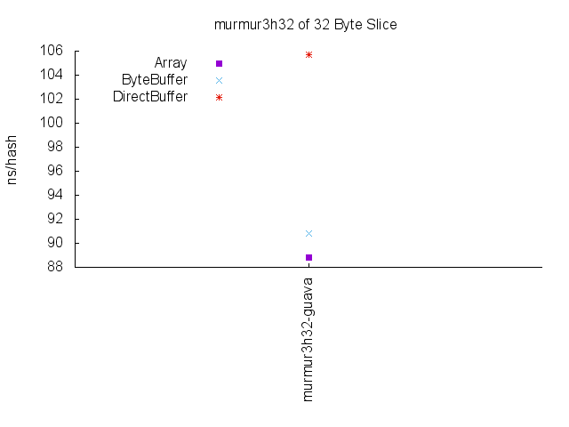

| Algorithm |  Array | ByteBuffer | DirectBuffer |
| --- | ---: | ---: | ---: | 
| [murmur3h32-guava](#murmur3h32-guava-latency) | 88.787669 | 90.826119 | 105.705922 |

---
### 32 Byte Slice Latency (sha1)
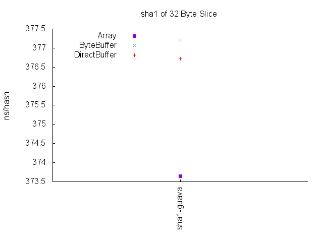

| Algorithm |  Array | ByteBuffer | DirectBuffer |
| --- | ---: | ---: | ---: | 
| [sha1-guava](#sha1-guava-latency) | 373.647209 | 377.206715 | 376.714958 |

---
### 32 Byte Slice Latency (sha256)
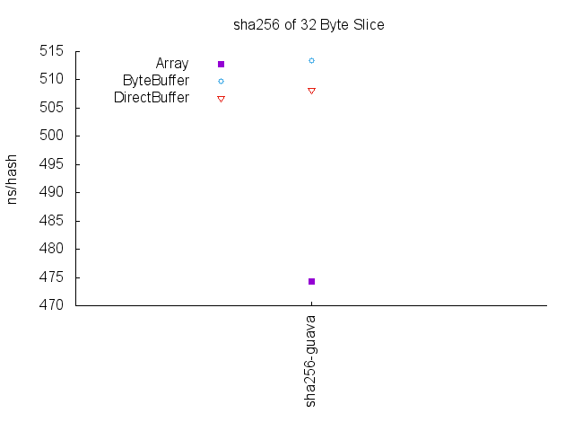

| Algorithm |  Array | ByteBuffer | DirectBuffer |
| --- | ---: | ---: | ---: | 
| [sha256-guava](#sha256-guava-latency) | 474.348048 | 513.363823 | 508.145193 |

---
### 32 Byte Slice Latency (sha384)

| Algorithm |  Array | ByteBuffer | DirectBuffer |
| --- | ---: | ---: | ---: | 
| [sha384-guava](#sha384-guava-latency) | 783.414616 | 809.091938 | 815.982830 |

---
### 32 Byte Slice Latency (sha512)

| Algorithm |  Array | ByteBuffer | DirectBuffer |
| --- | ---: | ---: | ---: | 
| [sha512-guava](#sha512-guava-latency) | 809.826353 | 809.898284 | 2193.189417 |

---
### 32 Byte Slice Latency (sip)
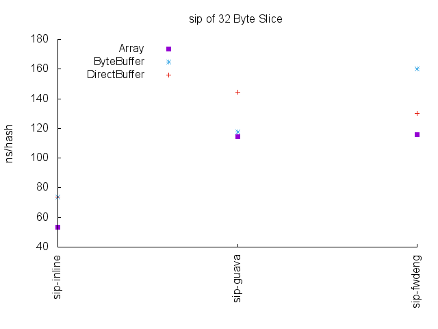

| Algorithm |  Array | ByteBuffer | DirectBuffer |
| --- | ---: | ---: | ---: | 
| [sip-inline](#sip-inline-latency) | 53.217922 | 73.818454 | 73.598440 |
| [sip-guava](#sip-guava-latency) | 114.210181 | 117.734772 | 144.370386 |
| [sip-fwdeng](#sip-fwdeng-latency) | 115.911599 | 160.256986 | 130.118900 |

---
### 32 Byte Slice Latency (xxh32)
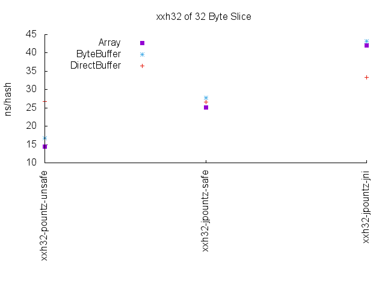

| Algorithm |  Array | ByteBuffer | DirectBuffer |
| --- | ---: | ---: | ---: | 
| [xxh32-pountz-unsafe](#xxh32-pountz-unsafe-latency) | 14.377955 | 16.747627 | 26.705499 |
| [xxh32-jpountz-safe](#xxh32-jpountz-safe-latency) | 25.102526 | 27.732716 | 26.564007 |
| [xxh32-jpountz-jni](#xxh32-jpountz-jni-latency) | 42.020588 | 43.212266 | 33.348429 |

---
### 32 Byte Slice Latency (xxh64)
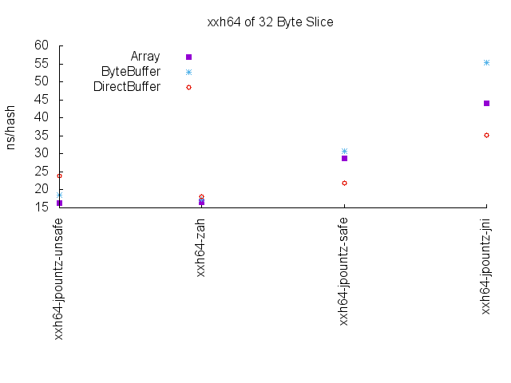

| Algorithm |  Array | ByteBuffer | DirectBuffer |
| --- | ---: | ---: | ---: | 
| [xxh64-jpountz-unsafe](#xxh64-jpountz-unsafe-latency) | 16.376226 | 18.491530 | 23.900593 |
| [xxh64-zah](#xxh64-zah-latency) | 16.652337 | 17.335254 | 18.093858 |
| [xxh64-jpountz-safe](#xxh64-jpountz-safe-latency) | 28.635874 | 30.697939 | 21.771566 |
| [xxh64-jpountz-jni](#xxh64-jpountz-jni-latency) | 44.132549 | 55.304329 | 35.272471 |

---
### 128 Byte Slice Latency (All Hashes)
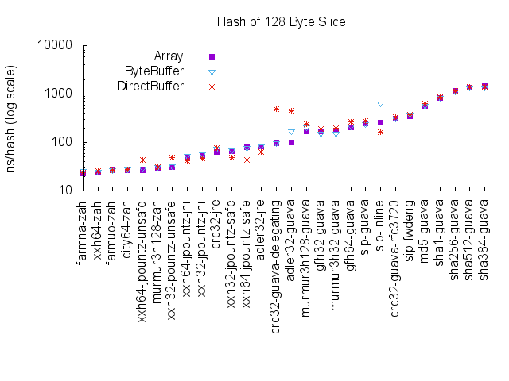

| Algorithm |  Array | ByteBuffer | DirectBuffer |
| --- | ---: | ---: | ---: | 
| [farmna-zah](#farmna-zah-latency) | 23.135849 | 25.234939 | 23.730196 |
| [xxh64-zah](#xxh64-zah-latency) | 23.733747 | 24.961086 | 25.307009 |
| [farmuo-zah](#farmuo-zah-latency) | 26.187915 | 26.662388 | 26.868761 |
| [city64-zah](#city64-zah-latency) | 26.859760 | 27.475395 | 27.600570 |
| [xxh64-jpountz-unsafe](#xxh64-jpountz-unsafe-latency) | 27.067989 | 28.960901 | 43.815873 |
| [murmur3h128-zah](#murmur3h128-zah-latency) | 30.202873 | 31.331673 | 31.468840 |
| [xxh32-pountz-unsafe](#xxh32-pountz-unsafe-latency) | 30.889040 | 32.647382 | 49.657725 |
| [xxh64-jpountz-jni](#xxh64-jpountz-jni-latency) | 50.222542 | 52.626190 | 41.962187 |
| [xxh32-jpountz-jni](#xxh32-jpountz-jni-latency) | 55.155205 | 57.301066 | 46.936454 |
| [crc32-jre](#crc32-jre-latency) | 64.757482 | 72.871861 | 75.660112 |
| [xxh32-jpountz-safe](#xxh32-jpountz-safe-latency) | 66.604318 | 69.739320 | 49.616772 |
| [xxh64-jpountz-safe](#xxh64-jpountz-safe-latency) | 78.353303 | 78.213624 | 43.777337 |
| [adler32-jre](#adler32-jre-latency) | 84.127674 | 83.854544 | 62.512425 |
| [crc32-guava-delegating](#crc32-guava-delegating-latency) | 95.486455 | 94.579462 | 481.371634 |
| [adler32-guava](#adler32-guava-latency) | 99.961990 | 170.484976 | 448.311493 |
| [murmur3h128-guava](#murmur3h128-guava-latency) | 169.072641 | 206.201028 | 235.070169 |
| [gfh32-guava](#gfh32-guava-latency) | 171.159509 | 150.877728 | 189.236132 |
| [murmur3h32-guava](#murmur3h32-guava-latency) | 175.429601 | 151.141668 | 195.444081 |
| [gfh64-guava](#gfh64-guava-latency) | 204.238034 | 210.886580 | 265.027823 |
| [sip-guava](#sip-guava-latency) | 245.128540 | 238.690821 | 275.086154 |
| [sip-inline](#sip-inline-latency) | 260.648982 | 631.553650 | 165.171154 |
| [crc32-guava-rfc3720](#crc32-guava-rfc3720-latency) | 306.437899 | 310.139085 | 329.198145 |
| [sip-fwdeng](#sip-fwdeng-latency) | 351.891534 | 378.130783 | 372.295617 |
| [md5-guava](#md5-guava-latency) | 562.783425 | 570.851746 | 627.886164 |
| [sha1-guava](#sha1-guava-latency) | 821.405600 | 841.758671 | 865.951756 |
| [sha256-guava](#sha256-guava-latency) | 1145.344054 | 1132.934457 | 1170.367892 |
| [sha512-guava](#sha512-guava-latency) | 1359.388914 | 1336.211081 | 1416.478714 |
| [sha384-guava](#sha384-guava-latency) | 1453.544450 | 1356.585091 | 1388.182188 |

---
### 128 Byte Slice Latency (adler32)
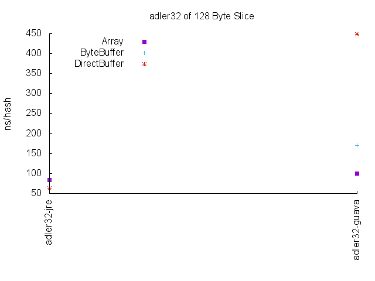

| Algorithm |  Array | ByteBuffer | DirectBuffer |
| --- | ---: | ---: | ---: | 
| [adler32-jre](#adler32-jre-latency) | 84.127674 | 83.854544 | 62.512425 |
| [adler32-guava](#adler32-guava-latency) | 99.961990 | 170.484976 | 448.311493 |

---
### 128 Byte Slice Latency (city64)
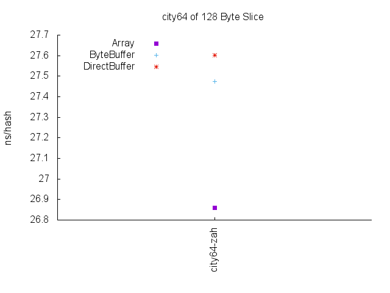

| Algorithm |  Array | ByteBuffer | DirectBuffer |
| --- | ---: | ---: | ---: | 
| [city64-zah](#city64-zah-latency) | 26.859760 | 27.475395 | 27.600570 |

---
### 128 Byte Slice Latency (crc32)
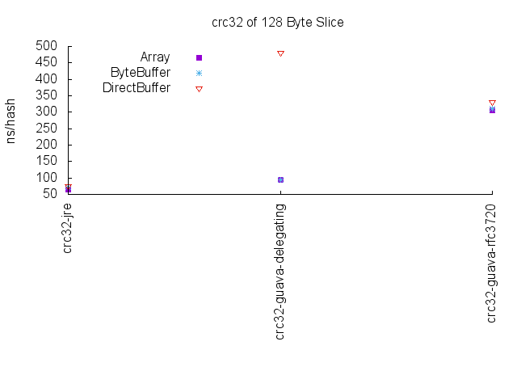

| Algorithm |  Array | ByteBuffer | DirectBuffer |
| --- | ---: | ---: | ---: | 
| [crc32-jre](#crc32-jre-latency) | 64.757482 | 72.871861 | 75.660112 |
| [crc32-guava-delegating](#crc32-guava-delegating-latency) | 95.486455 | 94.579462 | 481.371634 |
| [crc32-guava-rfc3720](#crc32-guava-rfc3720-latency) | 306.437899 | 310.139085 | 329.198145 |

---
### 128 Byte Slice Latency (farmna)

| Algorithm |  Array | ByteBuffer | DirectBuffer |
| --- | ---: | ---: | ---: | 
| [farmna-zah](#farmna-zah-latency) | 23.135849 | 25.234939 | 23.730196 |

---
### 128 Byte Slice Latency (farmuo)
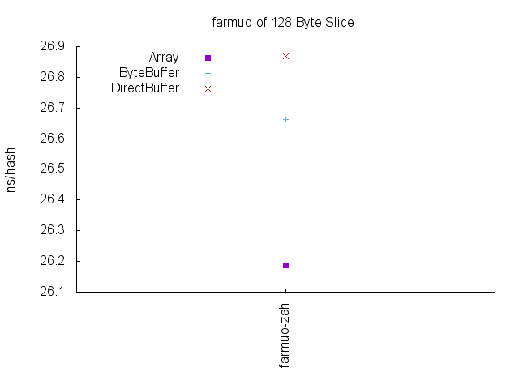

| Algorithm |  Array | ByteBuffer | DirectBuffer |
| --- | ---: | ---: | ---: | 
| [farmuo-zah](#farmuo-zah-latency) | 26.187915 | 26.662388 | 26.868761 |

---
### 128 Byte Slice Latency (gfh32)
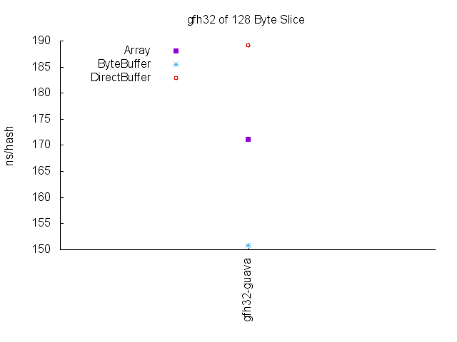

| Algorithm |  Array | ByteBuffer | DirectBuffer |
| --- | ---: | ---: | ---: | 
| [gfh32-guava](#gfh32-guava-latency) | 171.159509 | 150.877728 | 189.236132 |

---
### 128 Byte Slice Latency (gfh64)
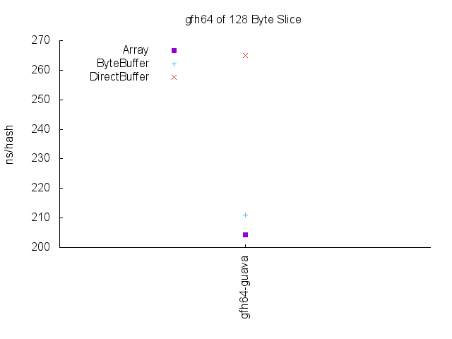

| Algorithm |  Array | ByteBuffer | DirectBuffer |
| --- | ---: | ---: | ---: | 
| [gfh64-guava](#gfh64-guava-latency) | 204.238034 | 210.886580 | 265.027823 |

---
### 128 Byte Slice Latency (md5)
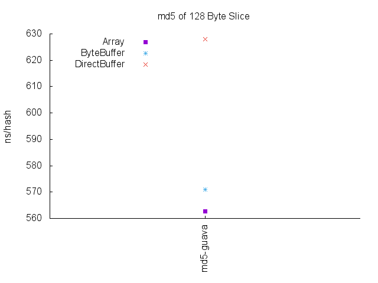

| Algorithm |  Array | ByteBuffer | DirectBuffer |
| --- | ---: | ---: | ---: | 
| [md5-guava](#md5-guava-latency) | 562.783425 | 570.851746 | 627.886164 |

---
### 128 Byte Slice Latency (murmur3h128)

| Algorithm |  Array | ByteBuffer | DirectBuffer |
| --- | ---: | ---: | ---: | 
| [murmur3h128-zah](#murmur3h128-zah-latency) | 30.202873 | 31.331673 | 31.468840 |
| [murmur3h128-guava](#murmur3h128-guava-latency) | 169.072641 | 206.201028 | 235.070169 |

---
### 128 Byte Slice Latency (murmur3h32)
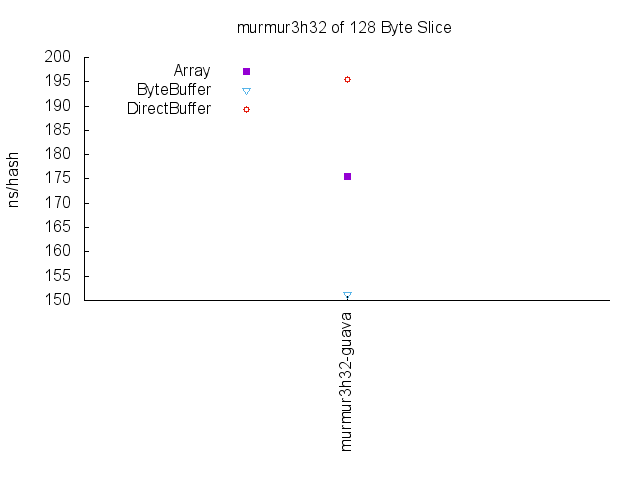

| Algorithm |  Array | ByteBuffer | DirectBuffer |
| --- | ---: | ---: | ---: | 
| [murmur3h32-guava](#murmur3h32-guava-latency) | 175.429601 | 151.141668 | 195.444081 |

---
### 128 Byte Slice Latency (sha1)
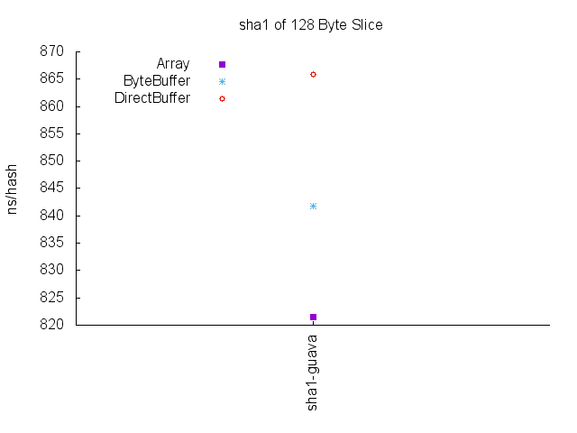

| Algorithm |  Array | ByteBuffer | DirectBuffer |
| --- | ---: | ---: | ---: | 
| [sha1-guava](#sha1-guava-latency) | 821.405600 | 841.758671 | 865.951756 |

---
### 128 Byte Slice Latency (sha256)
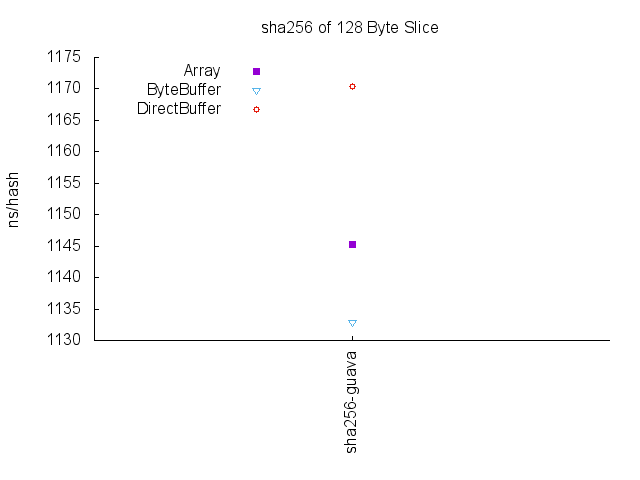

| Algorithm |  Array | ByteBuffer | DirectBuffer |
| --- | ---: | ---: | ---: | 
| [sha256-guava](#sha256-guava-latency) | 1145.344054 | 1132.934457 | 1170.367892 |

---
### 128 Byte Slice Latency (sha384)
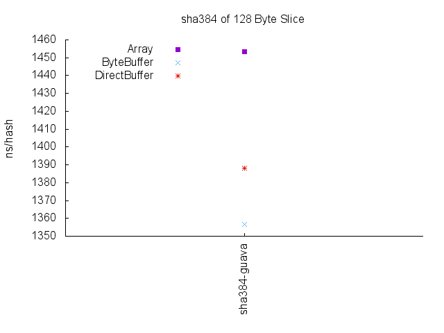

| Algorithm |  Array | ByteBuffer | DirectBuffer |
| --- | ---: | ---: | ---: | 
| [sha384-guava](#sha384-guava-latency) | 1453.544450 | 1356.585091 | 1388.182188 |

---
### 128 Byte Slice Latency (sha512)
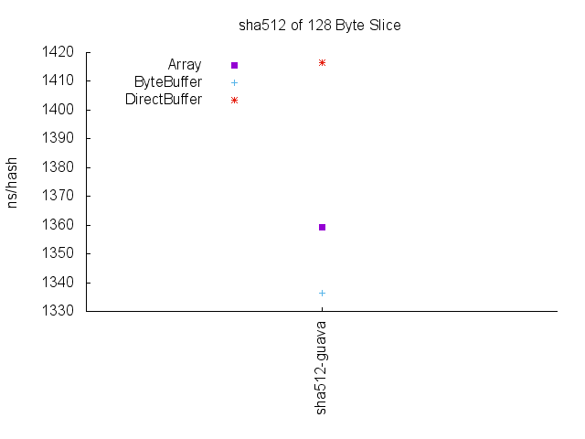

| Algorithm |  Array | ByteBuffer | DirectBuffer |
| --- | ---: | ---: | ---: | 
| [sha512-guava](#sha512-guava-latency) | 1359.388914 | 1336.211081 | 1416.478714 |

---
### 128 Byte Slice Latency (sip)
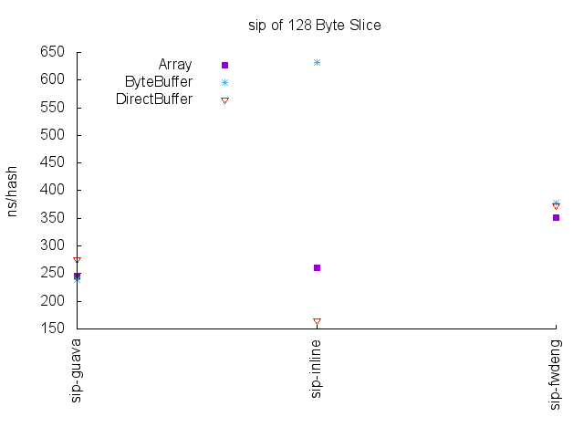

| Algorithm |  Array | ByteBuffer | DirectBuffer |
| --- | ---: | ---: | ---: | 
| [sip-guava](#sip-guava-latency) | 245.128540 | 238.690821 | 275.086154 |
| [sip-inline](#sip-inline-latency) | 260.648982 | 631.553650 | 165.171154 |
| [sip-fwdeng](#sip-fwdeng-latency) | 351.891534 | 378.130783 | 372.295617 |

---
### 128 Byte Slice Latency (xxh32)
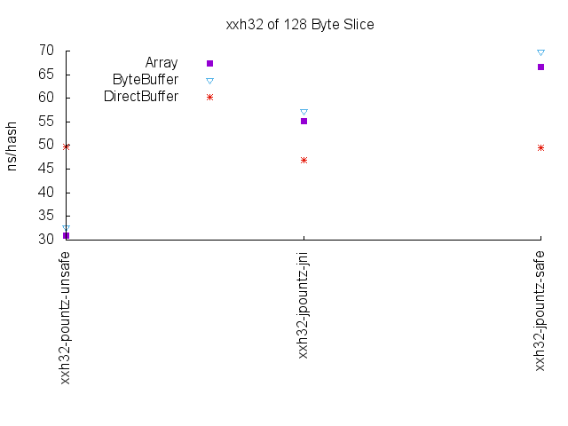

| Algorithm |  Array | ByteBuffer | DirectBuffer |
| --- | ---: | ---: | ---: | 
| [xxh32-pountz-unsafe](#xxh32-pountz-unsafe-latency) | 30.889040 | 32.647382 | 49.657725 |
| [xxh32-jpountz-jni](#xxh32-jpountz-jni-latency) | 55.155205 | 57.301066 | 46.936454 |
| [xxh32-jpountz-safe](#xxh32-jpountz-safe-latency) | 66.604318 | 69.739320 | 49.616772 |

---
### 128 Byte Slice Latency (xxh64)
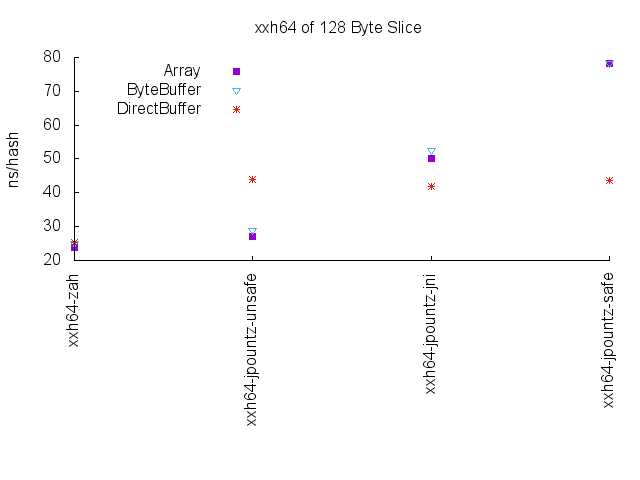

| Algorithm |  Array | ByteBuffer | DirectBuffer |
| --- | ---: | ---: | ---: | 
| [xxh64-zah](#xxh64-zah-latency) | 23.733747 | 24.961086 | 25.307009 |
| [xxh64-jpountz-unsafe](#xxh64-jpountz-unsafe-latency) | 27.067989 | 28.960901 | 43.815873 |
| [xxh64-jpountz-jni](#xxh64-jpountz-jni-latency) | 50.222542 | 52.626190 | 41.962187 |
| [xxh64-jpountz-safe](#xxh64-jpountz-safe-latency) | 78.353303 | 78.213624 | 43.777337 |

---
### 512 Byte Slice Latency (All Hashes)
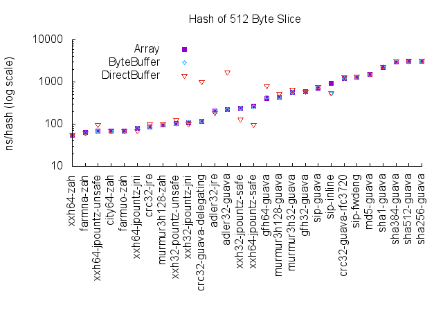

| Algorithm |  Array | ByteBuffer | DirectBuffer |
| --- | ---: | ---: | ---: | 
| [xxh64-zah](#xxh64-zah-latency) | 54.178686 | 55.529989 | 55.981312 |
| [farmna-zah](#farmna-zah-latency) | 62.507336 | 60.854187 | 60.123589 |
| [xxh64-jpountz-unsafe](#xxh64-jpountz-unsafe-latency) | 67.403677 | 69.790258 | 95.568604 |
| [city64-zah](#city64-zah-latency) | 68.884280 | 69.081371 | 69.182416 |
| [farmuo-zah](#farmuo-zah-latency) | 69.724510 | 69.613480 | 69.356702 |
| [xxh64-jpountz-jni](#xxh64-jpountz-jni-latency) | 78.290332 | 79.322221 | 68.614942 |
| [crc32-jre](#crc32-jre-latency) | 87.208768 | 86.054930 | 99.229936 |
| [murmur3h128-zah](#murmur3h128-zah-latency) | 94.557319 | 97.421597 | 99.494060 |
| [xxh32-pountz-unsafe](#xxh32-pountz-unsafe-latency) | 102.600833 | 99.998160 | 127.551612 |
| [xxh32-jpountz-jni](#xxh32-jpountz-jni-latency) | 109.334147 | 111.477262 | 99.894591 |
| [crc32-guava-delegating](#crc32-guava-delegating-latency) | 117.734924 | 115.299355 | 1002.368512 |
| [adler32-jre](#adler32-jre-latency) | 208.548364 | 206.560098 | 186.245926 |
| [adler32-guava](#adler32-guava-latency) | 222.250599 | 223.468297 | 1675.928055 |
| [xxh32-jpountz-safe](#xxh32-jpountz-safe-latency) | 235.375356 | 237.936719 | 128.086383 |
| [xxh64-jpountz-safe](#xxh64-jpountz-safe-latency) | 262.961258 | 255.875263 | 96.212589 |
| [gfh64-guava](#gfh64-guava-latency) | 404.987602 | 440.572325 | 808.680908 |
| [murmur3h128-guava](#murmur3h128-guava-latency) | 441.032576 | 437.420018 | 530.601150 |
| [murmur3h32-guava](#murmur3h32-guava-latency) | 559.598425 | 575.064299 | 668.000088 |
| [gfh32-guava](#gfh32-guava-latency) | 581.854421 | 572.846671 | 599.887975 |
| [sip-guava](#sip-guava-latency) | 708.366884 | 726.981952 | 755.879395 |
| [sip-inline](#sip-inline-latency) | 928.184061 | 521.824070 | 554.917638 |
| [crc32-guava-rfc3720](#crc32-guava-rfc3720-latency) | 1189.270776 | 1195.526446 | 1294.536760 |
| [sip-fwdeng](#sip-fwdeng-latency) | 1290.066697 | 1313.169428 | 1329.806663 |
| [md5-guava](#md5-guava-latency) | 1501.076117 | 1487.524977 | 1526.049796 |
| [sha1-guava](#sha1-guava-latency) | 2209.942315 | 2268.987565 | 2296.767810 |
| [sha384-guava](#sha384-guava-latency) | 3030.320433 | 3035.871590 | 3115.125479 |
| [sha512-guava](#sha512-guava-latency) | 3066.871178 | 3067.414617 | 3101.802991 |
| [sha256-guava](#sha256-guava-latency) | 3143.110033 | 3133.506005 | 3175.511132 |

---
### 512 Byte Slice Latency (adler32)
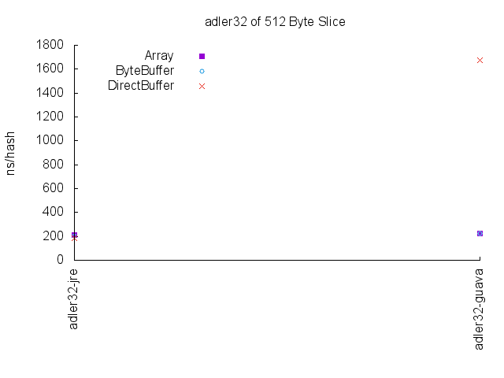

| Algorithm |  Array | ByteBuffer | DirectBuffer |
| --- | ---: | ---: | ---: | 
| [adler32-jre](#adler32-jre-latency) | 208.548364 | 206.560098 | 186.245926 |
| [adler32-guava](#adler32-guava-latency) | 222.250599 | 223.468297 | 1675.928055 |

---
### 512 Byte Slice Latency (city64)
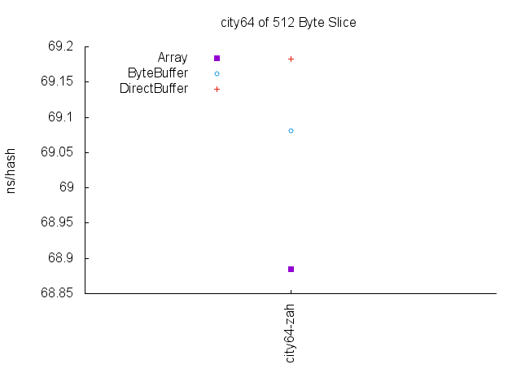

| Algorithm |  Array | ByteBuffer | DirectBuffer |
| --- | ---: | ---: | ---: | 
| [city64-zah](#city64-zah-latency) | 68.884280 | 69.081371 | 69.182416 |

---
### 512 Byte Slice Latency (crc32)
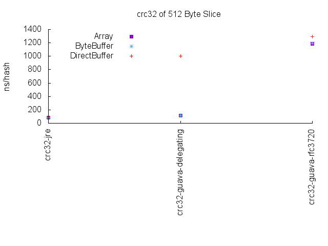

| Algorithm |  Array | ByteBuffer | DirectBuffer |
| --- | ---: | ---: | ---: | 
| [crc32-jre](#crc32-jre-latency) | 87.208768 | 86.054930 | 99.229936 |
| [crc32-guava-delegating](#crc32-guava-delegating-latency) | 117.734924 | 115.299355 | 1002.368512 |
| [crc32-guava-rfc3720](#crc32-guava-rfc3720-latency) | 1189.270776 | 1195.526446 | 1294.536760 |

---
### 512 Byte Slice Latency (farmna)
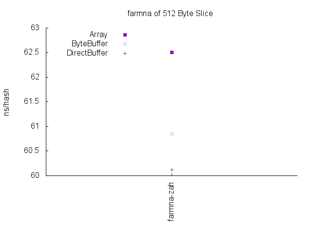

| Algorithm |  Array | ByteBuffer | DirectBuffer |
| --- | ---: | ---: | ---: | 
| [farmna-zah](#farmna-zah-latency) | 62.507336 | 60.854187 | 60.123589 |

---
### 512 Byte Slice Latency (farmuo)
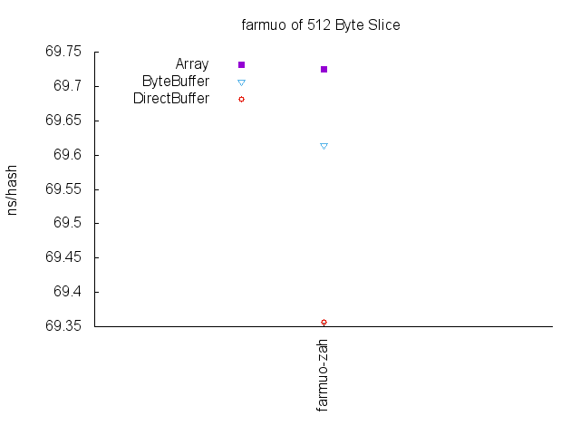

| Algorithm |  Array | ByteBuffer | DirectBuffer |
| --- | ---: | ---: | ---: | 
| [farmuo-zah](#farmuo-zah-latency) | 69.724510 | 69.613480 | 69.356702 |

---
### 512 Byte Slice Latency (gfh32)
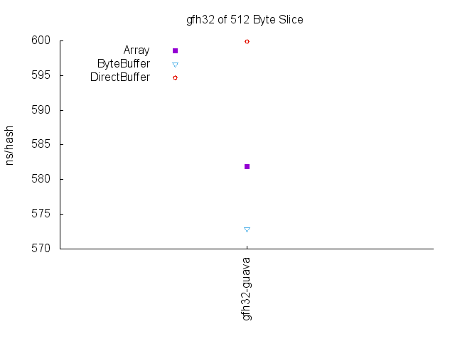

| Algorithm |  Array | ByteBuffer | DirectBuffer |
| --- | ---: | ---: | ---: | 
| [gfh32-guava](#gfh32-guava-latency) | 581.854421 | 572.846671 | 599.887975 |

---
### 512 Byte Slice Latency (gfh64)
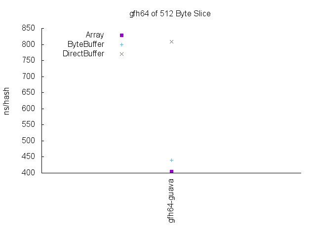

| Algorithm |  Array | ByteBuffer | DirectBuffer |
| --- | ---: | ---: | ---: | 
| [gfh64-guava](#gfh64-guava-latency) | 404.987602 | 440.572325 | 808.680908 |

---
### 512 Byte Slice Latency (md5)

| Algorithm |  Array | ByteBuffer | DirectBuffer |
| --- | ---: | ---: | ---: | 
| [md5-guava](#md5-guava-latency) | 1501.076117 | 1487.524977 | 1526.049796 |

---
### 512 Byte Slice Latency (murmur3h128)
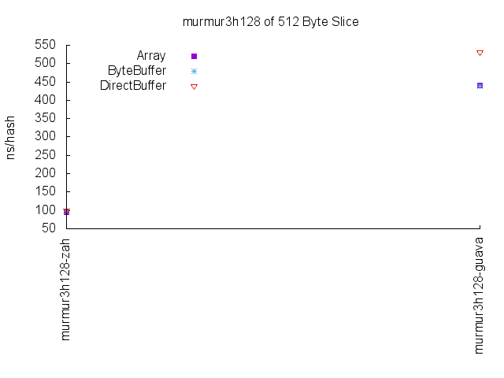

| Algorithm |  Array | ByteBuffer | DirectBuffer |
| --- | ---: | ---: | ---: | 
| [murmur3h128-zah](#murmur3h128-zah-latency) | 94.557319 | 97.421597 | 99.494060 |
| [murmur3h128-guava](#murmur3h128-guava-latency) | 441.032576 | 437.420018 | 530.601150 |

---
### 512 Byte Slice Latency (murmur3h32)
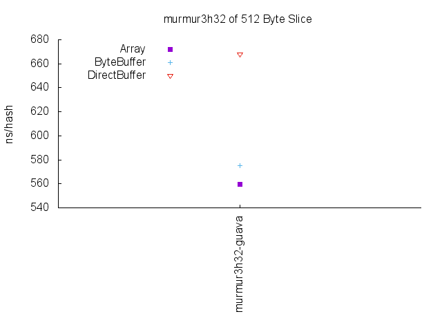

| Algorithm |  Array | ByteBuffer | DirectBuffer |
| --- | ---: | ---: | ---: | 
| [murmur3h32-guava](#murmur3h32-guava-latency) | 559.598425 | 575.064299 | 668.000088 |

---
### 512 Byte Slice Latency (sha1)
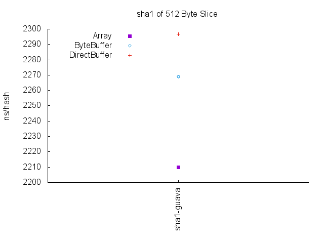

| Algorithm |  Array | ByteBuffer | DirectBuffer |
| --- | ---: | ---: | ---: | 
| [sha1-guava](#sha1-guava-latency) | 2209.942315 | 2268.987565 | 2296.767810 |

---
### 512 Byte Slice Latency (sha256)
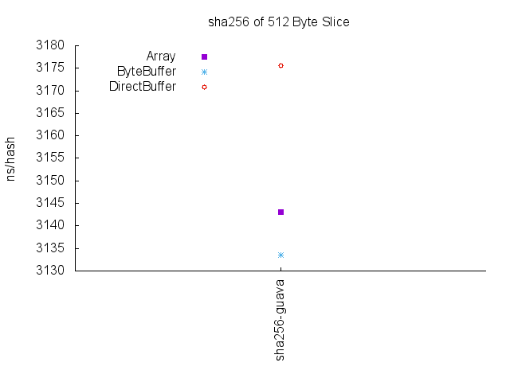

| Algorithm |  Array | ByteBuffer | DirectBuffer |
| --- | ---: | ---: | ---: | 
| [sha256-guava](#sha256-guava-latency) | 3143.110033 | 3133.506005 | 3175.511132 |

---
### 512 Byte Slice Latency (sha384)
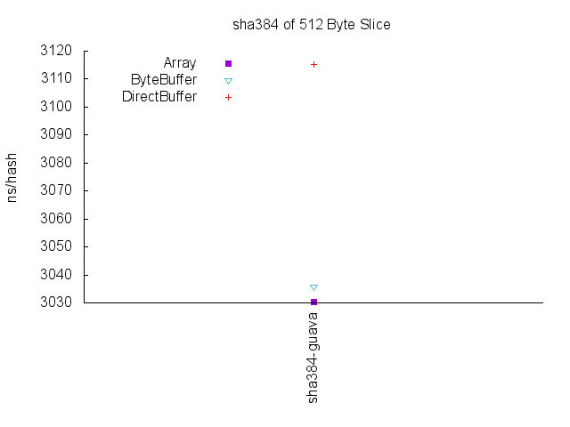

| Algorithm |  Array | ByteBuffer | DirectBuffer |
| --- | ---: | ---: | ---: | 
| [sha384-guava](#sha384-guava-latency) | 3030.320433 | 3035.871590 | 3115.125479 |

---
### 512 Byte Slice Latency (sha512)
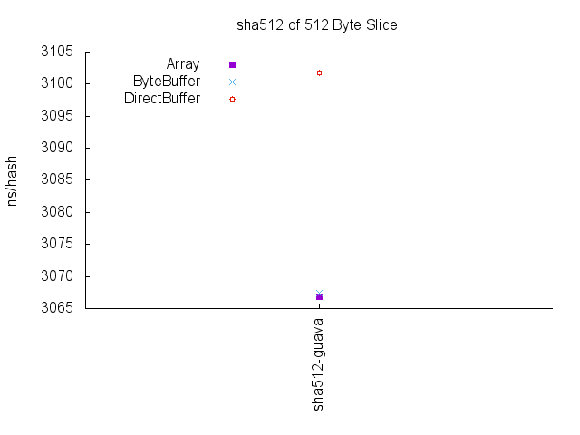

| Algorithm |  Array | ByteBuffer | DirectBuffer |
| --- | ---: | ---: | ---: | 
| [sha512-guava](#sha512-guava-latency) | 3066.871178 | 3067.414617 | 3101.802991 |

---
### 512 Byte Slice Latency (sip)
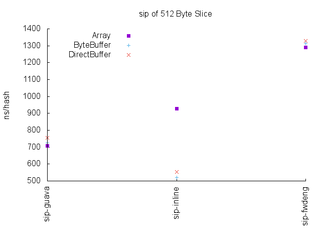

| Algorithm |  Array | ByteBuffer | DirectBuffer |
| --- | ---: | ---: | ---: | 
| [sip-guava](#sip-guava-latency) | 708.366884 | 726.981952 | 755.879395 |
| [sip-inline](#sip-inline-latency) | 928.184061 | 521.824070 | 554.917638 |
| [sip-fwdeng](#sip-fwdeng-latency) | 1290.066697 | 1313.169428 | 1329.806663 |

---
### 512 Byte Slice Latency (xxh32)
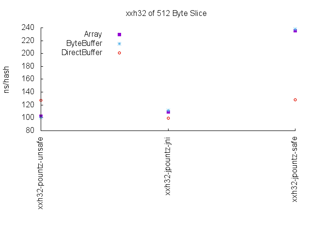

| Algorithm |  Array | ByteBuffer | DirectBuffer |
| --- | ---: | ---: | ---: | 
| [xxh32-pountz-unsafe](#xxh32-pountz-unsafe-latency) | 102.600833 | 99.998160 | 127.551612 |
| [xxh32-jpountz-jni](#xxh32-jpountz-jni-latency) | 109.334147 | 111.477262 | 99.894591 |
| [xxh32-jpountz-safe](#xxh32-jpountz-safe-latency) | 235.375356 | 237.936719 | 128.086383 |

---
### 512 Byte Slice Latency (xxh64)
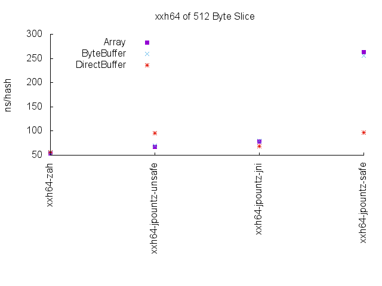

| Algorithm |  Array | ByteBuffer | DirectBuffer |
| --- | ---: | ---: | ---: | 
| [xxh64-zah](#xxh64-zah-latency) | 54.178686 | 55.529989 | 55.981312 |
| [xxh64-jpountz-unsafe](#xxh64-jpountz-unsafe-latency) | 67.403677 | 69.790258 | 95.568604 |
| [xxh64-jpountz-jni](#xxh64-jpountz-jni-latency) | 78.290332 | 79.322221 | 68.614942 |
| [xxh64-jpountz-safe](#xxh64-jpountz-safe-latency) | 262.961258 | 255.875263 | 96.212589 |

---
### 2048 Byte Slice Latency (All Hashes)
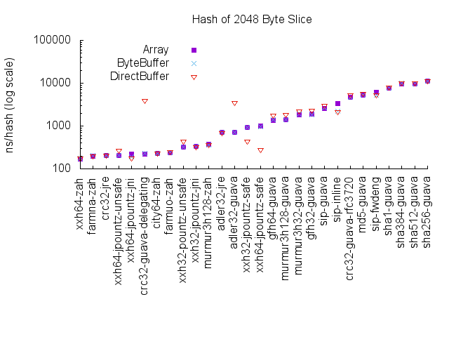

| Algorithm |  Array | ByteBuffer | DirectBuffer |
| --- | ---: | ---: | ---: | 
| [xxh64-zah](#xxh64-zah-latency) | 171.974963 | 175.427534 | 174.807736 |
| [farmna-zah](#farmna-zah-latency) | 198.268147 | 205.950063 | 199.930802 |
| [crc32-jre](#crc32-jre-latency) | 201.139532 | 201.131968 | 206.088386 |
| [xxh64-jpountz-unsafe](#xxh64-jpountz-unsafe-latency) | 207.346755 | 208.028205 | 271.879200 |
| [xxh64-jpountz-jni](#xxh64-jpountz-jni-latency) | 216.954038 | 191.201197 | 179.058704 |
| [crc32-guava-delegating](#crc32-guava-delegating-latency) | 220.451246 | 225.588961 | 3862.659993 |
| [city64-zah](#city64-zah-latency) | 226.141389 | 226.560445 | 225.404298 |
| [farmuo-zah](#farmuo-zah-latency) | 242.530414 | 242.006690 | 243.573499 |
| [xxh32-pountz-unsafe](#xxh32-pountz-unsafe-latency) | 324.609765 | 324.510479 | 431.125492 |
| [xxh32-jpountz-jni](#xxh32-jpountz-jni-latency) | 330.130734 | 331.357512 | 316.938871 |
| [murmur3h128-zah](#murmur3h128-zah-latency) | 368.943683 | 367.724496 | 363.424115 |
| [adler32-jre](#adler32-jre-latency) | 709.262811 | 706.884846 | 678.403923 |
| [adler32-guava](#adler32-guava-latency) | 723.927349 | 714.897015 | 3434.798442 |
| [xxh32-jpountz-safe](#xxh32-jpountz-safe-latency) | 913.626016 | 917.573483 | 427.816846 |
| [xxh64-jpountz-safe](#xxh64-jpountz-safe-latency) | 1001.827271 | 965.407042 | 275.348994 |
| [gfh64-guava](#gfh64-guava-latency) | 1367.233545 | 1420.078160 | 1783.447168 |
| [murmur3h128-guava](#murmur3h128-guava-latency) | 1378.388178 | 1422.684735 | 1819.172173 |
| [murmur3h32-guava](#murmur3h32-guava-latency) | 1845.579809 | 1912.384855 | 2198.085825 |
| [gfh32-guava](#gfh32-guava-latency) | 1935.852081 | 1860.027871 | 2335.156586 |
| [sip-guava](#sip-guava-latency) | 2573.507175 | 2665.203032 | 3033.936649 |
| [sip-inline](#sip-inline-latency) | 3375.845187 | 2172.786194 | 2107.627708 |
| [crc32-guava-rfc3720](#crc32-guava-rfc3720-latency) | 4736.432035 | 4763.059344 | 5211.789777 |
| [md5-guava](#md5-guava-latency) | 5218.219373 | 5216.321197 | 5571.665493 |
| [sip-fwdeng](#sip-fwdeng-latency) | 6163.853022 | 5276.348001 | 5220.568085 |
| [sha1-guava](#sha1-guava-latency) | 7817.532640 | 7754.091337 | 7963.366729 |
| [sha384-guava](#sha384-guava-latency) | 9717.124088 | 9923.057690 | 10077.259824 |
| [sha512-guava](#sha512-guava-latency) | 9774.716596 | 9717.628238 | 9908.518912 |
| [sha256-guava](#sha256-guava-latency) | 11252.581079 | 11259.835382 | 11384.752167 |

---
### 2048 Byte Slice Latency (adler32)
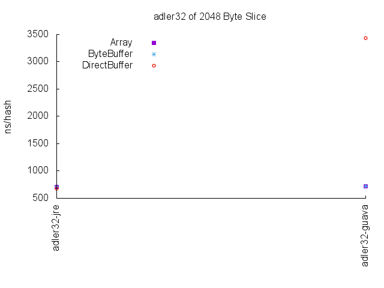

| Algorithm |  Array | ByteBuffer | DirectBuffer |
| --- | ---: | ---: | ---: | 
| [adler32-jre](#adler32-jre-latency) | 709.262811 | 706.884846 | 678.403923 |
| [adler32-guava](#adler32-guava-latency) | 723.927349 | 714.897015 | 3434.798442 |

---
### 2048 Byte Slice Latency (city64)
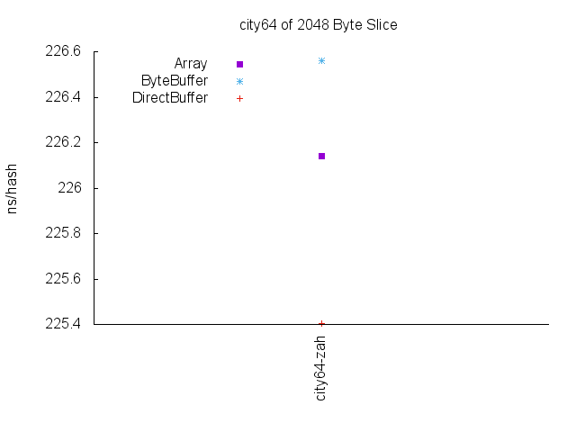

| Algorithm |  Array | ByteBuffer | DirectBuffer |
| --- | ---: | ---: | ---: | 
| [city64-zah](#city64-zah-latency) | 226.141389 | 226.560445 | 225.404298 |

---
### 2048 Byte Slice Latency (crc32)
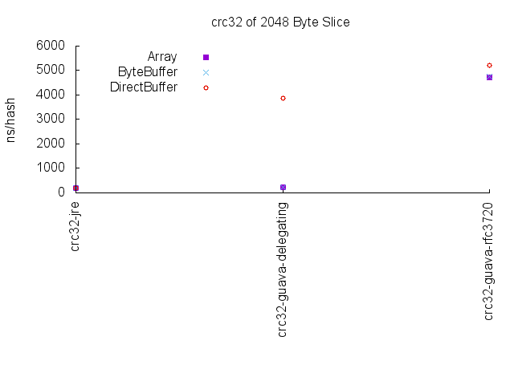

| Algorithm |  Array | ByteBuffer | DirectBuffer |
| --- | ---: | ---: | ---: | 
| [crc32-jre](#crc32-jre-latency) | 201.139532 | 201.131968 | 206.088386 |
| [crc32-guava-delegating](#crc32-guava-delegating-latency) | 220.451246 | 225.588961 | 3862.659993 |
| [crc32-guava-rfc3720](#crc32-guava-rfc3720-latency) | 4736.432035 | 4763.059344 | 5211.789777 |

---
### 2048 Byte Slice Latency (farmna)
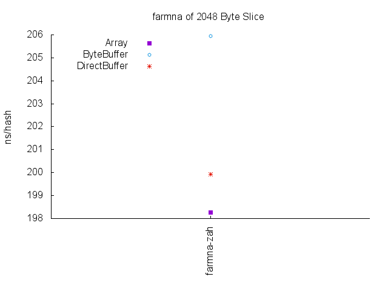

| Algorithm |  Array | ByteBuffer | DirectBuffer |
| --- | ---: | ---: | ---: | 
| [farmna-zah](#farmna-zah-latency) | 198.268147 | 205.950063 | 199.930802 |

---
### 2048 Byte Slice Latency (farmuo)
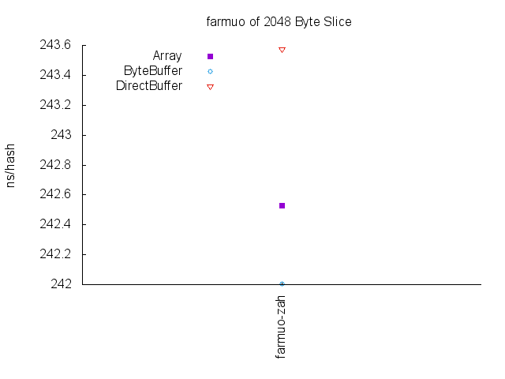

| Algorithm |  Array | ByteBuffer | DirectBuffer |
| --- | ---: | ---: | ---: | 
| [farmuo-zah](#farmuo-zah-latency) | 242.530414 | 242.006690 | 243.573499 |

---
### 2048 Byte Slice Latency (gfh32)
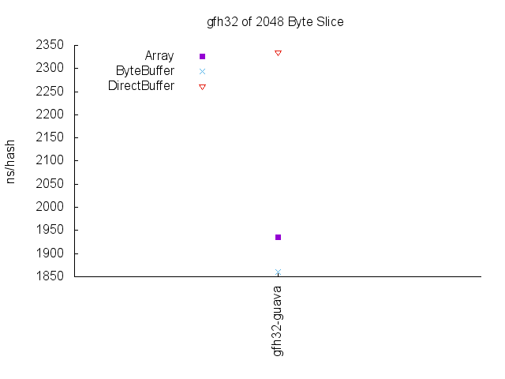

| Algorithm |  Array | ByteBuffer | DirectBuffer |
| --- | ---: | ---: | ---: | 
| [gfh32-guava](#gfh32-guava-latency) | 1935.852081 | 1860.027871 | 2335.156586 |

---
### 2048 Byte Slice Latency (gfh64)
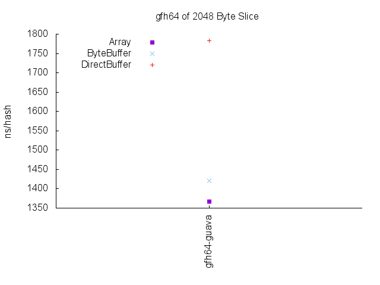

| Algorithm |  Array | ByteBuffer | DirectBuffer |
| --- | ---: | ---: | ---: | 
| [gfh64-guava](#gfh64-guava-latency) | 1367.233545 | 1420.078160 | 1783.447168 |

---
### 2048 Byte Slice Latency (md5)

| Algorithm |  Array | ByteBuffer | DirectBuffer |
| --- | ---: | ---: | ---: | 
| [md5-guava](#md5-guava-latency) | 5218.219373 | 5216.321197 | 5571.665493 |

---
### 2048 Byte Slice Latency (murmur3h128)
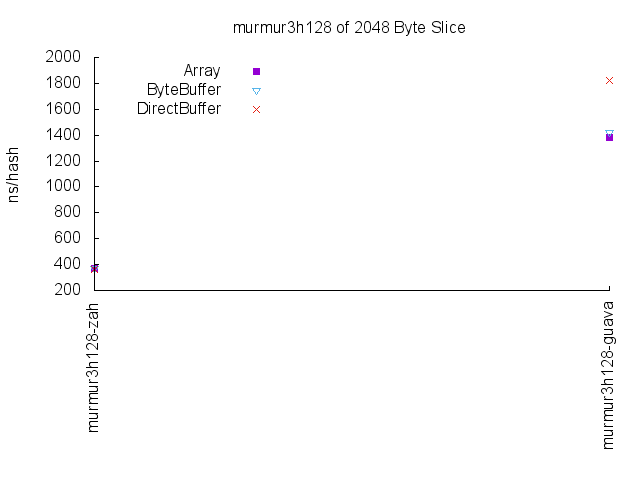

| Algorithm |  Array | ByteBuffer | DirectBuffer |
| --- | ---: | ---: | ---: | 
| [murmur3h128-zah](#murmur3h128-zah-latency) | 368.943683 | 367.724496 | 363.424115 |
| [murmur3h128-guava](#murmur3h128-guava-latency) | 1378.388178 | 1422.684735 | 1819.172173 |

---
### 2048 Byte Slice Latency (murmur3h32)
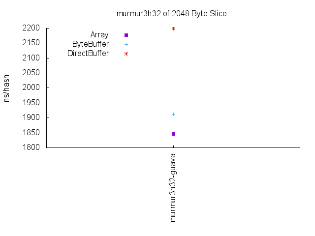

| Algorithm |  Array | ByteBuffer | DirectBuffer |
| --- | ---: | ---: | ---: | 
| [murmur3h32-guava](#murmur3h32-guava-latency) | 1845.579809 | 1912.384855 | 2198.085825 |

---
### 2048 Byte Slice Latency (sha1)
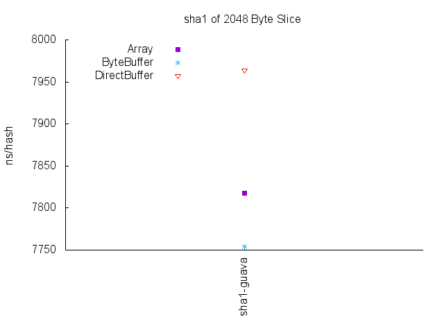

| Algorithm |  Array | ByteBuffer | DirectBuffer |
| --- | ---: | ---: | ---: | 
| [sha1-guava](#sha1-guava-latency) | 7817.532640 | 7754.091337 | 7963.366729 |

---
### 2048 Byte Slice Latency (sha256)
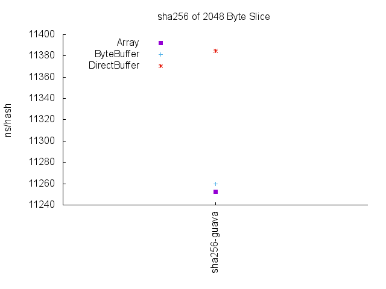

| Algorithm |  Array | ByteBuffer | DirectBuffer |
| --- | ---: | ---: | ---: | 
| [sha256-guava](#sha256-guava-latency) | 11252.581079 | 11259.835382 | 11384.752167 |

---
### 2048 Byte Slice Latency (sha384)
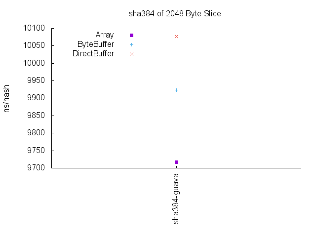

| Algorithm |  Array | ByteBuffer | DirectBuffer |
| --- | ---: | ---: | ---: | 
| [sha384-guava](#sha384-guava-latency) | 9717.124088 | 9923.057690 | 10077.259824 |

---
### 2048 Byte Slice Latency (sha512)
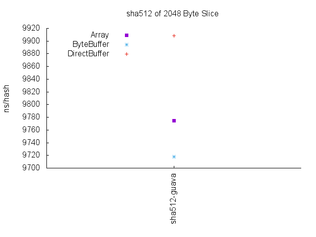

| Algorithm |  Array | ByteBuffer | DirectBuffer |
| --- | ---: | ---: | ---: | 
| [sha512-guava](#sha512-guava-latency) | 9774.716596 | 9717.628238 | 9908.518912 |

---
### 2048 Byte Slice Latency (sip)
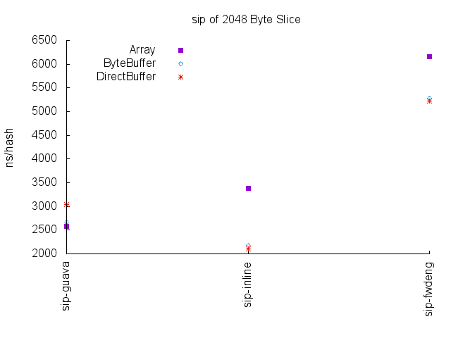

| Algorithm |  Array | ByteBuffer | DirectBuffer |
| --- | ---: | ---: | ---: | 
| [sip-guava](#sip-guava-latency) | 2573.507175 | 2665.203032 | 3033.936649 |
| [sip-inline](#sip-inline-latency) | 3375.845187 | 2172.786194 | 2107.627708 |
| [sip-fwdeng](#sip-fwdeng-latency) | 6163.853022 | 5276.348001 | 5220.568085 |

---
### 2048 Byte Slice Latency (xxh32)
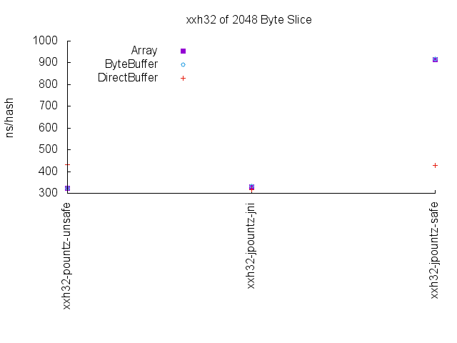

| Algorithm |  Array | ByteBuffer | DirectBuffer |
| --- | ---: | ---: | ---: | 
| [xxh32-pountz-unsafe](#xxh32-pountz-unsafe-latency) | 324.609765 | 324.510479 | 431.125492 |
| [xxh32-jpountz-jni](#xxh32-jpountz-jni-latency) | 330.130734 | 331.357512 | 316.938871 |
| [xxh32-jpountz-safe](#xxh32-jpountz-safe-latency) | 913.626016 | 917.573483 | 427.816846 |

---
### 2048 Byte Slice Latency (xxh64)
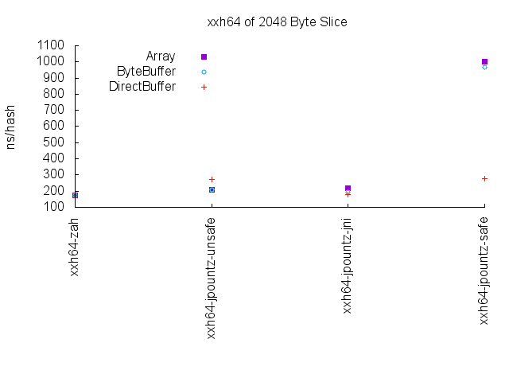

| Algorithm |  Array | ByteBuffer | DirectBuffer |
| --- | ---: | ---: | ---: | 
| [xxh64-zah](#xxh64-zah-latency) | 171.974963 | 175.427534 | 174.807736 |
| [xxh64-jpountz-unsafe](#xxh64-jpountz-unsafe-latency) | 207.346755 | 208.028205 | 271.879200 |
| [xxh64-jpountz-jni](#xxh64-jpountz-jni-latency) | 216.954038 | 191.201197 | 179.058704 |
| [xxh64-jpountz-safe](#xxh64-jpountz-safe-latency) | 1001.827271 | 965.407042 | 275.348994 |

---
### 8192 Byte Slice Latency (All Hashes)
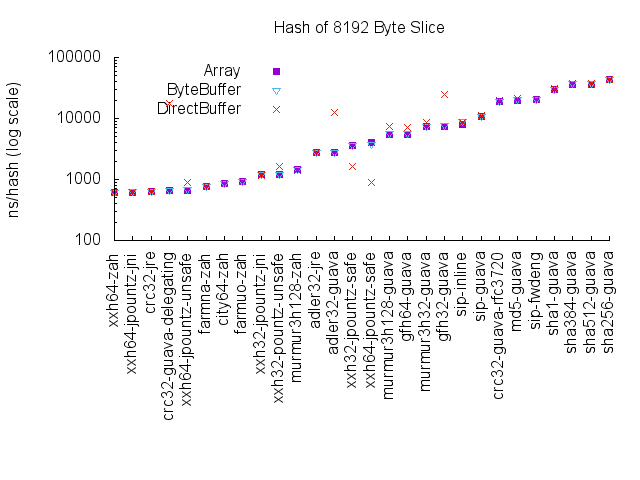

| Algorithm |  Array | ByteBuffer | DirectBuffer |
| --- | ---: | ---: | ---: | 
| [xxh64-zah](#xxh64-zah-latency) | 622.269191 | 616.578558 | 608.765918 |
| [xxh64-jpountz-jni](#xxh64-jpountz-jni-latency) | 623.007512 | 635.377809 | 609.046279 |
| [crc32-jre](#crc32-jre-latency) | 631.240662 | 626.636397 | 638.001977 |
| [crc32-guava-delegating](#crc32-guava-delegating-latency) | 660.232137 | 663.139282 | 17607.577697 |
| [xxh64-jpountz-unsafe](#xxh64-jpountz-unsafe-latency) | 662.024637 | 693.266101 | 879.820771 |
| [farmna-zah](#farmna-zah-latency) | 774.580882 | 770.364808 | 772.127828 |
| [city64-zah](#city64-zah-latency) | 863.575426 | 871.938353 | 869.690286 |
| [farmuo-zah](#farmuo-zah-latency) | 941.708371 | 936.201074 | 932.240643 |
| [xxh32-jpountz-jni](#xxh32-jpountz-jni-latency) | 1193.147810 | 1213.111597 | 1181.035373 |
| [xxh32-pountz-unsafe](#xxh32-pountz-unsafe-latency) | 1218.069329 | 1218.651114 | 1616.301580 |
| [murmur3h128-zah](#murmur3h128-zah-latency) | 1431.845680 | 1432.833283 | 1410.516590 |
| [adler32-jre](#adler32-jre-latency) | 2784.946087 | 2787.612245 | 2752.951945 |
| [adler32-guava](#adler32-guava-latency) | 2804.917773 | 2796.135897 | 12367.624295 |
| [xxh32-jpountz-safe](#xxh32-jpountz-safe-latency) | 3610.119868 | 3617.064914 | 1626.720757 |
| [xxh64-jpountz-safe](#xxh64-jpountz-safe-latency) | 3967.368084 | 3813.828291 | 887.199713 |
| [murmur3h128-guava](#murmur3h128-guava-latency) | 5447.569712 | 5613.046362 | 7529.872798 |
| [gfh64-guava](#gfh64-guava-latency) | 5473.728646 | 5610.166822 | 7203.815080 |
| [murmur3h32-guava](#murmur3h32-guava-latency) | 7351.259486 | 7260.496797 | 8605.771196 |
| [gfh32-guava](#gfh32-guava-latency) | 7401.251901 | 7545.164386 | 24428.932361 |
| [sip-inline](#sip-inline-latency) | 8089.873234 | 8877.879619 | 8471.871588 |
| [sip-guava](#sip-guava-latency) | 10633.811631 | 10660.133912 | 11340.012188 |
| [crc32-guava-rfc3720](#crc32-guava-rfc3720-latency) | 18913.402130 | 19094.534760 | 20095.340613 |
| [md5-guava](#md5-guava-latency) | 20021.580078 | 20165.734334 | 21171.290892 |
| [sip-fwdeng](#sip-fwdeng-latency) | 20649.315061 | 20586.152063 | 20675.668434 |
| [sha1-guava](#sha1-guava-latency) | 29980.574026 | 29959.439188 | 30534.817509 |
| [sha384-guava](#sha384-guava-latency) | 36572.576490 | 36797.736141 | 37224.304633 |
| [sha512-guava](#sha512-guava-latency) | 36603.590359 | 36784.770836 | 37086.277519 |
| [sha256-guava](#sha256-guava-latency) | 43253.509883 | 43310.251348 | 44271.933872 |

---
### 8192 Byte Slice Latency (adler32)
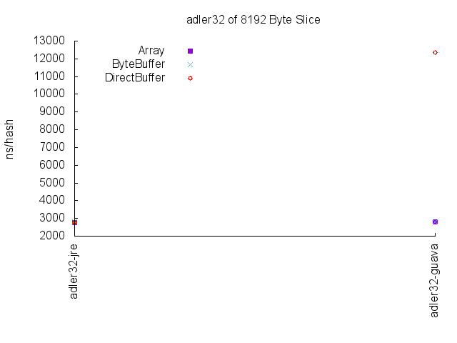

| Algorithm |  Array | ByteBuffer | DirectBuffer |
| --- | ---: | ---: | ---: | 
| [adler32-jre](#adler32-jre-latency) | 2784.946087 | 2787.612245 | 2752.951945 |
| [adler32-guava](#adler32-guava-latency) | 2804.917773 | 2796.135897 | 12367.624295 |

---
### 8192 Byte Slice Latency (city64)
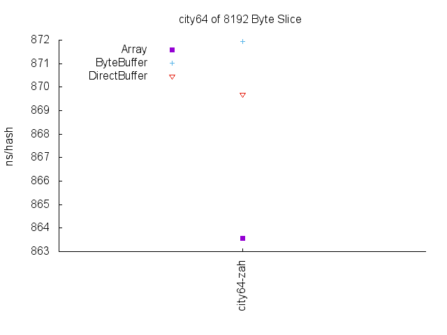

| Algorithm |  Array | ByteBuffer | DirectBuffer |
| --- | ---: | ---: | ---: | 
| [city64-zah](#city64-zah-latency) | 863.575426 | 871.938353 | 869.690286 |

---
### 8192 Byte Slice Latency (crc32)
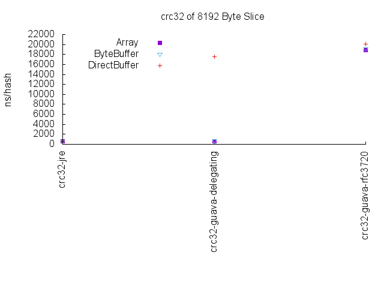

| Algorithm |  Array | ByteBuffer | DirectBuffer |
| --- | ---: | ---: | ---: | 
| [crc32-jre](#crc32-jre-latency) | 631.240662 | 626.636397 | 638.001977 |
| [crc32-guava-delegating](#crc32-guava-delegating-latency) | 660.232137 | 663.139282 | 17607.577697 |
| [crc32-guava-rfc3720](#crc32-guava-rfc3720-latency) | 18913.402130 | 19094.534760 | 20095.340613 |

---
### 8192 Byte Slice Latency (farmna)
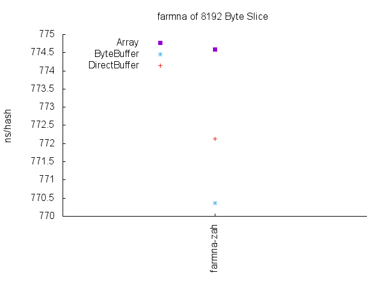

| Algorithm |  Array | ByteBuffer | DirectBuffer |
| --- | ---: | ---: | ---: | 
| [farmna-zah](#farmna-zah-latency) | 774.580882 | 770.364808 | 772.127828 |

---
### 8192 Byte Slice Latency (farmuo)
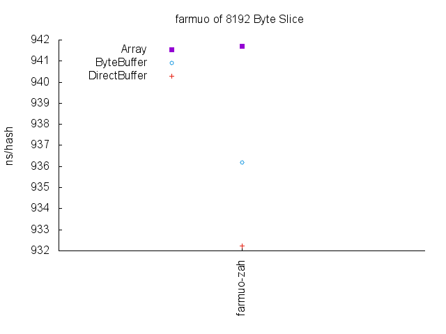

| Algorithm |  Array | ByteBuffer | DirectBuffer |
| --- | ---: | ---: | ---: | 
| [farmuo-zah](#farmuo-zah-latency) | 941.708371 | 936.201074 | 932.240643 |

---
### 8192 Byte Slice Latency (gfh32)

| Algorithm |  Array | ByteBuffer | DirectBuffer |
| --- | ---: | ---: | ---: | 
| [gfh32-guava](#gfh32-guava-latency) | 7401.251901 | 7545.164386 | 24428.932361 |

---
### 8192 Byte Slice Latency (gfh64)
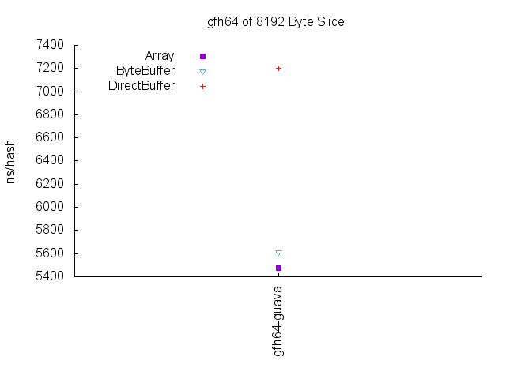

| Algorithm |  Array | ByteBuffer | DirectBuffer |
| --- | ---: | ---: | ---: | 
| [gfh64-guava](#gfh64-guava-latency) | 5473.728646 | 5610.166822 | 7203.815080 |

---
### 8192 Byte Slice Latency (md5)

| Algorithm |  Array | ByteBuffer | DirectBuffer |
| --- | ---: | ---: | ---: | 
| [md5-guava](#md5-guava-latency) | 20021.580078 | 20165.734334 | 21171.290892 |

---
### 8192 Byte Slice Latency (murmur3h128)
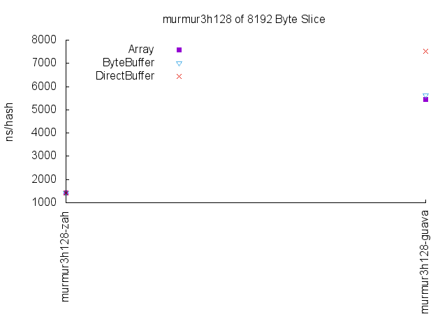

| Algorithm |  Array | ByteBuffer | DirectBuffer |
| --- | ---: | ---: | ---: | 
| [murmur3h128-zah](#murmur3h128-zah-latency) | 1431.845680 | 1432.833283 | 1410.516590 |
| [murmur3h128-guava](#murmur3h128-guava-latency) | 5447.569712 | 5613.046362 | 7529.872798 |

---
### 8192 Byte Slice Latency (murmur3h32)
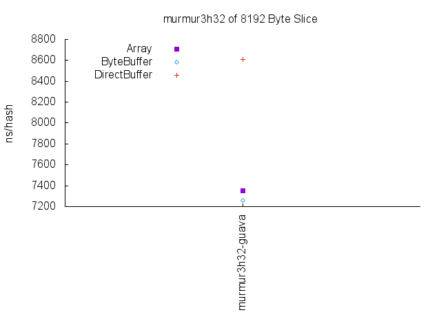

| Algorithm |  Array | ByteBuffer | DirectBuffer |
| --- | ---: | ---: | ---: | 
| [murmur3h32-guava](#murmur3h32-guava-latency) | 7351.259486 | 7260.496797 | 8605.771196 |

---
### 8192 Byte Slice Latency (sha1)
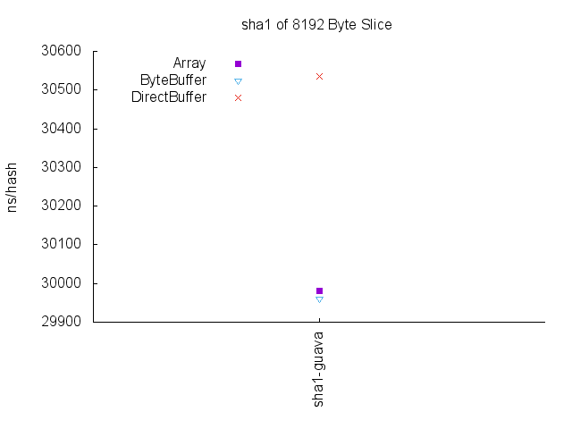

| Algorithm |  Array | ByteBuffer | DirectBuffer |
| --- | ---: | ---: | ---: | 
| [sha1-guava](#sha1-guava-latency) | 29980.574026 | 29959.439188 | 30534.817509 |

---
### 8192 Byte Slice Latency (sha256)
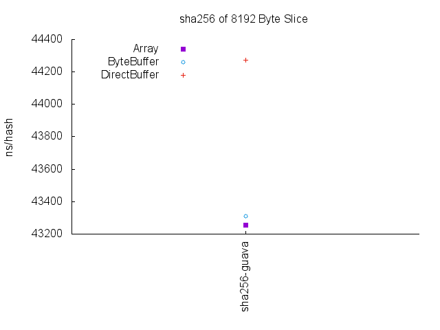

| Algorithm |  Array | ByteBuffer | DirectBuffer |
| --- | ---: | ---: | ---: | 
| [sha256-guava](#sha256-guava-latency) | 43253.509883 | 43310.251348 | 44271.933872 |

---
### 8192 Byte Slice Latency (sha384)
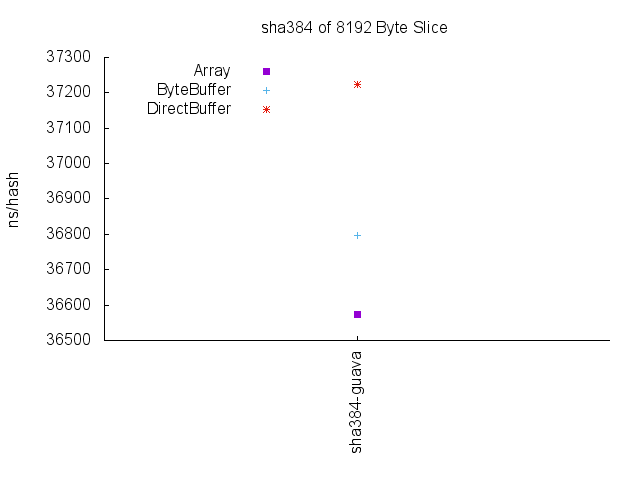

| Algorithm |  Array | ByteBuffer | DirectBuffer |
| --- | ---: | ---: | ---: | 
| [sha384-guava](#sha384-guava-latency) | 36572.576490 | 36797.736141 | 37224.304633 |

---
### 8192 Byte Slice Latency (sha512)
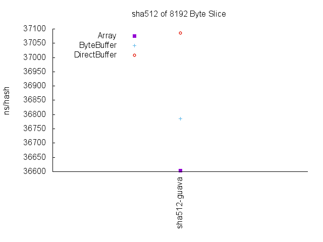

| Algorithm |  Array | ByteBuffer | DirectBuffer |
| --- | ---: | ---: | ---: | 
| [sha512-guava](#sha512-guava-latency) | 36603.590359 | 36784.770836 | 37086.277519 |

---
### 8192 Byte Slice Latency (sip)
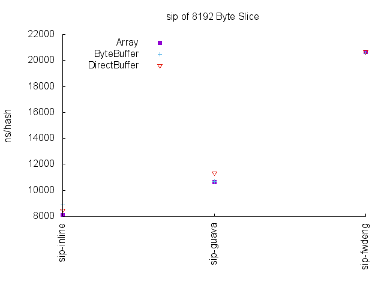

| Algorithm |  Array | ByteBuffer | DirectBuffer |
| --- | ---: | ---: | ---: | 
| [sip-inline](#sip-inline-latency) | 8089.873234 | 8877.879619 | 8471.871588 |
| [sip-guava](#sip-guava-latency) | 10633.811631 | 10660.133912 | 11340.012188 |
| [sip-fwdeng](#sip-fwdeng-latency) | 20649.315061 | 20586.152063 | 20675.668434 |

---
### 8192 Byte Slice Latency (xxh32)
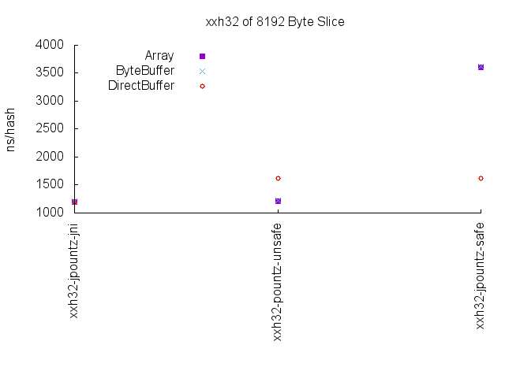

| Algorithm |  Array | ByteBuffer | DirectBuffer |
| --- | ---: | ---: | ---: | 
| [xxh32-jpountz-jni](#xxh32-jpountz-jni-latency) | 1193.147810 | 1213.111597 | 1181.035373 |
| [xxh32-pountz-unsafe](#xxh32-pountz-unsafe-latency) | 1218.069329 | 1218.651114 | 1616.301580 |
| [xxh32-jpountz-safe](#xxh32-jpountz-safe-latency) | 3610.119868 | 3617.064914 | 1626.720757 |

---
### 8192 Byte Slice Latency (xxh64)
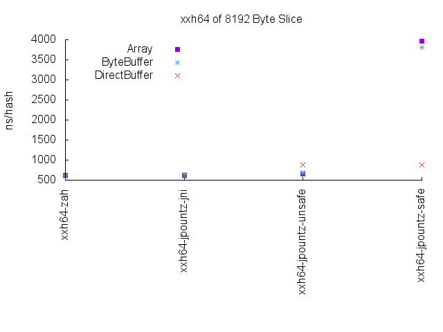

| Algorithm |  Array | ByteBuffer | DirectBuffer |
| --- | ---: | ---: | ---: | 
| [xxh64-zah](#xxh64-zah-latency) | 622.269191 | 616.578558 | 608.765918 |
| [xxh64-jpountz-jni](#xxh64-jpountz-jni-latency) | 623.007512 | 635.377809 | 609.046279 |
| [xxh64-jpountz-unsafe](#xxh64-jpountz-unsafe-latency) | 662.024637 | 693.266101 | 879.820771 |
| [xxh64-jpountz-safe](#xxh64-jpountz-safe-latency) | 3967.368084 | 3813.828291 | 887.199713 |

---
### 16384 Byte Slice Latency (All Hashes)
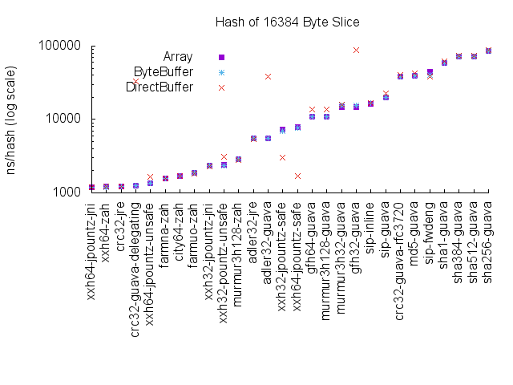

| Algorithm |  Array | ByteBuffer | DirectBuffer |
| --- | ---: | ---: | ---: | 
| [xxh64-jpountz-jni](#xxh64-jpountz-jni-latency) | 1203.961338 | 1204.581006 | 1187.021490 |
| [xxh64-zah](#xxh64-zah-latency) | 1208.602176 | 1207.088417 | 1208.775997 |
| [crc32-jre](#crc32-jre-latency) | 1217.229126 | 1210.076302 | 1215.740851 |
| [crc32-guava-delegating](#crc32-guava-delegating-latency) | 1239.014786 | 1246.556833 | 33291.464950 |
| [xxh64-jpountz-unsafe](#xxh64-jpountz-unsafe-latency) | 1340.620136 | 1349.257232 | 1671.265726 |
| [farmna-zah](#farmna-zah-latency) | 1566.832369 | 1565.532413 | 1554.215131 |
| [city64-zah](#city64-zah-latency) | 1690.354381 | 1706.749783 | 1687.897323 |
| [farmuo-zah](#farmuo-zah-latency) | 1853.741327 | 1864.809362 | 1834.342480 |
| [xxh32-jpountz-jni](#xxh32-jpountz-jni-latency) | 2345.265668 | 2348.737646 | 2319.410775 |
| [xxh32-pountz-unsafe](#xxh32-pountz-unsafe-latency) | 2389.391166 | 2363.950842 | 3069.066888 |
| [murmur3h128-zah](#murmur3h128-zah-latency) | 2854.970635 | 2853.909960 | 2815.122276 |
| [adler32-jre](#adler32-jre-latency) | 5517.812427 | 5473.721711 | 5445.696899 |
| [adler32-guava](#adler32-guava-latency) | 5540.595227 | 5480.304749 | 38629.896046 |
| [xxh32-jpountz-safe](#xxh32-jpountz-safe-latency) | 7213.864906 | 6971.252520 | 3051.091952 |
| [xxh64-jpountz-safe](#xxh64-jpountz-safe-latency) | 7890.575561 | 7632.941218 | 1697.269723 |
| [gfh64-guava](#gfh64-guava-latency) | 10864.269153 | 10996.858461 | 13827.758018 |
| [murmur3h128-guava](#murmur3h128-guava-latency) | 10982.403323 | 11055.068505 | 13710.384398 |
| [murmur3h32-guava](#murmur3h32-guava-latency) | 14654.653613 | 15550.095846 | 16115.942441 |
| [gfh32-guava](#gfh32-guava-latency) | 14776.562413 | 15676.134083 | 89068.199782 |
| [sip-inline](#sip-inline-latency) | 16171.705769 | 16780.972397 | 16860.587560 |
| [sip-guava](#sip-guava-latency) | 20068.678521 | 20044.420004 | 22698.930537 |
| [crc32-guava-rfc3720](#crc32-guava-rfc3720-latency) | 37966.507010 | 38163.428605 | 40648.272806 |
| [md5-guava](#md5-guava-latency) | 39809.363340 | 39868.589558 | 42104.588968 |
| [sip-fwdeng](#sip-fwdeng-latency) | 45075.352907 | 40094.854403 | 38229.026857 |
| [sha1-guava](#sha1-guava-latency) | 59549.879879 | 59566.880781 | 61312.406574 |
| [sha384-guava](#sha384-guava-latency) | 72723.671380 | 72417.642993 | 73811.373478 |
| [sha512-guava](#sha512-guava-latency) | 72751.827789 | 72333.053117 | 73454.372132 |
| [sha256-guava](#sha256-guava-latency) | 86024.095974 | 86557.270307 | 87520.811714 |

---
### 16384 Byte Slice Latency (adler32)
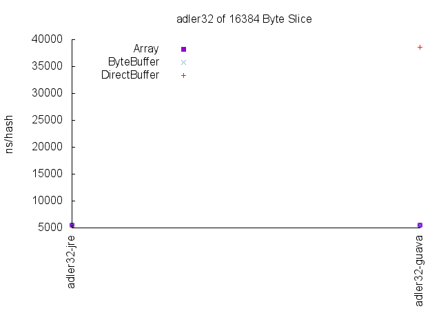

| Algorithm |  Array | ByteBuffer | DirectBuffer |
| --- | ---: | ---: | ---: | 
| [adler32-jre](#adler32-jre-latency) | 5517.812427 | 5473.721711 | 5445.696899 |
| [adler32-guava](#adler32-guava-latency) | 5540.595227 | 5480.304749 | 38629.896046 |

---
### 16384 Byte Slice Latency (city64)
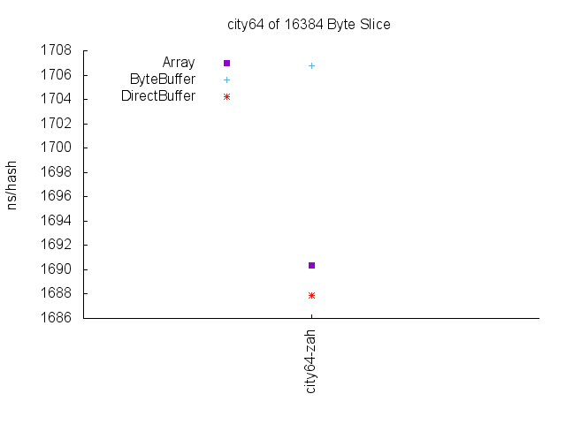

| Algorithm |  Array | ByteBuffer | DirectBuffer |
| --- | ---: | ---: | ---: | 
| [city64-zah](#city64-zah-latency) | 1690.354381 | 1706.749783 | 1687.897323 |

---
### 16384 Byte Slice Latency (crc32)
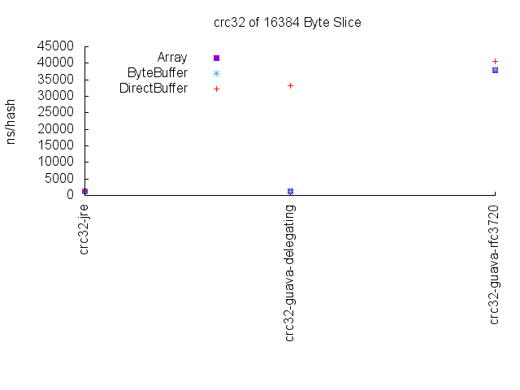

| Algorithm |  Array | ByteBuffer | DirectBuffer |
| --- | ---: | ---: | ---: | 
| [crc32-jre](#crc32-jre-latency) | 1217.229126 | 1210.076302 | 1215.740851 |
| [crc32-guava-delegating](#crc32-guava-delegating-latency) | 1239.014786 | 1246.556833 | 33291.464950 |
| [crc32-guava-rfc3720](#crc32-guava-rfc3720-latency) | 37966.507010 | 38163.428605 | 40648.272806 |

---
### 16384 Byte Slice Latency (farmna)
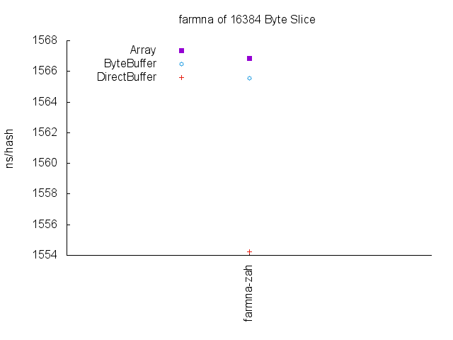

| Algorithm |  Array | ByteBuffer | DirectBuffer |
| --- | ---: | ---: | ---: | 
| [farmna-zah](#farmna-zah-latency) | 1566.832369 | 1565.532413 | 1554.215131 |

---
### 16384 Byte Slice Latency (farmuo)
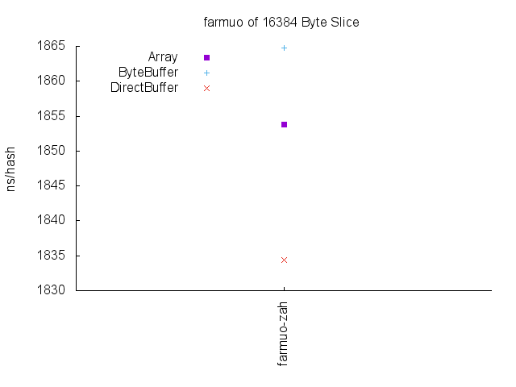

| Algorithm |  Array | ByteBuffer | DirectBuffer |
| --- | ---: | ---: | ---: | 
| [farmuo-zah](#farmuo-zah-latency) | 1853.741327 | 1864.809362 | 1834.342480 |

---
### 16384 Byte Slice Latency (gfh32)
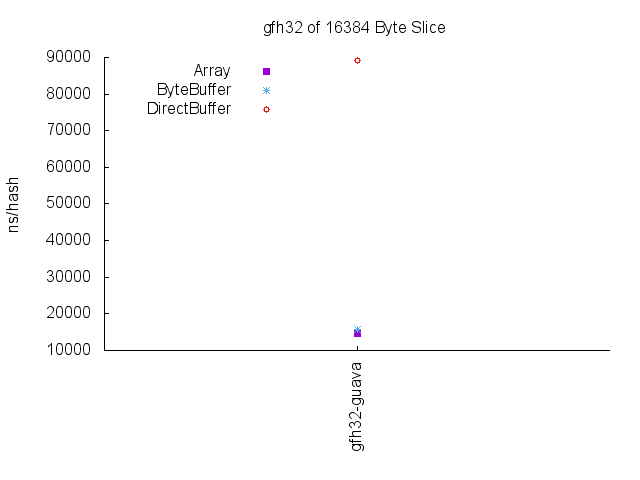

| Algorithm |  Array | ByteBuffer | DirectBuffer |
| --- | ---: | ---: | ---: | 
| [gfh32-guava](#gfh32-guava-latency) | 14776.562413 | 15676.134083 | 89068.199782 |

---
### 16384 Byte Slice Latency (gfh64)
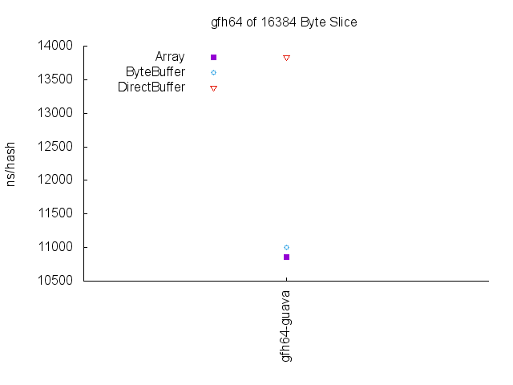

| Algorithm |  Array | ByteBuffer | DirectBuffer |
| --- | ---: | ---: | ---: | 
| [gfh64-guava](#gfh64-guava-latency) | 10864.269153 | 10996.858461 | 13827.758018 |

---
### 16384 Byte Slice Latency (md5)
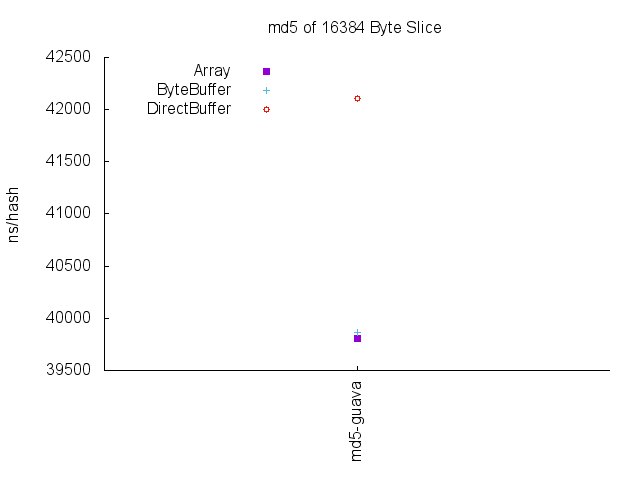

| Algorithm |  Array | ByteBuffer | DirectBuffer |
| --- | ---: | ---: | ---: | 
| [md5-guava](#md5-guava-latency) | 39809.363340 | 39868.589558 | 42104.588968 |

---
### 16384 Byte Slice Latency (murmur3h128)
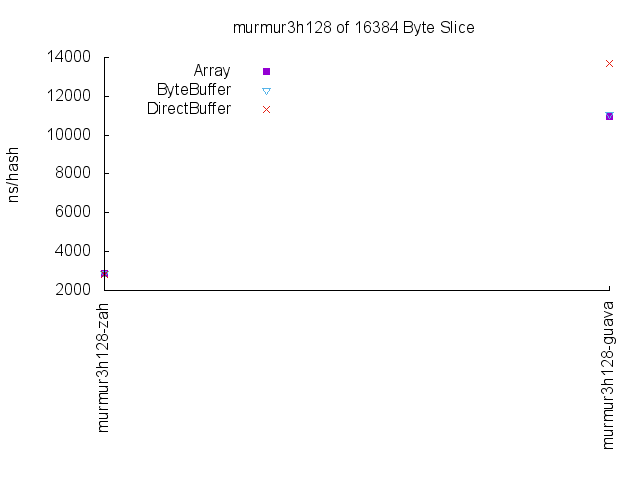

| Algorithm |  Array | ByteBuffer | DirectBuffer |
| --- | ---: | ---: | ---: | 
| [murmur3h128-zah](#murmur3h128-zah-latency) | 2854.970635 | 2853.909960 | 2815.122276 |
| [murmur3h128-guava](#murmur3h128-guava-latency) | 10982.403323 | 11055.068505 | 13710.384398 |

---
### 16384 Byte Slice Latency (murmur3h32)
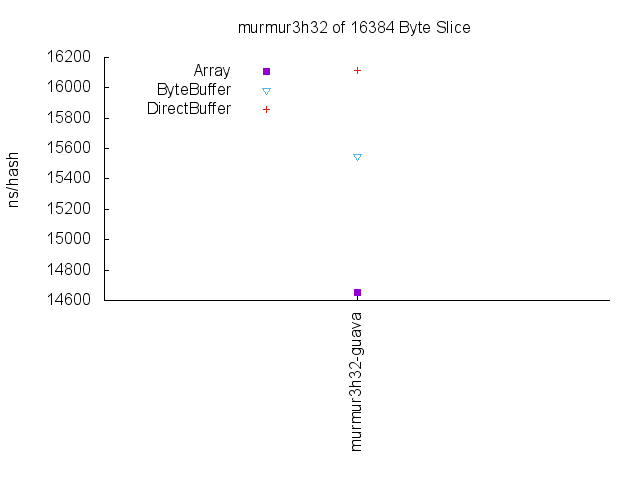

| Algorithm |  Array | ByteBuffer | DirectBuffer |
| --- | ---: | ---: | ---: | 
| [murmur3h32-guava](#murmur3h32-guava-latency) | 14654.653613 | 15550.095846 | 16115.942441 |

---
### 16384 Byte Slice Latency (sha1)
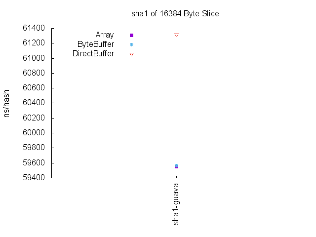

| Algorithm |  Array | ByteBuffer | DirectBuffer |
| --- | ---: | ---: | ---: | 
| [sha1-guava](#sha1-guava-latency) | 59549.879879 | 59566.880781 | 61312.406574 |

---
### 16384 Byte Slice Latency (sha256)
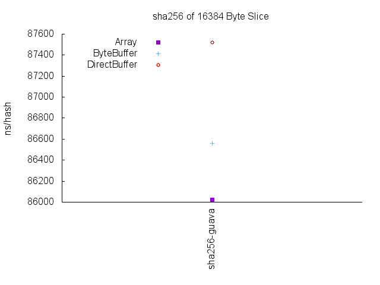

| Algorithm |  Array | ByteBuffer | DirectBuffer |
| --- | ---: | ---: | ---: | 
| [sha256-guava](#sha256-guava-latency) | 86024.095974 | 86557.270307 | 87520.811714 |

---
### 16384 Byte Slice Latency (sha384)
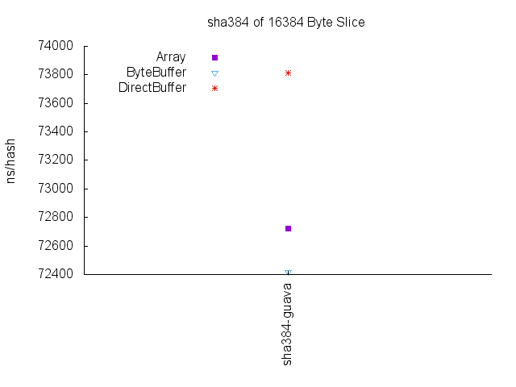

| Algorithm |  Array | ByteBuffer | DirectBuffer |
| --- | ---: | ---: | ---: | 
| [sha384-guava](#sha384-guava-latency) | 72723.671380 | 72417.642993 | 73811.373478 |

---
### 16384 Byte Slice Latency (sha512)
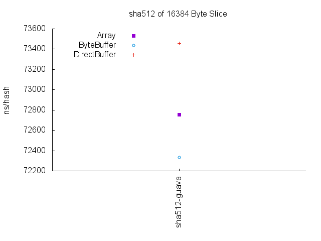

| Algorithm |  Array | ByteBuffer | DirectBuffer |
| --- | ---: | ---: | ---: | 
| [sha512-guava](#sha512-guava-latency) | 72751.827789 | 72333.053117 | 73454.372132 |

---
### 16384 Byte Slice Latency (sip)
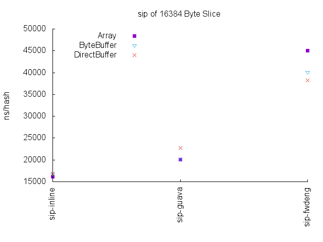

| Algorithm |  Array | ByteBuffer | DirectBuffer |
| --- | ---: | ---: | ---: | 
| [sip-inline](#sip-inline-latency) | 16171.705769 | 16780.972397 | 16860.587560 |
| [sip-guava](#sip-guava-latency) | 20068.678521 | 20044.420004 | 22698.930537 |
| [sip-fwdeng](#sip-fwdeng-latency) | 45075.352907 | 40094.854403 | 38229.026857 |

---
### 16384 Byte Slice Latency (xxh32)
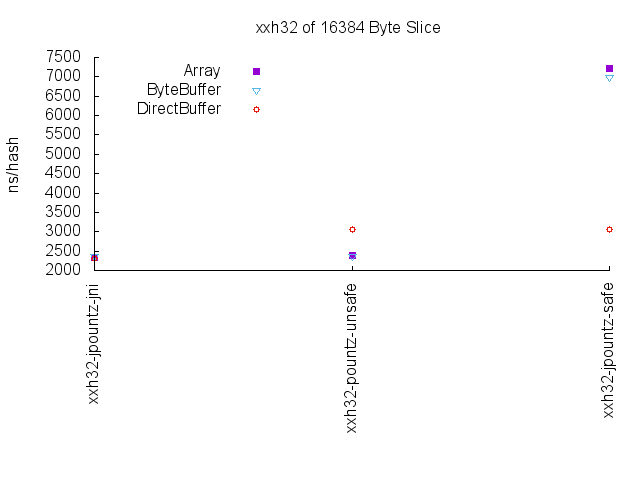

| Algorithm |  Array | ByteBuffer | DirectBuffer |
| --- | ---: | ---: | ---: | 
| [xxh32-jpountz-jni](#xxh32-jpountz-jni-latency) | 2345.265668 | 2348.737646 | 2319.410775 |
| [xxh32-pountz-unsafe](#xxh32-pountz-unsafe-latency) | 2389.391166 | 2363.950842 | 3069.066888 |
| [xxh32-jpountz-safe](#xxh32-jpountz-safe-latency) | 7213.864906 | 6971.252520 | 3051.091952 |

---
### 16384 Byte Slice Latency (xxh64)
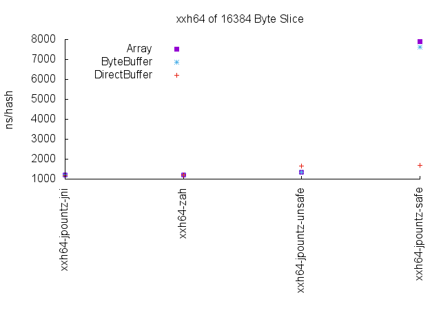

| Algorithm |  Array | ByteBuffer | DirectBuffer |
| --- | ---: | ---: | ---: | 
| [xxh64-jpountz-jni](#xxh64-jpountz-jni-latency) | 1203.961338 | 1204.581006 | 1187.021490 |
| [xxh64-zah](#xxh64-zah-latency) | 1208.602176 | 1207.088417 | 1208.775997 |
| [xxh64-jpountz-unsafe](#xxh64-jpountz-unsafe-latency) | 1340.620136 | 1349.257232 | 1671.265726 |
| [xxh64-jpountz-safe](#xxh64-jpountz-safe-latency) | 7890.575561 | 7632.941218 | 1697.269723 |

---
### 32768 Byte Slice Latency (All Hashes)
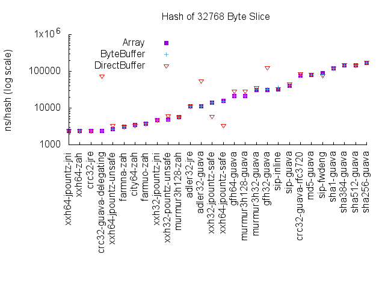

| Algorithm |  Array | ByteBuffer | DirectBuffer |
| --- | ---: | ---: | ---: | 
| [xxh64-jpountz-jni](#xxh64-jpountz-jni-latency) | 2380.368762 | 2385.268557 | 2360.514713 |
| [xxh64-zah](#xxh64-zah-latency) | 2390.527838 | 2405.636334 | 2407.927270 |
| [crc32-jre](#crc32-jre-latency) | 2401.528226 | 2384.147800 | 2386.571084 |
| [crc32-guava-delegating](#crc32-guava-delegating-latency) | 2423.860972 | 2425.582823 | 74421.631754 |
| [xxh64-jpountz-unsafe](#xxh64-jpountz-unsafe-latency) | 2625.920260 | 2627.039880 | 3315.119165 |
| [farmna-zah](#farmna-zah-latency) | 3089.890759 | 3046.746342 | 3083.324409 |
| [city64-zah](#city64-zah-latency) | 3438.144387 | 3416.325449 | 3359.660290 |
| [farmuo-zah](#farmuo-zah-latency) | 3708.282022 | 3706.254049 | 3692.214118 |
| [xxh32-jpountz-jni](#xxh32-jpountz-jni-latency) | 4657.270559 | 4690.364705 | 4616.203231 |
| [xxh32-pountz-unsafe](#xxh32-pountz-unsafe-latency) | 4800.621012 | 4708.327743 | 6051.738368 |
| [murmur3h128-zah](#murmur3h128-zah-latency) | 5720.792804 | 5751.413659 | 5631.585269 |
| [adler32-jre](#adler32-jre-latency) | 11114.580450 | 11066.070878 | 11052.287320 |
| [adler32-guava](#adler32-guava-latency) | 11146.871388 | 11034.337814 | 54634.024989 |
| [xxh32-jpountz-safe](#xxh32-jpountz-safe-latency) | 14160.791893 | 14011.382436 | 5832.869199 |
| [xxh64-jpountz-safe](#xxh64-jpountz-safe-latency) | 15707.489944 | 15358.061499 | 3372.459323 |
| [gfh64-guava](#gfh64-guava-latency) | 21034.984621 | 21676.393994 | 28408.543364 |
| [murmur3h128-guava](#murmur3h128-guava-latency) | 21659.369981 | 21679.636378 | 28720.143112 |
| [murmur3h32-guava](#murmur3h32-guava-latency) | 30678.507778 | 32586.012794 | 36302.458227 |
| [gfh32-guava](#gfh32-guava-latency) | 30944.669084 | 31689.266496 | 125225.619215 |
| [sip-inline](#sip-inline-latency) | 32183.402543 | 36161.251757 | 33746.254863 |
| [sip-guava](#sip-guava-latency) | 40254.575518 | 40437.489784 | 45079.382589 |
| [crc32-guava-rfc3720](#crc32-guava-rfc3720-latency) | 76643.879868 | 77348.671026 | 84928.054695 |
| [md5-guava](#md5-guava-latency) | 79387.514922 | 79391.106203 | 84097.534536 |
| [sip-fwdeng](#sip-fwdeng-latency) | 88251.262447 | 79705.728623 | 77500.753143 |
| [sha1-guava](#sha1-guava-latency) | 119280.120714 | 118736.977449 | 122764.393684 |
| [sha384-guava](#sha384-guava-latency) | 143940.847055 | 144003.521778 | 150127.509014 |
| [sha512-guava](#sha512-guava-latency) | 145353.308216 | 143866.918107 | 148330.245774 |
| [sha256-guava](#sha256-guava-latency) | 171755.187559 | 171883.147530 | 176533.257157 |

---
### 32768 Byte Slice Latency (adler32)
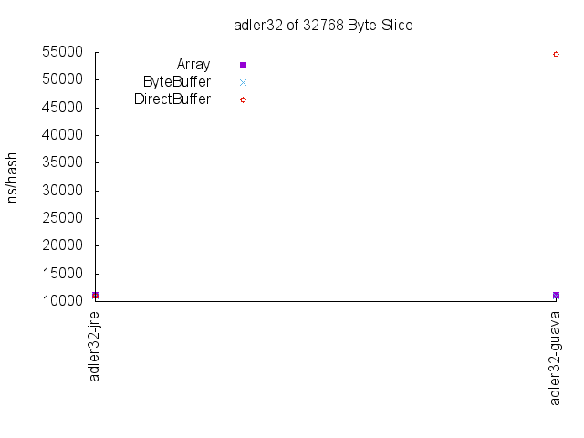

| Algorithm |  Array | ByteBuffer | DirectBuffer |
| --- | ---: | ---: | ---: | 
| [adler32-jre](#adler32-jre-latency) | 11114.580450 | 11066.070878 | 11052.287320 |
| [adler32-guava](#adler32-guava-latency) | 11146.871388 | 11034.337814 | 54634.024989 |

---
### 32768 Byte Slice Latency (city64)
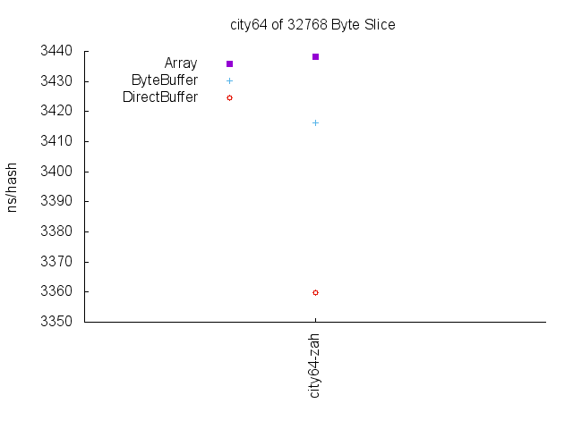

| Algorithm |  Array | ByteBuffer | DirectBuffer |
| --- | ---: | ---: | ---: | 
| [city64-zah](#city64-zah-latency) | 3438.144387 | 3416.325449 | 3359.660290 |

---
### 32768 Byte Slice Latency (crc32)
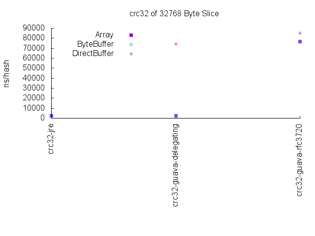

| Algorithm |  Array | ByteBuffer | DirectBuffer |
| --- | ---: | ---: | ---: | 
| [crc32-jre](#crc32-jre-latency) | 2401.528226 | 2384.147800 | 2386.571084 |
| [crc32-guava-delegating](#crc32-guava-delegating-latency) | 2423.860972 | 2425.582823 | 74421.631754 |
| [crc32-guava-rfc3720](#crc32-guava-rfc3720-latency) | 76643.879868 | 77348.671026 | 84928.054695 |

---
### 32768 Byte Slice Latency (farmna)
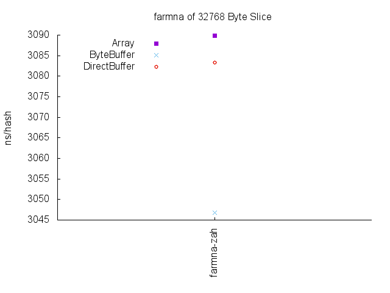

| Algorithm |  Array | ByteBuffer | DirectBuffer |
| --- | ---: | ---: | ---: | 
| [farmna-zah](#farmna-zah-latency) | 3089.890759 | 3046.746342 | 3083.324409 |

---
### 32768 Byte Slice Latency (farmuo)
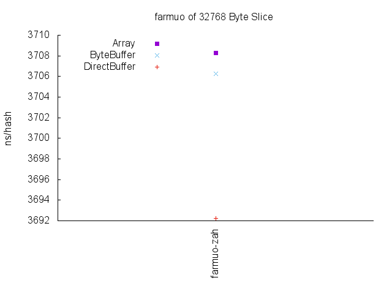

| Algorithm |  Array | ByteBuffer | DirectBuffer |
| --- | ---: | ---: | ---: | 
| [farmuo-zah](#farmuo-zah-latency) | 3708.282022 | 3706.254049 | 3692.214118 |

---
### 32768 Byte Slice Latency (gfh32)
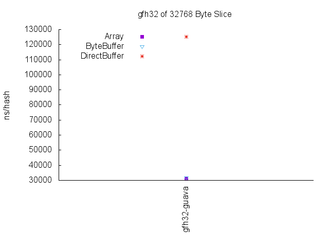

| Algorithm |  Array | ByteBuffer | DirectBuffer |
| --- | ---: | ---: | ---: | 
| [gfh32-guava](#gfh32-guava-latency) | 30944.669084 | 31689.266496 | 125225.619215 |

---
### 32768 Byte Slice Latency (gfh64)
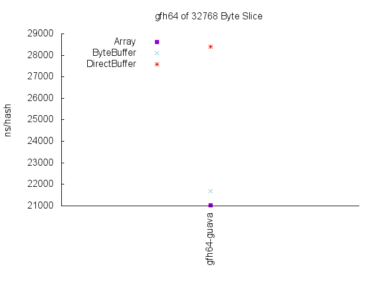

| Algorithm |  Array | ByteBuffer | DirectBuffer |
| --- | ---: | ---: | ---: | 
| [gfh64-guava](#gfh64-guava-latency) | 21034.984621 | 21676.393994 | 28408.543364 |

---
### 32768 Byte Slice Latency (md5)
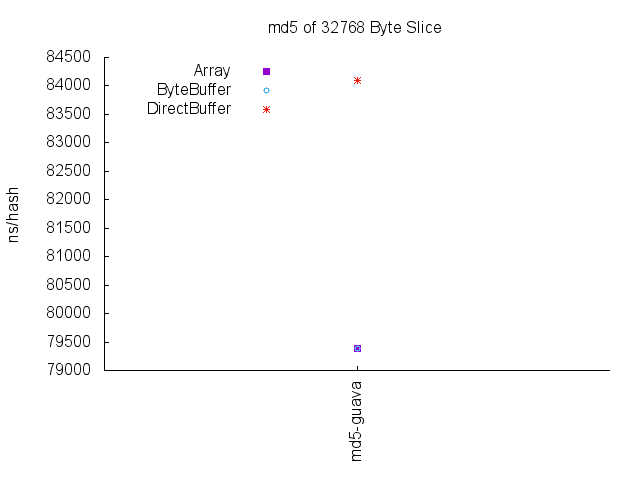

| Algorithm |  Array | ByteBuffer | DirectBuffer |
| --- | ---: | ---: | ---: | 
| [md5-guava](#md5-guava-latency) | 79387.514922 | 79391.106203 | 84097.534536 |

---
### 32768 Byte Slice Latency (murmur3h128)
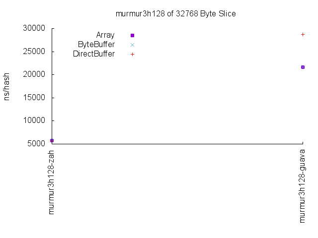

| Algorithm |  Array | ByteBuffer | DirectBuffer |
| --- | ---: | ---: | ---: | 
| [murmur3h128-zah](#murmur3h128-zah-latency) | 5720.792804 | 5751.413659 | 5631.585269 |
| [murmur3h128-guava](#murmur3h128-guava-latency) | 21659.369981 | 21679.636378 | 28720.143112 |

---
### 32768 Byte Slice Latency (murmur3h32)
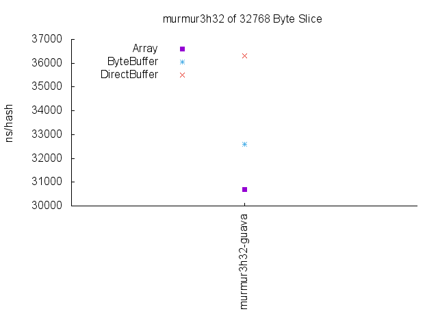

| Algorithm |  Array | ByteBuffer | DirectBuffer |
| --- | ---: | ---: | ---: | 
| [murmur3h32-guava](#murmur3h32-guava-latency) | 30678.507778 | 32586.012794 | 36302.458227 |

---
### 32768 Byte Slice Latency (sha1)
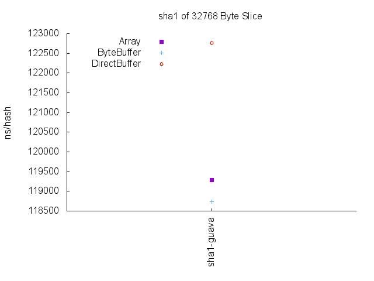

| Algorithm |  Array | ByteBuffer | DirectBuffer |
| --- | ---: | ---: | ---: | 
| [sha1-guava](#sha1-guava-latency) | 119280.120714 | 118736.977449 | 122764.393684 |

---
### 32768 Byte Slice Latency (sha256)
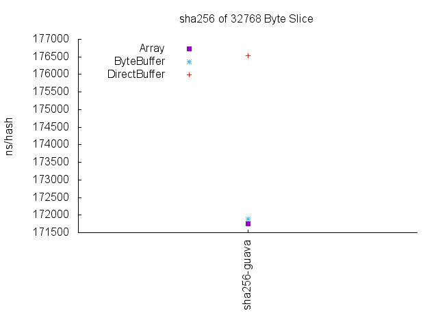

| Algorithm |  Array | ByteBuffer | DirectBuffer |
| --- | ---: | ---: | ---: | 
| [sha256-guava](#sha256-guava-latency) | 171755.187559 | 171883.147530 | 176533.257157 |

---
### 32768 Byte Slice Latency (sha384)
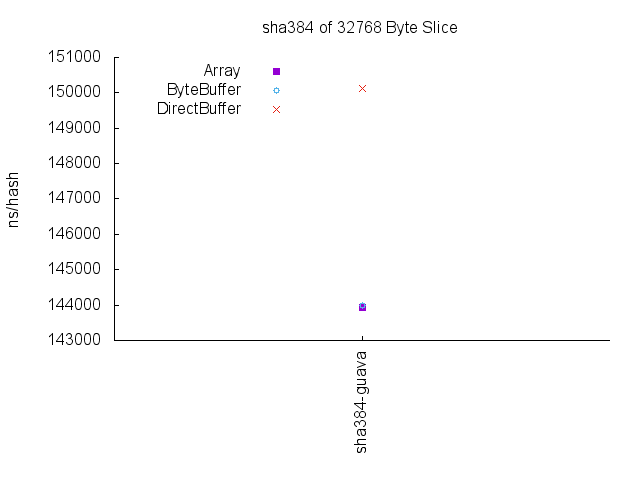

| Algorithm |  Array | ByteBuffer | DirectBuffer |
| --- | ---: | ---: | ---: | 
| [sha384-guava](#sha384-guava-latency) | 143940.847055 | 144003.521778 | 150127.509014 |

---
### 32768 Byte Slice Latency (sha512)
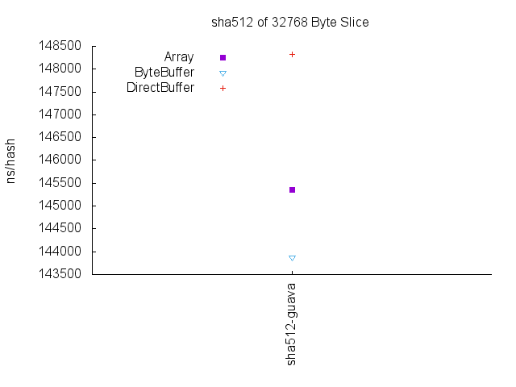

| Algorithm |  Array | ByteBuffer | DirectBuffer |
| --- | ---: | ---: | ---: | 
| [sha512-guava](#sha512-guava-latency) | 145353.308216 | 143866.918107 | 148330.245774 |

---
### 32768 Byte Slice Latency (sip)
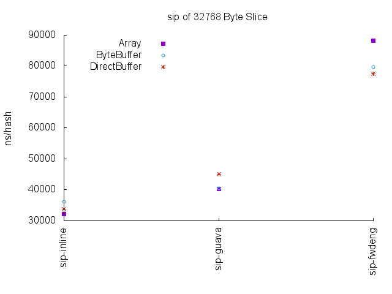

| Algorithm |  Array | ByteBuffer | DirectBuffer |
| --- | ---: | ---: | ---: | 
| [sip-inline](#sip-inline-latency) | 32183.402543 | 36161.251757 | 33746.254863 |
| [sip-guava](#sip-guava-latency) | 40254.575518 | 40437.489784 | 45079.382589 |
| [sip-fwdeng](#sip-fwdeng-latency) | 88251.262447 | 79705.728623 | 77500.753143 |

---
### 32768 Byte Slice Latency (xxh32)
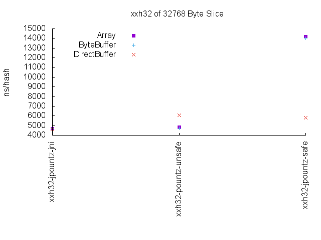

| Algorithm |  Array | ByteBuffer | DirectBuffer |
| --- | ---: | ---: | ---: | 
| [xxh32-jpountz-jni](#xxh32-jpountz-jni-latency) | 4657.270559 | 4690.364705 | 4616.203231 |
| [xxh32-pountz-unsafe](#xxh32-pountz-unsafe-latency) | 4800.621012 | 4708.327743 | 6051.738368 |
| [xxh32-jpountz-safe](#xxh32-jpountz-safe-latency) | 14160.791893 | 14011.382436 | 5832.869199 |

---
### 32768 Byte Slice Latency (xxh64)
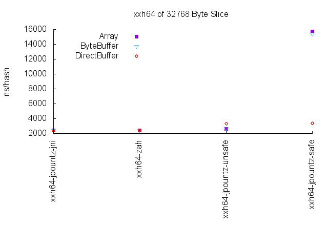

| Algorithm |  Array | ByteBuffer | DirectBuffer |
| --- | ---: | ---: | ---: | 
| [xxh64-jpountz-jni](#xxh64-jpountz-jni-latency) | 2380.368762 | 2385.268557 | 2360.514713 |
| [xxh64-zah](#xxh64-zah-latency) | 2390.527838 | 2405.636334 | 2407.927270 |
| [xxh64-jpountz-unsafe](#xxh64-jpountz-unsafe-latency) | 2625.920260 | 2627.039880 | 3315.119165 |
| [xxh64-jpountz-safe](#xxh64-jpountz-safe-latency) | 15707.489944 | 15358.061499 | 3372.459323 |

---
### adler32-guava Latency
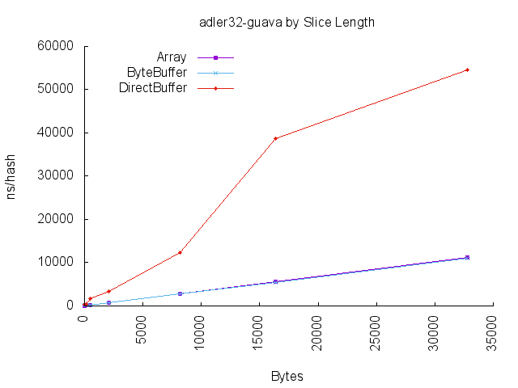

| Length |  Array | ByteBuffer | DirectBuffer |
| --- | ---: | ---: | ---: | 
| [32](#32-byte-slice-latency) | 70.228312 | 276.800252 | 441.129543 |
| [128](#128-byte-slice-latency) | 99.961990 | 170.484976 | 448.311493 |
| [512](#512-byte-slice-latency) | 222.250599 | 223.468297 | 1675.928055 |
| [2048](#2048-byte-slice-latency) | 723.927349 | 714.897015 | 3434.798442 |
| [8192](#8192-byte-slice-latency) | 2804.917773 | 2796.135897 | 12367.624295 |
| [16384](#16384-byte-slice-latency) | 5540.595227 | 5480.304749 | 38629.896046 |
| [32768](#32768-byte-slice-latency) | 11146.871388 | 11034.337814 | 54634.024989 |

---
### adler32-jre Latency
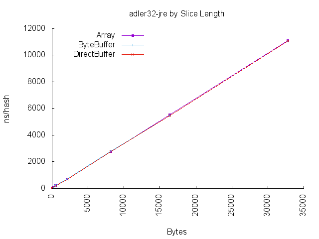

| Length |  Array | ByteBuffer | DirectBuffer |
| --- | ---: | ---: | ---: | 
| [32](#32-byte-slice-latency) | 53.687740 | 54.103057 | 31.668335 |
| [128](#128-byte-slice-latency) | 84.127674 | 83.854544 | 62.512425 |
| [512](#512-byte-slice-latency) | 208.548364 | 206.560098 | 186.245926 |
| [2048](#2048-byte-slice-latency) | 709.262811 | 706.884846 | 678.403923 |
| [8192](#8192-byte-slice-latency) | 2784.946087 | 2787.612245 | 2752.951945 |
| [16384](#16384-byte-slice-latency) | 5517.812427 | 5473.721711 | 5445.696899 |
| [32768](#32768-byte-slice-latency) | 11114.580450 | 11066.070878 | 11052.287320 |

---
### city64-zah Latency
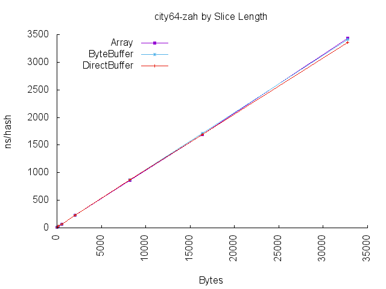

| Length |  Array | ByteBuffer | DirectBuffer |
| --- | ---: | ---: | ---: | 
| [32](#32-byte-slice-latency) | 9.305198 | 9.978260 | 10.270309 |
| [128](#128-byte-slice-latency) | 26.859760 | 27.475395 | 27.600570 |
| [512](#512-byte-slice-latency) | 68.884280 | 69.081371 | 69.182416 |
| [2048](#2048-byte-slice-latency) | 226.141389 | 226.560445 | 225.404298 |
| [8192](#8192-byte-slice-latency) | 863.575426 | 871.938353 | 869.690286 |
| [16384](#16384-byte-slice-latency) | 1690.354381 | 1706.749783 | 1687.897323 |
| [32768](#32768-byte-slice-latency) | 3438.144387 | 3416.325449 | 3359.660290 |

---
### crc32-guava-delegating Latency
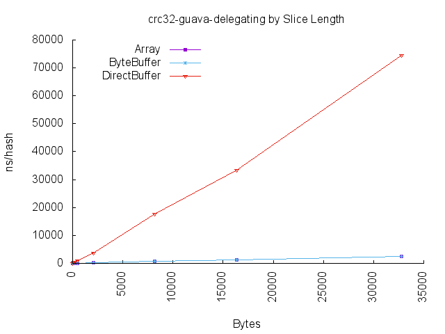

| Length |  Array | ByteBuffer | DirectBuffer |
| --- | ---: | ---: | ---: | 
| [32](#32-byte-slice-latency) | 78.337958 | 189.419387 | 103.814422 |
| [128](#128-byte-slice-latency) | 95.486455 | 94.579462 | 481.371634 |
| [512](#512-byte-slice-latency) | 117.734924 | 115.299355 | 1002.368512 |
| [2048](#2048-byte-slice-latency) | 220.451246 | 225.588961 | 3862.659993 |
| [8192](#8192-byte-slice-latency) | 660.232137 | 663.139282 | 17607.577697 |
| [16384](#16384-byte-slice-latency) | 1239.014786 | 1246.556833 | 33291.464950 |
| [32768](#32768-byte-slice-latency) | 2423.860972 | 2425.582823 | 74421.631754 |

---
### crc32-guava-rfc3720 Latency
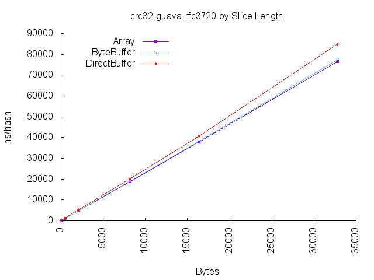

| Length |  Array | ByteBuffer | DirectBuffer |
| --- | ---: | ---: | ---: | 
| [32](#32-byte-slice-latency) | 86.610668 | 87.137662 | 179.074493 |
| [128](#128-byte-slice-latency) | 306.437899 | 310.139085 | 329.198145 |
| [512](#512-byte-slice-latency) | 1189.270776 | 1195.526446 | 1294.536760 |
| [2048](#2048-byte-slice-latency) | 4736.432035 | 4763.059344 | 5211.789777 |
| [8192](#8192-byte-slice-latency) | 18913.402130 | 19094.534760 | 20095.340613 |
| [16384](#16384-byte-slice-latency) | 37966.507010 | 38163.428605 | 40648.272806 |
| [32768](#32768-byte-slice-latency) | 76643.879868 | 77348.671026 | 84928.054695 |

---
### crc32-jre Latency
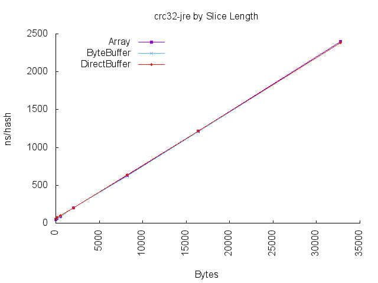

| Length |  Array | ByteBuffer | DirectBuffer |
| --- | ---: | ---: | ---: | 
| [32](#32-byte-slice-latency) | 46.249007 | 52.524491 | 55.148369 |
| [128](#128-byte-slice-latency) | 64.757482 | 72.871861 | 75.660112 |
| [512](#512-byte-slice-latency) | 87.208768 | 86.054930 | 99.229936 |
| [2048](#2048-byte-slice-latency) | 201.139532 | 201.131968 | 206.088386 |
| [8192](#8192-byte-slice-latency) | 631.240662 | 626.636397 | 638.001977 |
| [16384](#16384-byte-slice-latency) | 1217.229126 | 1210.076302 | 1215.740851 |
| [32768](#32768-byte-slice-latency) | 2401.528226 | 2384.147800 | 2386.571084 |

---
### farmna-zah Latency
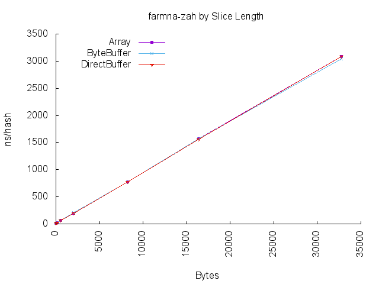

| Length |  Array | ByteBuffer | DirectBuffer |
| --- | ---: | ---: | ---: | 
| [32](#32-byte-slice-latency) | 9.318889 | 11.089306 | 12.435866 |
| [128](#128-byte-slice-latency) | 23.135849 | 25.234939 | 23.730196 |
| [512](#512-byte-slice-latency) | 62.507336 | 60.854187 | 60.123589 |
| [2048](#2048-byte-slice-latency) | 198.268147 | 205.950063 | 199.930802 |
| [8192](#8192-byte-slice-latency) | 774.580882 | 770.364808 | 772.127828 |
| [16384](#16384-byte-slice-latency) | 1566.832369 | 1565.532413 | 1554.215131 |
| [32768](#32768-byte-slice-latency) | 3089.890759 | 3046.746342 | 3083.324409 |

---
### farmuo-zah Latency
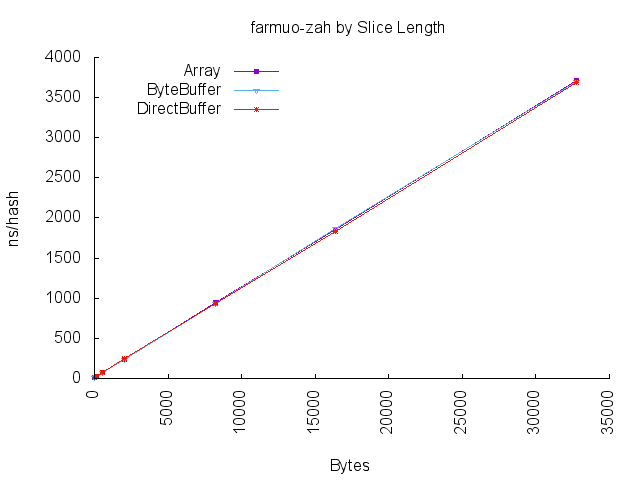

| Length |  Array | ByteBuffer | DirectBuffer |
| --- | ---: | ---: | ---: | 
| [32](#32-byte-slice-latency) | 9.543668 | 9.890599 | 10.181759 |
| [128](#128-byte-slice-latency) | 26.187915 | 26.662388 | 26.868761 |
| [512](#512-byte-slice-latency) | 69.724510 | 69.613480 | 69.356702 |
| [2048](#2048-byte-slice-latency) | 242.530414 | 242.006690 | 243.573499 |
| [8192](#8192-byte-slice-latency) | 941.708371 | 936.201074 | 932.240643 |
| [16384](#16384-byte-slice-latency) | 1853.741327 | 1864.809362 | 1834.342480 |
| [32768](#32768-byte-slice-latency) | 3708.282022 | 3706.254049 | 3692.214118 |

---
### gfh32-guava Latency
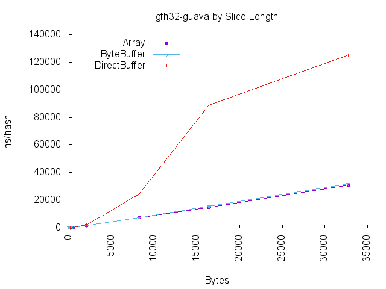

| Length |  Array | ByteBuffer | DirectBuffer |
| --- | ---: | ---: | ---: | 
| [32](#32-byte-slice-latency) | 73.903763 | 426.521775 | 103.386096 |
| [128](#128-byte-slice-latency) | 171.159509 | 150.877728 | 189.236132 |
| [512](#512-byte-slice-latency) | 581.854421 | 572.846671 | 599.887975 |
| [2048](#2048-byte-slice-latency) | 1935.852081 | 1860.027871 | 2335.156586 |
| [8192](#8192-byte-slice-latency) | 7401.251901 | 7545.164386 | 24428.932361 |
| [16384](#16384-byte-slice-latency) | 14776.562413 | 15676.134083 | 89068.199782 |
| [32768](#32768-byte-slice-latency) | 30944.669084 | 31689.266496 | 125225.619215 |

---
### gfh64-guava Latency
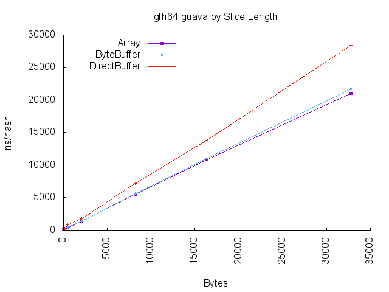

| Length |  Array | ByteBuffer | DirectBuffer |
| --- | ---: | ---: | ---: | 
| [32](#32-byte-slice-latency) | 113.700324 | 138.290741 | 294.797689 |
| [128](#128-byte-slice-latency) | 204.238034 | 210.886580 | 265.027823 |
| [512](#512-byte-slice-latency) | 404.987602 | 440.572325 | 808.680908 |
| [2048](#2048-byte-slice-latency) | 1367.233545 | 1420.078160 | 1783.447168 |
| [8192](#8192-byte-slice-latency) | 5473.728646 | 5610.166822 | 7203.815080 |
| [16384](#16384-byte-slice-latency) | 10864.269153 | 10996.858461 | 13827.758018 |
| [32768](#32768-byte-slice-latency) | 21034.984621 | 21676.393994 | 28408.543364 |

---
### md5-guava Latency
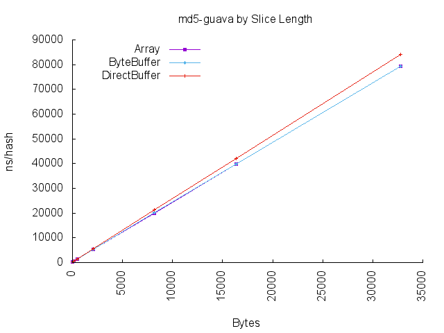

| Length |  Array | ByteBuffer | DirectBuffer |
| --- | ---: | ---: | ---: | 
| [32](#32-byte-slice-latency) | 256.252213 | 264.576888 | 304.423085 |
| [128](#128-byte-slice-latency) | 562.783425 | 570.851746 | 627.886164 |
| [512](#512-byte-slice-latency) | 1501.076117 | 1487.524977 | 1526.049796 |
| [2048](#2048-byte-slice-latency) | 5218.219373 | 5216.321197 | 5571.665493 |
| [8192](#8192-byte-slice-latency) | 20021.580078 | 20165.734334 | 21171.290892 |
| [16384](#16384-byte-slice-latency) | 39809.363340 | 39868.589558 | 42104.588968 |
| [32768](#32768-byte-slice-latency) | 79387.514922 | 79391.106203 | 84097.534536 |

---
### murmur3h128-guava Latency
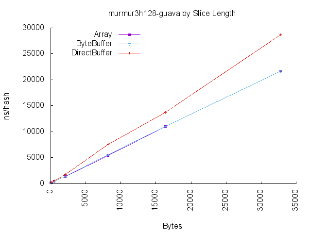

| Length |  Array | ByteBuffer | DirectBuffer |
| --- | ---: | ---: | ---: | 
| [32](#32-byte-slice-latency) | 143.932781 | 143.667593 | 161.442102 |
| [128](#128-byte-slice-latency) | 169.072641 | 206.201028 | 235.070169 |
| [512](#512-byte-slice-latency) | 441.032576 | 437.420018 | 530.601150 |
| [2048](#2048-byte-slice-latency) | 1378.388178 | 1422.684735 | 1819.172173 |
| [8192](#8192-byte-slice-latency) | 5447.569712 | 5613.046362 | 7529.872798 |
| [16384](#16384-byte-slice-latency) | 10982.403323 | 11055.068505 | 13710.384398 |
| [32768](#32768-byte-slice-latency) | 21659.369981 | 21679.636378 | 28720.143112 |

---
### murmur3h128-zah Latency
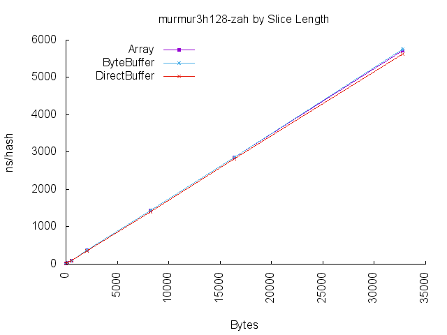

| Length |  Array | ByteBuffer | DirectBuffer |
| --- | ---: | ---: | ---: | 
| [32](#32-byte-slice-latency) | 14.187194 | 14.816279 | 15.424621 |
| [128](#128-byte-slice-latency) | 30.202873 | 31.331673 | 31.468840 |
| [512](#512-byte-slice-latency) | 94.557319 | 97.421597 | 99.494060 |
| [2048](#2048-byte-slice-latency) | 368.943683 | 367.724496 | 363.424115 |
| [8192](#8192-byte-slice-latency) | 1431.845680 | 1432.833283 | 1410.516590 |
| [16384](#16384-byte-slice-latency) | 2854.970635 | 2853.909960 | 2815.122276 |
| [32768](#32768-byte-slice-latency) | 5720.792804 | 5751.413659 | 5631.585269 |

---
### murmur3h32-guava Latency
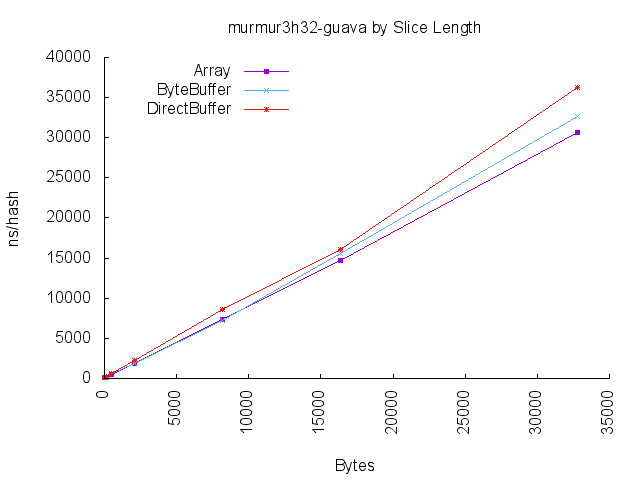

| Length |  Array | ByteBuffer | DirectBuffer |
| --- | ---: | ---: | ---: | 
| [32](#32-byte-slice-latency) | 88.787669 | 90.826119 | 105.705922 |
| [128](#128-byte-slice-latency) | 175.429601 | 151.141668 | 195.444081 |
| [512](#512-byte-slice-latency) | 559.598425 | 575.064299 | 668.000088 |
| [2048](#2048-byte-slice-latency) | 1845.579809 | 1912.384855 | 2198.085825 |
| [8192](#8192-byte-slice-latency) | 7351.259486 | 7260.496797 | 8605.771196 |
| [16384](#16384-byte-slice-latency) | 14654.653613 | 15550.095846 | 16115.942441 |
| [32768](#32768-byte-slice-latency) | 30678.507778 | 32586.012794 | 36302.458227 |

---
### sha1-guava Latency
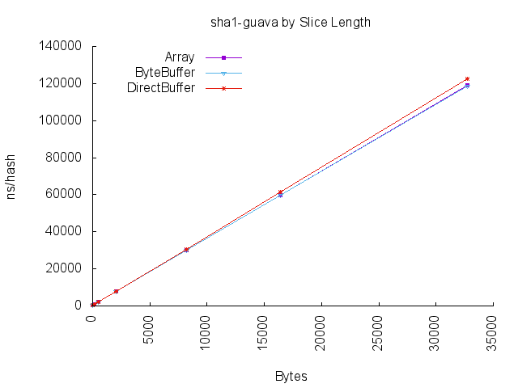

| Length |  Array | ByteBuffer | DirectBuffer |
| --- | ---: | ---: | ---: | 
| [32](#32-byte-slice-latency) | 373.647209 | 377.206715 | 376.714958 |
| [128](#128-byte-slice-latency) | 821.405600 | 841.758671 | 865.951756 |
| [512](#512-byte-slice-latency) | 2209.942315 | 2268.987565 | 2296.767810 |
| [2048](#2048-byte-slice-latency) | 7817.532640 | 7754.091337 | 7963.366729 |
| [8192](#8192-byte-slice-latency) | 29980.574026 | 29959.439188 | 30534.817509 |
| [16384](#16384-byte-slice-latency) | 59549.879879 | 59566.880781 | 61312.406574 |
| [32768](#32768-byte-slice-latency) | 119280.120714 | 118736.977449 | 122764.393684 |

---
### sha256-guava Latency
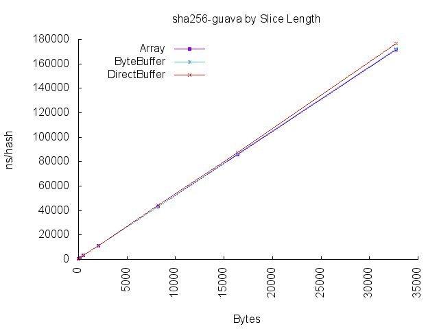

| Length |  Array | ByteBuffer | DirectBuffer |
| --- | ---: | ---: | ---: | 
| [32](#32-byte-slice-latency) | 474.348048 | 513.363823 | 508.145193 |
| [128](#128-byte-slice-latency) | 1145.344054 | 1132.934457 | 1170.367892 |
| [512](#512-byte-slice-latency) | 3143.110033 | 3133.506005 | 3175.511132 |
| [2048](#2048-byte-slice-latency) | 11252.581079 | 11259.835382 | 11384.752167 |
| [8192](#8192-byte-slice-latency) | 43253.509883 | 43310.251348 | 44271.933872 |
| [16384](#16384-byte-slice-latency) | 86024.095974 | 86557.270307 | 87520.811714 |
| [32768](#32768-byte-slice-latency) | 171755.187559 | 171883.147530 | 176533.257157 |

---
### sha384-guava Latency
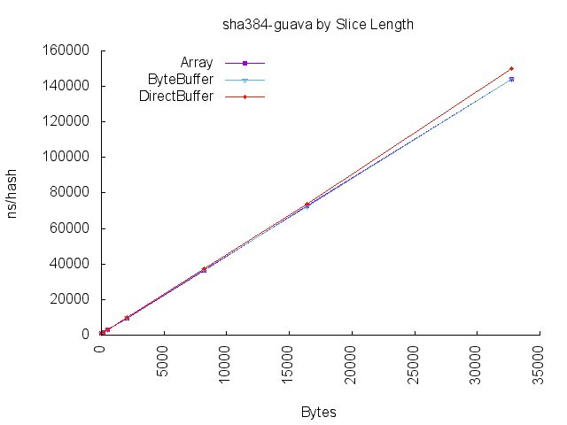

| Length |  Array | ByteBuffer | DirectBuffer |
| --- | ---: | ---: | ---: | 
| [32](#32-byte-slice-latency) | 783.414616 | 809.091938 | 815.982830 |
| [128](#128-byte-slice-latency) | 1453.544450 | 1356.585091 | 1388.182188 |
| [512](#512-byte-slice-latency) | 3030.320433 | 3035.871590 | 3115.125479 |
| [2048](#2048-byte-slice-latency) | 9717.124088 | 9923.057690 | 10077.259824 |
| [8192](#8192-byte-slice-latency) | 36572.576490 | 36797.736141 | 37224.304633 |
| [16384](#16384-byte-slice-latency) | 72723.671380 | 72417.642993 | 73811.373478 |
| [32768](#32768-byte-slice-latency) | 143940.847055 | 144003.521778 | 150127.509014 |

---
### sha512-guava Latency
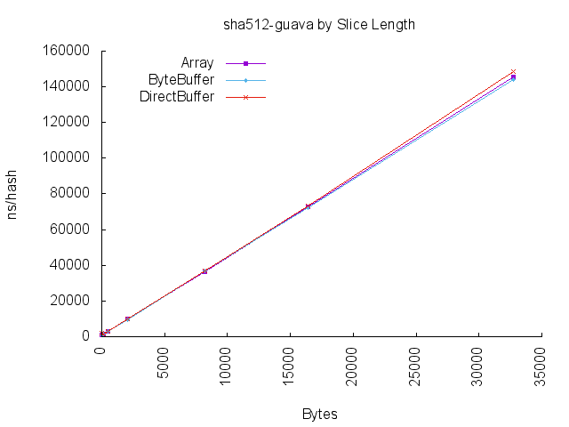

| Length |  Array | ByteBuffer | DirectBuffer |
| --- | ---: | ---: | ---: | 
| [32](#32-byte-slice-latency) | 809.826353 | 809.898284 | 2193.189417 |
| [128](#128-byte-slice-latency) | 1359.388914 | 1336.211081 | 1416.478714 |
| [512](#512-byte-slice-latency) | 3066.871178 | 3067.414617 | 3101.802991 |
| [2048](#2048-byte-slice-latency) | 9774.716596 | 9717.628238 | 9908.518912 |
| [8192](#8192-byte-slice-latency) | 36603.590359 | 36784.770836 | 37086.277519 |
| [16384](#16384-byte-slice-latency) | 72751.827789 | 72333.053117 | 73454.372132 |
| [32768](#32768-byte-slice-latency) | 145353.308216 | 143866.918107 | 148330.245774 |

---
### sip-fwdeng Latency

| Length |  Array | ByteBuffer | DirectBuffer |
| --- | ---: | ---: | ---: | 
| [32](#32-byte-slice-latency) | 115.911599 | 160.256986 | 130.118900 |
| [128](#128-byte-slice-latency) | 351.891534 | 378.130783 | 372.295617 |
| [512](#512-byte-slice-latency) | 1290.066697 | 1313.169428 | 1329.806663 |
| [2048](#2048-byte-slice-latency) | 6163.853022 | 5276.348001 | 5220.568085 |
| [8192](#8192-byte-slice-latency) | 20649.315061 | 20586.152063 | 20675.668434 |
| [16384](#16384-byte-slice-latency) | 45075.352907 | 40094.854403 | 38229.026857 |
| [32768](#32768-byte-slice-latency) | 88251.262447 | 79705.728623 | 77500.753143 |

---
### sip-guava Latency
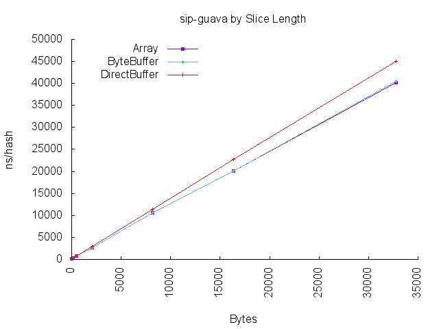

| Length |  Array | ByteBuffer | DirectBuffer |
| --- | ---: | ---: | ---: | 
| [32](#32-byte-slice-latency) | 114.210181 | 117.734772 | 144.370386 |
| [128](#128-byte-slice-latency) | 245.128540 | 238.690821 | 275.086154 |
| [512](#512-byte-slice-latency) | 708.366884 | 726.981952 | 755.879395 |
| [2048](#2048-byte-slice-latency) | 2573.507175 | 2665.203032 | 3033.936649 |
| [8192](#8192-byte-slice-latency) | 10633.811631 | 10660.133912 | 11340.012188 |
| [16384](#16384-byte-slice-latency) | 20068.678521 | 20044.420004 | 22698.930537 |
| [32768](#32768-byte-slice-latency) | 40254.575518 | 40437.489784 | 45079.382589 |

---
### sip-inline Latency
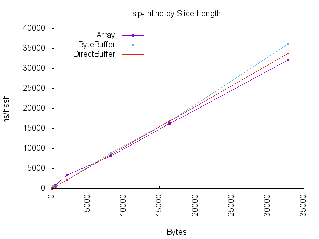

| Length |  Array | ByteBuffer | DirectBuffer |
| --- | ---: | ---: | ---: | 
| [32](#32-byte-slice-latency) | 53.217922 | 73.818454 | 73.598440 |
| [128](#128-byte-slice-latency) | 260.648982 | 631.553650 | 165.171154 |
| [512](#512-byte-slice-latency) | 928.184061 | 521.824070 | 554.917638 |
| [2048](#2048-byte-slice-latency) | 3375.845187 | 2172.786194 | 2107.627708 |
| [8192](#8192-byte-slice-latency) | 8089.873234 | 8877.879619 | 8471.871588 |
| [16384](#16384-byte-slice-latency) | 16171.705769 | 16780.972397 | 16860.587560 |
| [32768](#32768-byte-slice-latency) | 32183.402543 | 36161.251757 | 33746.254863 |

---
### xxh32-jpountz-jni Latency
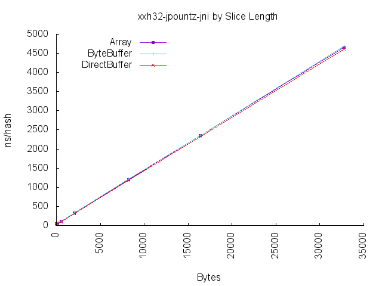

| Length |  Array | ByteBuffer | DirectBuffer |
| --- | ---: | ---: | ---: | 
| [32](#32-byte-slice-latency) | 42.020588 | 43.212266 | 33.348429 |
| [128](#128-byte-slice-latency) | 55.155205 | 57.301066 | 46.936454 |
| [512](#512-byte-slice-latency) | 109.334147 | 111.477262 | 99.894591 |
| [2048](#2048-byte-slice-latency) | 330.130734 | 331.357512 | 316.938871 |
| [8192](#8192-byte-slice-latency) | 1193.147810 | 1213.111597 | 1181.035373 |
| [16384](#16384-byte-slice-latency) | 2345.265668 | 2348.737646 | 2319.410775 |
| [32768](#32768-byte-slice-latency) | 4657.270559 | 4690.364705 | 4616.203231 |

---
### xxh32-jpountz-safe Latency
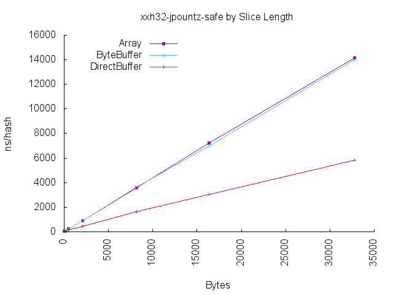

| Length |  Array | ByteBuffer | DirectBuffer |
| --- | ---: | ---: | ---: | 
| [32](#32-byte-slice-latency) | 25.102526 | 27.732716 | 26.564007 |
| [128](#128-byte-slice-latency) | 66.604318 | 69.739320 | 49.616772 |
| [512](#512-byte-slice-latency) | 235.375356 | 237.936719 | 128.086383 |
| [2048](#2048-byte-slice-latency) | 913.626016 | 917.573483 | 427.816846 |
| [8192](#8192-byte-slice-latency) | 3610.119868 | 3617.064914 | 1626.720757 |
| [16384](#16384-byte-slice-latency) | 7213.864906 | 6971.252520 | 3051.091952 |
| [32768](#32768-byte-slice-latency) | 14160.791893 | 14011.382436 | 5832.869199 |

---
### xxh32-pountz-unsafe Latency
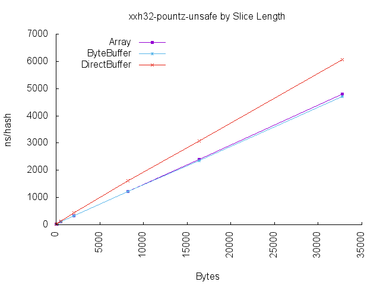

| Length |  Array | ByteBuffer | DirectBuffer |
| --- | ---: | ---: | ---: | 
| [32](#32-byte-slice-latency) | 14.377955 | 16.747627 | 26.705499 |
| [128](#128-byte-slice-latency) | 30.889040 | 32.647382 | 49.657725 |
| [512](#512-byte-slice-latency) | 102.600833 | 99.998160 | 127.551612 |
| [2048](#2048-byte-slice-latency) | 324.609765 | 324.510479 | 431.125492 |
| [8192](#8192-byte-slice-latency) | 1218.069329 | 1218.651114 | 1616.301580 |
| [16384](#16384-byte-slice-latency) | 2389.391166 | 2363.950842 | 3069.066888 |
| [32768](#32768-byte-slice-latency) | 4800.621012 | 4708.327743 | 6051.738368 |

---
### xxh64-jpountz-jni Latency
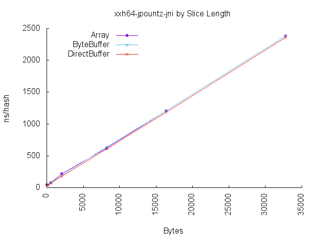

| Length |  Array | ByteBuffer | DirectBuffer |
| --- | ---: | ---: | ---: | 
| [32](#32-byte-slice-latency) | 44.132549 | 55.304329 | 35.272471 |
| [128](#128-byte-slice-latency) | 50.222542 | 52.626190 | 41.962187 |
| [512](#512-byte-slice-latency) | 78.290332 | 79.322221 | 68.614942 |
| [2048](#2048-byte-slice-latency) | 216.954038 | 191.201197 | 179.058704 |
| [8192](#8192-byte-slice-latency) | 623.007512 | 635.377809 | 609.046279 |
| [16384](#16384-byte-slice-latency) | 1203.961338 | 1204.581006 | 1187.021490 |
| [32768](#32768-byte-slice-latency) | 2380.368762 | 2385.268557 | 2360.514713 |

---
### xxh64-jpountz-safe Latency
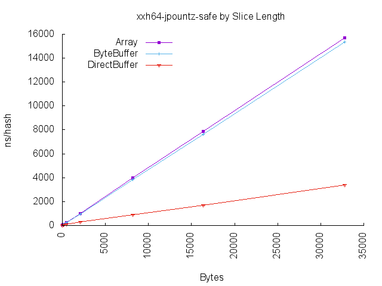

| Length |  Array | ByteBuffer | DirectBuffer |
| --- | ---: | ---: | ---: | 
| [32](#32-byte-slice-latency) | 28.635874 | 30.697939 | 21.771566 |
| [128](#128-byte-slice-latency) | 78.353303 | 78.213624 | 43.777337 |
| [512](#512-byte-slice-latency) | 262.961258 | 255.875263 | 96.212589 |
| [2048](#2048-byte-slice-latency) | 1001.827271 | 965.407042 | 275.348994 |
| [8192](#8192-byte-slice-latency) | 3967.368084 | 3813.828291 | 887.199713 |
| [16384](#16384-byte-slice-latency) | 7890.575561 | 7632.941218 | 1697.269723 |
| [32768](#32768-byte-slice-latency) | 15707.489944 | 15358.061499 | 3372.459323 |

---
### xxh64-jpountz-unsafe Latency
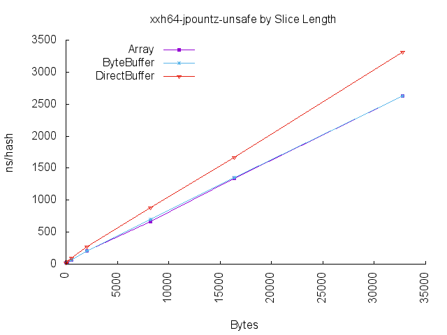

| Length |  Array | ByteBuffer | DirectBuffer |
| --- | ---: | ---: | ---: | 
| [32](#32-byte-slice-latency) | 16.376226 | 18.491530 | 23.900593 |
| [128](#128-byte-slice-latency) | 27.067989 | 28.960901 | 43.815873 |
| [512](#512-byte-slice-latency) | 67.403677 | 69.790258 | 95.568604 |
| [2048](#2048-byte-slice-latency) | 207.346755 | 208.028205 | 271.879200 |
| [8192](#8192-byte-slice-latency) | 662.024637 | 693.266101 | 879.820771 |
| [16384](#16384-byte-slice-latency) | 1340.620136 | 1349.257232 | 1671.265726 |
| [32768](#32768-byte-slice-latency) | 2625.920260 | 2627.039880 | 3315.119165 |

---
### xxh64-zah Latency
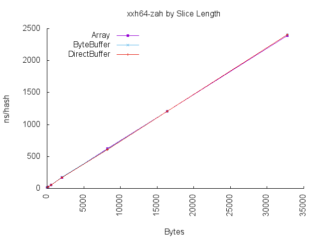

| Length |  Array | ByteBuffer | DirectBuffer |
| --- | ---: | ---: | ---: | 
| [32](#32-byte-slice-latency) | 16.652337 | 17.335254 | 18.093858 |
| [128](#128-byte-slice-latency) | 23.733747 | 24.961086 | 25.307009 |
| [512](#512-byte-slice-latency) | 54.178686 | 55.529989 | 55.981312 |
| [2048](#2048-byte-slice-latency) | 171.974963 | 175.427534 | 174.807736 |
| [8192](#8192-byte-slice-latency) | 622.269191 | 616.578558 | 608.765918 |
| [16384](#16384-byte-slice-latency) | 1208.602176 | 1207.088417 | 1208.775997 |
| [32768](#32768-byte-slice-latency) | 2390.527838 | 2405.636334 | 2407.927270 |

---
Generated from [JMH CSV](jmh-result.csv) on Sun, 27 Sep 2015 04:39:20 +0000 by [Hash-Bench](https://github.com/benalexau/hash-bench).
