# Hash-Bench Results
## Contents
### Latency by Byte Slice Length
| Hash | 32 |128 |512 |2048 |8192 |16384 |32768 |
| --- | :---: | :---: | :---: | :---: | :---: | :---: | :---: | 
| All | [*](#32-byte-slice-latency-all-hashes) | [*](#128-byte-slice-latency-all-hashes) | [*](#512-byte-slice-latency-all-hashes) | [*](#2048-byte-slice-latency-all-hashes) | [*](#8192-byte-slice-latency-all-hashes) | [*](#16384-byte-slice-latency-all-hashes) | [*](#32768-byte-slice-latency-all-hashes) | 
| adler32 | [*](#32-byte-slice-latency-adler32) | [*](#128-byte-slice-latency-adler32) | [*](#512-byte-slice-latency-adler32) | [*](#2048-byte-slice-latency-adler32) | [*](#8192-byte-slice-latency-adler32) | [*](#16384-byte-slice-latency-adler32) | [*](#32768-byte-slice-latency-adler32) | 
| city64 | [*](#32-byte-slice-latency-city64) | [*](#128-byte-slice-latency-city64) | [*](#512-byte-slice-latency-city64) | [*](#2048-byte-slice-latency-city64) | [*](#8192-byte-slice-latency-city64) | [*](#16384-byte-slice-latency-city64) | [*](#32768-byte-slice-latency-city64) | 
| cksum | [*](#32-byte-slice-latency-cksum) | [*](#128-byte-slice-latency-cksum) | [*](#512-byte-slice-latency-cksum) | [*](#2048-byte-slice-latency-cksum) | [*](#8192-byte-slice-latency-cksum) | [*](#16384-byte-slice-latency-cksum) | [*](#32768-byte-slice-latency-cksum) | 
| crc16 | [*](#32-byte-slice-latency-crc16) | [*](#128-byte-slice-latency-crc16) | [*](#512-byte-slice-latency-crc16) | [*](#2048-byte-slice-latency-crc16) | [*](#8192-byte-slice-latency-crc16) | [*](#16384-byte-slice-latency-crc16) | [*](#32768-byte-slice-latency-crc16) | 
| crc24 | [*](#32-byte-slice-latency-crc24) | [*](#128-byte-slice-latency-crc24) | [*](#512-byte-slice-latency-crc24) | [*](#2048-byte-slice-latency-crc24) | [*](#8192-byte-slice-latency-crc24) | [*](#16384-byte-slice-latency-crc24) | [*](#32768-byte-slice-latency-crc24) | 
| crc32 | [*](#32-byte-slice-latency-crc32) | [*](#128-byte-slice-latency-crc32) | [*](#512-byte-slice-latency-crc32) | [*](#2048-byte-slice-latency-crc32) | [*](#8192-byte-slice-latency-crc32) | [*](#16384-byte-slice-latency-crc32) | [*](#32768-byte-slice-latency-crc32) | 
| crc64 | [*](#32-byte-slice-latency-crc64) | [*](#128-byte-slice-latency-crc64) | [*](#512-byte-slice-latency-crc64) | [*](#2048-byte-slice-latency-crc64) | [*](#8192-byte-slice-latency-crc64) | [*](#16384-byte-slice-latency-crc64) | [*](#32768-byte-slice-latency-crc64) | 
| crc8 | [*](#32-byte-slice-latency-crc8) | [*](#128-byte-slice-latency-crc8) | [*](#512-byte-slice-latency-crc8) | [*](#2048-byte-slice-latency-crc8) | [*](#8192-byte-slice-latency-crc8) | [*](#16384-byte-slice-latency-crc8) | [*](#32768-byte-slice-latency-crc8) | 
| ed2k | [*](#32-byte-slice-latency-ed2k) | [*](#128-byte-slice-latency-ed2k) | [*](#512-byte-slice-latency-ed2k) | [*](#2048-byte-slice-latency-ed2k) | [*](#8192-byte-slice-latency-ed2k) | [*](#16384-byte-slice-latency-ed2k) | [*](#32768-byte-slice-latency-ed2k) | 
| elf | [*](#32-byte-slice-latency-elf) | [*](#128-byte-slice-latency-elf) | [*](#512-byte-slice-latency-elf) | [*](#2048-byte-slice-latency-elf) | [*](#8192-byte-slice-latency-elf) | [*](#16384-byte-slice-latency-elf) | [*](#32768-byte-slice-latency-elf) | 
| farmna | [*](#32-byte-slice-latency-farmna) | [*](#128-byte-slice-latency-farmna) | [*](#512-byte-slice-latency-farmna) | [*](#2048-byte-slice-latency-farmna) | [*](#8192-byte-slice-latency-farmna) | [*](#16384-byte-slice-latency-farmna) | [*](#32768-byte-slice-latency-farmna) | 
| farmuo | [*](#32-byte-slice-latency-farmuo) | [*](#128-byte-slice-latency-farmuo) | [*](#512-byte-slice-latency-farmuo) | [*](#2048-byte-slice-latency-farmuo) | [*](#8192-byte-slice-latency-farmuo) | [*](#16384-byte-slice-latency-farmuo) | [*](#32768-byte-slice-latency-farmuo) | 
| fcs16 | [*](#32-byte-slice-latency-fcs16) | [*](#128-byte-slice-latency-fcs16) | [*](#512-byte-slice-latency-fcs16) | [*](#2048-byte-slice-latency-fcs16) | [*](#8192-byte-slice-latency-fcs16) | [*](#16384-byte-slice-latency-fcs16) | [*](#32768-byte-slice-latency-fcs16) | 
| gfh32 | [*](#32-byte-slice-latency-gfh32) | [*](#128-byte-slice-latency-gfh32) | [*](#512-byte-slice-latency-gfh32) | [*](#2048-byte-slice-latency-gfh32) | [*](#8192-byte-slice-latency-gfh32) | [*](#16384-byte-slice-latency-gfh32) | [*](#32768-byte-slice-latency-gfh32) | 
| gfh64 | [*](#32-byte-slice-latency-gfh64) | [*](#128-byte-slice-latency-gfh64) | [*](#512-byte-slice-latency-gfh64) | [*](#2048-byte-slice-latency-gfh64) | [*](#8192-byte-slice-latency-gfh64) | [*](#16384-byte-slice-latency-gfh64) | [*](#32768-byte-slice-latency-gfh64) | 
| has160 | [*](#32-byte-slice-latency-has160) | [*](#128-byte-slice-latency-has160) | [*](#512-byte-slice-latency-has160) | [*](#2048-byte-slice-latency-has160) | [*](#8192-byte-slice-latency-has160) | [*](#16384-byte-slice-latency-has160) | [*](#32768-byte-slice-latency-has160) | 
| haval128h3 | [*](#32-byte-slice-latency-haval128h3) | [*](#128-byte-slice-latency-haval128h3) | [*](#512-byte-slice-latency-haval128h3) | [*](#2048-byte-slice-latency-haval128h3) | [*](#8192-byte-slice-latency-haval128h3) | [*](#16384-byte-slice-latency-haval128h3) | [*](#32768-byte-slice-latency-haval128h3) | 
| haval128h4 | [*](#32-byte-slice-latency-haval128h4) | [*](#128-byte-slice-latency-haval128h4) | [*](#512-byte-slice-latency-haval128h4) | [*](#2048-byte-slice-latency-haval128h4) | [*](#8192-byte-slice-latency-haval128h4) | [*](#16384-byte-slice-latency-haval128h4) | [*](#32768-byte-slice-latency-haval128h4) | 
| haval128h5 | [*](#32-byte-slice-latency-haval128h5) | [*](#128-byte-slice-latency-haval128h5) | [*](#512-byte-slice-latency-haval128h5) | [*](#2048-byte-slice-latency-haval128h5) | [*](#8192-byte-slice-latency-haval128h5) | [*](#16384-byte-slice-latency-haval128h5) | [*](#32768-byte-slice-latency-haval128h5) | 
| haval160h3 | [*](#32-byte-slice-latency-haval160h3) | [*](#128-byte-slice-latency-haval160h3) | [*](#512-byte-slice-latency-haval160h3) | [*](#2048-byte-slice-latency-haval160h3) | [*](#8192-byte-slice-latency-haval160h3) | [*](#16384-byte-slice-latency-haval160h3) | [*](#32768-byte-slice-latency-haval160h3) | 
| haval160h4 | [*](#32-byte-slice-latency-haval160h4) | [*](#128-byte-slice-latency-haval160h4) | [*](#512-byte-slice-latency-haval160h4) | [*](#2048-byte-slice-latency-haval160h4) | [*](#8192-byte-slice-latency-haval160h4) | [*](#16384-byte-slice-latency-haval160h4) | [*](#32768-byte-slice-latency-haval160h4) | 
| haval160h5 | [*](#32-byte-slice-latency-haval160h5) | [*](#128-byte-slice-latency-haval160h5) | [*](#512-byte-slice-latency-haval160h5) | [*](#2048-byte-slice-latency-haval160h5) | [*](#8192-byte-slice-latency-haval160h5) | [*](#16384-byte-slice-latency-haval160h5) | [*](#32768-byte-slice-latency-haval160h5) | 
| haval192h3 | [*](#32-byte-slice-latency-haval192h3) | [*](#128-byte-slice-latency-haval192h3) | [*](#512-byte-slice-latency-haval192h3) | [*](#2048-byte-slice-latency-haval192h3) | [*](#8192-byte-slice-latency-haval192h3) | [*](#16384-byte-slice-latency-haval192h3) | [*](#32768-byte-slice-latency-haval192h3) | 
| haval192h4 | [*](#32-byte-slice-latency-haval192h4) | [*](#128-byte-slice-latency-haval192h4) | [*](#512-byte-slice-latency-haval192h4) | [*](#2048-byte-slice-latency-haval192h4) | [*](#8192-byte-slice-latency-haval192h4) | [*](#16384-byte-slice-latency-haval192h4) | [*](#32768-byte-slice-latency-haval192h4) | 
| haval192h5 | [*](#32-byte-slice-latency-haval192h5) | [*](#128-byte-slice-latency-haval192h5) | [*](#512-byte-slice-latency-haval192h5) | [*](#2048-byte-slice-latency-haval192h5) | [*](#8192-byte-slice-latency-haval192h5) | [*](#16384-byte-slice-latency-haval192h5) | [*](#32768-byte-slice-latency-haval192h5) | 
| haval224h3 | [*](#32-byte-slice-latency-haval224h3) | [*](#128-byte-slice-latency-haval224h3) | [*](#512-byte-slice-latency-haval224h3) | [*](#2048-byte-slice-latency-haval224h3) | [*](#8192-byte-slice-latency-haval224h3) | [*](#16384-byte-slice-latency-haval224h3) | [*](#32768-byte-slice-latency-haval224h3) | 
| haval224h4 | [*](#32-byte-slice-latency-haval224h4) | [*](#128-byte-slice-latency-haval224h4) | [*](#512-byte-slice-latency-haval224h4) | [*](#2048-byte-slice-latency-haval224h4) | [*](#8192-byte-slice-latency-haval224h4) | [*](#16384-byte-slice-latency-haval224h4) | [*](#32768-byte-slice-latency-haval224h4) | 
| haval224h5 | [*](#32-byte-slice-latency-haval224h5) | [*](#128-byte-slice-latency-haval224h5) | [*](#512-byte-slice-latency-haval224h5) | [*](#2048-byte-slice-latency-haval224h5) | [*](#8192-byte-slice-latency-haval224h5) | [*](#16384-byte-slice-latency-haval224h5) | [*](#32768-byte-slice-latency-haval224h5) | 
| haval256h3 | [*](#32-byte-slice-latency-haval256h3) | [*](#128-byte-slice-latency-haval256h3) | [*](#512-byte-slice-latency-haval256h3) | [*](#2048-byte-slice-latency-haval256h3) | [*](#8192-byte-slice-latency-haval256h3) | [*](#16384-byte-slice-latency-haval256h3) | [*](#32768-byte-slice-latency-haval256h3) | 
| haval256h4 | [*](#32-byte-slice-latency-haval256h4) | [*](#128-byte-slice-latency-haval256h4) | [*](#512-byte-slice-latency-haval256h4) | [*](#2048-byte-slice-latency-haval256h4) | [*](#8192-byte-slice-latency-haval256h4) | [*](#16384-byte-slice-latency-haval256h4) | [*](#32768-byte-slice-latency-haval256h4) | 
| haval256h5 | [*](#32-byte-slice-latency-haval256h5) | [*](#128-byte-slice-latency-haval256h5) | [*](#512-byte-slice-latency-haval256h5) | [*](#2048-byte-slice-latency-haval256h5) | [*](#8192-byte-slice-latency-haval256h5) | [*](#16384-byte-slice-latency-haval256h5) | [*](#32768-byte-slice-latency-haval256h5) | 
| md2 | [*](#32-byte-slice-latency-md2) | [*](#128-byte-slice-latency-md2) | [*](#512-byte-slice-latency-md2) | [*](#2048-byte-slice-latency-md2) | [*](#8192-byte-slice-latency-md2) | [*](#16384-byte-slice-latency-md2) | [*](#32768-byte-slice-latency-md2) | 
| md4 | [*](#32-byte-slice-latency-md4) | [*](#128-byte-slice-latency-md4) | [*](#512-byte-slice-latency-md4) | [*](#2048-byte-slice-latency-md4) | [*](#8192-byte-slice-latency-md4) | [*](#16384-byte-slice-latency-md4) | [*](#32768-byte-slice-latency-md4) | 
| md5 | [*](#32-byte-slice-latency-md5) | [*](#128-byte-slice-latency-md5) | [*](#512-byte-slice-latency-md5) | [*](#2048-byte-slice-latency-md5) | [*](#8192-byte-slice-latency-md5) | [*](#16384-byte-slice-latency-md5) | [*](#32768-byte-slice-latency-md5) | 
| murmur3h128 | [*](#32-byte-slice-latency-murmur3h128) | [*](#128-byte-slice-latency-murmur3h128) | [*](#512-byte-slice-latency-murmur3h128) | [*](#2048-byte-slice-latency-murmur3h128) | [*](#8192-byte-slice-latency-murmur3h128) | [*](#16384-byte-slice-latency-murmur3h128) | [*](#32768-byte-slice-latency-murmur3h128) | 
| murmur3h32 | [*](#32-byte-slice-latency-murmur3h32) | [*](#128-byte-slice-latency-murmur3h32) | [*](#512-byte-slice-latency-murmur3h32) | [*](#2048-byte-slice-latency-murmur3h32) | [*](#8192-byte-slice-latency-murmur3h32) | [*](#16384-byte-slice-latency-murmur3h32) | [*](#32768-byte-slice-latency-murmur3h32) | 
| ripemd128 | [*](#32-byte-slice-latency-ripemd128) | [*](#128-byte-slice-latency-ripemd128) | [*](#512-byte-slice-latency-ripemd128) | [*](#2048-byte-slice-latency-ripemd128) | [*](#8192-byte-slice-latency-ripemd128) | [*](#16384-byte-slice-latency-ripemd128) | [*](#32768-byte-slice-latency-ripemd128) | 
| ripemd160 | [*](#32-byte-slice-latency-ripemd160) | [*](#128-byte-slice-latency-ripemd160) | [*](#512-byte-slice-latency-ripemd160) | [*](#2048-byte-slice-latency-ripemd160) | [*](#8192-byte-slice-latency-ripemd160) | [*](#16384-byte-slice-latency-ripemd160) | [*](#32768-byte-slice-latency-ripemd160) | 
| ripemd256 | [*](#32-byte-slice-latency-ripemd256) | [*](#128-byte-slice-latency-ripemd256) | [*](#512-byte-slice-latency-ripemd256) | [*](#2048-byte-slice-latency-ripemd256) | [*](#8192-byte-slice-latency-ripemd256) | [*](#16384-byte-slice-latency-ripemd256) | [*](#32768-byte-slice-latency-ripemd256) | 
| ripemd320 | [*](#32-byte-slice-latency-ripemd320) | [*](#128-byte-slice-latency-ripemd320) | [*](#512-byte-slice-latency-ripemd320) | [*](#2048-byte-slice-latency-ripemd320) | [*](#8192-byte-slice-latency-ripemd320) | [*](#16384-byte-slice-latency-ripemd320) | [*](#32768-byte-slice-latency-ripemd320) | 
| sha0 | [*](#32-byte-slice-latency-sha0) | [*](#128-byte-slice-latency-sha0) | [*](#512-byte-slice-latency-sha0) | [*](#2048-byte-slice-latency-sha0) | [*](#8192-byte-slice-latency-sha0) | [*](#16384-byte-slice-latency-sha0) | [*](#32768-byte-slice-latency-sha0) | 
| sha1 | [*](#32-byte-slice-latency-sha1) | [*](#128-byte-slice-latency-sha1) | [*](#512-byte-slice-latency-sha1) | [*](#2048-byte-slice-latency-sha1) | [*](#8192-byte-slice-latency-sha1) | [*](#16384-byte-slice-latency-sha1) | [*](#32768-byte-slice-latency-sha1) | 
| sha224 | [*](#32-byte-slice-latency-sha224) | [*](#128-byte-slice-latency-sha224) | [*](#512-byte-slice-latency-sha224) | [*](#2048-byte-slice-latency-sha224) | [*](#8192-byte-slice-latency-sha224) | [*](#16384-byte-slice-latency-sha224) | [*](#32768-byte-slice-latency-sha224) | 
| sha256 | [*](#32-byte-slice-latency-sha256) | [*](#128-byte-slice-latency-sha256) | [*](#512-byte-slice-latency-sha256) | [*](#2048-byte-slice-latency-sha256) | [*](#8192-byte-slice-latency-sha256) | [*](#16384-byte-slice-latency-sha256) | [*](#32768-byte-slice-latency-sha256) | 
| sha384 | [*](#32-byte-slice-latency-sha384) | [*](#128-byte-slice-latency-sha384) | [*](#512-byte-slice-latency-sha384) | [*](#2048-byte-slice-latency-sha384) | [*](#8192-byte-slice-latency-sha384) | [*](#16384-byte-slice-latency-sha384) | [*](#32768-byte-slice-latency-sha384) | 
| sha512 | [*](#32-byte-slice-latency-sha512) | [*](#128-byte-slice-latency-sha512) | [*](#512-byte-slice-latency-sha512) | [*](#2048-byte-slice-latency-sha512) | [*](#8192-byte-slice-latency-sha512) | [*](#16384-byte-slice-latency-sha512) | [*](#32768-byte-slice-latency-sha512) | 
| sip | [*](#32-byte-slice-latency-sip) | [*](#128-byte-slice-latency-sip) | [*](#512-byte-slice-latency-sip) | [*](#2048-byte-slice-latency-sip) | [*](#8192-byte-slice-latency-sip) | [*](#16384-byte-slice-latency-sip) | [*](#32768-byte-slice-latency-sip) | 
| sum16 | [*](#32-byte-slice-latency-sum16) | [*](#128-byte-slice-latency-sum16) | [*](#512-byte-slice-latency-sum16) | [*](#2048-byte-slice-latency-sum16) | [*](#8192-byte-slice-latency-sum16) | [*](#16384-byte-slice-latency-sum16) | [*](#32768-byte-slice-latency-sum16) | 
| sum24 | [*](#32-byte-slice-latency-sum24) | [*](#128-byte-slice-latency-sum24) | [*](#512-byte-slice-latency-sum24) | [*](#2048-byte-slice-latency-sum24) | [*](#8192-byte-slice-latency-sum24) | [*](#16384-byte-slice-latency-sum24) | [*](#32768-byte-slice-latency-sum24) | 
| sum32 | [*](#32-byte-slice-latency-sum32) | [*](#128-byte-slice-latency-sum32) | [*](#512-byte-slice-latency-sum32) | [*](#2048-byte-slice-latency-sum32) | [*](#8192-byte-slice-latency-sum32) | [*](#16384-byte-slice-latency-sum32) | [*](#32768-byte-slice-latency-sum32) | 
| sum8 | [*](#32-byte-slice-latency-sum8) | [*](#128-byte-slice-latency-sum8) | [*](#512-byte-slice-latency-sum8) | [*](#2048-byte-slice-latency-sum8) | [*](#8192-byte-slice-latency-sum8) | [*](#16384-byte-slice-latency-sum8) | [*](#32768-byte-slice-latency-sum8) | 
| sumbsd | [*](#32-byte-slice-latency-sumbsd) | [*](#128-byte-slice-latency-sumbsd) | [*](#512-byte-slice-latency-sumbsd) | [*](#2048-byte-slice-latency-sumbsd) | [*](#8192-byte-slice-latency-sumbsd) | [*](#16384-byte-slice-latency-sumbsd) | [*](#32768-byte-slice-latency-sumbsd) | 
| sumsysv | [*](#32-byte-slice-latency-sumsysv) | [*](#128-byte-slice-latency-sumsysv) | [*](#512-byte-slice-latency-sumsysv) | [*](#2048-byte-slice-latency-sumsysv) | [*](#8192-byte-slice-latency-sumsysv) | [*](#16384-byte-slice-latency-sumsysv) | [*](#32768-byte-slice-latency-sumsysv) | 
| tiger | [*](#32-byte-slice-latency-tiger) | [*](#128-byte-slice-latency-tiger) | [*](#512-byte-slice-latency-tiger) | [*](#2048-byte-slice-latency-tiger) | [*](#8192-byte-slice-latency-tiger) | [*](#16384-byte-slice-latency-tiger) | [*](#32768-byte-slice-latency-tiger) | 
| tiger128 | [*](#32-byte-slice-latency-tiger128) | [*](#128-byte-slice-latency-tiger128) | [*](#512-byte-slice-latency-tiger128) | [*](#2048-byte-slice-latency-tiger128) | [*](#8192-byte-slice-latency-tiger128) | [*](#16384-byte-slice-latency-tiger128) | [*](#32768-byte-slice-latency-tiger128) | 
| tiger160 | [*](#32-byte-slice-latency-tiger160) | [*](#128-byte-slice-latency-tiger160) | [*](#512-byte-slice-latency-tiger160) | [*](#2048-byte-slice-latency-tiger160) | [*](#8192-byte-slice-latency-tiger160) | [*](#16384-byte-slice-latency-tiger160) | [*](#32768-byte-slice-latency-tiger160) | 
| tiger2 | [*](#32-byte-slice-latency-tiger2) | [*](#128-byte-slice-latency-tiger2) | [*](#512-byte-slice-latency-tiger2) | [*](#2048-byte-slice-latency-tiger2) | [*](#8192-byte-slice-latency-tiger2) | [*](#16384-byte-slice-latency-tiger2) | [*](#32768-byte-slice-latency-tiger2) | 
| whirlpool0 | [*](#32-byte-slice-latency-whirlpool0) | [*](#128-byte-slice-latency-whirlpool0) | [*](#512-byte-slice-latency-whirlpool0) | [*](#2048-byte-slice-latency-whirlpool0) | [*](#8192-byte-slice-latency-whirlpool0) | [*](#16384-byte-slice-latency-whirlpool0) | [*](#32768-byte-slice-latency-whirlpool0) | 
| whirlpool1 | [*](#32-byte-slice-latency-whirlpool1) | [*](#128-byte-slice-latency-whirlpool1) | [*](#512-byte-slice-latency-whirlpool1) | [*](#2048-byte-slice-latency-whirlpool1) | [*](#8192-byte-slice-latency-whirlpool1) | [*](#16384-byte-slice-latency-whirlpool1) | [*](#32768-byte-slice-latency-whirlpool1) | 
| whirlpool2 | [*](#32-byte-slice-latency-whirlpool2) | [*](#128-byte-slice-latency-whirlpool2) | [*](#512-byte-slice-latency-whirlpool2) | [*](#2048-byte-slice-latency-whirlpool2) | [*](#8192-byte-slice-latency-whirlpool2) | [*](#16384-byte-slice-latency-whirlpool2) | [*](#32768-byte-slice-latency-whirlpool2) | 
| xor8 | [*](#32-byte-slice-latency-xor8) | [*](#128-byte-slice-latency-xor8) | [*](#512-byte-slice-latency-xor8) | [*](#2048-byte-slice-latency-xor8) | [*](#8192-byte-slice-latency-xor8) | [*](#16384-byte-slice-latency-xor8) | [*](#32768-byte-slice-latency-xor8) | 
| xxh32 | [*](#32-byte-slice-latency-xxh32) | [*](#128-byte-slice-latency-xxh32) | [*](#512-byte-slice-latency-xxh32) | [*](#2048-byte-slice-latency-xxh32) | [*](#8192-byte-slice-latency-xxh32) | [*](#16384-byte-slice-latency-xxh32) | [*](#32768-byte-slice-latency-xxh32) | 
| xxh64 | [*](#32-byte-slice-latency-xxh64) | [*](#128-byte-slice-latency-xxh64) | [*](#512-byte-slice-latency-xxh64) | [*](#2048-byte-slice-latency-xxh64) | [*](#8192-byte-slice-latency-xxh64) | [*](#16384-byte-slice-latency-xxh64) | [*](#32768-byte-slice-latency-xxh64) | 
### Latency by Algorithm
 * [adler32-guava](#adler32-guava-latency)
 * [adler32-jacksum-alt](#adler32-jacksum-alt-latency)
 * [adler32-jacksum-delegating](#adler32-jacksum-delegating-latency)
 * [adler32-jre](#adler32-jre-latency)
 * [city64-zah](#city64-zah-latency)
 * [cksum-jacksum](#cksum-jacksum-latency)
 * [crc16-jacksum](#crc16-jacksum-latency)
 * [crc24-jacksum](#crc24-jacksum-latency)
 * [crc32-guava-delegating](#crc32-guava-delegating-latency)
 * [crc32-guava-rfc3720](#crc32-guava-rfc3720-latency)
 * [crc32-jacksum-bzip2](#crc32-jacksum-bzip2-latency)
 * [crc32-jacksum-delegating](#crc32-jacksum-delegating-latency)
 * [crc32-jacksum-fcs32](#crc32-jacksum-fcs32-latency)
 * [crc32-jacksum-mpeg2](#crc32-jacksum-mpeg2-latency)
 * [crc32-jre](#crc32-jre-latency)
 * [crc64-jacksum](#crc64-jacksum-latency)
 * [crc8-jacksum](#crc8-jacksum-latency)
 * [ed2k-jacksum](#ed2k-jacksum-latency)
 * [elf-jacksum](#elf-jacksum-latency)
 * [farmna-zah](#farmna-zah-latency)
 * [farmuo-zah](#farmuo-zah-latency)
 * [fcs16-jacksum](#fcs16-jacksum-latency)
 * [gfh32-guava](#gfh32-guava-latency)
 * [gfh64-guava](#gfh64-guava-latency)
 * [has160-jacksum](#has160-jacksum-latency)
 * [haval128h3-jacksum](#haval128h3-jacksum-latency)
 * [haval128h4-jacksum](#haval128h4-jacksum-latency)
 * [haval128h5-jacksum](#haval128h5-jacksum-latency)
 * [haval160h3-jacksum](#haval160h3-jacksum-latency)
 * [haval160h4-jacksum](#haval160h4-jacksum-latency)
 * [haval160h5-jacksum](#haval160h5-jacksum-latency)
 * [haval192h3-jacksum](#haval192h3-jacksum-latency)
 * [haval192h4-jacksum](#haval192h4-jacksum-latency)
 * [haval192h5-jacksum](#haval192h5-jacksum-latency)
 * [haval224h3-jacksum](#haval224h3-jacksum-latency)
 * [haval224h4-jacksum](#haval224h4-jacksum-latency)
 * [haval224h5-jacksum](#haval224h5-jacksum-latency)
 * [haval256h3-jacksum](#haval256h3-jacksum-latency)
 * [haval256h4-jacksum](#haval256h4-jacksum-latency)
 * [haval256h5-jacksum](#haval256h5-jacksum-latency)
 * [md2-jacksum](#md2-jacksum-latency)
 * [md4-jacksum](#md4-jacksum-latency)
 * [md5-guava](#md5-guava-latency)
 * [md5-jacksum](#md5-jacksum-latency)
 * [md5-jacksum-alt](#md5-jacksum-alt-latency)
 * [murmur3h128-guava](#murmur3h128-guava-latency)
 * [murmur3h128-zah](#murmur3h128-zah-latency)
 * [murmur3h32-guava](#murmur3h32-guava-latency)
 * [ripemd128-jacksum](#ripemd128-jacksum-latency)
 * [ripemd160-jacksum](#ripemd160-jacksum-latency)
 * [ripemd256-jacksum](#ripemd256-jacksum-latency)
 * [ripemd320-jacksum](#ripemd320-jacksum-latency)
 * [sha0-jacksum](#sha0-jacksum-latency)
 * [sha1-guava](#sha1-guava-latency)
 * [sha1-jacksum](#sha1-jacksum-latency)
 * [sha1-jacksum-alt](#sha1-jacksum-alt-latency)
 * [sha224-jacksum](#sha224-jacksum-latency)
 * [sha256-guava](#sha256-guava-latency)
 * [sha256-jacksum](#sha256-jacksum-latency)
 * [sha256-jacksum-alt](#sha256-jacksum-alt-latency)
 * [sha384-guava](#sha384-guava-latency)
 * [sha384-jacksum](#sha384-jacksum-latency)
 * [sha384-jacksum-alt](#sha384-jacksum-alt-latency)
 * [sha512-guava](#sha512-guava-latency)
 * [sha512-jacksum](#sha512-jacksum-latency)
 * [sha512-jacksum-alt](#sha512-jacksum-alt-latency)
 * [sip-fwdeng](#sip-fwdeng-latency)
 * [sip-guava](#sip-guava-latency)
 * [sip-inline](#sip-inline-latency)
 * [sum16-jacksum](#sum16-jacksum-latency)
 * [sum24-jacksum](#sum24-jacksum-latency)
 * [sum32-jacksum](#sum32-jacksum-latency)
 * [sum8-jacksum](#sum8-jacksum-latency)
 * [sumbsd-jacksum](#sumbsd-jacksum-latency)
 * [sumsysv-jacksum](#sumsysv-jacksum-latency)
 * [tiger128-jacksum](#tiger128-jacksum-latency)
 * [tiger160-jacksum](#tiger160-jacksum-latency)
 * [tiger2-jacksum](#tiger2-jacksum-latency)
 * [tiger2-jacksum-tree](#tiger2-jacksum-tree-latency)
 * [tiger-jacksum](#tiger-jacksum-latency)
 * [tiger-jacksum-tree](#tiger-jacksum-tree-latency)
 * [whirlpool0-jacksum](#whirlpool0-jacksum-latency)
 * [whirlpool1-jacksum](#whirlpool1-jacksum-latency)
 * [whirlpool2-jacksum](#whirlpool2-jacksum-latency)
 * [xor8-jacksum](#xor8-jacksum-latency)
 * [xxh32-jpountz-jni](#xxh32-jpountz-jni-latency)
 * [xxh32-jpountz-safe](#xxh32-jpountz-safe-latency)
 * [xxh32-jpountz-unsafe](#xxh32-jpountz-unsafe-latency)
 * [xxh64-jpountz-jni](#xxh64-jpountz-jni-latency)
 * [xxh64-jpountz-safe](#xxh64-jpountz-safe-latency)
 * [xxh64-jpountz-unsafe](#xxh64-jpountz-unsafe-latency)
 * [xxh64-zah](#xxh64-zah-latency)

---
### 32 Byte Slice Latency (All Hashes)
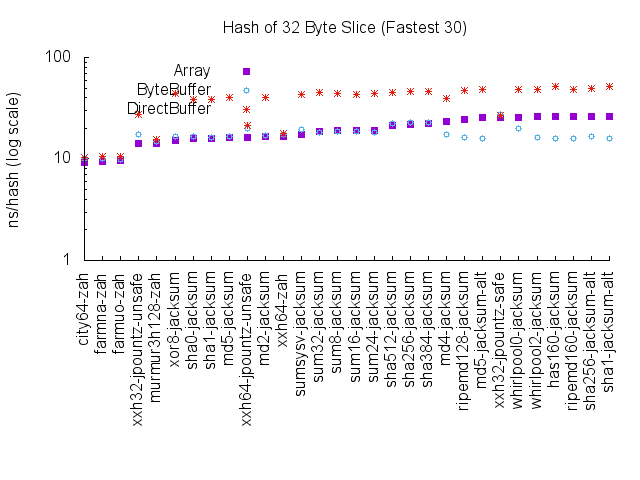

| Algorithm |  Array | ByteBuffer | DirectBuffer |
| --- | ---: | ---: | ---: | 
| [city64-zah](#city64-zah-latency) | 9.326707 | 10.146933 | 10.373360 |
| [farmna-zah](#farmna-zah-latency) | 9.436640 | 10.063625 | 10.485527 |
| [farmuo-zah](#farmuo-zah-latency) | 9.653172 | 9.885832 | 10.475776 |
| [xxh32-jpountz-unsafe](#xxh32-jpountz-unsafe-latency) | 14.260742 | 17.419101 | 27.151546 |
| [murmur3h128-zah](#murmur3h128-zah-latency) | 14.333405 | 14.794073 | 15.465594 |
| [xor8-jacksum](#xor8-jacksum-latency) | 15.194281 | 16.622790 | 44.133850 |
| [sha0-jacksum](#sha0-jacksum-latency) | 16.031572 | 16.492294 | 38.428184 |
| [sha1-jacksum](#sha1-jacksum-latency) | 16.066295 | 16.412335 | 38.327895 |
| [md5-jacksum](#md5-jacksum-latency) | 16.395676 | 16.626702 | 40.148749 |
| [xxh64-jpountz-unsafe](#xxh64-jpountz-unsafe-latency) | 16.430654 | 19.863634 | 21.556369 |
| [md2-jacksum](#md2-jacksum-latency) | 16.563934 | 16.963187 | 40.015221 |
| [xxh64-zah](#xxh64-zah-latency) | 16.771157 | 17.314706 | 17.786823 |
| [sumsysv-jacksum](#sumsysv-jacksum-latency) | 17.271417 | 19.634085 | 43.307640 |
| [sum32-jacksum](#sum32-jacksum-latency) | 18.649722 | 18.220136 | 44.977618 |
| [sum8-jacksum](#sum8-jacksum-latency) | 19.198830 | 18.527889 | 43.823552 |
| [sum16-jacksum](#sum16-jacksum-latency) | 19.203007 | 18.529654 | 43.306990 |
| [sum24-jacksum](#sum24-jacksum-latency) | 19.211244 | 18.433058 | 44.394998 |
| [sha512-jacksum](#sha512-jacksum-latency) | 21.339042 | 22.628170 | 44.930629 |
| [sha256-jacksum](#sha256-jacksum-latency) | 21.985274 | 22.734990 | 46.084798 |
| [sha384-jacksum](#sha384-jacksum-latency) | 22.235713 | 22.825905 | 46.230454 |
| [md4-jacksum](#md4-jacksum-latency) | 23.570853 | 17.628126 | 39.629374 |
| [ripemd128-jacksum](#ripemd128-jacksum-latency) | 24.768934 | 16.286259 | 47.707163 |
| [md5-jacksum-alt](#md5-jacksum-alt-latency) | 25.462574 | 16.053110 | 48.863971 |
| [xxh32-jpountz-safe](#xxh32-jpountz-safe-latency) | 25.697881 | 27.571718 | 26.802901 |
| [whirlpool0-jacksum](#whirlpool0-jacksum-latency) | 25.841377 | 19.792608 | 48.426662 |
| [whirlpool2-jacksum](#whirlpool2-jacksum-latency) | 26.069477 | 16.239426 | 48.689706 |
| [has160-jacksum](#has160-jacksum-latency) | 26.073006 | 15.849194 | 52.319310 |
| [ripemd160-jacksum](#ripemd160-jacksum-latency) | 26.073611 | 15.765879 | 48.814337 |
| [sha256-jacksum-alt](#sha256-jacksum-alt-latency) | 26.204024 | 16.524212 | 49.522718 |
| [sha1-jacksum-alt](#sha1-jacksum-alt-latency) | 26.319568 | 15.862870 | 51.408808 |
| [tiger128-jacksum](#tiger128-jacksum-latency) | 26.488782 | 16.836502 | 49.204903 |
| [tiger160-jacksum](#tiger160-jacksum-latency) | 26.528705 | 17.790141 | 50.260849 |
| [whirlpool1-jacksum](#whirlpool1-jacksum-latency) | 26.588824 | 16.730640 | 50.142192 |
| [sha224-jacksum](#sha224-jacksum-latency) | 26.603091 | 17.820128 | 50.204425 |
| [tiger-jacksum](#tiger-jacksum-latency) | 26.847902 | 17.689964 | 49.590320 |
| [haval192h3-jacksum](#haval192h3-jacksum-latency) | 26.919654 | 16.946839 | 50.252533 |
| [haval160h3-jacksum](#haval160h3-jacksum-latency) | 26.924620 | 17.863529 | 49.561984 |
| [haval128h4-jacksum](#haval128h4-jacksum-latency) | 26.961847 | 17.078459 | 50.097165 |
| [haval128h3-jacksum](#haval128h3-jacksum-latency) | 26.991555 | 17.123144 | 50.678717 |
| [haval224h4-jacksum](#haval224h4-jacksum-latency) | 27.059303 | 17.375722 | 51.723487 |
| [sha384-jacksum-alt](#sha384-jacksum-alt-latency) | 27.068319 | 16.855076 | 52.242007 |
| [tiger2-jacksum](#tiger2-jacksum-latency) | 27.088493 | 17.110077 | 49.082638 |
| [haval192h5-jacksum](#haval192h5-jacksum-latency) | 27.100158 | 18.082278 | 50.831126 |
| [haval128h5-jacksum](#haval128h5-jacksum-latency) | 27.150144 | 17.028880 | 48.862959 |
| [haval160h4-jacksum](#haval160h4-jacksum-latency) | 27.162459 | 17.192719 | 48.851692 |
| [haval224h3-jacksum](#haval224h3-jacksum-latency) | 27.206759 | 17.195727 | 49.093431 |
| [haval192h4-jacksum](#haval192h4-jacksum-latency) | 27.337060 | 17.262303 | 49.499889 |
| [haval256h3-jacksum](#haval256h3-jacksum-latency) | 27.374675 | 17.033349 | 49.841708 |
| [haval256h5-jacksum](#haval256h5-jacksum-latency) | 27.541982 | 16.813024 | 51.762478 |
| [tiger-jacksum-tree](#tiger-jacksum-tree-latency) | 28.008191 | 28.128707 | 49.706950 |
| [haval224h5-jacksum](#haval224h5-jacksum-latency) | 28.230363 | 17.264312 | 51.245530 |
| [haval256h4-jacksum](#haval256h4-jacksum-latency) | 28.282550 | 19.246276 | 49.762288 |
| [xxh64-jpountz-safe](#xxh64-jpountz-safe-latency) | 28.623023 | 30.528221 | 21.662452 |
| [sha512-jacksum-alt](#sha512-jacksum-alt-latency) | 28.970593 | 18.317556 | 53.767307 |
| [tiger2-jacksum-tree](#tiger2-jacksum-tree-latency) | 29.319706 | 24.934032 | 54.226594 |
| [ed2k-jacksum](#ed2k-jacksum-latency) | 30.996757 | 33.011559 | 52.894560 |
| [haval160h5-jacksum](#haval160h5-jacksum-latency) | 31.132717 | 18.503447 | 52.149894 |
| [sumbsd-jacksum](#sumbsd-jacksum-latency) | 40.658783 | 41.103870 | 65.433249 |
| [xxh32-jpountz-jni](#xxh32-jpountz-jni-latency) | 41.505521 | 44.067091 | 33.495427 |
| [xxh64-jpountz-jni](#xxh64-jpountz-jni-latency) | 43.814757 | 45.168805 | 36.367785 |
| [crc8-jacksum](#crc8-jacksum-latency) | 46.216048 | 49.356869 | 86.104161 |
| [crc32-jre](#crc32-jre-latency) | 51.727761 | 53.623857 | 38.685363 |
| [adler32-jre](#adler32-jre-latency) | 53.353334 | 54.012816 | 31.828535 |
| [ripemd256-jacksum](#ripemd256-jacksum-latency) | 53.458034 | 51.282157 | 73.245744 |
| [crc32-jacksum-delegating](#crc32-jacksum-delegating-latency) | 53.559257 | 54.490318 | 61.020121 |
| [elf-jacksum](#elf-jacksum-latency) | 54.190183 | 55.941578 | 80.302190 |
| [adler32-jacksum-delegating](#adler32-jacksum-delegating-latency) | 54.912248 | 55.492258 | 80.182909 |
| [ripemd320-jacksum](#ripemd320-jacksum-latency) | 55.026308 | 51.836783 | 70.499128 |
| [sip-inline](#sip-inline-latency) | 55.711883 | 77.805861 | 74.669192 |
| [murmur3h32-guava](#murmur3h32-guava-latency) | 66.750433 | 79.085364 | 103.618315 |
| [crc16-jacksum](#crc16-jacksum-latency) | 69.134716 | 70.143725 | 93.920350 |
| [adler32-guava](#adler32-guava-latency) | 69.387822 | 67.847562 | 84.528853 |
| [crc32-jacksum-fcs32](#crc32-jacksum-fcs32-latency) | 73.775782 | 73.437470 | 98.940620 |
| [crc64-jacksum](#crc64-jacksum-latency) | 76.692296 | 77.018121 | 102.268661 |
| [gfh32-guava](#gfh32-guava-latency) | 78.174524 | 81.817229 | 101.281565 |
| [crc32-guava-delegating](#crc32-guava-delegating-latency) | 78.280362 | 78.457713 | 71.944129 |
| [crc32-jacksum-mpeg2](#crc32-jacksum-mpeg2-latency) | 79.130596 | 80.893618 | 105.377957 |
| [fcs16-jacksum](#fcs16-jacksum-latency) | 79.858554 | 81.806079 | 105.071308 |
| [cksum-jacksum](#cksum-jacksum-latency) | 83.359663 | 83.170251 | 106.563116 |
| [crc24-jacksum](#crc24-jacksum-latency) | 88.097670 | 108.373728 | 112.382317 |
| [crc32-jacksum-bzip2](#crc32-jacksum-bzip2-latency) | 88.588250 | 107.870111 | 110.301955 |
| [crc32-guava-rfc3720](#crc32-guava-rfc3720-latency) | 89.806503 | 88.946488 | 104.048097 |
| [gfh64-guava](#gfh64-guava-latency) | 110.740421 | 140.045954 | 158.387860 |
| [sip-fwdeng](#sip-fwdeng-latency) | 112.510230 | 134.857564 | 133.047761 |
| [sip-guava](#sip-guava-latency) | 125.044899 | 121.784631 | 151.375480 |
| [adler32-jacksum-alt](#adler32-jacksum-alt-latency) | 125.065730 | 124.659796 | 151.294472 |
| [murmur3h128-guava](#murmur3h128-guava-latency) | 133.573963 | 142.591046 | 154.750441 |
| [md5-guava](#md5-guava-latency) | 257.842252 | 261.644189 | 278.634660 |
| [sha1-guava](#sha1-guava-latency) | 374.767019 | 389.846643 | 381.904392 |
| [sha256-guava](#sha256-guava-latency) | 488.234912 | 472.458636 | 491.064544 |
| [sha384-guava](#sha384-guava-latency) | 770.902455 | 819.578947 | 840.614945 |
| [sha512-guava](#sha512-guava-latency) | 875.570255 | 826.292396 | 841.160850 |

---
### 32 Byte Slice Latency (adler32)
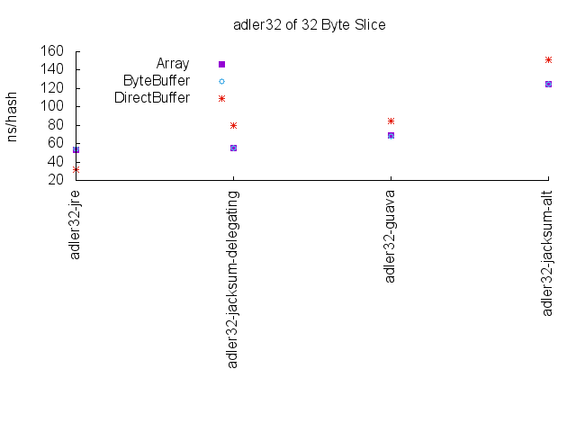

| Algorithm |  Array | ByteBuffer | DirectBuffer |
| --- | ---: | ---: | ---: | 
| [adler32-jre](#adler32-jre-latency) | 53.353334 | 54.012816 | 31.828535 |
| [adler32-jacksum-delegating](#adler32-jacksum-delegating-latency) | 54.912248 | 55.492258 | 80.182909 |
| [adler32-guava](#adler32-guava-latency) | 69.387822 | 67.847562 | 84.528853 |
| [adler32-jacksum-alt](#adler32-jacksum-alt-latency) | 125.065730 | 124.659796 | 151.294472 |

---
### 32 Byte Slice Latency (city64)
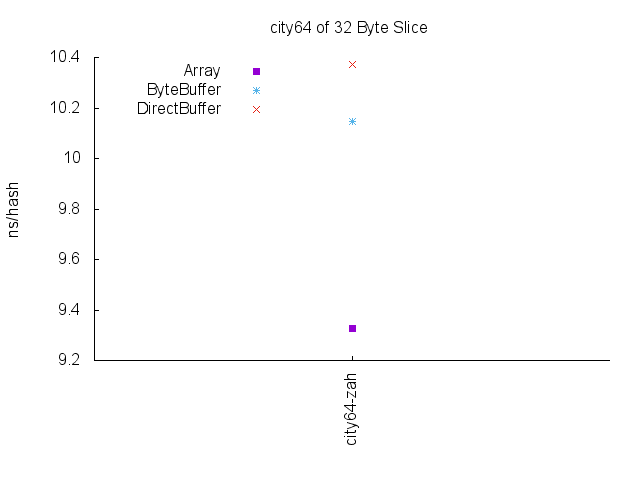

| Algorithm |  Array | ByteBuffer | DirectBuffer |
| --- | ---: | ---: | ---: | 
| [city64-zah](#city64-zah-latency) | 9.326707 | 10.146933 | 10.373360 |

---
### 32 Byte Slice Latency (cksum)
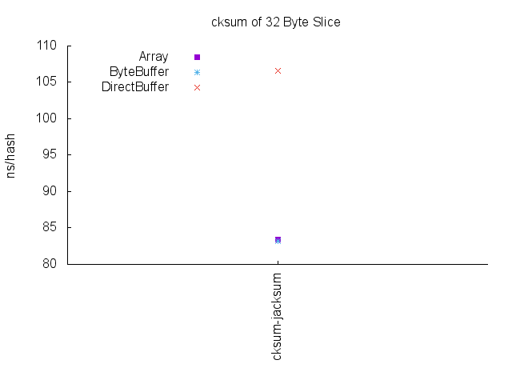

| Algorithm |  Array | ByteBuffer | DirectBuffer |
| --- | ---: | ---: | ---: | 
| [cksum-jacksum](#cksum-jacksum-latency) | 83.359663 | 83.170251 | 106.563116 |

---
### 32 Byte Slice Latency (crc16)
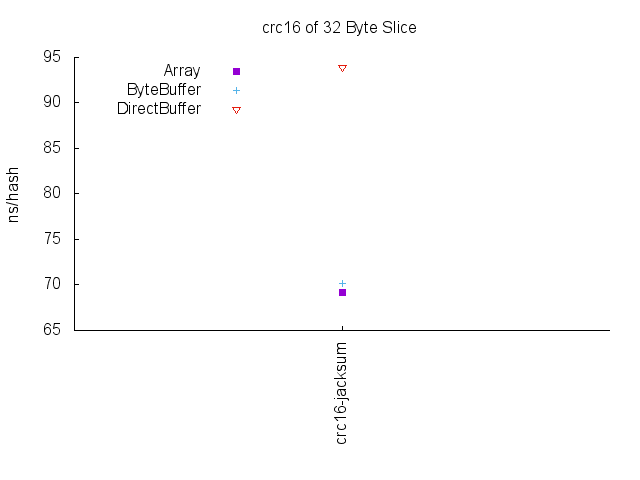

| Algorithm |  Array | ByteBuffer | DirectBuffer |
| --- | ---: | ---: | ---: | 
| [crc16-jacksum](#crc16-jacksum-latency) | 69.134716 | 70.143725 | 93.920350 |

---
### 32 Byte Slice Latency (crc24)
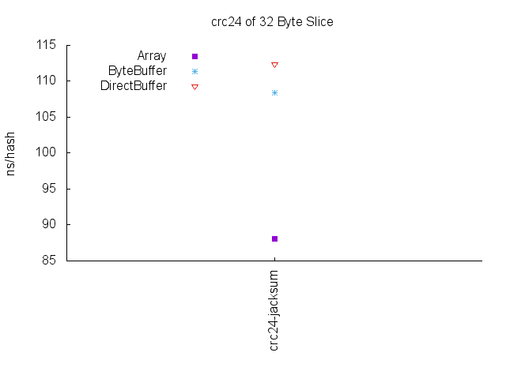

| Algorithm |  Array | ByteBuffer | DirectBuffer |
| --- | ---: | ---: | ---: | 
| [crc24-jacksum](#crc24-jacksum-latency) | 88.097670 | 108.373728 | 112.382317 |

---
### 32 Byte Slice Latency (crc32)
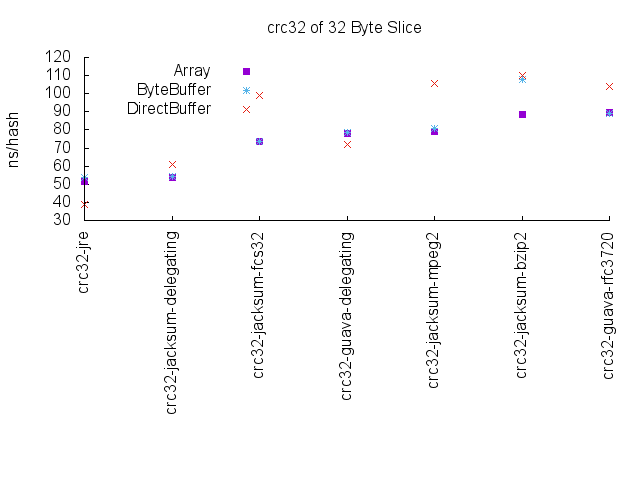

| Algorithm |  Array | ByteBuffer | DirectBuffer |
| --- | ---: | ---: | ---: | 
| [crc32-jre](#crc32-jre-latency) | 51.727761 | 53.623857 | 38.685363 |
| [crc32-jacksum-delegating](#crc32-jacksum-delegating-latency) | 53.559257 | 54.490318 | 61.020121 |
| [crc32-jacksum-fcs32](#crc32-jacksum-fcs32-latency) | 73.775782 | 73.437470 | 98.940620 |
| [crc32-guava-delegating](#crc32-guava-delegating-latency) | 78.280362 | 78.457713 | 71.944129 |
| [crc32-jacksum-mpeg2](#crc32-jacksum-mpeg2-latency) | 79.130596 | 80.893618 | 105.377957 |
| [crc32-jacksum-bzip2](#crc32-jacksum-bzip2-latency) | 88.588250 | 107.870111 | 110.301955 |
| [crc32-guava-rfc3720](#crc32-guava-rfc3720-latency) | 89.806503 | 88.946488 | 104.048097 |

---
### 32 Byte Slice Latency (crc64)

| Algorithm |  Array | ByteBuffer | DirectBuffer |
| --- | ---: | ---: | ---: | 
| [crc64-jacksum](#crc64-jacksum-latency) | 76.692296 | 77.018121 | 102.268661 |

---
### 32 Byte Slice Latency (crc8)
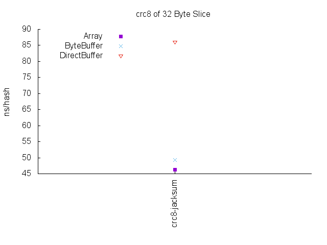

| Algorithm |  Array | ByteBuffer | DirectBuffer |
| --- | ---: | ---: | ---: | 
| [crc8-jacksum](#crc8-jacksum-latency) | 46.216048 | 49.356869 | 86.104161 |

---
### 32 Byte Slice Latency (ed2k)

| Algorithm |  Array | ByteBuffer | DirectBuffer |
| --- | ---: | ---: | ---: | 
| [ed2k-jacksum](#ed2k-jacksum-latency) | 30.996757 | 33.011559 | 52.894560 |

---
### 32 Byte Slice Latency (elf)
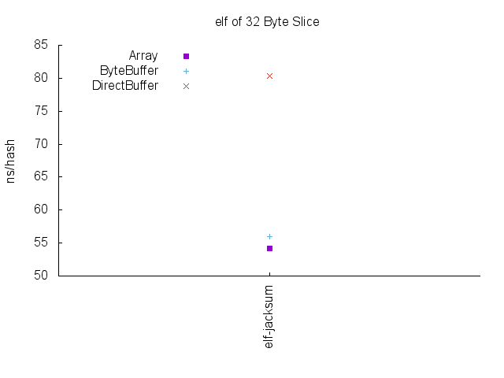

| Algorithm |  Array | ByteBuffer | DirectBuffer |
| --- | ---: | ---: | ---: | 
| [elf-jacksum](#elf-jacksum-latency) | 54.190183 | 55.941578 | 80.302190 |

---
### 32 Byte Slice Latency (farmna)
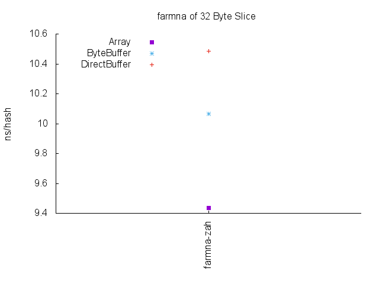

| Algorithm |  Array | ByteBuffer | DirectBuffer |
| --- | ---: | ---: | ---: | 
| [farmna-zah](#farmna-zah-latency) | 9.436640 | 10.063625 | 10.485527 |

---
### 32 Byte Slice Latency (farmuo)
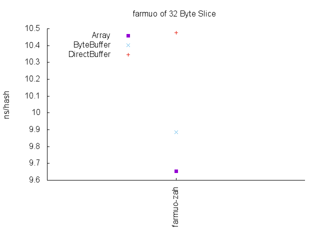

| Algorithm |  Array | ByteBuffer | DirectBuffer |
| --- | ---: | ---: | ---: | 
| [farmuo-zah](#farmuo-zah-latency) | 9.653172 | 9.885832 | 10.475776 |

---
### 32 Byte Slice Latency (fcs16)

| Algorithm |  Array | ByteBuffer | DirectBuffer |
| --- | ---: | ---: | ---: | 
| [fcs16-jacksum](#fcs16-jacksum-latency) | 79.858554 | 81.806079 | 105.071308 |

---
### 32 Byte Slice Latency (gfh32)
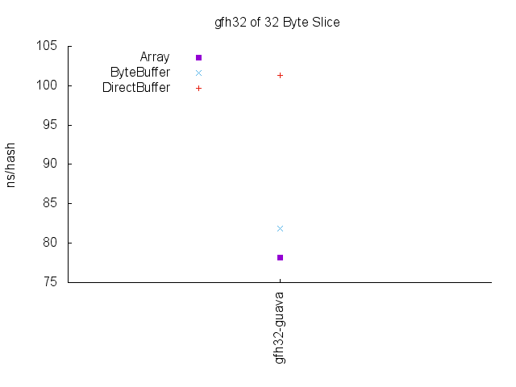

| Algorithm |  Array | ByteBuffer | DirectBuffer |
| --- | ---: | ---: | ---: | 
| [gfh32-guava](#gfh32-guava-latency) | 78.174524 | 81.817229 | 101.281565 |

---
### 32 Byte Slice Latency (gfh64)
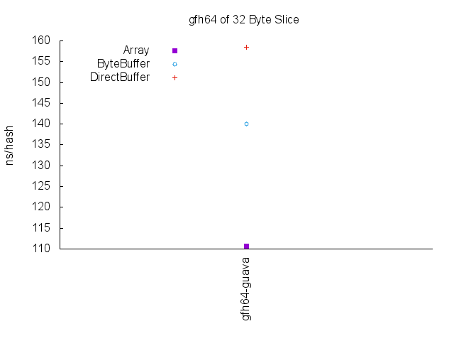

| Algorithm |  Array | ByteBuffer | DirectBuffer |
| --- | ---: | ---: | ---: | 
| [gfh64-guava](#gfh64-guava-latency) | 110.740421 | 140.045954 | 158.387860 |

---
### 32 Byte Slice Latency (has160)
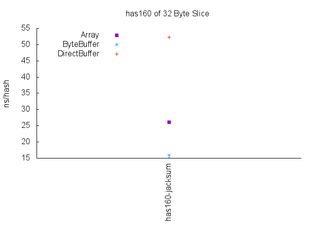

| Algorithm |  Array | ByteBuffer | DirectBuffer |
| --- | ---: | ---: | ---: | 
| [has160-jacksum](#has160-jacksum-latency) | 26.073006 | 15.849194 | 52.319310 |

---
### 32 Byte Slice Latency (haval128h3)

| Algorithm |  Array | ByteBuffer | DirectBuffer |
| --- | ---: | ---: | ---: | 
| [haval128h3-jacksum](#haval128h3-jacksum-latency) | 26.991555 | 17.123144 | 50.678717 |

---
### 32 Byte Slice Latency (haval128h4)

| Algorithm |  Array | ByteBuffer | DirectBuffer |
| --- | ---: | ---: | ---: | 
| [haval128h4-jacksum](#haval128h4-jacksum-latency) | 26.961847 | 17.078459 | 50.097165 |

---
### 32 Byte Slice Latency (haval128h5)

| Algorithm |  Array | ByteBuffer | DirectBuffer |
| --- | ---: | ---: | ---: | 
| [haval128h5-jacksum](#haval128h5-jacksum-latency) | 27.150144 | 17.028880 | 48.862959 |

---
### 32 Byte Slice Latency (haval160h3)

| Algorithm |  Array | ByteBuffer | DirectBuffer |
| --- | ---: | ---: | ---: | 
| [haval160h3-jacksum](#haval160h3-jacksum-latency) | 26.924620 | 17.863529 | 49.561984 |

---
### 32 Byte Slice Latency (haval160h4)
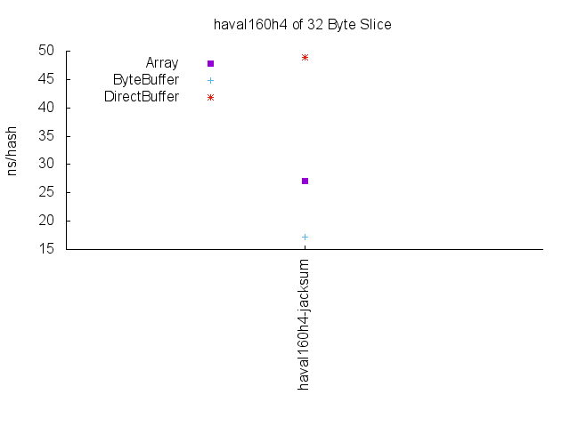

| Algorithm |  Array | ByteBuffer | DirectBuffer |
| --- | ---: | ---: | ---: | 
| [haval160h4-jacksum](#haval160h4-jacksum-latency) | 27.162459 | 17.192719 | 48.851692 |

---
### 32 Byte Slice Latency (haval160h5)

| Algorithm |  Array | ByteBuffer | DirectBuffer |
| --- | ---: | ---: | ---: | 
| [haval160h5-jacksum](#haval160h5-jacksum-latency) | 31.132717 | 18.503447 | 52.149894 |

---
### 32 Byte Slice Latency (haval192h3)

| Algorithm |  Array | ByteBuffer | DirectBuffer |
| --- | ---: | ---: | ---: | 
| [haval192h3-jacksum](#haval192h3-jacksum-latency) | 26.919654 | 16.946839 | 50.252533 |

---
### 32 Byte Slice Latency (haval192h4)
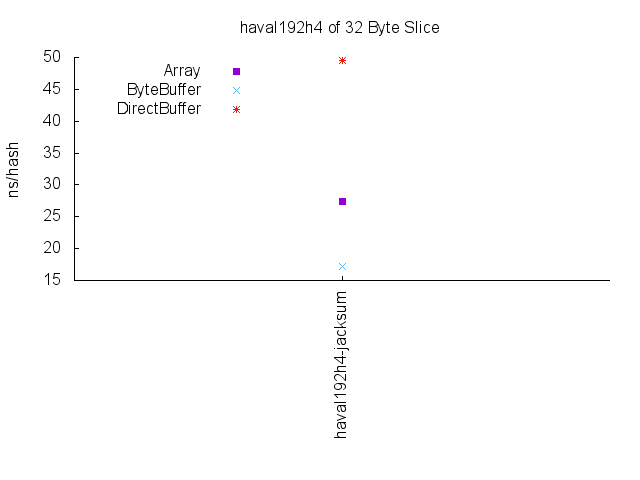

| Algorithm |  Array | ByteBuffer | DirectBuffer |
| --- | ---: | ---: | ---: | 
| [haval192h4-jacksum](#haval192h4-jacksum-latency) | 27.337060 | 17.262303 | 49.499889 |

---
### 32 Byte Slice Latency (haval192h5)

| Algorithm |  Array | ByteBuffer | DirectBuffer |
| --- | ---: | ---: | ---: | 
| [haval192h5-jacksum](#haval192h5-jacksum-latency) | 27.100158 | 18.082278 | 50.831126 |

---
### 32 Byte Slice Latency (haval224h3)
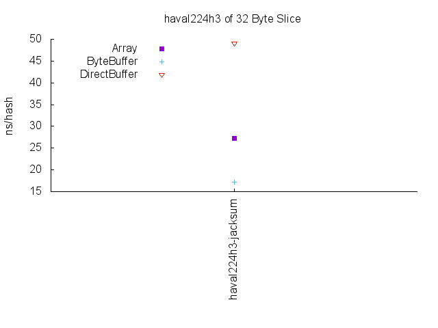

| Algorithm |  Array | ByteBuffer | DirectBuffer |
| --- | ---: | ---: | ---: | 
| [haval224h3-jacksum](#haval224h3-jacksum-latency) | 27.206759 | 17.195727 | 49.093431 |

---
### 32 Byte Slice Latency (haval224h4)

| Algorithm |  Array | ByteBuffer | DirectBuffer |
| --- | ---: | ---: | ---: | 
| [haval224h4-jacksum](#haval224h4-jacksum-latency) | 27.059303 | 17.375722 | 51.723487 |

---
### 32 Byte Slice Latency (haval224h5)
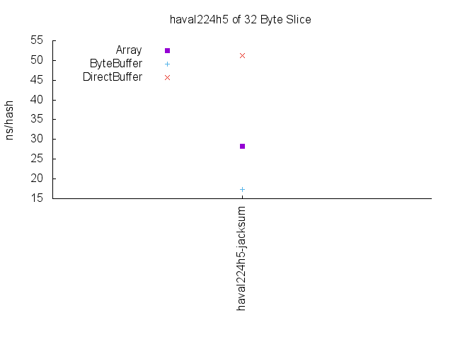

| Algorithm |  Array | ByteBuffer | DirectBuffer |
| --- | ---: | ---: | ---: | 
| [haval224h5-jacksum](#haval224h5-jacksum-latency) | 28.230363 | 17.264312 | 51.245530 |

---
### 32 Byte Slice Latency (haval256h3)
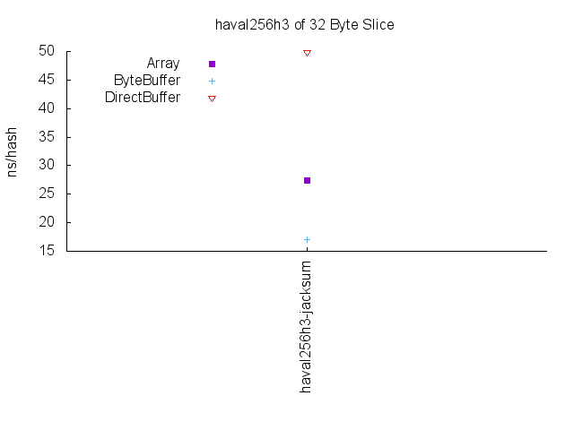

| Algorithm |  Array | ByteBuffer | DirectBuffer |
| --- | ---: | ---: | ---: | 
| [haval256h3-jacksum](#haval256h3-jacksum-latency) | 27.374675 | 17.033349 | 49.841708 |

---
### 32 Byte Slice Latency (haval256h4)
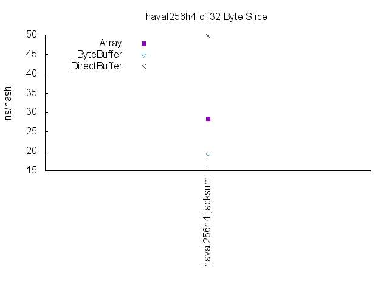

| Algorithm |  Array | ByteBuffer | DirectBuffer |
| --- | ---: | ---: | ---: | 
| [haval256h4-jacksum](#haval256h4-jacksum-latency) | 28.282550 | 19.246276 | 49.762288 |

---
### 32 Byte Slice Latency (haval256h5)

| Algorithm |  Array | ByteBuffer | DirectBuffer |
| --- | ---: | ---: | ---: | 
| [haval256h5-jacksum](#haval256h5-jacksum-latency) | 27.541982 | 16.813024 | 51.762478 |

---
### 32 Byte Slice Latency (md2)
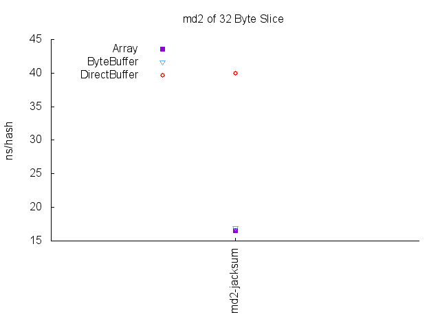

| Algorithm |  Array | ByteBuffer | DirectBuffer |
| --- | ---: | ---: | ---: | 
| [md2-jacksum](#md2-jacksum-latency) | 16.563934 | 16.963187 | 40.015221 |

---
### 32 Byte Slice Latency (md4)
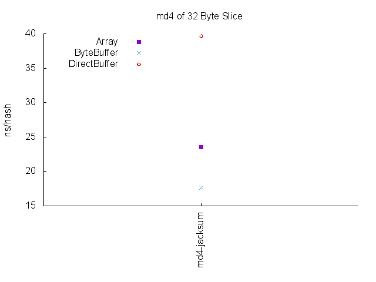

| Algorithm |  Array | ByteBuffer | DirectBuffer |
| --- | ---: | ---: | ---: | 
| [md4-jacksum](#md4-jacksum-latency) | 23.570853 | 17.628126 | 39.629374 |

---
### 32 Byte Slice Latency (md5)
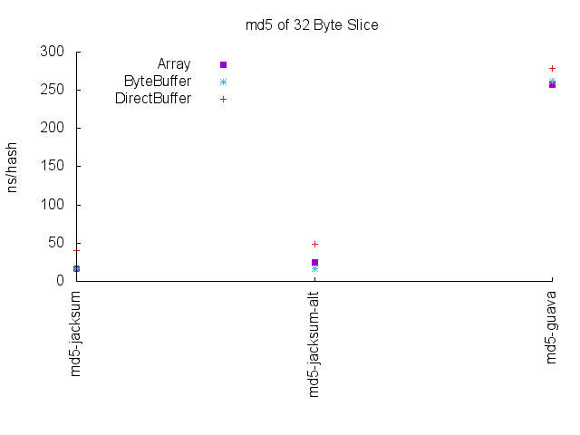

| Algorithm |  Array | ByteBuffer | DirectBuffer |
| --- | ---: | ---: | ---: | 
| [md5-jacksum](#md5-jacksum-latency) | 16.395676 | 16.626702 | 40.148749 |
| [md5-jacksum-alt](#md5-jacksum-alt-latency) | 25.462574 | 16.053110 | 48.863971 |
| [md5-guava](#md5-guava-latency) | 257.842252 | 261.644189 | 278.634660 |

---
### 32 Byte Slice Latency (murmur3h128)
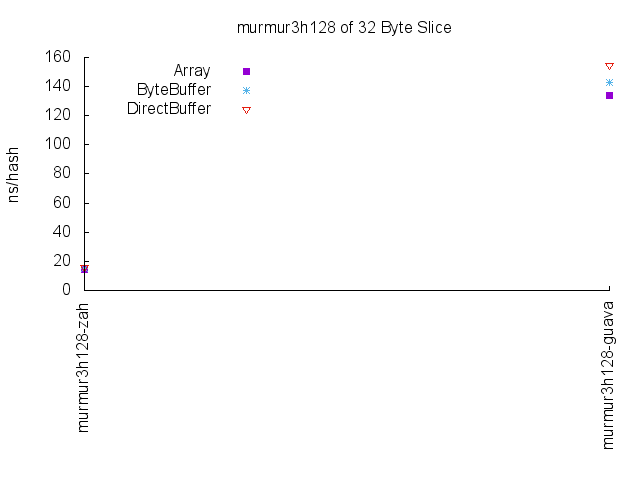

| Algorithm |  Array | ByteBuffer | DirectBuffer |
| --- | ---: | ---: | ---: | 
| [murmur3h128-zah](#murmur3h128-zah-latency) | 14.333405 | 14.794073 | 15.465594 |
| [murmur3h128-guava](#murmur3h128-guava-latency) | 133.573963 | 142.591046 | 154.750441 |

---
### 32 Byte Slice Latency (murmur3h32)
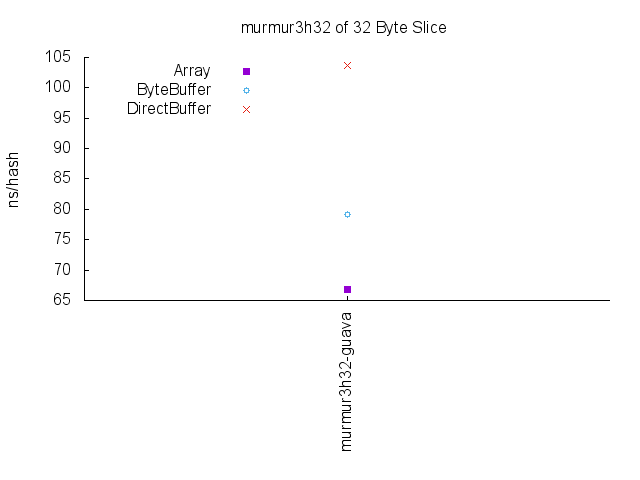

| Algorithm |  Array | ByteBuffer | DirectBuffer |
| --- | ---: | ---: | ---: | 
| [murmur3h32-guava](#murmur3h32-guava-latency) | 66.750433 | 79.085364 | 103.618315 |

---
### 32 Byte Slice Latency (ripemd128)
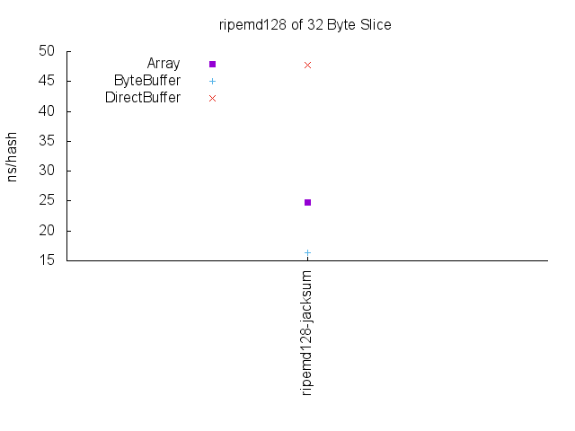

| Algorithm |  Array | ByteBuffer | DirectBuffer |
| --- | ---: | ---: | ---: | 
| [ripemd128-jacksum](#ripemd128-jacksum-latency) | 24.768934 | 16.286259 | 47.707163 |

---
### 32 Byte Slice Latency (ripemd160)
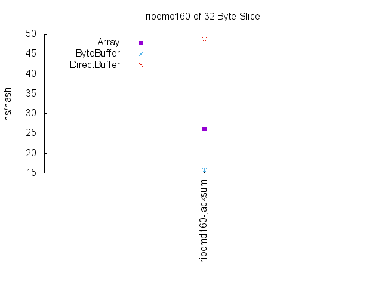

| Algorithm |  Array | ByteBuffer | DirectBuffer |
| --- | ---: | ---: | ---: | 
| [ripemd160-jacksum](#ripemd160-jacksum-latency) | 26.073611 | 15.765879 | 48.814337 |

---
### 32 Byte Slice Latency (ripemd256)
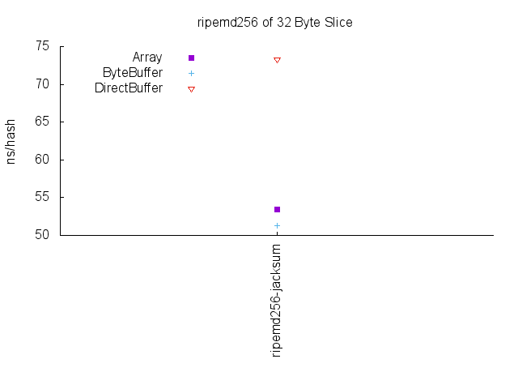

| Algorithm |  Array | ByteBuffer | DirectBuffer |
| --- | ---: | ---: | ---: | 
| [ripemd256-jacksum](#ripemd256-jacksum-latency) | 53.458034 | 51.282157 | 73.245744 |

---
### 32 Byte Slice Latency (ripemd320)
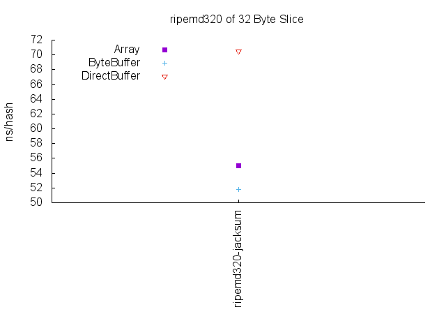

| Algorithm |  Array | ByteBuffer | DirectBuffer |
| --- | ---: | ---: | ---: | 
| [ripemd320-jacksum](#ripemd320-jacksum-latency) | 55.026308 | 51.836783 | 70.499128 |

---
### 32 Byte Slice Latency (sha0)
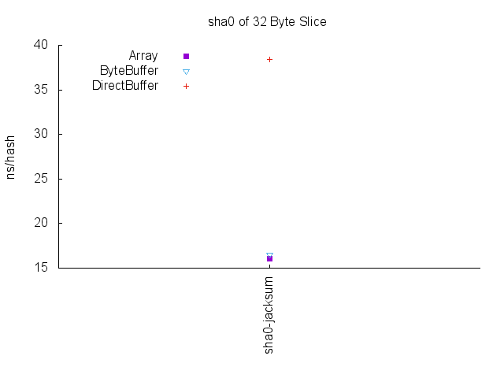

| Algorithm |  Array | ByteBuffer | DirectBuffer |
| --- | ---: | ---: | ---: | 
| [sha0-jacksum](#sha0-jacksum-latency) | 16.031572 | 16.492294 | 38.428184 |

---
### 32 Byte Slice Latency (sha1)
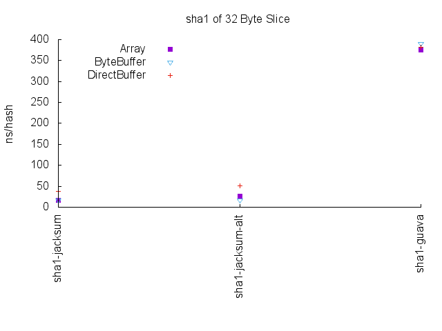

| Algorithm |  Array | ByteBuffer | DirectBuffer |
| --- | ---: | ---: | ---: | 
| [sha1-jacksum](#sha1-jacksum-latency) | 16.066295 | 16.412335 | 38.327895 |
| [sha1-jacksum-alt](#sha1-jacksum-alt-latency) | 26.319568 | 15.862870 | 51.408808 |
| [sha1-guava](#sha1-guava-latency) | 374.767019 | 389.846643 | 381.904392 |

---
### 32 Byte Slice Latency (sha224)

| Algorithm |  Array | ByteBuffer | DirectBuffer |
| --- | ---: | ---: | ---: | 
| [sha224-jacksum](#sha224-jacksum-latency) | 26.603091 | 17.820128 | 50.204425 |

---
### 32 Byte Slice Latency (sha256)
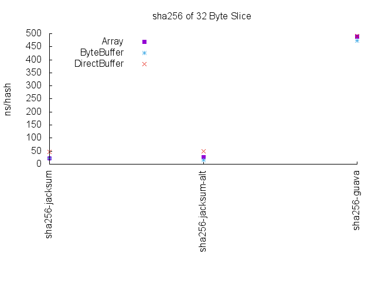

| Algorithm |  Array | ByteBuffer | DirectBuffer |
| --- | ---: | ---: | ---: | 
| [sha256-jacksum](#sha256-jacksum-latency) | 21.985274 | 22.734990 | 46.084798 |
| [sha256-jacksum-alt](#sha256-jacksum-alt-latency) | 26.204024 | 16.524212 | 49.522718 |
| [sha256-guava](#sha256-guava-latency) | 488.234912 | 472.458636 | 491.064544 |

---
### 32 Byte Slice Latency (sha384)
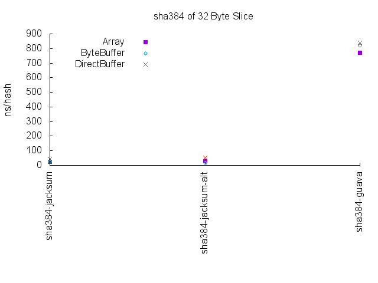

| Algorithm |  Array | ByteBuffer | DirectBuffer |
| --- | ---: | ---: | ---: | 
| [sha384-jacksum](#sha384-jacksum-latency) | 22.235713 | 22.825905 | 46.230454 |
| [sha384-jacksum-alt](#sha384-jacksum-alt-latency) | 27.068319 | 16.855076 | 52.242007 |
| [sha384-guava](#sha384-guava-latency) | 770.902455 | 819.578947 | 840.614945 |

---
### 32 Byte Slice Latency (sha512)
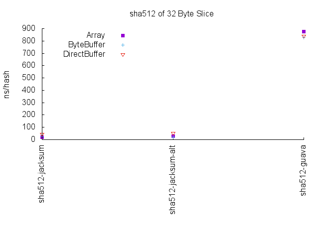

| Algorithm |  Array | ByteBuffer | DirectBuffer |
| --- | ---: | ---: | ---: | 
| [sha512-jacksum](#sha512-jacksum-latency) | 21.339042 | 22.628170 | 44.930629 |
| [sha512-jacksum-alt](#sha512-jacksum-alt-latency) | 28.970593 | 18.317556 | 53.767307 |
| [sha512-guava](#sha512-guava-latency) | 875.570255 | 826.292396 | 841.160850 |

---
### 32 Byte Slice Latency (sip)
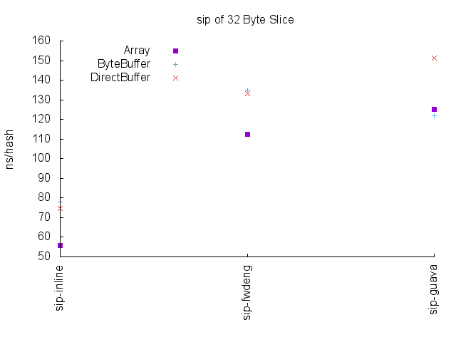

| Algorithm |  Array | ByteBuffer | DirectBuffer |
| --- | ---: | ---: | ---: | 
| [sip-inline](#sip-inline-latency) | 55.711883 | 77.805861 | 74.669192 |
| [sip-fwdeng](#sip-fwdeng-latency) | 112.510230 | 134.857564 | 133.047761 |
| [sip-guava](#sip-guava-latency) | 125.044899 | 121.784631 | 151.375480 |

---
### 32 Byte Slice Latency (sum16)

| Algorithm |  Array | ByteBuffer | DirectBuffer |
| --- | ---: | ---: | ---: | 
| [sum16-jacksum](#sum16-jacksum-latency) | 19.203007 | 18.529654 | 43.306990 |

---
### 32 Byte Slice Latency (sum24)

| Algorithm |  Array | ByteBuffer | DirectBuffer |
| --- | ---: | ---: | ---: | 
| [sum24-jacksum](#sum24-jacksum-latency) | 19.211244 | 18.433058 | 44.394998 |

---
### 32 Byte Slice Latency (sum32)

| Algorithm |  Array | ByteBuffer | DirectBuffer |
| --- | ---: | ---: | ---: | 
| [sum32-jacksum](#sum32-jacksum-latency) | 18.649722 | 18.220136 | 44.977618 |

---
### 32 Byte Slice Latency (sum8)
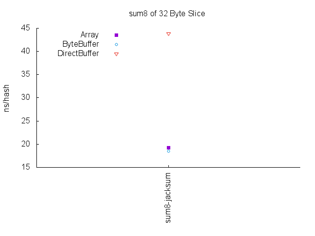

| Algorithm |  Array | ByteBuffer | DirectBuffer |
| --- | ---: | ---: | ---: | 
| [sum8-jacksum](#sum8-jacksum-latency) | 19.198830 | 18.527889 | 43.823552 |

---
### 32 Byte Slice Latency (sumbsd)
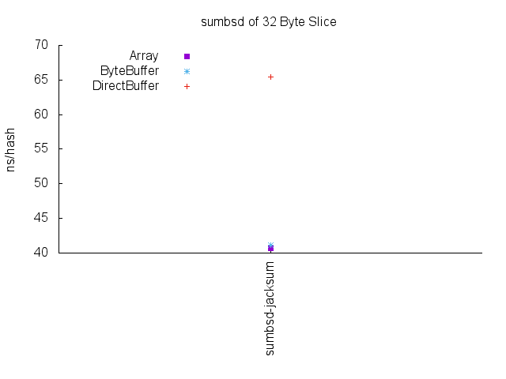

| Algorithm |  Array | ByteBuffer | DirectBuffer |
| --- | ---: | ---: | ---: | 
| [sumbsd-jacksum](#sumbsd-jacksum-latency) | 40.658783 | 41.103870 | 65.433249 |

---
### 32 Byte Slice Latency (sumsysv)
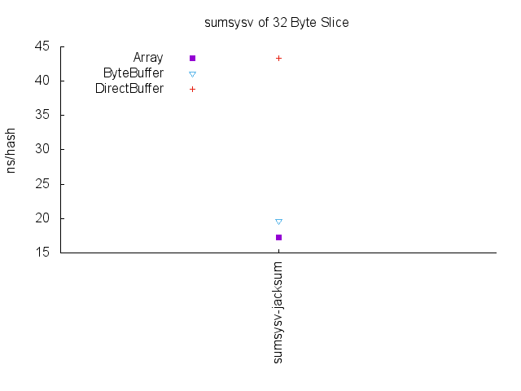

| Algorithm |  Array | ByteBuffer | DirectBuffer |
| --- | ---: | ---: | ---: | 
| [sumsysv-jacksum](#sumsysv-jacksum-latency) | 17.271417 | 19.634085 | 43.307640 |

---
### 32 Byte Slice Latency (tiger)
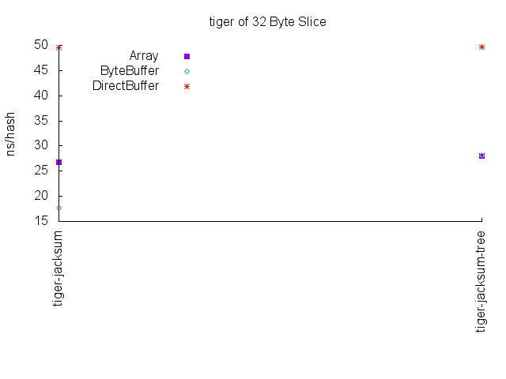

| Algorithm |  Array | ByteBuffer | DirectBuffer |
| --- | ---: | ---: | ---: | 
| [tiger-jacksum](#tiger-jacksum-latency) | 26.847902 | 17.689964 | 49.590320 |
| [tiger-jacksum-tree](#tiger-jacksum-tree-latency) | 28.008191 | 28.128707 | 49.706950 |

---
### 32 Byte Slice Latency (tiger128)
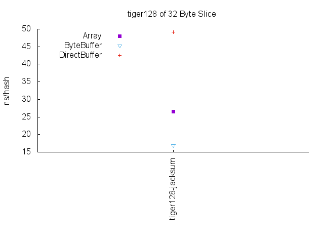

| Algorithm |  Array | ByteBuffer | DirectBuffer |
| --- | ---: | ---: | ---: | 
| [tiger128-jacksum](#tiger128-jacksum-latency) | 26.488782 | 16.836502 | 49.204903 |

---
### 32 Byte Slice Latency (tiger160)
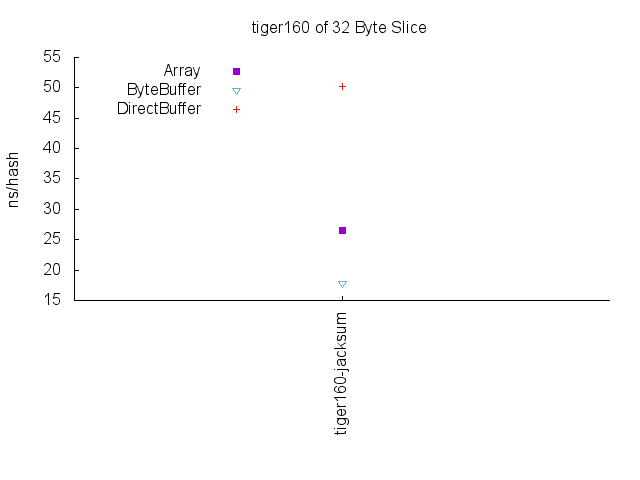

| Algorithm |  Array | ByteBuffer | DirectBuffer |
| --- | ---: | ---: | ---: | 
| [tiger160-jacksum](#tiger160-jacksum-latency) | 26.528705 | 17.790141 | 50.260849 |

---
### 32 Byte Slice Latency (tiger2)
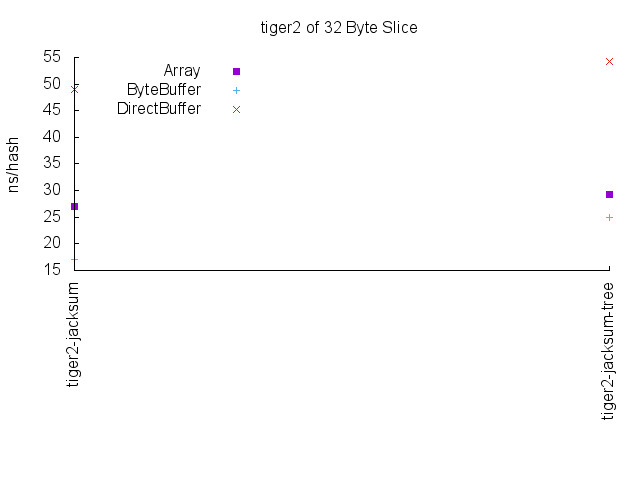

| Algorithm |  Array | ByteBuffer | DirectBuffer |
| --- | ---: | ---: | ---: | 
| [tiger2-jacksum](#tiger2-jacksum-latency) | 27.088493 | 17.110077 | 49.082638 |
| [tiger2-jacksum-tree](#tiger2-jacksum-tree-latency) | 29.319706 | 24.934032 | 54.226594 |

---
### 32 Byte Slice Latency (whirlpool0)

| Algorithm |  Array | ByteBuffer | DirectBuffer |
| --- | ---: | ---: | ---: | 
| [whirlpool0-jacksum](#whirlpool0-jacksum-latency) | 25.841377 | 19.792608 | 48.426662 |

---
### 32 Byte Slice Latency (whirlpool1)
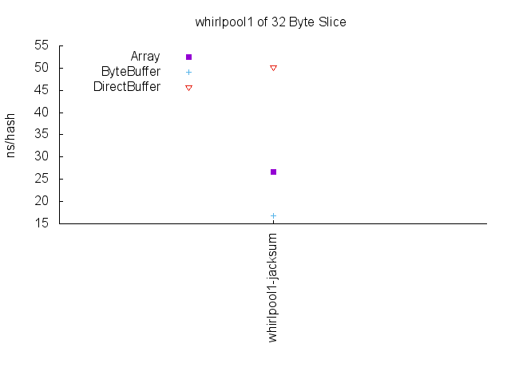

| Algorithm |  Array | ByteBuffer | DirectBuffer |
| --- | ---: | ---: | ---: | 
| [whirlpool1-jacksum](#whirlpool1-jacksum-latency) | 26.588824 | 16.730640 | 50.142192 |

---
### 32 Byte Slice Latency (whirlpool2)

| Algorithm |  Array | ByteBuffer | DirectBuffer |
| --- | ---: | ---: | ---: | 
| [whirlpool2-jacksum](#whirlpool2-jacksum-latency) | 26.069477 | 16.239426 | 48.689706 |

---
### 32 Byte Slice Latency (xor8)
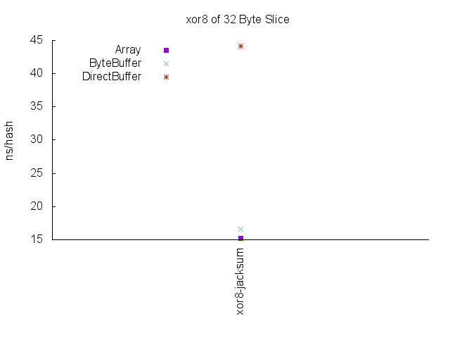

| Algorithm |  Array | ByteBuffer | DirectBuffer |
| --- | ---: | ---: | ---: | 
| [xor8-jacksum](#xor8-jacksum-latency) | 15.194281 | 16.622790 | 44.133850 |

---
### 32 Byte Slice Latency (xxh32)
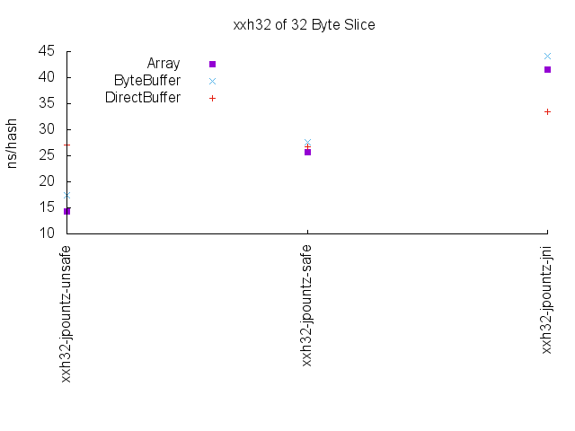

| Algorithm |  Array | ByteBuffer | DirectBuffer |
| --- | ---: | ---: | ---: | 
| [xxh32-jpountz-unsafe](#xxh32-jpountz-unsafe-latency) | 14.260742 | 17.419101 | 27.151546 |
| [xxh32-jpountz-safe](#xxh32-jpountz-safe-latency) | 25.697881 | 27.571718 | 26.802901 |
| [xxh32-jpountz-jni](#xxh32-jpountz-jni-latency) | 41.505521 | 44.067091 | 33.495427 |

---
### 32 Byte Slice Latency (xxh64)
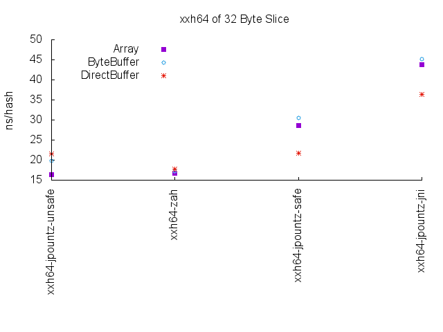

| Algorithm |  Array | ByteBuffer | DirectBuffer |
| --- | ---: | ---: | ---: | 
| [xxh64-jpountz-unsafe](#xxh64-jpountz-unsafe-latency) | 16.430654 | 19.863634 | 21.556369 |
| [xxh64-zah](#xxh64-zah-latency) | 16.771157 | 17.314706 | 17.786823 |
| [xxh64-jpountz-safe](#xxh64-jpountz-safe-latency) | 28.623023 | 30.528221 | 21.662452 |
| [xxh64-jpountz-jni](#xxh64-jpountz-jni-latency) | 43.814757 | 45.168805 | 36.367785 |

---
### 128 Byte Slice Latency (All Hashes)
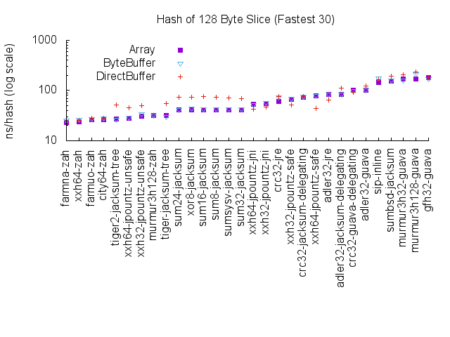

| Algorithm |  Array | ByteBuffer | DirectBuffer |
| --- | ---: | ---: | ---: | 
| [farmna-zah](#farmna-zah-latency) | 23.285137 | 25.734970 | 24.309718 |
| [xxh64-zah](#xxh64-zah-latency) | 23.668633 | 26.549352 | 25.390800 |
| [farmuo-zah](#farmuo-zah-latency) | 26.016423 | 27.188264 | 27.704946 |
| [city64-zah](#city64-zah-latency) | 26.612126 | 27.798026 | 28.015368 |
| [tiger2-jacksum-tree](#tiger2-jacksum-tree-latency) | 27.499859 | 26.354034 | 52.068442 |
| [xxh64-jpountz-unsafe](#xxh64-jpountz-unsafe-latency) | 27.601338 | 28.992751 | 45.090046 |
| [xxh32-jpountz-unsafe](#xxh32-jpountz-unsafe-latency) | 30.769773 | 33.735420 | 50.614023 |
| [murmur3h128-zah](#murmur3h128-zah-latency) | 31.828410 | 31.914309 | 31.998387 |
| [tiger-jacksum-tree](#tiger-jacksum-tree-latency) | 32.008946 | 30.141155 | 55.596663 |
| [sum24-jacksum](#sum24-jacksum-latency) | 40.662861 | 41.762316 | 74.672972 |
| [xor8-jacksum](#xor8-jacksum-latency) | 40.908379 | 44.027816 | 73.310005 |
| [sum16-jacksum](#sum16-jacksum-latency) | 41.326166 | 42.252950 | 75.717950 |
| [sum8-jacksum](#sum8-jacksum-latency) | 41.488963 | 42.496991 | 74.575812 |
| [sumsysv-jacksum](#sumsysv-jacksum-latency) | 41.547453 | 43.135244 | 70.977552 |
| [sum32-jacksum](#sum32-jacksum-latency) | 41.798007 | 42.359168 | 69.716058 |
| [xxh64-jpountz-jni](#xxh64-jpountz-jni-latency) | 52.544770 | 51.453524 | 42.009927 |
| [xxh32-jpountz-jni](#xxh32-jpountz-jni-latency) | 55.035716 | 56.676609 | 46.841770 |
| [crc32-jre](#crc32-jre-latency) | 60.291351 | 73.861727 | 76.458339 |
| [xxh32-jpountz-safe](#xxh32-jpountz-safe-latency) | 67.576606 | 68.960676 | 50.926180 |
| [crc32-jacksum-delegating](#crc32-jacksum-delegating-latency) | 74.431243 | 75.401794 | 76.316084 |
| [xxh64-jpountz-safe](#xxh64-jpountz-safe-latency) | 78.471688 | 79.481682 | 43.949058 |
| [adler32-jre](#adler32-jre-latency) | 83.915528 | 83.576516 | 64.286745 |
| [adler32-jacksum-delegating](#adler32-jacksum-delegating-latency) | 84.540693 | 84.650907 | 112.127371 |
| [crc32-guava-delegating](#crc32-guava-delegating-latency) | 100.109533 | 98.772971 | 93.073651 |
| [adler32-guava](#adler32-guava-latency) | 101.827596 | 102.324262 | 122.982687 |
| [sip-inline](#sip-inline-latency) | 145.865406 | 174.150382 | 164.423727 |
| [sumbsd-jacksum](#sumbsd-jacksum-latency) | 154.196105 | 159.602203 | 194.412577 |
| [murmur3h32-guava](#murmur3h32-guava-latency) | 169.046511 | 157.269364 | 207.369670 |
| [murmur3h128-guava](#murmur3h128-guava-latency) | 172.364845 | 209.804518 | 231.949415 |
| [gfh32-guava](#gfh32-guava-latency) | 179.472355 | 169.605873 | 182.064273 |
| [gfh64-guava](#gfh64-guava-latency) | 203.490902 | 212.500720 | 231.586180 |
| [elf-jacksum](#elf-jacksum-latency) | 218.567453 | 225.786743 | 247.839779 |
| [crc8-jacksum](#crc8-jacksum-latency) | 234.277284 | 228.950333 | 275.552485 |
| [sip-guava](#sip-guava-latency) | 242.257410 | 240.456324 | 260.660206 |
| [ed2k-jacksum](#ed2k-jacksum-latency) | 258.631619 | 264.824162 | 292.399793 |
| [crc16-jacksum](#crc16-jacksum-latency) | 287.031619 | 285.234426 | 317.202058 |
| [crc32-jacksum-fcs32](#crc32-jacksum-fcs32-latency) | 297.387705 | 295.602702 | 322.679335 |
| [crc32-guava-rfc3720](#crc32-guava-rfc3720-latency) | 317.841135 | 313.390099 | 330.440148 |
| [crc64-jacksum](#crc64-jacksum-latency) | 320.680243 | 323.805499 | 350.672810 |
| [md4-jacksum](#md4-jacksum-latency) | 320.968229 | 321.887664 | 355.303991 |
| [md5-jacksum](#md5-jacksum-latency) | 321.233839 | 327.608602 | 348.183309 |
| [md2-jacksum](#md2-jacksum-latency) | 321.908327 | 327.813531 | 351.819048 |
| [fcs16-jacksum](#fcs16-jacksum-latency) | 324.752512 | 326.589282 | 352.725697 |
| [crc32-jacksum-mpeg2](#crc32-jacksum-mpeg2-latency) | 327.323635 | 327.326094 | 355.300732 |
| [cksum-jacksum](#cksum-jacksum-latency) | 340.179690 | 336.941245 | 357.350457 |
| [sip-fwdeng](#sip-fwdeng-latency) | 346.109556 | 378.031124 | 371.007290 |
| [crc32-jacksum-bzip2](#crc32-jacksum-bzip2-latency) | 346.365925 | 430.468786 | 366.366071 |
| [crc24-jacksum](#crc24-jacksum-latency) | 348.397315 | 433.920183 | 373.125696 |
| [md5-jacksum-alt](#md5-jacksum-alt-latency) | 381.959107 | 370.087106 | 403.736920 |
| [tiger160-jacksum](#tiger160-jacksum-latency) | 399.473227 | 386.428280 | 429.483193 |
| [tiger2-jacksum](#tiger2-jacksum-latency) | 400.952911 | 386.119405 | 424.707181 |
| [tiger-jacksum](#tiger-jacksum-latency) | 402.771481 | 388.482410 | 431.476851 |
| [tiger128-jacksum](#tiger128-jacksum-latency) | 403.148946 | 386.998415 | 433.634198 |
| [sha0-jacksum](#sha0-jacksum-latency) | 475.347087 | 476.532919 | 494.804506 |
| [sha1-jacksum](#sha1-jacksum-latency) | 476.289266 | 483.675909 | 492.718211 |
| [adler32-jacksum-alt](#adler32-jacksum-alt-latency) | 496.730027 | 492.458899 | 514.466553 |
| [ripemd256-jacksum](#ripemd256-jacksum-latency) | 521.498613 | 527.262336 | 549.893803 |
| [haval128h3-jacksum](#haval128h3-jacksum-latency) | 541.226953 | 530.860095 | 570.479261 |
| [haval160h3-jacksum](#haval160h3-jacksum-latency) | 542.873998 | 538.146754 | 570.601404 |
| [haval256h3-jacksum](#haval256h3-jacksum-latency) | 543.649025 | 540.394798 | 569.861602 |
| [haval224h3-jacksum](#haval224h3-jacksum-latency) | 543.870212 | 535.211488 | 565.442672 |
| [haval192h3-jacksum](#haval192h3-jacksum-latency) | 557.514013 | 536.900066 | 568.265525 |
| [sha512-jacksum-alt](#sha512-jacksum-alt-latency) | 558.364466 | 561.595110 | 587.717067 |
| [sha1-jacksum-alt](#sha1-jacksum-alt-latency) | 562.327014 | 544.000806 | 569.009870 |
| [sha384-jacksum-alt](#sha384-jacksum-alt-latency) | 567.940351 | 559.824943 | 578.342947 |
| [md5-guava](#md5-guava-latency) | 572.987618 | 567.021225 | 625.676365 |
| [sha512-jacksum](#sha512-jacksum-latency) | 577.782897 | 576.574096 | 607.677052 |
| [ripemd128-jacksum](#ripemd128-jacksum-latency) | 579.973276 | 564.871529 | 605.608990 |
| [sha384-jacksum](#sha384-jacksum-latency) | 581.017695 | 576.656070 | 620.683768 |
| [has160-jacksum](#has160-jacksum-latency) | 621.389763 | 611.540242 | 670.433457 |
| [sha256-jacksum](#sha256-jacksum-latency) | 689.532094 | 682.494129 | 718.734724 |
| [haval128h4-jacksum](#haval128h4-jacksum-latency) | 734.322369 | 724.866034 | 773.323275 |
| [haval192h4-jacksum](#haval192h4-jacksum-latency) | 737.180666 | 728.653781 | 783.369739 |
| [haval256h4-jacksum](#haval256h4-jacksum-latency) | 738.078702 | 727.641279 | 771.290582 |
| [haval160h4-jacksum](#haval160h4-jacksum-latency) | 741.871095 | 730.749863 | 780.575885 |
| [haval224h4-jacksum](#haval224h4-jacksum-latency) | 748.336222 | 730.497083 | 774.576678 |
| [sha256-jacksum-alt](#sha256-jacksum-alt-latency) | 817.982130 | 811.859397 | 826.083288 |
| [sha224-jacksum](#sha224-jacksum-latency) | 817.995207 | 809.423970 | 845.618539 |
| [sha1-guava](#sha1-guava-latency) | 819.782189 | 831.462563 | 880.446803 |
| [haval128h5-jacksum](#haval128h5-jacksum-latency) | 888.674091 | 876.717173 | 926.220680 |
| [haval192h5-jacksum](#haval192h5-jacksum-latency) | 900.306950 | 881.478473 | 910.916988 |
| [haval160h5-jacksum](#haval160h5-jacksum-latency) | 904.194280 | 890.593839 | 948.258672 |
| [haval256h5-jacksum](#haval256h5-jacksum-latency) | 906.083075 | 887.415098 | 911.178105 |
| [haval224h5-jacksum](#haval224h5-jacksum-latency) | 929.379257 | 882.398130 | 921.719972 |
| [ripemd160-jacksum](#ripemd160-jacksum-latency) | 1131.819393 | 1101.438317 | 1137.282286 |
| [sha256-guava](#sha256-guava-latency) | 1138.526107 | 1128.311294 | 1200.340719 |
| [sha384-guava](#sha384-guava-latency) | 1319.581454 | 1378.681152 | 1406.509310 |
| [sha512-guava](#sha512-guava-latency) | 1373.408018 | 1365.403494 | 1363.227702 |
| [whirlpool0-jacksum](#whirlpool0-jacksum-latency) | 1904.155425 | 1926.137742 | 1969.685250 |
| [whirlpool2-jacksum](#whirlpool2-jacksum-latency) | 1920.538592 | 1909.923108 | 1937.615923 |
| [whirlpool1-jacksum](#whirlpool1-jacksum-latency) | 1927.817971 | 1895.735361 | 1970.968791 |
| [ripemd320-jacksum](#ripemd320-jacksum-latency) | 2197.641070 | 2194.750406 | 2250.312552 |

---
### 128 Byte Slice Latency (adler32)
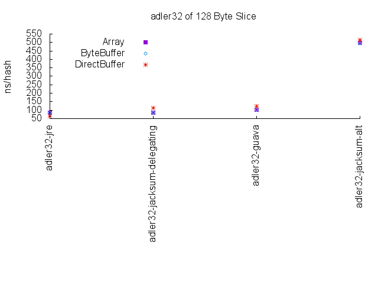

| Algorithm |  Array | ByteBuffer | DirectBuffer |
| --- | ---: | ---: | ---: | 
| [adler32-jre](#adler32-jre-latency) | 83.915528 | 83.576516 | 64.286745 |
| [adler32-jacksum-delegating](#adler32-jacksum-delegating-latency) | 84.540693 | 84.650907 | 112.127371 |
| [adler32-guava](#adler32-guava-latency) | 101.827596 | 102.324262 | 122.982687 |
| [adler32-jacksum-alt](#adler32-jacksum-alt-latency) | 496.730027 | 492.458899 | 514.466553 |

---
### 128 Byte Slice Latency (city64)
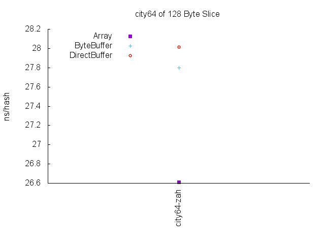

| Algorithm |  Array | ByteBuffer | DirectBuffer |
| --- | ---: | ---: | ---: | 
| [city64-zah](#city64-zah-latency) | 26.612126 | 27.798026 | 28.015368 |

---
### 128 Byte Slice Latency (cksum)
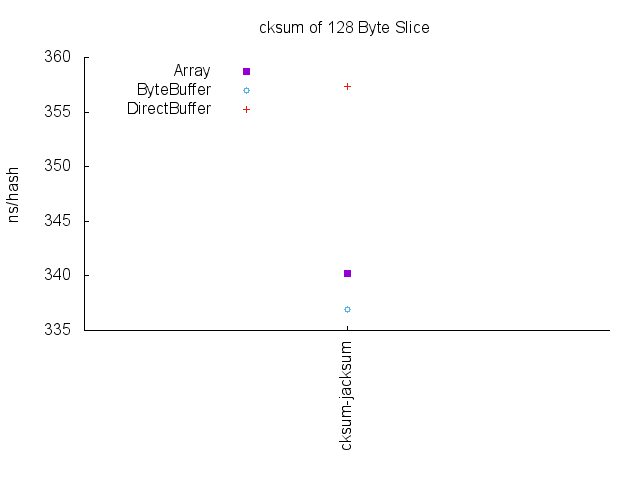

| Algorithm |  Array | ByteBuffer | DirectBuffer |
| --- | ---: | ---: | ---: | 
| [cksum-jacksum](#cksum-jacksum-latency) | 340.179690 | 336.941245 | 357.350457 |

---
### 128 Byte Slice Latency (crc16)
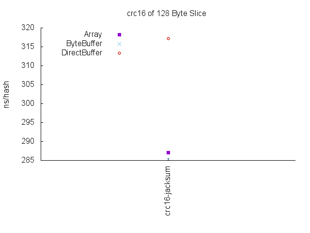

| Algorithm |  Array | ByteBuffer | DirectBuffer |
| --- | ---: | ---: | ---: | 
| [crc16-jacksum](#crc16-jacksum-latency) | 287.031619 | 285.234426 | 317.202058 |

---
### 128 Byte Slice Latency (crc24)
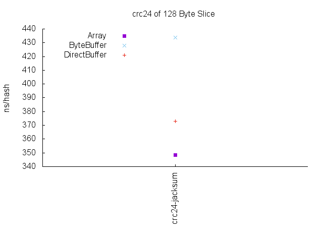

| Algorithm |  Array | ByteBuffer | DirectBuffer |
| --- | ---: | ---: | ---: | 
| [crc24-jacksum](#crc24-jacksum-latency) | 348.397315 | 433.920183 | 373.125696 |

---
### 128 Byte Slice Latency (crc32)
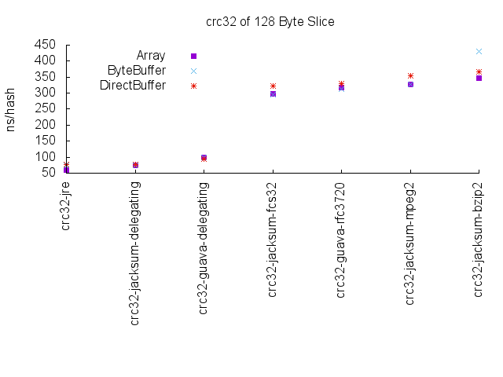

| Algorithm |  Array | ByteBuffer | DirectBuffer |
| --- | ---: | ---: | ---: | 
| [crc32-jre](#crc32-jre-latency) | 60.291351 | 73.861727 | 76.458339 |
| [crc32-jacksum-delegating](#crc32-jacksum-delegating-latency) | 74.431243 | 75.401794 | 76.316084 |
| [crc32-guava-delegating](#crc32-guava-delegating-latency) | 100.109533 | 98.772971 | 93.073651 |
| [crc32-jacksum-fcs32](#crc32-jacksum-fcs32-latency) | 297.387705 | 295.602702 | 322.679335 |
| [crc32-guava-rfc3720](#crc32-guava-rfc3720-latency) | 317.841135 | 313.390099 | 330.440148 |
| [crc32-jacksum-mpeg2](#crc32-jacksum-mpeg2-latency) | 327.323635 | 327.326094 | 355.300732 |
| [crc32-jacksum-bzip2](#crc32-jacksum-bzip2-latency) | 346.365925 | 430.468786 | 366.366071 |

---
### 128 Byte Slice Latency (crc64)
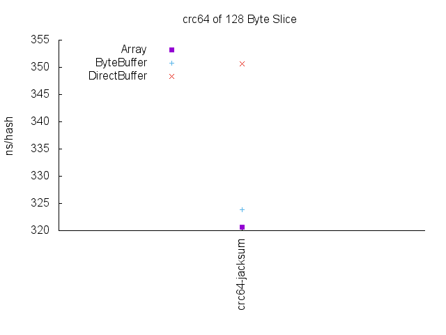

| Algorithm |  Array | ByteBuffer | DirectBuffer |
| --- | ---: | ---: | ---: | 
| [crc64-jacksum](#crc64-jacksum-latency) | 320.680243 | 323.805499 | 350.672810 |

---
### 128 Byte Slice Latency (crc8)
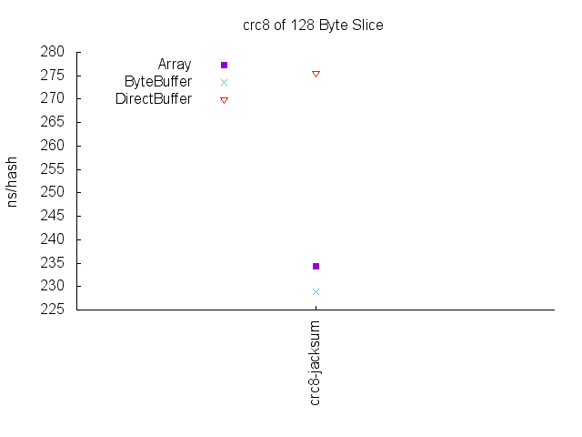

| Algorithm |  Array | ByteBuffer | DirectBuffer |
| --- | ---: | ---: | ---: | 
| [crc8-jacksum](#crc8-jacksum-latency) | 234.277284 | 228.950333 | 275.552485 |

---
### 128 Byte Slice Latency (ed2k)
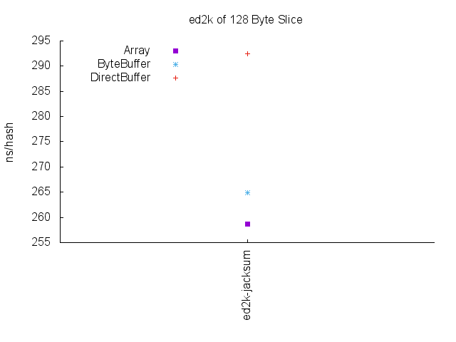

| Algorithm |  Array | ByteBuffer | DirectBuffer |
| --- | ---: | ---: | ---: | 
| [ed2k-jacksum](#ed2k-jacksum-latency) | 258.631619 | 264.824162 | 292.399793 |

---
### 128 Byte Slice Latency (elf)
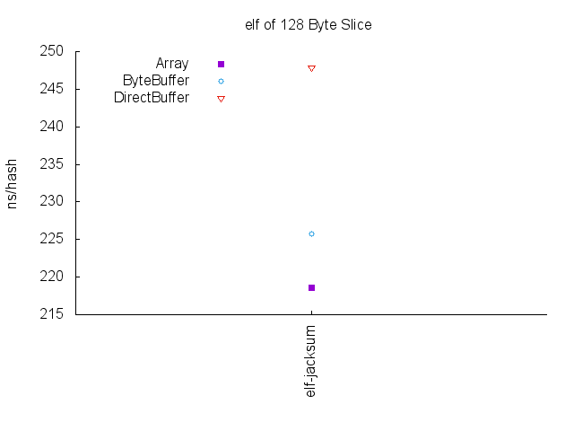

| Algorithm |  Array | ByteBuffer | DirectBuffer |
| --- | ---: | ---: | ---: | 
| [elf-jacksum](#elf-jacksum-latency) | 218.567453 | 225.786743 | 247.839779 |

---
### 128 Byte Slice Latency (farmna)
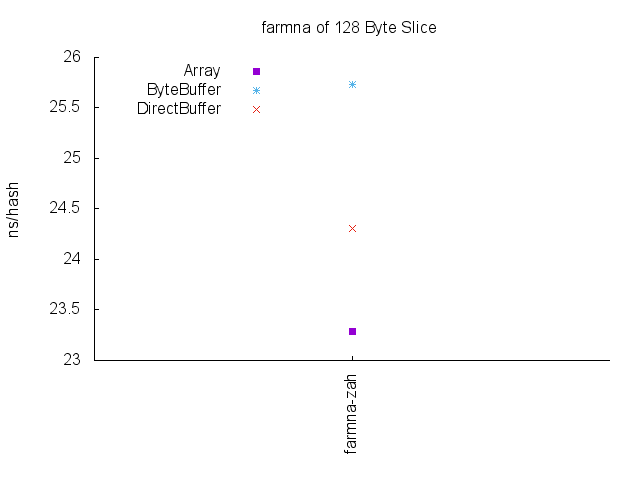

| Algorithm |  Array | ByteBuffer | DirectBuffer |
| --- | ---: | ---: | ---: | 
| [farmna-zah](#farmna-zah-latency) | 23.285137 | 25.734970 | 24.309718 |

---
### 128 Byte Slice Latency (farmuo)

| Algorithm |  Array | ByteBuffer | DirectBuffer |
| --- | ---: | ---: | ---: | 
| [farmuo-zah](#farmuo-zah-latency) | 26.016423 | 27.188264 | 27.704946 |

---
### 128 Byte Slice Latency (fcs16)

| Algorithm |  Array | ByteBuffer | DirectBuffer |
| --- | ---: | ---: | ---: | 
| [fcs16-jacksum](#fcs16-jacksum-latency) | 324.752512 | 326.589282 | 352.725697 |

---
### 128 Byte Slice Latency (gfh32)
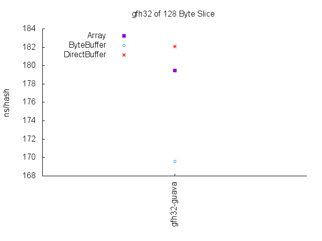

| Algorithm |  Array | ByteBuffer | DirectBuffer |
| --- | ---: | ---: | ---: | 
| [gfh32-guava](#gfh32-guava-latency) | 179.472355 | 169.605873 | 182.064273 |

---
### 128 Byte Slice Latency (gfh64)
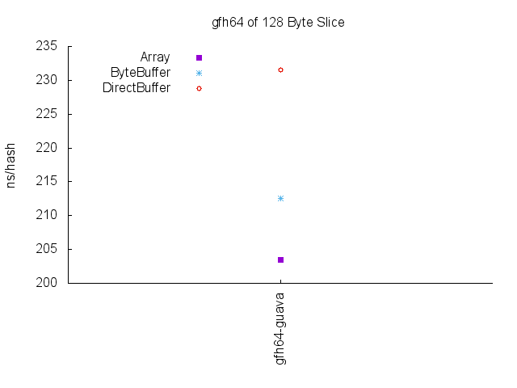

| Algorithm |  Array | ByteBuffer | DirectBuffer |
| --- | ---: | ---: | ---: | 
| [gfh64-guava](#gfh64-guava-latency) | 203.490902 | 212.500720 | 231.586180 |

---
### 128 Byte Slice Latency (has160)
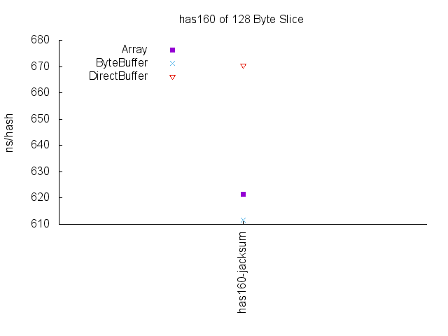

| Algorithm |  Array | ByteBuffer | DirectBuffer |
| --- | ---: | ---: | ---: | 
| [has160-jacksum](#has160-jacksum-latency) | 621.389763 | 611.540242 | 670.433457 |

---
### 128 Byte Slice Latency (haval128h3)
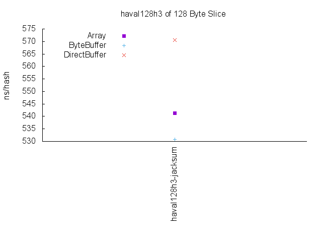

| Algorithm |  Array | ByteBuffer | DirectBuffer |
| --- | ---: | ---: | ---: | 
| [haval128h3-jacksum](#haval128h3-jacksum-latency) | 541.226953 | 530.860095 | 570.479261 |

---
### 128 Byte Slice Latency (haval128h4)
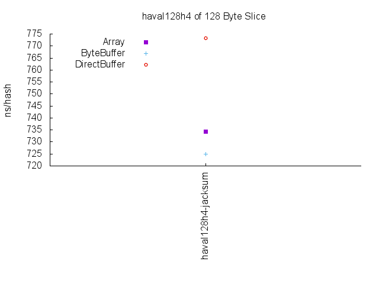

| Algorithm |  Array | ByteBuffer | DirectBuffer |
| --- | ---: | ---: | ---: | 
| [haval128h4-jacksum](#haval128h4-jacksum-latency) | 734.322369 | 724.866034 | 773.323275 |

---
### 128 Byte Slice Latency (haval128h5)
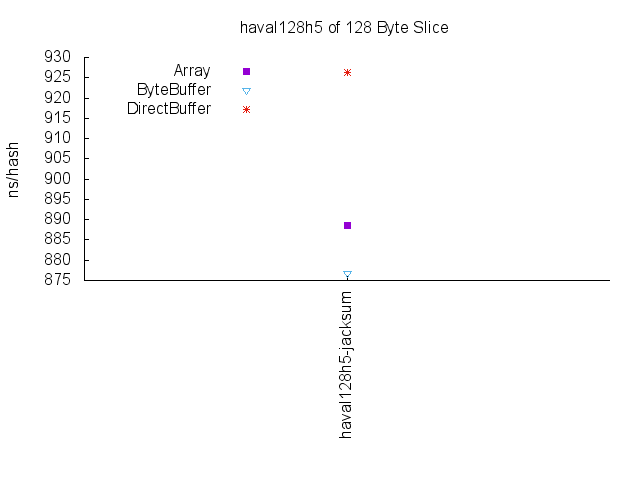

| Algorithm |  Array | ByteBuffer | DirectBuffer |
| --- | ---: | ---: | ---: | 
| [haval128h5-jacksum](#haval128h5-jacksum-latency) | 888.674091 | 876.717173 | 926.220680 |

---
### 128 Byte Slice Latency (haval160h3)
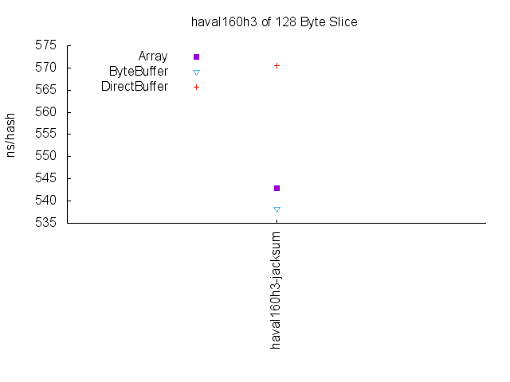

| Algorithm |  Array | ByteBuffer | DirectBuffer |
| --- | ---: | ---: | ---: | 
| [haval160h3-jacksum](#haval160h3-jacksum-latency) | 542.873998 | 538.146754 | 570.601404 |

---
### 128 Byte Slice Latency (haval160h4)
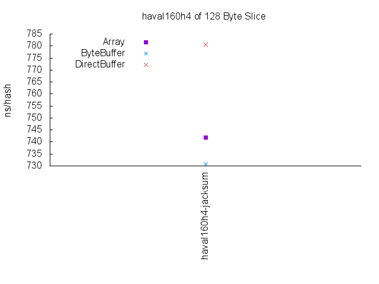

| Algorithm |  Array | ByteBuffer | DirectBuffer |
| --- | ---: | ---: | ---: | 
| [haval160h4-jacksum](#haval160h4-jacksum-latency) | 741.871095 | 730.749863 | 780.575885 |

---
### 128 Byte Slice Latency (haval160h5)
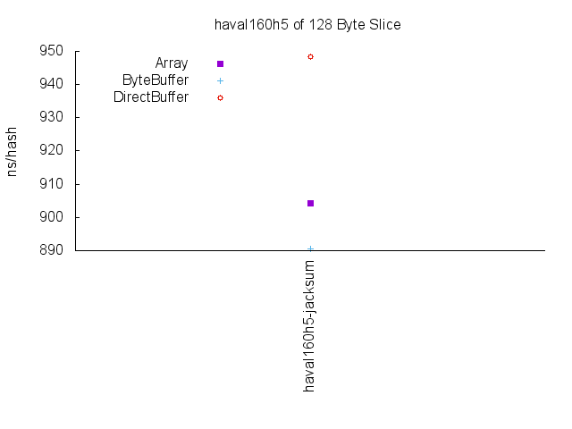

| Algorithm |  Array | ByteBuffer | DirectBuffer |
| --- | ---: | ---: | ---: | 
| [haval160h5-jacksum](#haval160h5-jacksum-latency) | 904.194280 | 890.593839 | 948.258672 |

---
### 128 Byte Slice Latency (haval192h3)
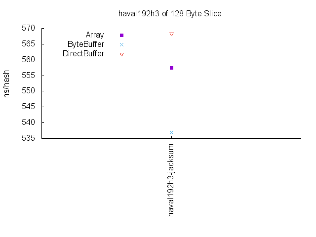

| Algorithm |  Array | ByteBuffer | DirectBuffer |
| --- | ---: | ---: | ---: | 
| [haval192h3-jacksum](#haval192h3-jacksum-latency) | 557.514013 | 536.900066 | 568.265525 |

---
### 128 Byte Slice Latency (haval192h4)
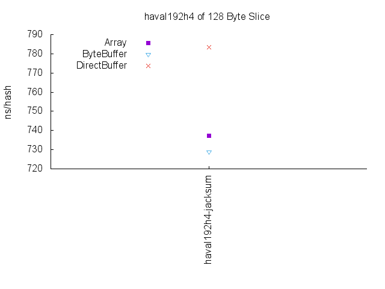

| Algorithm |  Array | ByteBuffer | DirectBuffer |
| --- | ---: | ---: | ---: | 
| [haval192h4-jacksum](#haval192h4-jacksum-latency) | 737.180666 | 728.653781 | 783.369739 |

---
### 128 Byte Slice Latency (haval192h5)

| Algorithm |  Array | ByteBuffer | DirectBuffer |
| --- | ---: | ---: | ---: | 
| [haval192h5-jacksum](#haval192h5-jacksum-latency) | 900.306950 | 881.478473 | 910.916988 |

---
### 128 Byte Slice Latency (haval224h3)
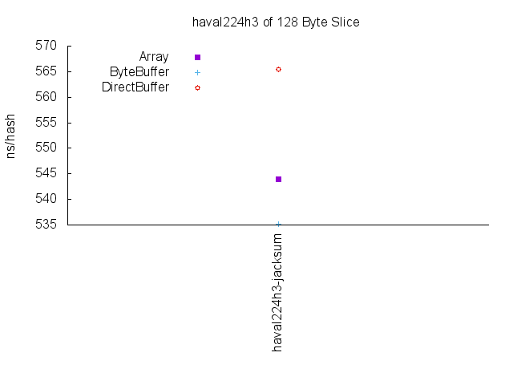

| Algorithm |  Array | ByteBuffer | DirectBuffer |
| --- | ---: | ---: | ---: | 
| [haval224h3-jacksum](#haval224h3-jacksum-latency) | 543.870212 | 535.211488 | 565.442672 |

---
### 128 Byte Slice Latency (haval224h4)
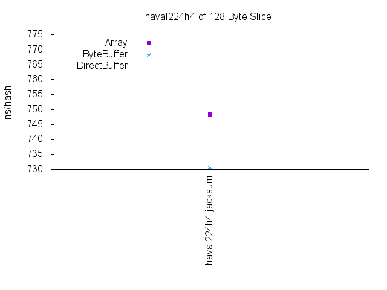

| Algorithm |  Array | ByteBuffer | DirectBuffer |
| --- | ---: | ---: | ---: | 
| [haval224h4-jacksum](#haval224h4-jacksum-latency) | 748.336222 | 730.497083 | 774.576678 |

---
### 128 Byte Slice Latency (haval224h5)

| Algorithm |  Array | ByteBuffer | DirectBuffer |
| --- | ---: | ---: | ---: | 
| [haval224h5-jacksum](#haval224h5-jacksum-latency) | 929.379257 | 882.398130 | 921.719972 |

---
### 128 Byte Slice Latency (haval256h3)
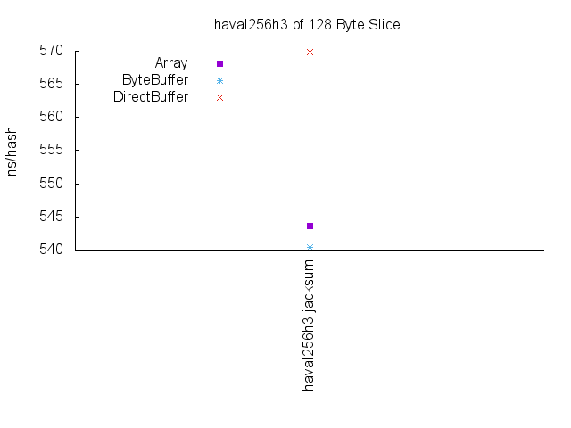

| Algorithm |  Array | ByteBuffer | DirectBuffer |
| --- | ---: | ---: | ---: | 
| [haval256h3-jacksum](#haval256h3-jacksum-latency) | 543.649025 | 540.394798 | 569.861602 |

---
### 128 Byte Slice Latency (haval256h4)
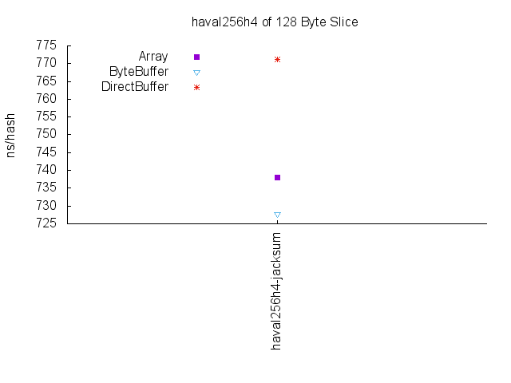

| Algorithm |  Array | ByteBuffer | DirectBuffer |
| --- | ---: | ---: | ---: | 
| [haval256h4-jacksum](#haval256h4-jacksum-latency) | 738.078702 | 727.641279 | 771.290582 |

---
### 128 Byte Slice Latency (haval256h5)
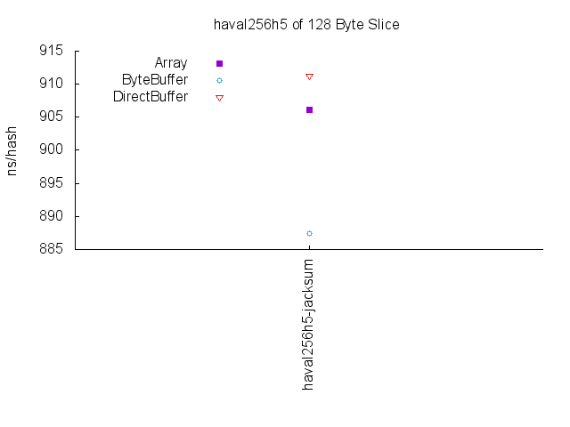

| Algorithm |  Array | ByteBuffer | DirectBuffer |
| --- | ---: | ---: | ---: | 
| [haval256h5-jacksum](#haval256h5-jacksum-latency) | 906.083075 | 887.415098 | 911.178105 |

---
### 128 Byte Slice Latency (md2)

| Algorithm |  Array | ByteBuffer | DirectBuffer |
| --- | ---: | ---: | ---: | 
| [md2-jacksum](#md2-jacksum-latency) | 321.908327 | 327.813531 | 351.819048 |

---
### 128 Byte Slice Latency (md4)

| Algorithm |  Array | ByteBuffer | DirectBuffer |
| --- | ---: | ---: | ---: | 
| [md4-jacksum](#md4-jacksum-latency) | 320.968229 | 321.887664 | 355.303991 |

---
### 128 Byte Slice Latency (md5)
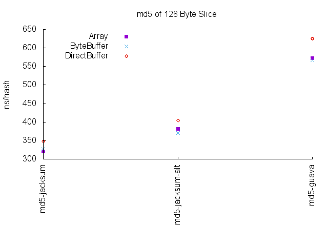

| Algorithm |  Array | ByteBuffer | DirectBuffer |
| --- | ---: | ---: | ---: | 
| [md5-jacksum](#md5-jacksum-latency) | 321.233839 | 327.608602 | 348.183309 |
| [md5-jacksum-alt](#md5-jacksum-alt-latency) | 381.959107 | 370.087106 | 403.736920 |
| [md5-guava](#md5-guava-latency) | 572.987618 | 567.021225 | 625.676365 |

---
### 128 Byte Slice Latency (murmur3h128)

| Algorithm |  Array | ByteBuffer | DirectBuffer |
| --- | ---: | ---: | ---: | 
| [murmur3h128-zah](#murmur3h128-zah-latency) | 31.828410 | 31.914309 | 31.998387 |
| [murmur3h128-guava](#murmur3h128-guava-latency) | 172.364845 | 209.804518 | 231.949415 |

---
### 128 Byte Slice Latency (murmur3h32)
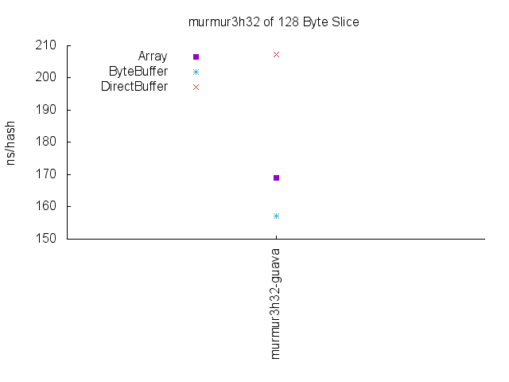

| Algorithm |  Array | ByteBuffer | DirectBuffer |
| --- | ---: | ---: | ---: | 
| [murmur3h32-guava](#murmur3h32-guava-latency) | 169.046511 | 157.269364 | 207.369670 |

---
### 128 Byte Slice Latency (ripemd128)
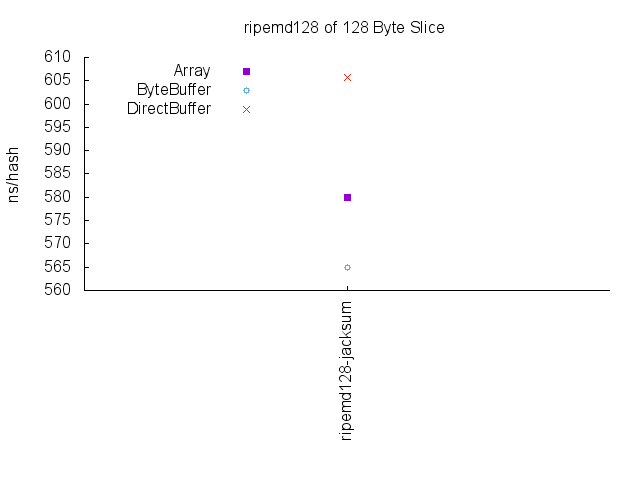

| Algorithm |  Array | ByteBuffer | DirectBuffer |
| --- | ---: | ---: | ---: | 
| [ripemd128-jacksum](#ripemd128-jacksum-latency) | 579.973276 | 564.871529 | 605.608990 |

---
### 128 Byte Slice Latency (ripemd160)

| Algorithm |  Array | ByteBuffer | DirectBuffer |
| --- | ---: | ---: | ---: | 
| [ripemd160-jacksum](#ripemd160-jacksum-latency) | 1131.819393 | 1101.438317 | 1137.282286 |

---
### 128 Byte Slice Latency (ripemd256)
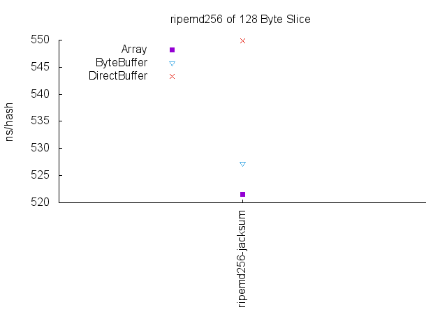

| Algorithm |  Array | ByteBuffer | DirectBuffer |
| --- | ---: | ---: | ---: | 
| [ripemd256-jacksum](#ripemd256-jacksum-latency) | 521.498613 | 527.262336 | 549.893803 |

---
### 128 Byte Slice Latency (ripemd320)
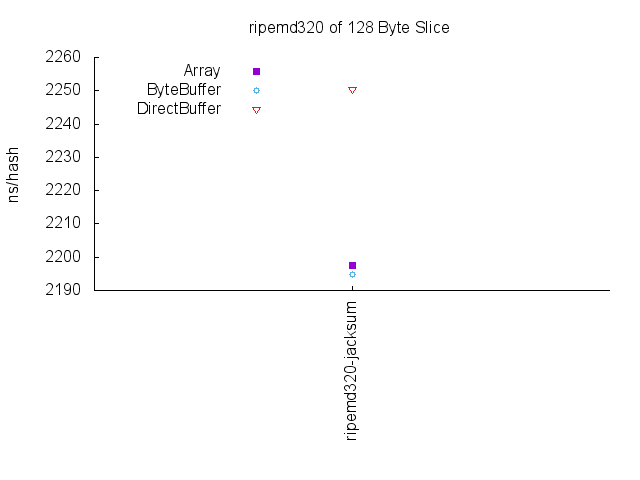

| Algorithm |  Array | ByteBuffer | DirectBuffer |
| --- | ---: | ---: | ---: | 
| [ripemd320-jacksum](#ripemd320-jacksum-latency) | 2197.641070 | 2194.750406 | 2250.312552 |

---
### 128 Byte Slice Latency (sha0)
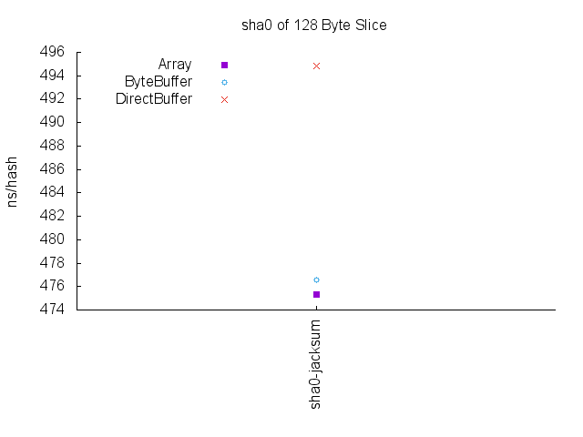

| Algorithm |  Array | ByteBuffer | DirectBuffer |
| --- | ---: | ---: | ---: | 
| [sha0-jacksum](#sha0-jacksum-latency) | 475.347087 | 476.532919 | 494.804506 |

---
### 128 Byte Slice Latency (sha1)
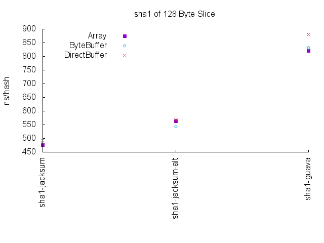

| Algorithm |  Array | ByteBuffer | DirectBuffer |
| --- | ---: | ---: | ---: | 
| [sha1-jacksum](#sha1-jacksum-latency) | 476.289266 | 483.675909 | 492.718211 |
| [sha1-jacksum-alt](#sha1-jacksum-alt-latency) | 562.327014 | 544.000806 | 569.009870 |
| [sha1-guava](#sha1-guava-latency) | 819.782189 | 831.462563 | 880.446803 |

---
### 128 Byte Slice Latency (sha224)
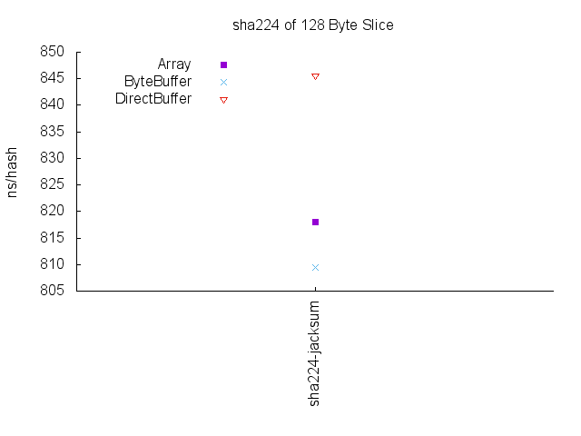

| Algorithm |  Array | ByteBuffer | DirectBuffer |
| --- | ---: | ---: | ---: | 
| [sha224-jacksum](#sha224-jacksum-latency) | 817.995207 | 809.423970 | 845.618539 |

---
### 128 Byte Slice Latency (sha256)
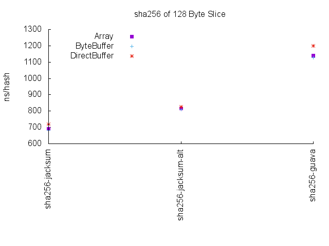

| Algorithm |  Array | ByteBuffer | DirectBuffer |
| --- | ---: | ---: | ---: | 
| [sha256-jacksum](#sha256-jacksum-latency) | 689.532094 | 682.494129 | 718.734724 |
| [sha256-jacksum-alt](#sha256-jacksum-alt-latency) | 817.982130 | 811.859397 | 826.083288 |
| [sha256-guava](#sha256-guava-latency) | 1138.526107 | 1128.311294 | 1200.340719 |

---
### 128 Byte Slice Latency (sha384)
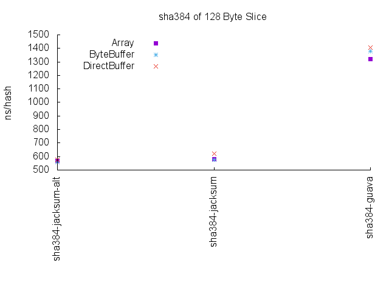

| Algorithm |  Array | ByteBuffer | DirectBuffer |
| --- | ---: | ---: | ---: | 
| [sha384-jacksum-alt](#sha384-jacksum-alt-latency) | 567.940351 | 559.824943 | 578.342947 |
| [sha384-jacksum](#sha384-jacksum-latency) | 581.017695 | 576.656070 | 620.683768 |
| [sha384-guava](#sha384-guava-latency) | 1319.581454 | 1378.681152 | 1406.509310 |

---
### 128 Byte Slice Latency (sha512)
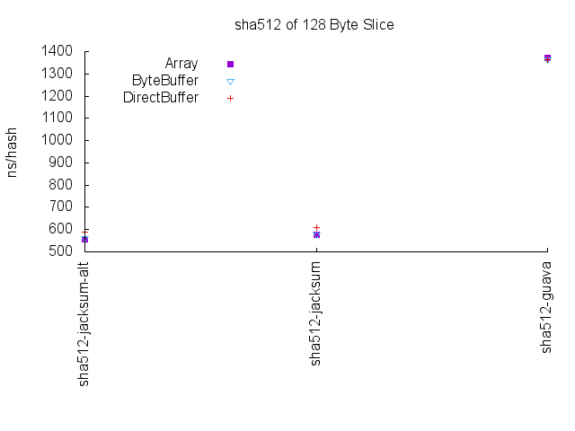

| Algorithm |  Array | ByteBuffer | DirectBuffer |
| --- | ---: | ---: | ---: | 
| [sha512-jacksum-alt](#sha512-jacksum-alt-latency) | 558.364466 | 561.595110 | 587.717067 |
| [sha512-jacksum](#sha512-jacksum-latency) | 577.782897 | 576.574096 | 607.677052 |
| [sha512-guava](#sha512-guava-latency) | 1373.408018 | 1365.403494 | 1363.227702 |

---
### 128 Byte Slice Latency (sip)
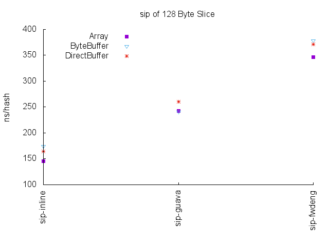

| Algorithm |  Array | ByteBuffer | DirectBuffer |
| --- | ---: | ---: | ---: | 
| [sip-inline](#sip-inline-latency) | 145.865406 | 174.150382 | 164.423727 |
| [sip-guava](#sip-guava-latency) | 242.257410 | 240.456324 | 260.660206 |
| [sip-fwdeng](#sip-fwdeng-latency) | 346.109556 | 378.031124 | 371.007290 |

---
### 128 Byte Slice Latency (sum16)
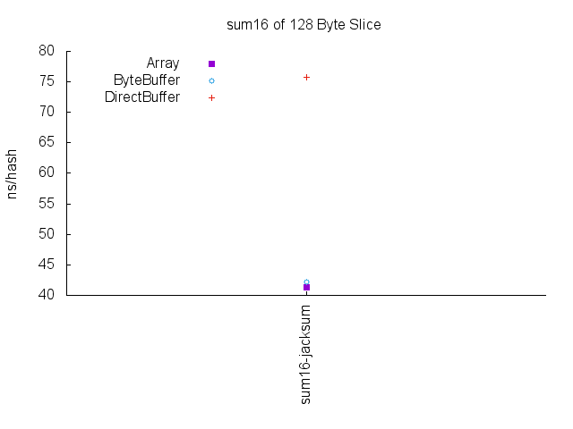

| Algorithm |  Array | ByteBuffer | DirectBuffer |
| --- | ---: | ---: | ---: | 
| [sum16-jacksum](#sum16-jacksum-latency) | 41.326166 | 42.252950 | 75.717950 |

---
### 128 Byte Slice Latency (sum24)

| Algorithm |  Array | ByteBuffer | DirectBuffer |
| --- | ---: | ---: | ---: | 
| [sum24-jacksum](#sum24-jacksum-latency) | 40.662861 | 41.762316 | 74.672972 |

---
### 128 Byte Slice Latency (sum32)
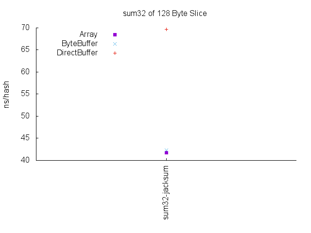

| Algorithm |  Array | ByteBuffer | DirectBuffer |
| --- | ---: | ---: | ---: | 
| [sum32-jacksum](#sum32-jacksum-latency) | 41.798007 | 42.359168 | 69.716058 |

---
### 128 Byte Slice Latency (sum8)
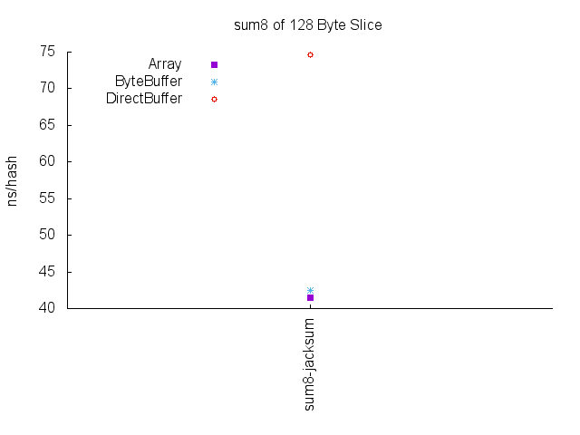

| Algorithm |  Array | ByteBuffer | DirectBuffer |
| --- | ---: | ---: | ---: | 
| [sum8-jacksum](#sum8-jacksum-latency) | 41.488963 | 42.496991 | 74.575812 |

---
### 128 Byte Slice Latency (sumbsd)
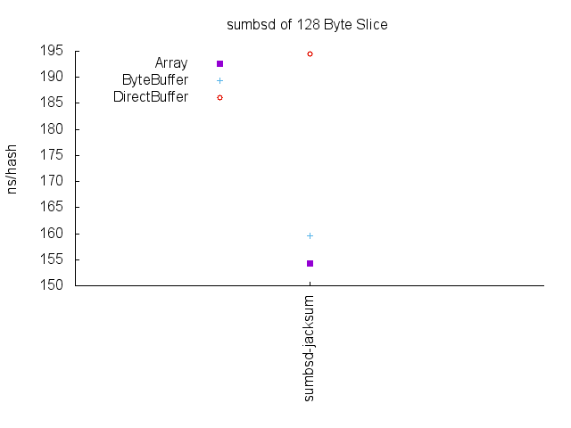

| Algorithm |  Array | ByteBuffer | DirectBuffer |
| --- | ---: | ---: | ---: | 
| [sumbsd-jacksum](#sumbsd-jacksum-latency) | 154.196105 | 159.602203 | 194.412577 |

---
### 128 Byte Slice Latency (sumsysv)
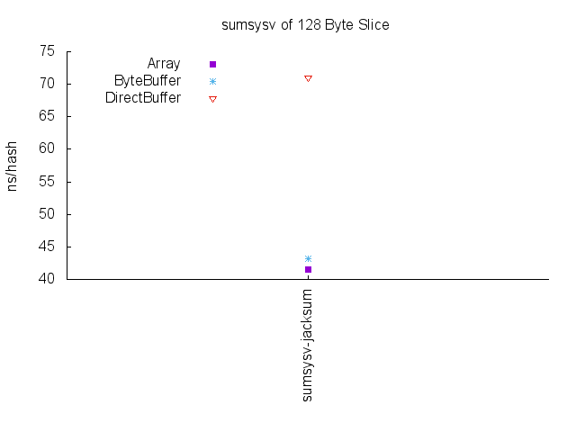

| Algorithm |  Array | ByteBuffer | DirectBuffer |
| --- | ---: | ---: | ---: | 
| [sumsysv-jacksum](#sumsysv-jacksum-latency) | 41.547453 | 43.135244 | 70.977552 |

---
### 128 Byte Slice Latency (tiger)
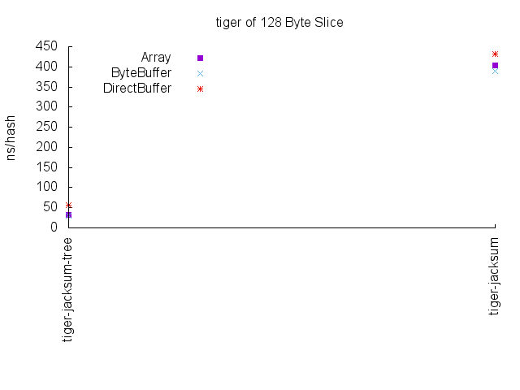

| Algorithm |  Array | ByteBuffer | DirectBuffer |
| --- | ---: | ---: | ---: | 
| [tiger-jacksum-tree](#tiger-jacksum-tree-latency) | 32.008946 | 30.141155 | 55.596663 |
| [tiger-jacksum](#tiger-jacksum-latency) | 402.771481 | 388.482410 | 431.476851 |

---
### 128 Byte Slice Latency (tiger128)
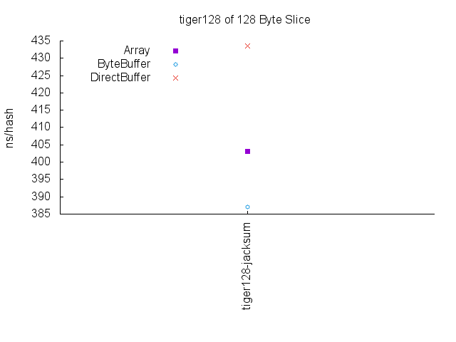

| Algorithm |  Array | ByteBuffer | DirectBuffer |
| --- | ---: | ---: | ---: | 
| [tiger128-jacksum](#tiger128-jacksum-latency) | 403.148946 | 386.998415 | 433.634198 |

---
### 128 Byte Slice Latency (tiger160)
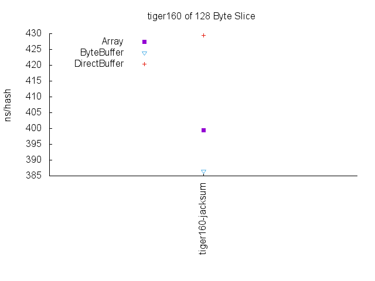

| Algorithm |  Array | ByteBuffer | DirectBuffer |
| --- | ---: | ---: | ---: | 
| [tiger160-jacksum](#tiger160-jacksum-latency) | 399.473227 | 386.428280 | 429.483193 |

---
### 128 Byte Slice Latency (tiger2)
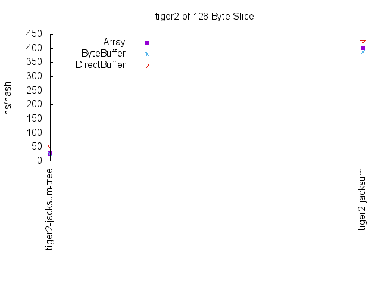

| Algorithm |  Array | ByteBuffer | DirectBuffer |
| --- | ---: | ---: | ---: | 
| [tiger2-jacksum-tree](#tiger2-jacksum-tree-latency) | 27.499859 | 26.354034 | 52.068442 |
| [tiger2-jacksum](#tiger2-jacksum-latency) | 400.952911 | 386.119405 | 424.707181 |

---
### 128 Byte Slice Latency (whirlpool0)
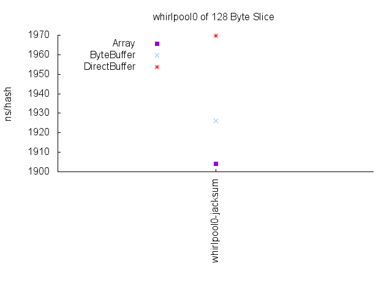

| Algorithm |  Array | ByteBuffer | DirectBuffer |
| --- | ---: | ---: | ---: | 
| [whirlpool0-jacksum](#whirlpool0-jacksum-latency) | 1904.155425 | 1926.137742 | 1969.685250 |

---
### 128 Byte Slice Latency (whirlpool1)
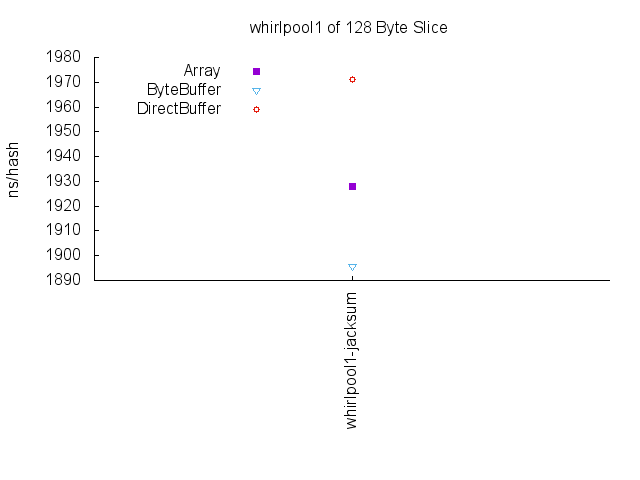

| Algorithm |  Array | ByteBuffer | DirectBuffer |
| --- | ---: | ---: | ---: | 
| [whirlpool1-jacksum](#whirlpool1-jacksum-latency) | 1927.817971 | 1895.735361 | 1970.968791 |

---
### 128 Byte Slice Latency (whirlpool2)
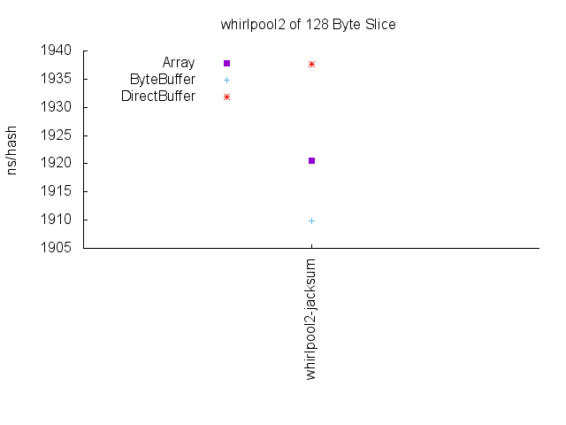

| Algorithm |  Array | ByteBuffer | DirectBuffer |
| --- | ---: | ---: | ---: | 
| [whirlpool2-jacksum](#whirlpool2-jacksum-latency) | 1920.538592 | 1909.923108 | 1937.615923 |

---
### 128 Byte Slice Latency (xor8)

| Algorithm |  Array | ByteBuffer | DirectBuffer |
| --- | ---: | ---: | ---: | 
| [xor8-jacksum](#xor8-jacksum-latency) | 40.908379 | 44.027816 | 73.310005 |

---
### 128 Byte Slice Latency (xxh32)
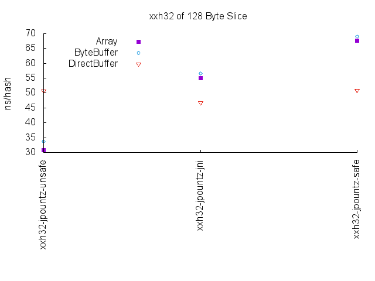

| Algorithm |  Array | ByteBuffer | DirectBuffer |
| --- | ---: | ---: | ---: | 
| [xxh32-jpountz-unsafe](#xxh32-jpountz-unsafe-latency) | 30.769773 | 33.735420 | 50.614023 |
| [xxh32-jpountz-jni](#xxh32-jpountz-jni-latency) | 55.035716 | 56.676609 | 46.841770 |
| [xxh32-jpountz-safe](#xxh32-jpountz-safe-latency) | 67.576606 | 68.960676 | 50.926180 |

---
### 128 Byte Slice Latency (xxh64)
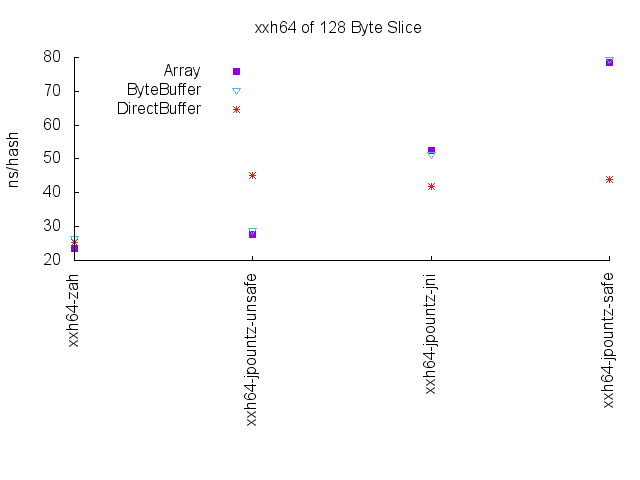

| Algorithm |  Array | ByteBuffer | DirectBuffer |
| --- | ---: | ---: | ---: | 
| [xxh64-zah](#xxh64-zah-latency) | 23.668633 | 26.549352 | 25.390800 |
| [xxh64-jpountz-unsafe](#xxh64-jpountz-unsafe-latency) | 27.601338 | 28.992751 | 45.090046 |
| [xxh64-jpountz-jni](#xxh64-jpountz-jni-latency) | 52.544770 | 51.453524 | 42.009927 |
| [xxh64-jpountz-safe](#xxh64-jpountz-safe-latency) | 78.471688 | 79.481682 | 43.949058 |

---
### 512 Byte Slice Latency (All Hashes)
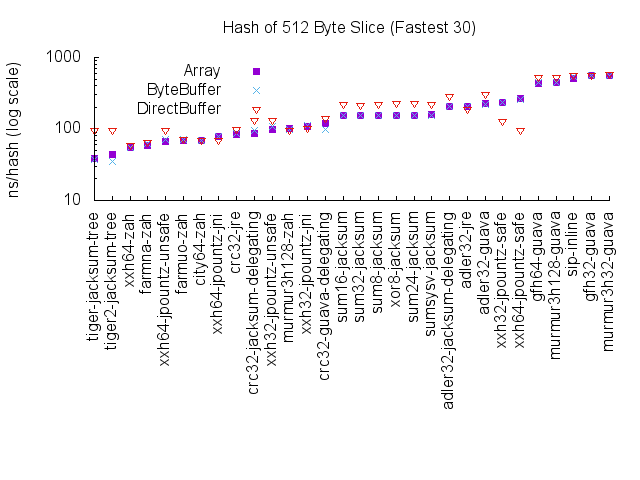

| Algorithm |  Array | ByteBuffer | DirectBuffer |
| --- | ---: | ---: | ---: | 
| [tiger-jacksum-tree](#tiger-jacksum-tree-latency) | 39.109342 | 37.491375 | 94.903540 |
| [tiger2-jacksum-tree](#tiger2-jacksum-tree-latency) | 44.209227 | 35.022570 | 96.398291 |
| [xxh64-zah](#xxh64-zah-latency) | 55.304471 | 55.838139 | 57.998957 |
| [farmna-zah](#farmna-zah-latency) | 59.642152 | 61.952459 | 65.606588 |
| [xxh64-jpountz-unsafe](#xxh64-jpountz-unsafe-latency) | 67.150554 | 70.471460 | 95.899078 |
| [farmuo-zah](#farmuo-zah-latency) | 69.023085 | 71.448800 | 70.253630 |
| [city64-zah](#city64-zah-latency) | 69.231370 | 69.602286 | 69.792000 |
| [xxh64-jpountz-jni](#xxh64-jpountz-jni-latency) | 77.421699 | 78.923652 | 69.180132 |
| [crc32-jre](#crc32-jre-latency) | 83.284637 | 85.383682 | 98.802416 |
| [crc32-jacksum-delegating](#crc32-jacksum-delegating-latency) | 85.869463 | 95.744330 | 131.073551 |
| [xxh32-jpountz-unsafe](#xxh32-jpountz-unsafe-latency) | 98.926931 | 109.738485 | 131.124170 |
| [murmur3h128-zah](#murmur3h128-zah-latency) | 100.425436 | 96.871044 | 96.527365 |
| [xxh32-jpountz-jni](#xxh32-jpountz-jni-latency) | 109.278624 | 111.994510 | 100.114678 |
| [crc32-guava-delegating](#crc32-guava-delegating-latency) | 120.502371 | 99.811633 | 138.120595 |
| [sum16-jacksum](#sum16-jacksum-latency) | 153.489428 | 156.565576 | 222.485470 |
| [sum32-jacksum](#sum32-jacksum-latency) | 153.552981 | 156.241295 | 215.929615 |
| [sum8-jacksum](#sum8-jacksum-latency) | 153.788606 | 155.325582 | 219.822925 |
| [xor8-jacksum](#xor8-jacksum-latency) | 154.441668 | 155.112883 | 224.301715 |
| [sum24-jacksum](#sum24-jacksum-latency) | 156.443820 | 155.380564 | 224.428196 |
| [sumsysv-jacksum](#sumsysv-jacksum-latency) | 158.026877 | 156.157012 | 219.540204 |
| [adler32-jacksum-delegating](#adler32-jacksum-delegating-latency) | 207.189941 | 205.852885 | 281.483005 |
| [adler32-jre](#adler32-jre-latency) | 207.799399 | 204.010960 | 185.079747 |
| [adler32-guava](#adler32-guava-latency) | 224.370496 | 223.635692 | 303.167272 |
| [xxh32-jpountz-safe](#xxh32-jpountz-safe-latency) | 234.506435 | 238.203119 | 128.669890 |
| [xxh64-jpountz-safe](#xxh64-jpountz-safe-latency) | 264.619271 | 260.910056 | 95.510734 |
| [gfh64-guava](#gfh64-guava-latency) | 434.753407 | 447.520425 | 525.359893 |
| [murmur3h128-guava](#murmur3h128-guava-latency) | 449.312542 | 443.796114 | 533.339753 |
| [sip-inline](#sip-inline-latency) | 516.046586 | 548.977462 | 559.738497 |
| [gfh32-guava](#gfh32-guava-latency) | 556.505834 | 566.465486 | 568.563661 |
| [murmur3h32-guava](#murmur3h32-guava-latency) | 558.193441 | 568.857791 | 578.382803 |
| [sumbsd-jacksum](#sumbsd-jacksum-latency) | 616.734728 | 632.604595 | 681.241659 |
| [sip-guava](#sip-guava-latency) | 749.204862 | 734.052891 | 812.593961 |
| [elf-jacksum](#elf-jacksum-latency) | 880.500058 | 890.830908 | 957.036494 |
| [ed2k-jacksum](#ed2k-jacksum-latency) | 948.948873 | 951.785846 | 1010.974359 |
| [crc8-jacksum](#crc8-jacksum-latency) | 979.321730 | 942.261294 | 1083.116468 |
| [crc16-jacksum](#crc16-jacksum-latency) | 1157.420040 | 1152.612693 | 1206.489524 |
| [crc32-jacksum-fcs32](#crc32-jacksum-fcs32-latency) | 1185.512625 | 1205.982786 | 1252.518913 |
| [crc32-guava-rfc3720](#crc32-guava-rfc3720-latency) | 1226.375247 | 1197.195021 | 1274.106174 |
| [md4-jacksum](#md4-jacksum-latency) | 1255.376417 | 1240.364324 | 1304.349640 |
| [md5-jacksum](#md5-jacksum-latency) | 1257.124051 | 1244.789856 | 1316.970864 |
| [sip-fwdeng](#sip-fwdeng-latency) | 1283.477590 | 1341.475321 | 1308.687369 |
| [md2-jacksum](#md2-jacksum-latency) | 1285.041808 | 1272.512806 | 1303.267163 |
| [crc64-jacksum](#crc64-jacksum-latency) | 1295.873611 | 1288.573369 | 1359.235390 |
| [fcs16-jacksum](#fcs16-jacksum-latency) | 1311.326727 | 1326.468387 | 1374.476862 |
| [cksum-jacksum](#cksum-jacksum-latency) | 1319.018686 | 1331.447405 | 1398.210618 |
| [crc32-jacksum-mpeg2](#crc32-jacksum-mpeg2-latency) | 1332.698552 | 1315.308604 | 1376.985526 |
| [crc32-jacksum-bzip2](#crc32-jacksum-bzip2-latency) | 1373.127344 | 1724.418651 | 1510.069904 |
| [crc24-jacksum](#crc24-jacksum-latency) | 1378.737920 | 1733.332307 | 1512.802402 |
| [md5-jacksum-alt](#md5-jacksum-alt-latency) | 1450.510618 | 1462.957701 | 1478.505427 |
| [md5-guava](#md5-guava-latency) | 1487.566872 | 1482.388059 | 1579.185480 |
| [tiger2-jacksum](#tiger2-jacksum-latency) | 1513.759149 | 1505.205232 | 1582.616643 |
| [tiger-jacksum](#tiger-jacksum-latency) | 1523.288844 | 1526.725068 | 1608.774972 |
| [tiger128-jacksum](#tiger128-jacksum-latency) | 1524.061573 | 1517.167654 | 1588.389081 |
| [tiger160-jacksum](#tiger160-jacksum-latency) | 1524.365681 | 1502.583442 | 1566.208604 |
| [sha1-jacksum](#sha1-jacksum-latency) | 1871.419053 | 1874.721128 | 1918.665876 |
| [sha0-jacksum](#sha0-jacksum-latency) | 1907.783097 | 1881.002225 | 1977.735345 |
| [adler32-jacksum-alt](#adler32-jacksum-alt-latency) | 1976.086435 | 1951.175594 | 2009.820758 |
| [ripemd256-jacksum](#ripemd256-jacksum-latency) | 1992.198313 | 1997.072526 | 2072.048856 |
| [haval128h3-jacksum](#haval128h3-jacksum-latency) | 2084.437156 | 2080.383214 | 2161.481998 |
| [haval160h3-jacksum](#haval160h3-jacksum-latency) | 2099.899625 | 2087.744721 | 2147.591067 |
| [haval192h3-jacksum](#haval192h3-jacksum-latency) | 2110.269623 | 2096.486559 | 2172.476054 |
| [haval224h3-jacksum](#haval224h3-jacksum-latency) | 2118.637189 | 2093.896331 | 2341.948081 |
| [sha1-jacksum-alt](#sha1-jacksum-alt-latency) | 2140.845535 | 2120.772149 | 2163.711387 |
| [sha384-jacksum-alt](#sha384-jacksum-alt-latency) | 2145.685929 | 2164.728525 | 2199.267502 |
| [haval256h3-jacksum](#haval256h3-jacksum-latency) | 2151.577691 | 2081.630688 | 2182.642658 |
| [sha512-jacksum-alt](#sha512-jacksum-alt-latency) | 2163.867904 | 2157.576806 | 2224.781913 |
| [sha1-guava](#sha1-guava-latency) | 2197.456071 | 2227.398546 | 2340.487139 |
| [ripemd128-jacksum](#ripemd128-jacksum-latency) | 2215.584984 | 2215.339534 | 2298.459700 |
| [sha384-jacksum](#sha384-jacksum-latency) | 2275.522003 | 2288.886348 | 2311.847186 |
| [sha512-jacksum](#sha512-jacksum-latency) | 2275.805266 | 2287.487985 | 2319.508167 |
| [has160-jacksum](#has160-jacksum-latency) | 2410.805867 | 2407.741746 | 2450.563718 |
| [sha256-jacksum](#sha256-jacksum-latency) | 2715.298737 | 2704.428693 | 2768.593832 |
| [haval128h4-jacksum](#haval128h4-jacksum-latency) | 2858.705456 | 2851.948562 | 2985.112153 |
| [haval160h4-jacksum](#haval160h4-jacksum-latency) | 2864.336569 | 2867.498414 | 2962.554253 |
| [haval192h4-jacksum](#haval192h4-jacksum-latency) | 2864.817469 | 2878.223427 | 2962.537646 |
| [haval256h4-jacksum](#haval256h4-jacksum-latency) | 2875.069766 | 2867.561636 | 2951.588394 |
| [haval224h4-jacksum](#haval224h4-jacksum-latency) | 2902.084019 | 2865.342828 | 2934.867806 |
| [sha512-guava](#sha512-guava-latency) | 3029.973795 | 3084.105104 | 3134.961463 |
| [sha384-guava](#sha384-guava-latency) | 3039.583659 | 3021.320795 | 3069.565338 |
| [sha256-jacksum-alt](#sha256-jacksum-alt-latency) | 3166.190270 | 3193.271812 | 3218.621132 |
| [sha256-guava](#sha256-guava-latency) | 3238.650608 | 3151.324767 | 3225.531575 |
| [sha224-jacksum](#sha224-jacksum-latency) | 3239.682566 | 3158.224612 | 3239.127684 |
| [haval256h5-jacksum](#haval256h5-jacksum-latency) | 3517.205081 | 3556.794203 | 3590.542244 |
| [haval128h5-jacksum](#haval128h5-jacksum-latency) | 3531.314102 | 3480.919540 | 3584.683743 |
| [haval160h5-jacksum](#haval160h5-jacksum-latency) | 3534.012518 | 3534.475621 | 3561.469952 |
| [haval192h5-jacksum](#haval192h5-jacksum-latency) | 3539.502161 | 3477.151156 | 3552.865519 |
| [haval224h5-jacksum](#haval224h5-jacksum-latency) | 3576.964413 | 3541.073190 | 3568.154974 |
| [ripemd160-jacksum](#ripemd160-jacksum-latency) | 4345.143677 | 4333.796255 | 4420.891515 |
| [whirlpool1-jacksum](#whirlpool1-jacksum-latency) | 7560.692321 | 7548.072068 | 7735.364425 |
| [whirlpool2-jacksum](#whirlpool2-jacksum-latency) | 7623.106365 | 7422.279444 | 7795.903170 |
| [whirlpool0-jacksum](#whirlpool0-jacksum-latency) | 7627.928266 | 7625.906925 | 7729.036374 |
| [ripemd320-jacksum](#ripemd320-jacksum-latency) | 8730.360801 | 8760.168908 | 8876.608782 |

---
### 512 Byte Slice Latency (adler32)
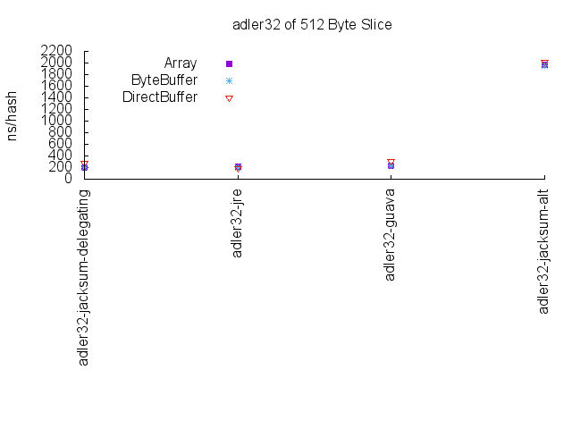

| Algorithm |  Array | ByteBuffer | DirectBuffer |
| --- | ---: | ---: | ---: | 
| [adler32-jacksum-delegating](#adler32-jacksum-delegating-latency) | 207.189941 | 205.852885 | 281.483005 |
| [adler32-jre](#adler32-jre-latency) | 207.799399 | 204.010960 | 185.079747 |
| [adler32-guava](#adler32-guava-latency) | 224.370496 | 223.635692 | 303.167272 |
| [adler32-jacksum-alt](#adler32-jacksum-alt-latency) | 1976.086435 | 1951.175594 | 2009.820758 |

---
### 512 Byte Slice Latency (city64)

| Algorithm |  Array | ByteBuffer | DirectBuffer |
| --- | ---: | ---: | ---: | 
| [city64-zah](#city64-zah-latency) | 69.231370 | 69.602286 | 69.792000 |

---
### 512 Byte Slice Latency (cksum)
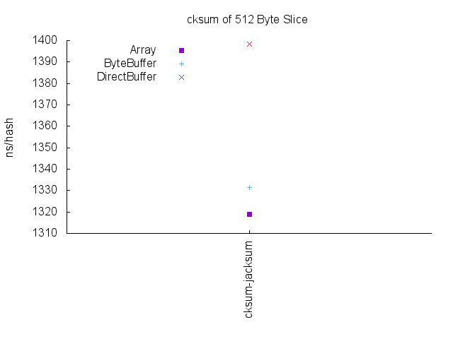

| Algorithm |  Array | ByteBuffer | DirectBuffer |
| --- | ---: | ---: | ---: | 
| [cksum-jacksum](#cksum-jacksum-latency) | 1319.018686 | 1331.447405 | 1398.210618 |

---
### 512 Byte Slice Latency (crc16)
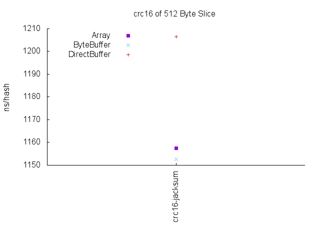

| Algorithm |  Array | ByteBuffer | DirectBuffer |
| --- | ---: | ---: | ---: | 
| [crc16-jacksum](#crc16-jacksum-latency) | 1157.420040 | 1152.612693 | 1206.489524 |

---
### 512 Byte Slice Latency (crc24)
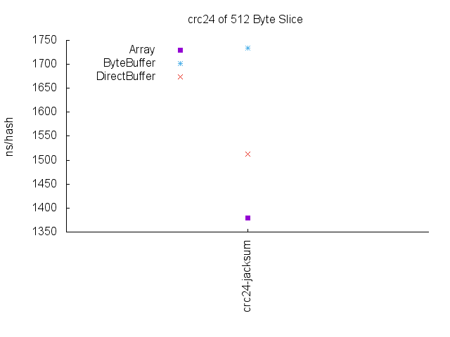

| Algorithm |  Array | ByteBuffer | DirectBuffer |
| --- | ---: | ---: | ---: | 
| [crc24-jacksum](#crc24-jacksum-latency) | 1378.737920 | 1733.332307 | 1512.802402 |

---
### 512 Byte Slice Latency (crc32)
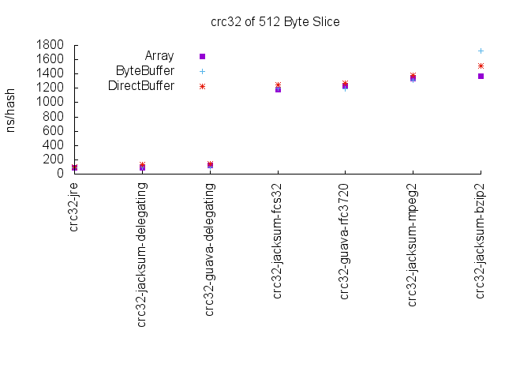

| Algorithm |  Array | ByteBuffer | DirectBuffer |
| --- | ---: | ---: | ---: | 
| [crc32-jre](#crc32-jre-latency) | 83.284637 | 85.383682 | 98.802416 |
| [crc32-jacksum-delegating](#crc32-jacksum-delegating-latency) | 85.869463 | 95.744330 | 131.073551 |
| [crc32-guava-delegating](#crc32-guava-delegating-latency) | 120.502371 | 99.811633 | 138.120595 |
| [crc32-jacksum-fcs32](#crc32-jacksum-fcs32-latency) | 1185.512625 | 1205.982786 | 1252.518913 |
| [crc32-guava-rfc3720](#crc32-guava-rfc3720-latency) | 1226.375247 | 1197.195021 | 1274.106174 |
| [crc32-jacksum-mpeg2](#crc32-jacksum-mpeg2-latency) | 1332.698552 | 1315.308604 | 1376.985526 |
| [crc32-jacksum-bzip2](#crc32-jacksum-bzip2-latency) | 1373.127344 | 1724.418651 | 1510.069904 |

---
### 512 Byte Slice Latency (crc64)
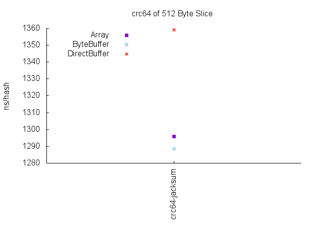

| Algorithm |  Array | ByteBuffer | DirectBuffer |
| --- | ---: | ---: | ---: | 
| [crc64-jacksum](#crc64-jacksum-latency) | 1295.873611 | 1288.573369 | 1359.235390 |

---
### 512 Byte Slice Latency (crc8)
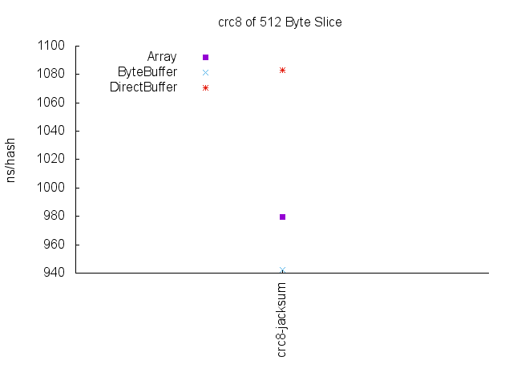

| Algorithm |  Array | ByteBuffer | DirectBuffer |
| --- | ---: | ---: | ---: | 
| [crc8-jacksum](#crc8-jacksum-latency) | 979.321730 | 942.261294 | 1083.116468 |

---
### 512 Byte Slice Latency (ed2k)

| Algorithm |  Array | ByteBuffer | DirectBuffer |
| --- | ---: | ---: | ---: | 
| [ed2k-jacksum](#ed2k-jacksum-latency) | 948.948873 | 951.785846 | 1010.974359 |

---
### 512 Byte Slice Latency (elf)
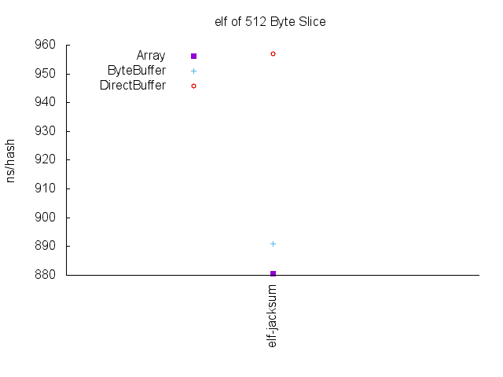

| Algorithm |  Array | ByteBuffer | DirectBuffer |
| --- | ---: | ---: | ---: | 
| [elf-jacksum](#elf-jacksum-latency) | 880.500058 | 890.830908 | 957.036494 |

---
### 512 Byte Slice Latency (farmna)
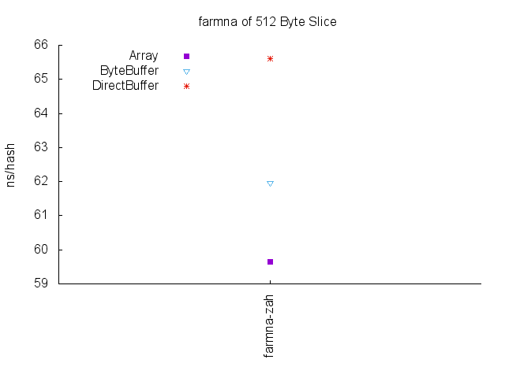

| Algorithm |  Array | ByteBuffer | DirectBuffer |
| --- | ---: | ---: | ---: | 
| [farmna-zah](#farmna-zah-latency) | 59.642152 | 61.952459 | 65.606588 |

---
### 512 Byte Slice Latency (farmuo)
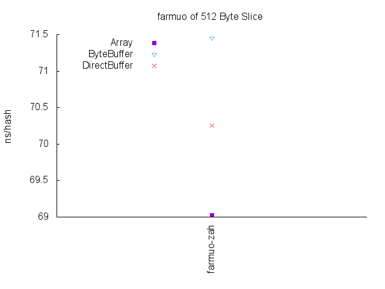

| Algorithm |  Array | ByteBuffer | DirectBuffer |
| --- | ---: | ---: | ---: | 
| [farmuo-zah](#farmuo-zah-latency) | 69.023085 | 71.448800 | 70.253630 |

---
### 512 Byte Slice Latency (fcs16)
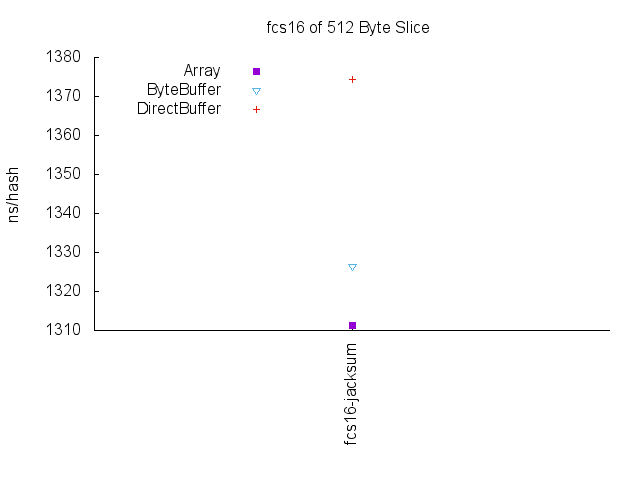

| Algorithm |  Array | ByteBuffer | DirectBuffer |
| --- | ---: | ---: | ---: | 
| [fcs16-jacksum](#fcs16-jacksum-latency) | 1311.326727 | 1326.468387 | 1374.476862 |

---
### 512 Byte Slice Latency (gfh32)

| Algorithm |  Array | ByteBuffer | DirectBuffer |
| --- | ---: | ---: | ---: | 
| [gfh32-guava](#gfh32-guava-latency) | 556.505834 | 566.465486 | 568.563661 |

---
### 512 Byte Slice Latency (gfh64)
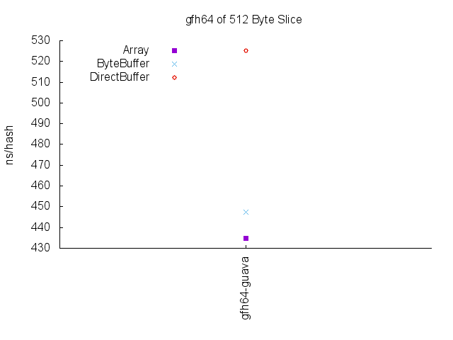

| Algorithm |  Array | ByteBuffer | DirectBuffer |
| --- | ---: | ---: | ---: | 
| [gfh64-guava](#gfh64-guava-latency) | 434.753407 | 447.520425 | 525.359893 |

---
### 512 Byte Slice Latency (has160)
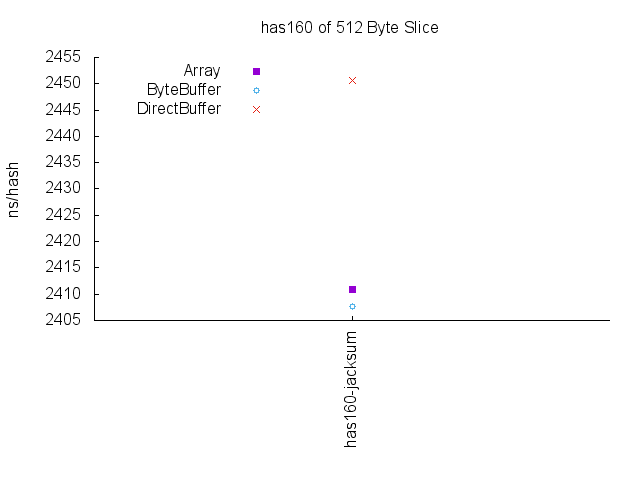

| Algorithm |  Array | ByteBuffer | DirectBuffer |
| --- | ---: | ---: | ---: | 
| [has160-jacksum](#has160-jacksum-latency) | 2410.805867 | 2407.741746 | 2450.563718 |

---
### 512 Byte Slice Latency (haval128h3)
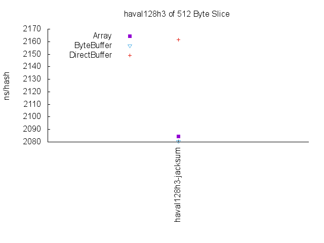

| Algorithm |  Array | ByteBuffer | DirectBuffer |
| --- | ---: | ---: | ---: | 
| [haval128h3-jacksum](#haval128h3-jacksum-latency) | 2084.437156 | 2080.383214 | 2161.481998 |

---
### 512 Byte Slice Latency (haval128h4)
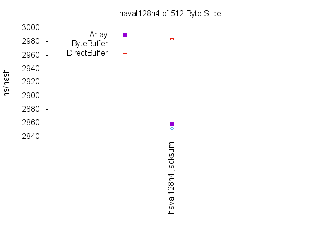

| Algorithm |  Array | ByteBuffer | DirectBuffer |
| --- | ---: | ---: | ---: | 
| [haval128h4-jacksum](#haval128h4-jacksum-latency) | 2858.705456 | 2851.948562 | 2985.112153 |

---
### 512 Byte Slice Latency (haval128h5)
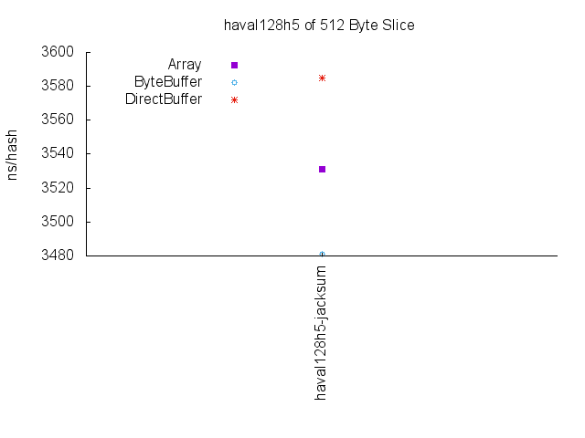

| Algorithm |  Array | ByteBuffer | DirectBuffer |
| --- | ---: | ---: | ---: | 
| [haval128h5-jacksum](#haval128h5-jacksum-latency) | 3531.314102 | 3480.919540 | 3584.683743 |

---
### 512 Byte Slice Latency (haval160h3)
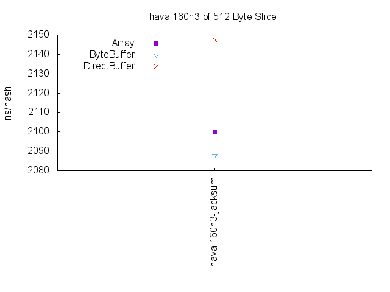

| Algorithm |  Array | ByteBuffer | DirectBuffer |
| --- | ---: | ---: | ---: | 
| [haval160h3-jacksum](#haval160h3-jacksum-latency) | 2099.899625 | 2087.744721 | 2147.591067 |

---
### 512 Byte Slice Latency (haval160h4)

| Algorithm |  Array | ByteBuffer | DirectBuffer |
| --- | ---: | ---: | ---: | 
| [haval160h4-jacksum](#haval160h4-jacksum-latency) | 2864.336569 | 2867.498414 | 2962.554253 |

---
### 512 Byte Slice Latency (haval160h5)

| Algorithm |  Array | ByteBuffer | DirectBuffer |
| --- | ---: | ---: | ---: | 
| [haval160h5-jacksum](#haval160h5-jacksum-latency) | 3534.012518 | 3534.475621 | 3561.469952 |

---
### 512 Byte Slice Latency (haval192h3)
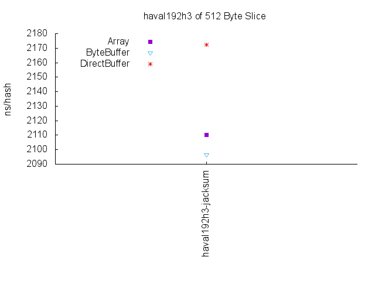

| Algorithm |  Array | ByteBuffer | DirectBuffer |
| --- | ---: | ---: | ---: | 
| [haval192h3-jacksum](#haval192h3-jacksum-latency) | 2110.269623 | 2096.486559 | 2172.476054 |

---
### 512 Byte Slice Latency (haval192h4)
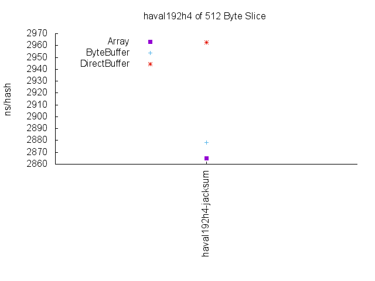

| Algorithm |  Array | ByteBuffer | DirectBuffer |
| --- | ---: | ---: | ---: | 
| [haval192h4-jacksum](#haval192h4-jacksum-latency) | 2864.817469 | 2878.223427 | 2962.537646 |

---
### 512 Byte Slice Latency (haval192h5)

| Algorithm |  Array | ByteBuffer | DirectBuffer |
| --- | ---: | ---: | ---: | 
| [haval192h5-jacksum](#haval192h5-jacksum-latency) | 3539.502161 | 3477.151156 | 3552.865519 |

---
### 512 Byte Slice Latency (haval224h3)
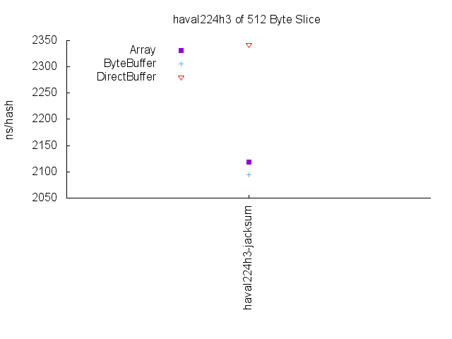

| Algorithm |  Array | ByteBuffer | DirectBuffer |
| --- | ---: | ---: | ---: | 
| [haval224h3-jacksum](#haval224h3-jacksum-latency) | 2118.637189 | 2093.896331 | 2341.948081 |

---
### 512 Byte Slice Latency (haval224h4)
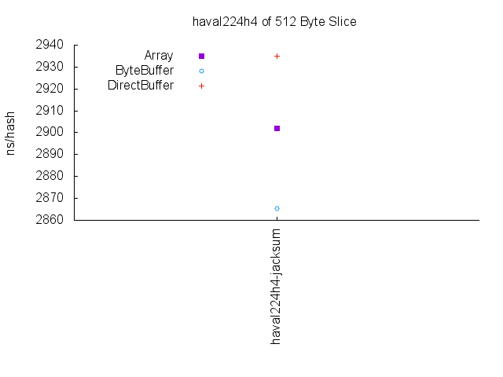

| Algorithm |  Array | ByteBuffer | DirectBuffer |
| --- | ---: | ---: | ---: | 
| [haval224h4-jacksum](#haval224h4-jacksum-latency) | 2902.084019 | 2865.342828 | 2934.867806 |

---
### 512 Byte Slice Latency (haval224h5)
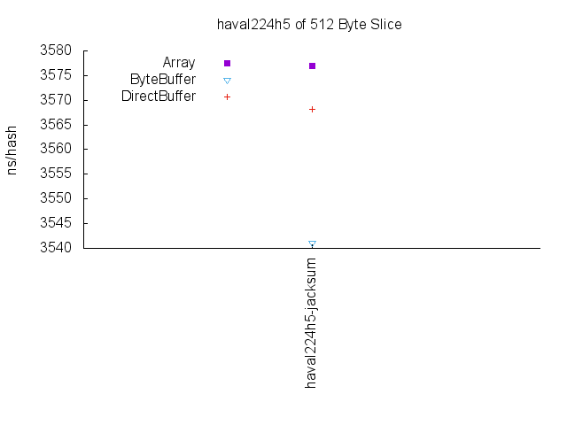

| Algorithm |  Array | ByteBuffer | DirectBuffer |
| --- | ---: | ---: | ---: | 
| [haval224h5-jacksum](#haval224h5-jacksum-latency) | 3576.964413 | 3541.073190 | 3568.154974 |

---
### 512 Byte Slice Latency (haval256h3)

| Algorithm |  Array | ByteBuffer | DirectBuffer |
| --- | ---: | ---: | ---: | 
| [haval256h3-jacksum](#haval256h3-jacksum-latency) | 2151.577691 | 2081.630688 | 2182.642658 |

---
### 512 Byte Slice Latency (haval256h4)
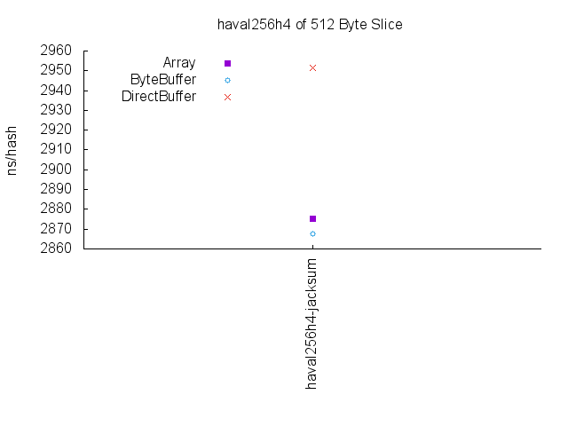

| Algorithm |  Array | ByteBuffer | DirectBuffer |
| --- | ---: | ---: | ---: | 
| [haval256h4-jacksum](#haval256h4-jacksum-latency) | 2875.069766 | 2867.561636 | 2951.588394 |

---
### 512 Byte Slice Latency (haval256h5)
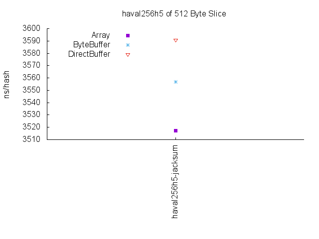

| Algorithm |  Array | ByteBuffer | DirectBuffer |
| --- | ---: | ---: | ---: | 
| [haval256h5-jacksum](#haval256h5-jacksum-latency) | 3517.205081 | 3556.794203 | 3590.542244 |

---
### 512 Byte Slice Latency (md2)
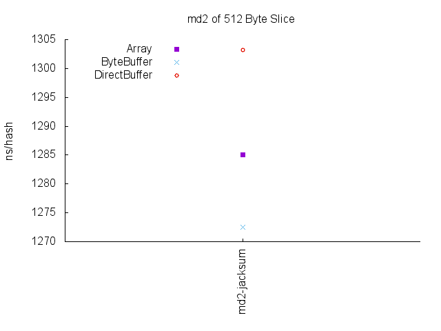

| Algorithm |  Array | ByteBuffer | DirectBuffer |
| --- | ---: | ---: | ---: | 
| [md2-jacksum](#md2-jacksum-latency) | 1285.041808 | 1272.512806 | 1303.267163 |

---
### 512 Byte Slice Latency (md4)
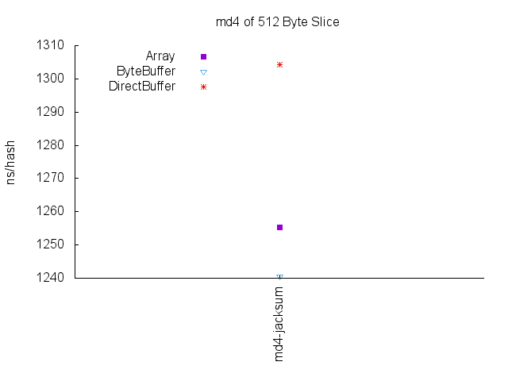

| Algorithm |  Array | ByteBuffer | DirectBuffer |
| --- | ---: | ---: | ---: | 
| [md4-jacksum](#md4-jacksum-latency) | 1255.376417 | 1240.364324 | 1304.349640 |

---
### 512 Byte Slice Latency (md5)

| Algorithm |  Array | ByteBuffer | DirectBuffer |
| --- | ---: | ---: | ---: | 
| [md5-jacksum](#md5-jacksum-latency) | 1257.124051 | 1244.789856 | 1316.970864 |
| [md5-jacksum-alt](#md5-jacksum-alt-latency) | 1450.510618 | 1462.957701 | 1478.505427 |
| [md5-guava](#md5-guava-latency) | 1487.566872 | 1482.388059 | 1579.185480 |

---
### 512 Byte Slice Latency (murmur3h128)
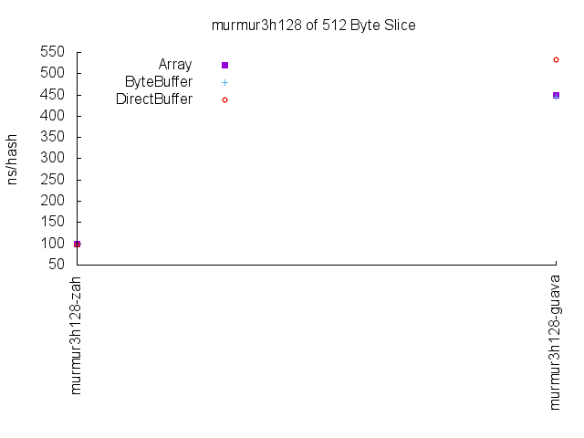

| Algorithm |  Array | ByteBuffer | DirectBuffer |
| --- | ---: | ---: | ---: | 
| [murmur3h128-zah](#murmur3h128-zah-latency) | 100.425436 | 96.871044 | 96.527365 |
| [murmur3h128-guava](#murmur3h128-guava-latency) | 449.312542 | 443.796114 | 533.339753 |

---
### 512 Byte Slice Latency (murmur3h32)
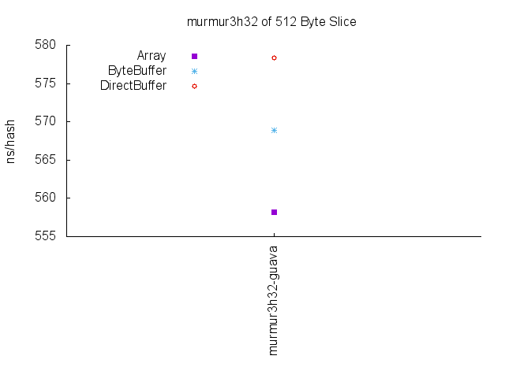

| Algorithm |  Array | ByteBuffer | DirectBuffer |
| --- | ---: | ---: | ---: | 
| [murmur3h32-guava](#murmur3h32-guava-latency) | 558.193441 | 568.857791 | 578.382803 |

---
### 512 Byte Slice Latency (ripemd128)
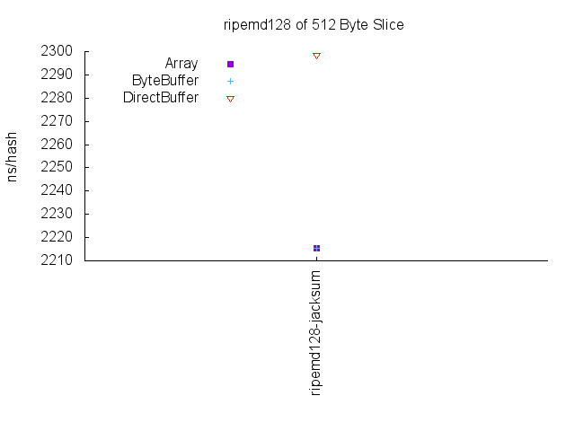

| Algorithm |  Array | ByteBuffer | DirectBuffer |
| --- | ---: | ---: | ---: | 
| [ripemd128-jacksum](#ripemd128-jacksum-latency) | 2215.584984 | 2215.339534 | 2298.459700 |

---
### 512 Byte Slice Latency (ripemd160)
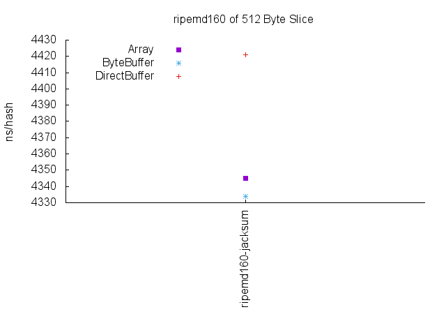

| Algorithm |  Array | ByteBuffer | DirectBuffer |
| --- | ---: | ---: | ---: | 
| [ripemd160-jacksum](#ripemd160-jacksum-latency) | 4345.143677 | 4333.796255 | 4420.891515 |

---
### 512 Byte Slice Latency (ripemd256)
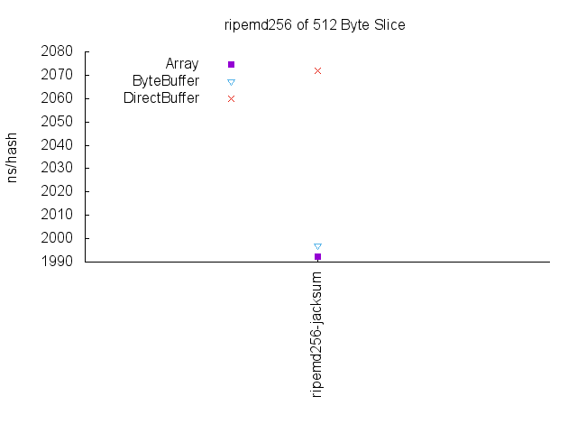

| Algorithm |  Array | ByteBuffer | DirectBuffer |
| --- | ---: | ---: | ---: | 
| [ripemd256-jacksum](#ripemd256-jacksum-latency) | 1992.198313 | 1997.072526 | 2072.048856 |

---
### 512 Byte Slice Latency (ripemd320)
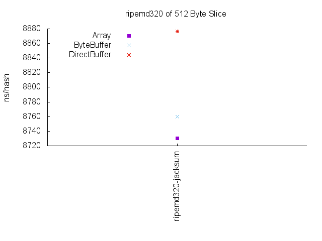

| Algorithm |  Array | ByteBuffer | DirectBuffer |
| --- | ---: | ---: | ---: | 
| [ripemd320-jacksum](#ripemd320-jacksum-latency) | 8730.360801 | 8760.168908 | 8876.608782 |

---
### 512 Byte Slice Latency (sha0)
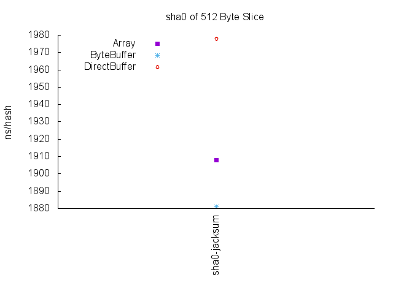

| Algorithm |  Array | ByteBuffer | DirectBuffer |
| --- | ---: | ---: | ---: | 
| [sha0-jacksum](#sha0-jacksum-latency) | 1907.783097 | 1881.002225 | 1977.735345 |

---
### 512 Byte Slice Latency (sha1)
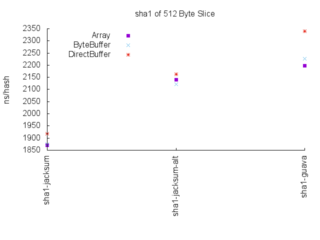

| Algorithm |  Array | ByteBuffer | DirectBuffer |
| --- | ---: | ---: | ---: | 
| [sha1-jacksum](#sha1-jacksum-latency) | 1871.419053 | 1874.721128 | 1918.665876 |
| [sha1-jacksum-alt](#sha1-jacksum-alt-latency) | 2140.845535 | 2120.772149 | 2163.711387 |
| [sha1-guava](#sha1-guava-latency) | 2197.456071 | 2227.398546 | 2340.487139 |

---
### 512 Byte Slice Latency (sha224)
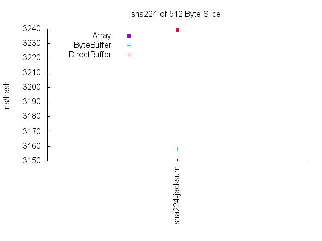

| Algorithm |  Array | ByteBuffer | DirectBuffer |
| --- | ---: | ---: | ---: | 
| [sha224-jacksum](#sha224-jacksum-latency) | 3239.682566 | 3158.224612 | 3239.127684 |

---
### 512 Byte Slice Latency (sha256)
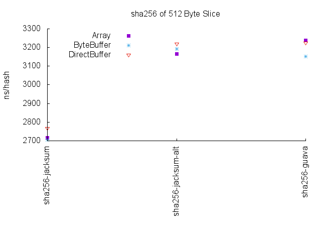

| Algorithm |  Array | ByteBuffer | DirectBuffer |
| --- | ---: | ---: | ---: | 
| [sha256-jacksum](#sha256-jacksum-latency) | 2715.298737 | 2704.428693 | 2768.593832 |
| [sha256-jacksum-alt](#sha256-jacksum-alt-latency) | 3166.190270 | 3193.271812 | 3218.621132 |
| [sha256-guava](#sha256-guava-latency) | 3238.650608 | 3151.324767 | 3225.531575 |

---
### 512 Byte Slice Latency (sha384)
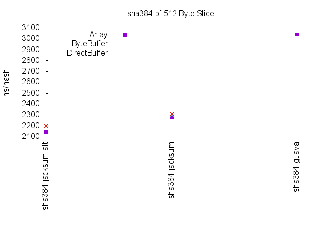

| Algorithm |  Array | ByteBuffer | DirectBuffer |
| --- | ---: | ---: | ---: | 
| [sha384-jacksum-alt](#sha384-jacksum-alt-latency) | 2145.685929 | 2164.728525 | 2199.267502 |
| [sha384-jacksum](#sha384-jacksum-latency) | 2275.522003 | 2288.886348 | 2311.847186 |
| [sha384-guava](#sha384-guava-latency) | 3039.583659 | 3021.320795 | 3069.565338 |

---
### 512 Byte Slice Latency (sha512)
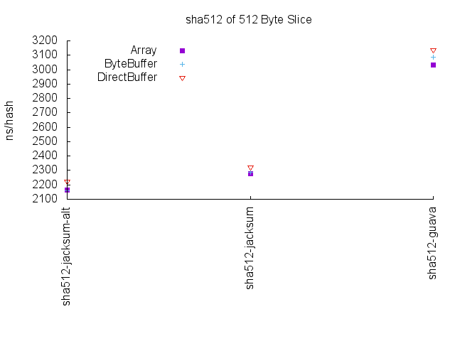

| Algorithm |  Array | ByteBuffer | DirectBuffer |
| --- | ---: | ---: | ---: | 
| [sha512-jacksum-alt](#sha512-jacksum-alt-latency) | 2163.867904 | 2157.576806 | 2224.781913 |
| [sha512-jacksum](#sha512-jacksum-latency) | 2275.805266 | 2287.487985 | 2319.508167 |
| [sha512-guava](#sha512-guava-latency) | 3029.973795 | 3084.105104 | 3134.961463 |

---
### 512 Byte Slice Latency (sip)
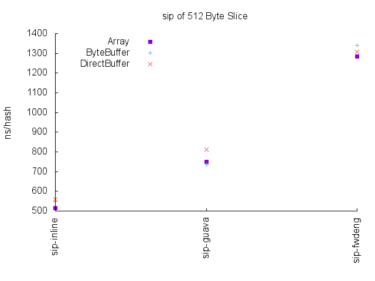

| Algorithm |  Array | ByteBuffer | DirectBuffer |
| --- | ---: | ---: | ---: | 
| [sip-inline](#sip-inline-latency) | 516.046586 | 548.977462 | 559.738497 |
| [sip-guava](#sip-guava-latency) | 749.204862 | 734.052891 | 812.593961 |
| [sip-fwdeng](#sip-fwdeng-latency) | 1283.477590 | 1341.475321 | 1308.687369 |

---
### 512 Byte Slice Latency (sum16)

| Algorithm |  Array | ByteBuffer | DirectBuffer |
| --- | ---: | ---: | ---: | 
| [sum16-jacksum](#sum16-jacksum-latency) | 153.489428 | 156.565576 | 222.485470 |

---
### 512 Byte Slice Latency (sum24)

| Algorithm |  Array | ByteBuffer | DirectBuffer |
| --- | ---: | ---: | ---: | 
| [sum24-jacksum](#sum24-jacksum-latency) | 156.443820 | 155.380564 | 224.428196 |

---
### 512 Byte Slice Latency (sum32)

| Algorithm |  Array | ByteBuffer | DirectBuffer |
| --- | ---: | ---: | ---: | 
| [sum32-jacksum](#sum32-jacksum-latency) | 153.552981 | 156.241295 | 215.929615 |

---
### 512 Byte Slice Latency (sum8)
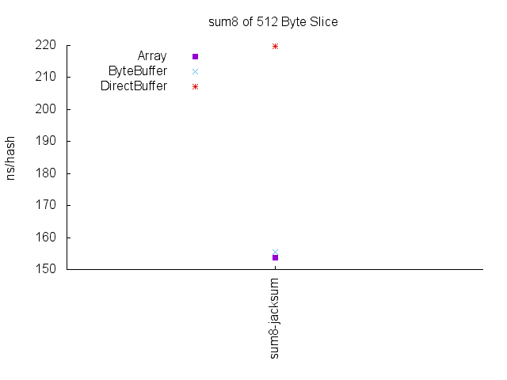

| Algorithm |  Array | ByteBuffer | DirectBuffer |
| --- | ---: | ---: | ---: | 
| [sum8-jacksum](#sum8-jacksum-latency) | 153.788606 | 155.325582 | 219.822925 |

---
### 512 Byte Slice Latency (sumbsd)

| Algorithm |  Array | ByteBuffer | DirectBuffer |
| --- | ---: | ---: | ---: | 
| [sumbsd-jacksum](#sumbsd-jacksum-latency) | 616.734728 | 632.604595 | 681.241659 |

---
### 512 Byte Slice Latency (sumsysv)
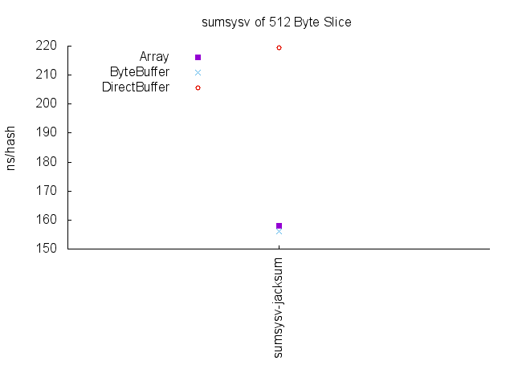

| Algorithm |  Array | ByteBuffer | DirectBuffer |
| --- | ---: | ---: | ---: | 
| [sumsysv-jacksum](#sumsysv-jacksum-latency) | 158.026877 | 156.157012 | 219.540204 |

---
### 512 Byte Slice Latency (tiger)
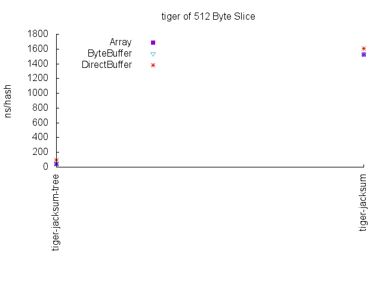

| Algorithm |  Array | ByteBuffer | DirectBuffer |
| --- | ---: | ---: | ---: | 
| [tiger-jacksum-tree](#tiger-jacksum-tree-latency) | 39.109342 | 37.491375 | 94.903540 |
| [tiger-jacksum](#tiger-jacksum-latency) | 1523.288844 | 1526.725068 | 1608.774972 |

---
### 512 Byte Slice Latency (tiger128)
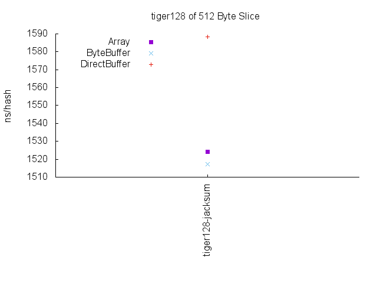

| Algorithm |  Array | ByteBuffer | DirectBuffer |
| --- | ---: | ---: | ---: | 
| [tiger128-jacksum](#tiger128-jacksum-latency) | 1524.061573 | 1517.167654 | 1588.389081 |

---
### 512 Byte Slice Latency (tiger160)
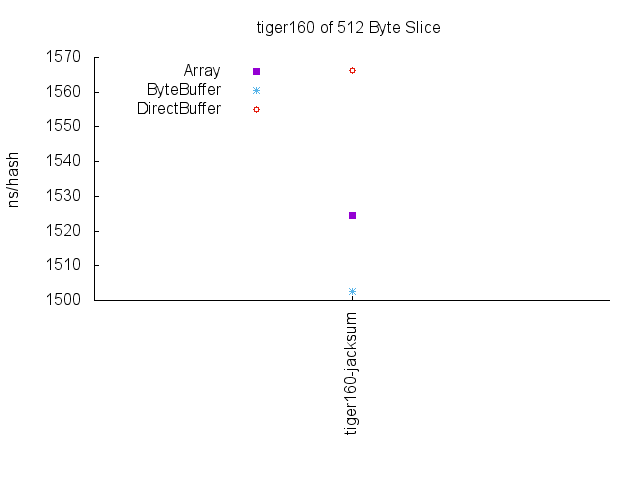

| Algorithm |  Array | ByteBuffer | DirectBuffer |
| --- | ---: | ---: | ---: | 
| [tiger160-jacksum](#tiger160-jacksum-latency) | 1524.365681 | 1502.583442 | 1566.208604 |

---
### 512 Byte Slice Latency (tiger2)
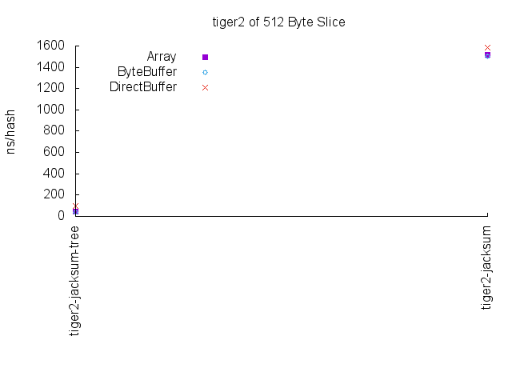

| Algorithm |  Array | ByteBuffer | DirectBuffer |
| --- | ---: | ---: | ---: | 
| [tiger2-jacksum-tree](#tiger2-jacksum-tree-latency) | 44.209227 | 35.022570 | 96.398291 |
| [tiger2-jacksum](#tiger2-jacksum-latency) | 1513.759149 | 1505.205232 | 1582.616643 |

---
### 512 Byte Slice Latency (whirlpool0)
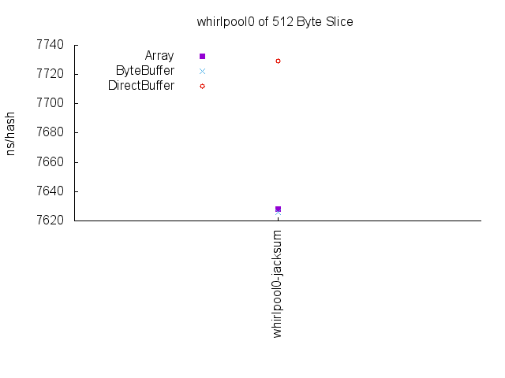

| Algorithm |  Array | ByteBuffer | DirectBuffer |
| --- | ---: | ---: | ---: | 
| [whirlpool0-jacksum](#whirlpool0-jacksum-latency) | 7627.928266 | 7625.906925 | 7729.036374 |

---
### 512 Byte Slice Latency (whirlpool1)
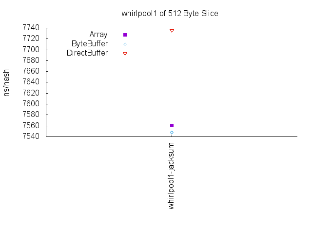

| Algorithm |  Array | ByteBuffer | DirectBuffer |
| --- | ---: | ---: | ---: | 
| [whirlpool1-jacksum](#whirlpool1-jacksum-latency) | 7560.692321 | 7548.072068 | 7735.364425 |

---
### 512 Byte Slice Latency (whirlpool2)
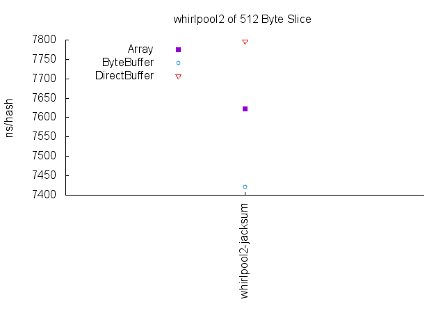

| Algorithm |  Array | ByteBuffer | DirectBuffer |
| --- | ---: | ---: | ---: | 
| [whirlpool2-jacksum](#whirlpool2-jacksum-latency) | 7623.106365 | 7422.279444 | 7795.903170 |

---
### 512 Byte Slice Latency (xor8)
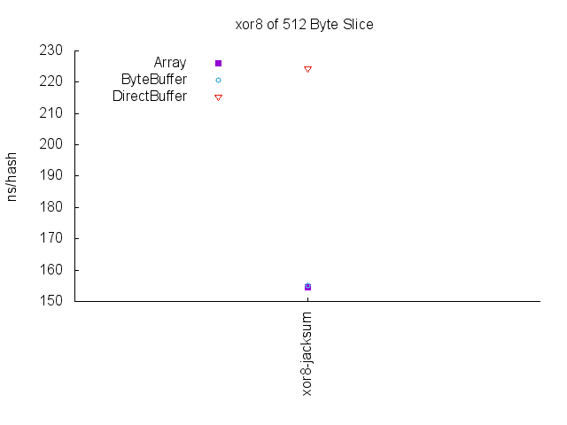

| Algorithm |  Array | ByteBuffer | DirectBuffer |
| --- | ---: | ---: | ---: | 
| [xor8-jacksum](#xor8-jacksum-latency) | 154.441668 | 155.112883 | 224.301715 |

---
### 512 Byte Slice Latency (xxh32)
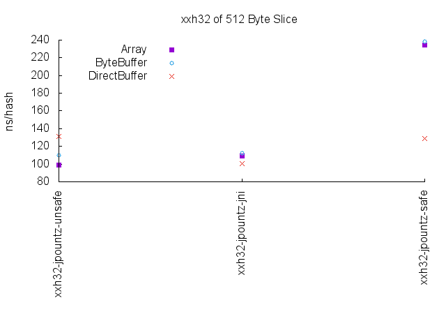

| Algorithm |  Array | ByteBuffer | DirectBuffer |
| --- | ---: | ---: | ---: | 
| [xxh32-jpountz-unsafe](#xxh32-jpountz-unsafe-latency) | 98.926931 | 109.738485 | 131.124170 |
| [xxh32-jpountz-jni](#xxh32-jpountz-jni-latency) | 109.278624 | 111.994510 | 100.114678 |
| [xxh32-jpountz-safe](#xxh32-jpountz-safe-latency) | 234.506435 | 238.203119 | 128.669890 |

---
### 512 Byte Slice Latency (xxh64)
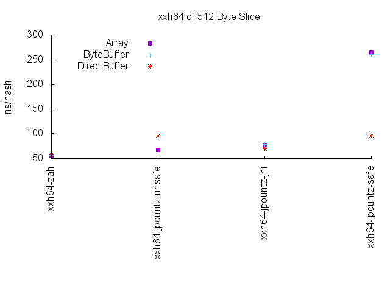

| Algorithm |  Array | ByteBuffer | DirectBuffer |
| --- | ---: | ---: | ---: | 
| [xxh64-zah](#xxh64-zah-latency) | 55.304471 | 55.838139 | 57.998957 |
| [xxh64-jpountz-unsafe](#xxh64-jpountz-unsafe-latency) | 67.150554 | 70.471460 | 95.899078 |
| [xxh64-jpountz-jni](#xxh64-jpountz-jni-latency) | 77.421699 | 78.923652 | 69.180132 |
| [xxh64-jpountz-safe](#xxh64-jpountz-safe-latency) | 264.619271 | 260.910056 | 95.510734 |

---
### 2048 Byte Slice Latency (All Hashes)
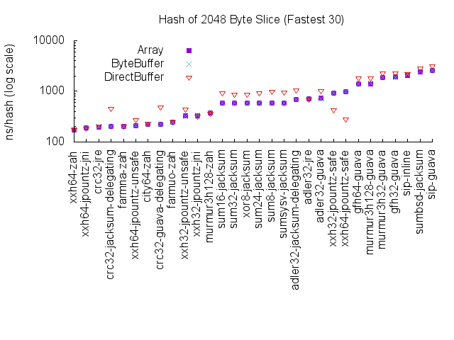

| Algorithm |  Array | ByteBuffer | DirectBuffer |
| --- | ---: | ---: | ---: | 
| [xxh64-zah](#xxh64-zah-latency) | 172.188990 | 176.949117 | 174.934754 |
| [xxh64-jpountz-jni](#xxh64-jpountz-jni-latency) | 187.453318 | 189.863714 | 183.313766 |
| [crc32-jre](#crc32-jre-latency) | 199.611858 | 202.122483 | 202.278871 |
| [crc32-jacksum-delegating](#crc32-jacksum-delegating-latency) | 201.087027 | 203.358158 | 459.056940 |
| [farmna-zah](#farmna-zah-latency) | 202.760730 | 204.175186 | 204.255908 |
| [xxh64-jpountz-unsafe](#xxh64-jpountz-unsafe-latency) | 207.720946 | 209.103336 | 272.441819 |
| [city64-zah](#city64-zah-latency) | 223.272456 | 226.746951 | 233.855028 |
| [crc32-guava-delegating](#crc32-guava-delegating-latency) | 224.916320 | 227.189089 | 480.132917 |
| [farmuo-zah](#farmuo-zah-latency) | 245.357364 | 242.768126 | 246.978142 |
| [xxh32-jpountz-unsafe](#xxh32-jpountz-unsafe-latency) | 324.159446 | 323.621201 | 442.417079 |
| [xxh32-jpountz-jni](#xxh32-jpountz-jni-latency) | 328.306468 | 338.901800 | 318.139058 |
| [murmur3h128-zah](#murmur3h128-zah-latency) | 374.101462 | 375.229995 | 365.065583 |
| [sum16-jacksum](#sum16-jacksum-latency) | 584.466210 | 591.471409 | 929.462249 |
| [sum32-jacksum](#sum32-jacksum-latency) | 586.336923 | 589.896572 | 875.090910 |
| [xor8-jacksum](#xor8-jacksum-latency) | 588.187371 | 596.002841 | 859.436093 |
| [sum24-jacksum](#sum24-jacksum-latency) | 588.414589 | 585.283888 | 926.304381 |
| [sum8-jacksum](#sum8-jacksum-latency) | 591.871602 | 591.909874 | 971.498405 |
| [sumsysv-jacksum](#sumsysv-jacksum-latency) | 596.256429 | 592.596323 | 946.206741 |
| [adler32-jacksum-delegating](#adler32-jacksum-delegating-latency) | 700.380319 | 696.439488 | 1045.296993 |
| [adler32-jre](#adler32-jre-latency) | 707.953173 | 704.966769 | 682.723571 |
| [adler32-guava](#adler32-guava-latency) | 726.813082 | 717.784714 | 1022.966067 |
| [xxh32-jpountz-safe](#xxh32-jpountz-safe-latency) | 919.809915 | 930.895437 | 432.192072 |
| [xxh64-jpountz-safe](#xxh64-jpountz-safe-latency) | 999.375627 | 974.838535 | 280.889614 |
| [gfh64-guava](#gfh64-guava-latency) | 1395.879545 | 1417.881319 | 1835.120548 |
| [murmur3h128-guava](#murmur3h128-guava-latency) | 1422.283140 | 1431.495876 | 1797.928132 |
| [murmur3h32-guava](#murmur3h32-guava-latency) | 1875.568631 | 1867.079502 | 2243.137300 |
| [gfh32-guava](#gfh32-guava-latency) | 1930.308789 | 1850.452522 | 2238.051549 |
| [sip-inline](#sip-inline-latency) | 2055.175100 | 2221.556969 | 2221.292959 |
| [sumbsd-jacksum](#sumbsd-jacksum-latency) | 2454.847792 | 2502.880799 | 2852.432071 |
| [sip-guava](#sip-guava-latency) | 2582.745574 | 2610.984603 | 3103.029094 |
| [elf-jacksum](#elf-jacksum-latency) | 3538.129166 | 3605.170264 | 3960.959370 |
| [ed2k-jacksum](#ed2k-jacksum-latency) | 3720.477914 | 3682.482481 | 4048.805164 |
| [crc8-jacksum](#crc8-jacksum-latency) | 3924.627626 | 3836.252868 | 4345.358547 |
| [crc16-jacksum](#crc16-jacksum-latency) | 4587.348921 | 4649.675517 | 4929.788513 |
| [crc32-jacksum-fcs32](#crc32-jacksum-fcs32-latency) | 4753.872878 | 4779.497430 | 5037.033532 |
| [crc32-guava-rfc3720](#crc32-guava-rfc3720-latency) | 4773.712325 | 4767.818767 | 5056.160761 |
| [md5-jacksum](#md5-jacksum-latency) | 4930.305661 | 4977.945051 | 5163.436488 |
| [md4-jacksum](#md4-jacksum-latency) | 4981.881839 | 4929.750970 | 5363.687107 |
| [md2-jacksum](#md2-jacksum-latency) | 4988.376392 | 4929.978949 | 5338.254832 |
| [sip-fwdeng](#sip-fwdeng-latency) | 5124.392093 | 5230.504995 | 5313.868788 |
| [crc64-jacksum](#crc64-jacksum-latency) | 5159.611878 | 5158.789863 | 5550.394906 |
| [md5-guava](#md5-guava-latency) | 5202.681037 | 5283.988543 | 5617.684420 |
| [fcs16-jacksum](#fcs16-jacksum-latency) | 5258.248989 | 5255.851452 | 5567.811754 |
| [crc32-jacksum-mpeg2](#crc32-jacksum-mpeg2-latency) | 5263.857815 | 5319.252668 | 5496.443114 |
| [cksum-jacksum](#cksum-jacksum-latency) | 5269.632368 | 5442.357988 | 5576.221041 |
| [crc24-jacksum](#crc24-jacksum-latency) | 5636.477966 | 5846.817125 | 6092.799992 |
| [crc32-jacksum-bzip2](#crc32-jacksum-bzip2-latency) | 5636.841291 | 5828.844770 | 6030.157935 |
| [md5-jacksum-alt](#md5-jacksum-alt-latency) | 5738.976352 | 5694.102295 | 6032.349286 |
| [tiger160-jacksum](#tiger160-jacksum-latency) | 5988.040932 | 5995.510901 | 6326.061656 |
| [tiger128-jacksum](#tiger128-jacksum-latency) | 5998.689754 | 6037.413964 | 6401.256791 |
| [tiger2-jacksum](#tiger2-jacksum-latency) | 6048.334108 | 6011.815308 | 6275.562162 |
| [tiger-jacksum](#tiger-jacksum-latency) | 6108.313481 | 5981.958083 | 6477.933086 |
| [tiger-jacksum-tree](#tiger-jacksum-tree-latency) | 6654.187024 | 6652.057092 | 6828.581179 |
| [tiger2-jacksum-tree](#tiger2-jacksum-tree-latency) | 6661.266645 | 6706.039700 | 7127.936208 |
| [sha1-jacksum](#sha1-jacksum-latency) | 7405.331519 | 7386.746239 | 7698.722719 |
| [sha0-jacksum](#sha0-jacksum-latency) | 7516.125985 | 7453.658865 | 7910.121188 |
| [adler32-jacksum-alt](#adler32-jacksum-alt-latency) | 7716.138095 | 7749.311217 | 8012.371271 |
| [sha1-guava](#sha1-guava-latency) | 7722.271073 | 7801.861577 | 8035.171812 |
| [ripemd256-jacksum](#ripemd256-jacksum-latency) | 7956.628044 | 7909.357086 | 8265.070701 |
| [haval128h3-jacksum](#haval128h3-jacksum-latency) | 8241.788376 | 8354.870728 | 8734.172438 |
| [haval256h3-jacksum](#haval256h3-jacksum-latency) | 8245.936659 | 8282.397415 | 8658.591242 |
| [haval192h3-jacksum](#haval192h3-jacksum-latency) | 8256.014185 | 8336.840294 | 8557.206440 |
| [haval160h3-jacksum](#haval160h3-jacksum-latency) | 8268.277463 | 8275.120646 | 8570.513560 |
| [haval224h3-jacksum](#haval224h3-jacksum-latency) | 8282.698478 | 8372.328447 | 8699.062296 |
| [sha512-jacksum-alt](#sha512-jacksum-alt-latency) | 8519.396343 | 8558.711995 | 8791.435290 |
| [sha1-jacksum-alt](#sha1-jacksum-alt-latency) | 8539.834071 | 8413.327900 | 8706.976494 |
| [sha384-jacksum-alt](#sha384-jacksum-alt-latency) | 8583.020990 | 8438.790157 | 8722.357104 |
| [ripemd128-jacksum](#ripemd128-jacksum-latency) | 8772.953147 | 8877.399089 | 8925.814621 |
| [sha384-jacksum](#sha384-jacksum-latency) | 8978.742264 | 9023.971366 | 9214.109702 |
| [sha512-jacksum](#sha512-jacksum-latency) | 9168.453033 | 8928.394307 | 9154.511353 |
| [has160-jacksum](#has160-jacksum-latency) | 9444.752781 | 9601.056363 | 10014.769090 |
| [sha384-guava](#sha384-guava-latency) | 9787.369240 | 9686.994688 | 10100.663006 |
| [sha512-guava](#sha512-guava-latency) | 9835.359415 | 9725.426489 | 10215.041361 |
| [sha256-jacksum](#sha256-jacksum-latency) | 10801.791605 | 10804.863485 | 11168.150258 |
| [sha256-guava](#sha256-guava-latency) | 11102.882558 | 11110.485719 | 11509.438801 |
| [haval128h4-jacksum](#haval128h4-jacksum-latency) | 11334.940608 | 11322.833069 | 11709.748780 |
| [haval160h4-jacksum](#haval160h4-jacksum-latency) | 11349.838144 | 11366.456577 | 11674.118603 |
| [haval256h4-jacksum](#haval256h4-jacksum-latency) | 11379.720521 | 11615.039706 | 11660.389549 |
| [haval224h4-jacksum](#haval224h4-jacksum-latency) | 11431.967293 | 11368.789118 | 11667.191643 |
| [haval192h4-jacksum](#haval192h4-jacksum-latency) | 11518.488552 | 11373.511139 | 11614.382576 |
| [sha256-jacksum-alt](#sha256-jacksum-alt-latency) | 12571.276418 | 12493.159241 | 12918.487146 |
| [sha224-jacksum](#sha224-jacksum-latency) | 12745.546986 | 12662.321575 | 12874.939779 |
| [haval128h5-jacksum](#haval128h5-jacksum-latency) | 13854.763985 | 13856.335328 | 14401.672649 |
| [haval256h5-jacksum](#haval256h5-jacksum-latency) | 13857.022669 | 13963.888842 | 14316.431658 |
| [haval160h5-jacksum](#haval160h5-jacksum-latency) | 13929.686020 | 13833.931146 | 14253.439784 |
| [haval192h5-jacksum](#haval192h5-jacksum-latency) | 14008.597769 | 13933.629197 | 14157.373419 |
| [haval224h5-jacksum](#haval224h5-jacksum-latency) | 14094.390243 | 13998.630668 | 14501.611752 |
| [ripemd160-jacksum](#ripemd160-jacksum-latency) | 17360.343865 | 17328.322772 | 17659.144028 |
| [whirlpool0-jacksum](#whirlpool0-jacksum-latency) | 29595.315068 | 30480.888066 | 31182.102301 |
| [whirlpool2-jacksum](#whirlpool2-jacksum-latency) | 29990.335505 | 30162.292494 | 31675.383364 |
| [whirlpool1-jacksum](#whirlpool1-jacksum-latency) | 30251.839884 | 30377.361498 | 29953.156234 |
| [ripemd320-jacksum](#ripemd320-jacksum-latency) | 34880.056676 | 35072.737188 | 35271.622513 |

---
### 2048 Byte Slice Latency (adler32)
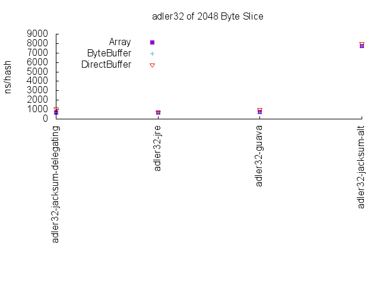

| Algorithm |  Array | ByteBuffer | DirectBuffer |
| --- | ---: | ---: | ---: | 
| [adler32-jacksum-delegating](#adler32-jacksum-delegating-latency) | 700.380319 | 696.439488 | 1045.296993 |
| [adler32-jre](#adler32-jre-latency) | 707.953173 | 704.966769 | 682.723571 |
| [adler32-guava](#adler32-guava-latency) | 726.813082 | 717.784714 | 1022.966067 |
| [adler32-jacksum-alt](#adler32-jacksum-alt-latency) | 7716.138095 | 7749.311217 | 8012.371271 |

---
### 2048 Byte Slice Latency (city64)
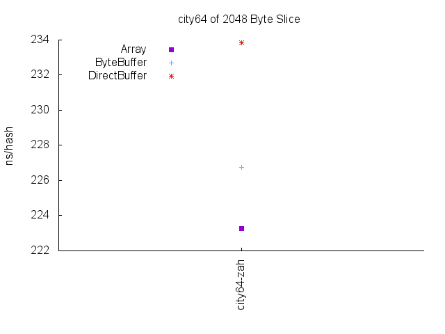

| Algorithm |  Array | ByteBuffer | DirectBuffer |
| --- | ---: | ---: | ---: | 
| [city64-zah](#city64-zah-latency) | 223.272456 | 226.746951 | 233.855028 |

---
### 2048 Byte Slice Latency (cksum)
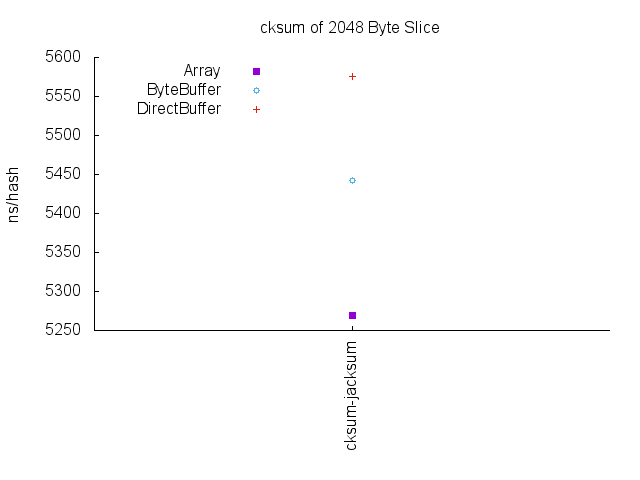

| Algorithm |  Array | ByteBuffer | DirectBuffer |
| --- | ---: | ---: | ---: | 
| [cksum-jacksum](#cksum-jacksum-latency) | 5269.632368 | 5442.357988 | 5576.221041 |

---
### 2048 Byte Slice Latency (crc16)
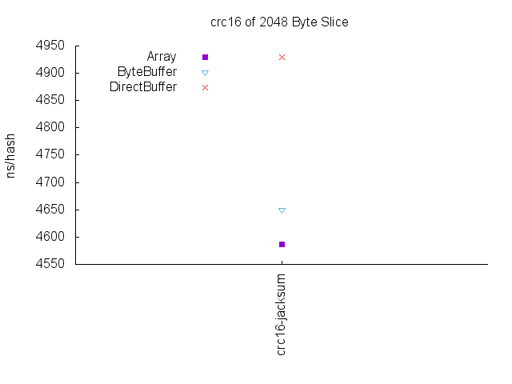

| Algorithm |  Array | ByteBuffer | DirectBuffer |
| --- | ---: | ---: | ---: | 
| [crc16-jacksum](#crc16-jacksum-latency) | 4587.348921 | 4649.675517 | 4929.788513 |

---
### 2048 Byte Slice Latency (crc24)
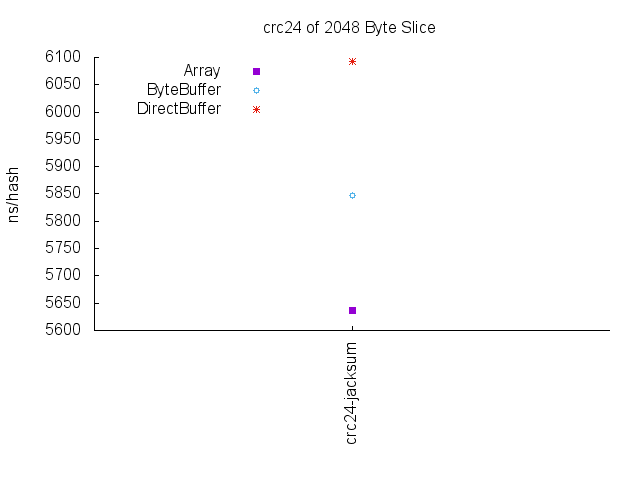

| Algorithm |  Array | ByteBuffer | DirectBuffer |
| --- | ---: | ---: | ---: | 
| [crc24-jacksum](#crc24-jacksum-latency) | 5636.477966 | 5846.817125 | 6092.799992 |

---
### 2048 Byte Slice Latency (crc32)
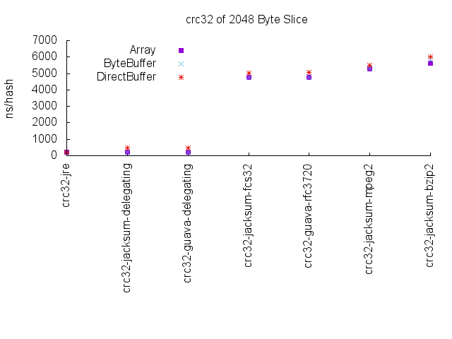

| Algorithm |  Array | ByteBuffer | DirectBuffer |
| --- | ---: | ---: | ---: | 
| [crc32-jre](#crc32-jre-latency) | 199.611858 | 202.122483 | 202.278871 |
| [crc32-jacksum-delegating](#crc32-jacksum-delegating-latency) | 201.087027 | 203.358158 | 459.056940 |
| [crc32-guava-delegating](#crc32-guava-delegating-latency) | 224.916320 | 227.189089 | 480.132917 |
| [crc32-jacksum-fcs32](#crc32-jacksum-fcs32-latency) | 4753.872878 | 4779.497430 | 5037.033532 |
| [crc32-guava-rfc3720](#crc32-guava-rfc3720-latency) | 4773.712325 | 4767.818767 | 5056.160761 |
| [crc32-jacksum-mpeg2](#crc32-jacksum-mpeg2-latency) | 5263.857815 | 5319.252668 | 5496.443114 |
| [crc32-jacksum-bzip2](#crc32-jacksum-bzip2-latency) | 5636.841291 | 5828.844770 | 6030.157935 |

---
### 2048 Byte Slice Latency (crc64)
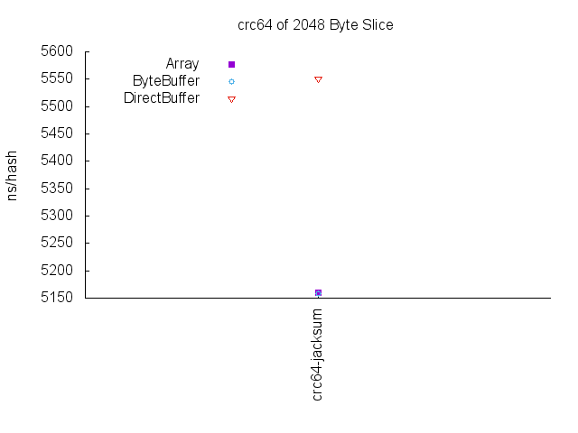

| Algorithm |  Array | ByteBuffer | DirectBuffer |
| --- | ---: | ---: | ---: | 
| [crc64-jacksum](#crc64-jacksum-latency) | 5159.611878 | 5158.789863 | 5550.394906 |

---
### 2048 Byte Slice Latency (crc8)

| Algorithm |  Array | ByteBuffer | DirectBuffer |
| --- | ---: | ---: | ---: | 
| [crc8-jacksum](#crc8-jacksum-latency) | 3924.627626 | 3836.252868 | 4345.358547 |

---
### 2048 Byte Slice Latency (ed2k)
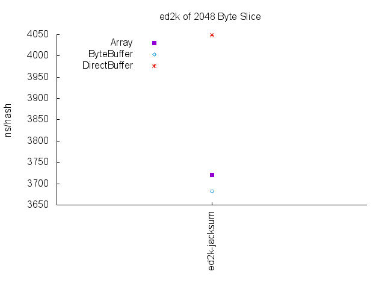

| Algorithm |  Array | ByteBuffer | DirectBuffer |
| --- | ---: | ---: | ---: | 
| [ed2k-jacksum](#ed2k-jacksum-latency) | 3720.477914 | 3682.482481 | 4048.805164 |

---
### 2048 Byte Slice Latency (elf)
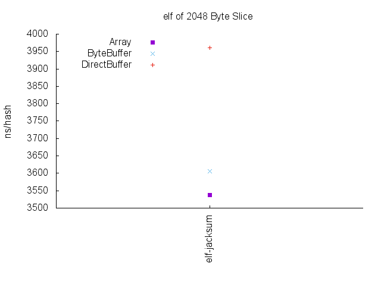

| Algorithm |  Array | ByteBuffer | DirectBuffer |
| --- | ---: | ---: | ---: | 
| [elf-jacksum](#elf-jacksum-latency) | 3538.129166 | 3605.170264 | 3960.959370 |

---
### 2048 Byte Slice Latency (farmna)
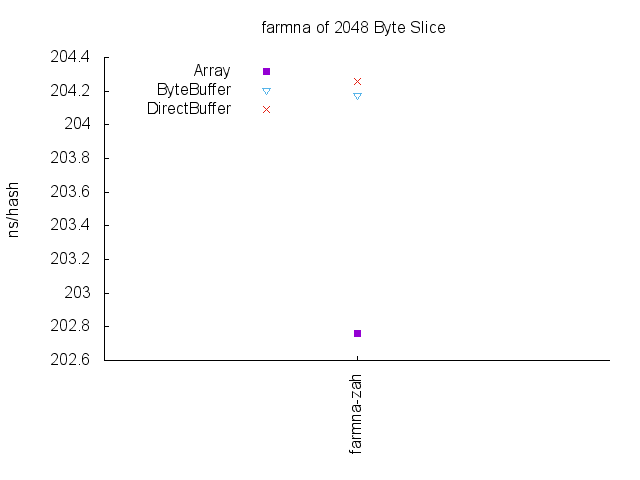

| Algorithm |  Array | ByteBuffer | DirectBuffer |
| --- | ---: | ---: | ---: | 
| [farmna-zah](#farmna-zah-latency) | 202.760730 | 204.175186 | 204.255908 |

---
### 2048 Byte Slice Latency (farmuo)
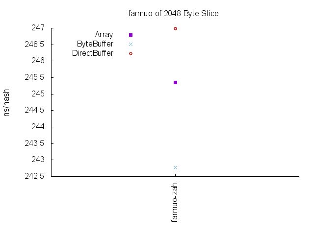

| Algorithm |  Array | ByteBuffer | DirectBuffer |
| --- | ---: | ---: | ---: | 
| [farmuo-zah](#farmuo-zah-latency) | 245.357364 | 242.768126 | 246.978142 |

---
### 2048 Byte Slice Latency (fcs16)
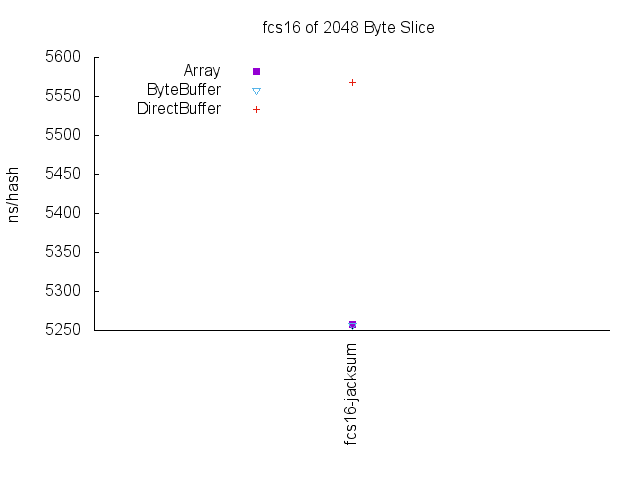

| Algorithm |  Array | ByteBuffer | DirectBuffer |
| --- | ---: | ---: | ---: | 
| [fcs16-jacksum](#fcs16-jacksum-latency) | 5258.248989 | 5255.851452 | 5567.811754 |

---
### 2048 Byte Slice Latency (gfh32)
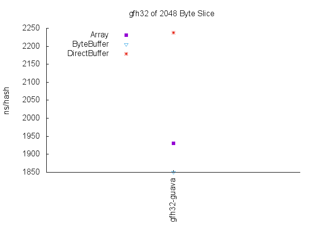

| Algorithm |  Array | ByteBuffer | DirectBuffer |
| --- | ---: | ---: | ---: | 
| [gfh32-guava](#gfh32-guava-latency) | 1930.308789 | 1850.452522 | 2238.051549 |

---
### 2048 Byte Slice Latency (gfh64)
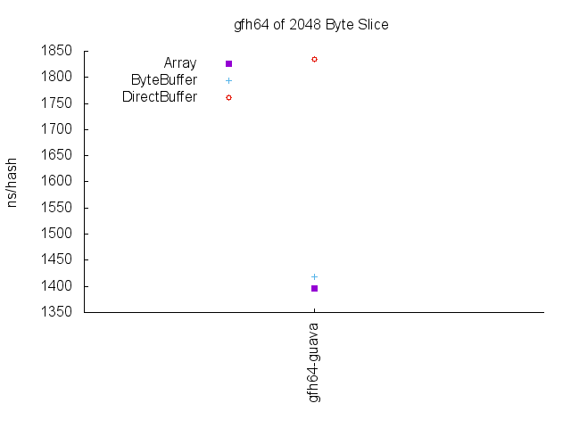

| Algorithm |  Array | ByteBuffer | DirectBuffer |
| --- | ---: | ---: | ---: | 
| [gfh64-guava](#gfh64-guava-latency) | 1395.879545 | 1417.881319 | 1835.120548 |

---
### 2048 Byte Slice Latency (has160)
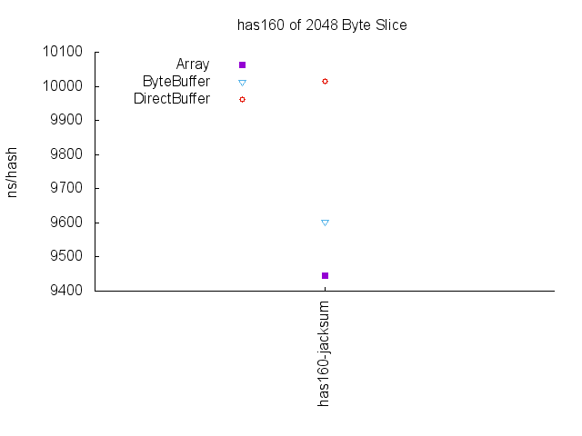

| Algorithm |  Array | ByteBuffer | DirectBuffer |
| --- | ---: | ---: | ---: | 
| [has160-jacksum](#has160-jacksum-latency) | 9444.752781 | 9601.056363 | 10014.769090 |

---
### 2048 Byte Slice Latency (haval128h3)
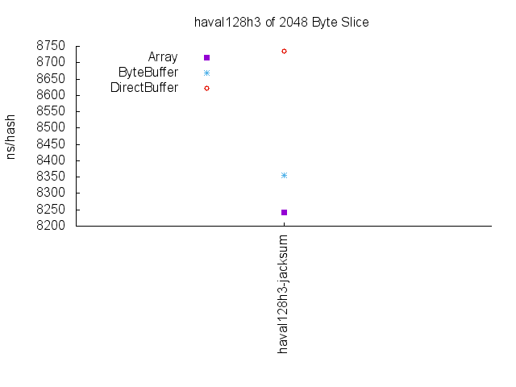

| Algorithm |  Array | ByteBuffer | DirectBuffer |
| --- | ---: | ---: | ---: | 
| [haval128h3-jacksum](#haval128h3-jacksum-latency) | 8241.788376 | 8354.870728 | 8734.172438 |

---
### 2048 Byte Slice Latency (haval128h4)
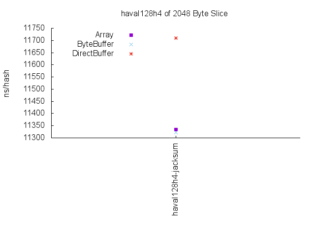

| Algorithm |  Array | ByteBuffer | DirectBuffer |
| --- | ---: | ---: | ---: | 
| [haval128h4-jacksum](#haval128h4-jacksum-latency) | 11334.940608 | 11322.833069 | 11709.748780 |

---
### 2048 Byte Slice Latency (haval128h5)
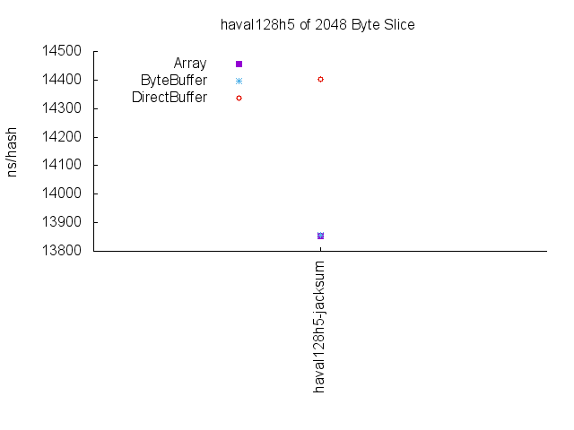

| Algorithm |  Array | ByteBuffer | DirectBuffer |
| --- | ---: | ---: | ---: | 
| [haval128h5-jacksum](#haval128h5-jacksum-latency) | 13854.763985 | 13856.335328 | 14401.672649 |

---
### 2048 Byte Slice Latency (haval160h3)
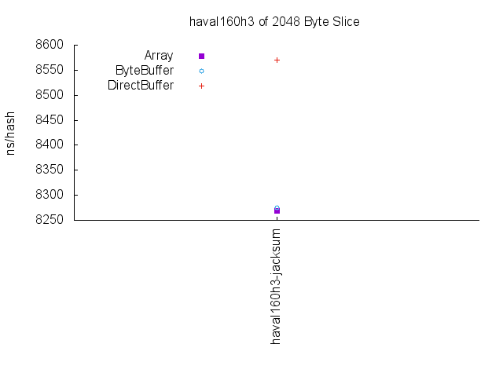

| Algorithm |  Array | ByteBuffer | DirectBuffer |
| --- | ---: | ---: | ---: | 
| [haval160h3-jacksum](#haval160h3-jacksum-latency) | 8268.277463 | 8275.120646 | 8570.513560 |

---
### 2048 Byte Slice Latency (haval160h4)
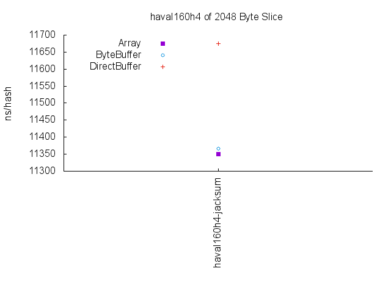

| Algorithm |  Array | ByteBuffer | DirectBuffer |
| --- | ---: | ---: | ---: | 
| [haval160h4-jacksum](#haval160h4-jacksum-latency) | 11349.838144 | 11366.456577 | 11674.118603 |

---
### 2048 Byte Slice Latency (haval160h5)
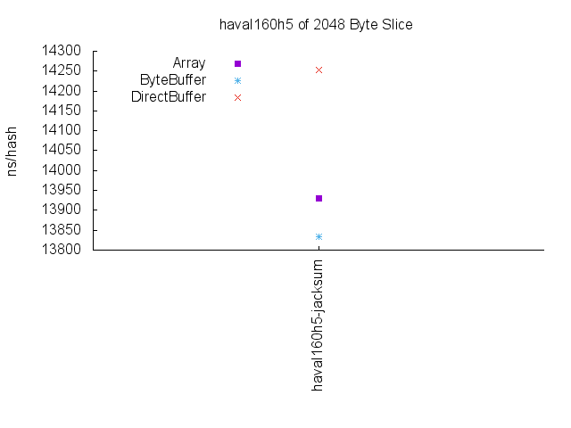

| Algorithm |  Array | ByteBuffer | DirectBuffer |
| --- | ---: | ---: | ---: | 
| [haval160h5-jacksum](#haval160h5-jacksum-latency) | 13929.686020 | 13833.931146 | 14253.439784 |

---
### 2048 Byte Slice Latency (haval192h3)
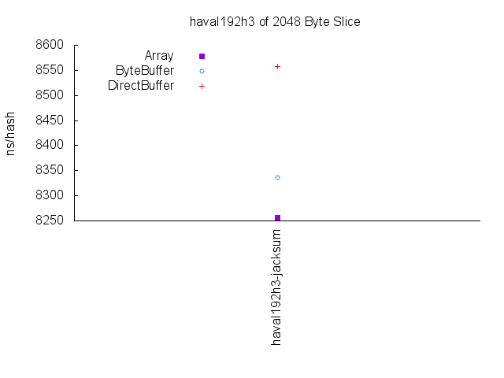

| Algorithm |  Array | ByteBuffer | DirectBuffer |
| --- | ---: | ---: | ---: | 
| [haval192h3-jacksum](#haval192h3-jacksum-latency) | 8256.014185 | 8336.840294 | 8557.206440 |

---
### 2048 Byte Slice Latency (haval192h4)

| Algorithm |  Array | ByteBuffer | DirectBuffer |
| --- | ---: | ---: | ---: | 
| [haval192h4-jacksum](#haval192h4-jacksum-latency) | 11518.488552 | 11373.511139 | 11614.382576 |

---
### 2048 Byte Slice Latency (haval192h5)
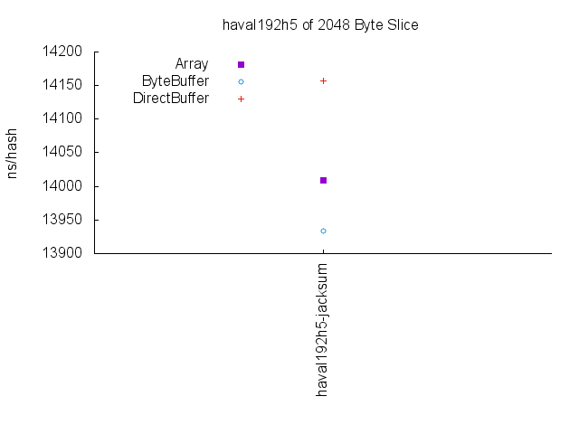

| Algorithm |  Array | ByteBuffer | DirectBuffer |
| --- | ---: | ---: | ---: | 
| [haval192h5-jacksum](#haval192h5-jacksum-latency) | 14008.597769 | 13933.629197 | 14157.373419 |

---
### 2048 Byte Slice Latency (haval224h3)
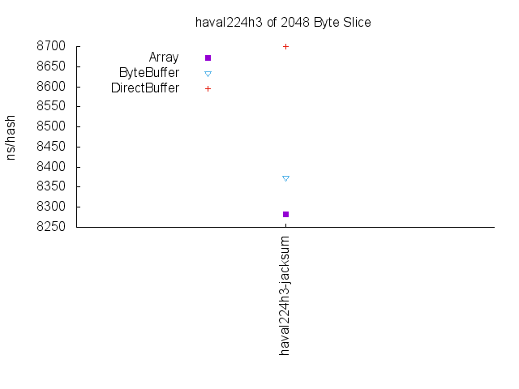

| Algorithm |  Array | ByteBuffer | DirectBuffer |
| --- | ---: | ---: | ---: | 
| [haval224h3-jacksum](#haval224h3-jacksum-latency) | 8282.698478 | 8372.328447 | 8699.062296 |

---
### 2048 Byte Slice Latency (haval224h4)
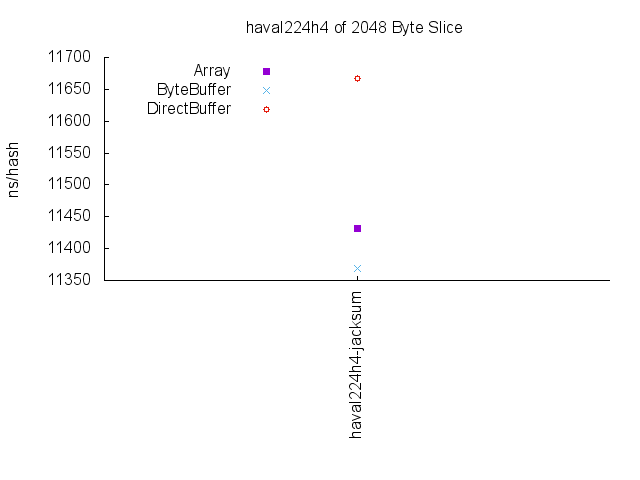

| Algorithm |  Array | ByteBuffer | DirectBuffer |
| --- | ---: | ---: | ---: | 
| [haval224h4-jacksum](#haval224h4-jacksum-latency) | 11431.967293 | 11368.789118 | 11667.191643 |

---
### 2048 Byte Slice Latency (haval224h5)
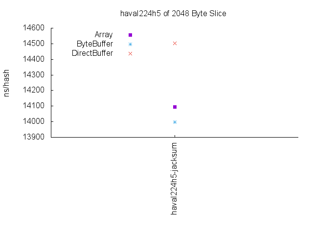

| Algorithm |  Array | ByteBuffer | DirectBuffer |
| --- | ---: | ---: | ---: | 
| [haval224h5-jacksum](#haval224h5-jacksum-latency) | 14094.390243 | 13998.630668 | 14501.611752 |

---
### 2048 Byte Slice Latency (haval256h3)
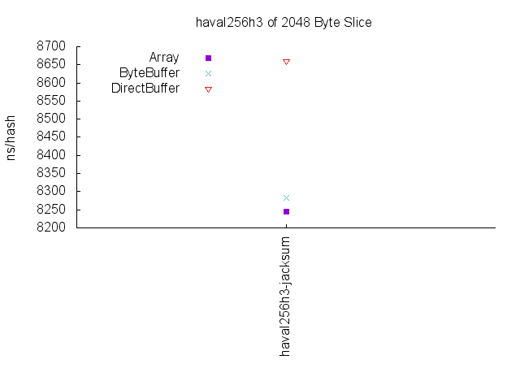

| Algorithm |  Array | ByteBuffer | DirectBuffer |
| --- | ---: | ---: | ---: | 
| [haval256h3-jacksum](#haval256h3-jacksum-latency) | 8245.936659 | 8282.397415 | 8658.591242 |

---
### 2048 Byte Slice Latency (haval256h4)
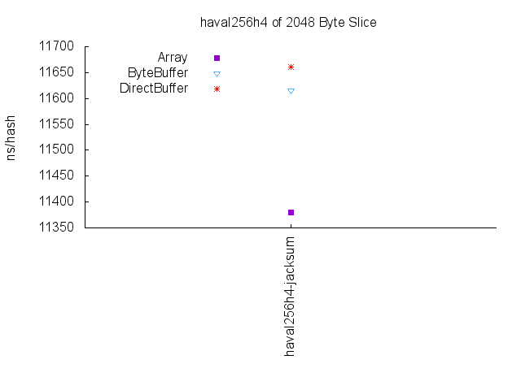

| Algorithm |  Array | ByteBuffer | DirectBuffer |
| --- | ---: | ---: | ---: | 
| [haval256h4-jacksum](#haval256h4-jacksum-latency) | 11379.720521 | 11615.039706 | 11660.389549 |

---
### 2048 Byte Slice Latency (haval256h5)

| Algorithm |  Array | ByteBuffer | DirectBuffer |
| --- | ---: | ---: | ---: | 
| [haval256h5-jacksum](#haval256h5-jacksum-latency) | 13857.022669 | 13963.888842 | 14316.431658 |

---
### 2048 Byte Slice Latency (md2)
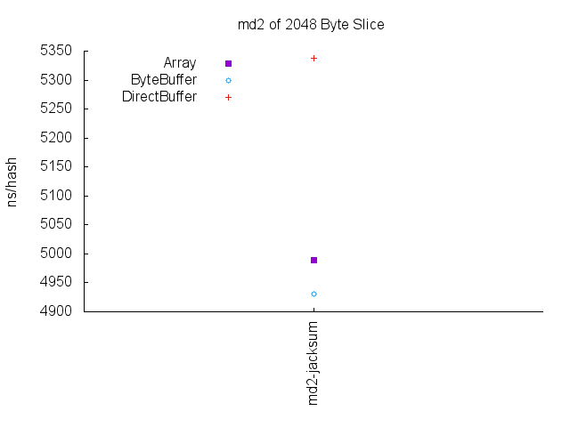

| Algorithm |  Array | ByteBuffer | DirectBuffer |
| --- | ---: | ---: | ---: | 
| [md2-jacksum](#md2-jacksum-latency) | 4988.376392 | 4929.978949 | 5338.254832 |

---
### 2048 Byte Slice Latency (md4)
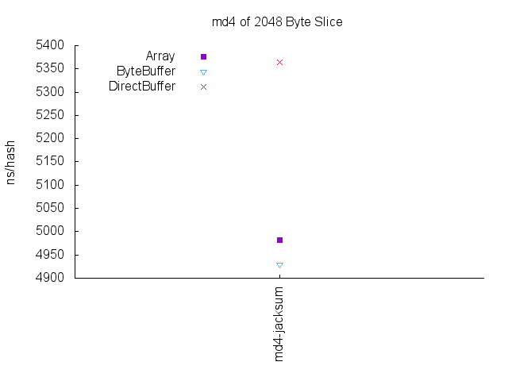

| Algorithm |  Array | ByteBuffer | DirectBuffer |
| --- | ---: | ---: | ---: | 
| [md4-jacksum](#md4-jacksum-latency) | 4981.881839 | 4929.750970 | 5363.687107 |

---
### 2048 Byte Slice Latency (md5)
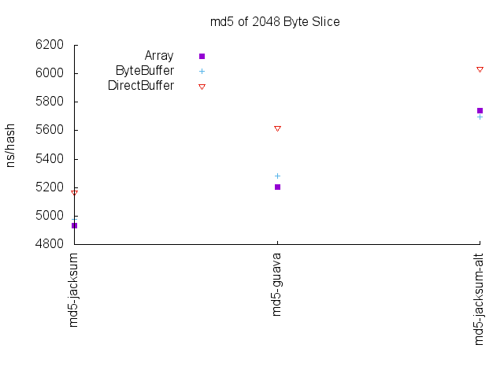

| Algorithm |  Array | ByteBuffer | DirectBuffer |
| --- | ---: | ---: | ---: | 
| [md5-jacksum](#md5-jacksum-latency) | 4930.305661 | 4977.945051 | 5163.436488 |
| [md5-guava](#md5-guava-latency) | 5202.681037 | 5283.988543 | 5617.684420 |
| [md5-jacksum-alt](#md5-jacksum-alt-latency) | 5738.976352 | 5694.102295 | 6032.349286 |

---
### 2048 Byte Slice Latency (murmur3h128)
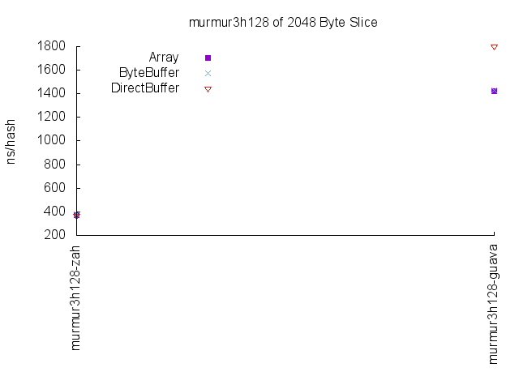

| Algorithm |  Array | ByteBuffer | DirectBuffer |
| --- | ---: | ---: | ---: | 
| [murmur3h128-zah](#murmur3h128-zah-latency) | 374.101462 | 375.229995 | 365.065583 |
| [murmur3h128-guava](#murmur3h128-guava-latency) | 1422.283140 | 1431.495876 | 1797.928132 |

---
### 2048 Byte Slice Latency (murmur3h32)
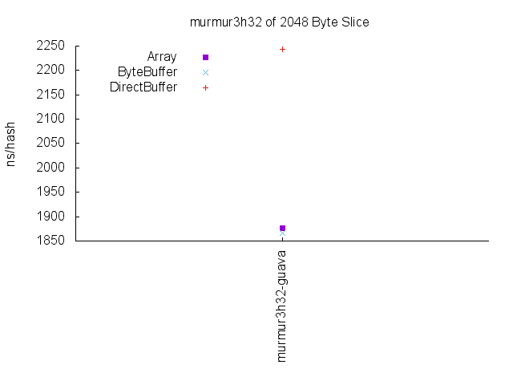

| Algorithm |  Array | ByteBuffer | DirectBuffer |
| --- | ---: | ---: | ---: | 
| [murmur3h32-guava](#murmur3h32-guava-latency) | 1875.568631 | 1867.079502 | 2243.137300 |

---
### 2048 Byte Slice Latency (ripemd128)
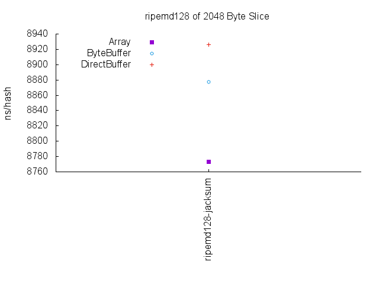

| Algorithm |  Array | ByteBuffer | DirectBuffer |
| --- | ---: | ---: | ---: | 
| [ripemd128-jacksum](#ripemd128-jacksum-latency) | 8772.953147 | 8877.399089 | 8925.814621 |

---
### 2048 Byte Slice Latency (ripemd160)
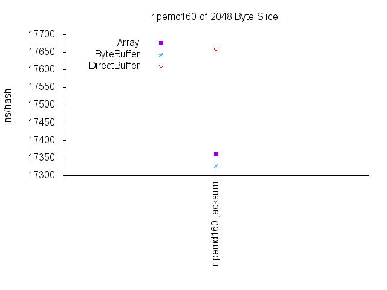

| Algorithm |  Array | ByteBuffer | DirectBuffer |
| --- | ---: | ---: | ---: | 
| [ripemd160-jacksum](#ripemd160-jacksum-latency) | 17360.343865 | 17328.322772 | 17659.144028 |

---
### 2048 Byte Slice Latency (ripemd256)
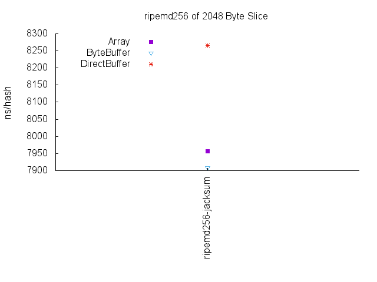

| Algorithm |  Array | ByteBuffer | DirectBuffer |
| --- | ---: | ---: | ---: | 
| [ripemd256-jacksum](#ripemd256-jacksum-latency) | 7956.628044 | 7909.357086 | 8265.070701 |

---
### 2048 Byte Slice Latency (ripemd320)
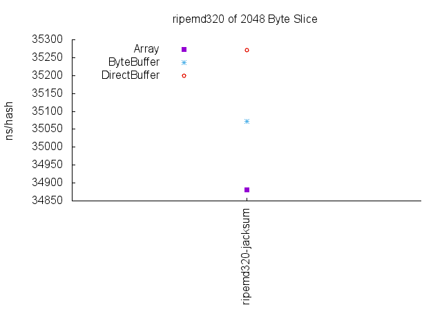

| Algorithm |  Array | ByteBuffer | DirectBuffer |
| --- | ---: | ---: | ---: | 
| [ripemd320-jacksum](#ripemd320-jacksum-latency) | 34880.056676 | 35072.737188 | 35271.622513 |

---
### 2048 Byte Slice Latency (sha0)
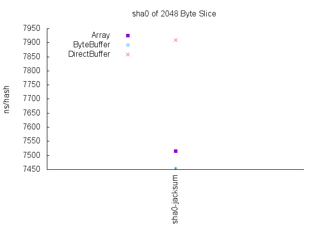

| Algorithm |  Array | ByteBuffer | DirectBuffer |
| --- | ---: | ---: | ---: | 
| [sha0-jacksum](#sha0-jacksum-latency) | 7516.125985 | 7453.658865 | 7910.121188 |

---
### 2048 Byte Slice Latency (sha1)
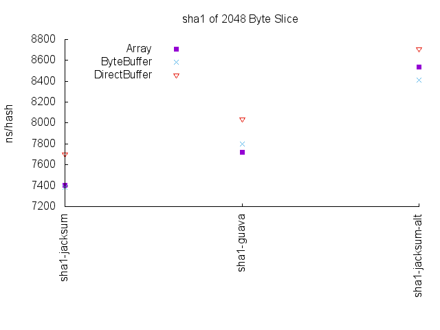

| Algorithm |  Array | ByteBuffer | DirectBuffer |
| --- | ---: | ---: | ---: | 
| [sha1-jacksum](#sha1-jacksum-latency) | 7405.331519 | 7386.746239 | 7698.722719 |
| [sha1-guava](#sha1-guava-latency) | 7722.271073 | 7801.861577 | 8035.171812 |
| [sha1-jacksum-alt](#sha1-jacksum-alt-latency) | 8539.834071 | 8413.327900 | 8706.976494 |

---
### 2048 Byte Slice Latency (sha224)
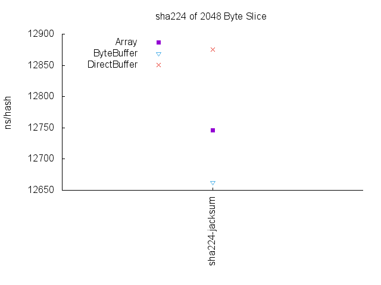

| Algorithm |  Array | ByteBuffer | DirectBuffer |
| --- | ---: | ---: | ---: | 
| [sha224-jacksum](#sha224-jacksum-latency) | 12745.546986 | 12662.321575 | 12874.939779 |

---
### 2048 Byte Slice Latency (sha256)
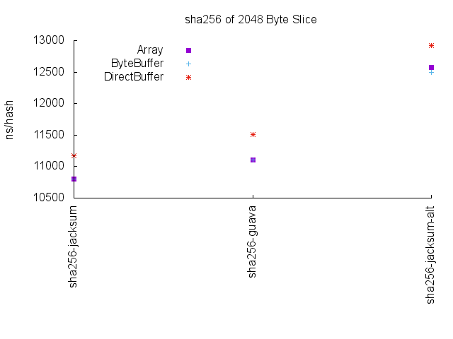

| Algorithm |  Array | ByteBuffer | DirectBuffer |
| --- | ---: | ---: | ---: | 
| [sha256-jacksum](#sha256-jacksum-latency) | 10801.791605 | 10804.863485 | 11168.150258 |
| [sha256-guava](#sha256-guava-latency) | 11102.882558 | 11110.485719 | 11509.438801 |
| [sha256-jacksum-alt](#sha256-jacksum-alt-latency) | 12571.276418 | 12493.159241 | 12918.487146 |

---
### 2048 Byte Slice Latency (sha384)
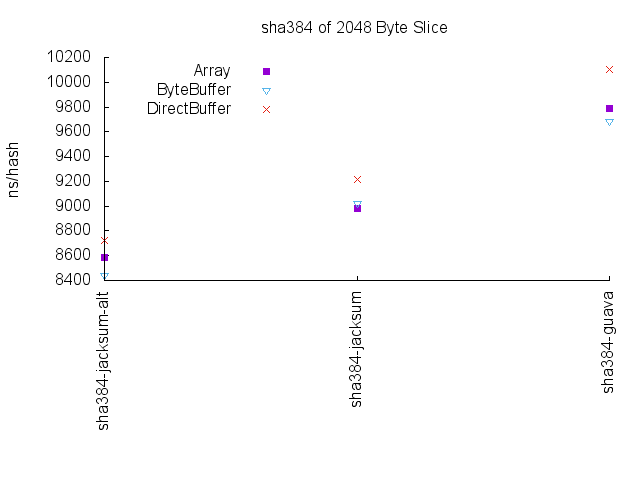

| Algorithm |  Array | ByteBuffer | DirectBuffer |
| --- | ---: | ---: | ---: | 
| [sha384-jacksum-alt](#sha384-jacksum-alt-latency) | 8583.020990 | 8438.790157 | 8722.357104 |
| [sha384-jacksum](#sha384-jacksum-latency) | 8978.742264 | 9023.971366 | 9214.109702 |
| [sha384-guava](#sha384-guava-latency) | 9787.369240 | 9686.994688 | 10100.663006 |

---
### 2048 Byte Slice Latency (sha512)
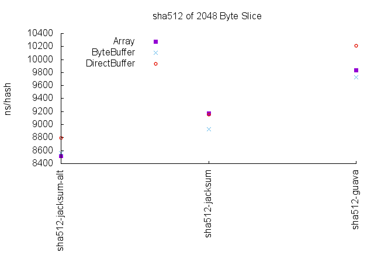

| Algorithm |  Array | ByteBuffer | DirectBuffer |
| --- | ---: | ---: | ---: | 
| [sha512-jacksum-alt](#sha512-jacksum-alt-latency) | 8519.396343 | 8558.711995 | 8791.435290 |
| [sha512-jacksum](#sha512-jacksum-latency) | 9168.453033 | 8928.394307 | 9154.511353 |
| [sha512-guava](#sha512-guava-latency) | 9835.359415 | 9725.426489 | 10215.041361 |

---
### 2048 Byte Slice Latency (sip)
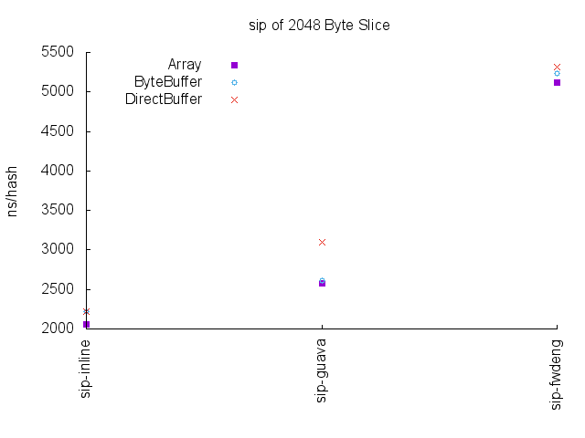

| Algorithm |  Array | ByteBuffer | DirectBuffer |
| --- | ---: | ---: | ---: | 
| [sip-inline](#sip-inline-latency) | 2055.175100 | 2221.556969 | 2221.292959 |
| [sip-guava](#sip-guava-latency) | 2582.745574 | 2610.984603 | 3103.029094 |
| [sip-fwdeng](#sip-fwdeng-latency) | 5124.392093 | 5230.504995 | 5313.868788 |

---
### 2048 Byte Slice Latency (sum16)
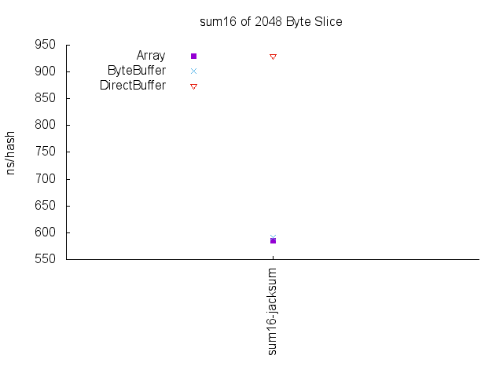

| Algorithm |  Array | ByteBuffer | DirectBuffer |
| --- | ---: | ---: | ---: | 
| [sum16-jacksum](#sum16-jacksum-latency) | 584.466210 | 591.471409 | 929.462249 |

---
### 2048 Byte Slice Latency (sum24)

| Algorithm |  Array | ByteBuffer | DirectBuffer |
| --- | ---: | ---: | ---: | 
| [sum24-jacksum](#sum24-jacksum-latency) | 588.414589 | 585.283888 | 926.304381 |

---
### 2048 Byte Slice Latency (sum32)

| Algorithm |  Array | ByteBuffer | DirectBuffer |
| --- | ---: | ---: | ---: | 
| [sum32-jacksum](#sum32-jacksum-latency) | 586.336923 | 589.896572 | 875.090910 |

---
### 2048 Byte Slice Latency (sum8)
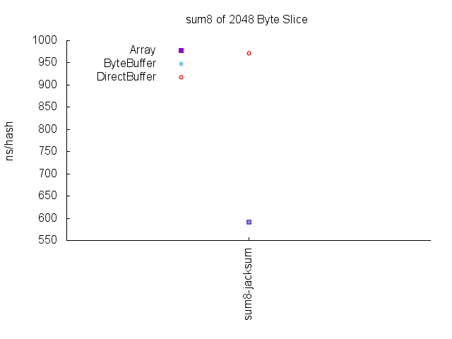

| Algorithm |  Array | ByteBuffer | DirectBuffer |
| --- | ---: | ---: | ---: | 
| [sum8-jacksum](#sum8-jacksum-latency) | 591.871602 | 591.909874 | 971.498405 |

---
### 2048 Byte Slice Latency (sumbsd)
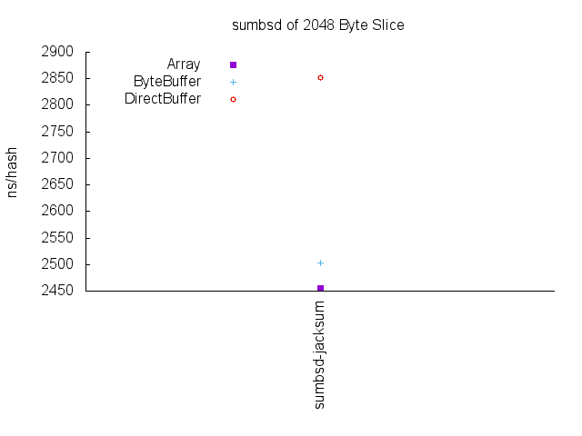

| Algorithm |  Array | ByteBuffer | DirectBuffer |
| --- | ---: | ---: | ---: | 
| [sumbsd-jacksum](#sumbsd-jacksum-latency) | 2454.847792 | 2502.880799 | 2852.432071 |

---
### 2048 Byte Slice Latency (sumsysv)
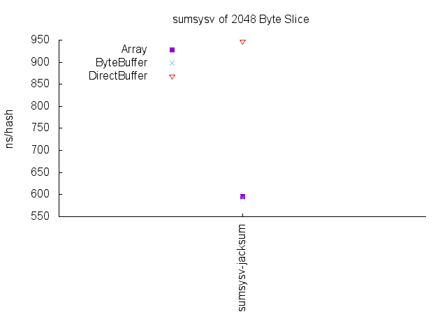

| Algorithm |  Array | ByteBuffer | DirectBuffer |
| --- | ---: | ---: | ---: | 
| [sumsysv-jacksum](#sumsysv-jacksum-latency) | 596.256429 | 592.596323 | 946.206741 |

---
### 2048 Byte Slice Latency (tiger)
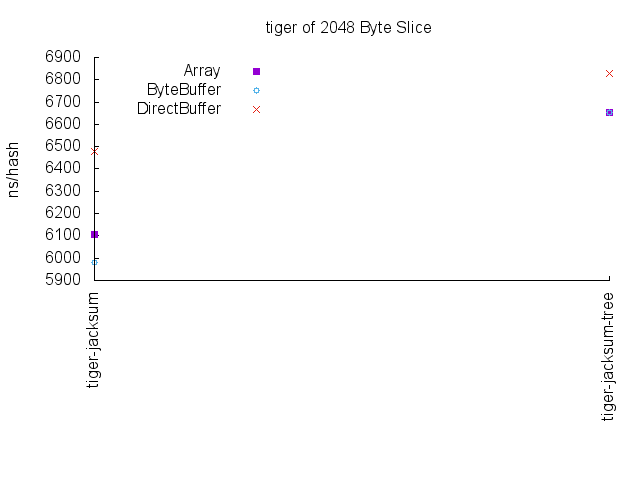

| Algorithm |  Array | ByteBuffer | DirectBuffer |
| --- | ---: | ---: | ---: | 
| [tiger-jacksum](#tiger-jacksum-latency) | 6108.313481 | 5981.958083 | 6477.933086 |
| [tiger-jacksum-tree](#tiger-jacksum-tree-latency) | 6654.187024 | 6652.057092 | 6828.581179 |

---
### 2048 Byte Slice Latency (tiger128)
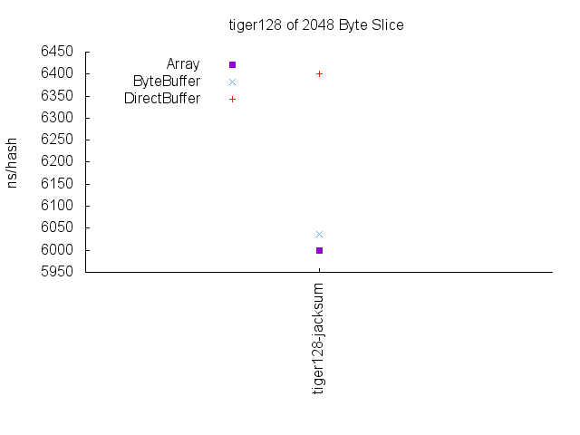

| Algorithm |  Array | ByteBuffer | DirectBuffer |
| --- | ---: | ---: | ---: | 
| [tiger128-jacksum](#tiger128-jacksum-latency) | 5998.689754 | 6037.413964 | 6401.256791 |

---
### 2048 Byte Slice Latency (tiger160)
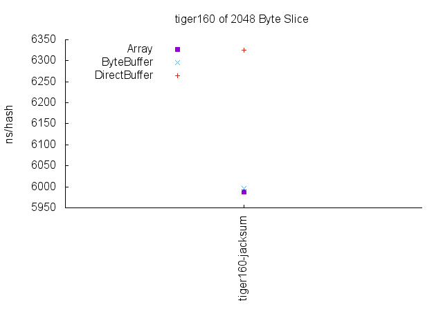

| Algorithm |  Array | ByteBuffer | DirectBuffer |
| --- | ---: | ---: | ---: | 
| [tiger160-jacksum](#tiger160-jacksum-latency) | 5988.040932 | 5995.510901 | 6326.061656 |

---
### 2048 Byte Slice Latency (tiger2)
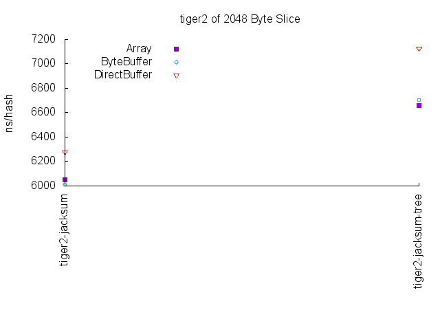

| Algorithm |  Array | ByteBuffer | DirectBuffer |
| --- | ---: | ---: | ---: | 
| [tiger2-jacksum](#tiger2-jacksum-latency) | 6048.334108 | 6011.815308 | 6275.562162 |
| [tiger2-jacksum-tree](#tiger2-jacksum-tree-latency) | 6661.266645 | 6706.039700 | 7127.936208 |

---
### 2048 Byte Slice Latency (whirlpool0)
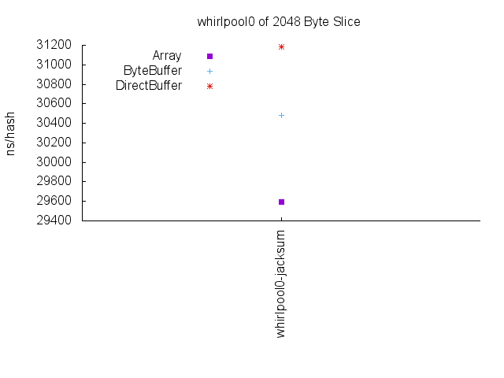

| Algorithm |  Array | ByteBuffer | DirectBuffer |
| --- | ---: | ---: | ---: | 
| [whirlpool0-jacksum](#whirlpool0-jacksum-latency) | 29595.315068 | 30480.888066 | 31182.102301 |

---
### 2048 Byte Slice Latency (whirlpool1)
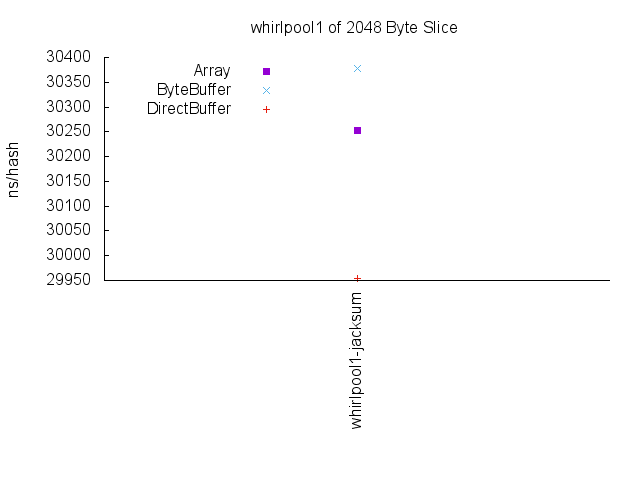

| Algorithm |  Array | ByteBuffer | DirectBuffer |
| --- | ---: | ---: | ---: | 
| [whirlpool1-jacksum](#whirlpool1-jacksum-latency) | 30251.839884 | 30377.361498 | 29953.156234 |

---
### 2048 Byte Slice Latency (whirlpool2)

| Algorithm |  Array | ByteBuffer | DirectBuffer |
| --- | ---: | ---: | ---: | 
| [whirlpool2-jacksum](#whirlpool2-jacksum-latency) | 29990.335505 | 30162.292494 | 31675.383364 |

---
### 2048 Byte Slice Latency (xor8)

| Algorithm |  Array | ByteBuffer | DirectBuffer |
| --- | ---: | ---: | ---: | 
| [xor8-jacksum](#xor8-jacksum-latency) | 588.187371 | 596.002841 | 859.436093 |

---
### 2048 Byte Slice Latency (xxh32)
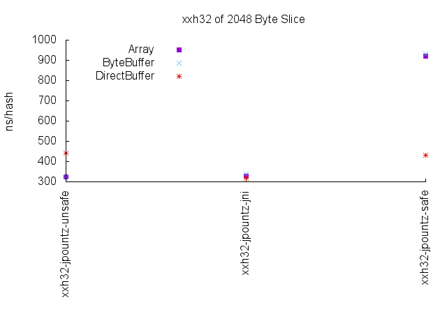

| Algorithm |  Array | ByteBuffer | DirectBuffer |
| --- | ---: | ---: | ---: | 
| [xxh32-jpountz-unsafe](#xxh32-jpountz-unsafe-latency) | 324.159446 | 323.621201 | 442.417079 |
| [xxh32-jpountz-jni](#xxh32-jpountz-jni-latency) | 328.306468 | 338.901800 | 318.139058 |
| [xxh32-jpountz-safe](#xxh32-jpountz-safe-latency) | 919.809915 | 930.895437 | 432.192072 |

---
### 2048 Byte Slice Latency (xxh64)
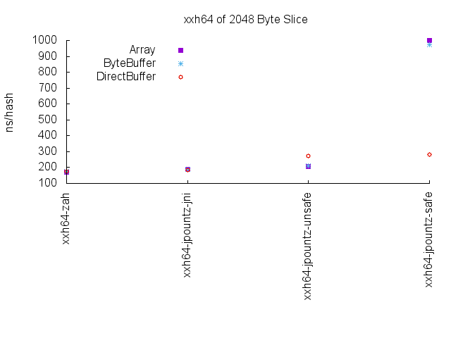

| Algorithm |  Array | ByteBuffer | DirectBuffer |
| --- | ---: | ---: | ---: | 
| [xxh64-zah](#xxh64-zah-latency) | 172.188990 | 176.949117 | 174.934754 |
| [xxh64-jpountz-jni](#xxh64-jpountz-jni-latency) | 187.453318 | 189.863714 | 183.313766 |
| [xxh64-jpountz-unsafe](#xxh64-jpountz-unsafe-latency) | 207.720946 | 209.103336 | 272.441819 |
| [xxh64-jpountz-safe](#xxh64-jpountz-safe-latency) | 999.375627 | 974.838535 | 280.889614 |

---
### 8192 Byte Slice Latency (All Hashes)
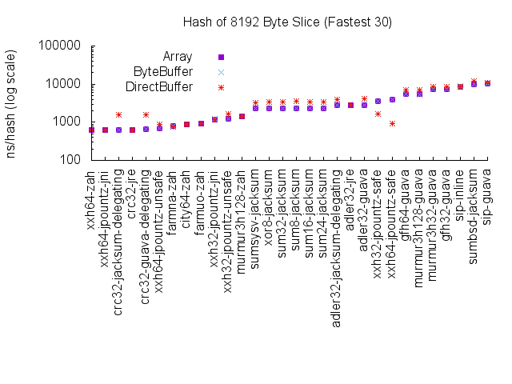

| Algorithm |  Array | ByteBuffer | DirectBuffer |
| --- | ---: | ---: | ---: | 
| [xxh64-zah](#xxh64-zah-latency) | 613.090857 | 619.815052 | 615.756005 |
| [xxh64-jpountz-jni](#xxh64-jpountz-jni-latency) | 620.883536 | 630.420165 | 620.569532 |
| [crc32-jacksum-delegating](#crc32-jacksum-delegating-latency) | 624.472196 | 632.754723 | 1546.299817 |
| [crc32-jre](#crc32-jre-latency) | 633.980136 | 639.139062 | 641.169560 |
| [crc32-guava-delegating](#crc32-guava-delegating-latency) | 663.562746 | 651.059033 | 1600.049372 |
| [xxh64-jpountz-unsafe](#xxh64-jpountz-unsafe-latency) | 696.065361 | 690.233439 | 897.614858 |
| [farmna-zah](#farmna-zah-latency) | 799.915101 | 805.541844 | 774.191487 |
| [city64-zah](#city64-zah-latency) | 860.743138 | 862.029907 | 873.589679 |
| [farmuo-zah](#farmuo-zah-latency) | 935.415841 | 933.456834 | 927.133514 |
| [xxh32-jpountz-jni](#xxh32-jpountz-jni-latency) | 1200.529533 | 1203.851012 | 1187.393829 |
| [xxh32-jpountz-unsafe](#xxh32-jpountz-unsafe-latency) | 1214.526090 | 1216.154115 | 1628.714059 |
| [murmur3h128-zah](#murmur3h128-zah-latency) | 1442.812570 | 1428.828545 | 1427.680640 |
| [sumsysv-jacksum](#sumsysv-jacksum-latency) | 2309.631712 | 2311.203018 | 3313.764963 |
| [xor8-jacksum](#xor8-jacksum-latency) | 2310.005723 | 2328.296939 | 3367.966559 |
| [sum32-jacksum](#sum32-jacksum-latency) | 2319.716434 | 2333.603089 | 3382.135026 |
| [sum8-jacksum](#sum8-jacksum-latency) | 2323.651151 | 2320.263812 | 3507.432643 |
| [sum16-jacksum](#sum16-jacksum-latency) | 2347.756727 | 2310.048754 | 3377.895925 |
| [sum24-jacksum](#sum24-jacksum-latency) | 2357.725446 | 2310.731995 | 3446.762442 |
| [adler32-jacksum-delegating](#adler32-jacksum-delegating-latency) | 2742.872924 | 2740.505806 | 3881.446208 |
| [adler32-jre](#adler32-jre-latency) | 2752.644039 | 2800.397394 | 2743.713579 |
| [adler32-guava](#adler32-guava-latency) | 2858.050251 | 2780.950968 | 4043.849210 |
| [xxh32-jpountz-safe](#xxh32-jpountz-safe-latency) | 3641.055372 | 3608.235804 | 1641.435385 |
| [xxh64-jpountz-safe](#xxh64-jpountz-safe-latency) | 3994.910016 | 3843.408505 | 908.517093 |
| [gfh64-guava](#gfh64-guava-latency) | 5534.637511 | 5509.432690 | 7067.145831 |
| [murmur3h128-guava](#murmur3h128-guava-latency) | 5639.406961 | 5283.907618 | 6927.046122 |
| [murmur3h32-guava](#murmur3h32-guava-latency) | 7274.526024 | 7323.497318 | 8424.090953 |
| [gfh32-guava](#gfh32-guava-latency) | 7286.581301 | 7305.806798 | 8524.081717 |
| [sip-inline](#sip-inline-latency) | 8490.835458 | 8814.339114 | 8692.764778 |
| [sumbsd-jacksum](#sumbsd-jacksum-latency) | 9812.723705 | 10008.705968 | 11761.089626 |
| [sip-guava](#sip-guava-latency) | 10242.604305 | 10174.701625 | 11070.235748 |
| [elf-jacksum](#elf-jacksum-latency) | 14194.114749 | 14667.343652 | 15482.931480 |
| [ed2k-jacksum](#ed2k-jacksum-latency) | 14725.549231 | 14633.044589 | 15911.239736 |
| [crc8-jacksum](#crc8-jacksum-latency) | 15724.356636 | 15224.370265 | 17110.393118 |
| [crc16-jacksum](#crc16-jacksum-latency) | 18481.531587 | 18378.508370 | 19151.882989 |
| [crc32-jacksum-fcs32](#crc32-jacksum-fcs32-latency) | 18989.552091 | 19066.245352 | 20175.756429 |
| [crc32-guava-rfc3720](#crc32-guava-rfc3720-latency) | 19219.979770 | 19111.041084 | 20136.536123 |
| [md5-jacksum](#md5-jacksum-latency) | 19831.512685 | 19669.132223 | 20588.636246 |
| [md4-jacksum](#md4-jacksum-latency) | 19853.391643 | 19761.810757 | 20702.126694 |
| [md2-jacksum](#md2-jacksum-latency) | 20144.107632 | 19852.436972 | 20724.479493 |
| [md5-guava](#md5-guava-latency) | 20422.798130 | 20003.445716 | 21434.321334 |
| [crc64-jacksum](#crc64-jacksum-latency) | 20643.924263 | 20642.686534 | 21842.031275 |
| [sip-fwdeng](#sip-fwdeng-latency) | 20649.118797 | 20619.494737 | 20820.881754 |
| [crc32-jacksum-mpeg2](#crc32-jacksum-mpeg2-latency) | 21066.083107 | 21055.773040 | 21731.500605 |
| [fcs16-jacksum](#fcs16-jacksum-latency) | 21087.174919 | 21275.244771 | 21857.076200 |
| [cksum-jacksum](#cksum-jacksum-latency) | 21201.118872 | 21170.262549 | 21883.545244 |
| [crc24-jacksum](#crc24-jacksum-latency) | 22543.863910 | 23360.854925 | 24072.849346 |
| [crc32-jacksum-bzip2](#crc32-jacksum-bzip2-latency) | 22554.973602 | 23427.126601 | 24685.059025 |
| [md5-jacksum-alt](#md5-jacksum-alt-latency) | 22644.968055 | 22905.390571 | 23648.153936 |
| [tiger2-jacksum](#tiger2-jacksum-latency) | 23888.937503 | 24115.622900 | 25234.403880 |
| [tiger160-jacksum](#tiger160-jacksum-latency) | 24001.498922 | 23855.950425 | 24796.740969 |
| [tiger128-jacksum](#tiger128-jacksum-latency) | 24017.520948 | 23868.610820 | 24790.834254 |
| [tiger-jacksum](#tiger-jacksum-latency) | 24389.786966 | 23871.726814 | 25285.811004 |
| [tiger2-jacksum-tree](#tiger2-jacksum-tree-latency) | 26594.166070 | 26611.162949 | 27702.550074 |
| [tiger-jacksum-tree](#tiger-jacksum-tree-latency) | 26761.136439 | 26486.135002 | 27652.989036 |
| [sha0-jacksum](#sha0-jacksum-latency) | 29509.896953 | 29643.009580 | 30463.271677 |
| [sha1-jacksum](#sha1-jacksum-latency) | 29843.580533 | 29569.243407 | 30665.129563 |
| [sha1-guava](#sha1-guava-latency) | 30036.299650 | 30638.315045 | 30814.441405 |
| [adler32-jacksum-alt](#adler32-jacksum-alt-latency) | 30840.879900 | 30967.507381 | 31618.317059 |
| [ripemd256-jacksum](#ripemd256-jacksum-latency) | 31583.841096 | 31789.748184 | 32792.797409 |
| [haval160h3-jacksum](#haval160h3-jacksum-latency) | 32818.301856 | 32871.800025 | 34164.756182 |
| [haval128h3-jacksum](#haval128h3-jacksum-latency) | 33047.621485 | 32872.661245 | 33863.489767 |
| [haval192h3-jacksum](#haval192h3-jacksum-latency) | 33239.292691 | 33358.118790 | 33828.647281 |
| [haval224h3-jacksum](#haval224h3-jacksum-latency) | 33353.851977 | 33552.322835 | 33503.756871 |
| [haval256h3-jacksum](#haval256h3-jacksum-latency) | 33543.579594 | 32862.627478 | 33939.263688 |
| [sha1-jacksum-alt](#sha1-jacksum-alt-latency) | 33903.405734 | 33754.566118 | 34493.889468 |
| [sha512-jacksum-alt](#sha512-jacksum-alt-latency) | 34173.578319 | 34020.417177 | 34834.395731 |
| [ripemd128-jacksum](#ripemd128-jacksum-latency) | 34763.936242 | 34927.760354 | 35330.105290 |
| [sha384-jacksum-alt](#sha384-jacksum-alt-latency) | 34880.082617 | 33960.853655 | 34715.701562 |
| [sha384-jacksum](#sha384-jacksum-latency) | 35666.394285 | 35636.205293 | 36948.545862 |
| [sha512-jacksum](#sha512-jacksum-latency) | 35827.675069 | 36032.120265 | 36532.207407 |
| [sha384-guava](#sha384-guava-latency) | 36441.136778 | 36812.206030 | 37744.524012 |
| [sha512-guava](#sha512-guava-latency) | 36457.347408 | 36586.981896 | 37639.250011 |
| [has160-jacksum](#has160-jacksum-latency) | 37756.834351 | 38161.194826 | 39170.328722 |
| [sha256-jacksum](#sha256-jacksum-latency) | 42879.137589 | 43115.130555 | 44099.319822 |
| [sha256-guava](#sha256-guava-latency) | 43140.237642 | 43827.247087 | 44355.237100 |
| [haval192h4-jacksum](#haval192h4-jacksum-latency) | 45235.745394 | 45957.301437 | 46083.722159 |
| [haval160h4-jacksum](#haval160h4-jacksum-latency) | 45300.630282 | 46348.507716 | 46764.328046 |
| [haval128h4-jacksum](#haval128h4-jacksum-latency) | 45423.547643 | 45179.276306 | 46759.574762 |
| [haval224h4-jacksum](#haval224h4-jacksum-latency) | 45546.875978 | 45403.658317 | 46110.288117 |
| [haval256h4-jacksum](#haval256h4-jacksum-latency) | 45626.269944 | 45658.347041 | 46292.679502 |
| [sha224-jacksum](#sha224-jacksum-latency) | 50847.253370 | 50203.673272 | 51891.125100 |
| [sha256-jacksum-alt](#sha256-jacksum-alt-latency) | 51167.159491 | 51129.417057 | 50525.535463 |
| [haval128h5-jacksum](#haval128h5-jacksum-latency) | 55231.719035 | 55329.205046 | 57926.718816 |
| [haval160h5-jacksum](#haval160h5-jacksum-latency) | 56155.896238 | 56183.141194 | 56577.527247 |
| [haval224h5-jacksum](#haval224h5-jacksum-latency) | 56245.874243 | 55646.909635 | 56181.142457 |
| [haval256h5-jacksum](#haval256h5-jacksum-latency) | 56246.091827 | 55279.557185 | 56318.403962 |
| [haval192h5-jacksum](#haval192h5-jacksum-latency) | 58579.807949 | 55392.858022 | 56806.291861 |
| [ripemd160-jacksum](#ripemd160-jacksum-latency) | 69726.896086 | 69519.563545 | 70373.395386 |
| [whirlpool0-jacksum](#whirlpool0-jacksum-latency) | 117632.897384 | 117833.521803 | 123286.460834 |
| [whirlpool2-jacksum](#whirlpool2-jacksum-latency) | 118514.359228 | 120334.967298 | 120973.592741 |
| [whirlpool1-jacksum](#whirlpool1-jacksum-latency) | 119113.653255 | 122372.303048 | 125218.216235 |
| [ripemd320-jacksum](#ripemd320-jacksum-latency) | 140209.947627 | 138411.588339 | 139750.294354 |

---
### 8192 Byte Slice Latency (adler32)
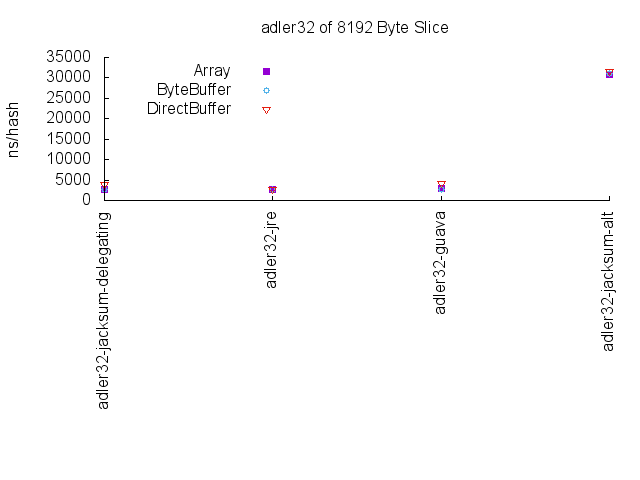

| Algorithm |  Array | ByteBuffer | DirectBuffer |
| --- | ---: | ---: | ---: | 
| [adler32-jacksum-delegating](#adler32-jacksum-delegating-latency) | 2742.872924 | 2740.505806 | 3881.446208 |
| [adler32-jre](#adler32-jre-latency) | 2752.644039 | 2800.397394 | 2743.713579 |
| [adler32-guava](#adler32-guava-latency) | 2858.050251 | 2780.950968 | 4043.849210 |
| [adler32-jacksum-alt](#adler32-jacksum-alt-latency) | 30840.879900 | 30967.507381 | 31618.317059 |

---
### 8192 Byte Slice Latency (city64)
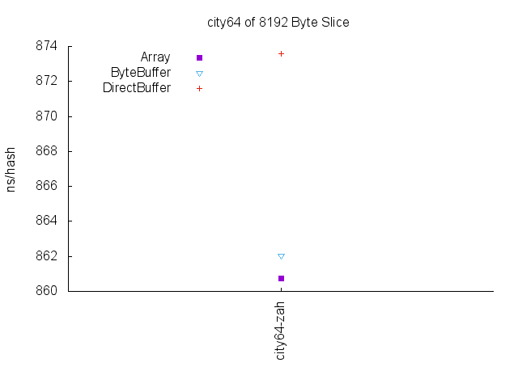

| Algorithm |  Array | ByteBuffer | DirectBuffer |
| --- | ---: | ---: | ---: | 
| [city64-zah](#city64-zah-latency) | 860.743138 | 862.029907 | 873.589679 |

---
### 8192 Byte Slice Latency (cksum)
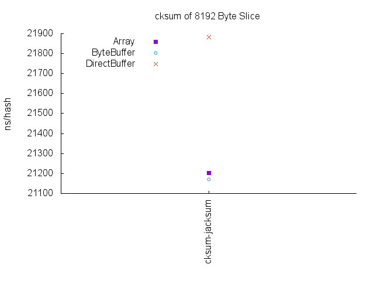

| Algorithm |  Array | ByteBuffer | DirectBuffer |
| --- | ---: | ---: | ---: | 
| [cksum-jacksum](#cksum-jacksum-latency) | 21201.118872 | 21170.262549 | 21883.545244 |

---
### 8192 Byte Slice Latency (crc16)
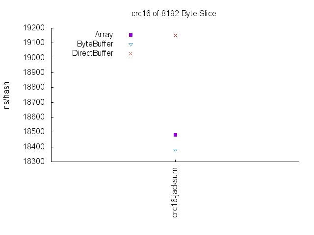

| Algorithm |  Array | ByteBuffer | DirectBuffer |
| --- | ---: | ---: | ---: | 
| [crc16-jacksum](#crc16-jacksum-latency) | 18481.531587 | 18378.508370 | 19151.882989 |

---
### 8192 Byte Slice Latency (crc24)
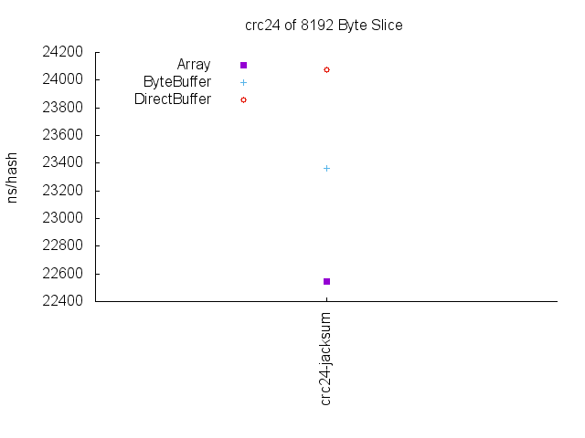

| Algorithm |  Array | ByteBuffer | DirectBuffer |
| --- | ---: | ---: | ---: | 
| [crc24-jacksum](#crc24-jacksum-latency) | 22543.863910 | 23360.854925 | 24072.849346 |

---
### 8192 Byte Slice Latency (crc32)
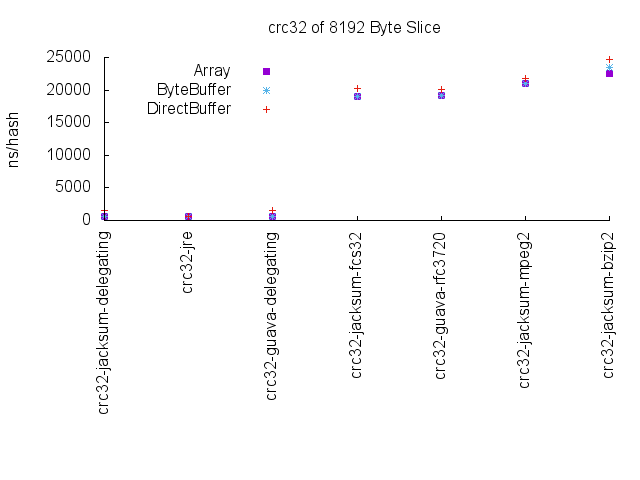

| Algorithm |  Array | ByteBuffer | DirectBuffer |
| --- | ---: | ---: | ---: | 
| [crc32-jacksum-delegating](#crc32-jacksum-delegating-latency) | 624.472196 | 632.754723 | 1546.299817 |
| [crc32-jre](#crc32-jre-latency) | 633.980136 | 639.139062 | 641.169560 |
| [crc32-guava-delegating](#crc32-guava-delegating-latency) | 663.562746 | 651.059033 | 1600.049372 |
| [crc32-jacksum-fcs32](#crc32-jacksum-fcs32-latency) | 18989.552091 | 19066.245352 | 20175.756429 |
| [crc32-guava-rfc3720](#crc32-guava-rfc3720-latency) | 19219.979770 | 19111.041084 | 20136.536123 |
| [crc32-jacksum-mpeg2](#crc32-jacksum-mpeg2-latency) | 21066.083107 | 21055.773040 | 21731.500605 |
| [crc32-jacksum-bzip2](#crc32-jacksum-bzip2-latency) | 22554.973602 | 23427.126601 | 24685.059025 |

---
### 8192 Byte Slice Latency (crc64)
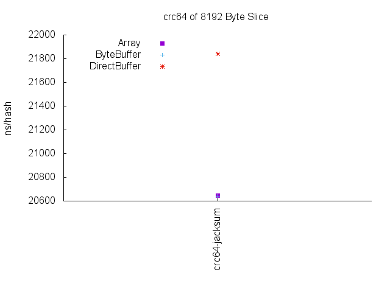

| Algorithm |  Array | ByteBuffer | DirectBuffer |
| --- | ---: | ---: | ---: | 
| [crc64-jacksum](#crc64-jacksum-latency) | 20643.924263 | 20642.686534 | 21842.031275 |

---
### 8192 Byte Slice Latency (crc8)
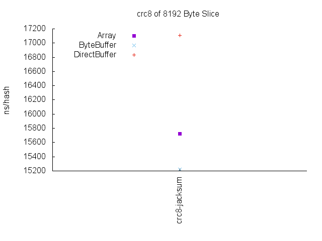

| Algorithm |  Array | ByteBuffer | DirectBuffer |
| --- | ---: | ---: | ---: | 
| [crc8-jacksum](#crc8-jacksum-latency) | 15724.356636 | 15224.370265 | 17110.393118 |

---
### 8192 Byte Slice Latency (ed2k)
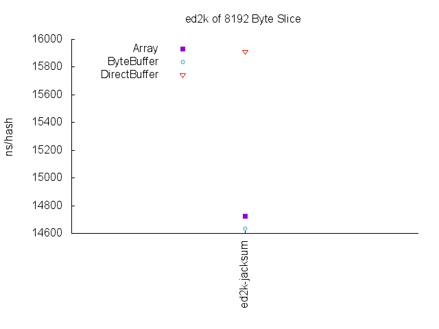

| Algorithm |  Array | ByteBuffer | DirectBuffer |
| --- | ---: | ---: | ---: | 
| [ed2k-jacksum](#ed2k-jacksum-latency) | 14725.549231 | 14633.044589 | 15911.239736 |

---
### 8192 Byte Slice Latency (elf)
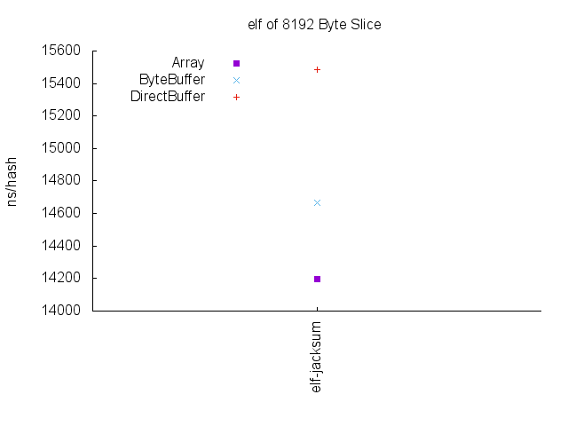

| Algorithm |  Array | ByteBuffer | DirectBuffer |
| --- | ---: | ---: | ---: | 
| [elf-jacksum](#elf-jacksum-latency) | 14194.114749 | 14667.343652 | 15482.931480 |

---
### 8192 Byte Slice Latency (farmna)
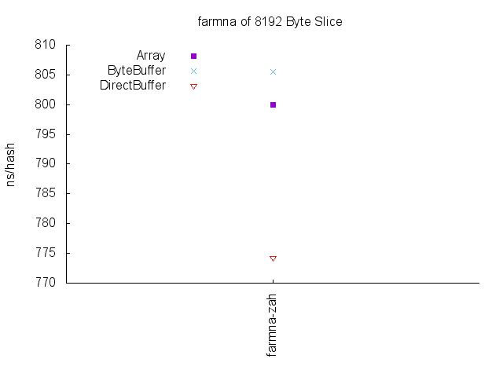

| Algorithm |  Array | ByteBuffer | DirectBuffer |
| --- | ---: | ---: | ---: | 
| [farmna-zah](#farmna-zah-latency) | 799.915101 | 805.541844 | 774.191487 |

---
### 8192 Byte Slice Latency (farmuo)
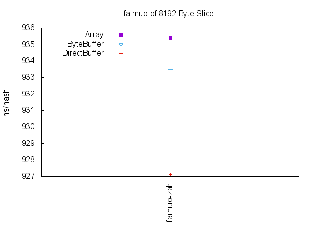

| Algorithm |  Array | ByteBuffer | DirectBuffer |
| --- | ---: | ---: | ---: | 
| [farmuo-zah](#farmuo-zah-latency) | 935.415841 | 933.456834 | 927.133514 |

---
### 8192 Byte Slice Latency (fcs16)

| Algorithm |  Array | ByteBuffer | DirectBuffer |
| --- | ---: | ---: | ---: | 
| [fcs16-jacksum](#fcs16-jacksum-latency) | 21087.174919 | 21275.244771 | 21857.076200 |

---
### 8192 Byte Slice Latency (gfh32)

| Algorithm |  Array | ByteBuffer | DirectBuffer |
| --- | ---: | ---: | ---: | 
| [gfh32-guava](#gfh32-guava-latency) | 7286.581301 | 7305.806798 | 8524.081717 |

---
### 8192 Byte Slice Latency (gfh64)
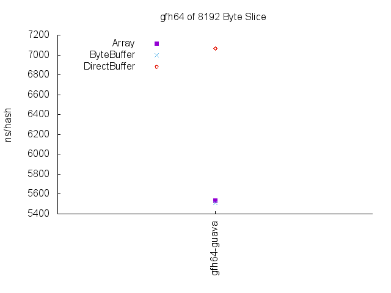

| Algorithm |  Array | ByteBuffer | DirectBuffer |
| --- | ---: | ---: | ---: | 
| [gfh64-guava](#gfh64-guava-latency) | 5534.637511 | 5509.432690 | 7067.145831 |

---
### 8192 Byte Slice Latency (has160)
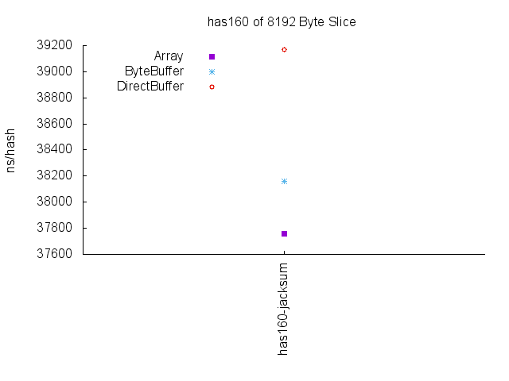

| Algorithm |  Array | ByteBuffer | DirectBuffer |
| --- | ---: | ---: | ---: | 
| [has160-jacksum](#has160-jacksum-latency) | 37756.834351 | 38161.194826 | 39170.328722 |

---
### 8192 Byte Slice Latency (haval128h3)
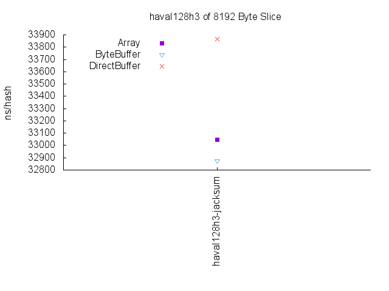

| Algorithm |  Array | ByteBuffer | DirectBuffer |
| --- | ---: | ---: | ---: | 
| [haval128h3-jacksum](#haval128h3-jacksum-latency) | 33047.621485 | 32872.661245 | 33863.489767 |

---
### 8192 Byte Slice Latency (haval128h4)
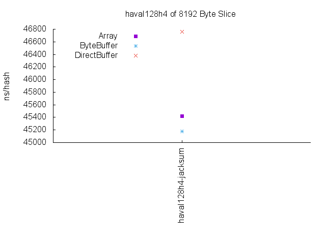

| Algorithm |  Array | ByteBuffer | DirectBuffer |
| --- | ---: | ---: | ---: | 
| [haval128h4-jacksum](#haval128h4-jacksum-latency) | 45423.547643 | 45179.276306 | 46759.574762 |

---
### 8192 Byte Slice Latency (haval128h5)
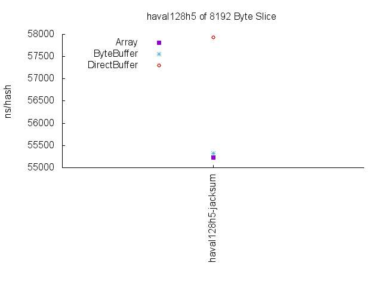

| Algorithm |  Array | ByteBuffer | DirectBuffer |
| --- | ---: | ---: | ---: | 
| [haval128h5-jacksum](#haval128h5-jacksum-latency) | 55231.719035 | 55329.205046 | 57926.718816 |

---
### 8192 Byte Slice Latency (haval160h3)

| Algorithm |  Array | ByteBuffer | DirectBuffer |
| --- | ---: | ---: | ---: | 
| [haval160h3-jacksum](#haval160h3-jacksum-latency) | 32818.301856 | 32871.800025 | 34164.756182 |

---
### 8192 Byte Slice Latency (haval160h4)
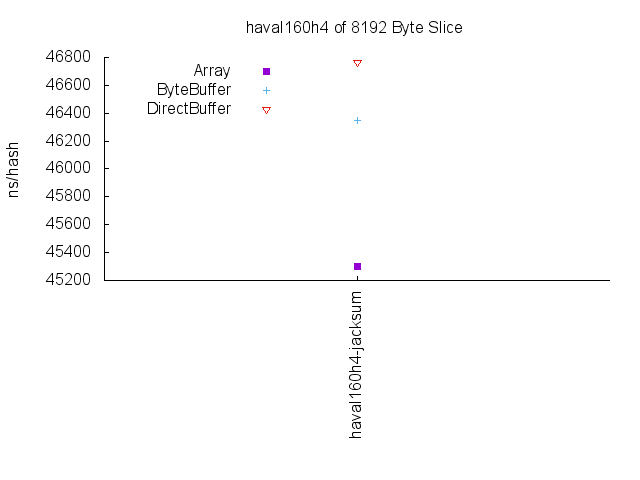

| Algorithm |  Array | ByteBuffer | DirectBuffer |
| --- | ---: | ---: | ---: | 
| [haval160h4-jacksum](#haval160h4-jacksum-latency) | 45300.630282 | 46348.507716 | 46764.328046 |

---
### 8192 Byte Slice Latency (haval160h5)
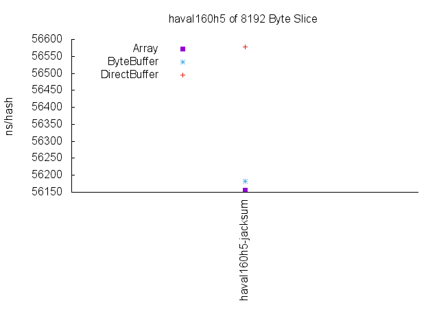

| Algorithm |  Array | ByteBuffer | DirectBuffer |
| --- | ---: | ---: | ---: | 
| [haval160h5-jacksum](#haval160h5-jacksum-latency) | 56155.896238 | 56183.141194 | 56577.527247 |

---
### 8192 Byte Slice Latency (haval192h3)
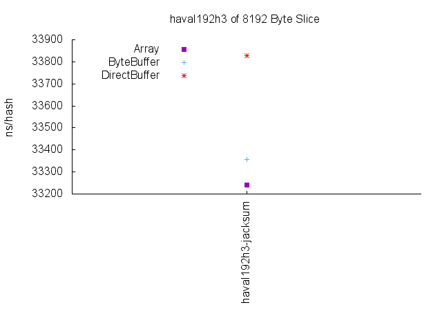

| Algorithm |  Array | ByteBuffer | DirectBuffer |
| --- | ---: | ---: | ---: | 
| [haval192h3-jacksum](#haval192h3-jacksum-latency) | 33239.292691 | 33358.118790 | 33828.647281 |

---
### 8192 Byte Slice Latency (haval192h4)

| Algorithm |  Array | ByteBuffer | DirectBuffer |
| --- | ---: | ---: | ---: | 
| [haval192h4-jacksum](#haval192h4-jacksum-latency) | 45235.745394 | 45957.301437 | 46083.722159 |

---
### 8192 Byte Slice Latency (haval192h5)
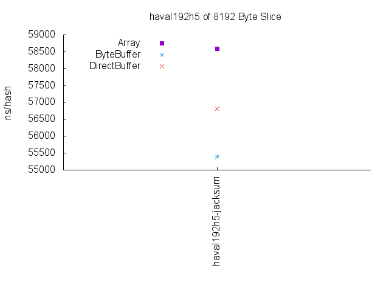

| Algorithm |  Array | ByteBuffer | DirectBuffer |
| --- | ---: | ---: | ---: | 
| [haval192h5-jacksum](#haval192h5-jacksum-latency) | 58579.807949 | 55392.858022 | 56806.291861 |

---
### 8192 Byte Slice Latency (haval224h3)
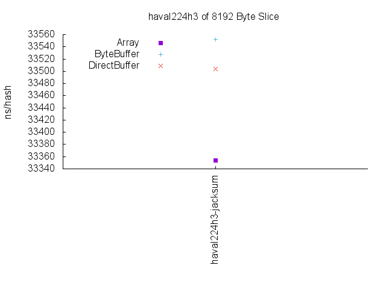

| Algorithm |  Array | ByteBuffer | DirectBuffer |
| --- | ---: | ---: | ---: | 
| [haval224h3-jacksum](#haval224h3-jacksum-latency) | 33353.851977 | 33552.322835 | 33503.756871 |

---
### 8192 Byte Slice Latency (haval224h4)
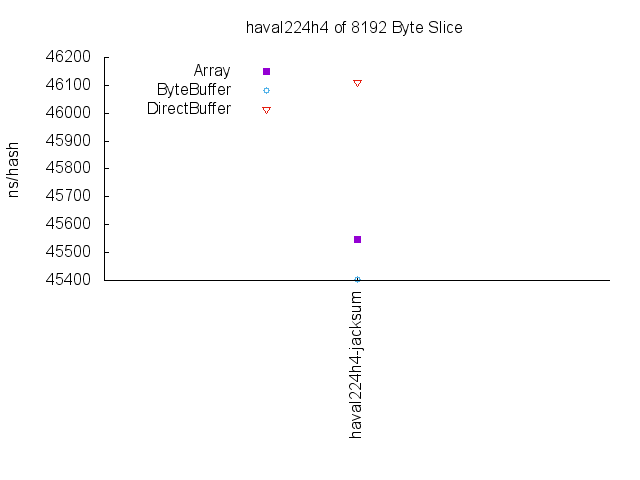

| Algorithm |  Array | ByteBuffer | DirectBuffer |
| --- | ---: | ---: | ---: | 
| [haval224h4-jacksum](#haval224h4-jacksum-latency) | 45546.875978 | 45403.658317 | 46110.288117 |

---
### 8192 Byte Slice Latency (haval224h5)
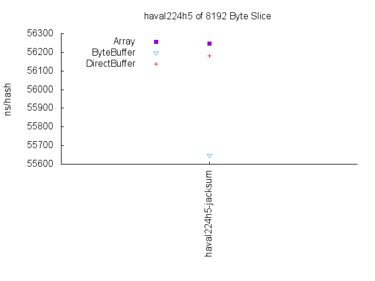

| Algorithm |  Array | ByteBuffer | DirectBuffer |
| --- | ---: | ---: | ---: | 
| [haval224h5-jacksum](#haval224h5-jacksum-latency) | 56245.874243 | 55646.909635 | 56181.142457 |

---
### 8192 Byte Slice Latency (haval256h3)
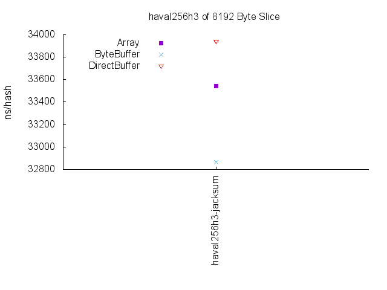

| Algorithm |  Array | ByteBuffer | DirectBuffer |
| --- | ---: | ---: | ---: | 
| [haval256h3-jacksum](#haval256h3-jacksum-latency) | 33543.579594 | 32862.627478 | 33939.263688 |

---
### 8192 Byte Slice Latency (haval256h4)
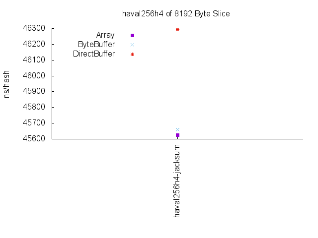

| Algorithm |  Array | ByteBuffer | DirectBuffer |
| --- | ---: | ---: | ---: | 
| [haval256h4-jacksum](#haval256h4-jacksum-latency) | 45626.269944 | 45658.347041 | 46292.679502 |

---
### 8192 Byte Slice Latency (haval256h5)
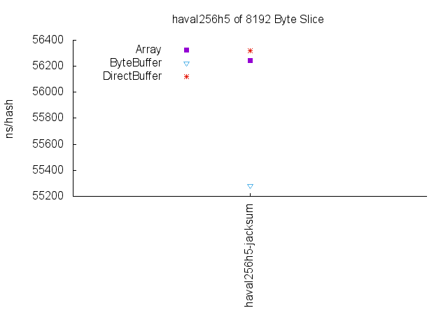

| Algorithm |  Array | ByteBuffer | DirectBuffer |
| --- | ---: | ---: | ---: | 
| [haval256h5-jacksum](#haval256h5-jacksum-latency) | 56246.091827 | 55279.557185 | 56318.403962 |

---
### 8192 Byte Slice Latency (md2)
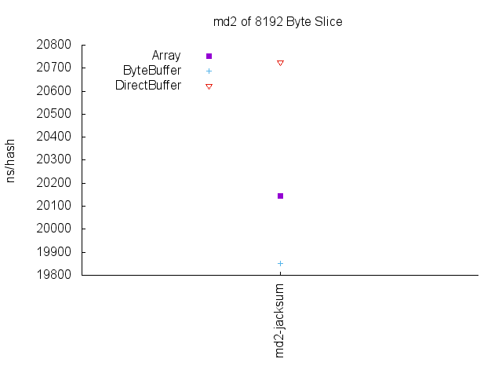

| Algorithm |  Array | ByteBuffer | DirectBuffer |
| --- | ---: | ---: | ---: | 
| [md2-jacksum](#md2-jacksum-latency) | 20144.107632 | 19852.436972 | 20724.479493 |

---
### 8192 Byte Slice Latency (md4)
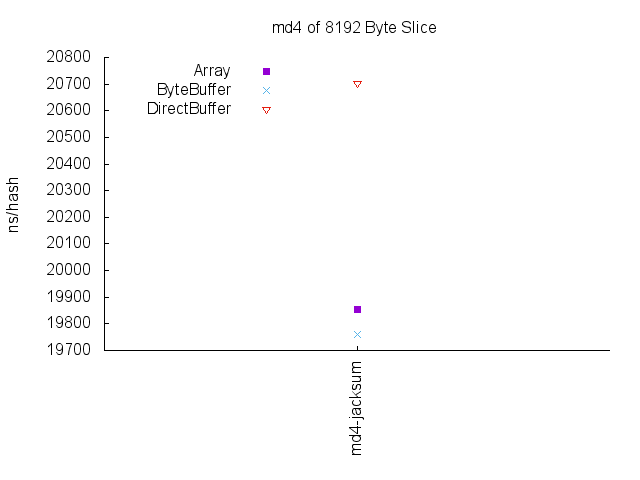

| Algorithm |  Array | ByteBuffer | DirectBuffer |
| --- | ---: | ---: | ---: | 
| [md4-jacksum](#md4-jacksum-latency) | 19853.391643 | 19761.810757 | 20702.126694 |

---
### 8192 Byte Slice Latency (md5)
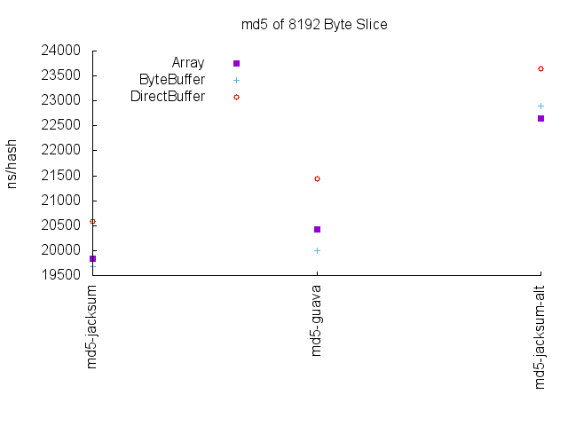

| Algorithm |  Array | ByteBuffer | DirectBuffer |
| --- | ---: | ---: | ---: | 
| [md5-jacksum](#md5-jacksum-latency) | 19831.512685 | 19669.132223 | 20588.636246 |
| [md5-guava](#md5-guava-latency) | 20422.798130 | 20003.445716 | 21434.321334 |
| [md5-jacksum-alt](#md5-jacksum-alt-latency) | 22644.968055 | 22905.390571 | 23648.153936 |

---
### 8192 Byte Slice Latency (murmur3h128)
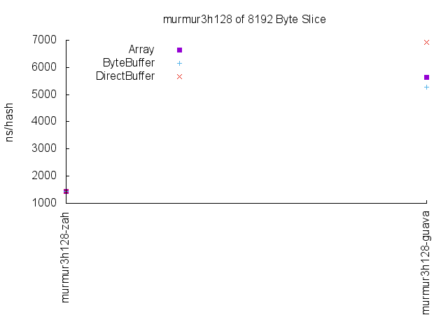

| Algorithm |  Array | ByteBuffer | DirectBuffer |
| --- | ---: | ---: | ---: | 
| [murmur3h128-zah](#murmur3h128-zah-latency) | 1442.812570 | 1428.828545 | 1427.680640 |
| [murmur3h128-guava](#murmur3h128-guava-latency) | 5639.406961 | 5283.907618 | 6927.046122 |

---
### 8192 Byte Slice Latency (murmur3h32)
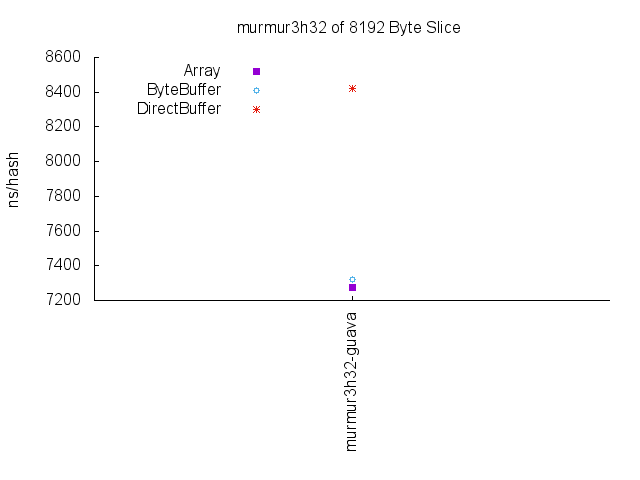

| Algorithm |  Array | ByteBuffer | DirectBuffer |
| --- | ---: | ---: | ---: | 
| [murmur3h32-guava](#murmur3h32-guava-latency) | 7274.526024 | 7323.497318 | 8424.090953 |

---
### 8192 Byte Slice Latency (ripemd128)
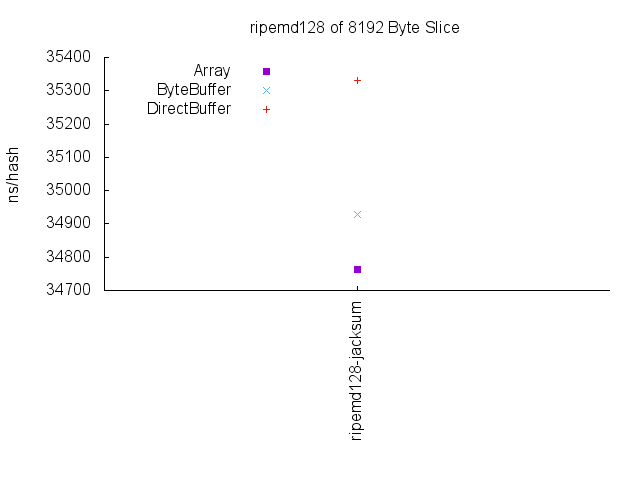

| Algorithm |  Array | ByteBuffer | DirectBuffer |
| --- | ---: | ---: | ---: | 
| [ripemd128-jacksum](#ripemd128-jacksum-latency) | 34763.936242 | 34927.760354 | 35330.105290 |

---
### 8192 Byte Slice Latency (ripemd160)
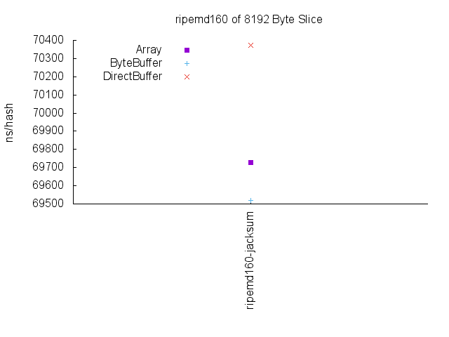

| Algorithm |  Array | ByteBuffer | DirectBuffer |
| --- | ---: | ---: | ---: | 
| [ripemd160-jacksum](#ripemd160-jacksum-latency) | 69726.896086 | 69519.563545 | 70373.395386 |

---
### 8192 Byte Slice Latency (ripemd256)
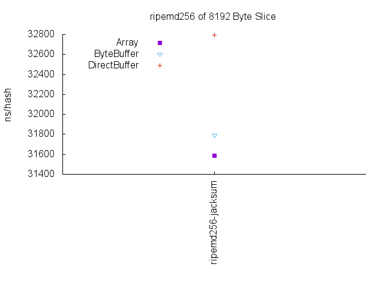

| Algorithm |  Array | ByteBuffer | DirectBuffer |
| --- | ---: | ---: | ---: | 
| [ripemd256-jacksum](#ripemd256-jacksum-latency) | 31583.841096 | 31789.748184 | 32792.797409 |

---
### 8192 Byte Slice Latency (ripemd320)
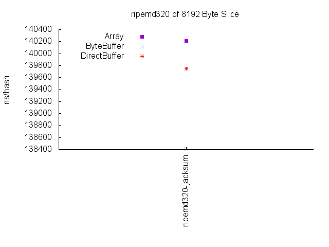

| Algorithm |  Array | ByteBuffer | DirectBuffer |
| --- | ---: | ---: | ---: | 
| [ripemd320-jacksum](#ripemd320-jacksum-latency) | 140209.947627 | 138411.588339 | 139750.294354 |

---
### 8192 Byte Slice Latency (sha0)
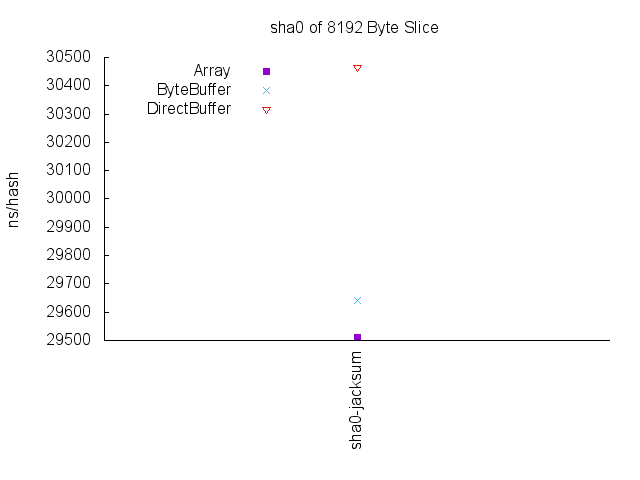

| Algorithm |  Array | ByteBuffer | DirectBuffer |
| --- | ---: | ---: | ---: | 
| [sha0-jacksum](#sha0-jacksum-latency) | 29509.896953 | 29643.009580 | 30463.271677 |

---
### 8192 Byte Slice Latency (sha1)

| Algorithm |  Array | ByteBuffer | DirectBuffer |
| --- | ---: | ---: | ---: | 
| [sha1-jacksum](#sha1-jacksum-latency) | 29843.580533 | 29569.243407 | 30665.129563 |
| [sha1-guava](#sha1-guava-latency) | 30036.299650 | 30638.315045 | 30814.441405 |
| [sha1-jacksum-alt](#sha1-jacksum-alt-latency) | 33903.405734 | 33754.566118 | 34493.889468 |

---
### 8192 Byte Slice Latency (sha224)
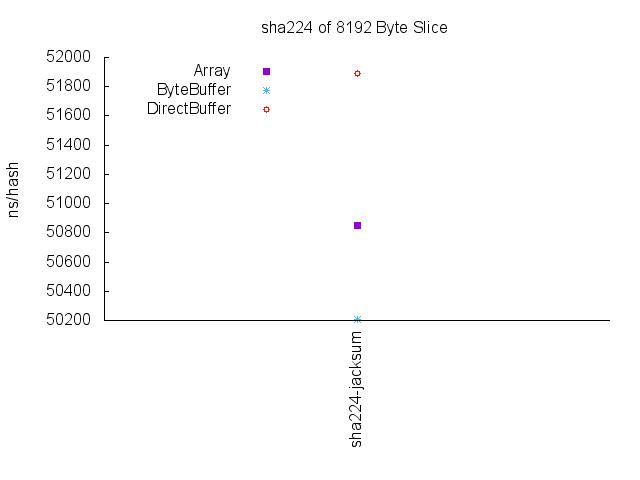

| Algorithm |  Array | ByteBuffer | DirectBuffer |
| --- | ---: | ---: | ---: | 
| [sha224-jacksum](#sha224-jacksum-latency) | 50847.253370 | 50203.673272 | 51891.125100 |

---
### 8192 Byte Slice Latency (sha256)
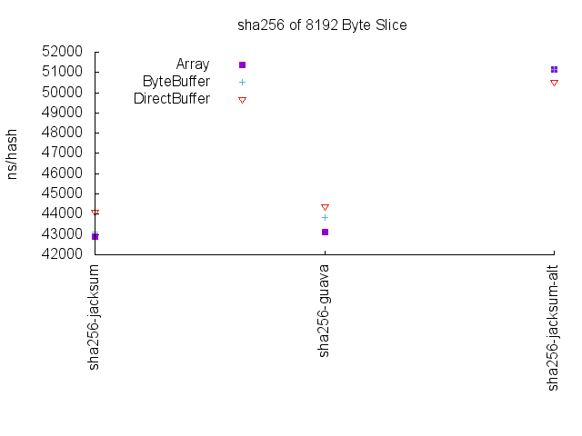

| Algorithm |  Array | ByteBuffer | DirectBuffer |
| --- | ---: | ---: | ---: | 
| [sha256-jacksum](#sha256-jacksum-latency) | 42879.137589 | 43115.130555 | 44099.319822 |
| [sha256-guava](#sha256-guava-latency) | 43140.237642 | 43827.247087 | 44355.237100 |
| [sha256-jacksum-alt](#sha256-jacksum-alt-latency) | 51167.159491 | 51129.417057 | 50525.535463 |

---
### 8192 Byte Slice Latency (sha384)
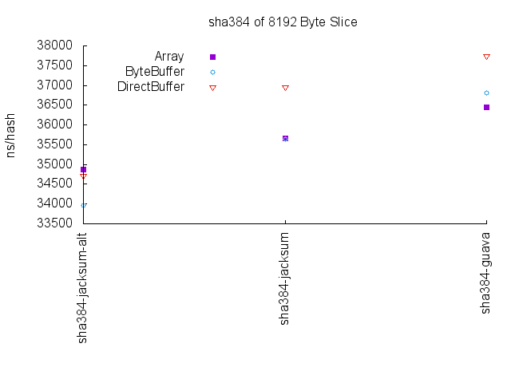

| Algorithm |  Array | ByteBuffer | DirectBuffer |
| --- | ---: | ---: | ---: | 
| [sha384-jacksum-alt](#sha384-jacksum-alt-latency) | 34880.082617 | 33960.853655 | 34715.701562 |
| [sha384-jacksum](#sha384-jacksum-latency) | 35666.394285 | 35636.205293 | 36948.545862 |
| [sha384-guava](#sha384-guava-latency) | 36441.136778 | 36812.206030 | 37744.524012 |

---
### 8192 Byte Slice Latency (sha512)
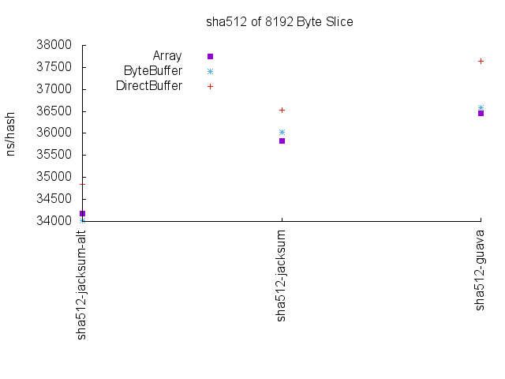

| Algorithm |  Array | ByteBuffer | DirectBuffer |
| --- | ---: | ---: | ---: | 
| [sha512-jacksum-alt](#sha512-jacksum-alt-latency) | 34173.578319 | 34020.417177 | 34834.395731 |
| [sha512-jacksum](#sha512-jacksum-latency) | 35827.675069 | 36032.120265 | 36532.207407 |
| [sha512-guava](#sha512-guava-latency) | 36457.347408 | 36586.981896 | 37639.250011 |

---
### 8192 Byte Slice Latency (sip)
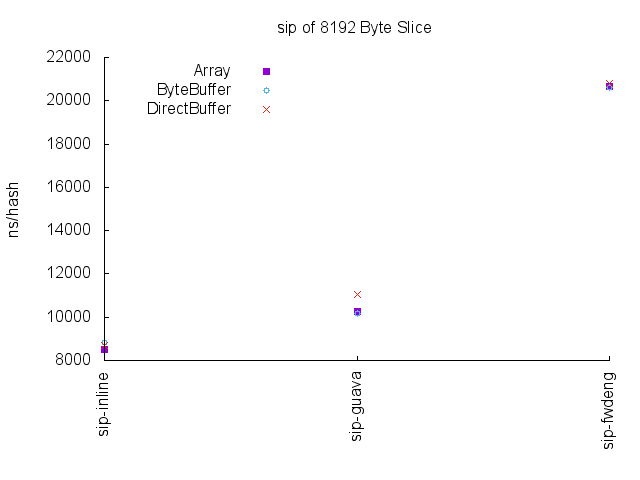

| Algorithm |  Array | ByteBuffer | DirectBuffer |
| --- | ---: | ---: | ---: | 
| [sip-inline](#sip-inline-latency) | 8490.835458 | 8814.339114 | 8692.764778 |
| [sip-guava](#sip-guava-latency) | 10242.604305 | 10174.701625 | 11070.235748 |
| [sip-fwdeng](#sip-fwdeng-latency) | 20649.118797 | 20619.494737 | 20820.881754 |

---
### 8192 Byte Slice Latency (sum16)
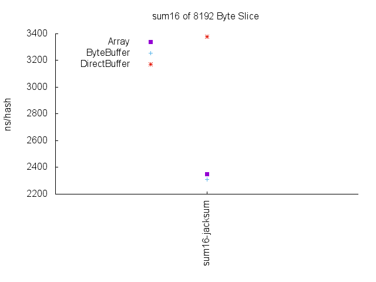

| Algorithm |  Array | ByteBuffer | DirectBuffer |
| --- | ---: | ---: | ---: | 
| [sum16-jacksum](#sum16-jacksum-latency) | 2347.756727 | 2310.048754 | 3377.895925 |

---
### 8192 Byte Slice Latency (sum24)
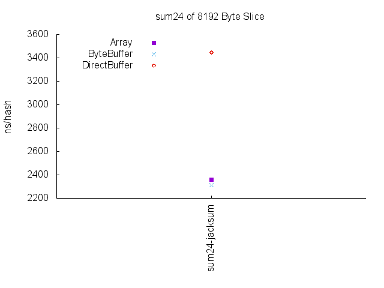

| Algorithm |  Array | ByteBuffer | DirectBuffer |
| --- | ---: | ---: | ---: | 
| [sum24-jacksum](#sum24-jacksum-latency) | 2357.725446 | 2310.731995 | 3446.762442 |

---
### 8192 Byte Slice Latency (sum32)
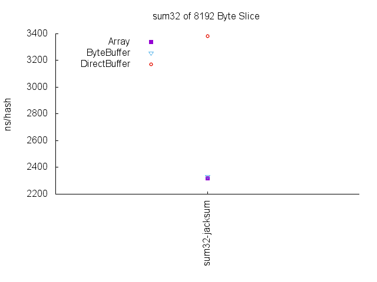

| Algorithm |  Array | ByteBuffer | DirectBuffer |
| --- | ---: | ---: | ---: | 
| [sum32-jacksum](#sum32-jacksum-latency) | 2319.716434 | 2333.603089 | 3382.135026 |

---
### 8192 Byte Slice Latency (sum8)

| Algorithm |  Array | ByteBuffer | DirectBuffer |
| --- | ---: | ---: | ---: | 
| [sum8-jacksum](#sum8-jacksum-latency) | 2323.651151 | 2320.263812 | 3507.432643 |

---
### 8192 Byte Slice Latency (sumbsd)
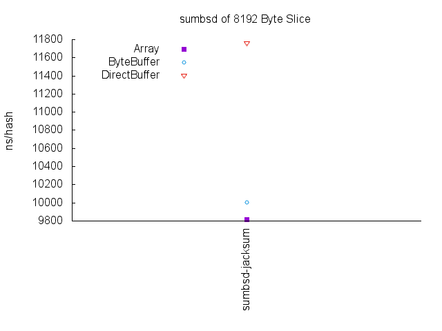

| Algorithm |  Array | ByteBuffer | DirectBuffer |
| --- | ---: | ---: | ---: | 
| [sumbsd-jacksum](#sumbsd-jacksum-latency) | 9812.723705 | 10008.705968 | 11761.089626 |

---
### 8192 Byte Slice Latency (sumsysv)
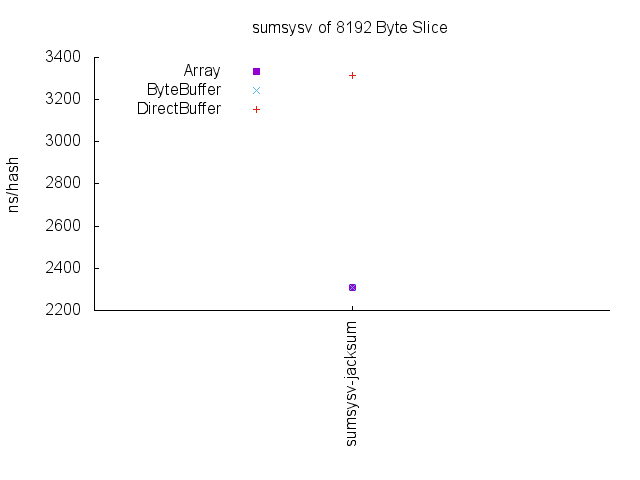

| Algorithm |  Array | ByteBuffer | DirectBuffer |
| --- | ---: | ---: | ---: | 
| [sumsysv-jacksum](#sumsysv-jacksum-latency) | 2309.631712 | 2311.203018 | 3313.764963 |

---
### 8192 Byte Slice Latency (tiger)
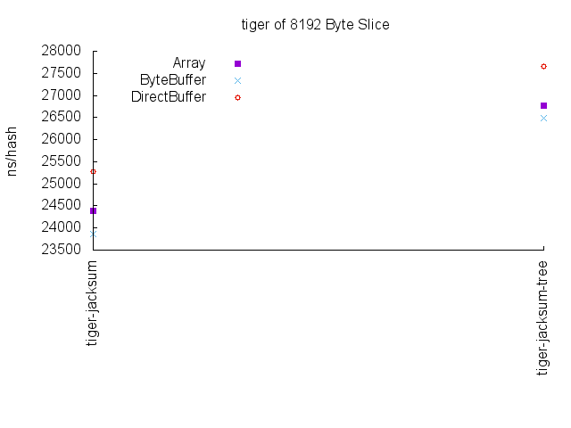

| Algorithm |  Array | ByteBuffer | DirectBuffer |
| --- | ---: | ---: | ---: | 
| [tiger-jacksum](#tiger-jacksum-latency) | 24389.786966 | 23871.726814 | 25285.811004 |
| [tiger-jacksum-tree](#tiger-jacksum-tree-latency) | 26761.136439 | 26486.135002 | 27652.989036 |

---
### 8192 Byte Slice Latency (tiger128)
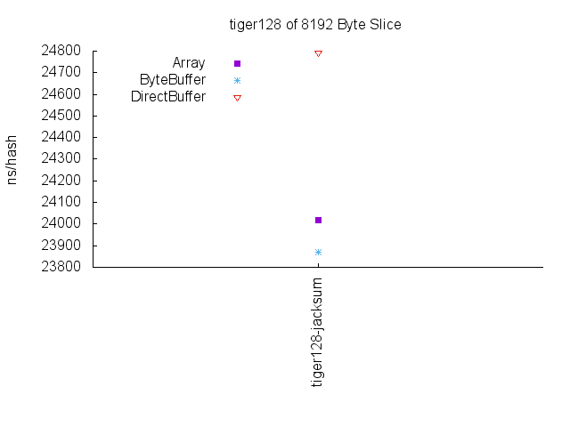

| Algorithm |  Array | ByteBuffer | DirectBuffer |
| --- | ---: | ---: | ---: | 
| [tiger128-jacksum](#tiger128-jacksum-latency) | 24017.520948 | 23868.610820 | 24790.834254 |

---
### 8192 Byte Slice Latency (tiger160)
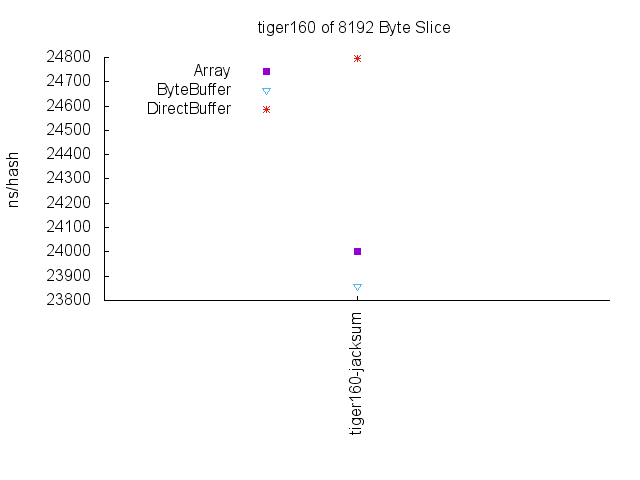

| Algorithm |  Array | ByteBuffer | DirectBuffer |
| --- | ---: | ---: | ---: | 
| [tiger160-jacksum](#tiger160-jacksum-latency) | 24001.498922 | 23855.950425 | 24796.740969 |

---
### 8192 Byte Slice Latency (tiger2)
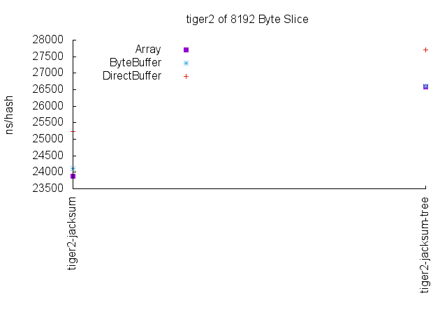

| Algorithm |  Array | ByteBuffer | DirectBuffer |
| --- | ---: | ---: | ---: | 
| [tiger2-jacksum](#tiger2-jacksum-latency) | 23888.937503 | 24115.622900 | 25234.403880 |
| [tiger2-jacksum-tree](#tiger2-jacksum-tree-latency) | 26594.166070 | 26611.162949 | 27702.550074 |

---
### 8192 Byte Slice Latency (whirlpool0)

| Algorithm |  Array | ByteBuffer | DirectBuffer |
| --- | ---: | ---: | ---: | 
| [whirlpool0-jacksum](#whirlpool0-jacksum-latency) | 117632.897384 | 117833.521803 | 123286.460834 |

---
### 8192 Byte Slice Latency (whirlpool1)

| Algorithm |  Array | ByteBuffer | DirectBuffer |
| --- | ---: | ---: | ---: | 
| [whirlpool1-jacksum](#whirlpool1-jacksum-latency) | 119113.653255 | 122372.303048 | 125218.216235 |

---
### 8192 Byte Slice Latency (whirlpool2)
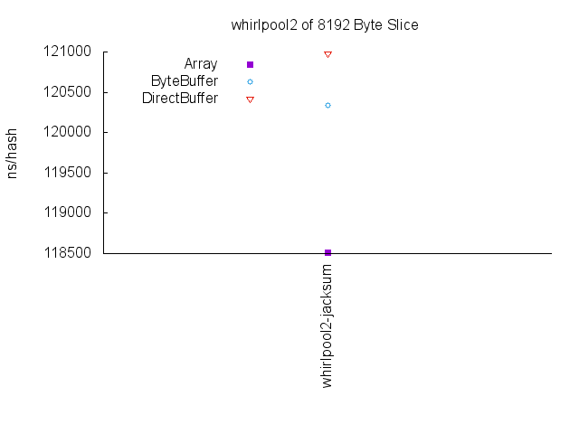

| Algorithm |  Array | ByteBuffer | DirectBuffer |
| --- | ---: | ---: | ---: | 
| [whirlpool2-jacksum](#whirlpool2-jacksum-latency) | 118514.359228 | 120334.967298 | 120973.592741 |

---
### 8192 Byte Slice Latency (xor8)
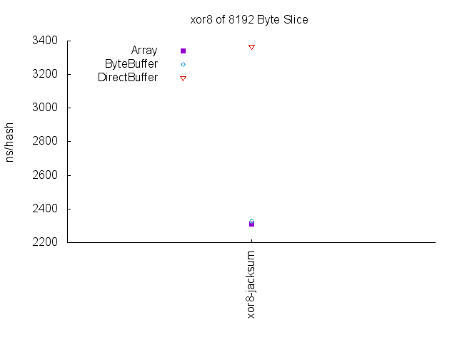

| Algorithm |  Array | ByteBuffer | DirectBuffer |
| --- | ---: | ---: | ---: | 
| [xor8-jacksum](#xor8-jacksum-latency) | 2310.005723 | 2328.296939 | 3367.966559 |

---
### 8192 Byte Slice Latency (xxh32)
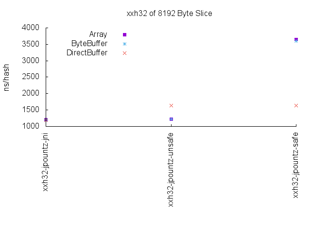

| Algorithm |  Array | ByteBuffer | DirectBuffer |
| --- | ---: | ---: | ---: | 
| [xxh32-jpountz-jni](#xxh32-jpountz-jni-latency) | 1200.529533 | 1203.851012 | 1187.393829 |
| [xxh32-jpountz-unsafe](#xxh32-jpountz-unsafe-latency) | 1214.526090 | 1216.154115 | 1628.714059 |
| [xxh32-jpountz-safe](#xxh32-jpountz-safe-latency) | 3641.055372 | 3608.235804 | 1641.435385 |

---
### 8192 Byte Slice Latency (xxh64)
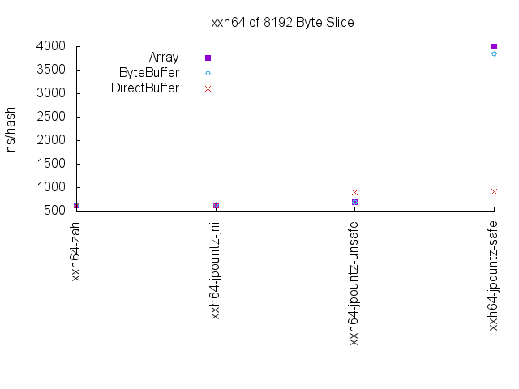

| Algorithm |  Array | ByteBuffer | DirectBuffer |
| --- | ---: | ---: | ---: | 
| [xxh64-zah](#xxh64-zah-latency) | 613.090857 | 619.815052 | 615.756005 |
| [xxh64-jpountz-jni](#xxh64-jpountz-jni-latency) | 620.883536 | 630.420165 | 620.569532 |
| [xxh64-jpountz-unsafe](#xxh64-jpountz-unsafe-latency) | 696.065361 | 690.233439 | 897.614858 |
| [xxh64-jpountz-safe](#xxh64-jpountz-safe-latency) | 3994.910016 | 3843.408505 | 908.517093 |

---
### 16384 Byte Slice Latency (All Hashes)
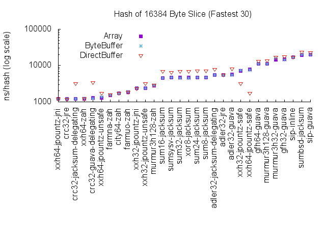

| Algorithm |  Array | ByteBuffer | DirectBuffer |
| --- | ---: | ---: | ---: | 
| [xxh64-jpountz-jni](#xxh64-jpountz-jni-latency) | 1197.660703 | 1201.998933 | 1211.975926 |
| [crc32-jre](#crc32-jre-latency) | 1201.050112 | 1214.935489 | 1192.738950 |
| [crc32-jacksum-delegating](#crc32-jacksum-delegating-latency) | 1210.362387 | 1194.968434 | 3224.179940 |
| [xxh64-zah](#xxh64-zah-latency) | 1212.721166 | 1235.344336 | 1205.065016 |
| [crc32-guava-delegating](#crc32-guava-delegating-latency) | 1279.216085 | 1252.310794 | 3362.442151 |
| [xxh64-jpountz-unsafe](#xxh64-jpountz-unsafe-latency) | 1313.970642 | 1360.907791 | 1728.380012 |
| [farmna-zah](#farmna-zah-latency) | 1536.645198 | 1591.033100 | 1563.085573 |
| [city64-zah](#city64-zah-latency) | 1704.066342 | 1703.182011 | 1714.235577 |
| [farmuo-zah](#farmuo-zah-latency) | 1826.508737 | 1879.077025 | 1855.558515 |
| [xxh32-jpountz-jni](#xxh32-jpountz-jni-latency) | 2364.496845 | 2393.872919 | 2339.794759 |
| [xxh32-jpountz-unsafe](#xxh32-jpountz-unsafe-latency) | 2421.882980 | 2369.530716 | 3238.321127 |
| [murmur3h128-zah](#murmur3h128-zah-latency) | 2835.682776 | 2867.160353 | 2849.240550 |
| [sum16-jacksum](#sum16-jacksum-latency) | 4608.242974 | 4612.150500 | 6878.006105 |
| [sumsysv-jacksum](#sumsysv-jacksum-latency) | 4628.252524 | 4631.768699 | 6530.469565 |
| [sum32-jacksum](#sum32-jacksum-latency) | 4642.950694 | 4606.506795 | 7011.243833 |
| [xor8-jacksum](#xor8-jacksum-latency) | 4656.763264 | 4614.455597 | 6932.428822 |
| [sum24-jacksum](#sum24-jacksum-latency) | 4677.341755 | 4630.341875 | 7046.429454 |
| [sum8-jacksum](#sum8-jacksum-latency) | 4706.413399 | 4631.071869 | 7211.406077 |
| [adler32-jacksum-delegating](#adler32-jacksum-delegating-latency) | 5466.404176 | 5503.934353 | 7826.924135 |
| [adler32-jre](#adler32-jre-latency) | 5466.687697 | 5532.292877 | 5456.374296 |
| [adler32-guava](#adler32-guava-latency) | 5652.990245 | 5580.719261 | 8119.035672 |
| [xxh32-jpountz-safe](#xxh32-jpountz-safe-latency) | 7186.639750 | 7295.760909 | 3215.444458 |
| [xxh64-jpountz-safe](#xxh64-jpountz-safe-latency) | 7922.493192 | 7637.044154 | 1718.337296 |
| [gfh64-guava](#gfh64-guava-latency) | 11128.896277 | 11242.281687 | 13249.914576 |
| [murmur3h128-guava](#murmur3h128-guava-latency) | 11192.335360 | 11145.215146 | 13552.254772 |
| [murmur3h32-guava](#murmur3h32-guava-latency) | 14600.888916 | 15925.669268 | 17039.030928 |
| [gfh32-guava](#gfh32-guava-latency) | 14849.414186 | 14611.102815 | 17384.060697 |
| [sip-inline](#sip-inline-latency) | 17003.082731 | 17185.619867 | 16768.852004 |
| [sumbsd-jacksum](#sumbsd-jacksum-latency) | 19458.106718 | 19911.170856 | 23258.221863 |
| [sip-guava](#sip-guava-latency) | 20056.674797 | 19986.211890 | 22753.508355 |
| [elf-jacksum](#elf-jacksum-latency) | 28776.629395 | 30562.771870 | 32221.241158 |
| [ed2k-jacksum](#ed2k-jacksum-latency) | 29146.877065 | 29303.079710 | 32150.608069 |
| [crc8-jacksum](#crc8-jacksum-latency) | 31430.044687 | 30774.962318 | 33939.526845 |
| [crc16-jacksum](#crc16-jacksum-latency) | 36919.574596 | 36942.092547 | 39034.903852 |
| [crc32-jacksum-fcs32](#crc32-jacksum-fcs32-latency) | 38245.622785 | 38042.255477 | 40897.234682 |
| [crc32-guava-rfc3720](#crc32-guava-rfc3720-latency) | 38973.205909 | 38246.674825 | 40436.179555 |
| [md5-jacksum](#md5-jacksum-latency) | 39480.262757 | 39929.274374 | 41604.376634 |
| [md2-jacksum](#md2-jacksum-latency) | 39517.519394 | 39935.409231 | 42402.426459 |
| [md4-jacksum](#md4-jacksum-latency) | 39523.863608 | 39311.684790 | 41271.259151 |
| [md5-guava](#md5-guava-latency) | 39673.322352 | 40080.509246 | 42753.655676 |
| [crc64-jacksum](#crc64-jacksum-latency) | 41291.183340 | 41275.104353 | 43603.473038 |
| [fcs16-jacksum](#fcs16-jacksum-latency) | 42024.530187 | 42101.661514 | 45238.749050 |
| [cksum-jacksum](#cksum-jacksum-latency) | 42193.511134 | 42365.264921 | 43671.071578 |
| [crc32-jacksum-mpeg2](#crc32-jacksum-mpeg2-latency) | 42331.132613 | 42357.288807 | 44459.010828 |
| [sip-fwdeng](#sip-fwdeng-latency) | 42480.386643 | 40275.037176 | 39376.969055 |
| [crc32-jacksum-bzip2](#crc32-jacksum-bzip2-latency) | 45093.568112 | 46835.878841 | 48473.587978 |
| [crc24-jacksum](#crc24-jacksum-latency) | 45340.523622 | 46437.030693 | 48389.947571 |
| [md5-jacksum-alt](#md5-jacksum-alt-latency) | 45422.224284 | 45399.591347 | 47772.665442 |
| [tiger128-jacksum](#tiger128-jacksum-latency) | 47737.811472 | 48032.238860 | 50176.830902 |
| [tiger2-jacksum](#tiger2-jacksum-latency) | 47738.384470 | 48011.419352 | 50171.580949 |
| [tiger160-jacksum](#tiger160-jacksum-latency) | 47766.429047 | 48212.128472 | 49610.605580 |
| [tiger-jacksum](#tiger-jacksum-latency) | 48776.906424 | 47913.011493 | 50451.612014 |
| [tiger2-jacksum-tree](#tiger2-jacksum-tree-latency) | 52631.566675 | 52903.379786 | 54727.704096 |
| [tiger-jacksum-tree](#tiger-jacksum-tree-latency) | 53165.272632 | 52872.690028 | 54353.130861 |
| [sha1-jacksum](#sha1-jacksum-latency) | 59049.017009 | 59304.643321 | 62462.336116 |
| [sha0-jacksum](#sha0-jacksum-latency) | 59745.841620 | 59287.776410 | 60353.377102 |
| [sha1-guava](#sha1-guava-latency) | 59908.487810 | 59342.378878 | 61794.036421 |
| [adler32-jacksum-alt](#adler32-jacksum-alt-latency) | 62022.196353 | 62311.777877 | 63658.202028 |
| [ripemd256-jacksum](#ripemd256-jacksum-latency) | 63334.417371 | 63932.206468 | 65585.648156 |
| [haval192h3-jacksum](#haval192h3-jacksum-latency) | 65638.824153 | 65676.037040 | 67971.351431 |
| [haval128h3-jacksum](#haval128h3-jacksum-latency) | 65729.259003 | 66386.972694 | 68019.866245 |
| [haval256h3-jacksum](#haval256h3-jacksum-latency) | 65911.893858 | 66335.714264 | 67041.979720 |
| [haval160h3-jacksum](#haval160h3-jacksum-latency) | 66354.677408 | 65700.187620 | 68182.411199 |
| [haval224h3-jacksum](#haval224h3-jacksum-latency) | 66420.502597 | 65783.253534 | 68500.702409 |
| [sha384-jacksum-alt](#sha384-jacksum-alt-latency) | 67733.898370 | 68550.980946 | 69038.426015 |
| [sha512-jacksum-alt](#sha512-jacksum-alt-latency) | 67752.467730 | 67683.068160 | 69858.857111 |
| [sha1-jacksum-alt](#sha1-jacksum-alt-latency) | 68124.985743 | 67804.721148 | 68417.582234 |
| [ripemd128-jacksum](#ripemd128-jacksum-latency) | 70316.944217 | 69132.191135 | 72698.774820 |
| [sha512-jacksum](#sha512-jacksum-latency) | 71982.051052 | 72815.298499 | 73492.697095 |
| [sha384-guava](#sha384-guava-latency) | 72067.908464 | 72083.662629 | 73681.481030 |
| [sha512-guava](#sha512-guava-latency) | 72121.184333 | 72089.387206 | 74720.260413 |
| [sha384-jacksum](#sha384-jacksum-latency) | 72386.280700 | 71984.170554 | 73489.026637 |
| [has160-jacksum](#has160-jacksum-latency) | 76532.570076 | 75516.875199 | 76702.127382 |
| [sha256-guava](#sha256-guava-latency) | 86217.125123 | 86203.969914 | 88328.953176 |
| [sha256-jacksum](#sha256-jacksum-latency) | 86723.073505 | 85271.034629 | 88467.544692 |
| [haval128h4-jacksum](#haval128h4-jacksum-latency) | 90371.832048 | 90271.614980 | 93516.118563 |
| [haval256h4-jacksum](#haval256h4-jacksum-latency) | 90810.773814 | 91774.911751 | 91668.779867 |
| [haval160h4-jacksum](#haval160h4-jacksum-latency) | 90933.583045 | 91282.485942 | 94224.946247 |
| [haval192h4-jacksum](#haval192h4-jacksum-latency) | 91002.817676 | 92312.358068 | 91742.780986 |
| [haval224h4-jacksum](#haval224h4-jacksum-latency) | 91904.813478 | 90265.254771 | 92139.653545 |
| [sha224-jacksum](#sha224-jacksum-latency) | 101747.768298 | 101954.098790 | 102816.121675 |
| [sha256-jacksum-alt](#sha256-jacksum-alt-latency) | 103194.505728 | 100656.598511 | 102103.604898 |
| [haval192h5-jacksum](#haval192h5-jacksum-latency) | 110602.235805 | 110484.853921 | 111797.895041 |
| [haval160h5-jacksum](#haval160h5-jacksum-latency) | 110670.454557 | 110475.439499 | 120464.245044 |
| [haval128h5-jacksum](#haval128h5-jacksum-latency) | 111001.954422 | 110539.969153 | 113490.476714 |
| [haval224h5-jacksum](#haval224h5-jacksum-latency) | 111822.315793 | 111369.236384 | 112837.316679 |
| [haval256h5-jacksum](#haval256h5-jacksum-latency) | 112502.784172 | 111790.384369 | 112363.820932 |
| [ripemd160-jacksum](#ripemd160-jacksum-latency) | 138181.079121 | 140389.285420 | 139033.292274 |
| [whirlpool0-jacksum](#whirlpool0-jacksum-latency) | 237127.191511 | 243783.989656 | 246157.371295 |
| [whirlpool2-jacksum](#whirlpool2-jacksum-latency) | 241810.054683 | 235886.993836 | 246559.223646 |
| [whirlpool1-jacksum](#whirlpool1-jacksum-latency) | 247174.970552 | 244010.526723 | 241942.754114 |
| [ripemd320-jacksum](#ripemd320-jacksum-latency) | 286070.739043 | 281157.132003 | 280257.735931 |

---
### 16384 Byte Slice Latency (adler32)
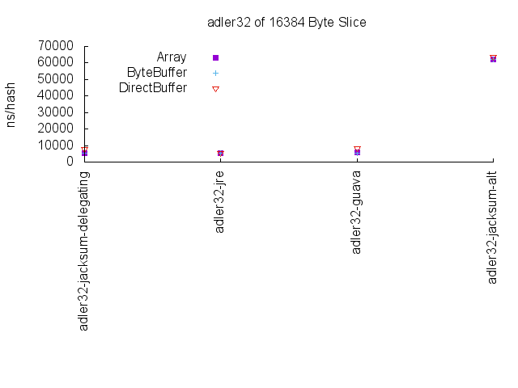

| Algorithm |  Array | ByteBuffer | DirectBuffer |
| --- | ---: | ---: | ---: | 
| [adler32-jacksum-delegating](#adler32-jacksum-delegating-latency) | 5466.404176 | 5503.934353 | 7826.924135 |
| [adler32-jre](#adler32-jre-latency) | 5466.687697 | 5532.292877 | 5456.374296 |
| [adler32-guava](#adler32-guava-latency) | 5652.990245 | 5580.719261 | 8119.035672 |
| [adler32-jacksum-alt](#adler32-jacksum-alt-latency) | 62022.196353 | 62311.777877 | 63658.202028 |

---
### 16384 Byte Slice Latency (city64)
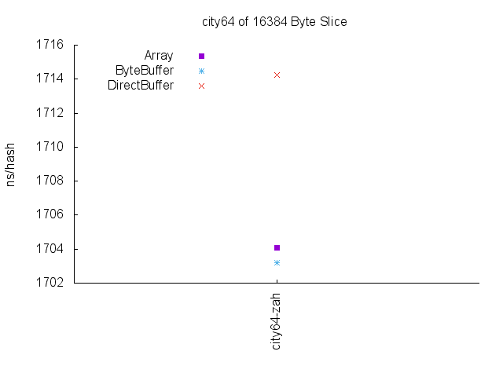

| Algorithm |  Array | ByteBuffer | DirectBuffer |
| --- | ---: | ---: | ---: | 
| [city64-zah](#city64-zah-latency) | 1704.066342 | 1703.182011 | 1714.235577 |

---
### 16384 Byte Slice Latency (cksum)
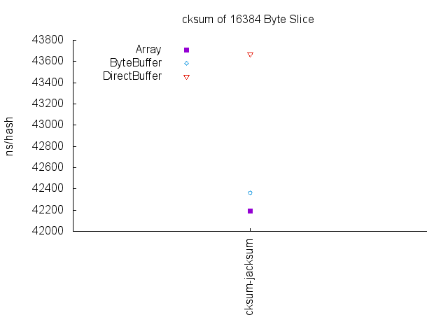

| Algorithm |  Array | ByteBuffer | DirectBuffer |
| --- | ---: | ---: | ---: | 
| [cksum-jacksum](#cksum-jacksum-latency) | 42193.511134 | 42365.264921 | 43671.071578 |

---
### 16384 Byte Slice Latency (crc16)
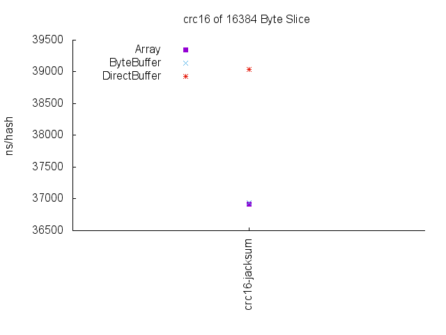

| Algorithm |  Array | ByteBuffer | DirectBuffer |
| --- | ---: | ---: | ---: | 
| [crc16-jacksum](#crc16-jacksum-latency) | 36919.574596 | 36942.092547 | 39034.903852 |

---
### 16384 Byte Slice Latency (crc24)
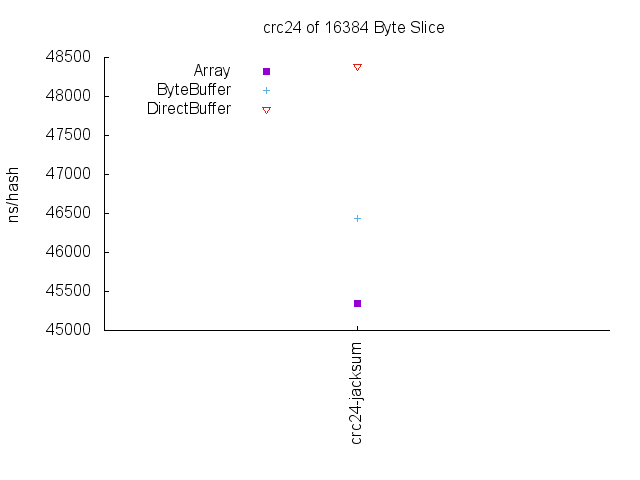

| Algorithm |  Array | ByteBuffer | DirectBuffer |
| --- | ---: | ---: | ---: | 
| [crc24-jacksum](#crc24-jacksum-latency) | 45340.523622 | 46437.030693 | 48389.947571 |

---
### 16384 Byte Slice Latency (crc32)
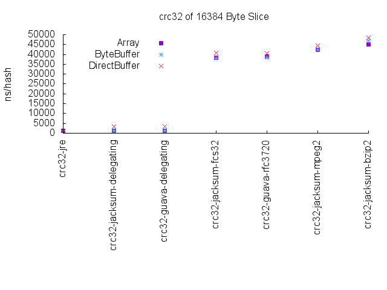

| Algorithm |  Array | ByteBuffer | DirectBuffer |
| --- | ---: | ---: | ---: | 
| [crc32-jre](#crc32-jre-latency) | 1201.050112 | 1214.935489 | 1192.738950 |
| [crc32-jacksum-delegating](#crc32-jacksum-delegating-latency) | 1210.362387 | 1194.968434 | 3224.179940 |
| [crc32-guava-delegating](#crc32-guava-delegating-latency) | 1279.216085 | 1252.310794 | 3362.442151 |
| [crc32-jacksum-fcs32](#crc32-jacksum-fcs32-latency) | 38245.622785 | 38042.255477 | 40897.234682 |
| [crc32-guava-rfc3720](#crc32-guava-rfc3720-latency) | 38973.205909 | 38246.674825 | 40436.179555 |
| [crc32-jacksum-mpeg2](#crc32-jacksum-mpeg2-latency) | 42331.132613 | 42357.288807 | 44459.010828 |
| [crc32-jacksum-bzip2](#crc32-jacksum-bzip2-latency) | 45093.568112 | 46835.878841 | 48473.587978 |

---
### 16384 Byte Slice Latency (crc64)
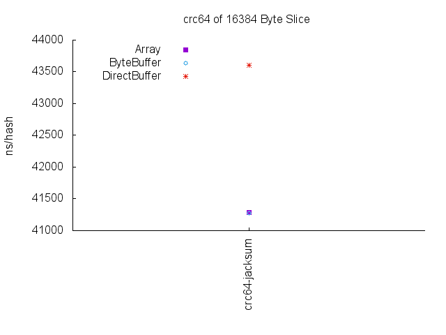

| Algorithm |  Array | ByteBuffer | DirectBuffer |
| --- | ---: | ---: | ---: | 
| [crc64-jacksum](#crc64-jacksum-latency) | 41291.183340 | 41275.104353 | 43603.473038 |

---
### 16384 Byte Slice Latency (crc8)
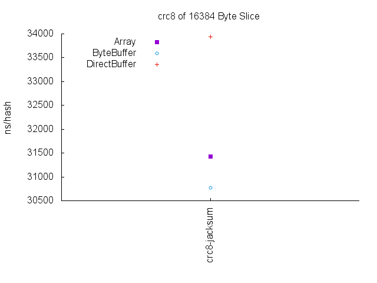

| Algorithm |  Array | ByteBuffer | DirectBuffer |
| --- | ---: | ---: | ---: | 
| [crc8-jacksum](#crc8-jacksum-latency) | 31430.044687 | 30774.962318 | 33939.526845 |

---
### 16384 Byte Slice Latency (ed2k)
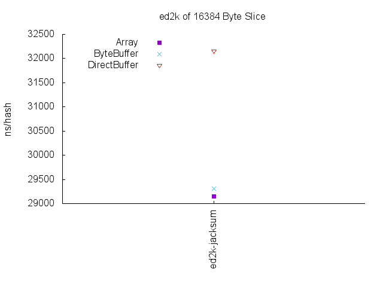

| Algorithm |  Array | ByteBuffer | DirectBuffer |
| --- | ---: | ---: | ---: | 
| [ed2k-jacksum](#ed2k-jacksum-latency) | 29146.877065 | 29303.079710 | 32150.608069 |

---
### 16384 Byte Slice Latency (elf)
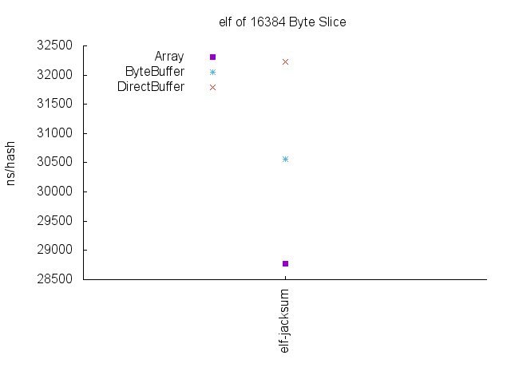

| Algorithm |  Array | ByteBuffer | DirectBuffer |
| --- | ---: | ---: | ---: | 
| [elf-jacksum](#elf-jacksum-latency) | 28776.629395 | 30562.771870 | 32221.241158 |

---
### 16384 Byte Slice Latency (farmna)
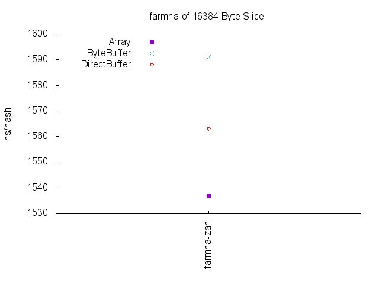

| Algorithm |  Array | ByteBuffer | DirectBuffer |
| --- | ---: | ---: | ---: | 
| [farmna-zah](#farmna-zah-latency) | 1536.645198 | 1591.033100 | 1563.085573 |

---
### 16384 Byte Slice Latency (farmuo)
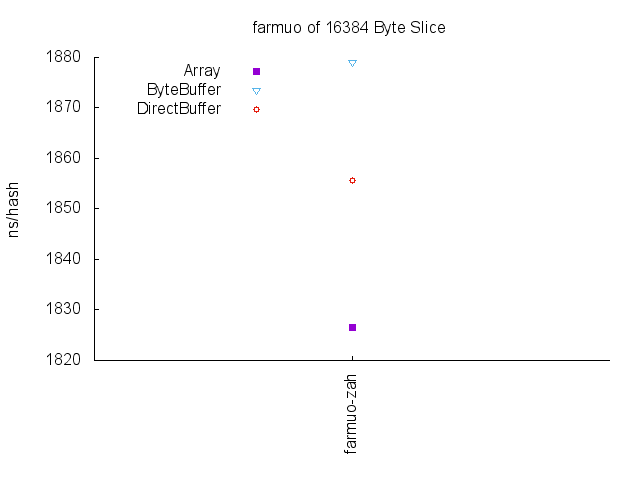

| Algorithm |  Array | ByteBuffer | DirectBuffer |
| --- | ---: | ---: | ---: | 
| [farmuo-zah](#farmuo-zah-latency) | 1826.508737 | 1879.077025 | 1855.558515 |

---
### 16384 Byte Slice Latency (fcs16)
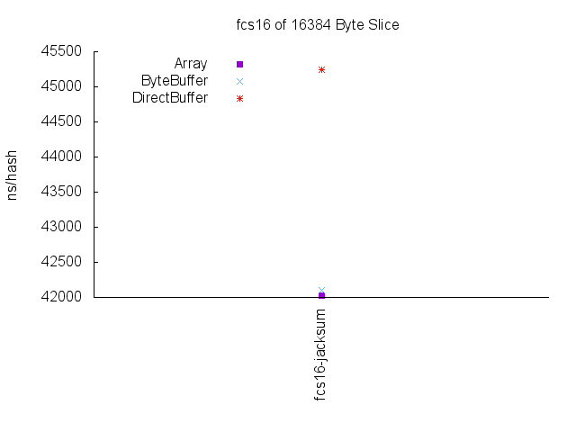

| Algorithm |  Array | ByteBuffer | DirectBuffer |
| --- | ---: | ---: | ---: | 
| [fcs16-jacksum](#fcs16-jacksum-latency) | 42024.530187 | 42101.661514 | 45238.749050 |

---
### 16384 Byte Slice Latency (gfh32)
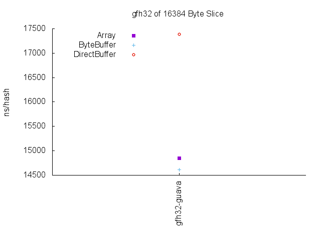

| Algorithm |  Array | ByteBuffer | DirectBuffer |
| --- | ---: | ---: | ---: | 
| [gfh32-guava](#gfh32-guava-latency) | 14849.414186 | 14611.102815 | 17384.060697 |

---
### 16384 Byte Slice Latency (gfh64)
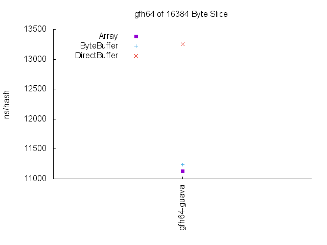

| Algorithm |  Array | ByteBuffer | DirectBuffer |
| --- | ---: | ---: | ---: | 
| [gfh64-guava](#gfh64-guava-latency) | 11128.896277 | 11242.281687 | 13249.914576 |

---
### 16384 Byte Slice Latency (has160)
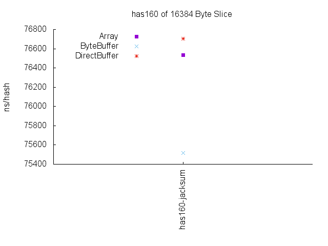

| Algorithm |  Array | ByteBuffer | DirectBuffer |
| --- | ---: | ---: | ---: | 
| [has160-jacksum](#has160-jacksum-latency) | 76532.570076 | 75516.875199 | 76702.127382 |

---
### 16384 Byte Slice Latency (haval128h3)
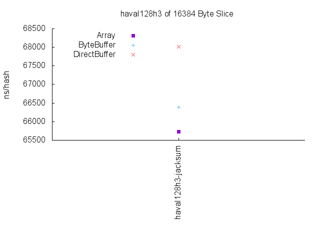

| Algorithm |  Array | ByteBuffer | DirectBuffer |
| --- | ---: | ---: | ---: | 
| [haval128h3-jacksum](#haval128h3-jacksum-latency) | 65729.259003 | 66386.972694 | 68019.866245 |

---
### 16384 Byte Slice Latency (haval128h4)
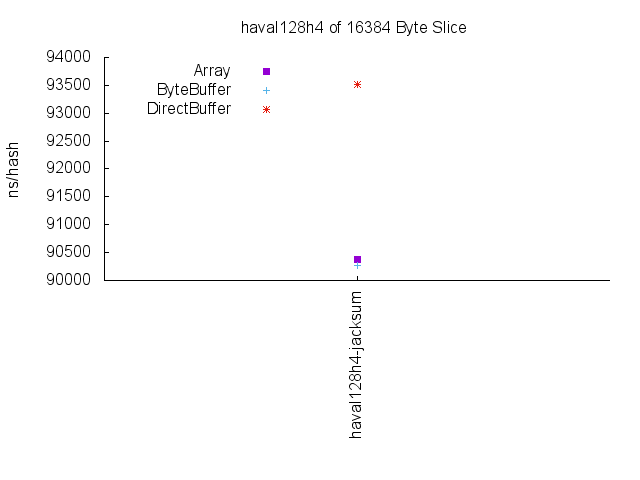

| Algorithm |  Array | ByteBuffer | DirectBuffer |
| --- | ---: | ---: | ---: | 
| [haval128h4-jacksum](#haval128h4-jacksum-latency) | 90371.832048 | 90271.614980 | 93516.118563 |

---
### 16384 Byte Slice Latency (haval128h5)
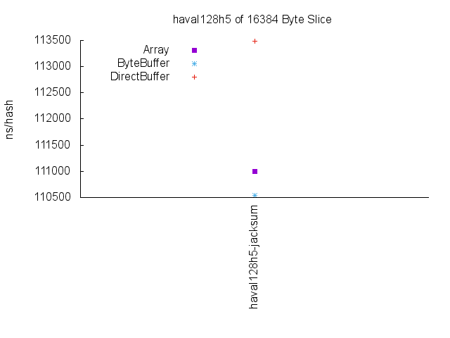

| Algorithm |  Array | ByteBuffer | DirectBuffer |
| --- | ---: | ---: | ---: | 
| [haval128h5-jacksum](#haval128h5-jacksum-latency) | 111001.954422 | 110539.969153 | 113490.476714 |

---
### 16384 Byte Slice Latency (haval160h3)
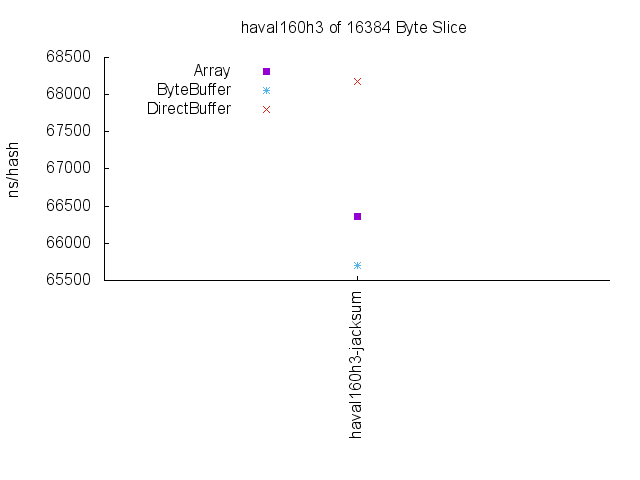

| Algorithm |  Array | ByteBuffer | DirectBuffer |
| --- | ---: | ---: | ---: | 
| [haval160h3-jacksum](#haval160h3-jacksum-latency) | 66354.677408 | 65700.187620 | 68182.411199 |

---
### 16384 Byte Slice Latency (haval160h4)
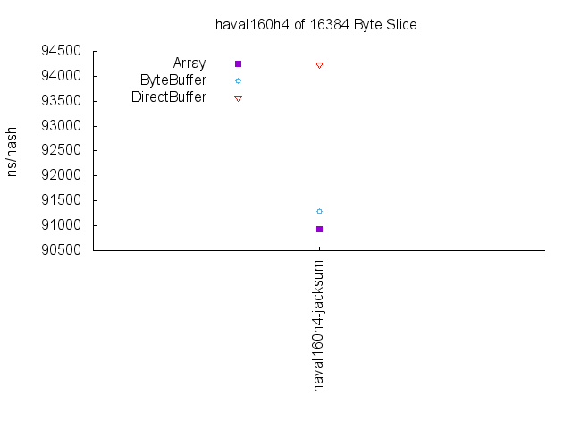

| Algorithm |  Array | ByteBuffer | DirectBuffer |
| --- | ---: | ---: | ---: | 
| [haval160h4-jacksum](#haval160h4-jacksum-latency) | 90933.583045 | 91282.485942 | 94224.946247 |

---
### 16384 Byte Slice Latency (haval160h5)
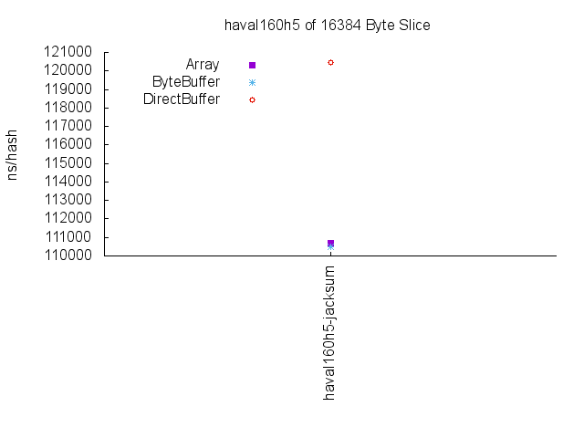

| Algorithm |  Array | ByteBuffer | DirectBuffer |
| --- | ---: | ---: | ---: | 
| [haval160h5-jacksum](#haval160h5-jacksum-latency) | 110670.454557 | 110475.439499 | 120464.245044 |

---
### 16384 Byte Slice Latency (haval192h3)
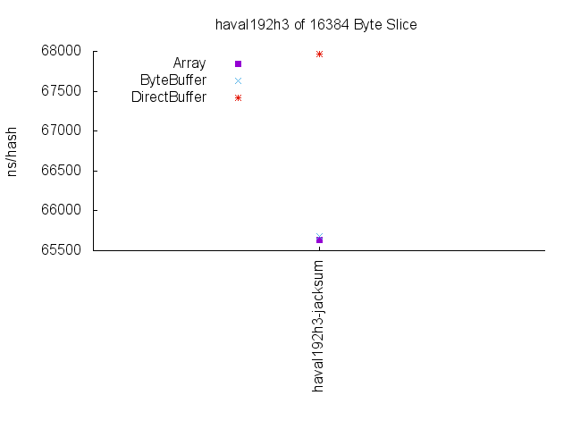

| Algorithm |  Array | ByteBuffer | DirectBuffer |
| --- | ---: | ---: | ---: | 
| [haval192h3-jacksum](#haval192h3-jacksum-latency) | 65638.824153 | 65676.037040 | 67971.351431 |

---
### 16384 Byte Slice Latency (haval192h4)
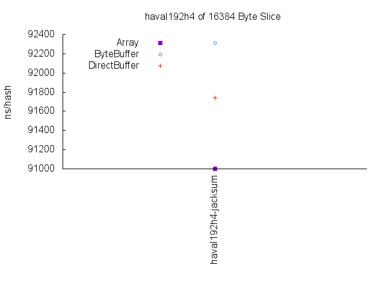

| Algorithm |  Array | ByteBuffer | DirectBuffer |
| --- | ---: | ---: | ---: | 
| [haval192h4-jacksum](#haval192h4-jacksum-latency) | 91002.817676 | 92312.358068 | 91742.780986 |

---
### 16384 Byte Slice Latency (haval192h5)
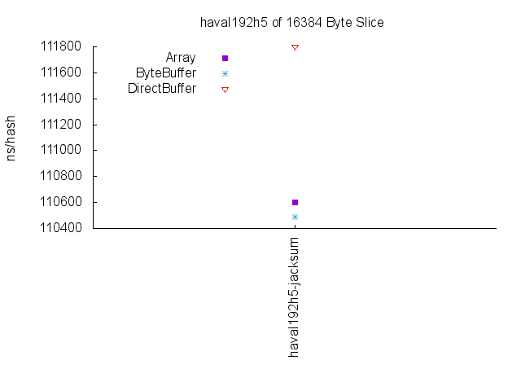

| Algorithm |  Array | ByteBuffer | DirectBuffer |
| --- | ---: | ---: | ---: | 
| [haval192h5-jacksum](#haval192h5-jacksum-latency) | 110602.235805 | 110484.853921 | 111797.895041 |

---
### 16384 Byte Slice Latency (haval224h3)
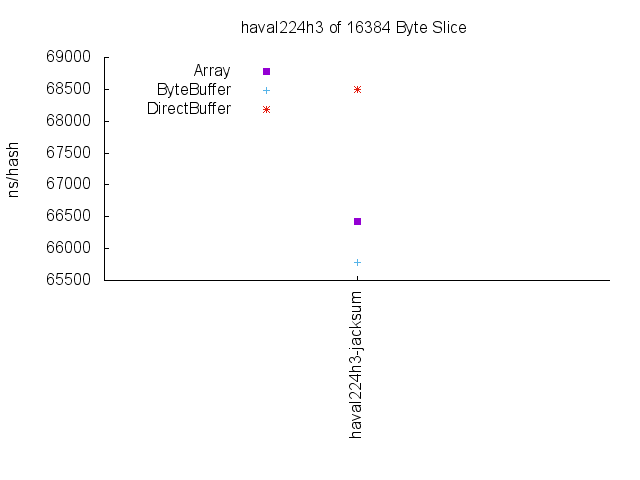

| Algorithm |  Array | ByteBuffer | DirectBuffer |
| --- | ---: | ---: | ---: | 
| [haval224h3-jacksum](#haval224h3-jacksum-latency) | 66420.502597 | 65783.253534 | 68500.702409 |

---
### 16384 Byte Slice Latency (haval224h4)
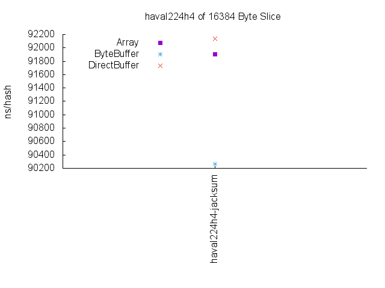

| Algorithm |  Array | ByteBuffer | DirectBuffer |
| --- | ---: | ---: | ---: | 
| [haval224h4-jacksum](#haval224h4-jacksum-latency) | 91904.813478 | 90265.254771 | 92139.653545 |

---
### 16384 Byte Slice Latency (haval224h5)
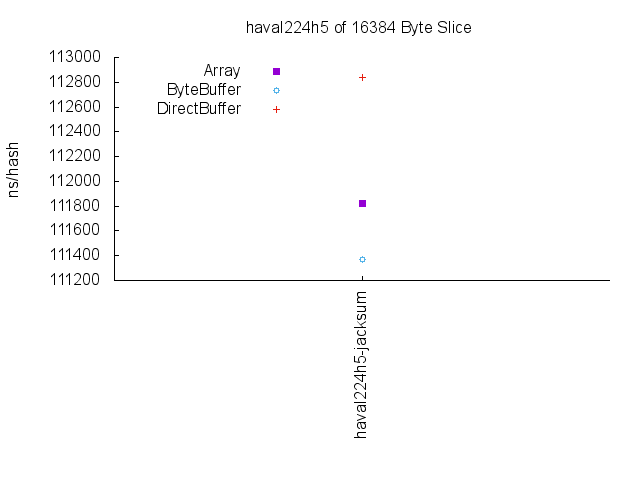

| Algorithm |  Array | ByteBuffer | DirectBuffer |
| --- | ---: | ---: | ---: | 
| [haval224h5-jacksum](#haval224h5-jacksum-latency) | 111822.315793 | 111369.236384 | 112837.316679 |

---
### 16384 Byte Slice Latency (haval256h3)
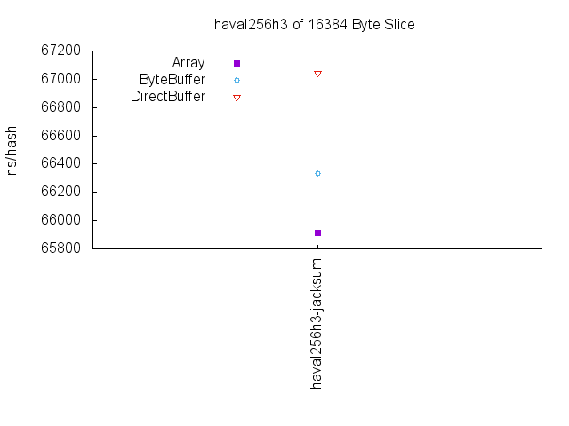

| Algorithm |  Array | ByteBuffer | DirectBuffer |
| --- | ---: | ---: | ---: | 
| [haval256h3-jacksum](#haval256h3-jacksum-latency) | 65911.893858 | 66335.714264 | 67041.979720 |

---
### 16384 Byte Slice Latency (haval256h4)
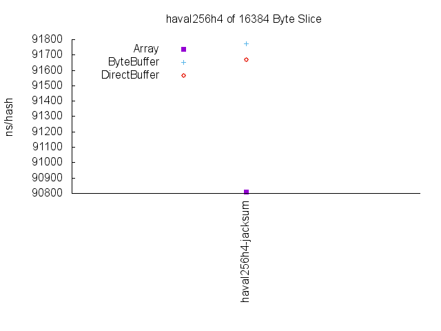

| Algorithm |  Array | ByteBuffer | DirectBuffer |
| --- | ---: | ---: | ---: | 
| [haval256h4-jacksum](#haval256h4-jacksum-latency) | 90810.773814 | 91774.911751 | 91668.779867 |

---
### 16384 Byte Slice Latency (haval256h5)
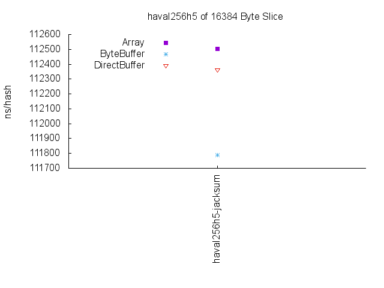

| Algorithm |  Array | ByteBuffer | DirectBuffer |
| --- | ---: | ---: | ---: | 
| [haval256h5-jacksum](#haval256h5-jacksum-latency) | 112502.784172 | 111790.384369 | 112363.820932 |

---
### 16384 Byte Slice Latency (md2)
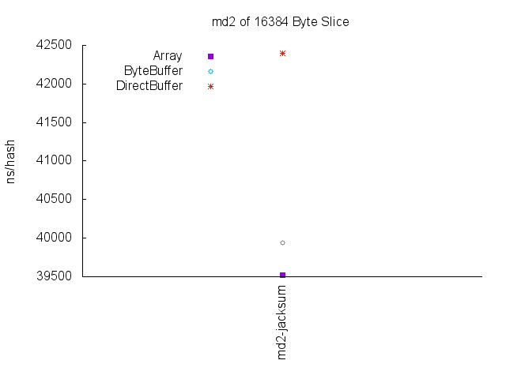

| Algorithm |  Array | ByteBuffer | DirectBuffer |
| --- | ---: | ---: | ---: | 
| [md2-jacksum](#md2-jacksum-latency) | 39517.519394 | 39935.409231 | 42402.426459 |

---
### 16384 Byte Slice Latency (md4)
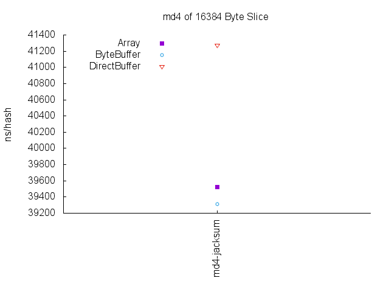

| Algorithm |  Array | ByteBuffer | DirectBuffer |
| --- | ---: | ---: | ---: | 
| [md4-jacksum](#md4-jacksum-latency) | 39523.863608 | 39311.684790 | 41271.259151 |

---
### 16384 Byte Slice Latency (md5)
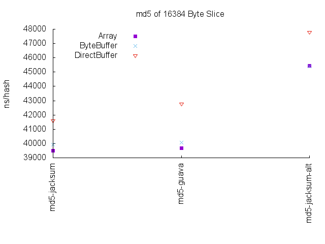

| Algorithm |  Array | ByteBuffer | DirectBuffer |
| --- | ---: | ---: | ---: | 
| [md5-jacksum](#md5-jacksum-latency) | 39480.262757 | 39929.274374 | 41604.376634 |
| [md5-guava](#md5-guava-latency) | 39673.322352 | 40080.509246 | 42753.655676 |
| [md5-jacksum-alt](#md5-jacksum-alt-latency) | 45422.224284 | 45399.591347 | 47772.665442 |

---
### 16384 Byte Slice Latency (murmur3h128)
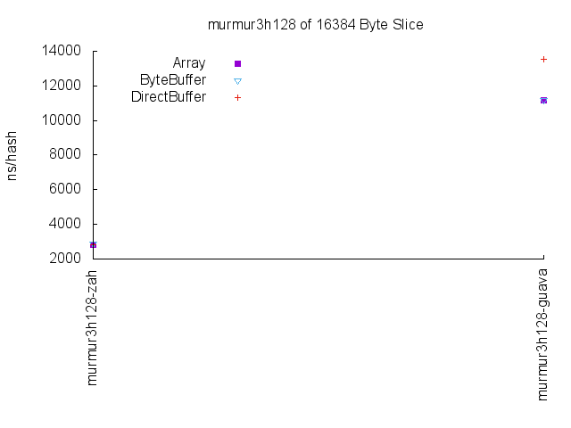

| Algorithm |  Array | ByteBuffer | DirectBuffer |
| --- | ---: | ---: | ---: | 
| [murmur3h128-zah](#murmur3h128-zah-latency) | 2835.682776 | 2867.160353 | 2849.240550 |
| [murmur3h128-guava](#murmur3h128-guava-latency) | 11192.335360 | 11145.215146 | 13552.254772 |

---
### 16384 Byte Slice Latency (murmur3h32)
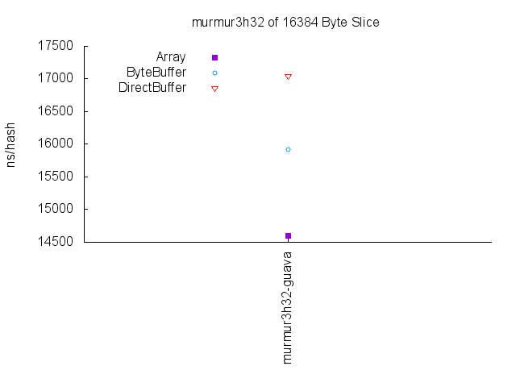

| Algorithm |  Array | ByteBuffer | DirectBuffer |
| --- | ---: | ---: | ---: | 
| [murmur3h32-guava](#murmur3h32-guava-latency) | 14600.888916 | 15925.669268 | 17039.030928 |

---
### 16384 Byte Slice Latency (ripemd128)
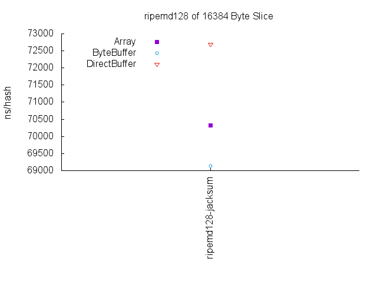

| Algorithm |  Array | ByteBuffer | DirectBuffer |
| --- | ---: | ---: | ---: | 
| [ripemd128-jacksum](#ripemd128-jacksum-latency) | 70316.944217 | 69132.191135 | 72698.774820 |

---
### 16384 Byte Slice Latency (ripemd160)
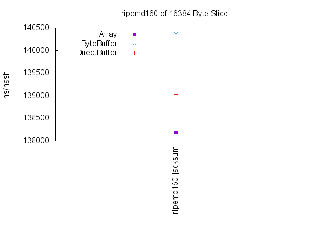

| Algorithm |  Array | ByteBuffer | DirectBuffer |
| --- | ---: | ---: | ---: | 
| [ripemd160-jacksum](#ripemd160-jacksum-latency) | 138181.079121 | 140389.285420 | 139033.292274 |

---
### 16384 Byte Slice Latency (ripemd256)
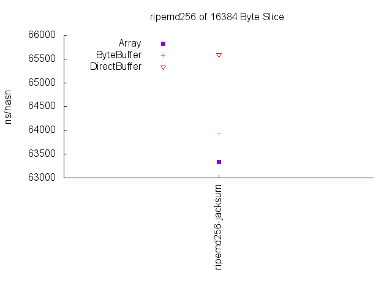

| Algorithm |  Array | ByteBuffer | DirectBuffer |
| --- | ---: | ---: | ---: | 
| [ripemd256-jacksum](#ripemd256-jacksum-latency) | 63334.417371 | 63932.206468 | 65585.648156 |

---
### 16384 Byte Slice Latency (ripemd320)
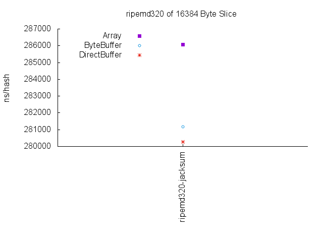

| Algorithm |  Array | ByteBuffer | DirectBuffer |
| --- | ---: | ---: | ---: | 
| [ripemd320-jacksum](#ripemd320-jacksum-latency) | 286070.739043 | 281157.132003 | 280257.735931 |

---
### 16384 Byte Slice Latency (sha0)
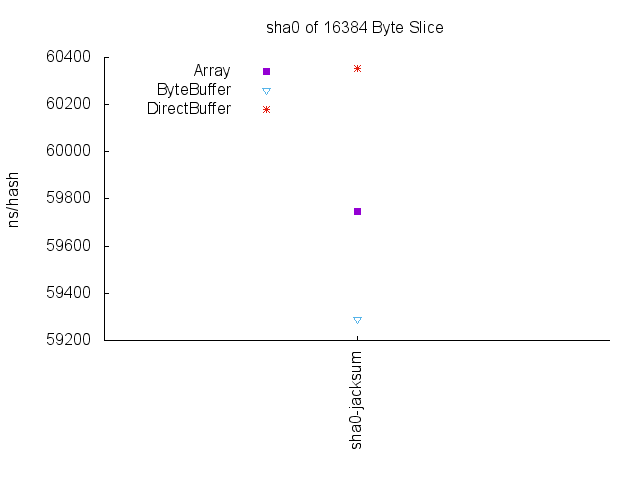

| Algorithm |  Array | ByteBuffer | DirectBuffer |
| --- | ---: | ---: | ---: | 
| [sha0-jacksum](#sha0-jacksum-latency) | 59745.841620 | 59287.776410 | 60353.377102 |

---
### 16384 Byte Slice Latency (sha1)
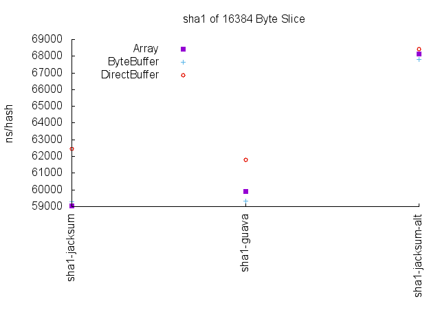

| Algorithm |  Array | ByteBuffer | DirectBuffer |
| --- | ---: | ---: | ---: | 
| [sha1-jacksum](#sha1-jacksum-latency) | 59049.017009 | 59304.643321 | 62462.336116 |
| [sha1-guava](#sha1-guava-latency) | 59908.487810 | 59342.378878 | 61794.036421 |
| [sha1-jacksum-alt](#sha1-jacksum-alt-latency) | 68124.985743 | 67804.721148 | 68417.582234 |

---
### 16384 Byte Slice Latency (sha224)
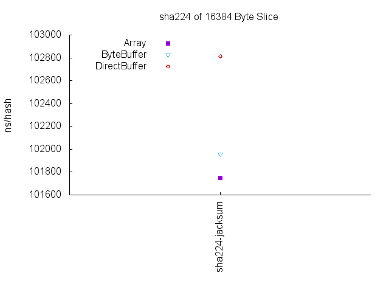

| Algorithm |  Array | ByteBuffer | DirectBuffer |
| --- | ---: | ---: | ---: | 
| [sha224-jacksum](#sha224-jacksum-latency) | 101747.768298 | 101954.098790 | 102816.121675 |

---
### 16384 Byte Slice Latency (sha256)
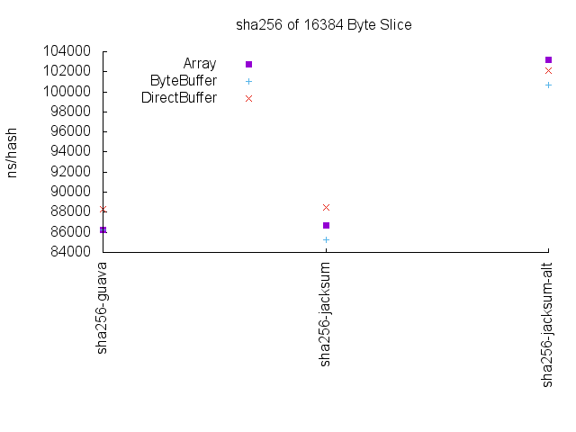

| Algorithm |  Array | ByteBuffer | DirectBuffer |
| --- | ---: | ---: | ---: | 
| [sha256-guava](#sha256-guava-latency) | 86217.125123 | 86203.969914 | 88328.953176 |
| [sha256-jacksum](#sha256-jacksum-latency) | 86723.073505 | 85271.034629 | 88467.544692 |
| [sha256-jacksum-alt](#sha256-jacksum-alt-latency) | 103194.505728 | 100656.598511 | 102103.604898 |

---
### 16384 Byte Slice Latency (sha384)
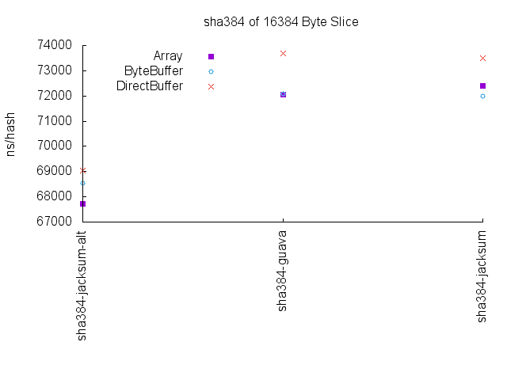

| Algorithm |  Array | ByteBuffer | DirectBuffer |
| --- | ---: | ---: | ---: | 
| [sha384-jacksum-alt](#sha384-jacksum-alt-latency) | 67733.898370 | 68550.980946 | 69038.426015 |
| [sha384-guava](#sha384-guava-latency) | 72067.908464 | 72083.662629 | 73681.481030 |
| [sha384-jacksum](#sha384-jacksum-latency) | 72386.280700 | 71984.170554 | 73489.026637 |

---
### 16384 Byte Slice Latency (sha512)
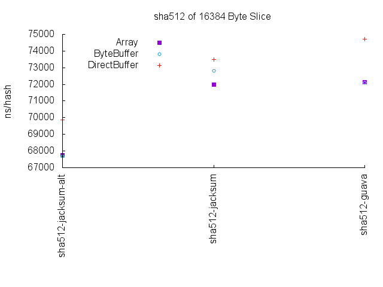

| Algorithm |  Array | ByteBuffer | DirectBuffer |
| --- | ---: | ---: | ---: | 
| [sha512-jacksum-alt](#sha512-jacksum-alt-latency) | 67752.467730 | 67683.068160 | 69858.857111 |
| [sha512-jacksum](#sha512-jacksum-latency) | 71982.051052 | 72815.298499 | 73492.697095 |
| [sha512-guava](#sha512-guava-latency) | 72121.184333 | 72089.387206 | 74720.260413 |

---
### 16384 Byte Slice Latency (sip)
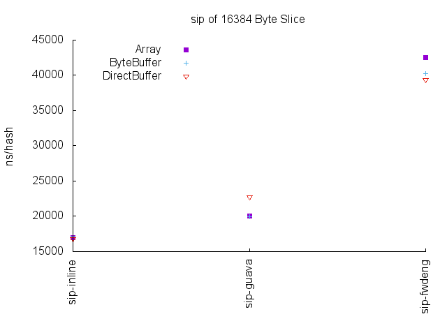

| Algorithm |  Array | ByteBuffer | DirectBuffer |
| --- | ---: | ---: | ---: | 
| [sip-inline](#sip-inline-latency) | 17003.082731 | 17185.619867 | 16768.852004 |
| [sip-guava](#sip-guava-latency) | 20056.674797 | 19986.211890 | 22753.508355 |
| [sip-fwdeng](#sip-fwdeng-latency) | 42480.386643 | 40275.037176 | 39376.969055 |

---
### 16384 Byte Slice Latency (sum16)

| Algorithm |  Array | ByteBuffer | DirectBuffer |
| --- | ---: | ---: | ---: | 
| [sum16-jacksum](#sum16-jacksum-latency) | 4608.242974 | 4612.150500 | 6878.006105 |

---
### 16384 Byte Slice Latency (sum24)

| Algorithm |  Array | ByteBuffer | DirectBuffer |
| --- | ---: | ---: | ---: | 
| [sum24-jacksum](#sum24-jacksum-latency) | 4677.341755 | 4630.341875 | 7046.429454 |

---
### 16384 Byte Slice Latency (sum32)
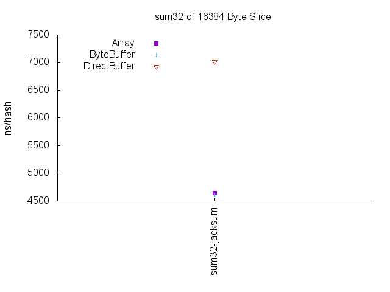

| Algorithm |  Array | ByteBuffer | DirectBuffer |
| --- | ---: | ---: | ---: | 
| [sum32-jacksum](#sum32-jacksum-latency) | 4642.950694 | 4606.506795 | 7011.243833 |

---
### 16384 Byte Slice Latency (sum8)

| Algorithm |  Array | ByteBuffer | DirectBuffer |
| --- | ---: | ---: | ---: | 
| [sum8-jacksum](#sum8-jacksum-latency) | 4706.413399 | 4631.071869 | 7211.406077 |

---
### 16384 Byte Slice Latency (sumbsd)
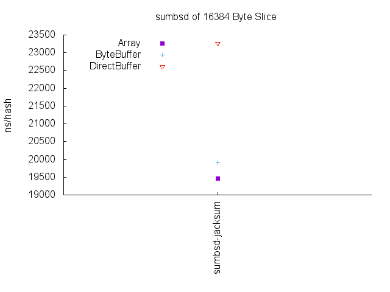

| Algorithm |  Array | ByteBuffer | DirectBuffer |
| --- | ---: | ---: | ---: | 
| [sumbsd-jacksum](#sumbsd-jacksum-latency) | 19458.106718 | 19911.170856 | 23258.221863 |

---
### 16384 Byte Slice Latency (sumsysv)

| Algorithm |  Array | ByteBuffer | DirectBuffer |
| --- | ---: | ---: | ---: | 
| [sumsysv-jacksum](#sumsysv-jacksum-latency) | 4628.252524 | 4631.768699 | 6530.469565 |

---
### 16384 Byte Slice Latency (tiger)

| Algorithm |  Array | ByteBuffer | DirectBuffer |
| --- | ---: | ---: | ---: | 
| [tiger-jacksum](#tiger-jacksum-latency) | 48776.906424 | 47913.011493 | 50451.612014 |
| [tiger-jacksum-tree](#tiger-jacksum-tree-latency) | 53165.272632 | 52872.690028 | 54353.130861 |

---
### 16384 Byte Slice Latency (tiger128)
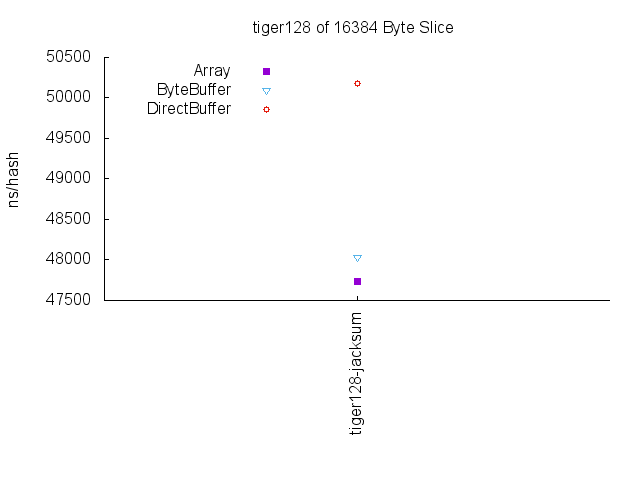

| Algorithm |  Array | ByteBuffer | DirectBuffer |
| --- | ---: | ---: | ---: | 
| [tiger128-jacksum](#tiger128-jacksum-latency) | 47737.811472 | 48032.238860 | 50176.830902 |

---
### 16384 Byte Slice Latency (tiger160)
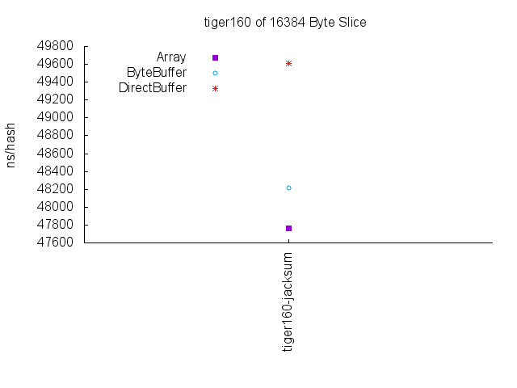

| Algorithm |  Array | ByteBuffer | DirectBuffer |
| --- | ---: | ---: | ---: | 
| [tiger160-jacksum](#tiger160-jacksum-latency) | 47766.429047 | 48212.128472 | 49610.605580 |

---
### 16384 Byte Slice Latency (tiger2)
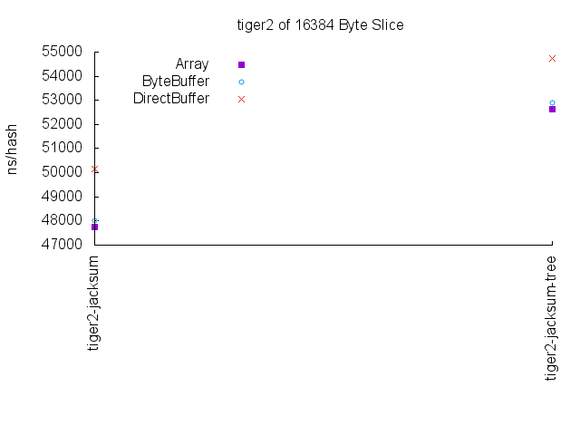

| Algorithm |  Array | ByteBuffer | DirectBuffer |
| --- | ---: | ---: | ---: | 
| [tiger2-jacksum](#tiger2-jacksum-latency) | 47738.384470 | 48011.419352 | 50171.580949 |
| [tiger2-jacksum-tree](#tiger2-jacksum-tree-latency) | 52631.566675 | 52903.379786 | 54727.704096 |

---
### 16384 Byte Slice Latency (whirlpool0)
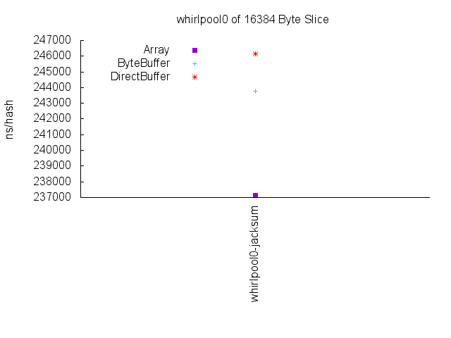

| Algorithm |  Array | ByteBuffer | DirectBuffer |
| --- | ---: | ---: | ---: | 
| [whirlpool0-jacksum](#whirlpool0-jacksum-latency) | 237127.191511 | 243783.989656 | 246157.371295 |

---
### 16384 Byte Slice Latency (whirlpool1)
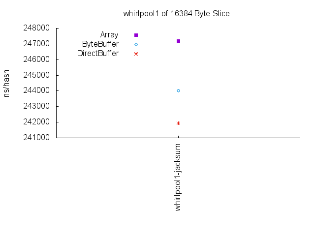

| Algorithm |  Array | ByteBuffer | DirectBuffer |
| --- | ---: | ---: | ---: | 
| [whirlpool1-jacksum](#whirlpool1-jacksum-latency) | 247174.970552 | 244010.526723 | 241942.754114 |

---
### 16384 Byte Slice Latency (whirlpool2)

| Algorithm |  Array | ByteBuffer | DirectBuffer |
| --- | ---: | ---: | ---: | 
| [whirlpool2-jacksum](#whirlpool2-jacksum-latency) | 241810.054683 | 235886.993836 | 246559.223646 |

---
### 16384 Byte Slice Latency (xor8)
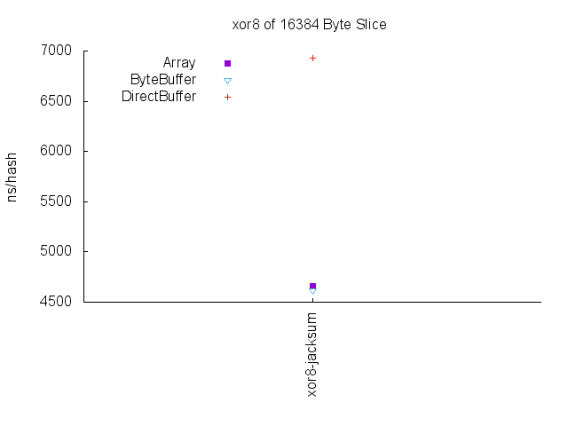

| Algorithm |  Array | ByteBuffer | DirectBuffer |
| --- | ---: | ---: | ---: | 
| [xor8-jacksum](#xor8-jacksum-latency) | 4656.763264 | 4614.455597 | 6932.428822 |

---
### 16384 Byte Slice Latency (xxh32)
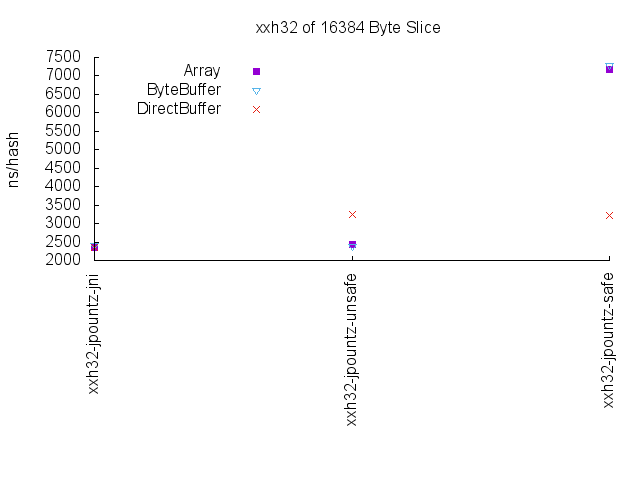

| Algorithm |  Array | ByteBuffer | DirectBuffer |
| --- | ---: | ---: | ---: | 
| [xxh32-jpountz-jni](#xxh32-jpountz-jni-latency) | 2364.496845 | 2393.872919 | 2339.794759 |
| [xxh32-jpountz-unsafe](#xxh32-jpountz-unsafe-latency) | 2421.882980 | 2369.530716 | 3238.321127 |
| [xxh32-jpountz-safe](#xxh32-jpountz-safe-latency) | 7186.639750 | 7295.760909 | 3215.444458 |

---
### 16384 Byte Slice Latency (xxh64)
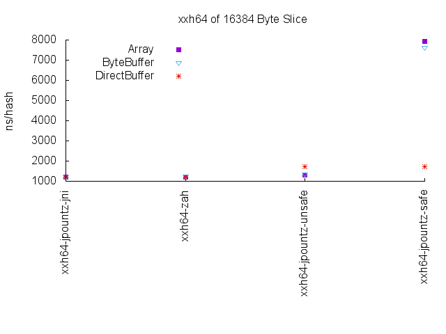

| Algorithm |  Array | ByteBuffer | DirectBuffer |
| --- | ---: | ---: | ---: | 
| [xxh64-jpountz-jni](#xxh64-jpountz-jni-latency) | 1197.660703 | 1201.998933 | 1211.975926 |
| [xxh64-zah](#xxh64-zah-latency) | 1212.721166 | 1235.344336 | 1205.065016 |
| [xxh64-jpountz-unsafe](#xxh64-jpountz-unsafe-latency) | 1313.970642 | 1360.907791 | 1728.380012 |
| [xxh64-jpountz-safe](#xxh64-jpountz-safe-latency) | 7922.493192 | 7637.044154 | 1718.337296 |

---
### 32768 Byte Slice Latency (All Hashes)
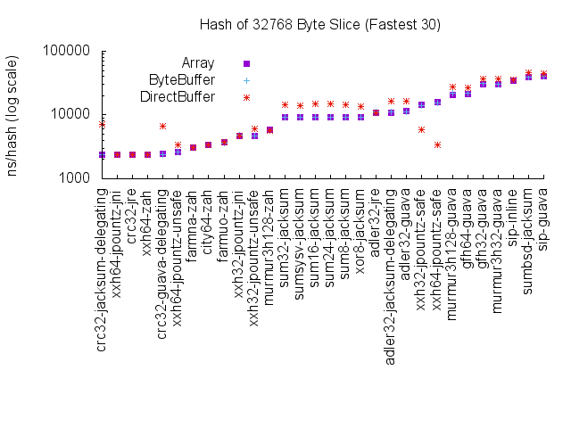

| Algorithm |  Array | ByteBuffer | DirectBuffer |
| --- | ---: | ---: | ---: | 
| [crc32-jacksum-delegating](#crc32-jacksum-delegating-latency) | 2373.006555 | 2360.502339 | 7088.865890 |
| [xxh64-jpountz-jni](#xxh64-jpountz-jni-latency) | 2376.727740 | 2388.643764 | 2369.197092 |
| [crc32-jre](#crc32-jre-latency) | 2392.692792 | 2388.823817 | 2409.643322 |
| [xxh64-zah](#xxh64-zah-latency) | 2424.245503 | 2416.293540 | 2399.143768 |
| [crc32-guava-delegating](#crc32-guava-delegating-latency) | 2456.551322 | 2409.889253 | 6708.242365 |
| [xxh64-jpountz-unsafe](#xxh64-jpountz-unsafe-latency) | 2647.459702 | 2621.075569 | 3371.275595 |
| [farmna-zah](#farmna-zah-latency) | 3126.940982 | 3127.917852 | 3060.876326 |
| [city64-zah](#city64-zah-latency) | 3397.235390 | 3424.056507 | 3415.590418 |
| [farmuo-zah](#farmuo-zah-latency) | 3693.234677 | 3652.234778 | 3728.080262 |
| [xxh32-jpountz-jni](#xxh32-jpountz-jni-latency) | 4726.984984 | 4771.456709 | 4709.882284 |
| [xxh32-jpountz-unsafe](#xxh32-jpountz-unsafe-latency) | 4746.235647 | 4759.289277 | 5980.843144 |
| [murmur3h128-zah](#murmur3h128-zah-latency) | 5796.128653 | 5728.650272 | 5707.720237 |
| [sum32-jacksum](#sum32-jacksum-latency) | 9212.574735 | 9305.460017 | 14519.445463 |
| [sumsysv-jacksum](#sumsysv-jacksum-latency) | 9223.817815 | 9240.893394 | 14134.740867 |
| [sum16-jacksum](#sum16-jacksum-latency) | 9226.440079 | 9230.296384 | 14749.121967 |
| [sum24-jacksum](#sum24-jacksum-latency) | 9251.620421 | 9363.203108 | 15177.482637 |
| [sum8-jacksum](#sum8-jacksum-latency) | 9269.532966 | 9211.144379 | 14550.850010 |
| [xor8-jacksum](#xor8-jacksum-latency) | 9345.208621 | 9340.359615 | 13674.804599 |
| [adler32-jre](#adler32-jre-latency) | 10935.838976 | 11101.898748 | 10965.672725 |
| [adler32-jacksum-delegating](#adler32-jacksum-delegating-latency) | 11006.900960 | 11115.116445 | 16438.498306 |
| [adler32-guava](#adler32-guava-latency) | 11400.320232 | 11067.221369 | 16661.466505 |
| [xxh32-jpountz-safe](#xxh32-jpountz-safe-latency) | 14356.302721 | 14175.332994 | 5822.125330 |
| [xxh64-jpountz-safe](#xxh64-jpountz-safe-latency) | 15800.760205 | 15291.107410 | 3377.818593 |
| [murmur3h128-guava](#murmur3h128-guava-latency) | 20920.368886 | 21826.181676 | 27449.503909 |
| [gfh64-guava](#gfh64-guava-latency) | 21569.088387 | 21931.211083 | 26705.958281 |
| [gfh32-guava](#gfh32-guava-latency) | 30554.379803 | 31680.944315 | 36744.359588 |
| [murmur3h32-guava](#murmur3h32-guava-latency) | 30666.225098 | 30822.745406 | 36732.251207 |
| [sip-inline](#sip-inline-latency) | 34324.080030 | 35274.317648 | 35427.059449 |
| [sumbsd-jacksum](#sumbsd-jacksum-latency) | 39445.281528 | 39829.813133 | 45753.035340 |
| [sip-guava](#sip-guava-latency) | 40568.415183 | 40997.839336 | 45416.498696 |
| [ed2k-jacksum](#ed2k-jacksum-latency) | 58564.264353 | 59238.497692 | 64816.471004 |
| [elf-jacksum](#elf-jacksum-latency) | 62320.483335 | 66782.048611 | 70269.157957 |
| [crc8-jacksum](#crc8-jacksum-latency) | 62883.215564 | 61258.684093 | 68819.656407 |
| [crc16-jacksum](#crc16-jacksum-latency) | 73518.118530 | 73865.346409 | 79750.292397 |
| [crc32-jacksum-fcs32](#crc32-jacksum-fcs32-latency) | 76156.819820 | 76884.596127 | 81679.500291 |
| [crc32-guava-rfc3720](#crc32-guava-rfc3720-latency) | 76606.083602 | 77069.186821 | 80327.192162 |
| [md4-jacksum](#md4-jacksum-latency) | 78573.968517 | 79135.594711 | 82291.131483 |
| [md5-guava](#md5-guava-latency) | 79634.153477 | 79892.190329 | 83064.133636 |
| [md5-jacksum](#md5-jacksum-latency) | 80322.456818 | 79893.333187 | 83386.714510 |
| [md2-jacksum](#md2-jacksum-latency) | 80804.734134 | 79460.259638 | 83601.040666 |
| [crc64-jacksum](#crc64-jacksum-latency) | 82597.758600 | 82915.567579 | 88473.364625 |
| [fcs16-jacksum](#fcs16-jacksum-latency) | 84190.643652 | 84599.557901 | 88059.040998 |
| [crc32-jacksum-mpeg2](#crc32-jacksum-mpeg2-latency) | 84262.699880 | 85669.327275 | 88600.719600 |
| [cksum-jacksum](#cksum-jacksum-latency) | 84309.489743 | 85672.132879 | 88383.039551 |
| [sip-fwdeng](#sip-fwdeng-latency) | 89060.582112 | 81911.085543 | 77683.766786 |
| [crc32-jacksum-bzip2](#crc32-jacksum-bzip2-latency) | 90692.141347 | 92820.569238 | 97213.020560 |
| [crc24-jacksum](#crc24-jacksum-latency) | 90701.388712 | 92556.776175 | 97737.740902 |
| [md5-jacksum-alt](#md5-jacksum-alt-latency) | 91659.617185 | 90579.724374 | 95094.118569 |
| [tiger128-jacksum](#tiger128-jacksum-latency) | 95383.855164 | 95605.476538 | 102092.319994 |
| [tiger2-jacksum](#tiger2-jacksum-latency) | 95498.042368 | 95628.782424 | 101110.096770 |
| [tiger160-jacksum](#tiger160-jacksum-latency) | 97472.107392 | 97441.630340 | 101024.946153 |
| [tiger-jacksum](#tiger-jacksum-latency) | 97863.983290 | 96132.570251 | 100905.306578 |
| [tiger2-jacksum-tree](#tiger2-jacksum-tree-latency) | 105007.806929 | 105262.562470 | 109222.012433 |
| [tiger-jacksum-tree](#tiger-jacksum-tree-latency) | 108590.350997 | 106460.094247 | 111051.543187 |
| [sha0-jacksum](#sha0-jacksum-latency) | 118134.003856 | 119257.461026 | 121571.113691 |
| [sha1-guava](#sha1-guava-latency) | 118934.622412 | 120177.764297 | 124257.144559 |
| [sha1-jacksum](#sha1-jacksum-latency) | 119920.715576 | 119823.806391 | 122814.244994 |
| [adler32-jacksum-alt](#adler32-jacksum-alt-latency) | 124887.089079 | 123951.365402 | 128694.368348 |
| [haval224h3-jacksum](#haval224h3-jacksum-latency) | 130945.735456 | 131605.722204 | 135729.393140 |
| [haval160h3-jacksum](#haval160h3-jacksum-latency) | 131074.786350 | 133029.502280 | 136875.130767 |
| [haval256h3-jacksum](#haval256h3-jacksum-latency) | 131255.161245 | 131345.958325 | 136874.034860 |
| [ripemd256-jacksum](#ripemd256-jacksum-latency) | 131582.707490 | 119421.376291 | 133187.718908 |
| [haval128h3-jacksum](#haval128h3-jacksum-latency) | 131749.883370 | 131038.093574 | 135341.860233 |
| [haval192h3-jacksum](#haval192h3-jacksum-latency) | 133332.954400 | 131598.484068 | 137151.380180 |
| [sha1-jacksum-alt](#sha1-jacksum-alt-latency) | 135247.952858 | 134703.463216 | 140703.426854 |
| [sha512-jacksum-alt](#sha512-jacksum-alt-latency) | 137476.838308 | 134810.582688 | 141159.256494 |
| [sha384-jacksum-alt](#sha384-jacksum-alt-latency) | 137880.627441 | 134000.676581 | 141423.113514 |
| [ripemd128-jacksum](#ripemd128-jacksum-latency) | 140236.419214 | 139532.606261 | 141551.473371 |
| [sha384-jacksum](#sha384-jacksum-latency) | 143251.884694 | 142683.963047 | 146042.738316 |
| [sha512-guava](#sha512-guava-latency) | 143397.961763 | 143419.727407 | 150624.046118 |
| [sha384-guava](#sha384-guava-latency) | 144146.118825 | 144874.223483 | 150015.409692 |
| [sha512-jacksum](#sha512-jacksum-latency) | 144180.681881 | 144066.890476 | 146727.971877 |
| [has160-jacksum](#has160-jacksum-latency) | 151971.252990 | 150715.825604 | 157785.822465 |
| [sha256-guava](#sha256-guava-latency) | 172051.807930 | 171095.232587 | 177118.537191 |
| [sha256-jacksum](#sha256-jacksum-latency) | 172491.802220 | 170785.995771 | 175062.108524 |
| [haval128h4-jacksum](#haval128h4-jacksum-latency) | 180515.498864 | 182786.809382 | 187739.480278 |
| [haval160h4-jacksum](#haval160h4-jacksum-latency) | 180866.105006 | 181842.700795 | 187662.544465 |
| [haval224h4-jacksum](#haval224h4-jacksum-latency) | 181812.600993 | 181590.523690 | 184987.710390 |
| [haval192h4-jacksum](#haval192h4-jacksum-latency) | 183776.876987 | 180593.072032 | 187931.328954 |
| [haval256h4-jacksum](#haval256h4-jacksum-latency) | 185293.907924 | 180625.296358 | 184582.830958 |
| [sha224-jacksum](#sha224-jacksum-latency) | 203296.797490 | 203706.474945 | 206278.540594 |
| [sha256-jacksum-alt](#sha256-jacksum-alt-latency) | 203845.090613 | 205831.978523 | 207960.332390 |
| [haval224h5-jacksum](#haval224h5-jacksum-latency) | 221414.960243 | 222136.780118 | 227340.684646 |
| [haval128h5-jacksum](#haval128h5-jacksum-latency) | 221865.524487 | 221286.202244 | 226238.744793 |
| [haval160h5-jacksum](#haval160h5-jacksum-latency) | 222357.244753 | 221006.751912 | 227285.382208 |
| [haval256h5-jacksum](#haval256h5-jacksum-latency) | 222430.403721 | 223314.111892 | 231989.893601 |
| [haval192h5-jacksum](#haval192h5-jacksum-latency) | 223430.092891 | 222245.089049 | 226047.703224 |
| [ripemd160-jacksum](#ripemd160-jacksum-latency) | 276425.173384 | 279673.334709 | 281397.094909 |
| [whirlpool1-jacksum](#whirlpool1-jacksum-latency) | 469321.607481 | 476308.109970 | 492983.249682 |
| [whirlpool2-jacksum](#whirlpool2-jacksum-latency) | 478422.470851 | 482213.507531 | 493999.113663 |
| [whirlpool0-jacksum](#whirlpool0-jacksum-latency) | 484853.172821 | 482709.702055 | 483830.076007 |
| [ripemd320-jacksum](#ripemd320-jacksum-latency) | 568719.585664 | 557461.191434 | 559696.230767 |

---
### 32768 Byte Slice Latency (adler32)
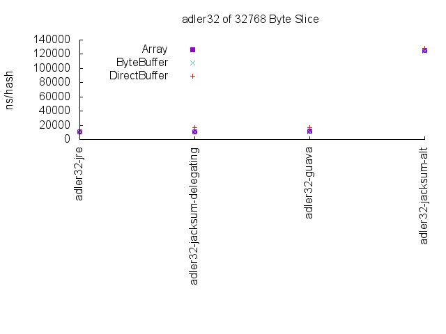

| Algorithm |  Array | ByteBuffer | DirectBuffer |
| --- | ---: | ---: | ---: | 
| [adler32-jre](#adler32-jre-latency) | 10935.838976 | 11101.898748 | 10965.672725 |
| [adler32-jacksum-delegating](#adler32-jacksum-delegating-latency) | 11006.900960 | 11115.116445 | 16438.498306 |
| [adler32-guava](#adler32-guava-latency) | 11400.320232 | 11067.221369 | 16661.466505 |
| [adler32-jacksum-alt](#adler32-jacksum-alt-latency) | 124887.089079 | 123951.365402 | 128694.368348 |

---
### 32768 Byte Slice Latency (city64)
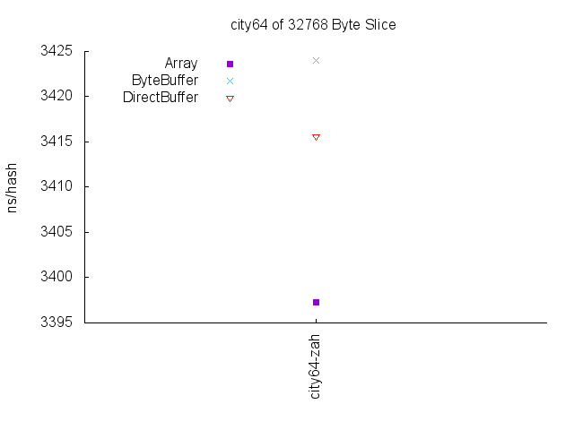

| Algorithm |  Array | ByteBuffer | DirectBuffer |
| --- | ---: | ---: | ---: | 
| [city64-zah](#city64-zah-latency) | 3397.235390 | 3424.056507 | 3415.590418 |

---
### 32768 Byte Slice Latency (cksum)
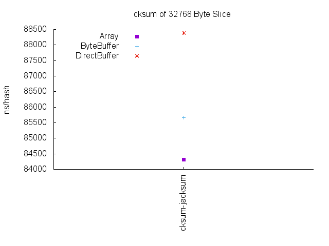

| Algorithm |  Array | ByteBuffer | DirectBuffer |
| --- | ---: | ---: | ---: | 
| [cksum-jacksum](#cksum-jacksum-latency) | 84309.489743 | 85672.132879 | 88383.039551 |

---
### 32768 Byte Slice Latency (crc16)
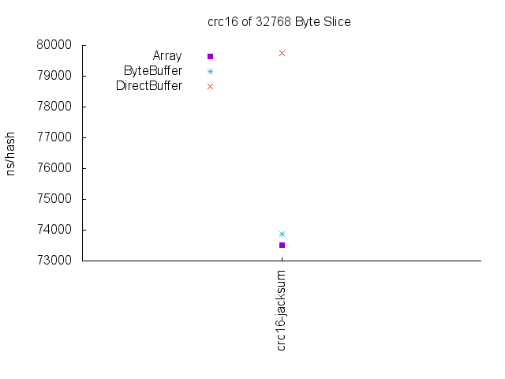

| Algorithm |  Array | ByteBuffer | DirectBuffer |
| --- | ---: | ---: | ---: | 
| [crc16-jacksum](#crc16-jacksum-latency) | 73518.118530 | 73865.346409 | 79750.292397 |

---
### 32768 Byte Slice Latency (crc24)
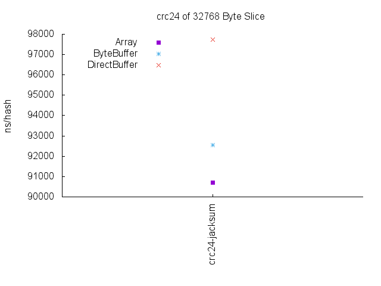

| Algorithm |  Array | ByteBuffer | DirectBuffer |
| --- | ---: | ---: | ---: | 
| [crc24-jacksum](#crc24-jacksum-latency) | 90701.388712 | 92556.776175 | 97737.740902 |

---
### 32768 Byte Slice Latency (crc32)
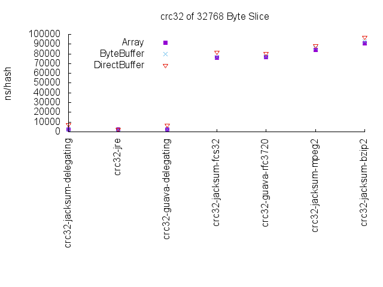

| Algorithm |  Array | ByteBuffer | DirectBuffer |
| --- | ---: | ---: | ---: | 
| [crc32-jacksum-delegating](#crc32-jacksum-delegating-latency) | 2373.006555 | 2360.502339 | 7088.865890 |
| [crc32-jre](#crc32-jre-latency) | 2392.692792 | 2388.823817 | 2409.643322 |
| [crc32-guava-delegating](#crc32-guava-delegating-latency) | 2456.551322 | 2409.889253 | 6708.242365 |
| [crc32-jacksum-fcs32](#crc32-jacksum-fcs32-latency) | 76156.819820 | 76884.596127 | 81679.500291 |
| [crc32-guava-rfc3720](#crc32-guava-rfc3720-latency) | 76606.083602 | 77069.186821 | 80327.192162 |
| [crc32-jacksum-mpeg2](#crc32-jacksum-mpeg2-latency) | 84262.699880 | 85669.327275 | 88600.719600 |
| [crc32-jacksum-bzip2](#crc32-jacksum-bzip2-latency) | 90692.141347 | 92820.569238 | 97213.020560 |

---
### 32768 Byte Slice Latency (crc64)
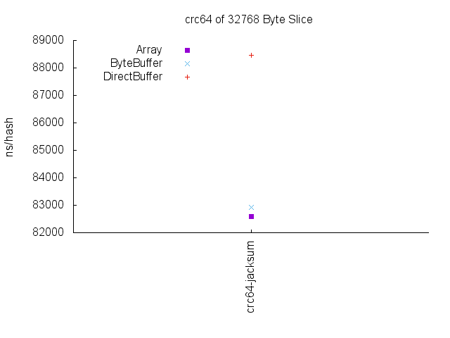

| Algorithm |  Array | ByteBuffer | DirectBuffer |
| --- | ---: | ---: | ---: | 
| [crc64-jacksum](#crc64-jacksum-latency) | 82597.758600 | 82915.567579 | 88473.364625 |

---
### 32768 Byte Slice Latency (crc8)

| Algorithm |  Array | ByteBuffer | DirectBuffer |
| --- | ---: | ---: | ---: | 
| [crc8-jacksum](#crc8-jacksum-latency) | 62883.215564 | 61258.684093 | 68819.656407 |

---
### 32768 Byte Slice Latency (ed2k)
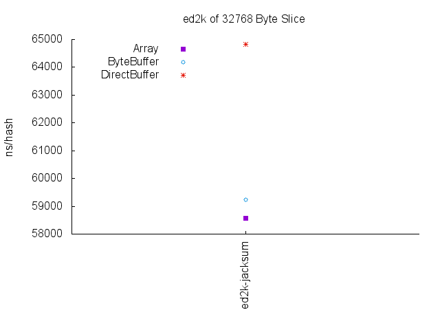

| Algorithm |  Array | ByteBuffer | DirectBuffer |
| --- | ---: | ---: | ---: | 
| [ed2k-jacksum](#ed2k-jacksum-latency) | 58564.264353 | 59238.497692 | 64816.471004 |

---
### 32768 Byte Slice Latency (elf)
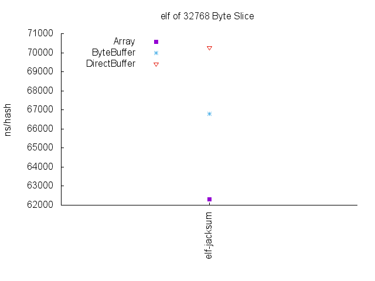

| Algorithm |  Array | ByteBuffer | DirectBuffer |
| --- | ---: | ---: | ---: | 
| [elf-jacksum](#elf-jacksum-latency) | 62320.483335 | 66782.048611 | 70269.157957 |

---
### 32768 Byte Slice Latency (farmna)
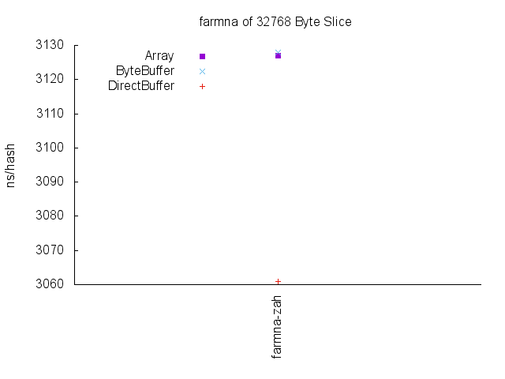

| Algorithm |  Array | ByteBuffer | DirectBuffer |
| --- | ---: | ---: | ---: | 
| [farmna-zah](#farmna-zah-latency) | 3126.940982 | 3127.917852 | 3060.876326 |

---
### 32768 Byte Slice Latency (farmuo)
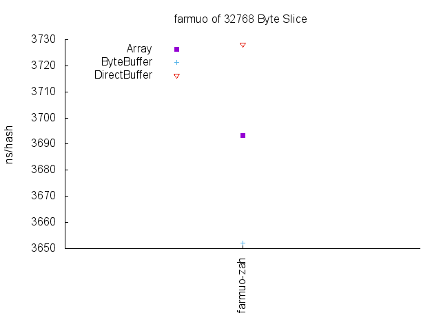

| Algorithm |  Array | ByteBuffer | DirectBuffer |
| --- | ---: | ---: | ---: | 
| [farmuo-zah](#farmuo-zah-latency) | 3693.234677 | 3652.234778 | 3728.080262 |

---
### 32768 Byte Slice Latency (fcs16)
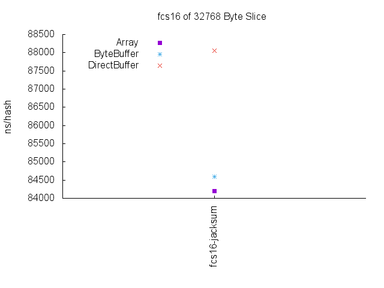

| Algorithm |  Array | ByteBuffer | DirectBuffer |
| --- | ---: | ---: | ---: | 
| [fcs16-jacksum](#fcs16-jacksum-latency) | 84190.643652 | 84599.557901 | 88059.040998 |

---
### 32768 Byte Slice Latency (gfh32)
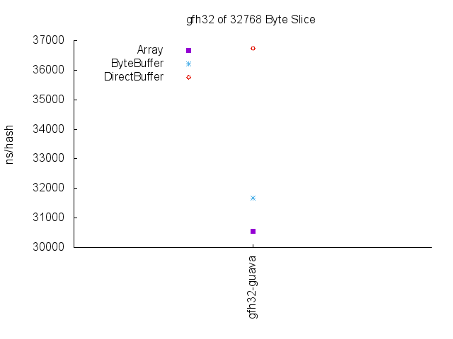

| Algorithm |  Array | ByteBuffer | DirectBuffer |
| --- | ---: | ---: | ---: | 
| [gfh32-guava](#gfh32-guava-latency) | 30554.379803 | 31680.944315 | 36744.359588 |

---
### 32768 Byte Slice Latency (gfh64)

| Algorithm |  Array | ByteBuffer | DirectBuffer |
| --- | ---: | ---: | ---: | 
| [gfh64-guava](#gfh64-guava-latency) | 21569.088387 | 21931.211083 | 26705.958281 |

---
### 32768 Byte Slice Latency (has160)
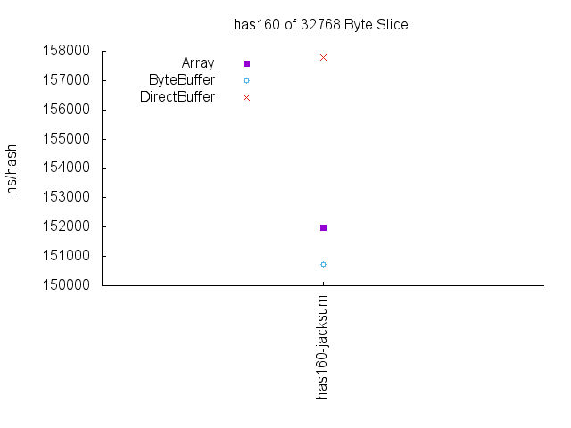

| Algorithm |  Array | ByteBuffer | DirectBuffer |
| --- | ---: | ---: | ---: | 
| [has160-jacksum](#has160-jacksum-latency) | 151971.252990 | 150715.825604 | 157785.822465 |

---
### 32768 Byte Slice Latency (haval128h3)
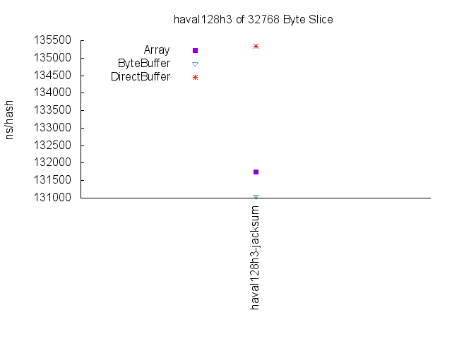

| Algorithm |  Array | ByteBuffer | DirectBuffer |
| --- | ---: | ---: | ---: | 
| [haval128h3-jacksum](#haval128h3-jacksum-latency) | 131749.883370 | 131038.093574 | 135341.860233 |

---
### 32768 Byte Slice Latency (haval128h4)

| Algorithm |  Array | ByteBuffer | DirectBuffer |
| --- | ---: | ---: | ---: | 
| [haval128h4-jacksum](#haval128h4-jacksum-latency) | 180515.498864 | 182786.809382 | 187739.480278 |

---
### 32768 Byte Slice Latency (haval128h5)
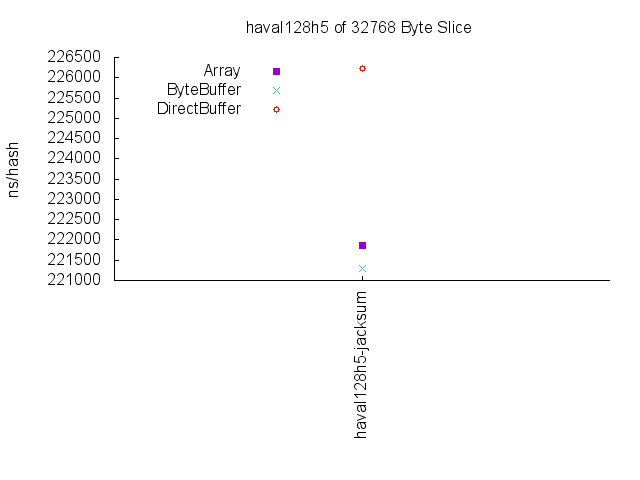

| Algorithm |  Array | ByteBuffer | DirectBuffer |
| --- | ---: | ---: | ---: | 
| [haval128h5-jacksum](#haval128h5-jacksum-latency) | 221865.524487 | 221286.202244 | 226238.744793 |

---
### 32768 Byte Slice Latency (haval160h3)
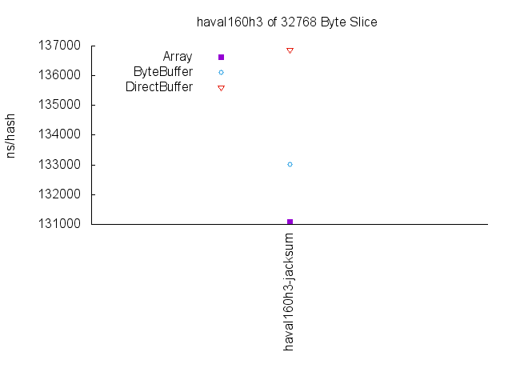

| Algorithm |  Array | ByteBuffer | DirectBuffer |
| --- | ---: | ---: | ---: | 
| [haval160h3-jacksum](#haval160h3-jacksum-latency) | 131074.786350 | 133029.502280 | 136875.130767 |

---
### 32768 Byte Slice Latency (haval160h4)
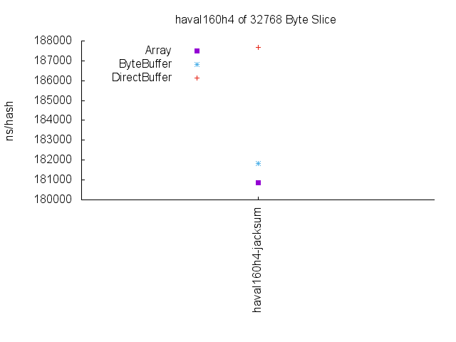

| Algorithm |  Array | ByteBuffer | DirectBuffer |
| --- | ---: | ---: | ---: | 
| [haval160h4-jacksum](#haval160h4-jacksum-latency) | 180866.105006 | 181842.700795 | 187662.544465 |

---
### 32768 Byte Slice Latency (haval160h5)
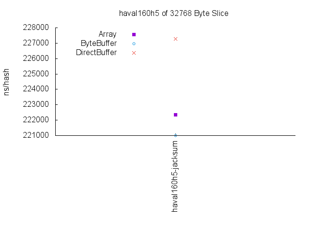

| Algorithm |  Array | ByteBuffer | DirectBuffer |
| --- | ---: | ---: | ---: | 
| [haval160h5-jacksum](#haval160h5-jacksum-latency) | 222357.244753 | 221006.751912 | 227285.382208 |

---
### 32768 Byte Slice Latency (haval192h3)
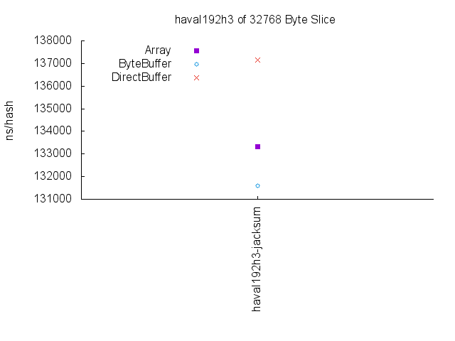

| Algorithm |  Array | ByteBuffer | DirectBuffer |
| --- | ---: | ---: | ---: | 
| [haval192h3-jacksum](#haval192h3-jacksum-latency) | 133332.954400 | 131598.484068 | 137151.380180 |

---
### 32768 Byte Slice Latency (haval192h4)
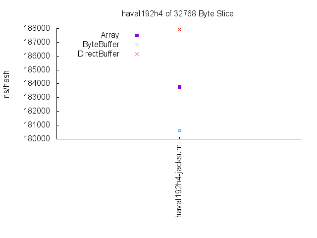

| Algorithm |  Array | ByteBuffer | DirectBuffer |
| --- | ---: | ---: | ---: | 
| [haval192h4-jacksum](#haval192h4-jacksum-latency) | 183776.876987 | 180593.072032 | 187931.328954 |

---
### 32768 Byte Slice Latency (haval192h5)
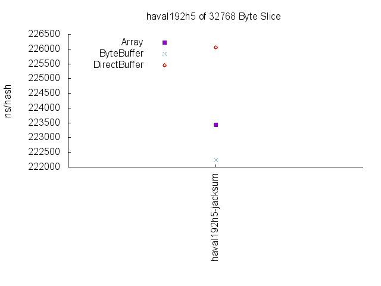

| Algorithm |  Array | ByteBuffer | DirectBuffer |
| --- | ---: | ---: | ---: | 
| [haval192h5-jacksum](#haval192h5-jacksum-latency) | 223430.092891 | 222245.089049 | 226047.703224 |

---
### 32768 Byte Slice Latency (haval224h3)
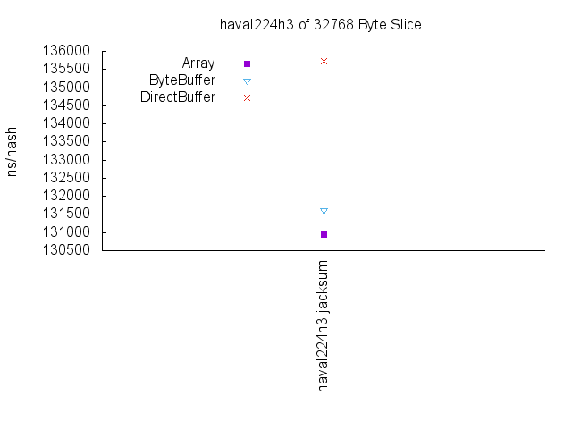

| Algorithm |  Array | ByteBuffer | DirectBuffer |
| --- | ---: | ---: | ---: | 
| [haval224h3-jacksum](#haval224h3-jacksum-latency) | 130945.735456 | 131605.722204 | 135729.393140 |

---
### 32768 Byte Slice Latency (haval224h4)

| Algorithm |  Array | ByteBuffer | DirectBuffer |
| --- | ---: | ---: | ---: | 
| [haval224h4-jacksum](#haval224h4-jacksum-latency) | 181812.600993 | 181590.523690 | 184987.710390 |

---
### 32768 Byte Slice Latency (haval224h5)
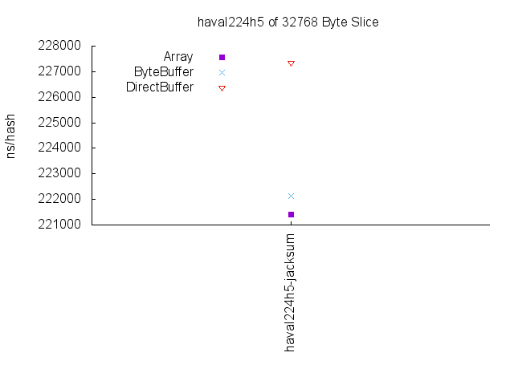

| Algorithm |  Array | ByteBuffer | DirectBuffer |
| --- | ---: | ---: | ---: | 
| [haval224h5-jacksum](#haval224h5-jacksum-latency) | 221414.960243 | 222136.780118 | 227340.684646 |

---
### 32768 Byte Slice Latency (haval256h3)
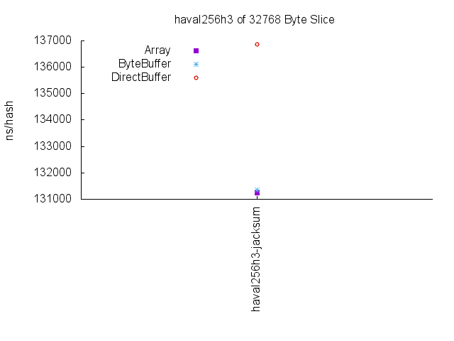

| Algorithm |  Array | ByteBuffer | DirectBuffer |
| --- | ---: | ---: | ---: | 
| [haval256h3-jacksum](#haval256h3-jacksum-latency) | 131255.161245 | 131345.958325 | 136874.034860 |

---
### 32768 Byte Slice Latency (haval256h4)
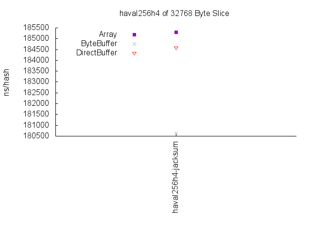

| Algorithm |  Array | ByteBuffer | DirectBuffer |
| --- | ---: | ---: | ---: | 
| [haval256h4-jacksum](#haval256h4-jacksum-latency) | 185293.907924 | 180625.296358 | 184582.830958 |

---
### 32768 Byte Slice Latency (haval256h5)

| Algorithm |  Array | ByteBuffer | DirectBuffer |
| --- | ---: | ---: | ---: | 
| [haval256h5-jacksum](#haval256h5-jacksum-latency) | 222430.403721 | 223314.111892 | 231989.893601 |

---
### 32768 Byte Slice Latency (md2)

| Algorithm |  Array | ByteBuffer | DirectBuffer |
| --- | ---: | ---: | ---: | 
| [md2-jacksum](#md2-jacksum-latency) | 80804.734134 | 79460.259638 | 83601.040666 |

---
### 32768 Byte Slice Latency (md4)
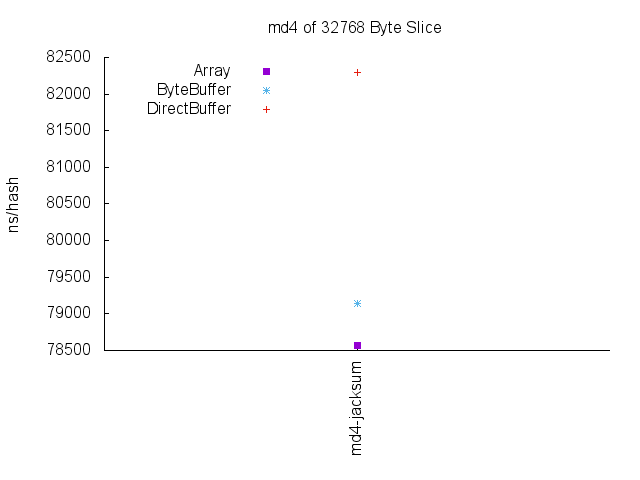

| Algorithm |  Array | ByteBuffer | DirectBuffer |
| --- | ---: | ---: | ---: | 
| [md4-jacksum](#md4-jacksum-latency) | 78573.968517 | 79135.594711 | 82291.131483 |

---
### 32768 Byte Slice Latency (md5)
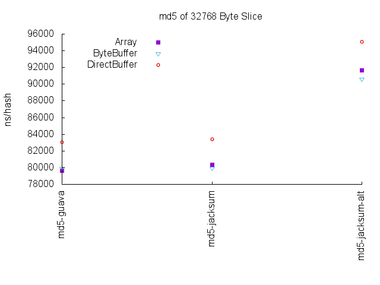

| Algorithm |  Array | ByteBuffer | DirectBuffer |
| --- | ---: | ---: | ---: | 
| [md5-guava](#md5-guava-latency) | 79634.153477 | 79892.190329 | 83064.133636 |
| [md5-jacksum](#md5-jacksum-latency) | 80322.456818 | 79893.333187 | 83386.714510 |
| [md5-jacksum-alt](#md5-jacksum-alt-latency) | 91659.617185 | 90579.724374 | 95094.118569 |

---
### 32768 Byte Slice Latency (murmur3h128)
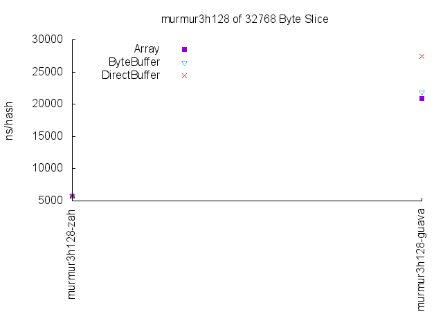

| Algorithm |  Array | ByteBuffer | DirectBuffer |
| --- | ---: | ---: | ---: | 
| [murmur3h128-zah](#murmur3h128-zah-latency) | 5796.128653 | 5728.650272 | 5707.720237 |
| [murmur3h128-guava](#murmur3h128-guava-latency) | 20920.368886 | 21826.181676 | 27449.503909 |

---
### 32768 Byte Slice Latency (murmur3h32)
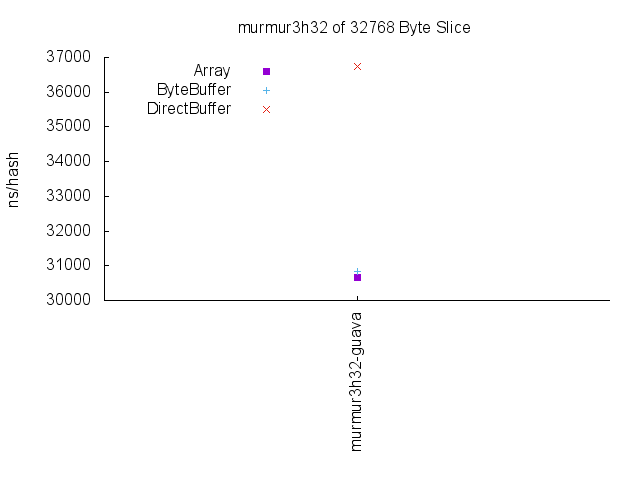

| Algorithm |  Array | ByteBuffer | DirectBuffer |
| --- | ---: | ---: | ---: | 
| [murmur3h32-guava](#murmur3h32-guava-latency) | 30666.225098 | 30822.745406 | 36732.251207 |

---
### 32768 Byte Slice Latency (ripemd128)
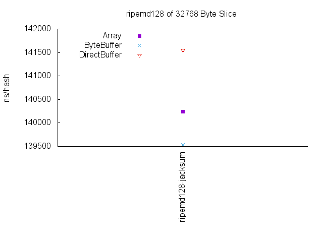

| Algorithm |  Array | ByteBuffer | DirectBuffer |
| --- | ---: | ---: | ---: | 
| [ripemd128-jacksum](#ripemd128-jacksum-latency) | 140236.419214 | 139532.606261 | 141551.473371 |

---
### 32768 Byte Slice Latency (ripemd160)
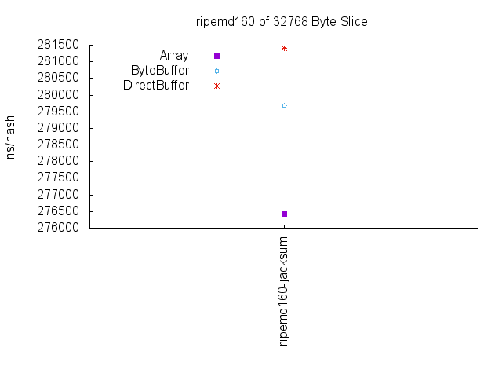

| Algorithm |  Array | ByteBuffer | DirectBuffer |
| --- | ---: | ---: | ---: | 
| [ripemd160-jacksum](#ripemd160-jacksum-latency) | 276425.173384 | 279673.334709 | 281397.094909 |

---
### 32768 Byte Slice Latency (ripemd256)
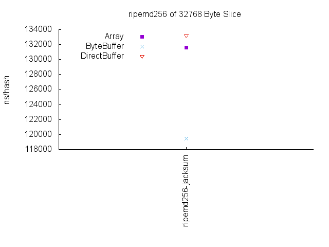

| Algorithm |  Array | ByteBuffer | DirectBuffer |
| --- | ---: | ---: | ---: | 
| [ripemd256-jacksum](#ripemd256-jacksum-latency) | 131582.707490 | 119421.376291 | 133187.718908 |

---
### 32768 Byte Slice Latency (ripemd320)
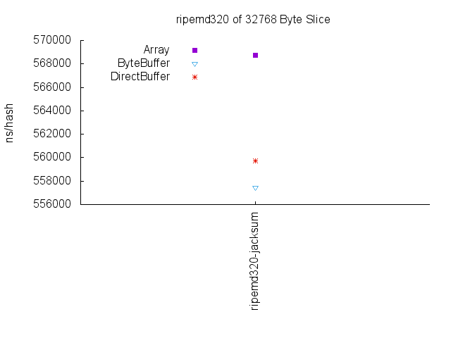

| Algorithm |  Array | ByteBuffer | DirectBuffer |
| --- | ---: | ---: | ---: | 
| [ripemd320-jacksum](#ripemd320-jacksum-latency) | 568719.585664 | 557461.191434 | 559696.230767 |

---
### 32768 Byte Slice Latency (sha0)
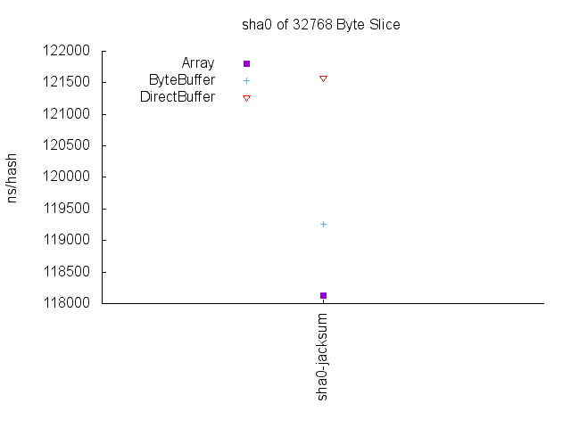

| Algorithm |  Array | ByteBuffer | DirectBuffer |
| --- | ---: | ---: | ---: | 
| [sha0-jacksum](#sha0-jacksum-latency) | 118134.003856 | 119257.461026 | 121571.113691 |

---
### 32768 Byte Slice Latency (sha1)
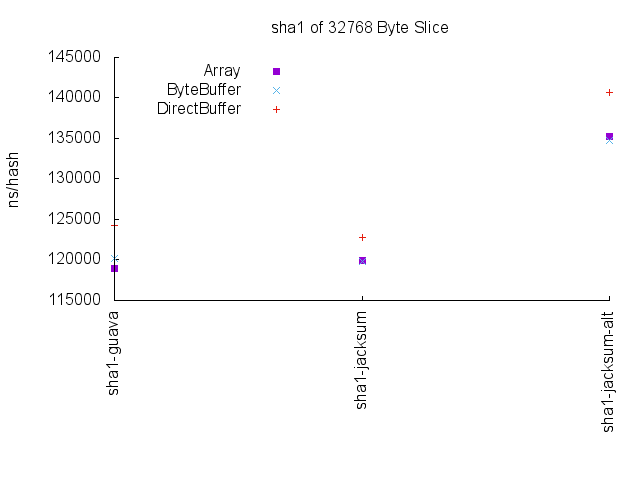

| Algorithm |  Array | ByteBuffer | DirectBuffer |
| --- | ---: | ---: | ---: | 
| [sha1-guava](#sha1-guava-latency) | 118934.622412 | 120177.764297 | 124257.144559 |
| [sha1-jacksum](#sha1-jacksum-latency) | 119920.715576 | 119823.806391 | 122814.244994 |
| [sha1-jacksum-alt](#sha1-jacksum-alt-latency) | 135247.952858 | 134703.463216 | 140703.426854 |

---
### 32768 Byte Slice Latency (sha224)

| Algorithm |  Array | ByteBuffer | DirectBuffer |
| --- | ---: | ---: | ---: | 
| [sha224-jacksum](#sha224-jacksum-latency) | 203296.797490 | 203706.474945 | 206278.540594 |

---
### 32768 Byte Slice Latency (sha256)
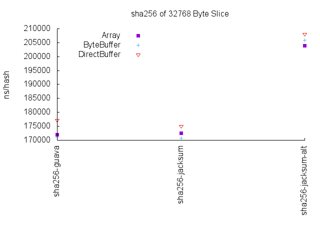

| Algorithm |  Array | ByteBuffer | DirectBuffer |
| --- | ---: | ---: | ---: | 
| [sha256-guava](#sha256-guava-latency) | 172051.807930 | 171095.232587 | 177118.537191 |
| [sha256-jacksum](#sha256-jacksum-latency) | 172491.802220 | 170785.995771 | 175062.108524 |
| [sha256-jacksum-alt](#sha256-jacksum-alt-latency) | 203845.090613 | 205831.978523 | 207960.332390 |

---
### 32768 Byte Slice Latency (sha384)
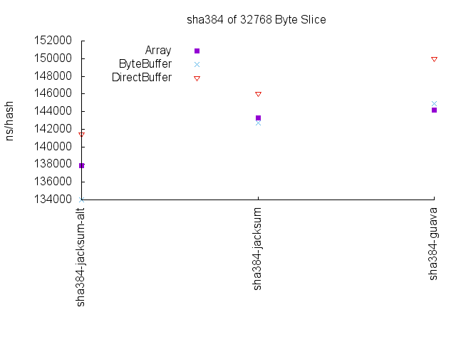

| Algorithm |  Array | ByteBuffer | DirectBuffer |
| --- | ---: | ---: | ---: | 
| [sha384-jacksum-alt](#sha384-jacksum-alt-latency) | 137880.627441 | 134000.676581 | 141423.113514 |
| [sha384-jacksum](#sha384-jacksum-latency) | 143251.884694 | 142683.963047 | 146042.738316 |
| [sha384-guava](#sha384-guava-latency) | 144146.118825 | 144874.223483 | 150015.409692 |

---
### 32768 Byte Slice Latency (sha512)
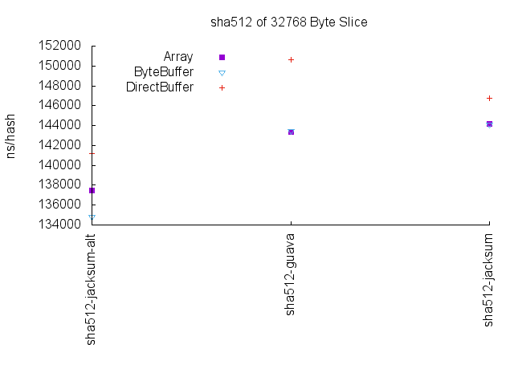

| Algorithm |  Array | ByteBuffer | DirectBuffer |
| --- | ---: | ---: | ---: | 
| [sha512-jacksum-alt](#sha512-jacksum-alt-latency) | 137476.838308 | 134810.582688 | 141159.256494 |
| [sha512-guava](#sha512-guava-latency) | 143397.961763 | 143419.727407 | 150624.046118 |
| [sha512-jacksum](#sha512-jacksum-latency) | 144180.681881 | 144066.890476 | 146727.971877 |

---
### 32768 Byte Slice Latency (sip)
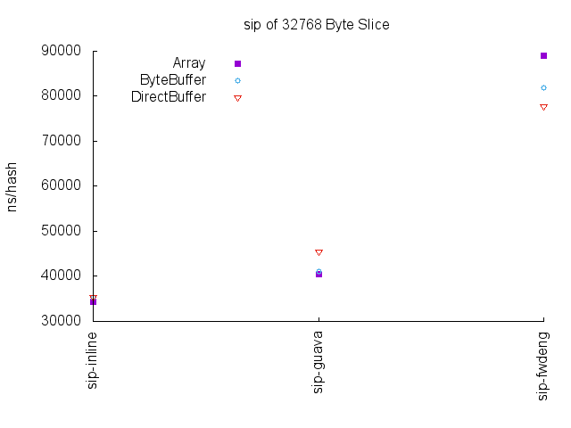

| Algorithm |  Array | ByteBuffer | DirectBuffer |
| --- | ---: | ---: | ---: | 
| [sip-inline](#sip-inline-latency) | 34324.080030 | 35274.317648 | 35427.059449 |
| [sip-guava](#sip-guava-latency) | 40568.415183 | 40997.839336 | 45416.498696 |
| [sip-fwdeng](#sip-fwdeng-latency) | 89060.582112 | 81911.085543 | 77683.766786 |

---
### 32768 Byte Slice Latency (sum16)
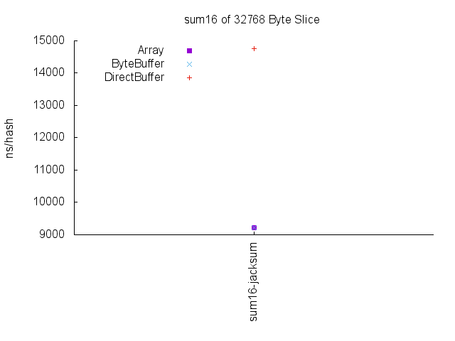

| Algorithm |  Array | ByteBuffer | DirectBuffer |
| --- | ---: | ---: | ---: | 
| [sum16-jacksum](#sum16-jacksum-latency) | 9226.440079 | 9230.296384 | 14749.121967 |

---
### 32768 Byte Slice Latency (sum24)
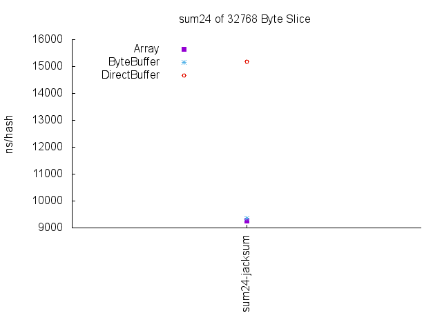

| Algorithm |  Array | ByteBuffer | DirectBuffer |
| --- | ---: | ---: | ---: | 
| [sum24-jacksum](#sum24-jacksum-latency) | 9251.620421 | 9363.203108 | 15177.482637 |

---
### 32768 Byte Slice Latency (sum32)
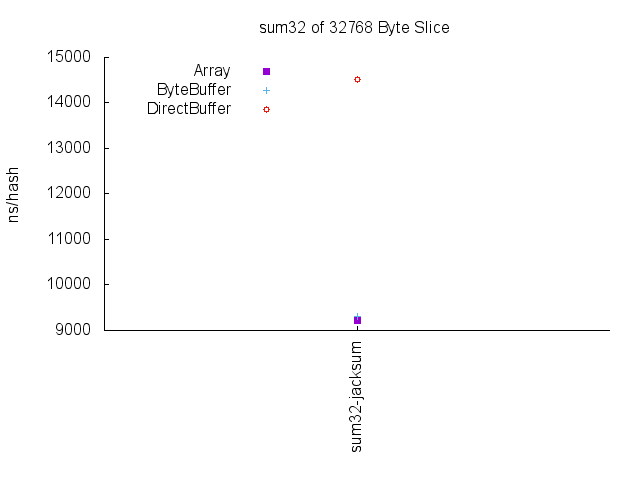

| Algorithm |  Array | ByteBuffer | DirectBuffer |
| --- | ---: | ---: | ---: | 
| [sum32-jacksum](#sum32-jacksum-latency) | 9212.574735 | 9305.460017 | 14519.445463 |

---
### 32768 Byte Slice Latency (sum8)
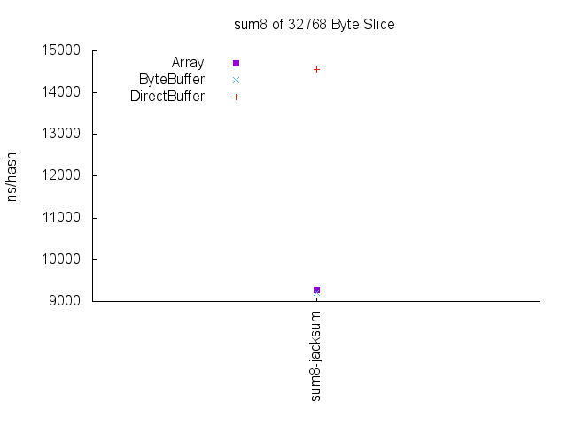

| Algorithm |  Array | ByteBuffer | DirectBuffer |
| --- | ---: | ---: | ---: | 
| [sum8-jacksum](#sum8-jacksum-latency) | 9269.532966 | 9211.144379 | 14550.850010 |

---
### 32768 Byte Slice Latency (sumbsd)

| Algorithm |  Array | ByteBuffer | DirectBuffer |
| --- | ---: | ---: | ---: | 
| [sumbsd-jacksum](#sumbsd-jacksum-latency) | 39445.281528 | 39829.813133 | 45753.035340 |

---
### 32768 Byte Slice Latency (sumsysv)
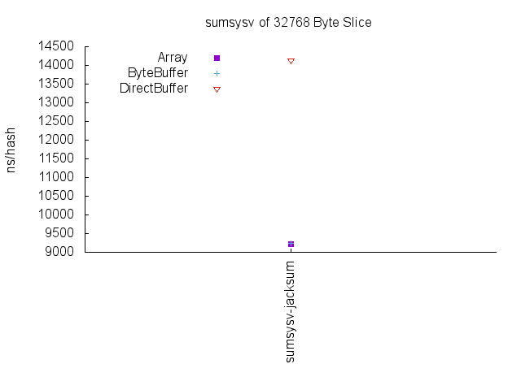

| Algorithm |  Array | ByteBuffer | DirectBuffer |
| --- | ---: | ---: | ---: | 
| [sumsysv-jacksum](#sumsysv-jacksum-latency) | 9223.817815 | 9240.893394 | 14134.740867 |

---
### 32768 Byte Slice Latency (tiger)
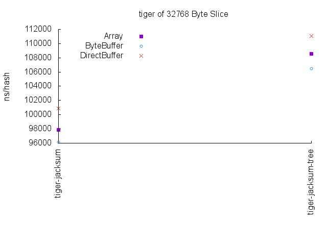

| Algorithm |  Array | ByteBuffer | DirectBuffer |
| --- | ---: | ---: | ---: | 
| [tiger-jacksum](#tiger-jacksum-latency) | 97863.983290 | 96132.570251 | 100905.306578 |
| [tiger-jacksum-tree](#tiger-jacksum-tree-latency) | 108590.350997 | 106460.094247 | 111051.543187 |

---
### 32768 Byte Slice Latency (tiger128)
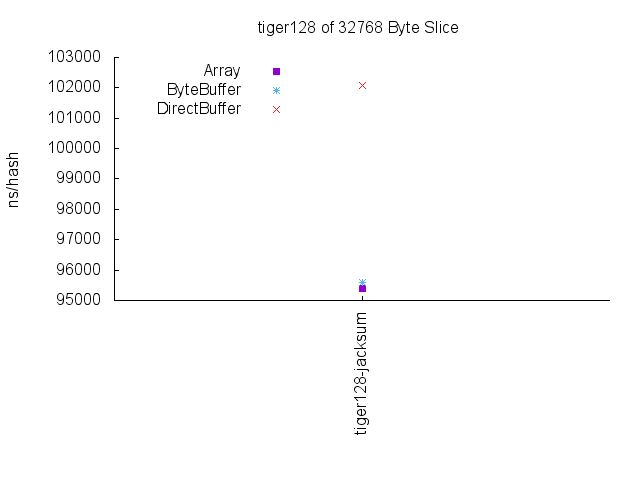

| Algorithm |  Array | ByteBuffer | DirectBuffer |
| --- | ---: | ---: | ---: | 
| [tiger128-jacksum](#tiger128-jacksum-latency) | 95383.855164 | 95605.476538 | 102092.319994 |

---
### 32768 Byte Slice Latency (tiger160)
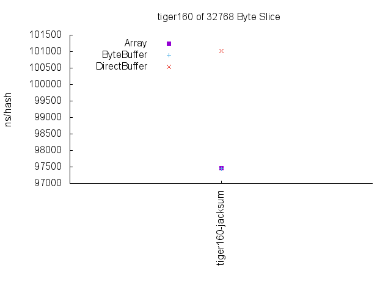

| Algorithm |  Array | ByteBuffer | DirectBuffer |
| --- | ---: | ---: | ---: | 
| [tiger160-jacksum](#tiger160-jacksum-latency) | 97472.107392 | 97441.630340 | 101024.946153 |

---
### 32768 Byte Slice Latency (tiger2)
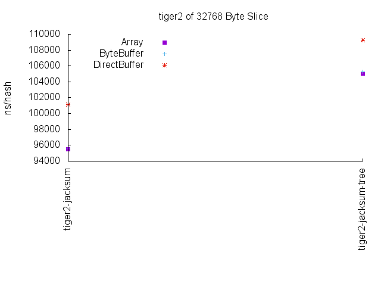

| Algorithm |  Array | ByteBuffer | DirectBuffer |
| --- | ---: | ---: | ---: | 
| [tiger2-jacksum](#tiger2-jacksum-latency) | 95498.042368 | 95628.782424 | 101110.096770 |
| [tiger2-jacksum-tree](#tiger2-jacksum-tree-latency) | 105007.806929 | 105262.562470 | 109222.012433 |

---
### 32768 Byte Slice Latency (whirlpool0)

| Algorithm |  Array | ByteBuffer | DirectBuffer |
| --- | ---: | ---: | ---: | 
| [whirlpool0-jacksum](#whirlpool0-jacksum-latency) | 484853.172821 | 482709.702055 | 483830.076007 |

---
### 32768 Byte Slice Latency (whirlpool1)
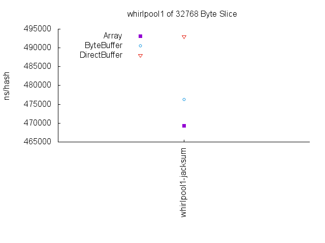

| Algorithm |  Array | ByteBuffer | DirectBuffer |
| --- | ---: | ---: | ---: | 
| [whirlpool1-jacksum](#whirlpool1-jacksum-latency) | 469321.607481 | 476308.109970 | 492983.249682 |

---
### 32768 Byte Slice Latency (whirlpool2)
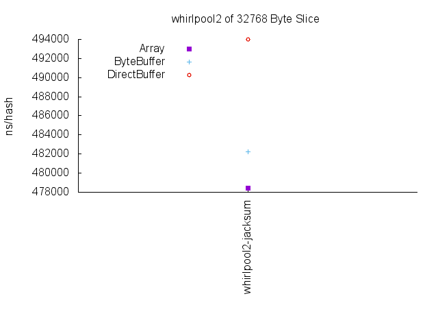

| Algorithm |  Array | ByteBuffer | DirectBuffer |
| --- | ---: | ---: | ---: | 
| [whirlpool2-jacksum](#whirlpool2-jacksum-latency) | 478422.470851 | 482213.507531 | 493999.113663 |

---
### 32768 Byte Slice Latency (xor8)
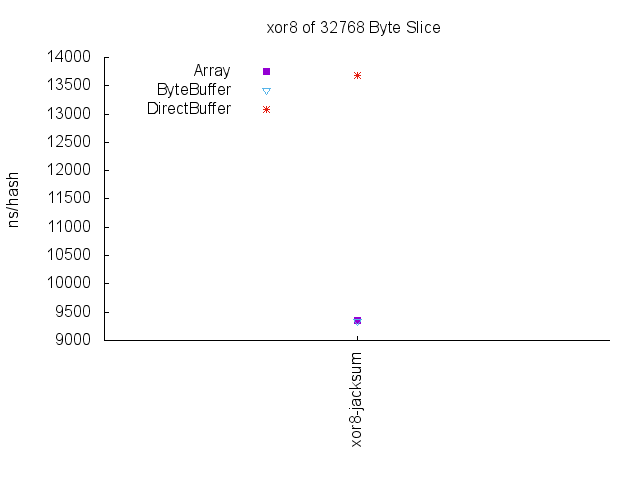

| Algorithm |  Array | ByteBuffer | DirectBuffer |
| --- | ---: | ---: | ---: | 
| [xor8-jacksum](#xor8-jacksum-latency) | 9345.208621 | 9340.359615 | 13674.804599 |

---
### 32768 Byte Slice Latency (xxh32)
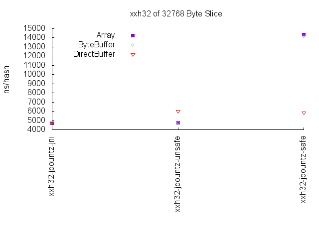

| Algorithm |  Array | ByteBuffer | DirectBuffer |
| --- | ---: | ---: | ---: | 
| [xxh32-jpountz-jni](#xxh32-jpountz-jni-latency) | 4726.984984 | 4771.456709 | 4709.882284 |
| [xxh32-jpountz-unsafe](#xxh32-jpountz-unsafe-latency) | 4746.235647 | 4759.289277 | 5980.843144 |
| [xxh32-jpountz-safe](#xxh32-jpountz-safe-latency) | 14356.302721 | 14175.332994 | 5822.125330 |

---
### 32768 Byte Slice Latency (xxh64)
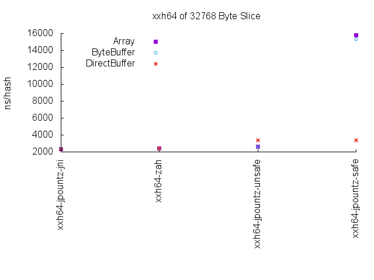

| Algorithm |  Array | ByteBuffer | DirectBuffer |
| --- | ---: | ---: | ---: | 
| [xxh64-jpountz-jni](#xxh64-jpountz-jni-latency) | 2376.727740 | 2388.643764 | 2369.197092 |
| [xxh64-zah](#xxh64-zah-latency) | 2424.245503 | 2416.293540 | 2399.143768 |
| [xxh64-jpountz-unsafe](#xxh64-jpountz-unsafe-latency) | 2647.459702 | 2621.075569 | 3371.275595 |
| [xxh64-jpountz-safe](#xxh64-jpountz-safe-latency) | 15800.760205 | 15291.107410 | 3377.818593 |

---
### adler32-guava Latency
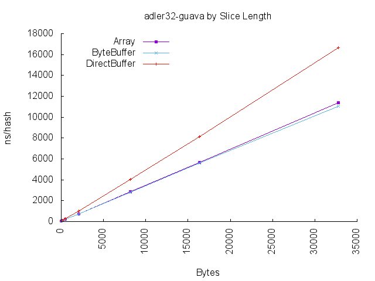

| Length |  Array | ByteBuffer | DirectBuffer |
| --- | ---: | ---: | ---: | 
| [32](#32-byte-slice-latency-all-hashes) | 69.387822 | 67.847562 | 84.528853 |
| [128](#128-byte-slice-latency-all-hashes) | 101.827596 | 102.324262 | 122.982687 |
| [512](#512-byte-slice-latency-all-hashes) | 224.370496 | 223.635692 | 303.167272 |
| [2048](#2048-byte-slice-latency-all-hashes) | 726.813082 | 717.784714 | 1022.966067 |
| [8192](#8192-byte-slice-latency-all-hashes) | 2858.050251 | 2780.950968 | 4043.849210 |
| [16384](#16384-byte-slice-latency-all-hashes) | 5652.990245 | 5580.719261 | 8119.035672 |
| [32768](#32768-byte-slice-latency-all-hashes) | 11400.320232 | 11067.221369 | 16661.466505 |

---
### adler32-jacksum-alt Latency
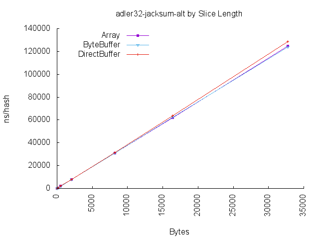

| Length |  Array | ByteBuffer | DirectBuffer |
| --- | ---: | ---: | ---: | 
| [32](#32-byte-slice-latency-all-hashes) | 125.065730 | 124.659796 | 151.294472 |
| [128](#128-byte-slice-latency-all-hashes) | 496.730027 | 492.458899 | 514.466553 |
| [512](#512-byte-slice-latency-all-hashes) | 1976.086435 | 1951.175594 | 2009.820758 |
| [2048](#2048-byte-slice-latency-all-hashes) | 7716.138095 | 7749.311217 | 8012.371271 |
| [8192](#8192-byte-slice-latency-all-hashes) | 30840.879900 | 30967.507381 | 31618.317059 |
| [16384](#16384-byte-slice-latency-all-hashes) | 62022.196353 | 62311.777877 | 63658.202028 |
| [32768](#32768-byte-slice-latency-all-hashes) | 124887.089079 | 123951.365402 | 128694.368348 |

---
### adler32-jacksum-delegating Latency
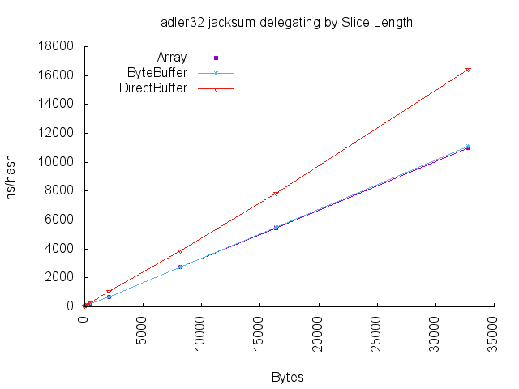

| Length |  Array | ByteBuffer | DirectBuffer |
| --- | ---: | ---: | ---: | 
| [32](#32-byte-slice-latency-all-hashes) | 54.912248 | 55.492258 | 80.182909 |
| [128](#128-byte-slice-latency-all-hashes) | 84.540693 | 84.650907 | 112.127371 |
| [512](#512-byte-slice-latency-all-hashes) | 207.189941 | 205.852885 | 281.483005 |
| [2048](#2048-byte-slice-latency-all-hashes) | 700.380319 | 696.439488 | 1045.296993 |
| [8192](#8192-byte-slice-latency-all-hashes) | 2742.872924 | 2740.505806 | 3881.446208 |
| [16384](#16384-byte-slice-latency-all-hashes) | 5466.404176 | 5503.934353 | 7826.924135 |
| [32768](#32768-byte-slice-latency-all-hashes) | 11006.900960 | 11115.116445 | 16438.498306 |

---
### adler32-jre Latency
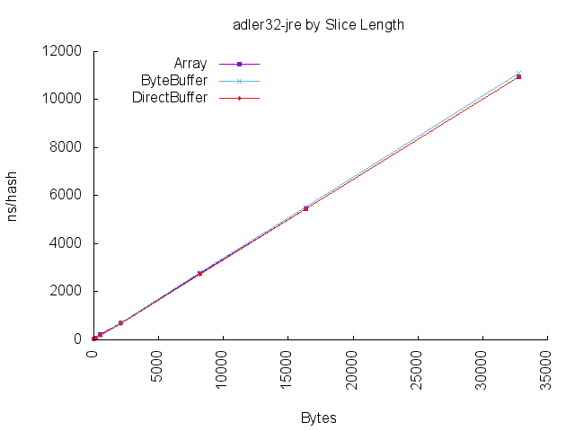

| Length |  Array | ByteBuffer | DirectBuffer |
| --- | ---: | ---: | ---: | 
| [32](#32-byte-slice-latency-all-hashes) | 53.353334 | 54.012816 | 31.828535 |
| [128](#128-byte-slice-latency-all-hashes) | 83.915528 | 83.576516 | 64.286745 |
| [512](#512-byte-slice-latency-all-hashes) | 207.799399 | 204.010960 | 185.079747 |
| [2048](#2048-byte-slice-latency-all-hashes) | 707.953173 | 704.966769 | 682.723571 |
| [8192](#8192-byte-slice-latency-all-hashes) | 2752.644039 | 2800.397394 | 2743.713579 |
| [16384](#16384-byte-slice-latency-all-hashes) | 5466.687697 | 5532.292877 | 5456.374296 |
| [32768](#32768-byte-slice-latency-all-hashes) | 10935.838976 | 11101.898748 | 10965.672725 |

---
### city64-zah Latency
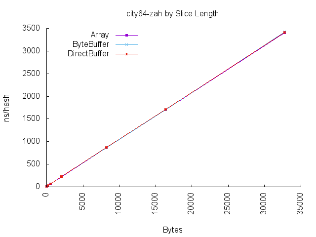

| Length |  Array | ByteBuffer | DirectBuffer |
| --- | ---: | ---: | ---: | 
| [32](#32-byte-slice-latency-all-hashes) | 9.326707 | 10.146933 | 10.373360 |
| [128](#128-byte-slice-latency-all-hashes) | 26.612126 | 27.798026 | 28.015368 |
| [512](#512-byte-slice-latency-all-hashes) | 69.231370 | 69.602286 | 69.792000 |
| [2048](#2048-byte-slice-latency-all-hashes) | 223.272456 | 226.746951 | 233.855028 |
| [8192](#8192-byte-slice-latency-all-hashes) | 860.743138 | 862.029907 | 873.589679 |
| [16384](#16384-byte-slice-latency-all-hashes) | 1704.066342 | 1703.182011 | 1714.235577 |
| [32768](#32768-byte-slice-latency-all-hashes) | 3397.235390 | 3424.056507 | 3415.590418 |

---
### cksum-jacksum Latency
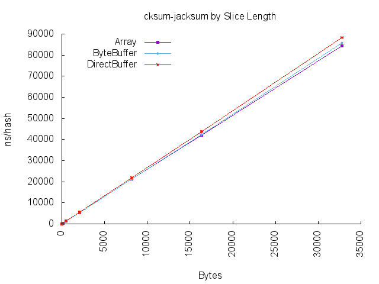

| Length |  Array | ByteBuffer | DirectBuffer |
| --- | ---: | ---: | ---: | 
| [32](#32-byte-slice-latency-all-hashes) | 83.359663 | 83.170251 | 106.563116 |
| [128](#128-byte-slice-latency-all-hashes) | 340.179690 | 336.941245 | 357.350457 |
| [512](#512-byte-slice-latency-all-hashes) | 1319.018686 | 1331.447405 | 1398.210618 |
| [2048](#2048-byte-slice-latency-all-hashes) | 5269.632368 | 5442.357988 | 5576.221041 |
| [8192](#8192-byte-slice-latency-all-hashes) | 21201.118872 | 21170.262549 | 21883.545244 |
| [16384](#16384-byte-slice-latency-all-hashes) | 42193.511134 | 42365.264921 | 43671.071578 |
| [32768](#32768-byte-slice-latency-all-hashes) | 84309.489743 | 85672.132879 | 88383.039551 |

---
### crc16-jacksum Latency
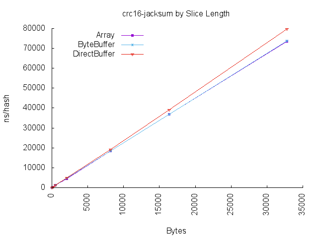

| Length |  Array | ByteBuffer | DirectBuffer |
| --- | ---: | ---: | ---: | 
| [32](#32-byte-slice-latency-all-hashes) | 69.134716 | 70.143725 | 93.920350 |
| [128](#128-byte-slice-latency-all-hashes) | 287.031619 | 285.234426 | 317.202058 |
| [512](#512-byte-slice-latency-all-hashes) | 1157.420040 | 1152.612693 | 1206.489524 |
| [2048](#2048-byte-slice-latency-all-hashes) | 4587.348921 | 4649.675517 | 4929.788513 |
| [8192](#8192-byte-slice-latency-all-hashes) | 18481.531587 | 18378.508370 | 19151.882989 |
| [16384](#16384-byte-slice-latency-all-hashes) | 36919.574596 | 36942.092547 | 39034.903852 |
| [32768](#32768-byte-slice-latency-all-hashes) | 73518.118530 | 73865.346409 | 79750.292397 |

---
### crc24-jacksum Latency
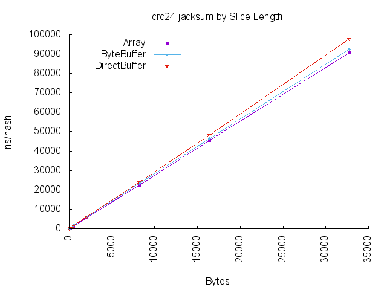

| Length |  Array | ByteBuffer | DirectBuffer |
| --- | ---: | ---: | ---: | 
| [32](#32-byte-slice-latency-all-hashes) | 88.097670 | 108.373728 | 112.382317 |
| [128](#128-byte-slice-latency-all-hashes) | 348.397315 | 433.920183 | 373.125696 |
| [512](#512-byte-slice-latency-all-hashes) | 1378.737920 | 1733.332307 | 1512.802402 |
| [2048](#2048-byte-slice-latency-all-hashes) | 5636.477966 | 5846.817125 | 6092.799992 |
| [8192](#8192-byte-slice-latency-all-hashes) | 22543.863910 | 23360.854925 | 24072.849346 |
| [16384](#16384-byte-slice-latency-all-hashes) | 45340.523622 | 46437.030693 | 48389.947571 |
| [32768](#32768-byte-slice-latency-all-hashes) | 90701.388712 | 92556.776175 | 97737.740902 |

---
### crc32-guava-delegating Latency
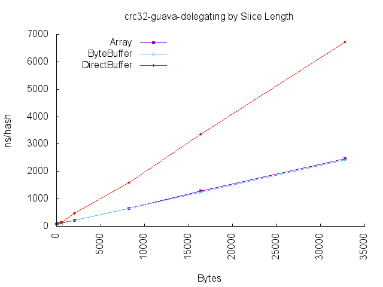

| Length |  Array | ByteBuffer | DirectBuffer |
| --- | ---: | ---: | ---: | 
| [32](#32-byte-slice-latency-all-hashes) | 78.280362 | 78.457713 | 71.944129 |
| [128](#128-byte-slice-latency-all-hashes) | 100.109533 | 98.772971 | 93.073651 |
| [512](#512-byte-slice-latency-all-hashes) | 120.502371 | 99.811633 | 138.120595 |
| [2048](#2048-byte-slice-latency-all-hashes) | 224.916320 | 227.189089 | 480.132917 |
| [8192](#8192-byte-slice-latency-all-hashes) | 663.562746 | 651.059033 | 1600.049372 |
| [16384](#16384-byte-slice-latency-all-hashes) | 1279.216085 | 1252.310794 | 3362.442151 |
| [32768](#32768-byte-slice-latency-all-hashes) | 2456.551322 | 2409.889253 | 6708.242365 |

---
### crc32-guava-rfc3720 Latency
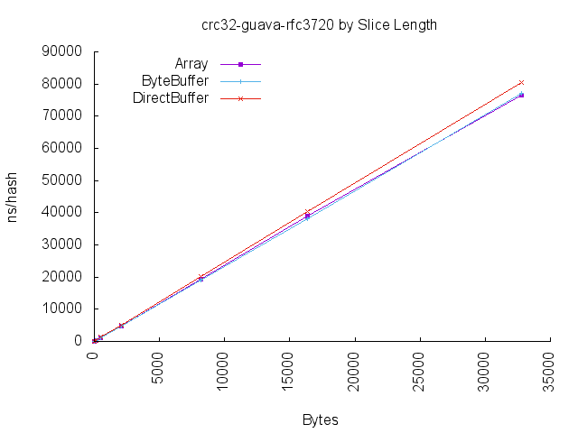

| Length |  Array | ByteBuffer | DirectBuffer |
| --- | ---: | ---: | ---: | 
| [32](#32-byte-slice-latency-all-hashes) | 89.806503 | 88.946488 | 104.048097 |
| [128](#128-byte-slice-latency-all-hashes) | 317.841135 | 313.390099 | 330.440148 |
| [512](#512-byte-slice-latency-all-hashes) | 1226.375247 | 1197.195021 | 1274.106174 |
| [2048](#2048-byte-slice-latency-all-hashes) | 4773.712325 | 4767.818767 | 5056.160761 |
| [8192](#8192-byte-slice-latency-all-hashes) | 19219.979770 | 19111.041084 | 20136.536123 |
| [16384](#16384-byte-slice-latency-all-hashes) | 38973.205909 | 38246.674825 | 40436.179555 |
| [32768](#32768-byte-slice-latency-all-hashes) | 76606.083602 | 77069.186821 | 80327.192162 |

---
### crc32-jacksum-bzip2 Latency
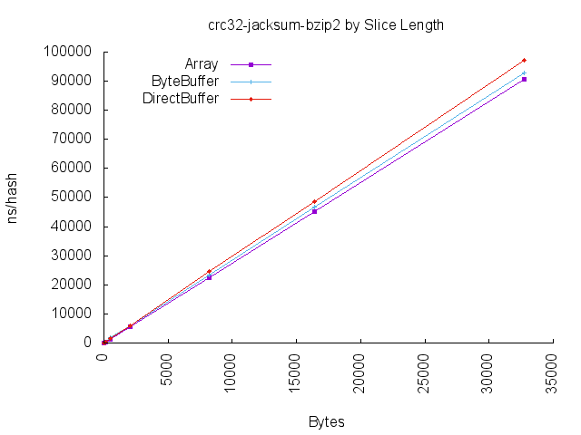

| Length |  Array | ByteBuffer | DirectBuffer |
| --- | ---: | ---: | ---: | 
| [32](#32-byte-slice-latency-all-hashes) | 88.588250 | 107.870111 | 110.301955 |
| [128](#128-byte-slice-latency-all-hashes) | 346.365925 | 430.468786 | 366.366071 |
| [512](#512-byte-slice-latency-all-hashes) | 1373.127344 | 1724.418651 | 1510.069904 |
| [2048](#2048-byte-slice-latency-all-hashes) | 5636.841291 | 5828.844770 | 6030.157935 |
| [8192](#8192-byte-slice-latency-all-hashes) | 22554.973602 | 23427.126601 | 24685.059025 |
| [16384](#16384-byte-slice-latency-all-hashes) | 45093.568112 | 46835.878841 | 48473.587978 |
| [32768](#32768-byte-slice-latency-all-hashes) | 90692.141347 | 92820.569238 | 97213.020560 |

---
### crc32-jacksum-delegating Latency
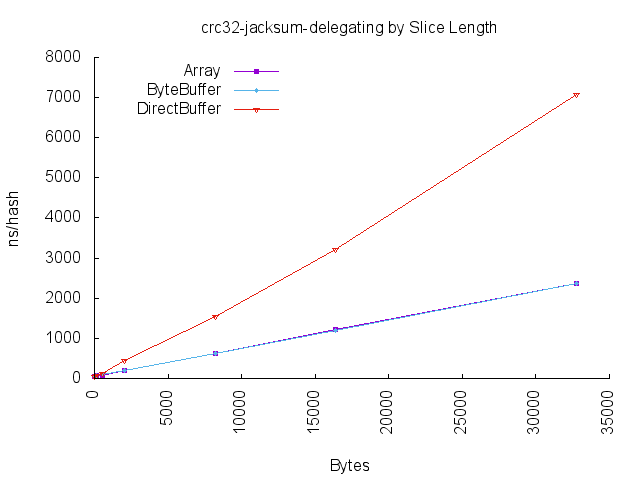

| Length |  Array | ByteBuffer | DirectBuffer |
| --- | ---: | ---: | ---: | 
| [32](#32-byte-slice-latency-all-hashes) | 53.559257 | 54.490318 | 61.020121 |
| [128](#128-byte-slice-latency-all-hashes) | 74.431243 | 75.401794 | 76.316084 |
| [512](#512-byte-slice-latency-all-hashes) | 85.869463 | 95.744330 | 131.073551 |
| [2048](#2048-byte-slice-latency-all-hashes) | 201.087027 | 203.358158 | 459.056940 |
| [8192](#8192-byte-slice-latency-all-hashes) | 624.472196 | 632.754723 | 1546.299817 |
| [16384](#16384-byte-slice-latency-all-hashes) | 1210.362387 | 1194.968434 | 3224.179940 |
| [32768](#32768-byte-slice-latency-all-hashes) | 2373.006555 | 2360.502339 | 7088.865890 |

---
### crc32-jacksum-fcs32 Latency
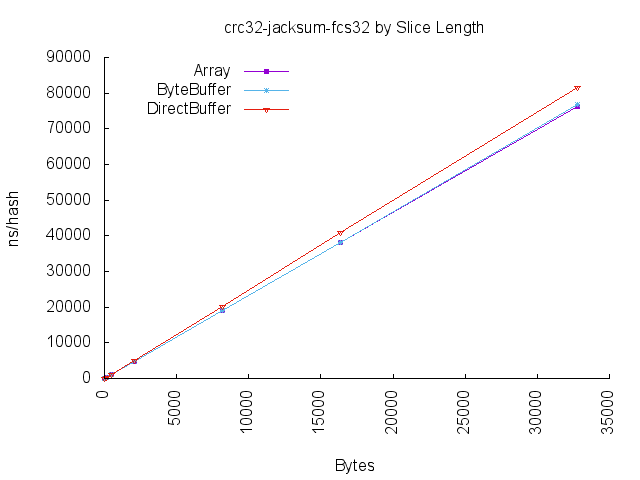

| Length |  Array | ByteBuffer | DirectBuffer |
| --- | ---: | ---: | ---: | 
| [32](#32-byte-slice-latency-all-hashes) | 73.775782 | 73.437470 | 98.940620 |
| [128](#128-byte-slice-latency-all-hashes) | 297.387705 | 295.602702 | 322.679335 |
| [512](#512-byte-slice-latency-all-hashes) | 1185.512625 | 1205.982786 | 1252.518913 |
| [2048](#2048-byte-slice-latency-all-hashes) | 4753.872878 | 4779.497430 | 5037.033532 |
| [8192](#8192-byte-slice-latency-all-hashes) | 18989.552091 | 19066.245352 | 20175.756429 |
| [16384](#16384-byte-slice-latency-all-hashes) | 38245.622785 | 38042.255477 | 40897.234682 |
| [32768](#32768-byte-slice-latency-all-hashes) | 76156.819820 | 76884.596127 | 81679.500291 |

---
### crc32-jacksum-mpeg2 Latency
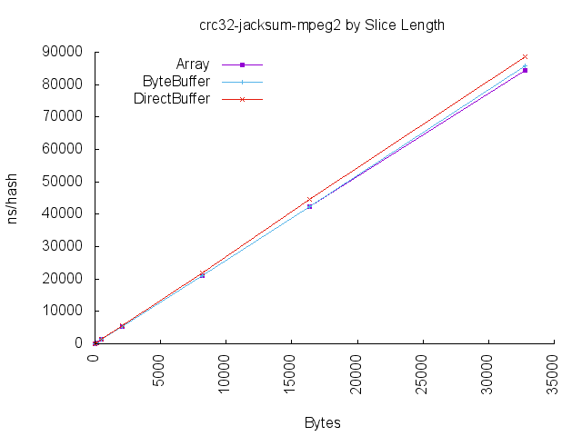

| Length |  Array | ByteBuffer | DirectBuffer |
| --- | ---: | ---: | ---: | 
| [32](#32-byte-slice-latency-all-hashes) | 79.130596 | 80.893618 | 105.377957 |
| [128](#128-byte-slice-latency-all-hashes) | 327.323635 | 327.326094 | 355.300732 |
| [512](#512-byte-slice-latency-all-hashes) | 1332.698552 | 1315.308604 | 1376.985526 |
| [2048](#2048-byte-slice-latency-all-hashes) | 5263.857815 | 5319.252668 | 5496.443114 |
| [8192](#8192-byte-slice-latency-all-hashes) | 21066.083107 | 21055.773040 | 21731.500605 |
| [16384](#16384-byte-slice-latency-all-hashes) | 42331.132613 | 42357.288807 | 44459.010828 |
| [32768](#32768-byte-slice-latency-all-hashes) | 84262.699880 | 85669.327275 | 88600.719600 |

---
### crc32-jre Latency
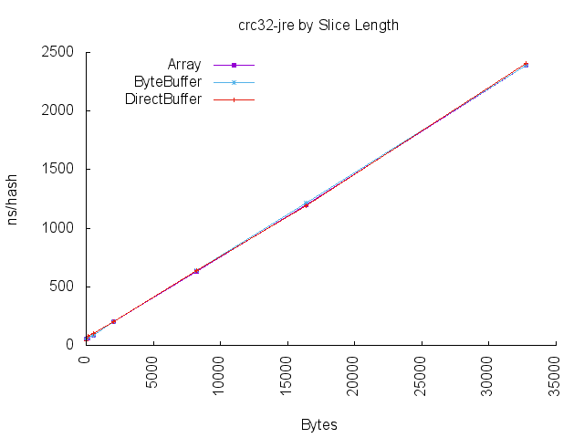

| Length |  Array | ByteBuffer | DirectBuffer |
| --- | ---: | ---: | ---: | 
| [32](#32-byte-slice-latency-all-hashes) | 51.727761 | 53.623857 | 38.685363 |
| [128](#128-byte-slice-latency-all-hashes) | 60.291351 | 73.861727 | 76.458339 |
| [512](#512-byte-slice-latency-all-hashes) | 83.284637 | 85.383682 | 98.802416 |
| [2048](#2048-byte-slice-latency-all-hashes) | 199.611858 | 202.122483 | 202.278871 |
| [8192](#8192-byte-slice-latency-all-hashes) | 633.980136 | 639.139062 | 641.169560 |
| [16384](#16384-byte-slice-latency-all-hashes) | 1201.050112 | 1214.935489 | 1192.738950 |
| [32768](#32768-byte-slice-latency-all-hashes) | 2392.692792 | 2388.823817 | 2409.643322 |

---
### crc64-jacksum Latency
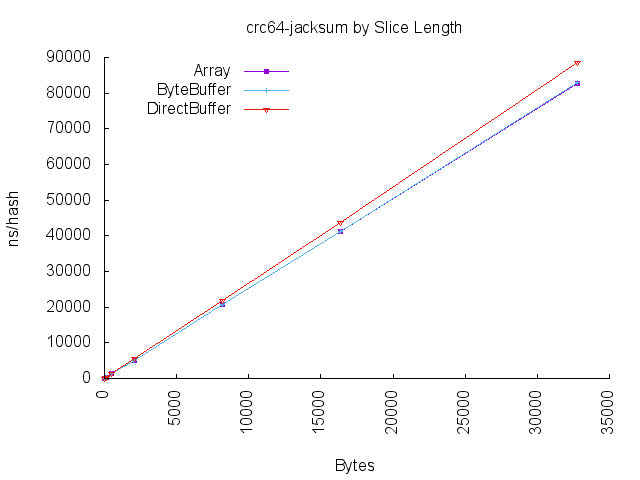

| Length |  Array | ByteBuffer | DirectBuffer |
| --- | ---: | ---: | ---: | 
| [32](#32-byte-slice-latency-all-hashes) | 76.692296 | 77.018121 | 102.268661 |
| [128](#128-byte-slice-latency-all-hashes) | 320.680243 | 323.805499 | 350.672810 |
| [512](#512-byte-slice-latency-all-hashes) | 1295.873611 | 1288.573369 | 1359.235390 |
| [2048](#2048-byte-slice-latency-all-hashes) | 5159.611878 | 5158.789863 | 5550.394906 |
| [8192](#8192-byte-slice-latency-all-hashes) | 20643.924263 | 20642.686534 | 21842.031275 |
| [16384](#16384-byte-slice-latency-all-hashes) | 41291.183340 | 41275.104353 | 43603.473038 |
| [32768](#32768-byte-slice-latency-all-hashes) | 82597.758600 | 82915.567579 | 88473.364625 |

---
### crc8-jacksum Latency
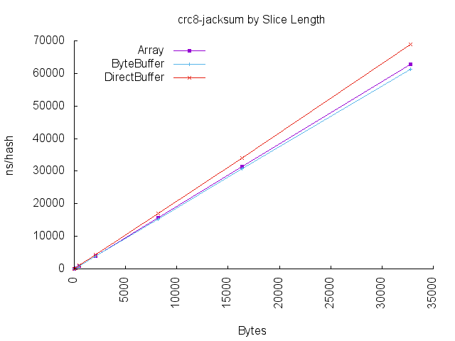

| Length |  Array | ByteBuffer | DirectBuffer |
| --- | ---: | ---: | ---: | 
| [32](#32-byte-slice-latency-all-hashes) | 46.216048 | 49.356869 | 86.104161 |
| [128](#128-byte-slice-latency-all-hashes) | 234.277284 | 228.950333 | 275.552485 |
| [512](#512-byte-slice-latency-all-hashes) | 979.321730 | 942.261294 | 1083.116468 |
| [2048](#2048-byte-slice-latency-all-hashes) | 3924.627626 | 3836.252868 | 4345.358547 |
| [8192](#8192-byte-slice-latency-all-hashes) | 15724.356636 | 15224.370265 | 17110.393118 |
| [16384](#16384-byte-slice-latency-all-hashes) | 31430.044687 | 30774.962318 | 33939.526845 |
| [32768](#32768-byte-slice-latency-all-hashes) | 62883.215564 | 61258.684093 | 68819.656407 |

---
### ed2k-jacksum Latency
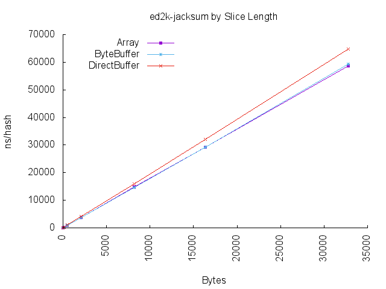

| Length |  Array | ByteBuffer | DirectBuffer |
| --- | ---: | ---: | ---: | 
| [32](#32-byte-slice-latency-all-hashes) | 30.996757 | 33.011559 | 52.894560 |
| [128](#128-byte-slice-latency-all-hashes) | 258.631619 | 264.824162 | 292.399793 |
| [512](#512-byte-slice-latency-all-hashes) | 948.948873 | 951.785846 | 1010.974359 |
| [2048](#2048-byte-slice-latency-all-hashes) | 3720.477914 | 3682.482481 | 4048.805164 |
| [8192](#8192-byte-slice-latency-all-hashes) | 14725.549231 | 14633.044589 | 15911.239736 |
| [16384](#16384-byte-slice-latency-all-hashes) | 29146.877065 | 29303.079710 | 32150.608069 |
| [32768](#32768-byte-slice-latency-all-hashes) | 58564.264353 | 59238.497692 | 64816.471004 |

---
### elf-jacksum Latency
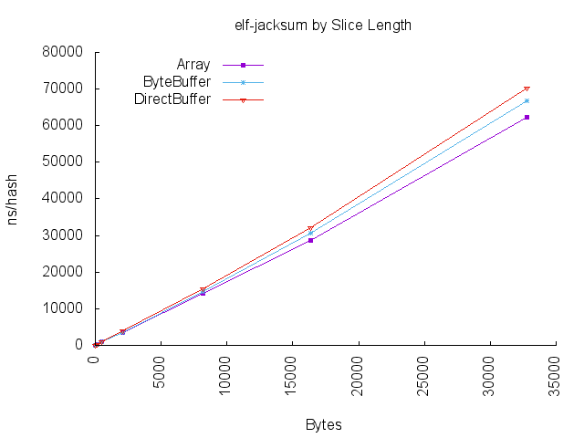

| Length |  Array | ByteBuffer | DirectBuffer |
| --- | ---: | ---: | ---: | 
| [32](#32-byte-slice-latency-all-hashes) | 54.190183 | 55.941578 | 80.302190 |
| [128](#128-byte-slice-latency-all-hashes) | 218.567453 | 225.786743 | 247.839779 |
| [512](#512-byte-slice-latency-all-hashes) | 880.500058 | 890.830908 | 957.036494 |
| [2048](#2048-byte-slice-latency-all-hashes) | 3538.129166 | 3605.170264 | 3960.959370 |
| [8192](#8192-byte-slice-latency-all-hashes) | 14194.114749 | 14667.343652 | 15482.931480 |
| [16384](#16384-byte-slice-latency-all-hashes) | 28776.629395 | 30562.771870 | 32221.241158 |
| [32768](#32768-byte-slice-latency-all-hashes) | 62320.483335 | 66782.048611 | 70269.157957 |

---
### farmna-zah Latency
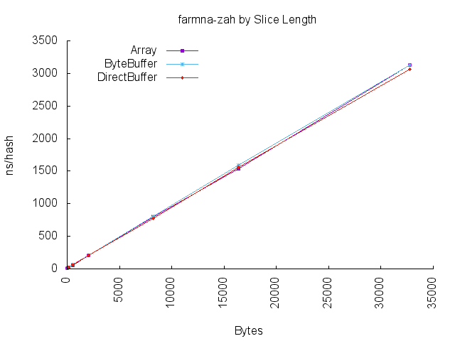

| Length |  Array | ByteBuffer | DirectBuffer |
| --- | ---: | ---: | ---: | 
| [32](#32-byte-slice-latency-all-hashes) | 9.436640 | 10.063625 | 10.485527 |
| [128](#128-byte-slice-latency-all-hashes) | 23.285137 | 25.734970 | 24.309718 |
| [512](#512-byte-slice-latency-all-hashes) | 59.642152 | 61.952459 | 65.606588 |
| [2048](#2048-byte-slice-latency-all-hashes) | 202.760730 | 204.175186 | 204.255908 |
| [8192](#8192-byte-slice-latency-all-hashes) | 799.915101 | 805.541844 | 774.191487 |
| [16384](#16384-byte-slice-latency-all-hashes) | 1536.645198 | 1591.033100 | 1563.085573 |
| [32768](#32768-byte-slice-latency-all-hashes) | 3126.940982 | 3127.917852 | 3060.876326 |

---
### farmuo-zah Latency
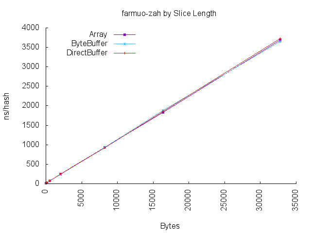

| Length |  Array | ByteBuffer | DirectBuffer |
| --- | ---: | ---: | ---: | 
| [32](#32-byte-slice-latency-all-hashes) | 9.653172 | 9.885832 | 10.475776 |
| [128](#128-byte-slice-latency-all-hashes) | 26.016423 | 27.188264 | 27.704946 |
| [512](#512-byte-slice-latency-all-hashes) | 69.023085 | 71.448800 | 70.253630 |
| [2048](#2048-byte-slice-latency-all-hashes) | 245.357364 | 242.768126 | 246.978142 |
| [8192](#8192-byte-slice-latency-all-hashes) | 935.415841 | 933.456834 | 927.133514 |
| [16384](#16384-byte-slice-latency-all-hashes) | 1826.508737 | 1879.077025 | 1855.558515 |
| [32768](#32768-byte-slice-latency-all-hashes) | 3693.234677 | 3652.234778 | 3728.080262 |

---
### fcs16-jacksum Latency
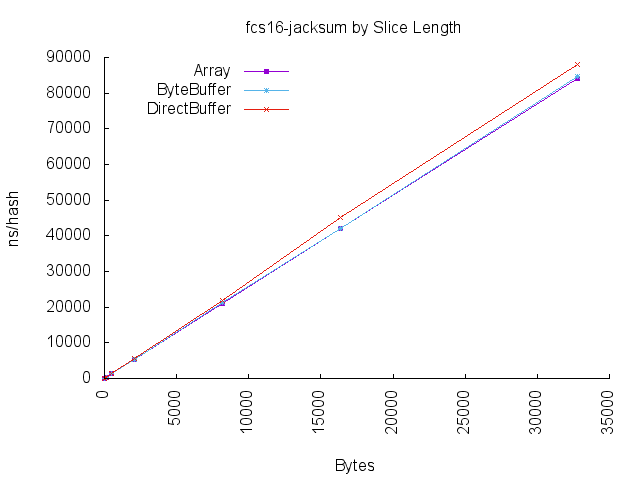

| Length |  Array | ByteBuffer | DirectBuffer |
| --- | ---: | ---: | ---: | 
| [32](#32-byte-slice-latency-all-hashes) | 79.858554 | 81.806079 | 105.071308 |
| [128](#128-byte-slice-latency-all-hashes) | 324.752512 | 326.589282 | 352.725697 |
| [512](#512-byte-slice-latency-all-hashes) | 1311.326727 | 1326.468387 | 1374.476862 |
| [2048](#2048-byte-slice-latency-all-hashes) | 5258.248989 | 5255.851452 | 5567.811754 |
| [8192](#8192-byte-slice-latency-all-hashes) | 21087.174919 | 21275.244771 | 21857.076200 |
| [16384](#16384-byte-slice-latency-all-hashes) | 42024.530187 | 42101.661514 | 45238.749050 |
| [32768](#32768-byte-slice-latency-all-hashes) | 84190.643652 | 84599.557901 | 88059.040998 |

---
### gfh32-guava Latency
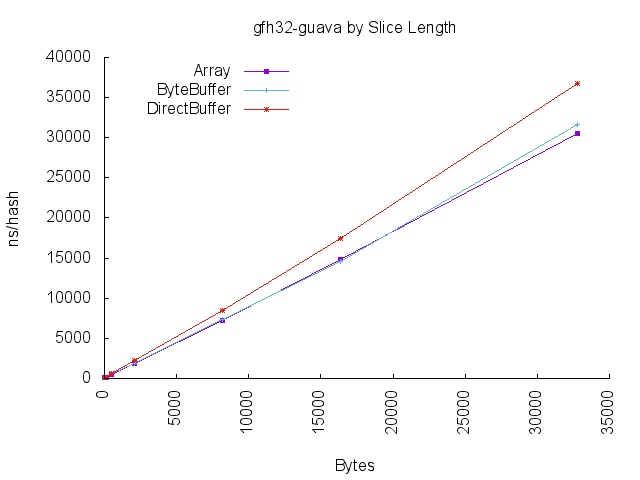

| Length |  Array | ByteBuffer | DirectBuffer |
| --- | ---: | ---: | ---: | 
| [32](#32-byte-slice-latency-all-hashes) | 78.174524 | 81.817229 | 101.281565 |
| [128](#128-byte-slice-latency-all-hashes) | 179.472355 | 169.605873 | 182.064273 |
| [512](#512-byte-slice-latency-all-hashes) | 556.505834 | 566.465486 | 568.563661 |
| [2048](#2048-byte-slice-latency-all-hashes) | 1930.308789 | 1850.452522 | 2238.051549 |
| [8192](#8192-byte-slice-latency-all-hashes) | 7286.581301 | 7305.806798 | 8524.081717 |
| [16384](#16384-byte-slice-latency-all-hashes) | 14849.414186 | 14611.102815 | 17384.060697 |
| [32768](#32768-byte-slice-latency-all-hashes) | 30554.379803 | 31680.944315 | 36744.359588 |

---
### gfh64-guava Latency
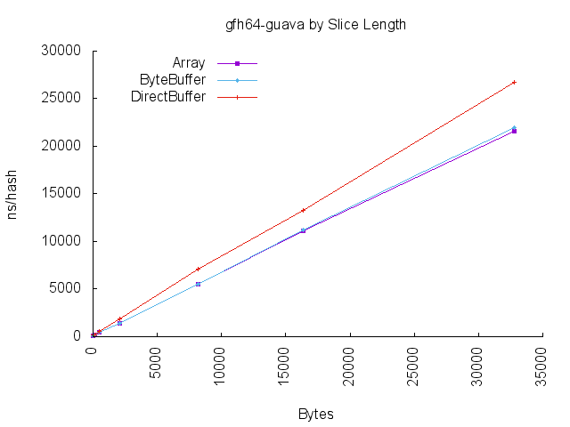

| Length |  Array | ByteBuffer | DirectBuffer |
| --- | ---: | ---: | ---: | 
| [32](#32-byte-slice-latency-all-hashes) | 110.740421 | 140.045954 | 158.387860 |
| [128](#128-byte-slice-latency-all-hashes) | 203.490902 | 212.500720 | 231.586180 |
| [512](#512-byte-slice-latency-all-hashes) | 434.753407 | 447.520425 | 525.359893 |
| [2048](#2048-byte-slice-latency-all-hashes) | 1395.879545 | 1417.881319 | 1835.120548 |
| [8192](#8192-byte-slice-latency-all-hashes) | 5534.637511 | 5509.432690 | 7067.145831 |
| [16384](#16384-byte-slice-latency-all-hashes) | 11128.896277 | 11242.281687 | 13249.914576 |
| [32768](#32768-byte-slice-latency-all-hashes) | 21569.088387 | 21931.211083 | 26705.958281 |

---
### has160-jacksum Latency
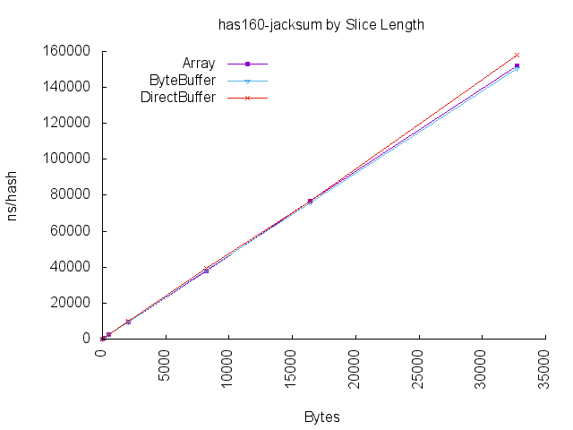

| Length |  Array | ByteBuffer | DirectBuffer |
| --- | ---: | ---: | ---: | 
| [32](#32-byte-slice-latency-all-hashes) | 26.073006 | 15.849194 | 52.319310 |
| [128](#128-byte-slice-latency-all-hashes) | 621.389763 | 611.540242 | 670.433457 |
| [512](#512-byte-slice-latency-all-hashes) | 2410.805867 | 2407.741746 | 2450.563718 |
| [2048](#2048-byte-slice-latency-all-hashes) | 9444.752781 | 9601.056363 | 10014.769090 |
| [8192](#8192-byte-slice-latency-all-hashes) | 37756.834351 | 38161.194826 | 39170.328722 |
| [16384](#16384-byte-slice-latency-all-hashes) | 76532.570076 | 75516.875199 | 76702.127382 |
| [32768](#32768-byte-slice-latency-all-hashes) | 151971.252990 | 150715.825604 | 157785.822465 |

---
### haval128h3-jacksum Latency
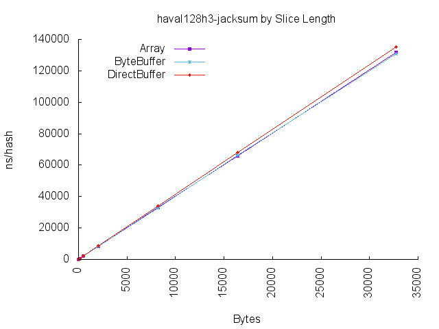

| Length |  Array | ByteBuffer | DirectBuffer |
| --- | ---: | ---: | ---: | 
| [32](#32-byte-slice-latency-all-hashes) | 26.991555 | 17.123144 | 50.678717 |
| [128](#128-byte-slice-latency-all-hashes) | 541.226953 | 530.860095 | 570.479261 |
| [512](#512-byte-slice-latency-all-hashes) | 2084.437156 | 2080.383214 | 2161.481998 |
| [2048](#2048-byte-slice-latency-all-hashes) | 8241.788376 | 8354.870728 | 8734.172438 |
| [8192](#8192-byte-slice-latency-all-hashes) | 33047.621485 | 32872.661245 | 33863.489767 |
| [16384](#16384-byte-slice-latency-all-hashes) | 65729.259003 | 66386.972694 | 68019.866245 |
| [32768](#32768-byte-slice-latency-all-hashes) | 131749.883370 | 131038.093574 | 135341.860233 |

---
### haval128h4-jacksum Latency
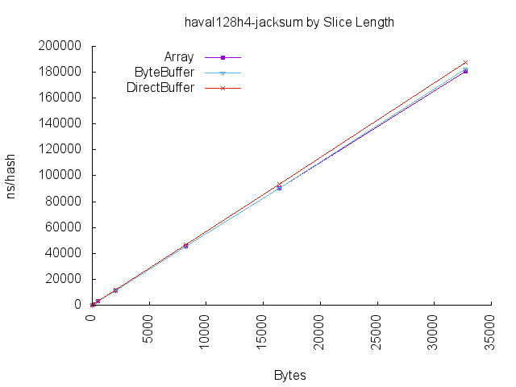

| Length |  Array | ByteBuffer | DirectBuffer |
| --- | ---: | ---: | ---: | 
| [32](#32-byte-slice-latency-all-hashes) | 26.961847 | 17.078459 | 50.097165 |
| [128](#128-byte-slice-latency-all-hashes) | 734.322369 | 724.866034 | 773.323275 |
| [512](#512-byte-slice-latency-all-hashes) | 2858.705456 | 2851.948562 | 2985.112153 |
| [2048](#2048-byte-slice-latency-all-hashes) | 11334.940608 | 11322.833069 | 11709.748780 |
| [8192](#8192-byte-slice-latency-all-hashes) | 45423.547643 | 45179.276306 | 46759.574762 |
| [16384](#16384-byte-slice-latency-all-hashes) | 90371.832048 | 90271.614980 | 93516.118563 |
| [32768](#32768-byte-slice-latency-all-hashes) | 180515.498864 | 182786.809382 | 187739.480278 |

---
### haval128h5-jacksum Latency
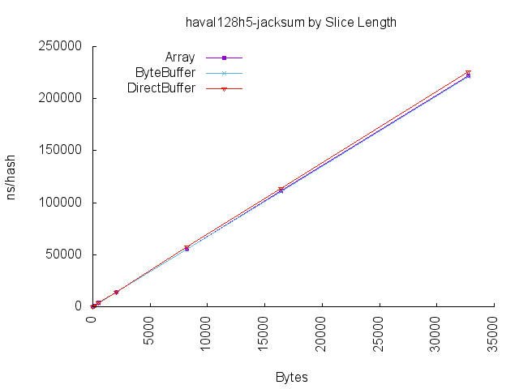

| Length |  Array | ByteBuffer | DirectBuffer |
| --- | ---: | ---: | ---: | 
| [32](#32-byte-slice-latency-all-hashes) | 27.150144 | 17.028880 | 48.862959 |
| [128](#128-byte-slice-latency-all-hashes) | 888.674091 | 876.717173 | 926.220680 |
| [512](#512-byte-slice-latency-all-hashes) | 3531.314102 | 3480.919540 | 3584.683743 |
| [2048](#2048-byte-slice-latency-all-hashes) | 13854.763985 | 13856.335328 | 14401.672649 |
| [8192](#8192-byte-slice-latency-all-hashes) | 55231.719035 | 55329.205046 | 57926.718816 |
| [16384](#16384-byte-slice-latency-all-hashes) | 111001.954422 | 110539.969153 | 113490.476714 |
| [32768](#32768-byte-slice-latency-all-hashes) | 221865.524487 | 221286.202244 | 226238.744793 |

---
### haval160h3-jacksum Latency
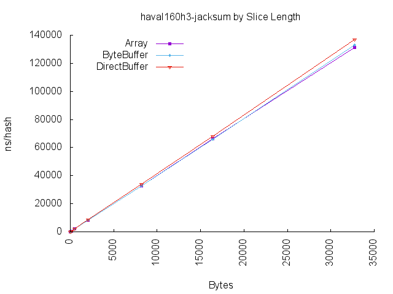

| Length |  Array | ByteBuffer | DirectBuffer |
| --- | ---: | ---: | ---: | 
| [32](#32-byte-slice-latency-all-hashes) | 26.924620 | 17.863529 | 49.561984 |
| [128](#128-byte-slice-latency-all-hashes) | 542.873998 | 538.146754 | 570.601404 |
| [512](#512-byte-slice-latency-all-hashes) | 2099.899625 | 2087.744721 | 2147.591067 |
| [2048](#2048-byte-slice-latency-all-hashes) | 8268.277463 | 8275.120646 | 8570.513560 |
| [8192](#8192-byte-slice-latency-all-hashes) | 32818.301856 | 32871.800025 | 34164.756182 |
| [16384](#16384-byte-slice-latency-all-hashes) | 66354.677408 | 65700.187620 | 68182.411199 |
| [32768](#32768-byte-slice-latency-all-hashes) | 131074.786350 | 133029.502280 | 136875.130767 |

---
### haval160h4-jacksum Latency
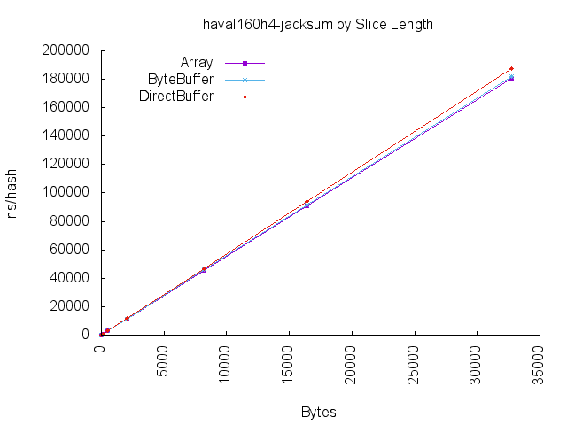

| Length |  Array | ByteBuffer | DirectBuffer |
| --- | ---: | ---: | ---: | 
| [32](#32-byte-slice-latency-all-hashes) | 27.162459 | 17.192719 | 48.851692 |
| [128](#128-byte-slice-latency-all-hashes) | 741.871095 | 730.749863 | 780.575885 |
| [512](#512-byte-slice-latency-all-hashes) | 2864.336569 | 2867.498414 | 2962.554253 |
| [2048](#2048-byte-slice-latency-all-hashes) | 11349.838144 | 11366.456577 | 11674.118603 |
| [8192](#8192-byte-slice-latency-all-hashes) | 45300.630282 | 46348.507716 | 46764.328046 |
| [16384](#16384-byte-slice-latency-all-hashes) | 90933.583045 | 91282.485942 | 94224.946247 |
| [32768](#32768-byte-slice-latency-all-hashes) | 180866.105006 | 181842.700795 | 187662.544465 |

---
### haval160h5-jacksum Latency
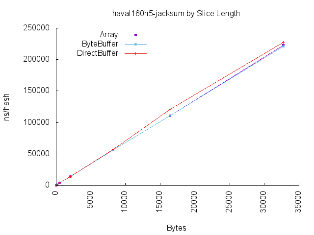

| Length |  Array | ByteBuffer | DirectBuffer |
| --- | ---: | ---: | ---: | 
| [32](#32-byte-slice-latency-all-hashes) | 31.132717 | 18.503447 | 52.149894 |
| [128](#128-byte-slice-latency-all-hashes) | 904.194280 | 890.593839 | 948.258672 |
| [512](#512-byte-slice-latency-all-hashes) | 3534.012518 | 3534.475621 | 3561.469952 |
| [2048](#2048-byte-slice-latency-all-hashes) | 13929.686020 | 13833.931146 | 14253.439784 |
| [8192](#8192-byte-slice-latency-all-hashes) | 56155.896238 | 56183.141194 | 56577.527247 |
| [16384](#16384-byte-slice-latency-all-hashes) | 110670.454557 | 110475.439499 | 120464.245044 |
| [32768](#32768-byte-slice-latency-all-hashes) | 222357.244753 | 221006.751912 | 227285.382208 |

---
### haval192h3-jacksum Latency
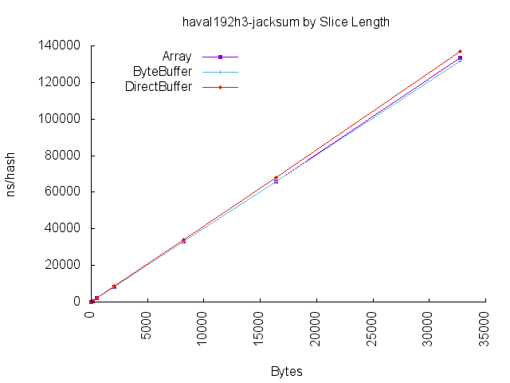

| Length |  Array | ByteBuffer | DirectBuffer |
| --- | ---: | ---: | ---: | 
| [32](#32-byte-slice-latency-all-hashes) | 26.919654 | 16.946839 | 50.252533 |
| [128](#128-byte-slice-latency-all-hashes) | 557.514013 | 536.900066 | 568.265525 |
| [512](#512-byte-slice-latency-all-hashes) | 2110.269623 | 2096.486559 | 2172.476054 |
| [2048](#2048-byte-slice-latency-all-hashes) | 8256.014185 | 8336.840294 | 8557.206440 |
| [8192](#8192-byte-slice-latency-all-hashes) | 33239.292691 | 33358.118790 | 33828.647281 |
| [16384](#16384-byte-slice-latency-all-hashes) | 65638.824153 | 65676.037040 | 67971.351431 |
| [32768](#32768-byte-slice-latency-all-hashes) | 133332.954400 | 131598.484068 | 137151.380180 |

---
### haval192h4-jacksum Latency
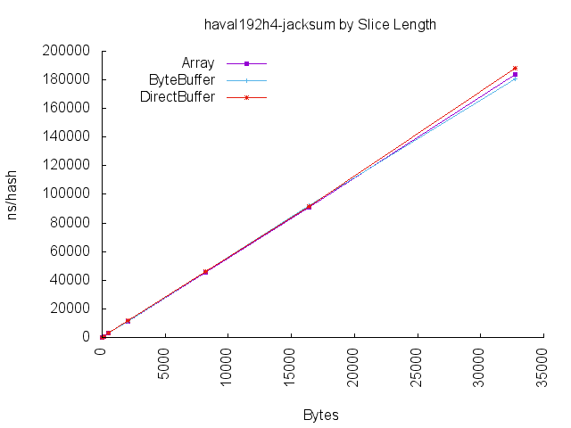

| Length |  Array | ByteBuffer | DirectBuffer |
| --- | ---: | ---: | ---: | 
| [32](#32-byte-slice-latency-all-hashes) | 27.337060 | 17.262303 | 49.499889 |
| [128](#128-byte-slice-latency-all-hashes) | 737.180666 | 728.653781 | 783.369739 |
| [512](#512-byte-slice-latency-all-hashes) | 2864.817469 | 2878.223427 | 2962.537646 |
| [2048](#2048-byte-slice-latency-all-hashes) | 11518.488552 | 11373.511139 | 11614.382576 |
| [8192](#8192-byte-slice-latency-all-hashes) | 45235.745394 | 45957.301437 | 46083.722159 |
| [16384](#16384-byte-slice-latency-all-hashes) | 91002.817676 | 92312.358068 | 91742.780986 |
| [32768](#32768-byte-slice-latency-all-hashes) | 183776.876987 | 180593.072032 | 187931.328954 |

---
### haval192h5-jacksum Latency
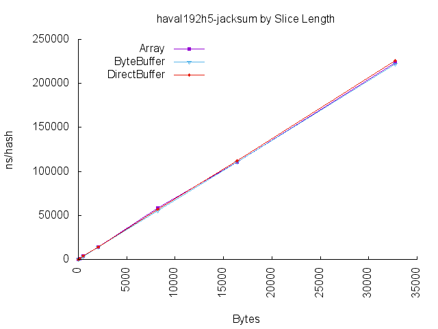

| Length |  Array | ByteBuffer | DirectBuffer |
| --- | ---: | ---: | ---: | 
| [32](#32-byte-slice-latency-all-hashes) | 27.100158 | 18.082278 | 50.831126 |
| [128](#128-byte-slice-latency-all-hashes) | 900.306950 | 881.478473 | 910.916988 |
| [512](#512-byte-slice-latency-all-hashes) | 3539.502161 | 3477.151156 | 3552.865519 |
| [2048](#2048-byte-slice-latency-all-hashes) | 14008.597769 | 13933.629197 | 14157.373419 |
| [8192](#8192-byte-slice-latency-all-hashes) | 58579.807949 | 55392.858022 | 56806.291861 |
| [16384](#16384-byte-slice-latency-all-hashes) | 110602.235805 | 110484.853921 | 111797.895041 |
| [32768](#32768-byte-slice-latency-all-hashes) | 223430.092891 | 222245.089049 | 226047.703224 |

---
### haval224h3-jacksum Latency
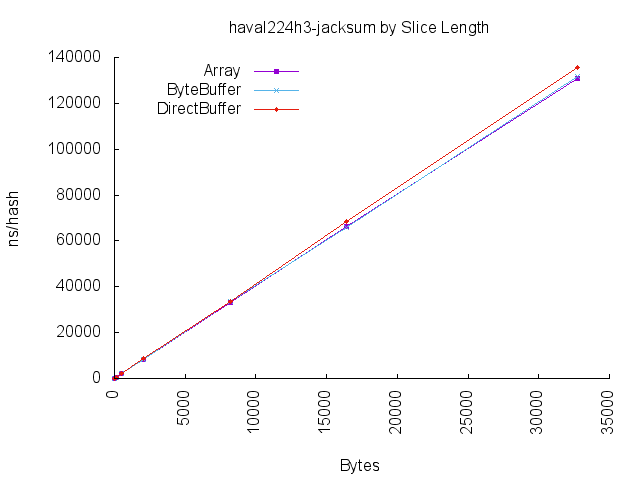

| Length |  Array | ByteBuffer | DirectBuffer |
| --- | ---: | ---: | ---: | 
| [32](#32-byte-slice-latency-all-hashes) | 27.206759 | 17.195727 | 49.093431 |
| [128](#128-byte-slice-latency-all-hashes) | 543.870212 | 535.211488 | 565.442672 |
| [512](#512-byte-slice-latency-all-hashes) | 2118.637189 | 2093.896331 | 2341.948081 |
| [2048](#2048-byte-slice-latency-all-hashes) | 8282.698478 | 8372.328447 | 8699.062296 |
| [8192](#8192-byte-slice-latency-all-hashes) | 33353.851977 | 33552.322835 | 33503.756871 |
| [16384](#16384-byte-slice-latency-all-hashes) | 66420.502597 | 65783.253534 | 68500.702409 |
| [32768](#32768-byte-slice-latency-all-hashes) | 130945.735456 | 131605.722204 | 135729.393140 |

---
### haval224h4-jacksum Latency

| Length |  Array | ByteBuffer | DirectBuffer |
| --- | ---: | ---: | ---: | 
| [32](#32-byte-slice-latency-all-hashes) | 27.059303 | 17.375722 | 51.723487 |
| [128](#128-byte-slice-latency-all-hashes) | 748.336222 | 730.497083 | 774.576678 |
| [512](#512-byte-slice-latency-all-hashes) | 2902.084019 | 2865.342828 | 2934.867806 |
| [2048](#2048-byte-slice-latency-all-hashes) | 11431.967293 | 11368.789118 | 11667.191643 |
| [8192](#8192-byte-slice-latency-all-hashes) | 45546.875978 | 45403.658317 | 46110.288117 |
| [16384](#16384-byte-slice-latency-all-hashes) | 91904.813478 | 90265.254771 | 92139.653545 |
| [32768](#32768-byte-slice-latency-all-hashes) | 181812.600993 | 181590.523690 | 184987.710390 |

---
### haval224h5-jacksum Latency
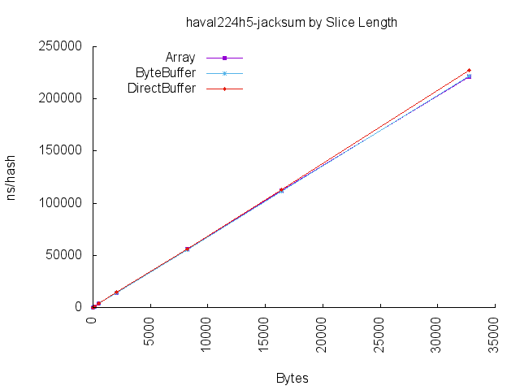

| Length |  Array | ByteBuffer | DirectBuffer |
| --- | ---: | ---: | ---: | 
| [32](#32-byte-slice-latency-all-hashes) | 28.230363 | 17.264312 | 51.245530 |
| [128](#128-byte-slice-latency-all-hashes) | 929.379257 | 882.398130 | 921.719972 |
| [512](#512-byte-slice-latency-all-hashes) | 3576.964413 | 3541.073190 | 3568.154974 |
| [2048](#2048-byte-slice-latency-all-hashes) | 14094.390243 | 13998.630668 | 14501.611752 |
| [8192](#8192-byte-slice-latency-all-hashes) | 56245.874243 | 55646.909635 | 56181.142457 |
| [16384](#16384-byte-slice-latency-all-hashes) | 111822.315793 | 111369.236384 | 112837.316679 |
| [32768](#32768-byte-slice-latency-all-hashes) | 221414.960243 | 222136.780118 | 227340.684646 |

---
### haval256h3-jacksum Latency
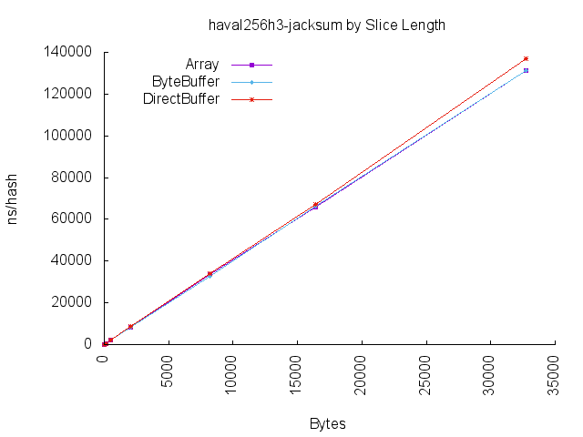

| Length |  Array | ByteBuffer | DirectBuffer |
| --- | ---: | ---: | ---: | 
| [32](#32-byte-slice-latency-all-hashes) | 27.374675 | 17.033349 | 49.841708 |
| [128](#128-byte-slice-latency-all-hashes) | 543.649025 | 540.394798 | 569.861602 |
| [512](#512-byte-slice-latency-all-hashes) | 2151.577691 | 2081.630688 | 2182.642658 |
| [2048](#2048-byte-slice-latency-all-hashes) | 8245.936659 | 8282.397415 | 8658.591242 |
| [8192](#8192-byte-slice-latency-all-hashes) | 33543.579594 | 32862.627478 | 33939.263688 |
| [16384](#16384-byte-slice-latency-all-hashes) | 65911.893858 | 66335.714264 | 67041.979720 |
| [32768](#32768-byte-slice-latency-all-hashes) | 131255.161245 | 131345.958325 | 136874.034860 |

---
### haval256h4-jacksum Latency
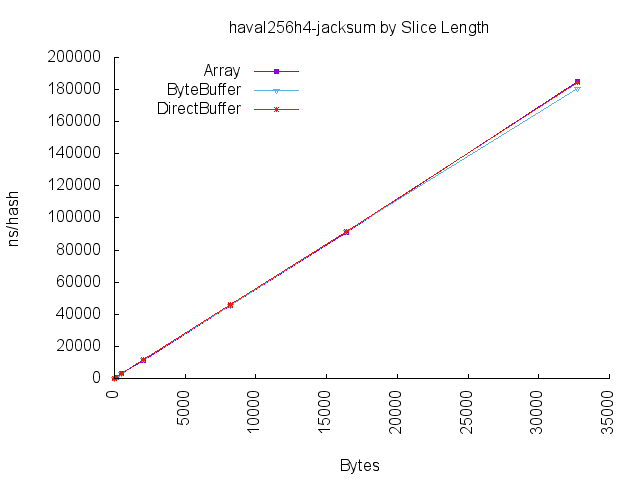

| Length |  Array | ByteBuffer | DirectBuffer |
| --- | ---: | ---: | ---: | 
| [32](#32-byte-slice-latency-all-hashes) | 28.282550 | 19.246276 | 49.762288 |
| [128](#128-byte-slice-latency-all-hashes) | 738.078702 | 727.641279 | 771.290582 |
| [512](#512-byte-slice-latency-all-hashes) | 2875.069766 | 2867.561636 | 2951.588394 |
| [2048](#2048-byte-slice-latency-all-hashes) | 11379.720521 | 11615.039706 | 11660.389549 |
| [8192](#8192-byte-slice-latency-all-hashes) | 45626.269944 | 45658.347041 | 46292.679502 |
| [16384](#16384-byte-slice-latency-all-hashes) | 90810.773814 | 91774.911751 | 91668.779867 |
| [32768](#32768-byte-slice-latency-all-hashes) | 185293.907924 | 180625.296358 | 184582.830958 |

---
### haval256h5-jacksum Latency
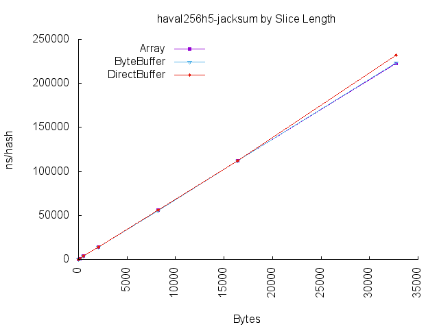

| Length |  Array | ByteBuffer | DirectBuffer |
| --- | ---: | ---: | ---: | 
| [32](#32-byte-slice-latency-all-hashes) | 27.541982 | 16.813024 | 51.762478 |
| [128](#128-byte-slice-latency-all-hashes) | 906.083075 | 887.415098 | 911.178105 |
| [512](#512-byte-slice-latency-all-hashes) | 3517.205081 | 3556.794203 | 3590.542244 |
| [2048](#2048-byte-slice-latency-all-hashes) | 13857.022669 | 13963.888842 | 14316.431658 |
| [8192](#8192-byte-slice-latency-all-hashes) | 56246.091827 | 55279.557185 | 56318.403962 |
| [16384](#16384-byte-slice-latency-all-hashes) | 112502.784172 | 111790.384369 | 112363.820932 |
| [32768](#32768-byte-slice-latency-all-hashes) | 222430.403721 | 223314.111892 | 231989.893601 |

---
### md2-jacksum Latency
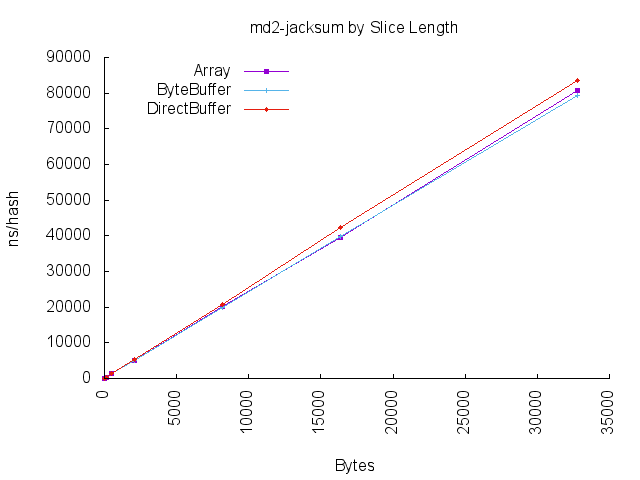

| Length |  Array | ByteBuffer | DirectBuffer |
| --- | ---: | ---: | ---: | 
| [32](#32-byte-slice-latency-all-hashes) | 16.563934 | 16.963187 | 40.015221 |
| [128](#128-byte-slice-latency-all-hashes) | 321.908327 | 327.813531 | 351.819048 |
| [512](#512-byte-slice-latency-all-hashes) | 1285.041808 | 1272.512806 | 1303.267163 |
| [2048](#2048-byte-slice-latency-all-hashes) | 4988.376392 | 4929.978949 | 5338.254832 |
| [8192](#8192-byte-slice-latency-all-hashes) | 20144.107632 | 19852.436972 | 20724.479493 |
| [16384](#16384-byte-slice-latency-all-hashes) | 39517.519394 | 39935.409231 | 42402.426459 |
| [32768](#32768-byte-slice-latency-all-hashes) | 80804.734134 | 79460.259638 | 83601.040666 |

---
### md4-jacksum Latency
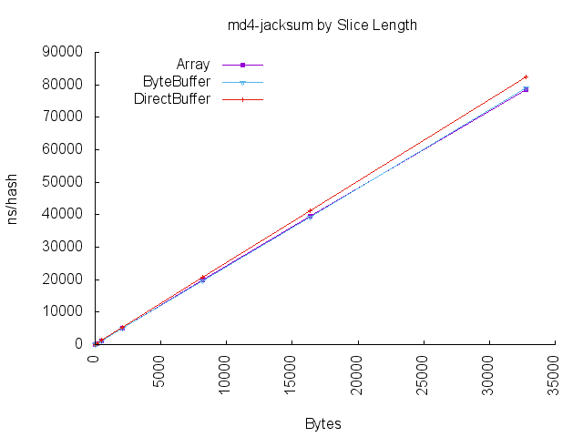

| Length |  Array | ByteBuffer | DirectBuffer |
| --- | ---: | ---: | ---: | 
| [32](#32-byte-slice-latency-all-hashes) | 23.570853 | 17.628126 | 39.629374 |
| [128](#128-byte-slice-latency-all-hashes) | 320.968229 | 321.887664 | 355.303991 |
| [512](#512-byte-slice-latency-all-hashes) | 1255.376417 | 1240.364324 | 1304.349640 |
| [2048](#2048-byte-slice-latency-all-hashes) | 4981.881839 | 4929.750970 | 5363.687107 |
| [8192](#8192-byte-slice-latency-all-hashes) | 19853.391643 | 19761.810757 | 20702.126694 |
| [16384](#16384-byte-slice-latency-all-hashes) | 39523.863608 | 39311.684790 | 41271.259151 |
| [32768](#32768-byte-slice-latency-all-hashes) | 78573.968517 | 79135.594711 | 82291.131483 |

---
### md5-guava Latency
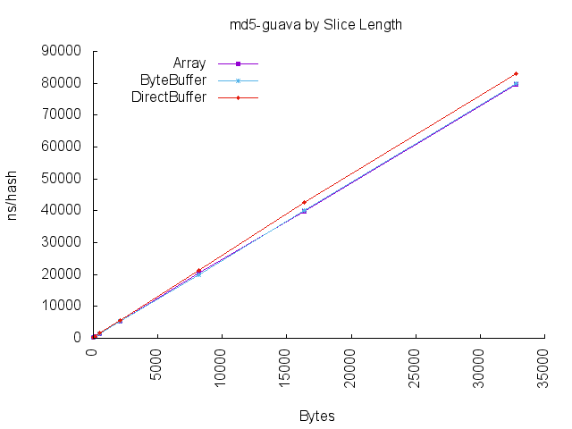

| Length |  Array | ByteBuffer | DirectBuffer |
| --- | ---: | ---: | ---: | 
| [32](#32-byte-slice-latency-all-hashes) | 257.842252 | 261.644189 | 278.634660 |
| [128](#128-byte-slice-latency-all-hashes) | 572.987618 | 567.021225 | 625.676365 |
| [512](#512-byte-slice-latency-all-hashes) | 1487.566872 | 1482.388059 | 1579.185480 |
| [2048](#2048-byte-slice-latency-all-hashes) | 5202.681037 | 5283.988543 | 5617.684420 |
| [8192](#8192-byte-slice-latency-all-hashes) | 20422.798130 | 20003.445716 | 21434.321334 |
| [16384](#16384-byte-slice-latency-all-hashes) | 39673.322352 | 40080.509246 | 42753.655676 |
| [32768](#32768-byte-slice-latency-all-hashes) | 79634.153477 | 79892.190329 | 83064.133636 |

---
### md5-jacksum Latency
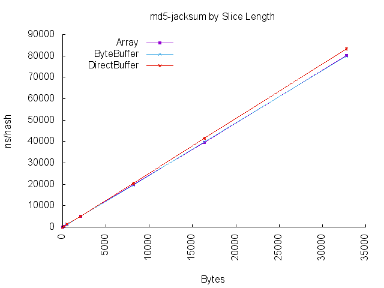

| Length |  Array | ByteBuffer | DirectBuffer |
| --- | ---: | ---: | ---: | 
| [32](#32-byte-slice-latency-all-hashes) | 16.395676 | 16.626702 | 40.148749 |
| [128](#128-byte-slice-latency-all-hashes) | 321.233839 | 327.608602 | 348.183309 |
| [512](#512-byte-slice-latency-all-hashes) | 1257.124051 | 1244.789856 | 1316.970864 |
| [2048](#2048-byte-slice-latency-all-hashes) | 4930.305661 | 4977.945051 | 5163.436488 |
| [8192](#8192-byte-slice-latency-all-hashes) | 19831.512685 | 19669.132223 | 20588.636246 |
| [16384](#16384-byte-slice-latency-all-hashes) | 39480.262757 | 39929.274374 | 41604.376634 |
| [32768](#32768-byte-slice-latency-all-hashes) | 80322.456818 | 79893.333187 | 83386.714510 |

---
### md5-jacksum-alt Latency

| Length |  Array | ByteBuffer | DirectBuffer |
| --- | ---: | ---: | ---: | 
| [32](#32-byte-slice-latency-all-hashes) | 25.462574 | 16.053110 | 48.863971 |
| [128](#128-byte-slice-latency-all-hashes) | 381.959107 | 370.087106 | 403.736920 |
| [512](#512-byte-slice-latency-all-hashes) | 1450.510618 | 1462.957701 | 1478.505427 |
| [2048](#2048-byte-slice-latency-all-hashes) | 5738.976352 | 5694.102295 | 6032.349286 |
| [8192](#8192-byte-slice-latency-all-hashes) | 22644.968055 | 22905.390571 | 23648.153936 |
| [16384](#16384-byte-slice-latency-all-hashes) | 45422.224284 | 45399.591347 | 47772.665442 |
| [32768](#32768-byte-slice-latency-all-hashes) | 91659.617185 | 90579.724374 | 95094.118569 |

---
### murmur3h128-guava Latency
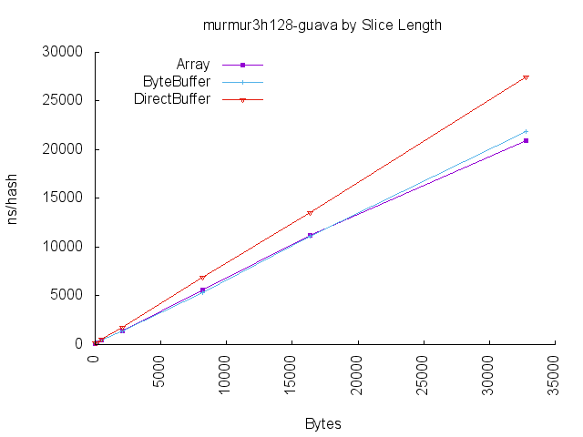

| Length |  Array | ByteBuffer | DirectBuffer |
| --- | ---: | ---: | ---: | 
| [32](#32-byte-slice-latency-all-hashes) | 133.573963 | 142.591046 | 154.750441 |
| [128](#128-byte-slice-latency-all-hashes) | 172.364845 | 209.804518 | 231.949415 |
| [512](#512-byte-slice-latency-all-hashes) | 449.312542 | 443.796114 | 533.339753 |
| [2048](#2048-byte-slice-latency-all-hashes) | 1422.283140 | 1431.495876 | 1797.928132 |
| [8192](#8192-byte-slice-latency-all-hashes) | 5639.406961 | 5283.907618 | 6927.046122 |
| [16384](#16384-byte-slice-latency-all-hashes) | 11192.335360 | 11145.215146 | 13552.254772 |
| [32768](#32768-byte-slice-latency-all-hashes) | 20920.368886 | 21826.181676 | 27449.503909 |

---
### murmur3h128-zah Latency
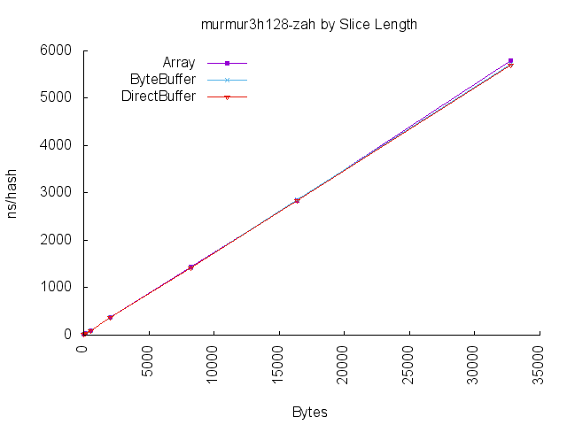

| Length |  Array | ByteBuffer | DirectBuffer |
| --- | ---: | ---: | ---: | 
| [32](#32-byte-slice-latency-all-hashes) | 14.333405 | 14.794073 | 15.465594 |
| [128](#128-byte-slice-latency-all-hashes) | 31.828410 | 31.914309 | 31.998387 |
| [512](#512-byte-slice-latency-all-hashes) | 100.425436 | 96.871044 | 96.527365 |
| [2048](#2048-byte-slice-latency-all-hashes) | 374.101462 | 375.229995 | 365.065583 |
| [8192](#8192-byte-slice-latency-all-hashes) | 1442.812570 | 1428.828545 | 1427.680640 |
| [16384](#16384-byte-slice-latency-all-hashes) | 2835.682776 | 2867.160353 | 2849.240550 |
| [32768](#32768-byte-slice-latency-all-hashes) | 5796.128653 | 5728.650272 | 5707.720237 |

---
### murmur3h32-guava Latency
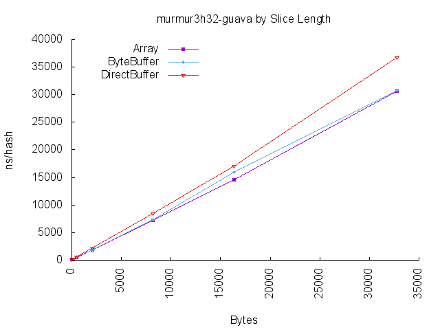

| Length |  Array | ByteBuffer | DirectBuffer |
| --- | ---: | ---: | ---: | 
| [32](#32-byte-slice-latency-all-hashes) | 66.750433 | 79.085364 | 103.618315 |
| [128](#128-byte-slice-latency-all-hashes) | 169.046511 | 157.269364 | 207.369670 |
| [512](#512-byte-slice-latency-all-hashes) | 558.193441 | 568.857791 | 578.382803 |
| [2048](#2048-byte-slice-latency-all-hashes) | 1875.568631 | 1867.079502 | 2243.137300 |
| [8192](#8192-byte-slice-latency-all-hashes) | 7274.526024 | 7323.497318 | 8424.090953 |
| [16384](#16384-byte-slice-latency-all-hashes) | 14600.888916 | 15925.669268 | 17039.030928 |
| [32768](#32768-byte-slice-latency-all-hashes) | 30666.225098 | 30822.745406 | 36732.251207 |

---
### ripemd128-jacksum Latency
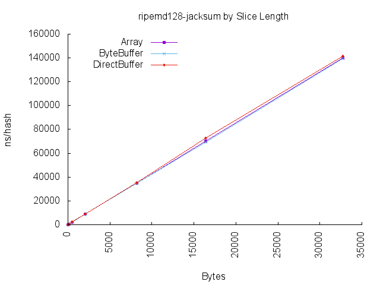

| Length |  Array | ByteBuffer | DirectBuffer |
| --- | ---: | ---: | ---: | 
| [32](#32-byte-slice-latency-all-hashes) | 24.768934 | 16.286259 | 47.707163 |
| [128](#128-byte-slice-latency-all-hashes) | 579.973276 | 564.871529 | 605.608990 |
| [512](#512-byte-slice-latency-all-hashes) | 2215.584984 | 2215.339534 | 2298.459700 |
| [2048](#2048-byte-slice-latency-all-hashes) | 8772.953147 | 8877.399089 | 8925.814621 |
| [8192](#8192-byte-slice-latency-all-hashes) | 34763.936242 | 34927.760354 | 35330.105290 |
| [16384](#16384-byte-slice-latency-all-hashes) | 70316.944217 | 69132.191135 | 72698.774820 |
| [32768](#32768-byte-slice-latency-all-hashes) | 140236.419214 | 139532.606261 | 141551.473371 |

---
### ripemd160-jacksum Latency
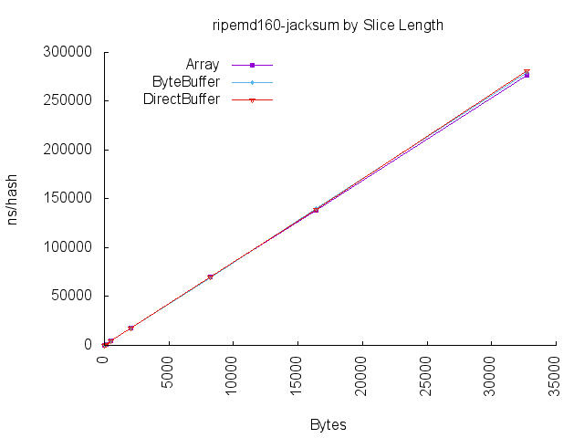

| Length |  Array | ByteBuffer | DirectBuffer |
| --- | ---: | ---: | ---: | 
| [32](#32-byte-slice-latency-all-hashes) | 26.073611 | 15.765879 | 48.814337 |
| [128](#128-byte-slice-latency-all-hashes) | 1131.819393 | 1101.438317 | 1137.282286 |
| [512](#512-byte-slice-latency-all-hashes) | 4345.143677 | 4333.796255 | 4420.891515 |
| [2048](#2048-byte-slice-latency-all-hashes) | 17360.343865 | 17328.322772 | 17659.144028 |
| [8192](#8192-byte-slice-latency-all-hashes) | 69726.896086 | 69519.563545 | 70373.395386 |
| [16384](#16384-byte-slice-latency-all-hashes) | 138181.079121 | 140389.285420 | 139033.292274 |
| [32768](#32768-byte-slice-latency-all-hashes) | 276425.173384 | 279673.334709 | 281397.094909 |

---
### ripemd256-jacksum Latency
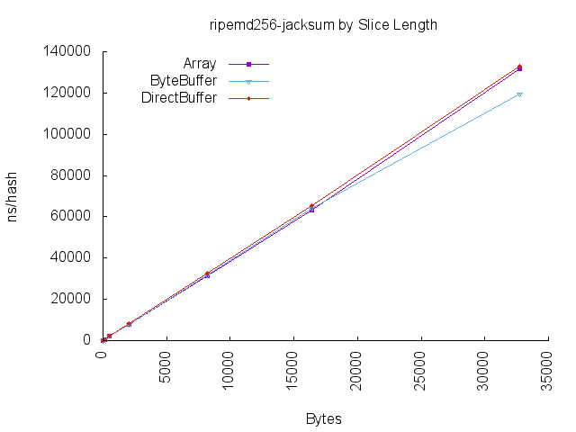

| Length |  Array | ByteBuffer | DirectBuffer |
| --- | ---: | ---: | ---: | 
| [32](#32-byte-slice-latency-all-hashes) | 53.458034 | 51.282157 | 73.245744 |
| [128](#128-byte-slice-latency-all-hashes) | 521.498613 | 527.262336 | 549.893803 |
| [512](#512-byte-slice-latency-all-hashes) | 1992.198313 | 1997.072526 | 2072.048856 |
| [2048](#2048-byte-slice-latency-all-hashes) | 7956.628044 | 7909.357086 | 8265.070701 |
| [8192](#8192-byte-slice-latency-all-hashes) | 31583.841096 | 31789.748184 | 32792.797409 |
| [16384](#16384-byte-slice-latency-all-hashes) | 63334.417371 | 63932.206468 | 65585.648156 |
| [32768](#32768-byte-slice-latency-all-hashes) | 131582.707490 | 119421.376291 | 133187.718908 |

---
### ripemd320-jacksum Latency
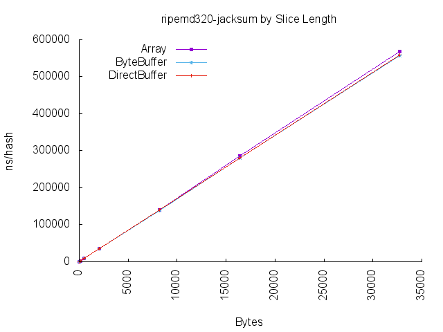

| Length |  Array | ByteBuffer | DirectBuffer |
| --- | ---: | ---: | ---: | 
| [32](#32-byte-slice-latency-all-hashes) | 55.026308 | 51.836783 | 70.499128 |
| [128](#128-byte-slice-latency-all-hashes) | 2197.641070 | 2194.750406 | 2250.312552 |
| [512](#512-byte-slice-latency-all-hashes) | 8730.360801 | 8760.168908 | 8876.608782 |
| [2048](#2048-byte-slice-latency-all-hashes) | 34880.056676 | 35072.737188 | 35271.622513 |
| [8192](#8192-byte-slice-latency-all-hashes) | 140209.947627 | 138411.588339 | 139750.294354 |
| [16384](#16384-byte-slice-latency-all-hashes) | 286070.739043 | 281157.132003 | 280257.735931 |
| [32768](#32768-byte-slice-latency-all-hashes) | 568719.585664 | 557461.191434 | 559696.230767 |

---
### sha0-jacksum Latency
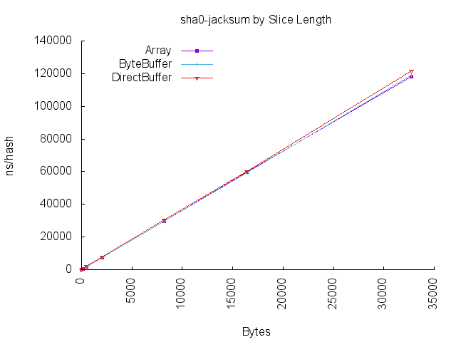

| Length |  Array | ByteBuffer | DirectBuffer |
| --- | ---: | ---: | ---: | 
| [32](#32-byte-slice-latency-all-hashes) | 16.031572 | 16.492294 | 38.428184 |
| [128](#128-byte-slice-latency-all-hashes) | 475.347087 | 476.532919 | 494.804506 |
| [512](#512-byte-slice-latency-all-hashes) | 1907.783097 | 1881.002225 | 1977.735345 |
| [2048](#2048-byte-slice-latency-all-hashes) | 7516.125985 | 7453.658865 | 7910.121188 |
| [8192](#8192-byte-slice-latency-all-hashes) | 29509.896953 | 29643.009580 | 30463.271677 |
| [16384](#16384-byte-slice-latency-all-hashes) | 59745.841620 | 59287.776410 | 60353.377102 |
| [32768](#32768-byte-slice-latency-all-hashes) | 118134.003856 | 119257.461026 | 121571.113691 |

---
### sha1-guava Latency
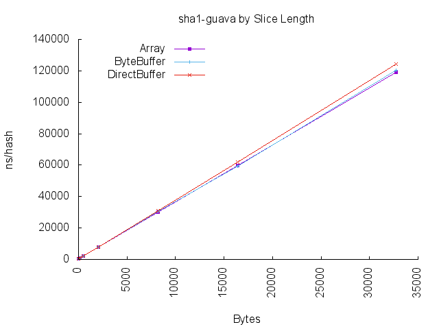

| Length |  Array | ByteBuffer | DirectBuffer |
| --- | ---: | ---: | ---: | 
| [32](#32-byte-slice-latency-all-hashes) | 374.767019 | 389.846643 | 381.904392 |
| [128](#128-byte-slice-latency-all-hashes) | 819.782189 | 831.462563 | 880.446803 |
| [512](#512-byte-slice-latency-all-hashes) | 2197.456071 | 2227.398546 | 2340.487139 |
| [2048](#2048-byte-slice-latency-all-hashes) | 7722.271073 | 7801.861577 | 8035.171812 |
| [8192](#8192-byte-slice-latency-all-hashes) | 30036.299650 | 30638.315045 | 30814.441405 |
| [16384](#16384-byte-slice-latency-all-hashes) | 59908.487810 | 59342.378878 | 61794.036421 |
| [32768](#32768-byte-slice-latency-all-hashes) | 118934.622412 | 120177.764297 | 124257.144559 |

---
### sha1-jacksum Latency
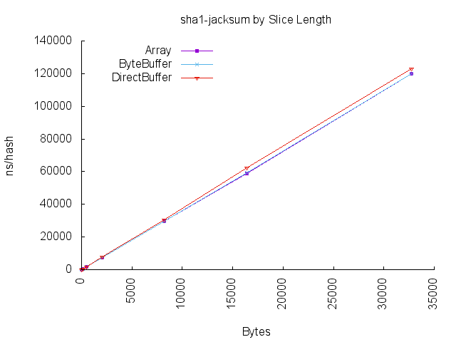

| Length |  Array | ByteBuffer | DirectBuffer |
| --- | ---: | ---: | ---: | 
| [32](#32-byte-slice-latency-all-hashes) | 16.066295 | 16.412335 | 38.327895 |
| [128](#128-byte-slice-latency-all-hashes) | 476.289266 | 483.675909 | 492.718211 |
| [512](#512-byte-slice-latency-all-hashes) | 1871.419053 | 1874.721128 | 1918.665876 |
| [2048](#2048-byte-slice-latency-all-hashes) | 7405.331519 | 7386.746239 | 7698.722719 |
| [8192](#8192-byte-slice-latency-all-hashes) | 29843.580533 | 29569.243407 | 30665.129563 |
| [16384](#16384-byte-slice-latency-all-hashes) | 59049.017009 | 59304.643321 | 62462.336116 |
| [32768](#32768-byte-slice-latency-all-hashes) | 119920.715576 | 119823.806391 | 122814.244994 |

---
### sha1-jacksum-alt Latency
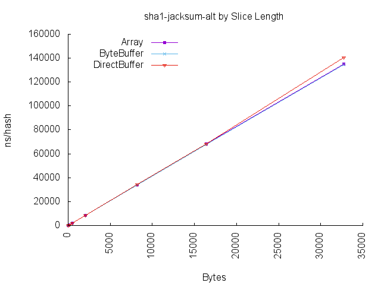

| Length |  Array | ByteBuffer | DirectBuffer |
| --- | ---: | ---: | ---: | 
| [32](#32-byte-slice-latency-all-hashes) | 26.319568 | 15.862870 | 51.408808 |
| [128](#128-byte-slice-latency-all-hashes) | 562.327014 | 544.000806 | 569.009870 |
| [512](#512-byte-slice-latency-all-hashes) | 2140.845535 | 2120.772149 | 2163.711387 |
| [2048](#2048-byte-slice-latency-all-hashes) | 8539.834071 | 8413.327900 | 8706.976494 |
| [8192](#8192-byte-slice-latency-all-hashes) | 33903.405734 | 33754.566118 | 34493.889468 |
| [16384](#16384-byte-slice-latency-all-hashes) | 68124.985743 | 67804.721148 | 68417.582234 |
| [32768](#32768-byte-slice-latency-all-hashes) | 135247.952858 | 134703.463216 | 140703.426854 |

---
### sha224-jacksum Latency
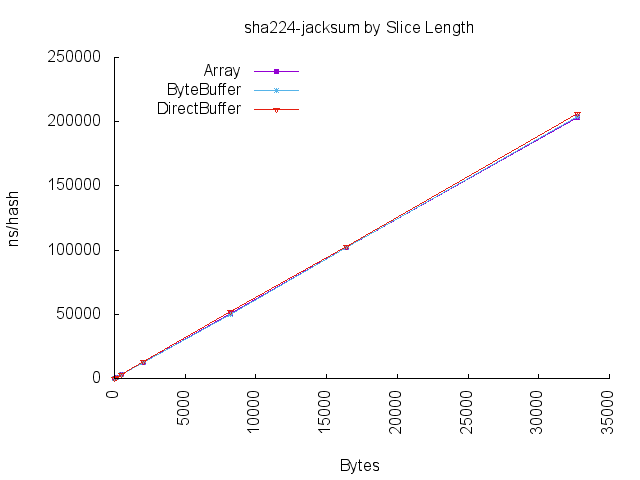

| Length |  Array | ByteBuffer | DirectBuffer |
| --- | ---: | ---: | ---: | 
| [32](#32-byte-slice-latency-all-hashes) | 26.603091 | 17.820128 | 50.204425 |
| [128](#128-byte-slice-latency-all-hashes) | 817.995207 | 809.423970 | 845.618539 |
| [512](#512-byte-slice-latency-all-hashes) | 3239.682566 | 3158.224612 | 3239.127684 |
| [2048](#2048-byte-slice-latency-all-hashes) | 12745.546986 | 12662.321575 | 12874.939779 |
| [8192](#8192-byte-slice-latency-all-hashes) | 50847.253370 | 50203.673272 | 51891.125100 |
| [16384](#16384-byte-slice-latency-all-hashes) | 101747.768298 | 101954.098790 | 102816.121675 |
| [32768](#32768-byte-slice-latency-all-hashes) | 203296.797490 | 203706.474945 | 206278.540594 |

---
### sha256-guava Latency
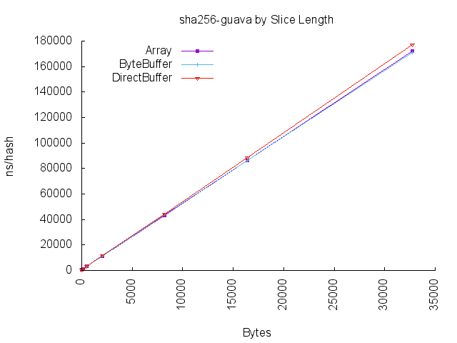

| Length |  Array | ByteBuffer | DirectBuffer |
| --- | ---: | ---: | ---: | 
| [32](#32-byte-slice-latency-all-hashes) | 488.234912 | 472.458636 | 491.064544 |
| [128](#128-byte-slice-latency-all-hashes) | 1138.526107 | 1128.311294 | 1200.340719 |
| [512](#512-byte-slice-latency-all-hashes) | 3238.650608 | 3151.324767 | 3225.531575 |
| [2048](#2048-byte-slice-latency-all-hashes) | 11102.882558 | 11110.485719 | 11509.438801 |
| [8192](#8192-byte-slice-latency-all-hashes) | 43140.237642 | 43827.247087 | 44355.237100 |
| [16384](#16384-byte-slice-latency-all-hashes) | 86217.125123 | 86203.969914 | 88328.953176 |
| [32768](#32768-byte-slice-latency-all-hashes) | 172051.807930 | 171095.232587 | 177118.537191 |

---
### sha256-jacksum Latency
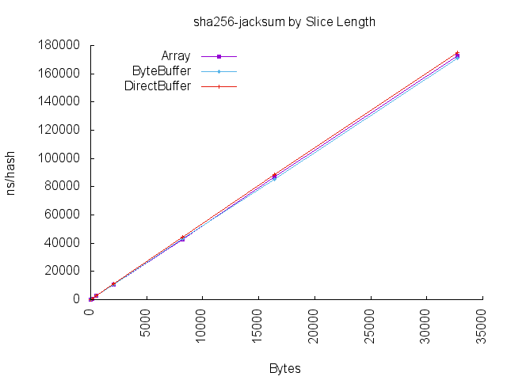

| Length |  Array | ByteBuffer | DirectBuffer |
| --- | ---: | ---: | ---: | 
| [32](#32-byte-slice-latency-all-hashes) | 21.985274 | 22.734990 | 46.084798 |
| [128](#128-byte-slice-latency-all-hashes) | 689.532094 | 682.494129 | 718.734724 |
| [512](#512-byte-slice-latency-all-hashes) | 2715.298737 | 2704.428693 | 2768.593832 |
| [2048](#2048-byte-slice-latency-all-hashes) | 10801.791605 | 10804.863485 | 11168.150258 |
| [8192](#8192-byte-slice-latency-all-hashes) | 42879.137589 | 43115.130555 | 44099.319822 |
| [16384](#16384-byte-slice-latency-all-hashes) | 86723.073505 | 85271.034629 | 88467.544692 |
| [32768](#32768-byte-slice-latency-all-hashes) | 172491.802220 | 170785.995771 | 175062.108524 |

---
### sha256-jacksum-alt Latency
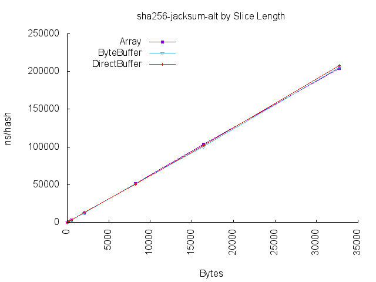

| Length |  Array | ByteBuffer | DirectBuffer |
| --- | ---: | ---: | ---: | 
| [32](#32-byte-slice-latency-all-hashes) | 26.204024 | 16.524212 | 49.522718 |
| [128](#128-byte-slice-latency-all-hashes) | 817.982130 | 811.859397 | 826.083288 |
| [512](#512-byte-slice-latency-all-hashes) | 3166.190270 | 3193.271812 | 3218.621132 |
| [2048](#2048-byte-slice-latency-all-hashes) | 12571.276418 | 12493.159241 | 12918.487146 |
| [8192](#8192-byte-slice-latency-all-hashes) | 51167.159491 | 51129.417057 | 50525.535463 |
| [16384](#16384-byte-slice-latency-all-hashes) | 103194.505728 | 100656.598511 | 102103.604898 |
| [32768](#32768-byte-slice-latency-all-hashes) | 203845.090613 | 205831.978523 | 207960.332390 |

---
### sha384-guava Latency
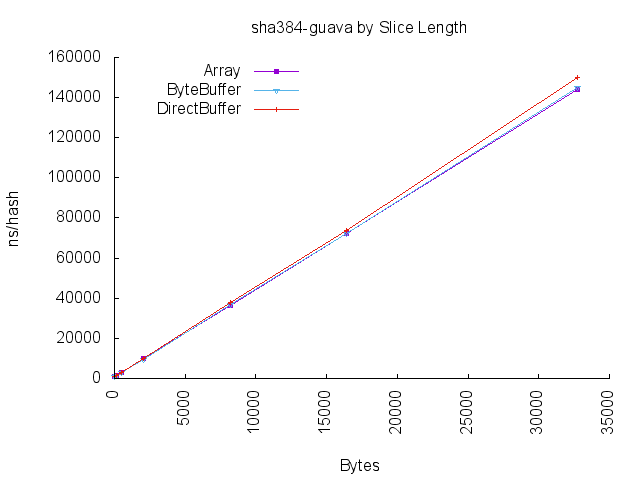

| Length |  Array | ByteBuffer | DirectBuffer |
| --- | ---: | ---: | ---: | 
| [32](#32-byte-slice-latency-all-hashes) | 770.902455 | 819.578947 | 840.614945 |
| [128](#128-byte-slice-latency-all-hashes) | 1319.581454 | 1378.681152 | 1406.509310 |
| [512](#512-byte-slice-latency-all-hashes) | 3039.583659 | 3021.320795 | 3069.565338 |
| [2048](#2048-byte-slice-latency-all-hashes) | 9787.369240 | 9686.994688 | 10100.663006 |
| [8192](#8192-byte-slice-latency-all-hashes) | 36441.136778 | 36812.206030 | 37744.524012 |
| [16384](#16384-byte-slice-latency-all-hashes) | 72067.908464 | 72083.662629 | 73681.481030 |
| [32768](#32768-byte-slice-latency-all-hashes) | 144146.118825 | 144874.223483 | 150015.409692 |

---
### sha384-jacksum Latency
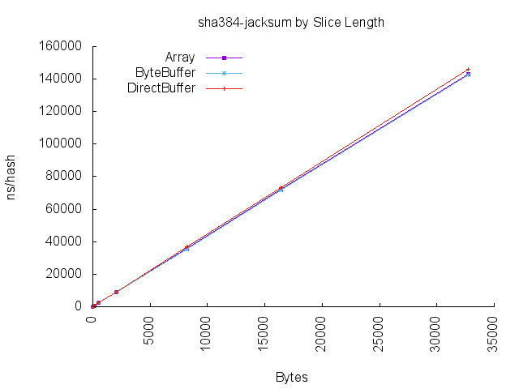

| Length |  Array | ByteBuffer | DirectBuffer |
| --- | ---: | ---: | ---: | 
| [32](#32-byte-slice-latency-all-hashes) | 22.235713 | 22.825905 | 46.230454 |
| [128](#128-byte-slice-latency-all-hashes) | 581.017695 | 576.656070 | 620.683768 |
| [512](#512-byte-slice-latency-all-hashes) | 2275.522003 | 2288.886348 | 2311.847186 |
| [2048](#2048-byte-slice-latency-all-hashes) | 8978.742264 | 9023.971366 | 9214.109702 |
| [8192](#8192-byte-slice-latency-all-hashes) | 35666.394285 | 35636.205293 | 36948.545862 |
| [16384](#16384-byte-slice-latency-all-hashes) | 72386.280700 | 71984.170554 | 73489.026637 |
| [32768](#32768-byte-slice-latency-all-hashes) | 143251.884694 | 142683.963047 | 146042.738316 |

---
### sha384-jacksum-alt Latency

| Length |  Array | ByteBuffer | DirectBuffer |
| --- | ---: | ---: | ---: | 
| [32](#32-byte-slice-latency-all-hashes) | 27.068319 | 16.855076 | 52.242007 |
| [128](#128-byte-slice-latency-all-hashes) | 567.940351 | 559.824943 | 578.342947 |
| [512](#512-byte-slice-latency-all-hashes) | 2145.685929 | 2164.728525 | 2199.267502 |
| [2048](#2048-byte-slice-latency-all-hashes) | 8583.020990 | 8438.790157 | 8722.357104 |
| [8192](#8192-byte-slice-latency-all-hashes) | 34880.082617 | 33960.853655 | 34715.701562 |
| [16384](#16384-byte-slice-latency-all-hashes) | 67733.898370 | 68550.980946 | 69038.426015 |
| [32768](#32768-byte-slice-latency-all-hashes) | 137880.627441 | 134000.676581 | 141423.113514 |

---
### sha512-guava Latency
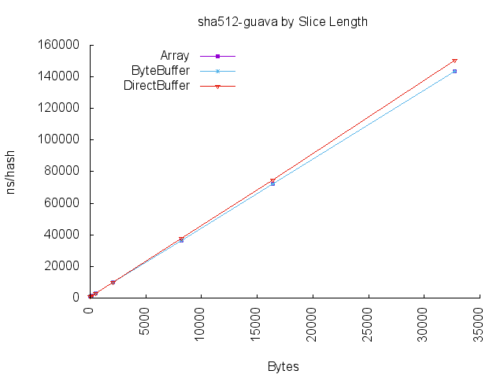

| Length |  Array | ByteBuffer | DirectBuffer |
| --- | ---: | ---: | ---: | 
| [32](#32-byte-slice-latency-all-hashes) | 875.570255 | 826.292396 | 841.160850 |
| [128](#128-byte-slice-latency-all-hashes) | 1373.408018 | 1365.403494 | 1363.227702 |
| [512](#512-byte-slice-latency-all-hashes) | 3029.973795 | 3084.105104 | 3134.961463 |
| [2048](#2048-byte-slice-latency-all-hashes) | 9835.359415 | 9725.426489 | 10215.041361 |
| [8192](#8192-byte-slice-latency-all-hashes) | 36457.347408 | 36586.981896 | 37639.250011 |
| [16384](#16384-byte-slice-latency-all-hashes) | 72121.184333 | 72089.387206 | 74720.260413 |
| [32768](#32768-byte-slice-latency-all-hashes) | 143397.961763 | 143419.727407 | 150624.046118 |

---
### sha512-jacksum Latency
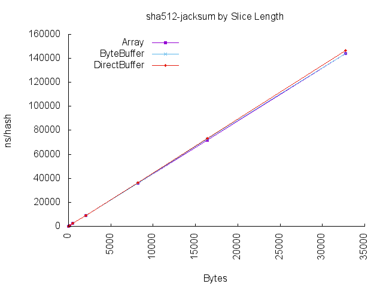

| Length |  Array | ByteBuffer | DirectBuffer |
| --- | ---: | ---: | ---: | 
| [32](#32-byte-slice-latency-all-hashes) | 21.339042 | 22.628170 | 44.930629 |
| [128](#128-byte-slice-latency-all-hashes) | 577.782897 | 576.574096 | 607.677052 |
| [512](#512-byte-slice-latency-all-hashes) | 2275.805266 | 2287.487985 | 2319.508167 |
| [2048](#2048-byte-slice-latency-all-hashes) | 9168.453033 | 8928.394307 | 9154.511353 |
| [8192](#8192-byte-slice-latency-all-hashes) | 35827.675069 | 36032.120265 | 36532.207407 |
| [16384](#16384-byte-slice-latency-all-hashes) | 71982.051052 | 72815.298499 | 73492.697095 |
| [32768](#32768-byte-slice-latency-all-hashes) | 144180.681881 | 144066.890476 | 146727.971877 |

---
### sha512-jacksum-alt Latency
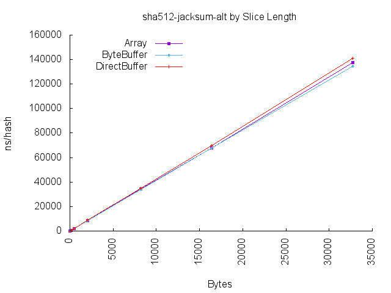

| Length |  Array | ByteBuffer | DirectBuffer |
| --- | ---: | ---: | ---: | 
| [32](#32-byte-slice-latency-all-hashes) | 28.970593 | 18.317556 | 53.767307 |
| [128](#128-byte-slice-latency-all-hashes) | 558.364466 | 561.595110 | 587.717067 |
| [512](#512-byte-slice-latency-all-hashes) | 2163.867904 | 2157.576806 | 2224.781913 |
| [2048](#2048-byte-slice-latency-all-hashes) | 8519.396343 | 8558.711995 | 8791.435290 |
| [8192](#8192-byte-slice-latency-all-hashes) | 34173.578319 | 34020.417177 | 34834.395731 |
| [16384](#16384-byte-slice-latency-all-hashes) | 67752.467730 | 67683.068160 | 69858.857111 |
| [32768](#32768-byte-slice-latency-all-hashes) | 137476.838308 | 134810.582688 | 141159.256494 |

---
### sip-fwdeng Latency
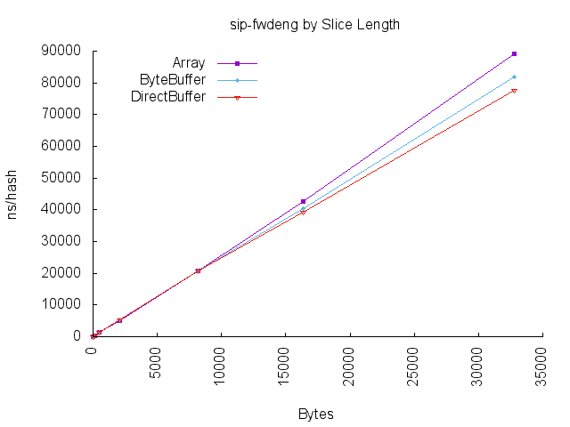

| Length |  Array | ByteBuffer | DirectBuffer |
| --- | ---: | ---: | ---: | 
| [32](#32-byte-slice-latency-all-hashes) | 112.510230 | 134.857564 | 133.047761 |
| [128](#128-byte-slice-latency-all-hashes) | 346.109556 | 378.031124 | 371.007290 |
| [512](#512-byte-slice-latency-all-hashes) | 1283.477590 | 1341.475321 | 1308.687369 |
| [2048](#2048-byte-slice-latency-all-hashes) | 5124.392093 | 5230.504995 | 5313.868788 |
| [8192](#8192-byte-slice-latency-all-hashes) | 20649.118797 | 20619.494737 | 20820.881754 |
| [16384](#16384-byte-slice-latency-all-hashes) | 42480.386643 | 40275.037176 | 39376.969055 |
| [32768](#32768-byte-slice-latency-all-hashes) | 89060.582112 | 81911.085543 | 77683.766786 |

---
### sip-guava Latency
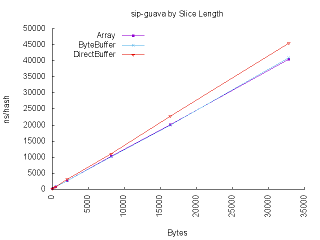

| Length |  Array | ByteBuffer | DirectBuffer |
| --- | ---: | ---: | ---: | 
| [32](#32-byte-slice-latency-all-hashes) | 125.044899 | 121.784631 | 151.375480 |
| [128](#128-byte-slice-latency-all-hashes) | 242.257410 | 240.456324 | 260.660206 |
| [512](#512-byte-slice-latency-all-hashes) | 749.204862 | 734.052891 | 812.593961 |
| [2048](#2048-byte-slice-latency-all-hashes) | 2582.745574 | 2610.984603 | 3103.029094 |
| [8192](#8192-byte-slice-latency-all-hashes) | 10242.604305 | 10174.701625 | 11070.235748 |
| [16384](#16384-byte-slice-latency-all-hashes) | 20056.674797 | 19986.211890 | 22753.508355 |
| [32768](#32768-byte-slice-latency-all-hashes) | 40568.415183 | 40997.839336 | 45416.498696 |

---
### sip-inline Latency
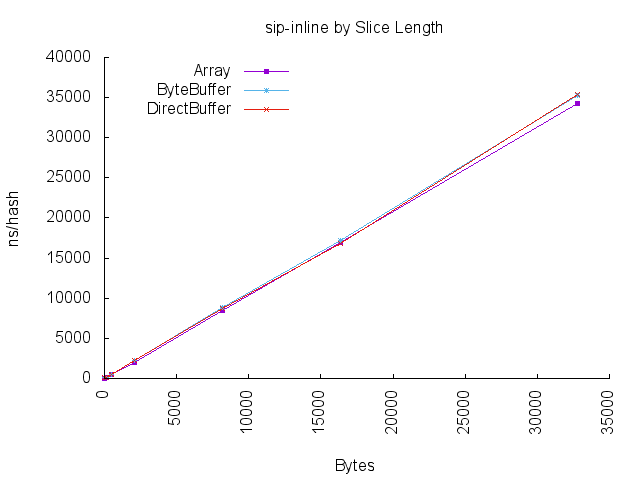

| Length |  Array | ByteBuffer | DirectBuffer |
| --- | ---: | ---: | ---: | 
| [32](#32-byte-slice-latency-all-hashes) | 55.711883 | 77.805861 | 74.669192 |
| [128](#128-byte-slice-latency-all-hashes) | 145.865406 | 174.150382 | 164.423727 |
| [512](#512-byte-slice-latency-all-hashes) | 516.046586 | 548.977462 | 559.738497 |
| [2048](#2048-byte-slice-latency-all-hashes) | 2055.175100 | 2221.556969 | 2221.292959 |
| [8192](#8192-byte-slice-latency-all-hashes) | 8490.835458 | 8814.339114 | 8692.764778 |
| [16384](#16384-byte-slice-latency-all-hashes) | 17003.082731 | 17185.619867 | 16768.852004 |
| [32768](#32768-byte-slice-latency-all-hashes) | 34324.080030 | 35274.317648 | 35427.059449 |

---
### sum16-jacksum Latency
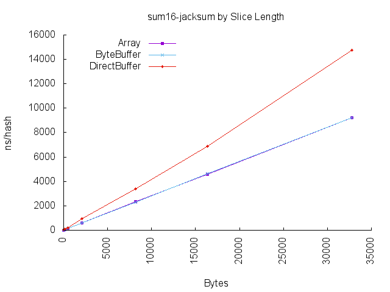

| Length |  Array | ByteBuffer | DirectBuffer |
| --- | ---: | ---: | ---: | 
| [32](#32-byte-slice-latency-all-hashes) | 19.203007 | 18.529654 | 43.306990 |
| [128](#128-byte-slice-latency-all-hashes) | 41.326166 | 42.252950 | 75.717950 |
| [512](#512-byte-slice-latency-all-hashes) | 153.489428 | 156.565576 | 222.485470 |
| [2048](#2048-byte-slice-latency-all-hashes) | 584.466210 | 591.471409 | 929.462249 |
| [8192](#8192-byte-slice-latency-all-hashes) | 2347.756727 | 2310.048754 | 3377.895925 |
| [16384](#16384-byte-slice-latency-all-hashes) | 4608.242974 | 4612.150500 | 6878.006105 |
| [32768](#32768-byte-slice-latency-all-hashes) | 9226.440079 | 9230.296384 | 14749.121967 |

---
### sum24-jacksum Latency
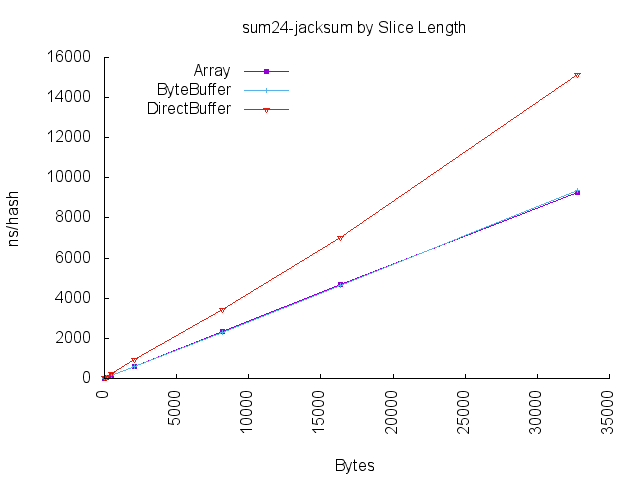

| Length |  Array | ByteBuffer | DirectBuffer |
| --- | ---: | ---: | ---: | 
| [32](#32-byte-slice-latency-all-hashes) | 19.211244 | 18.433058 | 44.394998 |
| [128](#128-byte-slice-latency-all-hashes) | 40.662861 | 41.762316 | 74.672972 |
| [512](#512-byte-slice-latency-all-hashes) | 156.443820 | 155.380564 | 224.428196 |
| [2048](#2048-byte-slice-latency-all-hashes) | 588.414589 | 585.283888 | 926.304381 |
| [8192](#8192-byte-slice-latency-all-hashes) | 2357.725446 | 2310.731995 | 3446.762442 |
| [16384](#16384-byte-slice-latency-all-hashes) | 4677.341755 | 4630.341875 | 7046.429454 |
| [32768](#32768-byte-slice-latency-all-hashes) | 9251.620421 | 9363.203108 | 15177.482637 |

---
### sum32-jacksum Latency
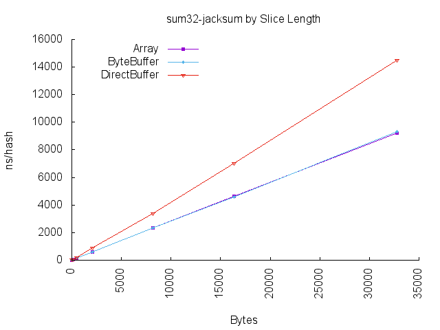

| Length |  Array | ByteBuffer | DirectBuffer |
| --- | ---: | ---: | ---: | 
| [32](#32-byte-slice-latency-all-hashes) | 18.649722 | 18.220136 | 44.977618 |
| [128](#128-byte-slice-latency-all-hashes) | 41.798007 | 42.359168 | 69.716058 |
| [512](#512-byte-slice-latency-all-hashes) | 153.552981 | 156.241295 | 215.929615 |
| [2048](#2048-byte-slice-latency-all-hashes) | 586.336923 | 589.896572 | 875.090910 |
| [8192](#8192-byte-slice-latency-all-hashes) | 2319.716434 | 2333.603089 | 3382.135026 |
| [16384](#16384-byte-slice-latency-all-hashes) | 4642.950694 | 4606.506795 | 7011.243833 |
| [32768](#32768-byte-slice-latency-all-hashes) | 9212.574735 | 9305.460017 | 14519.445463 |

---
### sum8-jacksum Latency
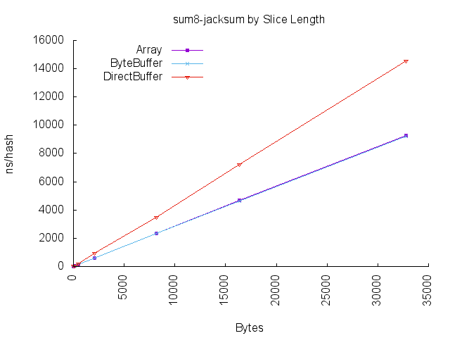

| Length |  Array | ByteBuffer | DirectBuffer |
| --- | ---: | ---: | ---: | 
| [32](#32-byte-slice-latency-all-hashes) | 19.198830 | 18.527889 | 43.823552 |
| [128](#128-byte-slice-latency-all-hashes) | 41.488963 | 42.496991 | 74.575812 |
| [512](#512-byte-slice-latency-all-hashes) | 153.788606 | 155.325582 | 219.822925 |
| [2048](#2048-byte-slice-latency-all-hashes) | 591.871602 | 591.909874 | 971.498405 |
| [8192](#8192-byte-slice-latency-all-hashes) | 2323.651151 | 2320.263812 | 3507.432643 |
| [16384](#16384-byte-slice-latency-all-hashes) | 4706.413399 | 4631.071869 | 7211.406077 |
| [32768](#32768-byte-slice-latency-all-hashes) | 9269.532966 | 9211.144379 | 14550.850010 |

---
### sumbsd-jacksum Latency
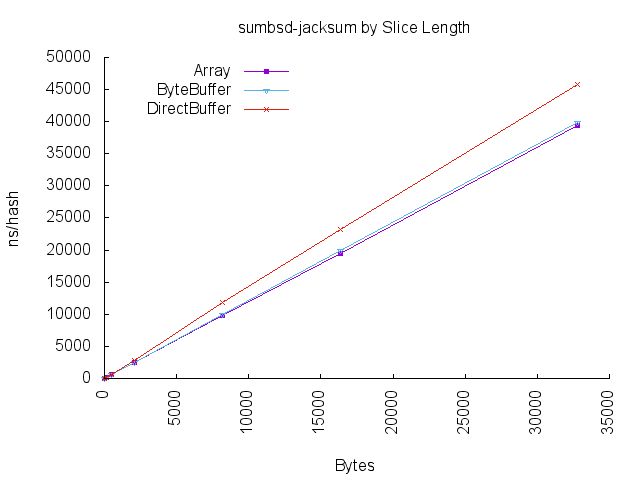

| Length |  Array | ByteBuffer | DirectBuffer |
| --- | ---: | ---: | ---: | 
| [32](#32-byte-slice-latency-all-hashes) | 40.658783 | 41.103870 | 65.433249 |
| [128](#128-byte-slice-latency-all-hashes) | 154.196105 | 159.602203 | 194.412577 |
| [512](#512-byte-slice-latency-all-hashes) | 616.734728 | 632.604595 | 681.241659 |
| [2048](#2048-byte-slice-latency-all-hashes) | 2454.847792 | 2502.880799 | 2852.432071 |
| [8192](#8192-byte-slice-latency-all-hashes) | 9812.723705 | 10008.705968 | 11761.089626 |
| [16384](#16384-byte-slice-latency-all-hashes) | 19458.106718 | 19911.170856 | 23258.221863 |
| [32768](#32768-byte-slice-latency-all-hashes) | 39445.281528 | 39829.813133 | 45753.035340 |

---
### sumsysv-jacksum Latency
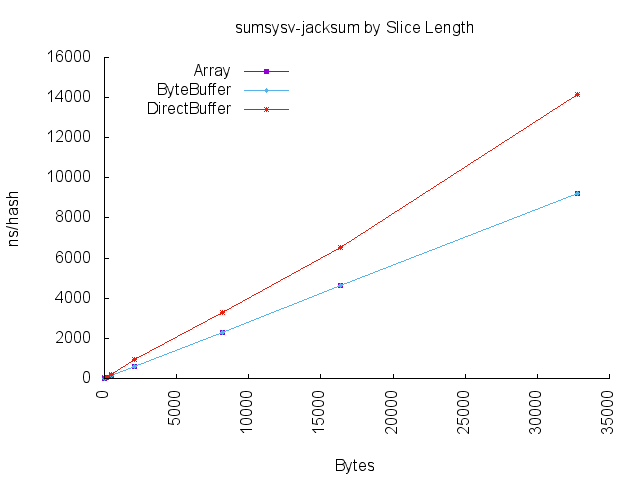

| Length |  Array | ByteBuffer | DirectBuffer |
| --- | ---: | ---: | ---: | 
| [32](#32-byte-slice-latency-all-hashes) | 17.271417 | 19.634085 | 43.307640 |
| [128](#128-byte-slice-latency-all-hashes) | 41.547453 | 43.135244 | 70.977552 |
| [512](#512-byte-slice-latency-all-hashes) | 158.026877 | 156.157012 | 219.540204 |
| [2048](#2048-byte-slice-latency-all-hashes) | 596.256429 | 592.596323 | 946.206741 |
| [8192](#8192-byte-slice-latency-all-hashes) | 2309.631712 | 2311.203018 | 3313.764963 |
| [16384](#16384-byte-slice-latency-all-hashes) | 4628.252524 | 4631.768699 | 6530.469565 |
| [32768](#32768-byte-slice-latency-all-hashes) | 9223.817815 | 9240.893394 | 14134.740867 |

---
### tiger128-jacksum Latency
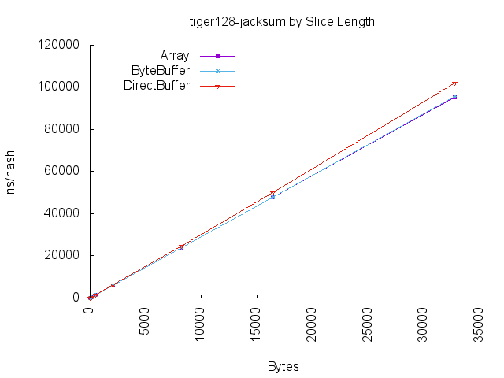

| Length |  Array | ByteBuffer | DirectBuffer |
| --- | ---: | ---: | ---: | 
| [32](#32-byte-slice-latency-all-hashes) | 26.488782 | 16.836502 | 49.204903 |
| [128](#128-byte-slice-latency-all-hashes) | 403.148946 | 386.998415 | 433.634198 |
| [512](#512-byte-slice-latency-all-hashes) | 1524.061573 | 1517.167654 | 1588.389081 |
| [2048](#2048-byte-slice-latency-all-hashes) | 5998.689754 | 6037.413964 | 6401.256791 |
| [8192](#8192-byte-slice-latency-all-hashes) | 24017.520948 | 23868.610820 | 24790.834254 |
| [16384](#16384-byte-slice-latency-all-hashes) | 47737.811472 | 48032.238860 | 50176.830902 |
| [32768](#32768-byte-slice-latency-all-hashes) | 95383.855164 | 95605.476538 | 102092.319994 |

---
### tiger160-jacksum Latency
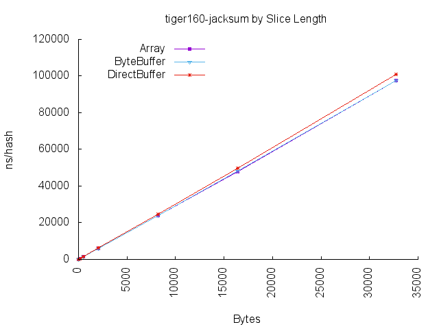

| Length |  Array | ByteBuffer | DirectBuffer |
| --- | ---: | ---: | ---: | 
| [32](#32-byte-slice-latency-all-hashes) | 26.528705 | 17.790141 | 50.260849 |
| [128](#128-byte-slice-latency-all-hashes) | 399.473227 | 386.428280 | 429.483193 |
| [512](#512-byte-slice-latency-all-hashes) | 1524.365681 | 1502.583442 | 1566.208604 |
| [2048](#2048-byte-slice-latency-all-hashes) | 5988.040932 | 5995.510901 | 6326.061656 |
| [8192](#8192-byte-slice-latency-all-hashes) | 24001.498922 | 23855.950425 | 24796.740969 |
| [16384](#16384-byte-slice-latency-all-hashes) | 47766.429047 | 48212.128472 | 49610.605580 |
| [32768](#32768-byte-slice-latency-all-hashes) | 97472.107392 | 97441.630340 | 101024.946153 |

---
### tiger2-jacksum Latency
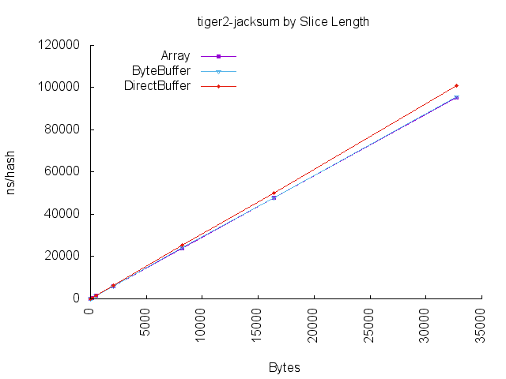

| Length |  Array | ByteBuffer | DirectBuffer |
| --- | ---: | ---: | ---: | 
| [32](#32-byte-slice-latency-all-hashes) | 27.088493 | 17.110077 | 49.082638 |
| [128](#128-byte-slice-latency-all-hashes) | 400.952911 | 386.119405 | 424.707181 |
| [512](#512-byte-slice-latency-all-hashes) | 1513.759149 | 1505.205232 | 1582.616643 |
| [2048](#2048-byte-slice-latency-all-hashes) | 6048.334108 | 6011.815308 | 6275.562162 |
| [8192](#8192-byte-slice-latency-all-hashes) | 23888.937503 | 24115.622900 | 25234.403880 |
| [16384](#16384-byte-slice-latency-all-hashes) | 47738.384470 | 48011.419352 | 50171.580949 |
| [32768](#32768-byte-slice-latency-all-hashes) | 95498.042368 | 95628.782424 | 101110.096770 |

---
### tiger2-jacksum-tree Latency

| Length |  Array | ByteBuffer | DirectBuffer |
| --- | ---: | ---: | ---: | 
| [32](#32-byte-slice-latency-all-hashes) | 29.319706 | 24.934032 | 54.226594 |
| [128](#128-byte-slice-latency-all-hashes) | 27.499859 | 26.354034 | 52.068442 |
| [512](#512-byte-slice-latency-all-hashes) | 44.209227 | 35.022570 | 96.398291 |
| [2048](#2048-byte-slice-latency-all-hashes) | 6661.266645 | 6706.039700 | 7127.936208 |
| [8192](#8192-byte-slice-latency-all-hashes) | 26594.166070 | 26611.162949 | 27702.550074 |
| [16384](#16384-byte-slice-latency-all-hashes) | 52631.566675 | 52903.379786 | 54727.704096 |
| [32768](#32768-byte-slice-latency-all-hashes) | 105007.806929 | 105262.562470 | 109222.012433 |

---
### tiger-jacksum Latency
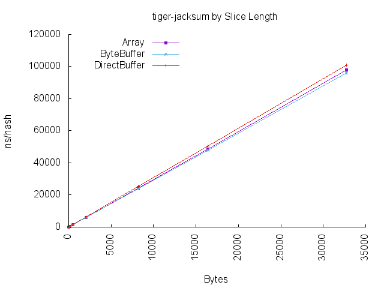

| Length |  Array | ByteBuffer | DirectBuffer |
| --- | ---: | ---: | ---: | 
| [32](#32-byte-slice-latency-all-hashes) | 26.847902 | 17.689964 | 49.590320 |
| [128](#128-byte-slice-latency-all-hashes) | 402.771481 | 388.482410 | 431.476851 |
| [512](#512-byte-slice-latency-all-hashes) | 1523.288844 | 1526.725068 | 1608.774972 |
| [2048](#2048-byte-slice-latency-all-hashes) | 6108.313481 | 5981.958083 | 6477.933086 |
| [8192](#8192-byte-slice-latency-all-hashes) | 24389.786966 | 23871.726814 | 25285.811004 |
| [16384](#16384-byte-slice-latency-all-hashes) | 48776.906424 | 47913.011493 | 50451.612014 |
| [32768](#32768-byte-slice-latency-all-hashes) | 97863.983290 | 96132.570251 | 100905.306578 |

---
### tiger-jacksum-tree Latency

| Length |  Array | ByteBuffer | DirectBuffer |
| --- | ---: | ---: | ---: | 
| [32](#32-byte-slice-latency-all-hashes) | 28.008191 | 28.128707 | 49.706950 |
| [128](#128-byte-slice-latency-all-hashes) | 32.008946 | 30.141155 | 55.596663 |
| [512](#512-byte-slice-latency-all-hashes) | 39.109342 | 37.491375 | 94.903540 |
| [2048](#2048-byte-slice-latency-all-hashes) | 6654.187024 | 6652.057092 | 6828.581179 |
| [8192](#8192-byte-slice-latency-all-hashes) | 26761.136439 | 26486.135002 | 27652.989036 |
| [16384](#16384-byte-slice-latency-all-hashes) | 53165.272632 | 52872.690028 | 54353.130861 |
| [32768](#32768-byte-slice-latency-all-hashes) | 108590.350997 | 106460.094247 | 111051.543187 |

---
### whirlpool0-jacksum Latency
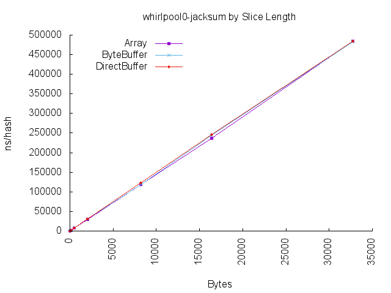

| Length |  Array | ByteBuffer | DirectBuffer |
| --- | ---: | ---: | ---: | 
| [32](#32-byte-slice-latency-all-hashes) | 25.841377 | 19.792608 | 48.426662 |
| [128](#128-byte-slice-latency-all-hashes) | 1904.155425 | 1926.137742 | 1969.685250 |
| [512](#512-byte-slice-latency-all-hashes) | 7627.928266 | 7625.906925 | 7729.036374 |
| [2048](#2048-byte-slice-latency-all-hashes) | 29595.315068 | 30480.888066 | 31182.102301 |
| [8192](#8192-byte-slice-latency-all-hashes) | 117632.897384 | 117833.521803 | 123286.460834 |
| [16384](#16384-byte-slice-latency-all-hashes) | 237127.191511 | 243783.989656 | 246157.371295 |
| [32768](#32768-byte-slice-latency-all-hashes) | 484853.172821 | 482709.702055 | 483830.076007 |

---
### whirlpool1-jacksum Latency
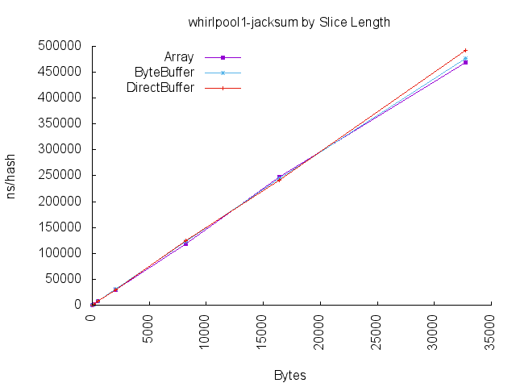

| Length |  Array | ByteBuffer | DirectBuffer |
| --- | ---: | ---: | ---: | 
| [32](#32-byte-slice-latency-all-hashes) | 26.588824 | 16.730640 | 50.142192 |
| [128](#128-byte-slice-latency-all-hashes) | 1927.817971 | 1895.735361 | 1970.968791 |
| [512](#512-byte-slice-latency-all-hashes) | 7560.692321 | 7548.072068 | 7735.364425 |
| [2048](#2048-byte-slice-latency-all-hashes) | 30251.839884 | 30377.361498 | 29953.156234 |
| [8192](#8192-byte-slice-latency-all-hashes) | 119113.653255 | 122372.303048 | 125218.216235 |
| [16384](#16384-byte-slice-latency-all-hashes) | 247174.970552 | 244010.526723 | 241942.754114 |
| [32768](#32768-byte-slice-latency-all-hashes) | 469321.607481 | 476308.109970 | 492983.249682 |

---
### whirlpool2-jacksum Latency
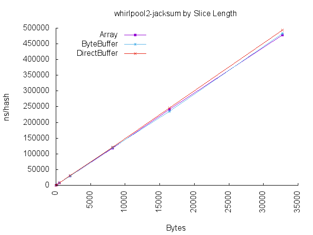

| Length |  Array | ByteBuffer | DirectBuffer |
| --- | ---: | ---: | ---: | 
| [32](#32-byte-slice-latency-all-hashes) | 26.069477 | 16.239426 | 48.689706 |
| [128](#128-byte-slice-latency-all-hashes) | 1920.538592 | 1909.923108 | 1937.615923 |
| [512](#512-byte-slice-latency-all-hashes) | 7623.106365 | 7422.279444 | 7795.903170 |
| [2048](#2048-byte-slice-latency-all-hashes) | 29990.335505 | 30162.292494 | 31675.383364 |
| [8192](#8192-byte-slice-latency-all-hashes) | 118514.359228 | 120334.967298 | 120973.592741 |
| [16384](#16384-byte-slice-latency-all-hashes) | 241810.054683 | 235886.993836 | 246559.223646 |
| [32768](#32768-byte-slice-latency-all-hashes) | 478422.470851 | 482213.507531 | 493999.113663 |

---
### xor8-jacksum Latency
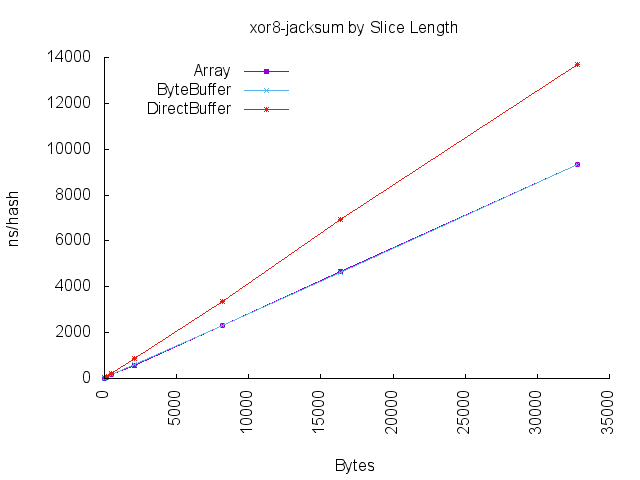

| Length |  Array | ByteBuffer | DirectBuffer |
| --- | ---: | ---: | ---: | 
| [32](#32-byte-slice-latency-all-hashes) | 15.194281 | 16.622790 | 44.133850 |
| [128](#128-byte-slice-latency-all-hashes) | 40.908379 | 44.027816 | 73.310005 |
| [512](#512-byte-slice-latency-all-hashes) | 154.441668 | 155.112883 | 224.301715 |
| [2048](#2048-byte-slice-latency-all-hashes) | 588.187371 | 596.002841 | 859.436093 |
| [8192](#8192-byte-slice-latency-all-hashes) | 2310.005723 | 2328.296939 | 3367.966559 |
| [16384](#16384-byte-slice-latency-all-hashes) | 4656.763264 | 4614.455597 | 6932.428822 |
| [32768](#32768-byte-slice-latency-all-hashes) | 9345.208621 | 9340.359615 | 13674.804599 |

---
### xxh32-jpountz-jni Latency
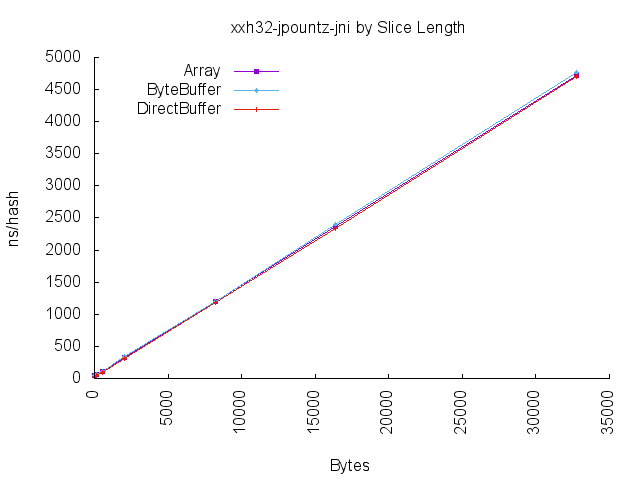

| Length |  Array | ByteBuffer | DirectBuffer |
| --- | ---: | ---: | ---: | 
| [32](#32-byte-slice-latency-all-hashes) | 41.505521 | 44.067091 | 33.495427 |
| [128](#128-byte-slice-latency-all-hashes) | 55.035716 | 56.676609 | 46.841770 |
| [512](#512-byte-slice-latency-all-hashes) | 109.278624 | 111.994510 | 100.114678 |
| [2048](#2048-byte-slice-latency-all-hashes) | 328.306468 | 338.901800 | 318.139058 |
| [8192](#8192-byte-slice-latency-all-hashes) | 1200.529533 | 1203.851012 | 1187.393829 |
| [16384](#16384-byte-slice-latency-all-hashes) | 2364.496845 | 2393.872919 | 2339.794759 |
| [32768](#32768-byte-slice-latency-all-hashes) | 4726.984984 | 4771.456709 | 4709.882284 |

---
### xxh32-jpountz-safe Latency
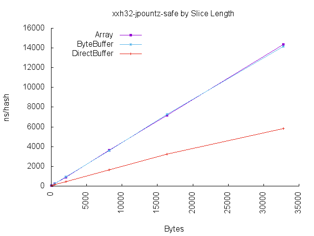

| Length |  Array | ByteBuffer | DirectBuffer |
| --- | ---: | ---: | ---: | 
| [32](#32-byte-slice-latency-all-hashes) | 25.697881 | 27.571718 | 26.802901 |
| [128](#128-byte-slice-latency-all-hashes) | 67.576606 | 68.960676 | 50.926180 |
| [512](#512-byte-slice-latency-all-hashes) | 234.506435 | 238.203119 | 128.669890 |
| [2048](#2048-byte-slice-latency-all-hashes) | 919.809915 | 930.895437 | 432.192072 |
| [8192](#8192-byte-slice-latency-all-hashes) | 3641.055372 | 3608.235804 | 1641.435385 |
| [16384](#16384-byte-slice-latency-all-hashes) | 7186.639750 | 7295.760909 | 3215.444458 |
| [32768](#32768-byte-slice-latency-all-hashes) | 14356.302721 | 14175.332994 | 5822.125330 |

---
### xxh32-jpountz-unsafe Latency
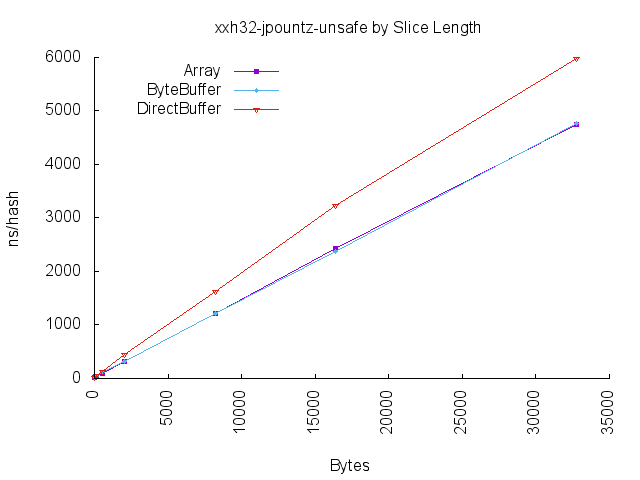

| Length |  Array | ByteBuffer | DirectBuffer |
| --- | ---: | ---: | ---: | 
| [32](#32-byte-slice-latency-all-hashes) | 14.260742 | 17.419101 | 27.151546 |
| [128](#128-byte-slice-latency-all-hashes) | 30.769773 | 33.735420 | 50.614023 |
| [512](#512-byte-slice-latency-all-hashes) | 98.926931 | 109.738485 | 131.124170 |
| [2048](#2048-byte-slice-latency-all-hashes) | 324.159446 | 323.621201 | 442.417079 |
| [8192](#8192-byte-slice-latency-all-hashes) | 1214.526090 | 1216.154115 | 1628.714059 |
| [16384](#16384-byte-slice-latency-all-hashes) | 2421.882980 | 2369.530716 | 3238.321127 |
| [32768](#32768-byte-slice-latency-all-hashes) | 4746.235647 | 4759.289277 | 5980.843144 |

---
### xxh64-jpountz-jni Latency
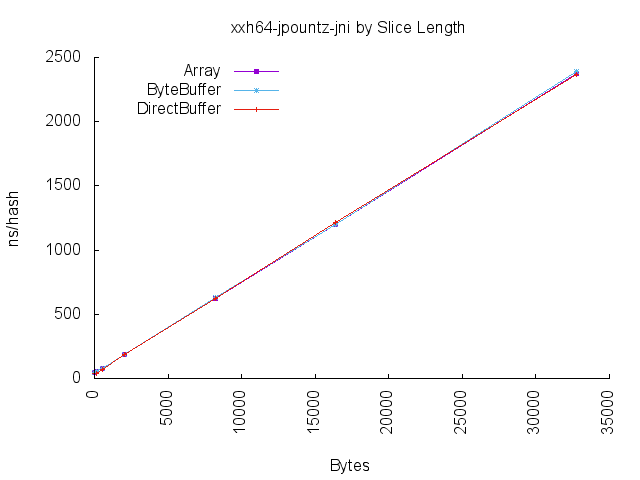

| Length |  Array | ByteBuffer | DirectBuffer |
| --- | ---: | ---: | ---: | 
| [32](#32-byte-slice-latency-all-hashes) | 43.814757 | 45.168805 | 36.367785 |
| [128](#128-byte-slice-latency-all-hashes) | 52.544770 | 51.453524 | 42.009927 |
| [512](#512-byte-slice-latency-all-hashes) | 77.421699 | 78.923652 | 69.180132 |
| [2048](#2048-byte-slice-latency-all-hashes) | 187.453318 | 189.863714 | 183.313766 |
| [8192](#8192-byte-slice-latency-all-hashes) | 620.883536 | 630.420165 | 620.569532 |
| [16384](#16384-byte-slice-latency-all-hashes) | 1197.660703 | 1201.998933 | 1211.975926 |
| [32768](#32768-byte-slice-latency-all-hashes) | 2376.727740 | 2388.643764 | 2369.197092 |

---
### xxh64-jpountz-safe Latency
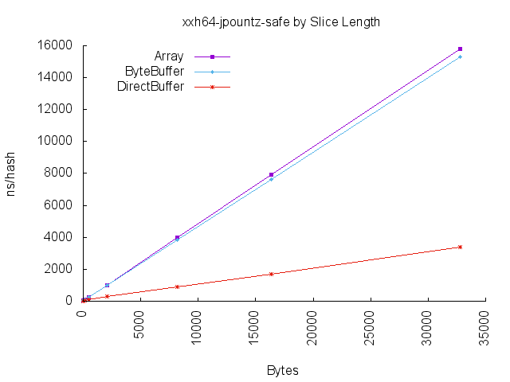

| Length |  Array | ByteBuffer | DirectBuffer |
| --- | ---: | ---: | ---: | 
| [32](#32-byte-slice-latency-all-hashes) | 28.623023 | 30.528221 | 21.662452 |
| [128](#128-byte-slice-latency-all-hashes) | 78.471688 | 79.481682 | 43.949058 |
| [512](#512-byte-slice-latency-all-hashes) | 264.619271 | 260.910056 | 95.510734 |
| [2048](#2048-byte-slice-latency-all-hashes) | 999.375627 | 974.838535 | 280.889614 |
| [8192](#8192-byte-slice-latency-all-hashes) | 3994.910016 | 3843.408505 | 908.517093 |
| [16384](#16384-byte-slice-latency-all-hashes) | 7922.493192 | 7637.044154 | 1718.337296 |
| [32768](#32768-byte-slice-latency-all-hashes) | 15800.760205 | 15291.107410 | 3377.818593 |

---
### xxh64-jpountz-unsafe Latency
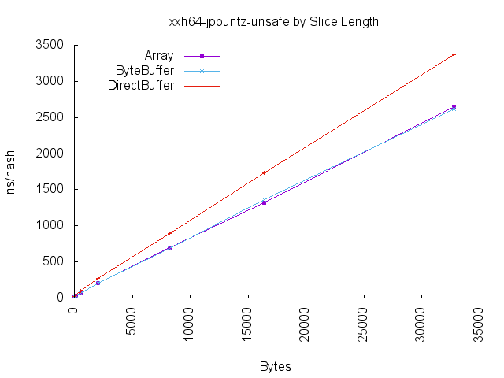

| Length |  Array | ByteBuffer | DirectBuffer |
| --- | ---: | ---: | ---: | 
| [32](#32-byte-slice-latency-all-hashes) | 16.430654 | 19.863634 | 21.556369 |
| [128](#128-byte-slice-latency-all-hashes) | 27.601338 | 28.992751 | 45.090046 |
| [512](#512-byte-slice-latency-all-hashes) | 67.150554 | 70.471460 | 95.899078 |
| [2048](#2048-byte-slice-latency-all-hashes) | 207.720946 | 209.103336 | 272.441819 |
| [8192](#8192-byte-slice-latency-all-hashes) | 696.065361 | 690.233439 | 897.614858 |
| [16384](#16384-byte-slice-latency-all-hashes) | 1313.970642 | 1360.907791 | 1728.380012 |
| [32768](#32768-byte-slice-latency-all-hashes) | 2647.459702 | 2621.075569 | 3371.275595 |

---
### xxh64-zah Latency
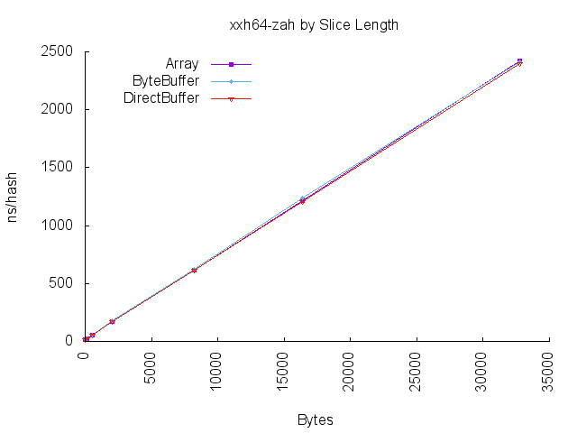

| Length |  Array | ByteBuffer | DirectBuffer |
| --- | ---: | ---: | ---: | 
| [32](#32-byte-slice-latency-all-hashes) | 16.771157 | 17.314706 | 17.786823 |
| [128](#128-byte-slice-latency-all-hashes) | 23.668633 | 26.549352 | 25.390800 |
| [512](#512-byte-slice-latency-all-hashes) | 55.304471 | 55.838139 | 57.998957 |
| [2048](#2048-byte-slice-latency-all-hashes) | 172.188990 | 176.949117 | 174.934754 |
| [8192](#8192-byte-slice-latency-all-hashes) | 613.090857 | 619.815052 | 615.756005 |
| [16384](#16384-byte-slice-latency-all-hashes) | 1212.721166 | 1235.344336 | 1205.065016 |
| [32768](#32768-byte-slice-latency-all-hashes) | 2424.245503 | 2416.293540 | 2399.143768 |

---
Generated from [JMH CSV](jmh-result.csv) on Tue, 29 Sep 2015 23:30:26 +0000 by [Hash-Bench](https://github.com/benalexau/hash-bench).
