# Hash-Bench Results
## Contents
### Latency by Byte Slice Length
| Hash | 32 |128 |512 |2048 |8192 |16384 |32768 |
| --- | :---: | :---: | :---: | :---: | :---: | :---: | :---: | 
| All | [*](#32-byte-slice-latency-all-hashes) | [*](#128-byte-slice-latency-all-hashes) | [*](#512-byte-slice-latency-all-hashes) | [*](#2048-byte-slice-latency-all-hashes) | [*](#8192-byte-slice-latency-all-hashes) | [*](#16384-byte-slice-latency-all-hashes) | [*](#32768-byte-slice-latency-all-hashes) | 
| adler32 | [*](#32-byte-slice-latency-adler32) | [*](#128-byte-slice-latency-adler32) | [*](#512-byte-slice-latency-adler32) | [*](#2048-byte-slice-latency-adler32) | [*](#8192-byte-slice-latency-adler32) | [*](#16384-byte-slice-latency-adler32) | [*](#32768-byte-slice-latency-adler32) | 
| city64 | [*](#32-byte-slice-latency-city64) | [*](#128-byte-slice-latency-city64) | [*](#512-byte-slice-latency-city64) | [*](#2048-byte-slice-latency-city64) | [*](#8192-byte-slice-latency-city64) | [*](#16384-byte-slice-latency-city64) | [*](#32768-byte-slice-latency-city64) | 
| cksum | [*](#32-byte-slice-latency-cksum) | [*](#128-byte-slice-latency-cksum) | [*](#512-byte-slice-latency-cksum) | [*](#2048-byte-slice-latency-cksum) | [*](#8192-byte-slice-latency-cksum) | [*](#16384-byte-slice-latency-cksum) | [*](#32768-byte-slice-latency-cksum) | 
| crc16 | [*](#32-byte-slice-latency-crc16) | [*](#128-byte-slice-latency-crc16) | [*](#512-byte-slice-latency-crc16) | [*](#2048-byte-slice-latency-crc16) | [*](#8192-byte-slice-latency-crc16) | [*](#16384-byte-slice-latency-crc16) | [*](#32768-byte-slice-latency-crc16) | 
| crc24 | [*](#32-byte-slice-latency-crc24) | [*](#128-byte-slice-latency-crc24) | [*](#512-byte-slice-latency-crc24) | [*](#2048-byte-slice-latency-crc24) | [*](#8192-byte-slice-latency-crc24) | [*](#16384-byte-slice-latency-crc24) | [*](#32768-byte-slice-latency-crc24) | 
| crc32 | [*](#32-byte-slice-latency-crc32) | [*](#128-byte-slice-latency-crc32) | [*](#512-byte-slice-latency-crc32) | [*](#2048-byte-slice-latency-crc32) | [*](#8192-byte-slice-latency-crc32) | [*](#16384-byte-slice-latency-crc32) | [*](#32768-byte-slice-latency-crc32) | 
| crc64 | [*](#32-byte-slice-latency-crc64) | [*](#128-byte-slice-latency-crc64) | [*](#512-byte-slice-latency-crc64) | [*](#2048-byte-slice-latency-crc64) | [*](#8192-byte-slice-latency-crc64) | [*](#16384-byte-slice-latency-crc64) | [*](#32768-byte-slice-latency-crc64) | 
| crc8 | [*](#32-byte-slice-latency-crc8) | [*](#128-byte-slice-latency-crc8) | [*](#512-byte-slice-latency-crc8) | [*](#2048-byte-slice-latency-crc8) | [*](#8192-byte-slice-latency-crc8) | [*](#16384-byte-slice-latency-crc8) | [*](#32768-byte-slice-latency-crc8) | 
| ed2k | [*](#32-byte-slice-latency-ed2k) | [*](#128-byte-slice-latency-ed2k) | [*](#512-byte-slice-latency-ed2k) | [*](#2048-byte-slice-latency-ed2k) | [*](#8192-byte-slice-latency-ed2k) | [*](#16384-byte-slice-latency-ed2k) | [*](#32768-byte-slice-latency-ed2k) | 
| elf | [*](#32-byte-slice-latency-elf) | [*](#128-byte-slice-latency-elf) | [*](#512-byte-slice-latency-elf) | [*](#2048-byte-slice-latency-elf) | [*](#8192-byte-slice-latency-elf) | [*](#16384-byte-slice-latency-elf) | [*](#32768-byte-slice-latency-elf) | 
| farmna | [*](#32-byte-slice-latency-farmna) | [*](#128-byte-slice-latency-farmna) | [*](#512-byte-slice-latency-farmna) | [*](#2048-byte-slice-latency-farmna) | [*](#8192-byte-slice-latency-farmna) | [*](#16384-byte-slice-latency-farmna) | [*](#32768-byte-slice-latency-farmna) | 
| farmuo | [*](#32-byte-slice-latency-farmuo) | [*](#128-byte-slice-latency-farmuo) | [*](#512-byte-slice-latency-farmuo) | [*](#2048-byte-slice-latency-farmuo) | [*](#8192-byte-slice-latency-farmuo) | [*](#16384-byte-slice-latency-farmuo) | [*](#32768-byte-slice-latency-farmuo) | 
| fcs16 | [*](#32-byte-slice-latency-fcs16) | [*](#128-byte-slice-latency-fcs16) | [*](#512-byte-slice-latency-fcs16) | [*](#2048-byte-slice-latency-fcs16) | [*](#8192-byte-slice-latency-fcs16) | [*](#16384-byte-slice-latency-fcs16) | [*](#32768-byte-slice-latency-fcs16) | 
| gfh32 | [*](#32-byte-slice-latency-gfh32) | [*](#128-byte-slice-latency-gfh32) | [*](#512-byte-slice-latency-gfh32) | [*](#2048-byte-slice-latency-gfh32) | [*](#8192-byte-slice-latency-gfh32) | [*](#16384-byte-slice-latency-gfh32) | [*](#32768-byte-slice-latency-gfh32) | 
| gfh64 | [*](#32-byte-slice-latency-gfh64) | [*](#128-byte-slice-latency-gfh64) | [*](#512-byte-slice-latency-gfh64) | [*](#2048-byte-slice-latency-gfh64) | [*](#8192-byte-slice-latency-gfh64) | [*](#16384-byte-slice-latency-gfh64) | [*](#32768-byte-slice-latency-gfh64) | 
| gost | [*](#32-byte-slice-latency-gost) | [*](#128-byte-slice-latency-gost) | [*](#512-byte-slice-latency-gost) | [*](#2048-byte-slice-latency-gost) | [*](#8192-byte-slice-latency-gost) | [*](#16384-byte-slice-latency-gost) | [*](#32768-byte-slice-latency-gost) | 
| has160 | [*](#32-byte-slice-latency-has160) | [*](#128-byte-slice-latency-has160) | [*](#512-byte-slice-latency-has160) | [*](#2048-byte-slice-latency-has160) | [*](#8192-byte-slice-latency-has160) | [*](#16384-byte-slice-latency-has160) | [*](#32768-byte-slice-latency-has160) | 
| haval128h3 | [*](#32-byte-slice-latency-haval128h3) | [*](#128-byte-slice-latency-haval128h3) | [*](#512-byte-slice-latency-haval128h3) | [*](#2048-byte-slice-latency-haval128h3) | [*](#8192-byte-slice-latency-haval128h3) | [*](#16384-byte-slice-latency-haval128h3) | [*](#32768-byte-slice-latency-haval128h3) | 
| haval128h4 | [*](#32-byte-slice-latency-haval128h4) | [*](#128-byte-slice-latency-haval128h4) | [*](#512-byte-slice-latency-haval128h4) | [*](#2048-byte-slice-latency-haval128h4) | [*](#8192-byte-slice-latency-haval128h4) | [*](#16384-byte-slice-latency-haval128h4) | [*](#32768-byte-slice-latency-haval128h4) | 
| haval128h5 | [*](#32-byte-slice-latency-haval128h5) | [*](#128-byte-slice-latency-haval128h5) | [*](#512-byte-slice-latency-haval128h5) | [*](#2048-byte-slice-latency-haval128h5) | [*](#8192-byte-slice-latency-haval128h5) | [*](#16384-byte-slice-latency-haval128h5) | [*](#32768-byte-slice-latency-haval128h5) | 
| haval160h3 | [*](#32-byte-slice-latency-haval160h3) | [*](#128-byte-slice-latency-haval160h3) | [*](#512-byte-slice-latency-haval160h3) | [*](#2048-byte-slice-latency-haval160h3) | [*](#8192-byte-slice-latency-haval160h3) | [*](#16384-byte-slice-latency-haval160h3) | [*](#32768-byte-slice-latency-haval160h3) | 
| haval160h4 | [*](#32-byte-slice-latency-haval160h4) | [*](#128-byte-slice-latency-haval160h4) | [*](#512-byte-slice-latency-haval160h4) | [*](#2048-byte-slice-latency-haval160h4) | [*](#8192-byte-slice-latency-haval160h4) | [*](#16384-byte-slice-latency-haval160h4) | [*](#32768-byte-slice-latency-haval160h4) | 
| haval160h5 | [*](#32-byte-slice-latency-haval160h5) | [*](#128-byte-slice-latency-haval160h5) | [*](#512-byte-slice-latency-haval160h5) | [*](#2048-byte-slice-latency-haval160h5) | [*](#8192-byte-slice-latency-haval160h5) | [*](#16384-byte-slice-latency-haval160h5) | [*](#32768-byte-slice-latency-haval160h5) | 
| haval192h3 | [*](#32-byte-slice-latency-haval192h3) | [*](#128-byte-slice-latency-haval192h3) | [*](#512-byte-slice-latency-haval192h3) | [*](#2048-byte-slice-latency-haval192h3) | [*](#8192-byte-slice-latency-haval192h3) | [*](#16384-byte-slice-latency-haval192h3) | [*](#32768-byte-slice-latency-haval192h3) | 
| haval192h4 | [*](#32-byte-slice-latency-haval192h4) | [*](#128-byte-slice-latency-haval192h4) | [*](#512-byte-slice-latency-haval192h4) | [*](#2048-byte-slice-latency-haval192h4) | [*](#8192-byte-slice-latency-haval192h4) | [*](#16384-byte-slice-latency-haval192h4) | [*](#32768-byte-slice-latency-haval192h4) | 
| haval192h5 | [*](#32-byte-slice-latency-haval192h5) | [*](#128-byte-slice-latency-haval192h5) | [*](#512-byte-slice-latency-haval192h5) | [*](#2048-byte-slice-latency-haval192h5) | [*](#8192-byte-slice-latency-haval192h5) | [*](#16384-byte-slice-latency-haval192h5) | [*](#32768-byte-slice-latency-haval192h5) | 
| haval224h3 | [*](#32-byte-slice-latency-haval224h3) | [*](#128-byte-slice-latency-haval224h3) | [*](#512-byte-slice-latency-haval224h3) | [*](#2048-byte-slice-latency-haval224h3) | [*](#8192-byte-slice-latency-haval224h3) | [*](#16384-byte-slice-latency-haval224h3) | [*](#32768-byte-slice-latency-haval224h3) | 
| haval224h4 | [*](#32-byte-slice-latency-haval224h4) | [*](#128-byte-slice-latency-haval224h4) | [*](#512-byte-slice-latency-haval224h4) | [*](#2048-byte-slice-latency-haval224h4) | [*](#8192-byte-slice-latency-haval224h4) | [*](#16384-byte-slice-latency-haval224h4) | [*](#32768-byte-slice-latency-haval224h4) | 
| haval224h5 | [*](#32-byte-slice-latency-haval224h5) | [*](#128-byte-slice-latency-haval224h5) | [*](#512-byte-slice-latency-haval224h5) | [*](#2048-byte-slice-latency-haval224h5) | [*](#8192-byte-slice-latency-haval224h5) | [*](#16384-byte-slice-latency-haval224h5) | [*](#32768-byte-slice-latency-haval224h5) | 
| haval256h3 | [*](#32-byte-slice-latency-haval256h3) | [*](#128-byte-slice-latency-haval256h3) | [*](#512-byte-slice-latency-haval256h3) | [*](#2048-byte-slice-latency-haval256h3) | [*](#8192-byte-slice-latency-haval256h3) | [*](#16384-byte-slice-latency-haval256h3) | [*](#32768-byte-slice-latency-haval256h3) | 
| haval256h4 | [*](#32-byte-slice-latency-haval256h4) | [*](#128-byte-slice-latency-haval256h4) | [*](#512-byte-slice-latency-haval256h4) | [*](#2048-byte-slice-latency-haval256h4) | [*](#8192-byte-slice-latency-haval256h4) | [*](#16384-byte-slice-latency-haval256h4) | [*](#32768-byte-slice-latency-haval256h4) | 
| haval256h5 | [*](#32-byte-slice-latency-haval256h5) | [*](#128-byte-slice-latency-haval256h5) | [*](#512-byte-slice-latency-haval256h5) | [*](#2048-byte-slice-latency-haval256h5) | [*](#8192-byte-slice-latency-haval256h5) | [*](#16384-byte-slice-latency-haval256h5) | [*](#32768-byte-slice-latency-haval256h5) | 
| md2 | [*](#32-byte-slice-latency-md2) | [*](#128-byte-slice-latency-md2) | [*](#512-byte-slice-latency-md2) | [*](#2048-byte-slice-latency-md2) | [*](#8192-byte-slice-latency-md2) | [*](#16384-byte-slice-latency-md2) | [*](#32768-byte-slice-latency-md2) | 
| md4 | [*](#32-byte-slice-latency-md4) | [*](#128-byte-slice-latency-md4) | [*](#512-byte-slice-latency-md4) | [*](#2048-byte-slice-latency-md4) | [*](#8192-byte-slice-latency-md4) | [*](#16384-byte-slice-latency-md4) | [*](#32768-byte-slice-latency-md4) | 
| md5 | [*](#32-byte-slice-latency-md5) | [*](#128-byte-slice-latency-md5) | [*](#512-byte-slice-latency-md5) | [*](#2048-byte-slice-latency-md5) | [*](#8192-byte-slice-latency-md5) | [*](#16384-byte-slice-latency-md5) | [*](#32768-byte-slice-latency-md5) | 
| murmur3h128 | [*](#32-byte-slice-latency-murmur3h128) | [*](#128-byte-slice-latency-murmur3h128) | [*](#512-byte-slice-latency-murmur3h128) | [*](#2048-byte-slice-latency-murmur3h128) | [*](#8192-byte-slice-latency-murmur3h128) | [*](#16384-byte-slice-latency-murmur3h128) | [*](#32768-byte-slice-latency-murmur3h128) | 
| murmur3h32 | [*](#32-byte-slice-latency-murmur3h32) | [*](#128-byte-slice-latency-murmur3h32) | [*](#512-byte-slice-latency-murmur3h32) | [*](#2048-byte-slice-latency-murmur3h32) | [*](#8192-byte-slice-latency-murmur3h32) | [*](#16384-byte-slice-latency-murmur3h32) | [*](#32768-byte-slice-latency-murmur3h32) | 
| ripemd128 | [*](#32-byte-slice-latency-ripemd128) | [*](#128-byte-slice-latency-ripemd128) | [*](#512-byte-slice-latency-ripemd128) | [*](#2048-byte-slice-latency-ripemd128) | [*](#8192-byte-slice-latency-ripemd128) | [*](#16384-byte-slice-latency-ripemd128) | [*](#32768-byte-slice-latency-ripemd128) | 
| ripemd160 | [*](#32-byte-slice-latency-ripemd160) | [*](#128-byte-slice-latency-ripemd160) | [*](#512-byte-slice-latency-ripemd160) | [*](#2048-byte-slice-latency-ripemd160) | [*](#8192-byte-slice-latency-ripemd160) | [*](#16384-byte-slice-latency-ripemd160) | [*](#32768-byte-slice-latency-ripemd160) | 
| ripemd256 | [*](#32-byte-slice-latency-ripemd256) | [*](#128-byte-slice-latency-ripemd256) | [*](#512-byte-slice-latency-ripemd256) | [*](#2048-byte-slice-latency-ripemd256) | [*](#8192-byte-slice-latency-ripemd256) | [*](#16384-byte-slice-latency-ripemd256) | [*](#32768-byte-slice-latency-ripemd256) | 
| ripemd320 | [*](#32-byte-slice-latency-ripemd320) | [*](#128-byte-slice-latency-ripemd320) | [*](#512-byte-slice-latency-ripemd320) | [*](#2048-byte-slice-latency-ripemd320) | [*](#8192-byte-slice-latency-ripemd320) | [*](#16384-byte-slice-latency-ripemd320) | [*](#32768-byte-slice-latency-ripemd320) | 
| sha0 | [*](#32-byte-slice-latency-sha0) | [*](#128-byte-slice-latency-sha0) | [*](#512-byte-slice-latency-sha0) | [*](#2048-byte-slice-latency-sha0) | [*](#8192-byte-slice-latency-sha0) | [*](#16384-byte-slice-latency-sha0) | [*](#32768-byte-slice-latency-sha0) | 
| sha1 | [*](#32-byte-slice-latency-sha1) | [*](#128-byte-slice-latency-sha1) | [*](#512-byte-slice-latency-sha1) | [*](#2048-byte-slice-latency-sha1) | [*](#8192-byte-slice-latency-sha1) | [*](#16384-byte-slice-latency-sha1) | [*](#32768-byte-slice-latency-sha1) | 
| sha224 | [*](#32-byte-slice-latency-sha224) | [*](#128-byte-slice-latency-sha224) | [*](#512-byte-slice-latency-sha224) | [*](#2048-byte-slice-latency-sha224) | [*](#8192-byte-slice-latency-sha224) | [*](#16384-byte-slice-latency-sha224) | [*](#32768-byte-slice-latency-sha224) | 
| sha256 | [*](#32-byte-slice-latency-sha256) | [*](#128-byte-slice-latency-sha256) | [*](#512-byte-slice-latency-sha256) | [*](#2048-byte-slice-latency-sha256) | [*](#8192-byte-slice-latency-sha256) | [*](#16384-byte-slice-latency-sha256) | [*](#32768-byte-slice-latency-sha256) | 
| sha3 | [*](#32-byte-slice-latency-sha3) | [*](#128-byte-slice-latency-sha3) | [*](#512-byte-slice-latency-sha3) | [*](#2048-byte-slice-latency-sha3) | [*](#8192-byte-slice-latency-sha3) | [*](#16384-byte-slice-latency-sha3) | [*](#32768-byte-slice-latency-sha3) | 
| sha384 | [*](#32-byte-slice-latency-sha384) | [*](#128-byte-slice-latency-sha384) | [*](#512-byte-slice-latency-sha384) | [*](#2048-byte-slice-latency-sha384) | [*](#8192-byte-slice-latency-sha384) | [*](#16384-byte-slice-latency-sha384) | [*](#32768-byte-slice-latency-sha384) | 
| sha512 | [*](#32-byte-slice-latency-sha512) | [*](#128-byte-slice-latency-sha512) | [*](#512-byte-slice-latency-sha512) | [*](#2048-byte-slice-latency-sha512) | [*](#8192-byte-slice-latency-sha512) | [*](#16384-byte-slice-latency-sha512) | [*](#32768-byte-slice-latency-sha512) | 
| sip | [*](#32-byte-slice-latency-sip) | [*](#128-byte-slice-latency-sip) | [*](#512-byte-slice-latency-sip) | [*](#2048-byte-slice-latency-sip) | [*](#8192-byte-slice-latency-sip) | [*](#16384-byte-slice-latency-sip) | [*](#32768-byte-slice-latency-sip) | 
| skein1024 | [*](#32-byte-slice-latency-skein1024) | [*](#128-byte-slice-latency-skein1024) | [*](#512-byte-slice-latency-skein1024) | [*](#2048-byte-slice-latency-skein1024) | [*](#8192-byte-slice-latency-skein1024) | [*](#16384-byte-slice-latency-skein1024) | [*](#32768-byte-slice-latency-skein1024) | 
| skein256 | [*](#32-byte-slice-latency-skein256) | [*](#128-byte-slice-latency-skein256) | [*](#512-byte-slice-latency-skein256) | [*](#2048-byte-slice-latency-skein256) | [*](#8192-byte-slice-latency-skein256) | [*](#16384-byte-slice-latency-skein256) | [*](#32768-byte-slice-latency-skein256) | 
| skein512 | [*](#32-byte-slice-latency-skein512) | [*](#128-byte-slice-latency-skein512) | [*](#512-byte-slice-latency-skein512) | [*](#2048-byte-slice-latency-skein512) | [*](#8192-byte-slice-latency-skein512) | [*](#16384-byte-slice-latency-skein512) | [*](#32768-byte-slice-latency-skein512) | 
| sm3 | [*](#32-byte-slice-latency-sm3) | [*](#128-byte-slice-latency-sm3) | [*](#512-byte-slice-latency-sm3) | [*](#2048-byte-slice-latency-sm3) | [*](#8192-byte-slice-latency-sm3) | [*](#16384-byte-slice-latency-sm3) | [*](#32768-byte-slice-latency-sm3) | 
| sum16 | [*](#32-byte-slice-latency-sum16) | [*](#128-byte-slice-latency-sum16) | [*](#512-byte-slice-latency-sum16) | [*](#2048-byte-slice-latency-sum16) | [*](#8192-byte-slice-latency-sum16) | [*](#16384-byte-slice-latency-sum16) | [*](#32768-byte-slice-latency-sum16) | 
| sum24 | [*](#32-byte-slice-latency-sum24) | [*](#128-byte-slice-latency-sum24) | [*](#512-byte-slice-latency-sum24) | [*](#2048-byte-slice-latency-sum24) | [*](#8192-byte-slice-latency-sum24) | [*](#16384-byte-slice-latency-sum24) | [*](#32768-byte-slice-latency-sum24) | 
| sum32 | [*](#32-byte-slice-latency-sum32) | [*](#128-byte-slice-latency-sum32) | [*](#512-byte-slice-latency-sum32) | [*](#2048-byte-slice-latency-sum32) | [*](#8192-byte-slice-latency-sum32) | [*](#16384-byte-slice-latency-sum32) | [*](#32768-byte-slice-latency-sum32) | 
| sum8 | [*](#32-byte-slice-latency-sum8) | [*](#128-byte-slice-latency-sum8) | [*](#512-byte-slice-latency-sum8) | [*](#2048-byte-slice-latency-sum8) | [*](#8192-byte-slice-latency-sum8) | [*](#16384-byte-slice-latency-sum8) | [*](#32768-byte-slice-latency-sum8) | 
| sumbsd | [*](#32-byte-slice-latency-sumbsd) | [*](#128-byte-slice-latency-sumbsd) | [*](#512-byte-slice-latency-sumbsd) | [*](#2048-byte-slice-latency-sumbsd) | [*](#8192-byte-slice-latency-sumbsd) | [*](#16384-byte-slice-latency-sumbsd) | [*](#32768-byte-slice-latency-sumbsd) | 
| sumsysv | [*](#32-byte-slice-latency-sumsysv) | [*](#128-byte-slice-latency-sumsysv) | [*](#512-byte-slice-latency-sumsysv) | [*](#2048-byte-slice-latency-sumsysv) | [*](#8192-byte-slice-latency-sumsysv) | [*](#16384-byte-slice-latency-sumsysv) | [*](#32768-byte-slice-latency-sumsysv) | 
| tiger | [*](#32-byte-slice-latency-tiger) | [*](#128-byte-slice-latency-tiger) | [*](#512-byte-slice-latency-tiger) | [*](#2048-byte-slice-latency-tiger) | [*](#8192-byte-slice-latency-tiger) | [*](#16384-byte-slice-latency-tiger) | [*](#32768-byte-slice-latency-tiger) | 
| tiger128 | [*](#32-byte-slice-latency-tiger128) | [*](#128-byte-slice-latency-tiger128) | [*](#512-byte-slice-latency-tiger128) | [*](#2048-byte-slice-latency-tiger128) | [*](#8192-byte-slice-latency-tiger128) | [*](#16384-byte-slice-latency-tiger128) | [*](#32768-byte-slice-latency-tiger128) | 
| tiger160 | [*](#32-byte-slice-latency-tiger160) | [*](#128-byte-slice-latency-tiger160) | [*](#512-byte-slice-latency-tiger160) | [*](#2048-byte-slice-latency-tiger160) | [*](#8192-byte-slice-latency-tiger160) | [*](#16384-byte-slice-latency-tiger160) | [*](#32768-byte-slice-latency-tiger160) | 
| tiger2 | [*](#32-byte-slice-latency-tiger2) | [*](#128-byte-slice-latency-tiger2) | [*](#512-byte-slice-latency-tiger2) | [*](#2048-byte-slice-latency-tiger2) | [*](#8192-byte-slice-latency-tiger2) | [*](#16384-byte-slice-latency-tiger2) | [*](#32768-byte-slice-latency-tiger2) | 
| whirlpool0 | [*](#32-byte-slice-latency-whirlpool0) | [*](#128-byte-slice-latency-whirlpool0) | [*](#512-byte-slice-latency-whirlpool0) | [*](#2048-byte-slice-latency-whirlpool0) | [*](#8192-byte-slice-latency-whirlpool0) | [*](#16384-byte-slice-latency-whirlpool0) | [*](#32768-byte-slice-latency-whirlpool0) | 
| whirlpool1 | [*](#32-byte-slice-latency-whirlpool1) | [*](#128-byte-slice-latency-whirlpool1) | [*](#512-byte-slice-latency-whirlpool1) | [*](#2048-byte-slice-latency-whirlpool1) | [*](#8192-byte-slice-latency-whirlpool1) | [*](#16384-byte-slice-latency-whirlpool1) | [*](#32768-byte-slice-latency-whirlpool1) | 
| whirlpool2 | [*](#32-byte-slice-latency-whirlpool2) | [*](#128-byte-slice-latency-whirlpool2) | [*](#512-byte-slice-latency-whirlpool2) | [*](#2048-byte-slice-latency-whirlpool2) | [*](#8192-byte-slice-latency-whirlpool2) | [*](#16384-byte-slice-latency-whirlpool2) | [*](#32768-byte-slice-latency-whirlpool2) | 
| xor8 | [*](#32-byte-slice-latency-xor8) | [*](#128-byte-slice-latency-xor8) | [*](#512-byte-slice-latency-xor8) | [*](#2048-byte-slice-latency-xor8) | [*](#8192-byte-slice-latency-xor8) | [*](#16384-byte-slice-latency-xor8) | [*](#32768-byte-slice-latency-xor8) | 
| xxh32 | [*](#32-byte-slice-latency-xxh32) | [*](#128-byte-slice-latency-xxh32) | [*](#512-byte-slice-latency-xxh32) | [*](#2048-byte-slice-latency-xxh32) | [*](#8192-byte-slice-latency-xxh32) | [*](#16384-byte-slice-latency-xxh32) | [*](#32768-byte-slice-latency-xxh32) | 
| xxh64 | [*](#32-byte-slice-latency-xxh64) | [*](#128-byte-slice-latency-xxh64) | [*](#512-byte-slice-latency-xxh64) | [*](#2048-byte-slice-latency-xxh64) | [*](#8192-byte-slice-latency-xxh64) | [*](#16384-byte-slice-latency-xxh64) | [*](#32768-byte-slice-latency-xxh64) | 
### Latency by Algorithm
 * [adler32-guava](#adler32-guava-latency)
 * [adler32-jacksum-alt](#adler32-jacksum-alt-latency)
 * [adler32-jacksum-delegating](#adler32-jacksum-delegating-latency)
 * [adler32-jre](#adler32-jre-latency)
 * [city64-zah](#city64-zah-latency)
 * [cksum-jacksum](#cksum-jacksum-latency)
 * [crc16-jacksum](#crc16-jacksum-latency)
 * [crc24-jacksum](#crc24-jacksum-latency)
 * [crc32-guava-delegating](#crc32-guava-delegating-latency)
 * [crc32-guava-rfc3720](#crc32-guava-rfc3720-latency)
 * [crc32-jacksum-bzip2](#crc32-jacksum-bzip2-latency)
 * [crc32-jacksum-delegating](#crc32-jacksum-delegating-latency)
 * [crc32-jacksum-fcs32](#crc32-jacksum-fcs32-latency)
 * [crc32-jacksum-mpeg2](#crc32-jacksum-mpeg2-latency)
 * [crc32-jre](#crc32-jre-latency)
 * [crc64-jacksum](#crc64-jacksum-latency)
 * [crc8-jacksum](#crc8-jacksum-latency)
 * [ed2k-jacksum](#ed2k-jacksum-latency)
 * [elf-jacksum](#elf-jacksum-latency)
 * [farmna-zah](#farmna-zah-latency)
 * [farmuo-zah](#farmuo-zah-latency)
 * [fcs16-jacksum](#fcs16-jacksum-latency)
 * [gfh32-guava](#gfh32-guava-latency)
 * [gfh64-guava](#gfh64-guava-latency)
 * [gost-bc](#gost-bc-latency)
 * [gost-jacksum](#gost-jacksum-latency)
 * [has160-jacksum](#has160-jacksum-latency)
 * [haval128h3-jacksum](#haval128h3-jacksum-latency)
 * [haval128h4-jacksum](#haval128h4-jacksum-latency)
 * [haval128h5-jacksum](#haval128h5-jacksum-latency)
 * [haval160h3-jacksum](#haval160h3-jacksum-latency)
 * [haval160h4-jacksum](#haval160h4-jacksum-latency)
 * [haval160h5-jacksum](#haval160h5-jacksum-latency)
 * [haval192h3-jacksum](#haval192h3-jacksum-latency)
 * [haval192h4-jacksum](#haval192h4-jacksum-latency)
 * [haval192h5-jacksum](#haval192h5-jacksum-latency)
 * [haval224h3-jacksum](#haval224h3-jacksum-latency)
 * [haval224h4-jacksum](#haval224h4-jacksum-latency)
 * [haval224h5-jacksum](#haval224h5-jacksum-latency)
 * [haval256h3-jacksum](#haval256h3-jacksum-latency)
 * [haval256h4-jacksum](#haval256h4-jacksum-latency)
 * [haval256h5-jacksum](#haval256h5-jacksum-latency)
 * [md2-bc](#md2-bc-latency)
 * [md2-jacksum](#md2-jacksum-latency)
 * [md4-bc](#md4-bc-latency)
 * [md4-jacksum](#md4-jacksum-latency)
 * [md5-bc](#md5-bc-latency)
 * [md5-guava](#md5-guava-latency)
 * [md5-jacksum](#md5-jacksum-latency)
 * [md5-jacksum-alt](#md5-jacksum-alt-latency)
 * [murmur3h128-guava](#murmur3h128-guava-latency)
 * [murmur3h128-zah](#murmur3h128-zah-latency)
 * [murmur3h32-guava](#murmur3h32-guava-latency)
 * [ripemd128-bc](#ripemd128-bc-latency)
 * [ripemd128-jacksum](#ripemd128-jacksum-latency)
 * [ripemd160-bc](#ripemd160-bc-latency)
 * [ripemd160-jacksum](#ripemd160-jacksum-latency)
 * [ripemd256-bc](#ripemd256-bc-latency)
 * [ripemd256-jacksum](#ripemd256-jacksum-latency)
 * [ripemd320-bc](#ripemd320-bc-latency)
 * [ripemd320-jacksum](#ripemd320-jacksum-latency)
 * [sha0-jacksum](#sha0-jacksum-latency)
 * [sha1-bc](#sha1-bc-latency)
 * [sha1-guava](#sha1-guava-latency)
 * [sha1-jacksum](#sha1-jacksum-latency)
 * [sha1-jacksum-alt](#sha1-jacksum-alt-latency)
 * [sha224-bc](#sha224-bc-latency)
 * [sha224-jacksum](#sha224-jacksum-latency)
 * [sha256-bc](#sha256-bc-latency)
 * [sha256-guava](#sha256-guava-latency)
 * [sha256-jacksum](#sha256-jacksum-latency)
 * [sha256-jacksum-alt](#sha256-jacksum-alt-latency)
 * [sha384-bc](#sha384-bc-latency)
 * [sha384-guava](#sha384-guava-latency)
 * [sha384-jacksum](#sha384-jacksum-latency)
 * [sha384-jacksum-alt](#sha384-jacksum-alt-latency)
 * [sha3-bc](#sha3-bc-latency)
 * [sha512-bc](#sha512-bc-latency)
 * [sha512-bc-t](#sha512-bc-t-latency)
 * [sha512-guava](#sha512-guava-latency)
 * [sha512-jacksum](#sha512-jacksum-latency)
 * [sha512-jacksum-alt](#sha512-jacksum-alt-latency)
 * [sip-fwdeng](#sip-fwdeng-latency)
 * [sip-guava](#sip-guava-latency)
 * [sip-inline](#sip-inline-latency)
 * [skein1024-bc](#skein1024-bc-latency)
 * [skein256-bc](#skein256-bc-latency)
 * [skein512-bc](#skein512-bc-latency)
 * [sm3-bc](#sm3-bc-latency)
 * [sum16-jacksum](#sum16-jacksum-latency)
 * [sum24-jacksum](#sum24-jacksum-latency)
 * [sum32-jacksum](#sum32-jacksum-latency)
 * [sum8-jacksum](#sum8-jacksum-latency)
 * [sumbsd-jacksum](#sumbsd-jacksum-latency)
 * [sumsysv-jacksum](#sumsysv-jacksum-latency)
 * [tiger128-jacksum](#tiger128-jacksum-latency)
 * [tiger160-jacksum](#tiger160-jacksum-latency)
 * [tiger2-jacksum](#tiger2-jacksum-latency)
 * [tiger2-jacksum-tree](#tiger2-jacksum-tree-latency)
 * [tiger-bc](#tiger-bc-latency)
 * [tiger-jacksum](#tiger-jacksum-latency)
 * [tiger-jacksum-tree](#tiger-jacksum-tree-latency)
 * [whirlpool0-jacksum](#whirlpool0-jacksum-latency)
 * [whirlpool1-jacksum](#whirlpool1-jacksum-latency)
 * [whirlpool2-bc](#whirlpool2-bc-latency)
 * [whirlpool2-jacksum](#whirlpool2-jacksum-latency)
 * [xor8-jacksum](#xor8-jacksum-latency)
 * [xxh32-jpountz-jni](#xxh32-jpountz-jni-latency)
 * [xxh32-jpountz-safe](#xxh32-jpountz-safe-latency)
 * [xxh32-jpountz-unsafe](#xxh32-jpountz-unsafe-latency)
 * [xxh64-jpountz-jni](#xxh64-jpountz-jni-latency)
 * [xxh64-jpountz-safe](#xxh64-jpountz-safe-latency)
 * [xxh64-jpountz-unsafe](#xxh64-jpountz-unsafe-latency)
 * [xxh64-zah](#xxh64-zah-latency)

---
### 32 Byte Slice Latency (All Hashes)
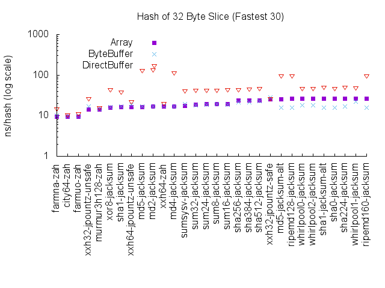

| Algorithm |  Array | ByteBuffer | DirectBuffer |
| --- | ---: | ---: | ---: | 
| [farmna-zah](#farmna-zah-latency) | 9.386000 | 10.017795 | 14.576828 |
| [city64-zah](#city64-zah-latency) | 9.407101 | 9.928558 | 10.373027 |
| [farmuo-zah](#farmuo-zah-latency) | 9.563776 | 9.862444 | 11.135525 |
| [xxh32-jpountz-unsafe](#xxh32-jpountz-unsafe-latency) | 14.192635 | 17.102599 | 26.556624 |
| [murmur3h128-zah](#murmur3h128-zah-latency) | 14.405292 | 14.615232 | 15.811911 |
| [xor8-jacksum](#xor8-jacksum-latency) | 15.805184 | 16.547681 | 43.397742 |
| [sha1-jacksum](#sha1-jacksum-latency) | 16.117723 | 16.600151 | 37.498186 |
| [xxh64-jpountz-unsafe](#xxh64-jpountz-unsafe-latency) | 16.304942 | 18.769096 | 22.195812 |
| [md5-jacksum](#md5-jacksum-latency) | 16.403029 | 16.848853 | 130.133421 |
| [md2-jacksum](#md2-jacksum-latency) | 16.706935 | 16.982080 | 133.360956 |
| [xxh64-zah](#xxh64-zah-latency) | 16.906620 | 17.590279 | 20.053239 |
| [md4-jacksum](#md4-jacksum-latency) | 16.940723 | 16.945312 | 113.120601 |
| [sumsysv-jacksum](#sumsysv-jacksum-latency) | 17.160204 | 19.475162 | 41.259011 |
| [sum32-jacksum](#sum32-jacksum-latency) | 18.664948 | 18.301874 | 42.465420 |
| [sum24-jacksum](#sum24-jacksum-latency) | 19.158713 | 18.525051 | 42.438651 |
| [sum8-jacksum](#sum8-jacksum-latency) | 19.201411 | 19.044973 | 41.522567 |
| [sum16-jacksum](#sum16-jacksum-latency) | 19.284918 | 18.555200 | 43.070884 |
| [sha256-jacksum](#sha256-jacksum-latency) | 23.400359 | 21.621062 | 44.265315 |
| [sha384-jacksum](#sha384-jacksum-latency) | 23.548495 | 21.525139 | 44.462733 |
| [sha512-jacksum](#sha512-jacksum-latency) | 23.677980 | 22.688428 | 46.514397 |
| [xxh32-jpountz-safe](#xxh32-jpountz-safe-latency) | 25.001214 | 27.991035 | 26.610664 |
| [md5-jacksum-alt](#md5-jacksum-alt-latency) | 25.027990 | 15.888331 | 94.225040 |
| [ripemd128-jacksum](#ripemd128-jacksum-latency) | 25.831457 | 16.008143 | 94.550483 |
| [whirlpool0-jacksum](#whirlpool0-jacksum-latency) | 25.970508 | 18.094768 | 46.474345 |
| [whirlpool2-jacksum](#whirlpool2-jacksum-latency) | 26.001988 | 17.935126 | 47.432102 |
| [sha1-jacksum-alt](#sha1-jacksum-alt-latency) | 26.124734 | 15.891911 | 49.523972 |
| [sha0-jacksum](#sha0-jacksum-latency) | 26.219811 | 15.853288 | 47.386159 |
| [sha224-jacksum](#sha224-jacksum-latency) | 26.227998 | 16.672399 | 50.016936 |
| [whirlpool1-jacksum](#whirlpool1-jacksum-latency) | 26.265669 | 22.033114 | 48.362203 |
| [ripemd160-jacksum](#ripemd160-jacksum-latency) | 26.380022 | 15.850208 | 95.616329 |
| [has160-jacksum](#has160-jacksum-latency) | 26.411927 | 16.039462 | 107.255984 |
| [sha256-jacksum-alt](#sha256-jacksum-alt-latency) | 26.413697 | 16.893000 | 47.526515 |
| [tiger128-jacksum](#tiger128-jacksum-latency) | 26.530873 | 16.941582 | 47.610279 |
| [tiger-jacksum](#tiger-jacksum-latency) | 26.595778 | 16.965748 | 47.113522 |
| [tiger2-jacksum](#tiger2-jacksum-latency) | 26.605994 | 16.770049 | 46.625151 |
| [tiger160-jacksum](#tiger160-jacksum-latency) | 26.901186 | 17.128180 | 46.495744 |
| [sha512-jacksum-alt](#sha512-jacksum-alt-latency) | 27.091566 | 16.853102 | 46.359127 |
| [haval256h4-jacksum](#haval256h4-jacksum-latency) | 27.167416 | 17.463712 | 95.192786 |
| [haval192h5-jacksum](#haval192h5-jacksum-latency) | 27.176253 | 17.240774 | 104.957693 |
| [haval256h5-jacksum](#haval256h5-jacksum-latency) | 27.195541 | 17.939653 | 94.630756 |
| [haval224h4-jacksum](#haval224h4-jacksum-latency) | 27.212358 | 20.418384 | 99.739715 |
| [haval256h3-jacksum](#haval256h3-jacksum-latency) | 27.226230 | 17.185402 | 95.949627 |
| [haval128h4-jacksum](#haval128h4-jacksum-latency) | 27.241420 | 16.874177 | 107.468060 |
| [haval160h4-jacksum](#haval160h4-jacksum-latency) | 27.310395 | 18.851448 | 102.382523 |
| [haval128h5-jacksum](#haval128h5-jacksum-latency) | 27.351329 | 18.846723 | 96.110685 |
| [haval224h5-jacksum](#haval224h5-jacksum-latency) | 27.476739 | 17.169196 | 95.781959 |
| [sha384-jacksum-alt](#sha384-jacksum-alt-latency) | 27.560349 | 16.848937 | 50.219407 |
| [haval192h3-jacksum](#haval192h3-jacksum-latency) | 27.595588 | 16.900293 | 102.304634 |
| [haval160h3-jacksum](#haval160h3-jacksum-latency) | 27.973436 | 16.897309 | 101.864715 |
| [haval128h3-jacksum](#haval128h3-jacksum-latency) | 27.986188 | 17.188748 | 101.237837 |
| [haval160h5-jacksum](#haval160h5-jacksum-latency) | 28.010978 | 17.116452 | 103.843313 |
| [haval224h3-jacksum](#haval224h3-jacksum-latency) | 28.078883 | 17.202648 | 102.918260 |
| [haval192h4-jacksum](#haval192h4-jacksum-latency) | 28.451116 | 17.147384 | 96.936531 |
| [xxh64-jpountz-safe](#xxh64-jpountz-safe-latency) | 28.641997 | 30.179441 | 21.988576 |
| [ed2k-jacksum](#ed2k-jacksum-latency) | 31.479206 | 33.533765 | 53.106518 |
| [sumbsd-jacksum](#sumbsd-jacksum-latency) | 40.151849 | 41.266825 | 63.289014 |
| [crc32-jacksum-delegating](#crc32-jacksum-delegating-latency) | 41.559724 | 55.447773 | 112.315903 |
| [xxh32-jpountz-jni](#xxh32-jpountz-jni-latency) | 41.597876 | 43.099607 | 33.626448 |
| [xxh64-jpountz-jni](#xxh64-jpountz-jni-latency) | 44.161312 | 46.936457 | 35.494789 |
| [crc8-jacksum](#crc8-jacksum-latency) | 46.858089 | 49.907222 | 82.689718 |
| [ripemd256-jacksum](#ripemd256-jacksum-latency) | 51.627736 | 51.083755 | 73.415557 |
| [crc32-jre](#crc32-jre-latency) | 51.696788 | 53.108855 | 54.402320 |
| [ripemd320-jacksum](#ripemd320-jacksum-latency) | 52.986562 | 52.621287 | 71.262873 |
| [adler32-jre](#adler32-jre-latency) | 53.856557 | 54.049116 | 31.448267 |
| [elf-jacksum](#elf-jacksum-latency) | 54.555876 | 56.092029 | 76.720002 |
| [adler32-jacksum-delegating](#adler32-jacksum-delegating-latency) | 55.517439 | 55.508701 | 229.592539 |
| [adler32-guava](#adler32-guava-latency) | 66.757587 | 70.072093 | 581.396001 |
| [crc16-jacksum](#crc16-jacksum-latency) | 69.976222 | 70.602697 | 233.985747 |
| [gfh64-guava](#gfh64-guava-latency) | 72.465036 | 142.657700 | 164.529191 |
| [crc32-guava-delegating](#crc32-guava-delegating-latency) | 74.701149 | 77.307829 | 72.624592 |
| [crc32-jacksum-fcs32](#crc32-jacksum-fcs32-latency) | 74.951457 | 74.563420 | 94.294270 |
| [crc64-jacksum](#crc64-jacksum-latency) | 77.758994 | 77.664560 | 102.852619 |
| [fcs16-jacksum](#fcs16-jacksum-latency) | 81.691508 | 80.965521 | 106.696539 |
| [cksum-jacksum](#cksum-jacksum-latency) | 84.203514 | 83.318807 | 235.358728 |
| [gfh32-guava](#gfh32-guava-latency) | 84.745402 | 92.587313 | 101.419597 |
| [crc32-guava-rfc3720](#crc32-guava-rfc3720-latency) | 85.459036 | 88.431852 | 105.357434 |
| [murmur3h32-guava](#murmur3h32-guava-latency) | 86.358896 | 78.979276 | 111.079064 |
| [crc32-jacksum-mpeg2](#crc32-jacksum-mpeg2-latency) | 86.707520 | 80.903706 | 105.919762 |
| [crc32-jacksum-bzip2](#crc32-jacksum-bzip2-latency) | 89.059349 | 108.722860 | 178.831462 |
| [crc24-jacksum](#crc24-jacksum-latency) | 90.564758 | 108.886511 | 222.084843 |
| [sip-inline](#sip-inline-latency) | 113.774161 | 72.845011 | 73.988902 |
| [adler32-jacksum-alt](#adler32-jacksum-alt-latency) | 125.565348 | 125.644611 | 265.092654 |
| [murmur3h128-guava](#murmur3h128-guava-latency) | 128.404467 | 135.705107 | 1039.683175 |
| [sip-guava](#sip-guava-latency) | 130.737233 | 130.546213 | 1228.021504 |
| [sip-fwdeng](#sip-fwdeng-latency) | 145.526120 | 130.442160 | 130.302299 |
| [md4-bc](#md4-bc-latency) | 183.574929 | 183.238493 | 203.600410 |
| [md5-bc](#md5-bc-latency) | 227.275325 | 227.954885 | 250.360781 |
| [tiger-bc](#tiger-bc-latency) | 242.005975 | 246.686902 | 271.585765 |
| [ripemd128-bc](#ripemd128-bc-latency) | 249.350414 | 251.766554 | 280.611186 |
| [tiger2-jacksum-tree](#tiger2-jacksum-tree-latency) | 250.069396 | 128.837808 | 362.411389 |
| [tiger-jacksum-tree](#tiger-jacksum-tree-latency) | 250.629941 | 321.064486 | 47.720619 |
| [md5-guava](#md5-guava-latency) | 257.445047 | 256.970159 | 269.374095 |
| [ripemd256-bc](#ripemd256-bc-latency) | 278.996831 | 285.601901 | 306.113028 |
| [sha1-bc](#sha1-bc-latency) | 329.972424 | 333.108338 | 347.022309 |
| [skein256-bc](#skein256-bc-latency) | 337.961554 | 325.496182 | 343.624415 |
| [sha1-guava](#sha1-guava-latency) | 368.657301 | 355.403320 | 3193.038598 |
| [sm3-bc](#sm3-bc-latency) | 412.752864 | 408.882744 | 447.807755 |
| [sha224-bc](#sha224-bc-latency) | 445.683249 | 438.720830 | 467.520015 |
| [sha256-bc](#sha256-bc-latency) | 449.005450 | 447.679129 | 482.964656 |
| [sha256-guava](#sha256-guava-latency) | 466.718082 | 461.484682 | 2816.147708 |
| [skein512-bc](#skein512-bc-latency) | 538.472123 | 532.716650 | 574.606136 |
| [sha512-bc-t](#sha512-bc-t-latency) | 571.933456 | 570.332600 | 588.307607 |
| [sha512-bc](#sha512-bc-latency) | 580.618245 | 570.573516 | 597.029686 |
| [sha384-bc](#sha384-bc-latency) | 589.240925 | 560.592234 | 584.468886 |
| [sha512-guava](#sha512-guava-latency) | 767.162659 | 809.602677 | 5428.777711 |
| [sha384-guava](#sha384-guava-latency) | 789.683354 | 804.338899 | 3499.397516 |
| [skein1024-bc](#skein1024-bc-latency) | 1090.125054 | 1072.220395 | 1105.024278 |
| [ripemd160-bc](#ripemd160-bc-latency) | 1111.341973 | 1120.168081 | 1141.223252 |
| [ripemd320-bc](#ripemd320-bc-latency) | 1134.936967 | 1128.988315 | 1153.523480 |
| [gost-jacksum](#gost-jacksum-latency) | 3632.806632 | 3649.849867 | 3879.056693 |
| [sha3-bc](#sha3-bc-latency) | 5507.492100 | 5350.755536 | 5355.969622 |
| [whirlpool2-bc](#whirlpool2-bc-latency) | 6270.998018 | 6129.439497 | 6338.404691 |
| [md2-bc](#md2-bc-latency) | 8245.157885 | 8188.368150 | 8147.355934 |
| [gost-bc](#gost-bc-latency) | 12166.753708 | 11932.658969 | 11800.951498 |

---
### 32 Byte Slice Latency (adler32)
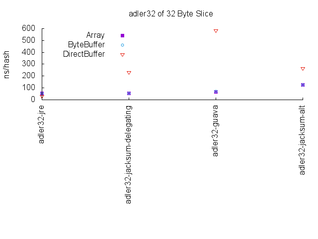

| Algorithm |  Array | ByteBuffer | DirectBuffer |
| --- | ---: | ---: | ---: | 
| [adler32-jre](#adler32-jre-latency) | 53.856557 | 54.049116 | 31.448267 |
| [adler32-jacksum-delegating](#adler32-jacksum-delegating-latency) | 55.517439 | 55.508701 | 229.592539 |
| [adler32-guava](#adler32-guava-latency) | 66.757587 | 70.072093 | 581.396001 |
| [adler32-jacksum-alt](#adler32-jacksum-alt-latency) | 125.565348 | 125.644611 | 265.092654 |

---
### 32 Byte Slice Latency (city64)
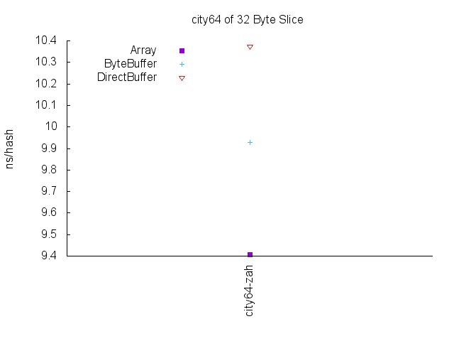

| Algorithm |  Array | ByteBuffer | DirectBuffer |
| --- | ---: | ---: | ---: | 
| [city64-zah](#city64-zah-latency) | 9.407101 | 9.928558 | 10.373027 |

---
### 32 Byte Slice Latency (cksum)
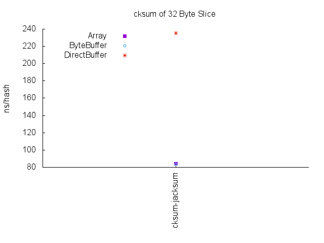

| Algorithm |  Array | ByteBuffer | DirectBuffer |
| --- | ---: | ---: | ---: | 
| [cksum-jacksum](#cksum-jacksum-latency) | 84.203514 | 83.318807 | 235.358728 |

---
### 32 Byte Slice Latency (crc16)

| Algorithm |  Array | ByteBuffer | DirectBuffer |
| --- | ---: | ---: | ---: | 
| [crc16-jacksum](#crc16-jacksum-latency) | 69.976222 | 70.602697 | 233.985747 |

---
### 32 Byte Slice Latency (crc24)

| Algorithm |  Array | ByteBuffer | DirectBuffer |
| --- | ---: | ---: | ---: | 
| [crc24-jacksum](#crc24-jacksum-latency) | 90.564758 | 108.886511 | 222.084843 |

---
### 32 Byte Slice Latency (crc32)
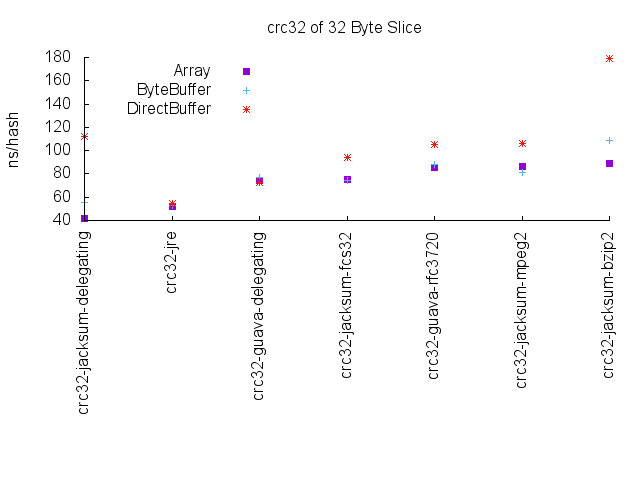

| Algorithm |  Array | ByteBuffer | DirectBuffer |
| --- | ---: | ---: | ---: | 
| [crc32-jacksum-delegating](#crc32-jacksum-delegating-latency) | 41.559724 | 55.447773 | 112.315903 |
| [crc32-jre](#crc32-jre-latency) | 51.696788 | 53.108855 | 54.402320 |
| [crc32-guava-delegating](#crc32-guava-delegating-latency) | 74.701149 | 77.307829 | 72.624592 |
| [crc32-jacksum-fcs32](#crc32-jacksum-fcs32-latency) | 74.951457 | 74.563420 | 94.294270 |
| [crc32-guava-rfc3720](#crc32-guava-rfc3720-latency) | 85.459036 | 88.431852 | 105.357434 |
| [crc32-jacksum-mpeg2](#crc32-jacksum-mpeg2-latency) | 86.707520 | 80.903706 | 105.919762 |
| [crc32-jacksum-bzip2](#crc32-jacksum-bzip2-latency) | 89.059349 | 108.722860 | 178.831462 |

---
### 32 Byte Slice Latency (crc64)

| Algorithm |  Array | ByteBuffer | DirectBuffer |
| --- | ---: | ---: | ---: | 
| [crc64-jacksum](#crc64-jacksum-latency) | 77.758994 | 77.664560 | 102.852619 |

---
### 32 Byte Slice Latency (crc8)
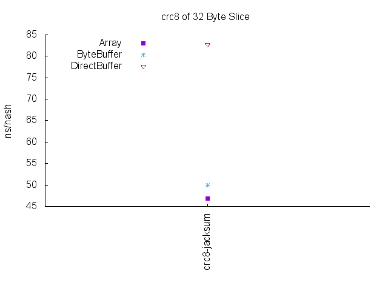

| Algorithm |  Array | ByteBuffer | DirectBuffer |
| --- | ---: | ---: | ---: | 
| [crc8-jacksum](#crc8-jacksum-latency) | 46.858089 | 49.907222 | 82.689718 |

---
### 32 Byte Slice Latency (ed2k)

| Algorithm |  Array | ByteBuffer | DirectBuffer |
| --- | ---: | ---: | ---: | 
| [ed2k-jacksum](#ed2k-jacksum-latency) | 31.479206 | 33.533765 | 53.106518 |

---
### 32 Byte Slice Latency (elf)
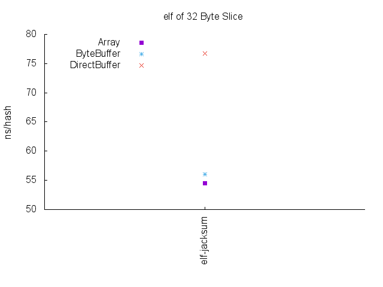

| Algorithm |  Array | ByteBuffer | DirectBuffer |
| --- | ---: | ---: | ---: | 
| [elf-jacksum](#elf-jacksum-latency) | 54.555876 | 56.092029 | 76.720002 |

---
### 32 Byte Slice Latency (farmna)
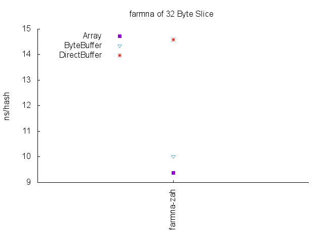

| Algorithm |  Array | ByteBuffer | DirectBuffer |
| --- | ---: | ---: | ---: | 
| [farmna-zah](#farmna-zah-latency) | 9.386000 | 10.017795 | 14.576828 |

---
### 32 Byte Slice Latency (farmuo)
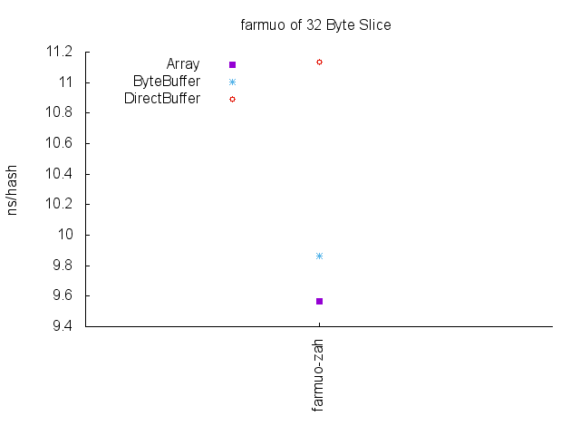

| Algorithm |  Array | ByteBuffer | DirectBuffer |
| --- | ---: | ---: | ---: | 
| [farmuo-zah](#farmuo-zah-latency) | 9.563776 | 9.862444 | 11.135525 |

---
### 32 Byte Slice Latency (fcs16)
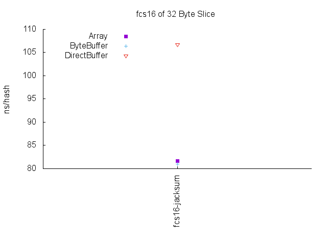

| Algorithm |  Array | ByteBuffer | DirectBuffer |
| --- | ---: | ---: | ---: | 
| [fcs16-jacksum](#fcs16-jacksum-latency) | 81.691508 | 80.965521 | 106.696539 |

---
### 32 Byte Slice Latency (gfh32)

| Algorithm |  Array | ByteBuffer | DirectBuffer |
| --- | ---: | ---: | ---: | 
| [gfh32-guava](#gfh32-guava-latency) | 84.745402 | 92.587313 | 101.419597 |

---
### 32 Byte Slice Latency (gfh64)
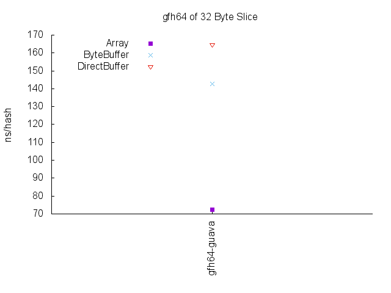

| Algorithm |  Array | ByteBuffer | DirectBuffer |
| --- | ---: | ---: | ---: | 
| [gfh64-guava](#gfh64-guava-latency) | 72.465036 | 142.657700 | 164.529191 |

---
### 32 Byte Slice Latency (gost)
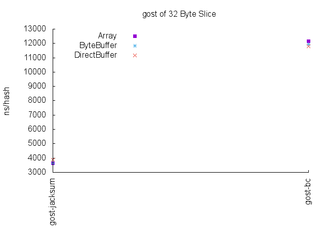

| Algorithm |  Array | ByteBuffer | DirectBuffer |
| --- | ---: | ---: | ---: | 
| [gost-jacksum](#gost-jacksum-latency) | 3632.806632 | 3649.849867 | 3879.056693 |
| [gost-bc](#gost-bc-latency) | 12166.753708 | 11932.658969 | 11800.951498 |

---
### 32 Byte Slice Latency (has160)
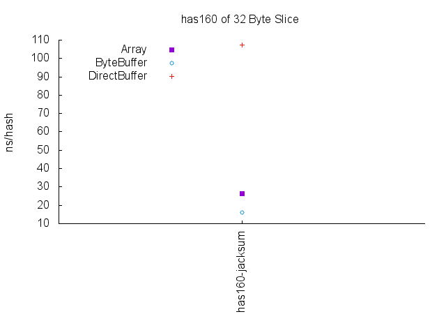

| Algorithm |  Array | ByteBuffer | DirectBuffer |
| --- | ---: | ---: | ---: | 
| [has160-jacksum](#has160-jacksum-latency) | 26.411927 | 16.039462 | 107.255984 |

---
### 32 Byte Slice Latency (haval128h3)

| Algorithm |  Array | ByteBuffer | DirectBuffer |
| --- | ---: | ---: | ---: | 
| [haval128h3-jacksum](#haval128h3-jacksum-latency) | 27.986188 | 17.188748 | 101.237837 |

---
### 32 Byte Slice Latency (haval128h4)

| Algorithm |  Array | ByteBuffer | DirectBuffer |
| --- | ---: | ---: | ---: | 
| [haval128h4-jacksum](#haval128h4-jacksum-latency) | 27.241420 | 16.874177 | 107.468060 |

---
### 32 Byte Slice Latency (haval128h5)

| Algorithm |  Array | ByteBuffer | DirectBuffer |
| --- | ---: | ---: | ---: | 
| [haval128h5-jacksum](#haval128h5-jacksum-latency) | 27.351329 | 18.846723 | 96.110685 |

---
### 32 Byte Slice Latency (haval160h3)

| Algorithm |  Array | ByteBuffer | DirectBuffer |
| --- | ---: | ---: | ---: | 
| [haval160h3-jacksum](#haval160h3-jacksum-latency) | 27.973436 | 16.897309 | 101.864715 |

---
### 32 Byte Slice Latency (haval160h4)

| Algorithm |  Array | ByteBuffer | DirectBuffer |
| --- | ---: | ---: | ---: | 
| [haval160h4-jacksum](#haval160h4-jacksum-latency) | 27.310395 | 18.851448 | 102.382523 |

---
### 32 Byte Slice Latency (haval160h5)

| Algorithm |  Array | ByteBuffer | DirectBuffer |
| --- | ---: | ---: | ---: | 
| [haval160h5-jacksum](#haval160h5-jacksum-latency) | 28.010978 | 17.116452 | 103.843313 |

---
### 32 Byte Slice Latency (haval192h3)

| Algorithm |  Array | ByteBuffer | DirectBuffer |
| --- | ---: | ---: | ---: | 
| [haval192h3-jacksum](#haval192h3-jacksum-latency) | 27.595588 | 16.900293 | 102.304634 |

---
### 32 Byte Slice Latency (haval192h4)
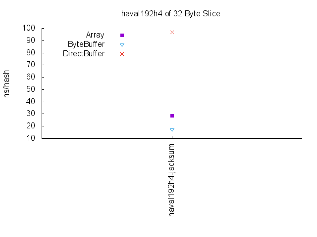

| Algorithm |  Array | ByteBuffer | DirectBuffer |
| --- | ---: | ---: | ---: | 
| [haval192h4-jacksum](#haval192h4-jacksum-latency) | 28.451116 | 17.147384 | 96.936531 |

---
### 32 Byte Slice Latency (haval192h5)
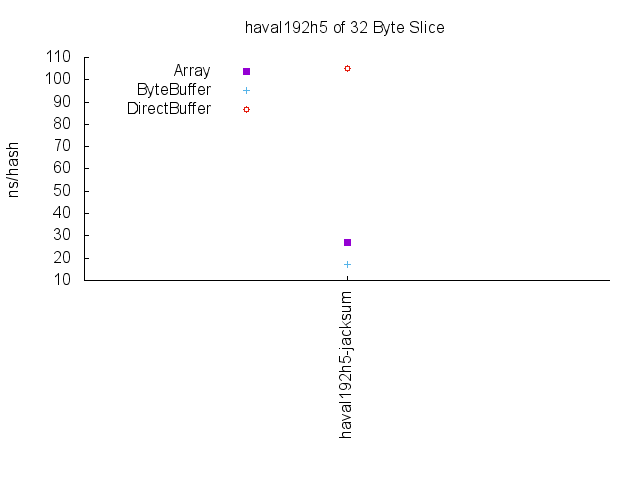

| Algorithm |  Array | ByteBuffer | DirectBuffer |
| --- | ---: | ---: | ---: | 
| [haval192h5-jacksum](#haval192h5-jacksum-latency) | 27.176253 | 17.240774 | 104.957693 |

---
### 32 Byte Slice Latency (haval224h3)
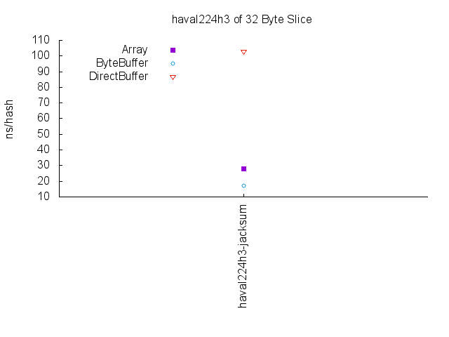

| Algorithm |  Array | ByteBuffer | DirectBuffer |
| --- | ---: | ---: | ---: | 
| [haval224h3-jacksum](#haval224h3-jacksum-latency) | 28.078883 | 17.202648 | 102.918260 |

---
### 32 Byte Slice Latency (haval224h4)
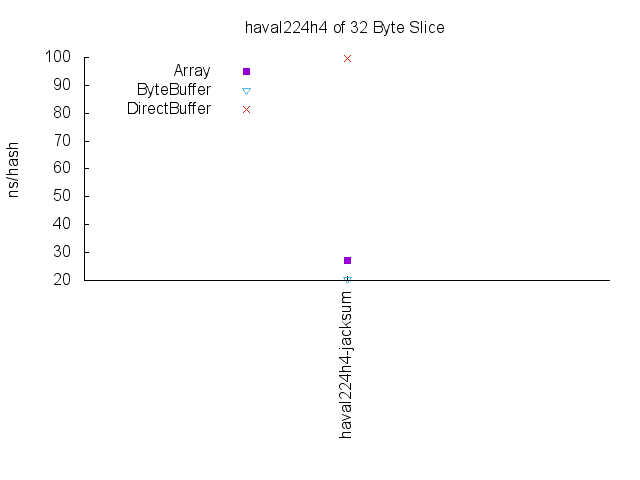

| Algorithm |  Array | ByteBuffer | DirectBuffer |
| --- | ---: | ---: | ---: | 
| [haval224h4-jacksum](#haval224h4-jacksum-latency) | 27.212358 | 20.418384 | 99.739715 |

---
### 32 Byte Slice Latency (haval224h5)
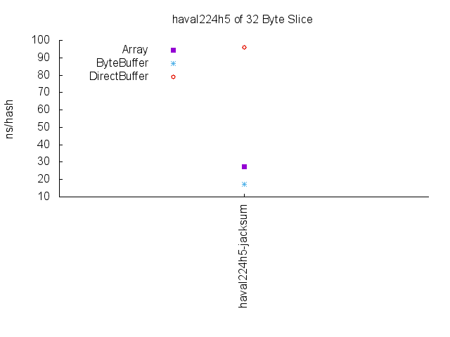

| Algorithm |  Array | ByteBuffer | DirectBuffer |
| --- | ---: | ---: | ---: | 
| [haval224h5-jacksum](#haval224h5-jacksum-latency) | 27.476739 | 17.169196 | 95.781959 |

---
### 32 Byte Slice Latency (haval256h3)

| Algorithm |  Array | ByteBuffer | DirectBuffer |
| --- | ---: | ---: | ---: | 
| [haval256h3-jacksum](#haval256h3-jacksum-latency) | 27.226230 | 17.185402 | 95.949627 |

---
### 32 Byte Slice Latency (haval256h4)

| Algorithm |  Array | ByteBuffer | DirectBuffer |
| --- | ---: | ---: | ---: | 
| [haval256h4-jacksum](#haval256h4-jacksum-latency) | 27.167416 | 17.463712 | 95.192786 |

---
### 32 Byte Slice Latency (haval256h5)
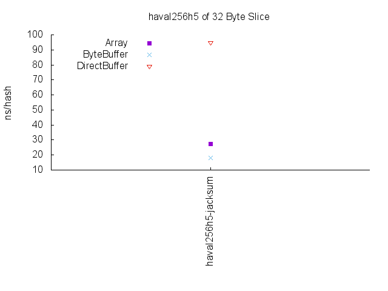

| Algorithm |  Array | ByteBuffer | DirectBuffer |
| --- | ---: | ---: | ---: | 
| [haval256h5-jacksum](#haval256h5-jacksum-latency) | 27.195541 | 17.939653 | 94.630756 |

---
### 32 Byte Slice Latency (md2)
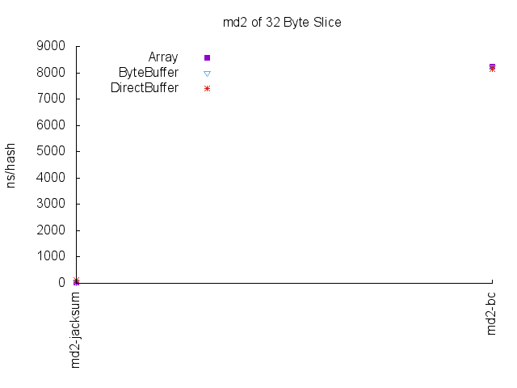

| Algorithm |  Array | ByteBuffer | DirectBuffer |
| --- | ---: | ---: | ---: | 
| [md2-jacksum](#md2-jacksum-latency) | 16.706935 | 16.982080 | 133.360956 |
| [md2-bc](#md2-bc-latency) | 8245.157885 | 8188.368150 | 8147.355934 |

---
### 32 Byte Slice Latency (md4)
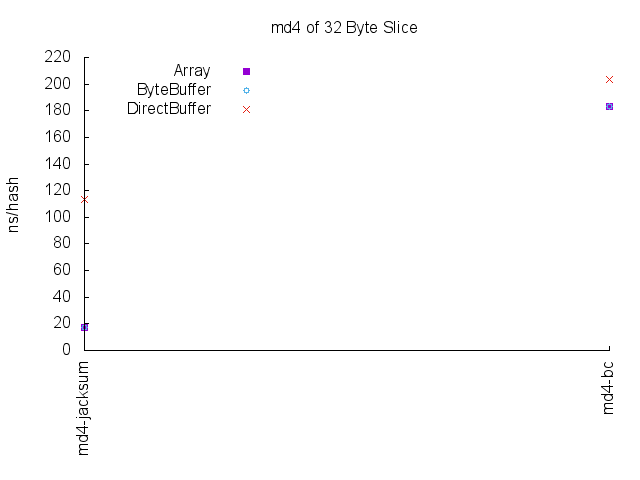

| Algorithm |  Array | ByteBuffer | DirectBuffer |
| --- | ---: | ---: | ---: | 
| [md4-jacksum](#md4-jacksum-latency) | 16.940723 | 16.945312 | 113.120601 |
| [md4-bc](#md4-bc-latency) | 183.574929 | 183.238493 | 203.600410 |

---
### 32 Byte Slice Latency (md5)
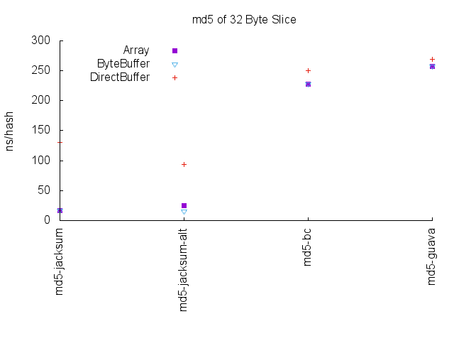

| Algorithm |  Array | ByteBuffer | DirectBuffer |
| --- | ---: | ---: | ---: | 
| [md5-jacksum](#md5-jacksum-latency) | 16.403029 | 16.848853 | 130.133421 |
| [md5-jacksum-alt](#md5-jacksum-alt-latency) | 25.027990 | 15.888331 | 94.225040 |
| [md5-bc](#md5-bc-latency) | 227.275325 | 227.954885 | 250.360781 |
| [md5-guava](#md5-guava-latency) | 257.445047 | 256.970159 | 269.374095 |

---
### 32 Byte Slice Latency (murmur3h128)
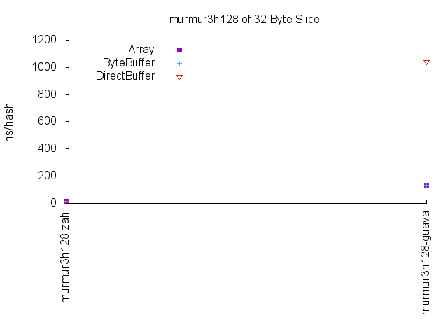

| Algorithm |  Array | ByteBuffer | DirectBuffer |
| --- | ---: | ---: | ---: | 
| [murmur3h128-zah](#murmur3h128-zah-latency) | 14.405292 | 14.615232 | 15.811911 |
| [murmur3h128-guava](#murmur3h128-guava-latency) | 128.404467 | 135.705107 | 1039.683175 |

---
### 32 Byte Slice Latency (murmur3h32)
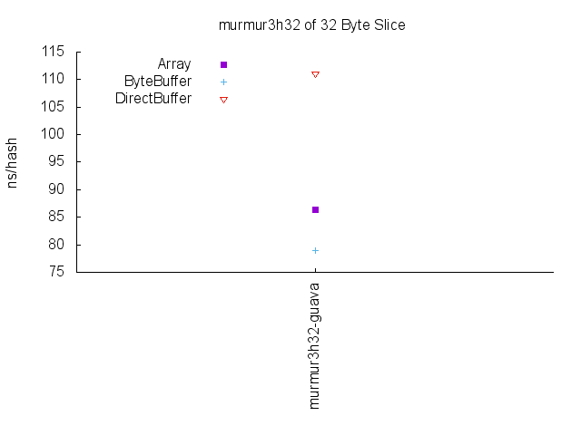

| Algorithm |  Array | ByteBuffer | DirectBuffer |
| --- | ---: | ---: | ---: | 
| [murmur3h32-guava](#murmur3h32-guava-latency) | 86.358896 | 78.979276 | 111.079064 |

---
### 32 Byte Slice Latency (ripemd128)
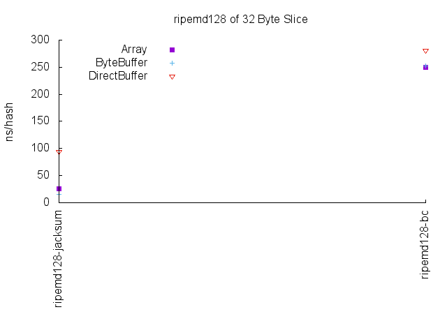

| Algorithm |  Array | ByteBuffer | DirectBuffer |
| --- | ---: | ---: | ---: | 
| [ripemd128-jacksum](#ripemd128-jacksum-latency) | 25.831457 | 16.008143 | 94.550483 |
| [ripemd128-bc](#ripemd128-bc-latency) | 249.350414 | 251.766554 | 280.611186 |

---
### 32 Byte Slice Latency (ripemd160)
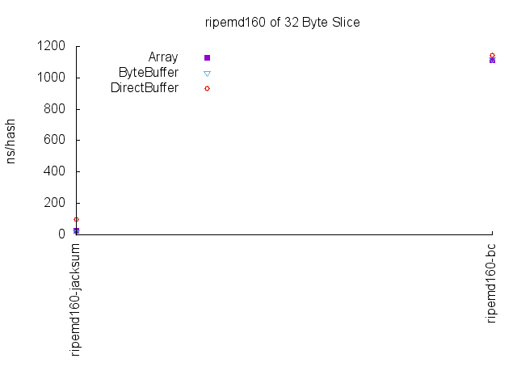

| Algorithm |  Array | ByteBuffer | DirectBuffer |
| --- | ---: | ---: | ---: | 
| [ripemd160-jacksum](#ripemd160-jacksum-latency) | 26.380022 | 15.850208 | 95.616329 |
| [ripemd160-bc](#ripemd160-bc-latency) | 1111.341973 | 1120.168081 | 1141.223252 |

---
### 32 Byte Slice Latency (ripemd256)
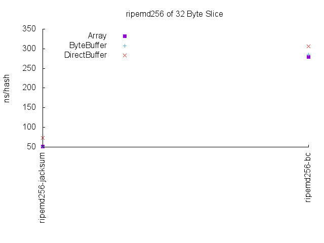

| Algorithm |  Array | ByteBuffer | DirectBuffer |
| --- | ---: | ---: | ---: | 
| [ripemd256-jacksum](#ripemd256-jacksum-latency) | 51.627736 | 51.083755 | 73.415557 |
| [ripemd256-bc](#ripemd256-bc-latency) | 278.996831 | 285.601901 | 306.113028 |

---
### 32 Byte Slice Latency (ripemd320)

| Algorithm |  Array | ByteBuffer | DirectBuffer |
| --- | ---: | ---: | ---: | 
| [ripemd320-jacksum](#ripemd320-jacksum-latency) | 52.986562 | 52.621287 | 71.262873 |
| [ripemd320-bc](#ripemd320-bc-latency) | 1134.936967 | 1128.988315 | 1153.523480 |

---
### 32 Byte Slice Latency (sha0)
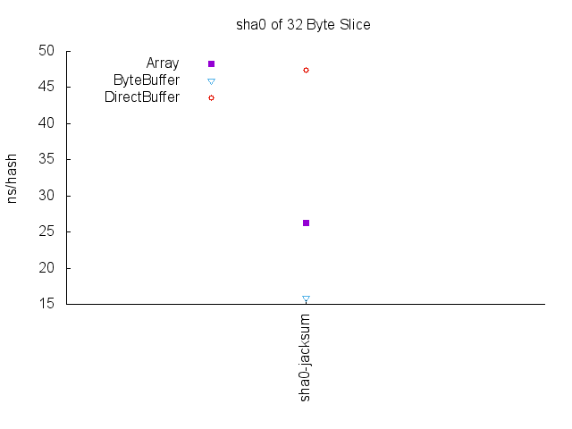

| Algorithm |  Array | ByteBuffer | DirectBuffer |
| --- | ---: | ---: | ---: | 
| [sha0-jacksum](#sha0-jacksum-latency) | 26.219811 | 15.853288 | 47.386159 |

---
### 32 Byte Slice Latency (sha1)
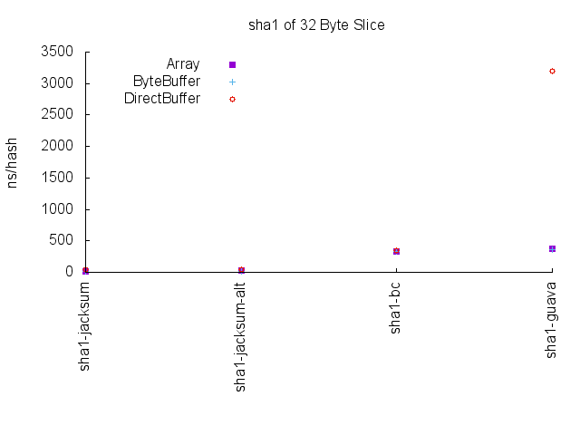

| Algorithm |  Array | ByteBuffer | DirectBuffer |
| --- | ---: | ---: | ---: | 
| [sha1-jacksum](#sha1-jacksum-latency) | 16.117723 | 16.600151 | 37.498186 |
| [sha1-jacksum-alt](#sha1-jacksum-alt-latency) | 26.124734 | 15.891911 | 49.523972 |
| [sha1-bc](#sha1-bc-latency) | 329.972424 | 333.108338 | 347.022309 |
| [sha1-guava](#sha1-guava-latency) | 368.657301 | 355.403320 | 3193.038598 |

---
### 32 Byte Slice Latency (sha224)
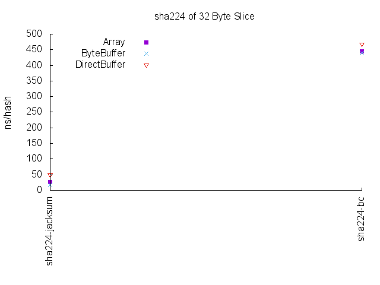

| Algorithm |  Array | ByteBuffer | DirectBuffer |
| --- | ---: | ---: | ---: | 
| [sha224-jacksum](#sha224-jacksum-latency) | 26.227998 | 16.672399 | 50.016936 |
| [sha224-bc](#sha224-bc-latency) | 445.683249 | 438.720830 | 467.520015 |

---
### 32 Byte Slice Latency (sha256)
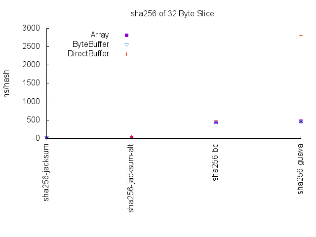

| Algorithm |  Array | ByteBuffer | DirectBuffer |
| --- | ---: | ---: | ---: | 
| [sha256-jacksum](#sha256-jacksum-latency) | 23.400359 | 21.621062 | 44.265315 |
| [sha256-jacksum-alt](#sha256-jacksum-alt-latency) | 26.413697 | 16.893000 | 47.526515 |
| [sha256-bc](#sha256-bc-latency) | 449.005450 | 447.679129 | 482.964656 |
| [sha256-guava](#sha256-guava-latency) | 466.718082 | 461.484682 | 2816.147708 |

---
### 32 Byte Slice Latency (sha3)
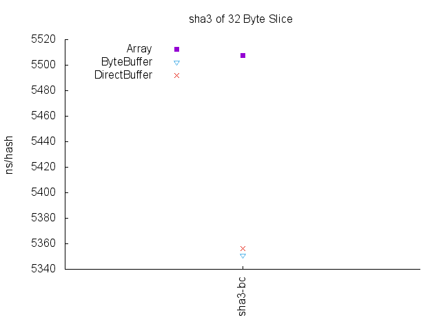

| Algorithm |  Array | ByteBuffer | DirectBuffer |
| --- | ---: | ---: | ---: | 
| [sha3-bc](#sha3-bc-latency) | 5507.492100 | 5350.755536 | 5355.969622 |

---
### 32 Byte Slice Latency (sha384)
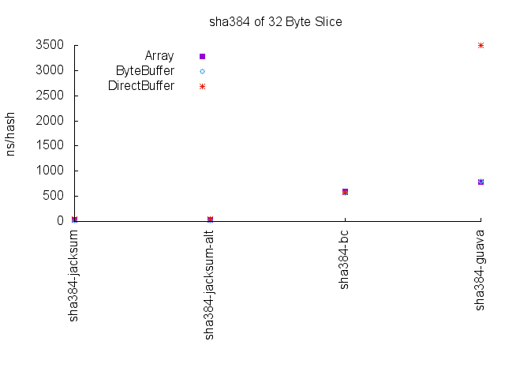

| Algorithm |  Array | ByteBuffer | DirectBuffer |
| --- | ---: | ---: | ---: | 
| [sha384-jacksum](#sha384-jacksum-latency) | 23.548495 | 21.525139 | 44.462733 |
| [sha384-jacksum-alt](#sha384-jacksum-alt-latency) | 27.560349 | 16.848937 | 50.219407 |
| [sha384-bc](#sha384-bc-latency) | 589.240925 | 560.592234 | 584.468886 |
| [sha384-guava](#sha384-guava-latency) | 789.683354 | 804.338899 | 3499.397516 |

---
### 32 Byte Slice Latency (sha512)
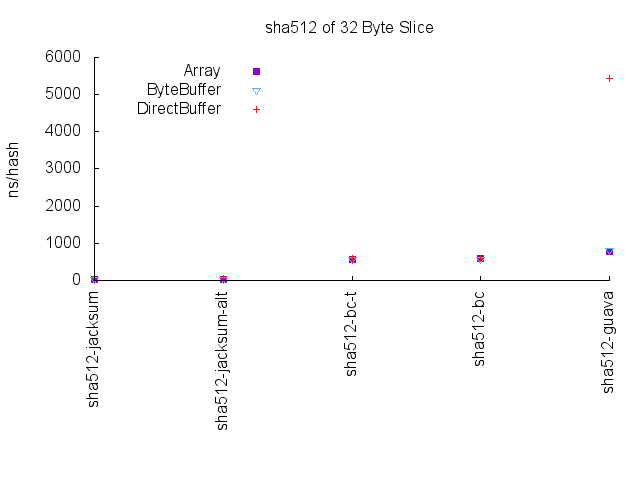

| Algorithm |  Array | ByteBuffer | DirectBuffer |
| --- | ---: | ---: | ---: | 
| [sha512-jacksum](#sha512-jacksum-latency) | 23.677980 | 22.688428 | 46.514397 |
| [sha512-jacksum-alt](#sha512-jacksum-alt-latency) | 27.091566 | 16.853102 | 46.359127 |
| [sha512-bc-t](#sha512-bc-t-latency) | 571.933456 | 570.332600 | 588.307607 |
| [sha512-bc](#sha512-bc-latency) | 580.618245 | 570.573516 | 597.029686 |
| [sha512-guava](#sha512-guava-latency) | 767.162659 | 809.602677 | 5428.777711 |

---
### 32 Byte Slice Latency (sip)
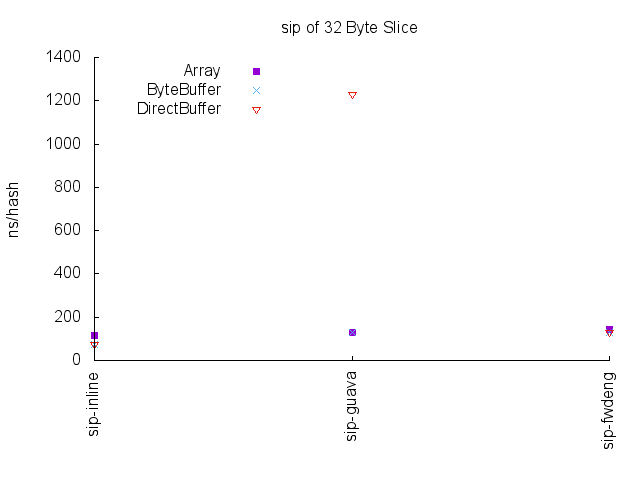

| Algorithm |  Array | ByteBuffer | DirectBuffer |
| --- | ---: | ---: | ---: | 
| [sip-inline](#sip-inline-latency) | 113.774161 | 72.845011 | 73.988902 |
| [sip-guava](#sip-guava-latency) | 130.737233 | 130.546213 | 1228.021504 |
| [sip-fwdeng](#sip-fwdeng-latency) | 145.526120 | 130.442160 | 130.302299 |

---
### 32 Byte Slice Latency (skein1024)

| Algorithm |  Array | ByteBuffer | DirectBuffer |
| --- | ---: | ---: | ---: | 
| [skein1024-bc](#skein1024-bc-latency) | 1090.125054 | 1072.220395 | 1105.024278 |

---
### 32 Byte Slice Latency (skein256)
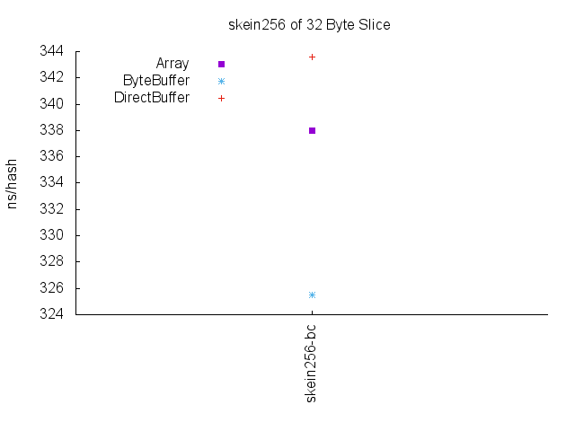

| Algorithm |  Array | ByteBuffer | DirectBuffer |
| --- | ---: | ---: | ---: | 
| [skein256-bc](#skein256-bc-latency) | 337.961554 | 325.496182 | 343.624415 |

---
### 32 Byte Slice Latency (skein512)
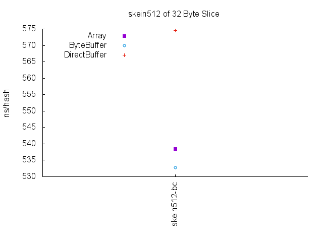

| Algorithm |  Array | ByteBuffer | DirectBuffer |
| --- | ---: | ---: | ---: | 
| [skein512-bc](#skein512-bc-latency) | 538.472123 | 532.716650 | 574.606136 |

---
### 32 Byte Slice Latency (sm3)
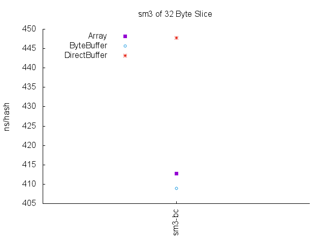

| Algorithm |  Array | ByteBuffer | DirectBuffer |
| --- | ---: | ---: | ---: | 
| [sm3-bc](#sm3-bc-latency) | 412.752864 | 408.882744 | 447.807755 |

---
### 32 Byte Slice Latency (sum16)

| Algorithm |  Array | ByteBuffer | DirectBuffer |
| --- | ---: | ---: | ---: | 
| [sum16-jacksum](#sum16-jacksum-latency) | 19.284918 | 18.555200 | 43.070884 |

---
### 32 Byte Slice Latency (sum24)

| Algorithm |  Array | ByteBuffer | DirectBuffer |
| --- | ---: | ---: | ---: | 
| [sum24-jacksum](#sum24-jacksum-latency) | 19.158713 | 18.525051 | 42.438651 |

---
### 32 Byte Slice Latency (sum32)

| Algorithm |  Array | ByteBuffer | DirectBuffer |
| --- | ---: | ---: | ---: | 
| [sum32-jacksum](#sum32-jacksum-latency) | 18.664948 | 18.301874 | 42.465420 |

---
### 32 Byte Slice Latency (sum8)
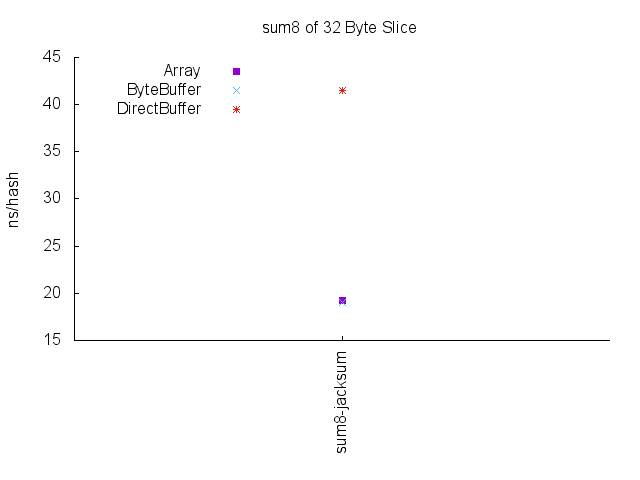

| Algorithm |  Array | ByteBuffer | DirectBuffer |
| --- | ---: | ---: | ---: | 
| [sum8-jacksum](#sum8-jacksum-latency) | 19.201411 | 19.044973 | 41.522567 |

---
### 32 Byte Slice Latency (sumbsd)

| Algorithm |  Array | ByteBuffer | DirectBuffer |
| --- | ---: | ---: | ---: | 
| [sumbsd-jacksum](#sumbsd-jacksum-latency) | 40.151849 | 41.266825 | 63.289014 |

---
### 32 Byte Slice Latency (sumsysv)
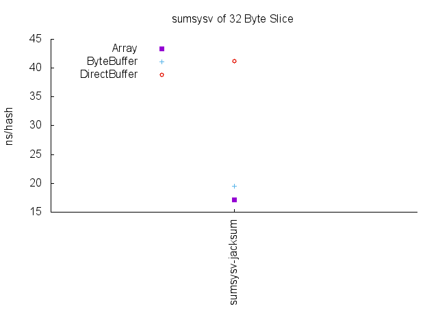

| Algorithm |  Array | ByteBuffer | DirectBuffer |
| --- | ---: | ---: | ---: | 
| [sumsysv-jacksum](#sumsysv-jacksum-latency) | 17.160204 | 19.475162 | 41.259011 |

---
### 32 Byte Slice Latency (tiger)
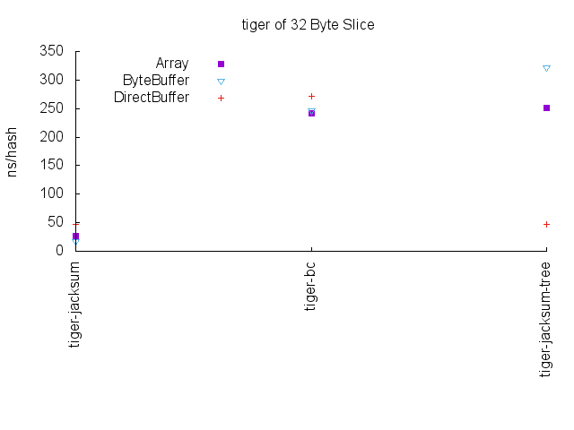

| Algorithm |  Array | ByteBuffer | DirectBuffer |
| --- | ---: | ---: | ---: | 
| [tiger-jacksum](#tiger-jacksum-latency) | 26.595778 | 16.965748 | 47.113522 |
| [tiger-bc](#tiger-bc-latency) | 242.005975 | 246.686902 | 271.585765 |
| [tiger-jacksum-tree](#tiger-jacksum-tree-latency) | 250.629941 | 321.064486 | 47.720619 |

---
### 32 Byte Slice Latency (tiger128)
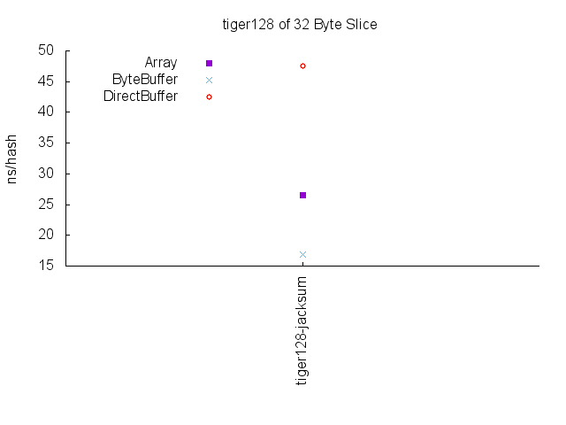

| Algorithm |  Array | ByteBuffer | DirectBuffer |
| --- | ---: | ---: | ---: | 
| [tiger128-jacksum](#tiger128-jacksum-latency) | 26.530873 | 16.941582 | 47.610279 |

---
### 32 Byte Slice Latency (tiger160)
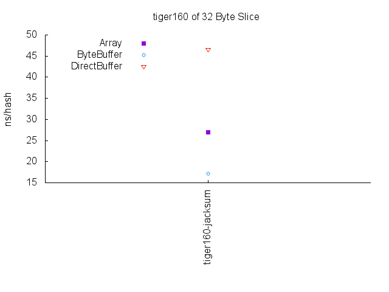

| Algorithm |  Array | ByteBuffer | DirectBuffer |
| --- | ---: | ---: | ---: | 
| [tiger160-jacksum](#tiger160-jacksum-latency) | 26.901186 | 17.128180 | 46.495744 |

---
### 32 Byte Slice Latency (tiger2)
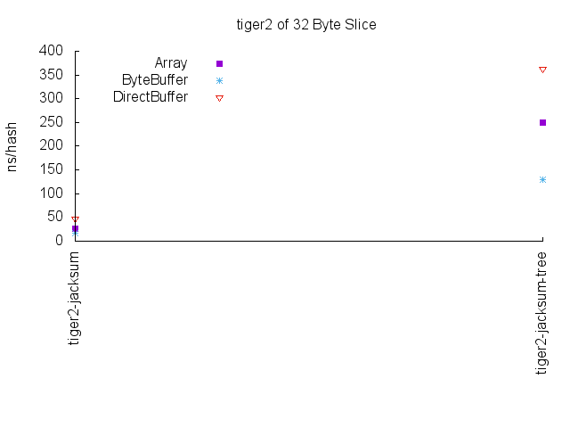

| Algorithm |  Array | ByteBuffer | DirectBuffer |
| --- | ---: | ---: | ---: | 
| [tiger2-jacksum](#tiger2-jacksum-latency) | 26.605994 | 16.770049 | 46.625151 |
| [tiger2-jacksum-tree](#tiger2-jacksum-tree-latency) | 250.069396 | 128.837808 | 362.411389 |

---
### 32 Byte Slice Latency (whirlpool0)
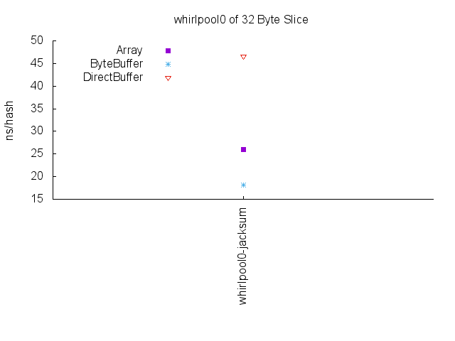

| Algorithm |  Array | ByteBuffer | DirectBuffer |
| --- | ---: | ---: | ---: | 
| [whirlpool0-jacksum](#whirlpool0-jacksum-latency) | 25.970508 | 18.094768 | 46.474345 |

---
### 32 Byte Slice Latency (whirlpool1)
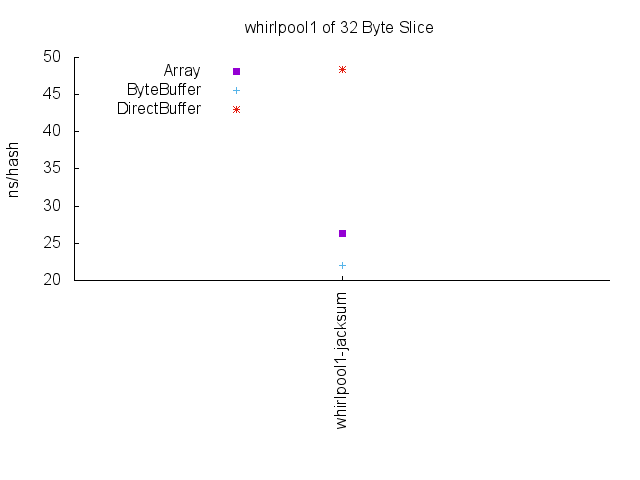

| Algorithm |  Array | ByteBuffer | DirectBuffer |
| --- | ---: | ---: | ---: | 
| [whirlpool1-jacksum](#whirlpool1-jacksum-latency) | 26.265669 | 22.033114 | 48.362203 |

---
### 32 Byte Slice Latency (whirlpool2)
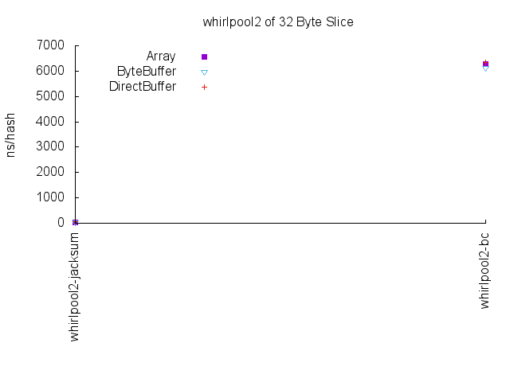

| Algorithm |  Array | ByteBuffer | DirectBuffer |
| --- | ---: | ---: | ---: | 
| [whirlpool2-jacksum](#whirlpool2-jacksum-latency) | 26.001988 | 17.935126 | 47.432102 |
| [whirlpool2-bc](#whirlpool2-bc-latency) | 6270.998018 | 6129.439497 | 6338.404691 |

---
### 32 Byte Slice Latency (xor8)
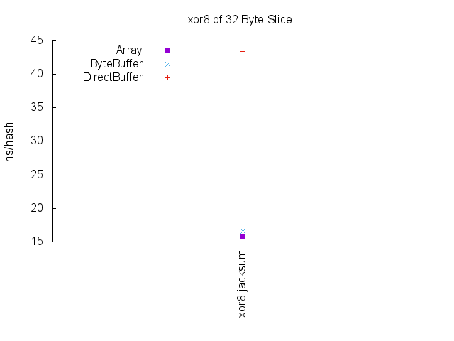

| Algorithm |  Array | ByteBuffer | DirectBuffer |
| --- | ---: | ---: | ---: | 
| [xor8-jacksum](#xor8-jacksum-latency) | 15.805184 | 16.547681 | 43.397742 |

---
### 32 Byte Slice Latency (xxh32)
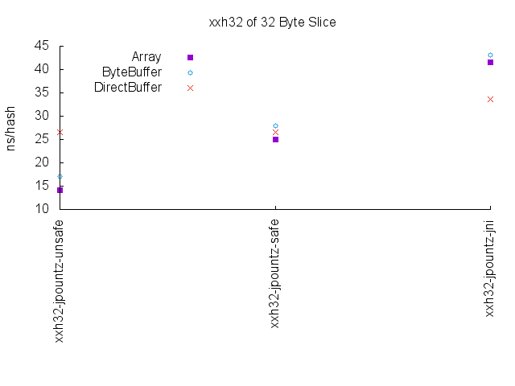

| Algorithm |  Array | ByteBuffer | DirectBuffer |
| --- | ---: | ---: | ---: | 
| [xxh32-jpountz-unsafe](#xxh32-jpountz-unsafe-latency) | 14.192635 | 17.102599 | 26.556624 |
| [xxh32-jpountz-safe](#xxh32-jpountz-safe-latency) | 25.001214 | 27.991035 | 26.610664 |
| [xxh32-jpountz-jni](#xxh32-jpountz-jni-latency) | 41.597876 | 43.099607 | 33.626448 |

---
### 32 Byte Slice Latency (xxh64)
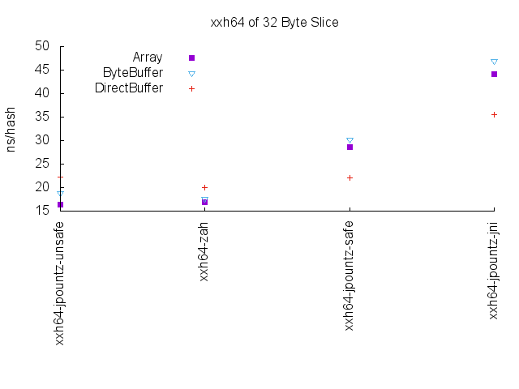

| Algorithm |  Array | ByteBuffer | DirectBuffer |
| --- | ---: | ---: | ---: | 
| [xxh64-jpountz-unsafe](#xxh64-jpountz-unsafe-latency) | 16.304942 | 18.769096 | 22.195812 |
| [xxh64-zah](#xxh64-zah-latency) | 16.906620 | 17.590279 | 20.053239 |
| [xxh64-jpountz-safe](#xxh64-jpountz-safe-latency) | 28.641997 | 30.179441 | 21.988576 |
| [xxh64-jpountz-jni](#xxh64-jpountz-jni-latency) | 44.161312 | 46.936457 | 35.494789 |

---
### 128 Byte Slice Latency (All Hashes)
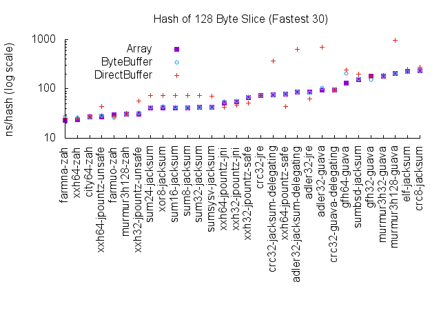

| Algorithm |  Array | ByteBuffer | DirectBuffer |
| --- | ---: | ---: | ---: | 
| [farmna-zah](#farmna-zah-latency) | 23.235866 | 27.306477 | 25.120309 |
| [xxh64-zah](#xxh64-zah-latency) | 23.690011 | 26.375724 | 25.238294 |
| [city64-zah](#city64-zah-latency) | 26.770539 | 27.151367 | 27.709382 |
| [xxh64-jpountz-unsafe](#xxh64-jpountz-unsafe-latency) | 27.055606 | 28.798232 | 43.995919 |
| [farmuo-zah](#farmuo-zah-latency) | 30.042585 | 26.654625 | 27.136750 |
| [murmur3h128-zah](#murmur3h128-zah-latency) | 30.748308 | 31.129817 | 32.292191 |
| [xxh32-jpountz-unsafe](#xxh32-jpountz-unsafe-latency) | 30.949038 | 32.528779 | 57.129863 |
| [sum24-jacksum](#sum24-jacksum-latency) | 41.282981 | 42.244672 | 74.714459 |
| [xor8-jacksum](#xor8-jacksum-latency) | 41.298078 | 43.899128 | 72.906913 |
| [sum16-jacksum](#sum16-jacksum-latency) | 41.581240 | 42.436285 | 74.225023 |
| [sum8-jacksum](#sum8-jacksum-latency) | 41.618125 | 41.821830 | 74.317820 |
| [sum32-jacksum](#sum32-jacksum-latency) | 42.030140 | 42.635164 | 73.090384 |
| [sumsysv-jacksum](#sumsysv-jacksum-latency) | 42.197802 | 43.227517 | 71.416307 |
| [xxh64-jpountz-jni](#xxh64-jpountz-jni-latency) | 52.127289 | 55.073827 | 42.530321 |
| [xxh32-jpountz-jni](#xxh32-jpountz-jni-latency) | 55.989063 | 56.687078 | 46.869187 |
| [xxh32-jpountz-safe](#xxh32-jpountz-safe-latency) | 67.874825 | 68.989849 | 51.599383 |
| [crc32-jre](#crc32-jre-latency) | 73.150060 | 73.310518 | 73.023028 |
| [crc32-jacksum-delegating](#crc32-jacksum-delegating-latency) | 77.259863 | 75.330008 | 364.915767 |
| [xxh64-jpountz-safe](#xxh64-jpountz-safe-latency) | 78.613048 | 77.530593 | 43.979924 |
| [adler32-jacksum-delegating](#adler32-jacksum-delegating-latency) | 86.041804 | 85.911705 | 633.398888 |
| [adler32-jre](#adler32-jre-latency) | 87.627326 | 83.724961 | 63.094092 |
| [adler32-guava](#adler32-guava-latency) | 96.125894 | 104.391723 | 702.109013 |
| [crc32-guava-delegating](#crc32-guava-delegating-latency) | 96.730522 | 94.997697 | 93.885340 |
| [gfh64-guava](#gfh64-guava-latency) | 132.475242 | 204.298999 | 243.522174 |
| [sumbsd-jacksum](#sumbsd-jacksum-latency) | 155.111128 | 160.631312 | 199.303746 |
| [gfh32-guava](#gfh32-guava-latency) | 180.415212 | 153.317930 | 182.095482 |
| [murmur3h32-guava](#murmur3h32-guava-latency) | 184.011036 | 179.632072 | 189.574318 |
| [murmur3h128-guava](#murmur3h128-guava-latency) | 206.951171 | 203.446837 | 982.538001 |
| [elf-jacksum](#elf-jacksum-latency) | 229.506601 | 222.444846 | 253.335851 |
| [crc8-jacksum](#crc8-jacksum-latency) | 238.120951 | 231.094953 | 274.732034 |
| [sip-guava](#sip-guava-latency) | 241.708040 | 239.445997 | 1998.744774 |
| [tiger2-jacksum-tree](#tiger2-jacksum-tree-latency) | 251.294784 | 26.103113 | 589.747046 |
| [tiger-jacksum-tree](#tiger-jacksum-tree-latency) | 252.653821 | 209.263687 | 1052.546166 |
| [ed2k-jacksum](#ed2k-jacksum-latency) | 265.170420 | 262.050898 | 296.109387 |
| [crc16-jacksum](#crc16-jacksum-latency) | 289.128075 | 287.133437 | 697.202747 |
| [crc32-jacksum-fcs32](#crc32-jacksum-fcs32-latency) | 302.085977 | 297.804317 | 329.608422 |
| [crc32-guava-rfc3720](#crc32-guava-rfc3720-latency) | 309.428893 | 324.510106 | 322.188454 |
| [md4-jacksum](#md4-jacksum-latency) | 322.238934 | 322.922862 | 431.051762 |
| [sip-inline](#sip-inline-latency) | 323.234926 | 158.183822 | 163.397172 |
| [md5-jacksum](#md5-jacksum-latency) | 324.139507 | 324.039770 | 362.479787 |
| [md2-jacksum](#md2-jacksum-latency) | 324.261079 | 323.623015 | 419.234532 |
| [crc64-jacksum](#crc64-jacksum-latency) | 325.555830 | 322.624391 | 359.807905 |
| [fcs16-jacksum](#fcs16-jacksum-latency) | 330.586159 | 329.145056 | 358.914976 |
| [crc32-jacksum-mpeg2](#crc32-jacksum-mpeg2-latency) | 332.681268 | 331.112436 | 354.728575 |
| [cksum-jacksum](#cksum-jacksum-latency) | 337.366639 | 337.461772 | 662.599733 |
| [crc32-jacksum-bzip2](#crc32-jacksum-bzip2-latency) | 349.999314 | 436.748690 | 462.246433 |
| [crc24-jacksum](#crc24-jacksum-latency) | 355.813976 | 429.830150 | 684.382383 |
| [md5-jacksum-alt](#md5-jacksum-alt-latency) | 379.390130 | 370.185243 | 510.115265 |
| [tiger160-jacksum](#tiger160-jacksum-latency) | 399.236201 | 385.854134 | 429.838225 |
| [tiger128-jacksum](#tiger128-jacksum-latency) | 401.074567 | 393.063321 | 423.059030 |
| [tiger2-jacksum](#tiger2-jacksum-latency) | 401.691753 | 390.442148 | 420.830864 |
| [tiger-jacksum](#tiger-jacksum-latency) | 401.796797 | 387.227642 | 420.153623 |
| [sip-fwdeng](#sip-fwdeng-latency) | 447.450040 | 361.333105 | 384.916222 |
| [sha1-jacksum](#sha1-jacksum-latency) | 480.087700 | 478.709820 | 505.797889 |
| [md4-bc](#md4-bc-latency) | 484.376245 | 528.414937 | 496.493108 |
| [adler32-jacksum-alt](#adler32-jacksum-alt-latency) | 496.467568 | 493.061131 | 910.164271 |
| [ripemd256-jacksum](#ripemd256-jacksum-latency) | 532.382823 | 522.443572 | 557.371504 |
| [sha0-jacksum](#sha0-jacksum-latency) | 539.565245 | 593.537244 | 577.689762 |
| [haval192h3-jacksum](#haval192h3-jacksum-latency) | 546.684089 | 532.651365 | 567.618677 |
| [haval128h3-jacksum](#haval128h3-jacksum-latency) | 548.849891 | 534.434707 | 568.117906 |
| [haval224h3-jacksum](#haval224h3-jacksum-latency) | 549.911931 | 535.213686 | 585.288255 |
| [haval160h3-jacksum](#haval160h3-jacksum-latency) | 552.402122 | 534.821976 | 578.309215 |
| [sha1-jacksum-alt](#sha1-jacksum-alt-latency) | 552.689207 | 545.292398 | 578.530160 |
| [haval256h3-jacksum](#haval256h3-jacksum-latency) | 553.603324 | 531.544005 | 566.755706 |
| [sha384-jacksum-alt](#sha384-jacksum-alt-latency) | 557.661405 | 575.845305 | 580.911086 |
| [md5-guava](#md5-guava-latency) | 562.933865 | 572.496765 | 569.000993 |
| [sha512-jacksum-alt](#sha512-jacksum-alt-latency) | 569.125940 | 575.668424 | 605.907340 |
| [sha384-jacksum](#sha384-jacksum-latency) | 577.818310 | 577.624004 | 608.601591 |
| [sha512-jacksum](#sha512-jacksum-latency) | 579.002787 | 584.100463 | 596.603419 |
| [ripemd128-jacksum](#ripemd128-jacksum-latency) | 579.188363 | 571.619358 | 622.586383 |
| [has160-jacksum](#has160-jacksum-latency) | 622.089940 | 625.302121 | 663.394994 |
| [md5-bc](#md5-bc-latency) | 626.071277 | 667.242240 | 661.510923 |
| [tiger-bc](#tiger-bc-latency) | 660.002892 | 666.205873 | 631.077592 |
| [sha256-jacksum](#sha256-jacksum-latency) | 689.668352 | 688.958648 | 710.097107 |
| [ripemd128-bc](#ripemd128-bc-latency) | 690.967005 | 738.486551 | 701.199427 |
| [skein256-bc](#skein256-bc-latency) | 730.389076 | 739.350194 | 766.112180 |
| [haval256h4-jacksum](#haval256h4-jacksum-latency) | 743.401566 | 725.737268 | 790.279938 |
| [haval192h4-jacksum](#haval192h4-jacksum-latency) | 744.068814 | 727.815228 | 790.249723 |
| [haval224h4-jacksum](#haval224h4-jacksum-latency) | 744.961779 | 732.674471 | 877.968310 |
| [ripemd256-bc](#ripemd256-bc-latency) | 746.830419 | 750.738307 | 769.734739 |
| [haval128h4-jacksum](#haval128h4-jacksum-latency) | 753.997693 | 728.139257 | 787.568646 |
| [haval160h4-jacksum](#haval160h4-jacksum-latency) | 764.517595 | 727.838390 | 763.951007 |
| [skein512-bc](#skein512-bc-latency) | 770.294673 | 750.512468 | 797.681376 |
| [sha256-jacksum-alt](#sha256-jacksum-alt-latency) | 815.888805 | 835.369463 | 829.823187 |
| [sha224-jacksum](#sha224-jacksum-latency) | 832.261154 | 839.060447 | 829.735995 |
| [sha1-guava](#sha1-guava-latency) | 851.710663 | 807.926101 | 3353.750884 |
| [haval224h5-jacksum](#haval224h5-jacksum-latency) | 895.722528 | 885.088866 | 928.613747 |
| [haval160h5-jacksum](#haval160h5-jacksum-latency) | 896.161127 | 883.884953 | 934.478156 |
| [haval256h5-jacksum](#haval256h5-jacksum-latency) | 897.824281 | 881.795055 | 919.678067 |
| [haval128h5-jacksum](#haval128h5-jacksum-latency) | 898.364735 | 883.138589 | 930.964157 |
| [sha1-bc](#sha1-bc-latency) | 900.638322 | 895.886606 | 908.225365 |
| [haval192h5-jacksum](#haval192h5-jacksum-latency) | 912.273490 | 882.526581 | 947.946169 |
| [skein1024-bc](#skein1024-bc-latency) | 1083.717816 | 1079.922541 | 1111.128666 |
| [sha512-bc-t](#sha512-bc-t-latency) | 1090.298445 | 1098.853422 | 1134.860603 |
| [ripemd160-jacksum](#ripemd160-jacksum-latency) | 1120.601025 | 1106.328868 | 1135.061109 |
| [sha384-bc](#sha384-bc-latency) | 1123.002863 | 1088.777929 | 1094.028197 |
| [sha512-bc](#sha512-bc-latency) | 1142.930419 | 1092.905824 | 1118.996760 |
| [sha256-guava](#sha256-guava-latency) | 1144.590347 | 1120.558737 | 4192.568947 |
| [sm3-bc](#sm3-bc-latency) | 1178.571283 | 1159.304866 | 1191.355530 |
| [sha224-bc](#sha224-bc-latency) | 1239.296101 | 1232.091593 | 1240.835384 |
| [sha256-bc](#sha256-bc-latency) | 1249.856008 | 1239.932912 | 1245.724482 |
| [sha384-guava](#sha384-guava-latency) | 1343.018339 | 1353.905566 | 3241.150523 |
| [sha512-guava](#sha512-guava-latency) | 1401.044055 | 1319.813152 | 6668.983985 |
| [whirlpool1-jacksum](#whirlpool1-jacksum-latency) | 1929.650068 | 1880.684412 | 1974.996367 |
| [whirlpool2-jacksum](#whirlpool2-jacksum-latency) | 1965.017943 | 1896.056240 | 1945.630753 |
| [whirlpool0-jacksum](#whirlpool0-jacksum-latency) | 1979.447084 | 1878.216593 | 1953.496923 |
| [ripemd320-jacksum](#ripemd320-jacksum-latency) | 2209.255567 | 2214.874267 | 2224.967572 |
| [ripemd160-bc](#ripemd160-bc-latency) | 3234.139324 | 3253.477514 | 3229.988276 |
| [ripemd320-bc](#ripemd320-bc-latency) | 3352.033912 | 3274.220494 | 3298.691659 |
| [whirlpool2-bc](#whirlpool2-bc-latency) | 9613.684622 | 9457.849010 | 9664.107738 |
| [sha3-bc](#sha3-bc-latency) | 11099.965474 | 10669.090840 | 10576.180955 |
| [gost-jacksum](#gost-jacksum-latency) | 15132.912116 | 15237.731552 | 15063.220336 |
| [md2-bc](#md2-bc-latency) | 20284.956604 | 20050.054311 | 19380.135732 |
| [gost-bc](#gost-bc-latency) | 23922.431463 | 24648.875020 | 23427.110352 |

---
### 128 Byte Slice Latency (adler32)
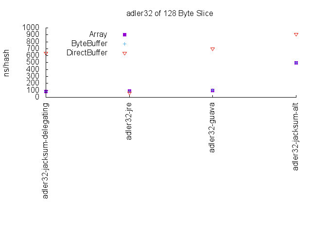

| Algorithm |  Array | ByteBuffer | DirectBuffer |
| --- | ---: | ---: | ---: | 
| [adler32-jacksum-delegating](#adler32-jacksum-delegating-latency) | 86.041804 | 85.911705 | 633.398888 |
| [adler32-jre](#adler32-jre-latency) | 87.627326 | 83.724961 | 63.094092 |
| [adler32-guava](#adler32-guava-latency) | 96.125894 | 104.391723 | 702.109013 |
| [adler32-jacksum-alt](#adler32-jacksum-alt-latency) | 496.467568 | 493.061131 | 910.164271 |

---
### 128 Byte Slice Latency (city64)
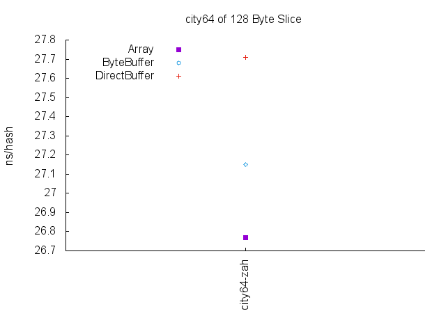

| Algorithm |  Array | ByteBuffer | DirectBuffer |
| --- | ---: | ---: | ---: | 
| [city64-zah](#city64-zah-latency) | 26.770539 | 27.151367 | 27.709382 |

---
### 128 Byte Slice Latency (cksum)
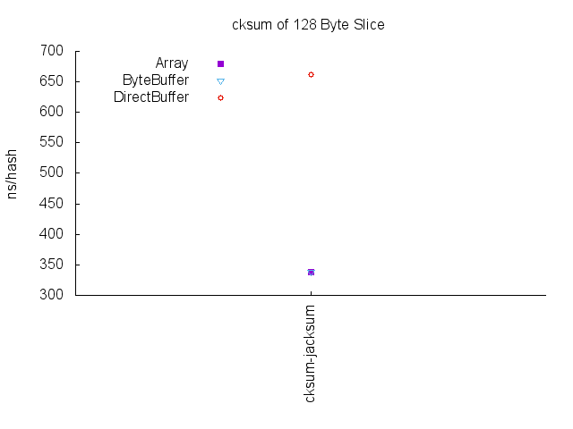

| Algorithm |  Array | ByteBuffer | DirectBuffer |
| --- | ---: | ---: | ---: | 
| [cksum-jacksum](#cksum-jacksum-latency) | 337.366639 | 337.461772 | 662.599733 |

---
### 128 Byte Slice Latency (crc16)
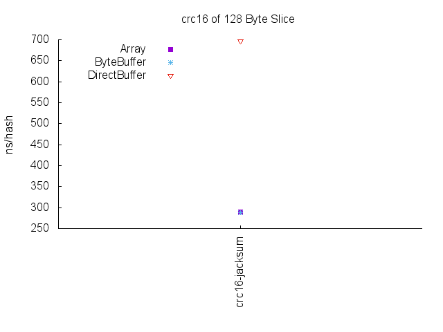

| Algorithm |  Array | ByteBuffer | DirectBuffer |
| --- | ---: | ---: | ---: | 
| [crc16-jacksum](#crc16-jacksum-latency) | 289.128075 | 287.133437 | 697.202747 |

---
### 128 Byte Slice Latency (crc24)
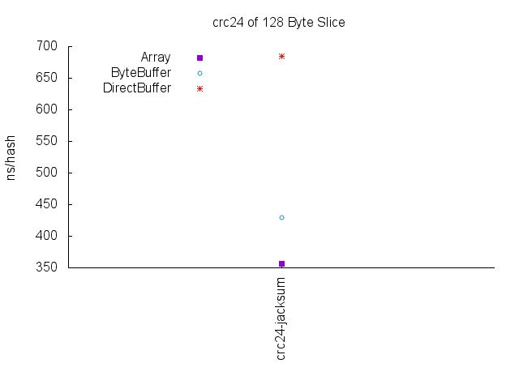

| Algorithm |  Array | ByteBuffer | DirectBuffer |
| --- | ---: | ---: | ---: | 
| [crc24-jacksum](#crc24-jacksum-latency) | 355.813976 | 429.830150 | 684.382383 |

---
### 128 Byte Slice Latency (crc32)
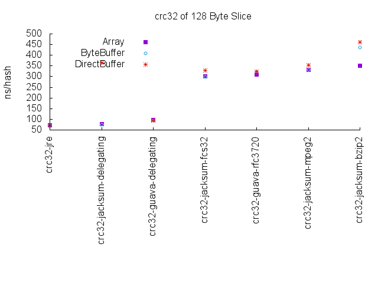

| Algorithm |  Array | ByteBuffer | DirectBuffer |
| --- | ---: | ---: | ---: | 
| [crc32-jre](#crc32-jre-latency) | 73.150060 | 73.310518 | 73.023028 |
| [crc32-jacksum-delegating](#crc32-jacksum-delegating-latency) | 77.259863 | 75.330008 | 364.915767 |
| [crc32-guava-delegating](#crc32-guava-delegating-latency) | 96.730522 | 94.997697 | 93.885340 |
| [crc32-jacksum-fcs32](#crc32-jacksum-fcs32-latency) | 302.085977 | 297.804317 | 329.608422 |
| [crc32-guava-rfc3720](#crc32-guava-rfc3720-latency) | 309.428893 | 324.510106 | 322.188454 |
| [crc32-jacksum-mpeg2](#crc32-jacksum-mpeg2-latency) | 332.681268 | 331.112436 | 354.728575 |
| [crc32-jacksum-bzip2](#crc32-jacksum-bzip2-latency) | 349.999314 | 436.748690 | 462.246433 |

---
### 128 Byte Slice Latency (crc64)

| Algorithm |  Array | ByteBuffer | DirectBuffer |
| --- | ---: | ---: | ---: | 
| [crc64-jacksum](#crc64-jacksum-latency) | 325.555830 | 322.624391 | 359.807905 |

---
### 128 Byte Slice Latency (crc8)

| Algorithm |  Array | ByteBuffer | DirectBuffer |
| --- | ---: | ---: | ---: | 
| [crc8-jacksum](#crc8-jacksum-latency) | 238.120951 | 231.094953 | 274.732034 |

---
### 128 Byte Slice Latency (ed2k)
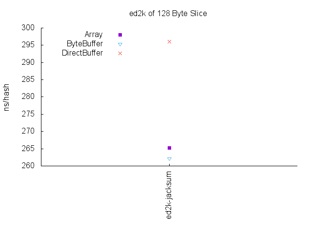

| Algorithm |  Array | ByteBuffer | DirectBuffer |
| --- | ---: | ---: | ---: | 
| [ed2k-jacksum](#ed2k-jacksum-latency) | 265.170420 | 262.050898 | 296.109387 |

---
### 128 Byte Slice Latency (elf)
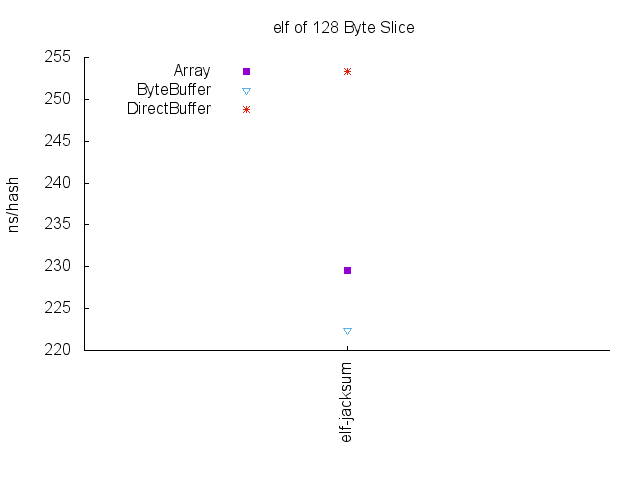

| Algorithm |  Array | ByteBuffer | DirectBuffer |
| --- | ---: | ---: | ---: | 
| [elf-jacksum](#elf-jacksum-latency) | 229.506601 | 222.444846 | 253.335851 |

---
### 128 Byte Slice Latency (farmna)
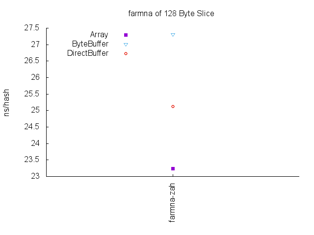

| Algorithm |  Array | ByteBuffer | DirectBuffer |
| --- | ---: | ---: | ---: | 
| [farmna-zah](#farmna-zah-latency) | 23.235866 | 27.306477 | 25.120309 |

---
### 128 Byte Slice Latency (farmuo)
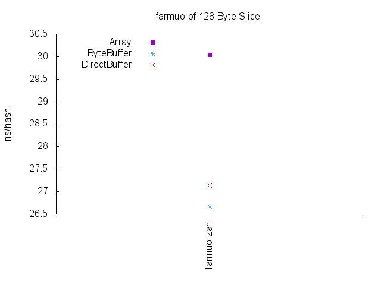

| Algorithm |  Array | ByteBuffer | DirectBuffer |
| --- | ---: | ---: | ---: | 
| [farmuo-zah](#farmuo-zah-latency) | 30.042585 | 26.654625 | 27.136750 |

---
### 128 Byte Slice Latency (fcs16)
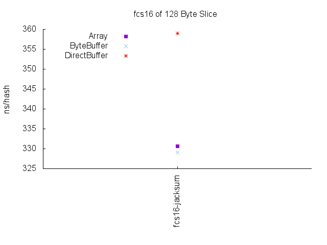

| Algorithm |  Array | ByteBuffer | DirectBuffer |
| --- | ---: | ---: | ---: | 
| [fcs16-jacksum](#fcs16-jacksum-latency) | 330.586159 | 329.145056 | 358.914976 |

---
### 128 Byte Slice Latency (gfh32)
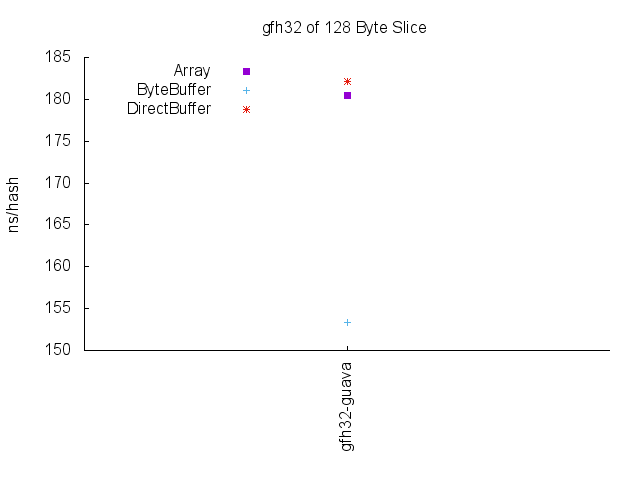

| Algorithm |  Array | ByteBuffer | DirectBuffer |
| --- | ---: | ---: | ---: | 
| [gfh32-guava](#gfh32-guava-latency) | 180.415212 | 153.317930 | 182.095482 |

---
### 128 Byte Slice Latency (gfh64)
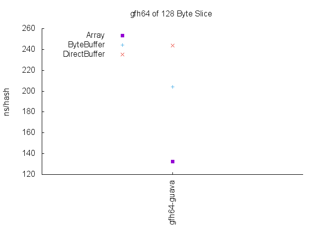

| Algorithm |  Array | ByteBuffer | DirectBuffer |
| --- | ---: | ---: | ---: | 
| [gfh64-guava](#gfh64-guava-latency) | 132.475242 | 204.298999 | 243.522174 |

---
### 128 Byte Slice Latency (gost)
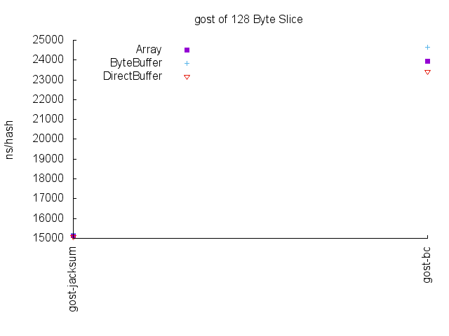

| Algorithm |  Array | ByteBuffer | DirectBuffer |
| --- | ---: | ---: | ---: | 
| [gost-jacksum](#gost-jacksum-latency) | 15132.912116 | 15237.731552 | 15063.220336 |
| [gost-bc](#gost-bc-latency) | 23922.431463 | 24648.875020 | 23427.110352 |

---
### 128 Byte Slice Latency (has160)
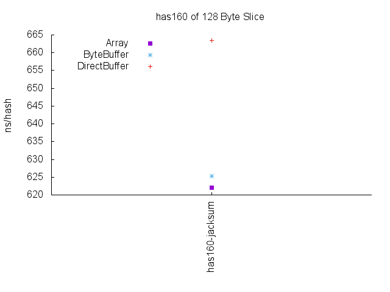

| Algorithm |  Array | ByteBuffer | DirectBuffer |
| --- | ---: | ---: | ---: | 
| [has160-jacksum](#has160-jacksum-latency) | 622.089940 | 625.302121 | 663.394994 |

---
### 128 Byte Slice Latency (haval128h3)

| Algorithm |  Array | ByteBuffer | DirectBuffer |
| --- | ---: | ---: | ---: | 
| [haval128h3-jacksum](#haval128h3-jacksum-latency) | 548.849891 | 534.434707 | 568.117906 |

---
### 128 Byte Slice Latency (haval128h4)

| Algorithm |  Array | ByteBuffer | DirectBuffer |
| --- | ---: | ---: | ---: | 
| [haval128h4-jacksum](#haval128h4-jacksum-latency) | 753.997693 | 728.139257 | 787.568646 |

---
### 128 Byte Slice Latency (haval128h5)
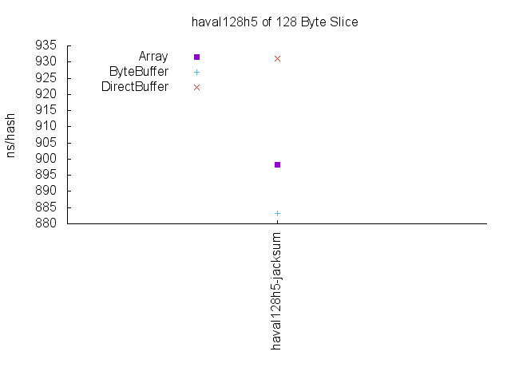

| Algorithm |  Array | ByteBuffer | DirectBuffer |
| --- | ---: | ---: | ---: | 
| [haval128h5-jacksum](#haval128h5-jacksum-latency) | 898.364735 | 883.138589 | 930.964157 |

---
### 128 Byte Slice Latency (haval160h3)
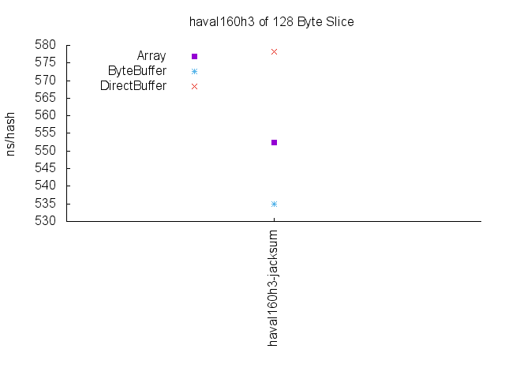

| Algorithm |  Array | ByteBuffer | DirectBuffer |
| --- | ---: | ---: | ---: | 
| [haval160h3-jacksum](#haval160h3-jacksum-latency) | 552.402122 | 534.821976 | 578.309215 |

---
### 128 Byte Slice Latency (haval160h4)
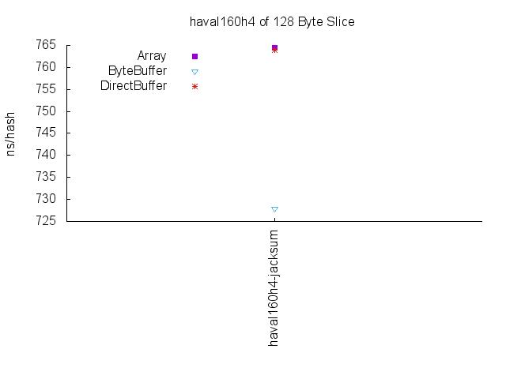

| Algorithm |  Array | ByteBuffer | DirectBuffer |
| --- | ---: | ---: | ---: | 
| [haval160h4-jacksum](#haval160h4-jacksum-latency) | 764.517595 | 727.838390 | 763.951007 |

---
### 128 Byte Slice Latency (haval160h5)
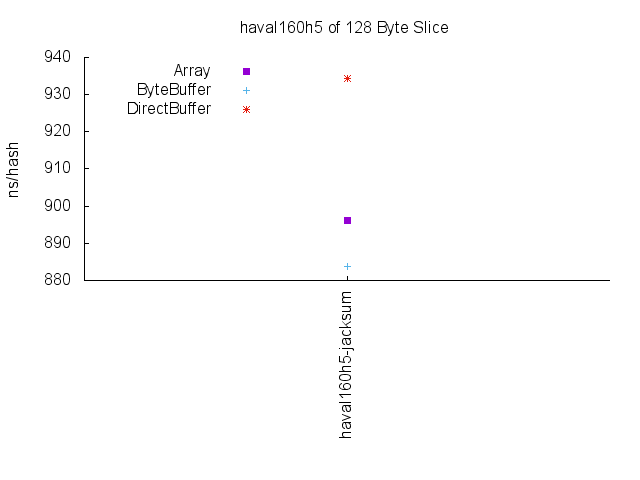

| Algorithm |  Array | ByteBuffer | DirectBuffer |
| --- | ---: | ---: | ---: | 
| [haval160h5-jacksum](#haval160h5-jacksum-latency) | 896.161127 | 883.884953 | 934.478156 |

---
### 128 Byte Slice Latency (haval192h3)
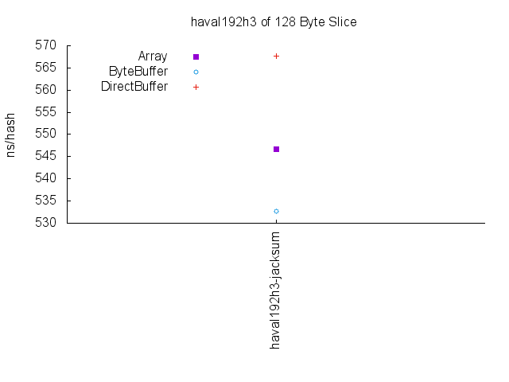

| Algorithm |  Array | ByteBuffer | DirectBuffer |
| --- | ---: | ---: | ---: | 
| [haval192h3-jacksum](#haval192h3-jacksum-latency) | 546.684089 | 532.651365 | 567.618677 |

---
### 128 Byte Slice Latency (haval192h4)

| Algorithm |  Array | ByteBuffer | DirectBuffer |
| --- | ---: | ---: | ---: | 
| [haval192h4-jacksum](#haval192h4-jacksum-latency) | 744.068814 | 727.815228 | 790.249723 |

---
### 128 Byte Slice Latency (haval192h5)

| Algorithm |  Array | ByteBuffer | DirectBuffer |
| --- | ---: | ---: | ---: | 
| [haval192h5-jacksum](#haval192h5-jacksum-latency) | 912.273490 | 882.526581 | 947.946169 |

---
### 128 Byte Slice Latency (haval224h3)
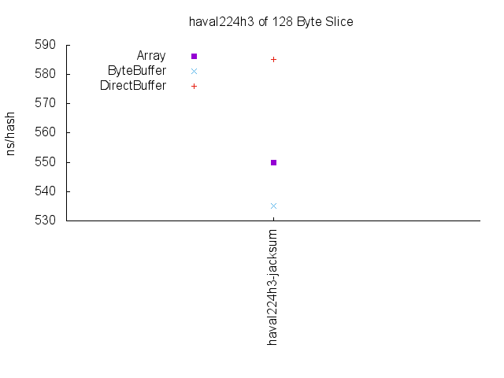

| Algorithm |  Array | ByteBuffer | DirectBuffer |
| --- | ---: | ---: | ---: | 
| [haval224h3-jacksum](#haval224h3-jacksum-latency) | 549.911931 | 535.213686 | 585.288255 |

---
### 128 Byte Slice Latency (haval224h4)
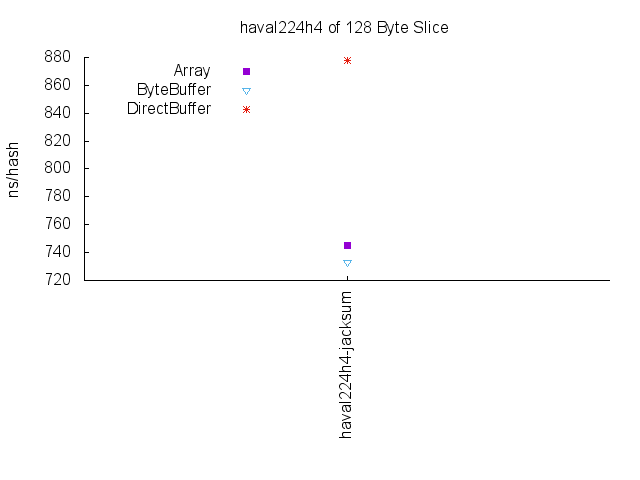

| Algorithm |  Array | ByteBuffer | DirectBuffer |
| --- | ---: | ---: | ---: | 
| [haval224h4-jacksum](#haval224h4-jacksum-latency) | 744.961779 | 732.674471 | 877.968310 |

---
### 128 Byte Slice Latency (haval224h5)
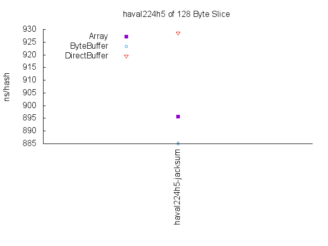

| Algorithm |  Array | ByteBuffer | DirectBuffer |
| --- | ---: | ---: | ---: | 
| [haval224h5-jacksum](#haval224h5-jacksum-latency) | 895.722528 | 885.088866 | 928.613747 |

---
### 128 Byte Slice Latency (haval256h3)
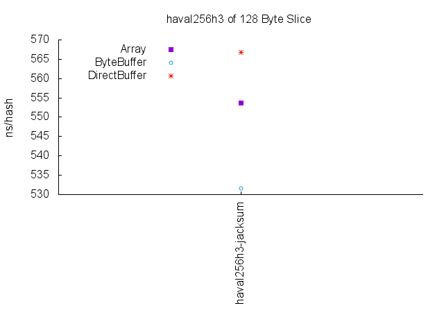

| Algorithm |  Array | ByteBuffer | DirectBuffer |
| --- | ---: | ---: | ---: | 
| [haval256h3-jacksum](#haval256h3-jacksum-latency) | 553.603324 | 531.544005 | 566.755706 |

---
### 128 Byte Slice Latency (haval256h4)
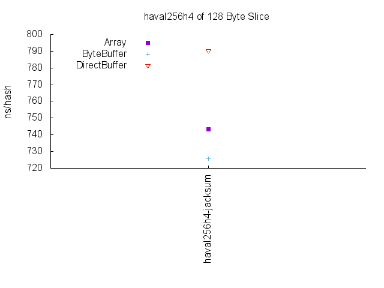

| Algorithm |  Array | ByteBuffer | DirectBuffer |
| --- | ---: | ---: | ---: | 
| [haval256h4-jacksum](#haval256h4-jacksum-latency) | 743.401566 | 725.737268 | 790.279938 |

---
### 128 Byte Slice Latency (haval256h5)

| Algorithm |  Array | ByteBuffer | DirectBuffer |
| --- | ---: | ---: | ---: | 
| [haval256h5-jacksum](#haval256h5-jacksum-latency) | 897.824281 | 881.795055 | 919.678067 |

---
### 128 Byte Slice Latency (md2)
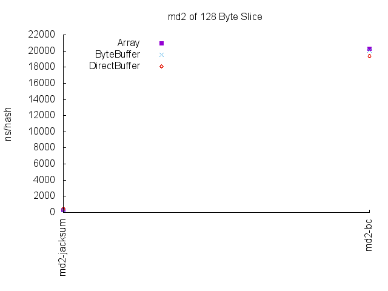

| Algorithm |  Array | ByteBuffer | DirectBuffer |
| --- | ---: | ---: | ---: | 
| [md2-jacksum](#md2-jacksum-latency) | 324.261079 | 323.623015 | 419.234532 |
| [md2-bc](#md2-bc-latency) | 20284.956604 | 20050.054311 | 19380.135732 |

---
### 128 Byte Slice Latency (md4)
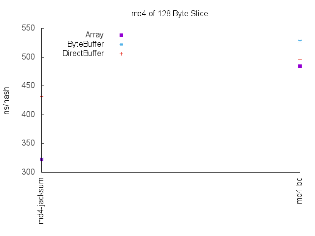

| Algorithm |  Array | ByteBuffer | DirectBuffer |
| --- | ---: | ---: | ---: | 
| [md4-jacksum](#md4-jacksum-latency) | 322.238934 | 322.922862 | 431.051762 |
| [md4-bc](#md4-bc-latency) | 484.376245 | 528.414937 | 496.493108 |

---
### 128 Byte Slice Latency (md5)
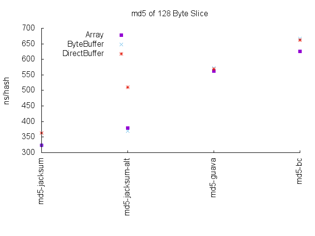

| Algorithm |  Array | ByteBuffer | DirectBuffer |
| --- | ---: | ---: | ---: | 
| [md5-jacksum](#md5-jacksum-latency) | 324.139507 | 324.039770 | 362.479787 |
| [md5-jacksum-alt](#md5-jacksum-alt-latency) | 379.390130 | 370.185243 | 510.115265 |
| [md5-guava](#md5-guava-latency) | 562.933865 | 572.496765 | 569.000993 |
| [md5-bc](#md5-bc-latency) | 626.071277 | 667.242240 | 661.510923 |

---
### 128 Byte Slice Latency (murmur3h128)
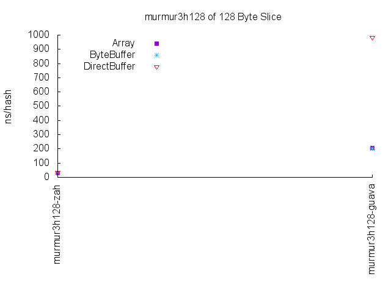

| Algorithm |  Array | ByteBuffer | DirectBuffer |
| --- | ---: | ---: | ---: | 
| [murmur3h128-zah](#murmur3h128-zah-latency) | 30.748308 | 31.129817 | 32.292191 |
| [murmur3h128-guava](#murmur3h128-guava-latency) | 206.951171 | 203.446837 | 982.538001 |

---
### 128 Byte Slice Latency (murmur3h32)
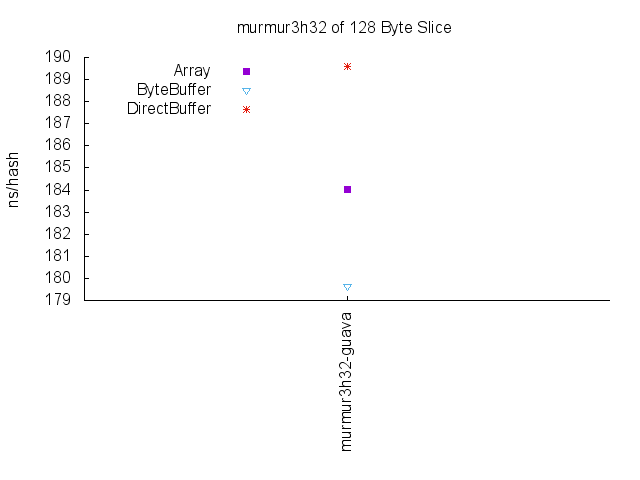

| Algorithm |  Array | ByteBuffer | DirectBuffer |
| --- | ---: | ---: | ---: | 
| [murmur3h32-guava](#murmur3h32-guava-latency) | 184.011036 | 179.632072 | 189.574318 |

---
### 128 Byte Slice Latency (ripemd128)
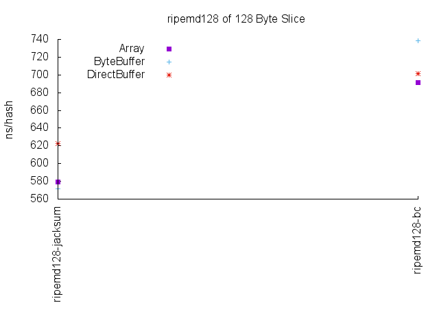

| Algorithm |  Array | ByteBuffer | DirectBuffer |
| --- | ---: | ---: | ---: | 
| [ripemd128-jacksum](#ripemd128-jacksum-latency) | 579.188363 | 571.619358 | 622.586383 |
| [ripemd128-bc](#ripemd128-bc-latency) | 690.967005 | 738.486551 | 701.199427 |

---
### 128 Byte Slice Latency (ripemd160)
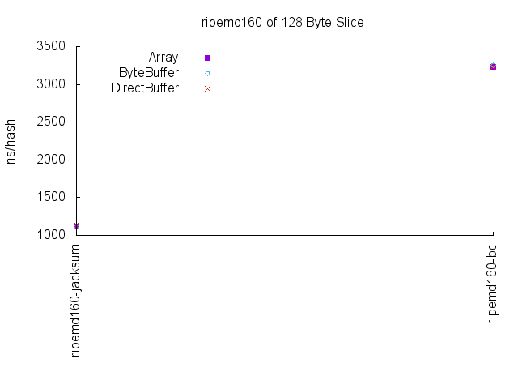

| Algorithm |  Array | ByteBuffer | DirectBuffer |
| --- | ---: | ---: | ---: | 
| [ripemd160-jacksum](#ripemd160-jacksum-latency) | 1120.601025 | 1106.328868 | 1135.061109 |
| [ripemd160-bc](#ripemd160-bc-latency) | 3234.139324 | 3253.477514 | 3229.988276 |

---
### 128 Byte Slice Latency (ripemd256)
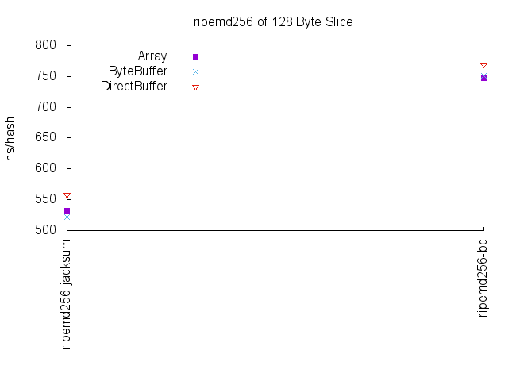

| Algorithm |  Array | ByteBuffer | DirectBuffer |
| --- | ---: | ---: | ---: | 
| [ripemd256-jacksum](#ripemd256-jacksum-latency) | 532.382823 | 522.443572 | 557.371504 |
| [ripemd256-bc](#ripemd256-bc-latency) | 746.830419 | 750.738307 | 769.734739 |

---
### 128 Byte Slice Latency (ripemd320)
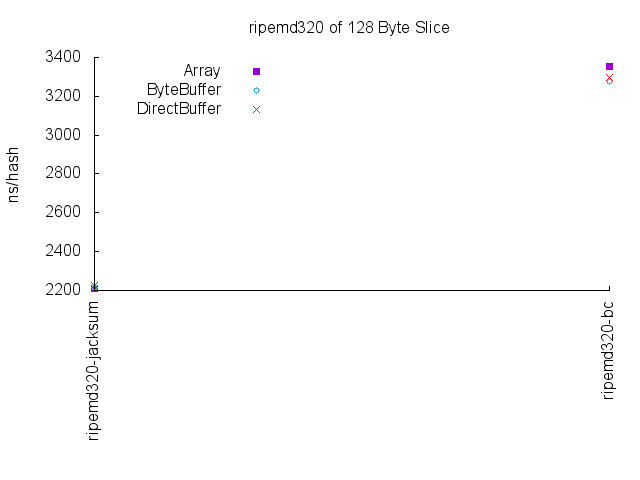

| Algorithm |  Array | ByteBuffer | DirectBuffer |
| --- | ---: | ---: | ---: | 
| [ripemd320-jacksum](#ripemd320-jacksum-latency) | 2209.255567 | 2214.874267 | 2224.967572 |
| [ripemd320-bc](#ripemd320-bc-latency) | 3352.033912 | 3274.220494 | 3298.691659 |

---
### 128 Byte Slice Latency (sha0)
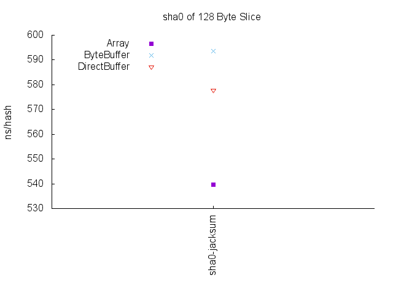

| Algorithm |  Array | ByteBuffer | DirectBuffer |
| --- | ---: | ---: | ---: | 
| [sha0-jacksum](#sha0-jacksum-latency) | 539.565245 | 593.537244 | 577.689762 |

---
### 128 Byte Slice Latency (sha1)
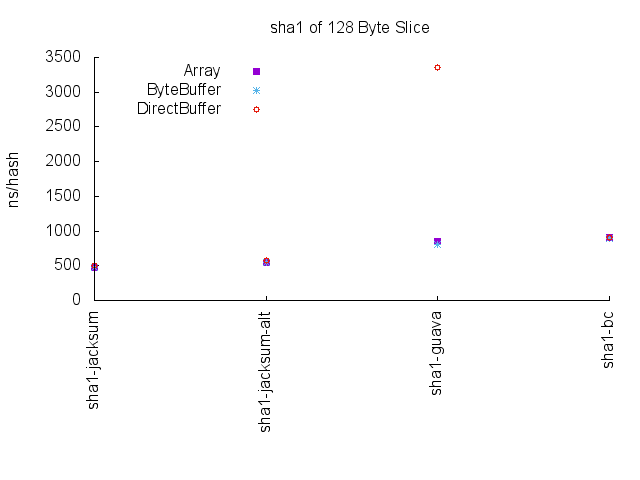

| Algorithm |  Array | ByteBuffer | DirectBuffer |
| --- | ---: | ---: | ---: | 
| [sha1-jacksum](#sha1-jacksum-latency) | 480.087700 | 478.709820 | 505.797889 |
| [sha1-jacksum-alt](#sha1-jacksum-alt-latency) | 552.689207 | 545.292398 | 578.530160 |
| [sha1-guava](#sha1-guava-latency) | 851.710663 | 807.926101 | 3353.750884 |
| [sha1-bc](#sha1-bc-latency) | 900.638322 | 895.886606 | 908.225365 |

---
### 128 Byte Slice Latency (sha224)
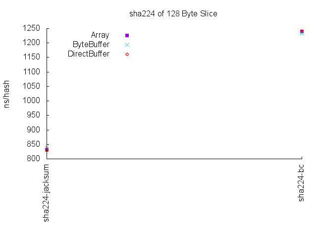

| Algorithm |  Array | ByteBuffer | DirectBuffer |
| --- | ---: | ---: | ---: | 
| [sha224-jacksum](#sha224-jacksum-latency) | 832.261154 | 839.060447 | 829.735995 |
| [sha224-bc](#sha224-bc-latency) | 1239.296101 | 1232.091593 | 1240.835384 |

---
### 128 Byte Slice Latency (sha256)
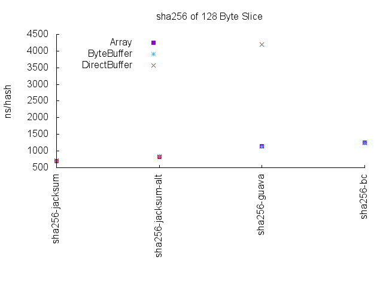

| Algorithm |  Array | ByteBuffer | DirectBuffer |
| --- | ---: | ---: | ---: | 
| [sha256-jacksum](#sha256-jacksum-latency) | 689.668352 | 688.958648 | 710.097107 |
| [sha256-jacksum-alt](#sha256-jacksum-alt-latency) | 815.888805 | 835.369463 | 829.823187 |
| [sha256-guava](#sha256-guava-latency) | 1144.590347 | 1120.558737 | 4192.568947 |
| [sha256-bc](#sha256-bc-latency) | 1249.856008 | 1239.932912 | 1245.724482 |

---
### 128 Byte Slice Latency (sha3)
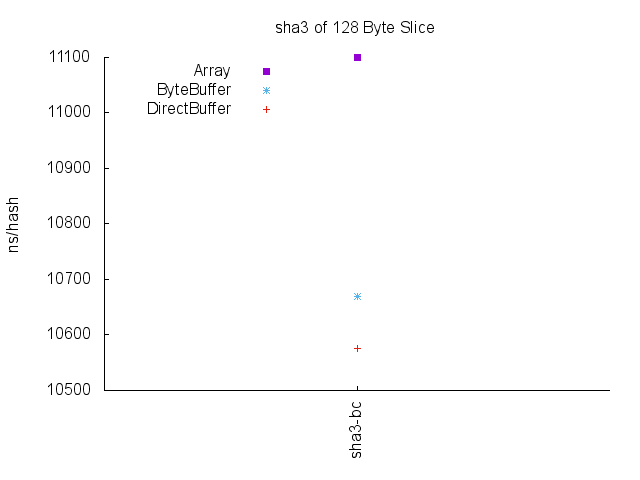

| Algorithm |  Array | ByteBuffer | DirectBuffer |
| --- | ---: | ---: | ---: | 
| [sha3-bc](#sha3-bc-latency) | 11099.965474 | 10669.090840 | 10576.180955 |

---
### 128 Byte Slice Latency (sha384)
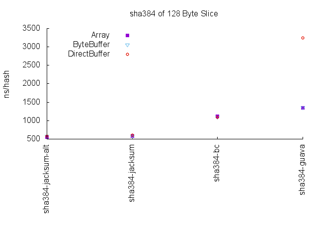

| Algorithm |  Array | ByteBuffer | DirectBuffer |
| --- | ---: | ---: | ---: | 
| [sha384-jacksum-alt](#sha384-jacksum-alt-latency) | 557.661405 | 575.845305 | 580.911086 |
| [sha384-jacksum](#sha384-jacksum-latency) | 577.818310 | 577.624004 | 608.601591 |
| [sha384-bc](#sha384-bc-latency) | 1123.002863 | 1088.777929 | 1094.028197 |
| [sha384-guava](#sha384-guava-latency) | 1343.018339 | 1353.905566 | 3241.150523 |

---
### 128 Byte Slice Latency (sha512)
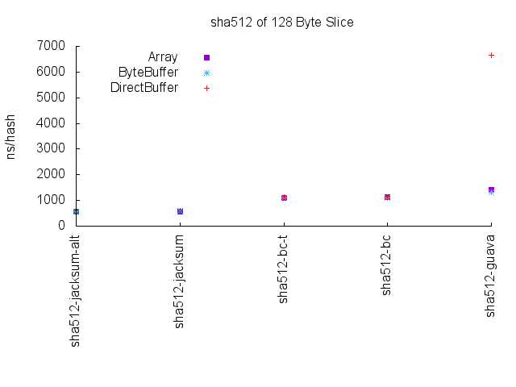

| Algorithm |  Array | ByteBuffer | DirectBuffer |
| --- | ---: | ---: | ---: | 
| [sha512-jacksum-alt](#sha512-jacksum-alt-latency) | 569.125940 | 575.668424 | 605.907340 |
| [sha512-jacksum](#sha512-jacksum-latency) | 579.002787 | 584.100463 | 596.603419 |
| [sha512-bc-t](#sha512-bc-t-latency) | 1090.298445 | 1098.853422 | 1134.860603 |
| [sha512-bc](#sha512-bc-latency) | 1142.930419 | 1092.905824 | 1118.996760 |
| [sha512-guava](#sha512-guava-latency) | 1401.044055 | 1319.813152 | 6668.983985 |

---
### 128 Byte Slice Latency (sip)
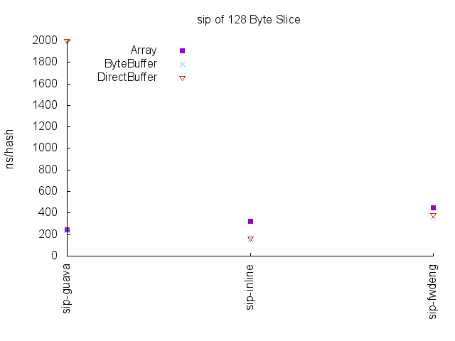

| Algorithm |  Array | ByteBuffer | DirectBuffer |
| --- | ---: | ---: | ---: | 
| [sip-guava](#sip-guava-latency) | 241.708040 | 239.445997 | 1998.744774 |
| [sip-inline](#sip-inline-latency) | 323.234926 | 158.183822 | 163.397172 |
| [sip-fwdeng](#sip-fwdeng-latency) | 447.450040 | 361.333105 | 384.916222 |

---
### 128 Byte Slice Latency (skein1024)

| Algorithm |  Array | ByteBuffer | DirectBuffer |
| --- | ---: | ---: | ---: | 
| [skein1024-bc](#skein1024-bc-latency) | 1083.717816 | 1079.922541 | 1111.128666 |

---
### 128 Byte Slice Latency (skein256)
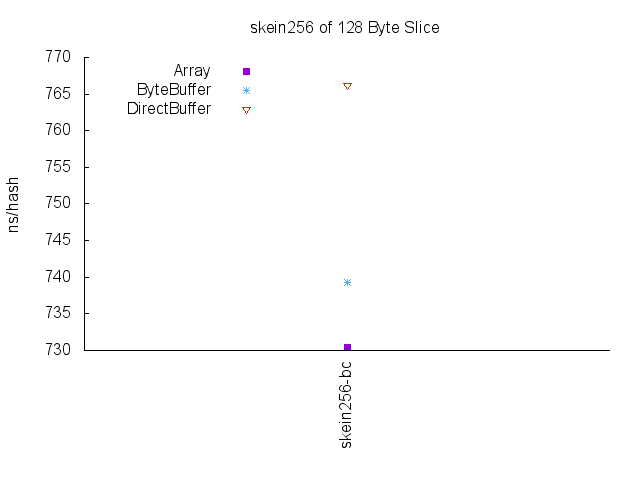

| Algorithm |  Array | ByteBuffer | DirectBuffer |
| --- | ---: | ---: | ---: | 
| [skein256-bc](#skein256-bc-latency) | 730.389076 | 739.350194 | 766.112180 |

---
### 128 Byte Slice Latency (skein512)
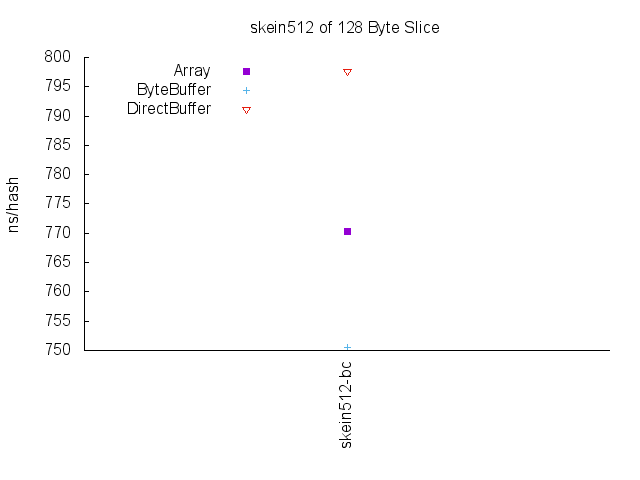

| Algorithm |  Array | ByteBuffer | DirectBuffer |
| --- | ---: | ---: | ---: | 
| [skein512-bc](#skein512-bc-latency) | 770.294673 | 750.512468 | 797.681376 |

---
### 128 Byte Slice Latency (sm3)
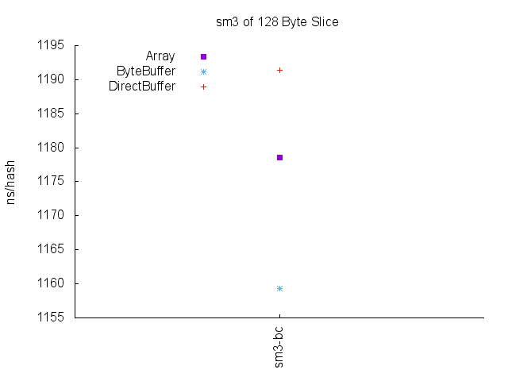

| Algorithm |  Array | ByteBuffer | DirectBuffer |
| --- | ---: | ---: | ---: | 
| [sm3-bc](#sm3-bc-latency) | 1178.571283 | 1159.304866 | 1191.355530 |

---
### 128 Byte Slice Latency (sum16)

| Algorithm |  Array | ByteBuffer | DirectBuffer |
| --- | ---: | ---: | ---: | 
| [sum16-jacksum](#sum16-jacksum-latency) | 41.581240 | 42.436285 | 74.225023 |

---
### 128 Byte Slice Latency (sum24)
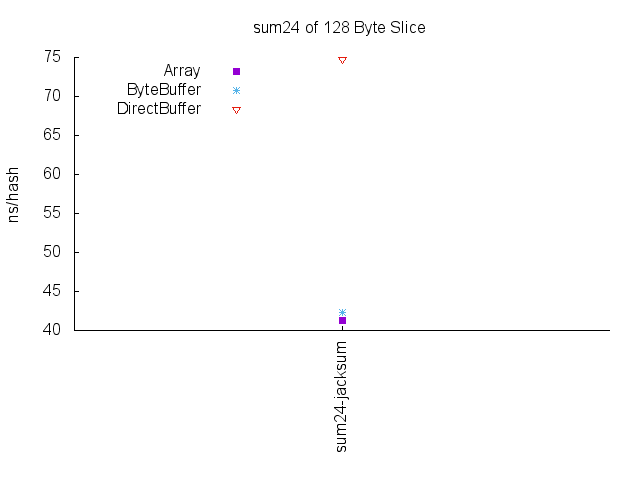

| Algorithm |  Array | ByteBuffer | DirectBuffer |
| --- | ---: | ---: | ---: | 
| [sum24-jacksum](#sum24-jacksum-latency) | 41.282981 | 42.244672 | 74.714459 |

---
### 128 Byte Slice Latency (sum32)
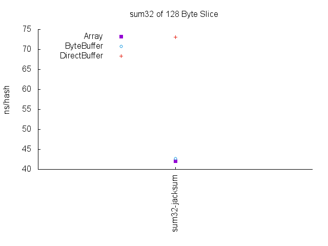

| Algorithm |  Array | ByteBuffer | DirectBuffer |
| --- | ---: | ---: | ---: | 
| [sum32-jacksum](#sum32-jacksum-latency) | 42.030140 | 42.635164 | 73.090384 |

---
### 128 Byte Slice Latency (sum8)
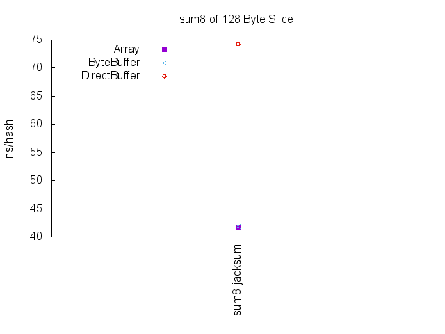

| Algorithm |  Array | ByteBuffer | DirectBuffer |
| --- | ---: | ---: | ---: | 
| [sum8-jacksum](#sum8-jacksum-latency) | 41.618125 | 41.821830 | 74.317820 |

---
### 128 Byte Slice Latency (sumbsd)
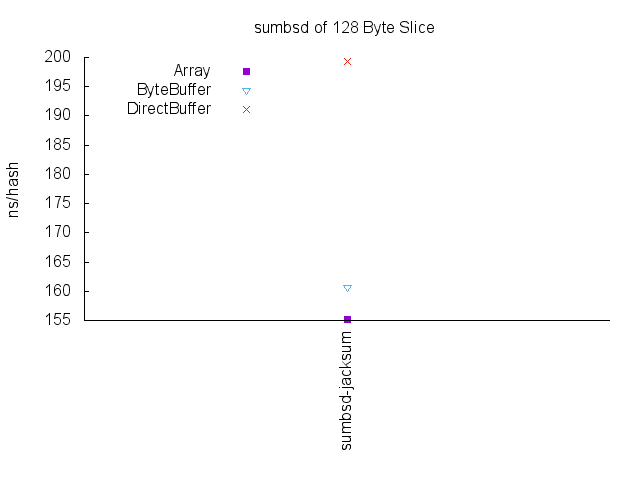

| Algorithm |  Array | ByteBuffer | DirectBuffer |
| --- | ---: | ---: | ---: | 
| [sumbsd-jacksum](#sumbsd-jacksum-latency) | 155.111128 | 160.631312 | 199.303746 |

---
### 128 Byte Slice Latency (sumsysv)

| Algorithm |  Array | ByteBuffer | DirectBuffer |
| --- | ---: | ---: | ---: | 
| [sumsysv-jacksum](#sumsysv-jacksum-latency) | 42.197802 | 43.227517 | 71.416307 |

---
### 128 Byte Slice Latency (tiger)
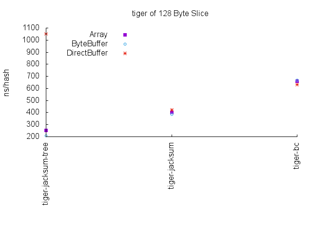

| Algorithm |  Array | ByteBuffer | DirectBuffer |
| --- | ---: | ---: | ---: | 
| [tiger-jacksum-tree](#tiger-jacksum-tree-latency) | 252.653821 | 209.263687 | 1052.546166 |
| [tiger-jacksum](#tiger-jacksum-latency) | 401.796797 | 387.227642 | 420.153623 |
| [tiger-bc](#tiger-bc-latency) | 660.002892 | 666.205873 | 631.077592 |

---
### 128 Byte Slice Latency (tiger128)

| Algorithm |  Array | ByteBuffer | DirectBuffer |
| --- | ---: | ---: | ---: | 
| [tiger128-jacksum](#tiger128-jacksum-latency) | 401.074567 | 393.063321 | 423.059030 |

---
### 128 Byte Slice Latency (tiger160)
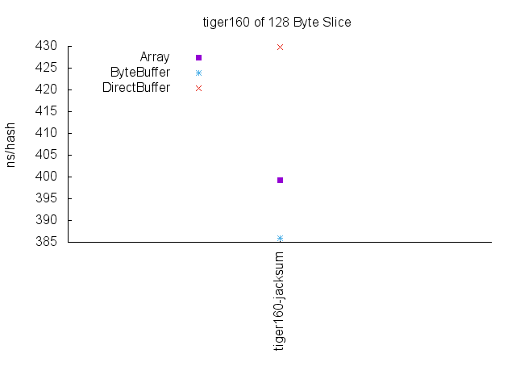

| Algorithm |  Array | ByteBuffer | DirectBuffer |
| --- | ---: | ---: | ---: | 
| [tiger160-jacksum](#tiger160-jacksum-latency) | 399.236201 | 385.854134 | 429.838225 |

---
### 128 Byte Slice Latency (tiger2)
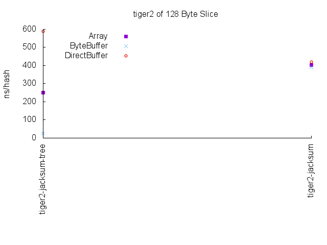

| Algorithm |  Array | ByteBuffer | DirectBuffer |
| --- | ---: | ---: | ---: | 
| [tiger2-jacksum-tree](#tiger2-jacksum-tree-latency) | 251.294784 | 26.103113 | 589.747046 |
| [tiger2-jacksum](#tiger2-jacksum-latency) | 401.691753 | 390.442148 | 420.830864 |

---
### 128 Byte Slice Latency (whirlpool0)
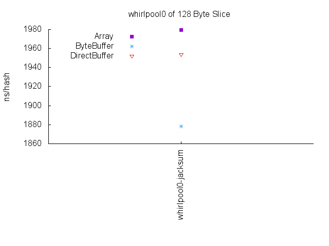

| Algorithm |  Array | ByteBuffer | DirectBuffer |
| --- | ---: | ---: | ---: | 
| [whirlpool0-jacksum](#whirlpool0-jacksum-latency) | 1979.447084 | 1878.216593 | 1953.496923 |

---
### 128 Byte Slice Latency (whirlpool1)
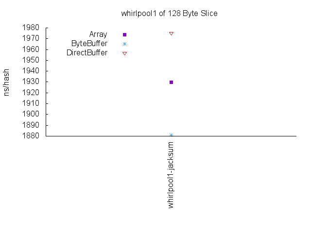

| Algorithm |  Array | ByteBuffer | DirectBuffer |
| --- | ---: | ---: | ---: | 
| [whirlpool1-jacksum](#whirlpool1-jacksum-latency) | 1929.650068 | 1880.684412 | 1974.996367 |

---
### 128 Byte Slice Latency (whirlpool2)
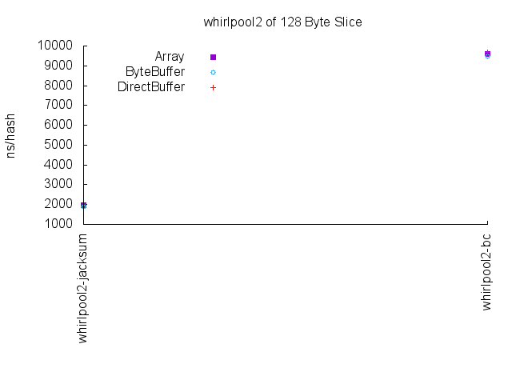

| Algorithm |  Array | ByteBuffer | DirectBuffer |
| --- | ---: | ---: | ---: | 
| [whirlpool2-jacksum](#whirlpool2-jacksum-latency) | 1965.017943 | 1896.056240 | 1945.630753 |
| [whirlpool2-bc](#whirlpool2-bc-latency) | 9613.684622 | 9457.849010 | 9664.107738 |

---
### 128 Byte Slice Latency (xor8)
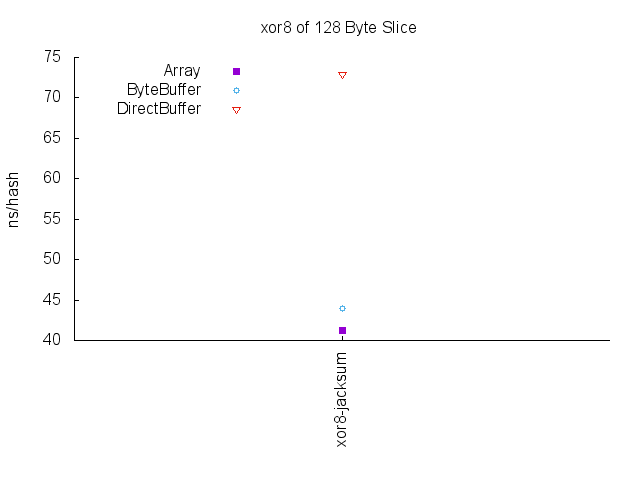

| Algorithm |  Array | ByteBuffer | DirectBuffer |
| --- | ---: | ---: | ---: | 
| [xor8-jacksum](#xor8-jacksum-latency) | 41.298078 | 43.899128 | 72.906913 |

---
### 128 Byte Slice Latency (xxh32)
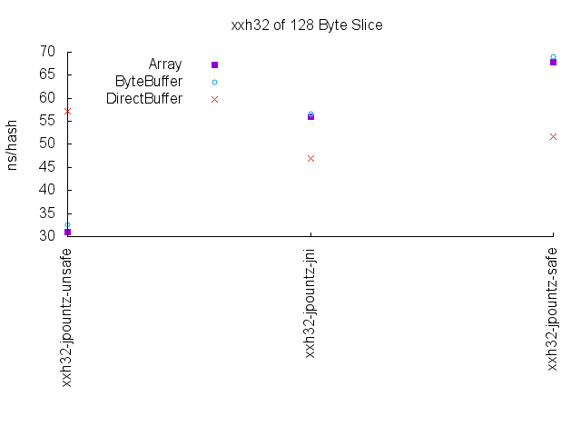

| Algorithm |  Array | ByteBuffer | DirectBuffer |
| --- | ---: | ---: | ---: | 
| [xxh32-jpountz-unsafe](#xxh32-jpountz-unsafe-latency) | 30.949038 | 32.528779 | 57.129863 |
| [xxh32-jpountz-jni](#xxh32-jpountz-jni-latency) | 55.989063 | 56.687078 | 46.869187 |
| [xxh32-jpountz-safe](#xxh32-jpountz-safe-latency) | 67.874825 | 68.989849 | 51.599383 |

---
### 128 Byte Slice Latency (xxh64)
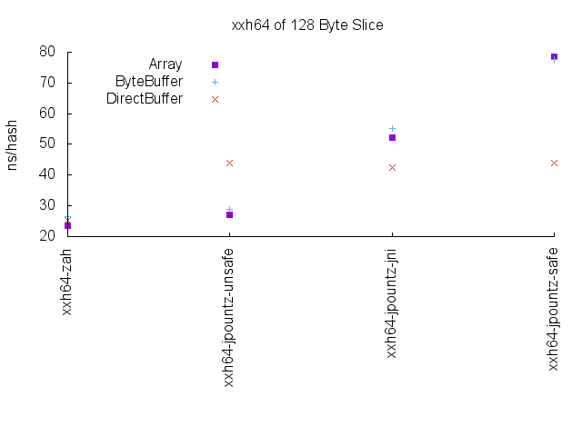

| Algorithm |  Array | ByteBuffer | DirectBuffer |
| --- | ---: | ---: | ---: | 
| [xxh64-zah](#xxh64-zah-latency) | 23.690011 | 26.375724 | 25.238294 |
| [xxh64-jpountz-unsafe](#xxh64-jpountz-unsafe-latency) | 27.055606 | 28.798232 | 43.995919 |
| [xxh64-jpountz-jni](#xxh64-jpountz-jni-latency) | 52.127289 | 55.073827 | 42.530321 |
| [xxh64-jpountz-safe](#xxh64-jpountz-safe-latency) | 78.613048 | 77.530593 | 43.979924 |

---
### 512 Byte Slice Latency (All Hashes)
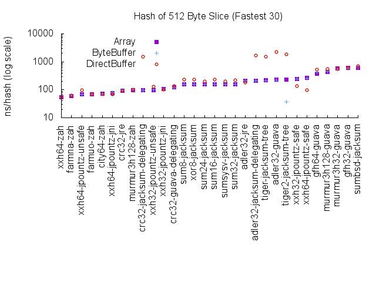

| Algorithm |  Array | ByteBuffer | DirectBuffer |
| --- | ---: | ---: | ---: | 
| [xxh64-zah](#xxh64-zah-latency) | 54.629779 | 55.094186 | 55.519746 |
| [farmna-zah](#farmna-zah-latency) | 59.998095 | 63.420445 | 61.503269 |
| [xxh64-jpountz-unsafe](#xxh64-jpountz-unsafe-latency) | 67.458194 | 69.767219 | 97.808948 |
| [farmuo-zah](#farmuo-zah-latency) | 67.589138 | 70.727797 | 69.492793 |
| [city64-zah](#city64-zah-latency) | 70.985810 | 70.807517 | 68.928564 |
| [xxh64-jpountz-jni](#xxh64-jpountz-jni-latency) | 77.602984 | 78.515226 | 68.634444 |
| [crc32-jre](#crc32-jre-latency) | 93.218980 | 94.831546 | 94.255694 |
| [murmur3h128-zah](#murmur3h128-zah-latency) | 97.096739 | 101.493753 | 102.223179 |
| [crc32-jacksum-delegating](#crc32-jacksum-delegating-latency) | 98.044188 | 97.430464 | 1532.192482 |
| [xxh32-jpountz-unsafe](#xxh32-jpountz-unsafe-latency) | 98.606143 | 99.947098 | 129.547895 |
| [xxh32-jpountz-jni](#xxh32-jpountz-jni-latency) | 109.096713 | 111.765548 | 99.914689 |
| [crc32-guava-delegating](#crc32-guava-delegating-latency) | 123.429061 | 116.612923 | 136.366467 |
| [sum8-jacksum](#sum8-jacksum-latency) | 154.251358 | 155.521600 | 236.652809 |
| [xor8-jacksum](#xor8-jacksum-latency) | 154.755722 | 156.331284 | 236.426363 |
| [sum24-jacksum](#sum24-jacksum-latency) | 155.187838 | 155.426871 | 203.800244 |
| [sum16-jacksum](#sum16-jacksum-latency) | 156.029409 | 155.716747 | 234.246690 |
| [sumsysv-jacksum](#sumsysv-jacksum-latency) | 156.782806 | 156.718080 | 202.763822 |
| [sum32-jacksum](#sum32-jacksum-latency) | 157.004556 | 155.473360 | 219.297383 |
| [adler32-jre](#adler32-jre-latency) | 207.305172 | 208.121217 | 185.615334 |
| [adler32-jacksum-delegating](#adler32-jacksum-delegating-latency) | 209.010522 | 208.963937 | 1711.304946 |
| [tiger-jacksum-tree](#tiger-jacksum-tree-latency) | 223.360626 | 213.754961 | 1537.874968 |
| [adler32-guava](#adler32-guava-latency) | 225.995498 | 218.478381 | 2279.618156 |
| [tiger2-jacksum-tree](#tiger2-jacksum-tree-latency) | 227.500781 | 36.631956 | 1851.041674 |
| [xxh32-jpountz-safe](#xxh32-jpountz-safe-latency) | 244.942845 | 237.603127 | 136.013195 |
| [xxh64-jpountz-safe](#xxh64-jpountz-safe-latency) | 264.049610 | 253.799352 | 97.834886 |
| [gfh64-guava](#gfh64-guava-latency) | 380.894150 | 437.891397 | 522.638481 |
| [murmur3h128-guava](#murmur3h128-guava-latency) | 427.839417 | 446.247126 | 558.514377 |
| [murmur3h32-guava](#murmur3h32-guava-latency) | 589.747590 | 564.348122 | 552.079995 |
| [gfh32-guava](#gfh32-guava-latency) | 601.405544 | 567.588781 | 607.067735 |
| [sumbsd-jacksum](#sumbsd-jacksum-latency) | 621.302821 | 626.543800 | 693.756403 |
| [sip-guava](#sip-guava-latency) | 731.471220 | 754.447242 | 3393.801643 |
| [elf-jacksum](#elf-jacksum-latency) | 895.383623 | 914.138849 | 971.422753 |
| [ed2k-jacksum](#ed2k-jacksum-latency) | 964.419007 | 955.636852 | 1006.765457 |
| [crc8-jacksum](#crc8-jacksum-latency) | 997.315267 | 950.160232 | 1054.810076 |
| [sip-inline](#sip-inline-latency) | 1025.461737 | 591.585574 | 533.114593 |
| [crc16-jacksum](#crc16-jacksum-latency) | 1163.533307 | 1157.797629 | 2553.825632 |
| [crc32-guava-rfc3720](#crc32-guava-rfc3720-latency) | 1203.222020 | 1205.030236 | 1247.006106 |
| [crc32-jacksum-fcs32](#crc32-jacksum-fcs32-latency) | 1206.304329 | 1198.647438 | 1255.779816 |
| [md5-jacksum](#md5-jacksum-latency) | 1252.796097 | 1250.444661 | 1640.805206 |
| [md2-jacksum](#md2-jacksum-latency) | 1254.040995 | 1291.108216 | 2014.595648 |
| [md4-jacksum](#md4-jacksum-latency) | 1255.889433 | 1248.964388 | 1646.161493 |
| [crc64-jacksum](#crc64-jacksum-latency) | 1314.596257 | 1320.676474 | 1443.484609 |
| [fcs16-jacksum](#fcs16-jacksum-latency) | 1336.721129 | 1323.766321 | 1368.428682 |
| [crc32-jacksum-mpeg2](#crc32-jacksum-mpeg2-latency) | 1340.302839 | 1333.871469 | 1355.958080 |
| [cksum-jacksum](#cksum-jacksum-latency) | 1340.705233 | 1343.503336 | 2551.954086 |
| [crc32-jacksum-bzip2](#crc32-jacksum-bzip2-latency) | 1390.937073 | 1732.882749 | 1947.696090 |
| [crc24-jacksum](#crc24-jacksum-latency) | 1394.479034 | 1756.599399 | 2772.674166 |
| [md4-bc](#md4-bc-latency) | 1416.384847 | 1654.625073 | 1508.787665 |
| [md5-jacksum-alt](#md5-jacksum-alt-latency) | 1453.786322 | 1442.897330 | 1901.645178 |
| [tiger-jacksum](#tiger-jacksum-latency) | 1524.627404 | 1507.024007 | 1634.907074 |
| [tiger128-jacksum](#tiger128-jacksum-latency) | 1525.154331 | 1505.503519 | 1555.848562 |
| [tiger2-jacksum](#tiger2-jacksum-latency) | 1526.332830 | 1535.480364 | 1567.420421 |
| [tiger160-jacksum](#tiger160-jacksum-latency) | 1530.725514 | 1505.377729 | 1562.886613 |
| [md5-guava](#md5-guava-latency) | 1532.688211 | 1492.866563 | 1520.924837 |
| [sip-fwdeng](#sip-fwdeng-latency) | 1643.554155 | 1295.277221 | 1405.162681 |
| [md5-bc](#md5-bc-latency) | 1847.143006 | 2122.685950 | 1912.434897 |
| [sha1-jacksum](#sha1-jacksum-latency) | 1871.329962 | 1875.804938 | 1971.183284 |
| [tiger-bc](#tiger-bc-latency) | 1875.697551 | 1894.118669 | 1781.146270 |
| [adler32-jacksum-alt](#adler32-jacksum-alt-latency) | 1967.532425 | 1959.414866 | 3341.009126 |
| [ripemd256-jacksum](#ripemd256-jacksum-latency) | 2018.615907 | 2013.446505 | 2066.309059 |
| [ripemd128-bc](#ripemd128-bc-latency) | 2042.741828 | 2274.828201 | 2099.530536 |
| [sha0-jacksum](#sha0-jacksum-latency) | 2090.838738 | 2093.949420 | 2144.171148 |
| [haval128h3-jacksum](#haval128h3-jacksum-latency) | 2106.118221 | 2102.247033 | 2143.557439 |
| [haval192h3-jacksum](#haval192h3-jacksum-latency) | 2109.766119 | 2094.243565 | 2153.841315 |
| [haval160h3-jacksum](#haval160h3-jacksum-latency) | 2110.985946 | 2099.808161 | 2147.208953 |
| [haval256h3-jacksum](#haval256h3-jacksum-latency) | 2115.890432 | 2089.208302 | 2277.569512 |
| [haval224h3-jacksum](#haval224h3-jacksum-latency) | 2131.248161 | 2114.468106 | 2141.501763 |
| [sha1-jacksum-alt](#sha1-jacksum-alt-latency) | 2132.700651 | 2206.590392 | 2193.471252 |
| [sha384-jacksum-alt](#sha384-jacksum-alt-latency) | 2149.999673 | 2183.916346 | 2228.598832 |
| [sha512-jacksum-alt](#sha512-jacksum-alt-latency) | 2152.855370 | 2152.046038 | 2193.630963 |
| [skein512-bc](#skein512-bc-latency) | 2195.373372 | 2149.939343 | 2170.130685 |
| [ripemd256-bc](#ripemd256-bc-latency) | 2198.670388 | 2236.524517 | 2286.700783 |
| [sha1-guava](#sha1-guava-latency) | 2242.129149 | 2212.883606 | 5723.686508 |
| [ripemd128-jacksum](#ripemd128-jacksum-latency) | 2243.435951 | 2239.659569 | 2293.640938 |
| [sha512-jacksum](#sha512-jacksum-latency) | 2263.976129 | 2263.344029 | 2302.697588 |
| [sha384-jacksum](#sha384-jacksum-latency) | 2266.680403 | 2270.261034 | 2304.574266 |
| [skein256-bc](#skein256-bc-latency) | 2286.716470 | 2291.499266 | 2302.224906 |
| [has160-jacksum](#has160-jacksum-latency) | 2406.226268 | 2436.876956 | 2537.889744 |
| [skein1024-bc](#skein1024-bc-latency) | 2658.083174 | 2619.929003 | 2686.066559 |
| [sha512-bc-t](#sha512-bc-t-latency) | 2684.591484 | 2725.913100 | 2713.978857 |
| [sha1-bc](#sha1-bc-latency) | 2700.636091 | 2658.106391 | 2657.090553 |
| [sha256-jacksum](#sha256-jacksum-latency) | 2712.823934 | 2748.554463 | 2790.004146 |
| [sha512-bc](#sha512-bc-latency) | 2809.399477 | 2731.919662 | 2788.077224 |
| [sha384-bc](#sha384-bc-latency) | 2863.332098 | 2722.397608 | 2755.603499 |
| [haval256h4-jacksum](#haval256h4-jacksum-latency) | 2887.295503 | 2869.443491 | 2926.727333 |
| [haval224h4-jacksum](#haval224h4-jacksum-latency) | 2887.528195 | 2875.188661 | 2970.446428 |
| [haval192h4-jacksum](#haval192h4-jacksum-latency) | 2892.954849 | 2869.869772 | 2935.201559 |
| [haval160h4-jacksum](#haval160h4-jacksum-latency) | 2893.735227 | 2869.711458 | 2924.049120 |
| [haval128h4-jacksum](#haval128h4-jacksum-latency) | 2893.786757 | 2866.583727 | 2968.982851 |
| [sha384-guava](#sha384-guava-latency) | 3022.697749 | 2978.910086 | 8049.379225 |
| [sha512-guava](#sha512-guava-latency) | 3029.333378 | 3004.059287 | 8071.720760 |
| [sha256-jacksum-alt](#sha256-jacksum-alt-latency) | 3203.095822 | 3332.914733 | 3231.540535 |
| [sha224-jacksum](#sha224-jacksum-latency) | 3244.465032 | 3287.001009 | 3208.857929 |
| [sha256-guava](#sha256-guava-latency) | 3302.422995 | 3136.663218 | 6055.447183 |
| [sm3-bc](#sm3-bc-latency) | 3506.669642 | 3470.854563 | 3685.027663 |
| [haval224h5-jacksum](#haval224h5-jacksum-latency) | 3522.891797 | 3498.264821 | 3563.206326 |
| [haval256h5-jacksum](#haval256h5-jacksum-latency) | 3525.931737 | 3509.428129 | 3567.422427 |
| [haval192h5-jacksum](#haval192h5-jacksum-latency) | 3527.984052 | 3505.517051 | 3554.448804 |
| [haval128h5-jacksum](#haval128h5-jacksum-latency) | 3533.021183 | 3498.189732 | 3553.809695 |
| [haval160h5-jacksum](#haval160h5-jacksum-latency) | 3534.118787 | 3510.009798 | 3547.630897 |
| [sha224-bc](#sha224-bc-latency) | 3664.649204 | 3684.907796 | 3761.878683 |
| [sha256-bc](#sha256-bc-latency) | 3675.940874 | 3711.027486 | 3703.457296 |
| [ripemd160-jacksum](#ripemd160-jacksum-latency) | 4395.060651 | 4352.675260 | 4388.252556 |
| [whirlpool0-jacksum](#whirlpool0-jacksum-latency) | 7592.802515 | 7567.420868 | 7464.317433 |
| [whirlpool2-jacksum](#whirlpool2-jacksum-latency) | 7598.991228 | 7494.350823 | 7616.733295 |
| [whirlpool1-jacksum](#whirlpool1-jacksum-latency) | 7649.692656 | 7536.850725 | 7718.138347 |
| [ripemd320-jacksum](#ripemd320-jacksum-latency) | 8737.135007 | 8751.359798 | 8787.948106 |
| [ripemd160-bc](#ripemd160-bc-latency) | 9709.621676 | 9838.104644 | 9677.865979 |
| [ripemd320-bc](#ripemd320-bc-latency) | 9796.596599 | 9789.324772 | 9853.517253 |
| [sha3-bc](#sha3-bc-latency) | 26594.042492 | 25976.829350 | 25947.689827 |
| [whirlpool2-bc](#whirlpool2-bc-latency) | 30525.737752 | 31572.973664 | 30099.601804 |
| [gost-jacksum](#gost-jacksum-latency) | 56430.842527 | 56285.577900 | 56887.327681 |
| [md2-bc](#md2-bc-latency) | 66209.698106 | 65138.910942 | 65830.132457 |
| [gost-bc](#gost-bc-latency) | 71655.240501 | 73652.351295 | 70454.551106 |

---
### 512 Byte Slice Latency (adler32)
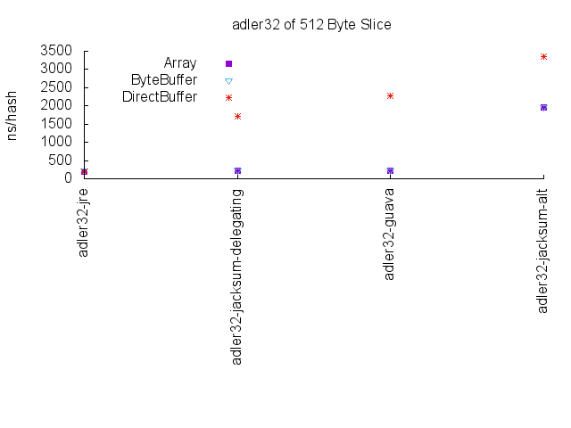

| Algorithm |  Array | ByteBuffer | DirectBuffer |
| --- | ---: | ---: | ---: | 
| [adler32-jre](#adler32-jre-latency) | 207.305172 | 208.121217 | 185.615334 |
| [adler32-jacksum-delegating](#adler32-jacksum-delegating-latency) | 209.010522 | 208.963937 | 1711.304946 |
| [adler32-guava](#adler32-guava-latency) | 225.995498 | 218.478381 | 2279.618156 |
| [adler32-jacksum-alt](#adler32-jacksum-alt-latency) | 1967.532425 | 1959.414866 | 3341.009126 |

---
### 512 Byte Slice Latency (city64)
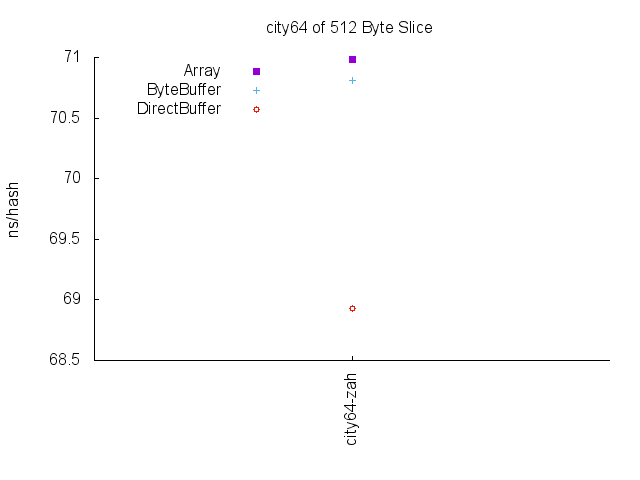

| Algorithm |  Array | ByteBuffer | DirectBuffer |
| --- | ---: | ---: | ---: | 
| [city64-zah](#city64-zah-latency) | 70.985810 | 70.807517 | 68.928564 |

---
### 512 Byte Slice Latency (cksum)
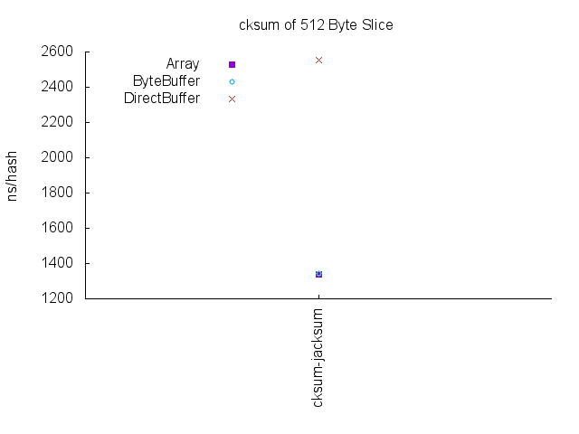

| Algorithm |  Array | ByteBuffer | DirectBuffer |
| --- | ---: | ---: | ---: | 
| [cksum-jacksum](#cksum-jacksum-latency) | 1340.705233 | 1343.503336 | 2551.954086 |

---
### 512 Byte Slice Latency (crc16)
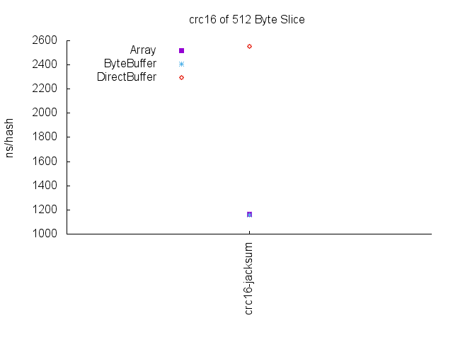

| Algorithm |  Array | ByteBuffer | DirectBuffer |
| --- | ---: | ---: | ---: | 
| [crc16-jacksum](#crc16-jacksum-latency) | 1163.533307 | 1157.797629 | 2553.825632 |

---
### 512 Byte Slice Latency (crc24)
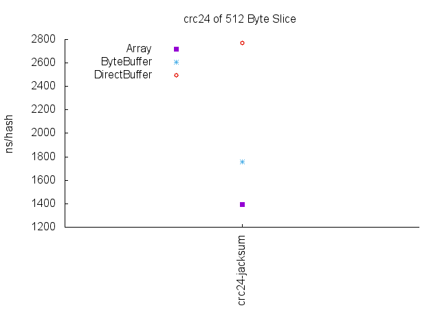

| Algorithm |  Array | ByteBuffer | DirectBuffer |
| --- | ---: | ---: | ---: | 
| [crc24-jacksum](#crc24-jacksum-latency) | 1394.479034 | 1756.599399 | 2772.674166 |

---
### 512 Byte Slice Latency (crc32)
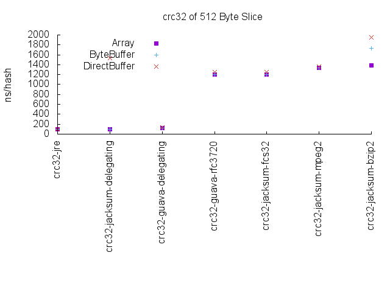

| Algorithm |  Array | ByteBuffer | DirectBuffer |
| --- | ---: | ---: | ---: | 
| [crc32-jre](#crc32-jre-latency) | 93.218980 | 94.831546 | 94.255694 |
| [crc32-jacksum-delegating](#crc32-jacksum-delegating-latency) | 98.044188 | 97.430464 | 1532.192482 |
| [crc32-guava-delegating](#crc32-guava-delegating-latency) | 123.429061 | 116.612923 | 136.366467 |
| [crc32-guava-rfc3720](#crc32-guava-rfc3720-latency) | 1203.222020 | 1205.030236 | 1247.006106 |
| [crc32-jacksum-fcs32](#crc32-jacksum-fcs32-latency) | 1206.304329 | 1198.647438 | 1255.779816 |
| [crc32-jacksum-mpeg2](#crc32-jacksum-mpeg2-latency) | 1340.302839 | 1333.871469 | 1355.958080 |
| [crc32-jacksum-bzip2](#crc32-jacksum-bzip2-latency) | 1390.937073 | 1732.882749 | 1947.696090 |

---
### 512 Byte Slice Latency (crc64)
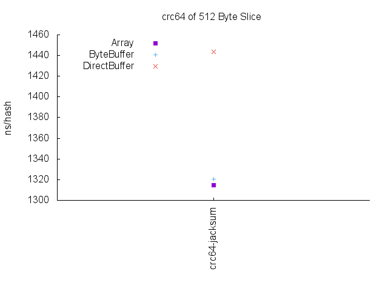

| Algorithm |  Array | ByteBuffer | DirectBuffer |
| --- | ---: | ---: | ---: | 
| [crc64-jacksum](#crc64-jacksum-latency) | 1314.596257 | 1320.676474 | 1443.484609 |

---
### 512 Byte Slice Latency (crc8)
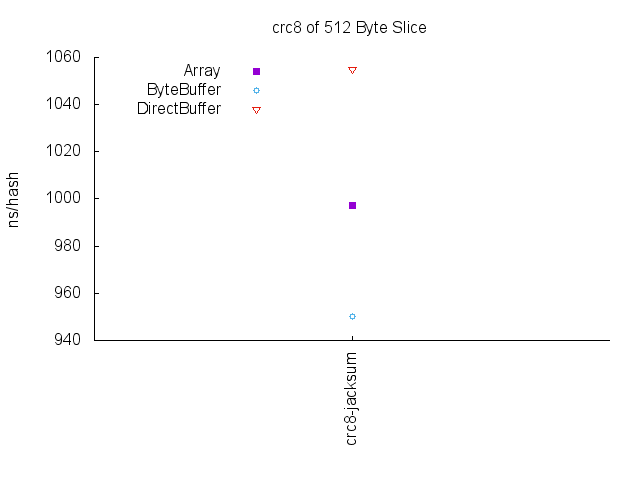

| Algorithm |  Array | ByteBuffer | DirectBuffer |
| --- | ---: | ---: | ---: | 
| [crc8-jacksum](#crc8-jacksum-latency) | 997.315267 | 950.160232 | 1054.810076 |

---
### 512 Byte Slice Latency (ed2k)
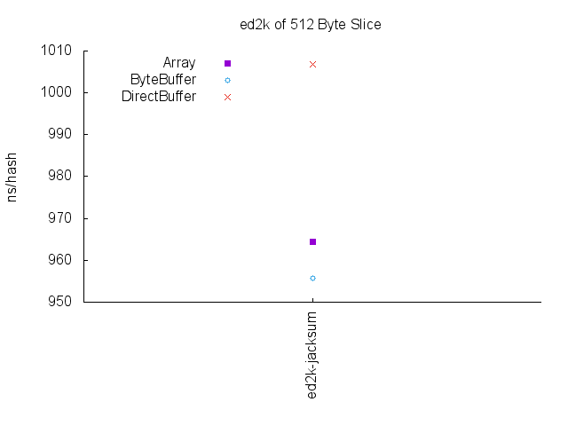

| Algorithm |  Array | ByteBuffer | DirectBuffer |
| --- | ---: | ---: | ---: | 
| [ed2k-jacksum](#ed2k-jacksum-latency) | 964.419007 | 955.636852 | 1006.765457 |

---
### 512 Byte Slice Latency (elf)
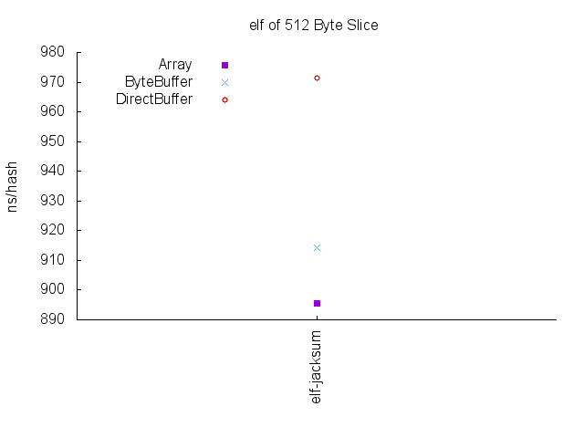

| Algorithm |  Array | ByteBuffer | DirectBuffer |
| --- | ---: | ---: | ---: | 
| [elf-jacksum](#elf-jacksum-latency) | 895.383623 | 914.138849 | 971.422753 |

---
### 512 Byte Slice Latency (farmna)
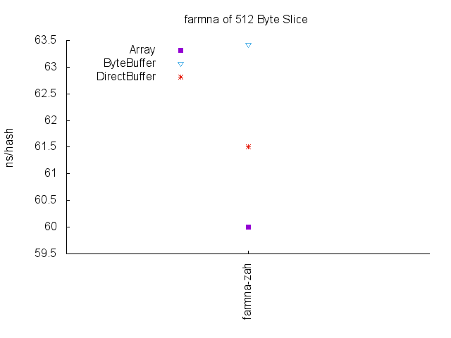

| Algorithm |  Array | ByteBuffer | DirectBuffer |
| --- | ---: | ---: | ---: | 
| [farmna-zah](#farmna-zah-latency) | 59.998095 | 63.420445 | 61.503269 |

---
### 512 Byte Slice Latency (farmuo)
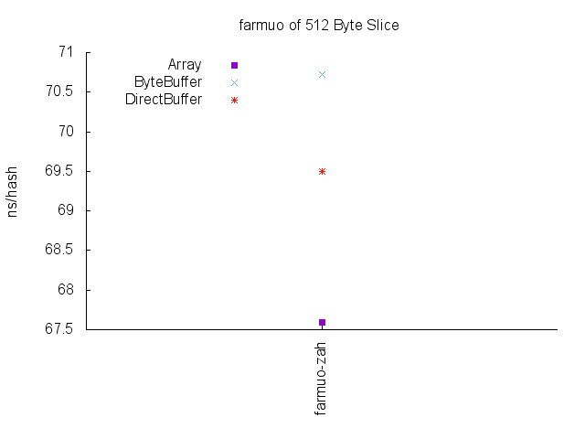

| Algorithm |  Array | ByteBuffer | DirectBuffer |
| --- | ---: | ---: | ---: | 
| [farmuo-zah](#farmuo-zah-latency) | 67.589138 | 70.727797 | 69.492793 |

---
### 512 Byte Slice Latency (fcs16)
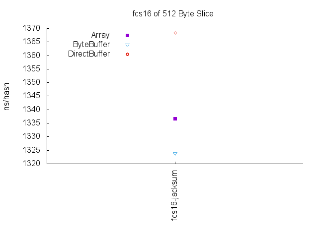

| Algorithm |  Array | ByteBuffer | DirectBuffer |
| --- | ---: | ---: | ---: | 
| [fcs16-jacksum](#fcs16-jacksum-latency) | 1336.721129 | 1323.766321 | 1368.428682 |

---
### 512 Byte Slice Latency (gfh32)
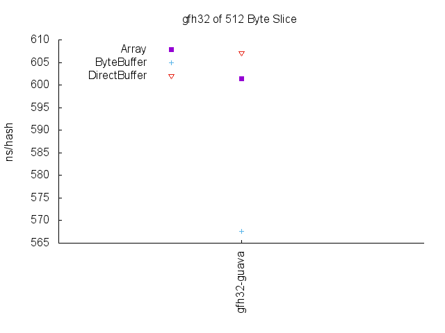

| Algorithm |  Array | ByteBuffer | DirectBuffer |
| --- | ---: | ---: | ---: | 
| [gfh32-guava](#gfh32-guava-latency) | 601.405544 | 567.588781 | 607.067735 |

---
### 512 Byte Slice Latency (gfh64)
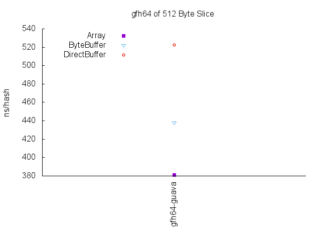

| Algorithm |  Array | ByteBuffer | DirectBuffer |
| --- | ---: | ---: | ---: | 
| [gfh64-guava](#gfh64-guava-latency) | 380.894150 | 437.891397 | 522.638481 |

---
### 512 Byte Slice Latency (gost)
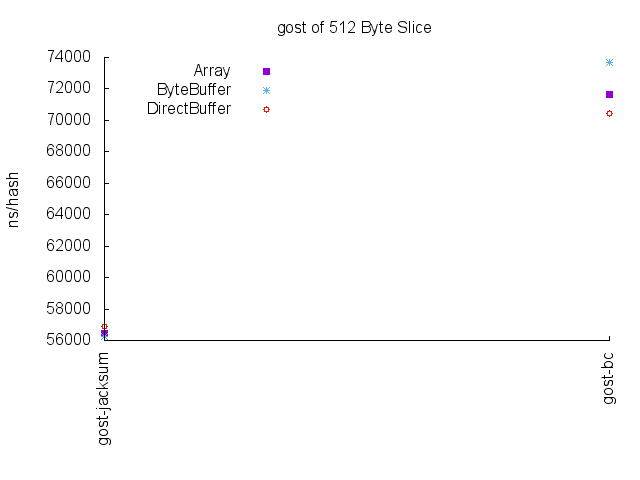

| Algorithm |  Array | ByteBuffer | DirectBuffer |
| --- | ---: | ---: | ---: | 
| [gost-jacksum](#gost-jacksum-latency) | 56430.842527 | 56285.577900 | 56887.327681 |
| [gost-bc](#gost-bc-latency) | 71655.240501 | 73652.351295 | 70454.551106 |

---
### 512 Byte Slice Latency (has160)
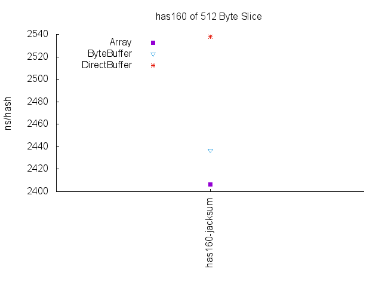

| Algorithm |  Array | ByteBuffer | DirectBuffer |
| --- | ---: | ---: | ---: | 
| [has160-jacksum](#has160-jacksum-latency) | 2406.226268 | 2436.876956 | 2537.889744 |

---
### 512 Byte Slice Latency (haval128h3)
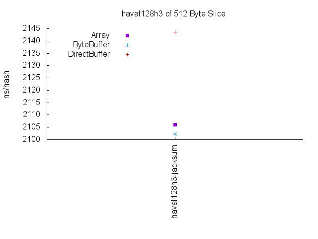

| Algorithm |  Array | ByteBuffer | DirectBuffer |
| --- | ---: | ---: | ---: | 
| [haval128h3-jacksum](#haval128h3-jacksum-latency) | 2106.118221 | 2102.247033 | 2143.557439 |

---
### 512 Byte Slice Latency (haval128h4)

| Algorithm |  Array | ByteBuffer | DirectBuffer |
| --- | ---: | ---: | ---: | 
| [haval128h4-jacksum](#haval128h4-jacksum-latency) | 2893.786757 | 2866.583727 | 2968.982851 |

---
### 512 Byte Slice Latency (haval128h5)
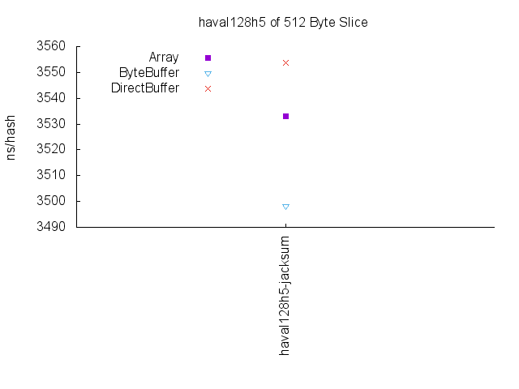

| Algorithm |  Array | ByteBuffer | DirectBuffer |
| --- | ---: | ---: | ---: | 
| [haval128h5-jacksum](#haval128h5-jacksum-latency) | 3533.021183 | 3498.189732 | 3553.809695 |

---
### 512 Byte Slice Latency (haval160h3)
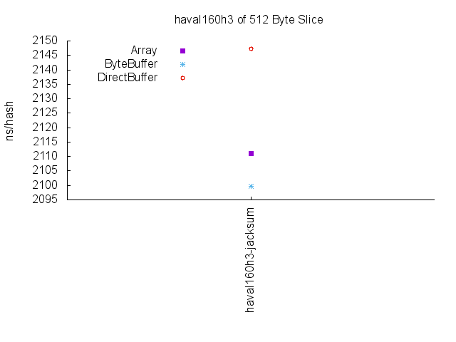

| Algorithm |  Array | ByteBuffer | DirectBuffer |
| --- | ---: | ---: | ---: | 
| [haval160h3-jacksum](#haval160h3-jacksum-latency) | 2110.985946 | 2099.808161 | 2147.208953 |

---
### 512 Byte Slice Latency (haval160h4)
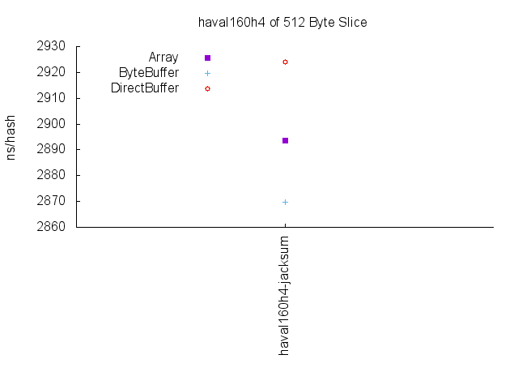

| Algorithm |  Array | ByteBuffer | DirectBuffer |
| --- | ---: | ---: | ---: | 
| [haval160h4-jacksum](#haval160h4-jacksum-latency) | 2893.735227 | 2869.711458 | 2924.049120 |

---
### 512 Byte Slice Latency (haval160h5)
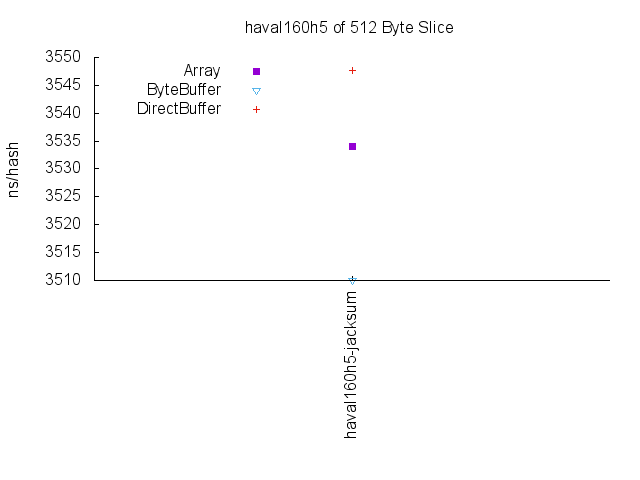

| Algorithm |  Array | ByteBuffer | DirectBuffer |
| --- | ---: | ---: | ---: | 
| [haval160h5-jacksum](#haval160h5-jacksum-latency) | 3534.118787 | 3510.009798 | 3547.630897 |

---
### 512 Byte Slice Latency (haval192h3)
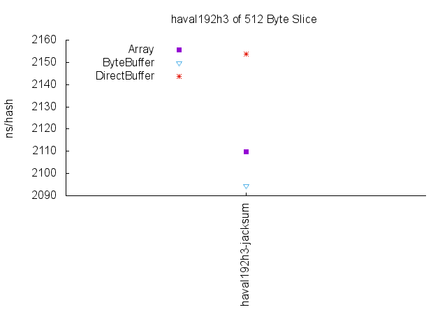

| Algorithm |  Array | ByteBuffer | DirectBuffer |
| --- | ---: | ---: | ---: | 
| [haval192h3-jacksum](#haval192h3-jacksum-latency) | 2109.766119 | 2094.243565 | 2153.841315 |

---
### 512 Byte Slice Latency (haval192h4)
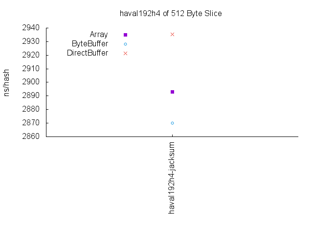

| Algorithm |  Array | ByteBuffer | DirectBuffer |
| --- | ---: | ---: | ---: | 
| [haval192h4-jacksum](#haval192h4-jacksum-latency) | 2892.954849 | 2869.869772 | 2935.201559 |

---
### 512 Byte Slice Latency (haval192h5)
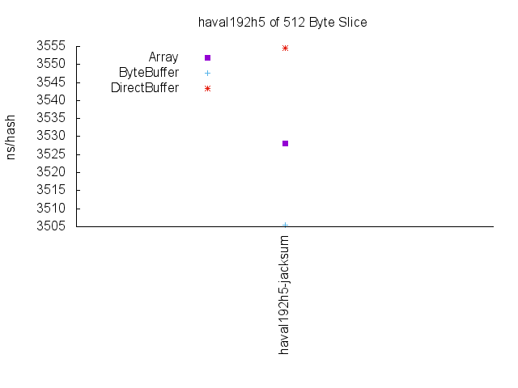

| Algorithm |  Array | ByteBuffer | DirectBuffer |
| --- | ---: | ---: | ---: | 
| [haval192h5-jacksum](#haval192h5-jacksum-latency) | 3527.984052 | 3505.517051 | 3554.448804 |

---
### 512 Byte Slice Latency (haval224h3)
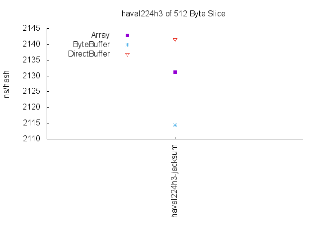

| Algorithm |  Array | ByteBuffer | DirectBuffer |
| --- | ---: | ---: | ---: | 
| [haval224h3-jacksum](#haval224h3-jacksum-latency) | 2131.248161 | 2114.468106 | 2141.501763 |

---
### 512 Byte Slice Latency (haval224h4)
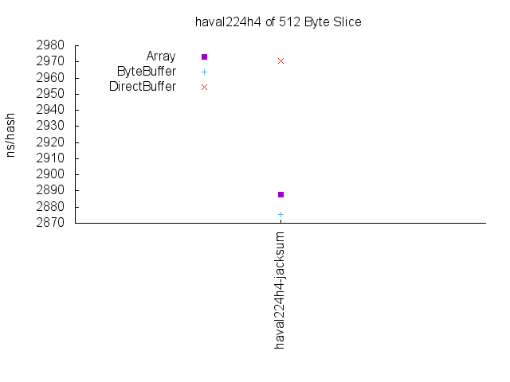

| Algorithm |  Array | ByteBuffer | DirectBuffer |
| --- | ---: | ---: | ---: | 
| [haval224h4-jacksum](#haval224h4-jacksum-latency) | 2887.528195 | 2875.188661 | 2970.446428 |

---
### 512 Byte Slice Latency (haval224h5)
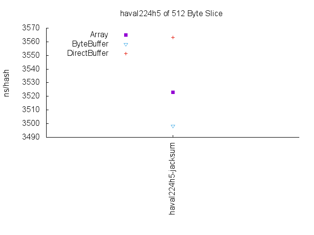

| Algorithm |  Array | ByteBuffer | DirectBuffer |
| --- | ---: | ---: | ---: | 
| [haval224h5-jacksum](#haval224h5-jacksum-latency) | 3522.891797 | 3498.264821 | 3563.206326 |

---
### 512 Byte Slice Latency (haval256h3)
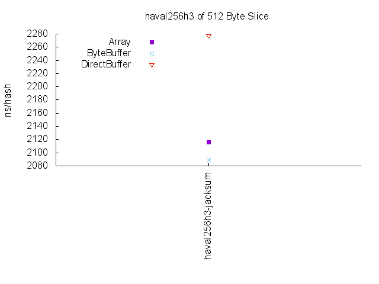

| Algorithm |  Array | ByteBuffer | DirectBuffer |
| --- | ---: | ---: | ---: | 
| [haval256h3-jacksum](#haval256h3-jacksum-latency) | 2115.890432 | 2089.208302 | 2277.569512 |

---
### 512 Byte Slice Latency (haval256h4)
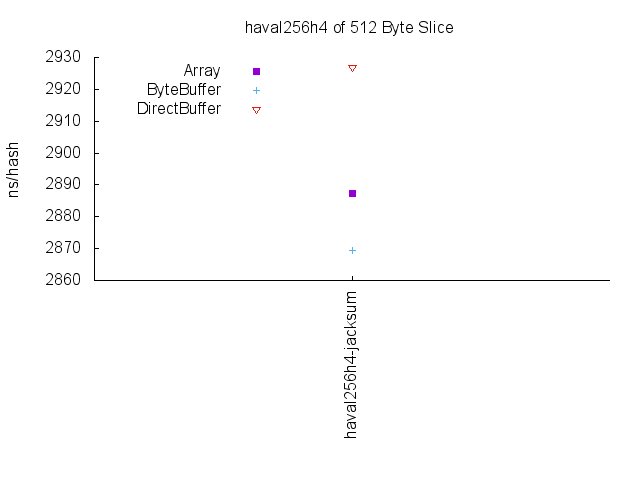

| Algorithm |  Array | ByteBuffer | DirectBuffer |
| --- | ---: | ---: | ---: | 
| [haval256h4-jacksum](#haval256h4-jacksum-latency) | 2887.295503 | 2869.443491 | 2926.727333 |

---
### 512 Byte Slice Latency (haval256h5)
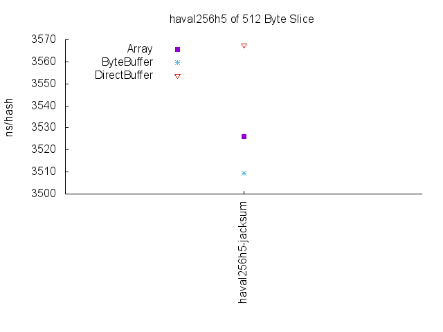

| Algorithm |  Array | ByteBuffer | DirectBuffer |
| --- | ---: | ---: | ---: | 
| [haval256h5-jacksum](#haval256h5-jacksum-latency) | 3525.931737 | 3509.428129 | 3567.422427 |

---
### 512 Byte Slice Latency (md2)
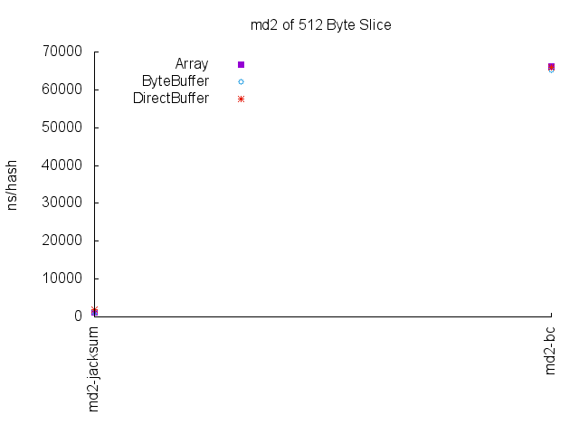

| Algorithm |  Array | ByteBuffer | DirectBuffer |
| --- | ---: | ---: | ---: | 
| [md2-jacksum](#md2-jacksum-latency) | 1254.040995 | 1291.108216 | 2014.595648 |
| [md2-bc](#md2-bc-latency) | 66209.698106 | 65138.910942 | 65830.132457 |

---
### 512 Byte Slice Latency (md4)
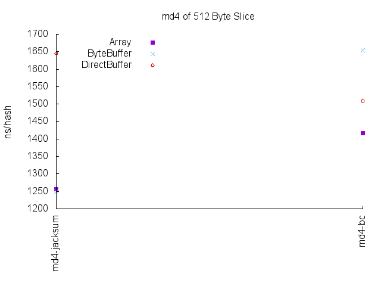

| Algorithm |  Array | ByteBuffer | DirectBuffer |
| --- | ---: | ---: | ---: | 
| [md4-jacksum](#md4-jacksum-latency) | 1255.889433 | 1248.964388 | 1646.161493 |
| [md4-bc](#md4-bc-latency) | 1416.384847 | 1654.625073 | 1508.787665 |

---
### 512 Byte Slice Latency (md5)
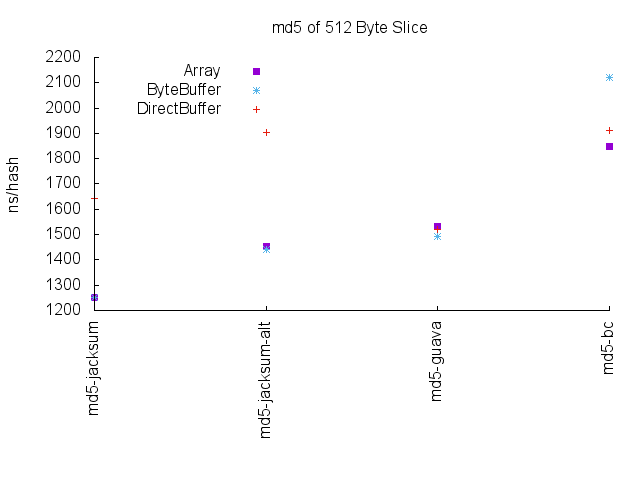

| Algorithm |  Array | ByteBuffer | DirectBuffer |
| --- | ---: | ---: | ---: | 
| [md5-jacksum](#md5-jacksum-latency) | 1252.796097 | 1250.444661 | 1640.805206 |
| [md5-jacksum-alt](#md5-jacksum-alt-latency) | 1453.786322 | 1442.897330 | 1901.645178 |
| [md5-guava](#md5-guava-latency) | 1532.688211 | 1492.866563 | 1520.924837 |
| [md5-bc](#md5-bc-latency) | 1847.143006 | 2122.685950 | 1912.434897 |

---
### 512 Byte Slice Latency (murmur3h128)
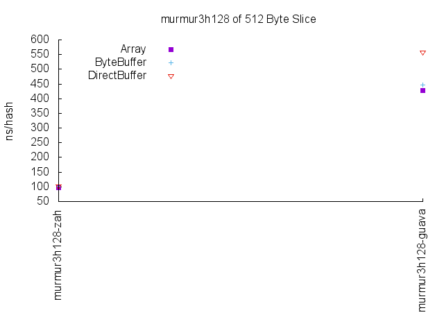

| Algorithm |  Array | ByteBuffer | DirectBuffer |
| --- | ---: | ---: | ---: | 
| [murmur3h128-zah](#murmur3h128-zah-latency) | 97.096739 | 101.493753 | 102.223179 |
| [murmur3h128-guava](#murmur3h128-guava-latency) | 427.839417 | 446.247126 | 558.514377 |

---
### 512 Byte Slice Latency (murmur3h32)
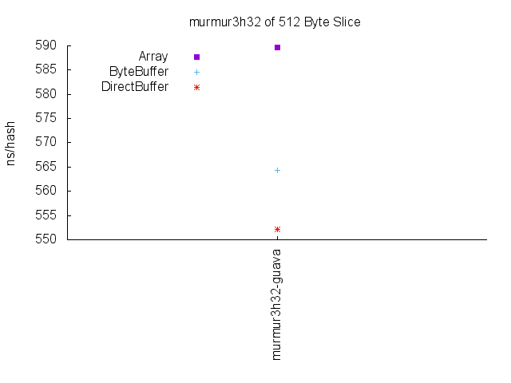

| Algorithm |  Array | ByteBuffer | DirectBuffer |
| --- | ---: | ---: | ---: | 
| [murmur3h32-guava](#murmur3h32-guava-latency) | 589.747590 | 564.348122 | 552.079995 |

---
### 512 Byte Slice Latency (ripemd128)
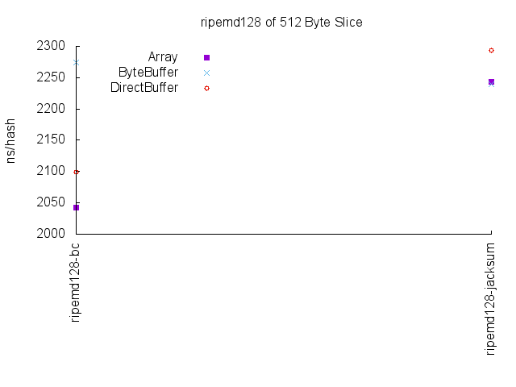

| Algorithm |  Array | ByteBuffer | DirectBuffer |
| --- | ---: | ---: | ---: | 
| [ripemd128-bc](#ripemd128-bc-latency) | 2042.741828 | 2274.828201 | 2099.530536 |
| [ripemd128-jacksum](#ripemd128-jacksum-latency) | 2243.435951 | 2239.659569 | 2293.640938 |

---
### 512 Byte Slice Latency (ripemd160)
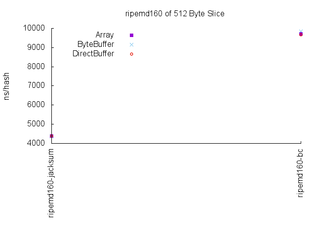

| Algorithm |  Array | ByteBuffer | DirectBuffer |
| --- | ---: | ---: | ---: | 
| [ripemd160-jacksum](#ripemd160-jacksum-latency) | 4395.060651 | 4352.675260 | 4388.252556 |
| [ripemd160-bc](#ripemd160-bc-latency) | 9709.621676 | 9838.104644 | 9677.865979 |

---
### 512 Byte Slice Latency (ripemd256)
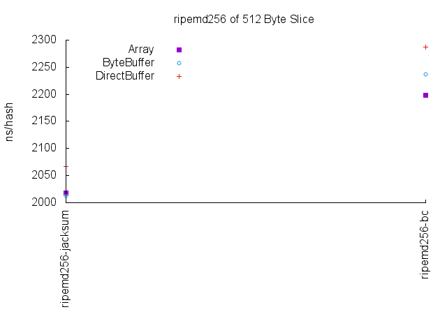

| Algorithm |  Array | ByteBuffer | DirectBuffer |
| --- | ---: | ---: | ---: | 
| [ripemd256-jacksum](#ripemd256-jacksum-latency) | 2018.615907 | 2013.446505 | 2066.309059 |
| [ripemd256-bc](#ripemd256-bc-latency) | 2198.670388 | 2236.524517 | 2286.700783 |

---
### 512 Byte Slice Latency (ripemd320)
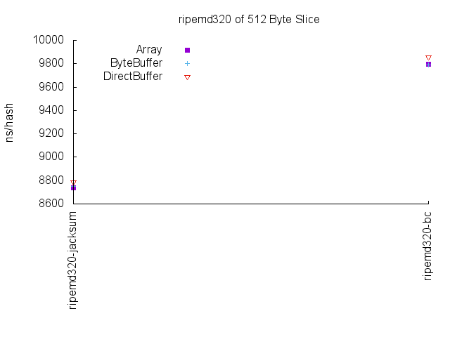

| Algorithm |  Array | ByteBuffer | DirectBuffer |
| --- | ---: | ---: | ---: | 
| [ripemd320-jacksum](#ripemd320-jacksum-latency) | 8737.135007 | 8751.359798 | 8787.948106 |
| [ripemd320-bc](#ripemd320-bc-latency) | 9796.596599 | 9789.324772 | 9853.517253 |

---
### 512 Byte Slice Latency (sha0)
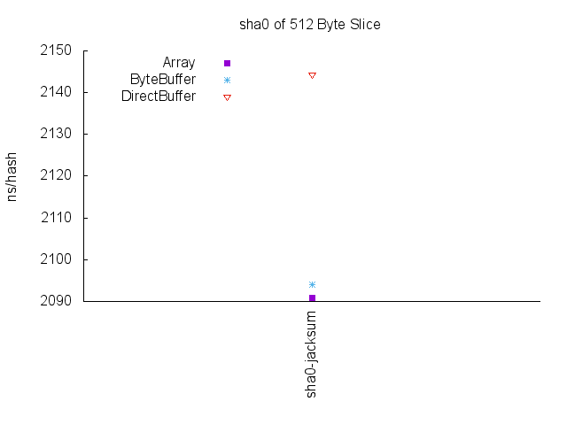

| Algorithm |  Array | ByteBuffer | DirectBuffer |
| --- | ---: | ---: | ---: | 
| [sha0-jacksum](#sha0-jacksum-latency) | 2090.838738 | 2093.949420 | 2144.171148 |

---
### 512 Byte Slice Latency (sha1)
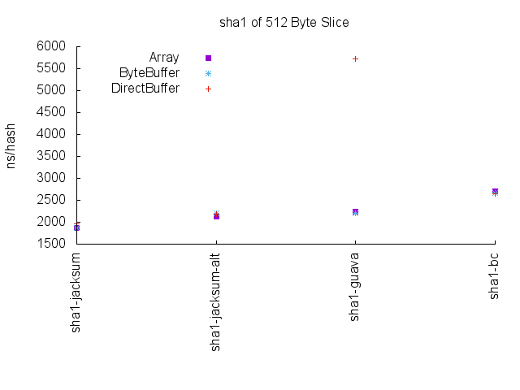

| Algorithm |  Array | ByteBuffer | DirectBuffer |
| --- | ---: | ---: | ---: | 
| [sha1-jacksum](#sha1-jacksum-latency) | 1871.329962 | 1875.804938 | 1971.183284 |
| [sha1-jacksum-alt](#sha1-jacksum-alt-latency) | 2132.700651 | 2206.590392 | 2193.471252 |
| [sha1-guava](#sha1-guava-latency) | 2242.129149 | 2212.883606 | 5723.686508 |
| [sha1-bc](#sha1-bc-latency) | 2700.636091 | 2658.106391 | 2657.090553 |

---
### 512 Byte Slice Latency (sha224)
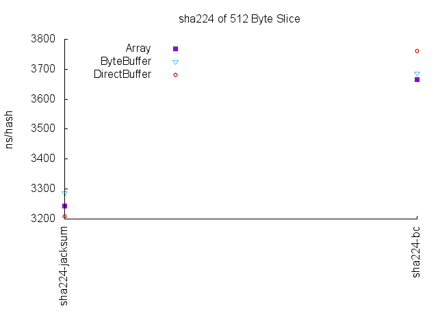

| Algorithm |  Array | ByteBuffer | DirectBuffer |
| --- | ---: | ---: | ---: | 
| [sha224-jacksum](#sha224-jacksum-latency) | 3244.465032 | 3287.001009 | 3208.857929 |
| [sha224-bc](#sha224-bc-latency) | 3664.649204 | 3684.907796 | 3761.878683 |

---
### 512 Byte Slice Latency (sha256)
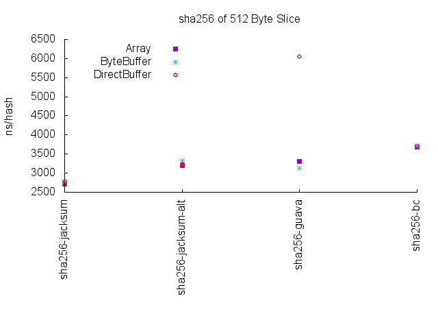

| Algorithm |  Array | ByteBuffer | DirectBuffer |
| --- | ---: | ---: | ---: | 
| [sha256-jacksum](#sha256-jacksum-latency) | 2712.823934 | 2748.554463 | 2790.004146 |
| [sha256-jacksum-alt](#sha256-jacksum-alt-latency) | 3203.095822 | 3332.914733 | 3231.540535 |
| [sha256-guava](#sha256-guava-latency) | 3302.422995 | 3136.663218 | 6055.447183 |
| [sha256-bc](#sha256-bc-latency) | 3675.940874 | 3711.027486 | 3703.457296 |

---
### 512 Byte Slice Latency (sha3)
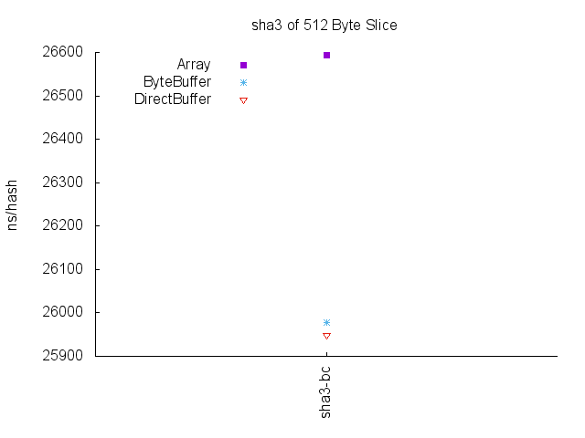

| Algorithm |  Array | ByteBuffer | DirectBuffer |
| --- | ---: | ---: | ---: | 
| [sha3-bc](#sha3-bc-latency) | 26594.042492 | 25976.829350 | 25947.689827 |

---
### 512 Byte Slice Latency (sha384)
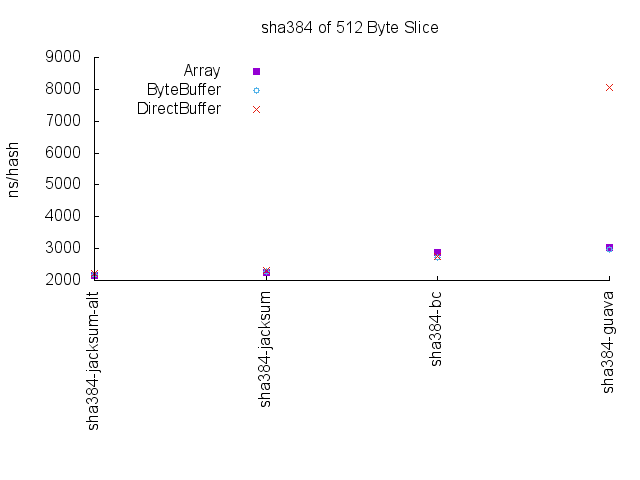

| Algorithm |  Array | ByteBuffer | DirectBuffer |
| --- | ---: | ---: | ---: | 
| [sha384-jacksum-alt](#sha384-jacksum-alt-latency) | 2149.999673 | 2183.916346 | 2228.598832 |
| [sha384-jacksum](#sha384-jacksum-latency) | 2266.680403 | 2270.261034 | 2304.574266 |
| [sha384-bc](#sha384-bc-latency) | 2863.332098 | 2722.397608 | 2755.603499 |
| [sha384-guava](#sha384-guava-latency) | 3022.697749 | 2978.910086 | 8049.379225 |

---
### 512 Byte Slice Latency (sha512)
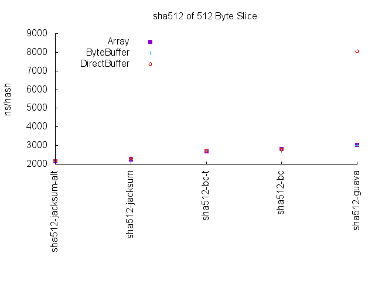

| Algorithm |  Array | ByteBuffer | DirectBuffer |
| --- | ---: | ---: | ---: | 
| [sha512-jacksum-alt](#sha512-jacksum-alt-latency) | 2152.855370 | 2152.046038 | 2193.630963 |
| [sha512-jacksum](#sha512-jacksum-latency) | 2263.976129 | 2263.344029 | 2302.697588 |
| [sha512-bc-t](#sha512-bc-t-latency) | 2684.591484 | 2725.913100 | 2713.978857 |
| [sha512-bc](#sha512-bc-latency) | 2809.399477 | 2731.919662 | 2788.077224 |
| [sha512-guava](#sha512-guava-latency) | 3029.333378 | 3004.059287 | 8071.720760 |

---
### 512 Byte Slice Latency (sip)
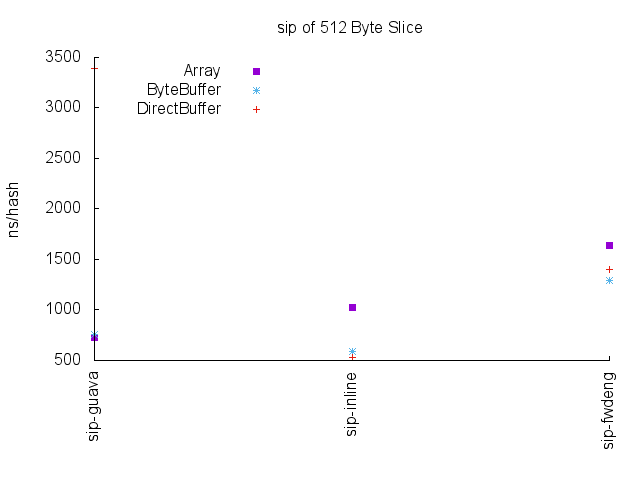

| Algorithm |  Array | ByteBuffer | DirectBuffer |
| --- | ---: | ---: | ---: | 
| [sip-guava](#sip-guava-latency) | 731.471220 | 754.447242 | 3393.801643 |
| [sip-inline](#sip-inline-latency) | 1025.461737 | 591.585574 | 533.114593 |
| [sip-fwdeng](#sip-fwdeng-latency) | 1643.554155 | 1295.277221 | 1405.162681 |

---
### 512 Byte Slice Latency (skein1024)
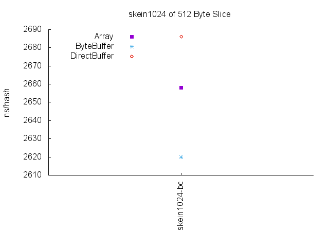

| Algorithm |  Array | ByteBuffer | DirectBuffer |
| --- | ---: | ---: | ---: | 
| [skein1024-bc](#skein1024-bc-latency) | 2658.083174 | 2619.929003 | 2686.066559 |

---
### 512 Byte Slice Latency (skein256)
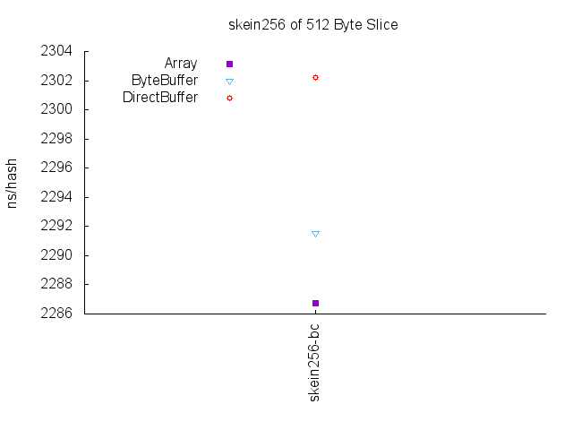

| Algorithm |  Array | ByteBuffer | DirectBuffer |
| --- | ---: | ---: | ---: | 
| [skein256-bc](#skein256-bc-latency) | 2286.716470 | 2291.499266 | 2302.224906 |

---
### 512 Byte Slice Latency (skein512)
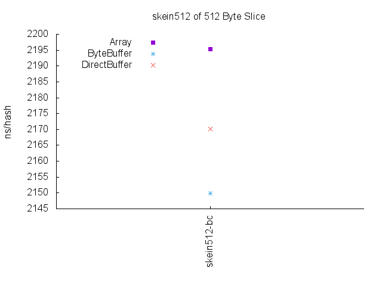

| Algorithm |  Array | ByteBuffer | DirectBuffer |
| --- | ---: | ---: | ---: | 
| [skein512-bc](#skein512-bc-latency) | 2195.373372 | 2149.939343 | 2170.130685 |

---
### 512 Byte Slice Latency (sm3)
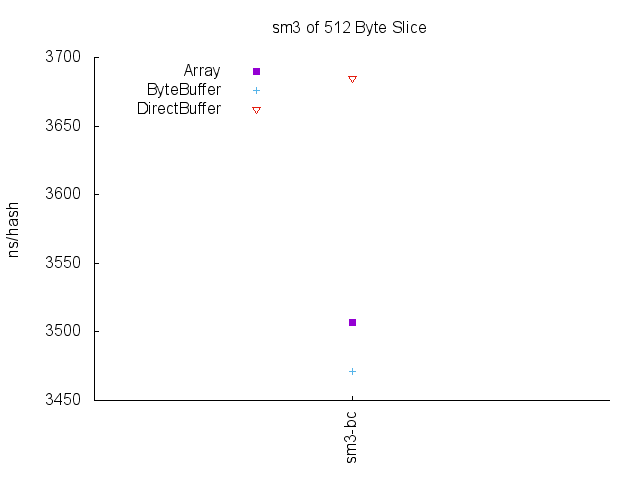

| Algorithm |  Array | ByteBuffer | DirectBuffer |
| --- | ---: | ---: | ---: | 
| [sm3-bc](#sm3-bc-latency) | 3506.669642 | 3470.854563 | 3685.027663 |

---
### 512 Byte Slice Latency (sum16)

| Algorithm |  Array | ByteBuffer | DirectBuffer |
| --- | ---: | ---: | ---: | 
| [sum16-jacksum](#sum16-jacksum-latency) | 156.029409 | 155.716747 | 234.246690 |

---
### 512 Byte Slice Latency (sum24)
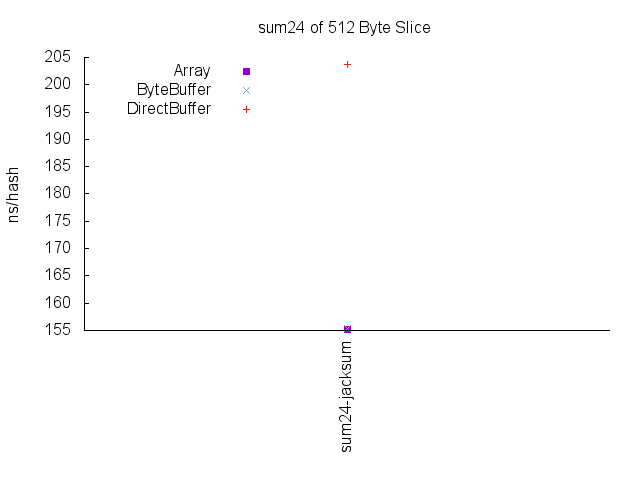

| Algorithm |  Array | ByteBuffer | DirectBuffer |
| --- | ---: | ---: | ---: | 
| [sum24-jacksum](#sum24-jacksum-latency) | 155.187838 | 155.426871 | 203.800244 |

---
### 512 Byte Slice Latency (sum32)

| Algorithm |  Array | ByteBuffer | DirectBuffer |
| --- | ---: | ---: | ---: | 
| [sum32-jacksum](#sum32-jacksum-latency) | 157.004556 | 155.473360 | 219.297383 |

---
### 512 Byte Slice Latency (sum8)
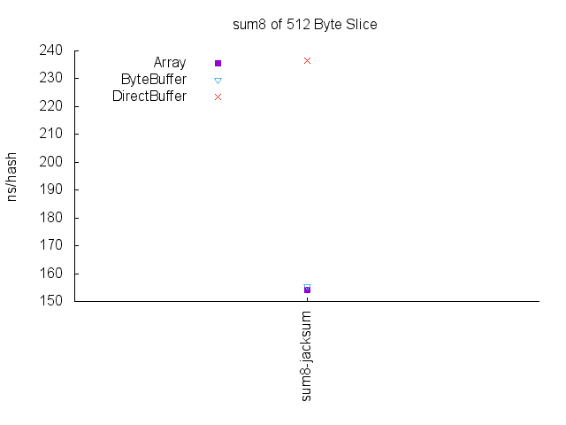

| Algorithm |  Array | ByteBuffer | DirectBuffer |
| --- | ---: | ---: | ---: | 
| [sum8-jacksum](#sum8-jacksum-latency) | 154.251358 | 155.521600 | 236.652809 |

---
### 512 Byte Slice Latency (sumbsd)

| Algorithm |  Array | ByteBuffer | DirectBuffer |
| --- | ---: | ---: | ---: | 
| [sumbsd-jacksum](#sumbsd-jacksum-latency) | 621.302821 | 626.543800 | 693.756403 |

---
### 512 Byte Slice Latency (sumsysv)
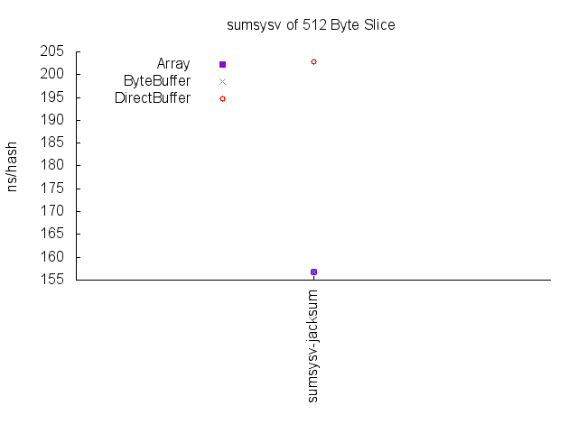

| Algorithm |  Array | ByteBuffer | DirectBuffer |
| --- | ---: | ---: | ---: | 
| [sumsysv-jacksum](#sumsysv-jacksum-latency) | 156.782806 | 156.718080 | 202.763822 |

---
### 512 Byte Slice Latency (tiger)
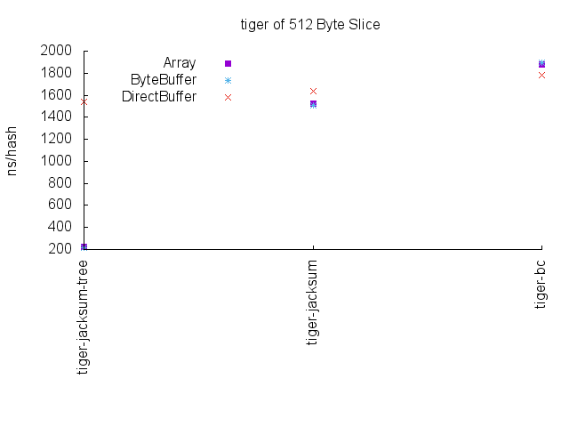

| Algorithm |  Array | ByteBuffer | DirectBuffer |
| --- | ---: | ---: | ---: | 
| [tiger-jacksum-tree](#tiger-jacksum-tree-latency) | 223.360626 | 213.754961 | 1537.874968 |
| [tiger-jacksum](#tiger-jacksum-latency) | 1524.627404 | 1507.024007 | 1634.907074 |
| [tiger-bc](#tiger-bc-latency) | 1875.697551 | 1894.118669 | 1781.146270 |

---
### 512 Byte Slice Latency (tiger128)
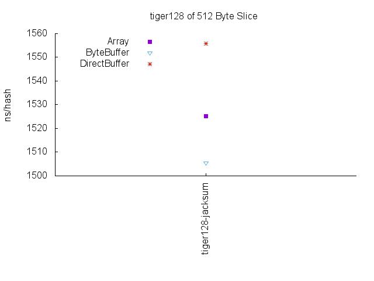

| Algorithm |  Array | ByteBuffer | DirectBuffer |
| --- | ---: | ---: | ---: | 
| [tiger128-jacksum](#tiger128-jacksum-latency) | 1525.154331 | 1505.503519 | 1555.848562 |

---
### 512 Byte Slice Latency (tiger160)
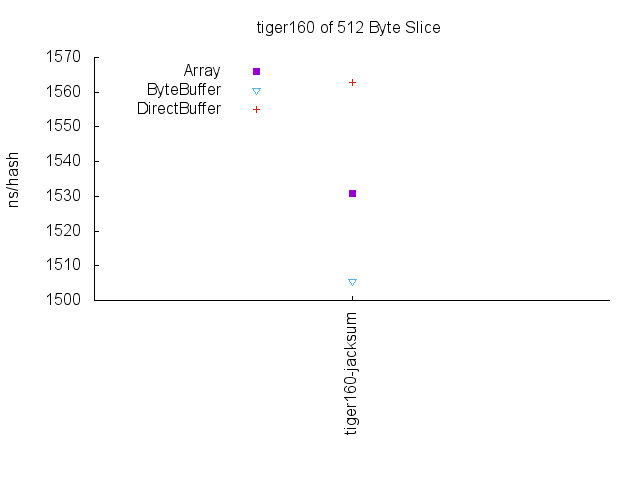

| Algorithm |  Array | ByteBuffer | DirectBuffer |
| --- | ---: | ---: | ---: | 
| [tiger160-jacksum](#tiger160-jacksum-latency) | 1530.725514 | 1505.377729 | 1562.886613 |

---
### 512 Byte Slice Latency (tiger2)
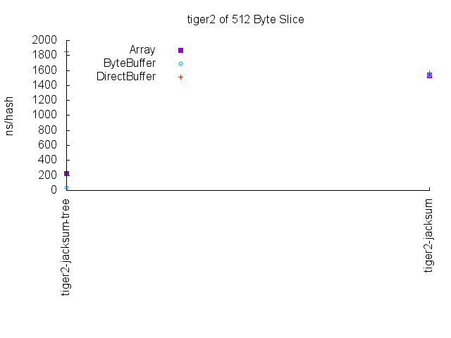

| Algorithm |  Array | ByteBuffer | DirectBuffer |
| --- | ---: | ---: | ---: | 
| [tiger2-jacksum-tree](#tiger2-jacksum-tree-latency) | 227.500781 | 36.631956 | 1851.041674 |
| [tiger2-jacksum](#tiger2-jacksum-latency) | 1526.332830 | 1535.480364 | 1567.420421 |

---
### 512 Byte Slice Latency (whirlpool0)
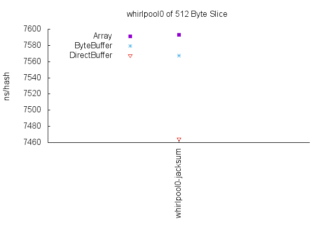

| Algorithm |  Array | ByteBuffer | DirectBuffer |
| --- | ---: | ---: | ---: | 
| [whirlpool0-jacksum](#whirlpool0-jacksum-latency) | 7592.802515 | 7567.420868 | 7464.317433 |

---
### 512 Byte Slice Latency (whirlpool1)
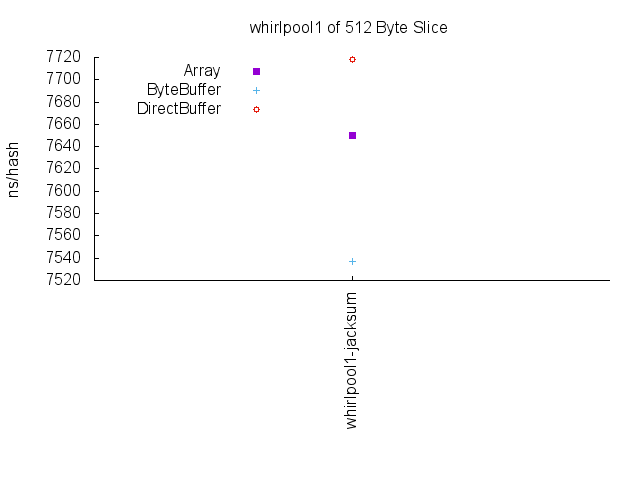

| Algorithm |  Array | ByteBuffer | DirectBuffer |
| --- | ---: | ---: | ---: | 
| [whirlpool1-jacksum](#whirlpool1-jacksum-latency) | 7649.692656 | 7536.850725 | 7718.138347 |

---
### 512 Byte Slice Latency (whirlpool2)
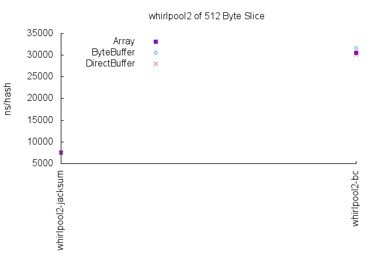

| Algorithm |  Array | ByteBuffer | DirectBuffer |
| --- | ---: | ---: | ---: | 
| [whirlpool2-jacksum](#whirlpool2-jacksum-latency) | 7598.991228 | 7494.350823 | 7616.733295 |
| [whirlpool2-bc](#whirlpool2-bc-latency) | 30525.737752 | 31572.973664 | 30099.601804 |

---
### 512 Byte Slice Latency (xor8)

| Algorithm |  Array | ByteBuffer | DirectBuffer |
| --- | ---: | ---: | ---: | 
| [xor8-jacksum](#xor8-jacksum-latency) | 154.755722 | 156.331284 | 236.426363 |

---
### 512 Byte Slice Latency (xxh32)
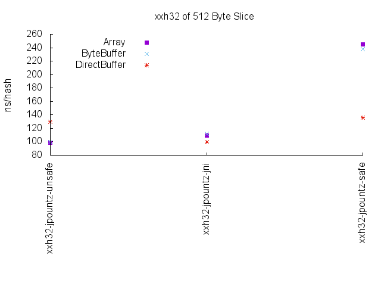

| Algorithm |  Array | ByteBuffer | DirectBuffer |
| --- | ---: | ---: | ---: | 
| [xxh32-jpountz-unsafe](#xxh32-jpountz-unsafe-latency) | 98.606143 | 99.947098 | 129.547895 |
| [xxh32-jpountz-jni](#xxh32-jpountz-jni-latency) | 109.096713 | 111.765548 | 99.914689 |
| [xxh32-jpountz-safe](#xxh32-jpountz-safe-latency) | 244.942845 | 237.603127 | 136.013195 |

---
### 512 Byte Slice Latency (xxh64)
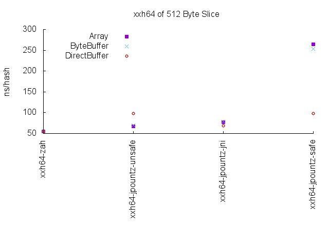

| Algorithm |  Array | ByteBuffer | DirectBuffer |
| --- | ---: | ---: | ---: | 
| [xxh64-zah](#xxh64-zah-latency) | 54.629779 | 55.094186 | 55.519746 |
| [xxh64-jpountz-unsafe](#xxh64-jpountz-unsafe-latency) | 67.458194 | 69.767219 | 97.808948 |
| [xxh64-jpountz-jni](#xxh64-jpountz-jni-latency) | 77.602984 | 78.515226 | 68.634444 |
| [xxh64-jpountz-safe](#xxh64-jpountz-safe-latency) | 264.049610 | 253.799352 | 97.834886 |

---
### 2048 Byte Slice Latency (All Hashes)
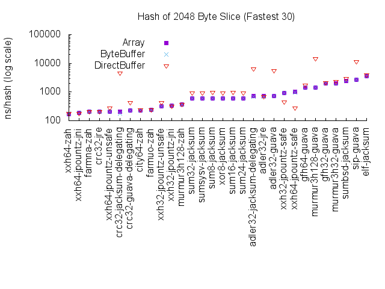

| Algorithm |  Array | ByteBuffer | DirectBuffer |
| --- | ---: | ---: | ---: | 
| [xxh64-zah](#xxh64-zah-latency) | 172.055998 | 176.232818 | 176.820485 |
| [xxh64-jpountz-jni](#xxh64-jpountz-jni-latency) | 189.549048 | 188.886747 | 181.772016 |
| [farmna-zah](#farmna-zah-latency) | 202.962415 | 204.674326 | 211.190804 |
| [crc32-jre](#crc32-jre-latency) | 203.882470 | 204.062684 | 210.319111 |
| [xxh64-jpountz-unsafe](#xxh64-jpountz-unsafe-latency) | 207.825593 | 208.989461 | 271.898290 |
| [crc32-jacksum-delegating](#crc32-jacksum-delegating-latency) | 208.255569 | 182.503202 | 4454.384415 |
| [crc32-guava-delegating](#crc32-guava-delegating-latency) | 224.061148 | 223.863154 | 427.499695 |
| [city64-zah](#city64-zah-latency) | 225.881740 | 225.155285 | 234.189595 |
| [farmuo-zah](#farmuo-zah-latency) | 240.180324 | 241.451866 | 238.591073 |
| [xxh32-jpountz-unsafe](#xxh32-jpountz-unsafe-latency) | 324.142837 | 319.003411 | 435.225347 |
| [xxh32-jpountz-jni](#xxh32-jpountz-jni-latency) | 328.397121 | 334.885479 | 318.968539 |
| [murmur3h128-zah](#murmur3h128-zah-latency) | 367.706141 | 365.997714 | 368.604194 |
| [sum32-jacksum](#sum32-jacksum-latency) | 587.196615 | 586.764100 | 915.945037 |
| [sumsysv-jacksum](#sumsysv-jacksum-latency) | 588.862214 | 590.683831 | 918.929610 |
| [sum8-jacksum](#sum8-jacksum-latency) | 588.924288 | 588.647618 | 965.545839 |
| [xor8-jacksum](#xor8-jacksum-latency) | 589.312160 | 591.167596 | 922.233789 |
| [sum16-jacksum](#sum16-jacksum-latency) | 589.476227 | 589.779083 | 947.955800 |
| [sum24-jacksum](#sum24-jacksum-latency) | 590.383196 | 589.116813 | 927.698598 |
| [adler32-jacksum-delegating](#adler32-jacksum-delegating-latency) | 709.686456 | 703.067799 | 6502.013009 |
| [adler32-jre](#adler32-jre-latency) | 714.119134 | 701.798857 | 674.698281 |
| [adler32-guava](#adler32-guava-latency) | 718.231986 | 714.796751 | 5456.291379 |
| [xxh32-jpountz-safe](#xxh32-jpountz-safe-latency) | 918.358412 | 914.470552 | 437.129712 |
| [xxh64-jpountz-safe](#xxh64-jpountz-safe-latency) | 1005.299319 | 960.853530 | 271.485806 |
| [gfh64-guava](#gfh64-guava-latency) | 1393.473271 | 1439.668644 | 1713.642503 |
| [murmur3h128-guava](#murmur3h128-guava-latency) | 1427.976991 | 1417.445725 | 14372.651476 |
| [gfh32-guava](#gfh32-guava-latency) | 2003.891274 | 1978.765061 | 2126.708852 |
| [murmur3h32-guava](#murmur3h32-guava-latency) | 2023.051909 | 1981.050138 | 2344.605194 |
| [sumbsd-jacksum](#sumbsd-jacksum-latency) | 2447.968462 | 2538.449185 | 2925.747170 |
| [sip-guava](#sip-guava-latency) | 2718.855981 | 2609.253296 | 11207.355422 |
| [elf-jacksum](#elf-jacksum-latency) | 3598.015453 | 3632.059735 | 3883.640406 |
| [ed2k-jacksum](#ed2k-jacksum-latency) | 3762.532695 | 3738.755207 | 4001.208169 |
| [sip-inline](#sip-inline-latency) | 3994.403195 | 2195.285042 | 2198.796854 |
| [crc8-jacksum](#crc8-jacksum-latency) | 3995.091144 | 3831.410976 | 4274.176596 |
| [crc16-jacksum](#crc16-jacksum-latency) | 4670.168612 | 4635.178797 | 9697.891878 |
| [crc32-guava-rfc3720](#crc32-guava-rfc3720-latency) | 4760.770701 | 4778.884064 | 5076.438888 |
| [crc32-jacksum-fcs32](#crc32-jacksum-fcs32-latency) | 4822.947212 | 4825.431773 | 5096.730322 |
| [md4-jacksum](#md4-jacksum-latency) | 4981.750445 | 4969.614684 | 6408.299735 |
| [md2-jacksum](#md2-jacksum-latency) | 4989.343807 | 4966.589168 | 6467.057135 |
| [md5-jacksum](#md5-jacksum-latency) | 4991.234542 | 4975.504037 | 6481.806463 |
| [md4-bc](#md4-bc-latency) | 5167.590680 | 6139.287219 | 5747.026743 |
| [crc64-jacksum](#crc64-jacksum-latency) | 5249.825467 | 5210.841131 | 5461.479119 |
| [md5-guava](#md5-guava-latency) | 5255.849210 | 5268.738322 | 5646.984575 |
| [fcs16-jacksum](#fcs16-jacksum-latency) | 5339.851389 | 5313.401031 | 5651.102579 |
| [cksum-jacksum](#cksum-jacksum-latency) | 5354.749022 | 5418.506759 | 10337.649203 |
| [crc32-jacksum-mpeg2](#crc32-jacksum-mpeg2-latency) | 5368.738296 | 5387.872287 | 5507.407631 |
| [crc24-jacksum](#crc24-jacksum-latency) | 5720.126292 | 5877.734273 | 11210.046952 |
| [crc32-jacksum-bzip2](#crc32-jacksum-bzip2-latency) | 5731.753587 | 5848.502736 | 7629.973788 |
| [md5-jacksum-alt](#md5-jacksum-alt-latency) | 5837.193147 | 5835.880582 | 7729.499495 |
| [tiger128-jacksum](#tiger128-jacksum-latency) | 6007.815842 | 5987.508289 | 6396.463148 |
| [tiger-jacksum](#tiger-jacksum-latency) | 6019.128108 | 5986.589100 | 6438.913033 |
| [tiger160-jacksum](#tiger160-jacksum-latency) | 6020.432378 | 5993.060304 | 6321.274810 |
| [tiger2-jacksum](#tiger2-jacksum-latency) | 6096.190129 | 6092.440538 | 6672.636726 |
| [sip-fwdeng](#sip-fwdeng-latency) | 6436.855673 | 5388.673122 | 5292.043763 |
| [md5-bc](#md5-bc-latency) | 6742.862220 | 7717.962018 | 7234.402039 |
| [tiger-bc](#tiger-bc-latency) | 6776.667262 | 6843.541936 | 6605.325239 |
| [tiger-jacksum-tree](#tiger-jacksum-tree-latency) | 6844.681845 | 7407.192971 | 6937.521521 |
| [tiger2-jacksum-tree](#tiger2-jacksum-tree-latency) | 6886.396725 | 6763.945267 | 6839.519636 |
| [sha1-jacksum](#sha1-jacksum-latency) | 7444.359399 | 7451.583603 | 7755.542925 |
| [skein512-bc](#skein512-bc-latency) | 7671.345034 | 7610.869367 | 7838.418087 |
| [ripemd128-bc](#ripemd128-bc-latency) | 7683.635032 | 8114.394856 | 8303.523446 |
| [sha1-guava](#sha1-guava-latency) | 7776.209913 | 7766.867481 | 9214.980454 |
| [adler32-jacksum-alt](#adler32-jacksum-alt-latency) | 7849.805499 | 7813.295048 | 13186.707200 |
| [ripemd256-jacksum](#ripemd256-jacksum-latency) | 7949.335306 | 8263.364691 | 9182.036293 |
| [ripemd256-bc](#ripemd256-bc-latency) | 8039.635725 | 8134.677113 | 9267.115835 |
| [haval128h3-jacksum](#haval128h3-jacksum-latency) | 8353.471062 | 8284.486195 | 8650.630436 |
| [haval160h3-jacksum](#haval160h3-jacksum-latency) | 8367.567783 | 8263.844029 | 8523.003433 |
| [haval256h3-jacksum](#haval256h3-jacksum-latency) | 8381.081273 | 8340.474364 | 8654.764297 |
| [sha0-jacksum](#sha0-jacksum-latency) | 8389.627121 | 8219.960594 | 8618.508820 |
| [haval224h3-jacksum](#haval224h3-jacksum-latency) | 8418.636743 | 8357.469434 | 8521.802952 |
| [sha1-jacksum-alt](#sha1-jacksum-alt-latency) | 8419.325169 | 8447.954952 | 8598.868601 |
| [haval192h3-jacksum](#haval192h3-jacksum-latency) | 8445.743274 | 8287.932992 | 8777.889791 |
| [skein256-bc](#skein256-bc-latency) | 8529.776268 | 8466.452291 | 8781.269741 |
| [sha512-jacksum-alt](#sha512-jacksum-alt-latency) | 8634.042768 | 8666.247679 | 9077.954259 |
| [sha384-jacksum-alt](#sha384-jacksum-alt-latency) | 8659.011303 | 8608.801423 | 8878.553040 |
| [skein1024-bc](#skein1024-bc-latency) | 8741.995601 | 8603.570164 | 8676.742117 |
| [ripemd128-jacksum](#ripemd128-jacksum-latency) | 8773.413952 | 8739.777830 | 9488.838558 |
| [sha384-jacksum](#sha384-jacksum-latency) | 8976.511988 | 9000.305676 | 9161.576414 |
| [sha512-jacksum](#sha512-jacksum-latency) | 8978.554703 | 9101.461765 | 9459.975145 |
| [sha512-bc-t](#sha512-bc-t-latency) | 9095.807326 | 9281.898003 | 9234.516860 |
| [sha512-bc](#sha512-bc-latency) | 9496.240998 | 9237.672329 | 9506.857424 |
| [sha384-bc](#sha384-bc-latency) | 9580.229415 | 9236.867221 | 9248.190965 |
| [has160-jacksum](#has160-jacksum-latency) | 9586.192604 | 9507.808665 | 9761.914165 |
| [sha512-guava](#sha512-guava-latency) | 9797.058188 | 9886.249913 | 18405.928390 |
| [sha384-guava](#sha384-guava-latency) | 9822.337422 | 9748.163263 | 13865.976098 |
| [sha1-bc](#sha1-bc-latency) | 9855.529805 | 9655.945323 | 9913.311690 |
| [sha256-jacksum](#sha256-jacksum-latency) | 10744.850284 | 10908.891071 | 10940.023947 |
| [sha256-guava](#sha256-guava-latency) | 11255.901563 | 11358.502917 | 12240.301520 |
| [haval256h4-jacksum](#haval256h4-jacksum-latency) | 11447.527296 | 11414.692084 | 11814.544236 |
| [haval224h4-jacksum](#haval224h4-jacksum-latency) | 11450.163479 | 11371.579957 | 11702.213471 |
| [haval128h4-jacksum](#haval128h4-jacksum-latency) | 11458.302781 | 11415.203419 | 11920.117614 |
| [haval160h4-jacksum](#haval160h4-jacksum-latency) | 11464.278611 | 11571.412680 | 12008.700107 |
| [haval192h4-jacksum](#haval192h4-jacksum-latency) | 11601.626898 | 11392.384451 | 11831.929967 |
| [sha256-jacksum-alt](#sha256-jacksum-alt-latency) | 12604.058573 | 13028.859595 | 12818.384076 |
| [sha224-jacksum](#sha224-jacksum-latency) | 12692.825250 | 13218.688354 | 13266.948407 |
| [sm3-bc](#sm3-bc-latency) | 12839.919175 | 12679.720744 | 12915.349678 |
| [sha256-bc](#sha256-bc-latency) | 13434.379711 | 13534.194402 | 13750.458634 |
| [sha224-bc](#sha224-bc-latency) | 13734.870020 | 13480.155908 | 13586.619867 |
| [haval256h5-jacksum](#haval256h5-jacksum-latency) | 13980.489427 | 13941.435966 | 14334.705650 |
| [haval160h5-jacksum](#haval160h5-jacksum-latency) | 13986.549072 | 13981.083259 | 14126.167519 |
| [haval224h5-jacksum](#haval224h5-jacksum-latency) | 14012.545285 | 13956.097571 | 14621.416641 |
| [haval128h5-jacksum](#haval128h5-jacksum-latency) | 14060.450728 | 13991.558367 | 14150.391134 |
| [haval192h5-jacksum](#haval192h5-jacksum-latency) | 14179.349506 | 13961.039738 | 14357.492306 |
| [ripemd160-jacksum](#ripemd160-jacksum-latency) | 17683.373691 | 17315.461136 | 17688.642740 |
| [whirlpool0-jacksum](#whirlpool0-jacksum-latency) | 29716.585187 | 30086.007752 | 29177.853084 |
| [whirlpool2-jacksum](#whirlpool2-jacksum-latency) | 31028.194292 | 29478.367264 | 29210.031728 |
| [whirlpool1-jacksum](#whirlpool1-jacksum-latency) | 31163.949904 | 30993.655750 | 29855.311707 |
| [ripemd320-jacksum](#ripemd320-jacksum-latency) | 34870.476018 | 35426.963446 | 35188.558187 |
| [ripemd160-bc](#ripemd160-bc-latency) | 36131.086867 | 36131.917934 | 36120.641224 |
| [ripemd320-bc](#ripemd320-bc-latency) | 36136.320232 | 35945.306400 | 36675.128937 |
| [sha3-bc](#sha3-bc-latency) | 89839.782063 | 91657.831744 | 87896.480844 |
| [whirlpool2-bc](#whirlpool2-bc-latency) | 115962.396326 | 119437.238101 | 112728.543432 |
| [gost-jacksum](#gost-jacksum-latency) | 248235.608486 | 223434.592748 | 243323.425555 |
| [md2-bc](#md2-bc-latency) | 252117.095043 | 250597.129230 | 246043.548826 |
| [gost-bc](#gost-bc-latency) | 262591.814401 | 259010.532124 | 266954.998310 |

---
### 2048 Byte Slice Latency (adler32)

| Algorithm |  Array | ByteBuffer | DirectBuffer |
| --- | ---: | ---: | ---: | 
| [adler32-jacksum-delegating](#adler32-jacksum-delegating-latency) | 709.686456 | 703.067799 | 6502.013009 |
| [adler32-jre](#adler32-jre-latency) | 714.119134 | 701.798857 | 674.698281 |
| [adler32-guava](#adler32-guava-latency) | 718.231986 | 714.796751 | 5456.291379 |
| [adler32-jacksum-alt](#adler32-jacksum-alt-latency) | 7849.805499 | 7813.295048 | 13186.707200 |

---
### 2048 Byte Slice Latency (city64)
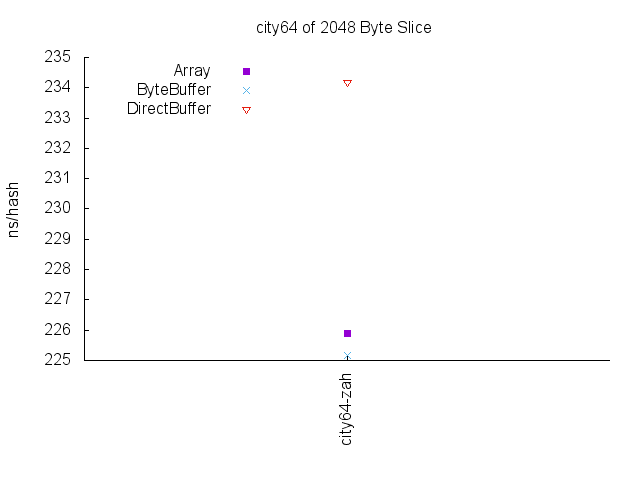

| Algorithm |  Array | ByteBuffer | DirectBuffer |
| --- | ---: | ---: | ---: | 
| [city64-zah](#city64-zah-latency) | 225.881740 | 225.155285 | 234.189595 |

---
### 2048 Byte Slice Latency (cksum)

| Algorithm |  Array | ByteBuffer | DirectBuffer |
| --- | ---: | ---: | ---: | 
| [cksum-jacksum](#cksum-jacksum-latency) | 5354.749022 | 5418.506759 | 10337.649203 |

---
### 2048 Byte Slice Latency (crc16)

| Algorithm |  Array | ByteBuffer | DirectBuffer |
| --- | ---: | ---: | ---: | 
| [crc16-jacksum](#crc16-jacksum-latency) | 4670.168612 | 4635.178797 | 9697.891878 |

---
### 2048 Byte Slice Latency (crc24)
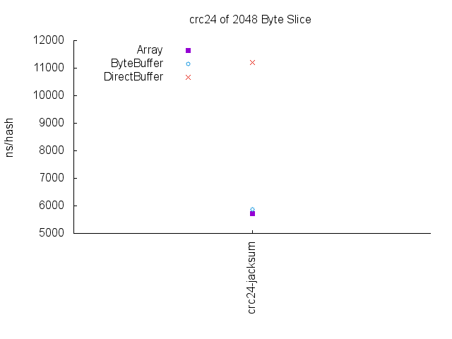

| Algorithm |  Array | ByteBuffer | DirectBuffer |
| --- | ---: | ---: | ---: | 
| [crc24-jacksum](#crc24-jacksum-latency) | 5720.126292 | 5877.734273 | 11210.046952 |

---
### 2048 Byte Slice Latency (crc32)
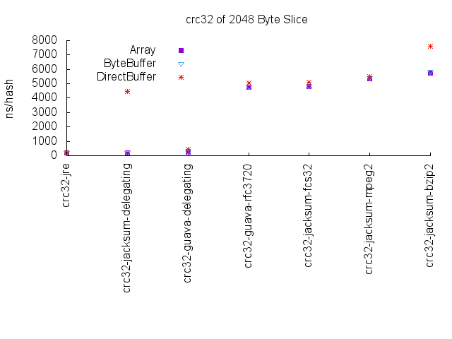

| Algorithm |  Array | ByteBuffer | DirectBuffer |
| --- | ---: | ---: | ---: | 
| [crc32-jre](#crc32-jre-latency) | 203.882470 | 204.062684 | 210.319111 |
| [crc32-jacksum-delegating](#crc32-jacksum-delegating-latency) | 208.255569 | 182.503202 | 4454.384415 |
| [crc32-guava-delegating](#crc32-guava-delegating-latency) | 224.061148 | 223.863154 | 427.499695 |
| [crc32-guava-rfc3720](#crc32-guava-rfc3720-latency) | 4760.770701 | 4778.884064 | 5076.438888 |
| [crc32-jacksum-fcs32](#crc32-jacksum-fcs32-latency) | 4822.947212 | 4825.431773 | 5096.730322 |
| [crc32-jacksum-mpeg2](#crc32-jacksum-mpeg2-latency) | 5368.738296 | 5387.872287 | 5507.407631 |
| [crc32-jacksum-bzip2](#crc32-jacksum-bzip2-latency) | 5731.753587 | 5848.502736 | 7629.973788 |

---
### 2048 Byte Slice Latency (crc64)
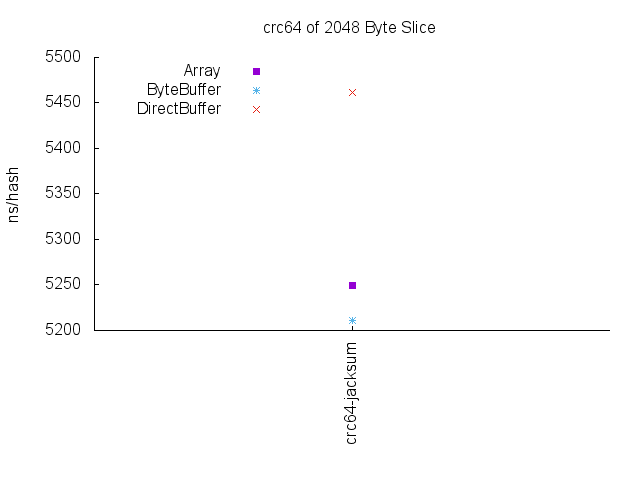

| Algorithm |  Array | ByteBuffer | DirectBuffer |
| --- | ---: | ---: | ---: | 
| [crc64-jacksum](#crc64-jacksum-latency) | 5249.825467 | 5210.841131 | 5461.479119 |

---
### 2048 Byte Slice Latency (crc8)
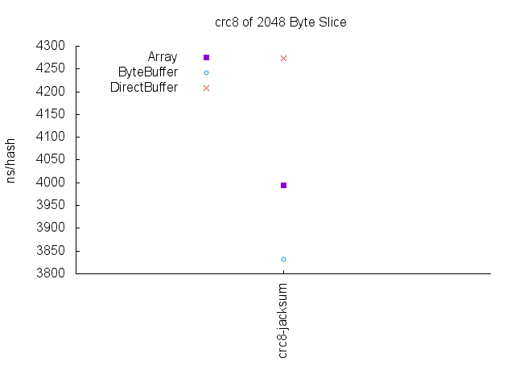

| Algorithm |  Array | ByteBuffer | DirectBuffer |
| --- | ---: | ---: | ---: | 
| [crc8-jacksum](#crc8-jacksum-latency) | 3995.091144 | 3831.410976 | 4274.176596 |

---
### 2048 Byte Slice Latency (ed2k)
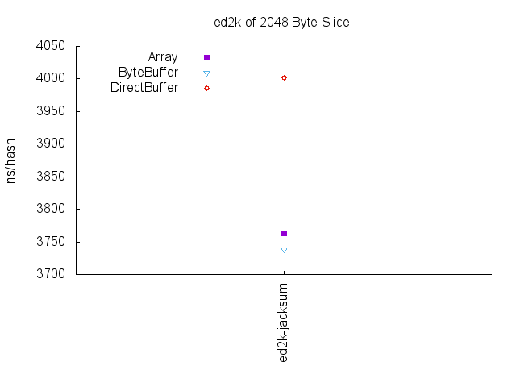

| Algorithm |  Array | ByteBuffer | DirectBuffer |
| --- | ---: | ---: | ---: | 
| [ed2k-jacksum](#ed2k-jacksum-latency) | 3762.532695 | 3738.755207 | 4001.208169 |

---
### 2048 Byte Slice Latency (elf)
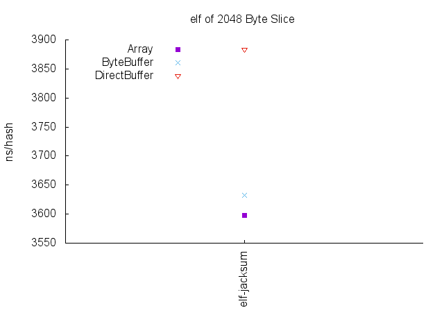

| Algorithm |  Array | ByteBuffer | DirectBuffer |
| --- | ---: | ---: | ---: | 
| [elf-jacksum](#elf-jacksum-latency) | 3598.015453 | 3632.059735 | 3883.640406 |

---
### 2048 Byte Slice Latency (farmna)
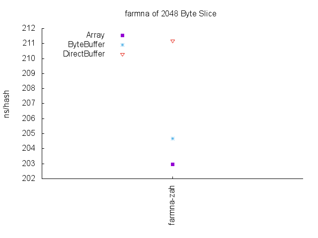

| Algorithm |  Array | ByteBuffer | DirectBuffer |
| --- | ---: | ---: | ---: | 
| [farmna-zah](#farmna-zah-latency) | 202.962415 | 204.674326 | 211.190804 |

---
### 2048 Byte Slice Latency (farmuo)
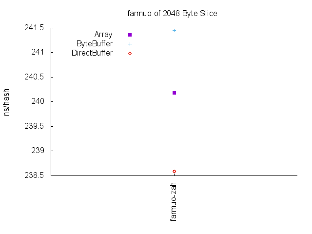

| Algorithm |  Array | ByteBuffer | DirectBuffer |
| --- | ---: | ---: | ---: | 
| [farmuo-zah](#farmuo-zah-latency) | 240.180324 | 241.451866 | 238.591073 |

---
### 2048 Byte Slice Latency (fcs16)

| Algorithm |  Array | ByteBuffer | DirectBuffer |
| --- | ---: | ---: | ---: | 
| [fcs16-jacksum](#fcs16-jacksum-latency) | 5339.851389 | 5313.401031 | 5651.102579 |

---
### 2048 Byte Slice Latency (gfh32)
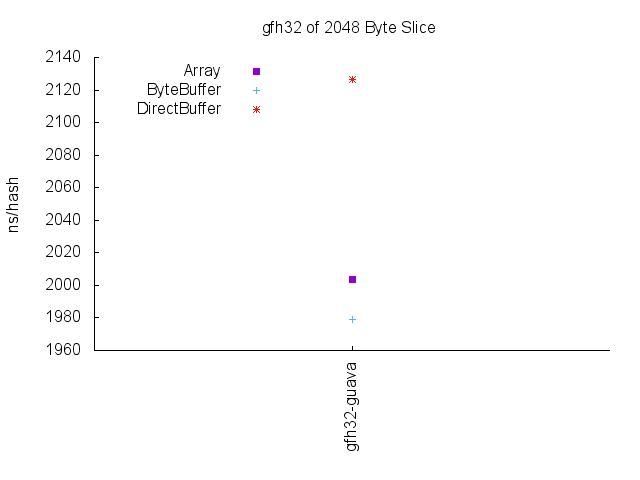

| Algorithm |  Array | ByteBuffer | DirectBuffer |
| --- | ---: | ---: | ---: | 
| [gfh32-guava](#gfh32-guava-latency) | 2003.891274 | 1978.765061 | 2126.708852 |

---
### 2048 Byte Slice Latency (gfh64)
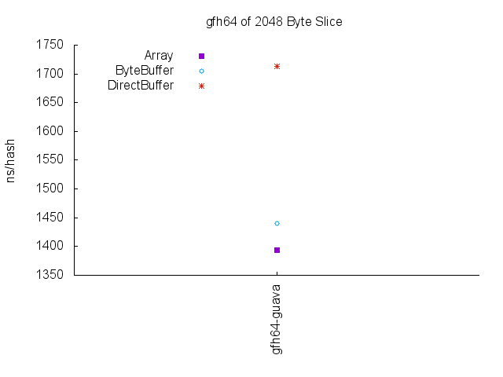

| Algorithm |  Array | ByteBuffer | DirectBuffer |
| --- | ---: | ---: | ---: | 
| [gfh64-guava](#gfh64-guava-latency) | 1393.473271 | 1439.668644 | 1713.642503 |

---
### 2048 Byte Slice Latency (gost)
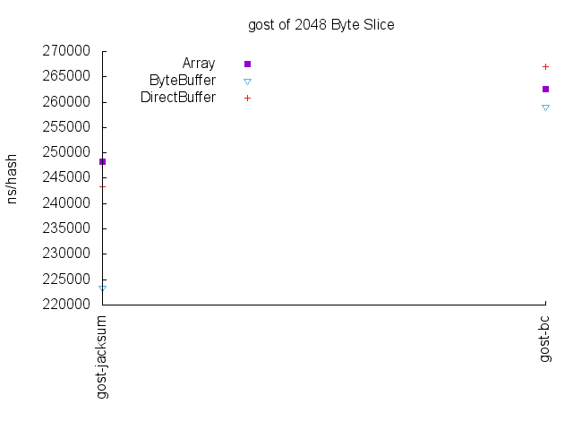

| Algorithm |  Array | ByteBuffer | DirectBuffer |
| --- | ---: | ---: | ---: | 
| [gost-jacksum](#gost-jacksum-latency) | 248235.608486 | 223434.592748 | 243323.425555 |
| [gost-bc](#gost-bc-latency) | 262591.814401 | 259010.532124 | 266954.998310 |

---
### 2048 Byte Slice Latency (has160)
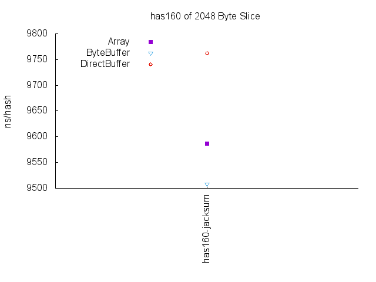

| Algorithm |  Array | ByteBuffer | DirectBuffer |
| --- | ---: | ---: | ---: | 
| [has160-jacksum](#has160-jacksum-latency) | 9586.192604 | 9507.808665 | 9761.914165 |

---
### 2048 Byte Slice Latency (haval128h3)
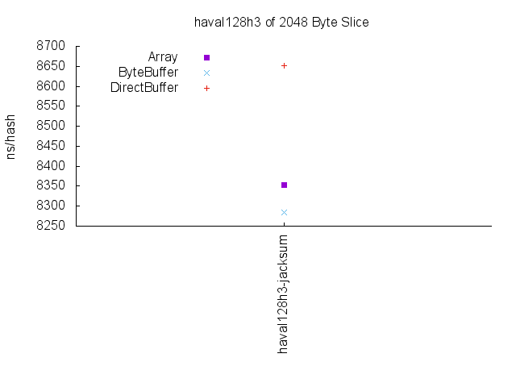

| Algorithm |  Array | ByteBuffer | DirectBuffer |
| --- | ---: | ---: | ---: | 
| [haval128h3-jacksum](#haval128h3-jacksum-latency) | 8353.471062 | 8284.486195 | 8650.630436 |

---
### 2048 Byte Slice Latency (haval128h4)
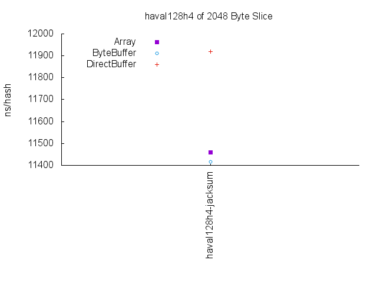

| Algorithm |  Array | ByteBuffer | DirectBuffer |
| --- | ---: | ---: | ---: | 
| [haval128h4-jacksum](#haval128h4-jacksum-latency) | 11458.302781 | 11415.203419 | 11920.117614 |

---
### 2048 Byte Slice Latency (haval128h5)
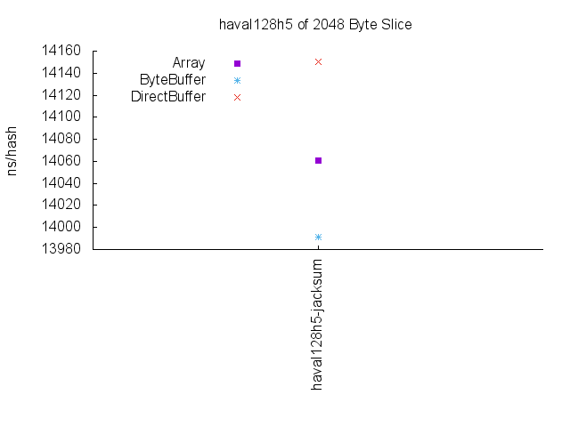

| Algorithm |  Array | ByteBuffer | DirectBuffer |
| --- | ---: | ---: | ---: | 
| [haval128h5-jacksum](#haval128h5-jacksum-latency) | 14060.450728 | 13991.558367 | 14150.391134 |

---
### 2048 Byte Slice Latency (haval160h3)

| Algorithm |  Array | ByteBuffer | DirectBuffer |
| --- | ---: | ---: | ---: | 
| [haval160h3-jacksum](#haval160h3-jacksum-latency) | 8367.567783 | 8263.844029 | 8523.003433 |

---
### 2048 Byte Slice Latency (haval160h4)
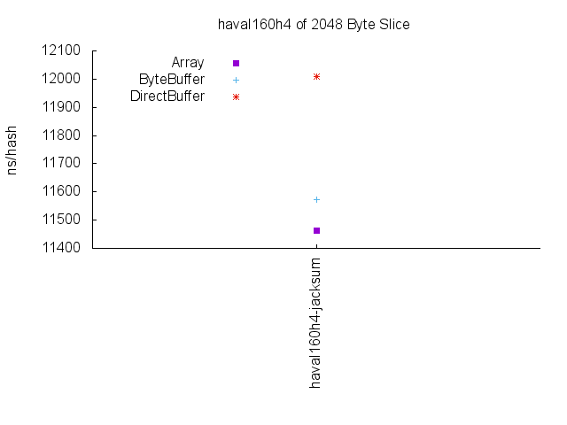

| Algorithm |  Array | ByteBuffer | DirectBuffer |
| --- | ---: | ---: | ---: | 
| [haval160h4-jacksum](#haval160h4-jacksum-latency) | 11464.278611 | 11571.412680 | 12008.700107 |

---
### 2048 Byte Slice Latency (haval160h5)
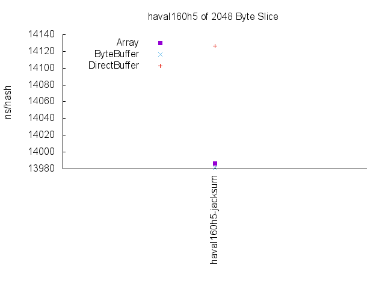

| Algorithm |  Array | ByteBuffer | DirectBuffer |
| --- | ---: | ---: | ---: | 
| [haval160h5-jacksum](#haval160h5-jacksum-latency) | 13986.549072 | 13981.083259 | 14126.167519 |

---
### 2048 Byte Slice Latency (haval192h3)
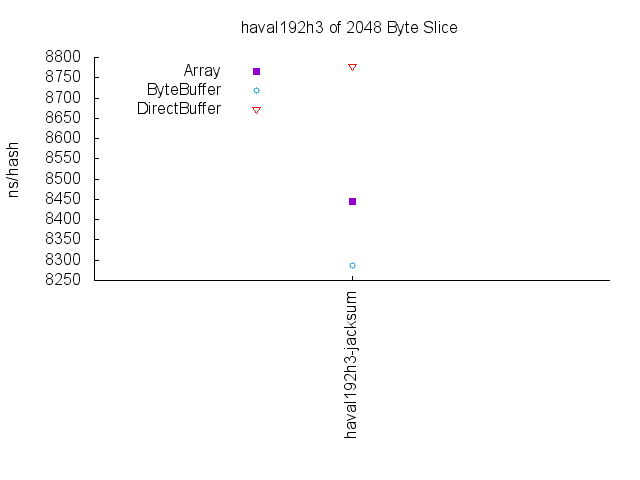

| Algorithm |  Array | ByteBuffer | DirectBuffer |
| --- | ---: | ---: | ---: | 
| [haval192h3-jacksum](#haval192h3-jacksum-latency) | 8445.743274 | 8287.932992 | 8777.889791 |

---
### 2048 Byte Slice Latency (haval192h4)
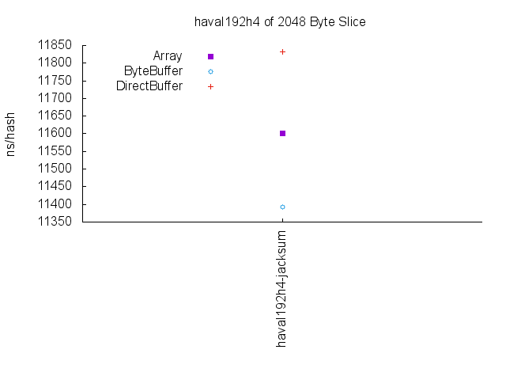

| Algorithm |  Array | ByteBuffer | DirectBuffer |
| --- | ---: | ---: | ---: | 
| [haval192h4-jacksum](#haval192h4-jacksum-latency) | 11601.626898 | 11392.384451 | 11831.929967 |

---
### 2048 Byte Slice Latency (haval192h5)
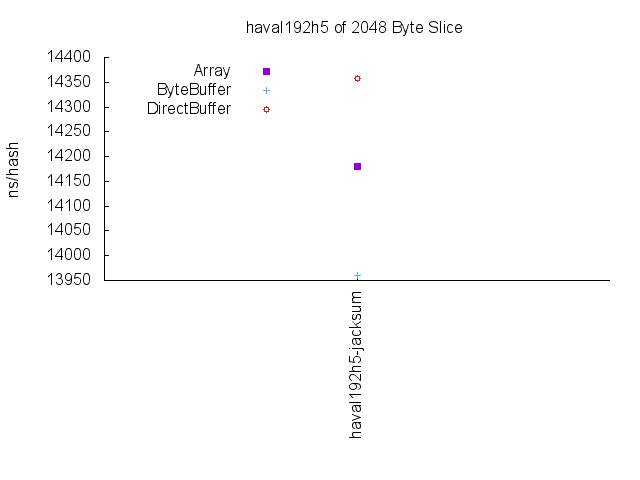

| Algorithm |  Array | ByteBuffer | DirectBuffer |
| --- | ---: | ---: | ---: | 
| [haval192h5-jacksum](#haval192h5-jacksum-latency) | 14179.349506 | 13961.039738 | 14357.492306 |

---
### 2048 Byte Slice Latency (haval224h3)
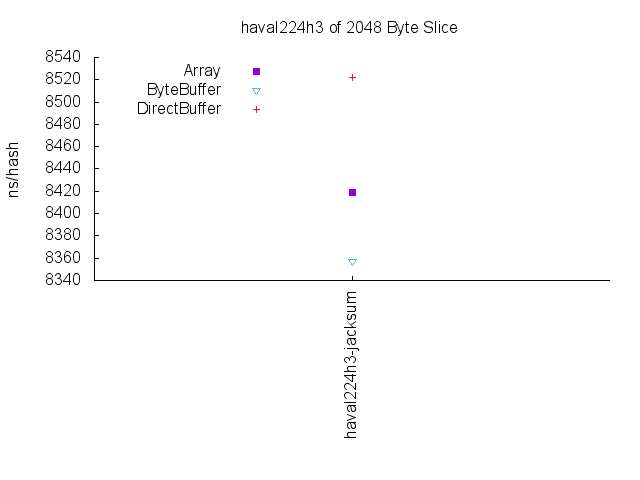

| Algorithm |  Array | ByteBuffer | DirectBuffer |
| --- | ---: | ---: | ---: | 
| [haval224h3-jacksum](#haval224h3-jacksum-latency) | 8418.636743 | 8357.469434 | 8521.802952 |

---
### 2048 Byte Slice Latency (haval224h4)
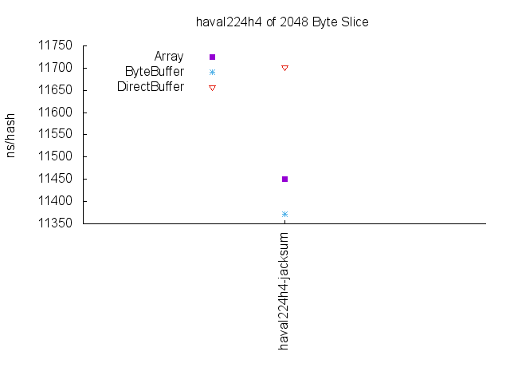

| Algorithm |  Array | ByteBuffer | DirectBuffer |
| --- | ---: | ---: | ---: | 
| [haval224h4-jacksum](#haval224h4-jacksum-latency) | 11450.163479 | 11371.579957 | 11702.213471 |

---
### 2048 Byte Slice Latency (haval224h5)
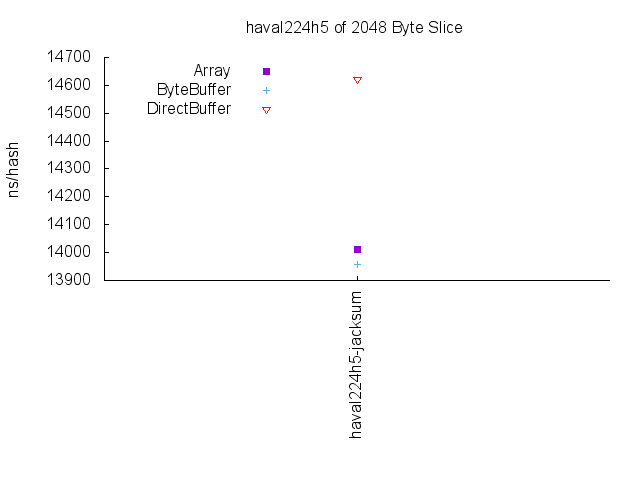

| Algorithm |  Array | ByteBuffer | DirectBuffer |
| --- | ---: | ---: | ---: | 
| [haval224h5-jacksum](#haval224h5-jacksum-latency) | 14012.545285 | 13956.097571 | 14621.416641 |

---
### 2048 Byte Slice Latency (haval256h3)
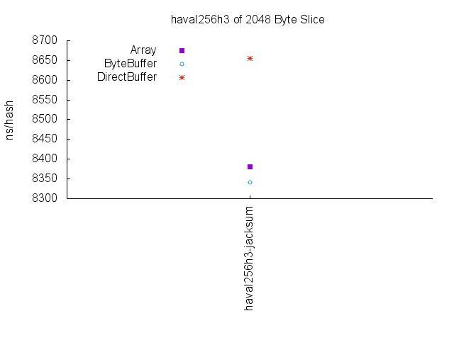

| Algorithm |  Array | ByteBuffer | DirectBuffer |
| --- | ---: | ---: | ---: | 
| [haval256h3-jacksum](#haval256h3-jacksum-latency) | 8381.081273 | 8340.474364 | 8654.764297 |

---
### 2048 Byte Slice Latency (haval256h4)
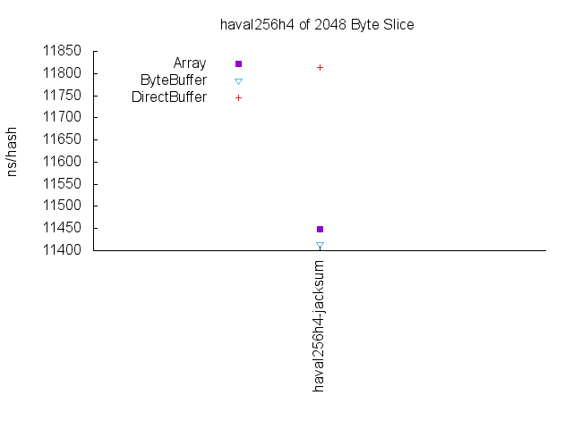

| Algorithm |  Array | ByteBuffer | DirectBuffer |
| --- | ---: | ---: | ---: | 
| [haval256h4-jacksum](#haval256h4-jacksum-latency) | 11447.527296 | 11414.692084 | 11814.544236 |

---
### 2048 Byte Slice Latency (haval256h5)
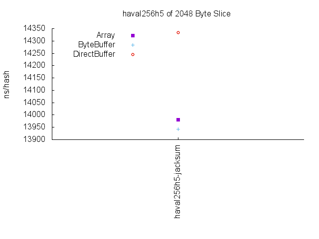

| Algorithm |  Array | ByteBuffer | DirectBuffer |
| --- | ---: | ---: | ---: | 
| [haval256h5-jacksum](#haval256h5-jacksum-latency) | 13980.489427 | 13941.435966 | 14334.705650 |

---
### 2048 Byte Slice Latency (md2)
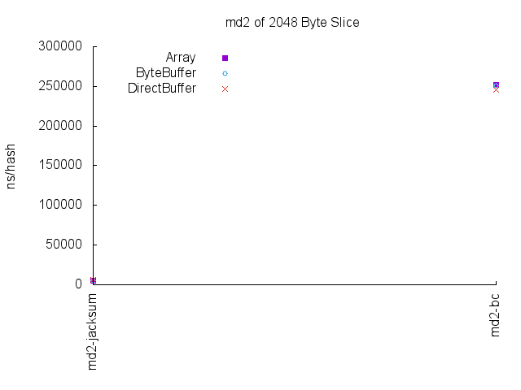

| Algorithm |  Array | ByteBuffer | DirectBuffer |
| --- | ---: | ---: | ---: | 
| [md2-jacksum](#md2-jacksum-latency) | 4989.343807 | 4966.589168 | 6467.057135 |
| [md2-bc](#md2-bc-latency) | 252117.095043 | 250597.129230 | 246043.548826 |

---
### 2048 Byte Slice Latency (md4)
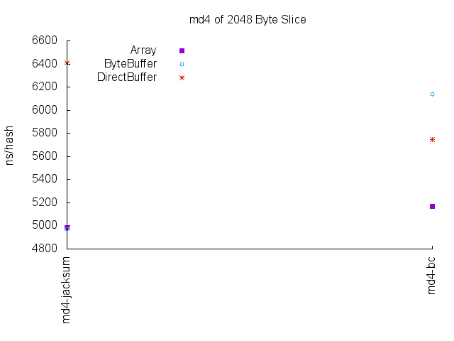

| Algorithm |  Array | ByteBuffer | DirectBuffer |
| --- | ---: | ---: | ---: | 
| [md4-jacksum](#md4-jacksum-latency) | 4981.750445 | 4969.614684 | 6408.299735 |
| [md4-bc](#md4-bc-latency) | 5167.590680 | 6139.287219 | 5747.026743 |

---
### 2048 Byte Slice Latency (md5)
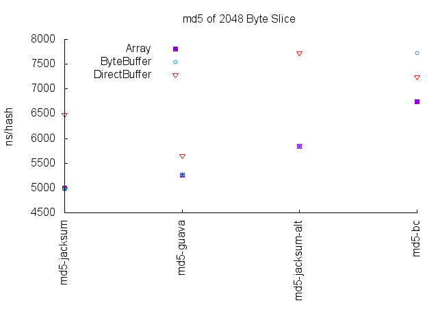

| Algorithm |  Array | ByteBuffer | DirectBuffer |
| --- | ---: | ---: | ---: | 
| [md5-jacksum](#md5-jacksum-latency) | 4991.234542 | 4975.504037 | 6481.806463 |
| [md5-guava](#md5-guava-latency) | 5255.849210 | 5268.738322 | 5646.984575 |
| [md5-jacksum-alt](#md5-jacksum-alt-latency) | 5837.193147 | 5835.880582 | 7729.499495 |
| [md5-bc](#md5-bc-latency) | 6742.862220 | 7717.962018 | 7234.402039 |

---
### 2048 Byte Slice Latency (murmur3h128)
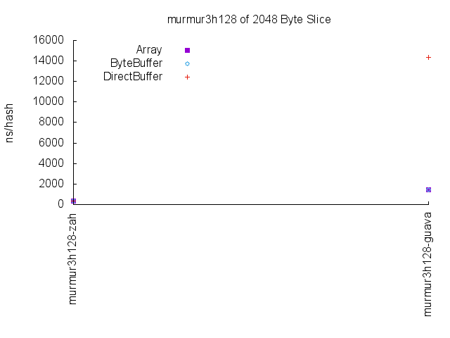

| Algorithm |  Array | ByteBuffer | DirectBuffer |
| --- | ---: | ---: | ---: | 
| [murmur3h128-zah](#murmur3h128-zah-latency) | 367.706141 | 365.997714 | 368.604194 |
| [murmur3h128-guava](#murmur3h128-guava-latency) | 1427.976991 | 1417.445725 | 14372.651476 |

---
### 2048 Byte Slice Latency (murmur3h32)
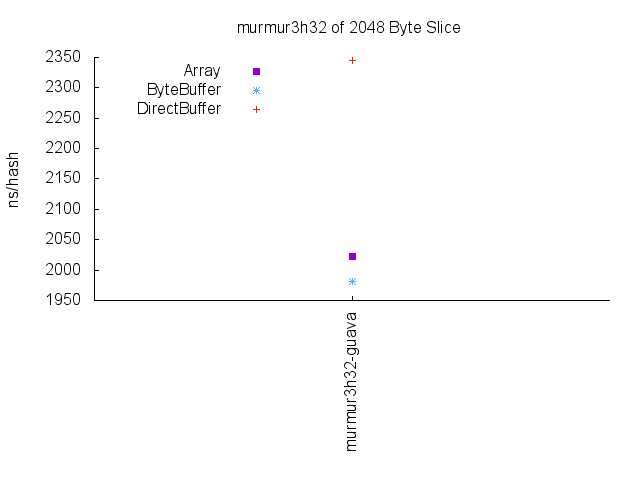

| Algorithm |  Array | ByteBuffer | DirectBuffer |
| --- | ---: | ---: | ---: | 
| [murmur3h32-guava](#murmur3h32-guava-latency) | 2023.051909 | 1981.050138 | 2344.605194 |

---
### 2048 Byte Slice Latency (ripemd128)
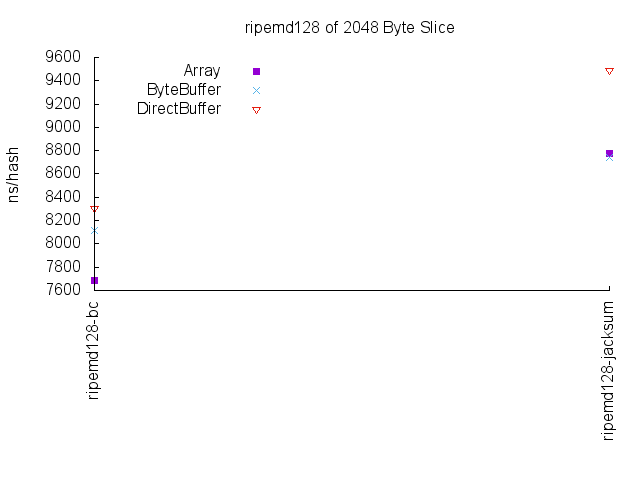

| Algorithm |  Array | ByteBuffer | DirectBuffer |
| --- | ---: | ---: | ---: | 
| [ripemd128-bc](#ripemd128-bc-latency) | 7683.635032 | 8114.394856 | 8303.523446 |
| [ripemd128-jacksum](#ripemd128-jacksum-latency) | 8773.413952 | 8739.777830 | 9488.838558 |

---
### 2048 Byte Slice Latency (ripemd160)

| Algorithm |  Array | ByteBuffer | DirectBuffer |
| --- | ---: | ---: | ---: | 
| [ripemd160-jacksum](#ripemd160-jacksum-latency) | 17683.373691 | 17315.461136 | 17688.642740 |
| [ripemd160-bc](#ripemd160-bc-latency) | 36131.086867 | 36131.917934 | 36120.641224 |

---
### 2048 Byte Slice Latency (ripemd256)
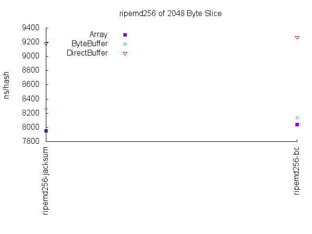

| Algorithm |  Array | ByteBuffer | DirectBuffer |
| --- | ---: | ---: | ---: | 
| [ripemd256-jacksum](#ripemd256-jacksum-latency) | 7949.335306 | 8263.364691 | 9182.036293 |
| [ripemd256-bc](#ripemd256-bc-latency) | 8039.635725 | 8134.677113 | 9267.115835 |

---
### 2048 Byte Slice Latency (ripemd320)
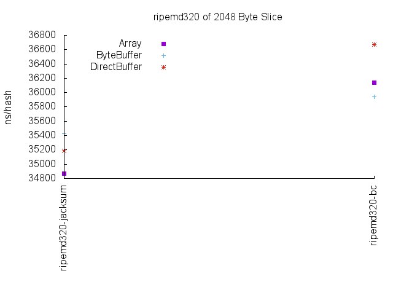

| Algorithm |  Array | ByteBuffer | DirectBuffer |
| --- | ---: | ---: | ---: | 
| [ripemd320-jacksum](#ripemd320-jacksum-latency) | 34870.476018 | 35426.963446 | 35188.558187 |
| [ripemd320-bc](#ripemd320-bc-latency) | 36136.320232 | 35945.306400 | 36675.128937 |

---
### 2048 Byte Slice Latency (sha0)
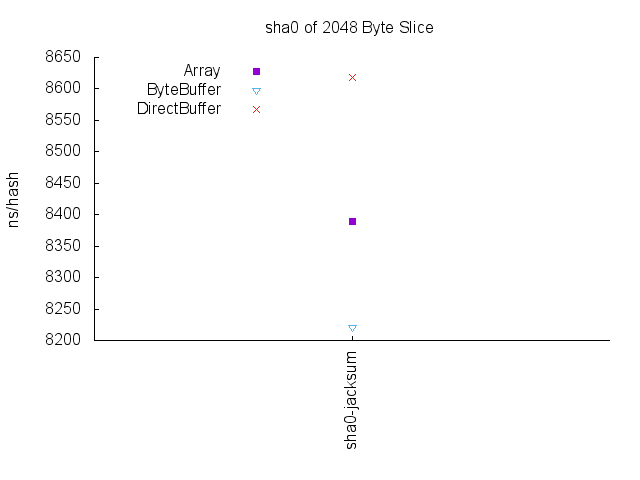

| Algorithm |  Array | ByteBuffer | DirectBuffer |
| --- | ---: | ---: | ---: | 
| [sha0-jacksum](#sha0-jacksum-latency) | 8389.627121 | 8219.960594 | 8618.508820 |

---
### 2048 Byte Slice Latency (sha1)
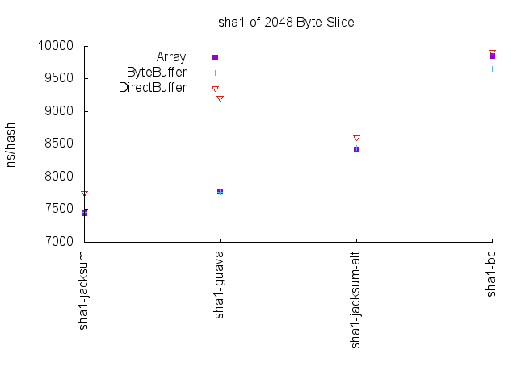

| Algorithm |  Array | ByteBuffer | DirectBuffer |
| --- | ---: | ---: | ---: | 
| [sha1-jacksum](#sha1-jacksum-latency) | 7444.359399 | 7451.583603 | 7755.542925 |
| [sha1-guava](#sha1-guava-latency) | 7776.209913 | 7766.867481 | 9214.980454 |
| [sha1-jacksum-alt](#sha1-jacksum-alt-latency) | 8419.325169 | 8447.954952 | 8598.868601 |
| [sha1-bc](#sha1-bc-latency) | 9855.529805 | 9655.945323 | 9913.311690 |

---
### 2048 Byte Slice Latency (sha224)
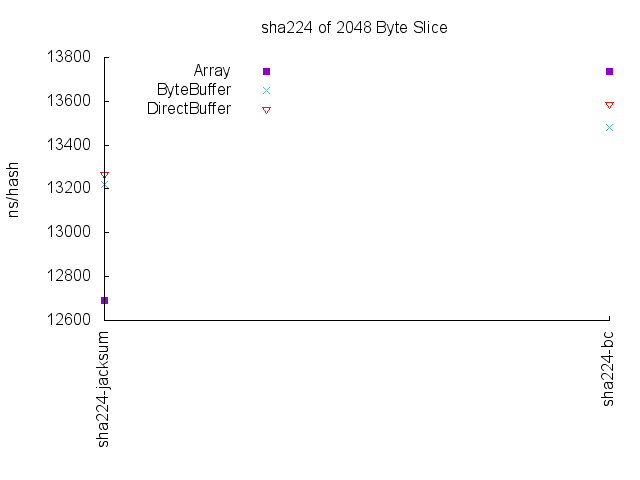

| Algorithm |  Array | ByteBuffer | DirectBuffer |
| --- | ---: | ---: | ---: | 
| [sha224-jacksum](#sha224-jacksum-latency) | 12692.825250 | 13218.688354 | 13266.948407 |
| [sha224-bc](#sha224-bc-latency) | 13734.870020 | 13480.155908 | 13586.619867 |

---
### 2048 Byte Slice Latency (sha256)
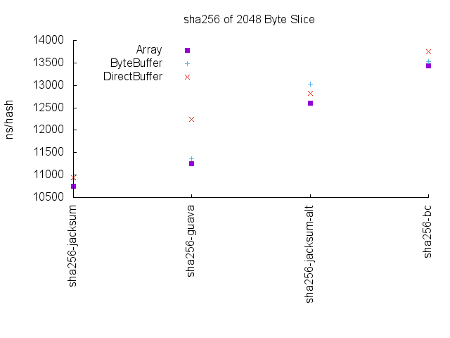

| Algorithm |  Array | ByteBuffer | DirectBuffer |
| --- | ---: | ---: | ---: | 
| [sha256-jacksum](#sha256-jacksum-latency) | 10744.850284 | 10908.891071 | 10940.023947 |
| [sha256-guava](#sha256-guava-latency) | 11255.901563 | 11358.502917 | 12240.301520 |
| [sha256-jacksum-alt](#sha256-jacksum-alt-latency) | 12604.058573 | 13028.859595 | 12818.384076 |
| [sha256-bc](#sha256-bc-latency) | 13434.379711 | 13534.194402 | 13750.458634 |

---
### 2048 Byte Slice Latency (sha3)
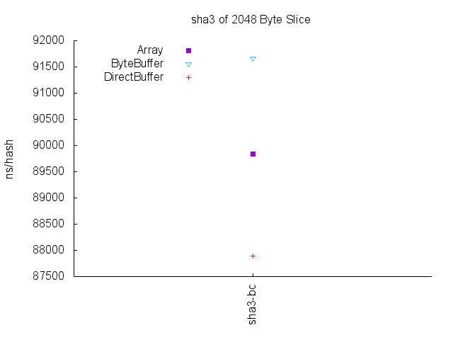

| Algorithm |  Array | ByteBuffer | DirectBuffer |
| --- | ---: | ---: | ---: | 
| [sha3-bc](#sha3-bc-latency) | 89839.782063 | 91657.831744 | 87896.480844 |

---
### 2048 Byte Slice Latency (sha384)
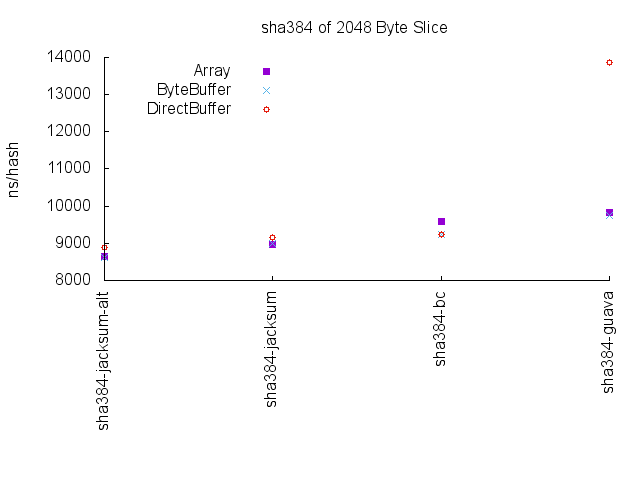

| Algorithm |  Array | ByteBuffer | DirectBuffer |
| --- | ---: | ---: | ---: | 
| [sha384-jacksum-alt](#sha384-jacksum-alt-latency) | 8659.011303 | 8608.801423 | 8878.553040 |
| [sha384-jacksum](#sha384-jacksum-latency) | 8976.511988 | 9000.305676 | 9161.576414 |
| [sha384-bc](#sha384-bc-latency) | 9580.229415 | 9236.867221 | 9248.190965 |
| [sha384-guava](#sha384-guava-latency) | 9822.337422 | 9748.163263 | 13865.976098 |

---
### 2048 Byte Slice Latency (sha512)
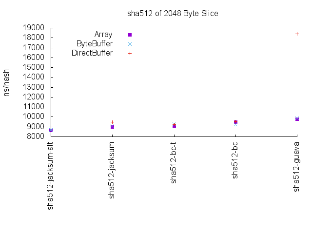

| Algorithm |  Array | ByteBuffer | DirectBuffer |
| --- | ---: | ---: | ---: | 
| [sha512-jacksum-alt](#sha512-jacksum-alt-latency) | 8634.042768 | 8666.247679 | 9077.954259 |
| [sha512-jacksum](#sha512-jacksum-latency) | 8978.554703 | 9101.461765 | 9459.975145 |
| [sha512-bc-t](#sha512-bc-t-latency) | 9095.807326 | 9281.898003 | 9234.516860 |
| [sha512-bc](#sha512-bc-latency) | 9496.240998 | 9237.672329 | 9506.857424 |
| [sha512-guava](#sha512-guava-latency) | 9797.058188 | 9886.249913 | 18405.928390 |

---
### 2048 Byte Slice Latency (sip)
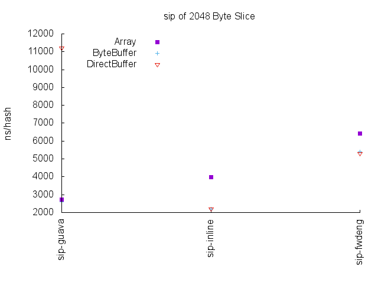

| Algorithm |  Array | ByteBuffer | DirectBuffer |
| --- | ---: | ---: | ---: | 
| [sip-guava](#sip-guava-latency) | 2718.855981 | 2609.253296 | 11207.355422 |
| [sip-inline](#sip-inline-latency) | 3994.403195 | 2195.285042 | 2198.796854 |
| [sip-fwdeng](#sip-fwdeng-latency) | 6436.855673 | 5388.673122 | 5292.043763 |

---
### 2048 Byte Slice Latency (skein1024)
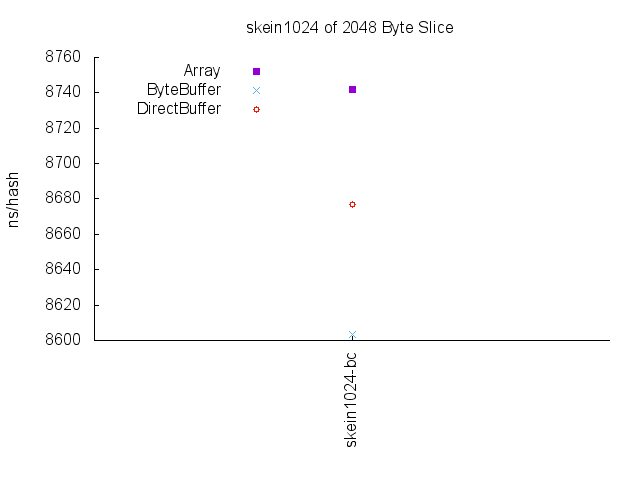

| Algorithm |  Array | ByteBuffer | DirectBuffer |
| --- | ---: | ---: | ---: | 
| [skein1024-bc](#skein1024-bc-latency) | 8741.995601 | 8603.570164 | 8676.742117 |

---
### 2048 Byte Slice Latency (skein256)
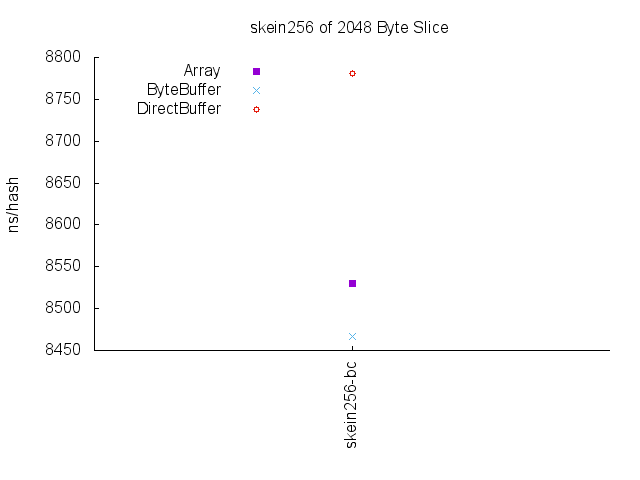

| Algorithm |  Array | ByteBuffer | DirectBuffer |
| --- | ---: | ---: | ---: | 
| [skein256-bc](#skein256-bc-latency) | 8529.776268 | 8466.452291 | 8781.269741 |

---
### 2048 Byte Slice Latency (skein512)
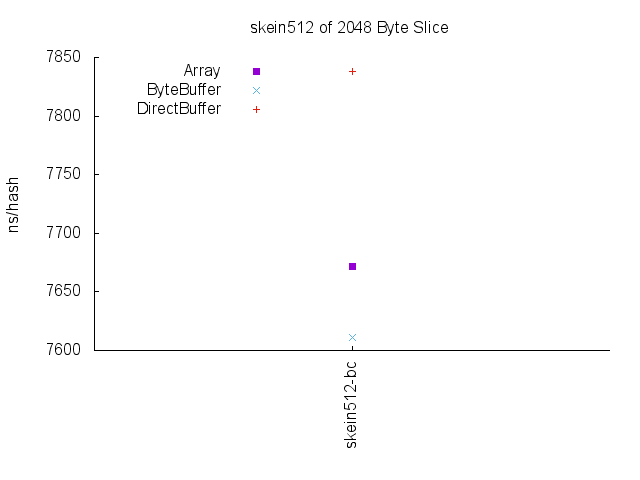

| Algorithm |  Array | ByteBuffer | DirectBuffer |
| --- | ---: | ---: | ---: | 
| [skein512-bc](#skein512-bc-latency) | 7671.345034 | 7610.869367 | 7838.418087 |

---
### 2048 Byte Slice Latency (sm3)
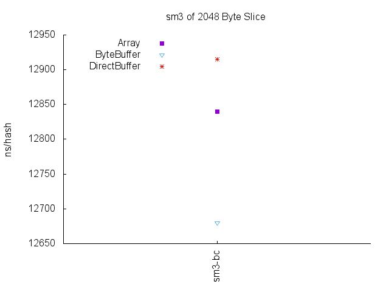

| Algorithm |  Array | ByteBuffer | DirectBuffer |
| --- | ---: | ---: | ---: | 
| [sm3-bc](#sm3-bc-latency) | 12839.919175 | 12679.720744 | 12915.349678 |

---
### 2048 Byte Slice Latency (sum16)
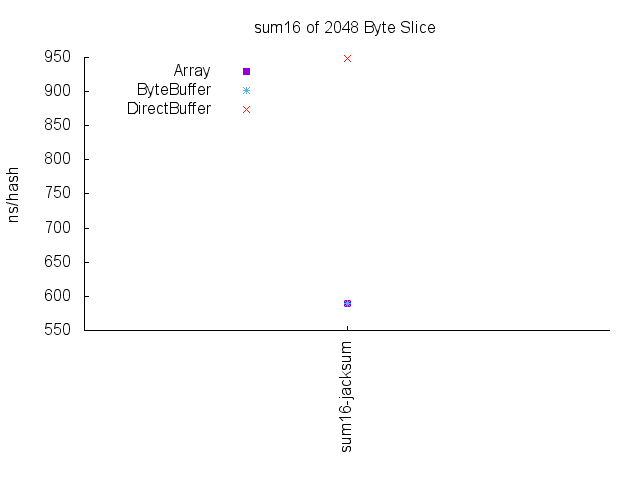

| Algorithm |  Array | ByteBuffer | DirectBuffer |
| --- | ---: | ---: | ---: | 
| [sum16-jacksum](#sum16-jacksum-latency) | 589.476227 | 589.779083 | 947.955800 |

---
### 2048 Byte Slice Latency (sum24)
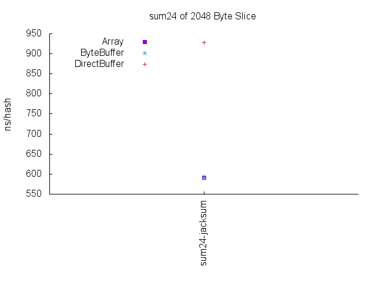

| Algorithm |  Array | ByteBuffer | DirectBuffer |
| --- | ---: | ---: | ---: | 
| [sum24-jacksum](#sum24-jacksum-latency) | 590.383196 | 589.116813 | 927.698598 |

---
### 2048 Byte Slice Latency (sum32)
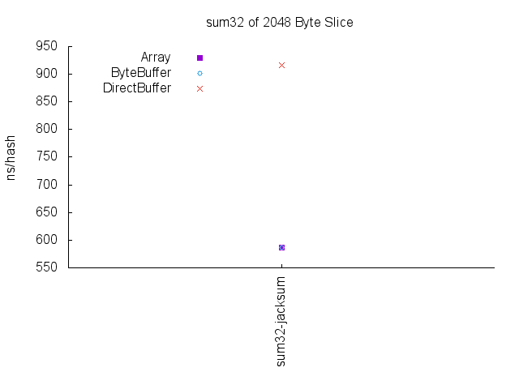

| Algorithm |  Array | ByteBuffer | DirectBuffer |
| --- | ---: | ---: | ---: | 
| [sum32-jacksum](#sum32-jacksum-latency) | 587.196615 | 586.764100 | 915.945037 |

---
### 2048 Byte Slice Latency (sum8)
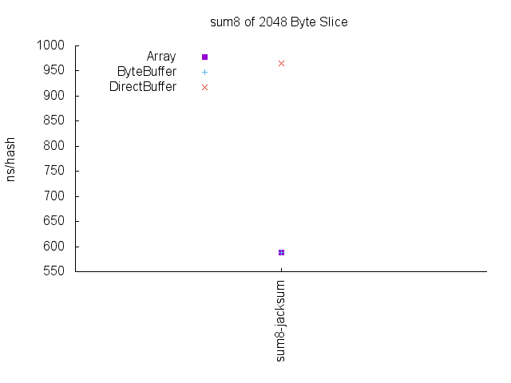

| Algorithm |  Array | ByteBuffer | DirectBuffer |
| --- | ---: | ---: | ---: | 
| [sum8-jacksum](#sum8-jacksum-latency) | 588.924288 | 588.647618 | 965.545839 |

---
### 2048 Byte Slice Latency (sumbsd)
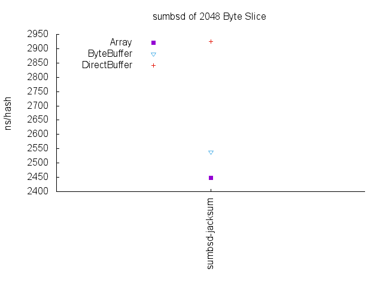

| Algorithm |  Array | ByteBuffer | DirectBuffer |
| --- | ---: | ---: | ---: | 
| [sumbsd-jacksum](#sumbsd-jacksum-latency) | 2447.968462 | 2538.449185 | 2925.747170 |

---
### 2048 Byte Slice Latency (sumsysv)
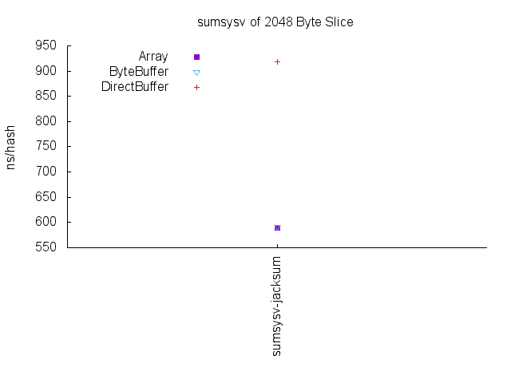

| Algorithm |  Array | ByteBuffer | DirectBuffer |
| --- | ---: | ---: | ---: | 
| [sumsysv-jacksum](#sumsysv-jacksum-latency) | 588.862214 | 590.683831 | 918.929610 |

---
### 2048 Byte Slice Latency (tiger)
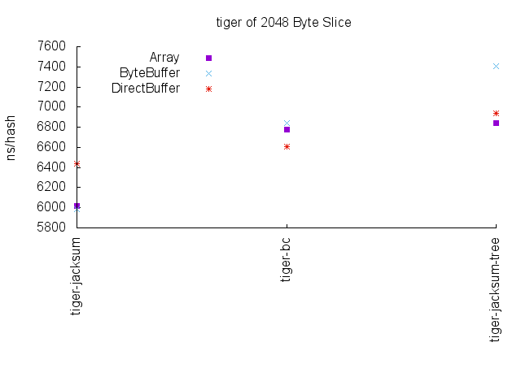

| Algorithm |  Array | ByteBuffer | DirectBuffer |
| --- | ---: | ---: | ---: | 
| [tiger-jacksum](#tiger-jacksum-latency) | 6019.128108 | 5986.589100 | 6438.913033 |
| [tiger-bc](#tiger-bc-latency) | 6776.667262 | 6843.541936 | 6605.325239 |
| [tiger-jacksum-tree](#tiger-jacksum-tree-latency) | 6844.681845 | 7407.192971 | 6937.521521 |

---
### 2048 Byte Slice Latency (tiger128)
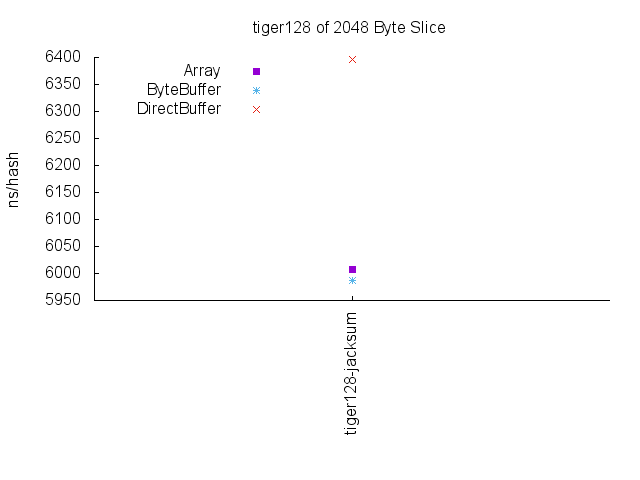

| Algorithm |  Array | ByteBuffer | DirectBuffer |
| --- | ---: | ---: | ---: | 
| [tiger128-jacksum](#tiger128-jacksum-latency) | 6007.815842 | 5987.508289 | 6396.463148 |

---
### 2048 Byte Slice Latency (tiger160)
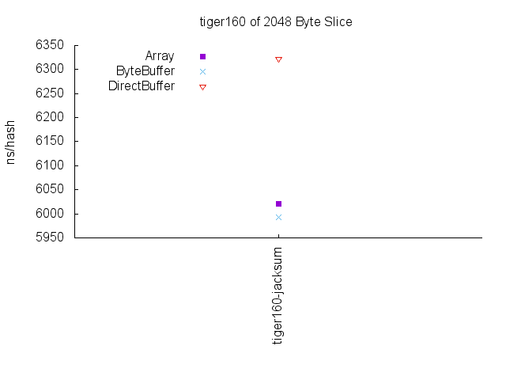

| Algorithm |  Array | ByteBuffer | DirectBuffer |
| --- | ---: | ---: | ---: | 
| [tiger160-jacksum](#tiger160-jacksum-latency) | 6020.432378 | 5993.060304 | 6321.274810 |

---
### 2048 Byte Slice Latency (tiger2)
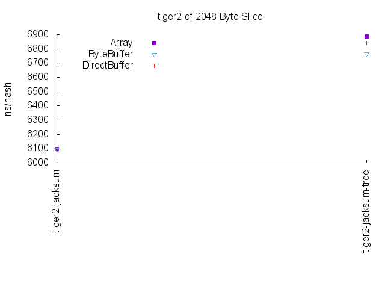

| Algorithm |  Array | ByteBuffer | DirectBuffer |
| --- | ---: | ---: | ---: | 
| [tiger2-jacksum](#tiger2-jacksum-latency) | 6096.190129 | 6092.440538 | 6672.636726 |
| [tiger2-jacksum-tree](#tiger2-jacksum-tree-latency) | 6886.396725 | 6763.945267 | 6839.519636 |

---
### 2048 Byte Slice Latency (whirlpool0)
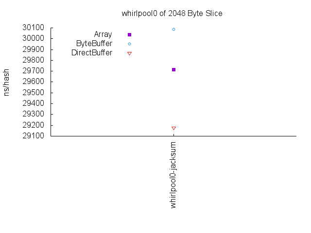

| Algorithm |  Array | ByteBuffer | DirectBuffer |
| --- | ---: | ---: | ---: | 
| [whirlpool0-jacksum](#whirlpool0-jacksum-latency) | 29716.585187 | 30086.007752 | 29177.853084 |

---
### 2048 Byte Slice Latency (whirlpool1)
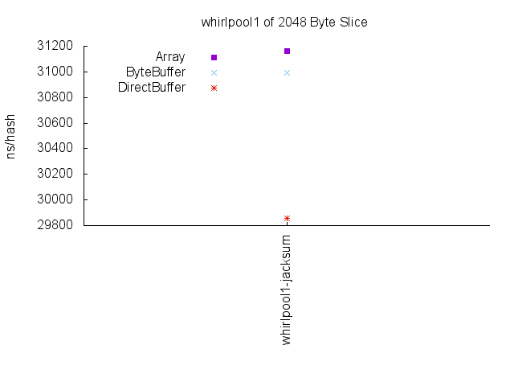

| Algorithm |  Array | ByteBuffer | DirectBuffer |
| --- | ---: | ---: | ---: | 
| [whirlpool1-jacksum](#whirlpool1-jacksum-latency) | 31163.949904 | 30993.655750 | 29855.311707 |

---
### 2048 Byte Slice Latency (whirlpool2)
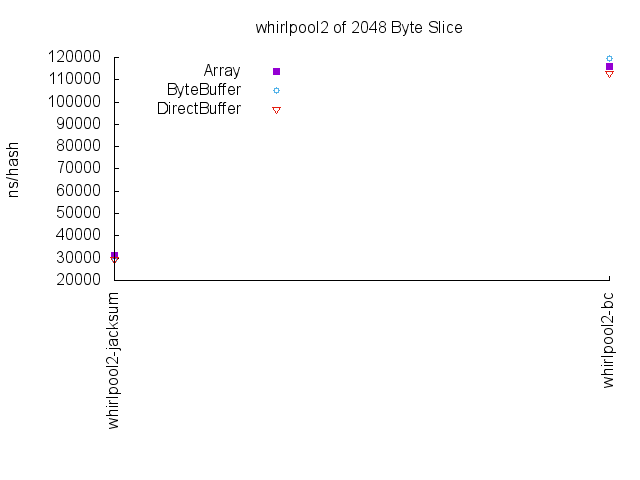

| Algorithm |  Array | ByteBuffer | DirectBuffer |
| --- | ---: | ---: | ---: | 
| [whirlpool2-jacksum](#whirlpool2-jacksum-latency) | 31028.194292 | 29478.367264 | 29210.031728 |
| [whirlpool2-bc](#whirlpool2-bc-latency) | 115962.396326 | 119437.238101 | 112728.543432 |

---
### 2048 Byte Slice Latency (xor8)
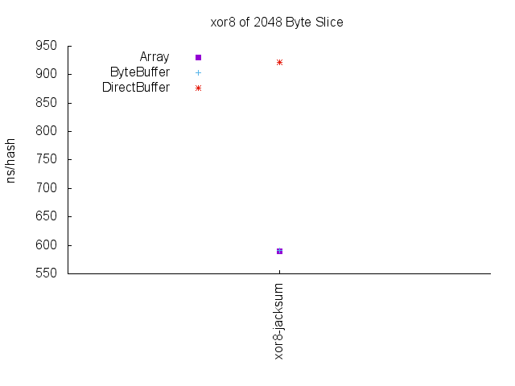

| Algorithm |  Array | ByteBuffer | DirectBuffer |
| --- | ---: | ---: | ---: | 
| [xor8-jacksum](#xor8-jacksum-latency) | 589.312160 | 591.167596 | 922.233789 |

---
### 2048 Byte Slice Latency (xxh32)

| Algorithm |  Array | ByteBuffer | DirectBuffer |
| --- | ---: | ---: | ---: | 
| [xxh32-jpountz-unsafe](#xxh32-jpountz-unsafe-latency) | 324.142837 | 319.003411 | 435.225347 |
| [xxh32-jpountz-jni](#xxh32-jpountz-jni-latency) | 328.397121 | 334.885479 | 318.968539 |
| [xxh32-jpountz-safe](#xxh32-jpountz-safe-latency) | 918.358412 | 914.470552 | 437.129712 |

---
### 2048 Byte Slice Latency (xxh64)
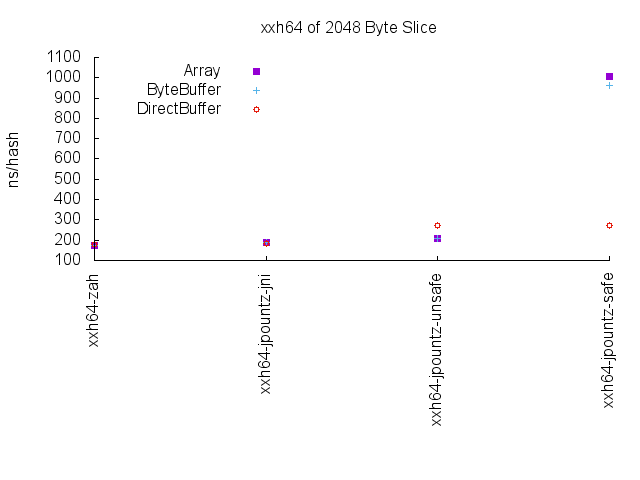

| Algorithm |  Array | ByteBuffer | DirectBuffer |
| --- | ---: | ---: | ---: | 
| [xxh64-zah](#xxh64-zah-latency) | 172.055998 | 176.232818 | 176.820485 |
| [xxh64-jpountz-jni](#xxh64-jpountz-jni-latency) | 189.549048 | 188.886747 | 181.772016 |
| [xxh64-jpountz-unsafe](#xxh64-jpountz-unsafe-latency) | 207.825593 | 208.989461 | 271.898290 |
| [xxh64-jpountz-safe](#xxh64-jpountz-safe-latency) | 1005.299319 | 960.853530 | 271.485806 |

---
### 8192 Byte Slice Latency (All Hashes)
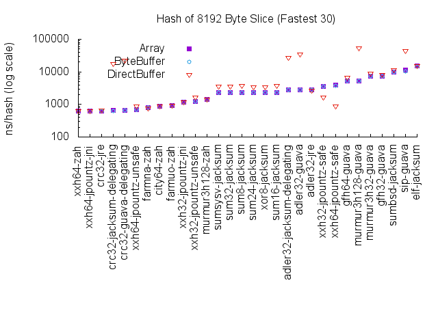

| Algorithm |  Array | ByteBuffer | DirectBuffer |
| --- | ---: | ---: | ---: | 
| [xxh64-zah](#xxh64-zah-latency) | 618.209537 | 615.081332 | 613.045931 |
| [xxh64-jpountz-jni](#xxh64-jpountz-jni-latency) | 624.341976 | 623.291145 | 612.861126 |
| [crc32-jre](#crc32-jre-latency) | 638.955548 | 635.586854 | 661.396545 |
| [crc32-jacksum-delegating](#crc32-jacksum-delegating-latency) | 642.405958 | 637.143103 | 17467.241507 |
| [crc32-guava-delegating](#crc32-guava-delegating-latency) | 662.492317 | 658.990262 | 22270.187645 |
| [xxh64-jpountz-unsafe](#xxh64-jpountz-unsafe-latency) | 692.818664 | 689.087359 | 892.120220 |
| [farmna-zah](#farmna-zah-latency) | 795.992037 | 783.890624 | 759.124886 |
| [city64-zah](#city64-zah-latency) | 860.886946 | 859.463968 | 860.038829 |
| [farmuo-zah](#farmuo-zah-latency) | 934.455676 | 933.861325 | 927.154979 |
| [xxh32-jpountz-jni](#xxh32-jpountz-jni-latency) | 1199.375262 | 1198.421896 | 1178.251301 |
| [xxh32-jpountz-unsafe](#xxh32-jpountz-unsafe-latency) | 1223.092118 | 1211.400110 | 1631.977210 |
| [murmur3h128-zah](#murmur3h128-zah-latency) | 1430.890965 | 1425.525588 | 1434.133562 |
| [sumsysv-jacksum](#sumsysv-jacksum-latency) | 2322.346490 | 2323.752421 | 3625.240129 |
| [sum32-jacksum](#sum32-jacksum-latency) | 2322.682121 | 2319.420643 | 3490.066103 |
| [sum8-jacksum](#sum8-jacksum-latency) | 2323.392908 | 2324.334352 | 3696.620139 |
| [sum24-jacksum](#sum24-jacksum-latency) | 2324.720148 | 2318.338429 | 3432.730423 |
| [xor8-jacksum](#xor8-jacksum-latency) | 2329.465925 | 2323.069861 | 3446.123846 |
| [sum16-jacksum](#sum16-jacksum-latency) | 2359.778585 | 2325.712895 | 3686.800183 |
| [adler32-jacksum-delegating](#adler32-jacksum-delegating-latency) | 2788.771107 | 2764.002179 | 26989.726461 |
| [adler32-guava](#adler32-guava-latency) | 2802.494967 | 2831.640011 | 34237.187180 |
| [adler32-jre](#adler32-jre-latency) | 2819.495248 | 2769.456825 | 2733.499793 |
| [xxh32-jpountz-safe](#xxh32-jpountz-safe-latency) | 3606.938807 | 3610.090258 | 1639.083841 |
| [xxh64-jpountz-safe](#xxh64-jpountz-safe-latency) | 3975.148316 | 3795.907087 | 894.131827 |
| [gfh64-guava](#gfh64-guava-latency) | 5345.208230 | 5334.926871 | 6821.571382 |
| [murmur3h128-guava](#murmur3h128-guava-latency) | 5345.532062 | 5347.381741 | 53643.573610 |
| [murmur3h32-guava](#murmur3h32-guava-latency) | 7323.295694 | 7390.927811 | 8742.032462 |
| [gfh32-guava](#gfh32-guava-latency) | 7345.530959 | 7303.848415 | 8091.697241 |
| [sumbsd-jacksum](#sumbsd-jacksum-latency) | 9774.072565 | 9957.169556 | 11479.408269 |
| [sip-guava](#sip-guava-latency) | 11365.238786 | 10551.005943 | 44193.787464 |
| [elf-jacksum](#elf-jacksum-latency) | 14848.280673 | 14718.406315 | 15357.624883 |
| [ed2k-jacksum](#ed2k-jacksum-latency) | 14969.359206 | 14803.093551 | 15491.088202 |
| [crc8-jacksum](#crc8-jacksum-latency) | 16015.146839 | 15342.934768 | 17465.439896 |
| [sip-inline](#sip-inline-latency) | 16300.643989 | 8521.803246 | 8257.608331 |
| [crc16-jacksum](#crc16-jacksum-latency) | 18698.873133 | 18540.861796 | 38123.446230 |
| [crc32-guava-rfc3720](#crc32-guava-rfc3720-latency) | 19103.521337 | 19846.067772 | 20357.208079 |
| [crc32-jacksum-fcs32](#crc32-jacksum-fcs32-latency) | 19303.791348 | 19486.121397 | 19884.442216 |
| [md2-jacksum](#md2-jacksum-latency) | 19860.450554 | 19944.672972 | 25942.371940 |
| [md4-jacksum](#md4-jacksum-latency) | 19885.422565 | 19847.334506 | 25800.416259 |
| [md5-jacksum](#md5-jacksum-latency) | 19901.801878 | 19836.812231 | 25762.034020 |
| [md5-guava](#md5-guava-latency) | 20170.760856 | 20095.568565 | 21738.485174 |
| [md4-bc](#md4-bc-latency) | 20280.139360 | 24139.027426 | 21605.388257 |
| [crc64-jacksum](#crc64-jacksum-latency) | 21011.520998 | 20838.739022 | 22754.755526 |
| [fcs16-jacksum](#fcs16-jacksum-latency) | 21376.777036 | 21233.921417 | 21937.783284 |
| [crc32-jacksum-mpeg2](#crc32-jacksum-mpeg2-latency) | 21415.723362 | 21318.526762 | 21861.436047 |
| [cksum-jacksum](#cksum-jacksum-latency) | 21455.798659 | 21372.225880 | 41283.723545 |
| [crc32-jacksum-bzip2](#crc32-jacksum-bzip2-latency) | 22942.682029 | 23341.093996 | 30854.752812 |
| [crc24-jacksum](#crc24-jacksum-latency) | 22943.249947 | 23377.722905 | 38979.927978 |
| [md5-jacksum-alt](#md5-jacksum-alt-latency) | 23680.224096 | 22797.237259 | 29564.562811 |
| [tiger-jacksum](#tiger-jacksum-latency) | 24018.114701 | 23908.989200 | 24979.949576 |
| [tiger2-jacksum](#tiger2-jacksum-latency) | 24018.987258 | 23967.307515 | 24735.881030 |
| [tiger160-jacksum](#tiger160-jacksum-latency) | 24028.757783 | 23927.316677 | 24695.462103 |
| [tiger128-jacksum](#tiger128-jacksum-latency) | 24058.916748 | 24332.436644 | 25467.074684 |
| [sip-fwdeng](#sip-fwdeng-latency) | 25949.665401 | 21173.233935 | 20366.374503 |
| [md5-bc](#md5-bc-latency) | 26410.270669 | 27269.292311 | 28449.115043 |
| [tiger-bc](#tiger-bc-latency) | 26702.532819 | 26736.182014 | 26536.447706 |
| [tiger-jacksum-tree](#tiger-jacksum-tree-latency) | 27272.440133 | 29181.218523 | 27879.572168 |
| [tiger2-jacksum-tree](#tiger2-jacksum-tree-latency) | 27559.126274 | 26423.553452 | 28177.867059 |
| [ripemd128-bc](#ripemd128-bc-latency) | 29226.261494 | 33471.131174 | 30749.089845 |
| [sha1-jacksum](#sha1-jacksum-latency) | 29740.754509 | 30098.181637 | 30269.592203 |
| [skein512-bc](#skein512-bc-latency) | 29797.873127 | 30305.968867 | 30348.411383 |
| [sha1-guava](#sha1-guava-latency) | 30686.098909 | 30145.139168 | 58016.921762 |
| [ripemd256-bc](#ripemd256-bc-latency) | 31298.015586 | 31980.863050 | 32249.749038 |
| [adler32-jacksum-alt](#adler32-jacksum-alt-latency) | 31828.421921 | 31246.518813 | 53850.967207 |
| [ripemd256-jacksum](#ripemd256-jacksum-latency) | 31928.906391 | 31980.963135 | 32477.297104 |
| [skein1024-bc](#skein1024-bc-latency) | 32754.451847 | 32557.124023 | 33533.390034 |
| [sha0-jacksum](#sha0-jacksum-latency) | 32825.964882 | 32895.187260 | 34018.770309 |
| [skein256-bc](#skein256-bc-latency) | 33079.203595 | 33972.342683 | 34655.306142 |
| [haval192h3-jacksum](#haval192h3-jacksum-latency) | 33120.963077 | 32983.428591 | 34295.477140 |
| [haval256h3-jacksum](#haval256h3-jacksum-latency) | 33269.937077 | 33075.082838 | 33734.368967 |
| [haval128h3-jacksum](#haval128h3-jacksum-latency) | 33353.679323 | 33208.895460 | 33650.419839 |
| [sha1-jacksum-alt](#sha1-jacksum-alt-latency) | 33360.807216 | 34302.017259 | 37346.187434 |
| [haval224h3-jacksum](#haval224h3-jacksum-latency) | 33614.587480 | 33958.363525 | 33718.838772 |
| [haval160h3-jacksum](#haval160h3-jacksum-latency) | 33739.546691 | 33101.652051 | 34856.844513 |
| [sha512-jacksum-alt](#sha512-jacksum-alt-latency) | 33849.148397 | 35077.046057 | 35017.880029 |
| [sha512-bc-t](#sha512-bc-t-latency) | 34669.540498 | 35582.368678 | 35812.495896 |
| [sha384-jacksum-alt](#sha384-jacksum-alt-latency) | 34962.053427 | 34173.477374 | 34433.623331 |
| [ripemd128-jacksum](#ripemd128-jacksum-latency) | 35072.012784 | 34828.609098 | 35344.326372 |
| [sha384-jacksum](#sha384-jacksum-latency) | 35844.861253 | 35865.906618 | 37967.350600 |
| [sha512-jacksum](#sha512-jacksum-latency) | 35967.553468 | 35902.320841 | 36430.252683 |
| [sha384-bc](#sha384-bc-latency) | 36634.383919 | 35413.091106 | 36696.307325 |
| [sha512-bc](#sha512-bc-latency) | 36803.652025 | 35317.556233 | 35211.700239 |
| [sha384-guava](#sha384-guava-latency) | 37000.231741 | 36664.559453 | 40845.626029 |
| [sha512-guava](#sha512-guava-latency) | 37037.873280 | 37146.638504 | 56775.972463 |
| [has160-jacksum](#has160-jacksum-latency) | 38162.172636 | 38152.054592 | 38653.345680 |
| [sha1-bc](#sha1-bc-latency) | 38535.731198 | 37812.185848 | 38575.028369 |
| [sha256-jacksum](#sha256-jacksum-latency) | 42995.312284 | 43652.235409 | 44580.826753 |
| [sha256-guava](#sha256-guava-latency) | 43685.798835 | 43842.141200 | 48668.967825 |
| [haval256h4-jacksum](#haval256h4-jacksum-latency) | 45622.837256 | 45571.800752 | 46180.101588 |
| [haval160h4-jacksum](#haval160h4-jacksum-latency) | 45646.563850 | 45408.280445 | 46212.714557 |
| [haval128h4-jacksum](#haval128h4-jacksum-latency) | 45768.517721 | 45391.093795 | 46068.409809 |
| [haval192h4-jacksum](#haval192h4-jacksum-latency) | 45959.616249 | 45426.485791 | 46243.609197 |
| [haval224h4-jacksum](#haval224h4-jacksum-latency) | 46713.450475 | 45532.995125 | 46150.498784 |
| [sm3-bc](#sm3-bc-latency) | 50161.349550 | 49742.145928 | 51904.751473 |
| [sha256-jacksum-alt](#sha256-jacksum-alt-latency) | 50521.405892 | 52850.559541 | 51499.082615 |
| [sha224-jacksum](#sha224-jacksum-latency) | 51046.037351 | 52166.954611 | 52395.803979 |
| [sha224-bc](#sha224-bc-latency) | 51843.095595 | 52613.014967 | 53305.697492 |
| [sha256-bc](#sha256-bc-latency) | 52250.816880 | 52967.754396 | 52688.486046 |
| [haval256h5-jacksum](#haval256h5-jacksum-latency) | 55843.888748 | 55771.619359 | 56341.088500 |
| [haval192h5-jacksum](#haval192h5-jacksum-latency) | 55858.279091 | 55722.359291 | 56359.523522 |
| [haval224h5-jacksum](#haval224h5-jacksum-latency) | 55962.512030 | 55953.657747 | 57211.821741 |
| [haval160h5-jacksum](#haval160h5-jacksum-latency) | 56144.173215 | 55673.601210 | 56330.878525 |
| [haval128h5-jacksum](#haval128h5-jacksum-latency) | 56625.405828 | 55742.146256 | 57286.017319 |
| [ripemd160-jacksum](#ripemd160-jacksum-latency) | 69730.910297 | 69832.898765 | 69696.609832 |
| [whirlpool0-jacksum](#whirlpool0-jacksum-latency) | 119422.871660 | 118922.842952 | 122404.539628 |
| [whirlpool2-jacksum](#whirlpool2-jacksum-latency) | 120421.342602 | 118030.458630 | 123694.251640 |
| [whirlpool1-jacksum](#whirlpool1-jacksum-latency) | 121465.681011 | 124906.731337 | 118464.335015 |
| [ripemd320-jacksum](#ripemd320-jacksum-latency) | 139435.335945 | 142623.093703 | 139552.001707 |
| [ripemd160-bc](#ripemd160-bc-latency) | 140391.996746 | 139321.462996 | 139388.881832 |
| [ripemd320-bc](#ripemd320-bc-latency) | 142610.899221 | 141457.465405 | 144427.884253 |
| [sha3-bc](#sha3-bc-latency) | 347014.365807 | 337700.300019 | 348480.211668 |
| [whirlpool2-bc](#whirlpool2-bc-latency) | 472257.641617 | 471353.302467 | 470796.484675 |
| [gost-jacksum](#gost-jacksum-latency) | 903675.608805 | 955459.863441 | 972945.281759 |
| [gost-bc](#gost-bc-latency) | 1046205.685594 | 1015767.272863 | 1021761.154786 |
| [md2-bc](#md2-bc-latency) | 1085655.103444 | 1059375.009155 | 1051935.167915 |

---
### 8192 Byte Slice Latency (adler32)
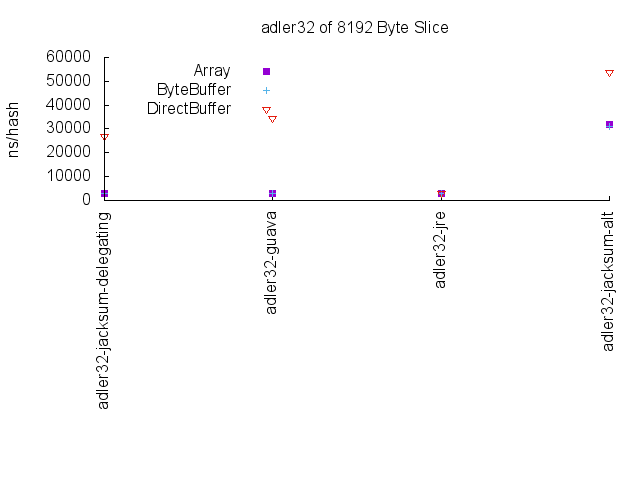

| Algorithm |  Array | ByteBuffer | DirectBuffer |
| --- | ---: | ---: | ---: | 
| [adler32-jacksum-delegating](#adler32-jacksum-delegating-latency) | 2788.771107 | 2764.002179 | 26989.726461 |
| [adler32-guava](#adler32-guava-latency) | 2802.494967 | 2831.640011 | 34237.187180 |
| [adler32-jre](#adler32-jre-latency) | 2819.495248 | 2769.456825 | 2733.499793 |
| [adler32-jacksum-alt](#adler32-jacksum-alt-latency) | 31828.421921 | 31246.518813 | 53850.967207 |

---
### 8192 Byte Slice Latency (city64)
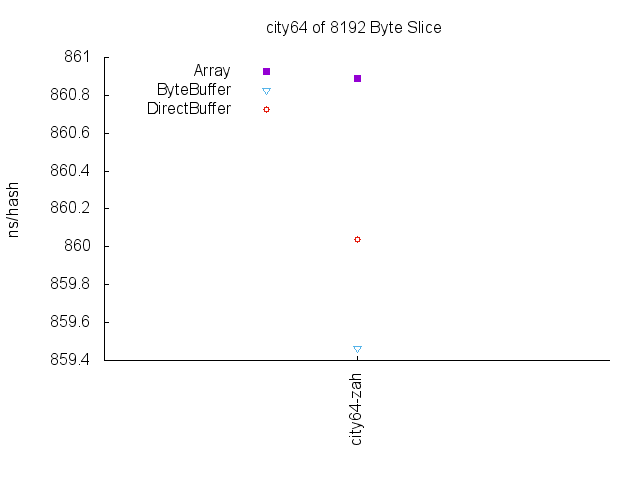

| Algorithm |  Array | ByteBuffer | DirectBuffer |
| --- | ---: | ---: | ---: | 
| [city64-zah](#city64-zah-latency) | 860.886946 | 859.463968 | 860.038829 |

---
### 8192 Byte Slice Latency (cksum)
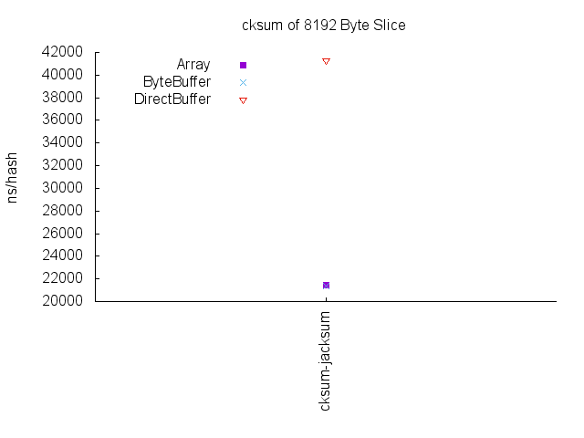

| Algorithm |  Array | ByteBuffer | DirectBuffer |
| --- | ---: | ---: | ---: | 
| [cksum-jacksum](#cksum-jacksum-latency) | 21455.798659 | 21372.225880 | 41283.723545 |

---
### 8192 Byte Slice Latency (crc16)
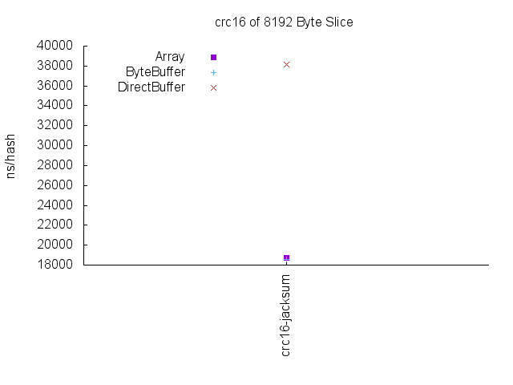

| Algorithm |  Array | ByteBuffer | DirectBuffer |
| --- | ---: | ---: | ---: | 
| [crc16-jacksum](#crc16-jacksum-latency) | 18698.873133 | 18540.861796 | 38123.446230 |

---
### 8192 Byte Slice Latency (crc24)
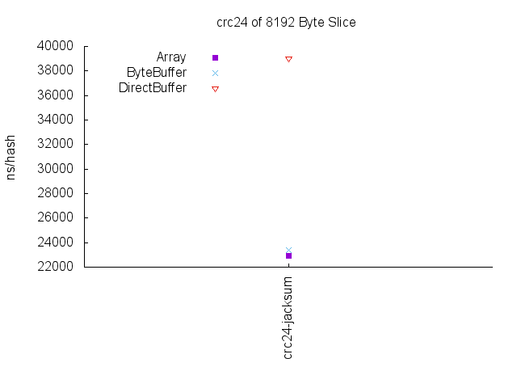

| Algorithm |  Array | ByteBuffer | DirectBuffer |
| --- | ---: | ---: | ---: | 
| [crc24-jacksum](#crc24-jacksum-latency) | 22943.249947 | 23377.722905 | 38979.927978 |

---
### 8192 Byte Slice Latency (crc32)
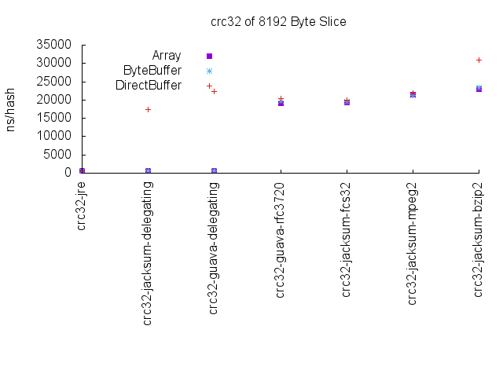

| Algorithm |  Array | ByteBuffer | DirectBuffer |
| --- | ---: | ---: | ---: | 
| [crc32-jre](#crc32-jre-latency) | 638.955548 | 635.586854 | 661.396545 |
| [crc32-jacksum-delegating](#crc32-jacksum-delegating-latency) | 642.405958 | 637.143103 | 17467.241507 |
| [crc32-guava-delegating](#crc32-guava-delegating-latency) | 662.492317 | 658.990262 | 22270.187645 |
| [crc32-guava-rfc3720](#crc32-guava-rfc3720-latency) | 19103.521337 | 19846.067772 | 20357.208079 |
| [crc32-jacksum-fcs32](#crc32-jacksum-fcs32-latency) | 19303.791348 | 19486.121397 | 19884.442216 |
| [crc32-jacksum-mpeg2](#crc32-jacksum-mpeg2-latency) | 21415.723362 | 21318.526762 | 21861.436047 |
| [crc32-jacksum-bzip2](#crc32-jacksum-bzip2-latency) | 22942.682029 | 23341.093996 | 30854.752812 |

---
### 8192 Byte Slice Latency (crc64)

| Algorithm |  Array | ByteBuffer | DirectBuffer |
| --- | ---: | ---: | ---: | 
| [crc64-jacksum](#crc64-jacksum-latency) | 21011.520998 | 20838.739022 | 22754.755526 |

---
### 8192 Byte Slice Latency (crc8)
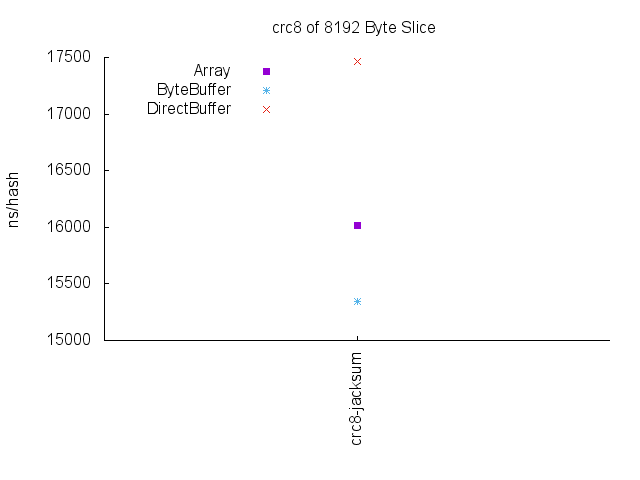

| Algorithm |  Array | ByteBuffer | DirectBuffer |
| --- | ---: | ---: | ---: | 
| [crc8-jacksum](#crc8-jacksum-latency) | 16015.146839 | 15342.934768 | 17465.439896 |

---
### 8192 Byte Slice Latency (ed2k)
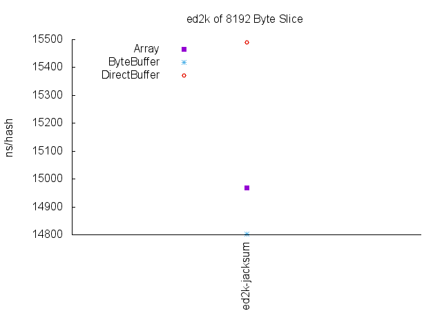

| Algorithm |  Array | ByteBuffer | DirectBuffer |
| --- | ---: | ---: | ---: | 
| [ed2k-jacksum](#ed2k-jacksum-latency) | 14969.359206 | 14803.093551 | 15491.088202 |

---
### 8192 Byte Slice Latency (elf)
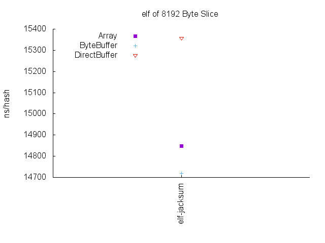

| Algorithm |  Array | ByteBuffer | DirectBuffer |
| --- | ---: | ---: | ---: | 
| [elf-jacksum](#elf-jacksum-latency) | 14848.280673 | 14718.406315 | 15357.624883 |

---
### 8192 Byte Slice Latency (farmna)
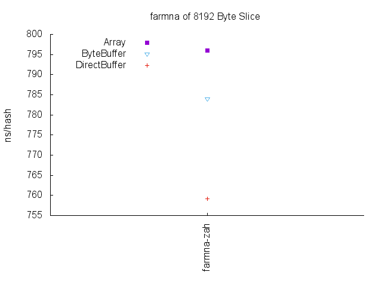

| Algorithm |  Array | ByteBuffer | DirectBuffer |
| --- | ---: | ---: | ---: | 
| [farmna-zah](#farmna-zah-latency) | 795.992037 | 783.890624 | 759.124886 |

---
### 8192 Byte Slice Latency (farmuo)
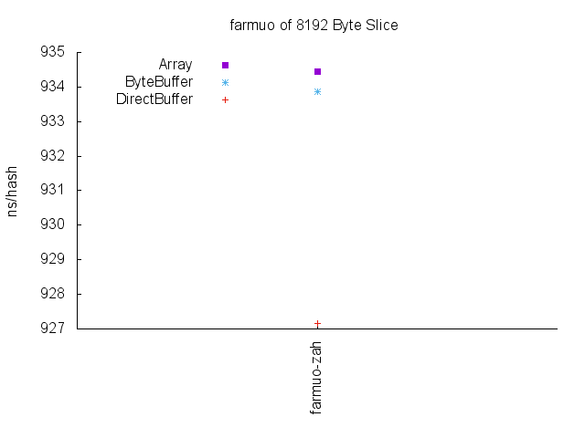

| Algorithm |  Array | ByteBuffer | DirectBuffer |
| --- | ---: | ---: | ---: | 
| [farmuo-zah](#farmuo-zah-latency) | 934.455676 | 933.861325 | 927.154979 |

---
### 8192 Byte Slice Latency (fcs16)
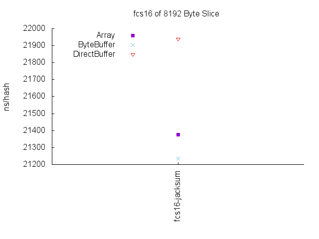

| Algorithm |  Array | ByteBuffer | DirectBuffer |
| --- | ---: | ---: | ---: | 
| [fcs16-jacksum](#fcs16-jacksum-latency) | 21376.777036 | 21233.921417 | 21937.783284 |

---
### 8192 Byte Slice Latency (gfh32)
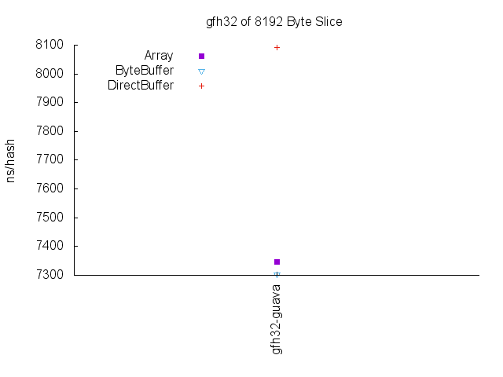

| Algorithm |  Array | ByteBuffer | DirectBuffer |
| --- | ---: | ---: | ---: | 
| [gfh32-guava](#gfh32-guava-latency) | 7345.530959 | 7303.848415 | 8091.697241 |

---
### 8192 Byte Slice Latency (gfh64)
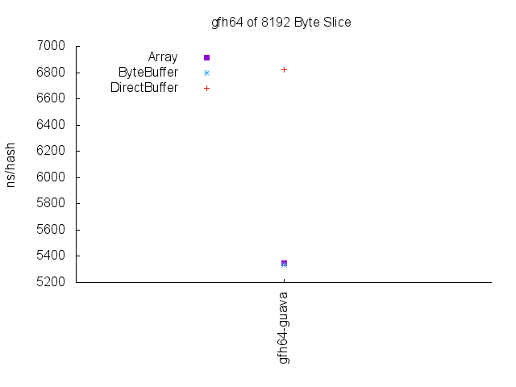

| Algorithm |  Array | ByteBuffer | DirectBuffer |
| --- | ---: | ---: | ---: | 
| [gfh64-guava](#gfh64-guava-latency) | 5345.208230 | 5334.926871 | 6821.571382 |

---
### 8192 Byte Slice Latency (gost)
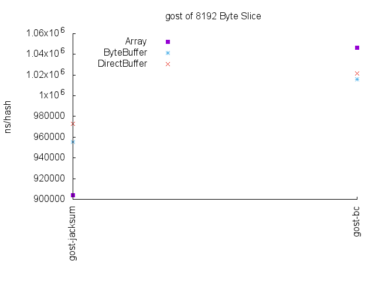

| Algorithm |  Array | ByteBuffer | DirectBuffer |
| --- | ---: | ---: | ---: | 
| [gost-jacksum](#gost-jacksum-latency) | 903675.608805 | 955459.863441 | 972945.281759 |
| [gost-bc](#gost-bc-latency) | 1046205.685594 | 1015767.272863 | 1021761.154786 |

---
### 8192 Byte Slice Latency (has160)
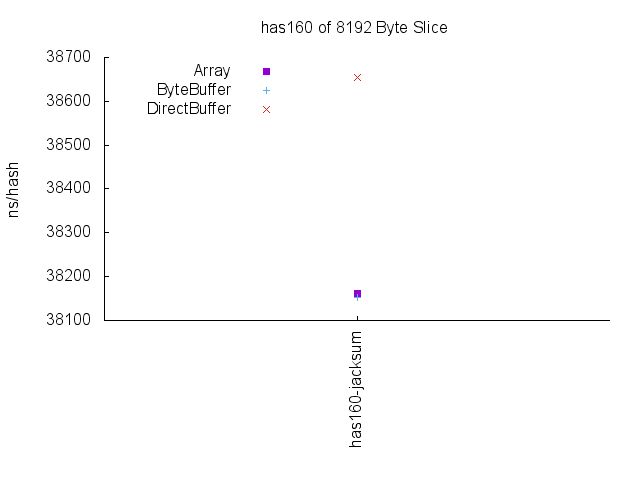

| Algorithm |  Array | ByteBuffer | DirectBuffer |
| --- | ---: | ---: | ---: | 
| [has160-jacksum](#has160-jacksum-latency) | 38162.172636 | 38152.054592 | 38653.345680 |

---
### 8192 Byte Slice Latency (haval128h3)
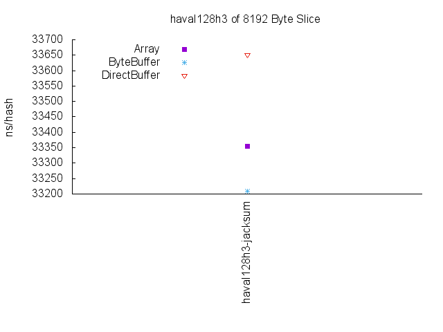

| Algorithm |  Array | ByteBuffer | DirectBuffer |
| --- | ---: | ---: | ---: | 
| [haval128h3-jacksum](#haval128h3-jacksum-latency) | 33353.679323 | 33208.895460 | 33650.419839 |

---
### 8192 Byte Slice Latency (haval128h4)
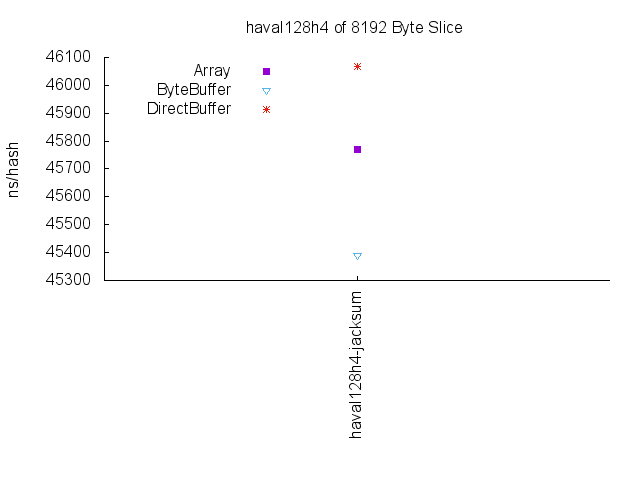

| Algorithm |  Array | ByteBuffer | DirectBuffer |
| --- | ---: | ---: | ---: | 
| [haval128h4-jacksum](#haval128h4-jacksum-latency) | 45768.517721 | 45391.093795 | 46068.409809 |

---
### 8192 Byte Slice Latency (haval128h5)
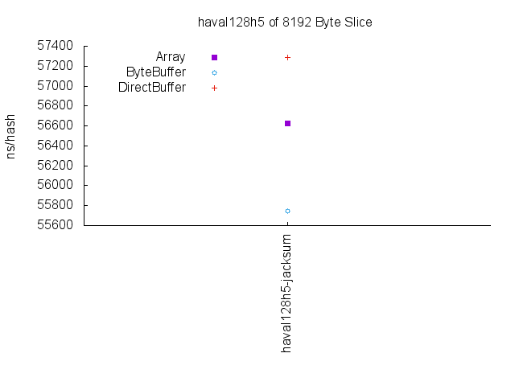

| Algorithm |  Array | ByteBuffer | DirectBuffer |
| --- | ---: | ---: | ---: | 
| [haval128h5-jacksum](#haval128h5-jacksum-latency) | 56625.405828 | 55742.146256 | 57286.017319 |

---
### 8192 Byte Slice Latency (haval160h3)
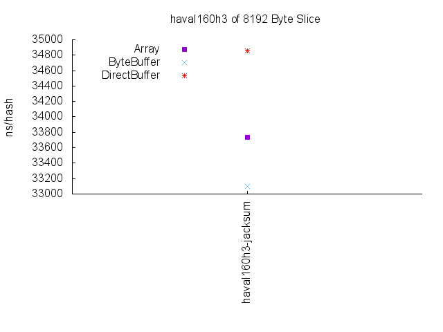

| Algorithm |  Array | ByteBuffer | DirectBuffer |
| --- | ---: | ---: | ---: | 
| [haval160h3-jacksum](#haval160h3-jacksum-latency) | 33739.546691 | 33101.652051 | 34856.844513 |

---
### 8192 Byte Slice Latency (haval160h4)
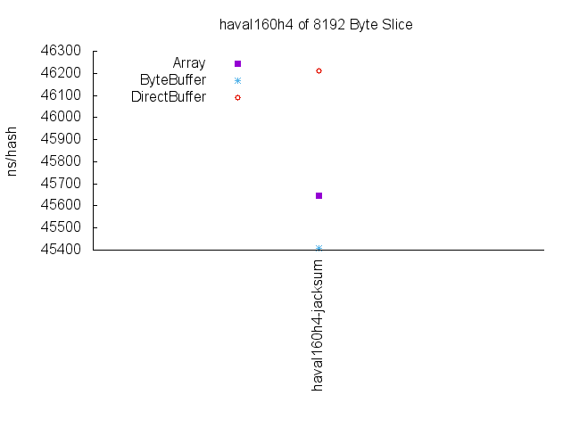

| Algorithm |  Array | ByteBuffer | DirectBuffer |
| --- | ---: | ---: | ---: | 
| [haval160h4-jacksum](#haval160h4-jacksum-latency) | 45646.563850 | 45408.280445 | 46212.714557 |

---
### 8192 Byte Slice Latency (haval160h5)
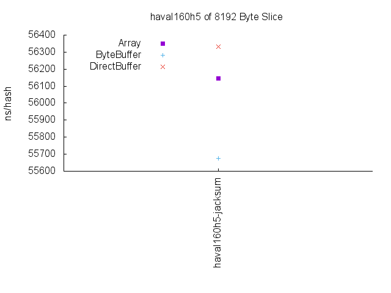

| Algorithm |  Array | ByteBuffer | DirectBuffer |
| --- | ---: | ---: | ---: | 
| [haval160h5-jacksum](#haval160h5-jacksum-latency) | 56144.173215 | 55673.601210 | 56330.878525 |

---
### 8192 Byte Slice Latency (haval192h3)
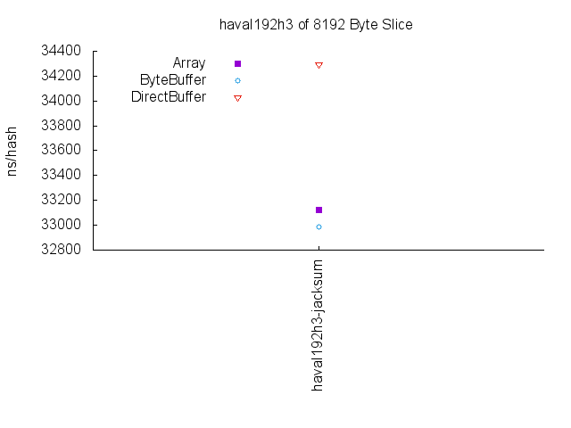

| Algorithm |  Array | ByteBuffer | DirectBuffer |
| --- | ---: | ---: | ---: | 
| [haval192h3-jacksum](#haval192h3-jacksum-latency) | 33120.963077 | 32983.428591 | 34295.477140 |

---
### 8192 Byte Slice Latency (haval192h4)
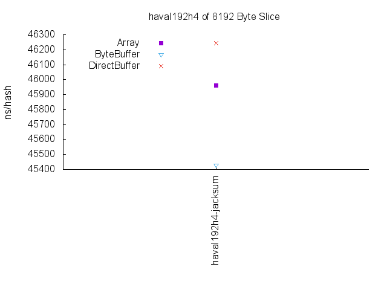

| Algorithm |  Array | ByteBuffer | DirectBuffer |
| --- | ---: | ---: | ---: | 
| [haval192h4-jacksum](#haval192h4-jacksum-latency) | 45959.616249 | 45426.485791 | 46243.609197 |

---
### 8192 Byte Slice Latency (haval192h5)
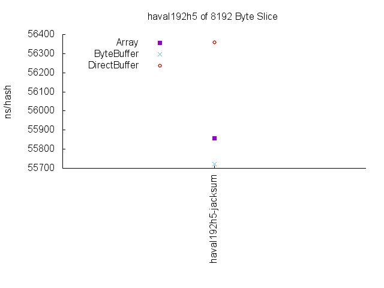

| Algorithm |  Array | ByteBuffer | DirectBuffer |
| --- | ---: | ---: | ---: | 
| [haval192h5-jacksum](#haval192h5-jacksum-latency) | 55858.279091 | 55722.359291 | 56359.523522 |

---
### 8192 Byte Slice Latency (haval224h3)
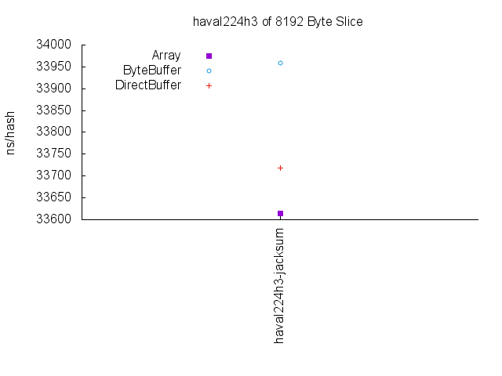

| Algorithm |  Array | ByteBuffer | DirectBuffer |
| --- | ---: | ---: | ---: | 
| [haval224h3-jacksum](#haval224h3-jacksum-latency) | 33614.587480 | 33958.363525 | 33718.838772 |

---
### 8192 Byte Slice Latency (haval224h4)
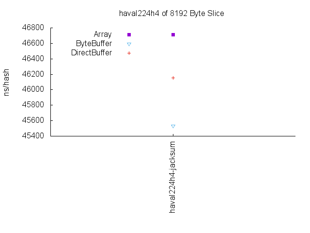

| Algorithm |  Array | ByteBuffer | DirectBuffer |
| --- | ---: | ---: | ---: | 
| [haval224h4-jacksum](#haval224h4-jacksum-latency) | 46713.450475 | 45532.995125 | 46150.498784 |

---
### 8192 Byte Slice Latency (haval224h5)
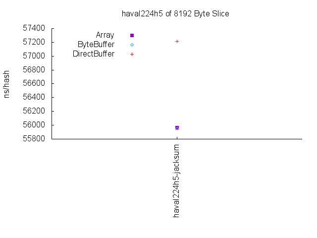

| Algorithm |  Array | ByteBuffer | DirectBuffer |
| --- | ---: | ---: | ---: | 
| [haval224h5-jacksum](#haval224h5-jacksum-latency) | 55962.512030 | 55953.657747 | 57211.821741 |

---
### 8192 Byte Slice Latency (haval256h3)
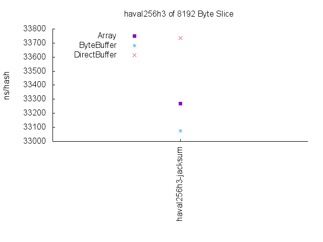

| Algorithm |  Array | ByteBuffer | DirectBuffer |
| --- | ---: | ---: | ---: | 
| [haval256h3-jacksum](#haval256h3-jacksum-latency) | 33269.937077 | 33075.082838 | 33734.368967 |

---
### 8192 Byte Slice Latency (haval256h4)
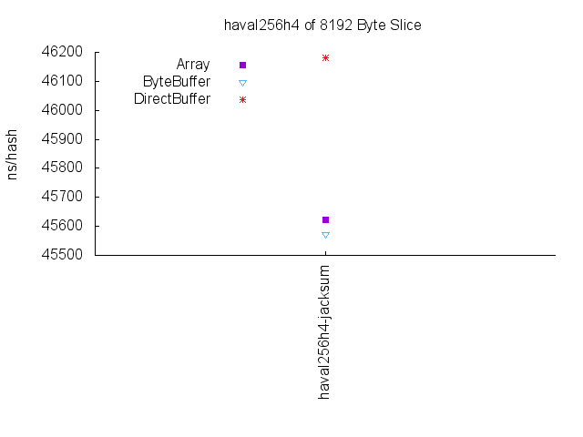

| Algorithm |  Array | ByteBuffer | DirectBuffer |
| --- | ---: | ---: | ---: | 
| [haval256h4-jacksum](#haval256h4-jacksum-latency) | 45622.837256 | 45571.800752 | 46180.101588 |

---
### 8192 Byte Slice Latency (haval256h5)
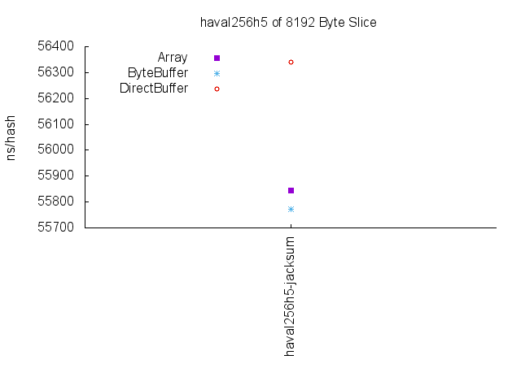

| Algorithm |  Array | ByteBuffer | DirectBuffer |
| --- | ---: | ---: | ---: | 
| [haval256h5-jacksum](#haval256h5-jacksum-latency) | 55843.888748 | 55771.619359 | 56341.088500 |

---
### 8192 Byte Slice Latency (md2)
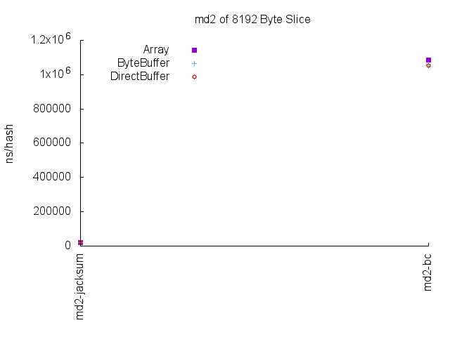

| Algorithm |  Array | ByteBuffer | DirectBuffer |
| --- | ---: | ---: | ---: | 
| [md2-jacksum](#md2-jacksum-latency) | 19860.450554 | 19944.672972 | 25942.371940 |
| [md2-bc](#md2-bc-latency) | 1085655.103444 | 1059375.009155 | 1051935.167915 |

---
### 8192 Byte Slice Latency (md4)
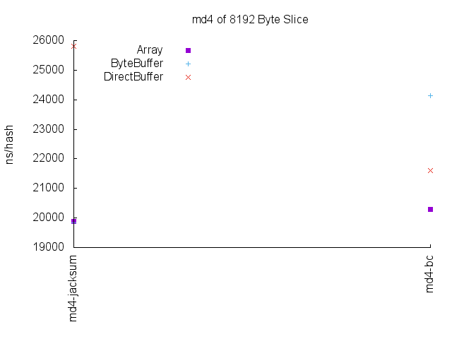

| Algorithm |  Array | ByteBuffer | DirectBuffer |
| --- | ---: | ---: | ---: | 
| [md4-jacksum](#md4-jacksum-latency) | 19885.422565 | 19847.334506 | 25800.416259 |
| [md4-bc](#md4-bc-latency) | 20280.139360 | 24139.027426 | 21605.388257 |

---
### 8192 Byte Slice Latency (md5)
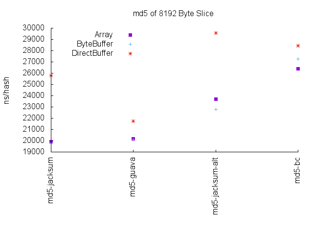

| Algorithm |  Array | ByteBuffer | DirectBuffer |
| --- | ---: | ---: | ---: | 
| [md5-jacksum](#md5-jacksum-latency) | 19901.801878 | 19836.812231 | 25762.034020 |
| [md5-guava](#md5-guava-latency) | 20170.760856 | 20095.568565 | 21738.485174 |
| [md5-jacksum-alt](#md5-jacksum-alt-latency) | 23680.224096 | 22797.237259 | 29564.562811 |
| [md5-bc](#md5-bc-latency) | 26410.270669 | 27269.292311 | 28449.115043 |

---
### 8192 Byte Slice Latency (murmur3h128)

| Algorithm |  Array | ByteBuffer | DirectBuffer |
| --- | ---: | ---: | ---: | 
| [murmur3h128-zah](#murmur3h128-zah-latency) | 1430.890965 | 1425.525588 | 1434.133562 |
| [murmur3h128-guava](#murmur3h128-guava-latency) | 5345.532062 | 5347.381741 | 53643.573610 |

---
### 8192 Byte Slice Latency (murmur3h32)
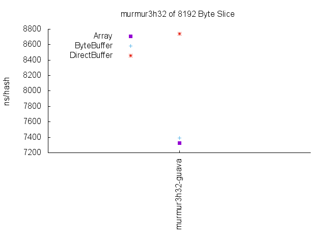

| Algorithm |  Array | ByteBuffer | DirectBuffer |
| --- | ---: | ---: | ---: | 
| [murmur3h32-guava](#murmur3h32-guava-latency) | 7323.295694 | 7390.927811 | 8742.032462 |

---
### 8192 Byte Slice Latency (ripemd128)
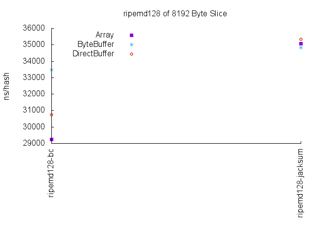

| Algorithm |  Array | ByteBuffer | DirectBuffer |
| --- | ---: | ---: | ---: | 
| [ripemd128-bc](#ripemd128-bc-latency) | 29226.261494 | 33471.131174 | 30749.089845 |
| [ripemd128-jacksum](#ripemd128-jacksum-latency) | 35072.012784 | 34828.609098 | 35344.326372 |

---
### 8192 Byte Slice Latency (ripemd160)
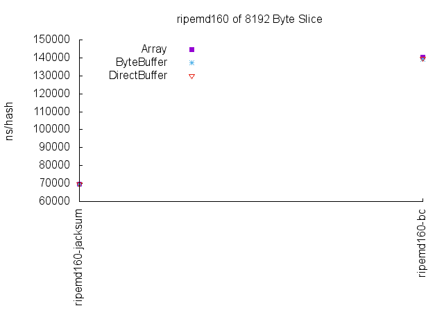

| Algorithm |  Array | ByteBuffer | DirectBuffer |
| --- | ---: | ---: | ---: | 
| [ripemd160-jacksum](#ripemd160-jacksum-latency) | 69730.910297 | 69832.898765 | 69696.609832 |
| [ripemd160-bc](#ripemd160-bc-latency) | 140391.996746 | 139321.462996 | 139388.881832 |

---
### 8192 Byte Slice Latency (ripemd256)
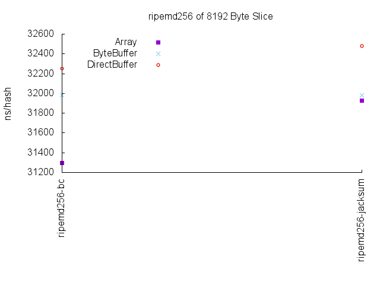

| Algorithm |  Array | ByteBuffer | DirectBuffer |
| --- | ---: | ---: | ---: | 
| [ripemd256-bc](#ripemd256-bc-latency) | 31298.015586 | 31980.863050 | 32249.749038 |
| [ripemd256-jacksum](#ripemd256-jacksum-latency) | 31928.906391 | 31980.963135 | 32477.297104 |

---
### 8192 Byte Slice Latency (ripemd320)
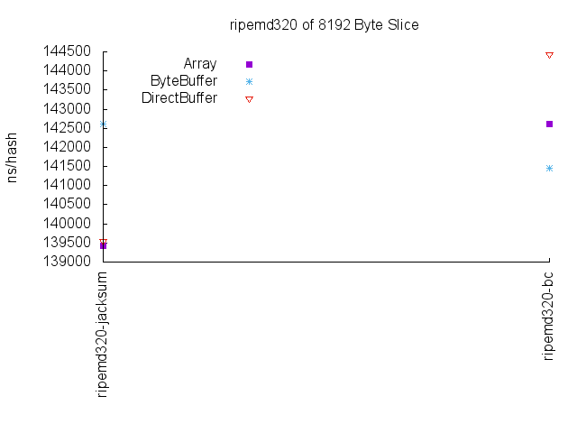

| Algorithm |  Array | ByteBuffer | DirectBuffer |
| --- | ---: | ---: | ---: | 
| [ripemd320-jacksum](#ripemd320-jacksum-latency) | 139435.335945 | 142623.093703 | 139552.001707 |
| [ripemd320-bc](#ripemd320-bc-latency) | 142610.899221 | 141457.465405 | 144427.884253 |

---
### 8192 Byte Slice Latency (sha0)
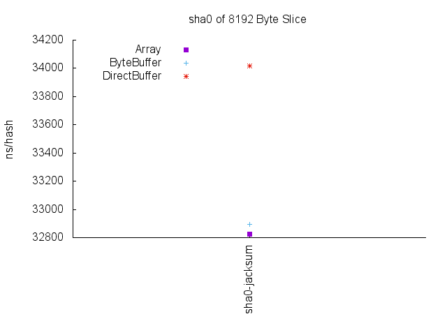

| Algorithm |  Array | ByteBuffer | DirectBuffer |
| --- | ---: | ---: | ---: | 
| [sha0-jacksum](#sha0-jacksum-latency) | 32825.964882 | 32895.187260 | 34018.770309 |

---
### 8192 Byte Slice Latency (sha1)
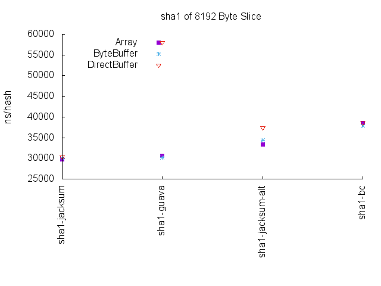

| Algorithm |  Array | ByteBuffer | DirectBuffer |
| --- | ---: | ---: | ---: | 
| [sha1-jacksum](#sha1-jacksum-latency) | 29740.754509 | 30098.181637 | 30269.592203 |
| [sha1-guava](#sha1-guava-latency) | 30686.098909 | 30145.139168 | 58016.921762 |
| [sha1-jacksum-alt](#sha1-jacksum-alt-latency) | 33360.807216 | 34302.017259 | 37346.187434 |
| [sha1-bc](#sha1-bc-latency) | 38535.731198 | 37812.185848 | 38575.028369 |

---
### 8192 Byte Slice Latency (sha224)
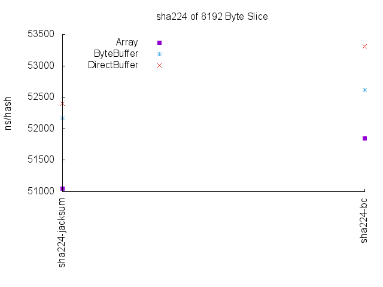

| Algorithm |  Array | ByteBuffer | DirectBuffer |
| --- | ---: | ---: | ---: | 
| [sha224-jacksum](#sha224-jacksum-latency) | 51046.037351 | 52166.954611 | 52395.803979 |
| [sha224-bc](#sha224-bc-latency) | 51843.095595 | 52613.014967 | 53305.697492 |

---
### 8192 Byte Slice Latency (sha256)
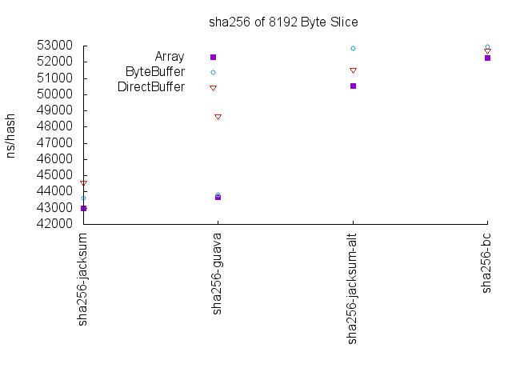

| Algorithm |  Array | ByteBuffer | DirectBuffer |
| --- | ---: | ---: | ---: | 
| [sha256-jacksum](#sha256-jacksum-latency) | 42995.312284 | 43652.235409 | 44580.826753 |
| [sha256-guava](#sha256-guava-latency) | 43685.798835 | 43842.141200 | 48668.967825 |
| [sha256-jacksum-alt](#sha256-jacksum-alt-latency) | 50521.405892 | 52850.559541 | 51499.082615 |
| [sha256-bc](#sha256-bc-latency) | 52250.816880 | 52967.754396 | 52688.486046 |

---
### 8192 Byte Slice Latency (sha3)
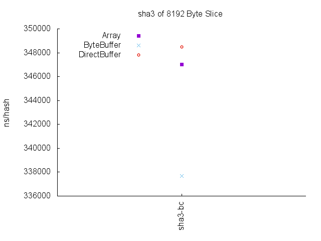

| Algorithm |  Array | ByteBuffer | DirectBuffer |
| --- | ---: | ---: | ---: | 
| [sha3-bc](#sha3-bc-latency) | 347014.365807 | 337700.300019 | 348480.211668 |

---
### 8192 Byte Slice Latency (sha384)
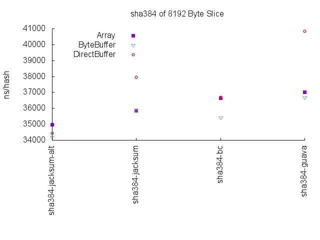

| Algorithm |  Array | ByteBuffer | DirectBuffer |
| --- | ---: | ---: | ---: | 
| [sha384-jacksum-alt](#sha384-jacksum-alt-latency) | 34962.053427 | 34173.477374 | 34433.623331 |
| [sha384-jacksum](#sha384-jacksum-latency) | 35844.861253 | 35865.906618 | 37967.350600 |
| [sha384-bc](#sha384-bc-latency) | 36634.383919 | 35413.091106 | 36696.307325 |
| [sha384-guava](#sha384-guava-latency) | 37000.231741 | 36664.559453 | 40845.626029 |

---
### 8192 Byte Slice Latency (sha512)
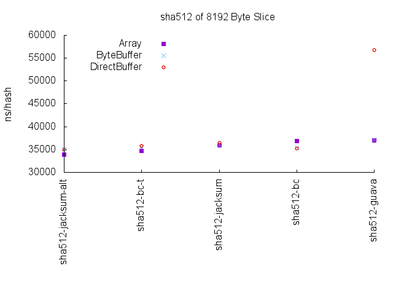

| Algorithm |  Array | ByteBuffer | DirectBuffer |
| --- | ---: | ---: | ---: | 
| [sha512-jacksum-alt](#sha512-jacksum-alt-latency) | 33849.148397 | 35077.046057 | 35017.880029 |
| [sha512-bc-t](#sha512-bc-t-latency) | 34669.540498 | 35582.368678 | 35812.495896 |
| [sha512-jacksum](#sha512-jacksum-latency) | 35967.553468 | 35902.320841 | 36430.252683 |
| [sha512-bc](#sha512-bc-latency) | 36803.652025 | 35317.556233 | 35211.700239 |
| [sha512-guava](#sha512-guava-latency) | 37037.873280 | 37146.638504 | 56775.972463 |

---
### 8192 Byte Slice Latency (sip)

| Algorithm |  Array | ByteBuffer | DirectBuffer |
| --- | ---: | ---: | ---: | 
| [sip-guava](#sip-guava-latency) | 11365.238786 | 10551.005943 | 44193.787464 |
| [sip-inline](#sip-inline-latency) | 16300.643989 | 8521.803246 | 8257.608331 |
| [sip-fwdeng](#sip-fwdeng-latency) | 25949.665401 | 21173.233935 | 20366.374503 |

---
### 8192 Byte Slice Latency (skein1024)
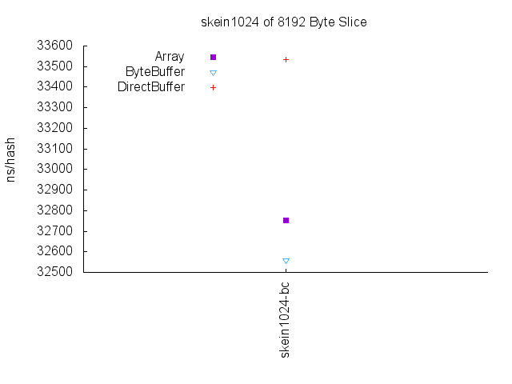

| Algorithm |  Array | ByteBuffer | DirectBuffer |
| --- | ---: | ---: | ---: | 
| [skein1024-bc](#skein1024-bc-latency) | 32754.451847 | 32557.124023 | 33533.390034 |

---
### 8192 Byte Slice Latency (skein256)
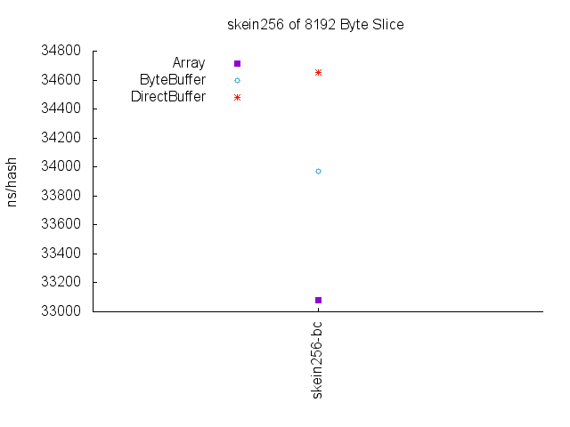

| Algorithm |  Array | ByteBuffer | DirectBuffer |
| --- | ---: | ---: | ---: | 
| [skein256-bc](#skein256-bc-latency) | 33079.203595 | 33972.342683 | 34655.306142 |

---
### 8192 Byte Slice Latency (skein512)
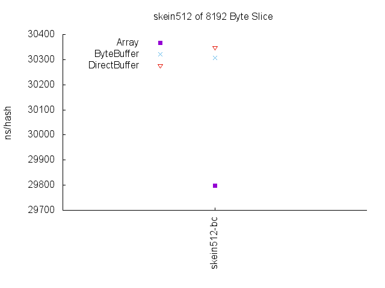

| Algorithm |  Array | ByteBuffer | DirectBuffer |
| --- | ---: | ---: | ---: | 
| [skein512-bc](#skein512-bc-latency) | 29797.873127 | 30305.968867 | 30348.411383 |

---
### 8192 Byte Slice Latency (sm3)

| Algorithm |  Array | ByteBuffer | DirectBuffer |
| --- | ---: | ---: | ---: | 
| [sm3-bc](#sm3-bc-latency) | 50161.349550 | 49742.145928 | 51904.751473 |

---
### 8192 Byte Slice Latency (sum16)
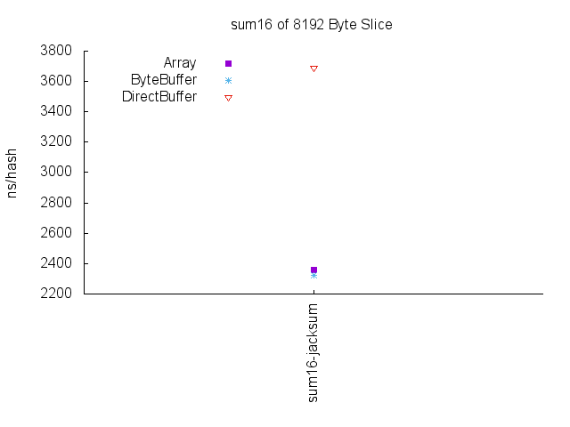

| Algorithm |  Array | ByteBuffer | DirectBuffer |
| --- | ---: | ---: | ---: | 
| [sum16-jacksum](#sum16-jacksum-latency) | 2359.778585 | 2325.712895 | 3686.800183 |

---
### 8192 Byte Slice Latency (sum24)
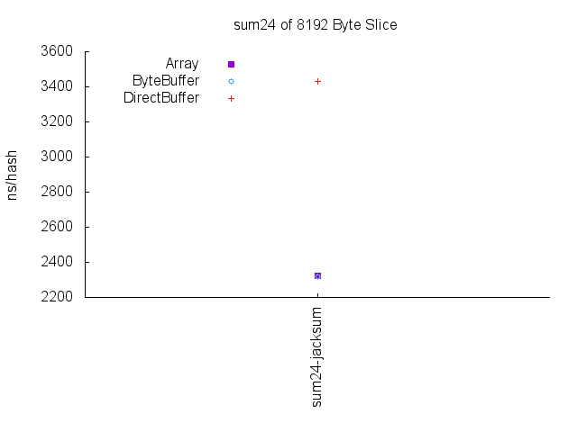

| Algorithm |  Array | ByteBuffer | DirectBuffer |
| --- | ---: | ---: | ---: | 
| [sum24-jacksum](#sum24-jacksum-latency) | 2324.720148 | 2318.338429 | 3432.730423 |

---
### 8192 Byte Slice Latency (sum32)
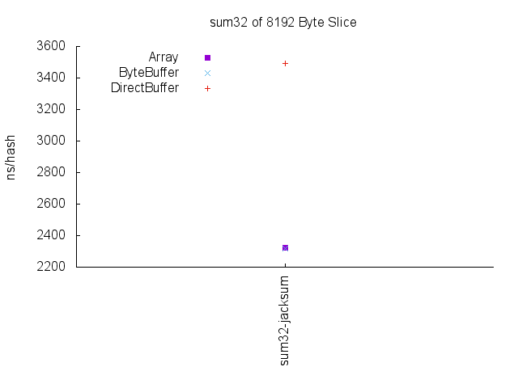

| Algorithm |  Array | ByteBuffer | DirectBuffer |
| --- | ---: | ---: | ---: | 
| [sum32-jacksum](#sum32-jacksum-latency) | 2322.682121 | 2319.420643 | 3490.066103 |

---
### 8192 Byte Slice Latency (sum8)
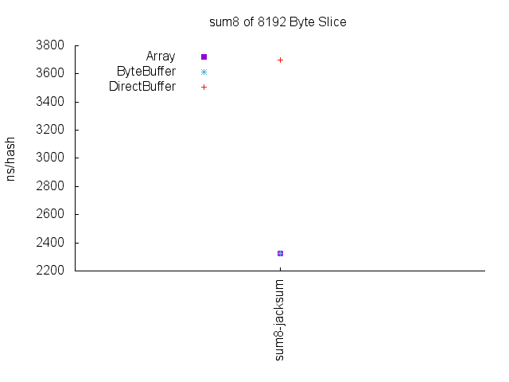

| Algorithm |  Array | ByteBuffer | DirectBuffer |
| --- | ---: | ---: | ---: | 
| [sum8-jacksum](#sum8-jacksum-latency) | 2323.392908 | 2324.334352 | 3696.620139 |

---
### 8192 Byte Slice Latency (sumbsd)
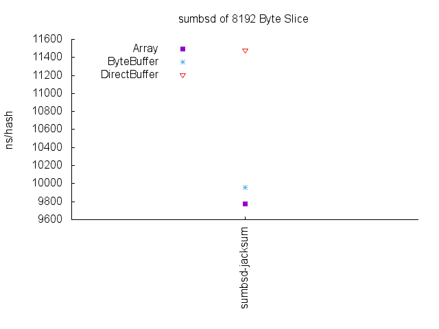

| Algorithm |  Array | ByteBuffer | DirectBuffer |
| --- | ---: | ---: | ---: | 
| [sumbsd-jacksum](#sumbsd-jacksum-latency) | 9774.072565 | 9957.169556 | 11479.408269 |

---
### 8192 Byte Slice Latency (sumsysv)
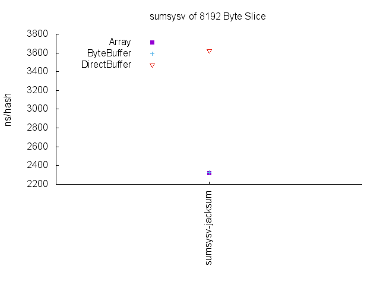

| Algorithm |  Array | ByteBuffer | DirectBuffer |
| --- | ---: | ---: | ---: | 
| [sumsysv-jacksum](#sumsysv-jacksum-latency) | 2322.346490 | 2323.752421 | 3625.240129 |

---
### 8192 Byte Slice Latency (tiger)
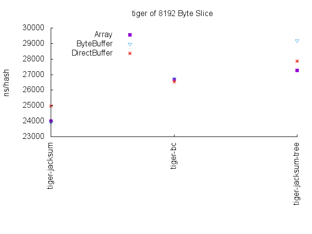

| Algorithm |  Array | ByteBuffer | DirectBuffer |
| --- | ---: | ---: | ---: | 
| [tiger-jacksum](#tiger-jacksum-latency) | 24018.114701 | 23908.989200 | 24979.949576 |
| [tiger-bc](#tiger-bc-latency) | 26702.532819 | 26736.182014 | 26536.447706 |
| [tiger-jacksum-tree](#tiger-jacksum-tree-latency) | 27272.440133 | 29181.218523 | 27879.572168 |

---
### 8192 Byte Slice Latency (tiger128)
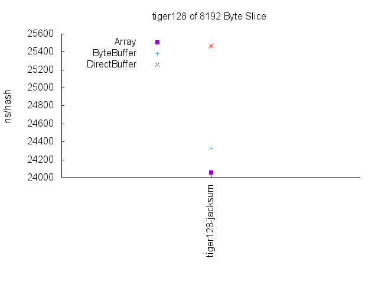

| Algorithm |  Array | ByteBuffer | DirectBuffer |
| --- | ---: | ---: | ---: | 
| [tiger128-jacksum](#tiger128-jacksum-latency) | 24058.916748 | 24332.436644 | 25467.074684 |

---
### 8192 Byte Slice Latency (tiger160)
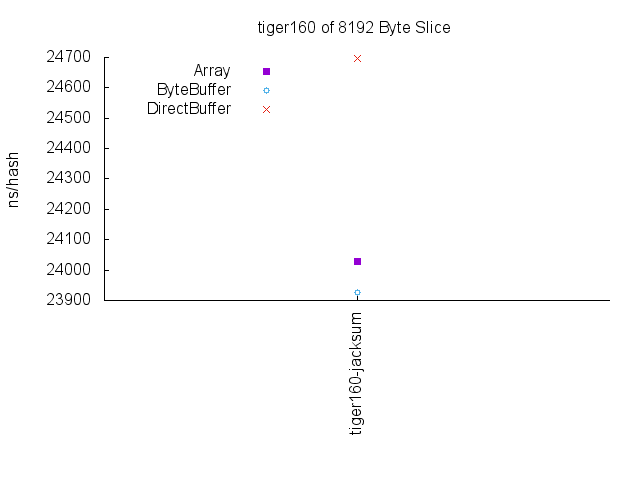

| Algorithm |  Array | ByteBuffer | DirectBuffer |
| --- | ---: | ---: | ---: | 
| [tiger160-jacksum](#tiger160-jacksum-latency) | 24028.757783 | 23927.316677 | 24695.462103 |

---
### 8192 Byte Slice Latency (tiger2)
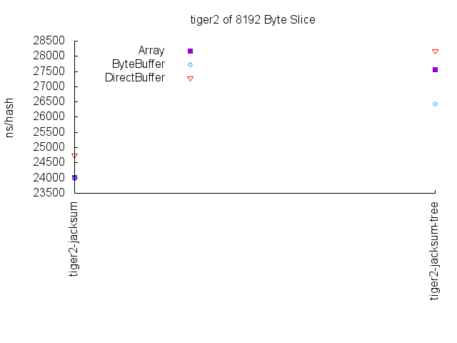

| Algorithm |  Array | ByteBuffer | DirectBuffer |
| --- | ---: | ---: | ---: | 
| [tiger2-jacksum](#tiger2-jacksum-latency) | 24018.987258 | 23967.307515 | 24735.881030 |
| [tiger2-jacksum-tree](#tiger2-jacksum-tree-latency) | 27559.126274 | 26423.553452 | 28177.867059 |

---
### 8192 Byte Slice Latency (whirlpool0)

| Algorithm |  Array | ByteBuffer | DirectBuffer |
| --- | ---: | ---: | ---: | 
| [whirlpool0-jacksum](#whirlpool0-jacksum-latency) | 119422.871660 | 118922.842952 | 122404.539628 |

---
### 8192 Byte Slice Latency (whirlpool1)
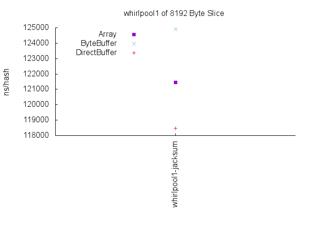

| Algorithm |  Array | ByteBuffer | DirectBuffer |
| --- | ---: | ---: | ---: | 
| [whirlpool1-jacksum](#whirlpool1-jacksum-latency) | 121465.681011 | 124906.731337 | 118464.335015 |

---
### 8192 Byte Slice Latency (whirlpool2)
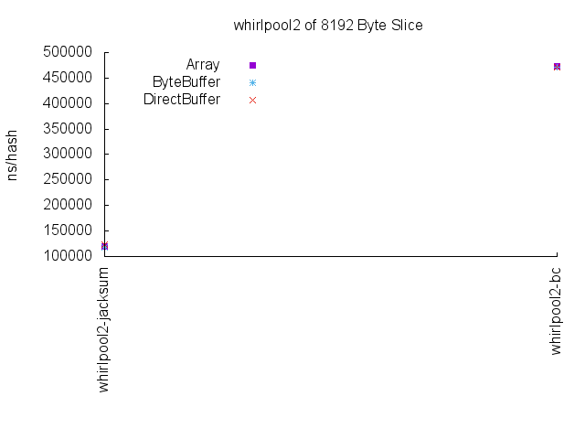

| Algorithm |  Array | ByteBuffer | DirectBuffer |
| --- | ---: | ---: | ---: | 
| [whirlpool2-jacksum](#whirlpool2-jacksum-latency) | 120421.342602 | 118030.458630 | 123694.251640 |
| [whirlpool2-bc](#whirlpool2-bc-latency) | 472257.641617 | 471353.302467 | 470796.484675 |

---
### 8192 Byte Slice Latency (xor8)
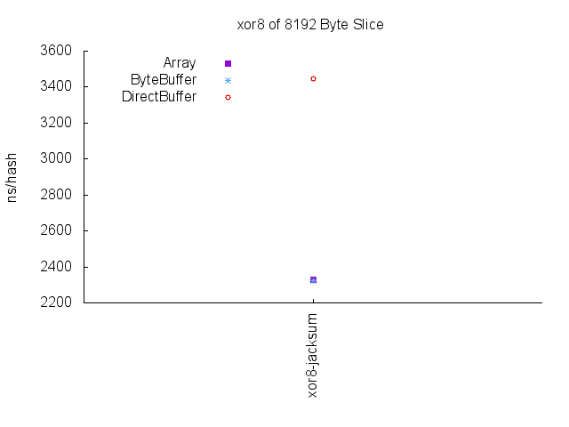

| Algorithm |  Array | ByteBuffer | DirectBuffer |
| --- | ---: | ---: | ---: | 
| [xor8-jacksum](#xor8-jacksum-latency) | 2329.465925 | 2323.069861 | 3446.123846 |

---
### 8192 Byte Slice Latency (xxh32)
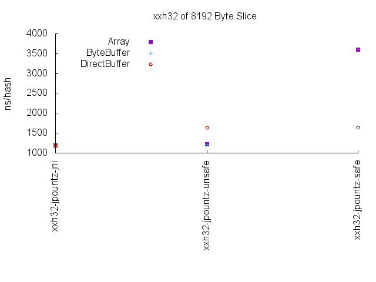

| Algorithm |  Array | ByteBuffer | DirectBuffer |
| --- | ---: | ---: | ---: | 
| [xxh32-jpountz-jni](#xxh32-jpountz-jni-latency) | 1199.375262 | 1198.421896 | 1178.251301 |
| [xxh32-jpountz-unsafe](#xxh32-jpountz-unsafe-latency) | 1223.092118 | 1211.400110 | 1631.977210 |
| [xxh32-jpountz-safe](#xxh32-jpountz-safe-latency) | 3606.938807 | 3610.090258 | 1639.083841 |

---
### 8192 Byte Slice Latency (xxh64)
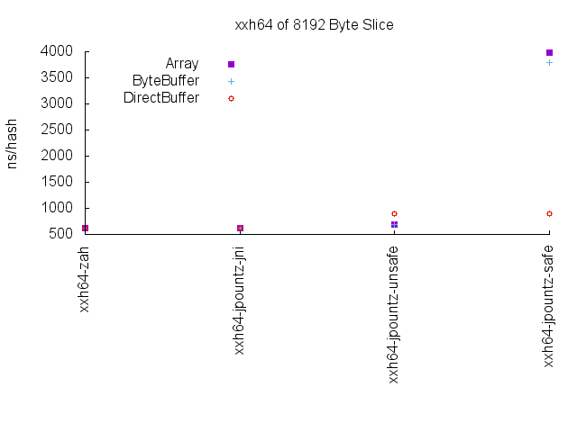

| Algorithm |  Array | ByteBuffer | DirectBuffer |
| --- | ---: | ---: | ---: | 
| [xxh64-zah](#xxh64-zah-latency) | 618.209537 | 615.081332 | 613.045931 |
| [xxh64-jpountz-jni](#xxh64-jpountz-jni-latency) | 624.341976 | 623.291145 | 612.861126 |
| [xxh64-jpountz-unsafe](#xxh64-jpountz-unsafe-latency) | 692.818664 | 689.087359 | 892.120220 |
| [xxh64-jpountz-safe](#xxh64-jpountz-safe-latency) | 3975.148316 | 3795.907087 | 894.131827 |

---
### 16384 Byte Slice Latency (All Hashes)
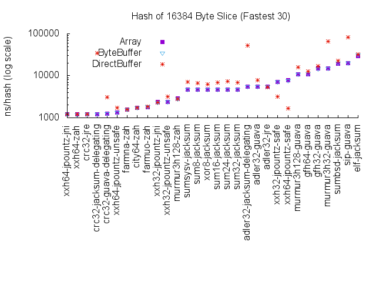

| Algorithm |  Array | ByteBuffer | DirectBuffer |
| --- | ---: | ---: | ---: | 
| [xxh64-jpountz-jni](#xxh64-jpountz-jni-latency) | 1203.596327 | 1218.843584 | 1210.028649 |
| [xxh64-zah](#xxh64-zah-latency) | 1206.748336 | 1177.365452 | 1208.667697 |
| [crc32-jre](#crc32-jre-latency) | 1222.502092 | 1210.520056 | 1205.040864 |
| [crc32-jacksum-delegating](#crc32-jacksum-delegating-latency) | 1224.562609 | 1214.351090 | 34635.351145 |
| [crc32-guava-delegating](#crc32-guava-delegating-latency) | 1241.593723 | 1257.116364 | 3114.432764 |
| [xxh64-jpountz-unsafe](#xxh64-jpountz-unsafe-latency) | 1337.092671 | 1332.856703 | 1709.380057 |
| [farmna-zah](#farmna-zah-latency) | 1568.139924 | 1559.947880 | 1552.309521 |
| [city64-zah](#city64-zah-latency) | 1709.654117 | 1750.093846 | 1704.830213 |
| [farmuo-zah](#farmuo-zah-latency) | 1803.515153 | 1835.194601 | 1846.520705 |
| [xxh32-jpountz-jni](#xxh32-jpountz-jni-latency) | 2350.938172 | 2347.614663 | 2322.398964 |
| [xxh32-jpountz-unsafe](#xxh32-jpountz-unsafe-latency) | 2400.382422 | 2388.374511 | 3220.284687 |
| [murmur3h128-zah](#murmur3h128-zah-latency) | 2859.128203 | 2842.473274 | 2818.161475 |
| [sumsysv-jacksum](#sumsysv-jacksum-latency) | 4629.148761 | 4625.610213 | 7091.295672 |
| [sum8-jacksum](#sum8-jacksum-latency) | 4633.131228 | 4628.556172 | 6621.442152 |
| [xor8-jacksum](#xor8-jacksum-latency) | 4637.908998 | 4636.623755 | 6285.643003 |
| [sum16-jacksum](#sum16-jacksum-latency) | 4639.311324 | 4634.697329 | 6935.825969 |
| [sum24-jacksum](#sum24-jacksum-latency) | 4646.731304 | 4634.187458 | 7315.330059 |
| [sum32-jacksum](#sum32-jacksum-latency) | 4698.723981 | 4705.261964 | 6911.479251 |
| [adler32-jacksum-delegating](#adler32-jacksum-delegating-latency) | 5527.765340 | 5484.644571 | 52583.252726 |
| [adler32-guava](#adler32-guava-latency) | 5530.095518 | 5514.293339 | 7832.531158 |
| [adler32-jre](#adler32-jre-latency) | 5555.594460 | 5565.436909 | 5417.836004 |
| [xxh32-jpountz-safe](#xxh32-jpountz-safe-latency) | 7226.416016 | 7210.180897 | 3224.183894 |
| [xxh64-jpountz-safe](#xxh64-jpountz-safe-latency) | 7867.994508 | 7590.585372 | 1668.733749 |
| [murmur3h128-guava](#murmur3h128-guava-latency) | 10952.260747 | 10910.997070 | 16177.915834 |
| [gfh64-guava](#gfh64-guava-latency) | 10955.340193 | 11170.593700 | 12775.529100 |
| [gfh32-guava](#gfh32-guava-latency) | 14760.544253 | 14681.549827 | 16962.688598 |
| [murmur3h32-guava](#murmur3h32-guava-latency) | 14808.528188 | 14727.474452 | 64771.011363 |
| [sumbsd-jacksum](#sumbsd-jacksum-latency) | 19536.592143 | 19934.656943 | 22631.432829 |
| [sip-guava](#sip-guava-latency) | 20220.444869 | 20114.294012 | 81818.630267 |
| [elf-jacksum](#elf-jacksum-latency) | 29234.739349 | 30894.363299 | 32596.572334 |
| [ed2k-jacksum](#ed2k-jacksum-latency) | 29703.955056 | 29562.499659 | 31093.456052 |
| [crc8-jacksum](#crc8-jacksum-latency) | 31995.527288 | 29661.475423 | 33807.808324 |
| [sip-inline](#sip-inline-latency) | 36250.824730 | 16729.224813 | 16281.325294 |
| [crc32-guava-rfc3720](#crc32-guava-rfc3720-latency) | 38238.104384 | 39570.531379 | 39497.124419 |
| [crc16-jacksum](#crc16-jacksum-latency) | 38510.862727 | 37082.227851 | 78628.607315 |
| [crc32-jacksum-fcs32](#crc32-jacksum-fcs32-latency) | 38792.930265 | 38513.886010 | 40914.383093 |
| [md4-jacksum](#md4-jacksum-latency) | 39738.004686 | 39611.893477 | 53193.587194 |
| [md5-jacksum](#md5-jacksum-latency) | 39787.534131 | 39717.522850 | 52249.683485 |
| [md2-jacksum](#md2-jacksum-latency) | 39800.331233 | 39620.958089 | 42304.848200 |
| [md5-guava](#md5-guava-latency) | 40177.227759 | 39919.451897 | 42015.016280 |
| [md4-bc](#md4-bc-latency) | 40300.773676 | 42238.325197 | 44304.496432 |
| [crc64-jacksum](#crc64-jacksum-latency) | 41942.289100 | 41805.198314 | 44240.614135 |
| [fcs16-jacksum](#fcs16-jacksum-latency) | 42793.110846 | 42556.250862 | 44082.116297 |
| [crc32-jacksum-mpeg2](#crc32-jacksum-mpeg2-latency) | 42847.220138 | 42538.101968 | 43661.590893 |
| [cksum-jacksum](#cksum-jacksum-latency) | 42883.466114 | 42671.014761 | 79007.979410 |
| [md5-jacksum-alt](#md5-jacksum-alt-latency) | 45801.255484 | 46396.740189 | 60127.022607 |
| [crc32-jacksum-bzip2](#crc32-jacksum-bzip2-latency) | 45869.446347 | 46694.873370 | 49162.735570 |
| [crc24-jacksum](#crc24-jacksum-latency) | 45964.511309 | 46733.162455 | 61030.205325 |
| [tiger2-jacksum](#tiger2-jacksum-latency) | 47984.971323 | 47928.983316 | 51990.147155 |
| [tiger-jacksum](#tiger-jacksum-latency) | 47995.738629 | 47856.671813 | 50171.292652 |
| [tiger160-jacksum](#tiger160-jacksum-latency) | 48094.375085 | 48593.017087 | 50959.048366 |
| [tiger128-jacksum](#tiger128-jacksum-latency) | 48722.037265 | 47910.894090 | 49398.387716 |
| [tiger-bc](#tiger-bc-latency) | 50414.894820 | 52461.652578 | 51390.710594 |
| [sip-fwdeng](#sip-fwdeng-latency) | 52178.166144 | 40900.958991 | 39236.927143 |
| [md5-bc](#md5-bc-latency) | 53397.946419 | 54262.563729 | 54885.003597 |
| [tiger-jacksum-tree](#tiger-jacksum-tree-latency) | 54602.297111 | 58367.366107 | 54100.236925 |
| [tiger2-jacksum-tree](#tiger2-jacksum-tree-latency) | 55125.911059 | 52797.795698 | 54356.500292 |
| [ripemd128-bc](#ripemd128-bc-latency) | 58104.167764 | 65905.546492 | 60348.808159 |
| [sha1-jacksum](#sha1-jacksum-latency) | 59635.722546 | 59696.828544 | 61321.940064 |
| [sha1-guava](#sha1-guava-latency) | 60067.840324 | 59639.511756 | 65566.463973 |
| [skein512-bc](#skein512-bc-latency) | 60073.916322 | 59031.159258 | 64088.728223 |
| [ripemd256-bc](#ripemd256-bc-latency) | 62567.286565 | 63477.669102 | 67553.612175 |
| [adler32-jacksum-alt](#adler32-jacksum-alt-latency) | 62629.808821 | 62549.918981 | 105606.626391 |
| [ripemd256-jacksum](#ripemd256-jacksum-latency) | 63447.192734 | 64949.777523 | 64629.834207 |
| [skein1024-bc](#skein1024-bc-latency) | 65296.829907 | 63559.781288 | 64575.703261 |
| [sha0-jacksum](#sha0-jacksum-latency) | 65493.169448 | 65629.988150 | 68876.353010 |
| [haval128h3-jacksum](#haval128h3-jacksum-latency) | 66475.913683 | 66329.470829 | 68803.302701 |
| [haval256h3-jacksum](#haval256h3-jacksum-latency) | 66489.864150 | 65777.762241 | 67556.405546 |
| [haval160h3-jacksum](#haval160h3-jacksum-latency) | 66492.563693 | 65953.236915 | 67325.538992 |
| [sha1-jacksum-alt](#sha1-jacksum-alt-latency) | 66567.099344 | 67289.935973 | 70895.156319 |
| [haval192h3-jacksum](#haval192h3-jacksum-latency) | 66708.182133 | 65914.772410 | 67415.691429 |
| [haval224h3-jacksum](#haval224h3-jacksum-latency) | 67015.915006 | 66661.826295 | 68411.977301 |
| [skein256-bc](#skein256-bc-latency) | 67111.071396 | 66650.819344 | 66388.471423 |
| [sha384-jacksum-alt](#sha384-jacksum-alt-latency) | 68349.357335 | 69501.937657 | 69772.060352 |
| [sha384-bc](#sha384-bc-latency) | 69380.219851 | 70319.684660 | 70233.368061 |
| [sha512-jacksum-alt](#sha512-jacksum-alt-latency) | 69792.305477 | 67702.110790 | 69048.911742 |
| [sha512-bc-t](#sha512-bc-t-latency) | 69949.745272 | 68396.147793 | 69849.297915 |
| [ripemd128-jacksum](#ripemd128-jacksum-latency) | 69996.546984 | 69575.508009 | 73551.987222 |
| [sha512-jacksum](#sha512-jacksum-latency) | 71730.357050 | 71944.592802 | 72849.337913 |
| [sha384-jacksum](#sha384-jacksum-latency) | 71788.375512 | 71803.311694 | 75301.461220 |
| [sha512-bc](#sha512-bc-latency) | 72012.780100 | 70057.785051 | 69908.467178 |
| [sha384-guava](#sha384-guava-latency) | 73030.405360 | 73559.814944 | 103295.856337 |
| [sha512-guava](#sha512-guava-latency) | 74241.381504 | 73605.542618 | 139609.311497 |
| [sha1-bc](#sha1-bc-latency) | 74774.648387 | 75043.397056 | 77071.419834 |
| [has160-jacksum](#has160-jacksum-latency) | 77761.184427 | 76042.570488 | 78815.243847 |
| [sha256-jacksum](#sha256-jacksum-latency) | 85879.694780 | 85736.410174 | 86816.851983 |
| [sha256-guava](#sha256-guava-latency) | 86734.716477 | 86374.056436 | 94501.230403 |
| [haval256h4-jacksum](#haval256h4-jacksum-latency) | 91233.718186 | 90916.582881 | 93848.527802 |
| [haval192h4-jacksum](#haval192h4-jacksum-latency) | 91383.841784 | 91049.783011 | 93084.105639 |
| [haval128h4-jacksum](#haval128h4-jacksum-latency) | 91439.007998 | 90945.430613 | 95390.527438 |
| [haval224h4-jacksum](#haval224h4-jacksum-latency) | 91442.580037 | 90638.494148 | 93808.415952 |
| [haval160h4-jacksum](#haval160h4-jacksum-latency) | 91480.767120 | 91117.803085 | 95409.184444 |
| [sm3-bc](#sm3-bc-latency) | 99269.276474 | 99673.778328 | 101198.818916 |
| [sha256-jacksum-alt](#sha256-jacksum-alt-latency) | 101014.222430 | 103814.377775 | 101262.861032 |
| [sha224-jacksum](#sha224-jacksum-latency) | 101531.689135 | 103857.633692 | 101417.903280 |
| [sha256-bc](#sha256-bc-latency) | 104267.939839 | 104111.680889 | 104938.448097 |
| [sha224-bc](#sha224-bc-latency) | 105600.114933 | 104766.276314 | 105557.123210 |
| [haval224h5-jacksum](#haval224h5-jacksum-latency) | 111712.452459 | 111317.966405 | 112967.318143 |
| [haval128h5-jacksum](#haval128h5-jacksum-latency) | 111742.514316 | 111141.199603 | 113398.786743 |
| [haval160h5-jacksum](#haval160h5-jacksum-latency) | 111876.307060 | 111292.471997 | 116545.868730 |
| [haval192h5-jacksum](#haval192h5-jacksum-latency) | 111943.210385 | 111419.422873 | 112763.840590 |
| [haval256h5-jacksum](#haval256h5-jacksum-latency) | 111971.675881 | 111412.682518 | 112783.702352 |
| [ripemd160-jacksum](#ripemd160-jacksum-latency) | 139182.646670 | 138367.351362 | 141945.210625 |
| [whirlpool0-jacksum](#whirlpool0-jacksum-latency) | 238476.645966 | 247153.069517 | 235551.306252 |
| [whirlpool2-jacksum](#whirlpool2-jacksum-latency) | 238812.147329 | 233316.075864 | 246698.044403 |
| [whirlpool1-jacksum](#whirlpool1-jacksum-latency) | 250386.459261 | 235995.191475 | 243932.597102 |
| [ripemd320-jacksum](#ripemd320-jacksum-latency) | 283188.080731 | 277208.946948 | 281403.083713 |
| [ripemd160-bc](#ripemd160-bc-latency) | 287148.827573 | 274711.644788 | 281645.988963 |
| [ripemd320-bc](#ripemd320-bc-latency) | 289145.957402 | 277426.910611 | 283692.267642 |
| [sha3-bc](#sha3-bc-latency) | 669676.911108 | 670605.100315 | 672775.717753 |
| [whirlpool2-bc](#whirlpool2-bc-latency) | 938608.064165 | 941679.319556 | 943134.317780 |
| [gost-jacksum](#gost-jacksum-latency) | 1937987.426923 | 1988437.727843 | 1792381.290086 |
| [gost-bc](#gost-bc-latency) | 2038559.733807 | 2020458.172501 | 2013836.842593 |
| [md2-bc](#md2-bc-latency) | 2188799.657337 | 2112139.737956 | 2100474.541677 |

---
### 16384 Byte Slice Latency (adler32)
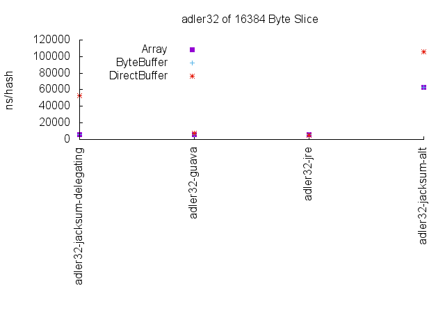

| Algorithm |  Array | ByteBuffer | DirectBuffer |
| --- | ---: | ---: | ---: | 
| [adler32-jacksum-delegating](#adler32-jacksum-delegating-latency) | 5527.765340 | 5484.644571 | 52583.252726 |
| [adler32-guava](#adler32-guava-latency) | 5530.095518 | 5514.293339 | 7832.531158 |
| [adler32-jre](#adler32-jre-latency) | 5555.594460 | 5565.436909 | 5417.836004 |
| [adler32-jacksum-alt](#adler32-jacksum-alt-latency) | 62629.808821 | 62549.918981 | 105606.626391 |

---
### 16384 Byte Slice Latency (city64)
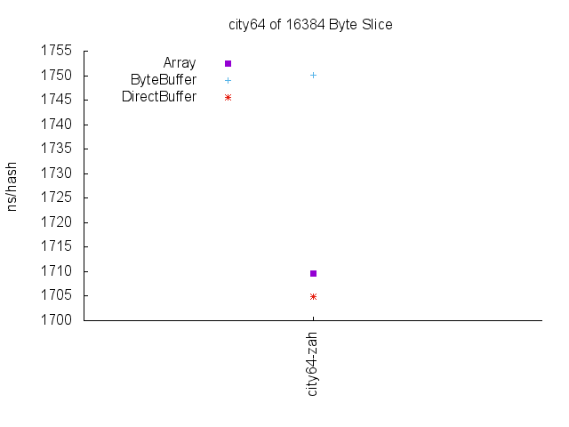

| Algorithm |  Array | ByteBuffer | DirectBuffer |
| --- | ---: | ---: | ---: | 
| [city64-zah](#city64-zah-latency) | 1709.654117 | 1750.093846 | 1704.830213 |

---
### 16384 Byte Slice Latency (cksum)

| Algorithm |  Array | ByteBuffer | DirectBuffer |
| --- | ---: | ---: | ---: | 
| [cksum-jacksum](#cksum-jacksum-latency) | 42883.466114 | 42671.014761 | 79007.979410 |

---
### 16384 Byte Slice Latency (crc16)

| Algorithm |  Array | ByteBuffer | DirectBuffer |
| --- | ---: | ---: | ---: | 
| [crc16-jacksum](#crc16-jacksum-latency) | 38510.862727 | 37082.227851 | 78628.607315 |

---
### 16384 Byte Slice Latency (crc24)
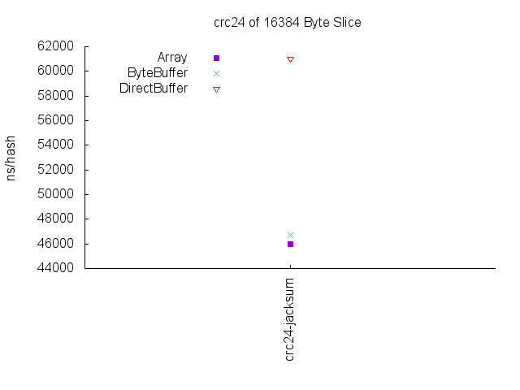

| Algorithm |  Array | ByteBuffer | DirectBuffer |
| --- | ---: | ---: | ---: | 
| [crc24-jacksum](#crc24-jacksum-latency) | 45964.511309 | 46733.162455 | 61030.205325 |

---
### 16384 Byte Slice Latency (crc32)
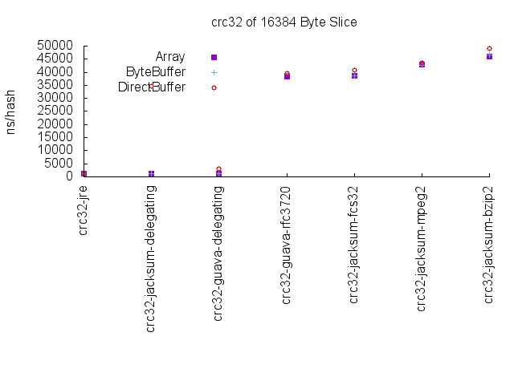

| Algorithm |  Array | ByteBuffer | DirectBuffer |
| --- | ---: | ---: | ---: | 
| [crc32-jre](#crc32-jre-latency) | 1222.502092 | 1210.520056 | 1205.040864 |
| [crc32-jacksum-delegating](#crc32-jacksum-delegating-latency) | 1224.562609 | 1214.351090 | 34635.351145 |
| [crc32-guava-delegating](#crc32-guava-delegating-latency) | 1241.593723 | 1257.116364 | 3114.432764 |
| [crc32-guava-rfc3720](#crc32-guava-rfc3720-latency) | 38238.104384 | 39570.531379 | 39497.124419 |
| [crc32-jacksum-fcs32](#crc32-jacksum-fcs32-latency) | 38792.930265 | 38513.886010 | 40914.383093 |
| [crc32-jacksum-mpeg2](#crc32-jacksum-mpeg2-latency) | 42847.220138 | 42538.101968 | 43661.590893 |
| [crc32-jacksum-bzip2](#crc32-jacksum-bzip2-latency) | 45869.446347 | 46694.873370 | 49162.735570 |

---
### 16384 Byte Slice Latency (crc64)
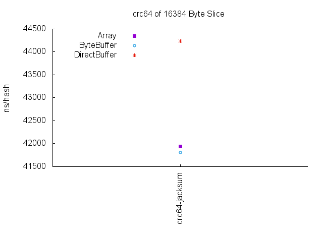

| Algorithm |  Array | ByteBuffer | DirectBuffer |
| --- | ---: | ---: | ---: | 
| [crc64-jacksum](#crc64-jacksum-latency) | 41942.289100 | 41805.198314 | 44240.614135 |

---
### 16384 Byte Slice Latency (crc8)
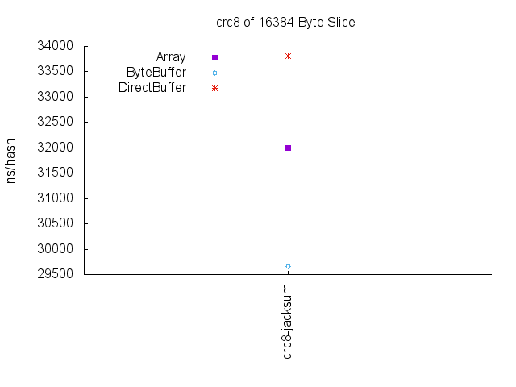

| Algorithm |  Array | ByteBuffer | DirectBuffer |
| --- | ---: | ---: | ---: | 
| [crc8-jacksum](#crc8-jacksum-latency) | 31995.527288 | 29661.475423 | 33807.808324 |

---
### 16384 Byte Slice Latency (ed2k)
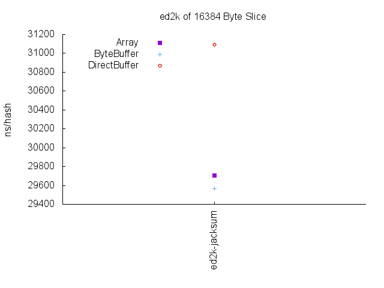

| Algorithm |  Array | ByteBuffer | DirectBuffer |
| --- | ---: | ---: | ---: | 
| [ed2k-jacksum](#ed2k-jacksum-latency) | 29703.955056 | 29562.499659 | 31093.456052 |

---
### 16384 Byte Slice Latency (elf)
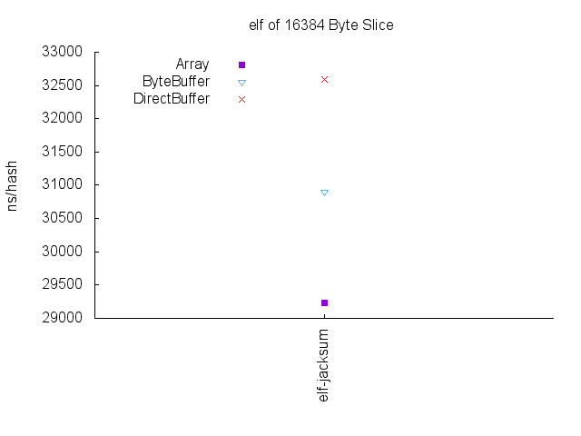

| Algorithm |  Array | ByteBuffer | DirectBuffer |
| --- | ---: | ---: | ---: | 
| [elf-jacksum](#elf-jacksum-latency) | 29234.739349 | 30894.363299 | 32596.572334 |

---
### 16384 Byte Slice Latency (farmna)
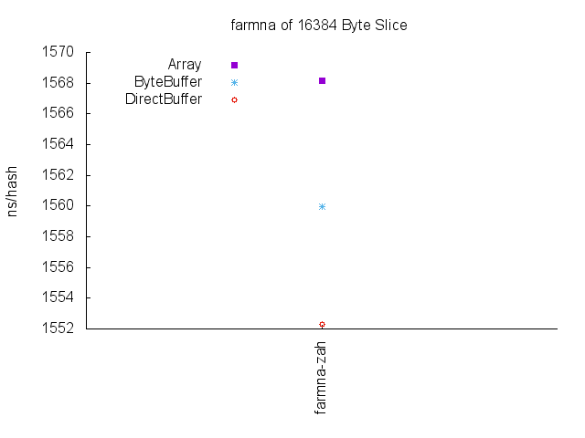

| Algorithm |  Array | ByteBuffer | DirectBuffer |
| --- | ---: | ---: | ---: | 
| [farmna-zah](#farmna-zah-latency) | 1568.139924 | 1559.947880 | 1552.309521 |

---
### 16384 Byte Slice Latency (farmuo)
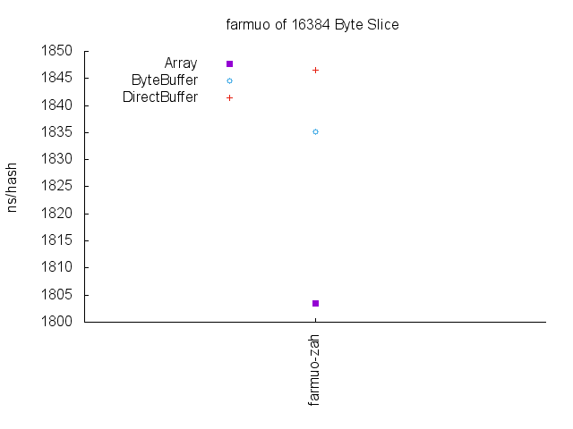

| Algorithm |  Array | ByteBuffer | DirectBuffer |
| --- | ---: | ---: | ---: | 
| [farmuo-zah](#farmuo-zah-latency) | 1803.515153 | 1835.194601 | 1846.520705 |

---
### 16384 Byte Slice Latency (fcs16)
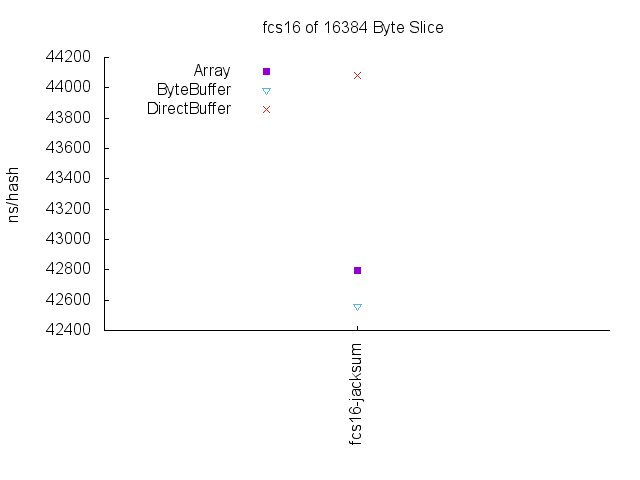

| Algorithm |  Array | ByteBuffer | DirectBuffer |
| --- | ---: | ---: | ---: | 
| [fcs16-jacksum](#fcs16-jacksum-latency) | 42793.110846 | 42556.250862 | 44082.116297 |

---
### 16384 Byte Slice Latency (gfh32)

| Algorithm |  Array | ByteBuffer | DirectBuffer |
| --- | ---: | ---: | ---: | 
| [gfh32-guava](#gfh32-guava-latency) | 14760.544253 | 14681.549827 | 16962.688598 |

---
### 16384 Byte Slice Latency (gfh64)

| Algorithm |  Array | ByteBuffer | DirectBuffer |
| --- | ---: | ---: | ---: | 
| [gfh64-guava](#gfh64-guava-latency) | 10955.340193 | 11170.593700 | 12775.529100 |

---
### 16384 Byte Slice Latency (gost)
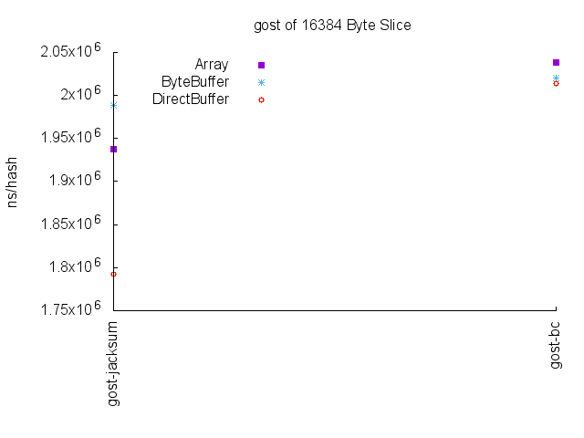

| Algorithm |  Array | ByteBuffer | DirectBuffer |
| --- | ---: | ---: | ---: | 
| [gost-jacksum](#gost-jacksum-latency) | 1937987.426923 | 1988437.727843 | 1792381.290086 |
| [gost-bc](#gost-bc-latency) | 2038559.733807 | 2020458.172501 | 2013836.842593 |

---
### 16384 Byte Slice Latency (has160)
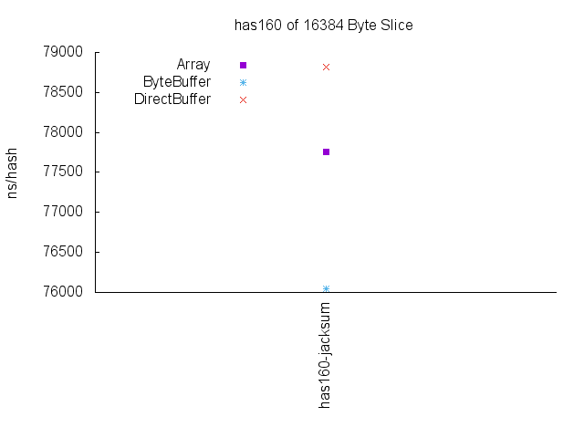

| Algorithm |  Array | ByteBuffer | DirectBuffer |
| --- | ---: | ---: | ---: | 
| [has160-jacksum](#has160-jacksum-latency) | 77761.184427 | 76042.570488 | 78815.243847 |

---
### 16384 Byte Slice Latency (haval128h3)
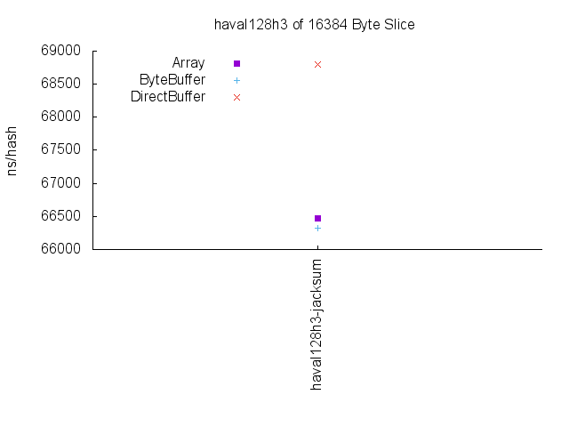

| Algorithm |  Array | ByteBuffer | DirectBuffer |
| --- | ---: | ---: | ---: | 
| [haval128h3-jacksum](#haval128h3-jacksum-latency) | 66475.913683 | 66329.470829 | 68803.302701 |

---
### 16384 Byte Slice Latency (haval128h4)
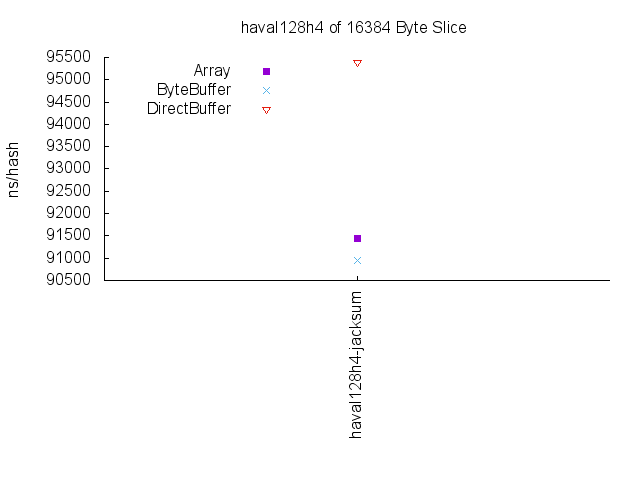

| Algorithm |  Array | ByteBuffer | DirectBuffer |
| --- | ---: | ---: | ---: | 
| [haval128h4-jacksum](#haval128h4-jacksum-latency) | 91439.007998 | 90945.430613 | 95390.527438 |

---
### 16384 Byte Slice Latency (haval128h5)
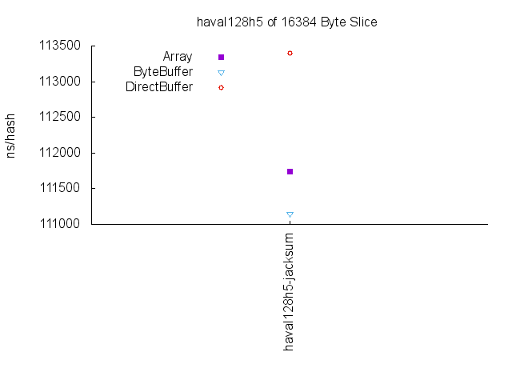

| Algorithm |  Array | ByteBuffer | DirectBuffer |
| --- | ---: | ---: | ---: | 
| [haval128h5-jacksum](#haval128h5-jacksum-latency) | 111742.514316 | 111141.199603 | 113398.786743 |

---
### 16384 Byte Slice Latency (haval160h3)
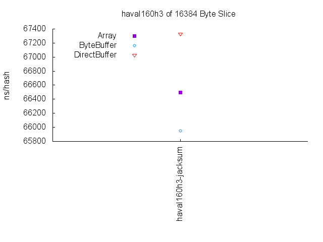

| Algorithm |  Array | ByteBuffer | DirectBuffer |
| --- | ---: | ---: | ---: | 
| [haval160h3-jacksum](#haval160h3-jacksum-latency) | 66492.563693 | 65953.236915 | 67325.538992 |

---
### 16384 Byte Slice Latency (haval160h4)
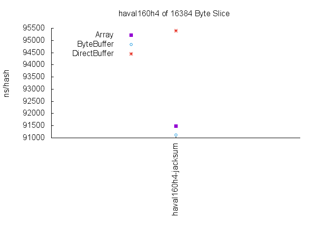

| Algorithm |  Array | ByteBuffer | DirectBuffer |
| --- | ---: | ---: | ---: | 
| [haval160h4-jacksum](#haval160h4-jacksum-latency) | 91480.767120 | 91117.803085 | 95409.184444 |

---
### 16384 Byte Slice Latency (haval160h5)
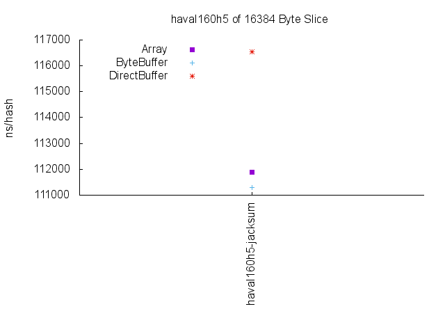

| Algorithm |  Array | ByteBuffer | DirectBuffer |
| --- | ---: | ---: | ---: | 
| [haval160h5-jacksum](#haval160h5-jacksum-latency) | 111876.307060 | 111292.471997 | 116545.868730 |

---
### 16384 Byte Slice Latency (haval192h3)
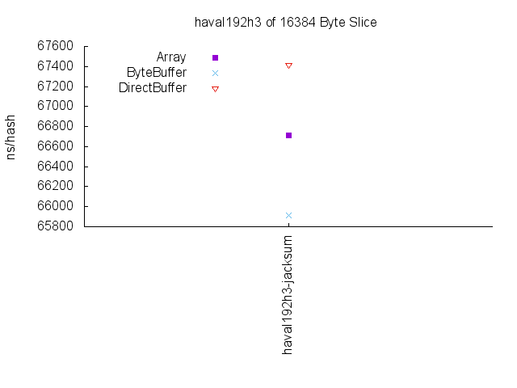

| Algorithm |  Array | ByteBuffer | DirectBuffer |
| --- | ---: | ---: | ---: | 
| [haval192h3-jacksum](#haval192h3-jacksum-latency) | 66708.182133 | 65914.772410 | 67415.691429 |

---
### 16384 Byte Slice Latency (haval192h4)
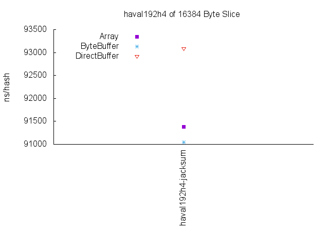

| Algorithm |  Array | ByteBuffer | DirectBuffer |
| --- | ---: | ---: | ---: | 
| [haval192h4-jacksum](#haval192h4-jacksum-latency) | 91383.841784 | 91049.783011 | 93084.105639 |

---
### 16384 Byte Slice Latency (haval192h5)

| Algorithm |  Array | ByteBuffer | DirectBuffer |
| --- | ---: | ---: | ---: | 
| [haval192h5-jacksum](#haval192h5-jacksum-latency) | 111943.210385 | 111419.422873 | 112763.840590 |

---
### 16384 Byte Slice Latency (haval224h3)
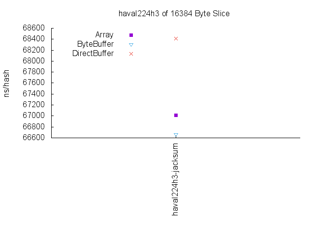

| Algorithm |  Array | ByteBuffer | DirectBuffer |
| --- | ---: | ---: | ---: | 
| [haval224h3-jacksum](#haval224h3-jacksum-latency) | 67015.915006 | 66661.826295 | 68411.977301 |

---
### 16384 Byte Slice Latency (haval224h4)
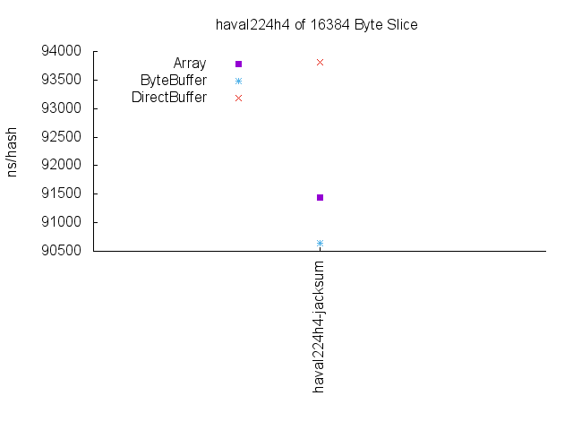

| Algorithm |  Array | ByteBuffer | DirectBuffer |
| --- | ---: | ---: | ---: | 
| [haval224h4-jacksum](#haval224h4-jacksum-latency) | 91442.580037 | 90638.494148 | 93808.415952 |

---
### 16384 Byte Slice Latency (haval224h5)
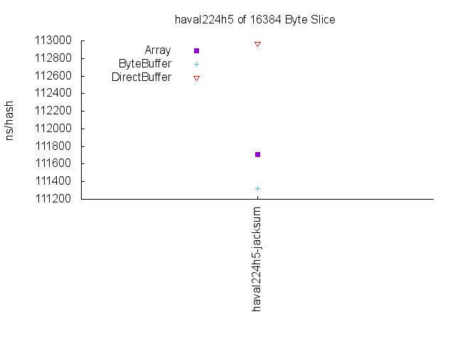

| Algorithm |  Array | ByteBuffer | DirectBuffer |
| --- | ---: | ---: | ---: | 
| [haval224h5-jacksum](#haval224h5-jacksum-latency) | 111712.452459 | 111317.966405 | 112967.318143 |

---
### 16384 Byte Slice Latency (haval256h3)
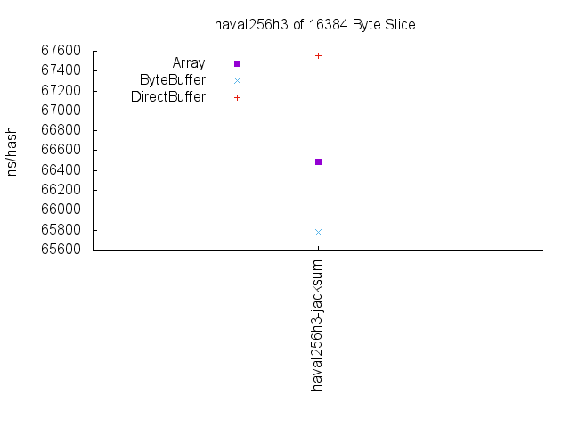

| Algorithm |  Array | ByteBuffer | DirectBuffer |
| --- | ---: | ---: | ---: | 
| [haval256h3-jacksum](#haval256h3-jacksum-latency) | 66489.864150 | 65777.762241 | 67556.405546 |

---
### 16384 Byte Slice Latency (haval256h4)
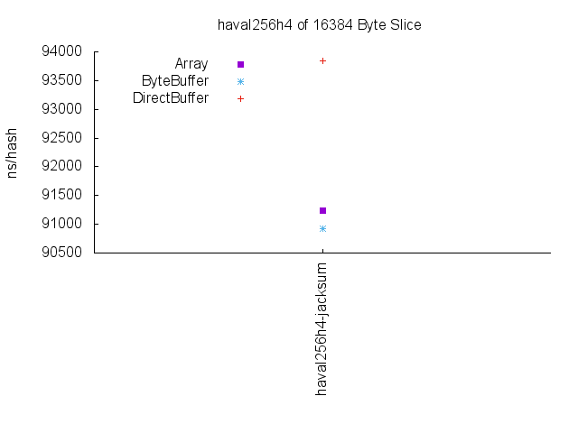

| Algorithm |  Array | ByteBuffer | DirectBuffer |
| --- | ---: | ---: | ---: | 
| [haval256h4-jacksum](#haval256h4-jacksum-latency) | 91233.718186 | 90916.582881 | 93848.527802 |

---
### 16384 Byte Slice Latency (haval256h5)
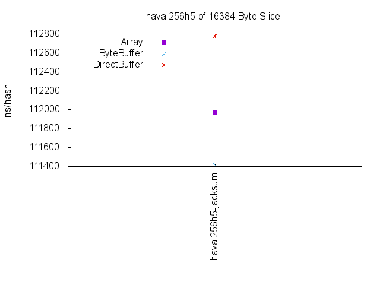

| Algorithm |  Array | ByteBuffer | DirectBuffer |
| --- | ---: | ---: | ---: | 
| [haval256h5-jacksum](#haval256h5-jacksum-latency) | 111971.675881 | 111412.682518 | 112783.702352 |

---
### 16384 Byte Slice Latency (md2)
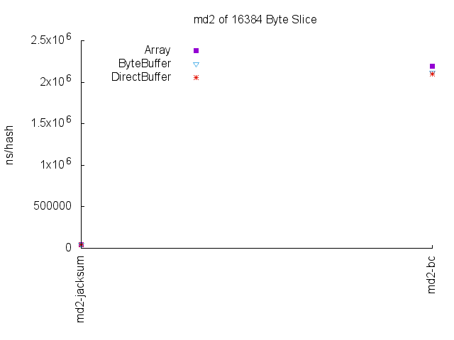

| Algorithm |  Array | ByteBuffer | DirectBuffer |
| --- | ---: | ---: | ---: | 
| [md2-jacksum](#md2-jacksum-latency) | 39800.331233 | 39620.958089 | 42304.848200 |
| [md2-bc](#md2-bc-latency) | 2188799.657337 | 2112139.737956 | 2100474.541677 |

---
### 16384 Byte Slice Latency (md4)
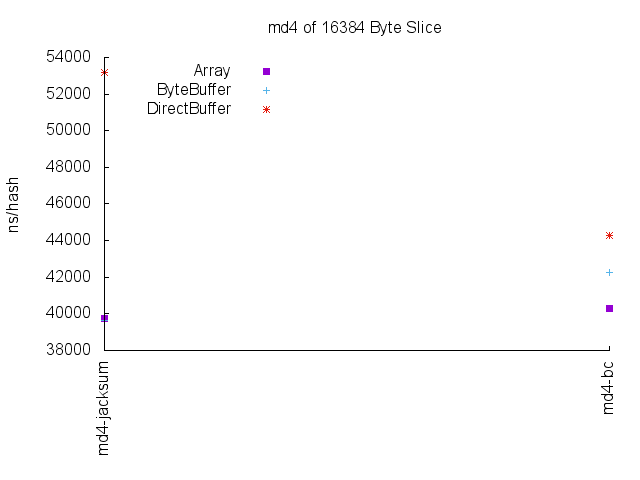

| Algorithm |  Array | ByteBuffer | DirectBuffer |
| --- | ---: | ---: | ---: | 
| [md4-jacksum](#md4-jacksum-latency) | 39738.004686 | 39611.893477 | 53193.587194 |
| [md4-bc](#md4-bc-latency) | 40300.773676 | 42238.325197 | 44304.496432 |

---
### 16384 Byte Slice Latency (md5)
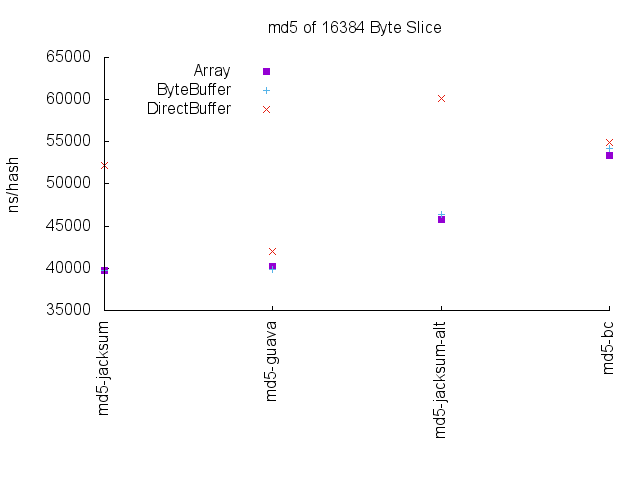

| Algorithm |  Array | ByteBuffer | DirectBuffer |
| --- | ---: | ---: | ---: | 
| [md5-jacksum](#md5-jacksum-latency) | 39787.534131 | 39717.522850 | 52249.683485 |
| [md5-guava](#md5-guava-latency) | 40177.227759 | 39919.451897 | 42015.016280 |
| [md5-jacksum-alt](#md5-jacksum-alt-latency) | 45801.255484 | 46396.740189 | 60127.022607 |
| [md5-bc](#md5-bc-latency) | 53397.946419 | 54262.563729 | 54885.003597 |

---
### 16384 Byte Slice Latency (murmur3h128)
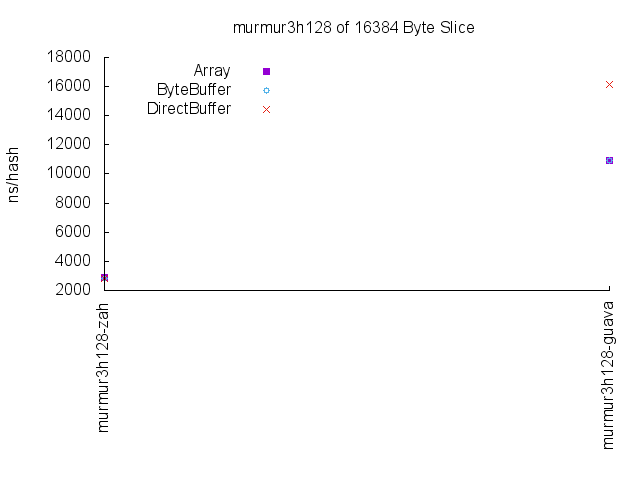

| Algorithm |  Array | ByteBuffer | DirectBuffer |
| --- | ---: | ---: | ---: | 
| [murmur3h128-zah](#murmur3h128-zah-latency) | 2859.128203 | 2842.473274 | 2818.161475 |
| [murmur3h128-guava](#murmur3h128-guava-latency) | 10952.260747 | 10910.997070 | 16177.915834 |

---
### 16384 Byte Slice Latency (murmur3h32)
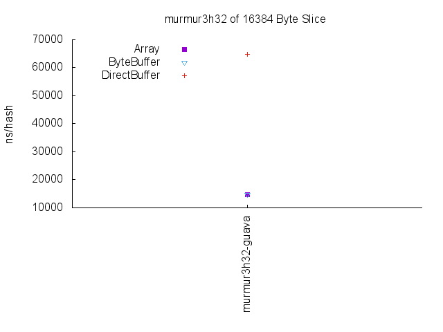

| Algorithm |  Array | ByteBuffer | DirectBuffer |
| --- | ---: | ---: | ---: | 
| [murmur3h32-guava](#murmur3h32-guava-latency) | 14808.528188 | 14727.474452 | 64771.011363 |

---
### 16384 Byte Slice Latency (ripemd128)
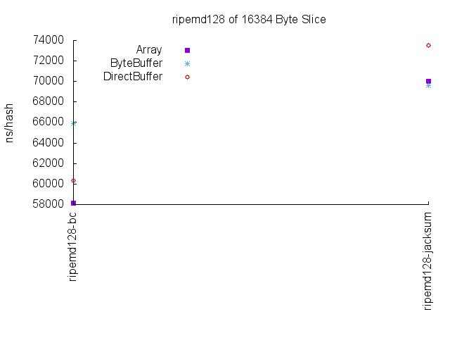

| Algorithm |  Array | ByteBuffer | DirectBuffer |
| --- | ---: | ---: | ---: | 
| [ripemd128-bc](#ripemd128-bc-latency) | 58104.167764 | 65905.546492 | 60348.808159 |
| [ripemd128-jacksum](#ripemd128-jacksum-latency) | 69996.546984 | 69575.508009 | 73551.987222 |

---
### 16384 Byte Slice Latency (ripemd160)
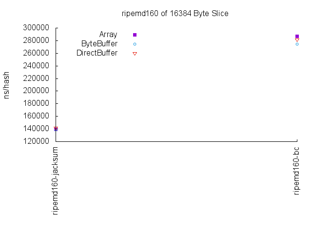

| Algorithm |  Array | ByteBuffer | DirectBuffer |
| --- | ---: | ---: | ---: | 
| [ripemd160-jacksum](#ripemd160-jacksum-latency) | 139182.646670 | 138367.351362 | 141945.210625 |
| [ripemd160-bc](#ripemd160-bc-latency) | 287148.827573 | 274711.644788 | 281645.988963 |

---
### 16384 Byte Slice Latency (ripemd256)
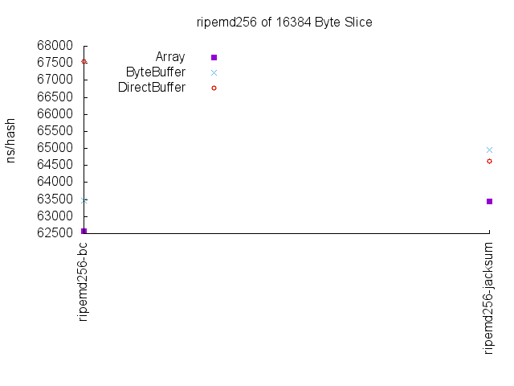

| Algorithm |  Array | ByteBuffer | DirectBuffer |
| --- | ---: | ---: | ---: | 
| [ripemd256-bc](#ripemd256-bc-latency) | 62567.286565 | 63477.669102 | 67553.612175 |
| [ripemd256-jacksum](#ripemd256-jacksum-latency) | 63447.192734 | 64949.777523 | 64629.834207 |

---
### 16384 Byte Slice Latency (ripemd320)
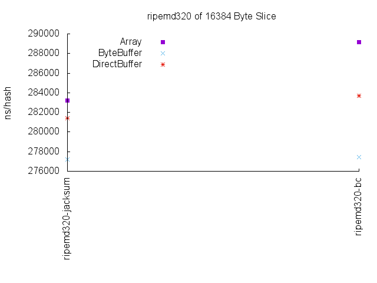

| Algorithm |  Array | ByteBuffer | DirectBuffer |
| --- | ---: | ---: | ---: | 
| [ripemd320-jacksum](#ripemd320-jacksum-latency) | 283188.080731 | 277208.946948 | 281403.083713 |
| [ripemd320-bc](#ripemd320-bc-latency) | 289145.957402 | 277426.910611 | 283692.267642 |

---
### 16384 Byte Slice Latency (sha0)
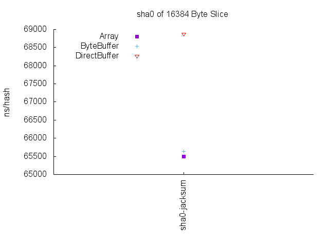

| Algorithm |  Array | ByteBuffer | DirectBuffer |
| --- | ---: | ---: | ---: | 
| [sha0-jacksum](#sha0-jacksum-latency) | 65493.169448 | 65629.988150 | 68876.353010 |

---
### 16384 Byte Slice Latency (sha1)
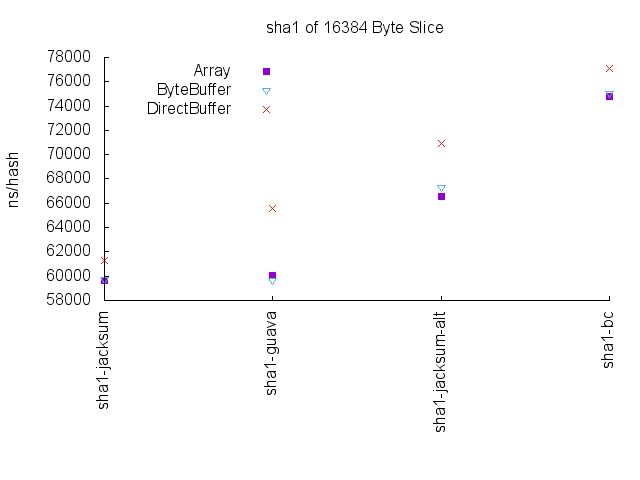

| Algorithm |  Array | ByteBuffer | DirectBuffer |
| --- | ---: | ---: | ---: | 
| [sha1-jacksum](#sha1-jacksum-latency) | 59635.722546 | 59696.828544 | 61321.940064 |
| [sha1-guava](#sha1-guava-latency) | 60067.840324 | 59639.511756 | 65566.463973 |
| [sha1-jacksum-alt](#sha1-jacksum-alt-latency) | 66567.099344 | 67289.935973 | 70895.156319 |
| [sha1-bc](#sha1-bc-latency) | 74774.648387 | 75043.397056 | 77071.419834 |

---
### 16384 Byte Slice Latency (sha224)
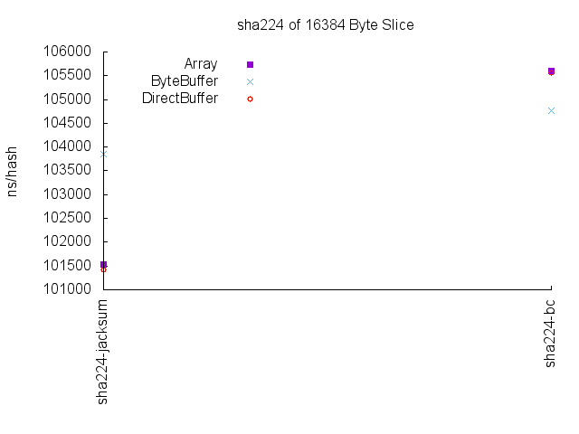

| Algorithm |  Array | ByteBuffer | DirectBuffer |
| --- | ---: | ---: | ---: | 
| [sha224-jacksum](#sha224-jacksum-latency) | 101531.689135 | 103857.633692 | 101417.903280 |
| [sha224-bc](#sha224-bc-latency) | 105600.114933 | 104766.276314 | 105557.123210 |

---
### 16384 Byte Slice Latency (sha256)
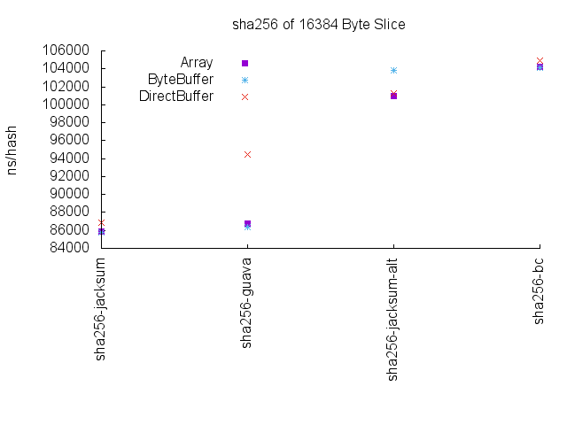

| Algorithm |  Array | ByteBuffer | DirectBuffer |
| --- | ---: | ---: | ---: | 
| [sha256-jacksum](#sha256-jacksum-latency) | 85879.694780 | 85736.410174 | 86816.851983 |
| [sha256-guava](#sha256-guava-latency) | 86734.716477 | 86374.056436 | 94501.230403 |
| [sha256-jacksum-alt](#sha256-jacksum-alt-latency) | 101014.222430 | 103814.377775 | 101262.861032 |
| [sha256-bc](#sha256-bc-latency) | 104267.939839 | 104111.680889 | 104938.448097 |

---
### 16384 Byte Slice Latency (sha3)
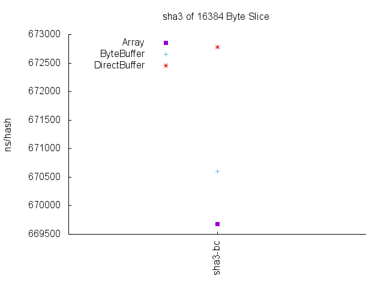

| Algorithm |  Array | ByteBuffer | DirectBuffer |
| --- | ---: | ---: | ---: | 
| [sha3-bc](#sha3-bc-latency) | 669676.911108 | 670605.100315 | 672775.717753 |

---
### 16384 Byte Slice Latency (sha384)
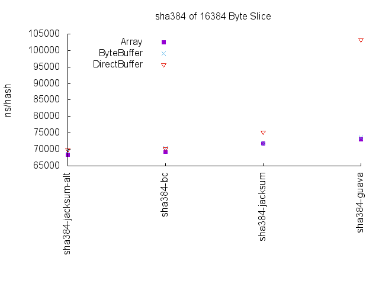

| Algorithm |  Array | ByteBuffer | DirectBuffer |
| --- | ---: | ---: | ---: | 
| [sha384-jacksum-alt](#sha384-jacksum-alt-latency) | 68349.357335 | 69501.937657 | 69772.060352 |
| [sha384-bc](#sha384-bc-latency) | 69380.219851 | 70319.684660 | 70233.368061 |
| [sha384-jacksum](#sha384-jacksum-latency) | 71788.375512 | 71803.311694 | 75301.461220 |
| [sha384-guava](#sha384-guava-latency) | 73030.405360 | 73559.814944 | 103295.856337 |

---
### 16384 Byte Slice Latency (sha512)
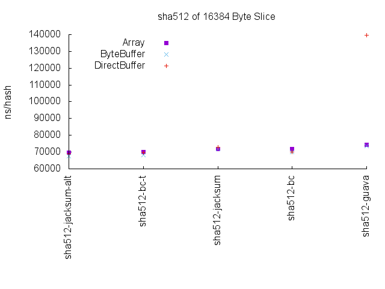

| Algorithm |  Array | ByteBuffer | DirectBuffer |
| --- | ---: | ---: | ---: | 
| [sha512-jacksum-alt](#sha512-jacksum-alt-latency) | 69792.305477 | 67702.110790 | 69048.911742 |
| [sha512-bc-t](#sha512-bc-t-latency) | 69949.745272 | 68396.147793 | 69849.297915 |
| [sha512-jacksum](#sha512-jacksum-latency) | 71730.357050 | 71944.592802 | 72849.337913 |
| [sha512-bc](#sha512-bc-latency) | 72012.780100 | 70057.785051 | 69908.467178 |
| [sha512-guava](#sha512-guava-latency) | 74241.381504 | 73605.542618 | 139609.311497 |

---
### 16384 Byte Slice Latency (sip)
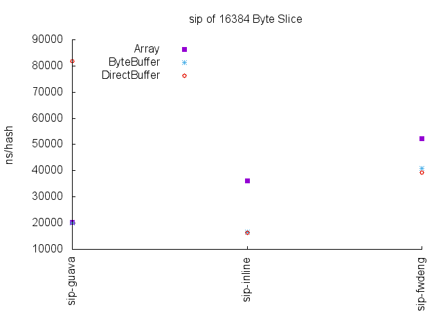

| Algorithm |  Array | ByteBuffer | DirectBuffer |
| --- | ---: | ---: | ---: | 
| [sip-guava](#sip-guava-latency) | 20220.444869 | 20114.294012 | 81818.630267 |
| [sip-inline](#sip-inline-latency) | 36250.824730 | 16729.224813 | 16281.325294 |
| [sip-fwdeng](#sip-fwdeng-latency) | 52178.166144 | 40900.958991 | 39236.927143 |

---
### 16384 Byte Slice Latency (skein1024)
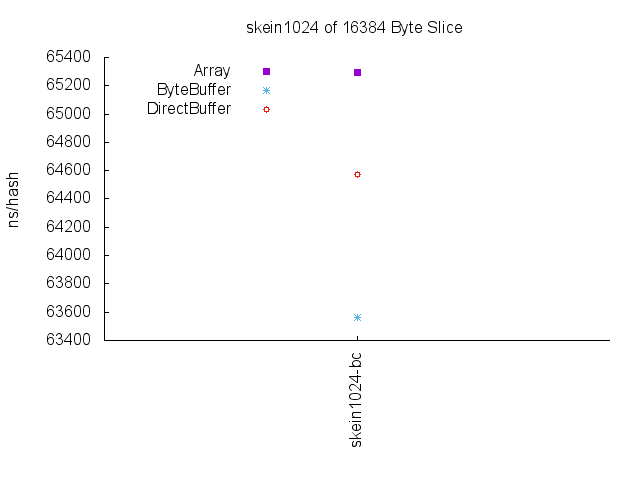

| Algorithm |  Array | ByteBuffer | DirectBuffer |
| --- | ---: | ---: | ---: | 
| [skein1024-bc](#skein1024-bc-latency) | 65296.829907 | 63559.781288 | 64575.703261 |

---
### 16384 Byte Slice Latency (skein256)
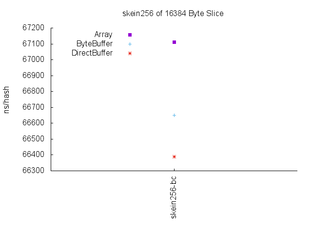

| Algorithm |  Array | ByteBuffer | DirectBuffer |
| --- | ---: | ---: | ---: | 
| [skein256-bc](#skein256-bc-latency) | 67111.071396 | 66650.819344 | 66388.471423 |

---
### 16384 Byte Slice Latency (skein512)
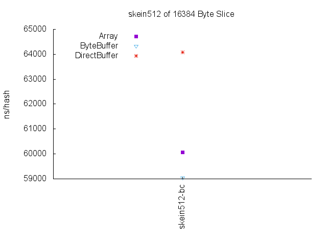

| Algorithm |  Array | ByteBuffer | DirectBuffer |
| --- | ---: | ---: | ---: | 
| [skein512-bc](#skein512-bc-latency) | 60073.916322 | 59031.159258 | 64088.728223 |

---
### 16384 Byte Slice Latency (sm3)

| Algorithm |  Array | ByteBuffer | DirectBuffer |
| --- | ---: | ---: | ---: | 
| [sm3-bc](#sm3-bc-latency) | 99269.276474 | 99673.778328 | 101198.818916 |

---
### 16384 Byte Slice Latency (sum16)
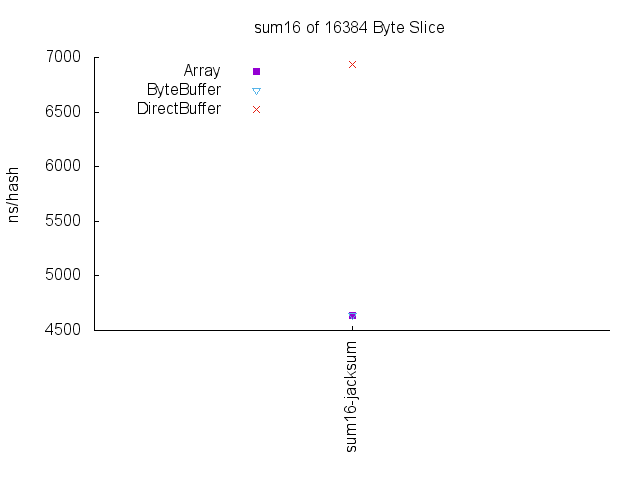

| Algorithm |  Array | ByteBuffer | DirectBuffer |
| --- | ---: | ---: | ---: | 
| [sum16-jacksum](#sum16-jacksum-latency) | 4639.311324 | 4634.697329 | 6935.825969 |

---
### 16384 Byte Slice Latency (sum24)

| Algorithm |  Array | ByteBuffer | DirectBuffer |
| --- | ---: | ---: | ---: | 
| [sum24-jacksum](#sum24-jacksum-latency) | 4646.731304 | 4634.187458 | 7315.330059 |

---
### 16384 Byte Slice Latency (sum32)
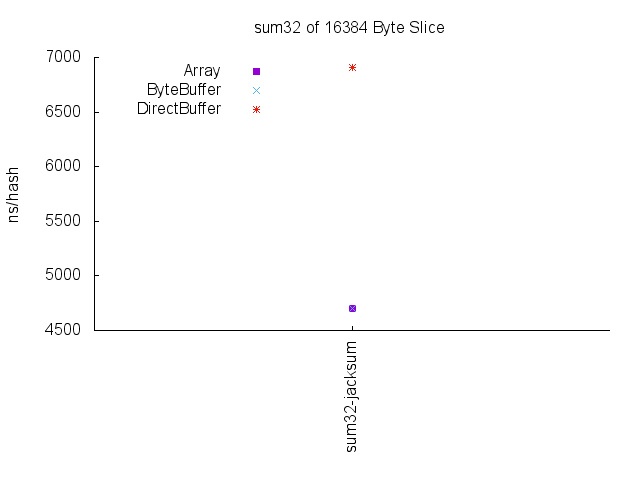

| Algorithm |  Array | ByteBuffer | DirectBuffer |
| --- | ---: | ---: | ---: | 
| [sum32-jacksum](#sum32-jacksum-latency) | 4698.723981 | 4705.261964 | 6911.479251 |

---
### 16384 Byte Slice Latency (sum8)
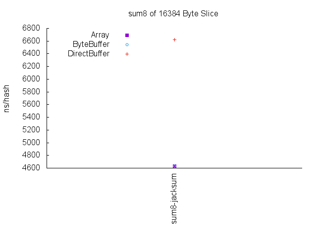

| Algorithm |  Array | ByteBuffer | DirectBuffer |
| --- | ---: | ---: | ---: | 
| [sum8-jacksum](#sum8-jacksum-latency) | 4633.131228 | 4628.556172 | 6621.442152 |

---
### 16384 Byte Slice Latency (sumbsd)
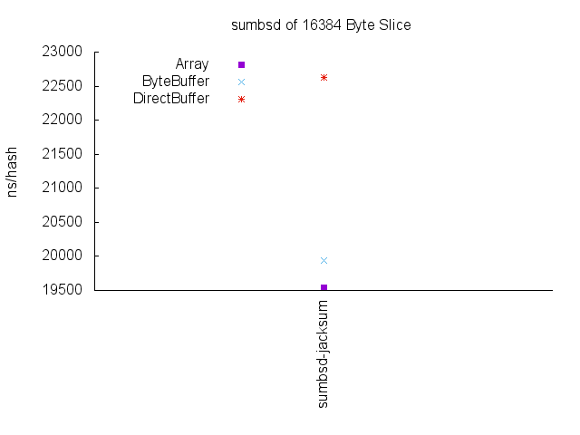

| Algorithm |  Array | ByteBuffer | DirectBuffer |
| --- | ---: | ---: | ---: | 
| [sumbsd-jacksum](#sumbsd-jacksum-latency) | 19536.592143 | 19934.656943 | 22631.432829 |

---
### 16384 Byte Slice Latency (sumsysv)
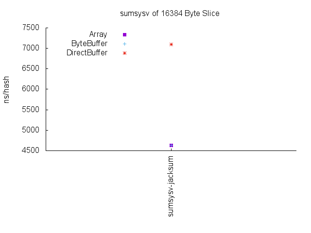

| Algorithm |  Array | ByteBuffer | DirectBuffer |
| --- | ---: | ---: | ---: | 
| [sumsysv-jacksum](#sumsysv-jacksum-latency) | 4629.148761 | 4625.610213 | 7091.295672 |

---
### 16384 Byte Slice Latency (tiger)

| Algorithm |  Array | ByteBuffer | DirectBuffer |
| --- | ---: | ---: | ---: | 
| [tiger-jacksum](#tiger-jacksum-latency) | 47995.738629 | 47856.671813 | 50171.292652 |
| [tiger-bc](#tiger-bc-latency) | 50414.894820 | 52461.652578 | 51390.710594 |
| [tiger-jacksum-tree](#tiger-jacksum-tree-latency) | 54602.297111 | 58367.366107 | 54100.236925 |

---
### 16384 Byte Slice Latency (tiger128)
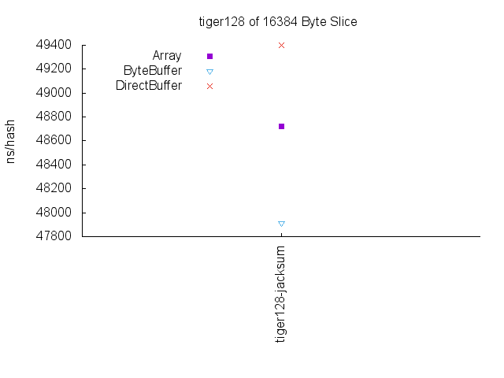

| Algorithm |  Array | ByteBuffer | DirectBuffer |
| --- | ---: | ---: | ---: | 
| [tiger128-jacksum](#tiger128-jacksum-latency) | 48722.037265 | 47910.894090 | 49398.387716 |

---
### 16384 Byte Slice Latency (tiger160)
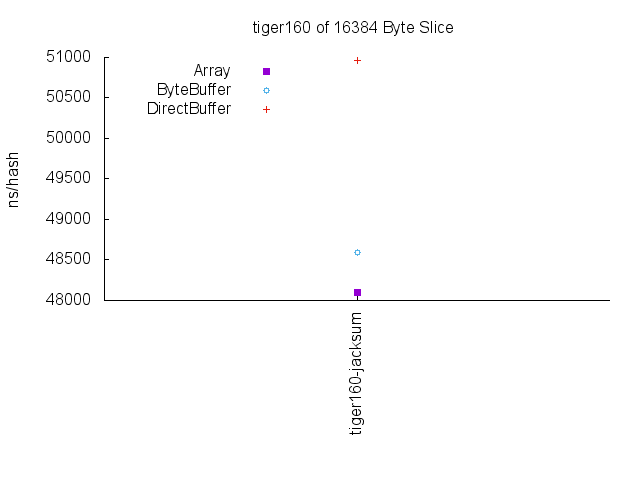

| Algorithm |  Array | ByteBuffer | DirectBuffer |
| --- | ---: | ---: | ---: | 
| [tiger160-jacksum](#tiger160-jacksum-latency) | 48094.375085 | 48593.017087 | 50959.048366 |

---
### 16384 Byte Slice Latency (tiger2)
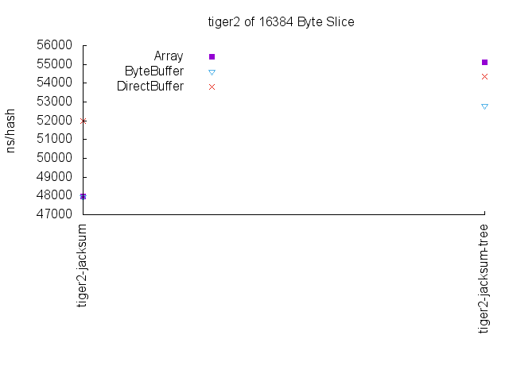

| Algorithm |  Array | ByteBuffer | DirectBuffer |
| --- | ---: | ---: | ---: | 
| [tiger2-jacksum](#tiger2-jacksum-latency) | 47984.971323 | 47928.983316 | 51990.147155 |
| [tiger2-jacksum-tree](#tiger2-jacksum-tree-latency) | 55125.911059 | 52797.795698 | 54356.500292 |

---
### 16384 Byte Slice Latency (whirlpool0)
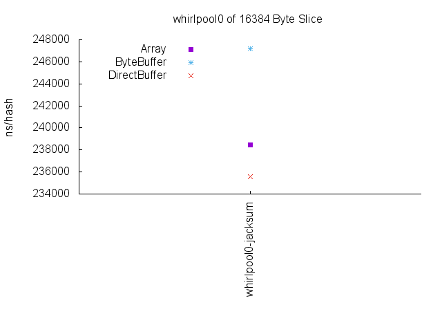

| Algorithm |  Array | ByteBuffer | DirectBuffer |
| --- | ---: | ---: | ---: | 
| [whirlpool0-jacksum](#whirlpool0-jacksum-latency) | 238476.645966 | 247153.069517 | 235551.306252 |

---
### 16384 Byte Slice Latency (whirlpool1)
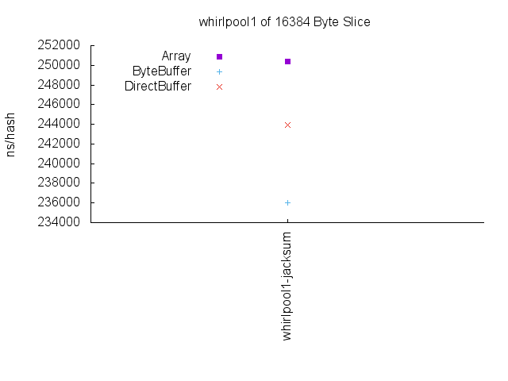

| Algorithm |  Array | ByteBuffer | DirectBuffer |
| --- | ---: | ---: | ---: | 
| [whirlpool1-jacksum](#whirlpool1-jacksum-latency) | 250386.459261 | 235995.191475 | 243932.597102 |

---
### 16384 Byte Slice Latency (whirlpool2)
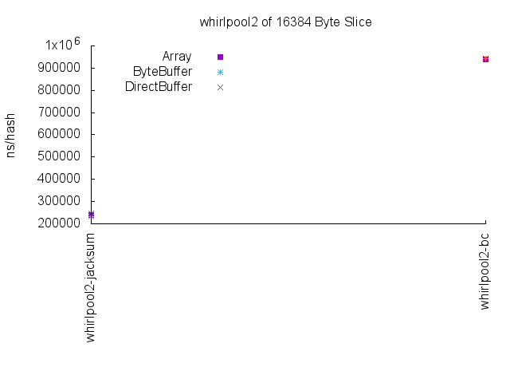

| Algorithm |  Array | ByteBuffer | DirectBuffer |
| --- | ---: | ---: | ---: | 
| [whirlpool2-jacksum](#whirlpool2-jacksum-latency) | 238812.147329 | 233316.075864 | 246698.044403 |
| [whirlpool2-bc](#whirlpool2-bc-latency) | 938608.064165 | 941679.319556 | 943134.317780 |

---
### 16384 Byte Slice Latency (xor8)
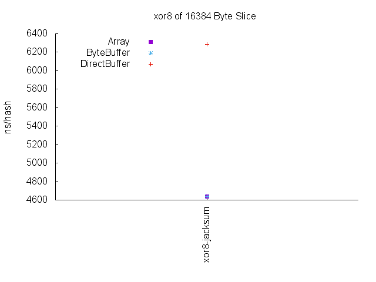

| Algorithm |  Array | ByteBuffer | DirectBuffer |
| --- | ---: | ---: | ---: | 
| [xor8-jacksum](#xor8-jacksum-latency) | 4637.908998 | 4636.623755 | 6285.643003 |

---
### 16384 Byte Slice Latency (xxh32)
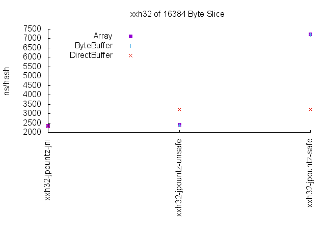

| Algorithm |  Array | ByteBuffer | DirectBuffer |
| --- | ---: | ---: | ---: | 
| [xxh32-jpountz-jni](#xxh32-jpountz-jni-latency) | 2350.938172 | 2347.614663 | 2322.398964 |
| [xxh32-jpountz-unsafe](#xxh32-jpountz-unsafe-latency) | 2400.382422 | 2388.374511 | 3220.284687 |
| [xxh32-jpountz-safe](#xxh32-jpountz-safe-latency) | 7226.416016 | 7210.180897 | 3224.183894 |

---
### 16384 Byte Slice Latency (xxh64)
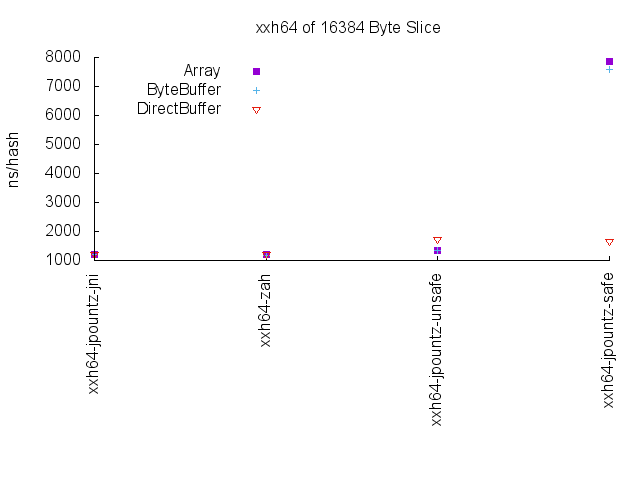

| Algorithm |  Array | ByteBuffer | DirectBuffer |
| --- | ---: | ---: | ---: | 
| [xxh64-jpountz-jni](#xxh64-jpountz-jni-latency) | 1203.596327 | 1218.843584 | 1210.028649 |
| [xxh64-zah](#xxh64-zah-latency) | 1206.748336 | 1177.365452 | 1208.667697 |
| [xxh64-jpountz-unsafe](#xxh64-jpountz-unsafe-latency) | 1337.092671 | 1332.856703 | 1709.380057 |
| [xxh64-jpountz-safe](#xxh64-jpountz-safe-latency) | 7867.994508 | 7590.585372 | 1668.733749 |

---
### 32768 Byte Slice Latency (All Hashes)
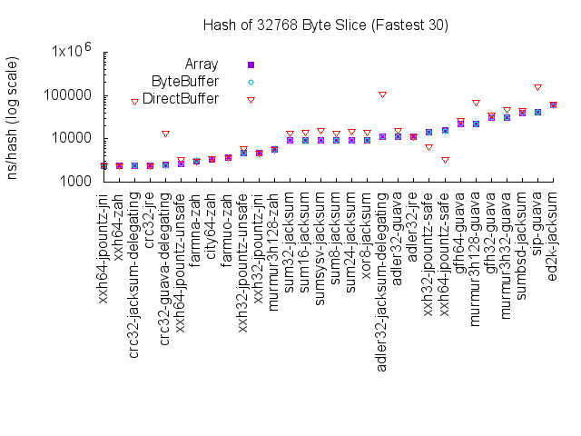

| Algorithm |  Array | ByteBuffer | DirectBuffer |
| --- | ---: | ---: | ---: | 
| [xxh64-jpountz-jni](#xxh64-jpountz-jni-latency) | 2365.333328 | 2375.359161 | 2357.866069 |
| [xxh64-zah](#xxh64-zah-latency) | 2394.944648 | 2330.808235 | 2394.061387 |
| [crc32-jacksum-delegating](#crc32-jacksum-delegating-latency) | 2401.765112 | 2361.681380 | 72542.675289 |
| [crc32-jre](#crc32-jre-latency) | 2412.858853 | 2388.040663 | 2405.195889 |
| [crc32-guava-delegating](#crc32-guava-delegating-latency) | 2482.262912 | 2427.116055 | 13508.430899 |
| [xxh64-jpountz-unsafe](#xxh64-jpountz-unsafe-latency) | 2630.670916 | 2618.192050 | 3370.527150 |
| [farmna-zah](#farmna-zah-latency) | 3094.282615 | 3173.306326 | 2976.676239 |
| [city64-zah](#city64-zah-latency) | 3337.675380 | 3434.762430 | 3428.891379 |
| [farmuo-zah](#farmuo-zah-latency) | 3690.424311 | 3771.140110 | 3681.575960 |
| [xxh32-jpountz-unsafe](#xxh32-jpountz-unsafe-latency) | 4670.079728 | 4638.437863 | 5938.299010 |
| [xxh32-jpountz-jni](#xxh32-jpountz-jni-latency) | 4714.594507 | 4664.831748 | 4779.561239 |
| [murmur3h128-zah](#murmur3h128-zah-latency) | 5695.297573 | 5730.214867 | 5726.628604 |
| [sum32-jacksum](#sum32-jacksum-latency) | 9265.667838 | 9412.929185 | 13696.136605 |
| [sum16-jacksum](#sum16-jacksum-latency) | 9270.630819 | 9261.910459 | 14116.770669 |
| [sumsysv-jacksum](#sumsysv-jacksum-latency) | 9271.063310 | 9250.667196 | 15675.696743 |
| [sum8-jacksum](#sum8-jacksum-latency) | 9273.889493 | 9264.051134 | 13313.730969 |
| [sum24-jacksum](#sum24-jacksum-latency) | 9293.735256 | 9382.050196 | 14987.684649 |
| [xor8-jacksum](#xor8-jacksum-latency) | 9299.940093 | 9266.092236 | 14204.993906 |
| [adler32-jacksum-delegating](#adler32-jacksum-delegating-latency) | 11112.685211 | 11054.832256 | 107074.947325 |
| [adler32-guava](#adler32-guava-latency) | 11140.069315 | 11091.563470 | 16038.905665 |
| [adler32-jre](#adler32-jre-latency) | 11196.564991 | 11180.435106 | 11277.159680 |
| [xxh32-jpountz-safe](#xxh32-jpountz-safe-latency) | 14532.652869 | 14454.092493 | 6445.043513 |
| [xxh64-jpountz-safe](#xxh64-jpountz-safe-latency) | 15650.211365 | 15247.445567 | 3383.817183 |
| [gfh64-guava](#gfh64-guava-latency) | 21847.584118 | 21832.240174 | 26771.220500 |
| [murmur3h128-guava](#murmur3h128-guava-latency) | 22440.784499 | 21793.962537 | 70884.155204 |
| [gfh32-guava](#gfh32-guava-latency) | 30977.948611 | 30829.050853 | 35827.241181 |
| [murmur3h32-guava](#murmur3h32-guava-latency) | 31498.013593 | 30858.181513 | 46938.430446 |
| [sumbsd-jacksum](#sumbsd-jacksum-latency) | 39657.828634 | 39789.122694 | 44516.787447 |
| [sip-guava](#sip-guava-latency) | 41169.150258 | 40794.021335 | 162174.799871 |
| [ed2k-jacksum](#ed2k-jacksum-latency) | 59424.960094 | 59142.675675 | 62947.240096 |
| [elf-jacksum](#elf-jacksum-latency) | 63346.877920 | 64641.006969 | 72048.373107 |
| [crc8-jacksum](#crc8-jacksum-latency) | 63897.542361 | 62353.331726 | 68315.291604 |
| [sip-inline](#sip-inline-latency) | 65690.291060 | 34865.404878 | 33595.188849 |
| [crc16-jacksum](#crc16-jacksum-latency) | 74879.536356 | 74229.665940 | 151991.229972 |
| [crc32-guava-rfc3720](#crc32-guava-rfc3720-latency) | 77023.370603 | 80454.722318 | 79778.519506 |
| [md5-jacksum](#md5-jacksum-latency) | 79386.768819 | 80805.453107 | 105604.451129 |
| [md4-jacksum](#md4-jacksum-latency) | 79410.716143 | 79226.986126 | 103071.023684 |
| [md2-jacksum](#md2-jacksum-latency) | 79549.189985 | 79248.338317 | 103657.606034 |
| [md5-guava](#md5-guava-latency) | 80100.363496 | 79536.701916 | 83068.618407 |
| [crc32-jacksum-fcs32](#crc32-jacksum-fcs32-latency) | 81448.692347 | 78551.178475 | 84430.155570 |
| [md4-bc](#md4-bc-latency) | 82338.626145 | 84449.095269 | 91409.672622 |
| [crc64-jacksum](#crc64-jacksum-latency) | 84077.374607 | 81818.823151 | 90455.435369 |
| [fcs16-jacksum](#fcs16-jacksum-latency) | 85636.940072 | 87654.941671 | 92009.614549 |
| [crc32-jacksum-mpeg2](#crc32-jacksum-mpeg2-latency) | 85933.970705 | 85170.145865 | 91077.297302 |
| [cksum-jacksum](#cksum-jacksum-latency) | 87111.446736 | 84932.554856 | 168610.620011 |
| [crc24-jacksum](#crc24-jacksum-latency) | 88735.991933 | 92400.648993 | 119372.924498 |
| [crc32-jacksum-bzip2](#crc32-jacksum-bzip2-latency) | 89885.513560 | 90216.261947 | 119711.166738 |
| [md5-jacksum-alt](#md5-jacksum-alt-latency) | 91695.855896 | 91538.599281 | 120730.406693 |
| [tiger-jacksum](#tiger-jacksum-latency) | 96235.427284 | 96360.760532 | 99755.396993 |
| [tiger2-jacksum](#tiger2-jacksum-latency) | 96354.422821 | 96224.322310 | 104674.625360 |
| [tiger128-jacksum](#tiger128-jacksum-latency) | 96423.909610 | 96225.042253 | 105042.045868 |
| [tiger160-jacksum](#tiger160-jacksum-latency) | 96512.457122 | 97842.178509 | 101207.099637 |
| [tiger-bc](#tiger-bc-latency) | 106398.740240 | 103406.307166 | 102555.519100 |
| [tiger-jacksum-tree](#tiger-jacksum-tree-latency) | 109228.445134 | 116771.488921 | 109373.813026 |
| [tiger2-jacksum-tree](#tiger2-jacksum-tree-latency) | 110190.655736 | 106005.605000 | 111127.887051 |
| [sip-fwdeng](#sip-fwdeng-latency) | 110637.114150 | 79033.360302 | 78074.538307 |
| [md5-bc](#md5-bc-latency) | 110795.935028 | 118723.168534 | 114164.014368 |
| [sha1-jacksum](#sha1-jacksum-latency) | 118597.784800 | 119184.464298 | 121789.773709 |
| [skein512-bc](#skein512-bc-latency) | 118918.475034 | 117823.387932 | 120631.086076 |
| [sha1-guava](#sha1-guava-latency) | 119657.462007 | 119310.094075 | 243163.942991 |
| [ripemd128-bc](#ripemd128-bc-latency) | 120861.841915 | 126233.677478 | 123378.819257 |
| [adler32-jacksum-alt](#adler32-jacksum-alt-latency) | 125513.463957 | 125111.561371 | 211919.956624 |
| [ripemd256-jacksum](#ripemd256-jacksum-latency) | 128615.299873 | 127375.124285 | 129105.253049 |
| [skein1024-bc](#skein1024-bc-latency) | 128721.802720 | 128309.326450 | 133453.861631 |
| [ripemd256-bc](#ripemd256-bc-latency) | 129611.357640 | 128143.989262 | 136173.132625 |
| [sha0-jacksum](#sha0-jacksum-latency) | 131922.614119 | 135685.496448 | 135576.788811 |
| [haval192h3-jacksum](#haval192h3-jacksum-latency) | 132989.408647 | 131799.229060 | 135765.835717 |
| [sha1-jacksum-alt](#sha1-jacksum-alt-latency) | 133047.000646 | 134538.818278 | 140592.359741 |
| [haval160h3-jacksum](#haval160h3-jacksum-latency) | 133101.945819 | 131936.045421 | 135507.672732 |
| [haval128h3-jacksum](#haval128h3-jacksum-latency) | 133126.754091 | 132204.605030 | 135753.538959 |
| [haval256h3-jacksum](#haval256h3-jacksum-latency) | 133462.685975 | 132233.932515 | 143437.288428 |
| [skein256-bc](#skein256-bc-latency) | 134393.259276 | 133284.302177 | 136434.359747 |
| [haval224h3-jacksum](#haval224h3-jacksum-latency) | 134719.993713 | 132664.706836 | 135678.476221 |
| [sha512-jacksum-alt](#sha512-jacksum-alt-latency) | 136431.208848 | 138165.054940 | 142233.116477 |
| [sha384-jacksum-alt](#sha384-jacksum-alt-latency) | 139240.484345 | 135809.704642 | 143217.309584 |
| [ripemd128-jacksum](#ripemd128-jacksum-latency) | 139664.932466 | 141345.690412 | 148537.498520 |
| [sha512-bc-t](#sha512-bc-t-latency) | 140851.901050 | 137726.755905 | 146713.320232 |
| [sha384-jacksum](#sha384-jacksum-latency) | 143280.083299 | 143334.895444 | 146643.796719 |
| [sha512-bc](#sha512-bc-latency) | 144111.946348 | 138896.150913 | 147942.576454 |
| [sha512-jacksum](#sha512-jacksum-latency) | 144469.656007 | 143992.179855 | 146561.565937 |
| [sha384-guava](#sha384-guava-latency) | 145429.968135 | 144187.060905 | 257697.232770 |
| [sha384-bc](#sha384-bc-latency) | 146352.202768 | 138943.591520 | 142719.425857 |
| [sha512-guava](#sha512-guava-latency) | 147421.576200 | 144321.428211 | 267035.777394 |
| [sha1-bc](#sha1-bc-latency) | 148194.488626 | 150882.025751 | 155931.027428 |
| [has160-jacksum](#has160-jacksum-latency) | 152407.973535 | 151469.351957 | 159598.448434 |
| [sha256-jacksum](#sha256-jacksum-latency) | 171949.410465 | 171632.917193 | 174415.250917 |
| [sha256-guava](#sha256-guava-latency) | 173358.253601 | 172251.826966 | 239467.968080 |
| [haval256h4-jacksum](#haval256h4-jacksum-latency) | 182465.688966 | 181839.757082 | 188513.484884 |
| [haval224h4-jacksum](#haval224h4-jacksum-latency) | 182485.830279 | 181826.899214 | 185528.167437 |
| [haval128h4-jacksum](#haval128h4-jacksum-latency) | 182706.446242 | 181787.540713 | 185398.485852 |
| [haval160h4-jacksum](#haval160h4-jacksum-latency) | 182758.054366 | 181827.154745 | 185173.088817 |
| [haval192h4-jacksum](#haval192h4-jacksum-latency) | 182799.408012 | 184543.663719 | 185665.981569 |
| [sm3-bc](#sm3-bc-latency) | 194883.390031 | 193894.344735 | 203600.562639 |
| [sha256-jacksum-alt](#sha256-jacksum-alt-latency) | 201691.929625 | 210550.282609 | 203880.515820 |
| [sha224-jacksum](#sha224-jacksum-latency) | 201766.613240 | 208682.181202 | 204697.794497 |
| [sha256-bc](#sha256-bc-latency) | 204721.450827 | 210718.484025 | 210456.354285 |
| [sha224-bc](#sha224-bc-latency) | 206198.087109 | 206845.039876 | 209889.289689 |
| [haval224h5-jacksum](#haval224h5-jacksum-latency) | 223448.486199 | 222609.047385 | 225934.482966 |
| [haval192h5-jacksum](#haval192h5-jacksum-latency) | 223604.312598 | 223177.229068 | 225609.845702 |
| [haval256h5-jacksum](#haval256h5-jacksum-latency) | 223667.559112 | 222590.652941 | 226280.533926 |
| [haval128h5-jacksum](#haval128h5-jacksum-latency) | 224035.273621 | 222732.005931 | 225639.875617 |
| [haval160h5-jacksum](#haval160h5-jacksum-latency) | 225302.282437 | 222545.147240 | 229339.441217 |
| [ripemd160-jacksum](#ripemd160-jacksum-latency) | 285492.450980 | 275663.661249 | 289265.668784 |
| [whirlpool2-jacksum](#whirlpool2-jacksum-latency) | 471215.039281 | 472039.365461 | 477019.787560 |
| [whirlpool0-jacksum](#whirlpool0-jacksum-latency) | 471825.197625 | 497386.317117 | 505036.533760 |
| [whirlpool1-jacksum](#whirlpool1-jacksum-latency) | 501584.184848 | 474985.561651 | 502137.316539 |
| [ripemd160-bc](#ripemd160-bc-latency) | 567441.976398 | 555724.385111 | 561687.429010 |
| [ripemd320-jacksum](#ripemd320-jacksum-latency) | 567542.454922 | 553799.066739 | 563868.466535 |
| [ripemd320-bc](#ripemd320-bc-latency) | 571946.277704 | 556329.593448 | 563203.917753 |
| [sha3-bc](#sha3-bc-latency) | 1358930.785793 | 1341776.005211 | 1365138.350775 |
| [whirlpool2-bc](#whirlpool2-bc-latency) | 1831059.705929 | 1807697.952518 | 1801403.342961 |
| [md2-bc](#md2-bc-latency) | 3957297.251833 | 3886339.381683 | 3866121.848248 |
| [gost-jacksum](#gost-jacksum-latency) | 4022241.539436 | 3994006.286753 | 3570246.761063 |
| [gost-bc](#gost-bc-latency) | 4152752.872822 | 4135796.419340 | 4066574.768012 |

---
### 32768 Byte Slice Latency (adler32)
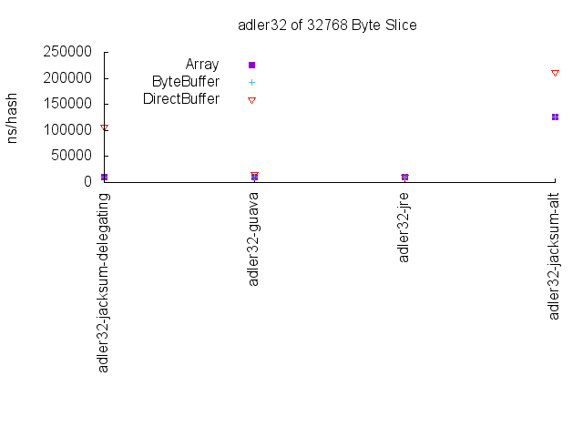

| Algorithm |  Array | ByteBuffer | DirectBuffer |
| --- | ---: | ---: | ---: | 
| [adler32-jacksum-delegating](#adler32-jacksum-delegating-latency) | 11112.685211 | 11054.832256 | 107074.947325 |
| [adler32-guava](#adler32-guava-latency) | 11140.069315 | 11091.563470 | 16038.905665 |
| [adler32-jre](#adler32-jre-latency) | 11196.564991 | 11180.435106 | 11277.159680 |
| [adler32-jacksum-alt](#adler32-jacksum-alt-latency) | 125513.463957 | 125111.561371 | 211919.956624 |

---
### 32768 Byte Slice Latency (city64)
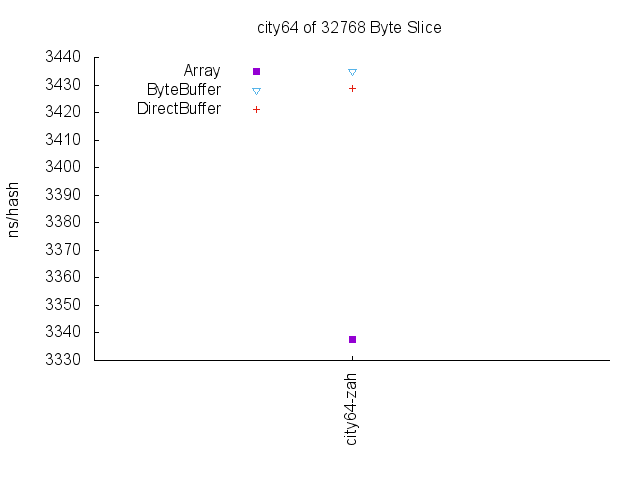

| Algorithm |  Array | ByteBuffer | DirectBuffer |
| --- | ---: | ---: | ---: | 
| [city64-zah](#city64-zah-latency) | 3337.675380 | 3434.762430 | 3428.891379 |

---
### 32768 Byte Slice Latency (cksum)

| Algorithm |  Array | ByteBuffer | DirectBuffer |
| --- | ---: | ---: | ---: | 
| [cksum-jacksum](#cksum-jacksum-latency) | 87111.446736 | 84932.554856 | 168610.620011 |

---
### 32768 Byte Slice Latency (crc16)
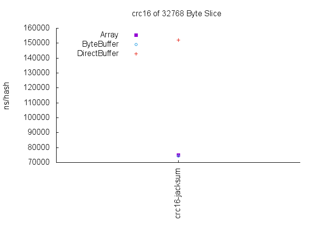

| Algorithm |  Array | ByteBuffer | DirectBuffer |
| --- | ---: | ---: | ---: | 
| [crc16-jacksum](#crc16-jacksum-latency) | 74879.536356 | 74229.665940 | 151991.229972 |

---
### 32768 Byte Slice Latency (crc24)
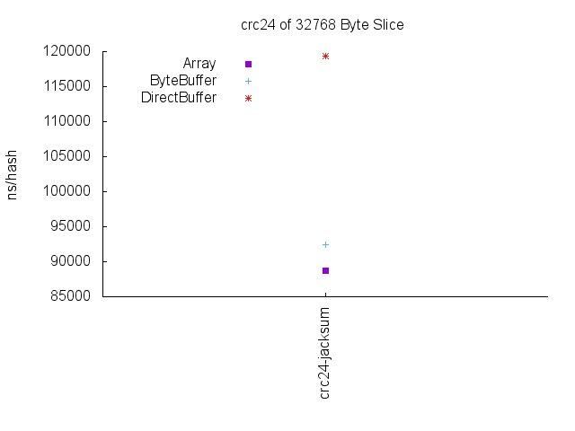

| Algorithm |  Array | ByteBuffer | DirectBuffer |
| --- | ---: | ---: | ---: | 
| [crc24-jacksum](#crc24-jacksum-latency) | 88735.991933 | 92400.648993 | 119372.924498 |

---
### 32768 Byte Slice Latency (crc32)
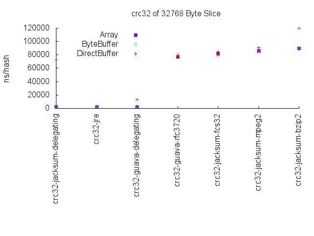

| Algorithm |  Array | ByteBuffer | DirectBuffer |
| --- | ---: | ---: | ---: | 
| [crc32-jacksum-delegating](#crc32-jacksum-delegating-latency) | 2401.765112 | 2361.681380 | 72542.675289 |
| [crc32-jre](#crc32-jre-latency) | 2412.858853 | 2388.040663 | 2405.195889 |
| [crc32-guava-delegating](#crc32-guava-delegating-latency) | 2482.262912 | 2427.116055 | 13508.430899 |
| [crc32-guava-rfc3720](#crc32-guava-rfc3720-latency) | 77023.370603 | 80454.722318 | 79778.519506 |
| [crc32-jacksum-fcs32](#crc32-jacksum-fcs32-latency) | 81448.692347 | 78551.178475 | 84430.155570 |
| [crc32-jacksum-mpeg2](#crc32-jacksum-mpeg2-latency) | 85933.970705 | 85170.145865 | 91077.297302 |
| [crc32-jacksum-bzip2](#crc32-jacksum-bzip2-latency) | 89885.513560 | 90216.261947 | 119711.166738 |

---
### 32768 Byte Slice Latency (crc64)
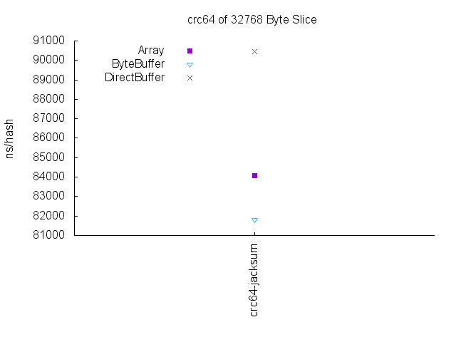

| Algorithm |  Array | ByteBuffer | DirectBuffer |
| --- | ---: | ---: | ---: | 
| [crc64-jacksum](#crc64-jacksum-latency) | 84077.374607 | 81818.823151 | 90455.435369 |

---
### 32768 Byte Slice Latency (crc8)
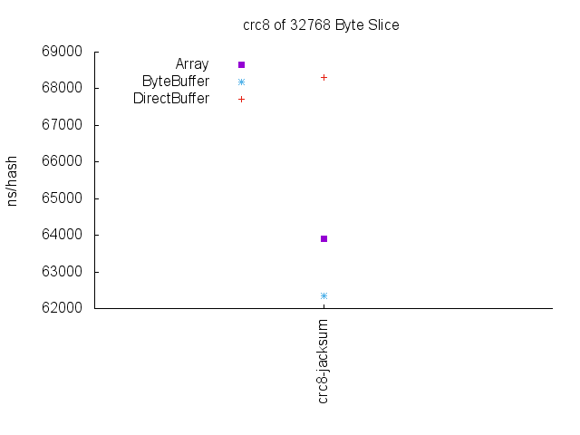

| Algorithm |  Array | ByteBuffer | DirectBuffer |
| --- | ---: | ---: | ---: | 
| [crc8-jacksum](#crc8-jacksum-latency) | 63897.542361 | 62353.331726 | 68315.291604 |

---
### 32768 Byte Slice Latency (ed2k)
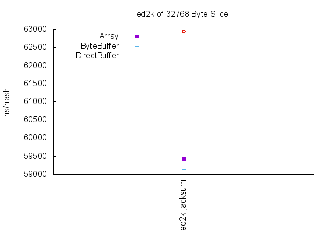

| Algorithm |  Array | ByteBuffer | DirectBuffer |
| --- | ---: | ---: | ---: | 
| [ed2k-jacksum](#ed2k-jacksum-latency) | 59424.960094 | 59142.675675 | 62947.240096 |

---
### 32768 Byte Slice Latency (elf)
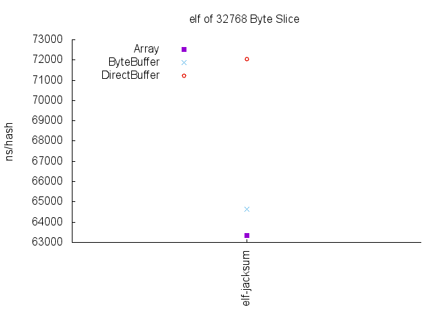

| Algorithm |  Array | ByteBuffer | DirectBuffer |
| --- | ---: | ---: | ---: | 
| [elf-jacksum](#elf-jacksum-latency) | 63346.877920 | 64641.006969 | 72048.373107 |

---
### 32768 Byte Slice Latency (farmna)
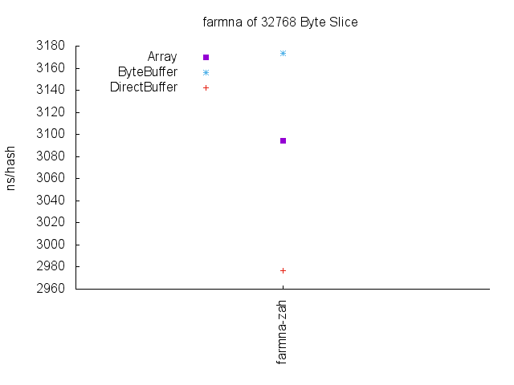

| Algorithm |  Array | ByteBuffer | DirectBuffer |
| --- | ---: | ---: | ---: | 
| [farmna-zah](#farmna-zah-latency) | 3094.282615 | 3173.306326 | 2976.676239 |

---
### 32768 Byte Slice Latency (farmuo)
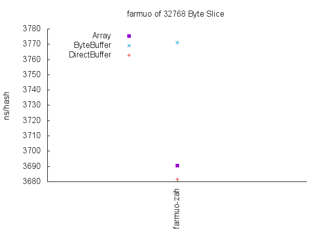

| Algorithm |  Array | ByteBuffer | DirectBuffer |
| --- | ---: | ---: | ---: | 
| [farmuo-zah](#farmuo-zah-latency) | 3690.424311 | 3771.140110 | 3681.575960 |

---
### 32768 Byte Slice Latency (fcs16)

| Algorithm |  Array | ByteBuffer | DirectBuffer |
| --- | ---: | ---: | ---: | 
| [fcs16-jacksum](#fcs16-jacksum-latency) | 85636.940072 | 87654.941671 | 92009.614549 |

---
### 32768 Byte Slice Latency (gfh32)
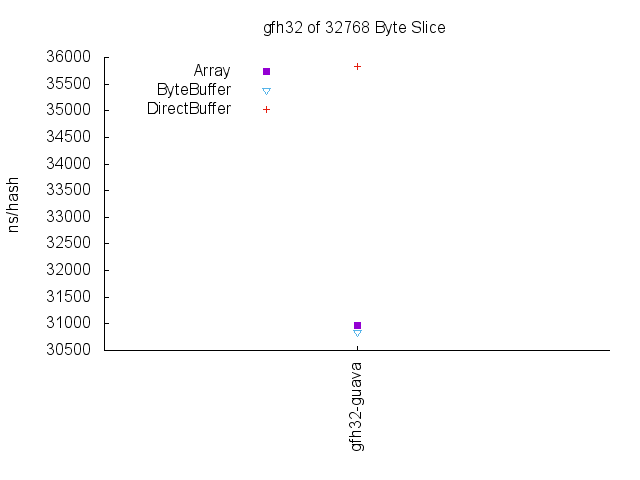

| Algorithm |  Array | ByteBuffer | DirectBuffer |
| --- | ---: | ---: | ---: | 
| [gfh32-guava](#gfh32-guava-latency) | 30977.948611 | 30829.050853 | 35827.241181 |

---
### 32768 Byte Slice Latency (gfh64)
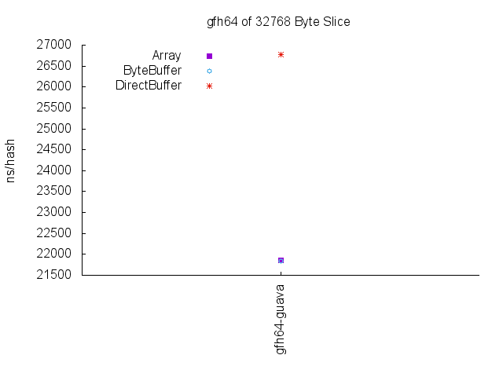

| Algorithm |  Array | ByteBuffer | DirectBuffer |
| --- | ---: | ---: | ---: | 
| [gfh64-guava](#gfh64-guava-latency) | 21847.584118 | 21832.240174 | 26771.220500 |

---
### 32768 Byte Slice Latency (gost)
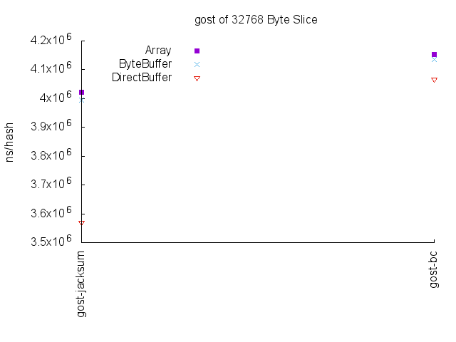

| Algorithm |  Array | ByteBuffer | DirectBuffer |
| --- | ---: | ---: | ---: | 
| [gost-jacksum](#gost-jacksum-latency) | 4022241.539436 | 3994006.286753 | 3570246.761063 |
| [gost-bc](#gost-bc-latency) | 4152752.872822 | 4135796.419340 | 4066574.768012 |

---
### 32768 Byte Slice Latency (has160)
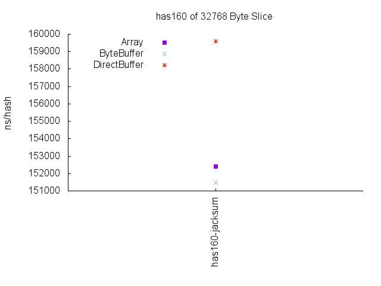

| Algorithm |  Array | ByteBuffer | DirectBuffer |
| --- | ---: | ---: | ---: | 
| [has160-jacksum](#has160-jacksum-latency) | 152407.973535 | 151469.351957 | 159598.448434 |

---
### 32768 Byte Slice Latency (haval128h3)

| Algorithm |  Array | ByteBuffer | DirectBuffer |
| --- | ---: | ---: | ---: | 
| [haval128h3-jacksum](#haval128h3-jacksum-latency) | 133126.754091 | 132204.605030 | 135753.538959 |

---
### 32768 Byte Slice Latency (haval128h4)
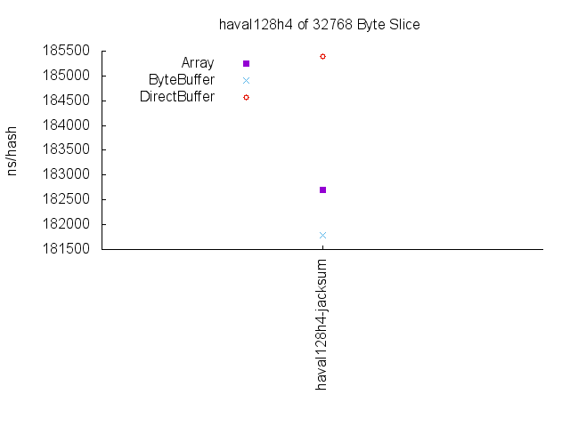

| Algorithm |  Array | ByteBuffer | DirectBuffer |
| --- | ---: | ---: | ---: | 
| [haval128h4-jacksum](#haval128h4-jacksum-latency) | 182706.446242 | 181787.540713 | 185398.485852 |

---
### 32768 Byte Slice Latency (haval128h5)
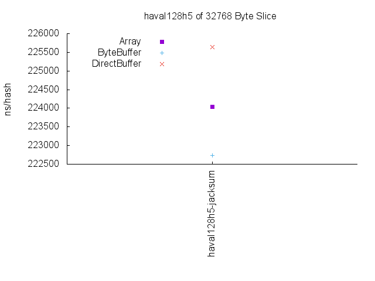

| Algorithm |  Array | ByteBuffer | DirectBuffer |
| --- | ---: | ---: | ---: | 
| [haval128h5-jacksum](#haval128h5-jacksum-latency) | 224035.273621 | 222732.005931 | 225639.875617 |

---
### 32768 Byte Slice Latency (haval160h3)
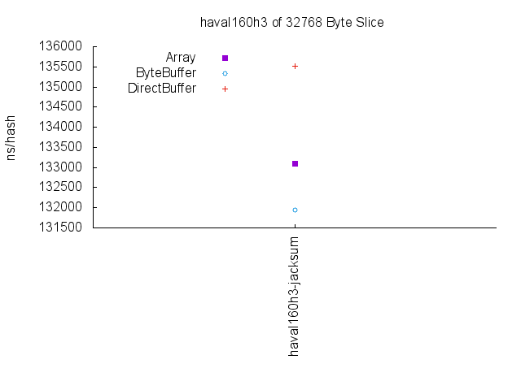

| Algorithm |  Array | ByteBuffer | DirectBuffer |
| --- | ---: | ---: | ---: | 
| [haval160h3-jacksum](#haval160h3-jacksum-latency) | 133101.945819 | 131936.045421 | 135507.672732 |

---
### 32768 Byte Slice Latency (haval160h4)

| Algorithm |  Array | ByteBuffer | DirectBuffer |
| --- | ---: | ---: | ---: | 
| [haval160h4-jacksum](#haval160h4-jacksum-latency) | 182758.054366 | 181827.154745 | 185173.088817 |

---
### 32768 Byte Slice Latency (haval160h5)
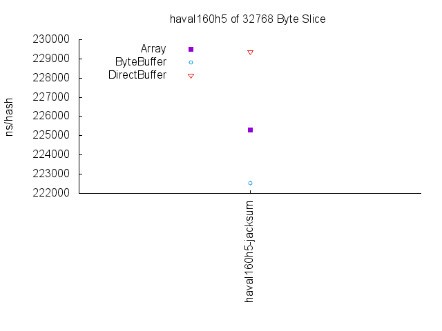

| Algorithm |  Array | ByteBuffer | DirectBuffer |
| --- | ---: | ---: | ---: | 
| [haval160h5-jacksum](#haval160h5-jacksum-latency) | 225302.282437 | 222545.147240 | 229339.441217 |

---
### 32768 Byte Slice Latency (haval192h3)
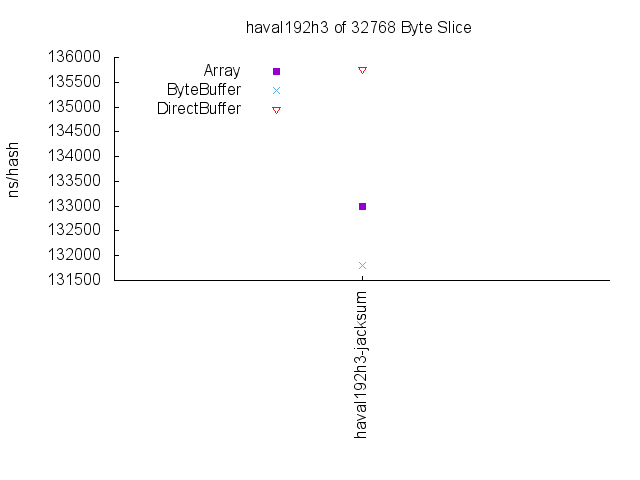

| Algorithm |  Array | ByteBuffer | DirectBuffer |
| --- | ---: | ---: | ---: | 
| [haval192h3-jacksum](#haval192h3-jacksum-latency) | 132989.408647 | 131799.229060 | 135765.835717 |

---
### 32768 Byte Slice Latency (haval192h4)
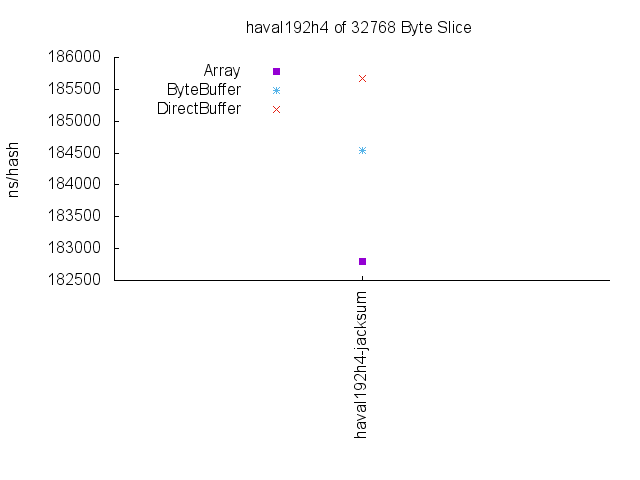

| Algorithm |  Array | ByteBuffer | DirectBuffer |
| --- | ---: | ---: | ---: | 
| [haval192h4-jacksum](#haval192h4-jacksum-latency) | 182799.408012 | 184543.663719 | 185665.981569 |

---
### 32768 Byte Slice Latency (haval192h5)
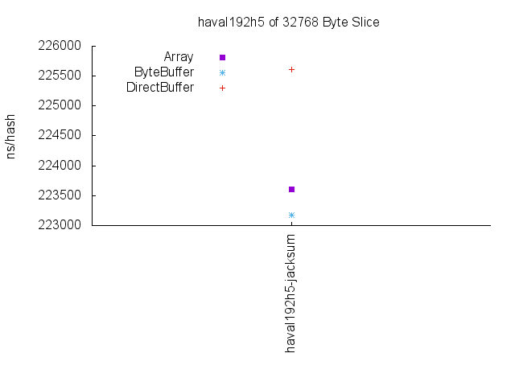

| Algorithm |  Array | ByteBuffer | DirectBuffer |
| --- | ---: | ---: | ---: | 
| [haval192h5-jacksum](#haval192h5-jacksum-latency) | 223604.312598 | 223177.229068 | 225609.845702 |

---
### 32768 Byte Slice Latency (haval224h3)
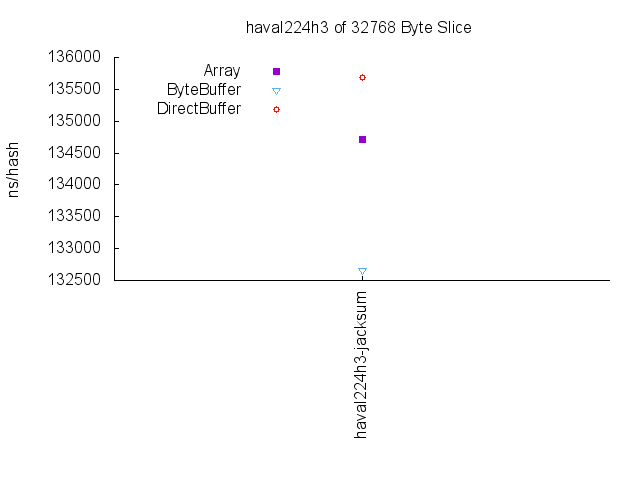

| Algorithm |  Array | ByteBuffer | DirectBuffer |
| --- | ---: | ---: | ---: | 
| [haval224h3-jacksum](#haval224h3-jacksum-latency) | 134719.993713 | 132664.706836 | 135678.476221 |

---
### 32768 Byte Slice Latency (haval224h4)
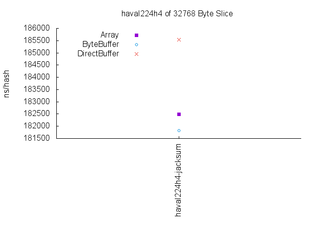

| Algorithm |  Array | ByteBuffer | DirectBuffer |
| --- | ---: | ---: | ---: | 
| [haval224h4-jacksum](#haval224h4-jacksum-latency) | 182485.830279 | 181826.899214 | 185528.167437 |

---
### 32768 Byte Slice Latency (haval224h5)
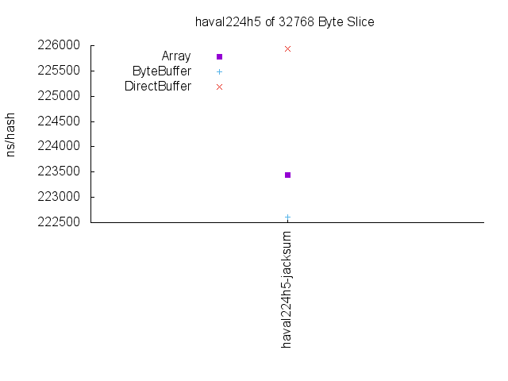

| Algorithm |  Array | ByteBuffer | DirectBuffer |
| --- | ---: | ---: | ---: | 
| [haval224h5-jacksum](#haval224h5-jacksum-latency) | 223448.486199 | 222609.047385 | 225934.482966 |

---
### 32768 Byte Slice Latency (haval256h3)
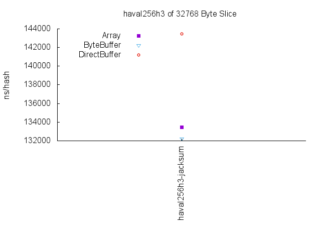

| Algorithm |  Array | ByteBuffer | DirectBuffer |
| --- | ---: | ---: | ---: | 
| [haval256h3-jacksum](#haval256h3-jacksum-latency) | 133462.685975 | 132233.932515 | 143437.288428 |

---
### 32768 Byte Slice Latency (haval256h4)
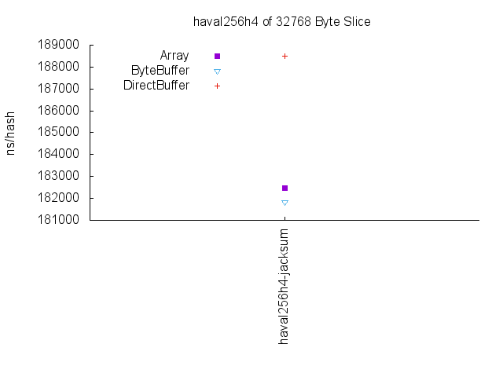

| Algorithm |  Array | ByteBuffer | DirectBuffer |
| --- | ---: | ---: | ---: | 
| [haval256h4-jacksum](#haval256h4-jacksum-latency) | 182465.688966 | 181839.757082 | 188513.484884 |

---
### 32768 Byte Slice Latency (haval256h5)
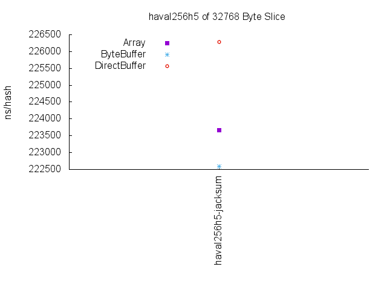

| Algorithm |  Array | ByteBuffer | DirectBuffer |
| --- | ---: | ---: | ---: | 
| [haval256h5-jacksum](#haval256h5-jacksum-latency) | 223667.559112 | 222590.652941 | 226280.533926 |

---
### 32768 Byte Slice Latency (md2)
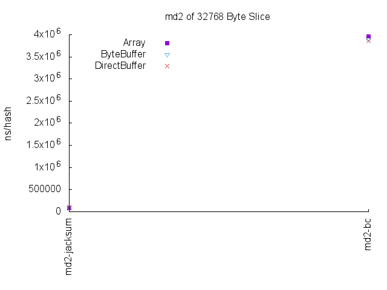

| Algorithm |  Array | ByteBuffer | DirectBuffer |
| --- | ---: | ---: | ---: | 
| [md2-jacksum](#md2-jacksum-latency) | 79549.189985 | 79248.338317 | 103657.606034 |
| [md2-bc](#md2-bc-latency) | 3957297.251833 | 3886339.381683 | 3866121.848248 |

---
### 32768 Byte Slice Latency (md4)
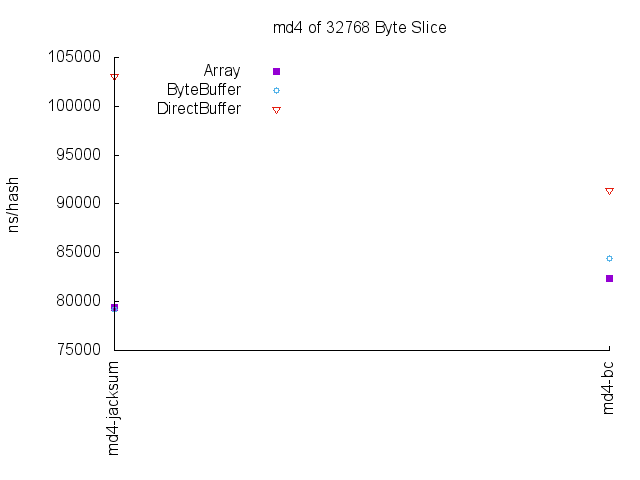

| Algorithm |  Array | ByteBuffer | DirectBuffer |
| --- | ---: | ---: | ---: | 
| [md4-jacksum](#md4-jacksum-latency) | 79410.716143 | 79226.986126 | 103071.023684 |
| [md4-bc](#md4-bc-latency) | 82338.626145 | 84449.095269 | 91409.672622 |

---
### 32768 Byte Slice Latency (md5)
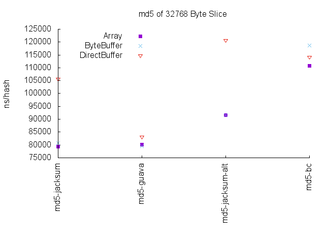

| Algorithm |  Array | ByteBuffer | DirectBuffer |
| --- | ---: | ---: | ---: | 
| [md5-jacksum](#md5-jacksum-latency) | 79386.768819 | 80805.453107 | 105604.451129 |
| [md5-guava](#md5-guava-latency) | 80100.363496 | 79536.701916 | 83068.618407 |
| [md5-jacksum-alt](#md5-jacksum-alt-latency) | 91695.855896 | 91538.599281 | 120730.406693 |
| [md5-bc](#md5-bc-latency) | 110795.935028 | 118723.168534 | 114164.014368 |

---
### 32768 Byte Slice Latency (murmur3h128)
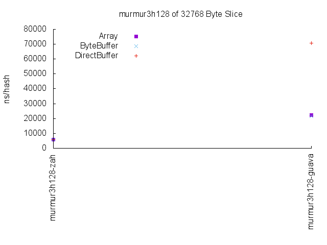

| Algorithm |  Array | ByteBuffer | DirectBuffer |
| --- | ---: | ---: | ---: | 
| [murmur3h128-zah](#murmur3h128-zah-latency) | 5695.297573 | 5730.214867 | 5726.628604 |
| [murmur3h128-guava](#murmur3h128-guava-latency) | 22440.784499 | 21793.962537 | 70884.155204 |

---
### 32768 Byte Slice Latency (murmur3h32)
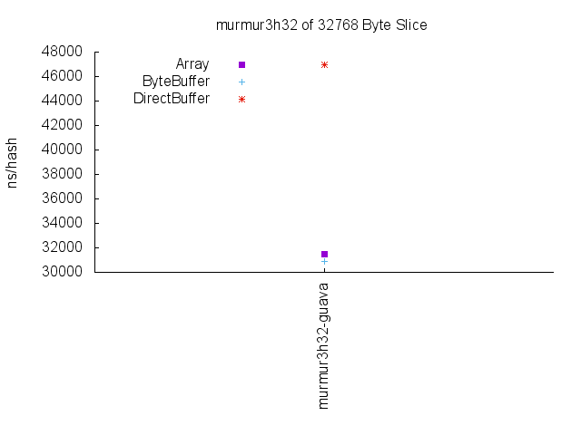

| Algorithm |  Array | ByteBuffer | DirectBuffer |
| --- | ---: | ---: | ---: | 
| [murmur3h32-guava](#murmur3h32-guava-latency) | 31498.013593 | 30858.181513 | 46938.430446 |

---
### 32768 Byte Slice Latency (ripemd128)
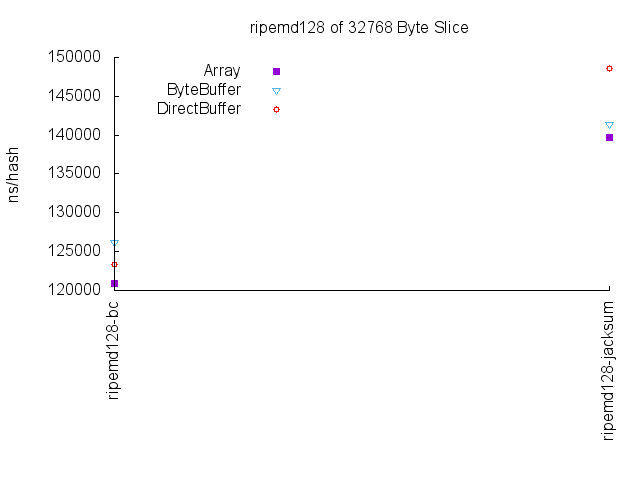

| Algorithm |  Array | ByteBuffer | DirectBuffer |
| --- | ---: | ---: | ---: | 
| [ripemd128-bc](#ripemd128-bc-latency) | 120861.841915 | 126233.677478 | 123378.819257 |
| [ripemd128-jacksum](#ripemd128-jacksum-latency) | 139664.932466 | 141345.690412 | 148537.498520 |

---
### 32768 Byte Slice Latency (ripemd160)
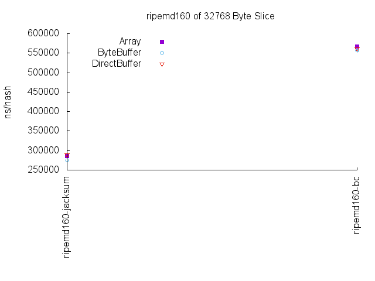

| Algorithm |  Array | ByteBuffer | DirectBuffer |
| --- | ---: | ---: | ---: | 
| [ripemd160-jacksum](#ripemd160-jacksum-latency) | 285492.450980 | 275663.661249 | 289265.668784 |
| [ripemd160-bc](#ripemd160-bc-latency) | 567441.976398 | 555724.385111 | 561687.429010 |

---
### 32768 Byte Slice Latency (ripemd256)
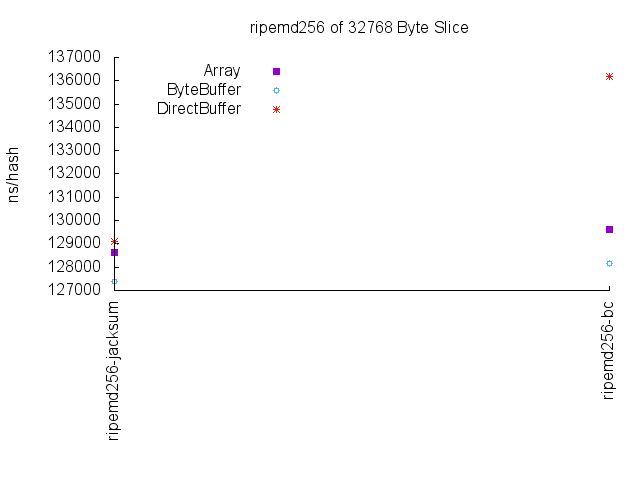

| Algorithm |  Array | ByteBuffer | DirectBuffer |
| --- | ---: | ---: | ---: | 
| [ripemd256-jacksum](#ripemd256-jacksum-latency) | 128615.299873 | 127375.124285 | 129105.253049 |
| [ripemd256-bc](#ripemd256-bc-latency) | 129611.357640 | 128143.989262 | 136173.132625 |

---
### 32768 Byte Slice Latency (ripemd320)
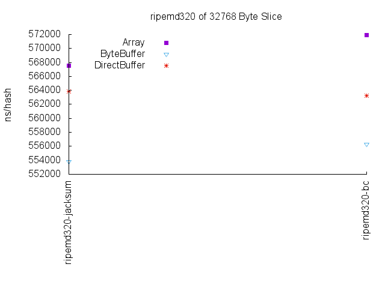

| Algorithm |  Array | ByteBuffer | DirectBuffer |
| --- | ---: | ---: | ---: | 
| [ripemd320-jacksum](#ripemd320-jacksum-latency) | 567542.454922 | 553799.066739 | 563868.466535 |
| [ripemd320-bc](#ripemd320-bc-latency) | 571946.277704 | 556329.593448 | 563203.917753 |

---
### 32768 Byte Slice Latency (sha0)
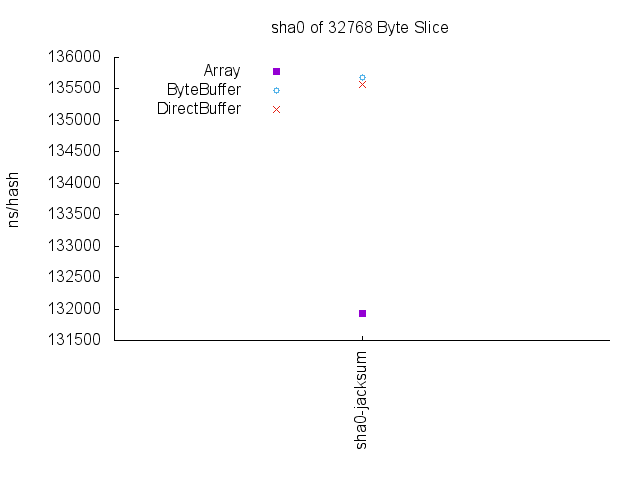

| Algorithm |  Array | ByteBuffer | DirectBuffer |
| --- | ---: | ---: | ---: | 
| [sha0-jacksum](#sha0-jacksum-latency) | 131922.614119 | 135685.496448 | 135576.788811 |

---
### 32768 Byte Slice Latency (sha1)
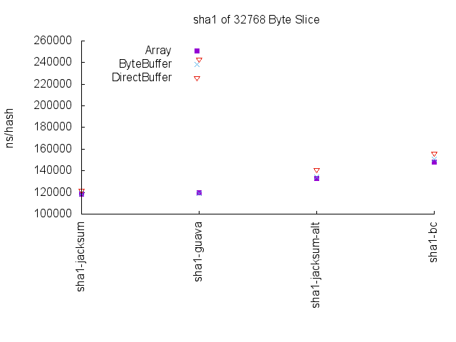

| Algorithm |  Array | ByteBuffer | DirectBuffer |
| --- | ---: | ---: | ---: | 
| [sha1-jacksum](#sha1-jacksum-latency) | 118597.784800 | 119184.464298 | 121789.773709 |
| [sha1-guava](#sha1-guava-latency) | 119657.462007 | 119310.094075 | 243163.942991 |
| [sha1-jacksum-alt](#sha1-jacksum-alt-latency) | 133047.000646 | 134538.818278 | 140592.359741 |
| [sha1-bc](#sha1-bc-latency) | 148194.488626 | 150882.025751 | 155931.027428 |

---
### 32768 Byte Slice Latency (sha224)
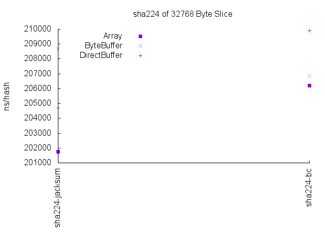

| Algorithm |  Array | ByteBuffer | DirectBuffer |
| --- | ---: | ---: | ---: | 
| [sha224-jacksum](#sha224-jacksum-latency) | 201766.613240 | 208682.181202 | 204697.794497 |
| [sha224-bc](#sha224-bc-latency) | 206198.087109 | 206845.039876 | 209889.289689 |

---
### 32768 Byte Slice Latency (sha256)
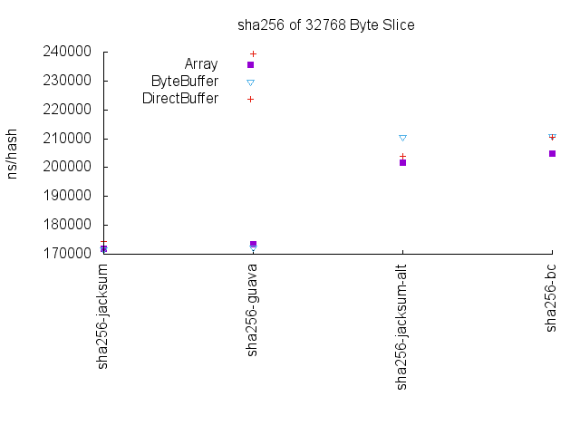

| Algorithm |  Array | ByteBuffer | DirectBuffer |
| --- | ---: | ---: | ---: | 
| [sha256-jacksum](#sha256-jacksum-latency) | 171949.410465 | 171632.917193 | 174415.250917 |
| [sha256-guava](#sha256-guava-latency) | 173358.253601 | 172251.826966 | 239467.968080 |
| [sha256-jacksum-alt](#sha256-jacksum-alt-latency) | 201691.929625 | 210550.282609 | 203880.515820 |
| [sha256-bc](#sha256-bc-latency) | 204721.450827 | 210718.484025 | 210456.354285 |

---
### 32768 Byte Slice Latency (sha3)
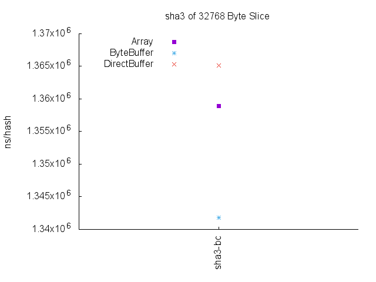

| Algorithm |  Array | ByteBuffer | DirectBuffer |
| --- | ---: | ---: | ---: | 
| [sha3-bc](#sha3-bc-latency) | 1358930.785793 | 1341776.005211 | 1365138.350775 |

---
### 32768 Byte Slice Latency (sha384)
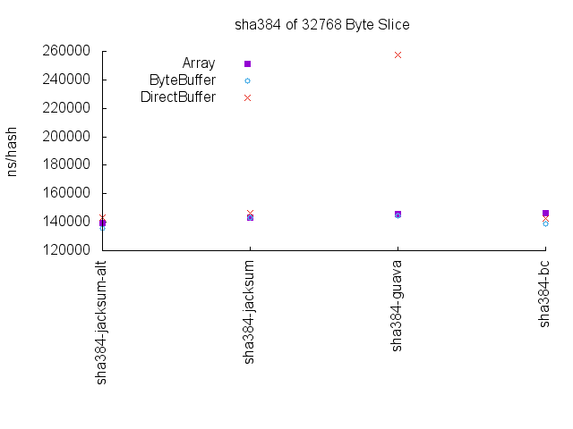

| Algorithm |  Array | ByteBuffer | DirectBuffer |
| --- | ---: | ---: | ---: | 
| [sha384-jacksum-alt](#sha384-jacksum-alt-latency) | 139240.484345 | 135809.704642 | 143217.309584 |
| [sha384-jacksum](#sha384-jacksum-latency) | 143280.083299 | 143334.895444 | 146643.796719 |
| [sha384-guava](#sha384-guava-latency) | 145429.968135 | 144187.060905 | 257697.232770 |
| [sha384-bc](#sha384-bc-latency) | 146352.202768 | 138943.591520 | 142719.425857 |

---
### 32768 Byte Slice Latency (sha512)
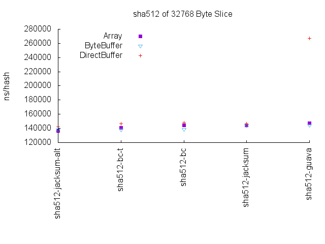

| Algorithm |  Array | ByteBuffer | DirectBuffer |
| --- | ---: | ---: | ---: | 
| [sha512-jacksum-alt](#sha512-jacksum-alt-latency) | 136431.208848 | 138165.054940 | 142233.116477 |
| [sha512-bc-t](#sha512-bc-t-latency) | 140851.901050 | 137726.755905 | 146713.320232 |
| [sha512-bc](#sha512-bc-latency) | 144111.946348 | 138896.150913 | 147942.576454 |
| [sha512-jacksum](#sha512-jacksum-latency) | 144469.656007 | 143992.179855 | 146561.565937 |
| [sha512-guava](#sha512-guava-latency) | 147421.576200 | 144321.428211 | 267035.777394 |

---
### 32768 Byte Slice Latency (sip)
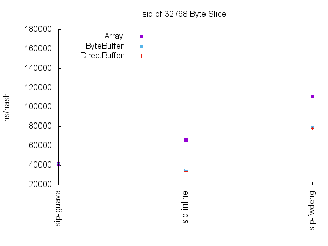

| Algorithm |  Array | ByteBuffer | DirectBuffer |
| --- | ---: | ---: | ---: | 
| [sip-guava](#sip-guava-latency) | 41169.150258 | 40794.021335 | 162174.799871 |
| [sip-inline](#sip-inline-latency) | 65690.291060 | 34865.404878 | 33595.188849 |
| [sip-fwdeng](#sip-fwdeng-latency) | 110637.114150 | 79033.360302 | 78074.538307 |

---
### 32768 Byte Slice Latency (skein1024)
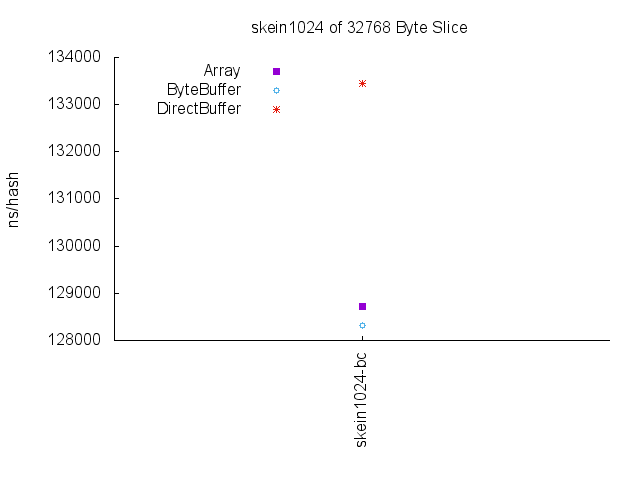

| Algorithm |  Array | ByteBuffer | DirectBuffer |
| --- | ---: | ---: | ---: | 
| [skein1024-bc](#skein1024-bc-latency) | 128721.802720 | 128309.326450 | 133453.861631 |

---
### 32768 Byte Slice Latency (skein256)
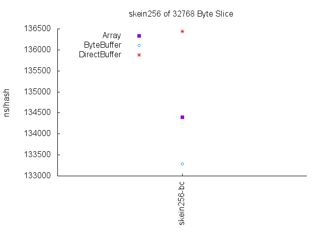

| Algorithm |  Array | ByteBuffer | DirectBuffer |
| --- | ---: | ---: | ---: | 
| [skein256-bc](#skein256-bc-latency) | 134393.259276 | 133284.302177 | 136434.359747 |

---
### 32768 Byte Slice Latency (skein512)
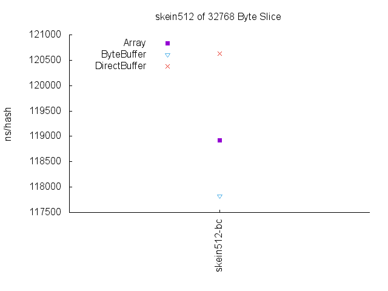

| Algorithm |  Array | ByteBuffer | DirectBuffer |
| --- | ---: | ---: | ---: | 
| [skein512-bc](#skein512-bc-latency) | 118918.475034 | 117823.387932 | 120631.086076 |

---
### 32768 Byte Slice Latency (sm3)
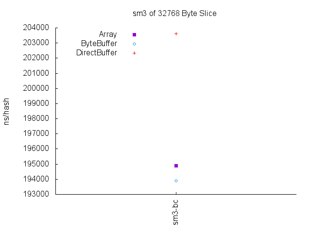

| Algorithm |  Array | ByteBuffer | DirectBuffer |
| --- | ---: | ---: | ---: | 
| [sm3-bc](#sm3-bc-latency) | 194883.390031 | 193894.344735 | 203600.562639 |

---
### 32768 Byte Slice Latency (sum16)
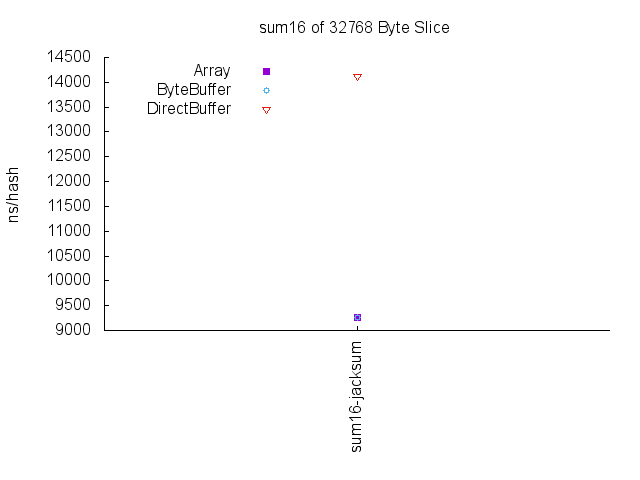

| Algorithm |  Array | ByteBuffer | DirectBuffer |
| --- | ---: | ---: | ---: | 
| [sum16-jacksum](#sum16-jacksum-latency) | 9270.630819 | 9261.910459 | 14116.770669 |

---
### 32768 Byte Slice Latency (sum24)
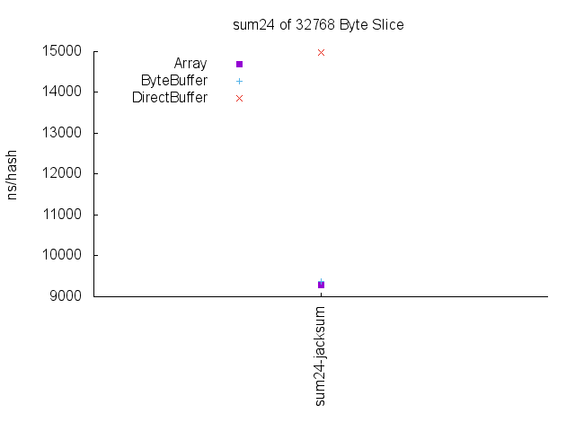

| Algorithm |  Array | ByteBuffer | DirectBuffer |
| --- | ---: | ---: | ---: | 
| [sum24-jacksum](#sum24-jacksum-latency) | 9293.735256 | 9382.050196 | 14987.684649 |

---
### 32768 Byte Slice Latency (sum32)
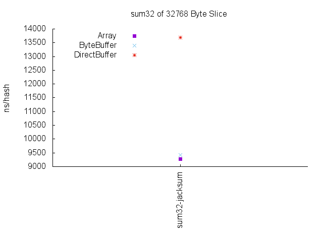

| Algorithm |  Array | ByteBuffer | DirectBuffer |
| --- | ---: | ---: | ---: | 
| [sum32-jacksum](#sum32-jacksum-latency) | 9265.667838 | 9412.929185 | 13696.136605 |

---
### 32768 Byte Slice Latency (sum8)
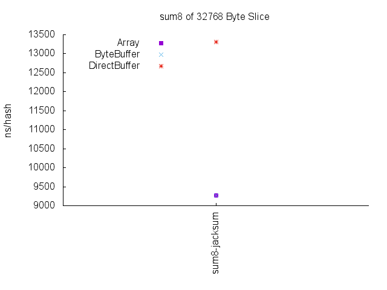

| Algorithm |  Array | ByteBuffer | DirectBuffer |
| --- | ---: | ---: | ---: | 
| [sum8-jacksum](#sum8-jacksum-latency) | 9273.889493 | 9264.051134 | 13313.730969 |

---
### 32768 Byte Slice Latency (sumbsd)
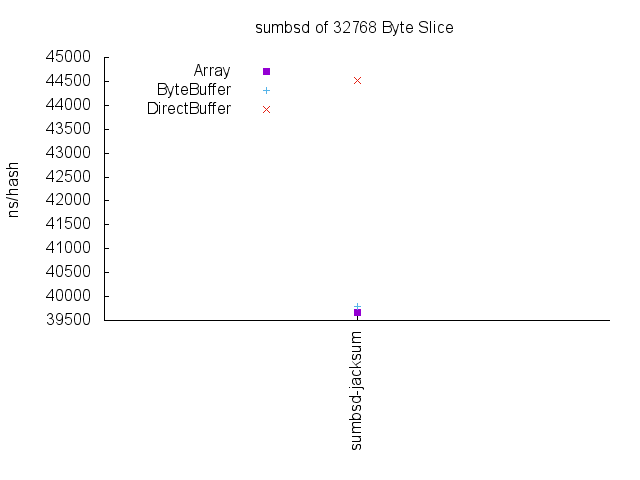

| Algorithm |  Array | ByteBuffer | DirectBuffer |
| --- | ---: | ---: | ---: | 
| [sumbsd-jacksum](#sumbsd-jacksum-latency) | 39657.828634 | 39789.122694 | 44516.787447 |

---
### 32768 Byte Slice Latency (sumsysv)
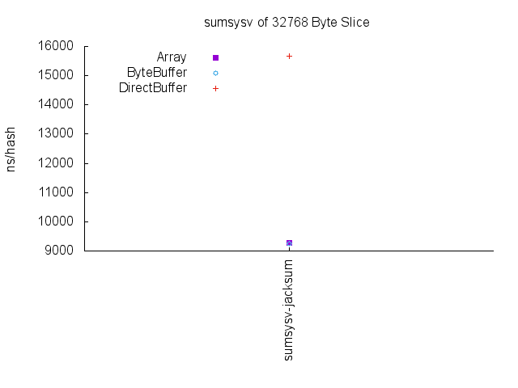

| Algorithm |  Array | ByteBuffer | DirectBuffer |
| --- | ---: | ---: | ---: | 
| [sumsysv-jacksum](#sumsysv-jacksum-latency) | 9271.063310 | 9250.667196 | 15675.696743 |

---
### 32768 Byte Slice Latency (tiger)
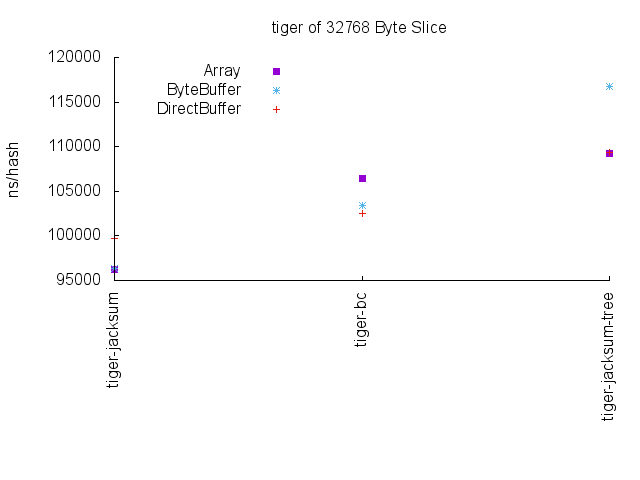

| Algorithm |  Array | ByteBuffer | DirectBuffer |
| --- | ---: | ---: | ---: | 
| [tiger-jacksum](#tiger-jacksum-latency) | 96235.427284 | 96360.760532 | 99755.396993 |
| [tiger-bc](#tiger-bc-latency) | 106398.740240 | 103406.307166 | 102555.519100 |
| [tiger-jacksum-tree](#tiger-jacksum-tree-latency) | 109228.445134 | 116771.488921 | 109373.813026 |

---
### 32768 Byte Slice Latency (tiger128)
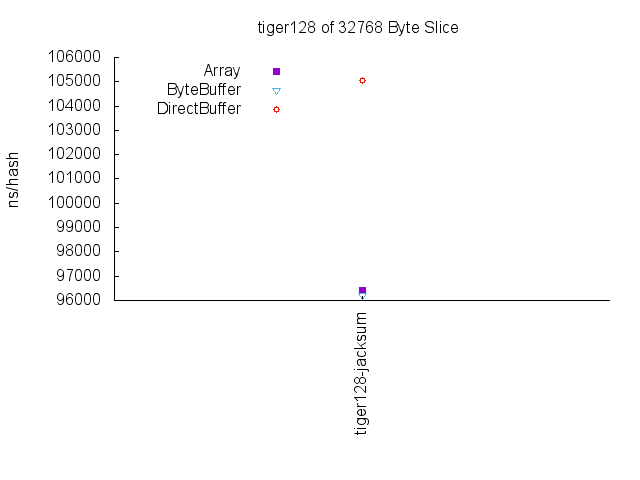

| Algorithm |  Array | ByteBuffer | DirectBuffer |
| --- | ---: | ---: | ---: | 
| [tiger128-jacksum](#tiger128-jacksum-latency) | 96423.909610 | 96225.042253 | 105042.045868 |

---
### 32768 Byte Slice Latency (tiger160)
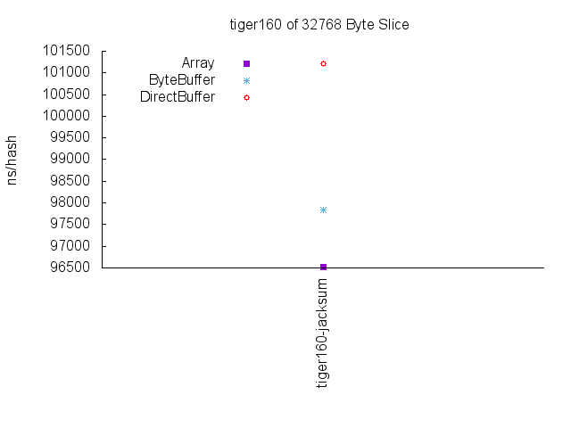

| Algorithm |  Array | ByteBuffer | DirectBuffer |
| --- | ---: | ---: | ---: | 
| [tiger160-jacksum](#tiger160-jacksum-latency) | 96512.457122 | 97842.178509 | 101207.099637 |

---
### 32768 Byte Slice Latency (tiger2)
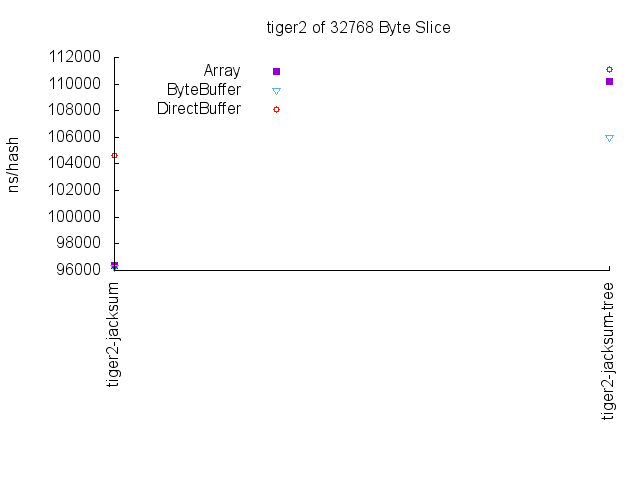

| Algorithm |  Array | ByteBuffer | DirectBuffer |
| --- | ---: | ---: | ---: | 
| [tiger2-jacksum](#tiger2-jacksum-latency) | 96354.422821 | 96224.322310 | 104674.625360 |
| [tiger2-jacksum-tree](#tiger2-jacksum-tree-latency) | 110190.655736 | 106005.605000 | 111127.887051 |

---
### 32768 Byte Slice Latency (whirlpool0)
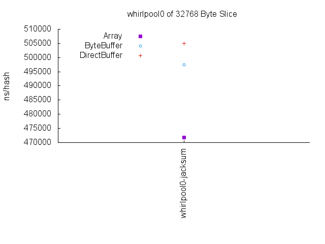

| Algorithm |  Array | ByteBuffer | DirectBuffer |
| --- | ---: | ---: | ---: | 
| [whirlpool0-jacksum](#whirlpool0-jacksum-latency) | 471825.197625 | 497386.317117 | 505036.533760 |

---
### 32768 Byte Slice Latency (whirlpool1)
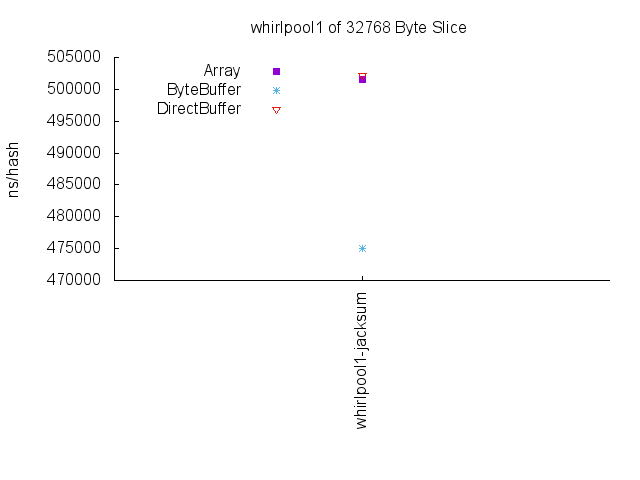

| Algorithm |  Array | ByteBuffer | DirectBuffer |
| --- | ---: | ---: | ---: | 
| [whirlpool1-jacksum](#whirlpool1-jacksum-latency) | 501584.184848 | 474985.561651 | 502137.316539 |

---
### 32768 Byte Slice Latency (whirlpool2)
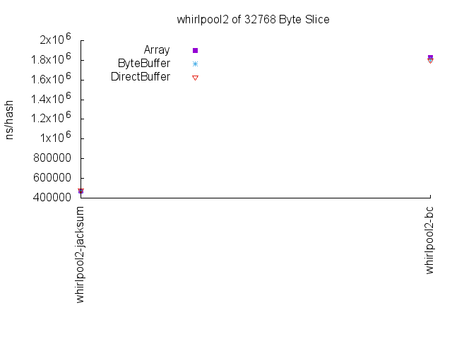

| Algorithm |  Array | ByteBuffer | DirectBuffer |
| --- | ---: | ---: | ---: | 
| [whirlpool2-jacksum](#whirlpool2-jacksum-latency) | 471215.039281 | 472039.365461 | 477019.787560 |
| [whirlpool2-bc](#whirlpool2-bc-latency) | 1831059.705929 | 1807697.952518 | 1801403.342961 |

---
### 32768 Byte Slice Latency (xor8)
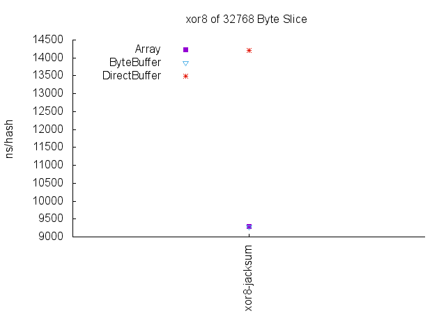

| Algorithm |  Array | ByteBuffer | DirectBuffer |
| --- | ---: | ---: | ---: | 
| [xor8-jacksum](#xor8-jacksum-latency) | 9299.940093 | 9266.092236 | 14204.993906 |

---
### 32768 Byte Slice Latency (xxh32)
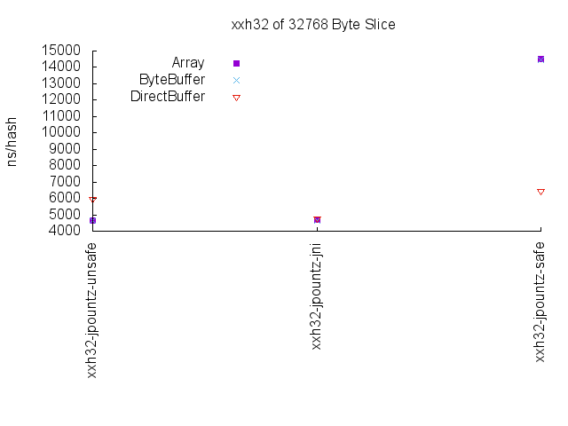

| Algorithm |  Array | ByteBuffer | DirectBuffer |
| --- | ---: | ---: | ---: | 
| [xxh32-jpountz-unsafe](#xxh32-jpountz-unsafe-latency) | 4670.079728 | 4638.437863 | 5938.299010 |
| [xxh32-jpountz-jni](#xxh32-jpountz-jni-latency) | 4714.594507 | 4664.831748 | 4779.561239 |
| [xxh32-jpountz-safe](#xxh32-jpountz-safe-latency) | 14532.652869 | 14454.092493 | 6445.043513 |

---
### 32768 Byte Slice Latency (xxh64)
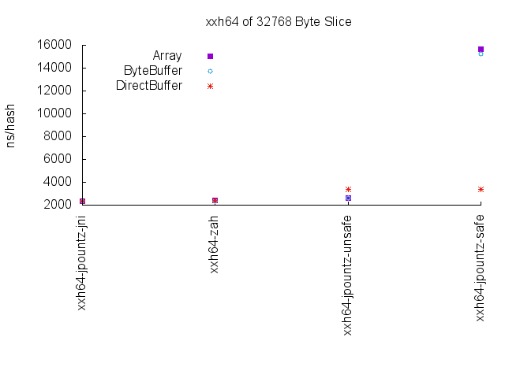

| Algorithm |  Array | ByteBuffer | DirectBuffer |
| --- | ---: | ---: | ---: | 
| [xxh64-jpountz-jni](#xxh64-jpountz-jni-latency) | 2365.333328 | 2375.359161 | 2357.866069 |
| [xxh64-zah](#xxh64-zah-latency) | 2394.944648 | 2330.808235 | 2394.061387 |
| [xxh64-jpountz-unsafe](#xxh64-jpountz-unsafe-latency) | 2630.670916 | 2618.192050 | 3370.527150 |
| [xxh64-jpountz-safe](#xxh64-jpountz-safe-latency) | 15650.211365 | 15247.445567 | 3383.817183 |

---
### adler32-guava Latency
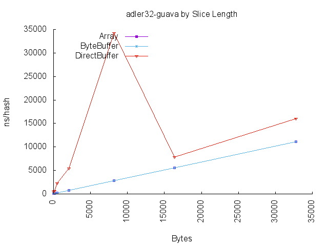

| Length |  Array | ByteBuffer | DirectBuffer |
| --- | ---: | ---: | ---: | 
| [32](#32-byte-slice-latency-all-hashes) | 66.757587 | 70.072093 | 581.396001 |
| [128](#128-byte-slice-latency-all-hashes) | 96.125894 | 104.391723 | 702.109013 |
| [512](#512-byte-slice-latency-all-hashes) | 225.995498 | 218.478381 | 2279.618156 |
| [2048](#2048-byte-slice-latency-all-hashes) | 718.231986 | 714.796751 | 5456.291379 |
| [8192](#8192-byte-slice-latency-all-hashes) | 2802.494967 | 2831.640011 | 34237.187180 |
| [16384](#16384-byte-slice-latency-all-hashes) | 5530.095518 | 5514.293339 | 7832.531158 |
| [32768](#32768-byte-slice-latency-all-hashes) | 11140.069315 | 11091.563470 | 16038.905665 |

---
### adler32-jacksum-alt Latency
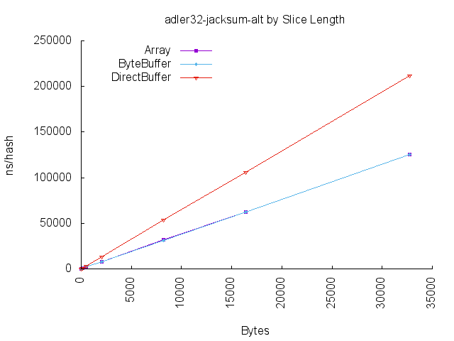

| Length |  Array | ByteBuffer | DirectBuffer |
| --- | ---: | ---: | ---: | 
| [32](#32-byte-slice-latency-all-hashes) | 125.565348 | 125.644611 | 265.092654 |
| [128](#128-byte-slice-latency-all-hashes) | 496.467568 | 493.061131 | 910.164271 |
| [512](#512-byte-slice-latency-all-hashes) | 1967.532425 | 1959.414866 | 3341.009126 |
| [2048](#2048-byte-slice-latency-all-hashes) | 7849.805499 | 7813.295048 | 13186.707200 |
| [8192](#8192-byte-slice-latency-all-hashes) | 31828.421921 | 31246.518813 | 53850.967207 |
| [16384](#16384-byte-slice-latency-all-hashes) | 62629.808821 | 62549.918981 | 105606.626391 |
| [32768](#32768-byte-slice-latency-all-hashes) | 125513.463957 | 125111.561371 | 211919.956624 |

---
### adler32-jacksum-delegating Latency
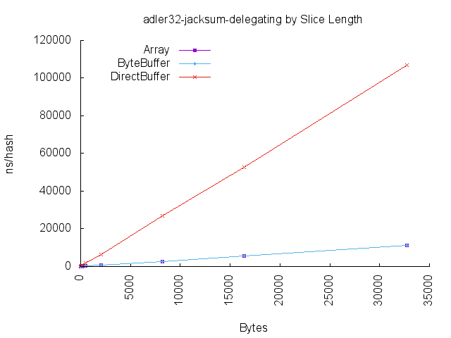

| Length |  Array | ByteBuffer | DirectBuffer |
| --- | ---: | ---: | ---: | 
| [32](#32-byte-slice-latency-all-hashes) | 55.517439 | 55.508701 | 229.592539 |
| [128](#128-byte-slice-latency-all-hashes) | 86.041804 | 85.911705 | 633.398888 |
| [512](#512-byte-slice-latency-all-hashes) | 209.010522 | 208.963937 | 1711.304946 |
| [2048](#2048-byte-slice-latency-all-hashes) | 709.686456 | 703.067799 | 6502.013009 |
| [8192](#8192-byte-slice-latency-all-hashes) | 2788.771107 | 2764.002179 | 26989.726461 |
| [16384](#16384-byte-slice-latency-all-hashes) | 5527.765340 | 5484.644571 | 52583.252726 |
| [32768](#32768-byte-slice-latency-all-hashes) | 11112.685211 | 11054.832256 | 107074.947325 |

---
### adler32-jre Latency
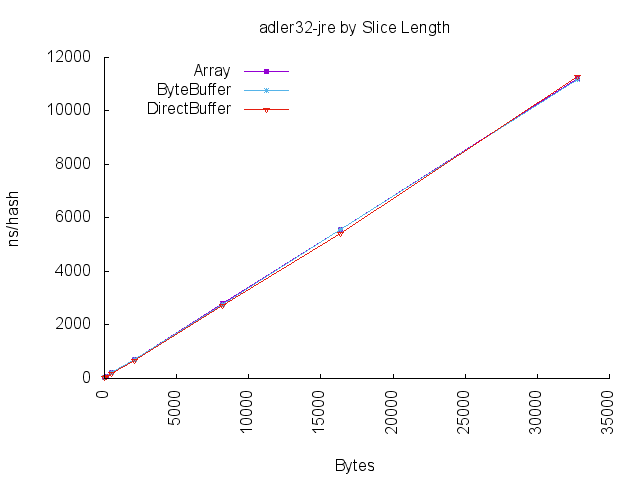

| Length |  Array | ByteBuffer | DirectBuffer |
| --- | ---: | ---: | ---: | 
| [32](#32-byte-slice-latency-all-hashes) | 53.856557 | 54.049116 | 31.448267 |
| [128](#128-byte-slice-latency-all-hashes) | 87.627326 | 83.724961 | 63.094092 |
| [512](#512-byte-slice-latency-all-hashes) | 207.305172 | 208.121217 | 185.615334 |
| [2048](#2048-byte-slice-latency-all-hashes) | 714.119134 | 701.798857 | 674.698281 |
| [8192](#8192-byte-slice-latency-all-hashes) | 2819.495248 | 2769.456825 | 2733.499793 |
| [16384](#16384-byte-slice-latency-all-hashes) | 5555.594460 | 5565.436909 | 5417.836004 |
| [32768](#32768-byte-slice-latency-all-hashes) | 11196.564991 | 11180.435106 | 11277.159680 |

---
### city64-zah Latency
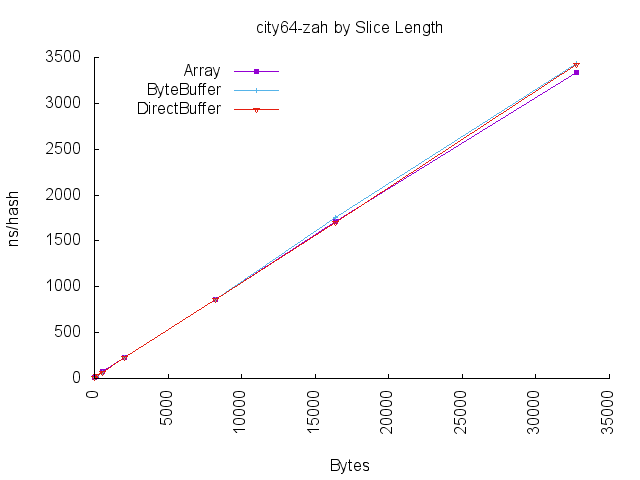

| Length |  Array | ByteBuffer | DirectBuffer |
| --- | ---: | ---: | ---: | 
| [32](#32-byte-slice-latency-all-hashes) | 9.407101 | 9.928558 | 10.373027 |
| [128](#128-byte-slice-latency-all-hashes) | 26.770539 | 27.151367 | 27.709382 |
| [512](#512-byte-slice-latency-all-hashes) | 70.985810 | 70.807517 | 68.928564 |
| [2048](#2048-byte-slice-latency-all-hashes) | 225.881740 | 225.155285 | 234.189595 |
| [8192](#8192-byte-slice-latency-all-hashes) | 860.886946 | 859.463968 | 860.038829 |
| [16384](#16384-byte-slice-latency-all-hashes) | 1709.654117 | 1750.093846 | 1704.830213 |
| [32768](#32768-byte-slice-latency-all-hashes) | 3337.675380 | 3434.762430 | 3428.891379 |

---
### cksum-jacksum Latency
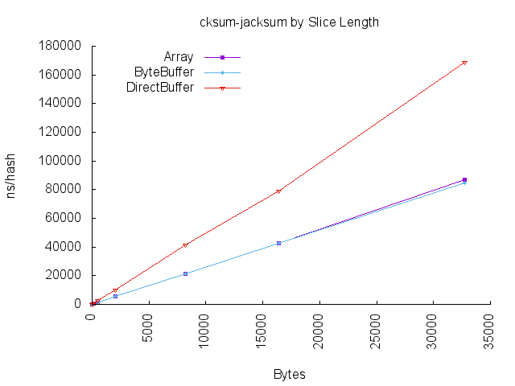

| Length |  Array | ByteBuffer | DirectBuffer |
| --- | ---: | ---: | ---: | 
| [32](#32-byte-slice-latency-all-hashes) | 84.203514 | 83.318807 | 235.358728 |
| [128](#128-byte-slice-latency-all-hashes) | 337.366639 | 337.461772 | 662.599733 |
| [512](#512-byte-slice-latency-all-hashes) | 1340.705233 | 1343.503336 | 2551.954086 |
| [2048](#2048-byte-slice-latency-all-hashes) | 5354.749022 | 5418.506759 | 10337.649203 |
| [8192](#8192-byte-slice-latency-all-hashes) | 21455.798659 | 21372.225880 | 41283.723545 |
| [16384](#16384-byte-slice-latency-all-hashes) | 42883.466114 | 42671.014761 | 79007.979410 |
| [32768](#32768-byte-slice-latency-all-hashes) | 87111.446736 | 84932.554856 | 168610.620011 |

---
### crc16-jacksum Latency
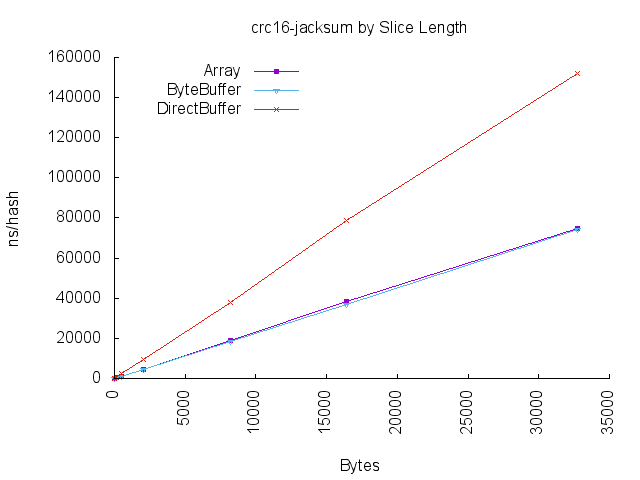

| Length |  Array | ByteBuffer | DirectBuffer |
| --- | ---: | ---: | ---: | 
| [32](#32-byte-slice-latency-all-hashes) | 69.976222 | 70.602697 | 233.985747 |
| [128](#128-byte-slice-latency-all-hashes) | 289.128075 | 287.133437 | 697.202747 |
| [512](#512-byte-slice-latency-all-hashes) | 1163.533307 | 1157.797629 | 2553.825632 |
| [2048](#2048-byte-slice-latency-all-hashes) | 4670.168612 | 4635.178797 | 9697.891878 |
| [8192](#8192-byte-slice-latency-all-hashes) | 18698.873133 | 18540.861796 | 38123.446230 |
| [16384](#16384-byte-slice-latency-all-hashes) | 38510.862727 | 37082.227851 | 78628.607315 |
| [32768](#32768-byte-slice-latency-all-hashes) | 74879.536356 | 74229.665940 | 151991.229972 |

---
### crc24-jacksum Latency
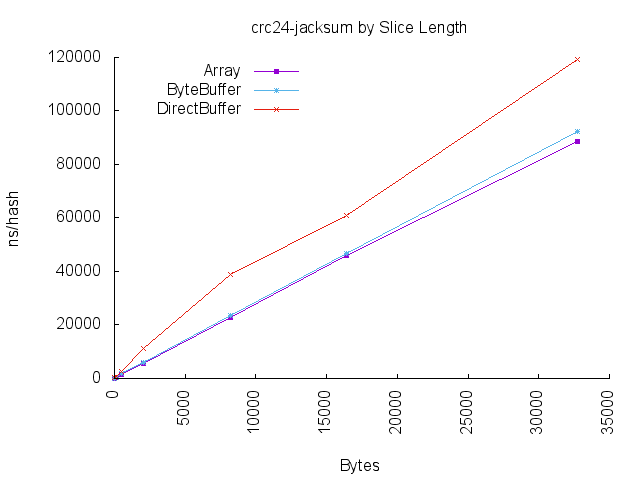

| Length |  Array | ByteBuffer | DirectBuffer |
| --- | ---: | ---: | ---: | 
| [32](#32-byte-slice-latency-all-hashes) | 90.564758 | 108.886511 | 222.084843 |
| [128](#128-byte-slice-latency-all-hashes) | 355.813976 | 429.830150 | 684.382383 |
| [512](#512-byte-slice-latency-all-hashes) | 1394.479034 | 1756.599399 | 2772.674166 |
| [2048](#2048-byte-slice-latency-all-hashes) | 5720.126292 | 5877.734273 | 11210.046952 |
| [8192](#8192-byte-slice-latency-all-hashes) | 22943.249947 | 23377.722905 | 38979.927978 |
| [16384](#16384-byte-slice-latency-all-hashes) | 45964.511309 | 46733.162455 | 61030.205325 |
| [32768](#32768-byte-slice-latency-all-hashes) | 88735.991933 | 92400.648993 | 119372.924498 |

---
### crc32-guava-delegating Latency
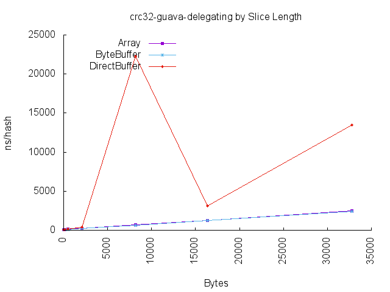

| Length |  Array | ByteBuffer | DirectBuffer |
| --- | ---: | ---: | ---: | 
| [32](#32-byte-slice-latency-all-hashes) | 74.701149 | 77.307829 | 72.624592 |
| [128](#128-byte-slice-latency-all-hashes) | 96.730522 | 94.997697 | 93.885340 |
| [512](#512-byte-slice-latency-all-hashes) | 123.429061 | 116.612923 | 136.366467 |
| [2048](#2048-byte-slice-latency-all-hashes) | 224.061148 | 223.863154 | 427.499695 |
| [8192](#8192-byte-slice-latency-all-hashes) | 662.492317 | 658.990262 | 22270.187645 |
| [16384](#16384-byte-slice-latency-all-hashes) | 1241.593723 | 1257.116364 | 3114.432764 |
| [32768](#32768-byte-slice-latency-all-hashes) | 2482.262912 | 2427.116055 | 13508.430899 |

---
### crc32-guava-rfc3720 Latency
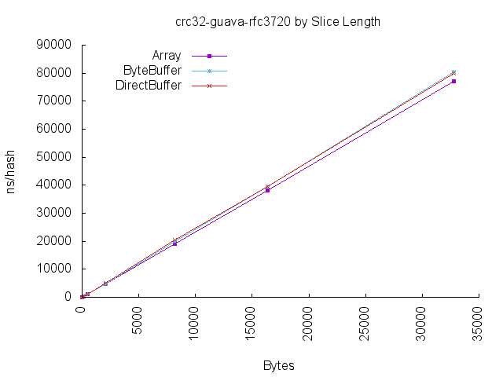

| Length |  Array | ByteBuffer | DirectBuffer |
| --- | ---: | ---: | ---: | 
| [32](#32-byte-slice-latency-all-hashes) | 85.459036 | 88.431852 | 105.357434 |
| [128](#128-byte-slice-latency-all-hashes) | 309.428893 | 324.510106 | 322.188454 |
| [512](#512-byte-slice-latency-all-hashes) | 1203.222020 | 1205.030236 | 1247.006106 |
| [2048](#2048-byte-slice-latency-all-hashes) | 4760.770701 | 4778.884064 | 5076.438888 |
| [8192](#8192-byte-slice-latency-all-hashes) | 19103.521337 | 19846.067772 | 20357.208079 |
| [16384](#16384-byte-slice-latency-all-hashes) | 38238.104384 | 39570.531379 | 39497.124419 |
| [32768](#32768-byte-slice-latency-all-hashes) | 77023.370603 | 80454.722318 | 79778.519506 |

---
### crc32-jacksum-bzip2 Latency
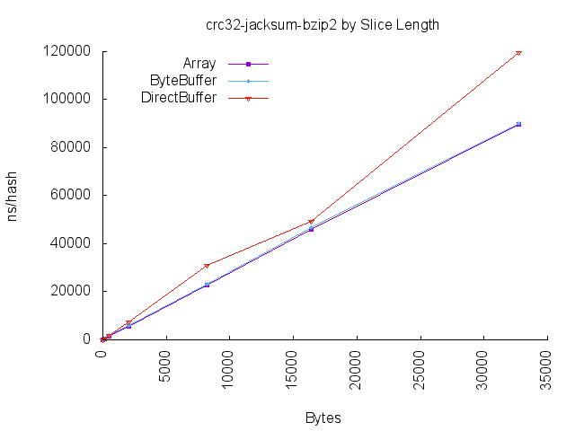

| Length |  Array | ByteBuffer | DirectBuffer |
| --- | ---: | ---: | ---: | 
| [32](#32-byte-slice-latency-all-hashes) | 89.059349 | 108.722860 | 178.831462 |
| [128](#128-byte-slice-latency-all-hashes) | 349.999314 | 436.748690 | 462.246433 |
| [512](#512-byte-slice-latency-all-hashes) | 1390.937073 | 1732.882749 | 1947.696090 |
| [2048](#2048-byte-slice-latency-all-hashes) | 5731.753587 | 5848.502736 | 7629.973788 |
| [8192](#8192-byte-slice-latency-all-hashes) | 22942.682029 | 23341.093996 | 30854.752812 |
| [16384](#16384-byte-slice-latency-all-hashes) | 45869.446347 | 46694.873370 | 49162.735570 |
| [32768](#32768-byte-slice-latency-all-hashes) | 89885.513560 | 90216.261947 | 119711.166738 |

---
### crc32-jacksum-delegating Latency
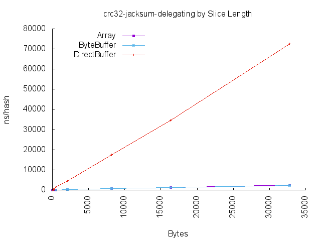

| Length |  Array | ByteBuffer | DirectBuffer |
| --- | ---: | ---: | ---: | 
| [32](#32-byte-slice-latency-all-hashes) | 41.559724 | 55.447773 | 112.315903 |
| [128](#128-byte-slice-latency-all-hashes) | 77.259863 | 75.330008 | 364.915767 |
| [512](#512-byte-slice-latency-all-hashes) | 98.044188 | 97.430464 | 1532.192482 |
| [2048](#2048-byte-slice-latency-all-hashes) | 208.255569 | 182.503202 | 4454.384415 |
| [8192](#8192-byte-slice-latency-all-hashes) | 642.405958 | 637.143103 | 17467.241507 |
| [16384](#16384-byte-slice-latency-all-hashes) | 1224.562609 | 1214.351090 | 34635.351145 |
| [32768](#32768-byte-slice-latency-all-hashes) | 2401.765112 | 2361.681380 | 72542.675289 |

---
### crc32-jacksum-fcs32 Latency
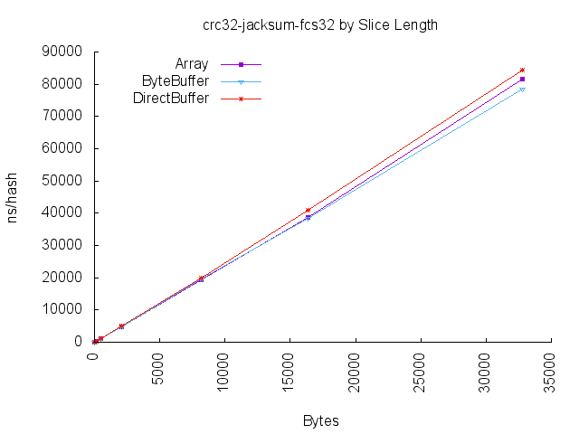

| Length |  Array | ByteBuffer | DirectBuffer |
| --- | ---: | ---: | ---: | 
| [32](#32-byte-slice-latency-all-hashes) | 74.951457 | 74.563420 | 94.294270 |
| [128](#128-byte-slice-latency-all-hashes) | 302.085977 | 297.804317 | 329.608422 |
| [512](#512-byte-slice-latency-all-hashes) | 1206.304329 | 1198.647438 | 1255.779816 |
| [2048](#2048-byte-slice-latency-all-hashes) | 4822.947212 | 4825.431773 | 5096.730322 |
| [8192](#8192-byte-slice-latency-all-hashes) | 19303.791348 | 19486.121397 | 19884.442216 |
| [16384](#16384-byte-slice-latency-all-hashes) | 38792.930265 | 38513.886010 | 40914.383093 |
| [32768](#32768-byte-slice-latency-all-hashes) | 81448.692347 | 78551.178475 | 84430.155570 |

---
### crc32-jacksum-mpeg2 Latency
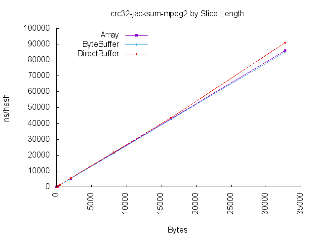

| Length |  Array | ByteBuffer | DirectBuffer |
| --- | ---: | ---: | ---: | 
| [32](#32-byte-slice-latency-all-hashes) | 86.707520 | 80.903706 | 105.919762 |
| [128](#128-byte-slice-latency-all-hashes) | 332.681268 | 331.112436 | 354.728575 |
| [512](#512-byte-slice-latency-all-hashes) | 1340.302839 | 1333.871469 | 1355.958080 |
| [2048](#2048-byte-slice-latency-all-hashes) | 5368.738296 | 5387.872287 | 5507.407631 |
| [8192](#8192-byte-slice-latency-all-hashes) | 21415.723362 | 21318.526762 | 21861.436047 |
| [16384](#16384-byte-slice-latency-all-hashes) | 42847.220138 | 42538.101968 | 43661.590893 |
| [32768](#32768-byte-slice-latency-all-hashes) | 85933.970705 | 85170.145865 | 91077.297302 |

---
### crc32-jre Latency
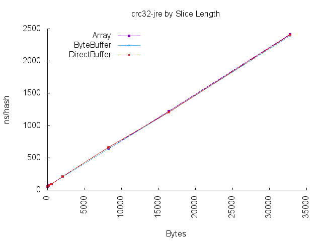

| Length |  Array | ByteBuffer | DirectBuffer |
| --- | ---: | ---: | ---: | 
| [32](#32-byte-slice-latency-all-hashes) | 51.696788 | 53.108855 | 54.402320 |
| [128](#128-byte-slice-latency-all-hashes) | 73.150060 | 73.310518 | 73.023028 |
| [512](#512-byte-slice-latency-all-hashes) | 93.218980 | 94.831546 | 94.255694 |
| [2048](#2048-byte-slice-latency-all-hashes) | 203.882470 | 204.062684 | 210.319111 |
| [8192](#8192-byte-slice-latency-all-hashes) | 638.955548 | 635.586854 | 661.396545 |
| [16384](#16384-byte-slice-latency-all-hashes) | 1222.502092 | 1210.520056 | 1205.040864 |
| [32768](#32768-byte-slice-latency-all-hashes) | 2412.858853 | 2388.040663 | 2405.195889 |

---
### crc64-jacksum Latency
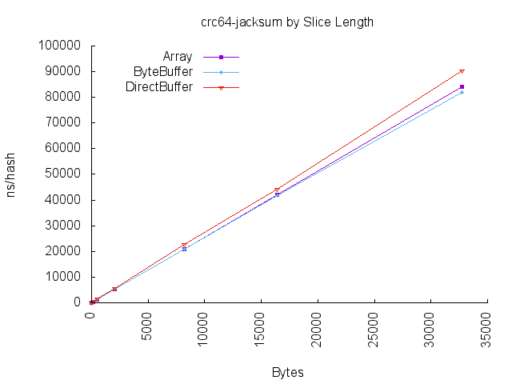

| Length |  Array | ByteBuffer | DirectBuffer |
| --- | ---: | ---: | ---: | 
| [32](#32-byte-slice-latency-all-hashes) | 77.758994 | 77.664560 | 102.852619 |
| [128](#128-byte-slice-latency-all-hashes) | 325.555830 | 322.624391 | 359.807905 |
| [512](#512-byte-slice-latency-all-hashes) | 1314.596257 | 1320.676474 | 1443.484609 |
| [2048](#2048-byte-slice-latency-all-hashes) | 5249.825467 | 5210.841131 | 5461.479119 |
| [8192](#8192-byte-slice-latency-all-hashes) | 21011.520998 | 20838.739022 | 22754.755526 |
| [16384](#16384-byte-slice-latency-all-hashes) | 41942.289100 | 41805.198314 | 44240.614135 |
| [32768](#32768-byte-slice-latency-all-hashes) | 84077.374607 | 81818.823151 | 90455.435369 |

---
### crc8-jacksum Latency
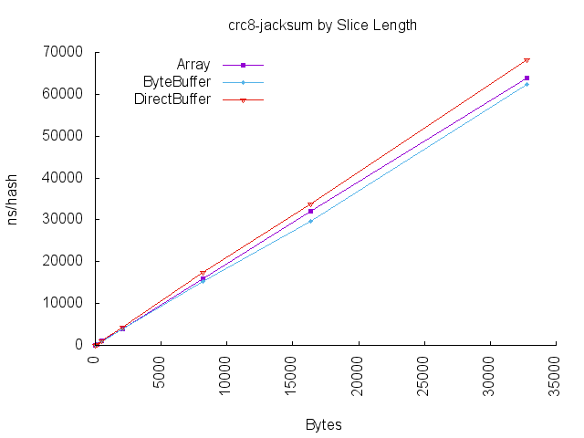

| Length |  Array | ByteBuffer | DirectBuffer |
| --- | ---: | ---: | ---: | 
| [32](#32-byte-slice-latency-all-hashes) | 46.858089 | 49.907222 | 82.689718 |
| [128](#128-byte-slice-latency-all-hashes) | 238.120951 | 231.094953 | 274.732034 |
| [512](#512-byte-slice-latency-all-hashes) | 997.315267 | 950.160232 | 1054.810076 |
| [2048](#2048-byte-slice-latency-all-hashes) | 3995.091144 | 3831.410976 | 4274.176596 |
| [8192](#8192-byte-slice-latency-all-hashes) | 16015.146839 | 15342.934768 | 17465.439896 |
| [16384](#16384-byte-slice-latency-all-hashes) | 31995.527288 | 29661.475423 | 33807.808324 |
| [32768](#32768-byte-slice-latency-all-hashes) | 63897.542361 | 62353.331726 | 68315.291604 |

---
### ed2k-jacksum Latency
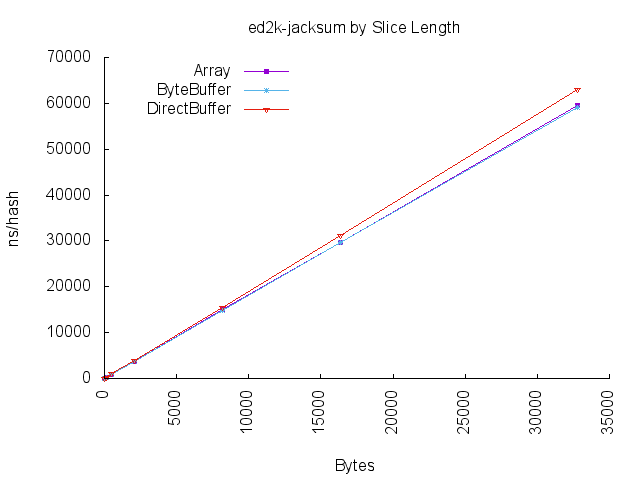

| Length |  Array | ByteBuffer | DirectBuffer |
| --- | ---: | ---: | ---: | 
| [32](#32-byte-slice-latency-all-hashes) | 31.479206 | 33.533765 | 53.106518 |
| [128](#128-byte-slice-latency-all-hashes) | 265.170420 | 262.050898 | 296.109387 |
| [512](#512-byte-slice-latency-all-hashes) | 964.419007 | 955.636852 | 1006.765457 |
| [2048](#2048-byte-slice-latency-all-hashes) | 3762.532695 | 3738.755207 | 4001.208169 |
| [8192](#8192-byte-slice-latency-all-hashes) | 14969.359206 | 14803.093551 | 15491.088202 |
| [16384](#16384-byte-slice-latency-all-hashes) | 29703.955056 | 29562.499659 | 31093.456052 |
| [32768](#32768-byte-slice-latency-all-hashes) | 59424.960094 | 59142.675675 | 62947.240096 |

---
### elf-jacksum Latency
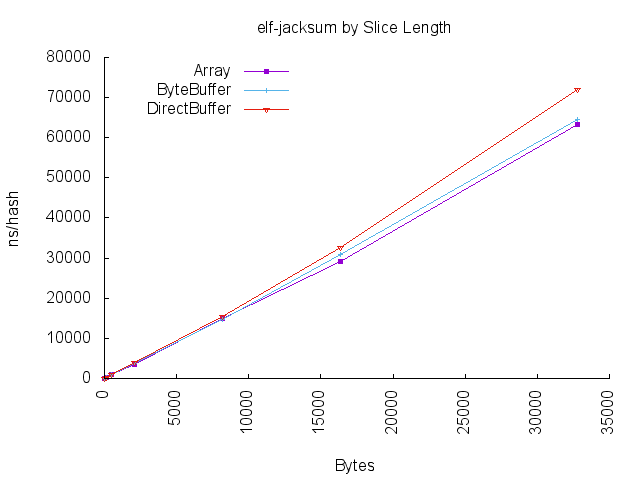

| Length |  Array | ByteBuffer | DirectBuffer |
| --- | ---: | ---: | ---: | 
| [32](#32-byte-slice-latency-all-hashes) | 54.555876 | 56.092029 | 76.720002 |
| [128](#128-byte-slice-latency-all-hashes) | 229.506601 | 222.444846 | 253.335851 |
| [512](#512-byte-slice-latency-all-hashes) | 895.383623 | 914.138849 | 971.422753 |
| [2048](#2048-byte-slice-latency-all-hashes) | 3598.015453 | 3632.059735 | 3883.640406 |
| [8192](#8192-byte-slice-latency-all-hashes) | 14848.280673 | 14718.406315 | 15357.624883 |
| [16384](#16384-byte-slice-latency-all-hashes) | 29234.739349 | 30894.363299 | 32596.572334 |
| [32768](#32768-byte-slice-latency-all-hashes) | 63346.877920 | 64641.006969 | 72048.373107 |

---
### farmna-zah Latency
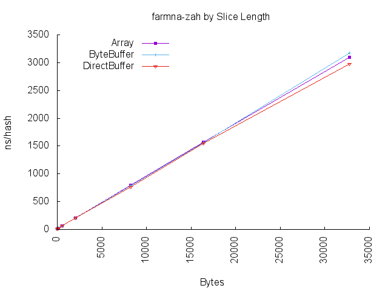

| Length |  Array | ByteBuffer | DirectBuffer |
| --- | ---: | ---: | ---: | 
| [32](#32-byte-slice-latency-all-hashes) | 9.386000 | 10.017795 | 14.576828 |
| [128](#128-byte-slice-latency-all-hashes) | 23.235866 | 27.306477 | 25.120309 |
| [512](#512-byte-slice-latency-all-hashes) | 59.998095 | 63.420445 | 61.503269 |
| [2048](#2048-byte-slice-latency-all-hashes) | 202.962415 | 204.674326 | 211.190804 |
| [8192](#8192-byte-slice-latency-all-hashes) | 795.992037 | 783.890624 | 759.124886 |
| [16384](#16384-byte-slice-latency-all-hashes) | 1568.139924 | 1559.947880 | 1552.309521 |
| [32768](#32768-byte-slice-latency-all-hashes) | 3094.282615 | 3173.306326 | 2976.676239 |

---
### farmuo-zah Latency
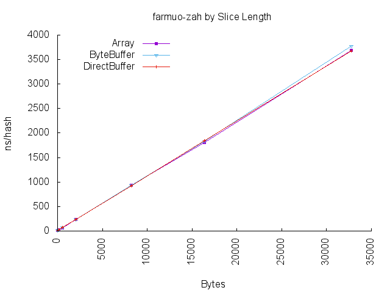

| Length |  Array | ByteBuffer | DirectBuffer |
| --- | ---: | ---: | ---: | 
| [32](#32-byte-slice-latency-all-hashes) | 9.563776 | 9.862444 | 11.135525 |
| [128](#128-byte-slice-latency-all-hashes) | 30.042585 | 26.654625 | 27.136750 |
| [512](#512-byte-slice-latency-all-hashes) | 67.589138 | 70.727797 | 69.492793 |
| [2048](#2048-byte-slice-latency-all-hashes) | 240.180324 | 241.451866 | 238.591073 |
| [8192](#8192-byte-slice-latency-all-hashes) | 934.455676 | 933.861325 | 927.154979 |
| [16384](#16384-byte-slice-latency-all-hashes) | 1803.515153 | 1835.194601 | 1846.520705 |
| [32768](#32768-byte-slice-latency-all-hashes) | 3690.424311 | 3771.140110 | 3681.575960 |

---
### fcs16-jacksum Latency
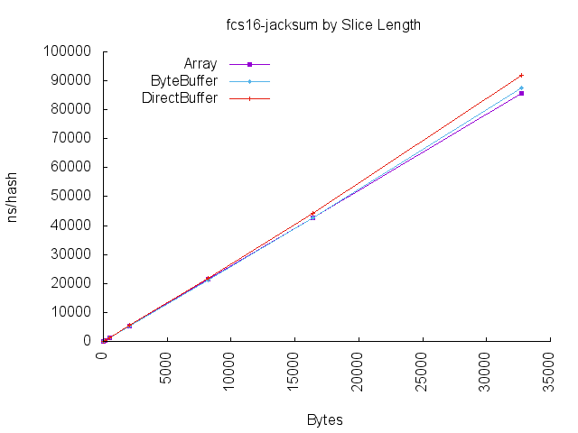

| Length |  Array | ByteBuffer | DirectBuffer |
| --- | ---: | ---: | ---: | 
| [32](#32-byte-slice-latency-all-hashes) | 81.691508 | 80.965521 | 106.696539 |
| [128](#128-byte-slice-latency-all-hashes) | 330.586159 | 329.145056 | 358.914976 |
| [512](#512-byte-slice-latency-all-hashes) | 1336.721129 | 1323.766321 | 1368.428682 |
| [2048](#2048-byte-slice-latency-all-hashes) | 5339.851389 | 5313.401031 | 5651.102579 |
| [8192](#8192-byte-slice-latency-all-hashes) | 21376.777036 | 21233.921417 | 21937.783284 |
| [16384](#16384-byte-slice-latency-all-hashes) | 42793.110846 | 42556.250862 | 44082.116297 |
| [32768](#32768-byte-slice-latency-all-hashes) | 85636.940072 | 87654.941671 | 92009.614549 |

---
### gfh32-guava Latency
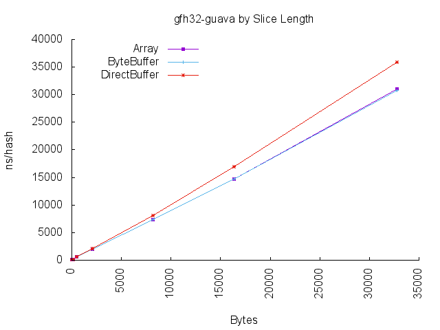

| Length |  Array | ByteBuffer | DirectBuffer |
| --- | ---: | ---: | ---: | 
| [32](#32-byte-slice-latency-all-hashes) | 84.745402 | 92.587313 | 101.419597 |
| [128](#128-byte-slice-latency-all-hashes) | 180.415212 | 153.317930 | 182.095482 |
| [512](#512-byte-slice-latency-all-hashes) | 601.405544 | 567.588781 | 607.067735 |
| [2048](#2048-byte-slice-latency-all-hashes) | 2003.891274 | 1978.765061 | 2126.708852 |
| [8192](#8192-byte-slice-latency-all-hashes) | 7345.530959 | 7303.848415 | 8091.697241 |
| [16384](#16384-byte-slice-latency-all-hashes) | 14760.544253 | 14681.549827 | 16962.688598 |
| [32768](#32768-byte-slice-latency-all-hashes) | 30977.948611 | 30829.050853 | 35827.241181 |

---
### gfh64-guava Latency
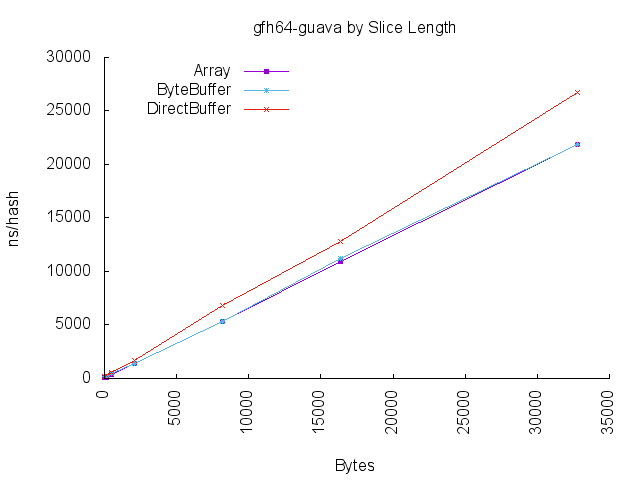

| Length |  Array | ByteBuffer | DirectBuffer |
| --- | ---: | ---: | ---: | 
| [32](#32-byte-slice-latency-all-hashes) | 72.465036 | 142.657700 | 164.529191 |
| [128](#128-byte-slice-latency-all-hashes) | 132.475242 | 204.298999 | 243.522174 |
| [512](#512-byte-slice-latency-all-hashes) | 380.894150 | 437.891397 | 522.638481 |
| [2048](#2048-byte-slice-latency-all-hashes) | 1393.473271 | 1439.668644 | 1713.642503 |
| [8192](#8192-byte-slice-latency-all-hashes) | 5345.208230 | 5334.926871 | 6821.571382 |
| [16384](#16384-byte-slice-latency-all-hashes) | 10955.340193 | 11170.593700 | 12775.529100 |
| [32768](#32768-byte-slice-latency-all-hashes) | 21847.584118 | 21832.240174 | 26771.220500 |

---
### gost-bc Latency
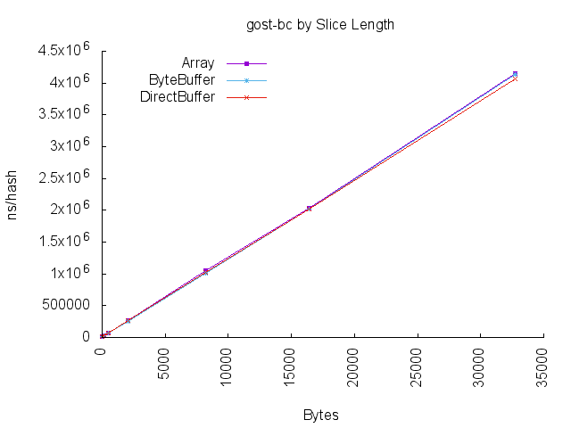

| Length |  Array | ByteBuffer | DirectBuffer |
| --- | ---: | ---: | ---: | 
| [32](#32-byte-slice-latency-all-hashes) | 12166.753708 | 11932.658969 | 11800.951498 |
| [128](#128-byte-slice-latency-all-hashes) | 23922.431463 | 24648.875020 | 23427.110352 |
| [512](#512-byte-slice-latency-all-hashes) | 71655.240501 | 73652.351295 | 70454.551106 |
| [2048](#2048-byte-slice-latency-all-hashes) | 262591.814401 | 259010.532124 | 266954.998310 |
| [8192](#8192-byte-slice-latency-all-hashes) | 1046205.685594 | 1015767.272863 | 1021761.154786 |
| [16384](#16384-byte-slice-latency-all-hashes) | 2038559.733807 | 2020458.172501 | 2013836.842593 |
| [32768](#32768-byte-slice-latency-all-hashes) | 4152752.872822 | 4135796.419340 | 4066574.768012 |

---
### gost-jacksum Latency
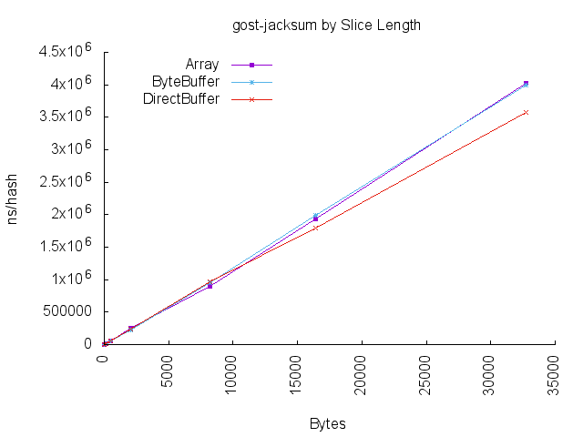

| Length |  Array | ByteBuffer | DirectBuffer |
| --- | ---: | ---: | ---: | 
| [32](#32-byte-slice-latency-all-hashes) | 3632.806632 | 3649.849867 | 3879.056693 |
| [128](#128-byte-slice-latency-all-hashes) | 15132.912116 | 15237.731552 | 15063.220336 |
| [512](#512-byte-slice-latency-all-hashes) | 56430.842527 | 56285.577900 | 56887.327681 |
| [2048](#2048-byte-slice-latency-all-hashes) | 248235.608486 | 223434.592748 | 243323.425555 |
| [8192](#8192-byte-slice-latency-all-hashes) | 903675.608805 | 955459.863441 | 972945.281759 |
| [16384](#16384-byte-slice-latency-all-hashes) | 1937987.426923 | 1988437.727843 | 1792381.290086 |
| [32768](#32768-byte-slice-latency-all-hashes) | 4022241.539436 | 3994006.286753 | 3570246.761063 |

---
### has160-jacksum Latency
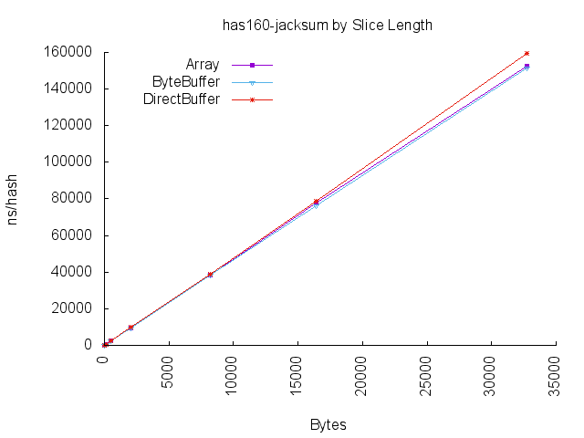

| Length |  Array | ByteBuffer | DirectBuffer |
| --- | ---: | ---: | ---: | 
| [32](#32-byte-slice-latency-all-hashes) | 26.411927 | 16.039462 | 107.255984 |
| [128](#128-byte-slice-latency-all-hashes) | 622.089940 | 625.302121 | 663.394994 |
| [512](#512-byte-slice-latency-all-hashes) | 2406.226268 | 2436.876956 | 2537.889744 |
| [2048](#2048-byte-slice-latency-all-hashes) | 9586.192604 | 9507.808665 | 9761.914165 |
| [8192](#8192-byte-slice-latency-all-hashes) | 38162.172636 | 38152.054592 | 38653.345680 |
| [16384](#16384-byte-slice-latency-all-hashes) | 77761.184427 | 76042.570488 | 78815.243847 |
| [32768](#32768-byte-slice-latency-all-hashes) | 152407.973535 | 151469.351957 | 159598.448434 |

---
### haval128h3-jacksum Latency
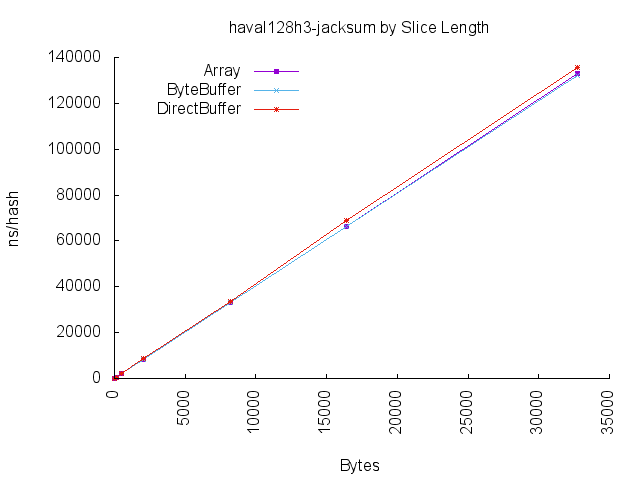

| Length |  Array | ByteBuffer | DirectBuffer |
| --- | ---: | ---: | ---: | 
| [32](#32-byte-slice-latency-all-hashes) | 27.986188 | 17.188748 | 101.237837 |
| [128](#128-byte-slice-latency-all-hashes) | 548.849891 | 534.434707 | 568.117906 |
| [512](#512-byte-slice-latency-all-hashes) | 2106.118221 | 2102.247033 | 2143.557439 |
| [2048](#2048-byte-slice-latency-all-hashes) | 8353.471062 | 8284.486195 | 8650.630436 |
| [8192](#8192-byte-slice-latency-all-hashes) | 33353.679323 | 33208.895460 | 33650.419839 |
| [16384](#16384-byte-slice-latency-all-hashes) | 66475.913683 | 66329.470829 | 68803.302701 |
| [32768](#32768-byte-slice-latency-all-hashes) | 133126.754091 | 132204.605030 | 135753.538959 |

---
### haval128h4-jacksum Latency

| Length |  Array | ByteBuffer | DirectBuffer |
| --- | ---: | ---: | ---: | 
| [32](#32-byte-slice-latency-all-hashes) | 27.241420 | 16.874177 | 107.468060 |
| [128](#128-byte-slice-latency-all-hashes) | 753.997693 | 728.139257 | 787.568646 |
| [512](#512-byte-slice-latency-all-hashes) | 2893.786757 | 2866.583727 | 2968.982851 |
| [2048](#2048-byte-slice-latency-all-hashes) | 11458.302781 | 11415.203419 | 11920.117614 |
| [8192](#8192-byte-slice-latency-all-hashes) | 45768.517721 | 45391.093795 | 46068.409809 |
| [16384](#16384-byte-slice-latency-all-hashes) | 91439.007998 | 90945.430613 | 95390.527438 |
| [32768](#32768-byte-slice-latency-all-hashes) | 182706.446242 | 181787.540713 | 185398.485852 |

---
### haval128h5-jacksum Latency
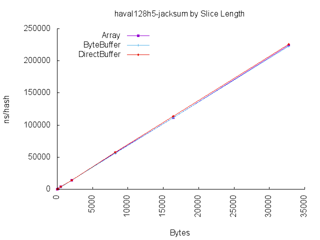

| Length |  Array | ByteBuffer | DirectBuffer |
| --- | ---: | ---: | ---: | 
| [32](#32-byte-slice-latency-all-hashes) | 27.351329 | 18.846723 | 96.110685 |
| [128](#128-byte-slice-latency-all-hashes) | 898.364735 | 883.138589 | 930.964157 |
| [512](#512-byte-slice-latency-all-hashes) | 3533.021183 | 3498.189732 | 3553.809695 |
| [2048](#2048-byte-slice-latency-all-hashes) | 14060.450728 | 13991.558367 | 14150.391134 |
| [8192](#8192-byte-slice-latency-all-hashes) | 56625.405828 | 55742.146256 | 57286.017319 |
| [16384](#16384-byte-slice-latency-all-hashes) | 111742.514316 | 111141.199603 | 113398.786743 |
| [32768](#32768-byte-slice-latency-all-hashes) | 224035.273621 | 222732.005931 | 225639.875617 |

---
### haval160h3-jacksum Latency
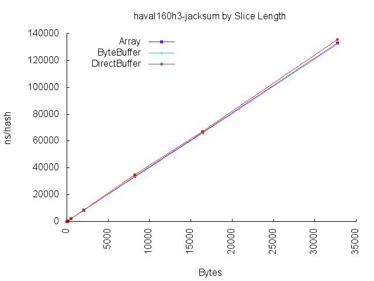

| Length |  Array | ByteBuffer | DirectBuffer |
| --- | ---: | ---: | ---: | 
| [32](#32-byte-slice-latency-all-hashes) | 27.973436 | 16.897309 | 101.864715 |
| [128](#128-byte-slice-latency-all-hashes) | 552.402122 | 534.821976 | 578.309215 |
| [512](#512-byte-slice-latency-all-hashes) | 2110.985946 | 2099.808161 | 2147.208953 |
| [2048](#2048-byte-slice-latency-all-hashes) | 8367.567783 | 8263.844029 | 8523.003433 |
| [8192](#8192-byte-slice-latency-all-hashes) | 33739.546691 | 33101.652051 | 34856.844513 |
| [16384](#16384-byte-slice-latency-all-hashes) | 66492.563693 | 65953.236915 | 67325.538992 |
| [32768](#32768-byte-slice-latency-all-hashes) | 133101.945819 | 131936.045421 | 135507.672732 |

---
### haval160h4-jacksum Latency
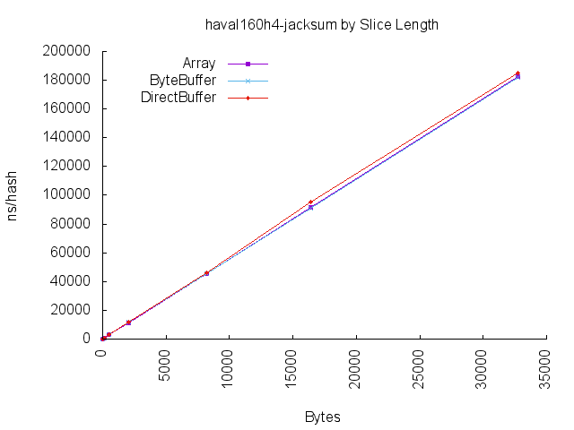

| Length |  Array | ByteBuffer | DirectBuffer |
| --- | ---: | ---: | ---: | 
| [32](#32-byte-slice-latency-all-hashes) | 27.310395 | 18.851448 | 102.382523 |
| [128](#128-byte-slice-latency-all-hashes) | 764.517595 | 727.838390 | 763.951007 |
| [512](#512-byte-slice-latency-all-hashes) | 2893.735227 | 2869.711458 | 2924.049120 |
| [2048](#2048-byte-slice-latency-all-hashes) | 11464.278611 | 11571.412680 | 12008.700107 |
| [8192](#8192-byte-slice-latency-all-hashes) | 45646.563850 | 45408.280445 | 46212.714557 |
| [16384](#16384-byte-slice-latency-all-hashes) | 91480.767120 | 91117.803085 | 95409.184444 |
| [32768](#32768-byte-slice-latency-all-hashes) | 182758.054366 | 181827.154745 | 185173.088817 |

---
### haval160h5-jacksum Latency
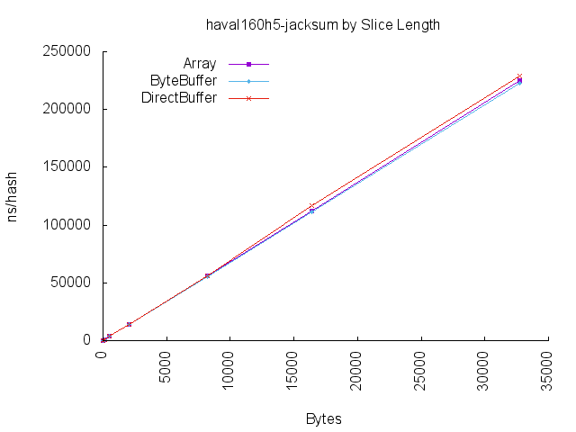

| Length |  Array | ByteBuffer | DirectBuffer |
| --- | ---: | ---: | ---: | 
| [32](#32-byte-slice-latency-all-hashes) | 28.010978 | 17.116452 | 103.843313 |
| [128](#128-byte-slice-latency-all-hashes) | 896.161127 | 883.884953 | 934.478156 |
| [512](#512-byte-slice-latency-all-hashes) | 3534.118787 | 3510.009798 | 3547.630897 |
| [2048](#2048-byte-slice-latency-all-hashes) | 13986.549072 | 13981.083259 | 14126.167519 |
| [8192](#8192-byte-slice-latency-all-hashes) | 56144.173215 | 55673.601210 | 56330.878525 |
| [16384](#16384-byte-slice-latency-all-hashes) | 111876.307060 | 111292.471997 | 116545.868730 |
| [32768](#32768-byte-slice-latency-all-hashes) | 225302.282437 | 222545.147240 | 229339.441217 |

---
### haval192h3-jacksum Latency
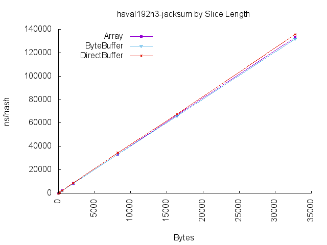

| Length |  Array | ByteBuffer | DirectBuffer |
| --- | ---: | ---: | ---: | 
| [32](#32-byte-slice-latency-all-hashes) | 27.595588 | 16.900293 | 102.304634 |
| [128](#128-byte-slice-latency-all-hashes) | 546.684089 | 532.651365 | 567.618677 |
| [512](#512-byte-slice-latency-all-hashes) | 2109.766119 | 2094.243565 | 2153.841315 |
| [2048](#2048-byte-slice-latency-all-hashes) | 8445.743274 | 8287.932992 | 8777.889791 |
| [8192](#8192-byte-slice-latency-all-hashes) | 33120.963077 | 32983.428591 | 34295.477140 |
| [16384](#16384-byte-slice-latency-all-hashes) | 66708.182133 | 65914.772410 | 67415.691429 |
| [32768](#32768-byte-slice-latency-all-hashes) | 132989.408647 | 131799.229060 | 135765.835717 |

---
### haval192h4-jacksum Latency
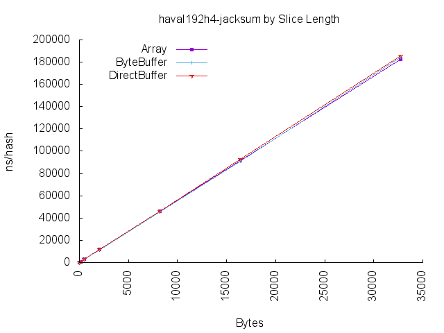

| Length |  Array | ByteBuffer | DirectBuffer |
| --- | ---: | ---: | ---: | 
| [32](#32-byte-slice-latency-all-hashes) | 28.451116 | 17.147384 | 96.936531 |
| [128](#128-byte-slice-latency-all-hashes) | 744.068814 | 727.815228 | 790.249723 |
| [512](#512-byte-slice-latency-all-hashes) | 2892.954849 | 2869.869772 | 2935.201559 |
| [2048](#2048-byte-slice-latency-all-hashes) | 11601.626898 | 11392.384451 | 11831.929967 |
| [8192](#8192-byte-slice-latency-all-hashes) | 45959.616249 | 45426.485791 | 46243.609197 |
| [16384](#16384-byte-slice-latency-all-hashes) | 91383.841784 | 91049.783011 | 93084.105639 |
| [32768](#32768-byte-slice-latency-all-hashes) | 182799.408012 | 184543.663719 | 185665.981569 |

---
### haval192h5-jacksum Latency
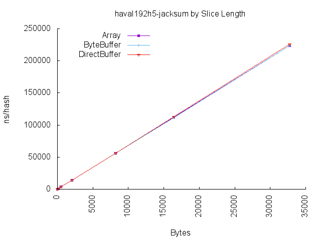

| Length |  Array | ByteBuffer | DirectBuffer |
| --- | ---: | ---: | ---: | 
| [32](#32-byte-slice-latency-all-hashes) | 27.176253 | 17.240774 | 104.957693 |
| [128](#128-byte-slice-latency-all-hashes) | 912.273490 | 882.526581 | 947.946169 |
| [512](#512-byte-slice-latency-all-hashes) | 3527.984052 | 3505.517051 | 3554.448804 |
| [2048](#2048-byte-slice-latency-all-hashes) | 14179.349506 | 13961.039738 | 14357.492306 |
| [8192](#8192-byte-slice-latency-all-hashes) | 55858.279091 | 55722.359291 | 56359.523522 |
| [16384](#16384-byte-slice-latency-all-hashes) | 111943.210385 | 111419.422873 | 112763.840590 |
| [32768](#32768-byte-slice-latency-all-hashes) | 223604.312598 | 223177.229068 | 225609.845702 |

---
### haval224h3-jacksum Latency
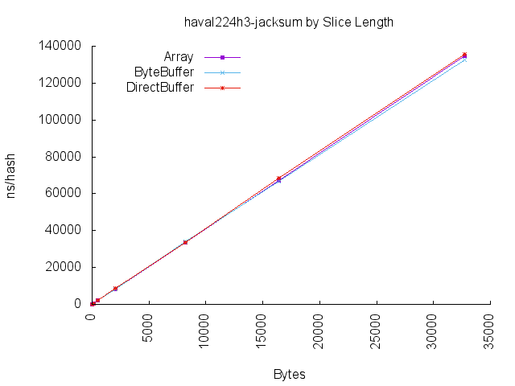

| Length |  Array | ByteBuffer | DirectBuffer |
| --- | ---: | ---: | ---: | 
| [32](#32-byte-slice-latency-all-hashes) | 28.078883 | 17.202648 | 102.918260 |
| [128](#128-byte-slice-latency-all-hashes) | 549.911931 | 535.213686 | 585.288255 |
| [512](#512-byte-slice-latency-all-hashes) | 2131.248161 | 2114.468106 | 2141.501763 |
| [2048](#2048-byte-slice-latency-all-hashes) | 8418.636743 | 8357.469434 | 8521.802952 |
| [8192](#8192-byte-slice-latency-all-hashes) | 33614.587480 | 33958.363525 | 33718.838772 |
| [16384](#16384-byte-slice-latency-all-hashes) | 67015.915006 | 66661.826295 | 68411.977301 |
| [32768](#32768-byte-slice-latency-all-hashes) | 134719.993713 | 132664.706836 | 135678.476221 |

---
### haval224h4-jacksum Latency
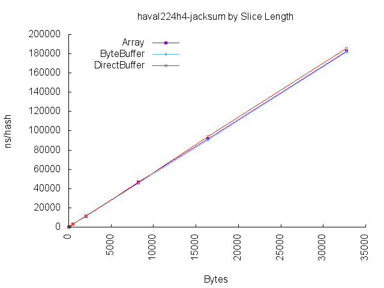

| Length |  Array | ByteBuffer | DirectBuffer |
| --- | ---: | ---: | ---: | 
| [32](#32-byte-slice-latency-all-hashes) | 27.212358 | 20.418384 | 99.739715 |
| [128](#128-byte-slice-latency-all-hashes) | 744.961779 | 732.674471 | 877.968310 |
| [512](#512-byte-slice-latency-all-hashes) | 2887.528195 | 2875.188661 | 2970.446428 |
| [2048](#2048-byte-slice-latency-all-hashes) | 11450.163479 | 11371.579957 | 11702.213471 |
| [8192](#8192-byte-slice-latency-all-hashes) | 46713.450475 | 45532.995125 | 46150.498784 |
| [16384](#16384-byte-slice-latency-all-hashes) | 91442.580037 | 90638.494148 | 93808.415952 |
| [32768](#32768-byte-slice-latency-all-hashes) | 182485.830279 | 181826.899214 | 185528.167437 |

---
### haval224h5-jacksum Latency
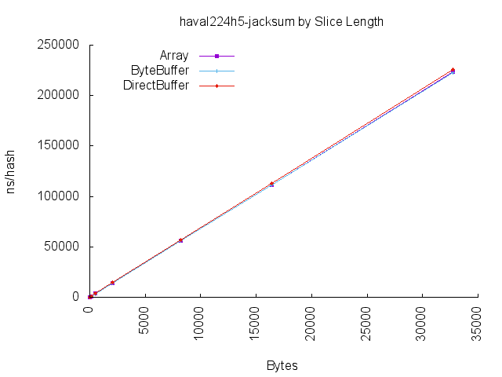

| Length |  Array | ByteBuffer | DirectBuffer |
| --- | ---: | ---: | ---: | 
| [32](#32-byte-slice-latency-all-hashes) | 27.476739 | 17.169196 | 95.781959 |
| [128](#128-byte-slice-latency-all-hashes) | 895.722528 | 885.088866 | 928.613747 |
| [512](#512-byte-slice-latency-all-hashes) | 3522.891797 | 3498.264821 | 3563.206326 |
| [2048](#2048-byte-slice-latency-all-hashes) | 14012.545285 | 13956.097571 | 14621.416641 |
| [8192](#8192-byte-slice-latency-all-hashes) | 55962.512030 | 55953.657747 | 57211.821741 |
| [16384](#16384-byte-slice-latency-all-hashes) | 111712.452459 | 111317.966405 | 112967.318143 |
| [32768](#32768-byte-slice-latency-all-hashes) | 223448.486199 | 222609.047385 | 225934.482966 |

---
### haval256h3-jacksum Latency
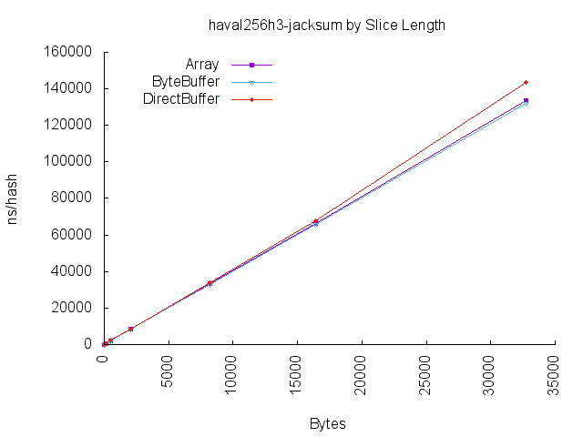

| Length |  Array | ByteBuffer | DirectBuffer |
| --- | ---: | ---: | ---: | 
| [32](#32-byte-slice-latency-all-hashes) | 27.226230 | 17.185402 | 95.949627 |
| [128](#128-byte-slice-latency-all-hashes) | 553.603324 | 531.544005 | 566.755706 |
| [512](#512-byte-slice-latency-all-hashes) | 2115.890432 | 2089.208302 | 2277.569512 |
| [2048](#2048-byte-slice-latency-all-hashes) | 8381.081273 | 8340.474364 | 8654.764297 |
| [8192](#8192-byte-slice-latency-all-hashes) | 33269.937077 | 33075.082838 | 33734.368967 |
| [16384](#16384-byte-slice-latency-all-hashes) | 66489.864150 | 65777.762241 | 67556.405546 |
| [32768](#32768-byte-slice-latency-all-hashes) | 133462.685975 | 132233.932515 | 143437.288428 |

---
### haval256h4-jacksum Latency
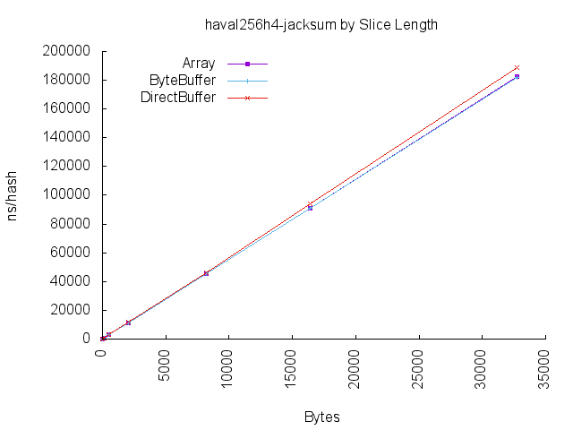

| Length |  Array | ByteBuffer | DirectBuffer |
| --- | ---: | ---: | ---: | 
| [32](#32-byte-slice-latency-all-hashes) | 27.167416 | 17.463712 | 95.192786 |
| [128](#128-byte-slice-latency-all-hashes) | 743.401566 | 725.737268 | 790.279938 |
| [512](#512-byte-slice-latency-all-hashes) | 2887.295503 | 2869.443491 | 2926.727333 |
| [2048](#2048-byte-slice-latency-all-hashes) | 11447.527296 | 11414.692084 | 11814.544236 |
| [8192](#8192-byte-slice-latency-all-hashes) | 45622.837256 | 45571.800752 | 46180.101588 |
| [16384](#16384-byte-slice-latency-all-hashes) | 91233.718186 | 90916.582881 | 93848.527802 |
| [32768](#32768-byte-slice-latency-all-hashes) | 182465.688966 | 181839.757082 | 188513.484884 |

---
### haval256h5-jacksum Latency
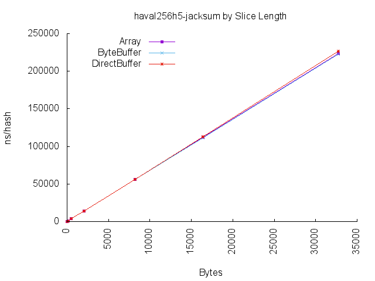

| Length |  Array | ByteBuffer | DirectBuffer |
| --- | ---: | ---: | ---: | 
| [32](#32-byte-slice-latency-all-hashes) | 27.195541 | 17.939653 | 94.630756 |
| [128](#128-byte-slice-latency-all-hashes) | 897.824281 | 881.795055 | 919.678067 |
| [512](#512-byte-slice-latency-all-hashes) | 3525.931737 | 3509.428129 | 3567.422427 |
| [2048](#2048-byte-slice-latency-all-hashes) | 13980.489427 | 13941.435966 | 14334.705650 |
| [8192](#8192-byte-slice-latency-all-hashes) | 55843.888748 | 55771.619359 | 56341.088500 |
| [16384](#16384-byte-slice-latency-all-hashes) | 111971.675881 | 111412.682518 | 112783.702352 |
| [32768](#32768-byte-slice-latency-all-hashes) | 223667.559112 | 222590.652941 | 226280.533926 |

---
### md2-bc Latency
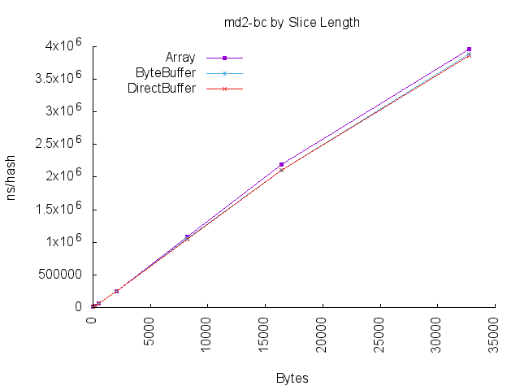

| Length |  Array | ByteBuffer | DirectBuffer |
| --- | ---: | ---: | ---: | 
| [32](#32-byte-slice-latency-all-hashes) | 8245.157885 | 8188.368150 | 8147.355934 |
| [128](#128-byte-slice-latency-all-hashes) | 20284.956604 | 20050.054311 | 19380.135732 |
| [512](#512-byte-slice-latency-all-hashes) | 66209.698106 | 65138.910942 | 65830.132457 |
| [2048](#2048-byte-slice-latency-all-hashes) | 252117.095043 | 250597.129230 | 246043.548826 |
| [8192](#8192-byte-slice-latency-all-hashes) | 1085655.103444 | 1059375.009155 | 1051935.167915 |
| [16384](#16384-byte-slice-latency-all-hashes) | 2188799.657337 | 2112139.737956 | 2100474.541677 |
| [32768](#32768-byte-slice-latency-all-hashes) | 3957297.251833 | 3886339.381683 | 3866121.848248 |

---
### md2-jacksum Latency
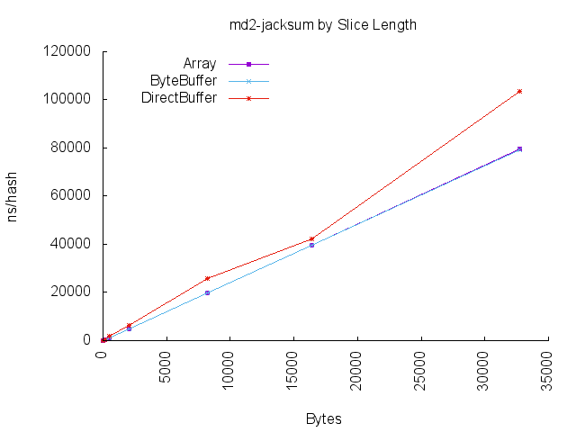

| Length |  Array | ByteBuffer | DirectBuffer |
| --- | ---: | ---: | ---: | 
| [32](#32-byte-slice-latency-all-hashes) | 16.706935 | 16.982080 | 133.360956 |
| [128](#128-byte-slice-latency-all-hashes) | 324.261079 | 323.623015 | 419.234532 |
| [512](#512-byte-slice-latency-all-hashes) | 1254.040995 | 1291.108216 | 2014.595648 |
| [2048](#2048-byte-slice-latency-all-hashes) | 4989.343807 | 4966.589168 | 6467.057135 |
| [8192](#8192-byte-slice-latency-all-hashes) | 19860.450554 | 19944.672972 | 25942.371940 |
| [16384](#16384-byte-slice-latency-all-hashes) | 39800.331233 | 39620.958089 | 42304.848200 |
| [32768](#32768-byte-slice-latency-all-hashes) | 79549.189985 | 79248.338317 | 103657.606034 |

---
### md4-bc Latency
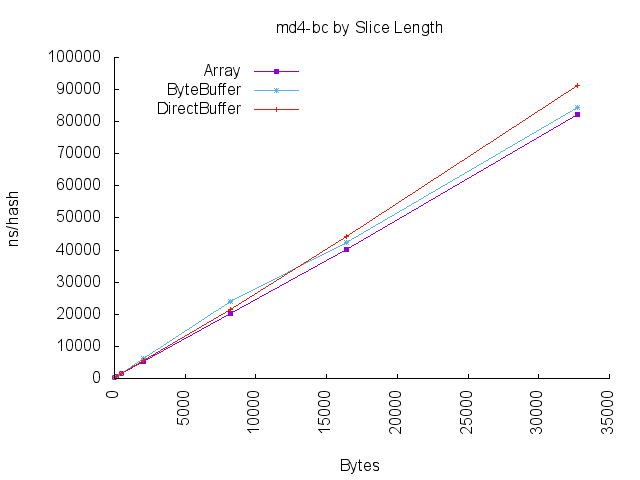

| Length |  Array | ByteBuffer | DirectBuffer |
| --- | ---: | ---: | ---: | 
| [32](#32-byte-slice-latency-all-hashes) | 183.574929 | 183.238493 | 203.600410 |
| [128](#128-byte-slice-latency-all-hashes) | 484.376245 | 528.414937 | 496.493108 |
| [512](#512-byte-slice-latency-all-hashes) | 1416.384847 | 1654.625073 | 1508.787665 |
| [2048](#2048-byte-slice-latency-all-hashes) | 5167.590680 | 6139.287219 | 5747.026743 |
| [8192](#8192-byte-slice-latency-all-hashes) | 20280.139360 | 24139.027426 | 21605.388257 |
| [16384](#16384-byte-slice-latency-all-hashes) | 40300.773676 | 42238.325197 | 44304.496432 |
| [32768](#32768-byte-slice-latency-all-hashes) | 82338.626145 | 84449.095269 | 91409.672622 |

---
### md4-jacksum Latency
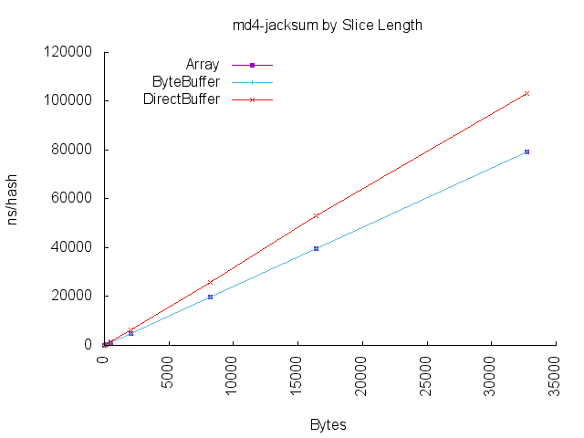

| Length |  Array | ByteBuffer | DirectBuffer |
| --- | ---: | ---: | ---: | 
| [32](#32-byte-slice-latency-all-hashes) | 16.940723 | 16.945312 | 113.120601 |
| [128](#128-byte-slice-latency-all-hashes) | 322.238934 | 322.922862 | 431.051762 |
| [512](#512-byte-slice-latency-all-hashes) | 1255.889433 | 1248.964388 | 1646.161493 |
| [2048](#2048-byte-slice-latency-all-hashes) | 4981.750445 | 4969.614684 | 6408.299735 |
| [8192](#8192-byte-slice-latency-all-hashes) | 19885.422565 | 19847.334506 | 25800.416259 |
| [16384](#16384-byte-slice-latency-all-hashes) | 39738.004686 | 39611.893477 | 53193.587194 |
| [32768](#32768-byte-slice-latency-all-hashes) | 79410.716143 | 79226.986126 | 103071.023684 |

---
### md5-bc Latency
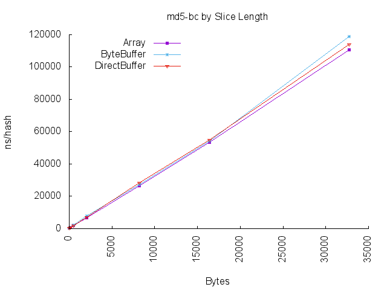

| Length |  Array | ByteBuffer | DirectBuffer |
| --- | ---: | ---: | ---: | 
| [32](#32-byte-slice-latency-all-hashes) | 227.275325 | 227.954885 | 250.360781 |
| [128](#128-byte-slice-latency-all-hashes) | 626.071277 | 667.242240 | 661.510923 |
| [512](#512-byte-slice-latency-all-hashes) | 1847.143006 | 2122.685950 | 1912.434897 |
| [2048](#2048-byte-slice-latency-all-hashes) | 6742.862220 | 7717.962018 | 7234.402039 |
| [8192](#8192-byte-slice-latency-all-hashes) | 26410.270669 | 27269.292311 | 28449.115043 |
| [16384](#16384-byte-slice-latency-all-hashes) | 53397.946419 | 54262.563729 | 54885.003597 |
| [32768](#32768-byte-slice-latency-all-hashes) | 110795.935028 | 118723.168534 | 114164.014368 |

---
### md5-guava Latency
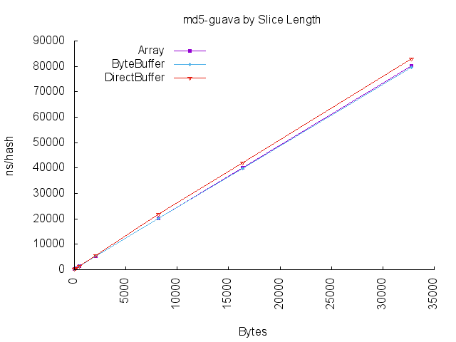

| Length |  Array | ByteBuffer | DirectBuffer |
| --- | ---: | ---: | ---: | 
| [32](#32-byte-slice-latency-all-hashes) | 257.445047 | 256.970159 | 269.374095 |
| [128](#128-byte-slice-latency-all-hashes) | 562.933865 | 572.496765 | 569.000993 |
| [512](#512-byte-slice-latency-all-hashes) | 1532.688211 | 1492.866563 | 1520.924837 |
| [2048](#2048-byte-slice-latency-all-hashes) | 5255.849210 | 5268.738322 | 5646.984575 |
| [8192](#8192-byte-slice-latency-all-hashes) | 20170.760856 | 20095.568565 | 21738.485174 |
| [16384](#16384-byte-slice-latency-all-hashes) | 40177.227759 | 39919.451897 | 42015.016280 |
| [32768](#32768-byte-slice-latency-all-hashes) | 80100.363496 | 79536.701916 | 83068.618407 |

---
### md5-jacksum Latency
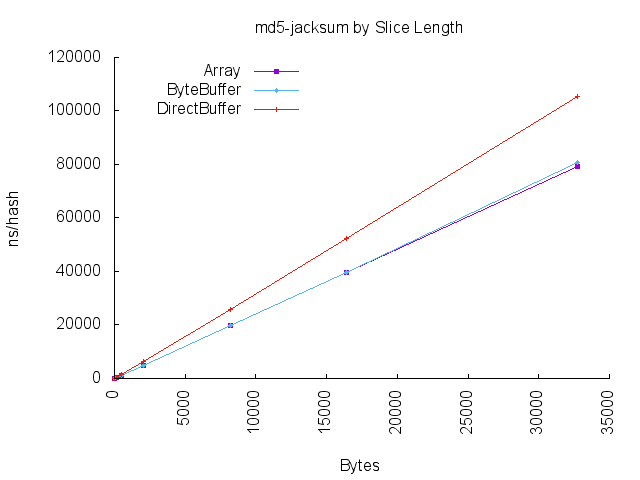

| Length |  Array | ByteBuffer | DirectBuffer |
| --- | ---: | ---: | ---: | 
| [32](#32-byte-slice-latency-all-hashes) | 16.403029 | 16.848853 | 130.133421 |
| [128](#128-byte-slice-latency-all-hashes) | 324.139507 | 324.039770 | 362.479787 |
| [512](#512-byte-slice-latency-all-hashes) | 1252.796097 | 1250.444661 | 1640.805206 |
| [2048](#2048-byte-slice-latency-all-hashes) | 4991.234542 | 4975.504037 | 6481.806463 |
| [8192](#8192-byte-slice-latency-all-hashes) | 19901.801878 | 19836.812231 | 25762.034020 |
| [16384](#16384-byte-slice-latency-all-hashes) | 39787.534131 | 39717.522850 | 52249.683485 |
| [32768](#32768-byte-slice-latency-all-hashes) | 79386.768819 | 80805.453107 | 105604.451129 |

---
### md5-jacksum-alt Latency
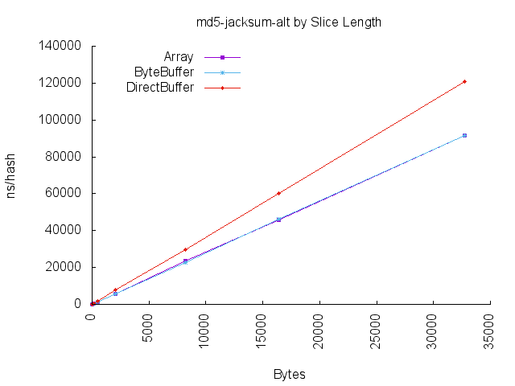

| Length |  Array | ByteBuffer | DirectBuffer |
| --- | ---: | ---: | ---: | 
| [32](#32-byte-slice-latency-all-hashes) | 25.027990 | 15.888331 | 94.225040 |
| [128](#128-byte-slice-latency-all-hashes) | 379.390130 | 370.185243 | 510.115265 |
| [512](#512-byte-slice-latency-all-hashes) | 1453.786322 | 1442.897330 | 1901.645178 |
| [2048](#2048-byte-slice-latency-all-hashes) | 5837.193147 | 5835.880582 | 7729.499495 |
| [8192](#8192-byte-slice-latency-all-hashes) | 23680.224096 | 22797.237259 | 29564.562811 |
| [16384](#16384-byte-slice-latency-all-hashes) | 45801.255484 | 46396.740189 | 60127.022607 |
| [32768](#32768-byte-slice-latency-all-hashes) | 91695.855896 | 91538.599281 | 120730.406693 |

---
### murmur3h128-guava Latency
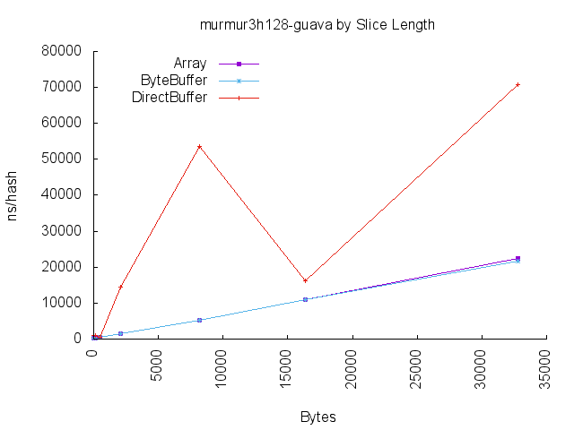

| Length |  Array | ByteBuffer | DirectBuffer |
| --- | ---: | ---: | ---: | 
| [32](#32-byte-slice-latency-all-hashes) | 128.404467 | 135.705107 | 1039.683175 |
| [128](#128-byte-slice-latency-all-hashes) | 206.951171 | 203.446837 | 982.538001 |
| [512](#512-byte-slice-latency-all-hashes) | 427.839417 | 446.247126 | 558.514377 |
| [2048](#2048-byte-slice-latency-all-hashes) | 1427.976991 | 1417.445725 | 14372.651476 |
| [8192](#8192-byte-slice-latency-all-hashes) | 5345.532062 | 5347.381741 | 53643.573610 |
| [16384](#16384-byte-slice-latency-all-hashes) | 10952.260747 | 10910.997070 | 16177.915834 |
| [32768](#32768-byte-slice-latency-all-hashes) | 22440.784499 | 21793.962537 | 70884.155204 |

---
### murmur3h128-zah Latency
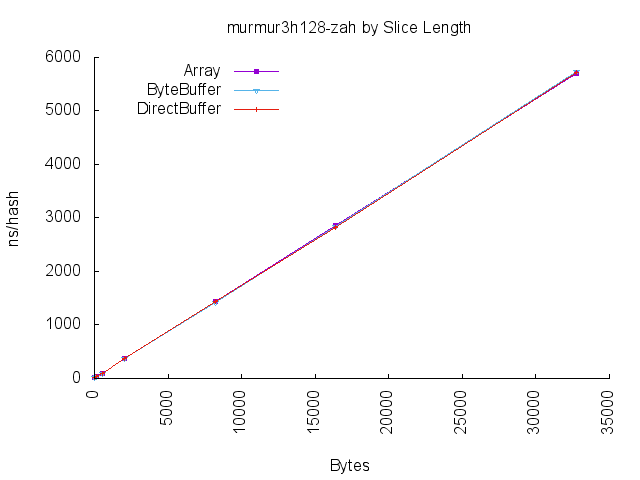

| Length |  Array | ByteBuffer | DirectBuffer |
| --- | ---: | ---: | ---: | 
| [32](#32-byte-slice-latency-all-hashes) | 14.405292 | 14.615232 | 15.811911 |
| [128](#128-byte-slice-latency-all-hashes) | 30.748308 | 31.129817 | 32.292191 |
| [512](#512-byte-slice-latency-all-hashes) | 97.096739 | 101.493753 | 102.223179 |
| [2048](#2048-byte-slice-latency-all-hashes) | 367.706141 | 365.997714 | 368.604194 |
| [8192](#8192-byte-slice-latency-all-hashes) | 1430.890965 | 1425.525588 | 1434.133562 |
| [16384](#16384-byte-slice-latency-all-hashes) | 2859.128203 | 2842.473274 | 2818.161475 |
| [32768](#32768-byte-slice-latency-all-hashes) | 5695.297573 | 5730.214867 | 5726.628604 |

---
### murmur3h32-guava Latency
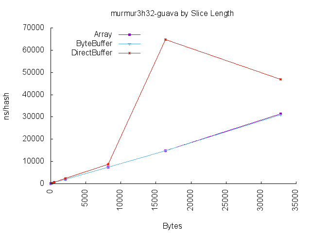

| Length |  Array | ByteBuffer | DirectBuffer |
| --- | ---: | ---: | ---: | 
| [32](#32-byte-slice-latency-all-hashes) | 86.358896 | 78.979276 | 111.079064 |
| [128](#128-byte-slice-latency-all-hashes) | 184.011036 | 179.632072 | 189.574318 |
| [512](#512-byte-slice-latency-all-hashes) | 589.747590 | 564.348122 | 552.079995 |
| [2048](#2048-byte-slice-latency-all-hashes) | 2023.051909 | 1981.050138 | 2344.605194 |
| [8192](#8192-byte-slice-latency-all-hashes) | 7323.295694 | 7390.927811 | 8742.032462 |
| [16384](#16384-byte-slice-latency-all-hashes) | 14808.528188 | 14727.474452 | 64771.011363 |
| [32768](#32768-byte-slice-latency-all-hashes) | 31498.013593 | 30858.181513 | 46938.430446 |

---
### ripemd128-bc Latency
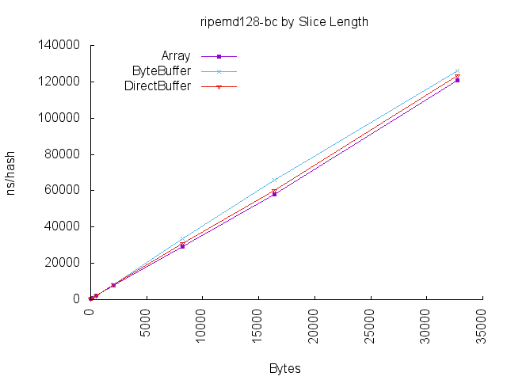

| Length |  Array | ByteBuffer | DirectBuffer |
| --- | ---: | ---: | ---: | 
| [32](#32-byte-slice-latency-all-hashes) | 249.350414 | 251.766554 | 280.611186 |
| [128](#128-byte-slice-latency-all-hashes) | 690.967005 | 738.486551 | 701.199427 |
| [512](#512-byte-slice-latency-all-hashes) | 2042.741828 | 2274.828201 | 2099.530536 |
| [2048](#2048-byte-slice-latency-all-hashes) | 7683.635032 | 8114.394856 | 8303.523446 |
| [8192](#8192-byte-slice-latency-all-hashes) | 29226.261494 | 33471.131174 | 30749.089845 |
| [16384](#16384-byte-slice-latency-all-hashes) | 58104.167764 | 65905.546492 | 60348.808159 |
| [32768](#32768-byte-slice-latency-all-hashes) | 120861.841915 | 126233.677478 | 123378.819257 |

---
### ripemd128-jacksum Latency
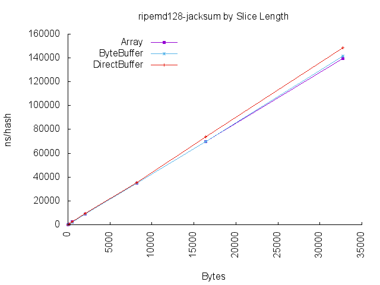

| Length |  Array | ByteBuffer | DirectBuffer |
| --- | ---: | ---: | ---: | 
| [32](#32-byte-slice-latency-all-hashes) | 25.831457 | 16.008143 | 94.550483 |
| [128](#128-byte-slice-latency-all-hashes) | 579.188363 | 571.619358 | 622.586383 |
| [512](#512-byte-slice-latency-all-hashes) | 2243.435951 | 2239.659569 | 2293.640938 |
| [2048](#2048-byte-slice-latency-all-hashes) | 8773.413952 | 8739.777830 | 9488.838558 |
| [8192](#8192-byte-slice-latency-all-hashes) | 35072.012784 | 34828.609098 | 35344.326372 |
| [16384](#16384-byte-slice-latency-all-hashes) | 69996.546984 | 69575.508009 | 73551.987222 |
| [32768](#32768-byte-slice-latency-all-hashes) | 139664.932466 | 141345.690412 | 148537.498520 |

---
### ripemd160-bc Latency
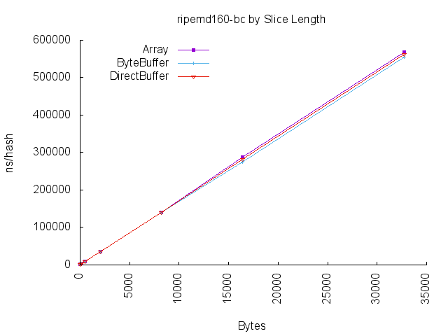

| Length |  Array | ByteBuffer | DirectBuffer |
| --- | ---: | ---: | ---: | 
| [32](#32-byte-slice-latency-all-hashes) | 1111.341973 | 1120.168081 | 1141.223252 |
| [128](#128-byte-slice-latency-all-hashes) | 3234.139324 | 3253.477514 | 3229.988276 |
| [512](#512-byte-slice-latency-all-hashes) | 9709.621676 | 9838.104644 | 9677.865979 |
| [2048](#2048-byte-slice-latency-all-hashes) | 36131.086867 | 36131.917934 | 36120.641224 |
| [8192](#8192-byte-slice-latency-all-hashes) | 140391.996746 | 139321.462996 | 139388.881832 |
| [16384](#16384-byte-slice-latency-all-hashes) | 287148.827573 | 274711.644788 | 281645.988963 |
| [32768](#32768-byte-slice-latency-all-hashes) | 567441.976398 | 555724.385111 | 561687.429010 |

---
### ripemd160-jacksum Latency
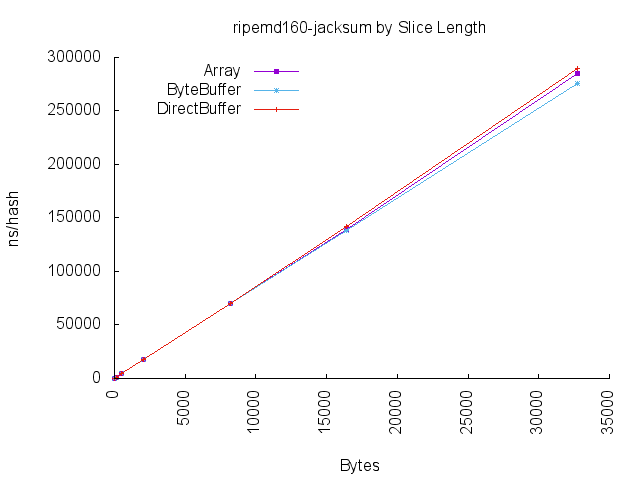

| Length |  Array | ByteBuffer | DirectBuffer |
| --- | ---: | ---: | ---: | 
| [32](#32-byte-slice-latency-all-hashes) | 26.380022 | 15.850208 | 95.616329 |
| [128](#128-byte-slice-latency-all-hashes) | 1120.601025 | 1106.328868 | 1135.061109 |
| [512](#512-byte-slice-latency-all-hashes) | 4395.060651 | 4352.675260 | 4388.252556 |
| [2048](#2048-byte-slice-latency-all-hashes) | 17683.373691 | 17315.461136 | 17688.642740 |
| [8192](#8192-byte-slice-latency-all-hashes) | 69730.910297 | 69832.898765 | 69696.609832 |
| [16384](#16384-byte-slice-latency-all-hashes) | 139182.646670 | 138367.351362 | 141945.210625 |
| [32768](#32768-byte-slice-latency-all-hashes) | 285492.450980 | 275663.661249 | 289265.668784 |

---
### ripemd256-bc Latency
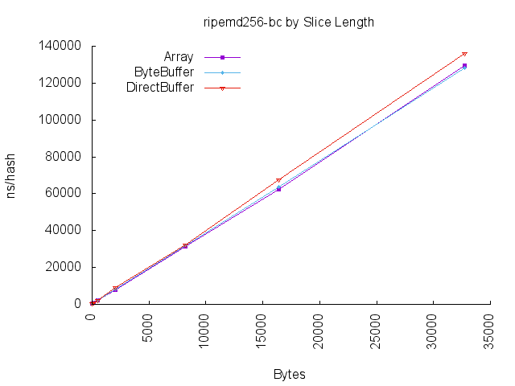

| Length |  Array | ByteBuffer | DirectBuffer |
| --- | ---: | ---: | ---: | 
| [32](#32-byte-slice-latency-all-hashes) | 278.996831 | 285.601901 | 306.113028 |
| [128](#128-byte-slice-latency-all-hashes) | 746.830419 | 750.738307 | 769.734739 |
| [512](#512-byte-slice-latency-all-hashes) | 2198.670388 | 2236.524517 | 2286.700783 |
| [2048](#2048-byte-slice-latency-all-hashes) | 8039.635725 | 8134.677113 | 9267.115835 |
| [8192](#8192-byte-slice-latency-all-hashes) | 31298.015586 | 31980.863050 | 32249.749038 |
| [16384](#16384-byte-slice-latency-all-hashes) | 62567.286565 | 63477.669102 | 67553.612175 |
| [32768](#32768-byte-slice-latency-all-hashes) | 129611.357640 | 128143.989262 | 136173.132625 |

---
### ripemd256-jacksum Latency
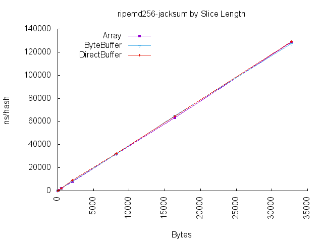

| Length |  Array | ByteBuffer | DirectBuffer |
| --- | ---: | ---: | ---: | 
| [32](#32-byte-slice-latency-all-hashes) | 51.627736 | 51.083755 | 73.415557 |
| [128](#128-byte-slice-latency-all-hashes) | 532.382823 | 522.443572 | 557.371504 |
| [512](#512-byte-slice-latency-all-hashes) | 2018.615907 | 2013.446505 | 2066.309059 |
| [2048](#2048-byte-slice-latency-all-hashes) | 7949.335306 | 8263.364691 | 9182.036293 |
| [8192](#8192-byte-slice-latency-all-hashes) | 31928.906391 | 31980.963135 | 32477.297104 |
| [16384](#16384-byte-slice-latency-all-hashes) | 63447.192734 | 64949.777523 | 64629.834207 |
| [32768](#32768-byte-slice-latency-all-hashes) | 128615.299873 | 127375.124285 | 129105.253049 |

---
### ripemd320-bc Latency
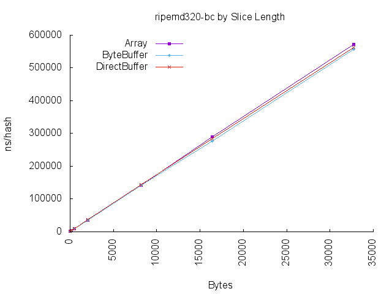

| Length |  Array | ByteBuffer | DirectBuffer |
| --- | ---: | ---: | ---: | 
| [32](#32-byte-slice-latency-all-hashes) | 1134.936967 | 1128.988315 | 1153.523480 |
| [128](#128-byte-slice-latency-all-hashes) | 3352.033912 | 3274.220494 | 3298.691659 |
| [512](#512-byte-slice-latency-all-hashes) | 9796.596599 | 9789.324772 | 9853.517253 |
| [2048](#2048-byte-slice-latency-all-hashes) | 36136.320232 | 35945.306400 | 36675.128937 |
| [8192](#8192-byte-slice-latency-all-hashes) | 142610.899221 | 141457.465405 | 144427.884253 |
| [16384](#16384-byte-slice-latency-all-hashes) | 289145.957402 | 277426.910611 | 283692.267642 |
| [32768](#32768-byte-slice-latency-all-hashes) | 571946.277704 | 556329.593448 | 563203.917753 |

---
### ripemd320-jacksum Latency
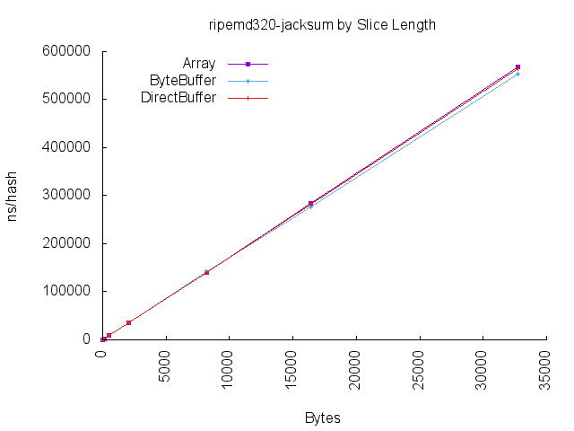

| Length |  Array | ByteBuffer | DirectBuffer |
| --- | ---: | ---: | ---: | 
| [32](#32-byte-slice-latency-all-hashes) | 52.986562 | 52.621287 | 71.262873 |
| [128](#128-byte-slice-latency-all-hashes) | 2209.255567 | 2214.874267 | 2224.967572 |
| [512](#512-byte-slice-latency-all-hashes) | 8737.135007 | 8751.359798 | 8787.948106 |
| [2048](#2048-byte-slice-latency-all-hashes) | 34870.476018 | 35426.963446 | 35188.558187 |
| [8192](#8192-byte-slice-latency-all-hashes) | 139435.335945 | 142623.093703 | 139552.001707 |
| [16384](#16384-byte-slice-latency-all-hashes) | 283188.080731 | 277208.946948 | 281403.083713 |
| [32768](#32768-byte-slice-latency-all-hashes) | 567542.454922 | 553799.066739 | 563868.466535 |

---
### sha0-jacksum Latency
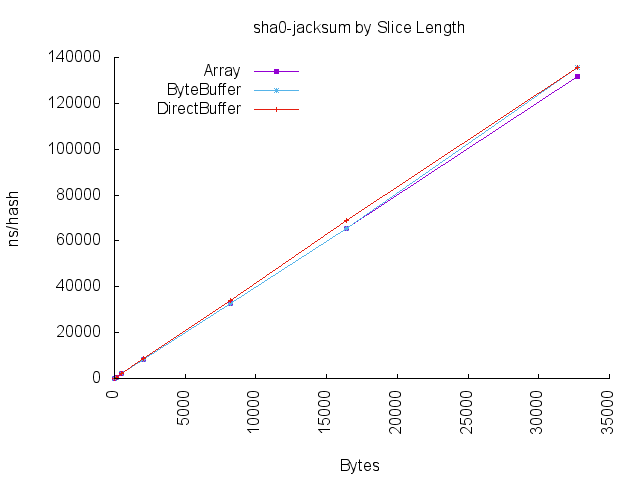

| Length |  Array | ByteBuffer | DirectBuffer |
| --- | ---: | ---: | ---: | 
| [32](#32-byte-slice-latency-all-hashes) | 26.219811 | 15.853288 | 47.386159 |
| [128](#128-byte-slice-latency-all-hashes) | 539.565245 | 593.537244 | 577.689762 |
| [512](#512-byte-slice-latency-all-hashes) | 2090.838738 | 2093.949420 | 2144.171148 |
| [2048](#2048-byte-slice-latency-all-hashes) | 8389.627121 | 8219.960594 | 8618.508820 |
| [8192](#8192-byte-slice-latency-all-hashes) | 32825.964882 | 32895.187260 | 34018.770309 |
| [16384](#16384-byte-slice-latency-all-hashes) | 65493.169448 | 65629.988150 | 68876.353010 |
| [32768](#32768-byte-slice-latency-all-hashes) | 131922.614119 | 135685.496448 | 135576.788811 |

---
### sha1-bc Latency
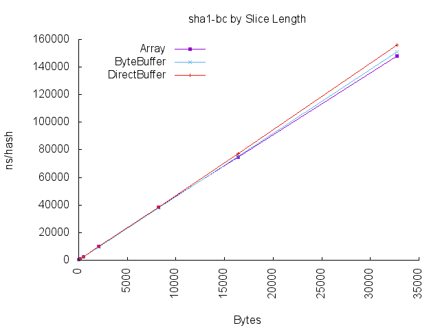

| Length |  Array | ByteBuffer | DirectBuffer |
| --- | ---: | ---: | ---: | 
| [32](#32-byte-slice-latency-all-hashes) | 329.972424 | 333.108338 | 347.022309 |
| [128](#128-byte-slice-latency-all-hashes) | 900.638322 | 895.886606 | 908.225365 |
| [512](#512-byte-slice-latency-all-hashes) | 2700.636091 | 2658.106391 | 2657.090553 |
| [2048](#2048-byte-slice-latency-all-hashes) | 9855.529805 | 9655.945323 | 9913.311690 |
| [8192](#8192-byte-slice-latency-all-hashes) | 38535.731198 | 37812.185848 | 38575.028369 |
| [16384](#16384-byte-slice-latency-all-hashes) | 74774.648387 | 75043.397056 | 77071.419834 |
| [32768](#32768-byte-slice-latency-all-hashes) | 148194.488626 | 150882.025751 | 155931.027428 |

---
### sha1-guava Latency
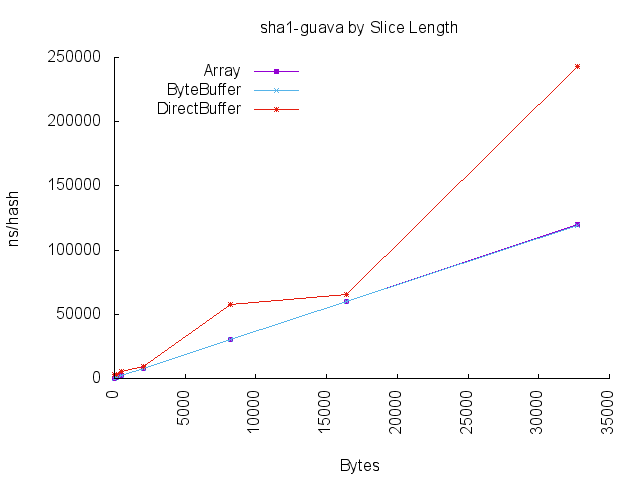

| Length |  Array | ByteBuffer | DirectBuffer |
| --- | ---: | ---: | ---: | 
| [32](#32-byte-slice-latency-all-hashes) | 368.657301 | 355.403320 | 3193.038598 |
| [128](#128-byte-slice-latency-all-hashes) | 851.710663 | 807.926101 | 3353.750884 |
| [512](#512-byte-slice-latency-all-hashes) | 2242.129149 | 2212.883606 | 5723.686508 |
| [2048](#2048-byte-slice-latency-all-hashes) | 7776.209913 | 7766.867481 | 9214.980454 |
| [8192](#8192-byte-slice-latency-all-hashes) | 30686.098909 | 30145.139168 | 58016.921762 |
| [16384](#16384-byte-slice-latency-all-hashes) | 60067.840324 | 59639.511756 | 65566.463973 |
| [32768](#32768-byte-slice-latency-all-hashes) | 119657.462007 | 119310.094075 | 243163.942991 |

---
### sha1-jacksum Latency
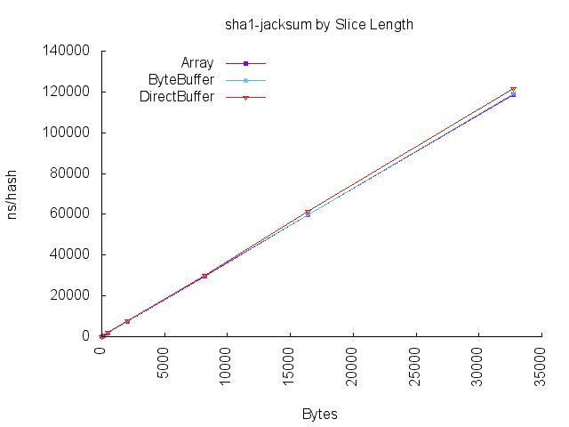

| Length |  Array | ByteBuffer | DirectBuffer |
| --- | ---: | ---: | ---: | 
| [32](#32-byte-slice-latency-all-hashes) | 16.117723 | 16.600151 | 37.498186 |
| [128](#128-byte-slice-latency-all-hashes) | 480.087700 | 478.709820 | 505.797889 |
| [512](#512-byte-slice-latency-all-hashes) | 1871.329962 | 1875.804938 | 1971.183284 |
| [2048](#2048-byte-slice-latency-all-hashes) | 7444.359399 | 7451.583603 | 7755.542925 |
| [8192](#8192-byte-slice-latency-all-hashes) | 29740.754509 | 30098.181637 | 30269.592203 |
| [16384](#16384-byte-slice-latency-all-hashes) | 59635.722546 | 59696.828544 | 61321.940064 |
| [32768](#32768-byte-slice-latency-all-hashes) | 118597.784800 | 119184.464298 | 121789.773709 |

---
### sha1-jacksum-alt Latency
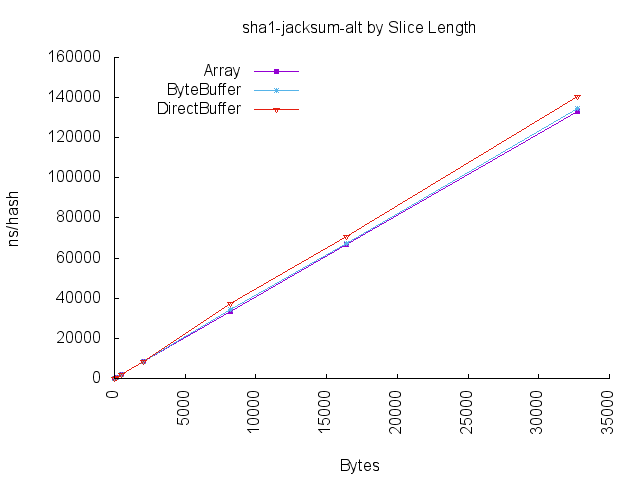

| Length |  Array | ByteBuffer | DirectBuffer |
| --- | ---: | ---: | ---: | 
| [32](#32-byte-slice-latency-all-hashes) | 26.124734 | 15.891911 | 49.523972 |
| [128](#128-byte-slice-latency-all-hashes) | 552.689207 | 545.292398 | 578.530160 |
| [512](#512-byte-slice-latency-all-hashes) | 2132.700651 | 2206.590392 | 2193.471252 |
| [2048](#2048-byte-slice-latency-all-hashes) | 8419.325169 | 8447.954952 | 8598.868601 |
| [8192](#8192-byte-slice-latency-all-hashes) | 33360.807216 | 34302.017259 | 37346.187434 |
| [16384](#16384-byte-slice-latency-all-hashes) | 66567.099344 | 67289.935973 | 70895.156319 |
| [32768](#32768-byte-slice-latency-all-hashes) | 133047.000646 | 134538.818278 | 140592.359741 |

---
### sha224-bc Latency
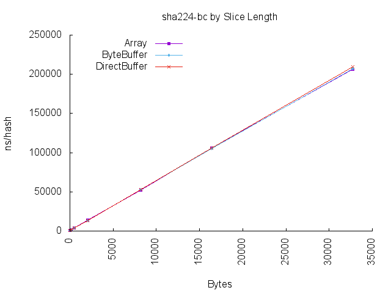

| Length |  Array | ByteBuffer | DirectBuffer |
| --- | ---: | ---: | ---: | 
| [32](#32-byte-slice-latency-all-hashes) | 445.683249 | 438.720830 | 467.520015 |
| [128](#128-byte-slice-latency-all-hashes) | 1239.296101 | 1232.091593 | 1240.835384 |
| [512](#512-byte-slice-latency-all-hashes) | 3664.649204 | 3684.907796 | 3761.878683 |
| [2048](#2048-byte-slice-latency-all-hashes) | 13734.870020 | 13480.155908 | 13586.619867 |
| [8192](#8192-byte-slice-latency-all-hashes) | 51843.095595 | 52613.014967 | 53305.697492 |
| [16384](#16384-byte-slice-latency-all-hashes) | 105600.114933 | 104766.276314 | 105557.123210 |
| [32768](#32768-byte-slice-latency-all-hashes) | 206198.087109 | 206845.039876 | 209889.289689 |

---
### sha224-jacksum Latency
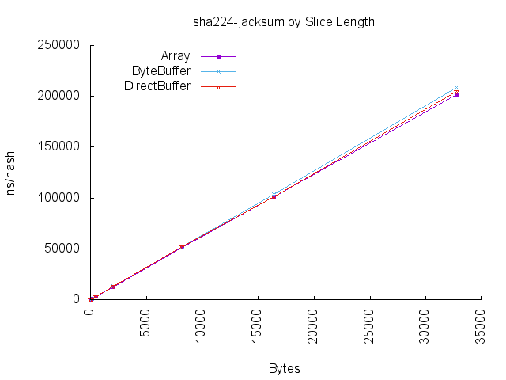

| Length |  Array | ByteBuffer | DirectBuffer |
| --- | ---: | ---: | ---: | 
| [32](#32-byte-slice-latency-all-hashes) | 26.227998 | 16.672399 | 50.016936 |
| [128](#128-byte-slice-latency-all-hashes) | 832.261154 | 839.060447 | 829.735995 |
| [512](#512-byte-slice-latency-all-hashes) | 3244.465032 | 3287.001009 | 3208.857929 |
| [2048](#2048-byte-slice-latency-all-hashes) | 12692.825250 | 13218.688354 | 13266.948407 |
| [8192](#8192-byte-slice-latency-all-hashes) | 51046.037351 | 52166.954611 | 52395.803979 |
| [16384](#16384-byte-slice-latency-all-hashes) | 101531.689135 | 103857.633692 | 101417.903280 |
| [32768](#32768-byte-slice-latency-all-hashes) | 201766.613240 | 208682.181202 | 204697.794497 |

---
### sha256-bc Latency
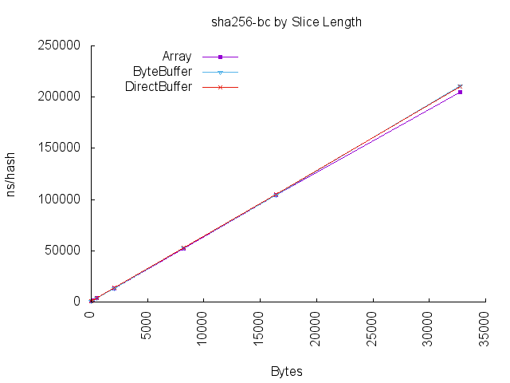

| Length |  Array | ByteBuffer | DirectBuffer |
| --- | ---: | ---: | ---: | 
| [32](#32-byte-slice-latency-all-hashes) | 449.005450 | 447.679129 | 482.964656 |
| [128](#128-byte-slice-latency-all-hashes) | 1249.856008 | 1239.932912 | 1245.724482 |
| [512](#512-byte-slice-latency-all-hashes) | 3675.940874 | 3711.027486 | 3703.457296 |
| [2048](#2048-byte-slice-latency-all-hashes) | 13434.379711 | 13534.194402 | 13750.458634 |
| [8192](#8192-byte-slice-latency-all-hashes) | 52250.816880 | 52967.754396 | 52688.486046 |
| [16384](#16384-byte-slice-latency-all-hashes) | 104267.939839 | 104111.680889 | 104938.448097 |
| [32768](#32768-byte-slice-latency-all-hashes) | 204721.450827 | 210718.484025 | 210456.354285 |

---
### sha256-guava Latency
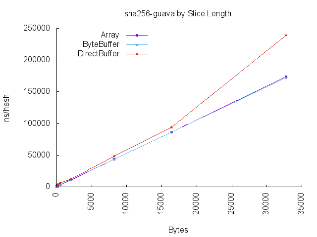

| Length |  Array | ByteBuffer | DirectBuffer |
| --- | ---: | ---: | ---: | 
| [32](#32-byte-slice-latency-all-hashes) | 466.718082 | 461.484682 | 2816.147708 |
| [128](#128-byte-slice-latency-all-hashes) | 1144.590347 | 1120.558737 | 4192.568947 |
| [512](#512-byte-slice-latency-all-hashes) | 3302.422995 | 3136.663218 | 6055.447183 |
| [2048](#2048-byte-slice-latency-all-hashes) | 11255.901563 | 11358.502917 | 12240.301520 |
| [8192](#8192-byte-slice-latency-all-hashes) | 43685.798835 | 43842.141200 | 48668.967825 |
| [16384](#16384-byte-slice-latency-all-hashes) | 86734.716477 | 86374.056436 | 94501.230403 |
| [32768](#32768-byte-slice-latency-all-hashes) | 173358.253601 | 172251.826966 | 239467.968080 |

---
### sha256-jacksum Latency
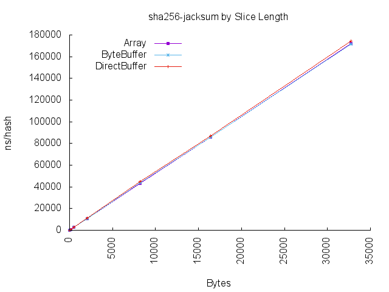

| Length |  Array | ByteBuffer | DirectBuffer |
| --- | ---: | ---: | ---: | 
| [32](#32-byte-slice-latency-all-hashes) | 23.400359 | 21.621062 | 44.265315 |
| [128](#128-byte-slice-latency-all-hashes) | 689.668352 | 688.958648 | 710.097107 |
| [512](#512-byte-slice-latency-all-hashes) | 2712.823934 | 2748.554463 | 2790.004146 |
| [2048](#2048-byte-slice-latency-all-hashes) | 10744.850284 | 10908.891071 | 10940.023947 |
| [8192](#8192-byte-slice-latency-all-hashes) | 42995.312284 | 43652.235409 | 44580.826753 |
| [16384](#16384-byte-slice-latency-all-hashes) | 85879.694780 | 85736.410174 | 86816.851983 |
| [32768](#32768-byte-slice-latency-all-hashes) | 171949.410465 | 171632.917193 | 174415.250917 |

---
### sha256-jacksum-alt Latency
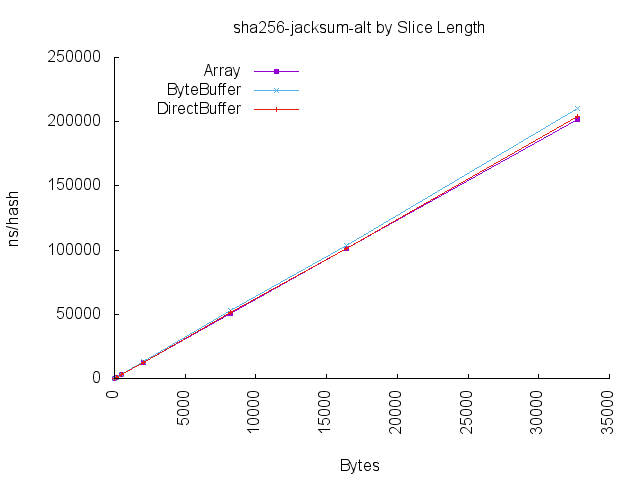

| Length |  Array | ByteBuffer | DirectBuffer |
| --- | ---: | ---: | ---: | 
| [32](#32-byte-slice-latency-all-hashes) | 26.413697 | 16.893000 | 47.526515 |
| [128](#128-byte-slice-latency-all-hashes) | 815.888805 | 835.369463 | 829.823187 |
| [512](#512-byte-slice-latency-all-hashes) | 3203.095822 | 3332.914733 | 3231.540535 |
| [2048](#2048-byte-slice-latency-all-hashes) | 12604.058573 | 13028.859595 | 12818.384076 |
| [8192](#8192-byte-slice-latency-all-hashes) | 50521.405892 | 52850.559541 | 51499.082615 |
| [16384](#16384-byte-slice-latency-all-hashes) | 101014.222430 | 103814.377775 | 101262.861032 |
| [32768](#32768-byte-slice-latency-all-hashes) | 201691.929625 | 210550.282609 | 203880.515820 |

---
### sha384-bc Latency
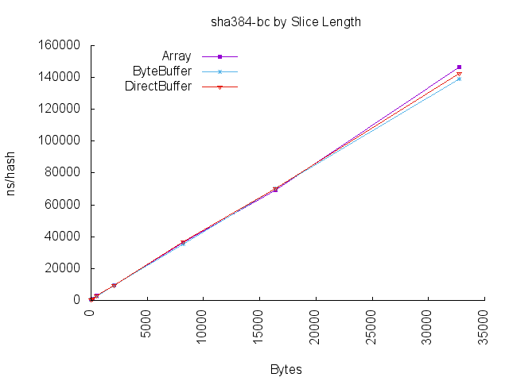

| Length |  Array | ByteBuffer | DirectBuffer |
| --- | ---: | ---: | ---: | 
| [32](#32-byte-slice-latency-all-hashes) | 589.240925 | 560.592234 | 584.468886 |
| [128](#128-byte-slice-latency-all-hashes) | 1123.002863 | 1088.777929 | 1094.028197 |
| [512](#512-byte-slice-latency-all-hashes) | 2863.332098 | 2722.397608 | 2755.603499 |
| [2048](#2048-byte-slice-latency-all-hashes) | 9580.229415 | 9236.867221 | 9248.190965 |
| [8192](#8192-byte-slice-latency-all-hashes) | 36634.383919 | 35413.091106 | 36696.307325 |
| [16384](#16384-byte-slice-latency-all-hashes) | 69380.219851 | 70319.684660 | 70233.368061 |
| [32768](#32768-byte-slice-latency-all-hashes) | 146352.202768 | 138943.591520 | 142719.425857 |

---
### sha384-guava Latency
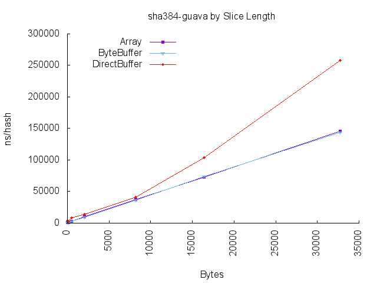

| Length |  Array | ByteBuffer | DirectBuffer |
| --- | ---: | ---: | ---: | 
| [32](#32-byte-slice-latency-all-hashes) | 789.683354 | 804.338899 | 3499.397516 |
| [128](#128-byte-slice-latency-all-hashes) | 1343.018339 | 1353.905566 | 3241.150523 |
| [512](#512-byte-slice-latency-all-hashes) | 3022.697749 | 2978.910086 | 8049.379225 |
| [2048](#2048-byte-slice-latency-all-hashes) | 9822.337422 | 9748.163263 | 13865.976098 |
| [8192](#8192-byte-slice-latency-all-hashes) | 37000.231741 | 36664.559453 | 40845.626029 |
| [16384](#16384-byte-slice-latency-all-hashes) | 73030.405360 | 73559.814944 | 103295.856337 |
| [32768](#32768-byte-slice-latency-all-hashes) | 145429.968135 | 144187.060905 | 257697.232770 |

---
### sha384-jacksum Latency
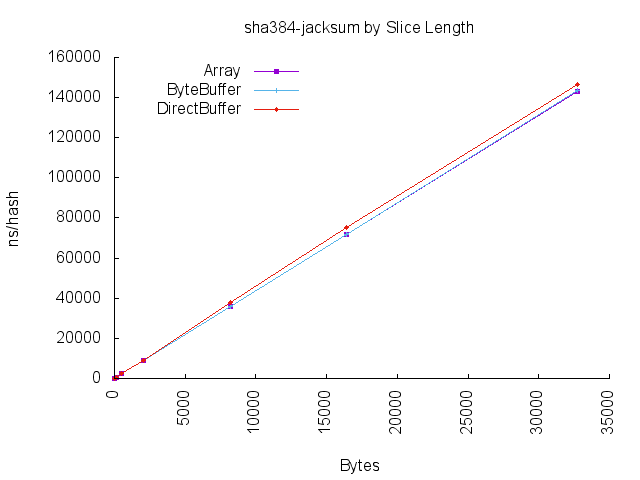

| Length |  Array | ByteBuffer | DirectBuffer |
| --- | ---: | ---: | ---: | 
| [32](#32-byte-slice-latency-all-hashes) | 23.548495 | 21.525139 | 44.462733 |
| [128](#128-byte-slice-latency-all-hashes) | 577.818310 | 577.624004 | 608.601591 |
| [512](#512-byte-slice-latency-all-hashes) | 2266.680403 | 2270.261034 | 2304.574266 |
| [2048](#2048-byte-slice-latency-all-hashes) | 8976.511988 | 9000.305676 | 9161.576414 |
| [8192](#8192-byte-slice-latency-all-hashes) | 35844.861253 | 35865.906618 | 37967.350600 |
| [16384](#16384-byte-slice-latency-all-hashes) | 71788.375512 | 71803.311694 | 75301.461220 |
| [32768](#32768-byte-slice-latency-all-hashes) | 143280.083299 | 143334.895444 | 146643.796719 |

---
### sha384-jacksum-alt Latency
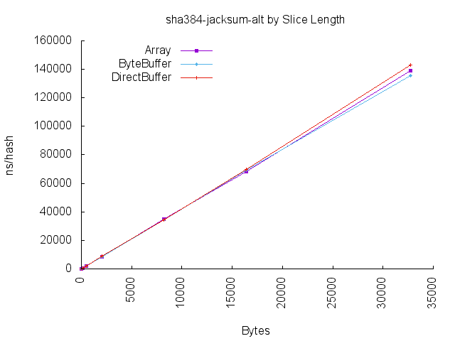

| Length |  Array | ByteBuffer | DirectBuffer |
| --- | ---: | ---: | ---: | 
| [32](#32-byte-slice-latency-all-hashes) | 27.560349 | 16.848937 | 50.219407 |
| [128](#128-byte-slice-latency-all-hashes) | 557.661405 | 575.845305 | 580.911086 |
| [512](#512-byte-slice-latency-all-hashes) | 2149.999673 | 2183.916346 | 2228.598832 |
| [2048](#2048-byte-slice-latency-all-hashes) | 8659.011303 | 8608.801423 | 8878.553040 |
| [8192](#8192-byte-slice-latency-all-hashes) | 34962.053427 | 34173.477374 | 34433.623331 |
| [16384](#16384-byte-slice-latency-all-hashes) | 68349.357335 | 69501.937657 | 69772.060352 |
| [32768](#32768-byte-slice-latency-all-hashes) | 139240.484345 | 135809.704642 | 143217.309584 |

---
### sha3-bc Latency
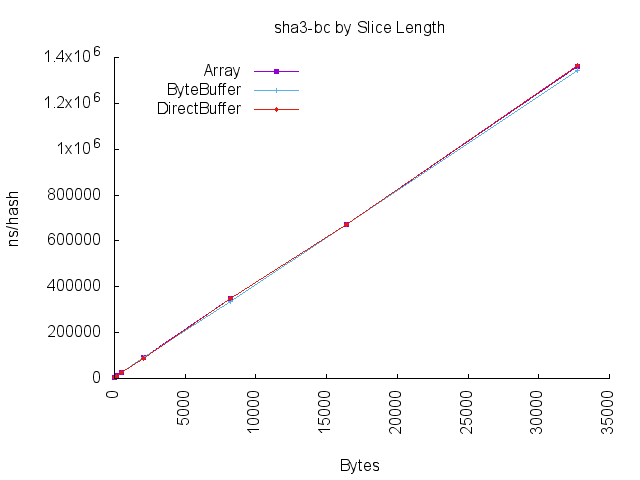

| Length |  Array | ByteBuffer | DirectBuffer |
| --- | ---: | ---: | ---: | 
| [32](#32-byte-slice-latency-all-hashes) | 5507.492100 | 5350.755536 | 5355.969622 |
| [128](#128-byte-slice-latency-all-hashes) | 11099.965474 | 10669.090840 | 10576.180955 |
| [512](#512-byte-slice-latency-all-hashes) | 26594.042492 | 25976.829350 | 25947.689827 |
| [2048](#2048-byte-slice-latency-all-hashes) | 89839.782063 | 91657.831744 | 87896.480844 |
| [8192](#8192-byte-slice-latency-all-hashes) | 347014.365807 | 337700.300019 | 348480.211668 |
| [16384](#16384-byte-slice-latency-all-hashes) | 669676.911108 | 670605.100315 | 672775.717753 |
| [32768](#32768-byte-slice-latency-all-hashes) | 1358930.785793 | 1341776.005211 | 1365138.350775 |

---
### sha512-bc Latency
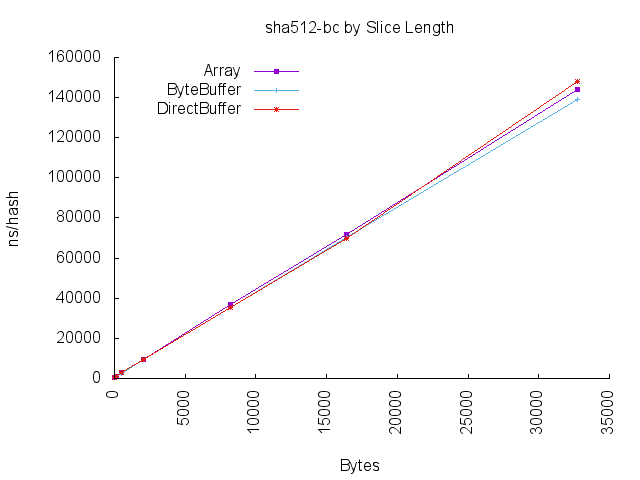

| Length |  Array | ByteBuffer | DirectBuffer |
| --- | ---: | ---: | ---: | 
| [32](#32-byte-slice-latency-all-hashes) | 580.618245 | 570.573516 | 597.029686 |
| [128](#128-byte-slice-latency-all-hashes) | 1142.930419 | 1092.905824 | 1118.996760 |
| [512](#512-byte-slice-latency-all-hashes) | 2809.399477 | 2731.919662 | 2788.077224 |
| [2048](#2048-byte-slice-latency-all-hashes) | 9496.240998 | 9237.672329 | 9506.857424 |
| [8192](#8192-byte-slice-latency-all-hashes) | 36803.652025 | 35317.556233 | 35211.700239 |
| [16384](#16384-byte-slice-latency-all-hashes) | 72012.780100 | 70057.785051 | 69908.467178 |
| [32768](#32768-byte-slice-latency-all-hashes) | 144111.946348 | 138896.150913 | 147942.576454 |

---
### sha512-bc-t Latency

| Length |  Array | ByteBuffer | DirectBuffer |
| --- | ---: | ---: | ---: | 
| [32](#32-byte-slice-latency-all-hashes) | 571.933456 | 570.332600 | 588.307607 |
| [128](#128-byte-slice-latency-all-hashes) | 1090.298445 | 1098.853422 | 1134.860603 |
| [512](#512-byte-slice-latency-all-hashes) | 2684.591484 | 2725.913100 | 2713.978857 |
| [2048](#2048-byte-slice-latency-all-hashes) | 9095.807326 | 9281.898003 | 9234.516860 |
| [8192](#8192-byte-slice-latency-all-hashes) | 34669.540498 | 35582.368678 | 35812.495896 |
| [16384](#16384-byte-slice-latency-all-hashes) | 69949.745272 | 68396.147793 | 69849.297915 |
| [32768](#32768-byte-slice-latency-all-hashes) | 140851.901050 | 137726.755905 | 146713.320232 |

---
### sha512-guava Latency
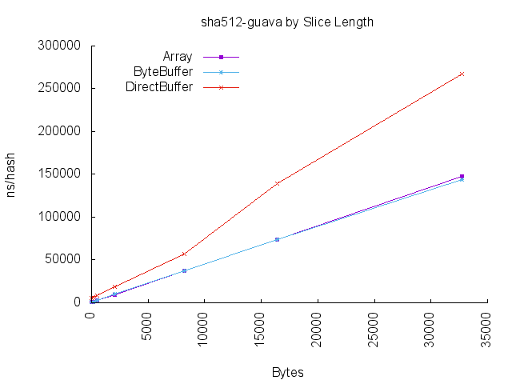

| Length |  Array | ByteBuffer | DirectBuffer |
| --- | ---: | ---: | ---: | 
| [32](#32-byte-slice-latency-all-hashes) | 767.162659 | 809.602677 | 5428.777711 |
| [128](#128-byte-slice-latency-all-hashes) | 1401.044055 | 1319.813152 | 6668.983985 |
| [512](#512-byte-slice-latency-all-hashes) | 3029.333378 | 3004.059287 | 8071.720760 |
| [2048](#2048-byte-slice-latency-all-hashes) | 9797.058188 | 9886.249913 | 18405.928390 |
| [8192](#8192-byte-slice-latency-all-hashes) | 37037.873280 | 37146.638504 | 56775.972463 |
| [16384](#16384-byte-slice-latency-all-hashes) | 74241.381504 | 73605.542618 | 139609.311497 |
| [32768](#32768-byte-slice-latency-all-hashes) | 147421.576200 | 144321.428211 | 267035.777394 |

---
### sha512-jacksum Latency
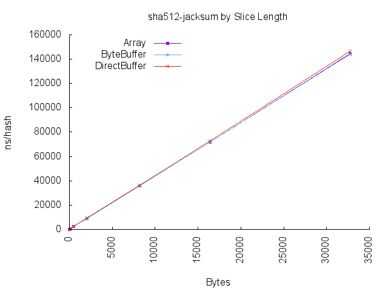

| Length |  Array | ByteBuffer | DirectBuffer |
| --- | ---: | ---: | ---: | 
| [32](#32-byte-slice-latency-all-hashes) | 23.677980 | 22.688428 | 46.514397 |
| [128](#128-byte-slice-latency-all-hashes) | 579.002787 | 584.100463 | 596.603419 |
| [512](#512-byte-slice-latency-all-hashes) | 2263.976129 | 2263.344029 | 2302.697588 |
| [2048](#2048-byte-slice-latency-all-hashes) | 8978.554703 | 9101.461765 | 9459.975145 |
| [8192](#8192-byte-slice-latency-all-hashes) | 35967.553468 | 35902.320841 | 36430.252683 |
| [16384](#16384-byte-slice-latency-all-hashes) | 71730.357050 | 71944.592802 | 72849.337913 |
| [32768](#32768-byte-slice-latency-all-hashes) | 144469.656007 | 143992.179855 | 146561.565937 |

---
### sha512-jacksum-alt Latency

| Length |  Array | ByteBuffer | DirectBuffer |
| --- | ---: | ---: | ---: | 
| [32](#32-byte-slice-latency-all-hashes) | 27.091566 | 16.853102 | 46.359127 |
| [128](#128-byte-slice-latency-all-hashes) | 569.125940 | 575.668424 | 605.907340 |
| [512](#512-byte-slice-latency-all-hashes) | 2152.855370 | 2152.046038 | 2193.630963 |
| [2048](#2048-byte-slice-latency-all-hashes) | 8634.042768 | 8666.247679 | 9077.954259 |
| [8192](#8192-byte-slice-latency-all-hashes) | 33849.148397 | 35077.046057 | 35017.880029 |
| [16384](#16384-byte-slice-latency-all-hashes) | 69792.305477 | 67702.110790 | 69048.911742 |
| [32768](#32768-byte-slice-latency-all-hashes) | 136431.208848 | 138165.054940 | 142233.116477 |

---
### sip-fwdeng Latency
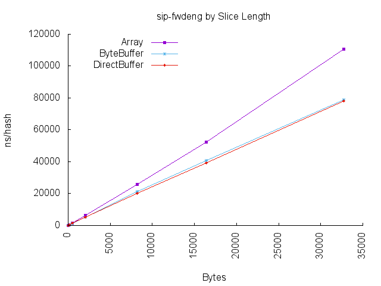

| Length |  Array | ByteBuffer | DirectBuffer |
| --- | ---: | ---: | ---: | 
| [32](#32-byte-slice-latency-all-hashes) | 145.526120 | 130.442160 | 130.302299 |
| [128](#128-byte-slice-latency-all-hashes) | 447.450040 | 361.333105 | 384.916222 |
| [512](#512-byte-slice-latency-all-hashes) | 1643.554155 | 1295.277221 | 1405.162681 |
| [2048](#2048-byte-slice-latency-all-hashes) | 6436.855673 | 5388.673122 | 5292.043763 |
| [8192](#8192-byte-slice-latency-all-hashes) | 25949.665401 | 21173.233935 | 20366.374503 |
| [16384](#16384-byte-slice-latency-all-hashes) | 52178.166144 | 40900.958991 | 39236.927143 |
| [32768](#32768-byte-slice-latency-all-hashes) | 110637.114150 | 79033.360302 | 78074.538307 |

---
### sip-guava Latency
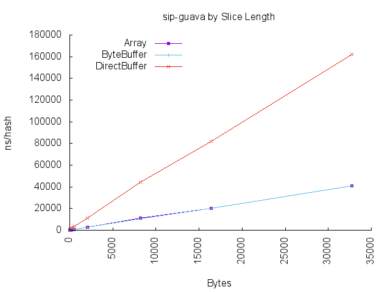

| Length |  Array | ByteBuffer | DirectBuffer |
| --- | ---: | ---: | ---: | 
| [32](#32-byte-slice-latency-all-hashes) | 130.737233 | 130.546213 | 1228.021504 |
| [128](#128-byte-slice-latency-all-hashes) | 241.708040 | 239.445997 | 1998.744774 |
| [512](#512-byte-slice-latency-all-hashes) | 731.471220 | 754.447242 | 3393.801643 |
| [2048](#2048-byte-slice-latency-all-hashes) | 2718.855981 | 2609.253296 | 11207.355422 |
| [8192](#8192-byte-slice-latency-all-hashes) | 11365.238786 | 10551.005943 | 44193.787464 |
| [16384](#16384-byte-slice-latency-all-hashes) | 20220.444869 | 20114.294012 | 81818.630267 |
| [32768](#32768-byte-slice-latency-all-hashes) | 41169.150258 | 40794.021335 | 162174.799871 |

---
### sip-inline Latency
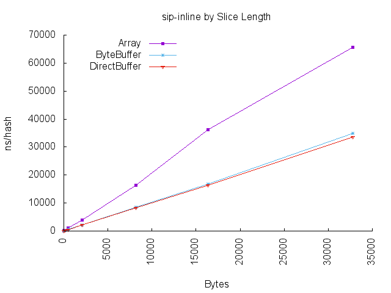

| Length |  Array | ByteBuffer | DirectBuffer |
| --- | ---: | ---: | ---: | 
| [32](#32-byte-slice-latency-all-hashes) | 113.774161 | 72.845011 | 73.988902 |
| [128](#128-byte-slice-latency-all-hashes) | 323.234926 | 158.183822 | 163.397172 |
| [512](#512-byte-slice-latency-all-hashes) | 1025.461737 | 591.585574 | 533.114593 |
| [2048](#2048-byte-slice-latency-all-hashes) | 3994.403195 | 2195.285042 | 2198.796854 |
| [8192](#8192-byte-slice-latency-all-hashes) | 16300.643989 | 8521.803246 | 8257.608331 |
| [16384](#16384-byte-slice-latency-all-hashes) | 36250.824730 | 16729.224813 | 16281.325294 |
| [32768](#32768-byte-slice-latency-all-hashes) | 65690.291060 | 34865.404878 | 33595.188849 |

---
### skein1024-bc Latency
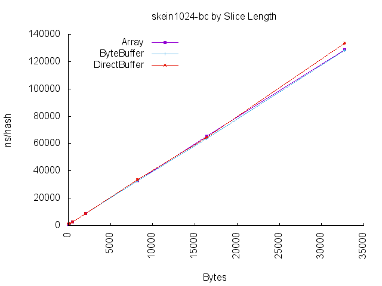

| Length |  Array | ByteBuffer | DirectBuffer |
| --- | ---: | ---: | ---: | 
| [32](#32-byte-slice-latency-all-hashes) | 1090.125054 | 1072.220395 | 1105.024278 |
| [128](#128-byte-slice-latency-all-hashes) | 1083.717816 | 1079.922541 | 1111.128666 |
| [512](#512-byte-slice-latency-all-hashes) | 2658.083174 | 2619.929003 | 2686.066559 |
| [2048](#2048-byte-slice-latency-all-hashes) | 8741.995601 | 8603.570164 | 8676.742117 |
| [8192](#8192-byte-slice-latency-all-hashes) | 32754.451847 | 32557.124023 | 33533.390034 |
| [16384](#16384-byte-slice-latency-all-hashes) | 65296.829907 | 63559.781288 | 64575.703261 |
| [32768](#32768-byte-slice-latency-all-hashes) | 128721.802720 | 128309.326450 | 133453.861631 |

---
### skein256-bc Latency
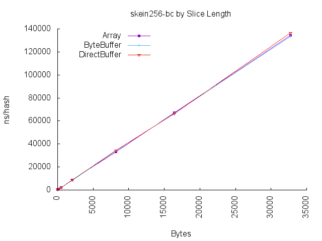

| Length |  Array | ByteBuffer | DirectBuffer |
| --- | ---: | ---: | ---: | 
| [32](#32-byte-slice-latency-all-hashes) | 337.961554 | 325.496182 | 343.624415 |
| [128](#128-byte-slice-latency-all-hashes) | 730.389076 | 739.350194 | 766.112180 |
| [512](#512-byte-slice-latency-all-hashes) | 2286.716470 | 2291.499266 | 2302.224906 |
| [2048](#2048-byte-slice-latency-all-hashes) | 8529.776268 | 8466.452291 | 8781.269741 |
| [8192](#8192-byte-slice-latency-all-hashes) | 33079.203595 | 33972.342683 | 34655.306142 |
| [16384](#16384-byte-slice-latency-all-hashes) | 67111.071396 | 66650.819344 | 66388.471423 |
| [32768](#32768-byte-slice-latency-all-hashes) | 134393.259276 | 133284.302177 | 136434.359747 |

---
### skein512-bc Latency
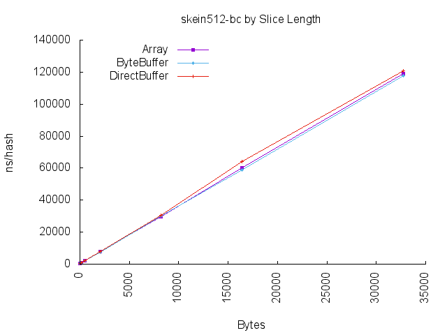

| Length |  Array | ByteBuffer | DirectBuffer |
| --- | ---: | ---: | ---: | 
| [32](#32-byte-slice-latency-all-hashes) | 538.472123 | 532.716650 | 574.606136 |
| [128](#128-byte-slice-latency-all-hashes) | 770.294673 | 750.512468 | 797.681376 |
| [512](#512-byte-slice-latency-all-hashes) | 2195.373372 | 2149.939343 | 2170.130685 |
| [2048](#2048-byte-slice-latency-all-hashes) | 7671.345034 | 7610.869367 | 7838.418087 |
| [8192](#8192-byte-slice-latency-all-hashes) | 29797.873127 | 30305.968867 | 30348.411383 |
| [16384](#16384-byte-slice-latency-all-hashes) | 60073.916322 | 59031.159258 | 64088.728223 |
| [32768](#32768-byte-slice-latency-all-hashes) | 118918.475034 | 117823.387932 | 120631.086076 |

---
### sm3-bc Latency
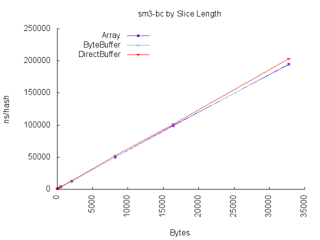

| Length |  Array | ByteBuffer | DirectBuffer |
| --- | ---: | ---: | ---: | 
| [32](#32-byte-slice-latency-all-hashes) | 412.752864 | 408.882744 | 447.807755 |
| [128](#128-byte-slice-latency-all-hashes) | 1178.571283 | 1159.304866 | 1191.355530 |
| [512](#512-byte-slice-latency-all-hashes) | 3506.669642 | 3470.854563 | 3685.027663 |
| [2048](#2048-byte-slice-latency-all-hashes) | 12839.919175 | 12679.720744 | 12915.349678 |
| [8192](#8192-byte-slice-latency-all-hashes) | 50161.349550 | 49742.145928 | 51904.751473 |
| [16384](#16384-byte-slice-latency-all-hashes) | 99269.276474 | 99673.778328 | 101198.818916 |
| [32768](#32768-byte-slice-latency-all-hashes) | 194883.390031 | 193894.344735 | 203600.562639 |

---
### sum16-jacksum Latency
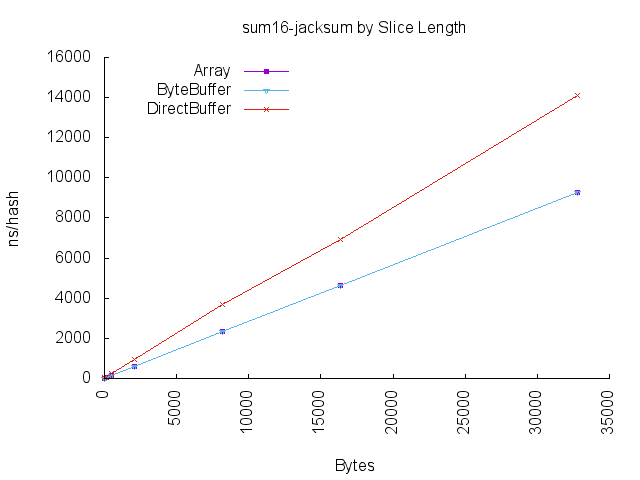

| Length |  Array | ByteBuffer | DirectBuffer |
| --- | ---: | ---: | ---: | 
| [32](#32-byte-slice-latency-all-hashes) | 19.284918 | 18.555200 | 43.070884 |
| [128](#128-byte-slice-latency-all-hashes) | 41.581240 | 42.436285 | 74.225023 |
| [512](#512-byte-slice-latency-all-hashes) | 156.029409 | 155.716747 | 234.246690 |
| [2048](#2048-byte-slice-latency-all-hashes) | 589.476227 | 589.779083 | 947.955800 |
| [8192](#8192-byte-slice-latency-all-hashes) | 2359.778585 | 2325.712895 | 3686.800183 |
| [16384](#16384-byte-slice-latency-all-hashes) | 4639.311324 | 4634.697329 | 6935.825969 |
| [32768](#32768-byte-slice-latency-all-hashes) | 9270.630819 | 9261.910459 | 14116.770669 |

---
### sum24-jacksum Latency
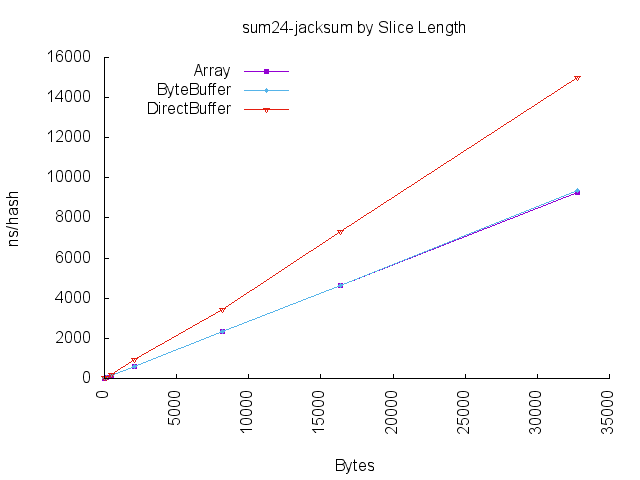

| Length |  Array | ByteBuffer | DirectBuffer |
| --- | ---: | ---: | ---: | 
| [32](#32-byte-slice-latency-all-hashes) | 19.158713 | 18.525051 | 42.438651 |
| [128](#128-byte-slice-latency-all-hashes) | 41.282981 | 42.244672 | 74.714459 |
| [512](#512-byte-slice-latency-all-hashes) | 155.187838 | 155.426871 | 203.800244 |
| [2048](#2048-byte-slice-latency-all-hashes) | 590.383196 | 589.116813 | 927.698598 |
| [8192](#8192-byte-slice-latency-all-hashes) | 2324.720148 | 2318.338429 | 3432.730423 |
| [16384](#16384-byte-slice-latency-all-hashes) | 4646.731304 | 4634.187458 | 7315.330059 |
| [32768](#32768-byte-slice-latency-all-hashes) | 9293.735256 | 9382.050196 | 14987.684649 |

---
### sum32-jacksum Latency
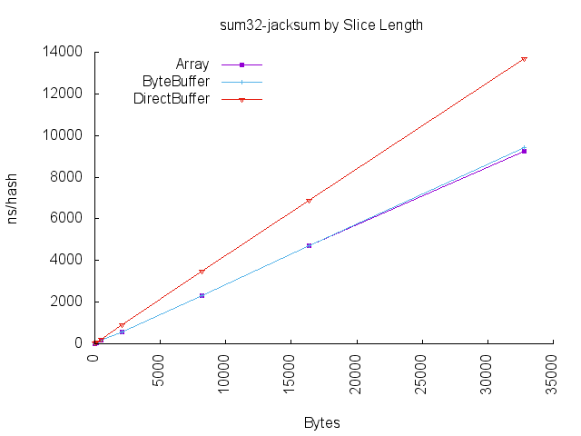

| Length |  Array | ByteBuffer | DirectBuffer |
| --- | ---: | ---: | ---: | 
| [32](#32-byte-slice-latency-all-hashes) | 18.664948 | 18.301874 | 42.465420 |
| [128](#128-byte-slice-latency-all-hashes) | 42.030140 | 42.635164 | 73.090384 |
| [512](#512-byte-slice-latency-all-hashes) | 157.004556 | 155.473360 | 219.297383 |
| [2048](#2048-byte-slice-latency-all-hashes) | 587.196615 | 586.764100 | 915.945037 |
| [8192](#8192-byte-slice-latency-all-hashes) | 2322.682121 | 2319.420643 | 3490.066103 |
| [16384](#16384-byte-slice-latency-all-hashes) | 4698.723981 | 4705.261964 | 6911.479251 |
| [32768](#32768-byte-slice-latency-all-hashes) | 9265.667838 | 9412.929185 | 13696.136605 |

---
### sum8-jacksum Latency
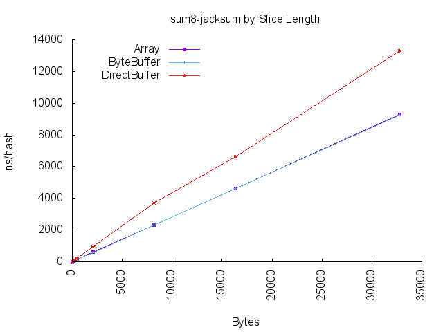

| Length |  Array | ByteBuffer | DirectBuffer |
| --- | ---: | ---: | ---: | 
| [32](#32-byte-slice-latency-all-hashes) | 19.201411 | 19.044973 | 41.522567 |
| [128](#128-byte-slice-latency-all-hashes) | 41.618125 | 41.821830 | 74.317820 |
| [512](#512-byte-slice-latency-all-hashes) | 154.251358 | 155.521600 | 236.652809 |
| [2048](#2048-byte-slice-latency-all-hashes) | 588.924288 | 588.647618 | 965.545839 |
| [8192](#8192-byte-slice-latency-all-hashes) | 2323.392908 | 2324.334352 | 3696.620139 |
| [16384](#16384-byte-slice-latency-all-hashes) | 4633.131228 | 4628.556172 | 6621.442152 |
| [32768](#32768-byte-slice-latency-all-hashes) | 9273.889493 | 9264.051134 | 13313.730969 |

---
### sumbsd-jacksum Latency
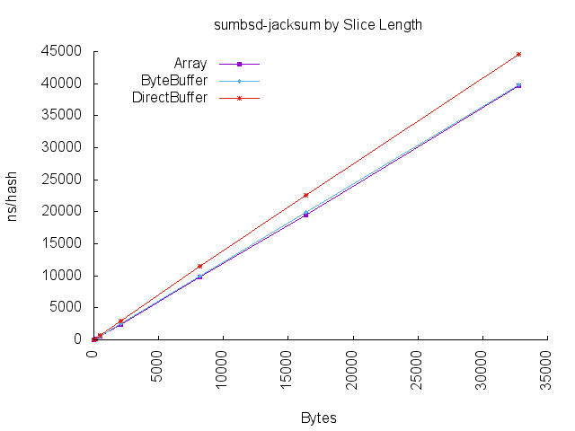

| Length |  Array | ByteBuffer | DirectBuffer |
| --- | ---: | ---: | ---: | 
| [32](#32-byte-slice-latency-all-hashes) | 40.151849 | 41.266825 | 63.289014 |
| [128](#128-byte-slice-latency-all-hashes) | 155.111128 | 160.631312 | 199.303746 |
| [512](#512-byte-slice-latency-all-hashes) | 621.302821 | 626.543800 | 693.756403 |
| [2048](#2048-byte-slice-latency-all-hashes) | 2447.968462 | 2538.449185 | 2925.747170 |
| [8192](#8192-byte-slice-latency-all-hashes) | 9774.072565 | 9957.169556 | 11479.408269 |
| [16384](#16384-byte-slice-latency-all-hashes) | 19536.592143 | 19934.656943 | 22631.432829 |
| [32768](#32768-byte-slice-latency-all-hashes) | 39657.828634 | 39789.122694 | 44516.787447 |

---
### sumsysv-jacksum Latency
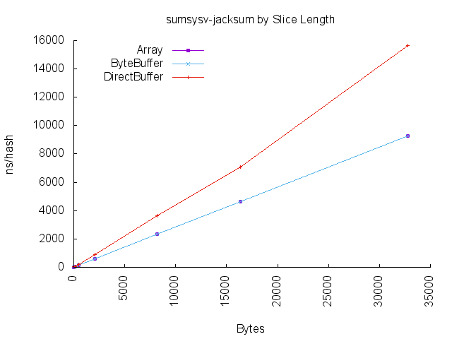

| Length |  Array | ByteBuffer | DirectBuffer |
| --- | ---: | ---: | ---: | 
| [32](#32-byte-slice-latency-all-hashes) | 17.160204 | 19.475162 | 41.259011 |
| [128](#128-byte-slice-latency-all-hashes) | 42.197802 | 43.227517 | 71.416307 |
| [512](#512-byte-slice-latency-all-hashes) | 156.782806 | 156.718080 | 202.763822 |
| [2048](#2048-byte-slice-latency-all-hashes) | 588.862214 | 590.683831 | 918.929610 |
| [8192](#8192-byte-slice-latency-all-hashes) | 2322.346490 | 2323.752421 | 3625.240129 |
| [16384](#16384-byte-slice-latency-all-hashes) | 4629.148761 | 4625.610213 | 7091.295672 |
| [32768](#32768-byte-slice-latency-all-hashes) | 9271.063310 | 9250.667196 | 15675.696743 |

---
### tiger128-jacksum Latency
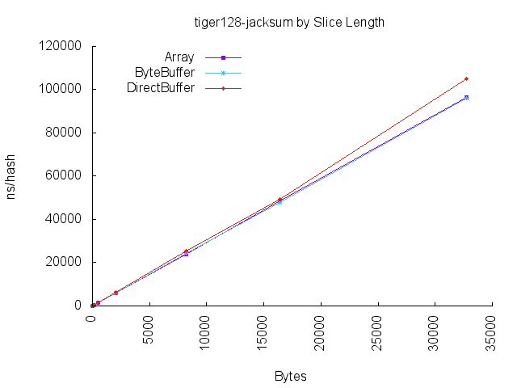

| Length |  Array | ByteBuffer | DirectBuffer |
| --- | ---: | ---: | ---: | 
| [32](#32-byte-slice-latency-all-hashes) | 26.530873 | 16.941582 | 47.610279 |
| [128](#128-byte-slice-latency-all-hashes) | 401.074567 | 393.063321 | 423.059030 |
| [512](#512-byte-slice-latency-all-hashes) | 1525.154331 | 1505.503519 | 1555.848562 |
| [2048](#2048-byte-slice-latency-all-hashes) | 6007.815842 | 5987.508289 | 6396.463148 |
| [8192](#8192-byte-slice-latency-all-hashes) | 24058.916748 | 24332.436644 | 25467.074684 |
| [16384](#16384-byte-slice-latency-all-hashes) | 48722.037265 | 47910.894090 | 49398.387716 |
| [32768](#32768-byte-slice-latency-all-hashes) | 96423.909610 | 96225.042253 | 105042.045868 |

---
### tiger160-jacksum Latency
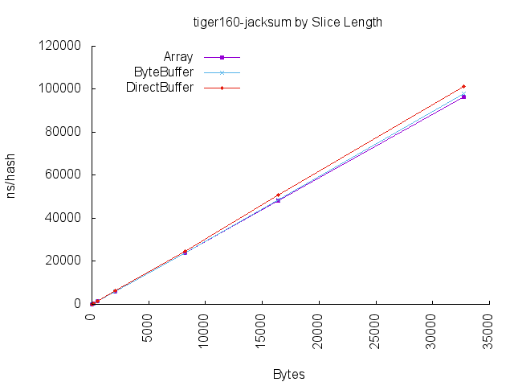

| Length |  Array | ByteBuffer | DirectBuffer |
| --- | ---: | ---: | ---: | 
| [32](#32-byte-slice-latency-all-hashes) | 26.901186 | 17.128180 | 46.495744 |
| [128](#128-byte-slice-latency-all-hashes) | 399.236201 | 385.854134 | 429.838225 |
| [512](#512-byte-slice-latency-all-hashes) | 1530.725514 | 1505.377729 | 1562.886613 |
| [2048](#2048-byte-slice-latency-all-hashes) | 6020.432378 | 5993.060304 | 6321.274810 |
| [8192](#8192-byte-slice-latency-all-hashes) | 24028.757783 | 23927.316677 | 24695.462103 |
| [16384](#16384-byte-slice-latency-all-hashes) | 48094.375085 | 48593.017087 | 50959.048366 |
| [32768](#32768-byte-slice-latency-all-hashes) | 96512.457122 | 97842.178509 | 101207.099637 |

---
### tiger2-jacksum Latency
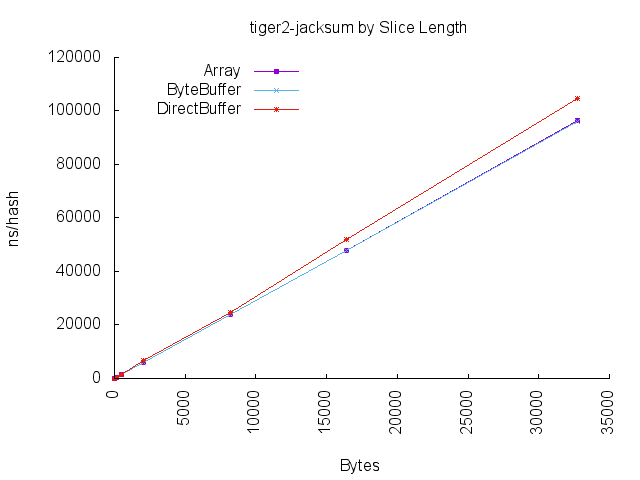

| Length |  Array | ByteBuffer | DirectBuffer |
| --- | ---: | ---: | ---: | 
| [32](#32-byte-slice-latency-all-hashes) | 26.605994 | 16.770049 | 46.625151 |
| [128](#128-byte-slice-latency-all-hashes) | 401.691753 | 390.442148 | 420.830864 |
| [512](#512-byte-slice-latency-all-hashes) | 1526.332830 | 1535.480364 | 1567.420421 |
| [2048](#2048-byte-slice-latency-all-hashes) | 6096.190129 | 6092.440538 | 6672.636726 |
| [8192](#8192-byte-slice-latency-all-hashes) | 24018.987258 | 23967.307515 | 24735.881030 |
| [16384](#16384-byte-slice-latency-all-hashes) | 47984.971323 | 47928.983316 | 51990.147155 |
| [32768](#32768-byte-slice-latency-all-hashes) | 96354.422821 | 96224.322310 | 104674.625360 |

---
### tiger2-jacksum-tree Latency
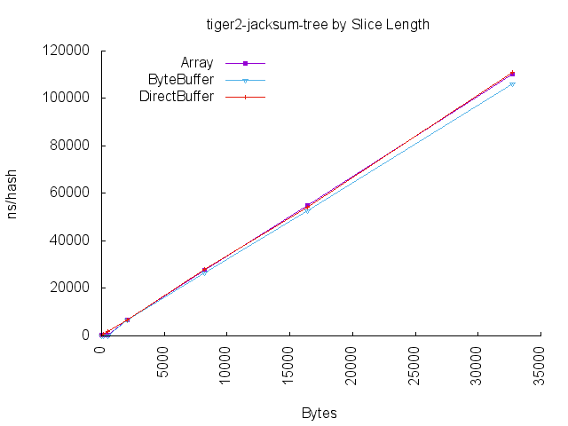

| Length |  Array | ByteBuffer | DirectBuffer |
| --- | ---: | ---: | ---: | 
| [32](#32-byte-slice-latency-all-hashes) | 250.069396 | 128.837808 | 362.411389 |
| [128](#128-byte-slice-latency-all-hashes) | 251.294784 | 26.103113 | 589.747046 |
| [512](#512-byte-slice-latency-all-hashes) | 227.500781 | 36.631956 | 1851.041674 |
| [2048](#2048-byte-slice-latency-all-hashes) | 6886.396725 | 6763.945267 | 6839.519636 |
| [8192](#8192-byte-slice-latency-all-hashes) | 27559.126274 | 26423.553452 | 28177.867059 |
| [16384](#16384-byte-slice-latency-all-hashes) | 55125.911059 | 52797.795698 | 54356.500292 |
| [32768](#32768-byte-slice-latency-all-hashes) | 110190.655736 | 106005.605000 | 111127.887051 |

---
### tiger-bc Latency
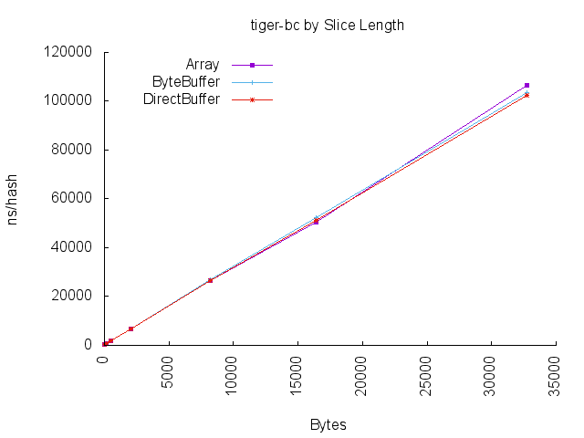

| Length |  Array | ByteBuffer | DirectBuffer |
| --- | ---: | ---: | ---: | 
| [32](#32-byte-slice-latency-all-hashes) | 242.005975 | 246.686902 | 271.585765 |
| [128](#128-byte-slice-latency-all-hashes) | 660.002892 | 666.205873 | 631.077592 |
| [512](#512-byte-slice-latency-all-hashes) | 1875.697551 | 1894.118669 | 1781.146270 |
| [2048](#2048-byte-slice-latency-all-hashes) | 6776.667262 | 6843.541936 | 6605.325239 |
| [8192](#8192-byte-slice-latency-all-hashes) | 26702.532819 | 26736.182014 | 26536.447706 |
| [16384](#16384-byte-slice-latency-all-hashes) | 50414.894820 | 52461.652578 | 51390.710594 |
| [32768](#32768-byte-slice-latency-all-hashes) | 106398.740240 | 103406.307166 | 102555.519100 |

---
### tiger-jacksum Latency
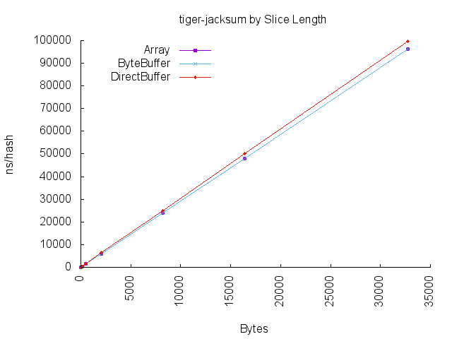

| Length |  Array | ByteBuffer | DirectBuffer |
| --- | ---: | ---: | ---: | 
| [32](#32-byte-slice-latency-all-hashes) | 26.595778 | 16.965748 | 47.113522 |
| [128](#128-byte-slice-latency-all-hashes) | 401.796797 | 387.227642 | 420.153623 |
| [512](#512-byte-slice-latency-all-hashes) | 1524.627404 | 1507.024007 | 1634.907074 |
| [2048](#2048-byte-slice-latency-all-hashes) | 6019.128108 | 5986.589100 | 6438.913033 |
| [8192](#8192-byte-slice-latency-all-hashes) | 24018.114701 | 23908.989200 | 24979.949576 |
| [16384](#16384-byte-slice-latency-all-hashes) | 47995.738629 | 47856.671813 | 50171.292652 |
| [32768](#32768-byte-slice-latency-all-hashes) | 96235.427284 | 96360.760532 | 99755.396993 |

---
### tiger-jacksum-tree Latency
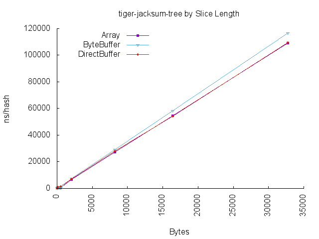

| Length |  Array | ByteBuffer | DirectBuffer |
| --- | ---: | ---: | ---: | 
| [32](#32-byte-slice-latency-all-hashes) | 250.629941 | 321.064486 | 47.720619 |
| [128](#128-byte-slice-latency-all-hashes) | 252.653821 | 209.263687 | 1052.546166 |
| [512](#512-byte-slice-latency-all-hashes) | 223.360626 | 213.754961 | 1537.874968 |
| [2048](#2048-byte-slice-latency-all-hashes) | 6844.681845 | 7407.192971 | 6937.521521 |
| [8192](#8192-byte-slice-latency-all-hashes) | 27272.440133 | 29181.218523 | 27879.572168 |
| [16384](#16384-byte-slice-latency-all-hashes) | 54602.297111 | 58367.366107 | 54100.236925 |
| [32768](#32768-byte-slice-latency-all-hashes) | 109228.445134 | 116771.488921 | 109373.813026 |

---
### whirlpool0-jacksum Latency
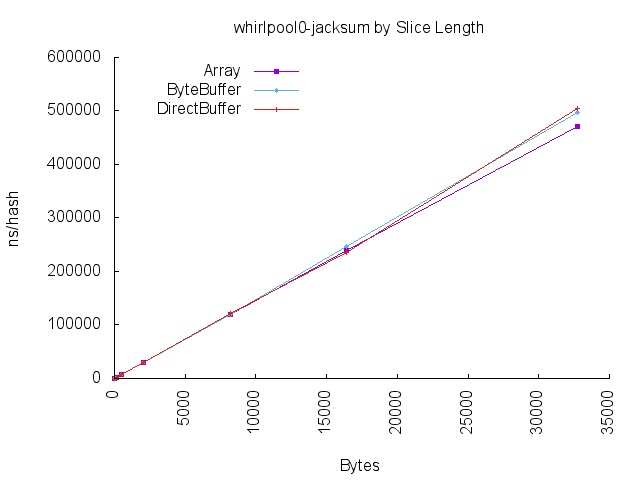

| Length |  Array | ByteBuffer | DirectBuffer |
| --- | ---: | ---: | ---: | 
| [32](#32-byte-slice-latency-all-hashes) | 25.970508 | 18.094768 | 46.474345 |
| [128](#128-byte-slice-latency-all-hashes) | 1979.447084 | 1878.216593 | 1953.496923 |
| [512](#512-byte-slice-latency-all-hashes) | 7592.802515 | 7567.420868 | 7464.317433 |
| [2048](#2048-byte-slice-latency-all-hashes) | 29716.585187 | 30086.007752 | 29177.853084 |
| [8192](#8192-byte-slice-latency-all-hashes) | 119422.871660 | 118922.842952 | 122404.539628 |
| [16384](#16384-byte-slice-latency-all-hashes) | 238476.645966 | 247153.069517 | 235551.306252 |
| [32768](#32768-byte-slice-latency-all-hashes) | 471825.197625 | 497386.317117 | 505036.533760 |

---
### whirlpool1-jacksum Latency
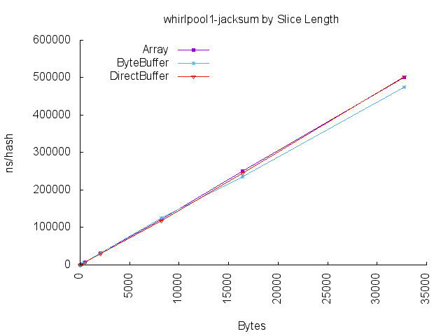

| Length |  Array | ByteBuffer | DirectBuffer |
| --- | ---: | ---: | ---: | 
| [32](#32-byte-slice-latency-all-hashes) | 26.265669 | 22.033114 | 48.362203 |
| [128](#128-byte-slice-latency-all-hashes) | 1929.650068 | 1880.684412 | 1974.996367 |
| [512](#512-byte-slice-latency-all-hashes) | 7649.692656 | 7536.850725 | 7718.138347 |
| [2048](#2048-byte-slice-latency-all-hashes) | 31163.949904 | 30993.655750 | 29855.311707 |
| [8192](#8192-byte-slice-latency-all-hashes) | 121465.681011 | 124906.731337 | 118464.335015 |
| [16384](#16384-byte-slice-latency-all-hashes) | 250386.459261 | 235995.191475 | 243932.597102 |
| [32768](#32768-byte-slice-latency-all-hashes) | 501584.184848 | 474985.561651 | 502137.316539 |

---
### whirlpool2-bc Latency
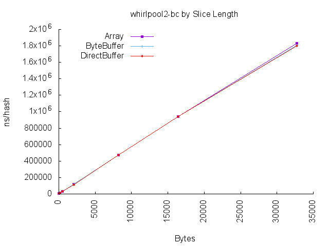

| Length |  Array | ByteBuffer | DirectBuffer |
| --- | ---: | ---: | ---: | 
| [32](#32-byte-slice-latency-all-hashes) | 6270.998018 | 6129.439497 | 6338.404691 |
| [128](#128-byte-slice-latency-all-hashes) | 9613.684622 | 9457.849010 | 9664.107738 |
| [512](#512-byte-slice-latency-all-hashes) | 30525.737752 | 31572.973664 | 30099.601804 |
| [2048](#2048-byte-slice-latency-all-hashes) | 115962.396326 | 119437.238101 | 112728.543432 |
| [8192](#8192-byte-slice-latency-all-hashes) | 472257.641617 | 471353.302467 | 470796.484675 |
| [16384](#16384-byte-slice-latency-all-hashes) | 938608.064165 | 941679.319556 | 943134.317780 |
| [32768](#32768-byte-slice-latency-all-hashes) | 1831059.705929 | 1807697.952518 | 1801403.342961 |

---
### whirlpool2-jacksum Latency
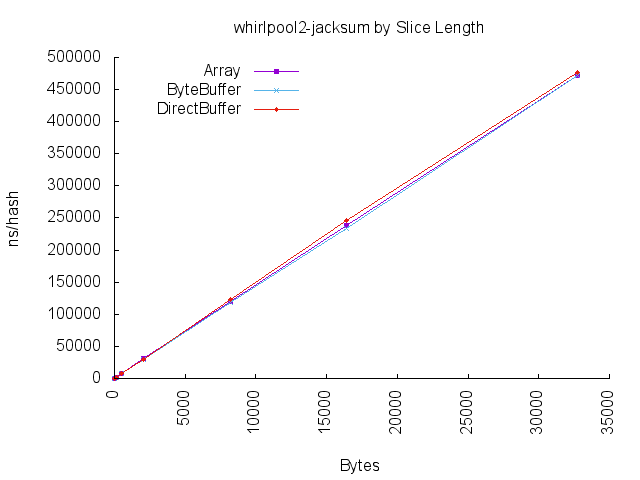

| Length |  Array | ByteBuffer | DirectBuffer |
| --- | ---: | ---: | ---: | 
| [32](#32-byte-slice-latency-all-hashes) | 26.001988 | 17.935126 | 47.432102 |
| [128](#128-byte-slice-latency-all-hashes) | 1965.017943 | 1896.056240 | 1945.630753 |
| [512](#512-byte-slice-latency-all-hashes) | 7598.991228 | 7494.350823 | 7616.733295 |
| [2048](#2048-byte-slice-latency-all-hashes) | 31028.194292 | 29478.367264 | 29210.031728 |
| [8192](#8192-byte-slice-latency-all-hashes) | 120421.342602 | 118030.458630 | 123694.251640 |
| [16384](#16384-byte-slice-latency-all-hashes) | 238812.147329 | 233316.075864 | 246698.044403 |
| [32768](#32768-byte-slice-latency-all-hashes) | 471215.039281 | 472039.365461 | 477019.787560 |

---
### xor8-jacksum Latency
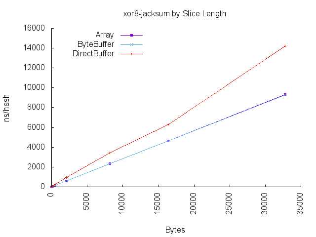

| Length |  Array | ByteBuffer | DirectBuffer |
| --- | ---: | ---: | ---: | 
| [32](#32-byte-slice-latency-all-hashes) | 15.805184 | 16.547681 | 43.397742 |
| [128](#128-byte-slice-latency-all-hashes) | 41.298078 | 43.899128 | 72.906913 |
| [512](#512-byte-slice-latency-all-hashes) | 154.755722 | 156.331284 | 236.426363 |
| [2048](#2048-byte-slice-latency-all-hashes) | 589.312160 | 591.167596 | 922.233789 |
| [8192](#8192-byte-slice-latency-all-hashes) | 2329.465925 | 2323.069861 | 3446.123846 |
| [16384](#16384-byte-slice-latency-all-hashes) | 4637.908998 | 4636.623755 | 6285.643003 |
| [32768](#32768-byte-slice-latency-all-hashes) | 9299.940093 | 9266.092236 | 14204.993906 |

---
### xxh32-jpountz-jni Latency
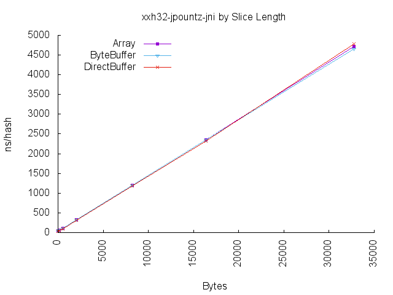

| Length |  Array | ByteBuffer | DirectBuffer |
| --- | ---: | ---: | ---: | 
| [32](#32-byte-slice-latency-all-hashes) | 41.597876 | 43.099607 | 33.626448 |
| [128](#128-byte-slice-latency-all-hashes) | 55.989063 | 56.687078 | 46.869187 |
| [512](#512-byte-slice-latency-all-hashes) | 109.096713 | 111.765548 | 99.914689 |
| [2048](#2048-byte-slice-latency-all-hashes) | 328.397121 | 334.885479 | 318.968539 |
| [8192](#8192-byte-slice-latency-all-hashes) | 1199.375262 | 1198.421896 | 1178.251301 |
| [16384](#16384-byte-slice-latency-all-hashes) | 2350.938172 | 2347.614663 | 2322.398964 |
| [32768](#32768-byte-slice-latency-all-hashes) | 4714.594507 | 4664.831748 | 4779.561239 |

---
### xxh32-jpountz-safe Latency
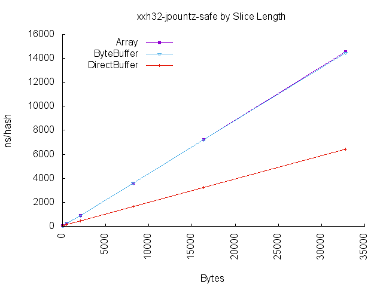

| Length |  Array | ByteBuffer | DirectBuffer |
| --- | ---: | ---: | ---: | 
| [32](#32-byte-slice-latency-all-hashes) | 25.001214 | 27.991035 | 26.610664 |
| [128](#128-byte-slice-latency-all-hashes) | 67.874825 | 68.989849 | 51.599383 |
| [512](#512-byte-slice-latency-all-hashes) | 244.942845 | 237.603127 | 136.013195 |
| [2048](#2048-byte-slice-latency-all-hashes) | 918.358412 | 914.470552 | 437.129712 |
| [8192](#8192-byte-slice-latency-all-hashes) | 3606.938807 | 3610.090258 | 1639.083841 |
| [16384](#16384-byte-slice-latency-all-hashes) | 7226.416016 | 7210.180897 | 3224.183894 |
| [32768](#32768-byte-slice-latency-all-hashes) | 14532.652869 | 14454.092493 | 6445.043513 |

---
### xxh32-jpountz-unsafe Latency
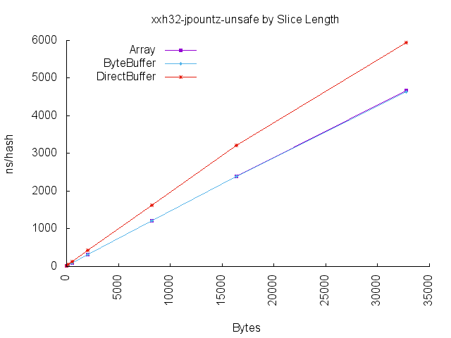

| Length |  Array | ByteBuffer | DirectBuffer |
| --- | ---: | ---: | ---: | 
| [32](#32-byte-slice-latency-all-hashes) | 14.192635 | 17.102599 | 26.556624 |
| [128](#128-byte-slice-latency-all-hashes) | 30.949038 | 32.528779 | 57.129863 |
| [512](#512-byte-slice-latency-all-hashes) | 98.606143 | 99.947098 | 129.547895 |
| [2048](#2048-byte-slice-latency-all-hashes) | 324.142837 | 319.003411 | 435.225347 |
| [8192](#8192-byte-slice-latency-all-hashes) | 1223.092118 | 1211.400110 | 1631.977210 |
| [16384](#16384-byte-slice-latency-all-hashes) | 2400.382422 | 2388.374511 | 3220.284687 |
| [32768](#32768-byte-slice-latency-all-hashes) | 4670.079728 | 4638.437863 | 5938.299010 |

---
### xxh64-jpountz-jni Latency
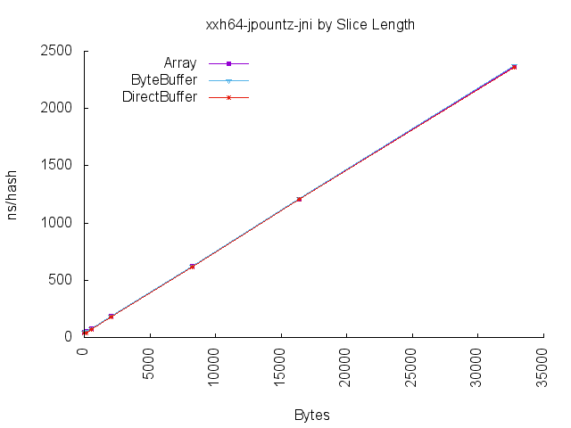

| Length |  Array | ByteBuffer | DirectBuffer |
| --- | ---: | ---: | ---: | 
| [32](#32-byte-slice-latency-all-hashes) | 44.161312 | 46.936457 | 35.494789 |
| [128](#128-byte-slice-latency-all-hashes) | 52.127289 | 55.073827 | 42.530321 |
| [512](#512-byte-slice-latency-all-hashes) | 77.602984 | 78.515226 | 68.634444 |
| [2048](#2048-byte-slice-latency-all-hashes) | 189.549048 | 188.886747 | 181.772016 |
| [8192](#8192-byte-slice-latency-all-hashes) | 624.341976 | 623.291145 | 612.861126 |
| [16384](#16384-byte-slice-latency-all-hashes) | 1203.596327 | 1218.843584 | 1210.028649 |
| [32768](#32768-byte-slice-latency-all-hashes) | 2365.333328 | 2375.359161 | 2357.866069 |

---
### xxh64-jpountz-safe Latency
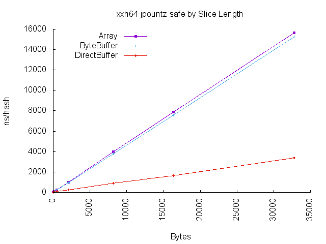

| Length |  Array | ByteBuffer | DirectBuffer |
| --- | ---: | ---: | ---: | 
| [32](#32-byte-slice-latency-all-hashes) | 28.641997 | 30.179441 | 21.988576 |
| [128](#128-byte-slice-latency-all-hashes) | 78.613048 | 77.530593 | 43.979924 |
| [512](#512-byte-slice-latency-all-hashes) | 264.049610 | 253.799352 | 97.834886 |
| [2048](#2048-byte-slice-latency-all-hashes) | 1005.299319 | 960.853530 | 271.485806 |
| [8192](#8192-byte-slice-latency-all-hashes) | 3975.148316 | 3795.907087 | 894.131827 |
| [16384](#16384-byte-slice-latency-all-hashes) | 7867.994508 | 7590.585372 | 1668.733749 |
| [32768](#32768-byte-slice-latency-all-hashes) | 15650.211365 | 15247.445567 | 3383.817183 |

---
### xxh64-jpountz-unsafe Latency
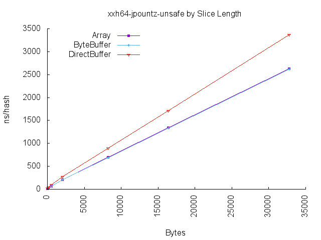

| Length |  Array | ByteBuffer | DirectBuffer |
| --- | ---: | ---: | ---: | 
| [32](#32-byte-slice-latency-all-hashes) | 16.304942 | 18.769096 | 22.195812 |
| [128](#128-byte-slice-latency-all-hashes) | 27.055606 | 28.798232 | 43.995919 |
| [512](#512-byte-slice-latency-all-hashes) | 67.458194 | 69.767219 | 97.808948 |
| [2048](#2048-byte-slice-latency-all-hashes) | 207.825593 | 208.989461 | 271.898290 |
| [8192](#8192-byte-slice-latency-all-hashes) | 692.818664 | 689.087359 | 892.120220 |
| [16384](#16384-byte-slice-latency-all-hashes) | 1337.092671 | 1332.856703 | 1709.380057 |
| [32768](#32768-byte-slice-latency-all-hashes) | 2630.670916 | 2618.192050 | 3370.527150 |

---
### xxh64-zah Latency
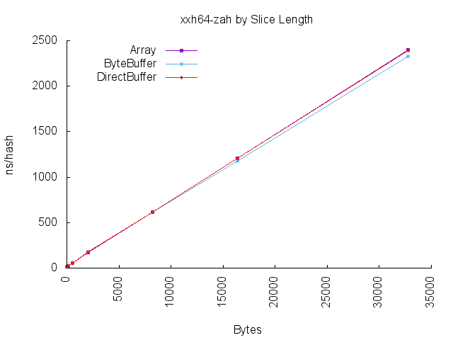

| Length |  Array | ByteBuffer | DirectBuffer |
| --- | ---: | ---: | ---: | 
| [32](#32-byte-slice-latency-all-hashes) | 16.906620 | 17.590279 | 20.053239 |
| [128](#128-byte-slice-latency-all-hashes) | 23.690011 | 26.375724 | 25.238294 |
| [512](#512-byte-slice-latency-all-hashes) | 54.629779 | 55.094186 | 55.519746 |
| [2048](#2048-byte-slice-latency-all-hashes) | 172.055998 | 176.232818 | 176.820485 |
| [8192](#8192-byte-slice-latency-all-hashes) | 618.209537 | 615.081332 | 613.045931 |
| [16384](#16384-byte-slice-latency-all-hashes) | 1206.748336 | 1177.365452 | 1208.667697 |
| [32768](#32768-byte-slice-latency-all-hashes) | 2394.944648 | 2330.808235 | 2394.061387 |

---
Generated from [JMH CSV](jmh-result.csv) on Wed, 30 Sep 2015 22:40:23 +0000 by [Hash-Bench](https://github.com/benalexau/hash-bench).
