# Hash-Bench Results
## Contents
### Latency by Byte Slice Length
| Hash | 32 |128 |512 |2048 |8192 |16384 |32768 |
| --- | :---: | :---: | :---: | :---: | :---: | :---: | :---: | 
| All | [*](#32-byte-slice-latency-all-hashes) | [*](#128-byte-slice-latency-all-hashes) | [*](#512-byte-slice-latency-all-hashes) | [*](#2048-byte-slice-latency-all-hashes) | [*](#8192-byte-slice-latency-all-hashes) | [*](#16384-byte-slice-latency-all-hashes) | [*](#32768-byte-slice-latency-all-hashes) | 
| adler32 | [*](#32-byte-slice-latency-adler32) | [*](#128-byte-slice-latency-adler32) | [*](#512-byte-slice-latency-adler32) | [*](#2048-byte-slice-latency-adler32) | [*](#8192-byte-slice-latency-adler32) | [*](#16384-byte-slice-latency-adler32) | [*](#32768-byte-slice-latency-adler32) | 
| city64 | [*](#32-byte-slice-latency-city64) | [*](#128-byte-slice-latency-city64) | [*](#512-byte-slice-latency-city64) | [*](#2048-byte-slice-latency-city64) | [*](#8192-byte-slice-latency-city64) | [*](#16384-byte-slice-latency-city64) | [*](#32768-byte-slice-latency-city64) | 
| cksum | [*](#32-byte-slice-latency-cksum) | [*](#128-byte-slice-latency-cksum) | [*](#512-byte-slice-latency-cksum) | [*](#2048-byte-slice-latency-cksum) | [*](#8192-byte-slice-latency-cksum) | [*](#16384-byte-slice-latency-cksum) | [*](#32768-byte-slice-latency-cksum) | 
| crc16 | [*](#32-byte-slice-latency-crc16) | [*](#128-byte-slice-latency-crc16) | [*](#512-byte-slice-latency-crc16) | [*](#2048-byte-slice-latency-crc16) | [*](#8192-byte-slice-latency-crc16) | [*](#16384-byte-slice-latency-crc16) | [*](#32768-byte-slice-latency-crc16) | 
| crc24 | [*](#32-byte-slice-latency-crc24) | [*](#128-byte-slice-latency-crc24) | [*](#512-byte-slice-latency-crc24) | [*](#2048-byte-slice-latency-crc24) | [*](#8192-byte-slice-latency-crc24) | [*](#16384-byte-slice-latency-crc24) | [*](#32768-byte-slice-latency-crc24) | 
| crc32 | [*](#32-byte-slice-latency-crc32) | [*](#128-byte-slice-latency-crc32) | [*](#512-byte-slice-latency-crc32) | [*](#2048-byte-slice-latency-crc32) | [*](#8192-byte-slice-latency-crc32) | [*](#16384-byte-slice-latency-crc32) | [*](#32768-byte-slice-latency-crc32) | 
| crc64 | [*](#32-byte-slice-latency-crc64) | [*](#128-byte-slice-latency-crc64) | [*](#512-byte-slice-latency-crc64) | [*](#2048-byte-slice-latency-crc64) | [*](#8192-byte-slice-latency-crc64) | [*](#16384-byte-slice-latency-crc64) | [*](#32768-byte-slice-latency-crc64) | 
| crc8 | [*](#32-byte-slice-latency-crc8) | [*](#128-byte-slice-latency-crc8) | [*](#512-byte-slice-latency-crc8) | [*](#2048-byte-slice-latency-crc8) | [*](#8192-byte-slice-latency-crc8) | [*](#16384-byte-slice-latency-crc8) | [*](#32768-byte-slice-latency-crc8) | 
| ed2k | [*](#32-byte-slice-latency-ed2k) | [*](#128-byte-slice-latency-ed2k) | [*](#512-byte-slice-latency-ed2k) | [*](#2048-byte-slice-latency-ed2k) | [*](#8192-byte-slice-latency-ed2k) | [*](#16384-byte-slice-latency-ed2k) | [*](#32768-byte-slice-latency-ed2k) | 
| elf | [*](#32-byte-slice-latency-elf) | [*](#128-byte-slice-latency-elf) | [*](#512-byte-slice-latency-elf) | [*](#2048-byte-slice-latency-elf) | [*](#8192-byte-slice-latency-elf) | [*](#16384-byte-slice-latency-elf) | [*](#32768-byte-slice-latency-elf) | 
| farmna | [*](#32-byte-slice-latency-farmna) | [*](#128-byte-slice-latency-farmna) | [*](#512-byte-slice-latency-farmna) | [*](#2048-byte-slice-latency-farmna) | [*](#8192-byte-slice-latency-farmna) | [*](#16384-byte-slice-latency-farmna) | [*](#32768-byte-slice-latency-farmna) | 
| farmuo | [*](#32-byte-slice-latency-farmuo) | [*](#128-byte-slice-latency-farmuo) | [*](#512-byte-slice-latency-farmuo) | [*](#2048-byte-slice-latency-farmuo) | [*](#8192-byte-slice-latency-farmuo) | [*](#16384-byte-slice-latency-farmuo) | [*](#32768-byte-slice-latency-farmuo) | 
| fcs16 | [*](#32-byte-slice-latency-fcs16) | [*](#128-byte-slice-latency-fcs16) | [*](#512-byte-slice-latency-fcs16) | [*](#2048-byte-slice-latency-fcs16) | [*](#8192-byte-slice-latency-fcs16) | [*](#16384-byte-slice-latency-fcs16) | [*](#32768-byte-slice-latency-fcs16) | 
| gfh32 | [*](#32-byte-slice-latency-gfh32) | [*](#128-byte-slice-latency-gfh32) | [*](#512-byte-slice-latency-gfh32) | [*](#2048-byte-slice-latency-gfh32) | [*](#8192-byte-slice-latency-gfh32) | [*](#16384-byte-slice-latency-gfh32) | [*](#32768-byte-slice-latency-gfh32) | 
| gfh64 | [*](#32-byte-slice-latency-gfh64) | [*](#128-byte-slice-latency-gfh64) | [*](#512-byte-slice-latency-gfh64) | [*](#2048-byte-slice-latency-gfh64) | [*](#8192-byte-slice-latency-gfh64) | [*](#16384-byte-slice-latency-gfh64) | [*](#32768-byte-slice-latency-gfh64) | 
| gost | [*](#32-byte-slice-latency-gost) | [*](#128-byte-slice-latency-gost) | [*](#512-byte-slice-latency-gost) | [*](#2048-byte-slice-latency-gost) | [*](#8192-byte-slice-latency-gost) | [*](#16384-byte-slice-latency-gost) | [*](#32768-byte-slice-latency-gost) | 
| has160 | [*](#32-byte-slice-latency-has160) | [*](#128-byte-slice-latency-has160) | [*](#512-byte-slice-latency-has160) | [*](#2048-byte-slice-latency-has160) | [*](#8192-byte-slice-latency-has160) | [*](#16384-byte-slice-latency-has160) | [*](#32768-byte-slice-latency-has160) | 
| haval128h3 | [*](#32-byte-slice-latency-haval128h3) | [*](#128-byte-slice-latency-haval128h3) | [*](#512-byte-slice-latency-haval128h3) | [*](#2048-byte-slice-latency-haval128h3) | [*](#8192-byte-slice-latency-haval128h3) | [*](#16384-byte-slice-latency-haval128h3) | [*](#32768-byte-slice-latency-haval128h3) | 
| haval128h4 | [*](#32-byte-slice-latency-haval128h4) | [*](#128-byte-slice-latency-haval128h4) | [*](#512-byte-slice-latency-haval128h4) | [*](#2048-byte-slice-latency-haval128h4) | [*](#8192-byte-slice-latency-haval128h4) | [*](#16384-byte-slice-latency-haval128h4) | [*](#32768-byte-slice-latency-haval128h4) | 
| haval128h5 | [*](#32-byte-slice-latency-haval128h5) | [*](#128-byte-slice-latency-haval128h5) | [*](#512-byte-slice-latency-haval128h5) | [*](#2048-byte-slice-latency-haval128h5) | [*](#8192-byte-slice-latency-haval128h5) | [*](#16384-byte-slice-latency-haval128h5) | [*](#32768-byte-slice-latency-haval128h5) | 
| haval160h3 | [*](#32-byte-slice-latency-haval160h3) | [*](#128-byte-slice-latency-haval160h3) | [*](#512-byte-slice-latency-haval160h3) | [*](#2048-byte-slice-latency-haval160h3) | [*](#8192-byte-slice-latency-haval160h3) | [*](#16384-byte-slice-latency-haval160h3) | [*](#32768-byte-slice-latency-haval160h3) | 
| haval160h4 | [*](#32-byte-slice-latency-haval160h4) | [*](#128-byte-slice-latency-haval160h4) | [*](#512-byte-slice-latency-haval160h4) | [*](#2048-byte-slice-latency-haval160h4) | [*](#8192-byte-slice-latency-haval160h4) | [*](#16384-byte-slice-latency-haval160h4) | [*](#32768-byte-slice-latency-haval160h4) | 
| haval160h5 | [*](#32-byte-slice-latency-haval160h5) | [*](#128-byte-slice-latency-haval160h5) | [*](#512-byte-slice-latency-haval160h5) | [*](#2048-byte-slice-latency-haval160h5) | [*](#8192-byte-slice-latency-haval160h5) | [*](#16384-byte-slice-latency-haval160h5) | [*](#32768-byte-slice-latency-haval160h5) | 
| haval192h3 | [*](#32-byte-slice-latency-haval192h3) | [*](#128-byte-slice-latency-haval192h3) | [*](#512-byte-slice-latency-haval192h3) | [*](#2048-byte-slice-latency-haval192h3) | [*](#8192-byte-slice-latency-haval192h3) | [*](#16384-byte-slice-latency-haval192h3) | [*](#32768-byte-slice-latency-haval192h3) | 
| haval192h4 | [*](#32-byte-slice-latency-haval192h4) | [*](#128-byte-slice-latency-haval192h4) | [*](#512-byte-slice-latency-haval192h4) | [*](#2048-byte-slice-latency-haval192h4) | [*](#8192-byte-slice-latency-haval192h4) | [*](#16384-byte-slice-latency-haval192h4) | [*](#32768-byte-slice-latency-haval192h4) | 
| haval192h5 | [*](#32-byte-slice-latency-haval192h5) | [*](#128-byte-slice-latency-haval192h5) | [*](#512-byte-slice-latency-haval192h5) | [*](#2048-byte-slice-latency-haval192h5) | [*](#8192-byte-slice-latency-haval192h5) | [*](#16384-byte-slice-latency-haval192h5) | [*](#32768-byte-slice-latency-haval192h5) | 
| haval224h3 | [*](#32-byte-slice-latency-haval224h3) | [*](#128-byte-slice-latency-haval224h3) | [*](#512-byte-slice-latency-haval224h3) | [*](#2048-byte-slice-latency-haval224h3) | [*](#8192-byte-slice-latency-haval224h3) | [*](#16384-byte-slice-latency-haval224h3) | [*](#32768-byte-slice-latency-haval224h3) | 
| haval224h4 | [*](#32-byte-slice-latency-haval224h4) | [*](#128-byte-slice-latency-haval224h4) | [*](#512-byte-slice-latency-haval224h4) | [*](#2048-byte-slice-latency-haval224h4) | [*](#8192-byte-slice-latency-haval224h4) | [*](#16384-byte-slice-latency-haval224h4) | [*](#32768-byte-slice-latency-haval224h4) | 
| haval224h5 | [*](#32-byte-slice-latency-haval224h5) | [*](#128-byte-slice-latency-haval224h5) | [*](#512-byte-slice-latency-haval224h5) | [*](#2048-byte-slice-latency-haval224h5) | [*](#8192-byte-slice-latency-haval224h5) | [*](#16384-byte-slice-latency-haval224h5) | [*](#32768-byte-slice-latency-haval224h5) | 
| haval256h3 | [*](#32-byte-slice-latency-haval256h3) | [*](#128-byte-slice-latency-haval256h3) | [*](#512-byte-slice-latency-haval256h3) | [*](#2048-byte-slice-latency-haval256h3) | [*](#8192-byte-slice-latency-haval256h3) | [*](#16384-byte-slice-latency-haval256h3) | [*](#32768-byte-slice-latency-haval256h3) | 
| haval256h4 | [*](#32-byte-slice-latency-haval256h4) | [*](#128-byte-slice-latency-haval256h4) | [*](#512-byte-slice-latency-haval256h4) | [*](#2048-byte-slice-latency-haval256h4) | [*](#8192-byte-slice-latency-haval256h4) | [*](#16384-byte-slice-latency-haval256h4) | [*](#32768-byte-slice-latency-haval256h4) | 
| haval256h5 | [*](#32-byte-slice-latency-haval256h5) | [*](#128-byte-slice-latency-haval256h5) | [*](#512-byte-slice-latency-haval256h5) | [*](#2048-byte-slice-latency-haval256h5) | [*](#8192-byte-slice-latency-haval256h5) | [*](#16384-byte-slice-latency-haval256h5) | [*](#32768-byte-slice-latency-haval256h5) | 
| md2 | [*](#32-byte-slice-latency-md2) | [*](#128-byte-slice-latency-md2) | [*](#512-byte-slice-latency-md2) | [*](#2048-byte-slice-latency-md2) | [*](#8192-byte-slice-latency-md2) | [*](#16384-byte-slice-latency-md2) | [*](#32768-byte-slice-latency-md2) | 
| md4 | [*](#32-byte-slice-latency-md4) | [*](#128-byte-slice-latency-md4) | [*](#512-byte-slice-latency-md4) | [*](#2048-byte-slice-latency-md4) | [*](#8192-byte-slice-latency-md4) | [*](#16384-byte-slice-latency-md4) | [*](#32768-byte-slice-latency-md4) | 
| md5 | [*](#32-byte-slice-latency-md5) | [*](#128-byte-slice-latency-md5) | [*](#512-byte-slice-latency-md5) | [*](#2048-byte-slice-latency-md5) | [*](#8192-byte-slice-latency-md5) | [*](#16384-byte-slice-latency-md5) | [*](#32768-byte-slice-latency-md5) | 
| murmur3h128 | [*](#32-byte-slice-latency-murmur3h128) | [*](#128-byte-slice-latency-murmur3h128) | [*](#512-byte-slice-latency-murmur3h128) | [*](#2048-byte-slice-latency-murmur3h128) | [*](#8192-byte-slice-latency-murmur3h128) | [*](#16384-byte-slice-latency-murmur3h128) | [*](#32768-byte-slice-latency-murmur3h128) | 
| murmur3h32 | [*](#32-byte-slice-latency-murmur3h32) | [*](#128-byte-slice-latency-murmur3h32) | [*](#512-byte-slice-latency-murmur3h32) | [*](#2048-byte-slice-latency-murmur3h32) | [*](#8192-byte-slice-latency-murmur3h32) | [*](#16384-byte-slice-latency-murmur3h32) | [*](#32768-byte-slice-latency-murmur3h32) | 
| ripemd128 | [*](#32-byte-slice-latency-ripemd128) | [*](#128-byte-slice-latency-ripemd128) | [*](#512-byte-slice-latency-ripemd128) | [*](#2048-byte-slice-latency-ripemd128) | [*](#8192-byte-slice-latency-ripemd128) | [*](#16384-byte-slice-latency-ripemd128) | [*](#32768-byte-slice-latency-ripemd128) | 
| ripemd160 | [*](#32-byte-slice-latency-ripemd160) | [*](#128-byte-slice-latency-ripemd160) | [*](#512-byte-slice-latency-ripemd160) | [*](#2048-byte-slice-latency-ripemd160) | [*](#8192-byte-slice-latency-ripemd160) | [*](#16384-byte-slice-latency-ripemd160) | [*](#32768-byte-slice-latency-ripemd160) | 
| ripemd256 | [*](#32-byte-slice-latency-ripemd256) | [*](#128-byte-slice-latency-ripemd256) | [*](#512-byte-slice-latency-ripemd256) | [*](#2048-byte-slice-latency-ripemd256) | [*](#8192-byte-slice-latency-ripemd256) | [*](#16384-byte-slice-latency-ripemd256) | [*](#32768-byte-slice-latency-ripemd256) | 
| ripemd320 | [*](#32-byte-slice-latency-ripemd320) | [*](#128-byte-slice-latency-ripemd320) | [*](#512-byte-slice-latency-ripemd320) | [*](#2048-byte-slice-latency-ripemd320) | [*](#8192-byte-slice-latency-ripemd320) | [*](#16384-byte-slice-latency-ripemd320) | [*](#32768-byte-slice-latency-ripemd320) | 
| sha0 | [*](#32-byte-slice-latency-sha0) | [*](#128-byte-slice-latency-sha0) | [*](#512-byte-slice-latency-sha0) | [*](#2048-byte-slice-latency-sha0) | [*](#8192-byte-slice-latency-sha0) | [*](#16384-byte-slice-latency-sha0) | [*](#32768-byte-slice-latency-sha0) | 
| sha1 | [*](#32-byte-slice-latency-sha1) | [*](#128-byte-slice-latency-sha1) | [*](#512-byte-slice-latency-sha1) | [*](#2048-byte-slice-latency-sha1) | [*](#8192-byte-slice-latency-sha1) | [*](#16384-byte-slice-latency-sha1) | [*](#32768-byte-slice-latency-sha1) | 
| sha224 | [*](#32-byte-slice-latency-sha224) | [*](#128-byte-slice-latency-sha224) | [*](#512-byte-slice-latency-sha224) | [*](#2048-byte-slice-latency-sha224) | [*](#8192-byte-slice-latency-sha224) | [*](#16384-byte-slice-latency-sha224) | [*](#32768-byte-slice-latency-sha224) | 
| sha256 | [*](#32-byte-slice-latency-sha256) | [*](#128-byte-slice-latency-sha256) | [*](#512-byte-slice-latency-sha256) | [*](#2048-byte-slice-latency-sha256) | [*](#8192-byte-slice-latency-sha256) | [*](#16384-byte-slice-latency-sha256) | [*](#32768-byte-slice-latency-sha256) | 
| sha3 | [*](#32-byte-slice-latency-sha3) | [*](#128-byte-slice-latency-sha3) | [*](#512-byte-slice-latency-sha3) | [*](#2048-byte-slice-latency-sha3) | [*](#8192-byte-slice-latency-sha3) | [*](#16384-byte-slice-latency-sha3) | [*](#32768-byte-slice-latency-sha3) | 
| sha384 | [*](#32-byte-slice-latency-sha384) | [*](#128-byte-slice-latency-sha384) | [*](#512-byte-slice-latency-sha384) | [*](#2048-byte-slice-latency-sha384) | [*](#8192-byte-slice-latency-sha384) | [*](#16384-byte-slice-latency-sha384) | [*](#32768-byte-slice-latency-sha384) | 
| sha512 | [*](#32-byte-slice-latency-sha512) | [*](#128-byte-slice-latency-sha512) | [*](#512-byte-slice-latency-sha512) | [*](#2048-byte-slice-latency-sha512) | [*](#8192-byte-slice-latency-sha512) | [*](#16384-byte-slice-latency-sha512) | [*](#32768-byte-slice-latency-sha512) | 
| sip | [*](#32-byte-slice-latency-sip) | [*](#128-byte-slice-latency-sip) | [*](#512-byte-slice-latency-sip) | [*](#2048-byte-slice-latency-sip) | [*](#8192-byte-slice-latency-sip) | [*](#16384-byte-slice-latency-sip) | [*](#32768-byte-slice-latency-sip) | 
| skein1024 | [*](#32-byte-slice-latency-skein1024) | [*](#128-byte-slice-latency-skein1024) | [*](#512-byte-slice-latency-skein1024) | [*](#2048-byte-slice-latency-skein1024) | [*](#8192-byte-slice-latency-skein1024) | [*](#16384-byte-slice-latency-skein1024) | [*](#32768-byte-slice-latency-skein1024) | 
| skein256 | [*](#32-byte-slice-latency-skein256) | [*](#128-byte-slice-latency-skein256) | [*](#512-byte-slice-latency-skein256) | [*](#2048-byte-slice-latency-skein256) | [*](#8192-byte-slice-latency-skein256) | [*](#16384-byte-slice-latency-skein256) | [*](#32768-byte-slice-latency-skein256) | 
| skein512 | [*](#32-byte-slice-latency-skein512) | [*](#128-byte-slice-latency-skein512) | [*](#512-byte-slice-latency-skein512) | [*](#2048-byte-slice-latency-skein512) | [*](#8192-byte-slice-latency-skein512) | [*](#16384-byte-slice-latency-skein512) | [*](#32768-byte-slice-latency-skein512) | 
| sm3 | [*](#32-byte-slice-latency-sm3) | [*](#128-byte-slice-latency-sm3) | [*](#512-byte-slice-latency-sm3) | [*](#2048-byte-slice-latency-sm3) | [*](#8192-byte-slice-latency-sm3) | [*](#16384-byte-slice-latency-sm3) | [*](#32768-byte-slice-latency-sm3) | 
| sum16 | [*](#32-byte-slice-latency-sum16) | [*](#128-byte-slice-latency-sum16) | [*](#512-byte-slice-latency-sum16) | [*](#2048-byte-slice-latency-sum16) | [*](#8192-byte-slice-latency-sum16) | [*](#16384-byte-slice-latency-sum16) | [*](#32768-byte-slice-latency-sum16) | 
| sum24 | [*](#32-byte-slice-latency-sum24) | [*](#128-byte-slice-latency-sum24) | [*](#512-byte-slice-latency-sum24) | [*](#2048-byte-slice-latency-sum24) | [*](#8192-byte-slice-latency-sum24) | [*](#16384-byte-slice-latency-sum24) | [*](#32768-byte-slice-latency-sum24) | 
| sum32 | [*](#32-byte-slice-latency-sum32) | [*](#128-byte-slice-latency-sum32) | [*](#512-byte-slice-latency-sum32) | [*](#2048-byte-slice-latency-sum32) | [*](#8192-byte-slice-latency-sum32) | [*](#16384-byte-slice-latency-sum32) | [*](#32768-byte-slice-latency-sum32) | 
| sum8 | [*](#32-byte-slice-latency-sum8) | [*](#128-byte-slice-latency-sum8) | [*](#512-byte-slice-latency-sum8) | [*](#2048-byte-slice-latency-sum8) | [*](#8192-byte-slice-latency-sum8) | [*](#16384-byte-slice-latency-sum8) | [*](#32768-byte-slice-latency-sum8) | 
| sumbsd | [*](#32-byte-slice-latency-sumbsd) | [*](#128-byte-slice-latency-sumbsd) | [*](#512-byte-slice-latency-sumbsd) | [*](#2048-byte-slice-latency-sumbsd) | [*](#8192-byte-slice-latency-sumbsd) | [*](#16384-byte-slice-latency-sumbsd) | [*](#32768-byte-slice-latency-sumbsd) | 
| sumsysv | [*](#32-byte-slice-latency-sumsysv) | [*](#128-byte-slice-latency-sumsysv) | [*](#512-byte-slice-latency-sumsysv) | [*](#2048-byte-slice-latency-sumsysv) | [*](#8192-byte-slice-latency-sumsysv) | [*](#16384-byte-slice-latency-sumsysv) | [*](#32768-byte-slice-latency-sumsysv) | 
| tiger | [*](#32-byte-slice-latency-tiger) | [*](#128-byte-slice-latency-tiger) | [*](#512-byte-slice-latency-tiger) | [*](#2048-byte-slice-latency-tiger) | [*](#8192-byte-slice-latency-tiger) | [*](#16384-byte-slice-latency-tiger) | [*](#32768-byte-slice-latency-tiger) | 
| tiger128 | [*](#32-byte-slice-latency-tiger128) | [*](#128-byte-slice-latency-tiger128) | [*](#512-byte-slice-latency-tiger128) | [*](#2048-byte-slice-latency-tiger128) | [*](#8192-byte-slice-latency-tiger128) | [*](#16384-byte-slice-latency-tiger128) | [*](#32768-byte-slice-latency-tiger128) | 
| tiger160 | [*](#32-byte-slice-latency-tiger160) | [*](#128-byte-slice-latency-tiger160) | [*](#512-byte-slice-latency-tiger160) | [*](#2048-byte-slice-latency-tiger160) | [*](#8192-byte-slice-latency-tiger160) | [*](#16384-byte-slice-latency-tiger160) | [*](#32768-byte-slice-latency-tiger160) | 
| tiger2 | [*](#32-byte-slice-latency-tiger2) | [*](#128-byte-slice-latency-tiger2) | [*](#512-byte-slice-latency-tiger2) | [*](#2048-byte-slice-latency-tiger2) | [*](#8192-byte-slice-latency-tiger2) | [*](#16384-byte-slice-latency-tiger2) | [*](#32768-byte-slice-latency-tiger2) | 
| whirlpool0 | [*](#32-byte-slice-latency-whirlpool0) | [*](#128-byte-slice-latency-whirlpool0) | [*](#512-byte-slice-latency-whirlpool0) | [*](#2048-byte-slice-latency-whirlpool0) | [*](#8192-byte-slice-latency-whirlpool0) | [*](#16384-byte-slice-latency-whirlpool0) | [*](#32768-byte-slice-latency-whirlpool0) | 
| whirlpool1 | [*](#32-byte-slice-latency-whirlpool1) | [*](#128-byte-slice-latency-whirlpool1) | [*](#512-byte-slice-latency-whirlpool1) | [*](#2048-byte-slice-latency-whirlpool1) | [*](#8192-byte-slice-latency-whirlpool1) | [*](#16384-byte-slice-latency-whirlpool1) | [*](#32768-byte-slice-latency-whirlpool1) | 
| whirlpool2 | [*](#32-byte-slice-latency-whirlpool2) | [*](#128-byte-slice-latency-whirlpool2) | [*](#512-byte-slice-latency-whirlpool2) | [*](#2048-byte-slice-latency-whirlpool2) | [*](#8192-byte-slice-latency-whirlpool2) | [*](#16384-byte-slice-latency-whirlpool2) | [*](#32768-byte-slice-latency-whirlpool2) | 
| xor8 | [*](#32-byte-slice-latency-xor8) | [*](#128-byte-slice-latency-xor8) | [*](#512-byte-slice-latency-xor8) | [*](#2048-byte-slice-latency-xor8) | [*](#8192-byte-slice-latency-xor8) | [*](#16384-byte-slice-latency-xor8) | [*](#32768-byte-slice-latency-xor8) | 
| xxh32 | [*](#32-byte-slice-latency-xxh32) | [*](#128-byte-slice-latency-xxh32) | [*](#512-byte-slice-latency-xxh32) | [*](#2048-byte-slice-latency-xxh32) | [*](#8192-byte-slice-latency-xxh32) | [*](#16384-byte-slice-latency-xxh32) | [*](#32768-byte-slice-latency-xxh32) | 
| xxh64 | [*](#32-byte-slice-latency-xxh64) | [*](#128-byte-slice-latency-xxh64) | [*](#512-byte-slice-latency-xxh64) | [*](#2048-byte-slice-latency-xxh64) | [*](#8192-byte-slice-latency-xxh64) | [*](#16384-byte-slice-latency-xxh64) | [*](#32768-byte-slice-latency-xxh64) | 
### Latency by Algorithm
 * [adler32-guava](#adler32-guava-latency)
 * [adler32-jacksum-alt](#adler32-jacksum-alt-latency)
 * [adler32-jacksum-delegating](#adler32-jacksum-delegating-latency)
 * [adler32-jre](#adler32-jre-latency)
 * [city64-zah](#city64-zah-latency)
 * [cksum-jacksum](#cksum-jacksum-latency)
 * [crc16-jacksum](#crc16-jacksum-latency)
 * [crc24-jacksum](#crc24-jacksum-latency)
 * [crc32-guava-delegating](#crc32-guava-delegating-latency)
 * [crc32-guava-rfc3720](#crc32-guava-rfc3720-latency)
 * [crc32-jacksum-bzip2](#crc32-jacksum-bzip2-latency)
 * [crc32-jacksum-delegating](#crc32-jacksum-delegating-latency)
 * [crc32-jacksum-fcs32](#crc32-jacksum-fcs32-latency)
 * [crc32-jacksum-mpeg2](#crc32-jacksum-mpeg2-latency)
 * [crc32-jre](#crc32-jre-latency)
 * [crc64-jacksum](#crc64-jacksum-latency)
 * [crc8-jacksum](#crc8-jacksum-latency)
 * [ed2k-jacksum](#ed2k-jacksum-latency)
 * [elf-jacksum](#elf-jacksum-latency)
 * [farmna-zah](#farmna-zah-latency)
 * [farmuo-zah](#farmuo-zah-latency)
 * [fcs16-jacksum](#fcs16-jacksum-latency)
 * [gfh32-guava](#gfh32-guava-latency)
 * [gfh64-guava](#gfh64-guava-latency)
 * [gost-bc](#gost-bc-latency)
 * [gost-jacksum](#gost-jacksum-latency)
 * [has160-jacksum](#has160-jacksum-latency)
 * [haval128h3-jacksum](#haval128h3-jacksum-latency)
 * [haval128h4-jacksum](#haval128h4-jacksum-latency)
 * [haval128h5-jacksum](#haval128h5-jacksum-latency)
 * [haval160h3-jacksum](#haval160h3-jacksum-latency)
 * [haval160h4-jacksum](#haval160h4-jacksum-latency)
 * [haval160h5-jacksum](#haval160h5-jacksum-latency)
 * [haval192h3-jacksum](#haval192h3-jacksum-latency)
 * [haval192h4-jacksum](#haval192h4-jacksum-latency)
 * [haval192h5-jacksum](#haval192h5-jacksum-latency)
 * [haval224h3-jacksum](#haval224h3-jacksum-latency)
 * [haval224h4-jacksum](#haval224h4-jacksum-latency)
 * [haval224h5-jacksum](#haval224h5-jacksum-latency)
 * [haval256h3-jacksum](#haval256h3-jacksum-latency)
 * [haval256h4-jacksum](#haval256h4-jacksum-latency)
 * [haval256h5-jacksum](#haval256h5-jacksum-latency)
 * [md2-bc](#md2-bc-latency)
 * [md2-jacksum](#md2-jacksum-latency)
 * [md4-bc](#md4-bc-latency)
 * [md4-jacksum](#md4-jacksum-latency)
 * [md5-bc](#md5-bc-latency)
 * [md5-guava](#md5-guava-latency)
 * [md5-jacksum](#md5-jacksum-latency)
 * [md5-jacksum-alt](#md5-jacksum-alt-latency)
 * [murmur3h128-guava](#murmur3h128-guava-latency)
 * [murmur3h128-zah](#murmur3h128-zah-latency)
 * [murmur3h32-guava](#murmur3h32-guava-latency)
 * [ripemd128-bc](#ripemd128-bc-latency)
 * [ripemd128-jacksum](#ripemd128-jacksum-latency)
 * [ripemd160-bc](#ripemd160-bc-latency)
 * [ripemd160-jacksum](#ripemd160-jacksum-latency)
 * [ripemd256-bc](#ripemd256-bc-latency)
 * [ripemd256-jacksum](#ripemd256-jacksum-latency)
 * [ripemd320-bc](#ripemd320-bc-latency)
 * [ripemd320-jacksum](#ripemd320-jacksum-latency)
 * [sha0-jacksum](#sha0-jacksum-latency)
 * [sha1-bc](#sha1-bc-latency)
 * [sha1-guava](#sha1-guava-latency)
 * [sha1-jacksum](#sha1-jacksum-latency)
 * [sha1-jacksum-alt](#sha1-jacksum-alt-latency)
 * [sha224-bc](#sha224-bc-latency)
 * [sha224-jacksum](#sha224-jacksum-latency)
 * [sha256-bc](#sha256-bc-latency)
 * [sha256-guava](#sha256-guava-latency)
 * [sha256-jacksum](#sha256-jacksum-latency)
 * [sha256-jacksum-alt](#sha256-jacksum-alt-latency)
 * [sha384-bc](#sha384-bc-latency)
 * [sha384-guava](#sha384-guava-latency)
 * [sha384-jacksum](#sha384-jacksum-latency)
 * [sha384-jacksum-alt](#sha384-jacksum-alt-latency)
 * [sha3-bc](#sha3-bc-latency)
 * [sha512-bc](#sha512-bc-latency)
 * [sha512-bc-t](#sha512-bc-t-latency)
 * [sha512-guava](#sha512-guava-latency)
 * [sha512-jacksum](#sha512-jacksum-latency)
 * [sha512-jacksum-alt](#sha512-jacksum-alt-latency)
 * [sip-fwdeng](#sip-fwdeng-latency)
 * [sip-guava](#sip-guava-latency)
 * [sip-inline](#sip-inline-latency)
 * [skein1024-bc](#skein1024-bc-latency)
 * [skein256-bc](#skein256-bc-latency)
 * [skein512-bc](#skein512-bc-latency)
 * [sm3-bc](#sm3-bc-latency)
 * [sum16-jacksum](#sum16-jacksum-latency)
 * [sum24-jacksum](#sum24-jacksum-latency)
 * [sum32-jacksum](#sum32-jacksum-latency)
 * [sum8-jacksum](#sum8-jacksum-latency)
 * [sumbsd-jacksum](#sumbsd-jacksum-latency)
 * [sumsysv-jacksum](#sumsysv-jacksum-latency)
 * [tiger128-jacksum](#tiger128-jacksum-latency)
 * [tiger160-jacksum](#tiger160-jacksum-latency)
 * [tiger2-jacksum](#tiger2-jacksum-latency)
 * [tiger2-jacksum-tree](#tiger2-jacksum-tree-latency)
 * [tiger-bc](#tiger-bc-latency)
 * [tiger-jacksum](#tiger-jacksum-latency)
 * [tiger-jacksum-tree](#tiger-jacksum-tree-latency)
 * [whirlpool0-jacksum](#whirlpool0-jacksum-latency)
 * [whirlpool1-jacksum](#whirlpool1-jacksum-latency)
 * [whirlpool2-bc](#whirlpool2-bc-latency)
 * [whirlpool2-jacksum](#whirlpool2-jacksum-latency)
 * [xor8-jacksum](#xor8-jacksum-latency)
 * [xxh32-jpountz-jni](#xxh32-jpountz-jni-latency)
 * [xxh32-jpountz-safe](#xxh32-jpountz-safe-latency)
 * [xxh32-jpountz-unsafe](#xxh32-jpountz-unsafe-latency)
 * [xxh64-jpountz-jni](#xxh64-jpountz-jni-latency)
 * [xxh64-jpountz-safe](#xxh64-jpountz-safe-latency)
 * [xxh64-jpountz-unsafe](#xxh64-jpountz-unsafe-latency)
 * [xxh64-zah](#xxh64-zah-latency)

---
### 32 Byte Slice Latency (All Hashes)
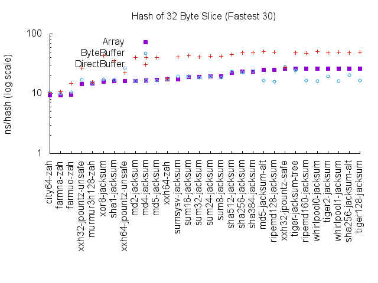

| Algorithm |  Array | ByteBuffer | DirectBuffer |
| --- | ---: | ---: | ---: | 
| [city64-zah](#city64-zah-latency) | 9.371179 | 10.234099 | 10.632210 |
| [farmna-zah](#farmna-zah-latency) | 9.472315 | 10.056119 | 10.854971 |
| [farmuo-zah](#farmuo-zah-latency) | 9.771083 | 10.537306 | 15.040825 |
| [xxh32-jpountz-unsafe](#xxh32-jpountz-unsafe-latency) | 14.513508 | 17.110996 | 26.892453 |
| [murmur3h128-zah](#murmur3h128-zah-latency) | 14.738911 | 15.060878 | 15.636062 |
| [xor8-jacksum](#xor8-jacksum-latency) | 15.863849 | 17.432694 | 43.135984 |
| [sha1-jacksum](#sha1-jacksum-latency) | 16.182980 | 16.868222 | 35.251783 |
| [xxh64-jpountz-unsafe](#xxh64-jpountz-unsafe-latency) | 16.185075 | 26.851060 | 22.351076 |
| [md2-jacksum](#md2-jacksum-latency) | 16.353508 | 16.214258 | 40.289137 |
| [md4-jacksum](#md4-jacksum-latency) | 16.726684 | 16.766292 | 39.985277 |
| [md5-jacksum](#md5-jacksum-latency) | 17.232558 | 16.730379 | 40.482001 |
| [xxh64-zah](#xxh64-zah-latency) | 17.243445 | 17.621031 | 17.697338 |
| [sumsysv-jacksum](#sumsysv-jacksum-latency) | 17.264615 | 19.440393 | 41.196096 |
| [sum16-jacksum](#sum16-jacksum-latency) | 19.046816 | 19.703949 | 42.962086 |
| [sum32-jacksum](#sum32-jacksum-latency) | 19.099153 | 18.759441 | 40.877827 |
| [sum24-jacksum](#sum24-jacksum-latency) | 19.384805 | 19.560981 | 42.013252 |
| [sum8-jacksum](#sum8-jacksum-latency) | 19.415197 | 18.525588 | 42.438977 |
| [sha512-jacksum](#sha512-jacksum-latency) | 22.344955 | 23.270439 | 45.048825 |
| [sha256-jacksum](#sha256-jacksum-latency) | 23.317316 | 23.144894 | 47.942644 |
| [sha384-jacksum](#sha384-jacksum-latency) | 23.473363 | 23.760894 | 47.955513 |
| [md5-jacksum-alt](#md5-jacksum-alt-latency) | 25.072187 | 16.611801 | 50.702751 |
| [ripemd128-jacksum](#ripemd128-jacksum-latency) | 25.271001 | 15.911424 | 49.135810 |
| [xxh32-jpountz-safe](#xxh32-jpountz-safe-latency) | 26.121419 | 28.370377 | 27.194754 |
| [tiger-jacksum-tree](#tiger-jacksum-tree-latency) | 26.404538 | 24.544187 | 48.096382 |
| [ripemd160-jacksum](#ripemd160-jacksum-latency) | 26.422561 | 16.572974 | 47.483922 |
| [whirlpool0-jacksum](#whirlpool0-jacksum-latency) | 26.450107 | 16.439875 | 51.060297 |
| [tiger2-jacksum](#tiger2-jacksum-latency) | 26.452172 | 19.718379 | 48.222673 |
| [whirlpool1-jacksum](#whirlpool1-jacksum-latency) | 26.456510 | 16.303539 | 49.985844 |
| [sha256-jacksum-alt](#sha256-jacksum-alt-latency) | 26.511528 | 20.654966 | 47.980174 |
| [tiger128-jacksum](#tiger128-jacksum-latency) | 26.517212 | 16.714373 | 49.090501 |
| [tiger160-jacksum](#tiger160-jacksum-latency) | 26.539995 | 16.671177 | 48.617407 |
| [sha224-jacksum](#sha224-jacksum-latency) | 26.770137 | 16.751738 | 49.463225 |
| [sha0-jacksum](#sha0-jacksum-latency) | 26.885603 | 16.562425 | 46.665839 |
| [haval256h5-jacksum](#haval256h5-jacksum-latency) | 26.936514 | 18.266894 | 49.937987 |
| [haval160h5-jacksum](#haval160h5-jacksum-latency) | 26.969525 | 17.319205 | 47.559905 |
| [tiger-jacksum](#tiger-jacksum-latency) | 26.972008 | 17.642335 | 48.598221 |
| [sha1-jacksum-alt](#sha1-jacksum-alt-latency) | 27.072699 | 16.322722 | 45.940299 |
| [sha512-jacksum-alt](#sha512-jacksum-alt-latency) | 27.112835 | 16.575769 | 53.347152 |
| [sha384-jacksum-alt](#sha384-jacksum-alt-latency) | 27.155319 | 16.252988 | 50.760304 |
| [whirlpool2-jacksum](#whirlpool2-jacksum-latency) | 27.231707 | 19.014094 | 52.706949 |
| [haval224h5-jacksum](#haval224h5-jacksum-latency) | 27.295025 | 17.032103 | 49.030628 |
| [haval128h4-jacksum](#haval128h4-jacksum-latency) | 27.312002 | 19.649075 | 50.483868 |
| [has160-jacksum](#has160-jacksum-latency) | 27.369301 | 16.230991 | 49.013781 |
| [haval224h4-jacksum](#haval224h4-jacksum-latency) | 27.391203 | 17.301698 | 52.446262 |
| [haval128h3-jacksum](#haval128h3-jacksum-latency) | 27.398438 | 18.174107 | 50.597162 |
| [haval160h3-jacksum](#haval160h3-jacksum-latency) | 27.445889 | 17.326930 | 49.457588 |
| [haval224h3-jacksum](#haval224h3-jacksum-latency) | 27.691187 | 18.010980 | 47.458095 |
| [haval128h5-jacksum](#haval128h5-jacksum-latency) | 27.722538 | 17.559816 | 51.542383 |
| [haval160h4-jacksum](#haval160h4-jacksum-latency) | 27.809624 | 17.097564 | 47.818904 |
| [haval256h4-jacksum](#haval256h4-jacksum-latency) | 27.811896 | 19.563116 | 48.237946 |
| [haval192h5-jacksum](#haval192h5-jacksum-latency) | 27.824421 | 18.167217 | 51.855771 |
| [tiger2-jacksum-tree](#tiger2-jacksum-tree-latency) | 28.010209 | 27.054205 | 45.968022 |
| [haval256h3-jacksum](#haval256h3-jacksum-latency) | 28.119387 | 17.578468 | 49.188563 |
| [haval192h3-jacksum](#haval192h3-jacksum-latency) | 28.151207 | 17.594317 | 49.877958 |
| [haval192h4-jacksum](#haval192h4-jacksum-latency) | 28.575396 | 17.306791 | 48.564897 |
| [xxh64-jpountz-safe](#xxh64-jpountz-safe-latency) | 28.592931 | 37.955735 | 21.856295 |
| [ed2k-jacksum](#ed2k-jacksum-latency) | 31.244373 | 33.453851 | 54.266666 |
| [sumbsd-jacksum](#sumbsd-jacksum-latency) | 40.749409 | 41.739838 | 65.223945 |
| [xxh64-jpountz-jni](#xxh64-jpountz-jni-latency) | 44.830751 | 45.678168 | 36.185883 |
| [xxh32-jpountz-jni](#xxh32-jpountz-jni-latency) | 45.331361 | 44.359186 | 33.846985 |
| [crc8-jacksum](#crc8-jacksum-latency) | 46.511255 | 50.288317 | 84.570009 |
| [sip-inline](#sip-inline-latency) | 52.077752 | 75.768631 | 76.893076 |
| [crc32-jre](#crc32-jre-latency) | 52.470273 | 54.019944 | 53.100205 |
| [ripemd320-jacksum](#ripemd320-jacksum-latency) | 52.618920 | 52.244864 | 71.058638 |
| [adler32-jre](#adler32-jre-latency) | 52.745462 | 54.070963 | 31.751907 |
| [crc32-jacksum-delegating](#crc32-jacksum-delegating-latency) | 54.268202 | 54.989588 | 57.128745 |
| [elf-jacksum](#elf-jacksum-latency) | 54.633176 | 56.061971 | 81.824008 |
| [ripemd256-jacksum](#ripemd256-jacksum-latency) | 56.004434 | 52.627018 | 76.931849 |
| [adler32-jacksum-delegating](#adler32-jacksum-delegating-latency) | 59.824989 | 56.014738 | 80.450291 |
| [adler32-guava](#adler32-guava-latency) | 65.271027 | 72.768945 | 87.154499 |
| [gfh32-guava](#gfh32-guava-latency) | 65.787489 | 84.007148 | 101.911792 |
| [murmur3h32-guava](#murmur3h32-guava-latency) | 68.059087 | 76.686605 | 95.884751 |
| [crc16-jacksum](#crc16-jacksum-latency) | 72.828880 | 71.802730 | 95.284131 |
| [crc32-jacksum-fcs32](#crc32-jacksum-fcs32-latency) | 75.384300 | 75.097666 | 99.196735 |
| [murmur3h128-guava](#murmur3h128-guava-latency) | 75.994691 | 141.809475 | 155.106739 |
| [gfh64-guava](#gfh64-guava-latency) | 76.023507 | 136.618197 | 164.480531 |
| [crc64-jacksum](#crc64-jacksum-latency) | 77.056154 | 77.162800 | 106.517923 |
| [crc32-guava-delegating](#crc32-guava-delegating-latency) | 78.293775 | 78.870315 | 70.379956 |
| [fcs16-jacksum](#fcs16-jacksum-latency) | 82.164877 | 80.887029 | 109.613207 |
| [cksum-jacksum](#cksum-jacksum-latency) | 82.749820 | 84.142845 | 109.351422 |
| [crc32-guava-rfc3720](#crc32-guava-rfc3720-latency) | 83.558320 | 91.355592 | 97.569100 |
| [crc32-jacksum-mpeg2](#crc32-jacksum-mpeg2-latency) | 84.403153 | 80.698946 | 106.412030 |
| [crc32-jacksum-bzip2](#crc32-jacksum-bzip2-latency) | 87.927239 | 111.044385 | 111.471136 |
| [crc24-jacksum](#crc24-jacksum-latency) | 87.976735 | 107.931053 | 113.492200 |
| [sip-fwdeng](#sip-fwdeng-latency) | 114.728517 | 128.844616 | 132.614877 |
| [adler32-jacksum-alt](#adler32-jacksum-alt-latency) | 124.236798 | 124.835395 | 153.169458 |
| [sip-guava](#sip-guava-latency) | 127.901378 | 127.761490 | 140.568389 |
| [md4-bc](#md4-bc-latency) | 179.949226 | 181.979485 | 204.483982 |
| [md5-bc](#md5-bc-latency) | 228.820808 | 225.242643 | 246.889243 |
| [tiger-bc](#tiger-bc-latency) | 240.163514 | 247.612121 | 275.684132 |
| [ripemd128-bc](#ripemd128-bc-latency) | 248.989949 | 253.618201 | 287.808879 |
| [md5-guava](#md5-guava-latency) | 257.678738 | 253.901836 | 271.285642 |
| [ripemd256-bc](#ripemd256-bc-latency) | 279.678713 | 277.533346 | 304.388261 |
| [sha1-bc](#sha1-bc-latency) | 328.655545 | 326.144092 | 356.754173 |
| [skein256-bc](#skein256-bc-latency) | 331.241042 | 330.132634 | 344.313706 |
| [sha1-guava](#sha1-guava-latency) | 360.893654 | 355.379882 | 414.988452 |
| [sm3-bc](#sm3-bc-latency) | 425.018453 | 407.229386 | 438.960034 |
| [sha224-bc](#sha224-bc-latency) | 440.338253 | 437.944799 | 465.823079 |
| [sha256-bc](#sha256-bc-latency) | 442.272461 | 445.909846 | 477.776745 |
| [sha256-guava](#sha256-guava-latency) | 451.755319 | 469.386547 | 498.064362 |
| [skein512-bc](#skein512-bc-latency) | 527.434598 | 528.291191 | 571.003922 |
| [sha512-bc-t](#sha512-bc-t-latency) | 558.124847 | 590.605361 | 592.509380 |
| [sha512-bc](#sha512-bc-latency) | 572.528707 | 579.508070 | 625.447447 |
| [sha384-bc](#sha384-bc-latency) | 575.866382 | 574.705178 | 592.623019 |
| [sha512-guava](#sha512-guava-latency) | 781.438840 | 790.819223 | 822.731767 |
| [sha384-guava](#sha384-guava-latency) | 822.212571 | 782.182974 | 859.145226 |
| [skein1024-bc](#skein1024-bc-latency) | 1058.753688 | 1076.207092 | 1139.946381 |
| [ripemd160-bc](#ripemd160-bc-latency) | 1093.196939 | 1095.510432 | 1120.904134 |
| [ripemd320-bc](#ripemd320-bc-latency) | 1113.478088 | 1113.957163 | 1160.326577 |
| [gost-jacksum](#gost-jacksum-latency) | 3578.986483 | 3866.976854 | 3681.000480 |
| [sha3-bc](#sha3-bc-latency) | 5385.500863 | 5580.671714 | 5335.028124 |
| [whirlpool2-bc](#whirlpool2-bc-latency) | 6174.274958 | 6089.172409 | 6433.394938 |
| [md2-bc](#md2-bc-latency) | 8244.939818 | 8110.740250 | 8190.390400 |
| [gost-bc](#gost-bc-latency) | 12417.277712 | 11784.088193 | 11471.223840 |

---
### 32 Byte Slice Latency (adler32)
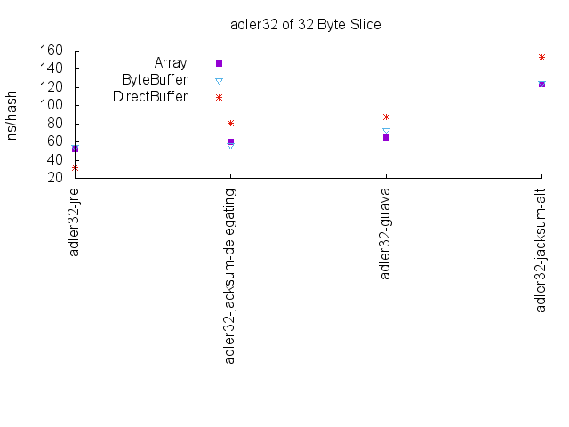

| Algorithm |  Array | ByteBuffer | DirectBuffer |
| --- | ---: | ---: | ---: | 
| [adler32-jre](#adler32-jre-latency) | 52.745462 | 54.070963 | 31.751907 |
| [adler32-jacksum-delegating](#adler32-jacksum-delegating-latency) | 59.824989 | 56.014738 | 80.450291 |
| [adler32-guava](#adler32-guava-latency) | 65.271027 | 72.768945 | 87.154499 |
| [adler32-jacksum-alt](#adler32-jacksum-alt-latency) | 124.236798 | 124.835395 | 153.169458 |

---
### 32 Byte Slice Latency (city64)
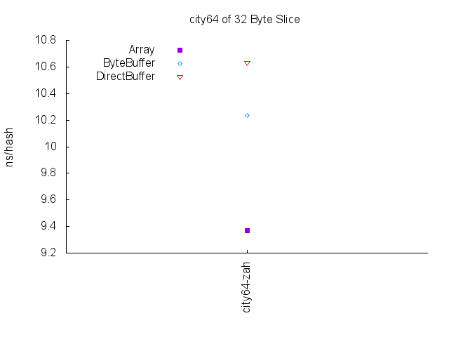

| Algorithm |  Array | ByteBuffer | DirectBuffer |
| --- | ---: | ---: | ---: | 
| [city64-zah](#city64-zah-latency) | 9.371179 | 10.234099 | 10.632210 |

---
### 32 Byte Slice Latency (cksum)
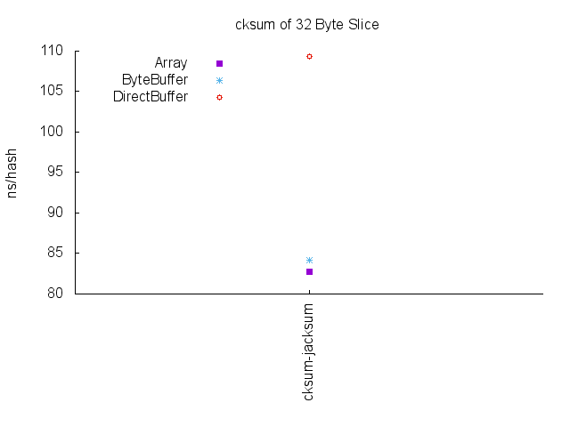

| Algorithm |  Array | ByteBuffer | DirectBuffer |
| --- | ---: | ---: | ---: | 
| [cksum-jacksum](#cksum-jacksum-latency) | 82.749820 | 84.142845 | 109.351422 |

---
### 32 Byte Slice Latency (crc16)
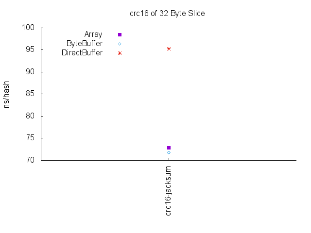

| Algorithm |  Array | ByteBuffer | DirectBuffer |
| --- | ---: | ---: | ---: | 
| [crc16-jacksum](#crc16-jacksum-latency) | 72.828880 | 71.802730 | 95.284131 |

---
### 32 Byte Slice Latency (crc24)
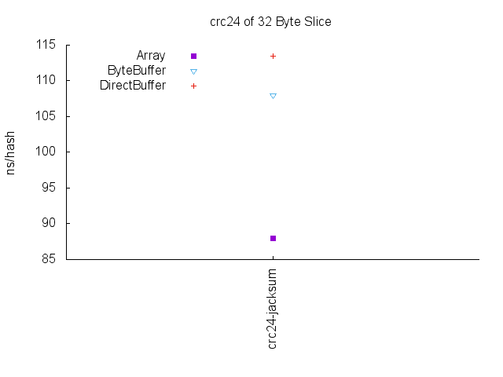

| Algorithm |  Array | ByteBuffer | DirectBuffer |
| --- | ---: | ---: | ---: | 
| [crc24-jacksum](#crc24-jacksum-latency) | 87.976735 | 107.931053 | 113.492200 |

---
### 32 Byte Slice Latency (crc32)
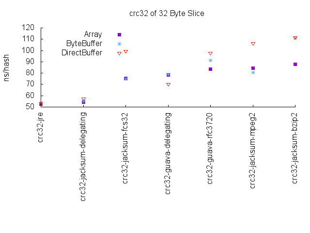

| Algorithm |  Array | ByteBuffer | DirectBuffer |
| --- | ---: | ---: | ---: | 
| [crc32-jre](#crc32-jre-latency) | 52.470273 | 54.019944 | 53.100205 |
| [crc32-jacksum-delegating](#crc32-jacksum-delegating-latency) | 54.268202 | 54.989588 | 57.128745 |
| [crc32-jacksum-fcs32](#crc32-jacksum-fcs32-latency) | 75.384300 | 75.097666 | 99.196735 |
| [crc32-guava-delegating](#crc32-guava-delegating-latency) | 78.293775 | 78.870315 | 70.379956 |
| [crc32-guava-rfc3720](#crc32-guava-rfc3720-latency) | 83.558320 | 91.355592 | 97.569100 |
| [crc32-jacksum-mpeg2](#crc32-jacksum-mpeg2-latency) | 84.403153 | 80.698946 | 106.412030 |
| [crc32-jacksum-bzip2](#crc32-jacksum-bzip2-latency) | 87.927239 | 111.044385 | 111.471136 |

---
### 32 Byte Slice Latency (crc64)
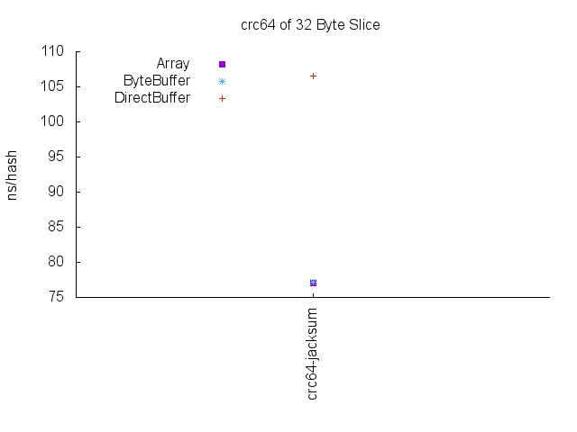

| Algorithm |  Array | ByteBuffer | DirectBuffer |
| --- | ---: | ---: | ---: | 
| [crc64-jacksum](#crc64-jacksum-latency) | 77.056154 | 77.162800 | 106.517923 |

---
### 32 Byte Slice Latency (crc8)
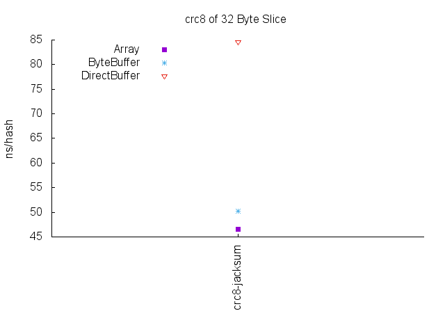

| Algorithm |  Array | ByteBuffer | DirectBuffer |
| --- | ---: | ---: | ---: | 
| [crc8-jacksum](#crc8-jacksum-latency) | 46.511255 | 50.288317 | 84.570009 |

---
### 32 Byte Slice Latency (ed2k)
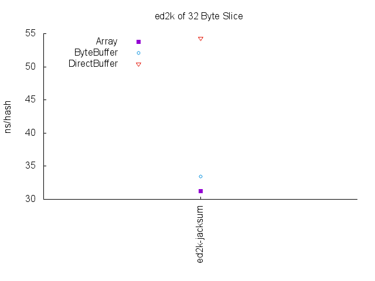

| Algorithm |  Array | ByteBuffer | DirectBuffer |
| --- | ---: | ---: | ---: | 
| [ed2k-jacksum](#ed2k-jacksum-latency) | 31.244373 | 33.453851 | 54.266666 |

---
### 32 Byte Slice Latency (elf)
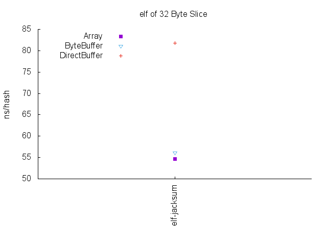

| Algorithm |  Array | ByteBuffer | DirectBuffer |
| --- | ---: | ---: | ---: | 
| [elf-jacksum](#elf-jacksum-latency) | 54.633176 | 56.061971 | 81.824008 |

---
### 32 Byte Slice Latency (farmna)

| Algorithm |  Array | ByteBuffer | DirectBuffer |
| --- | ---: | ---: | ---: | 
| [farmna-zah](#farmna-zah-latency) | 9.472315 | 10.056119 | 10.854971 |

---
### 32 Byte Slice Latency (farmuo)
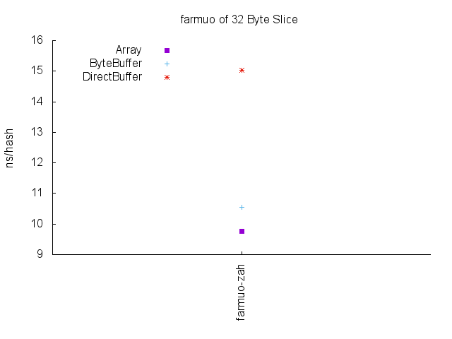

| Algorithm |  Array | ByteBuffer | DirectBuffer |
| --- | ---: | ---: | ---: | 
| [farmuo-zah](#farmuo-zah-latency) | 9.771083 | 10.537306 | 15.040825 |

---
### 32 Byte Slice Latency (fcs16)
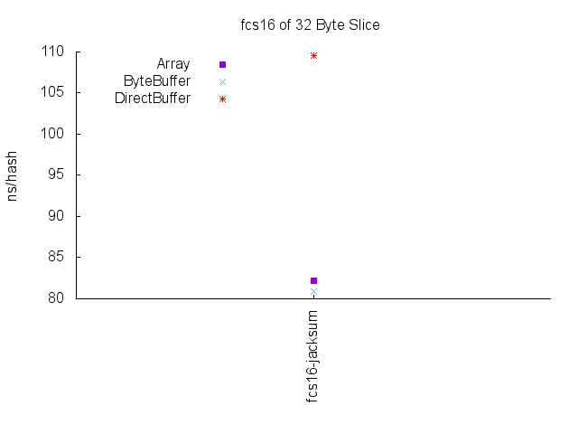

| Algorithm |  Array | ByteBuffer | DirectBuffer |
| --- | ---: | ---: | ---: | 
| [fcs16-jacksum](#fcs16-jacksum-latency) | 82.164877 | 80.887029 | 109.613207 |

---
### 32 Byte Slice Latency (gfh32)
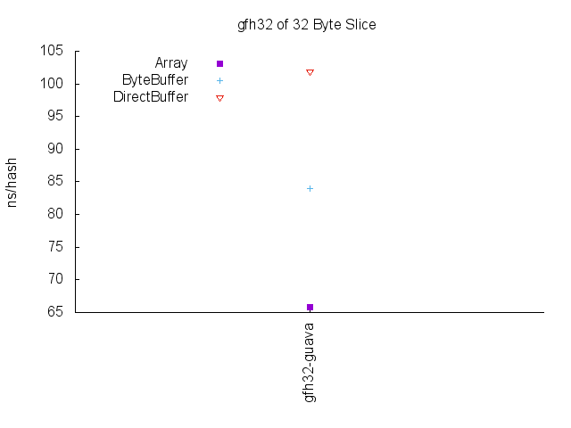

| Algorithm |  Array | ByteBuffer | DirectBuffer |
| --- | ---: | ---: | ---: | 
| [gfh32-guava](#gfh32-guava-latency) | 65.787489 | 84.007148 | 101.911792 |

---
### 32 Byte Slice Latency (gfh64)
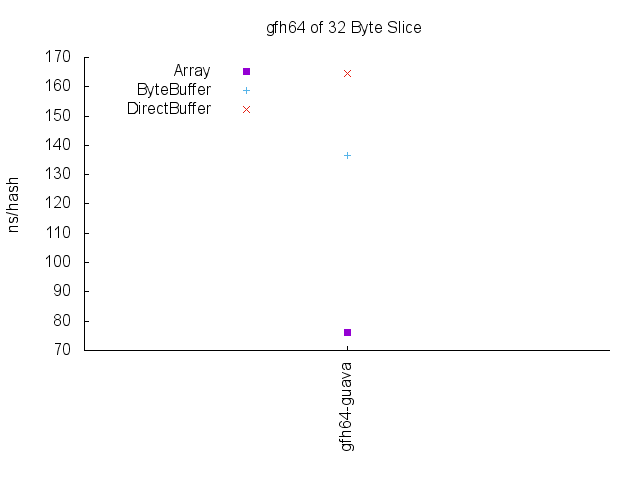

| Algorithm |  Array | ByteBuffer | DirectBuffer |
| --- | ---: | ---: | ---: | 
| [gfh64-guava](#gfh64-guava-latency) | 76.023507 | 136.618197 | 164.480531 |

---
### 32 Byte Slice Latency (gost)
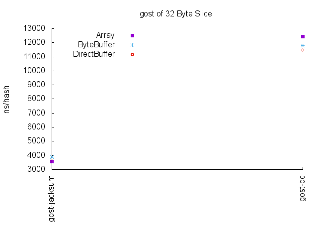

| Algorithm |  Array | ByteBuffer | DirectBuffer |
| --- | ---: | ---: | ---: | 
| [gost-jacksum](#gost-jacksum-latency) | 3578.986483 | 3866.976854 | 3681.000480 |
| [gost-bc](#gost-bc-latency) | 12417.277712 | 11784.088193 | 11471.223840 |

---
### 32 Byte Slice Latency (has160)
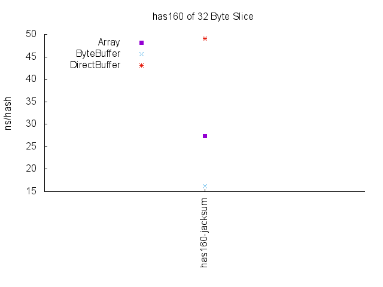

| Algorithm |  Array | ByteBuffer | DirectBuffer |
| --- | ---: | ---: | ---: | 
| [has160-jacksum](#has160-jacksum-latency) | 27.369301 | 16.230991 | 49.013781 |

---
### 32 Byte Slice Latency (haval128h3)
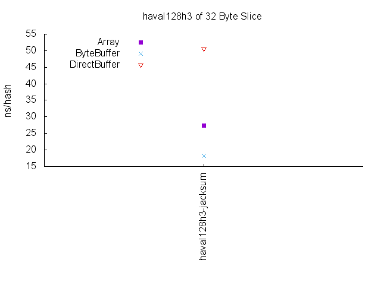

| Algorithm |  Array | ByteBuffer | DirectBuffer |
| --- | ---: | ---: | ---: | 
| [haval128h3-jacksum](#haval128h3-jacksum-latency) | 27.398438 | 18.174107 | 50.597162 |

---
### 32 Byte Slice Latency (haval128h4)

| Algorithm |  Array | ByteBuffer | DirectBuffer |
| --- | ---: | ---: | ---: | 
| [haval128h4-jacksum](#haval128h4-jacksum-latency) | 27.312002 | 19.649075 | 50.483868 |

---
### 32 Byte Slice Latency (haval128h5)
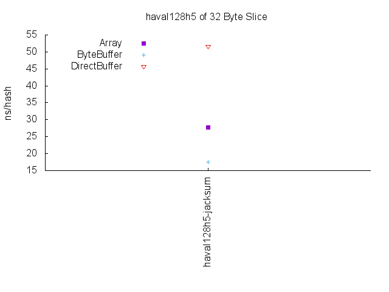

| Algorithm |  Array | ByteBuffer | DirectBuffer |
| --- | ---: | ---: | ---: | 
| [haval128h5-jacksum](#haval128h5-jacksum-latency) | 27.722538 | 17.559816 | 51.542383 |

---
### 32 Byte Slice Latency (haval160h3)
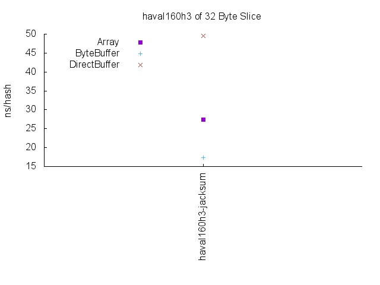

| Algorithm |  Array | ByteBuffer | DirectBuffer |
| --- | ---: | ---: | ---: | 
| [haval160h3-jacksum](#haval160h3-jacksum-latency) | 27.445889 | 17.326930 | 49.457588 |

---
### 32 Byte Slice Latency (haval160h4)
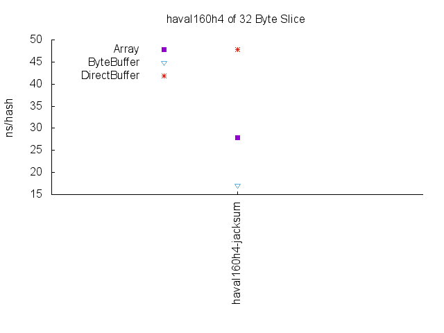

| Algorithm |  Array | ByteBuffer | DirectBuffer |
| --- | ---: | ---: | ---: | 
| [haval160h4-jacksum](#haval160h4-jacksum-latency) | 27.809624 | 17.097564 | 47.818904 |

---
### 32 Byte Slice Latency (haval160h5)

| Algorithm |  Array | ByteBuffer | DirectBuffer |
| --- | ---: | ---: | ---: | 
| [haval160h5-jacksum](#haval160h5-jacksum-latency) | 26.969525 | 17.319205 | 47.559905 |

---
### 32 Byte Slice Latency (haval192h3)

| Algorithm |  Array | ByteBuffer | DirectBuffer |
| --- | ---: | ---: | ---: | 
| [haval192h3-jacksum](#haval192h3-jacksum-latency) | 28.151207 | 17.594317 | 49.877958 |

---
### 32 Byte Slice Latency (haval192h4)
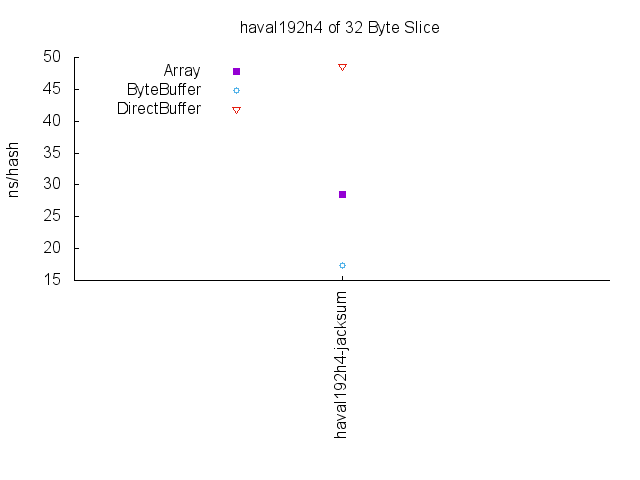

| Algorithm |  Array | ByteBuffer | DirectBuffer |
| --- | ---: | ---: | ---: | 
| [haval192h4-jacksum](#haval192h4-jacksum-latency) | 28.575396 | 17.306791 | 48.564897 |

---
### 32 Byte Slice Latency (haval192h5)

| Algorithm |  Array | ByteBuffer | DirectBuffer |
| --- | ---: | ---: | ---: | 
| [haval192h5-jacksum](#haval192h5-jacksum-latency) | 27.824421 | 18.167217 | 51.855771 |

---
### 32 Byte Slice Latency (haval224h3)

| Algorithm |  Array | ByteBuffer | DirectBuffer |
| --- | ---: | ---: | ---: | 
| [haval224h3-jacksum](#haval224h3-jacksum-latency) | 27.691187 | 18.010980 | 47.458095 |

---
### 32 Byte Slice Latency (haval224h4)

| Algorithm |  Array | ByteBuffer | DirectBuffer |
| --- | ---: | ---: | ---: | 
| [haval224h4-jacksum](#haval224h4-jacksum-latency) | 27.391203 | 17.301698 | 52.446262 |

---
### 32 Byte Slice Latency (haval224h5)
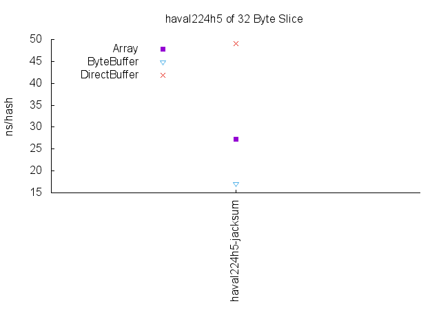

| Algorithm |  Array | ByteBuffer | DirectBuffer |
| --- | ---: | ---: | ---: | 
| [haval224h5-jacksum](#haval224h5-jacksum-latency) | 27.295025 | 17.032103 | 49.030628 |

---
### 32 Byte Slice Latency (haval256h3)

| Algorithm |  Array | ByteBuffer | DirectBuffer |
| --- | ---: | ---: | ---: | 
| [haval256h3-jacksum](#haval256h3-jacksum-latency) | 28.119387 | 17.578468 | 49.188563 |

---
### 32 Byte Slice Latency (haval256h4)

| Algorithm |  Array | ByteBuffer | DirectBuffer |
| --- | ---: | ---: | ---: | 
| [haval256h4-jacksum](#haval256h4-jacksum-latency) | 27.811896 | 19.563116 | 48.237946 |

---
### 32 Byte Slice Latency (haval256h5)

| Algorithm |  Array | ByteBuffer | DirectBuffer |
| --- | ---: | ---: | ---: | 
| [haval256h5-jacksum](#haval256h5-jacksum-latency) | 26.936514 | 18.266894 | 49.937987 |

---
### 32 Byte Slice Latency (md2)
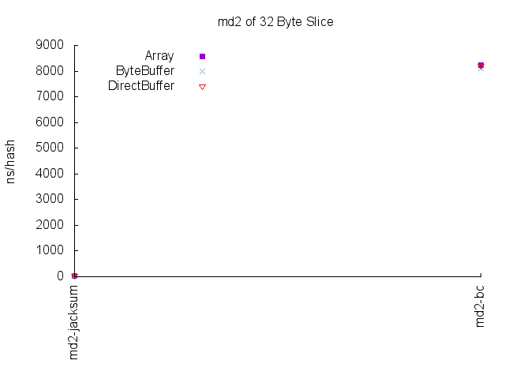

| Algorithm |  Array | ByteBuffer | DirectBuffer |
| --- | ---: | ---: | ---: | 
| [md2-jacksum](#md2-jacksum-latency) | 16.353508 | 16.214258 | 40.289137 |
| [md2-bc](#md2-bc-latency) | 8244.939818 | 8110.740250 | 8190.390400 |

---
### 32 Byte Slice Latency (md4)
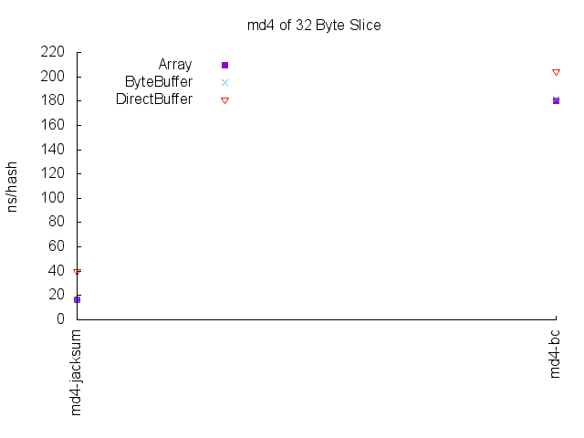

| Algorithm |  Array | ByteBuffer | DirectBuffer |
| --- | ---: | ---: | ---: | 
| [md4-jacksum](#md4-jacksum-latency) | 16.726684 | 16.766292 | 39.985277 |
| [md4-bc](#md4-bc-latency) | 179.949226 | 181.979485 | 204.483982 |

---
### 32 Byte Slice Latency (md5)
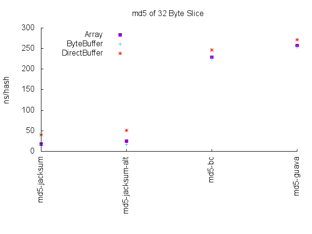

| Algorithm |  Array | ByteBuffer | DirectBuffer |
| --- | ---: | ---: | ---: | 
| [md5-jacksum](#md5-jacksum-latency) | 17.232558 | 16.730379 | 40.482001 |
| [md5-jacksum-alt](#md5-jacksum-alt-latency) | 25.072187 | 16.611801 | 50.702751 |
| [md5-bc](#md5-bc-latency) | 228.820808 | 225.242643 | 246.889243 |
| [md5-guava](#md5-guava-latency) | 257.678738 | 253.901836 | 271.285642 |

---
### 32 Byte Slice Latency (murmur3h128)
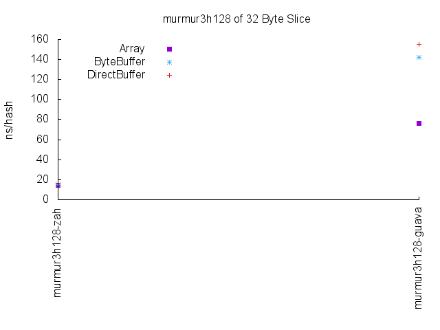

| Algorithm |  Array | ByteBuffer | DirectBuffer |
| --- | ---: | ---: | ---: | 
| [murmur3h128-zah](#murmur3h128-zah-latency) | 14.738911 | 15.060878 | 15.636062 |
| [murmur3h128-guava](#murmur3h128-guava-latency) | 75.994691 | 141.809475 | 155.106739 |

---
### 32 Byte Slice Latency (murmur3h32)
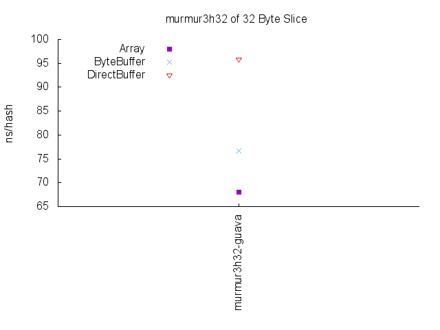

| Algorithm |  Array | ByteBuffer | DirectBuffer |
| --- | ---: | ---: | ---: | 
| [murmur3h32-guava](#murmur3h32-guava-latency) | 68.059087 | 76.686605 | 95.884751 |

---
### 32 Byte Slice Latency (ripemd128)
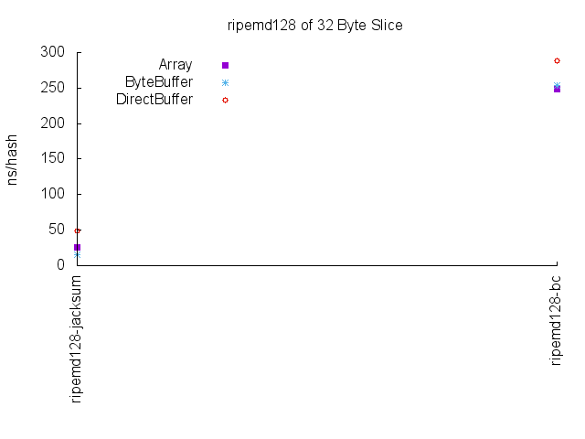

| Algorithm |  Array | ByteBuffer | DirectBuffer |
| --- | ---: | ---: | ---: | 
| [ripemd128-jacksum](#ripemd128-jacksum-latency) | 25.271001 | 15.911424 | 49.135810 |
| [ripemd128-bc](#ripemd128-bc-latency) | 248.989949 | 253.618201 | 287.808879 |

---
### 32 Byte Slice Latency (ripemd160)
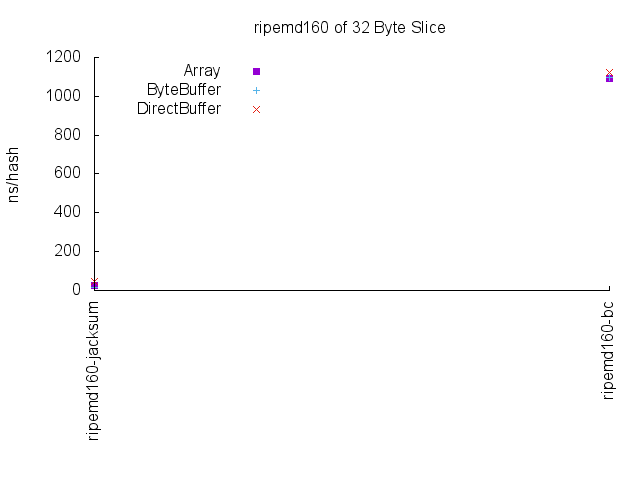

| Algorithm |  Array | ByteBuffer | DirectBuffer |
| --- | ---: | ---: | ---: | 
| [ripemd160-jacksum](#ripemd160-jacksum-latency) | 26.422561 | 16.572974 | 47.483922 |
| [ripemd160-bc](#ripemd160-bc-latency) | 1093.196939 | 1095.510432 | 1120.904134 |

---
### 32 Byte Slice Latency (ripemd256)
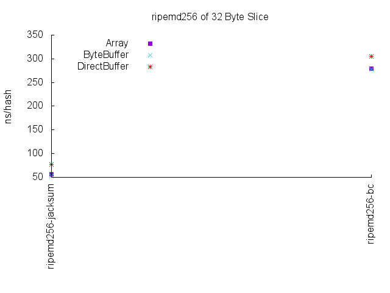

| Algorithm |  Array | ByteBuffer | DirectBuffer |
| --- | ---: | ---: | ---: | 
| [ripemd256-jacksum](#ripemd256-jacksum-latency) | 56.004434 | 52.627018 | 76.931849 |
| [ripemd256-bc](#ripemd256-bc-latency) | 279.678713 | 277.533346 | 304.388261 |

---
### 32 Byte Slice Latency (ripemd320)
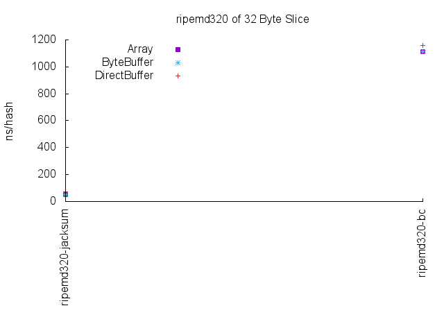

| Algorithm |  Array | ByteBuffer | DirectBuffer |
| --- | ---: | ---: | ---: | 
| [ripemd320-jacksum](#ripemd320-jacksum-latency) | 52.618920 | 52.244864 | 71.058638 |
| [ripemd320-bc](#ripemd320-bc-latency) | 1113.478088 | 1113.957163 | 1160.326577 |

---
### 32 Byte Slice Latency (sha0)
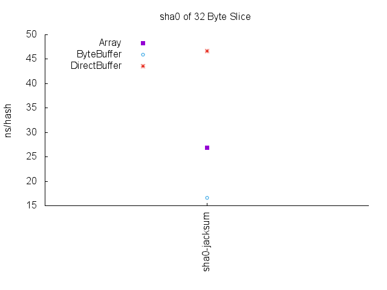

| Algorithm |  Array | ByteBuffer | DirectBuffer |
| --- | ---: | ---: | ---: | 
| [sha0-jacksum](#sha0-jacksum-latency) | 26.885603 | 16.562425 | 46.665839 |

---
### 32 Byte Slice Latency (sha1)
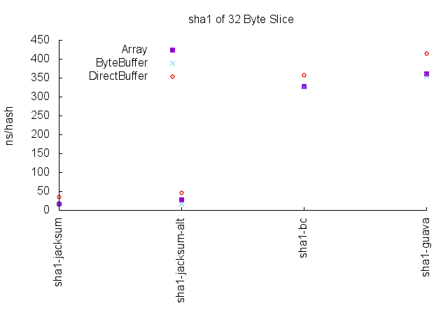

| Algorithm |  Array | ByteBuffer | DirectBuffer |
| --- | ---: | ---: | ---: | 
| [sha1-jacksum](#sha1-jacksum-latency) | 16.182980 | 16.868222 | 35.251783 |
| [sha1-jacksum-alt](#sha1-jacksum-alt-latency) | 27.072699 | 16.322722 | 45.940299 |
| [sha1-bc](#sha1-bc-latency) | 328.655545 | 326.144092 | 356.754173 |
| [sha1-guava](#sha1-guava-latency) | 360.893654 | 355.379882 | 414.988452 |

---
### 32 Byte Slice Latency (sha224)
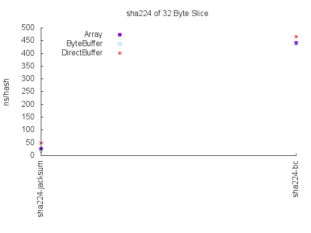

| Algorithm |  Array | ByteBuffer | DirectBuffer |
| --- | ---: | ---: | ---: | 
| [sha224-jacksum](#sha224-jacksum-latency) | 26.770137 | 16.751738 | 49.463225 |
| [sha224-bc](#sha224-bc-latency) | 440.338253 | 437.944799 | 465.823079 |

---
### 32 Byte Slice Latency (sha256)
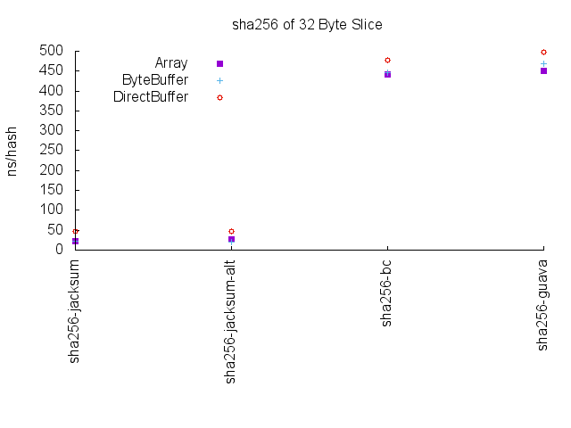

| Algorithm |  Array | ByteBuffer | DirectBuffer |
| --- | ---: | ---: | ---: | 
| [sha256-jacksum](#sha256-jacksum-latency) | 23.317316 | 23.144894 | 47.942644 |
| [sha256-jacksum-alt](#sha256-jacksum-alt-latency) | 26.511528 | 20.654966 | 47.980174 |
| [sha256-bc](#sha256-bc-latency) | 442.272461 | 445.909846 | 477.776745 |
| [sha256-guava](#sha256-guava-latency) | 451.755319 | 469.386547 | 498.064362 |

---
### 32 Byte Slice Latency (sha3)
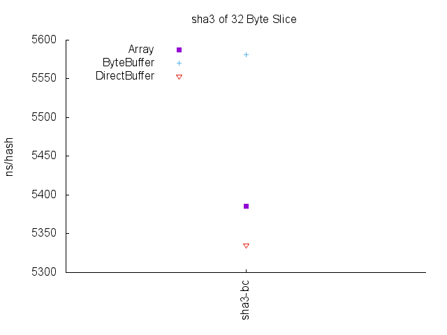

| Algorithm |  Array | ByteBuffer | DirectBuffer |
| --- | ---: | ---: | ---: | 
| [sha3-bc](#sha3-bc-latency) | 5385.500863 | 5580.671714 | 5335.028124 |

---
### 32 Byte Slice Latency (sha384)
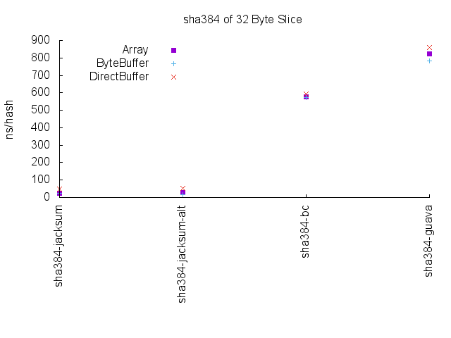

| Algorithm |  Array | ByteBuffer | DirectBuffer |
| --- | ---: | ---: | ---: | 
| [sha384-jacksum](#sha384-jacksum-latency) | 23.473363 | 23.760894 | 47.955513 |
| [sha384-jacksum-alt](#sha384-jacksum-alt-latency) | 27.155319 | 16.252988 | 50.760304 |
| [sha384-bc](#sha384-bc-latency) | 575.866382 | 574.705178 | 592.623019 |
| [sha384-guava](#sha384-guava-latency) | 822.212571 | 782.182974 | 859.145226 |

---
### 32 Byte Slice Latency (sha512)
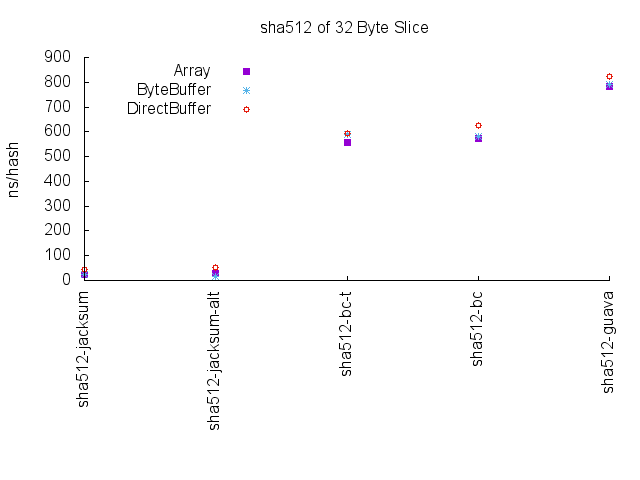

| Algorithm |  Array | ByteBuffer | DirectBuffer |
| --- | ---: | ---: | ---: | 
| [sha512-jacksum](#sha512-jacksum-latency) | 22.344955 | 23.270439 | 45.048825 |
| [sha512-jacksum-alt](#sha512-jacksum-alt-latency) | 27.112835 | 16.575769 | 53.347152 |
| [sha512-bc-t](#sha512-bc-t-latency) | 558.124847 | 590.605361 | 592.509380 |
| [sha512-bc](#sha512-bc-latency) | 572.528707 | 579.508070 | 625.447447 |
| [sha512-guava](#sha512-guava-latency) | 781.438840 | 790.819223 | 822.731767 |

---
### 32 Byte Slice Latency (sip)
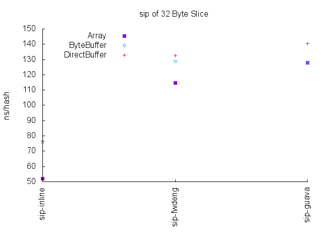

| Algorithm |  Array | ByteBuffer | DirectBuffer |
| --- | ---: | ---: | ---: | 
| [sip-inline](#sip-inline-latency) | 52.077752 | 75.768631 | 76.893076 |
| [sip-fwdeng](#sip-fwdeng-latency) | 114.728517 | 128.844616 | 132.614877 |
| [sip-guava](#sip-guava-latency) | 127.901378 | 127.761490 | 140.568389 |

---
### 32 Byte Slice Latency (skein1024)
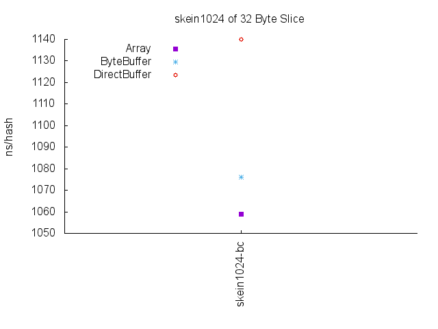

| Algorithm |  Array | ByteBuffer | DirectBuffer |
| --- | ---: | ---: | ---: | 
| [skein1024-bc](#skein1024-bc-latency) | 1058.753688 | 1076.207092 | 1139.946381 |

---
### 32 Byte Slice Latency (skein256)

| Algorithm |  Array | ByteBuffer | DirectBuffer |
| --- | ---: | ---: | ---: | 
| [skein256-bc](#skein256-bc-latency) | 331.241042 | 330.132634 | 344.313706 |

---
### 32 Byte Slice Latency (skein512)

| Algorithm |  Array | ByteBuffer | DirectBuffer |
| --- | ---: | ---: | ---: | 
| [skein512-bc](#skein512-bc-latency) | 527.434598 | 528.291191 | 571.003922 |

---
### 32 Byte Slice Latency (sm3)

| Algorithm |  Array | ByteBuffer | DirectBuffer |
| --- | ---: | ---: | ---: | 
| [sm3-bc](#sm3-bc-latency) | 425.018453 | 407.229386 | 438.960034 |

---
### 32 Byte Slice Latency (sum16)

| Algorithm |  Array | ByteBuffer | DirectBuffer |
| --- | ---: | ---: | ---: | 
| [sum16-jacksum](#sum16-jacksum-latency) | 19.046816 | 19.703949 | 42.962086 |

---
### 32 Byte Slice Latency (sum24)
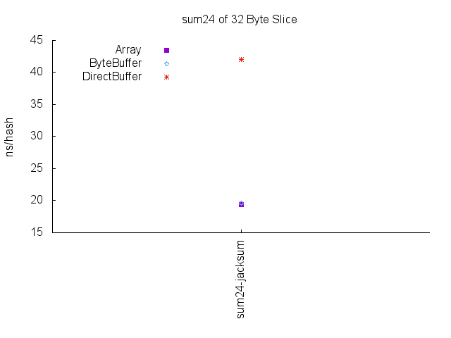

| Algorithm |  Array | ByteBuffer | DirectBuffer |
| --- | ---: | ---: | ---: | 
| [sum24-jacksum](#sum24-jacksum-latency) | 19.384805 | 19.560981 | 42.013252 |

---
### 32 Byte Slice Latency (sum32)
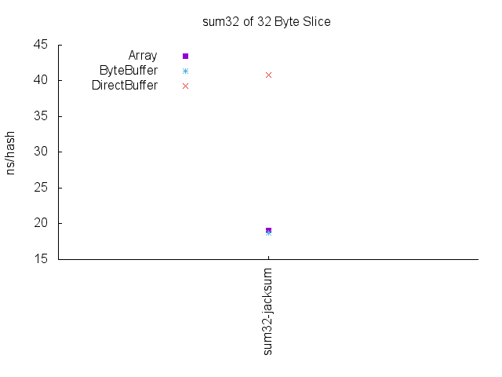

| Algorithm |  Array | ByteBuffer | DirectBuffer |
| --- | ---: | ---: | ---: | 
| [sum32-jacksum](#sum32-jacksum-latency) | 19.099153 | 18.759441 | 40.877827 |

---
### 32 Byte Slice Latency (sum8)
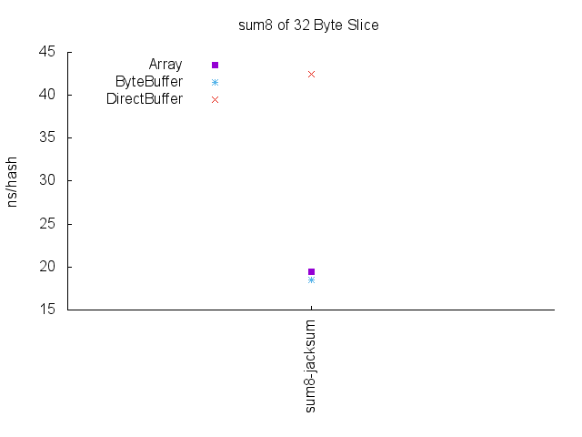

| Algorithm |  Array | ByteBuffer | DirectBuffer |
| --- | ---: | ---: | ---: | 
| [sum8-jacksum](#sum8-jacksum-latency) | 19.415197 | 18.525588 | 42.438977 |

---
### 32 Byte Slice Latency (sumbsd)
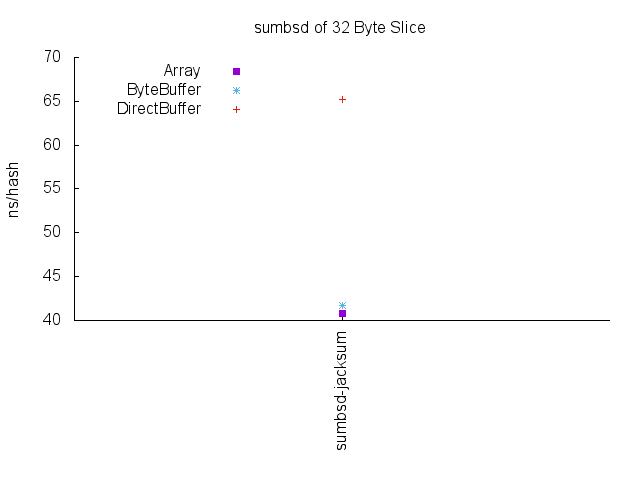

| Algorithm |  Array | ByteBuffer | DirectBuffer |
| --- | ---: | ---: | ---: | 
| [sumbsd-jacksum](#sumbsd-jacksum-latency) | 40.749409 | 41.739838 | 65.223945 |

---
### 32 Byte Slice Latency (sumsysv)
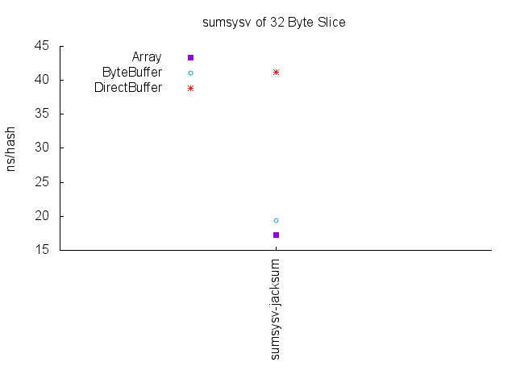

| Algorithm |  Array | ByteBuffer | DirectBuffer |
| --- | ---: | ---: | ---: | 
| [sumsysv-jacksum](#sumsysv-jacksum-latency) | 17.264615 | 19.440393 | 41.196096 |

---
### 32 Byte Slice Latency (tiger)
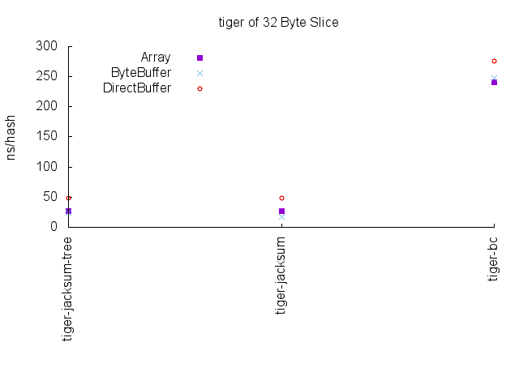

| Algorithm |  Array | ByteBuffer | DirectBuffer |
| --- | ---: | ---: | ---: | 
| [tiger-jacksum-tree](#tiger-jacksum-tree-latency) | 26.404538 | 24.544187 | 48.096382 |
| [tiger-jacksum](#tiger-jacksum-latency) | 26.972008 | 17.642335 | 48.598221 |
| [tiger-bc](#tiger-bc-latency) | 240.163514 | 247.612121 | 275.684132 |

---
### 32 Byte Slice Latency (tiger128)
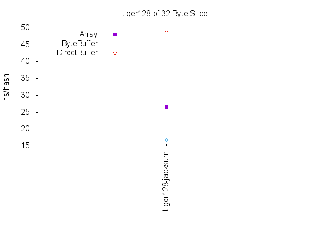

| Algorithm |  Array | ByteBuffer | DirectBuffer |
| --- | ---: | ---: | ---: | 
| [tiger128-jacksum](#tiger128-jacksum-latency) | 26.517212 | 16.714373 | 49.090501 |

---
### 32 Byte Slice Latency (tiger160)
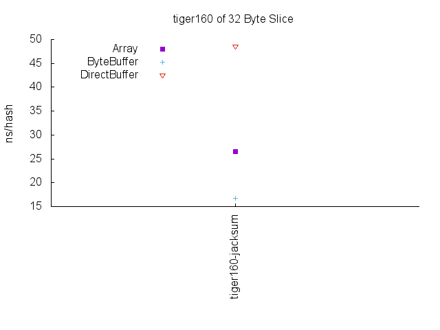

| Algorithm |  Array | ByteBuffer | DirectBuffer |
| --- | ---: | ---: | ---: | 
| [tiger160-jacksum](#tiger160-jacksum-latency) | 26.539995 | 16.671177 | 48.617407 |

---
### 32 Byte Slice Latency (tiger2)
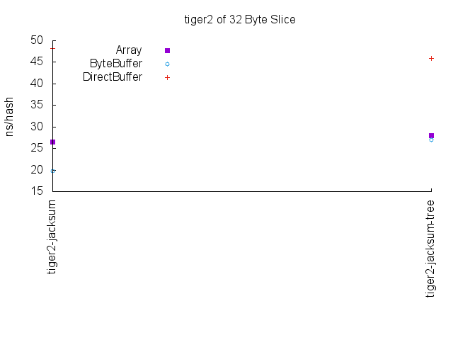

| Algorithm |  Array | ByteBuffer | DirectBuffer |
| --- | ---: | ---: | ---: | 
| [tiger2-jacksum](#tiger2-jacksum-latency) | 26.452172 | 19.718379 | 48.222673 |
| [tiger2-jacksum-tree](#tiger2-jacksum-tree-latency) | 28.010209 | 27.054205 | 45.968022 |

---
### 32 Byte Slice Latency (whirlpool0)

| Algorithm |  Array | ByteBuffer | DirectBuffer |
| --- | ---: | ---: | ---: | 
| [whirlpool0-jacksum](#whirlpool0-jacksum-latency) | 26.450107 | 16.439875 | 51.060297 |

---
### 32 Byte Slice Latency (whirlpool1)

| Algorithm |  Array | ByteBuffer | DirectBuffer |
| --- | ---: | ---: | ---: | 
| [whirlpool1-jacksum](#whirlpool1-jacksum-latency) | 26.456510 | 16.303539 | 49.985844 |

---
### 32 Byte Slice Latency (whirlpool2)
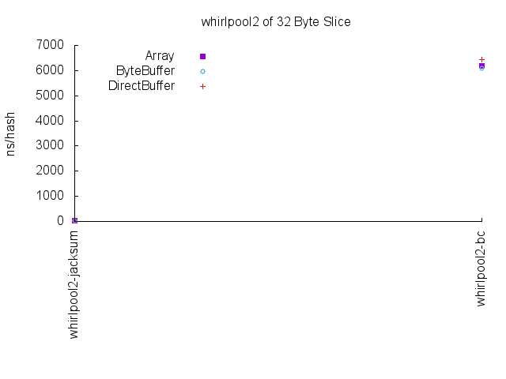

| Algorithm |  Array | ByteBuffer | DirectBuffer |
| --- | ---: | ---: | ---: | 
| [whirlpool2-jacksum](#whirlpool2-jacksum-latency) | 27.231707 | 19.014094 | 52.706949 |
| [whirlpool2-bc](#whirlpool2-bc-latency) | 6174.274958 | 6089.172409 | 6433.394938 |

---
### 32 Byte Slice Latency (xor8)

| Algorithm |  Array | ByteBuffer | DirectBuffer |
| --- | ---: | ---: | ---: | 
| [xor8-jacksum](#xor8-jacksum-latency) | 15.863849 | 17.432694 | 43.135984 |

---
### 32 Byte Slice Latency (xxh32)
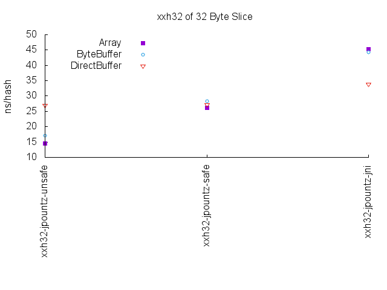

| Algorithm |  Array | ByteBuffer | DirectBuffer |
| --- | ---: | ---: | ---: | 
| [xxh32-jpountz-unsafe](#xxh32-jpountz-unsafe-latency) | 14.513508 | 17.110996 | 26.892453 |
| [xxh32-jpountz-safe](#xxh32-jpountz-safe-latency) | 26.121419 | 28.370377 | 27.194754 |
| [xxh32-jpountz-jni](#xxh32-jpountz-jni-latency) | 45.331361 | 44.359186 | 33.846985 |

---
### 32 Byte Slice Latency (xxh64)
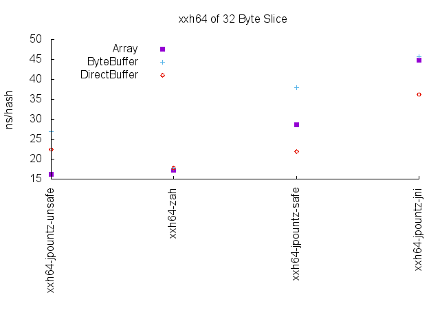

| Algorithm |  Array | ByteBuffer | DirectBuffer |
| --- | ---: | ---: | ---: | 
| [xxh64-jpountz-unsafe](#xxh64-jpountz-unsafe-latency) | 16.185075 | 26.851060 | 22.351076 |
| [xxh64-zah](#xxh64-zah-latency) | 17.243445 | 17.621031 | 17.697338 |
| [xxh64-jpountz-safe](#xxh64-jpountz-safe-latency) | 28.592931 | 37.955735 | 21.856295 |
| [xxh64-jpountz-jni](#xxh64-jpountz-jni-latency) | 44.830751 | 45.678168 | 36.185883 |

---
### 128 Byte Slice Latency (All Hashes)
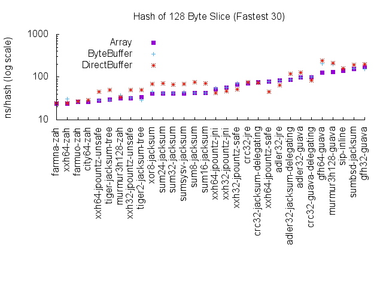

| Algorithm |  Array | ByteBuffer | DirectBuffer |
| --- | ---: | ---: | ---: | 
| [farmna-zah](#farmna-zah-latency) | 23.766087 | 24.451787 | 24.275295 |
| [xxh64-zah](#xxh64-zah-latency) | 23.774723 | 30.902095 | 24.738725 |
| [farmuo-zah](#farmuo-zah-latency) | 26.342973 | 26.665337 | 27.393298 |
| [city64-zah](#city64-zah-latency) | 26.619406 | 27.955296 | 28.934982 |
| [xxh64-jpountz-unsafe](#xxh64-jpountz-unsafe-latency) | 27.708782 | 29.209727 | 45.589571 |
| [tiger-jacksum-tree](#tiger-jacksum-tree-latency) | 29.479784 | 28.548432 | 50.516798 |
| [murmur3h128-zah](#murmur3h128-zah-latency) | 31.904708 | 37.041997 | 34.074388 |
| [xxh32-jpountz-unsafe](#xxh32-jpountz-unsafe-latency) | 32.296354 | 32.922869 | 50.017485 |
| [tiger2-jacksum-tree](#tiger2-jacksum-tree-latency) | 34.400234 | 29.254862 | 49.697730 |
| [xor8-jacksum](#xor8-jacksum-latency) | 41.275511 | 45.085445 | 69.036549 |
| [sum24-jacksum](#sum24-jacksum-latency) | 41.409458 | 42.344083 | 71.685797 |
| [sum32-jacksum](#sum32-jacksum-latency) | 41.625842 | 42.794848 | 67.468717 |
| [sumsysv-jacksum](#sumsysv-jacksum-latency) | 41.656149 | 43.424274 | 69.784069 |
| [sum8-jacksum](#sum8-jacksum-latency) | 42.125528 | 43.052587 | 74.879483 |
| [sum16-jacksum](#sum16-jacksum-latency) | 42.176340 | 42.849856 | 71.021321 |
| [xxh64-jpountz-jni](#xxh64-jpountz-jni-latency) | 51.023885 | 55.354021 | 42.751683 |
| [xxh32-jpountz-jni](#xxh32-jpountz-jni-latency) | 56.865669 | 56.574434 | 47.332192 |
| [xxh32-jpountz-safe](#xxh32-jpountz-safe-latency) | 67.444133 | 71.496034 | 50.906318 |
| [crc32-jre](#crc32-jre-latency) | 72.020860 | 72.789507 | 75.062219 |
| [crc32-jacksum-delegating](#crc32-jacksum-delegating-latency) | 75.015942 | 75.222874 | 74.413717 |
| [xxh64-jpountz-safe](#xxh64-jpountz-safe-latency) | 78.210169 | 78.440963 | 44.950956 |
| [adler32-jre](#adler32-jre-latency) | 82.646949 | 82.950818 | 63.919041 |
| [adler32-jacksum-delegating](#adler32-jacksum-delegating-latency) | 87.325256 | 85.717392 | 119.325975 |
| [adler32-guava](#adler32-guava-latency) | 98.978163 | 98.857358 | 128.619156 |
| [crc32-guava-delegating](#crc32-guava-delegating-latency) | 99.155217 | 102.378960 | 84.921260 |
| [gfh64-guava](#gfh64-guava-latency) | 128.080128 | 207.309956 | 240.848265 |
| [murmur3h128-guava](#murmur3h128-guava-latency) | 130.400428 | 197.576468 | 216.515120 |
| [sip-inline](#sip-inline-latency) | 139.514489 | 160.306260 | 160.810535 |
| [sumbsd-jacksum](#sumbsd-jacksum-latency) | 154.562323 | 158.375344 | 192.788488 |
| [gfh32-guava](#gfh32-guava-latency) | 170.875590 | 152.442230 | 200.115675 |
| [murmur3h32-guava](#murmur3h32-guava-latency) | 173.235541 | 153.266125 | 205.711347 |
| [elf-jacksum](#elf-jacksum-latency) | 225.188420 | 224.690236 | 251.180670 |
| [sip-guava](#sip-guava-latency) | 228.240335 | 259.279886 | 263.275990 |
| [crc8-jacksum](#crc8-jacksum-latency) | 233.405813 | 230.764919 | 269.316431 |
| [ed2k-jacksum](#ed2k-jacksum-latency) | 259.896077 | 271.591167 | 303.298390 |
| [crc16-jacksum](#crc16-jacksum-latency) | 285.828622 | 286.603249 | 318.908805 |
| [crc32-jacksum-fcs32](#crc32-jacksum-fcs32-latency) | 297.944154 | 296.789276 | 329.328344 |
| [md5-jacksum](#md5-jacksum-latency) | 319.853705 | 324.849053 | 348.487949 |
| [crc64-jacksum](#crc64-jacksum-latency) | 320.635398 | 319.328052 | 370.884159 |
| [crc32-guava-rfc3720](#crc32-guava-rfc3720-latency) | 322.648643 | 307.894974 | 323.656114 |
| [md2-jacksum](#md2-jacksum-latency) | 324.660328 | 325.895128 | 368.772933 |
| [fcs16-jacksum](#fcs16-jacksum-latency) | 326.170299 | 326.591237 | 376.264152 |
| [crc32-jacksum-mpeg2](#crc32-jacksum-mpeg2-latency) | 331.947432 | 330.070152 | 356.193972 |
| [md4-jacksum](#md4-jacksum-latency) | 335.709241 | 318.554773 | 365.811692 |
| [cksum-jacksum](#cksum-jacksum-latency) | 341.130797 | 331.657412 | 380.549628 |
| [sip-fwdeng](#sip-fwdeng-latency) | 343.764549 | 373.523899 | 367.125814 |
| [crc24-jacksum](#crc24-jacksum-latency) | 344.773533 | 427.934637 | 384.259544 |
| [crc32-jacksum-bzip2](#crc32-jacksum-bzip2-latency) | 350.844270 | 427.703133 | 392.215793 |
| [md5-jacksum-alt](#md5-jacksum-alt-latency) | 381.236537 | 377.740835 | 405.293202 |
| [tiger-jacksum](#tiger-jacksum-latency) | 397.043672 | 394.948457 | 454.520711 |
| [tiger160-jacksum](#tiger160-jacksum-latency) | 397.641100 | 385.808962 | 443.121401 |
| [tiger128-jacksum](#tiger128-jacksum-latency) | 398.065657 | 396.903712 | 436.365051 |
| [tiger2-jacksum](#tiger2-jacksum-latency) | 398.676126 | 386.343501 | 438.507288 |
| [md4-bc](#md4-bc-latency) | 475.894721 | 524.228877 | 524.161149 |
| [sha1-jacksum](#sha1-jacksum-latency) | 481.708802 | 471.338550 | 506.656381 |
| [adler32-jacksum-alt](#adler32-jacksum-alt-latency) | 487.585618 | 490.221938 | 544.286553 |
| [ripemd256-jacksum](#ripemd256-jacksum-latency) | 525.717050 | 518.715667 | 549.662474 |
| [sha0-jacksum](#sha0-jacksum-latency) | 530.868682 | 531.734576 | 569.629707 |
| [haval160h3-jacksum](#haval160h3-jacksum-latency) | 539.888978 | 531.567061 | 593.417325 |
| [haval224h3-jacksum](#haval224h3-jacksum-latency) | 542.240581 | 532.075373 | 592.671486 |
| [haval128h3-jacksum](#haval128h3-jacksum-latency) | 548.019678 | 546.133877 | 574.890685 |
| [md5-guava](#md5-guava-latency) | 549.072811 | 573.719528 | 609.746298 |
| [sha512-jacksum-alt](#sha512-jacksum-alt-latency) | 551.192462 | 560.068813 | 605.871528 |
| [sha1-jacksum-alt](#sha1-jacksum-alt-latency) | 553.960873 | 543.958111 | 592.026080 |
| [sha384-jacksum-alt](#sha384-jacksum-alt-latency) | 557.663204 | 562.682616 | 622.412188 |
| [haval192h3-jacksum](#haval192h3-jacksum-latency) | 559.459032 | 547.264771 | 605.498977 |
| [haval256h3-jacksum](#haval256h3-jacksum-latency) | 562.510728 | 529.970968 | 598.520660 |
| [sha512-jacksum](#sha512-jacksum-latency) | 572.823835 | 582.044235 | 622.704875 |
| [ripemd128-jacksum](#ripemd128-jacksum-latency) | 579.151178 | 569.668833 | 603.309383 |
| [sha384-jacksum](#sha384-jacksum-latency) | 597.226542 | 573.681246 | 626.820703 |
| [md5-bc](#md5-bc-latency) | 612.703291 | 661.996465 | 661.336262 |
| [has160-jacksum](#has160-jacksum-latency) | 623.247829 | 623.470353 | 665.436972 |
| [tiger-bc](#tiger-bc-latency) | 647.795690 | 659.962336 | 627.895714 |
| [ripemd128-bc](#ripemd128-bc-latency) | 681.766536 | 727.776043 | 710.128434 |
| [sha256-jacksum](#sha256-jacksum-latency) | 685.295005 | 681.106158 | 717.009550 |
| [skein256-bc](#skein256-bc-latency) | 720.090715 | 723.562690 | 750.304314 |
| [haval128h4-jacksum](#haval128h4-jacksum-latency) | 730.967767 | 723.130395 | 787.276173 |
| [haval256h4-jacksum](#haval256h4-jacksum-latency) | 733.054585 | 724.067429 | 808.310941 |
| [haval224h4-jacksum](#haval224h4-jacksum-latency) | 735.801391 | 739.905636 | 784.557075 |
| [haval192h4-jacksum](#haval192h4-jacksum-latency) | 742.652132 | 723.152875 | 767.970933 |
| [haval160h4-jacksum](#haval160h4-jacksum-latency) | 743.891854 | 739.304135 | 774.577016 |
| [skein512-bc](#skein512-bc-latency) | 751.728020 | 760.824098 | 800.083689 |
| [ripemd256-bc](#ripemd256-bc-latency) | 764.441718 | 736.278005 | 750.847495 |
| [sha256-jacksum-alt](#sha256-jacksum-alt-latency) | 806.131831 | 807.984786 | 864.007935 |
| [sha224-jacksum](#sha224-jacksum-latency) | 807.190964 | 818.520700 | 840.647792 |
| [sha1-guava](#sha1-guava-latency) | 810.612960 | 822.623094 | 877.096928 |
| [sha1-bc](#sha1-bc-latency) | 880.955083 | 879.147817 | 904.165479 |
| [haval224h5-jacksum](#haval224h5-jacksum-latency) | 886.361250 | 891.534272 | 931.348669 |
| [haval192h5-jacksum](#haval192h5-jacksum-latency) | 886.532733 | 877.447280 | 931.241540 |
| [haval128h5-jacksum](#haval128h5-jacksum-latency) | 889.228334 | 879.538559 | 925.637091 |
| [haval160h5-jacksum](#haval160h5-jacksum-latency) | 899.507063 | 879.043905 | 938.960873 |
| [haval256h5-jacksum](#haval256h5-jacksum-latency) | 901.546793 | 896.874556 | 939.402600 |
| [skein1024-bc](#skein1024-bc-latency) | 1056.620887 | 1135.110275 | 1099.825223 |
| [sha512-bc-t](#sha512-bc-t-latency) | 1066.341038 | 1114.886172 | 1096.593415 |
| [sha512-bc](#sha512-bc-latency) | 1109.139602 | 1138.022637 | 1101.412037 |
| [ripemd160-jacksum](#ripemd160-jacksum-latency) | 1115.434884 | 1099.468962 | 1169.014166 |
| [sha384-bc](#sha384-bc-latency) | 1125.718115 | 1098.624735 | 1100.558416 |
| [sha256-guava](#sha256-guava-latency) | 1159.972921 | 1144.968024 | 1163.927108 |
| [sm3-bc](#sm3-bc-latency) | 1167.151710 | 1159.808647 | 1237.963627 |
| [sha256-bc](#sha256-bc-latency) | 1229.312702 | 1221.345276 | 1259.111341 |
| [sha224-bc](#sha224-bc-latency) | 1243.429678 | 1218.112777 | 1255.919660 |
| [sha512-guava](#sha512-guava-latency) | 1344.692613 | 1302.084768 | 1369.220583 |
| [sha384-guava](#sha384-guava-latency) | 1410.272099 | 1284.483675 | 1402.134668 |
| [whirlpool0-jacksum](#whirlpool0-jacksum-latency) | 1871.931920 | 1900.590175 | 1969.397364 |
| [whirlpool1-jacksum](#whirlpool1-jacksum-latency) | 1941.368634 | 1996.925363 | 2045.660494 |
| [whirlpool2-jacksum](#whirlpool2-jacksum-latency) | 1975.138802 | 1890.685823 | 2022.295810 |
| [ripemd320-jacksum](#ripemd320-jacksum-latency) | 2217.065834 | 2198.668685 | 2320.452049 |
| [ripemd320-bc](#ripemd320-bc-latency) | 3239.820602 | 3242.984844 | 3273.326707 |
| [ripemd160-bc](#ripemd160-bc-latency) | 3302.876096 | 3231.946975 | 3243.021814 |
| [whirlpool2-bc](#whirlpool2-bc-latency) | 9481.194390 | 9358.954313 | 9858.439148 |
| [sha3-bc](#sha3-bc-latency) | 10693.416145 | 10702.327342 | 10526.549348 |
| [gost-jacksum](#gost-jacksum-latency) | 15146.809504 | 14110.913035 | 15216.291229 |
| [md2-bc](#md2-bc-latency) | 19293.536113 | 19289.297127 | 19323.773876 |
| [gost-bc](#gost-bc-latency) | 23406.598338 | 22244.222455 | 22788.043036 |

---
### 128 Byte Slice Latency (adler32)
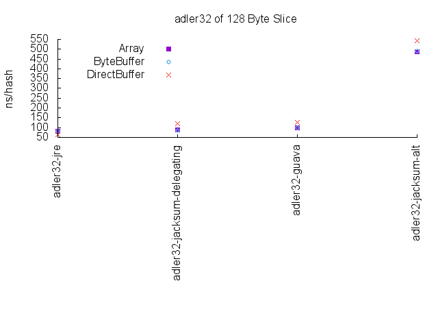

| Algorithm |  Array | ByteBuffer | DirectBuffer |
| --- | ---: | ---: | ---: | 
| [adler32-jre](#adler32-jre-latency) | 82.646949 | 82.950818 | 63.919041 |
| [adler32-jacksum-delegating](#adler32-jacksum-delegating-latency) | 87.325256 | 85.717392 | 119.325975 |
| [adler32-guava](#adler32-guava-latency) | 98.978163 | 98.857358 | 128.619156 |
| [adler32-jacksum-alt](#adler32-jacksum-alt-latency) | 487.585618 | 490.221938 | 544.286553 |

---
### 128 Byte Slice Latency (city64)

| Algorithm |  Array | ByteBuffer | DirectBuffer |
| --- | ---: | ---: | ---: | 
| [city64-zah](#city64-zah-latency) | 26.619406 | 27.955296 | 28.934982 |

---
### 128 Byte Slice Latency (cksum)
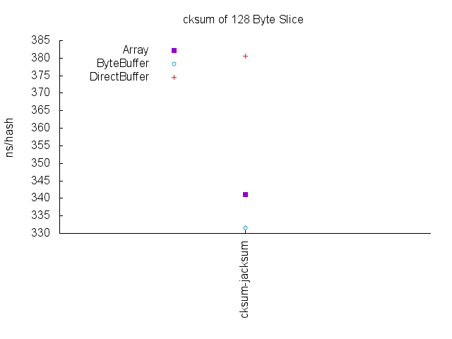

| Algorithm |  Array | ByteBuffer | DirectBuffer |
| --- | ---: | ---: | ---: | 
| [cksum-jacksum](#cksum-jacksum-latency) | 341.130797 | 331.657412 | 380.549628 |

---
### 128 Byte Slice Latency (crc16)
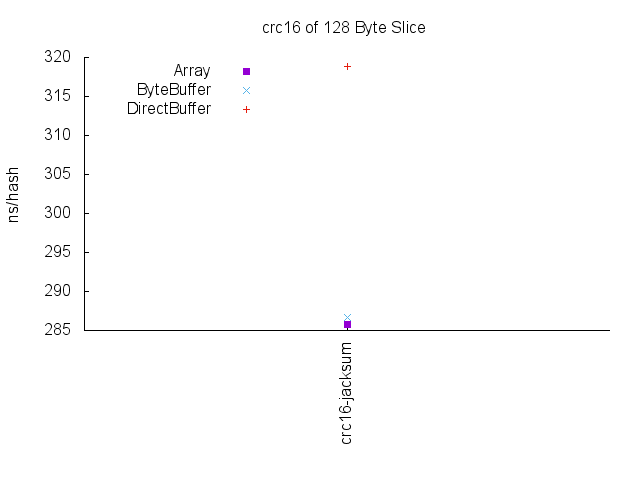

| Algorithm |  Array | ByteBuffer | DirectBuffer |
| --- | ---: | ---: | ---: | 
| [crc16-jacksum](#crc16-jacksum-latency) | 285.828622 | 286.603249 | 318.908805 |

---
### 128 Byte Slice Latency (crc24)

| Algorithm |  Array | ByteBuffer | DirectBuffer |
| --- | ---: | ---: | ---: | 
| [crc24-jacksum](#crc24-jacksum-latency) | 344.773533 | 427.934637 | 384.259544 |

---
### 128 Byte Slice Latency (crc32)
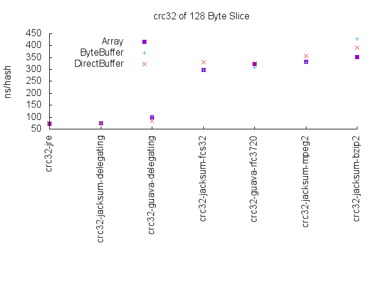

| Algorithm |  Array | ByteBuffer | DirectBuffer |
| --- | ---: | ---: | ---: | 
| [crc32-jre](#crc32-jre-latency) | 72.020860 | 72.789507 | 75.062219 |
| [crc32-jacksum-delegating](#crc32-jacksum-delegating-latency) | 75.015942 | 75.222874 | 74.413717 |
| [crc32-guava-delegating](#crc32-guava-delegating-latency) | 99.155217 | 102.378960 | 84.921260 |
| [crc32-jacksum-fcs32](#crc32-jacksum-fcs32-latency) | 297.944154 | 296.789276 | 329.328344 |
| [crc32-guava-rfc3720](#crc32-guava-rfc3720-latency) | 322.648643 | 307.894974 | 323.656114 |
| [crc32-jacksum-mpeg2](#crc32-jacksum-mpeg2-latency) | 331.947432 | 330.070152 | 356.193972 |
| [crc32-jacksum-bzip2](#crc32-jacksum-bzip2-latency) | 350.844270 | 427.703133 | 392.215793 |

---
### 128 Byte Slice Latency (crc64)
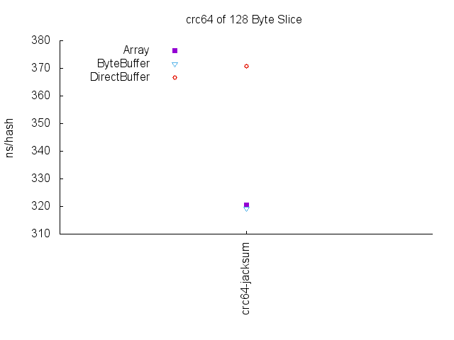

| Algorithm |  Array | ByteBuffer | DirectBuffer |
| --- | ---: | ---: | ---: | 
| [crc64-jacksum](#crc64-jacksum-latency) | 320.635398 | 319.328052 | 370.884159 |

---
### 128 Byte Slice Latency (crc8)
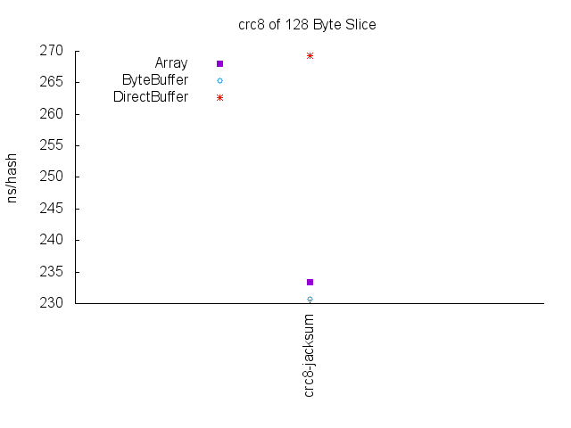

| Algorithm |  Array | ByteBuffer | DirectBuffer |
| --- | ---: | ---: | ---: | 
| [crc8-jacksum](#crc8-jacksum-latency) | 233.405813 | 230.764919 | 269.316431 |

---
### 128 Byte Slice Latency (ed2k)
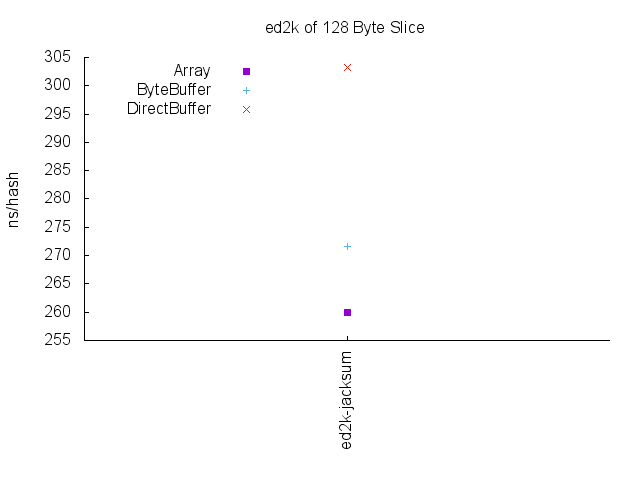

| Algorithm |  Array | ByteBuffer | DirectBuffer |
| --- | ---: | ---: | ---: | 
| [ed2k-jacksum](#ed2k-jacksum-latency) | 259.896077 | 271.591167 | 303.298390 |

---
### 128 Byte Slice Latency (elf)
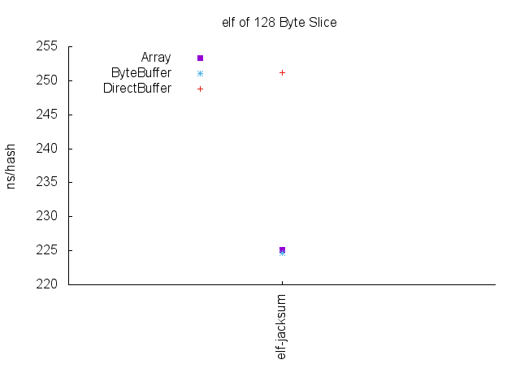

| Algorithm |  Array | ByteBuffer | DirectBuffer |
| --- | ---: | ---: | ---: | 
| [elf-jacksum](#elf-jacksum-latency) | 225.188420 | 224.690236 | 251.180670 |

---
### 128 Byte Slice Latency (farmna)
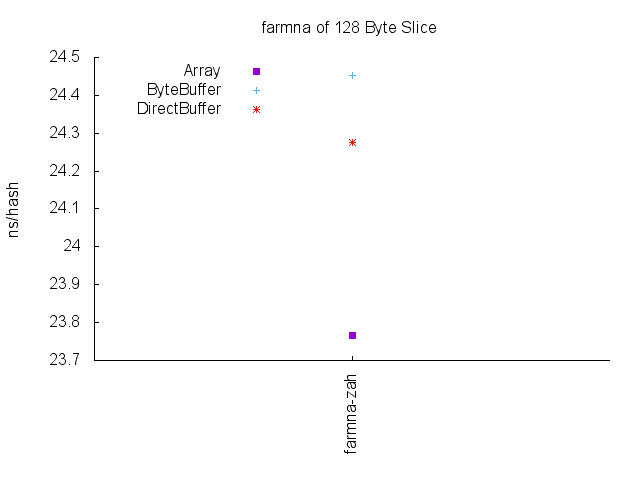

| Algorithm |  Array | ByteBuffer | DirectBuffer |
| --- | ---: | ---: | ---: | 
| [farmna-zah](#farmna-zah-latency) | 23.766087 | 24.451787 | 24.275295 |

---
### 128 Byte Slice Latency (farmuo)
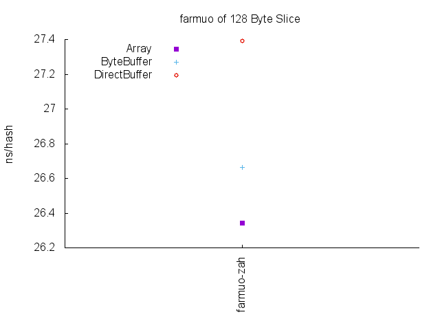

| Algorithm |  Array | ByteBuffer | DirectBuffer |
| --- | ---: | ---: | ---: | 
| [farmuo-zah](#farmuo-zah-latency) | 26.342973 | 26.665337 | 27.393298 |

---
### 128 Byte Slice Latency (fcs16)

| Algorithm |  Array | ByteBuffer | DirectBuffer |
| --- | ---: | ---: | ---: | 
| [fcs16-jacksum](#fcs16-jacksum-latency) | 326.170299 | 326.591237 | 376.264152 |

---
### 128 Byte Slice Latency (gfh32)
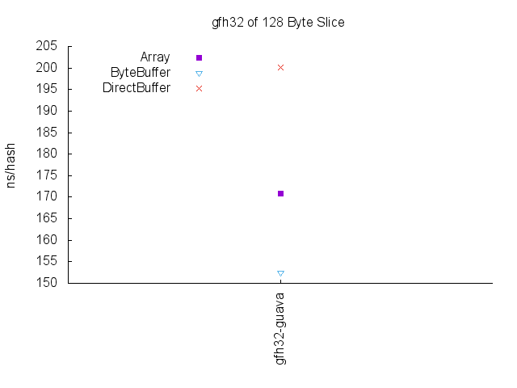

| Algorithm |  Array | ByteBuffer | DirectBuffer |
| --- | ---: | ---: | ---: | 
| [gfh32-guava](#gfh32-guava-latency) | 170.875590 | 152.442230 | 200.115675 |

---
### 128 Byte Slice Latency (gfh64)
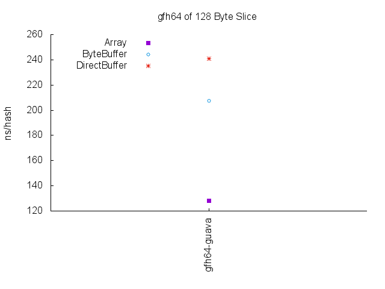

| Algorithm |  Array | ByteBuffer | DirectBuffer |
| --- | ---: | ---: | ---: | 
| [gfh64-guava](#gfh64-guava-latency) | 128.080128 | 207.309956 | 240.848265 |

---
### 128 Byte Slice Latency (gost)
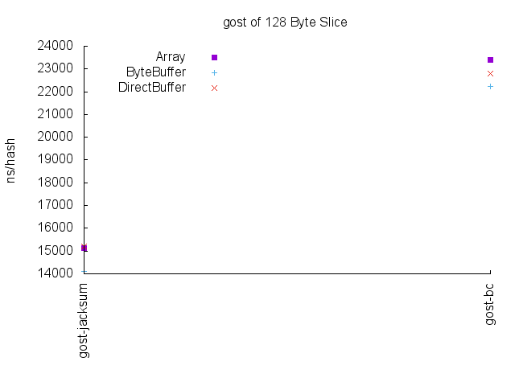

| Algorithm |  Array | ByteBuffer | DirectBuffer |
| --- | ---: | ---: | ---: | 
| [gost-jacksum](#gost-jacksum-latency) | 15146.809504 | 14110.913035 | 15216.291229 |
| [gost-bc](#gost-bc-latency) | 23406.598338 | 22244.222455 | 22788.043036 |

---
### 128 Byte Slice Latency (has160)
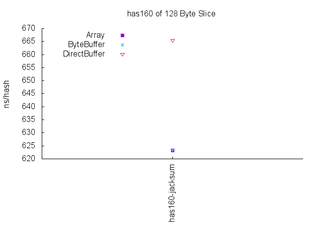

| Algorithm |  Array | ByteBuffer | DirectBuffer |
| --- | ---: | ---: | ---: | 
| [has160-jacksum](#has160-jacksum-latency) | 623.247829 | 623.470353 | 665.436972 |

---
### 128 Byte Slice Latency (haval128h3)
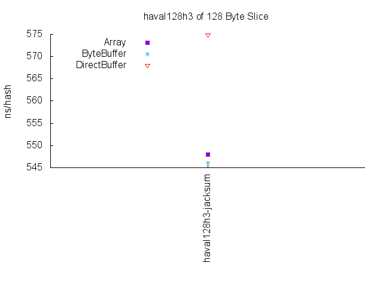

| Algorithm |  Array | ByteBuffer | DirectBuffer |
| --- | ---: | ---: | ---: | 
| [haval128h3-jacksum](#haval128h3-jacksum-latency) | 548.019678 | 546.133877 | 574.890685 |

---
### 128 Byte Slice Latency (haval128h4)
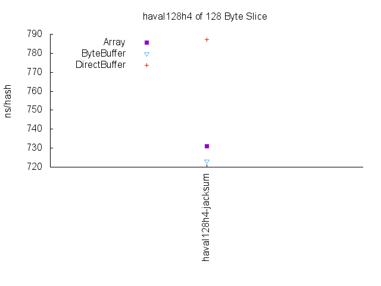

| Algorithm |  Array | ByteBuffer | DirectBuffer |
| --- | ---: | ---: | ---: | 
| [haval128h4-jacksum](#haval128h4-jacksum-latency) | 730.967767 | 723.130395 | 787.276173 |

---
### 128 Byte Slice Latency (haval128h5)
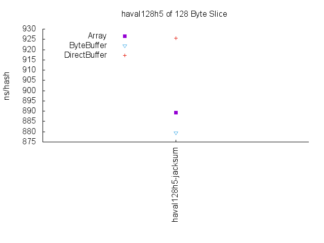

| Algorithm |  Array | ByteBuffer | DirectBuffer |
| --- | ---: | ---: | ---: | 
| [haval128h5-jacksum](#haval128h5-jacksum-latency) | 889.228334 | 879.538559 | 925.637091 |

---
### 128 Byte Slice Latency (haval160h3)
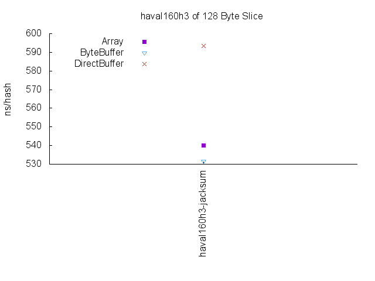

| Algorithm |  Array | ByteBuffer | DirectBuffer |
| --- | ---: | ---: | ---: | 
| [haval160h3-jacksum](#haval160h3-jacksum-latency) | 539.888978 | 531.567061 | 593.417325 |

---
### 128 Byte Slice Latency (haval160h4)
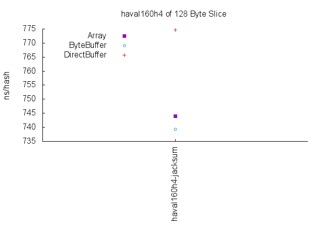

| Algorithm |  Array | ByteBuffer | DirectBuffer |
| --- | ---: | ---: | ---: | 
| [haval160h4-jacksum](#haval160h4-jacksum-latency) | 743.891854 | 739.304135 | 774.577016 |

---
### 128 Byte Slice Latency (haval160h5)
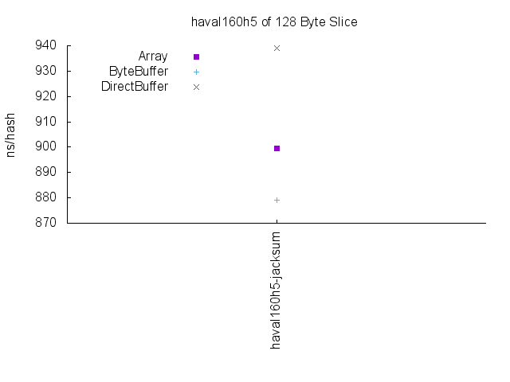

| Algorithm |  Array | ByteBuffer | DirectBuffer |
| --- | ---: | ---: | ---: | 
| [haval160h5-jacksum](#haval160h5-jacksum-latency) | 899.507063 | 879.043905 | 938.960873 |

---
### 128 Byte Slice Latency (haval192h3)
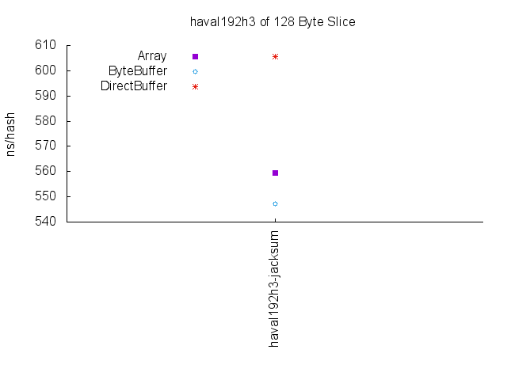

| Algorithm |  Array | ByteBuffer | DirectBuffer |
| --- | ---: | ---: | ---: | 
| [haval192h3-jacksum](#haval192h3-jacksum-latency) | 559.459032 | 547.264771 | 605.498977 |

---
### 128 Byte Slice Latency (haval192h4)
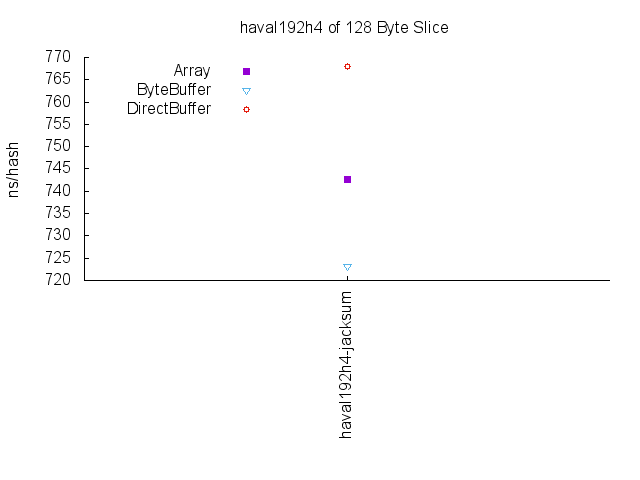

| Algorithm |  Array | ByteBuffer | DirectBuffer |
| --- | ---: | ---: | ---: | 
| [haval192h4-jacksum](#haval192h4-jacksum-latency) | 742.652132 | 723.152875 | 767.970933 |

---
### 128 Byte Slice Latency (haval192h5)
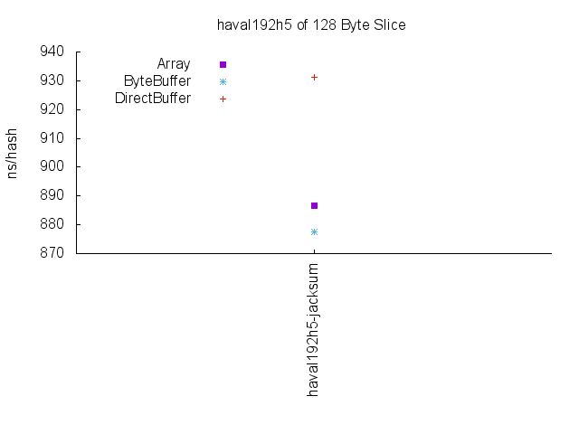

| Algorithm |  Array | ByteBuffer | DirectBuffer |
| --- | ---: | ---: | ---: | 
| [haval192h5-jacksum](#haval192h5-jacksum-latency) | 886.532733 | 877.447280 | 931.241540 |

---
### 128 Byte Slice Latency (haval224h3)
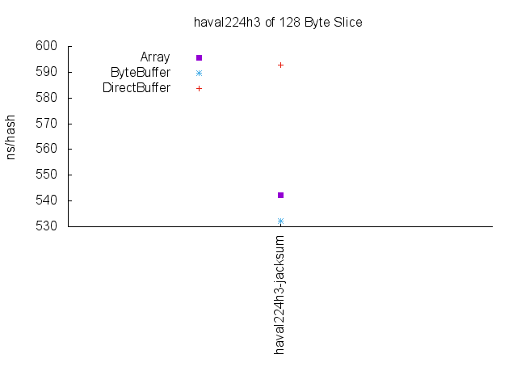

| Algorithm |  Array | ByteBuffer | DirectBuffer |
| --- | ---: | ---: | ---: | 
| [haval224h3-jacksum](#haval224h3-jacksum-latency) | 542.240581 | 532.075373 | 592.671486 |

---
### 128 Byte Slice Latency (haval224h4)
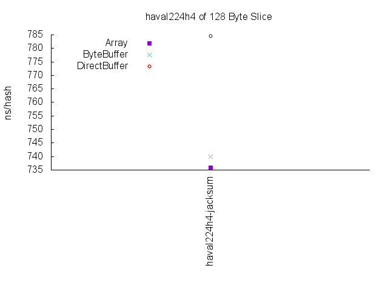

| Algorithm |  Array | ByteBuffer | DirectBuffer |
| --- | ---: | ---: | ---: | 
| [haval224h4-jacksum](#haval224h4-jacksum-latency) | 735.801391 | 739.905636 | 784.557075 |

---
### 128 Byte Slice Latency (haval224h5)
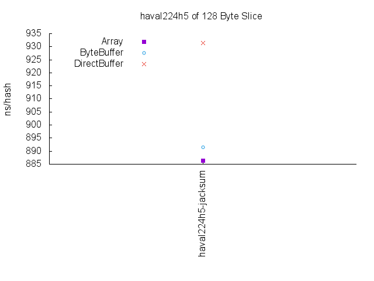

| Algorithm |  Array | ByteBuffer | DirectBuffer |
| --- | ---: | ---: | ---: | 
| [haval224h5-jacksum](#haval224h5-jacksum-latency) | 886.361250 | 891.534272 | 931.348669 |

---
### 128 Byte Slice Latency (haval256h3)
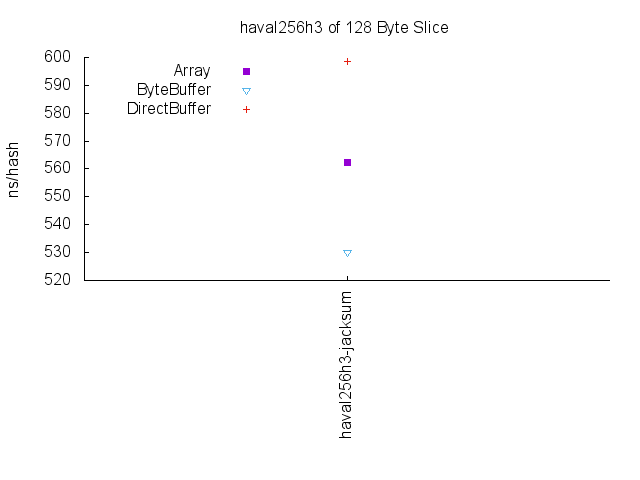

| Algorithm |  Array | ByteBuffer | DirectBuffer |
| --- | ---: | ---: | ---: | 
| [haval256h3-jacksum](#haval256h3-jacksum-latency) | 562.510728 | 529.970968 | 598.520660 |

---
### 128 Byte Slice Latency (haval256h4)
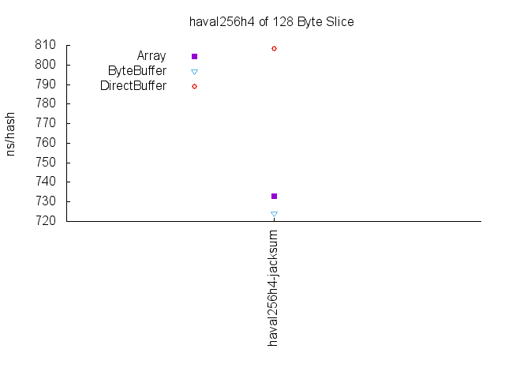

| Algorithm |  Array | ByteBuffer | DirectBuffer |
| --- | ---: | ---: | ---: | 
| [haval256h4-jacksum](#haval256h4-jacksum-latency) | 733.054585 | 724.067429 | 808.310941 |

---
### 128 Byte Slice Latency (haval256h5)
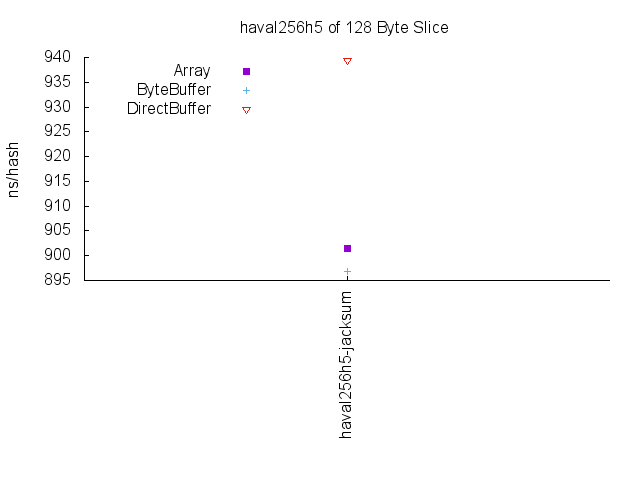

| Algorithm |  Array | ByteBuffer | DirectBuffer |
| --- | ---: | ---: | ---: | 
| [haval256h5-jacksum](#haval256h5-jacksum-latency) | 901.546793 | 896.874556 | 939.402600 |

---
### 128 Byte Slice Latency (md2)
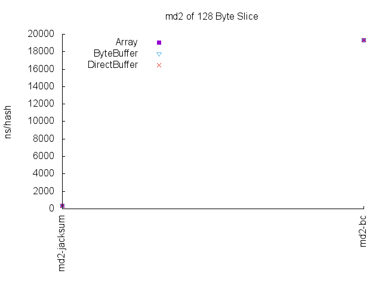

| Algorithm |  Array | ByteBuffer | DirectBuffer |
| --- | ---: | ---: | ---: | 
| [md2-jacksum](#md2-jacksum-latency) | 324.660328 | 325.895128 | 368.772933 |
| [md2-bc](#md2-bc-latency) | 19293.536113 | 19289.297127 | 19323.773876 |

---
### 128 Byte Slice Latency (md4)
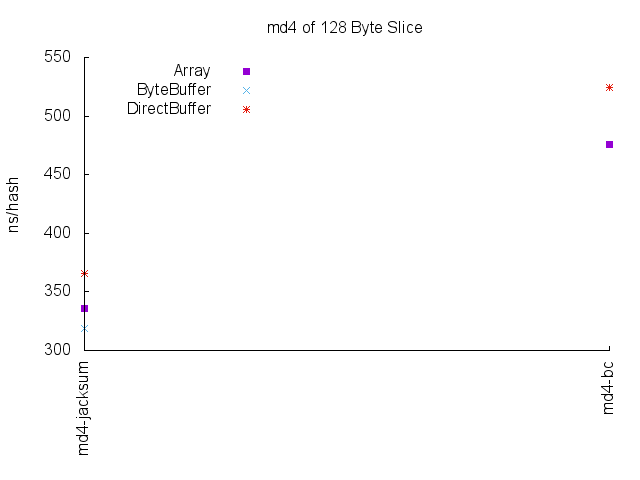

| Algorithm |  Array | ByteBuffer | DirectBuffer |
| --- | ---: | ---: | ---: | 
| [md4-jacksum](#md4-jacksum-latency) | 335.709241 | 318.554773 | 365.811692 |
| [md4-bc](#md4-bc-latency) | 475.894721 | 524.228877 | 524.161149 |

---
### 128 Byte Slice Latency (md5)
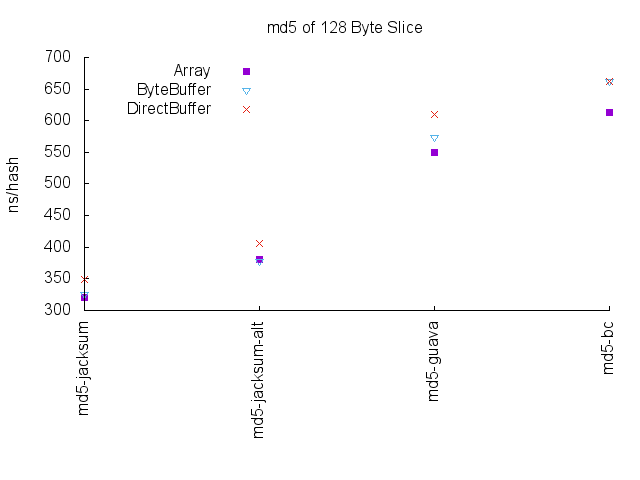

| Algorithm |  Array | ByteBuffer | DirectBuffer |
| --- | ---: | ---: | ---: | 
| [md5-jacksum](#md5-jacksum-latency) | 319.853705 | 324.849053 | 348.487949 |
| [md5-jacksum-alt](#md5-jacksum-alt-latency) | 381.236537 | 377.740835 | 405.293202 |
| [md5-guava](#md5-guava-latency) | 549.072811 | 573.719528 | 609.746298 |
| [md5-bc](#md5-bc-latency) | 612.703291 | 661.996465 | 661.336262 |

---
### 128 Byte Slice Latency (murmur3h128)
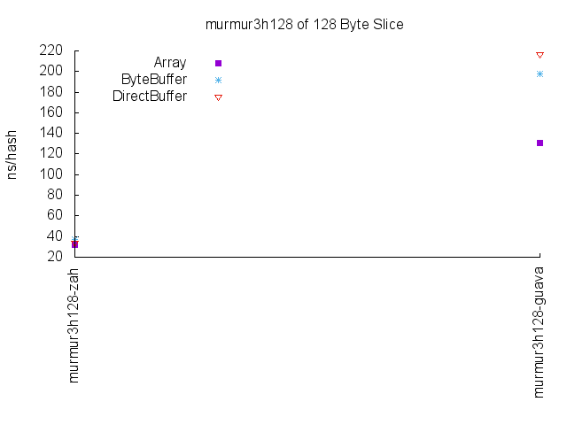

| Algorithm |  Array | ByteBuffer | DirectBuffer |
| --- | ---: | ---: | ---: | 
| [murmur3h128-zah](#murmur3h128-zah-latency) | 31.904708 | 37.041997 | 34.074388 |
| [murmur3h128-guava](#murmur3h128-guava-latency) | 130.400428 | 197.576468 | 216.515120 |

---
### 128 Byte Slice Latency (murmur3h32)
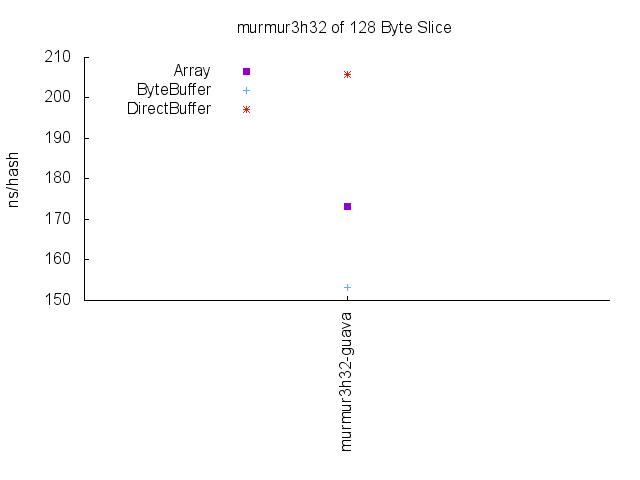

| Algorithm |  Array | ByteBuffer | DirectBuffer |
| --- | ---: | ---: | ---: | 
| [murmur3h32-guava](#murmur3h32-guava-latency) | 173.235541 | 153.266125 | 205.711347 |

---
### 128 Byte Slice Latency (ripemd128)
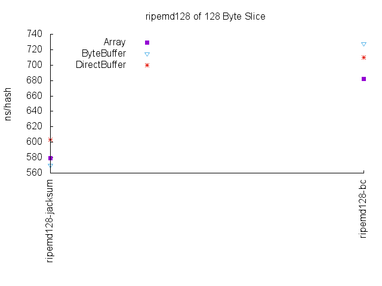

| Algorithm |  Array | ByteBuffer | DirectBuffer |
| --- | ---: | ---: | ---: | 
| [ripemd128-jacksum](#ripemd128-jacksum-latency) | 579.151178 | 569.668833 | 603.309383 |
| [ripemd128-bc](#ripemd128-bc-latency) | 681.766536 | 727.776043 | 710.128434 |

---
### 128 Byte Slice Latency (ripemd160)
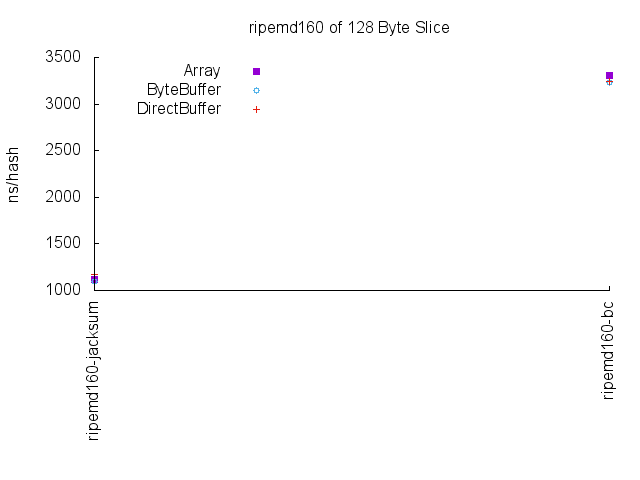

| Algorithm |  Array | ByteBuffer | DirectBuffer |
| --- | ---: | ---: | ---: | 
| [ripemd160-jacksum](#ripemd160-jacksum-latency) | 1115.434884 | 1099.468962 | 1169.014166 |
| [ripemd160-bc](#ripemd160-bc-latency) | 3302.876096 | 3231.946975 | 3243.021814 |

---
### 128 Byte Slice Latency (ripemd256)
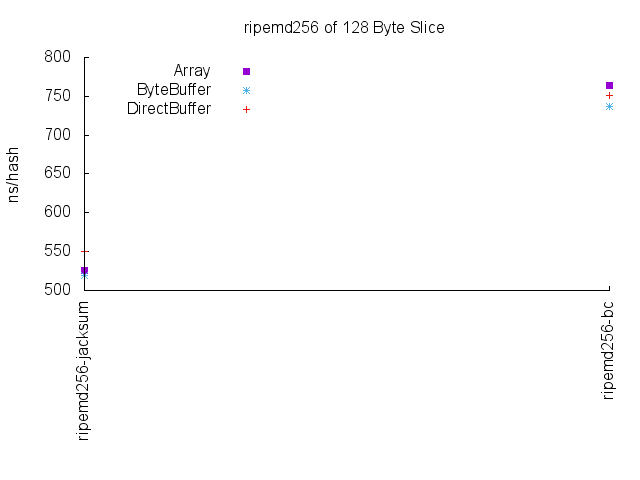

| Algorithm |  Array | ByteBuffer | DirectBuffer |
| --- | ---: | ---: | ---: | 
| [ripemd256-jacksum](#ripemd256-jacksum-latency) | 525.717050 | 518.715667 | 549.662474 |
| [ripemd256-bc](#ripemd256-bc-latency) | 764.441718 | 736.278005 | 750.847495 |

---
### 128 Byte Slice Latency (ripemd320)
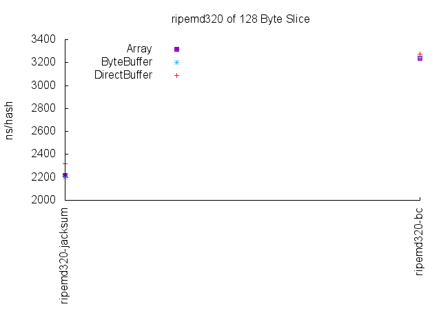

| Algorithm |  Array | ByteBuffer | DirectBuffer |
| --- | ---: | ---: | ---: | 
| [ripemd320-jacksum](#ripemd320-jacksum-latency) | 2217.065834 | 2198.668685 | 2320.452049 |
| [ripemd320-bc](#ripemd320-bc-latency) | 3239.820602 | 3242.984844 | 3273.326707 |

---
### 128 Byte Slice Latency (sha0)
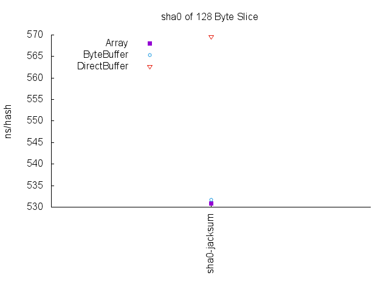

| Algorithm |  Array | ByteBuffer | DirectBuffer |
| --- | ---: | ---: | ---: | 
| [sha0-jacksum](#sha0-jacksum-latency) | 530.868682 | 531.734576 | 569.629707 |

---
### 128 Byte Slice Latency (sha1)
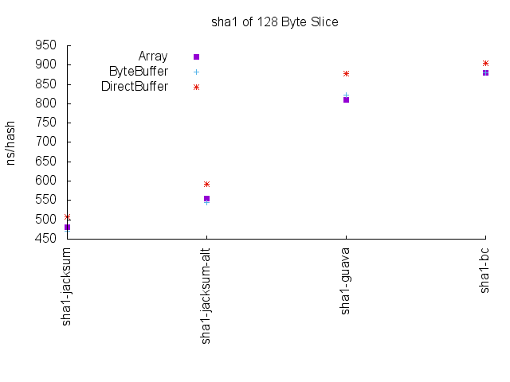

| Algorithm |  Array | ByteBuffer | DirectBuffer |
| --- | ---: | ---: | ---: | 
| [sha1-jacksum](#sha1-jacksum-latency) | 481.708802 | 471.338550 | 506.656381 |
| [sha1-jacksum-alt](#sha1-jacksum-alt-latency) | 553.960873 | 543.958111 | 592.026080 |
| [sha1-guava](#sha1-guava-latency) | 810.612960 | 822.623094 | 877.096928 |
| [sha1-bc](#sha1-bc-latency) | 880.955083 | 879.147817 | 904.165479 |

---
### 128 Byte Slice Latency (sha224)
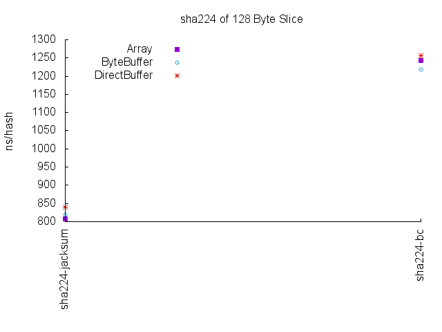

| Algorithm |  Array | ByteBuffer | DirectBuffer |
| --- | ---: | ---: | ---: | 
| [sha224-jacksum](#sha224-jacksum-latency) | 807.190964 | 818.520700 | 840.647792 |
| [sha224-bc](#sha224-bc-latency) | 1243.429678 | 1218.112777 | 1255.919660 |

---
### 128 Byte Slice Latency (sha256)
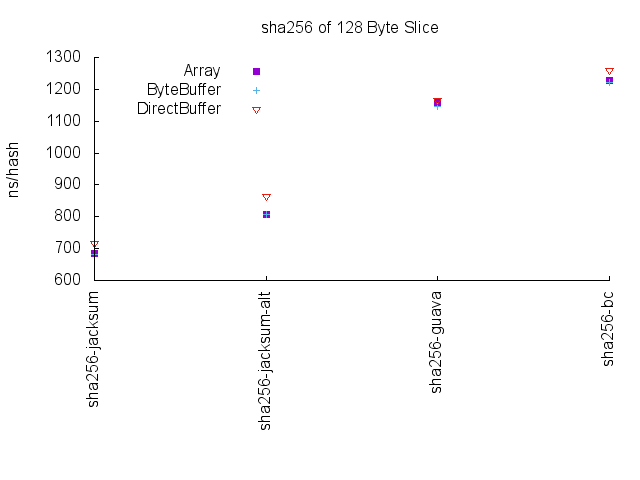

| Algorithm |  Array | ByteBuffer | DirectBuffer |
| --- | ---: | ---: | ---: | 
| [sha256-jacksum](#sha256-jacksum-latency) | 685.295005 | 681.106158 | 717.009550 |
| [sha256-jacksum-alt](#sha256-jacksum-alt-latency) | 806.131831 | 807.984786 | 864.007935 |
| [sha256-guava](#sha256-guava-latency) | 1159.972921 | 1144.968024 | 1163.927108 |
| [sha256-bc](#sha256-bc-latency) | 1229.312702 | 1221.345276 | 1259.111341 |

---
### 128 Byte Slice Latency (sha3)
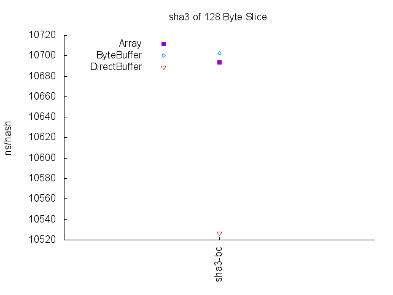

| Algorithm |  Array | ByteBuffer | DirectBuffer |
| --- | ---: | ---: | ---: | 
| [sha3-bc](#sha3-bc-latency) | 10693.416145 | 10702.327342 | 10526.549348 |

---
### 128 Byte Slice Latency (sha384)
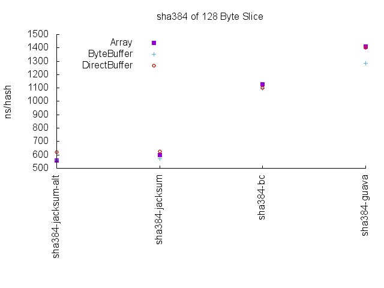

| Algorithm |  Array | ByteBuffer | DirectBuffer |
| --- | ---: | ---: | ---: | 
| [sha384-jacksum-alt](#sha384-jacksum-alt-latency) | 557.663204 | 562.682616 | 622.412188 |
| [sha384-jacksum](#sha384-jacksum-latency) | 597.226542 | 573.681246 | 626.820703 |
| [sha384-bc](#sha384-bc-latency) | 1125.718115 | 1098.624735 | 1100.558416 |
| [sha384-guava](#sha384-guava-latency) | 1410.272099 | 1284.483675 | 1402.134668 |

---
### 128 Byte Slice Latency (sha512)
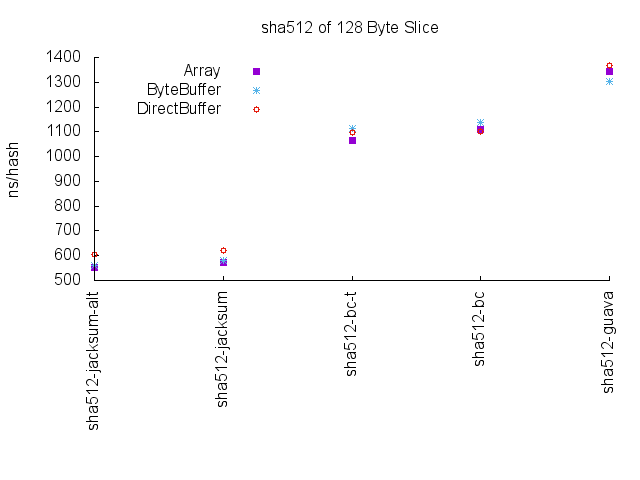

| Algorithm |  Array | ByteBuffer | DirectBuffer |
| --- | ---: | ---: | ---: | 
| [sha512-jacksum-alt](#sha512-jacksum-alt-latency) | 551.192462 | 560.068813 | 605.871528 |
| [sha512-jacksum](#sha512-jacksum-latency) | 572.823835 | 582.044235 | 622.704875 |
| [sha512-bc-t](#sha512-bc-t-latency) | 1066.341038 | 1114.886172 | 1096.593415 |
| [sha512-bc](#sha512-bc-latency) | 1109.139602 | 1138.022637 | 1101.412037 |
| [sha512-guava](#sha512-guava-latency) | 1344.692613 | 1302.084768 | 1369.220583 |

---
### 128 Byte Slice Latency (sip)
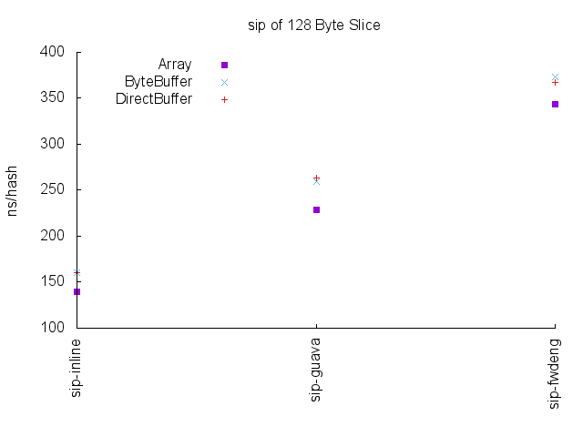

| Algorithm |  Array | ByteBuffer | DirectBuffer |
| --- | ---: | ---: | ---: | 
| [sip-inline](#sip-inline-latency) | 139.514489 | 160.306260 | 160.810535 |
| [sip-guava](#sip-guava-latency) | 228.240335 | 259.279886 | 263.275990 |
| [sip-fwdeng](#sip-fwdeng-latency) | 343.764549 | 373.523899 | 367.125814 |

---
### 128 Byte Slice Latency (skein1024)
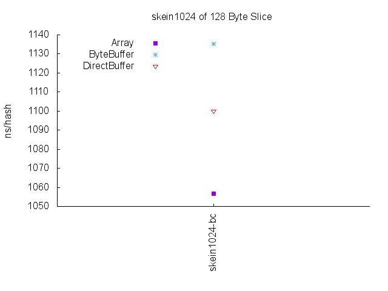

| Algorithm |  Array | ByteBuffer | DirectBuffer |
| --- | ---: | ---: | ---: | 
| [skein1024-bc](#skein1024-bc-latency) | 1056.620887 | 1135.110275 | 1099.825223 |

---
### 128 Byte Slice Latency (skein256)
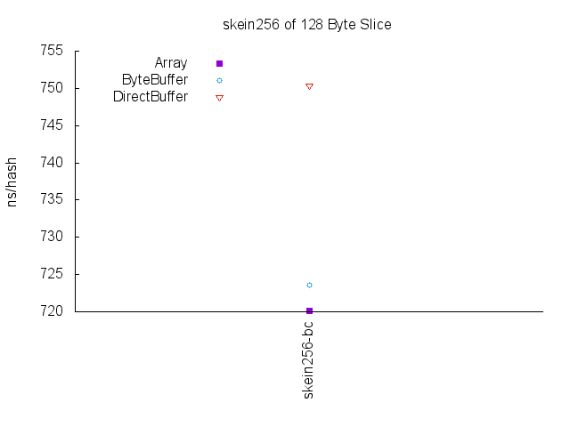

| Algorithm |  Array | ByteBuffer | DirectBuffer |
| --- | ---: | ---: | ---: | 
| [skein256-bc](#skein256-bc-latency) | 720.090715 | 723.562690 | 750.304314 |

---
### 128 Byte Slice Latency (skein512)
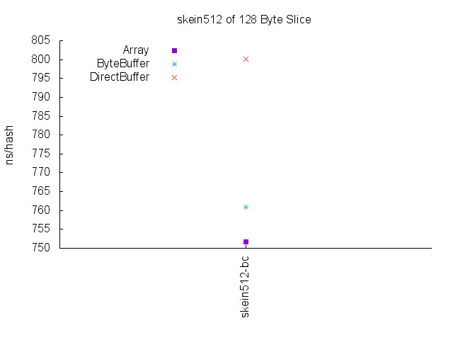

| Algorithm |  Array | ByteBuffer | DirectBuffer |
| --- | ---: | ---: | ---: | 
| [skein512-bc](#skein512-bc-latency) | 751.728020 | 760.824098 | 800.083689 |

---
### 128 Byte Slice Latency (sm3)
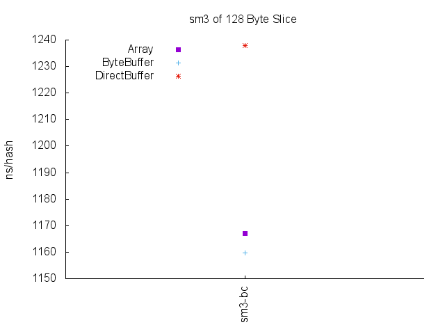

| Algorithm |  Array | ByteBuffer | DirectBuffer |
| --- | ---: | ---: | ---: | 
| [sm3-bc](#sm3-bc-latency) | 1167.151710 | 1159.808647 | 1237.963627 |

---
### 128 Byte Slice Latency (sum16)
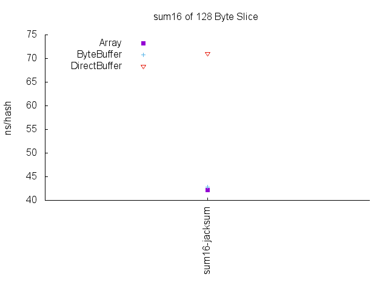

| Algorithm |  Array | ByteBuffer | DirectBuffer |
| --- | ---: | ---: | ---: | 
| [sum16-jacksum](#sum16-jacksum-latency) | 42.176340 | 42.849856 | 71.021321 |

---
### 128 Byte Slice Latency (sum24)
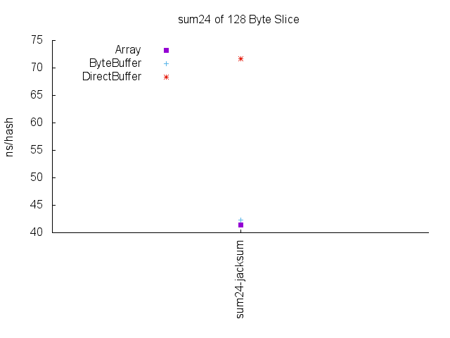

| Algorithm |  Array | ByteBuffer | DirectBuffer |
| --- | ---: | ---: | ---: | 
| [sum24-jacksum](#sum24-jacksum-latency) | 41.409458 | 42.344083 | 71.685797 |

---
### 128 Byte Slice Latency (sum32)

| Algorithm |  Array | ByteBuffer | DirectBuffer |
| --- | ---: | ---: | ---: | 
| [sum32-jacksum](#sum32-jacksum-latency) | 41.625842 | 42.794848 | 67.468717 |

---
### 128 Byte Slice Latency (sum8)

| Algorithm |  Array | ByteBuffer | DirectBuffer |
| --- | ---: | ---: | ---: | 
| [sum8-jacksum](#sum8-jacksum-latency) | 42.125528 | 43.052587 | 74.879483 |

---
### 128 Byte Slice Latency (sumbsd)
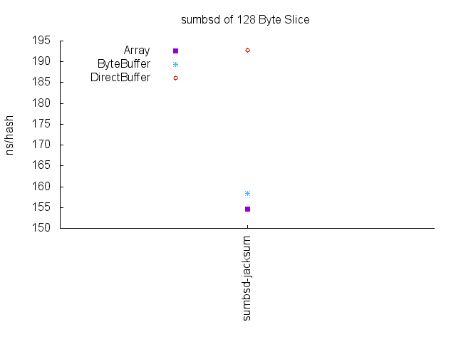

| Algorithm |  Array | ByteBuffer | DirectBuffer |
| --- | ---: | ---: | ---: | 
| [sumbsd-jacksum](#sumbsd-jacksum-latency) | 154.562323 | 158.375344 | 192.788488 |

---
### 128 Byte Slice Latency (sumsysv)

| Algorithm |  Array | ByteBuffer | DirectBuffer |
| --- | ---: | ---: | ---: | 
| [sumsysv-jacksum](#sumsysv-jacksum-latency) | 41.656149 | 43.424274 | 69.784069 |

---
### 128 Byte Slice Latency (tiger)
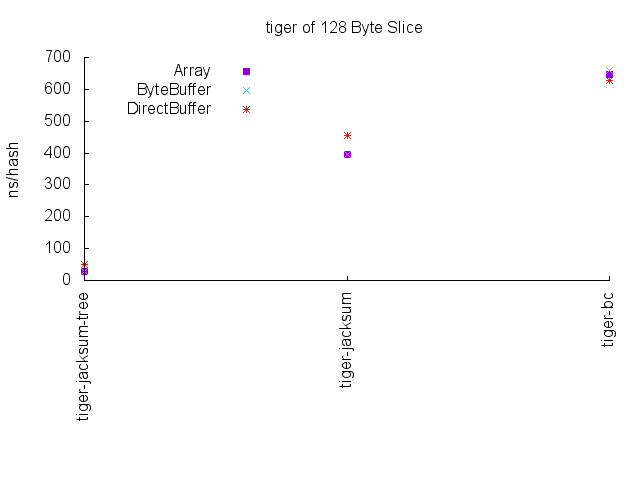

| Algorithm |  Array | ByteBuffer | DirectBuffer |
| --- | ---: | ---: | ---: | 
| [tiger-jacksum-tree](#tiger-jacksum-tree-latency) | 29.479784 | 28.548432 | 50.516798 |
| [tiger-jacksum](#tiger-jacksum-latency) | 397.043672 | 394.948457 | 454.520711 |
| [tiger-bc](#tiger-bc-latency) | 647.795690 | 659.962336 | 627.895714 |

---
### 128 Byte Slice Latency (tiger128)
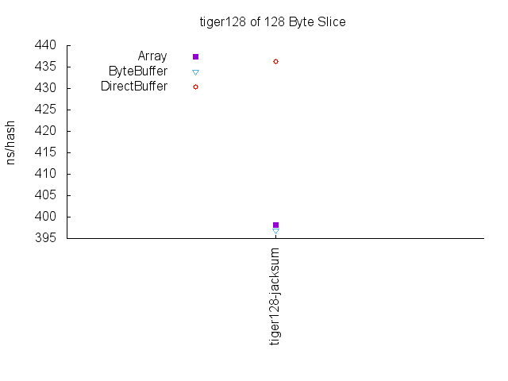

| Algorithm |  Array | ByteBuffer | DirectBuffer |
| --- | ---: | ---: | ---: | 
| [tiger128-jacksum](#tiger128-jacksum-latency) | 398.065657 | 396.903712 | 436.365051 |

---
### 128 Byte Slice Latency (tiger160)
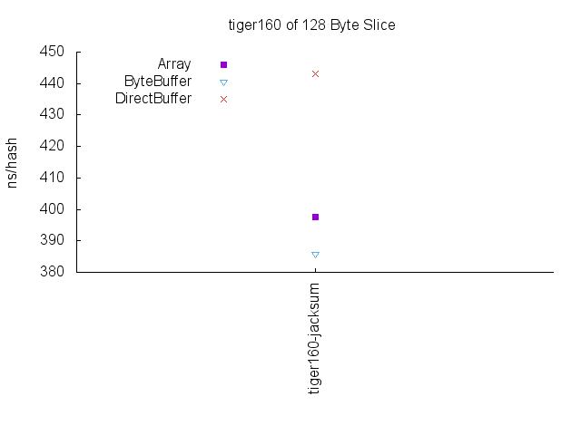

| Algorithm |  Array | ByteBuffer | DirectBuffer |
| --- | ---: | ---: | ---: | 
| [tiger160-jacksum](#tiger160-jacksum-latency) | 397.641100 | 385.808962 | 443.121401 |

---
### 128 Byte Slice Latency (tiger2)
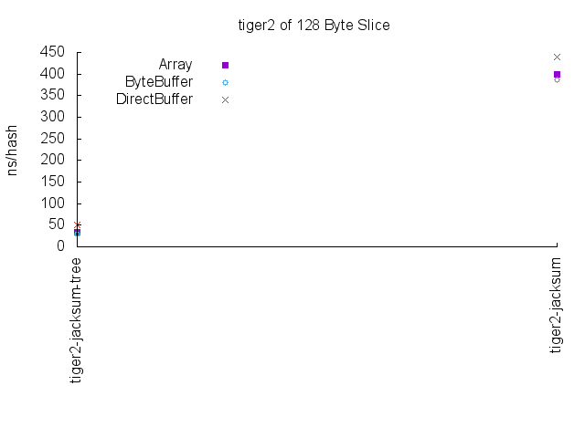

| Algorithm |  Array | ByteBuffer | DirectBuffer |
| --- | ---: | ---: | ---: | 
| [tiger2-jacksum-tree](#tiger2-jacksum-tree-latency) | 34.400234 | 29.254862 | 49.697730 |
| [tiger2-jacksum](#tiger2-jacksum-latency) | 398.676126 | 386.343501 | 438.507288 |

---
### 128 Byte Slice Latency (whirlpool0)
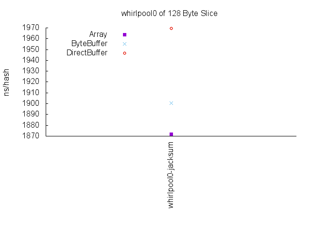

| Algorithm |  Array | ByteBuffer | DirectBuffer |
| --- | ---: | ---: | ---: | 
| [whirlpool0-jacksum](#whirlpool0-jacksum-latency) | 1871.931920 | 1900.590175 | 1969.397364 |

---
### 128 Byte Slice Latency (whirlpool1)

| Algorithm |  Array | ByteBuffer | DirectBuffer |
| --- | ---: | ---: | ---: | 
| [whirlpool1-jacksum](#whirlpool1-jacksum-latency) | 1941.368634 | 1996.925363 | 2045.660494 |

---
### 128 Byte Slice Latency (whirlpool2)
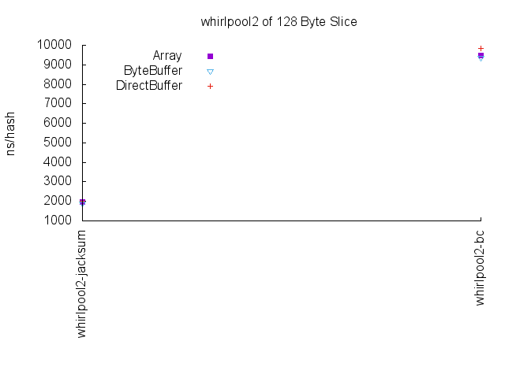

| Algorithm |  Array | ByteBuffer | DirectBuffer |
| --- | ---: | ---: | ---: | 
| [whirlpool2-jacksum](#whirlpool2-jacksum-latency) | 1975.138802 | 1890.685823 | 2022.295810 |
| [whirlpool2-bc](#whirlpool2-bc-latency) | 9481.194390 | 9358.954313 | 9858.439148 |

---
### 128 Byte Slice Latency (xor8)
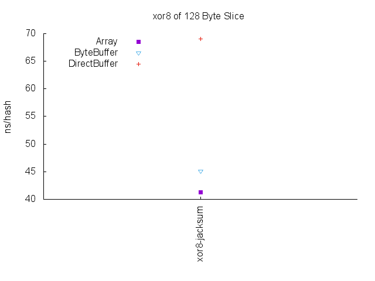

| Algorithm |  Array | ByteBuffer | DirectBuffer |
| --- | ---: | ---: | ---: | 
| [xor8-jacksum](#xor8-jacksum-latency) | 41.275511 | 45.085445 | 69.036549 |

---
### 128 Byte Slice Latency (xxh32)
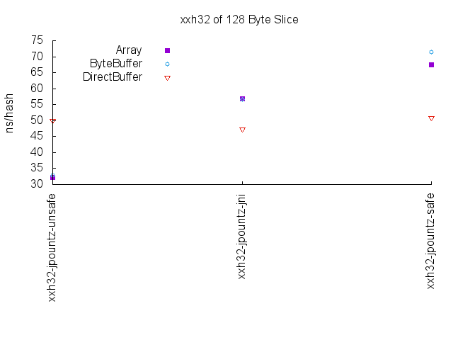

| Algorithm |  Array | ByteBuffer | DirectBuffer |
| --- | ---: | ---: | ---: | 
| [xxh32-jpountz-unsafe](#xxh32-jpountz-unsafe-latency) | 32.296354 | 32.922869 | 50.017485 |
| [xxh32-jpountz-jni](#xxh32-jpountz-jni-latency) | 56.865669 | 56.574434 | 47.332192 |
| [xxh32-jpountz-safe](#xxh32-jpountz-safe-latency) | 67.444133 | 71.496034 | 50.906318 |

---
### 128 Byte Slice Latency (xxh64)
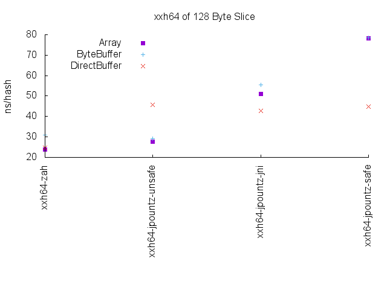

| Algorithm |  Array | ByteBuffer | DirectBuffer |
| --- | ---: | ---: | ---: | 
| [xxh64-zah](#xxh64-zah-latency) | 23.774723 | 30.902095 | 24.738725 |
| [xxh64-jpountz-unsafe](#xxh64-jpountz-unsafe-latency) | 27.708782 | 29.209727 | 45.589571 |
| [xxh64-jpountz-jni](#xxh64-jpountz-jni-latency) | 51.023885 | 55.354021 | 42.751683 |
| [xxh64-jpountz-safe](#xxh64-jpountz-safe-latency) | 78.210169 | 78.440963 | 44.950956 |

---
### 512 Byte Slice Latency (All Hashes)
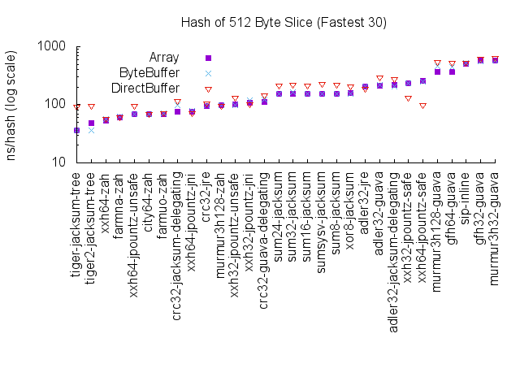

| Algorithm |  Array | ByteBuffer | DirectBuffer |
| --- | ---: | ---: | ---: | 
| [tiger-jacksum-tree](#tiger-jacksum-tree-latency) | 35.736062 | 36.781896 | 92.957105 |
| [tiger2-jacksum-tree](#tiger2-jacksum-tree-latency) | 48.292336 | 36.689362 | 95.338044 |
| [xxh64-zah](#xxh64-zah-latency) | 54.173173 | 57.009608 | 56.746202 |
| [farmna-zah](#farmna-zah-latency) | 60.867004 | 63.622633 | 60.551324 |
| [xxh64-jpountz-unsafe](#xxh64-jpountz-unsafe-latency) | 68.061547 | 68.952579 | 95.897739 |
| [city64-zah](#city64-zah-latency) | 68.402821 | 68.346159 | 69.185076 |
| [farmuo-zah](#farmuo-zah-latency) | 69.770417 | 72.107689 | 70.237873 |
| [crc32-jacksum-delegating](#crc32-jacksum-delegating-latency) | 75.067748 | 99.543410 | 116.679110 |
| [xxh64-jpountz-jni](#xxh64-jpountz-jni-latency) | 77.120173 | 79.010407 | 70.784956 |
| [crc32-jre](#crc32-jre-latency) | 93.943136 | 97.022289 | 106.078851 |
| [murmur3h128-zah](#murmur3h128-zah-latency) | 98.271901 | 97.415523 | 96.679660 |
| [xxh32-jpountz-unsafe](#xxh32-jpountz-unsafe-latency) | 102.609195 | 99.509120 | 129.674785 |
| [xxh32-jpountz-jni](#xxh32-jpountz-jni-latency) | 108.804278 | 119.280746 | 102.275736 |
| [crc32-guava-delegating](#crc32-guava-delegating-latency) | 112.646426 | 122.153289 | 147.162572 |
| [sum24-jacksum](#sum24-jacksum-latency) | 152.573620 | 156.647188 | 209.786959 |
| [sum32-jacksum](#sum32-jacksum-latency) | 152.818536 | 165.053443 | 217.483782 |
| [sum16-jacksum](#sum16-jacksum-latency) | 153.620772 | 154.154775 | 211.250651 |
| [sumsysv-jacksum](#sumsysv-jacksum-latency) | 154.109715 | 155.403570 | 225.207782 |
| [sum8-jacksum](#sum8-jacksum-latency) | 155.236700 | 154.621885 | 219.891631 |
| [xor8-jacksum](#xor8-jacksum-latency) | 159.208858 | 155.525975 | 208.018888 |
| [adler32-jre](#adler32-jre-latency) | 205.148939 | 204.404292 | 184.631470 |
| [adler32-guava](#adler32-guava-latency) | 214.978245 | 217.215930 | 297.879454 |
| [adler32-jacksum-delegating](#adler32-jacksum-delegating-latency) | 221.105609 | 209.200820 | 278.218997 |
| [xxh32-jpountz-safe](#xxh32-jpountz-safe-latency) | 233.550211 | 238.202337 | 131.298480 |
| [xxh64-jpountz-safe](#xxh64-jpountz-safe-latency) | 261.340423 | 254.371295 | 97.476778 |
| [murmur3h128-guava](#murmur3h128-guava-latency) | 365.927712 | 454.744841 | 536.996673 |
| [gfh64-guava](#gfh64-guava-latency) | 372.539307 | 449.730059 | 522.796433 |
| [sip-inline](#sip-inline-latency) | 501.054790 | 528.702971 | 522.946182 |
| [gfh32-guava](#gfh32-guava-latency) | 570.628088 | 562.417285 | 612.120125 |
| [murmur3h32-guava](#murmur3h32-guava-latency) | 579.463487 | 570.400044 | 630.370367 |
| [sumbsd-jacksum](#sumbsd-jacksum-latency) | 607.677076 | 621.102501 | 696.210238 |
| [sip-guava](#sip-guava-latency) | 726.109760 | 737.647059 | 832.549302 |
| [elf-jacksum](#elf-jacksum-latency) | 881.303186 | 899.356532 | 961.062103 |
| [ed2k-jacksum](#ed2k-jacksum-latency) | 964.715123 | 957.373184 | 1006.737553 |
| [crc8-jacksum](#crc8-jacksum-latency) | 981.606094 | 944.866863 | 1099.773342 |
| [crc16-jacksum](#crc16-jacksum-latency) | 1146.404300 | 1184.305477 | 1295.853479 |
| [crc32-guava-rfc3720](#crc32-guava-rfc3720-latency) | 1201.171189 | 1209.038571 | 1262.544158 |
| [crc32-jacksum-fcs32](#crc32-jacksum-fcs32-latency) | 1211.294164 | 1214.143880 | 1301.537172 |
| [md2-jacksum](#md2-jacksum-latency) | 1238.850148 | 1238.610218 | 1323.075819 |
| [md5-jacksum](#md5-jacksum-latency) | 1239.402118 | 1278.315417 | 1362.038417 |
| [md4-jacksum](#md4-jacksum-latency) | 1256.801513 | 1242.398067 | 1331.836420 |
| [crc64-jacksum](#crc64-jacksum-latency) | 1290.341730 | 1290.742717 | 1409.780113 |
| [sip-fwdeng](#sip-fwdeng-latency) | 1303.526293 | 1344.293500 | 1316.223162 |
| [fcs16-jacksum](#fcs16-jacksum-latency) | 1315.377454 | 1338.043163 | 1427.876643 |
| [crc32-jacksum-mpeg2](#crc32-jacksum-mpeg2-latency) | 1320.765174 | 1366.679073 | 1451.028680 |
| [cksum-jacksum](#cksum-jacksum-latency) | 1321.182867 | 1329.954247 | 1379.158844 |
| [crc32-jacksum-bzip2](#crc32-jacksum-bzip2-latency) | 1372.266267 | 1746.978575 | 1616.978911 |
| [crc24-jacksum](#crc24-jacksum-latency) | 1372.800296 | 1748.604730 | 1516.571513 |
| [md4-bc](#md4-bc-latency) | 1396.287709 | 1643.946140 | 1541.340106 |
| [md5-jacksum-alt](#md5-jacksum-alt-latency) | 1429.253324 | 1447.785406 | 1529.625632 |
| [md5-guava](#md5-guava-latency) | 1469.236528 | 1515.072844 | 1581.897338 |
| [tiger2-jacksum](#tiger2-jacksum-latency) | 1508.675028 | 1499.225492 | 1568.578034 |
| [tiger128-jacksum](#tiger128-jacksum-latency) | 1509.672594 | 1523.208649 | 1596.274867 |
| [tiger-jacksum](#tiger-jacksum-latency) | 1536.626050 | 1554.161804 | 1668.308340 |
| [tiger160-jacksum](#tiger160-jacksum-latency) | 1538.954170 | 1498.279644 | 1570.478425 |
| [md5-bc](#md5-bc-latency) | 1816.446229 | 2069.477040 | 1918.580813 |
| [tiger-bc](#tiger-bc-latency) | 1846.524279 | 1878.908775 | 1865.407438 |
| [sha1-jacksum](#sha1-jacksum-latency) | 1894.684994 | 1909.197192 | 2068.011241 |
| [adler32-jacksum-alt](#adler32-jacksum-alt-latency) | 1967.019523 | 2009.065506 | 2068.387238 |
| [ripemd128-bc](#ripemd128-bc-latency) | 2009.904304 | 2262.339146 | 2151.430854 |
| [ripemd256-jacksum](#ripemd256-jacksum-latency) | 2025.056689 | 1993.426911 | 2147.309462 |
| [sha0-jacksum](#sha0-jacksum-latency) | 2055.613129 | 2078.403367 | 2142.795679 |
| [haval160h3-jacksum](#haval160h3-jacksum-latency) | 2080.797159 | 2074.582796 | 2245.328346 |
| [haval128h3-jacksum](#haval128h3-jacksum-latency) | 2082.365879 | 2071.143273 | 2179.012040 |
| [haval256h3-jacksum](#haval256h3-jacksum-latency) | 2084.368553 | 2105.692593 | 2209.218791 |
| [haval224h3-jacksum](#haval224h3-jacksum-latency) | 2097.131689 | 2071.831073 | 2222.664531 |
| [sha512-jacksum-alt](#sha512-jacksum-alt-latency) | 2122.899995 | 2117.126492 | 2241.533837 |
| [sha384-jacksum-alt](#sha384-jacksum-alt-latency) | 2127.047541 | 2138.210604 | 2194.417674 |
| [haval192h3-jacksum](#haval192h3-jacksum-latency) | 2127.235342 | 2176.089595 | 2200.349693 |
| [skein512-bc](#skein512-bc-latency) | 2127.826411 | 2220.708475 | 2212.301455 |
| [ripemd256-bc](#ripemd256-bc-latency) | 2164.842757 | 2214.297569 | 2324.868401 |
| [sha1-jacksum-alt](#sha1-jacksum-alt-latency) | 2173.384320 | 2197.369861 | 2298.805383 |
| [ripemd128-jacksum](#ripemd128-jacksum-latency) | 2198.267822 | 2219.396566 | 2271.665214 |
| [sha1-guava](#sha1-guava-latency) | 2213.794600 | 2227.388851 | 2310.486970 |
| [sha384-jacksum](#sha384-jacksum-latency) | 2248.947885 | 2254.616372 | 2435.706127 |
| [sha512-jacksum](#sha512-jacksum-latency) | 2252.926501 | 2251.502958 | 2430.324202 |
| [skein256-bc](#skein256-bc-latency) | 2262.145232 | 2335.781075 | 2334.138273 |
| [has160-jacksum](#has160-jacksum-latency) | 2386.303497 | 2346.041361 | 2517.890998 |
| [skein1024-bc](#skein1024-bc-latency) | 2562.839289 | 2667.936618 | 2600.276996 |
| [sha512-bc-t](#sha512-bc-t-latency) | 2651.644842 | 2699.618052 | 2789.668874 |
| [sha1-bc](#sha1-bc-latency) | 2664.690172 | 2628.933959 | 2647.546082 |
| [sha256-jacksum](#sha256-jacksum-latency) | 2729.615109 | 2732.801974 | 2819.309391 |
| [sha512-bc](#sha512-bc-latency) | 2811.479111 | 2715.074652 | 2822.243705 |
| [sha384-bc](#sha384-bc-latency) | 2827.445202 | 2708.213756 | 2785.106434 |
| [haval256h4-jacksum](#haval256h4-jacksum-latency) | 2851.550830 | 2846.722312 | 2956.884459 |
| [haval128h4-jacksum](#haval128h4-jacksum-latency) | 2853.047014 | 2842.475111 | 2952.678429 |
| [haval160h4-jacksum](#haval160h4-jacksum-latency) | 2854.944542 | 2888.416138 | 2968.585491 |
| [haval224h4-jacksum](#haval224h4-jacksum-latency) | 2859.780433 | 2866.115332 | 3001.039283 |
| [haval192h4-jacksum](#haval192h4-jacksum-latency) | 2901.149250 | 2847.583678 | 2946.891417 |
| [sha512-guava](#sha512-guava-latency) | 3038.562518 | 2975.691499 | 3245.565762 |
| [sha384-guava](#sha384-guava-latency) | 3113.161779 | 3010.421268 | 3091.964538 |
| [sha256-jacksum-alt](#sha256-jacksum-alt-latency) | 3155.373272 | 3135.362109 | 3230.758683 |
| [sha256-guava](#sha256-guava-latency) | 3164.954196 | 3163.760432 | 3318.951548 |
| [sha224-jacksum](#sha224-jacksum-latency) | 3193.523939 | 3215.357327 | 3247.441326 |
| [haval224h5-jacksum](#haval224h5-jacksum-latency) | 3476.155542 | 3477.686494 | 3571.073880 |
| [haval256h5-jacksum](#haval256h5-jacksum-latency) | 3476.992815 | 3477.409043 | 3705.798165 |
| [haval160h5-jacksum](#haval160h5-jacksum-latency) | 3479.871937 | 3529.890485 | 3594.552166 |
| [haval128h5-jacksum](#haval128h5-jacksum-latency) | 3484.895473 | 3565.466573 | 3633.920006 |
| [haval192h5-jacksum](#haval192h5-jacksum-latency) | 3491.181189 | 3466.945890 | 3582.881844 |
| [sm3-bc](#sm3-bc-latency) | 3527.197396 | 3440.853847 | 3517.541049 |
| [sha256-bc](#sha256-bc-latency) | 3613.390007 | 3716.719013 | 3739.987120 |
| [sha224-bc](#sha224-bc-latency) | 3685.181884 | 3656.670748 | 3824.320105 |
| [ripemd160-jacksum](#ripemd160-jacksum-latency) | 4318.144853 | 4457.021525 | 4452.159598 |
| [whirlpool0-jacksum](#whirlpool0-jacksum-latency) | 7511.591465 | 7611.339759 | 7807.501981 |
| [whirlpool1-jacksum](#whirlpool1-jacksum-latency) | 7526.689865 | 7810.942690 | 7906.165514 |
| [whirlpool2-jacksum](#whirlpool2-jacksum-latency) | 7626.596560 | 7536.595077 | 7987.130736 |
| [ripemd320-jacksum](#ripemd320-jacksum-latency) | 8826.423105 | 8675.551743 | 8955.934613 |
| [ripemd160-bc](#ripemd160-bc-latency) | 9538.095458 | 9923.257780 | 9838.279752 |
| [ripemd320-bc](#ripemd320-bc-latency) | 10346.011929 | 9906.668624 | 9785.519035 |
| [sha3-bc](#sha3-bc-latency) | 26145.106850 | 26077.381685 | 26789.865299 |
| [whirlpool2-bc](#whirlpool2-bc-latency) | 30523.729149 | 31388.141528 | 30079.471281 |
| [gost-jacksum](#gost-jacksum-latency) | 55596.653765 | 55491.380685 | 63427.091369 |
| [md2-bc](#md2-bc-latency) | 65572.288221 | 64516.454120 | 65662.676884 |
| [gost-bc](#gost-bc-latency) | 71319.207921 | 70372.810431 | 71175.135321 |

---
### 512 Byte Slice Latency (adler32)
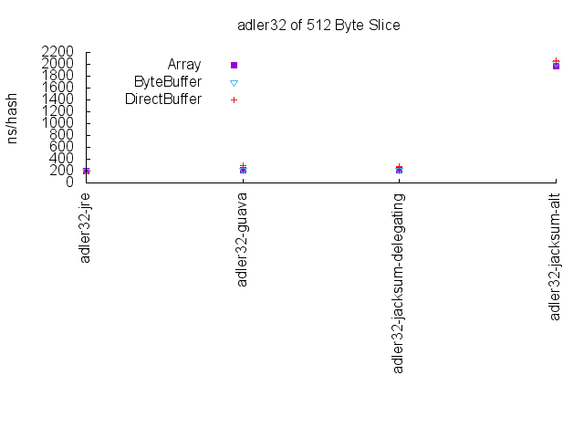

| Algorithm |  Array | ByteBuffer | DirectBuffer |
| --- | ---: | ---: | ---: | 
| [adler32-jre](#adler32-jre-latency) | 205.148939 | 204.404292 | 184.631470 |
| [adler32-guava](#adler32-guava-latency) | 214.978245 | 217.215930 | 297.879454 |
| [adler32-jacksum-delegating](#adler32-jacksum-delegating-latency) | 221.105609 | 209.200820 | 278.218997 |
| [adler32-jacksum-alt](#adler32-jacksum-alt-latency) | 1967.019523 | 2009.065506 | 2068.387238 |

---
### 512 Byte Slice Latency (city64)

| Algorithm |  Array | ByteBuffer | DirectBuffer |
| --- | ---: | ---: | ---: | 
| [city64-zah](#city64-zah-latency) | 68.402821 | 68.346159 | 69.185076 |

---
### 512 Byte Slice Latency (cksum)
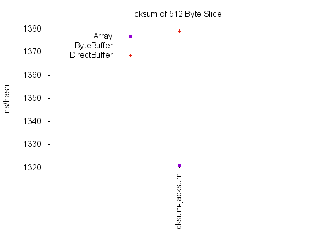

| Algorithm |  Array | ByteBuffer | DirectBuffer |
| --- | ---: | ---: | ---: | 
| [cksum-jacksum](#cksum-jacksum-latency) | 1321.182867 | 1329.954247 | 1379.158844 |

---
### 512 Byte Slice Latency (crc16)
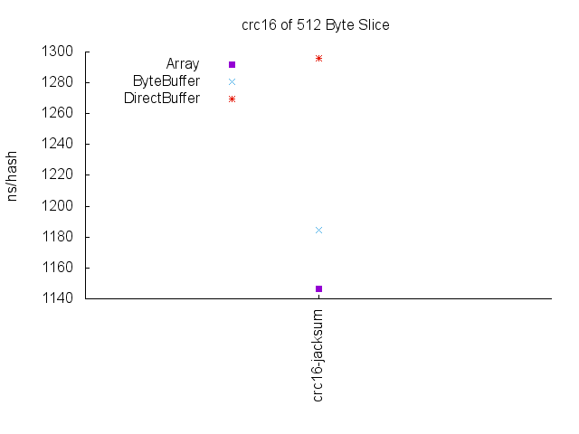

| Algorithm |  Array | ByteBuffer | DirectBuffer |
| --- | ---: | ---: | ---: | 
| [crc16-jacksum](#crc16-jacksum-latency) | 1146.404300 | 1184.305477 | 1295.853479 |

---
### 512 Byte Slice Latency (crc24)
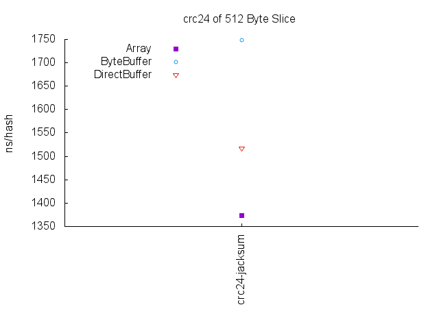

| Algorithm |  Array | ByteBuffer | DirectBuffer |
| --- | ---: | ---: | ---: | 
| [crc24-jacksum](#crc24-jacksum-latency) | 1372.800296 | 1748.604730 | 1516.571513 |

---
### 512 Byte Slice Latency (crc32)
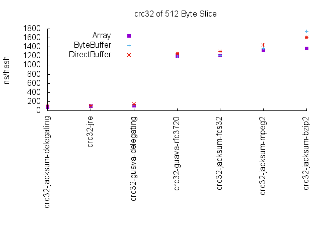

| Algorithm |  Array | ByteBuffer | DirectBuffer |
| --- | ---: | ---: | ---: | 
| [crc32-jacksum-delegating](#crc32-jacksum-delegating-latency) | 75.067748 | 99.543410 | 116.679110 |
| [crc32-jre](#crc32-jre-latency) | 93.943136 | 97.022289 | 106.078851 |
| [crc32-guava-delegating](#crc32-guava-delegating-latency) | 112.646426 | 122.153289 | 147.162572 |
| [crc32-guava-rfc3720](#crc32-guava-rfc3720-latency) | 1201.171189 | 1209.038571 | 1262.544158 |
| [crc32-jacksum-fcs32](#crc32-jacksum-fcs32-latency) | 1211.294164 | 1214.143880 | 1301.537172 |
| [crc32-jacksum-mpeg2](#crc32-jacksum-mpeg2-latency) | 1320.765174 | 1366.679073 | 1451.028680 |
| [crc32-jacksum-bzip2](#crc32-jacksum-bzip2-latency) | 1372.266267 | 1746.978575 | 1616.978911 |

---
### 512 Byte Slice Latency (crc64)
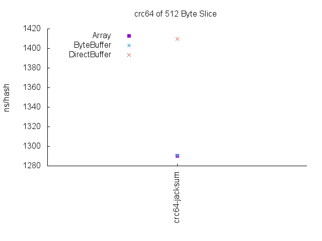

| Algorithm |  Array | ByteBuffer | DirectBuffer |
| --- | ---: | ---: | ---: | 
| [crc64-jacksum](#crc64-jacksum-latency) | 1290.341730 | 1290.742717 | 1409.780113 |

---
### 512 Byte Slice Latency (crc8)

| Algorithm |  Array | ByteBuffer | DirectBuffer |
| --- | ---: | ---: | ---: | 
| [crc8-jacksum](#crc8-jacksum-latency) | 981.606094 | 944.866863 | 1099.773342 |

---
### 512 Byte Slice Latency (ed2k)
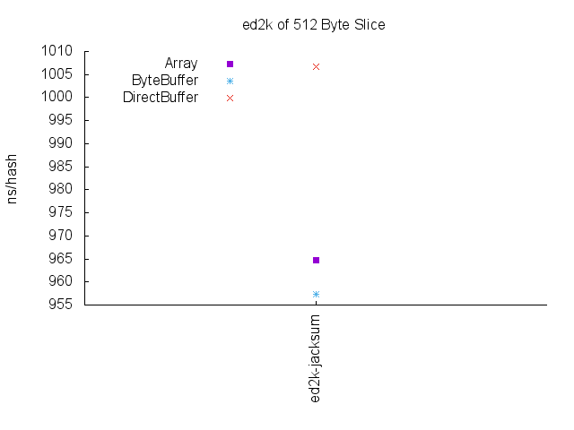

| Algorithm |  Array | ByteBuffer | DirectBuffer |
| --- | ---: | ---: | ---: | 
| [ed2k-jacksum](#ed2k-jacksum-latency) | 964.715123 | 957.373184 | 1006.737553 |

---
### 512 Byte Slice Latency (elf)
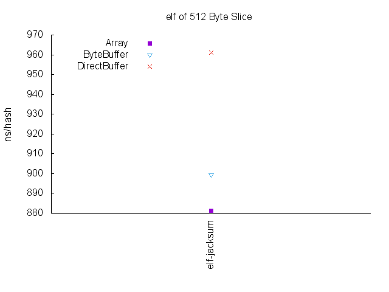

| Algorithm |  Array | ByteBuffer | DirectBuffer |
| --- | ---: | ---: | ---: | 
| [elf-jacksum](#elf-jacksum-latency) | 881.303186 | 899.356532 | 961.062103 |

---
### 512 Byte Slice Latency (farmna)
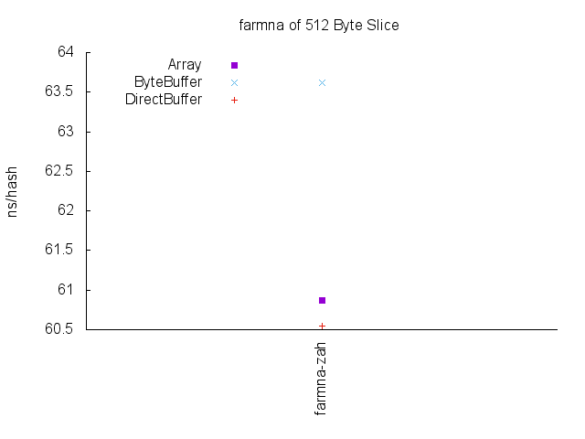

| Algorithm |  Array | ByteBuffer | DirectBuffer |
| --- | ---: | ---: | ---: | 
| [farmna-zah](#farmna-zah-latency) | 60.867004 | 63.622633 | 60.551324 |

---
### 512 Byte Slice Latency (farmuo)
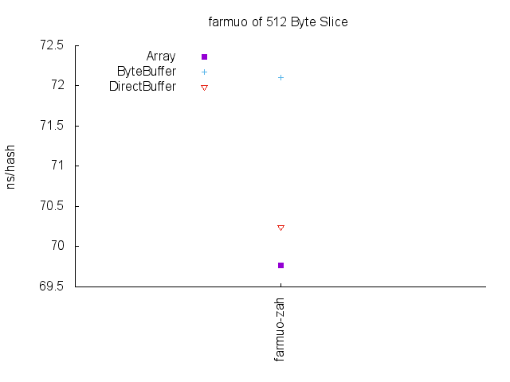

| Algorithm |  Array | ByteBuffer | DirectBuffer |
| --- | ---: | ---: | ---: | 
| [farmuo-zah](#farmuo-zah-latency) | 69.770417 | 72.107689 | 70.237873 |

---
### 512 Byte Slice Latency (fcs16)
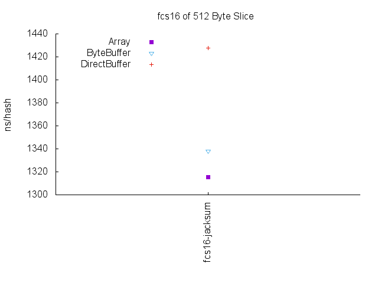

| Algorithm |  Array | ByteBuffer | DirectBuffer |
| --- | ---: | ---: | ---: | 
| [fcs16-jacksum](#fcs16-jacksum-latency) | 1315.377454 | 1338.043163 | 1427.876643 |

---
### 512 Byte Slice Latency (gfh32)
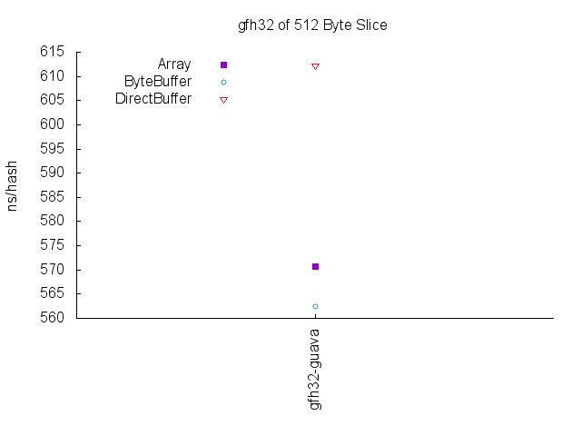

| Algorithm |  Array | ByteBuffer | DirectBuffer |
| --- | ---: | ---: | ---: | 
| [gfh32-guava](#gfh32-guava-latency) | 570.628088 | 562.417285 | 612.120125 |

---
### 512 Byte Slice Latency (gfh64)
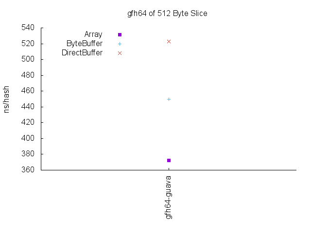

| Algorithm |  Array | ByteBuffer | DirectBuffer |
| --- | ---: | ---: | ---: | 
| [gfh64-guava](#gfh64-guava-latency) | 372.539307 | 449.730059 | 522.796433 |

---
### 512 Byte Slice Latency (gost)
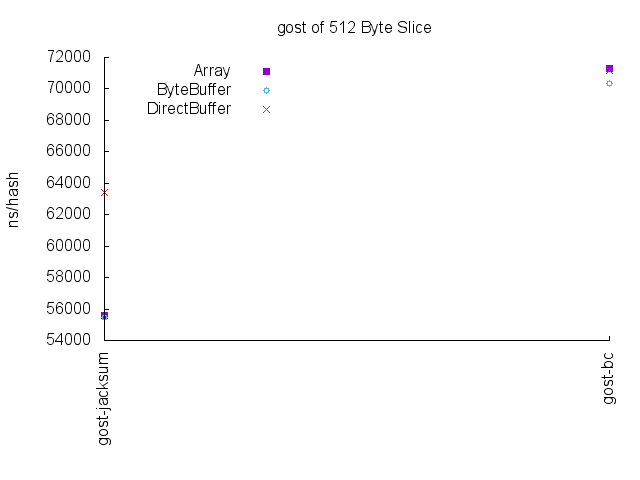

| Algorithm |  Array | ByteBuffer | DirectBuffer |
| --- | ---: | ---: | ---: | 
| [gost-jacksum](#gost-jacksum-latency) | 55596.653765 | 55491.380685 | 63427.091369 |
| [gost-bc](#gost-bc-latency) | 71319.207921 | 70372.810431 | 71175.135321 |

---
### 512 Byte Slice Latency (has160)
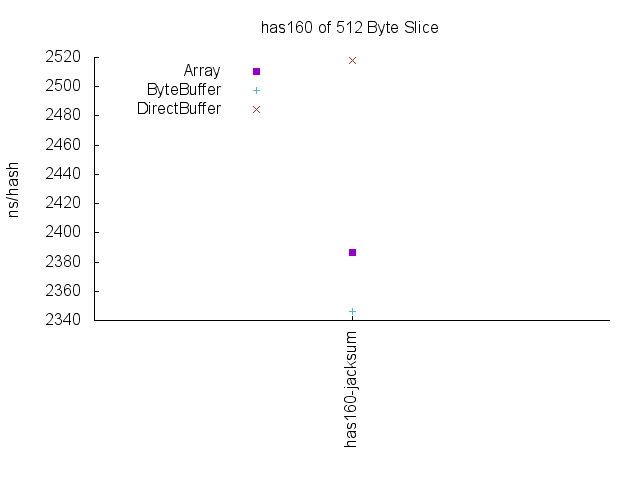

| Algorithm |  Array | ByteBuffer | DirectBuffer |
| --- | ---: | ---: | ---: | 
| [has160-jacksum](#has160-jacksum-latency) | 2386.303497 | 2346.041361 | 2517.890998 |

---
### 512 Byte Slice Latency (haval128h3)
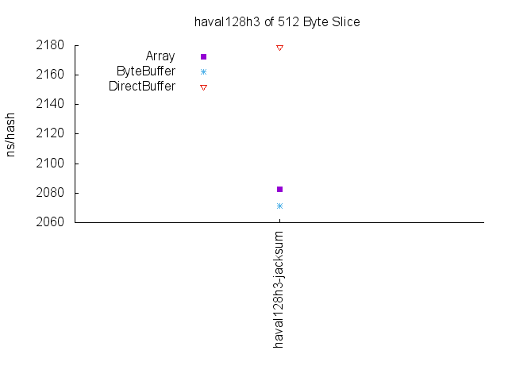

| Algorithm |  Array | ByteBuffer | DirectBuffer |
| --- | ---: | ---: | ---: | 
| [haval128h3-jacksum](#haval128h3-jacksum-latency) | 2082.365879 | 2071.143273 | 2179.012040 |

---
### 512 Byte Slice Latency (haval128h4)
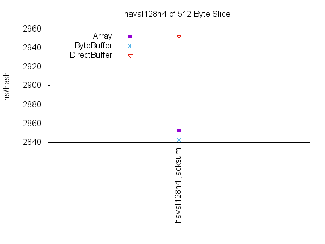

| Algorithm |  Array | ByteBuffer | DirectBuffer |
| --- | ---: | ---: | ---: | 
| [haval128h4-jacksum](#haval128h4-jacksum-latency) | 2853.047014 | 2842.475111 | 2952.678429 |

---
### 512 Byte Slice Latency (haval128h5)
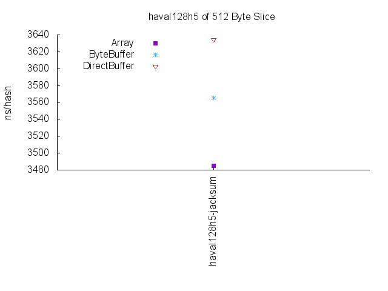

| Algorithm |  Array | ByteBuffer | DirectBuffer |
| --- | ---: | ---: | ---: | 
| [haval128h5-jacksum](#haval128h5-jacksum-latency) | 3484.895473 | 3565.466573 | 3633.920006 |

---
### 512 Byte Slice Latency (haval160h3)
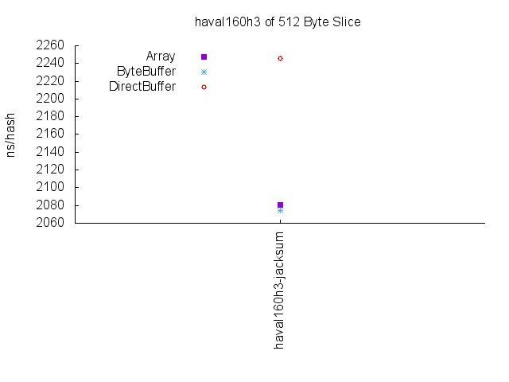

| Algorithm |  Array | ByteBuffer | DirectBuffer |
| --- | ---: | ---: | ---: | 
| [haval160h3-jacksum](#haval160h3-jacksum-latency) | 2080.797159 | 2074.582796 | 2245.328346 |

---
### 512 Byte Slice Latency (haval160h4)
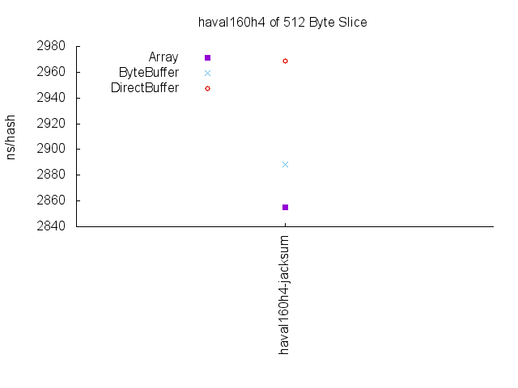

| Algorithm |  Array | ByteBuffer | DirectBuffer |
| --- | ---: | ---: | ---: | 
| [haval160h4-jacksum](#haval160h4-jacksum-latency) | 2854.944542 | 2888.416138 | 2968.585491 |

---
### 512 Byte Slice Latency (haval160h5)
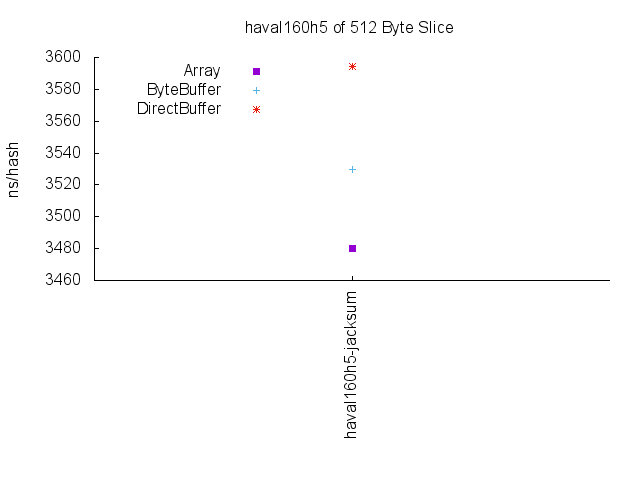

| Algorithm |  Array | ByteBuffer | DirectBuffer |
| --- | ---: | ---: | ---: | 
| [haval160h5-jacksum](#haval160h5-jacksum-latency) | 3479.871937 | 3529.890485 | 3594.552166 |

---
### 512 Byte Slice Latency (haval192h3)
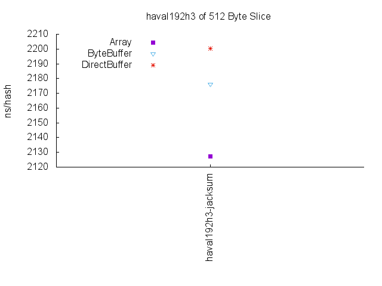

| Algorithm |  Array | ByteBuffer | DirectBuffer |
| --- | ---: | ---: | ---: | 
| [haval192h3-jacksum](#haval192h3-jacksum-latency) | 2127.235342 | 2176.089595 | 2200.349693 |

---
### 512 Byte Slice Latency (haval192h4)
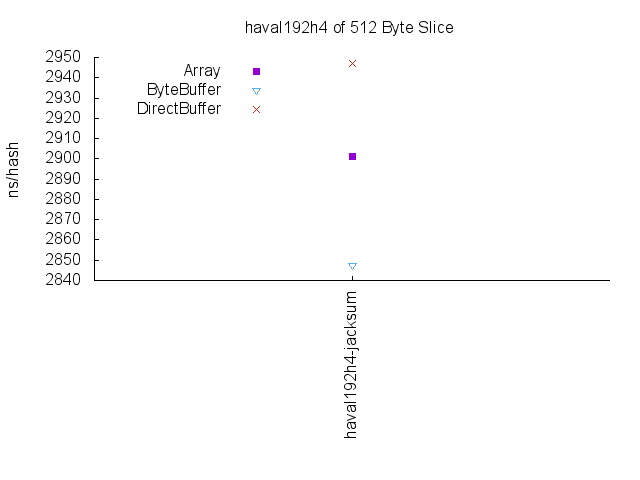

| Algorithm |  Array | ByteBuffer | DirectBuffer |
| --- | ---: | ---: | ---: | 
| [haval192h4-jacksum](#haval192h4-jacksum-latency) | 2901.149250 | 2847.583678 | 2946.891417 |

---
### 512 Byte Slice Latency (haval192h5)
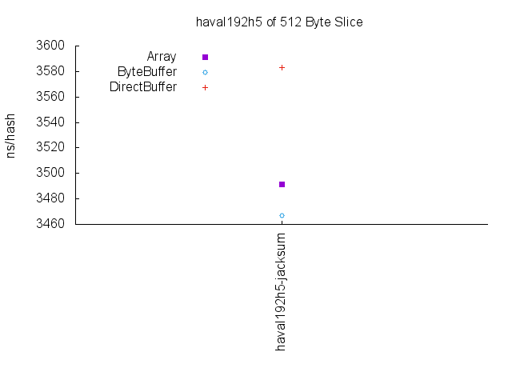

| Algorithm |  Array | ByteBuffer | DirectBuffer |
| --- | ---: | ---: | ---: | 
| [haval192h5-jacksum](#haval192h5-jacksum-latency) | 3491.181189 | 3466.945890 | 3582.881844 |

---
### 512 Byte Slice Latency (haval224h3)
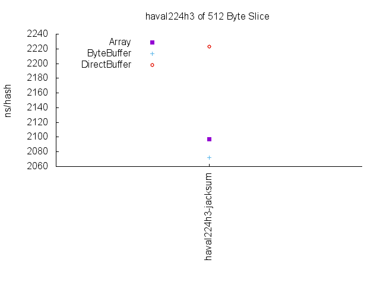

| Algorithm |  Array | ByteBuffer | DirectBuffer |
| --- | ---: | ---: | ---: | 
| [haval224h3-jacksum](#haval224h3-jacksum-latency) | 2097.131689 | 2071.831073 | 2222.664531 |

---
### 512 Byte Slice Latency (haval224h4)
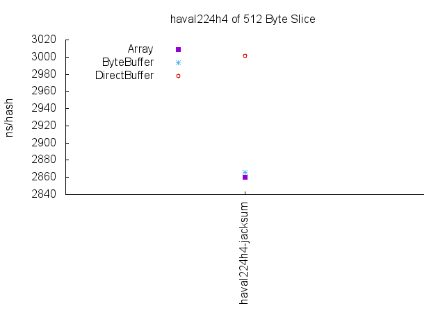

| Algorithm |  Array | ByteBuffer | DirectBuffer |
| --- | ---: | ---: | ---: | 
| [haval224h4-jacksum](#haval224h4-jacksum-latency) | 2859.780433 | 2866.115332 | 3001.039283 |

---
### 512 Byte Slice Latency (haval224h5)
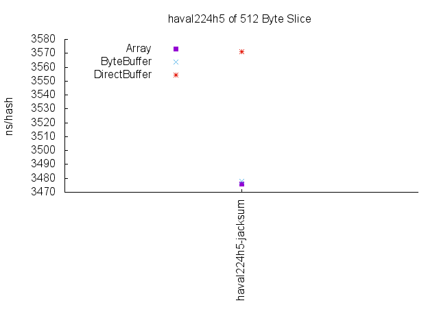

| Algorithm |  Array | ByteBuffer | DirectBuffer |
| --- | ---: | ---: | ---: | 
| [haval224h5-jacksum](#haval224h5-jacksum-latency) | 3476.155542 | 3477.686494 | 3571.073880 |

---
### 512 Byte Slice Latency (haval256h3)
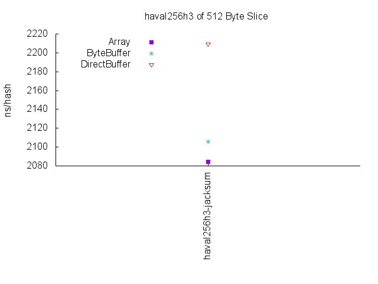

| Algorithm |  Array | ByteBuffer | DirectBuffer |
| --- | ---: | ---: | ---: | 
| [haval256h3-jacksum](#haval256h3-jacksum-latency) | 2084.368553 | 2105.692593 | 2209.218791 |

---
### 512 Byte Slice Latency (haval256h4)
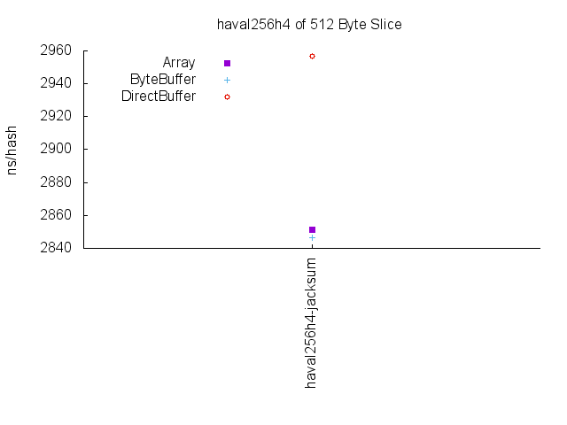

| Algorithm |  Array | ByteBuffer | DirectBuffer |
| --- | ---: | ---: | ---: | 
| [haval256h4-jacksum](#haval256h4-jacksum-latency) | 2851.550830 | 2846.722312 | 2956.884459 |

---
### 512 Byte Slice Latency (haval256h5)
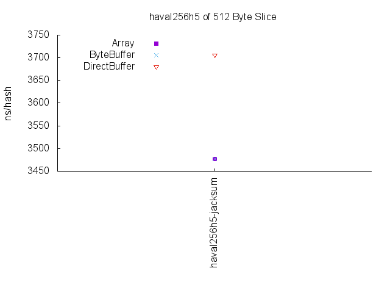

| Algorithm |  Array | ByteBuffer | DirectBuffer |
| --- | ---: | ---: | ---: | 
| [haval256h5-jacksum](#haval256h5-jacksum-latency) | 3476.992815 | 3477.409043 | 3705.798165 |

---
### 512 Byte Slice Latency (md2)
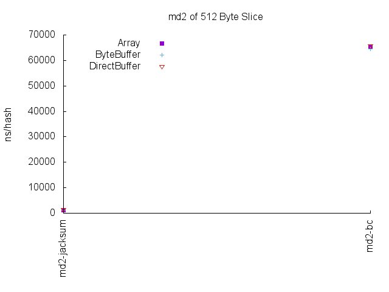

| Algorithm |  Array | ByteBuffer | DirectBuffer |
| --- | ---: | ---: | ---: | 
| [md2-jacksum](#md2-jacksum-latency) | 1238.850148 | 1238.610218 | 1323.075819 |
| [md2-bc](#md2-bc-latency) | 65572.288221 | 64516.454120 | 65662.676884 |

---
### 512 Byte Slice Latency (md4)
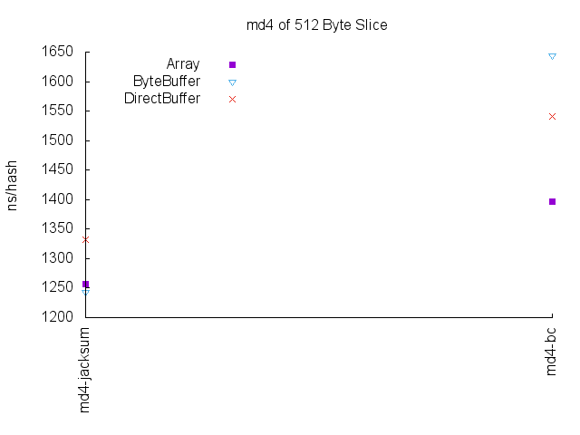

| Algorithm |  Array | ByteBuffer | DirectBuffer |
| --- | ---: | ---: | ---: | 
| [md4-jacksum](#md4-jacksum-latency) | 1256.801513 | 1242.398067 | 1331.836420 |
| [md4-bc](#md4-bc-latency) | 1396.287709 | 1643.946140 | 1541.340106 |

---
### 512 Byte Slice Latency (md5)
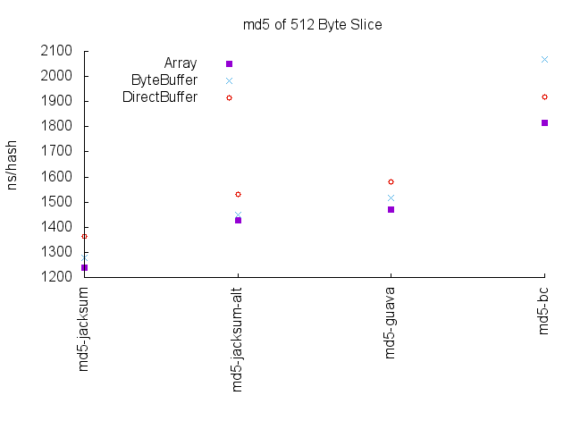

| Algorithm |  Array | ByteBuffer | DirectBuffer |
| --- | ---: | ---: | ---: | 
| [md5-jacksum](#md5-jacksum-latency) | 1239.402118 | 1278.315417 | 1362.038417 |
| [md5-jacksum-alt](#md5-jacksum-alt-latency) | 1429.253324 | 1447.785406 | 1529.625632 |
| [md5-guava](#md5-guava-latency) | 1469.236528 | 1515.072844 | 1581.897338 |
| [md5-bc](#md5-bc-latency) | 1816.446229 | 2069.477040 | 1918.580813 |

---
### 512 Byte Slice Latency (murmur3h128)
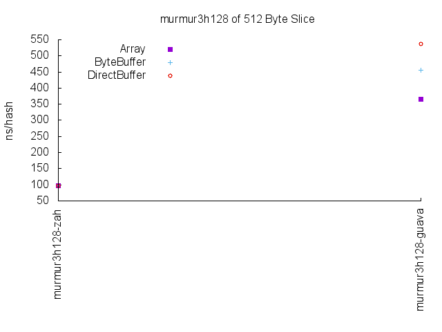

| Algorithm |  Array | ByteBuffer | DirectBuffer |
| --- | ---: | ---: | ---: | 
| [murmur3h128-zah](#murmur3h128-zah-latency) | 98.271901 | 97.415523 | 96.679660 |
| [murmur3h128-guava](#murmur3h128-guava-latency) | 365.927712 | 454.744841 | 536.996673 |

---
### 512 Byte Slice Latency (murmur3h32)
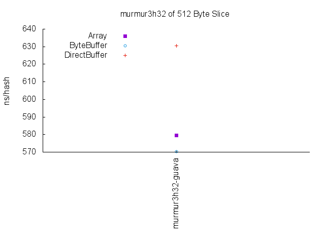

| Algorithm |  Array | ByteBuffer | DirectBuffer |
| --- | ---: | ---: | ---: | 
| [murmur3h32-guava](#murmur3h32-guava-latency) | 579.463487 | 570.400044 | 630.370367 |

---
### 512 Byte Slice Latency (ripemd128)

| Algorithm |  Array | ByteBuffer | DirectBuffer |
| --- | ---: | ---: | ---: | 
| [ripemd128-bc](#ripemd128-bc-latency) | 2009.904304 | 2262.339146 | 2151.430854 |
| [ripemd128-jacksum](#ripemd128-jacksum-latency) | 2198.267822 | 2219.396566 | 2271.665214 |

---
### 512 Byte Slice Latency (ripemd160)
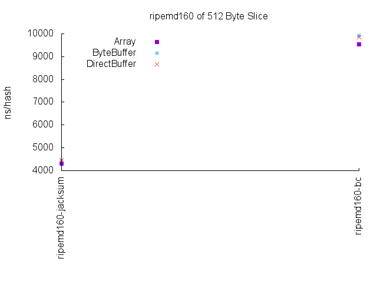

| Algorithm |  Array | ByteBuffer | DirectBuffer |
| --- | ---: | ---: | ---: | 
| [ripemd160-jacksum](#ripemd160-jacksum-latency) | 4318.144853 | 4457.021525 | 4452.159598 |
| [ripemd160-bc](#ripemd160-bc-latency) | 9538.095458 | 9923.257780 | 9838.279752 |

---
### 512 Byte Slice Latency (ripemd256)

| Algorithm |  Array | ByteBuffer | DirectBuffer |
| --- | ---: | ---: | ---: | 
| [ripemd256-jacksum](#ripemd256-jacksum-latency) | 2025.056689 | 1993.426911 | 2147.309462 |
| [ripemd256-bc](#ripemd256-bc-latency) | 2164.842757 | 2214.297569 | 2324.868401 |

---
### 512 Byte Slice Latency (ripemd320)
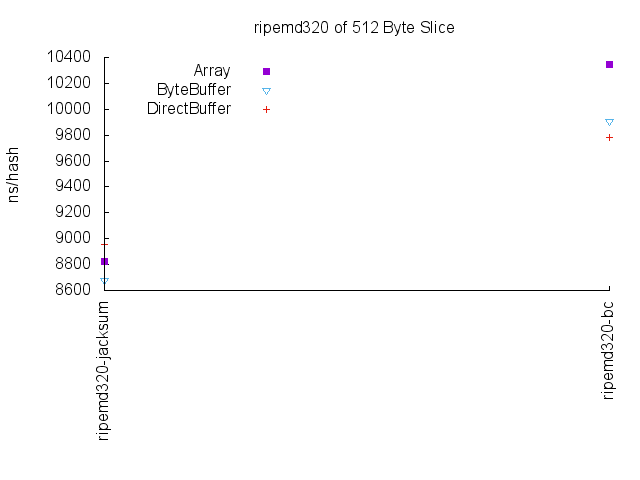

| Algorithm |  Array | ByteBuffer | DirectBuffer |
| --- | ---: | ---: | ---: | 
| [ripemd320-jacksum](#ripemd320-jacksum-latency) | 8826.423105 | 8675.551743 | 8955.934613 |
| [ripemd320-bc](#ripemd320-bc-latency) | 10346.011929 | 9906.668624 | 9785.519035 |

---
### 512 Byte Slice Latency (sha0)
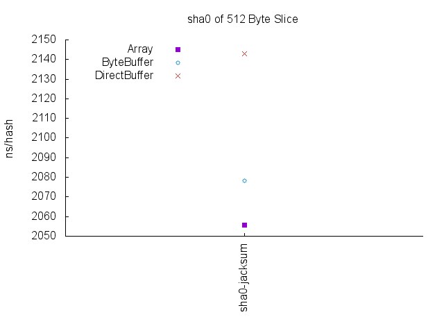

| Algorithm |  Array | ByteBuffer | DirectBuffer |
| --- | ---: | ---: | ---: | 
| [sha0-jacksum](#sha0-jacksum-latency) | 2055.613129 | 2078.403367 | 2142.795679 |

---
### 512 Byte Slice Latency (sha1)
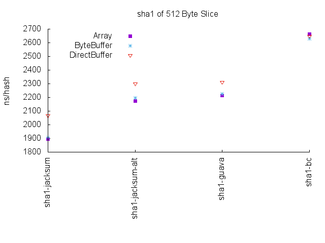

| Algorithm |  Array | ByteBuffer | DirectBuffer |
| --- | ---: | ---: | ---: | 
| [sha1-jacksum](#sha1-jacksum-latency) | 1894.684994 | 1909.197192 | 2068.011241 |
| [sha1-jacksum-alt](#sha1-jacksum-alt-latency) | 2173.384320 | 2197.369861 | 2298.805383 |
| [sha1-guava](#sha1-guava-latency) | 2213.794600 | 2227.388851 | 2310.486970 |
| [sha1-bc](#sha1-bc-latency) | 2664.690172 | 2628.933959 | 2647.546082 |

---
### 512 Byte Slice Latency (sha224)
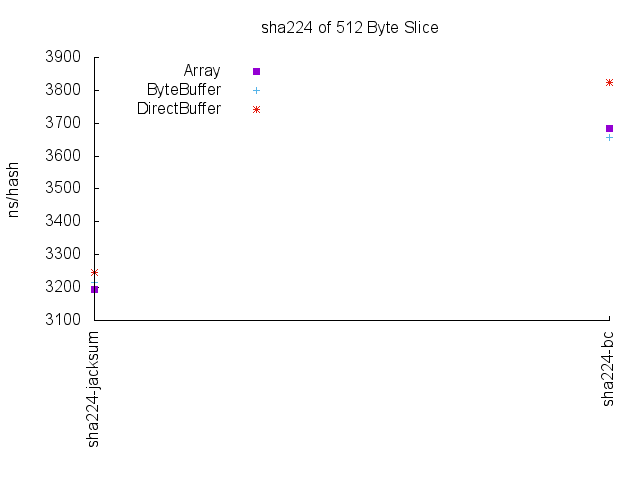

| Algorithm |  Array | ByteBuffer | DirectBuffer |
| --- | ---: | ---: | ---: | 
| [sha224-jacksum](#sha224-jacksum-latency) | 3193.523939 | 3215.357327 | 3247.441326 |
| [sha224-bc](#sha224-bc-latency) | 3685.181884 | 3656.670748 | 3824.320105 |

---
### 512 Byte Slice Latency (sha256)
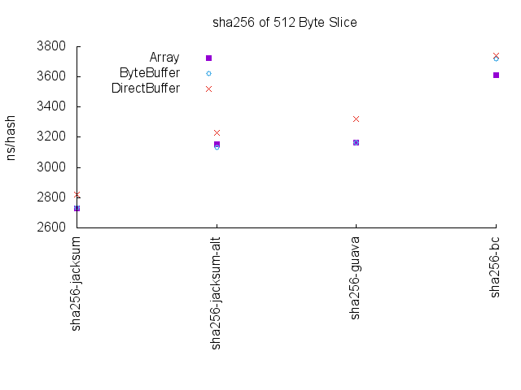

| Algorithm |  Array | ByteBuffer | DirectBuffer |
| --- | ---: | ---: | ---: | 
| [sha256-jacksum](#sha256-jacksum-latency) | 2729.615109 | 2732.801974 | 2819.309391 |
| [sha256-jacksum-alt](#sha256-jacksum-alt-latency) | 3155.373272 | 3135.362109 | 3230.758683 |
| [sha256-guava](#sha256-guava-latency) | 3164.954196 | 3163.760432 | 3318.951548 |
| [sha256-bc](#sha256-bc-latency) | 3613.390007 | 3716.719013 | 3739.987120 |

---
### 512 Byte Slice Latency (sha3)
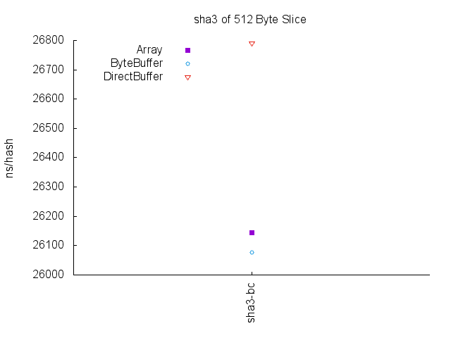

| Algorithm |  Array | ByteBuffer | DirectBuffer |
| --- | ---: | ---: | ---: | 
| [sha3-bc](#sha3-bc-latency) | 26145.106850 | 26077.381685 | 26789.865299 |

---
### 512 Byte Slice Latency (sha384)
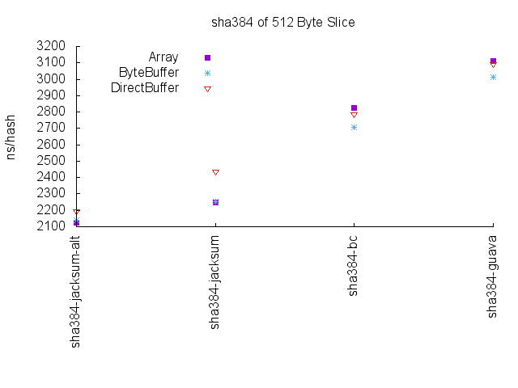

| Algorithm |  Array | ByteBuffer | DirectBuffer |
| --- | ---: | ---: | ---: | 
| [sha384-jacksum-alt](#sha384-jacksum-alt-latency) | 2127.047541 | 2138.210604 | 2194.417674 |
| [sha384-jacksum](#sha384-jacksum-latency) | 2248.947885 | 2254.616372 | 2435.706127 |
| [sha384-bc](#sha384-bc-latency) | 2827.445202 | 2708.213756 | 2785.106434 |
| [sha384-guava](#sha384-guava-latency) | 3113.161779 | 3010.421268 | 3091.964538 |

---
### 512 Byte Slice Latency (sha512)
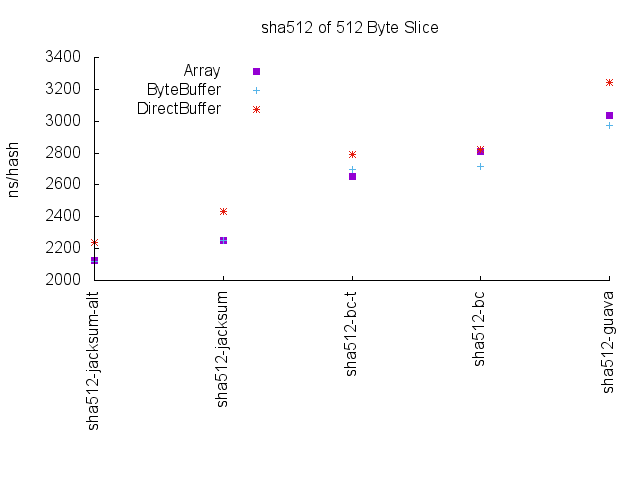

| Algorithm |  Array | ByteBuffer | DirectBuffer |
| --- | ---: | ---: | ---: | 
| [sha512-jacksum-alt](#sha512-jacksum-alt-latency) | 2122.899995 | 2117.126492 | 2241.533837 |
| [sha512-jacksum](#sha512-jacksum-latency) | 2252.926501 | 2251.502958 | 2430.324202 |
| [sha512-bc-t](#sha512-bc-t-latency) | 2651.644842 | 2699.618052 | 2789.668874 |
| [sha512-bc](#sha512-bc-latency) | 2811.479111 | 2715.074652 | 2822.243705 |
| [sha512-guava](#sha512-guava-latency) | 3038.562518 | 2975.691499 | 3245.565762 |

---
### 512 Byte Slice Latency (sip)
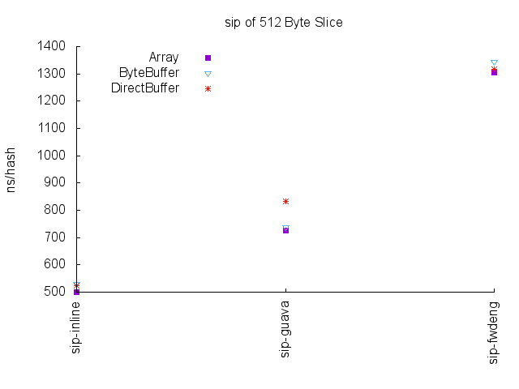

| Algorithm |  Array | ByteBuffer | DirectBuffer |
| --- | ---: | ---: | ---: | 
| [sip-inline](#sip-inline-latency) | 501.054790 | 528.702971 | 522.946182 |
| [sip-guava](#sip-guava-latency) | 726.109760 | 737.647059 | 832.549302 |
| [sip-fwdeng](#sip-fwdeng-latency) | 1303.526293 | 1344.293500 | 1316.223162 |

---
### 512 Byte Slice Latency (skein1024)
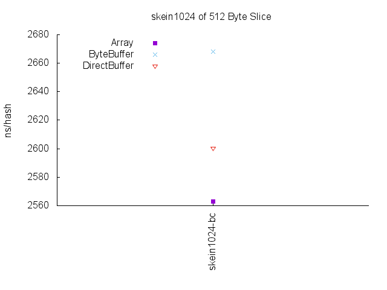

| Algorithm |  Array | ByteBuffer | DirectBuffer |
| --- | ---: | ---: | ---: | 
| [skein1024-bc](#skein1024-bc-latency) | 2562.839289 | 2667.936618 | 2600.276996 |

---
### 512 Byte Slice Latency (skein256)
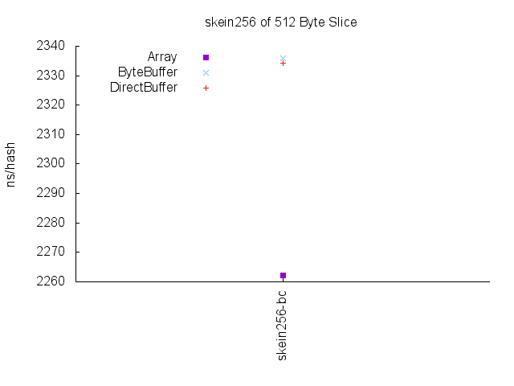

| Algorithm |  Array | ByteBuffer | DirectBuffer |
| --- | ---: | ---: | ---: | 
| [skein256-bc](#skein256-bc-latency) | 2262.145232 | 2335.781075 | 2334.138273 |

---
### 512 Byte Slice Latency (skein512)
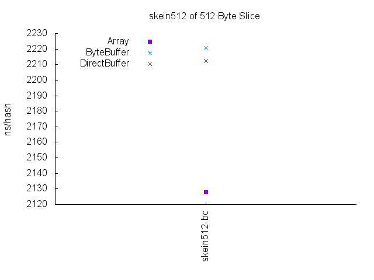

| Algorithm |  Array | ByteBuffer | DirectBuffer |
| --- | ---: | ---: | ---: | 
| [skein512-bc](#skein512-bc-latency) | 2127.826411 | 2220.708475 | 2212.301455 |

---
### 512 Byte Slice Latency (sm3)
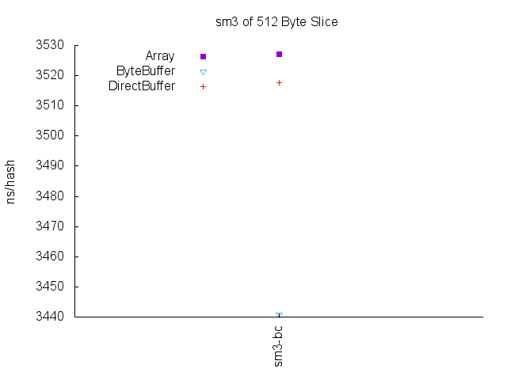

| Algorithm |  Array | ByteBuffer | DirectBuffer |
| --- | ---: | ---: | ---: | 
| [sm3-bc](#sm3-bc-latency) | 3527.197396 | 3440.853847 | 3517.541049 |

---
### 512 Byte Slice Latency (sum16)

| Algorithm |  Array | ByteBuffer | DirectBuffer |
| --- | ---: | ---: | ---: | 
| [sum16-jacksum](#sum16-jacksum-latency) | 153.620772 | 154.154775 | 211.250651 |

---
### 512 Byte Slice Latency (sum24)

| Algorithm |  Array | ByteBuffer | DirectBuffer |
| --- | ---: | ---: | ---: | 
| [sum24-jacksum](#sum24-jacksum-latency) | 152.573620 | 156.647188 | 209.786959 |

---
### 512 Byte Slice Latency (sum32)
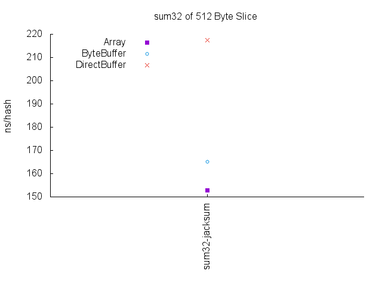

| Algorithm |  Array | ByteBuffer | DirectBuffer |
| --- | ---: | ---: | ---: | 
| [sum32-jacksum](#sum32-jacksum-latency) | 152.818536 | 165.053443 | 217.483782 |

---
### 512 Byte Slice Latency (sum8)
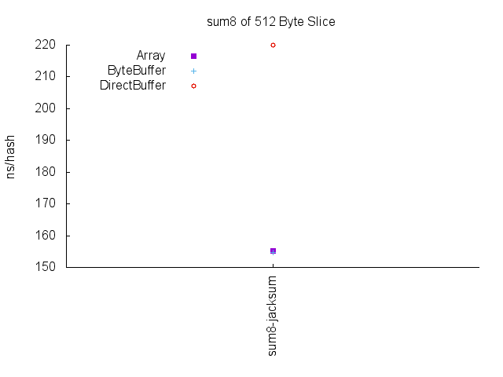

| Algorithm |  Array | ByteBuffer | DirectBuffer |
| --- | ---: | ---: | ---: | 
| [sum8-jacksum](#sum8-jacksum-latency) | 155.236700 | 154.621885 | 219.891631 |

---
### 512 Byte Slice Latency (sumbsd)
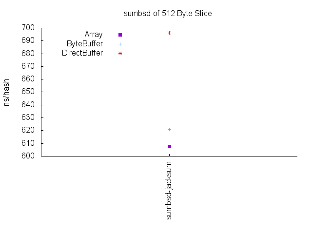

| Algorithm |  Array | ByteBuffer | DirectBuffer |
| --- | ---: | ---: | ---: | 
| [sumbsd-jacksum](#sumbsd-jacksum-latency) | 607.677076 | 621.102501 | 696.210238 |

---
### 512 Byte Slice Latency (sumsysv)

| Algorithm |  Array | ByteBuffer | DirectBuffer |
| --- | ---: | ---: | ---: | 
| [sumsysv-jacksum](#sumsysv-jacksum-latency) | 154.109715 | 155.403570 | 225.207782 |

---
### 512 Byte Slice Latency (tiger)
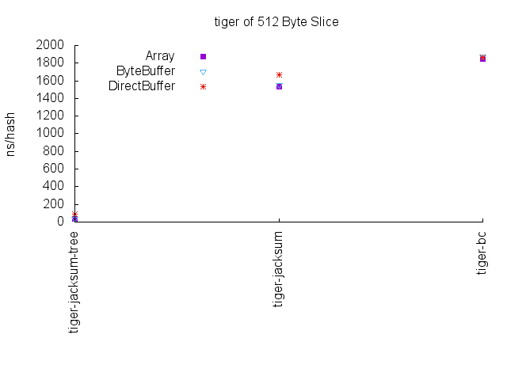

| Algorithm |  Array | ByteBuffer | DirectBuffer |
| --- | ---: | ---: | ---: | 
| [tiger-jacksum-tree](#tiger-jacksum-tree-latency) | 35.736062 | 36.781896 | 92.957105 |
| [tiger-jacksum](#tiger-jacksum-latency) | 1536.626050 | 1554.161804 | 1668.308340 |
| [tiger-bc](#tiger-bc-latency) | 1846.524279 | 1878.908775 | 1865.407438 |

---
### 512 Byte Slice Latency (tiger128)
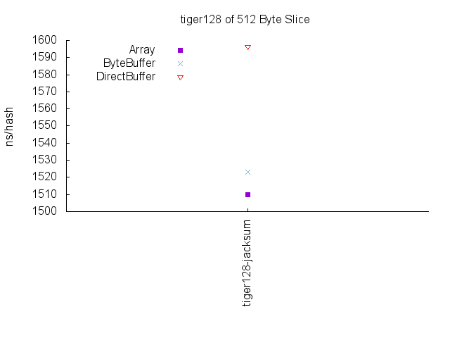

| Algorithm |  Array | ByteBuffer | DirectBuffer |
| --- | ---: | ---: | ---: | 
| [tiger128-jacksum](#tiger128-jacksum-latency) | 1509.672594 | 1523.208649 | 1596.274867 |

---
### 512 Byte Slice Latency (tiger160)
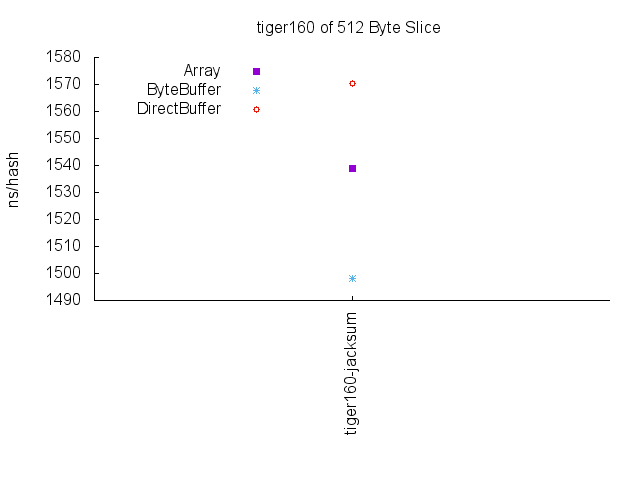

| Algorithm |  Array | ByteBuffer | DirectBuffer |
| --- | ---: | ---: | ---: | 
| [tiger160-jacksum](#tiger160-jacksum-latency) | 1538.954170 | 1498.279644 | 1570.478425 |

---
### 512 Byte Slice Latency (tiger2)
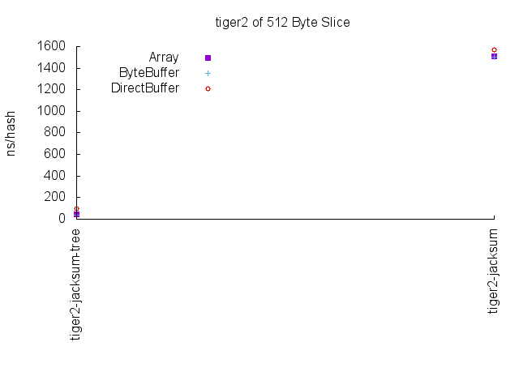

| Algorithm |  Array | ByteBuffer | DirectBuffer |
| --- | ---: | ---: | ---: | 
| [tiger2-jacksum-tree](#tiger2-jacksum-tree-latency) | 48.292336 | 36.689362 | 95.338044 |
| [tiger2-jacksum](#tiger2-jacksum-latency) | 1508.675028 | 1499.225492 | 1568.578034 |

---
### 512 Byte Slice Latency (whirlpool0)
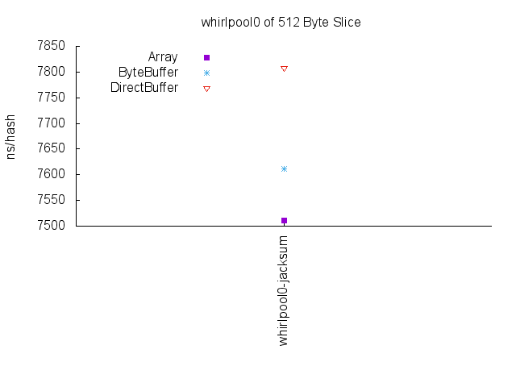

| Algorithm |  Array | ByteBuffer | DirectBuffer |
| --- | ---: | ---: | ---: | 
| [whirlpool0-jacksum](#whirlpool0-jacksum-latency) | 7511.591465 | 7611.339759 | 7807.501981 |

---
### 512 Byte Slice Latency (whirlpool1)

| Algorithm |  Array | ByteBuffer | DirectBuffer |
| --- | ---: | ---: | ---: | 
| [whirlpool1-jacksum](#whirlpool1-jacksum-latency) | 7526.689865 | 7810.942690 | 7906.165514 |

---
### 512 Byte Slice Latency (whirlpool2)
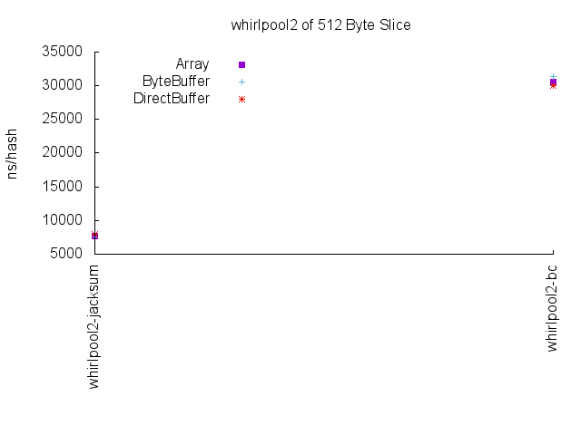

| Algorithm |  Array | ByteBuffer | DirectBuffer |
| --- | ---: | ---: | ---: | 
| [whirlpool2-jacksum](#whirlpool2-jacksum-latency) | 7626.596560 | 7536.595077 | 7987.130736 |
| [whirlpool2-bc](#whirlpool2-bc-latency) | 30523.729149 | 31388.141528 | 30079.471281 |

---
### 512 Byte Slice Latency (xor8)

| Algorithm |  Array | ByteBuffer | DirectBuffer |
| --- | ---: | ---: | ---: | 
| [xor8-jacksum](#xor8-jacksum-latency) | 159.208858 | 155.525975 | 208.018888 |

---
### 512 Byte Slice Latency (xxh32)
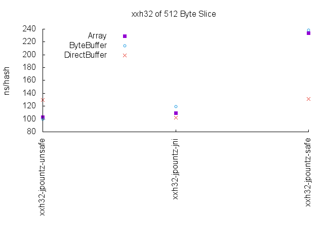

| Algorithm |  Array | ByteBuffer | DirectBuffer |
| --- | ---: | ---: | ---: | 
| [xxh32-jpountz-unsafe](#xxh32-jpountz-unsafe-latency) | 102.609195 | 99.509120 | 129.674785 |
| [xxh32-jpountz-jni](#xxh32-jpountz-jni-latency) | 108.804278 | 119.280746 | 102.275736 |
| [xxh32-jpountz-safe](#xxh32-jpountz-safe-latency) | 233.550211 | 238.202337 | 131.298480 |

---
### 512 Byte Slice Latency (xxh64)
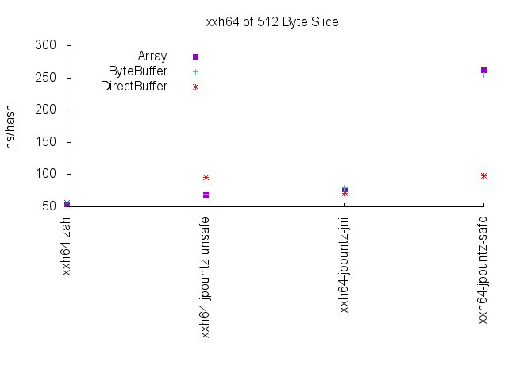

| Algorithm |  Array | ByteBuffer | DirectBuffer |
| --- | ---: | ---: | ---: | 
| [xxh64-zah](#xxh64-zah-latency) | 54.173173 | 57.009608 | 56.746202 |
| [xxh64-jpountz-unsafe](#xxh64-jpountz-unsafe-latency) | 68.061547 | 68.952579 | 95.897739 |
| [xxh64-jpountz-jni](#xxh64-jpountz-jni-latency) | 77.120173 | 79.010407 | 70.784956 |
| [xxh64-jpountz-safe](#xxh64-jpountz-safe-latency) | 261.340423 | 254.371295 | 97.476778 |

---
### 2048 Byte Slice Latency (All Hashes)

| Algorithm |  Array | ByteBuffer | DirectBuffer |
| --- | ---: | ---: | ---: | 
| [xxh64-zah](#xxh64-zah-latency) | 171.053692 | 178.464064 | 173.499855 |
| [crc32-jre](#crc32-jre-latency) | 188.562803 | 202.169559 | 211.371477 |
| [xxh64-jpountz-jni](#xxh64-jpountz-jni-latency) | 191.421272 | 189.584197 | 179.477872 |
| [crc32-jacksum-delegating](#crc32-jacksum-delegating-latency) | 206.439796 | 203.216601 | 445.283629 |
| [farmna-zah](#farmna-zah-latency) | 208.719047 | 209.671228 | 202.337150 |
| [xxh64-jpountz-unsafe](#xxh64-jpountz-unsafe-latency) | 213.141728 | 208.549035 | 273.978135 |
| [crc32-guava-delegating](#crc32-guava-delegating-latency) | 217.718031 | 221.913027 | 457.108426 |
| [city64-zah](#city64-zah-latency) | 226.574536 | 220.390593 | 222.950013 |
| [farmuo-zah](#farmuo-zah-latency) | 244.041325 | 245.787256 | 244.129301 |
| [xxh32-jpountz-unsafe](#xxh32-jpountz-unsafe-latency) | 322.034960 | 324.484844 | 446.085015 |
| [xxh32-jpountz-jni](#xxh32-jpountz-jni-latency) | 328.498221 | 341.500726 | 329.404169 |
| [murmur3h128-zah](#murmur3h128-zah-latency) | 363.464001 | 368.455891 | 379.737144 |
| [sum32-jacksum](#sum32-jacksum-latency) | 582.426823 | 593.781158 | 906.281918 |
| [sumsysv-jacksum](#sumsysv-jacksum-latency) | 584.544391 | 611.486724 | 964.002204 |
| [xor8-jacksum](#xor8-jacksum-latency) | 585.807937 | 586.894836 | 896.589664 |
| [sum24-jacksum](#sum24-jacksum-latency) | 589.951658 | 603.009492 | 873.966883 |
| [sum8-jacksum](#sum8-jacksum-latency) | 594.449558 | 592.322384 | 862.241060 |
| [sum16-jacksum](#sum16-jacksum-latency) | 604.723983 | 603.185412 | 907.505875 |
| [adler32-jre](#adler32-jre-latency) | 696.348290 | 697.232569 | 672.719813 |
| [adler32-jacksum-delegating](#adler32-jacksum-delegating-latency) | 697.548854 | 698.760890 | 1018.304514 |
| [adler32-guava](#adler32-guava-latency) | 721.447819 | 709.319126 | 1077.842026 |
| [xxh32-jpountz-safe](#xxh32-jpountz-safe-latency) | 908.723718 | 956.047806 | 436.988791 |
| [xxh64-jpountz-safe](#xxh64-jpountz-safe-latency) | 1031.682640 | 985.398496 | 278.585199 |
| [gfh64-guava](#gfh64-guava-latency) | 1373.775977 | 1669.349690 | 2206.587240 |
| [murmur3h128-guava](#murmur3h128-guava-latency) | 1374.448792 | 1404.891252 | 1748.278050 |
| [murmur3h32-guava](#murmur3h32-guava-latency) | 1893.124224 | 1863.441433 | 2140.750350 |
| [gfh32-guava](#gfh32-guava-latency) | 1962.750225 | 2027.869104 | 2103.684847 |
| [sip-inline](#sip-inline-latency) | 2008.121525 | 2159.966842 | 2274.129989 |
| [sumbsd-jacksum](#sumbsd-jacksum-latency) | 2423.104141 | 2512.261781 | 2859.546409 |
| [sip-guava](#sip-guava-latency) | 2681.484149 | 2680.280693 | 3020.471944 |
| [elf-jacksum](#elf-jacksum-latency) | 3543.414189 | 3602.052448 | 4028.999007 |
| [ed2k-jacksum](#ed2k-jacksum-latency) | 3766.168842 | 3704.363513 | 4009.910734 |
| [crc8-jacksum](#crc8-jacksum-latency) | 3930.494915 | 3929.622768 | 4443.592252 |
| [crc16-jacksum](#crc16-jacksum-latency) | 4600.102095 | 4595.303511 | 5171.955134 |
| [crc32-guava-rfc3720](#crc32-guava-rfc3720-latency) | 4680.635004 | 4731.046770 | 5096.333853 |
| [crc32-jacksum-fcs32](#crc32-jacksum-fcs32-latency) | 4782.645178 | 4840.327642 | 5447.994639 |
| [md5-jacksum](#md5-jacksum-latency) | 4913.892861 | 4920.629492 | 5417.021652 |
| [md2-jacksum](#md2-jacksum-latency) | 4920.154198 | 4919.058545 | 5434.947067 |
| [md4-jacksum](#md4-jacksum-latency) | 4999.317302 | 4999.474243 | 5417.162067 |
| [md4-bc](#md4-bc-latency) | 5131.005409 | 6097.044873 | 5803.917014 |
| [crc64-jacksum](#crc64-jacksum-latency) | 5163.717698 | 5163.604593 | 5657.045530 |
| [md5-guava](#md5-guava-latency) | 5165.649783 | 5348.642571 | 5529.703605 |
| [fcs16-jacksum](#fcs16-jacksum-latency) | 5256.613253 | 5264.648045 | 5813.585179 |
| [crc32-jacksum-mpeg2](#crc32-jacksum-mpeg2-latency) | 5276.160804 | 5276.292644 | 5987.185068 |
| [cksum-jacksum](#cksum-jacksum-latency) | 5367.901037 | 5302.539657 | 5780.929134 |
| [crc32-jacksum-bzip2](#crc32-jacksum-bzip2-latency) | 5642.251492 | 5801.160385 | 6290.875131 |
| [md5-jacksum-alt](#md5-jacksum-alt-latency) | 5696.354425 | 5850.506450 | 6129.496230 |
| [crc24-jacksum](#crc24-jacksum-latency) | 5735.745849 | 5800.694083 | 6487.065463 |
| [tiger2-jacksum](#tiger2-jacksum-latency) | 5969.104635 | 5959.338337 | 6248.480188 |
| [tiger-jacksum](#tiger-jacksum-latency) | 5974.086091 | 6082.912700 | 6396.536859 |
| [tiger160-jacksum](#tiger160-jacksum-latency) | 5978.441319 | 6057.188990 | 6467.379106 |
| [tiger128-jacksum](#tiger128-jacksum-latency) | 5983.469563 | 5972.696108 | 6390.244790 |
| [sip-fwdeng](#sip-fwdeng-latency) | 6088.124004 | 5361.850637 | 5399.694579 |
| [tiger2-jacksum-tree](#tiger2-jacksum-tree-latency) | 6585.876981 | 6600.663960 | 6871.653170 |
| [tiger-jacksum-tree](#tiger-jacksum-tree-latency) | 6594.933233 | 6933.191633 | 6988.504020 |
| [md5-bc](#md5-bc-latency) | 6634.157710 | 7808.592304 | 7352.918831 |
| [tiger-bc](#tiger-bc-latency) | 6760.177310 | 6798.656148 | 6779.394203 |
| [sha1-jacksum](#sha1-jacksum-latency) | 7371.471889 | 7618.318420 | 7887.438042 |
| [ripemd128-bc](#ripemd128-bc-latency) | 7455.025343 | 8064.060499 | 8496.077719 |
| [skein512-bc](#skein512-bc-latency) | 7593.475387 | 7501.177495 | 8154.689646 |
| [sha1-guava](#sha1-guava-latency) | 7724.931316 | 7840.171385 | 8071.956091 |
| [ripemd256-jacksum](#ripemd256-jacksum-latency) | 7845.169270 | 8184.427039 | 8450.913708 |
| [adler32-jacksum-alt](#adler32-jacksum-alt-latency) | 7847.222313 | 8026.303792 | 8601.866320 |
| [ripemd256-bc](#ripemd256-bc-latency) | 7889.392231 | 8065.192977 | 9206.994335 |
| [haval128h3-jacksum](#haval128h3-jacksum-latency) | 8221.653925 | 8217.883637 | 8741.564333 |
| [sha0-jacksum](#sha0-jacksum-latency) | 8240.257648 | 8404.130349 | 8503.486933 |
| [skein256-bc](#skein256-bc-latency) | 8347.115145 | 8630.962604 | 8741.587015 |
| [haval224h3-jacksum](#haval224h3-jacksum-latency) | 8348.687271 | 8612.655930 | 8865.553621 |
| [haval192h3-jacksum](#haval192h3-jacksum-latency) | 8349.520617 | 8471.049996 | 8995.789350 |
| [haval160h3-jacksum](#haval160h3-jacksum-latency) | 8359.029059 | 8230.391740 | 8669.023781 |
| [haval256h3-jacksum](#haval256h3-jacksum-latency) | 8388.654868 | 8294.691485 | 8754.950887 |
| [sha1-jacksum-alt](#sha1-jacksum-alt-latency) | 8441.042913 | 8305.288594 | 9125.606182 |
| [skein1024-bc](#skein1024-bc-latency) | 8456.723186 | 8528.021555 | 8885.550348 |
| [sha384-jacksum-alt](#sha384-jacksum-alt-latency) | 8539.584263 | 8388.429315 | 9051.174388 |
| [sha512-jacksum-alt](#sha512-jacksum-alt-latency) | 8613.489225 | 8527.270558 | 8889.295772 |
| [ripemd128-jacksum](#ripemd128-jacksum-latency) | 8645.019233 | 8772.219760 | 9029.806093 |
| [sha512-jacksum](#sha512-jacksum-latency) | 8914.005227 | 8899.677735 | 9382.403050 |
| [sha512-bc-t](#sha512-bc-t-latency) | 8951.666063 | 9011.287243 | 9682.719756 |
| [sha384-jacksum](#sha384-jacksum-latency) | 9055.937713 | 9191.582618 | 9507.713367 |
| [sha384-bc](#sha384-bc-latency) | 9430.372970 | 9183.237017 | 9843.966534 |
| [sha512-bc](#sha512-bc-latency) | 9498.215658 | 9318.863508 | 9562.669473 |
| [has160-jacksum](#has160-jacksum-latency) | 9567.370176 | 9600.140400 | 9890.023218 |
| [sha384-guava](#sha384-guava-latency) | 9644.109600 | 9796.608380 | 10408.229685 |
| [sha512-guava](#sha512-guava-latency) | 9655.479716 | 9833.869636 | 10356.521827 |
| [sha1-bc](#sha1-bc-latency) | 9691.255313 | 9584.505862 | 9974.902689 |
| [sha256-jacksum](#sha256-jacksum-latency) | 10656.071056 | 10834.213098 | 11203.027271 |
| [sha256-guava](#sha256-guava-latency) | 11089.078245 | 11093.729959 | 11874.861333 |
| [haval256h4-jacksum](#haval256h4-jacksum-latency) | 11295.581359 | 11472.380412 | 12121.902522 |
| [haval192h4-jacksum](#haval192h4-jacksum-latency) | 11296.874720 | 11283.013727 | 11700.537667 |
| [haval160h4-jacksum](#haval160h4-jacksum-latency) | 11473.572482 | 11458.672890 | 11756.444860 |
| [haval224h4-jacksum](#haval224h4-jacksum-latency) | 11492.132558 | 11470.016460 | 11878.089193 |
| [haval128h4-jacksum](#haval128h4-jacksum-latency) | 11685.302421 | 11274.811770 | 11698.657205 |
| [sha224-jacksum](#sha224-jacksum-latency) | 12478.015525 | 12864.590170 | 12978.089355 |
| [sha256-jacksum-alt](#sha256-jacksum-alt-latency) | 12739.555893 | 12467.833562 | 12883.443626 |
| [sm3-bc](#sm3-bc-latency) | 12843.195244 | 12602.441732 | 13321.398141 |
| [sha256-bc](#sha256-bc-latency) | 13172.747988 | 13786.366382 | 13614.931734 |
| [haval128h5-jacksum](#haval128h5-jacksum-latency) | 13803.313948 | 14729.142346 | 14304.261491 |
| [haval192h5-jacksum](#haval192h5-jacksum-latency) | 13834.518576 | 13837.340236 | 14339.437286 |
| [haval256h5-jacksum](#haval256h5-jacksum-latency) | 13838.110703 | 14006.529856 | 14287.634197 |
| [sha224-bc](#sha224-bc-latency) | 13892.476019 | 13359.508261 | 13522.896564 |
| [haval160h5-jacksum](#haval160h5-jacksum-latency) | 14060.493955 | 13807.854230 | 14372.652048 |
| [haval224h5-jacksum](#haval224h5-jacksum-latency) | 14243.461777 | 13815.614937 | 14699.004726 |
| [ripemd160-jacksum](#ripemd160-jacksum-latency) | 17115.066166 | 17524.846474 | 17878.439509 |
| [whirlpool0-jacksum](#whirlpool0-jacksum-latency) | 30047.760865 | 30666.678283 | 31346.117975 |
| [whirlpool1-jacksum](#whirlpool1-jacksum-latency) | 30851.540937 | 29882.266757 | 31216.760148 |
| [whirlpool2-jacksum](#whirlpool2-jacksum-latency) | 31177.428483 | 31337.746053 | 30856.798042 |
| [ripemd320-jacksum](#ripemd320-jacksum-latency) | 35051.258918 | 34430.223304 | 36241.545577 |
| [ripemd320-bc](#ripemd320-bc-latency) | 35540.277889 | 36215.587549 | 35926.394360 |
| [ripemd160-bc](#ripemd160-bc-latency) | 35576.920070 | 36369.735731 | 36690.674862 |
| [sha3-bc](#sha3-bc-latency) | 88000.457520 | 92264.146110 | 89096.038414 |
| [whirlpool2-bc](#whirlpool2-bc-latency) | 114415.215644 | 118324.356564 | 112896.350057 |
| [md2-bc](#md2-bc-latency) | 245030.408997 | 245127.213920 | 245118.315018 |
| [gost-jacksum](#gost-jacksum-latency) | 248372.078863 | 241167.974473 | 249003.991022 |
| [gost-bc](#gost-bc-latency) | 262319.827666 | 266640.222714 | 269259.918521 |

---
### 2048 Byte Slice Latency (adler32)
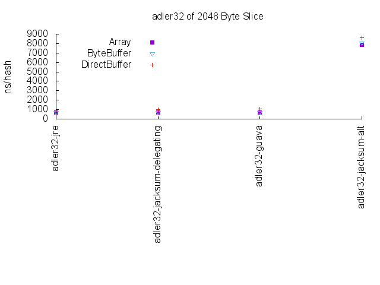

| Algorithm |  Array | ByteBuffer | DirectBuffer |
| --- | ---: | ---: | ---: | 
| [adler32-jre](#adler32-jre-latency) | 696.348290 | 697.232569 | 672.719813 |
| [adler32-jacksum-delegating](#adler32-jacksum-delegating-latency) | 697.548854 | 698.760890 | 1018.304514 |
| [adler32-guava](#adler32-guava-latency) | 721.447819 | 709.319126 | 1077.842026 |
| [adler32-jacksum-alt](#adler32-jacksum-alt-latency) | 7847.222313 | 8026.303792 | 8601.866320 |

---
### 2048 Byte Slice Latency (city64)
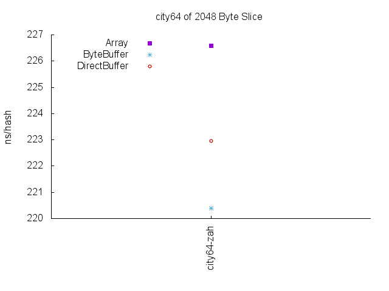

| Algorithm |  Array | ByteBuffer | DirectBuffer |
| --- | ---: | ---: | ---: | 
| [city64-zah](#city64-zah-latency) | 226.574536 | 220.390593 | 222.950013 |

---
### 2048 Byte Slice Latency (cksum)
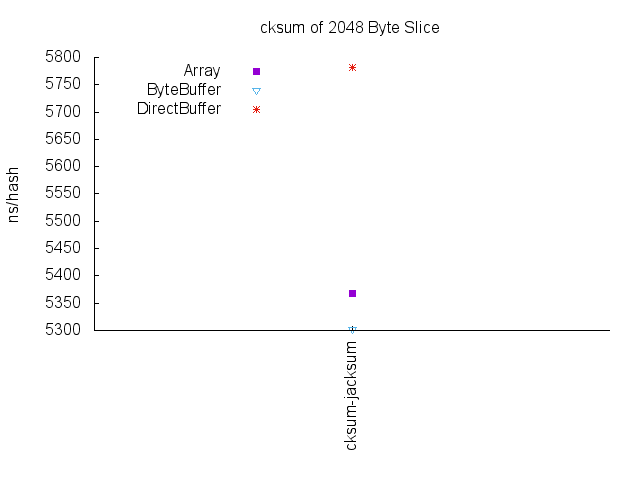

| Algorithm |  Array | ByteBuffer | DirectBuffer |
| --- | ---: | ---: | ---: | 
| [cksum-jacksum](#cksum-jacksum-latency) | 5367.901037 | 5302.539657 | 5780.929134 |

---
### 2048 Byte Slice Latency (crc16)
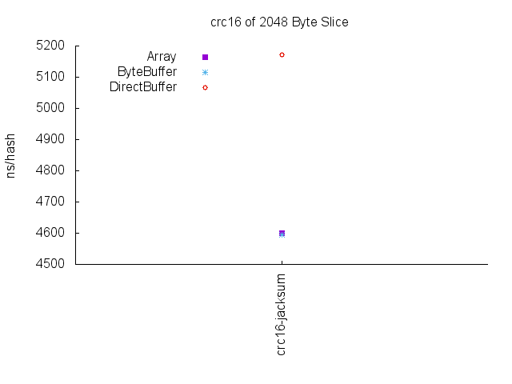

| Algorithm |  Array | ByteBuffer | DirectBuffer |
| --- | ---: | ---: | ---: | 
| [crc16-jacksum](#crc16-jacksum-latency) | 4600.102095 | 4595.303511 | 5171.955134 |

---
### 2048 Byte Slice Latency (crc24)
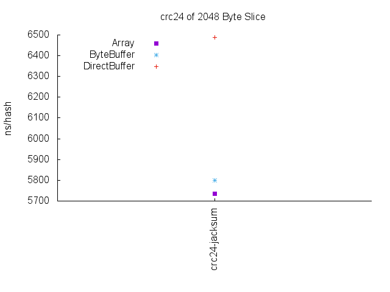

| Algorithm |  Array | ByteBuffer | DirectBuffer |
| --- | ---: | ---: | ---: | 
| [crc24-jacksum](#crc24-jacksum-latency) | 5735.745849 | 5800.694083 | 6487.065463 |

---
### 2048 Byte Slice Latency (crc32)

| Algorithm |  Array | ByteBuffer | DirectBuffer |
| --- | ---: | ---: | ---: | 
| [crc32-jre](#crc32-jre-latency) | 188.562803 | 202.169559 | 211.371477 |
| [crc32-jacksum-delegating](#crc32-jacksum-delegating-latency) | 206.439796 | 203.216601 | 445.283629 |
| [crc32-guava-delegating](#crc32-guava-delegating-latency) | 217.718031 | 221.913027 | 457.108426 |
| [crc32-guava-rfc3720](#crc32-guava-rfc3720-latency) | 4680.635004 | 4731.046770 | 5096.333853 |
| [crc32-jacksum-fcs32](#crc32-jacksum-fcs32-latency) | 4782.645178 | 4840.327642 | 5447.994639 |
| [crc32-jacksum-mpeg2](#crc32-jacksum-mpeg2-latency) | 5276.160804 | 5276.292644 | 5987.185068 |
| [crc32-jacksum-bzip2](#crc32-jacksum-bzip2-latency) | 5642.251492 | 5801.160385 | 6290.875131 |

---
### 2048 Byte Slice Latency (crc64)
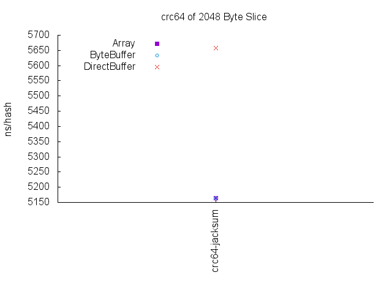

| Algorithm |  Array | ByteBuffer | DirectBuffer |
| --- | ---: | ---: | ---: | 
| [crc64-jacksum](#crc64-jacksum-latency) | 5163.717698 | 5163.604593 | 5657.045530 |

---
### 2048 Byte Slice Latency (crc8)
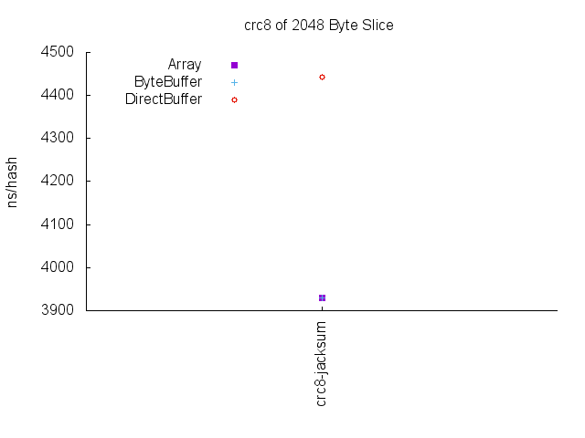

| Algorithm |  Array | ByteBuffer | DirectBuffer |
| --- | ---: | ---: | ---: | 
| [crc8-jacksum](#crc8-jacksum-latency) | 3930.494915 | 3929.622768 | 4443.592252 |

---
### 2048 Byte Slice Latency (ed2k)
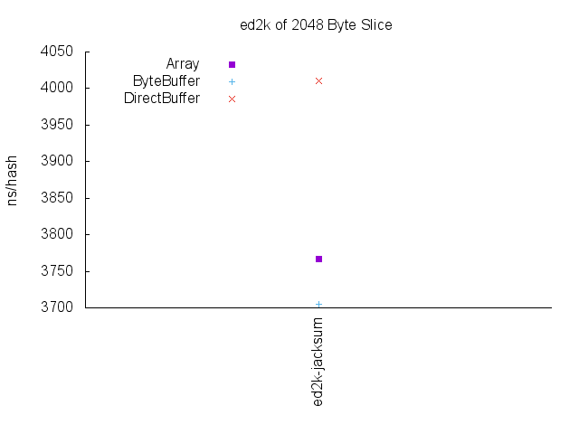

| Algorithm |  Array | ByteBuffer | DirectBuffer |
| --- | ---: | ---: | ---: | 
| [ed2k-jacksum](#ed2k-jacksum-latency) | 3766.168842 | 3704.363513 | 4009.910734 |

---
### 2048 Byte Slice Latency (elf)
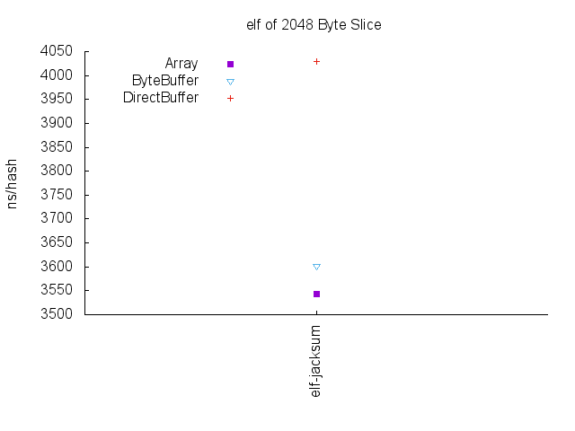

| Algorithm |  Array | ByteBuffer | DirectBuffer |
| --- | ---: | ---: | ---: | 
| [elf-jacksum](#elf-jacksum-latency) | 3543.414189 | 3602.052448 | 4028.999007 |

---
### 2048 Byte Slice Latency (farmna)
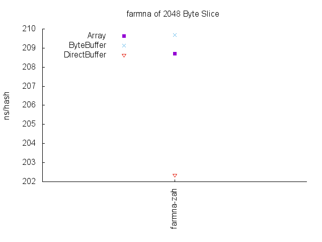

| Algorithm |  Array | ByteBuffer | DirectBuffer |
| --- | ---: | ---: | ---: | 
| [farmna-zah](#farmna-zah-latency) | 208.719047 | 209.671228 | 202.337150 |

---
### 2048 Byte Slice Latency (farmuo)
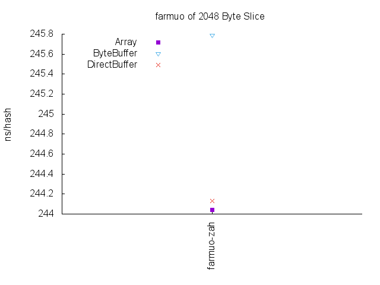

| Algorithm |  Array | ByteBuffer | DirectBuffer |
| --- | ---: | ---: | ---: | 
| [farmuo-zah](#farmuo-zah-latency) | 244.041325 | 245.787256 | 244.129301 |

---
### 2048 Byte Slice Latency (fcs16)
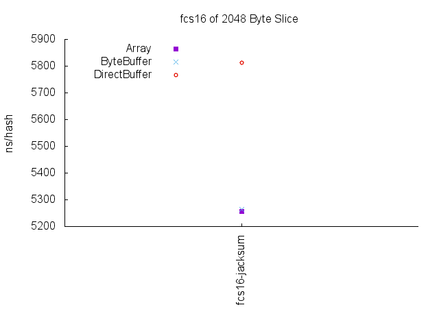

| Algorithm |  Array | ByteBuffer | DirectBuffer |
| --- | ---: | ---: | ---: | 
| [fcs16-jacksum](#fcs16-jacksum-latency) | 5256.613253 | 5264.648045 | 5813.585179 |

---
### 2048 Byte Slice Latency (gfh32)
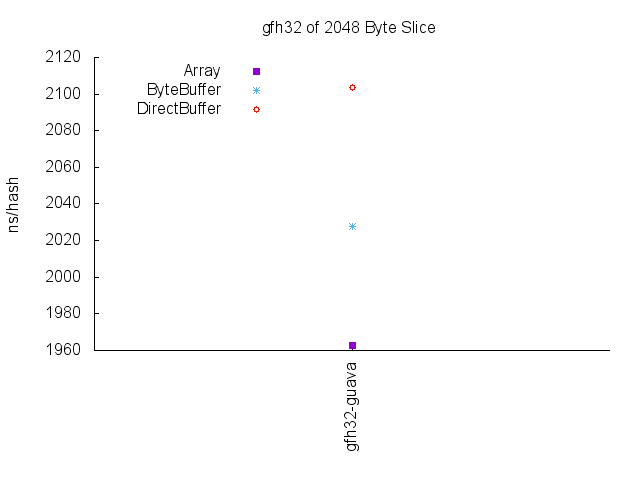

| Algorithm |  Array | ByteBuffer | DirectBuffer |
| --- | ---: | ---: | ---: | 
| [gfh32-guava](#gfh32-guava-latency) | 1962.750225 | 2027.869104 | 2103.684847 |

---
### 2048 Byte Slice Latency (gfh64)
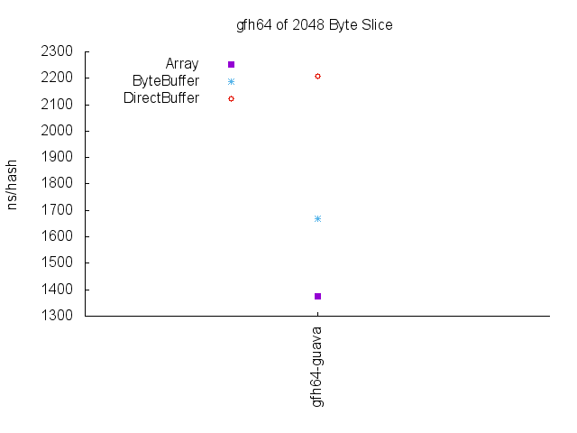

| Algorithm |  Array | ByteBuffer | DirectBuffer |
| --- | ---: | ---: | ---: | 
| [gfh64-guava](#gfh64-guava-latency) | 1373.775977 | 1669.349690 | 2206.587240 |

---
### 2048 Byte Slice Latency (gost)
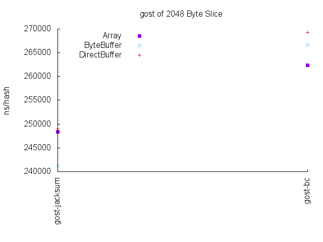

| Algorithm |  Array | ByteBuffer | DirectBuffer |
| --- | ---: | ---: | ---: | 
| [gost-jacksum](#gost-jacksum-latency) | 248372.078863 | 241167.974473 | 249003.991022 |
| [gost-bc](#gost-bc-latency) | 262319.827666 | 266640.222714 | 269259.918521 |

---
### 2048 Byte Slice Latency (has160)
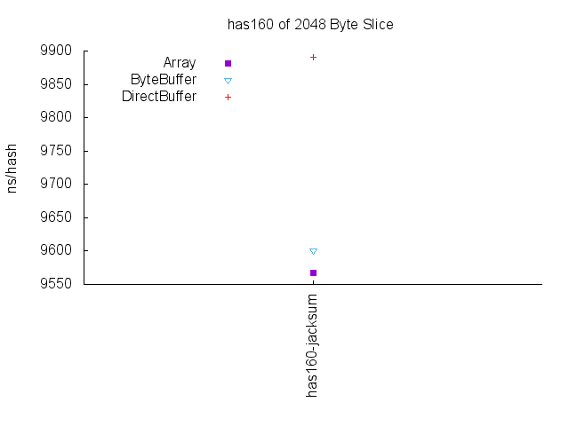

| Algorithm |  Array | ByteBuffer | DirectBuffer |
| --- | ---: | ---: | ---: | 
| [has160-jacksum](#has160-jacksum-latency) | 9567.370176 | 9600.140400 | 9890.023218 |

---
### 2048 Byte Slice Latency (haval128h3)
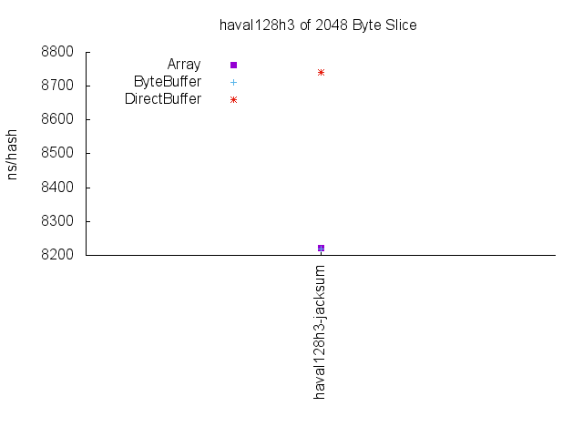

| Algorithm |  Array | ByteBuffer | DirectBuffer |
| --- | ---: | ---: | ---: | 
| [haval128h3-jacksum](#haval128h3-jacksum-latency) | 8221.653925 | 8217.883637 | 8741.564333 |

---
### 2048 Byte Slice Latency (haval128h4)
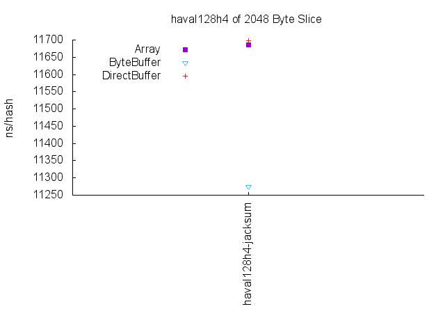

| Algorithm |  Array | ByteBuffer | DirectBuffer |
| --- | ---: | ---: | ---: | 
| [haval128h4-jacksum](#haval128h4-jacksum-latency) | 11685.302421 | 11274.811770 | 11698.657205 |

---
### 2048 Byte Slice Latency (haval128h5)
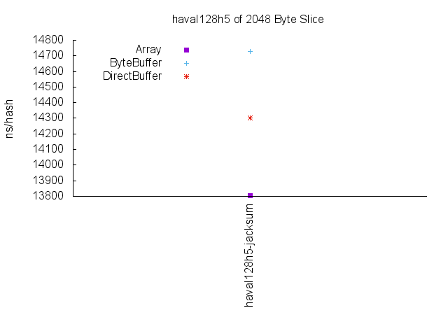

| Algorithm |  Array | ByteBuffer | DirectBuffer |
| --- | ---: | ---: | ---: | 
| [haval128h5-jacksum](#haval128h5-jacksum-latency) | 13803.313948 | 14729.142346 | 14304.261491 |

---
### 2048 Byte Slice Latency (haval160h3)
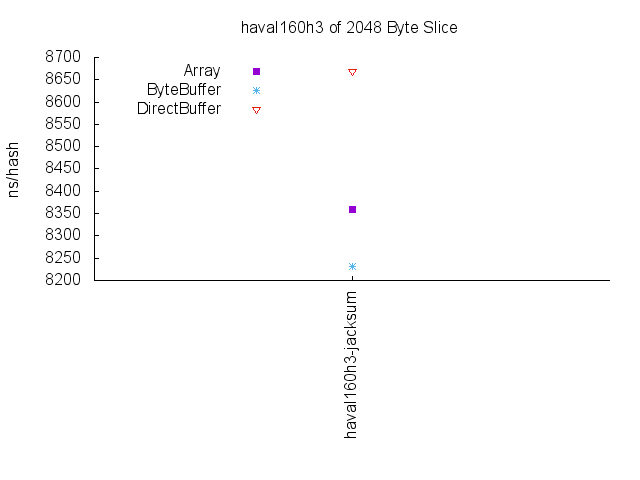

| Algorithm |  Array | ByteBuffer | DirectBuffer |
| --- | ---: | ---: | ---: | 
| [haval160h3-jacksum](#haval160h3-jacksum-latency) | 8359.029059 | 8230.391740 | 8669.023781 |

---
### 2048 Byte Slice Latency (haval160h4)
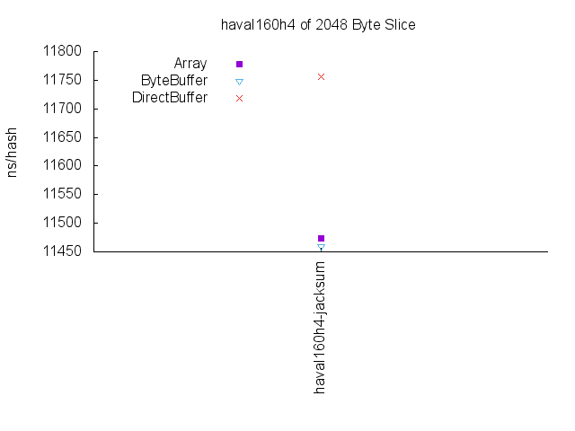

| Algorithm |  Array | ByteBuffer | DirectBuffer |
| --- | ---: | ---: | ---: | 
| [haval160h4-jacksum](#haval160h4-jacksum-latency) | 11473.572482 | 11458.672890 | 11756.444860 |

---
### 2048 Byte Slice Latency (haval160h5)
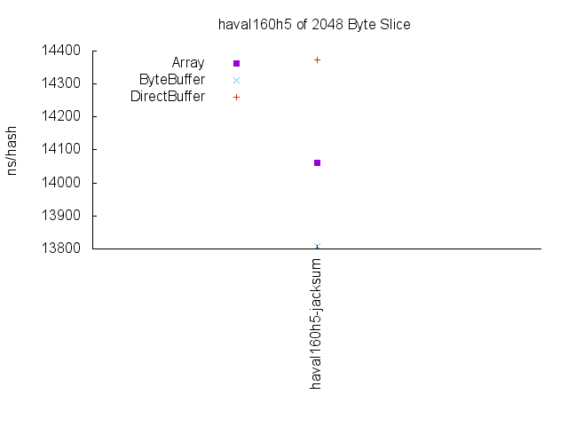

| Algorithm |  Array | ByteBuffer | DirectBuffer |
| --- | ---: | ---: | ---: | 
| [haval160h5-jacksum](#haval160h5-jacksum-latency) | 14060.493955 | 13807.854230 | 14372.652048 |

---
### 2048 Byte Slice Latency (haval192h3)
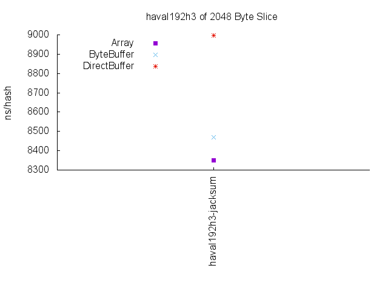

| Algorithm |  Array | ByteBuffer | DirectBuffer |
| --- | ---: | ---: | ---: | 
| [haval192h3-jacksum](#haval192h3-jacksum-latency) | 8349.520617 | 8471.049996 | 8995.789350 |

---
### 2048 Byte Slice Latency (haval192h4)
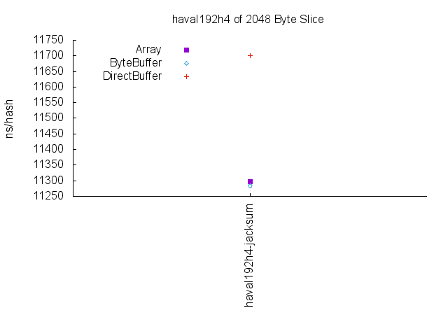

| Algorithm |  Array | ByteBuffer | DirectBuffer |
| --- | ---: | ---: | ---: | 
| [haval192h4-jacksum](#haval192h4-jacksum-latency) | 11296.874720 | 11283.013727 | 11700.537667 |

---
### 2048 Byte Slice Latency (haval192h5)
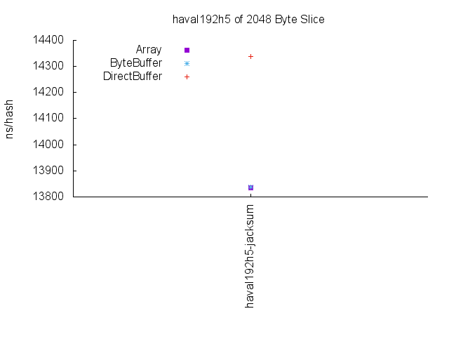

| Algorithm |  Array | ByteBuffer | DirectBuffer |
| --- | ---: | ---: | ---: | 
| [haval192h5-jacksum](#haval192h5-jacksum-latency) | 13834.518576 | 13837.340236 | 14339.437286 |

---
### 2048 Byte Slice Latency (haval224h3)
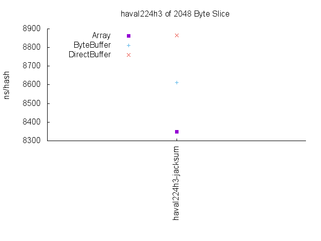

| Algorithm |  Array | ByteBuffer | DirectBuffer |
| --- | ---: | ---: | ---: | 
| [haval224h3-jacksum](#haval224h3-jacksum-latency) | 8348.687271 | 8612.655930 | 8865.553621 |

---
### 2048 Byte Slice Latency (haval224h4)

| Algorithm |  Array | ByteBuffer | DirectBuffer |
| --- | ---: | ---: | ---: | 
| [haval224h4-jacksum](#haval224h4-jacksum-latency) | 11492.132558 | 11470.016460 | 11878.089193 |

---
### 2048 Byte Slice Latency (haval224h5)
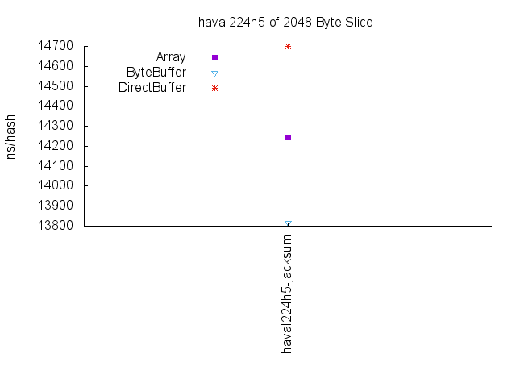

| Algorithm |  Array | ByteBuffer | DirectBuffer |
| --- | ---: | ---: | ---: | 
| [haval224h5-jacksum](#haval224h5-jacksum-latency) | 14243.461777 | 13815.614937 | 14699.004726 |

---
### 2048 Byte Slice Latency (haval256h3)
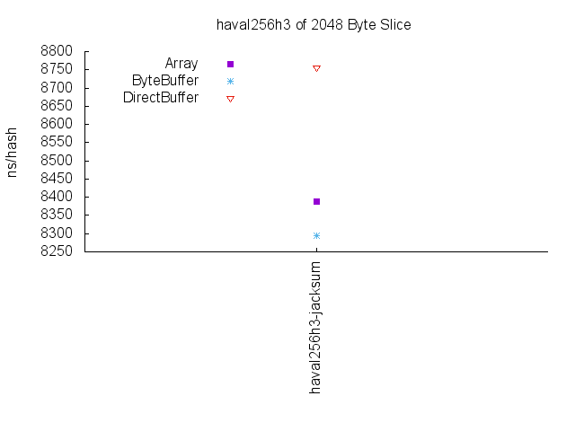

| Algorithm |  Array | ByteBuffer | DirectBuffer |
| --- | ---: | ---: | ---: | 
| [haval256h3-jacksum](#haval256h3-jacksum-latency) | 8388.654868 | 8294.691485 | 8754.950887 |

---
### 2048 Byte Slice Latency (haval256h4)
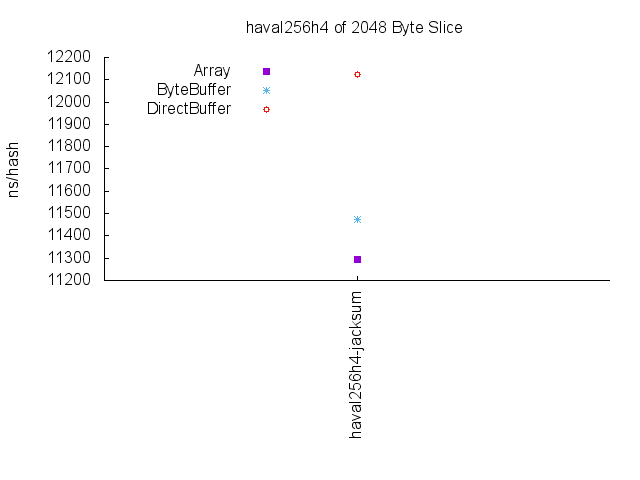

| Algorithm |  Array | ByteBuffer | DirectBuffer |
| --- | ---: | ---: | ---: | 
| [haval256h4-jacksum](#haval256h4-jacksum-latency) | 11295.581359 | 11472.380412 | 12121.902522 |

---
### 2048 Byte Slice Latency (haval256h5)
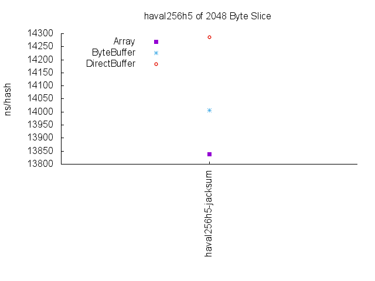

| Algorithm |  Array | ByteBuffer | DirectBuffer |
| --- | ---: | ---: | ---: | 
| [haval256h5-jacksum](#haval256h5-jacksum-latency) | 13838.110703 | 14006.529856 | 14287.634197 |

---
### 2048 Byte Slice Latency (md2)
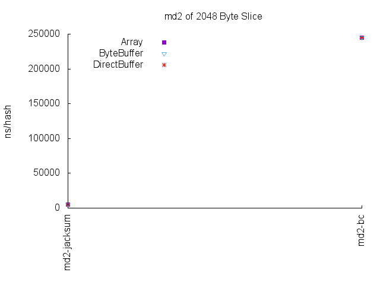

| Algorithm |  Array | ByteBuffer | DirectBuffer |
| --- | ---: | ---: | ---: | 
| [md2-jacksum](#md2-jacksum-latency) | 4920.154198 | 4919.058545 | 5434.947067 |
| [md2-bc](#md2-bc-latency) | 245030.408997 | 245127.213920 | 245118.315018 |

---
### 2048 Byte Slice Latency (md4)
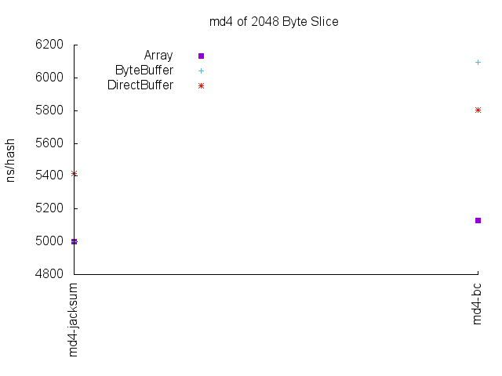

| Algorithm |  Array | ByteBuffer | DirectBuffer |
| --- | ---: | ---: | ---: | 
| [md4-jacksum](#md4-jacksum-latency) | 4999.317302 | 4999.474243 | 5417.162067 |
| [md4-bc](#md4-bc-latency) | 5131.005409 | 6097.044873 | 5803.917014 |

---
### 2048 Byte Slice Latency (md5)
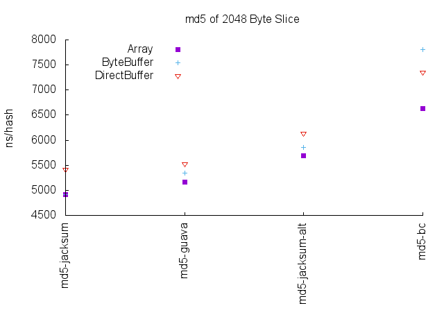

| Algorithm |  Array | ByteBuffer | DirectBuffer |
| --- | ---: | ---: | ---: | 
| [md5-jacksum](#md5-jacksum-latency) | 4913.892861 | 4920.629492 | 5417.021652 |
| [md5-guava](#md5-guava-latency) | 5165.649783 | 5348.642571 | 5529.703605 |
| [md5-jacksum-alt](#md5-jacksum-alt-latency) | 5696.354425 | 5850.506450 | 6129.496230 |
| [md5-bc](#md5-bc-latency) | 6634.157710 | 7808.592304 | 7352.918831 |

---
### 2048 Byte Slice Latency (murmur3h128)
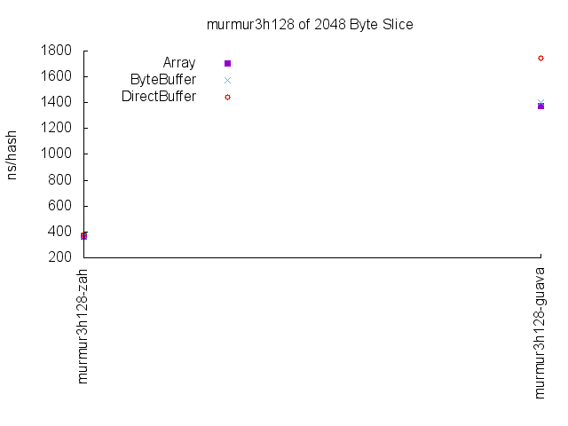

| Algorithm |  Array | ByteBuffer | DirectBuffer |
| --- | ---: | ---: | ---: | 
| [murmur3h128-zah](#murmur3h128-zah-latency) | 363.464001 | 368.455891 | 379.737144 |
| [murmur3h128-guava](#murmur3h128-guava-latency) | 1374.448792 | 1404.891252 | 1748.278050 |

---
### 2048 Byte Slice Latency (murmur3h32)
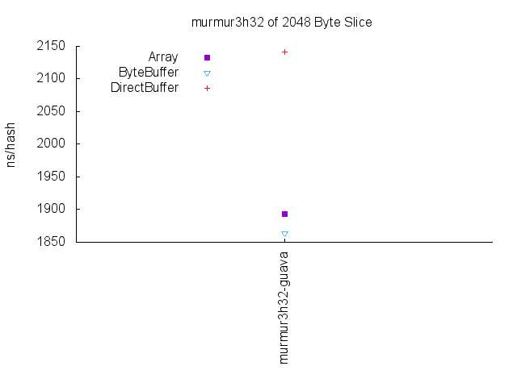

| Algorithm |  Array | ByteBuffer | DirectBuffer |
| --- | ---: | ---: | ---: | 
| [murmur3h32-guava](#murmur3h32-guava-latency) | 1893.124224 | 1863.441433 | 2140.750350 |

---
### 2048 Byte Slice Latency (ripemd128)
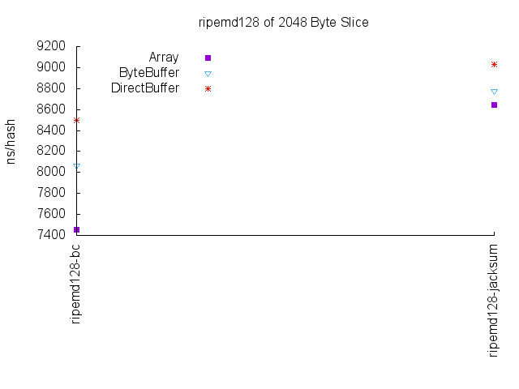

| Algorithm |  Array | ByteBuffer | DirectBuffer |
| --- | ---: | ---: | ---: | 
| [ripemd128-bc](#ripemd128-bc-latency) | 7455.025343 | 8064.060499 | 8496.077719 |
| [ripemd128-jacksum](#ripemd128-jacksum-latency) | 8645.019233 | 8772.219760 | 9029.806093 |

---
### 2048 Byte Slice Latency (ripemd160)
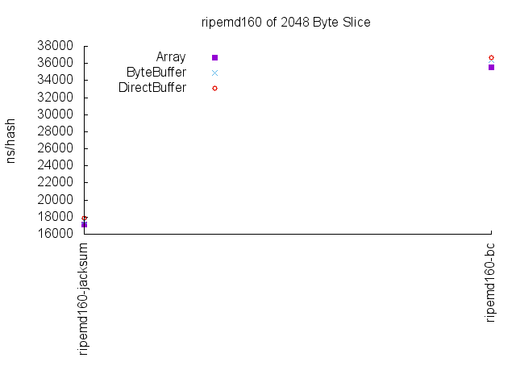

| Algorithm |  Array | ByteBuffer | DirectBuffer |
| --- | ---: | ---: | ---: | 
| [ripemd160-jacksum](#ripemd160-jacksum-latency) | 17115.066166 | 17524.846474 | 17878.439509 |
| [ripemd160-bc](#ripemd160-bc-latency) | 35576.920070 | 36369.735731 | 36690.674862 |

---
### 2048 Byte Slice Latency (ripemd256)
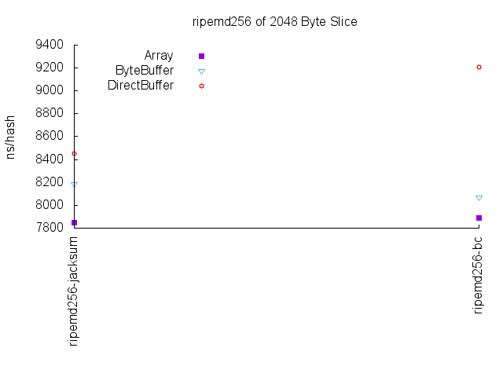

| Algorithm |  Array | ByteBuffer | DirectBuffer |
| --- | ---: | ---: | ---: | 
| [ripemd256-jacksum](#ripemd256-jacksum-latency) | 7845.169270 | 8184.427039 | 8450.913708 |
| [ripemd256-bc](#ripemd256-bc-latency) | 7889.392231 | 8065.192977 | 9206.994335 |

---
### 2048 Byte Slice Latency (ripemd320)
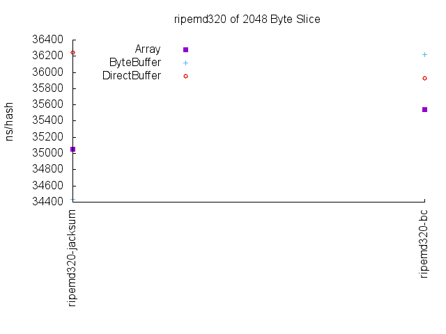

| Algorithm |  Array | ByteBuffer | DirectBuffer |
| --- | ---: | ---: | ---: | 
| [ripemd320-jacksum](#ripemd320-jacksum-latency) | 35051.258918 | 34430.223304 | 36241.545577 |
| [ripemd320-bc](#ripemd320-bc-latency) | 35540.277889 | 36215.587549 | 35926.394360 |

---
### 2048 Byte Slice Latency (sha0)

| Algorithm |  Array | ByteBuffer | DirectBuffer |
| --- | ---: | ---: | ---: | 
| [sha0-jacksum](#sha0-jacksum-latency) | 8240.257648 | 8404.130349 | 8503.486933 |

---
### 2048 Byte Slice Latency (sha1)
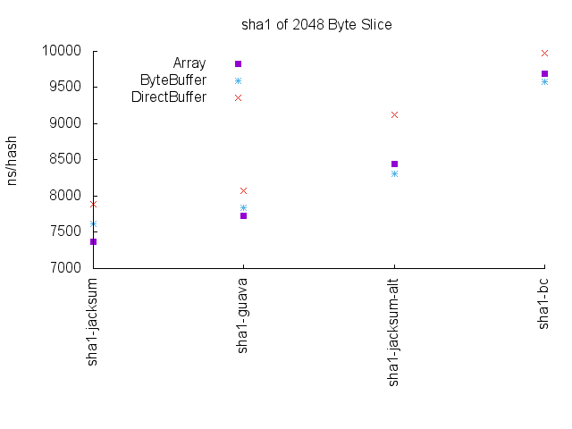

| Algorithm |  Array | ByteBuffer | DirectBuffer |
| --- | ---: | ---: | ---: | 
| [sha1-jacksum](#sha1-jacksum-latency) | 7371.471889 | 7618.318420 | 7887.438042 |
| [sha1-guava](#sha1-guava-latency) | 7724.931316 | 7840.171385 | 8071.956091 |
| [sha1-jacksum-alt](#sha1-jacksum-alt-latency) | 8441.042913 | 8305.288594 | 9125.606182 |
| [sha1-bc](#sha1-bc-latency) | 9691.255313 | 9584.505862 | 9974.902689 |

---
### 2048 Byte Slice Latency (sha224)
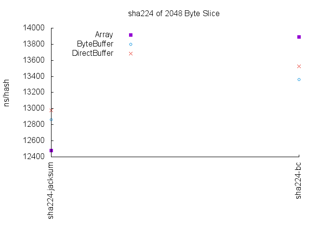

| Algorithm |  Array | ByteBuffer | DirectBuffer |
| --- | ---: | ---: | ---: | 
| [sha224-jacksum](#sha224-jacksum-latency) | 12478.015525 | 12864.590170 | 12978.089355 |
| [sha224-bc](#sha224-bc-latency) | 13892.476019 | 13359.508261 | 13522.896564 |

---
### 2048 Byte Slice Latency (sha256)
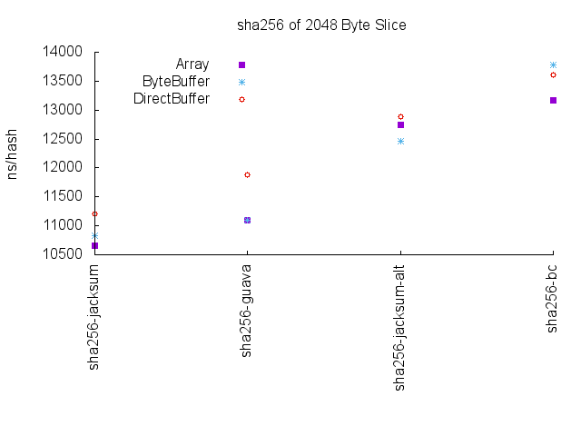

| Algorithm |  Array | ByteBuffer | DirectBuffer |
| --- | ---: | ---: | ---: | 
| [sha256-jacksum](#sha256-jacksum-latency) | 10656.071056 | 10834.213098 | 11203.027271 |
| [sha256-guava](#sha256-guava-latency) | 11089.078245 | 11093.729959 | 11874.861333 |
| [sha256-jacksum-alt](#sha256-jacksum-alt-latency) | 12739.555893 | 12467.833562 | 12883.443626 |
| [sha256-bc](#sha256-bc-latency) | 13172.747988 | 13786.366382 | 13614.931734 |

---
### 2048 Byte Slice Latency (sha3)
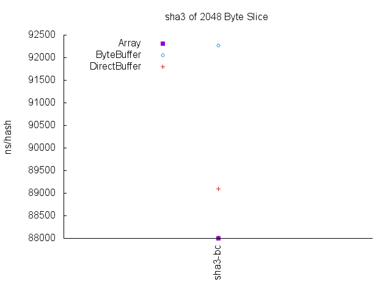

| Algorithm |  Array | ByteBuffer | DirectBuffer |
| --- | ---: | ---: | ---: | 
| [sha3-bc](#sha3-bc-latency) | 88000.457520 | 92264.146110 | 89096.038414 |

---
### 2048 Byte Slice Latency (sha384)
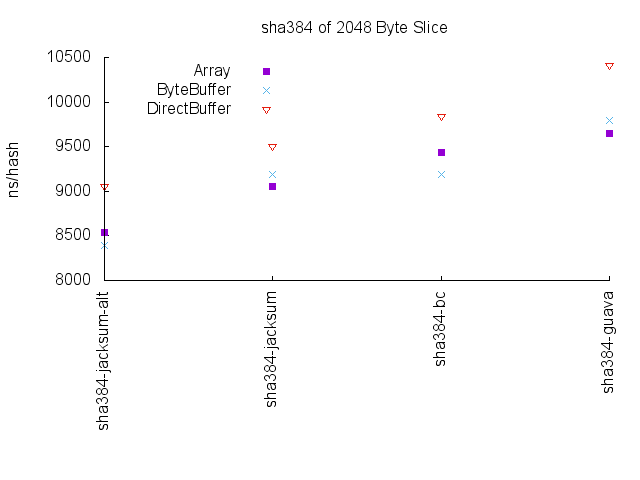

| Algorithm |  Array | ByteBuffer | DirectBuffer |
| --- | ---: | ---: | ---: | 
| [sha384-jacksum-alt](#sha384-jacksum-alt-latency) | 8539.584263 | 8388.429315 | 9051.174388 |
| [sha384-jacksum](#sha384-jacksum-latency) | 9055.937713 | 9191.582618 | 9507.713367 |
| [sha384-bc](#sha384-bc-latency) | 9430.372970 | 9183.237017 | 9843.966534 |
| [sha384-guava](#sha384-guava-latency) | 9644.109600 | 9796.608380 | 10408.229685 |

---
### 2048 Byte Slice Latency (sha512)
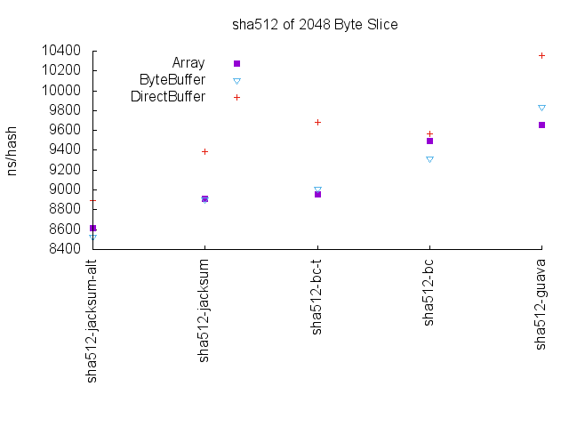

| Algorithm |  Array | ByteBuffer | DirectBuffer |
| --- | ---: | ---: | ---: | 
| [sha512-jacksum-alt](#sha512-jacksum-alt-latency) | 8613.489225 | 8527.270558 | 8889.295772 |
| [sha512-jacksum](#sha512-jacksum-latency) | 8914.005227 | 8899.677735 | 9382.403050 |
| [sha512-bc-t](#sha512-bc-t-latency) | 8951.666063 | 9011.287243 | 9682.719756 |
| [sha512-bc](#sha512-bc-latency) | 9498.215658 | 9318.863508 | 9562.669473 |
| [sha512-guava](#sha512-guava-latency) | 9655.479716 | 9833.869636 | 10356.521827 |

---
### 2048 Byte Slice Latency (sip)
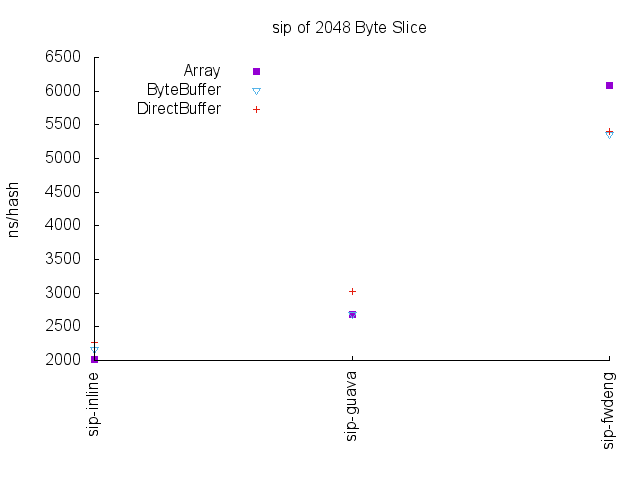

| Algorithm |  Array | ByteBuffer | DirectBuffer |
| --- | ---: | ---: | ---: | 
| [sip-inline](#sip-inline-latency) | 2008.121525 | 2159.966842 | 2274.129989 |
| [sip-guava](#sip-guava-latency) | 2681.484149 | 2680.280693 | 3020.471944 |
| [sip-fwdeng](#sip-fwdeng-latency) | 6088.124004 | 5361.850637 | 5399.694579 |

---
### 2048 Byte Slice Latency (skein1024)
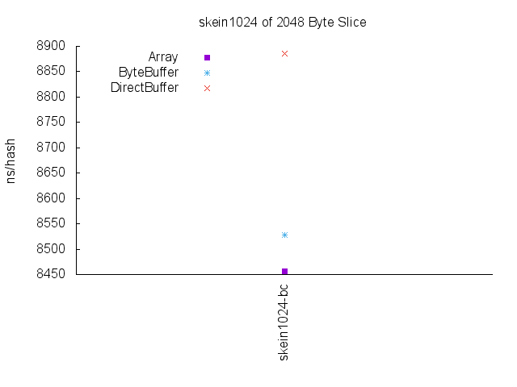

| Algorithm |  Array | ByteBuffer | DirectBuffer |
| --- | ---: | ---: | ---: | 
| [skein1024-bc](#skein1024-bc-latency) | 8456.723186 | 8528.021555 | 8885.550348 |

---
### 2048 Byte Slice Latency (skein256)

| Algorithm |  Array | ByteBuffer | DirectBuffer |
| --- | ---: | ---: | ---: | 
| [skein256-bc](#skein256-bc-latency) | 8347.115145 | 8630.962604 | 8741.587015 |

---
### 2048 Byte Slice Latency (skein512)
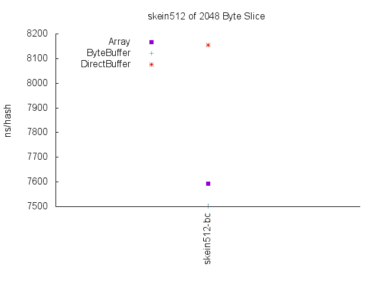

| Algorithm |  Array | ByteBuffer | DirectBuffer |
| --- | ---: | ---: | ---: | 
| [skein512-bc](#skein512-bc-latency) | 7593.475387 | 7501.177495 | 8154.689646 |

---
### 2048 Byte Slice Latency (sm3)
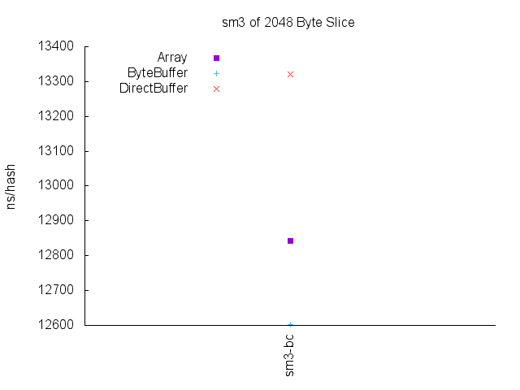

| Algorithm |  Array | ByteBuffer | DirectBuffer |
| --- | ---: | ---: | ---: | 
| [sm3-bc](#sm3-bc-latency) | 12843.195244 | 12602.441732 | 13321.398141 |

---
### 2048 Byte Slice Latency (sum16)
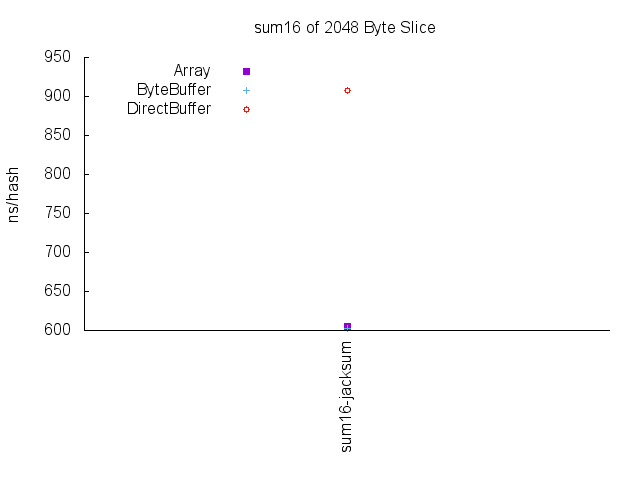

| Algorithm |  Array | ByteBuffer | DirectBuffer |
| --- | ---: | ---: | ---: | 
| [sum16-jacksum](#sum16-jacksum-latency) | 604.723983 | 603.185412 | 907.505875 |

---
### 2048 Byte Slice Latency (sum24)

| Algorithm |  Array | ByteBuffer | DirectBuffer |
| --- | ---: | ---: | ---: | 
| [sum24-jacksum](#sum24-jacksum-latency) | 589.951658 | 603.009492 | 873.966883 |

---
### 2048 Byte Slice Latency (sum32)

| Algorithm |  Array | ByteBuffer | DirectBuffer |
| --- | ---: | ---: | ---: | 
| [sum32-jacksum](#sum32-jacksum-latency) | 582.426823 | 593.781158 | 906.281918 |

---
### 2048 Byte Slice Latency (sum8)
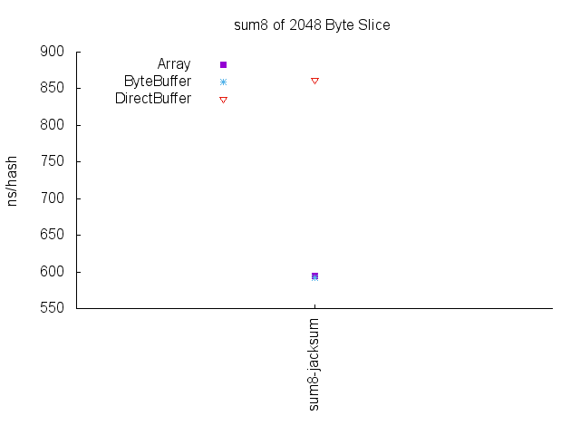

| Algorithm |  Array | ByteBuffer | DirectBuffer |
| --- | ---: | ---: | ---: | 
| [sum8-jacksum](#sum8-jacksum-latency) | 594.449558 | 592.322384 | 862.241060 |

---
### 2048 Byte Slice Latency (sumbsd)
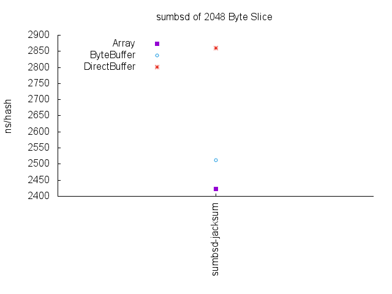

| Algorithm |  Array | ByteBuffer | DirectBuffer |
| --- | ---: | ---: | ---: | 
| [sumbsd-jacksum](#sumbsd-jacksum-latency) | 2423.104141 | 2512.261781 | 2859.546409 |

---
### 2048 Byte Slice Latency (sumsysv)
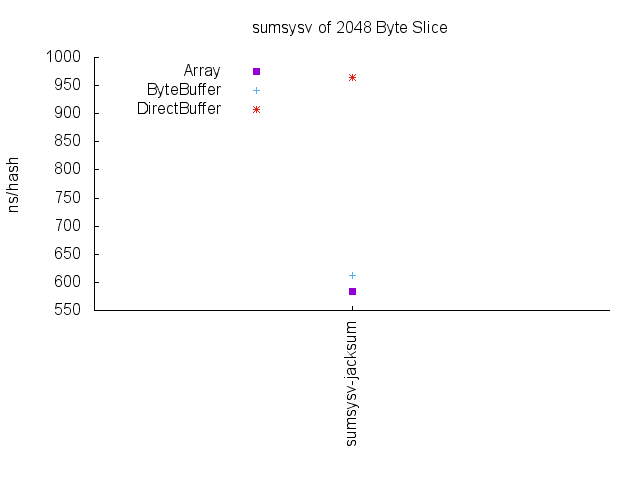

| Algorithm |  Array | ByteBuffer | DirectBuffer |
| --- | ---: | ---: | ---: | 
| [sumsysv-jacksum](#sumsysv-jacksum-latency) | 584.544391 | 611.486724 | 964.002204 |

---
### 2048 Byte Slice Latency (tiger)
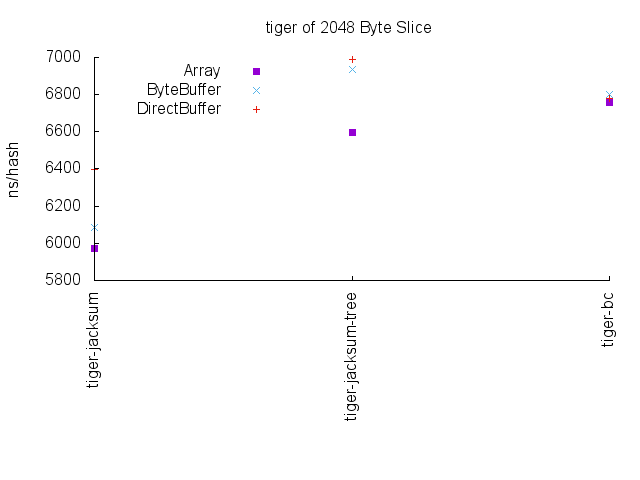

| Algorithm |  Array | ByteBuffer | DirectBuffer |
| --- | ---: | ---: | ---: | 
| [tiger-jacksum](#tiger-jacksum-latency) | 5974.086091 | 6082.912700 | 6396.536859 |
| [tiger-jacksum-tree](#tiger-jacksum-tree-latency) | 6594.933233 | 6933.191633 | 6988.504020 |
| [tiger-bc](#tiger-bc-latency) | 6760.177310 | 6798.656148 | 6779.394203 |

---
### 2048 Byte Slice Latency (tiger128)

| Algorithm |  Array | ByteBuffer | DirectBuffer |
| --- | ---: | ---: | ---: | 
| [tiger128-jacksum](#tiger128-jacksum-latency) | 5983.469563 | 5972.696108 | 6390.244790 |

---
### 2048 Byte Slice Latency (tiger160)
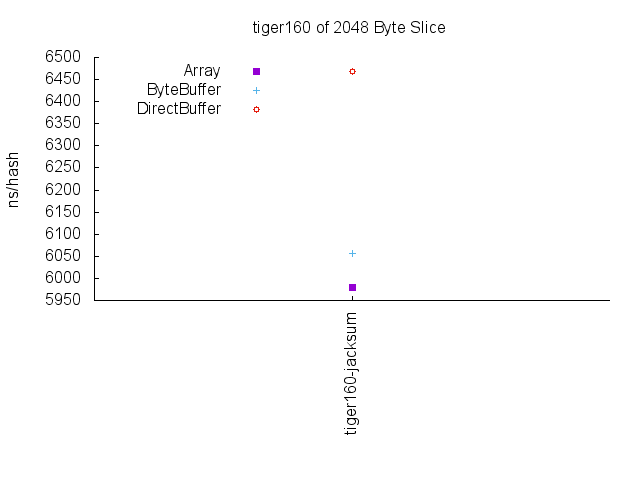

| Algorithm |  Array | ByteBuffer | DirectBuffer |
| --- | ---: | ---: | ---: | 
| [tiger160-jacksum](#tiger160-jacksum-latency) | 5978.441319 | 6057.188990 | 6467.379106 |

---
### 2048 Byte Slice Latency (tiger2)

| Algorithm |  Array | ByteBuffer | DirectBuffer |
| --- | ---: | ---: | ---: | 
| [tiger2-jacksum](#tiger2-jacksum-latency) | 5969.104635 | 5959.338337 | 6248.480188 |
| [tiger2-jacksum-tree](#tiger2-jacksum-tree-latency) | 6585.876981 | 6600.663960 | 6871.653170 |

---
### 2048 Byte Slice Latency (whirlpool0)
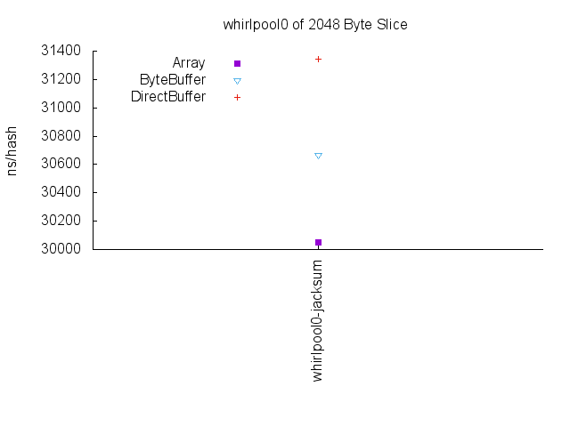

| Algorithm |  Array | ByteBuffer | DirectBuffer |
| --- | ---: | ---: | ---: | 
| [whirlpool0-jacksum](#whirlpool0-jacksum-latency) | 30047.760865 | 30666.678283 | 31346.117975 |

---
### 2048 Byte Slice Latency (whirlpool1)

| Algorithm |  Array | ByteBuffer | DirectBuffer |
| --- | ---: | ---: | ---: | 
| [whirlpool1-jacksum](#whirlpool1-jacksum-latency) | 30851.540937 | 29882.266757 | 31216.760148 |

---
### 2048 Byte Slice Latency (whirlpool2)
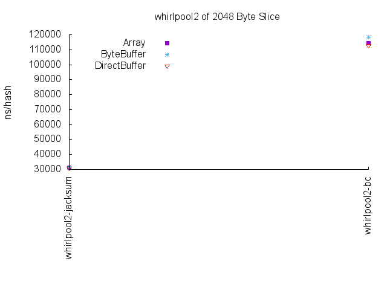

| Algorithm |  Array | ByteBuffer | DirectBuffer |
| --- | ---: | ---: | ---: | 
| [whirlpool2-jacksum](#whirlpool2-jacksum-latency) | 31177.428483 | 31337.746053 | 30856.798042 |
| [whirlpool2-bc](#whirlpool2-bc-latency) | 114415.215644 | 118324.356564 | 112896.350057 |

---
### 2048 Byte Slice Latency (xor8)
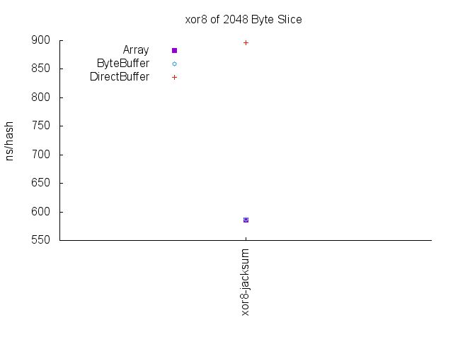

| Algorithm |  Array | ByteBuffer | DirectBuffer |
| --- | ---: | ---: | ---: | 
| [xor8-jacksum](#xor8-jacksum-latency) | 585.807937 | 586.894836 | 896.589664 |

---
### 2048 Byte Slice Latency (xxh32)

| Algorithm |  Array | ByteBuffer | DirectBuffer |
| --- | ---: | ---: | ---: | 
| [xxh32-jpountz-unsafe](#xxh32-jpountz-unsafe-latency) | 322.034960 | 324.484844 | 446.085015 |
| [xxh32-jpountz-jni](#xxh32-jpountz-jni-latency) | 328.498221 | 341.500726 | 329.404169 |
| [xxh32-jpountz-safe](#xxh32-jpountz-safe-latency) | 908.723718 | 956.047806 | 436.988791 |

---
### 2048 Byte Slice Latency (xxh64)
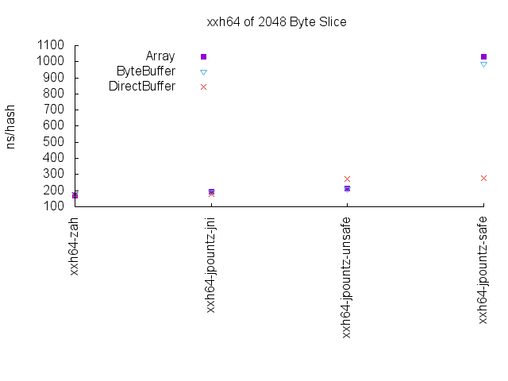

| Algorithm |  Array | ByteBuffer | DirectBuffer |
| --- | ---: | ---: | ---: | 
| [xxh64-zah](#xxh64-zah-latency) | 171.053692 | 178.464064 | 173.499855 |
| [xxh64-jpountz-jni](#xxh64-jpountz-jni-latency) | 191.421272 | 189.584197 | 179.477872 |
| [xxh64-jpountz-unsafe](#xxh64-jpountz-unsafe-latency) | 213.141728 | 208.549035 | 273.978135 |
| [xxh64-jpountz-safe](#xxh64-jpountz-safe-latency) | 1031.682640 | 985.398496 | 278.585199 |

---
### 8192 Byte Slice Latency (All Hashes)
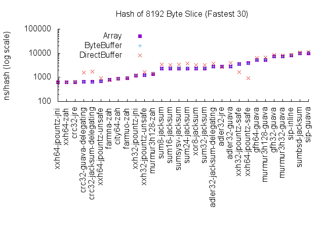

| Algorithm |  Array | ByteBuffer | DirectBuffer |
| --- | ---: | ---: | ---: | 
| [xxh64-jpountz-jni](#xxh64-jpountz-jni-latency) | 620.721180 | 623.863792 | 627.324571 |
| [xxh64-zah](#xxh64-zah-latency) | 630.188956 | 614.777509 | 615.631463 |
| [crc32-jre](#crc32-jre-latency) | 630.561420 | 643.883467 | 650.965220 |
| [crc32-guava-delegating](#crc32-guava-delegating-latency) | 649.448690 | 645.791351 | 1534.993018 |
| [crc32-jacksum-delegating](#crc32-jacksum-delegating-latency) | 651.459114 | 633.685152 | 1712.369109 |
| [xxh64-jpountz-unsafe](#xxh64-jpountz-unsafe-latency) | 687.469125 | 687.436656 | 930.866660 |
| [farmna-zah](#farmna-zah-latency) | 796.924494 | 794.274770 | 761.545459 |
| [city64-zah](#city64-zah-latency) | 870.105479 | 865.475914 | 870.501318 |
| [farmuo-zah](#farmuo-zah-latency) | 939.779413 | 949.825592 | 925.750406 |
| [xxh32-jpountz-jni](#xxh32-jpountz-jni-latency) | 1187.898092 | 1210.268644 | 1206.773345 |
| [xxh32-jpountz-unsafe](#xxh32-jpountz-unsafe-latency) | 1211.150038 | 1212.147111 | 1634.835630 |
| [murmur3h128-zah](#murmur3h128-zah-latency) | 1379.090755 | 1472.696930 | 1443.267383 |
| [sum8-jacksum](#sum8-jacksum-latency) | 2303.063745 | 2320.452776 | 3436.563948 |
| [sum16-jacksum](#sum16-jacksum-latency) | 2304.013395 | 2432.397219 | 3279.957098 |
| [sumsysv-jacksum](#sumsysv-jacksum-latency) | 2305.905916 | 2374.372807 | 3465.361749 |
| [sum24-jacksum](#sum24-jacksum-latency) | 2342.702799 | 2376.471642 | 3767.208513 |
| [xor8-jacksum](#xor8-jacksum-latency) | 2358.379524 | 2346.841174 | 3179.288314 |
| [sum32-jacksum](#sum32-jacksum-latency) | 2365.723267 | 2375.652757 | 3289.773825 |
| [adler32-jacksum-delegating](#adler32-jacksum-delegating-latency) | 2744.985822 | 2749.587673 | 3793.962084 |
| [adler32-jre](#adler32-jre-latency) | 2788.847869 | 2741.886234 | 2718.097215 |
| [adler32-guava](#adler32-guava-latency) | 2809.863515 | 2764.640709 | 4025.740884 |
| [xxh32-jpountz-safe](#xxh32-jpountz-safe-latency) | 3592.209580 | 3590.074817 | 1644.757610 |
| [xxh64-jpountz-safe](#xxh64-jpountz-safe-latency) | 4009.622272 | 3782.054234 | 920.637714 |
| [gfh64-guava](#gfh64-guava-latency) | 5262.648075 | 5283.245478 | 6452.966461 |
| [murmur3h128-guava](#murmur3h128-guava-latency) | 5269.574699 | 5460.068877 | 6684.116962 |
| [gfh32-guava](#gfh32-guava-latency) | 7234.125185 | 7208.889249 | 8572.867843 |
| [murmur3h32-guava](#murmur3h32-guava-latency) | 7352.426401 | 7205.696842 | 8169.977227 |
| [sip-inline](#sip-inline-latency) | 7953.232743 | 8400.773218 | 8444.171623 |
| [sumbsd-jacksum](#sumbsd-jacksum-latency) | 9685.845923 | 9866.911238 | 11021.658899 |
| [sip-guava](#sip-guava-latency) | 9992.884988 | 10802.121830 | 11501.762111 |
| [elf-jacksum](#elf-jacksum-latency) | 14434.419809 | 14684.868442 | 15712.552990 |
| [ed2k-jacksum](#ed2k-jacksum-latency) | 14737.868282 | 14890.558388 | 15720.531813 |
| [crc8-jacksum](#crc8-jacksum-latency) | 15992.082810 | 15231.515276 | 17593.303078 |
| [crc16-jacksum](#crc16-jacksum-latency) | 18367.279052 | 18391.720419 | 20115.082137 |
| [crc32-jacksum-fcs32](#crc32-jacksum-fcs32-latency) | 18999.473328 | 19367.191782 | 20854.945874 |
| [crc32-guava-rfc3720](#crc32-guava-rfc3720-latency) | 19159.160631 | 20120.403489 | 19703.481810 |
| [md5-jacksum](#md5-jacksum-latency) | 19593.409446 | 20159.469708 | 20661.679418 |
| [md4-jacksum](#md4-jacksum-latency) | 19612.780280 | 19586.214395 | 20681.523132 |
| [md2-jacksum](#md2-jacksum-latency) | 19616.270403 | 19584.323864 | 21895.509538 |
| [md5-guava](#md5-guava-latency) | 19920.567060 | 20878.201941 | 20753.861016 |
| [md4-bc](#md4-bc-latency) | 20222.951302 | 23943.649311 | 22235.398595 |
| [sip-fwdeng](#sip-fwdeng-latency) | 20748.627698 | 20782.029458 | 20544.968258 |
| [crc64-jacksum](#crc64-jacksum-latency) | 20992.668859 | 21006.910741 | 22372.612720 |
| [fcs16-jacksum](#fcs16-jacksum-latency) | 21030.727957 | 21395.761131 | 22460.217989 |
| [crc32-jacksum-mpeg2](#crc32-jacksum-mpeg2-latency) | 21092.337968 | 21090.253626 | 22186.274584 |
| [cksum-jacksum](#cksum-jacksum-latency) | 21098.784421 | 21036.140208 | 22080.691325 |
| [crc24-jacksum](#crc24-jacksum-latency) | 22572.263451 | 23574.318455 | 24328.435880 |
| [md5-jacksum-alt](#md5-jacksum-alt-latency) | 22837.308977 | 22668.137475 | 24023.511173 |
| [crc32-jacksum-bzip2](#crc32-jacksum-bzip2-latency) | 22935.425550 | 23189.319844 | 24958.032272 |
| [tiger160-jacksum](#tiger160-jacksum-latency) | 23795.541387 | 24179.646856 | 24807.059105 |
| [tiger2-jacksum](#tiger2-jacksum-latency) | 23804.803725 | 23792.541837 | 25245.903012 |
| [tiger-jacksum](#tiger-jacksum-latency) | 23820.877741 | 23803.295380 | 25183.590013 |
| [tiger128-jacksum](#tiger128-jacksum-latency) | 23829.608494 | 23797.479342 | 24692.035657 |
| [tiger-bc](#tiger-bc-latency) | 25926.594270 | 26523.603590 | 27211.088858 |
| [tiger-jacksum-tree](#tiger-jacksum-tree-latency) | 26277.536930 | 26260.512224 | 28032.017864 |
| [md5-bc](#md5-bc-latency) | 26375.480715 | 27059.742983 | 29412.411614 |
| [tiger2-jacksum-tree](#tiger2-jacksum-tree-latency) | 26788.679640 | 26763.321492 | 27267.607425 |
| [ripemd128-bc](#ripemd128-bc-latency) | 29198.626867 | 32778.869217 | 31251.587359 |
| [skein512-bc](#skein512-bc-latency) | 29258.842381 | 30151.527259 | 30552.361784 |
| [sha1-jacksum](#sha1-jacksum-latency) | 29437.768747 | 29456.503574 | 31113.792839 |
| [sha1-guava](#sha1-guava-latency) | 30739.703914 | 29802.204609 | 32021.373096 |
| [ripemd256-bc](#ripemd256-bc-latency) | 30840.148581 | 32171.590768 | 33149.056581 |
| [ripemd256-jacksum](#ripemd256-jacksum-latency) | 31361.501615 | 31966.961796 | 32997.187031 |
| [adler32-jacksum-alt](#adler32-jacksum-alt-latency) | 31411.840545 | 31008.591644 | 32036.479502 |
| [haval256h3-jacksum](#haval256h3-jacksum-latency) | 32862.030587 | 32720.801797 | 34838.525412 |
| [skein256-bc](#skein256-bc-latency) | 33219.408104 | 34208.655919 | 33985.955510 |
| [skein1024-bc](#skein1024-bc-latency) | 33235.938759 | 32358.204140 | 32681.886517 |
| [haval192h3-jacksum](#haval192h3-jacksum-latency) | 33284.103360 | 32762.199941 | 34258.316954 |
| [haval160h3-jacksum](#haval160h3-jacksum-latency) | 33317.175275 | 32793.753283 | 34361.357137 |
| [haval128h3-jacksum](#haval128h3-jacksum-latency) | 33353.881656 | 32805.293952 | 35208.110316 |
| [haval224h3-jacksum](#haval224h3-jacksum-latency) | 33411.387081 | 32885.862579 | 34253.354242 |
| [sha384-jacksum-alt](#sha384-jacksum-alt-latency) | 33464.755735 | 35047.741172 | 35414.101662 |
| [sha0-jacksum](#sha0-jacksum-latency) | 33486.957274 | 33373.151356 | 33716.808801 |
| [sha512-bc-t](#sha512-bc-t-latency) | 34248.867701 | 35207.793292 | 35721.494459 |
| [sha1-jacksum-alt](#sha1-jacksum-alt-latency) | 34306.102076 | 33314.033539 | 34400.927399 |
| [sha512-jacksum-alt](#sha512-jacksum-alt-latency) | 34732.116784 | 34016.241952 | 34540.067277 |
| [sha512-bc](#sha512-bc-latency) | 34830.603180 | 36182.648196 | 35183.758354 |
| [ripemd128-jacksum](#ripemd128-jacksum-latency) | 35384.023321 | 35039.469629 | 36479.859401 |
| [sha512-jacksum](#sha512-jacksum-latency) | 35590.719708 | 35577.871893 | 36503.522251 |
| [sha384-jacksum](#sha384-jacksum-latency) | 35596.735924 | 35581.099846 | 37800.329805 |
| [sha384-bc](#sha384-bc-latency) | 36082.247925 | 35186.367297 | 35280.600619 |
| [sha512-guava](#sha512-guava-latency) | 36365.347337 | 36385.863756 | 38217.465302 |
| [sha1-bc](#sha1-bc-latency) | 37374.323379 | 38785.055422 | 38417.875196 |
| [has160-jacksum](#has160-jacksum-latency) | 37617.311632 | 37636.306443 | 39183.361435 |
| [sha384-guava](#sha384-guava-latency) | 37638.089833 | 36383.220508 | 39072.810598 |
| [sha256-guava](#sha256-guava-latency) | 43040.533491 | 43033.001197 | 45965.676227 |
| [sha256-jacksum](#sha256-jacksum-latency) | 43226.962375 | 42598.142023 | 44041.724481 |
| [haval224h4-jacksum](#haval224h4-jacksum-latency) | 45055.611212 | 45197.368578 | 46988.812268 |
| [haval256h4-jacksum](#haval256h4-jacksum-latency) | 45060.219433 | 45831.977624 | 47365.557322 |
| [haval192h4-jacksum](#haval192h4-jacksum-latency) | 45069.557121 | 45054.280113 | 46528.950484 |
| [haval160h4-jacksum](#haval160h4-jacksum-latency) | 45117.399427 | 46602.795677 | 47275.778164 |
| [haval128h4-jacksum](#haval128h4-jacksum-latency) | 45833.141497 | 45014.344550 | 46739.307270 |
| [sha256-jacksum-alt](#sha256-jacksum-alt-latency) | 49881.168312 | 50594.527618 | 51763.961782 |
| [sm3-bc](#sm3-bc-latency) | 50160.031519 | 50452.064662 | 51771.843673 |
| [sha224-jacksum](#sha224-jacksum-latency) | 50736.618796 | 49763.560406 | 51110.645141 |
| [sha224-bc](#sha224-bc-latency) | 51814.779484 | 52249.468675 | 54295.095132 |
| [sha256-bc](#sha256-bc-latency) | 52627.383582 | 52237.899254 | 53604.876066 |
| [haval256h5-jacksum](#haval256h5-jacksum-latency) | 55062.446166 | 55986.846183 | 57717.208039 |
| [haval192h5-jacksum](#haval192h5-jacksum-latency) | 55109.805545 | 55249.517711 | 56637.043396 |
| [haval160h5-jacksum](#haval160h5-jacksum-latency) | 55238.288489 | 56186.585391 | 56858.401148 |
| [haval224h5-jacksum](#haval224h5-jacksum-latency) | 55252.560104 | 55144.047873 | 56677.173782 |
| [haval128h5-jacksum](#haval128h5-jacksum-latency) | 56117.986844 | 55142.231825 | 56754.106237 |
| [ripemd160-jacksum](#ripemd160-jacksum-latency) | 69897.153076 | 71343.005624 | 71765.484139 |
| [whirlpool1-jacksum](#whirlpool1-jacksum-latency) | 118028.587149 | 126391.688667 | 122728.823475 |
| [whirlpool0-jacksum](#whirlpool0-jacksum-latency) | 119451.876075 | 122003.693561 | 125098.950761 |
| [whirlpool2-jacksum](#whirlpool2-jacksum-latency) | 126100.621070 | 121649.213213 | 124708.926885 |
| [ripemd160-bc](#ripemd160-bc-latency) | 138091.504564 | 137982.622973 | 139710.254016 |
| [ripemd320-bc](#ripemd320-bc-latency) | 140460.251094 | 139708.870711 | 140366.825407 |
| [ripemd320-jacksum](#ripemd320-jacksum-latency) | 140632.860312 | 140476.223374 | 142927.687622 |
| [sha3-bc](#sha3-bc-latency) | 337329.878018 | 338511.193979 | 334466.163732 |
| [whirlpool2-bc](#whirlpool2-bc-latency) | 474744.055776 | 465764.524802 | 463435.770553 |
| [gost-jacksum](#gost-jacksum-latency) | 889656.879256 | 988203.475030 | 979807.050747 |
| [gost-bc](#gost-bc-latency) | 1075966.811909 | 1005802.278530 | 1011139.821560 |
| [md2-bc](#md2-bc-latency) | 1081200.392218 | 1067269.814371 | 1050663.360549 |

---
### 8192 Byte Slice Latency (adler32)
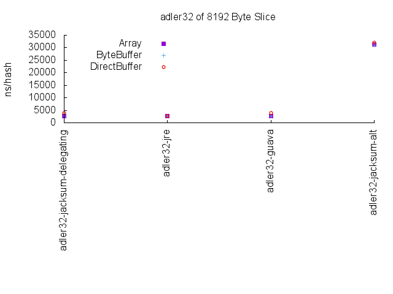

| Algorithm |  Array | ByteBuffer | DirectBuffer |
| --- | ---: | ---: | ---: | 
| [adler32-jacksum-delegating](#adler32-jacksum-delegating-latency) | 2744.985822 | 2749.587673 | 3793.962084 |
| [adler32-jre](#adler32-jre-latency) | 2788.847869 | 2741.886234 | 2718.097215 |
| [adler32-guava](#adler32-guava-latency) | 2809.863515 | 2764.640709 | 4025.740884 |
| [adler32-jacksum-alt](#adler32-jacksum-alt-latency) | 31411.840545 | 31008.591644 | 32036.479502 |

---
### 8192 Byte Slice Latency (city64)
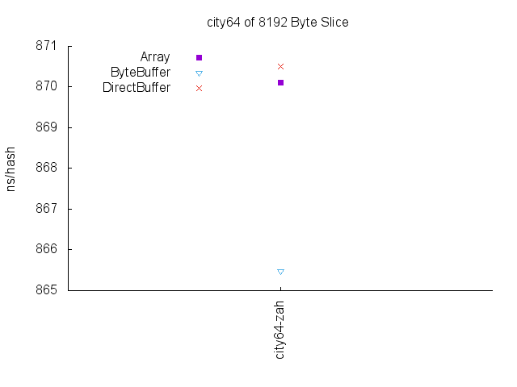

| Algorithm |  Array | ByteBuffer | DirectBuffer |
| --- | ---: | ---: | ---: | 
| [city64-zah](#city64-zah-latency) | 870.105479 | 865.475914 | 870.501318 |

---
### 8192 Byte Slice Latency (cksum)
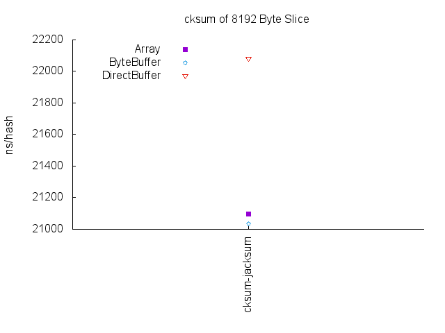

| Algorithm |  Array | ByteBuffer | DirectBuffer |
| --- | ---: | ---: | ---: | 
| [cksum-jacksum](#cksum-jacksum-latency) | 21098.784421 | 21036.140208 | 22080.691325 |

---
### 8192 Byte Slice Latency (crc16)
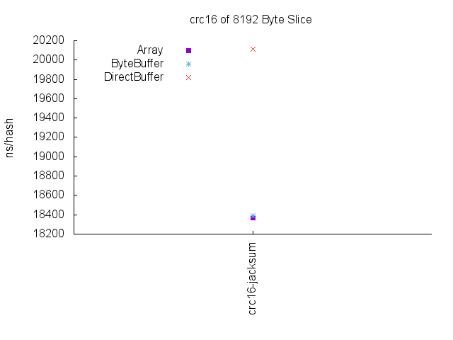

| Algorithm |  Array | ByteBuffer | DirectBuffer |
| --- | ---: | ---: | ---: | 
| [crc16-jacksum](#crc16-jacksum-latency) | 18367.279052 | 18391.720419 | 20115.082137 |

---
### 8192 Byte Slice Latency (crc24)
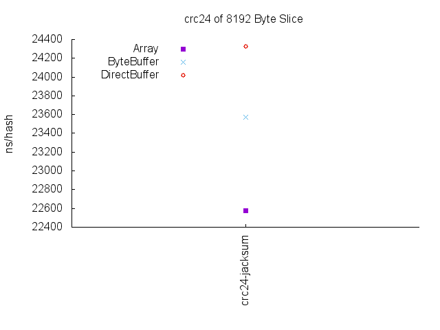

| Algorithm |  Array | ByteBuffer | DirectBuffer |
| --- | ---: | ---: | ---: | 
| [crc24-jacksum](#crc24-jacksum-latency) | 22572.263451 | 23574.318455 | 24328.435880 |

---
### 8192 Byte Slice Latency (crc32)
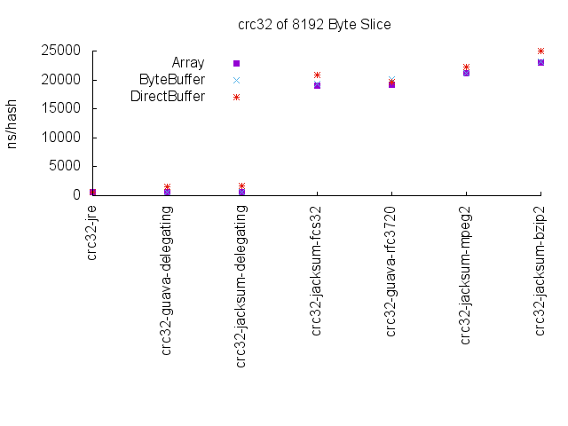

| Algorithm |  Array | ByteBuffer | DirectBuffer |
| --- | ---: | ---: | ---: | 
| [crc32-jre](#crc32-jre-latency) | 630.561420 | 643.883467 | 650.965220 |
| [crc32-guava-delegating](#crc32-guava-delegating-latency) | 649.448690 | 645.791351 | 1534.993018 |
| [crc32-jacksum-delegating](#crc32-jacksum-delegating-latency) | 651.459114 | 633.685152 | 1712.369109 |
| [crc32-jacksum-fcs32](#crc32-jacksum-fcs32-latency) | 18999.473328 | 19367.191782 | 20854.945874 |
| [crc32-guava-rfc3720](#crc32-guava-rfc3720-latency) | 19159.160631 | 20120.403489 | 19703.481810 |
| [crc32-jacksum-mpeg2](#crc32-jacksum-mpeg2-latency) | 21092.337968 | 21090.253626 | 22186.274584 |
| [crc32-jacksum-bzip2](#crc32-jacksum-bzip2-latency) | 22935.425550 | 23189.319844 | 24958.032272 |

---
### 8192 Byte Slice Latency (crc64)
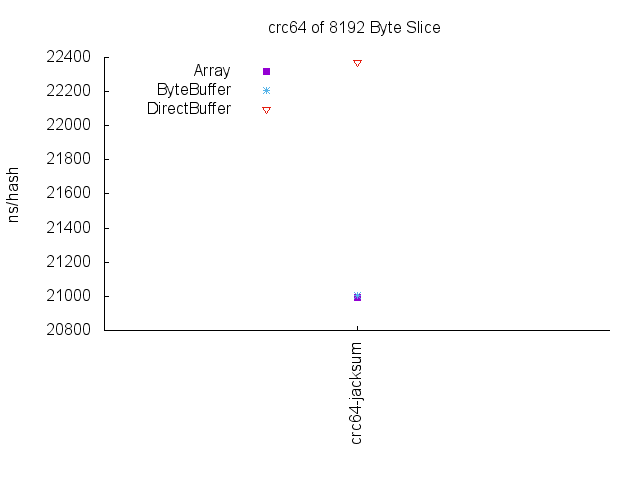

| Algorithm |  Array | ByteBuffer | DirectBuffer |
| --- | ---: | ---: | ---: | 
| [crc64-jacksum](#crc64-jacksum-latency) | 20992.668859 | 21006.910741 | 22372.612720 |

---
### 8192 Byte Slice Latency (crc8)
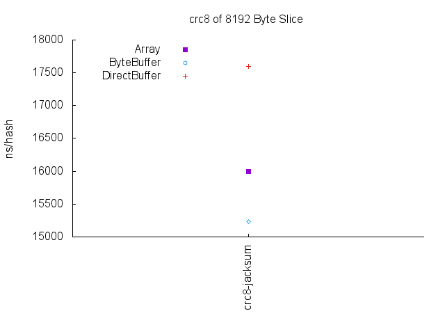

| Algorithm |  Array | ByteBuffer | DirectBuffer |
| --- | ---: | ---: | ---: | 
| [crc8-jacksum](#crc8-jacksum-latency) | 15992.082810 | 15231.515276 | 17593.303078 |

---
### 8192 Byte Slice Latency (ed2k)
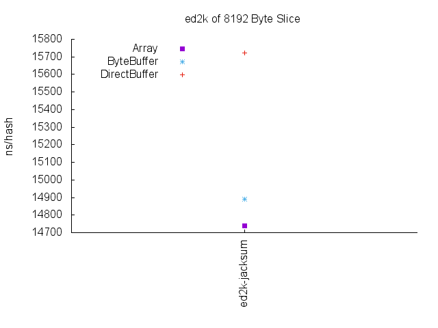

| Algorithm |  Array | ByteBuffer | DirectBuffer |
| --- | ---: | ---: | ---: | 
| [ed2k-jacksum](#ed2k-jacksum-latency) | 14737.868282 | 14890.558388 | 15720.531813 |

---
### 8192 Byte Slice Latency (elf)
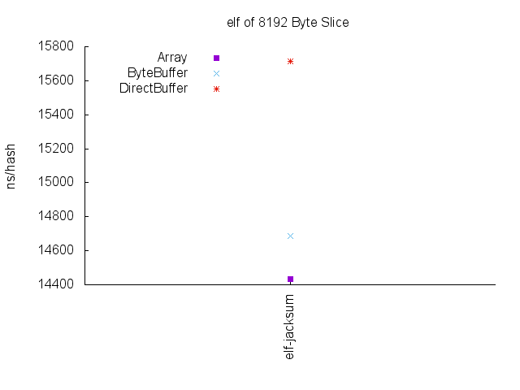

| Algorithm |  Array | ByteBuffer | DirectBuffer |
| --- | ---: | ---: | ---: | 
| [elf-jacksum](#elf-jacksum-latency) | 14434.419809 | 14684.868442 | 15712.552990 |

---
### 8192 Byte Slice Latency (farmna)
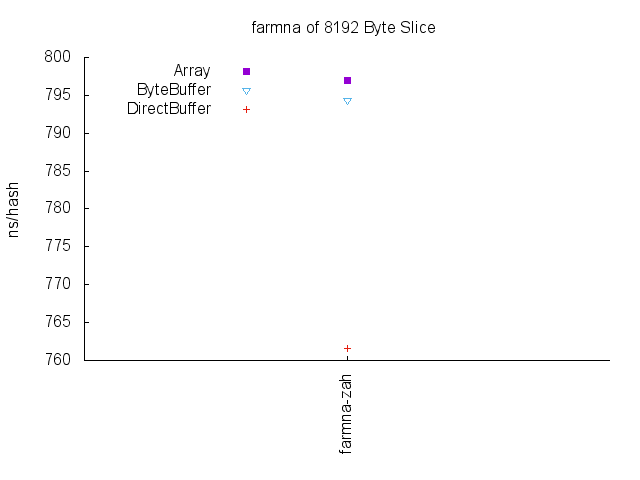

| Algorithm |  Array | ByteBuffer | DirectBuffer |
| --- | ---: | ---: | ---: | 
| [farmna-zah](#farmna-zah-latency) | 796.924494 | 794.274770 | 761.545459 |

---
### 8192 Byte Slice Latency (farmuo)
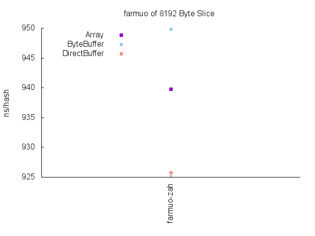

| Algorithm |  Array | ByteBuffer | DirectBuffer |
| --- | ---: | ---: | ---: | 
| [farmuo-zah](#farmuo-zah-latency) | 939.779413 | 949.825592 | 925.750406 |

---
### 8192 Byte Slice Latency (fcs16)
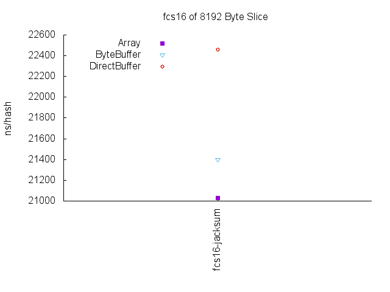

| Algorithm |  Array | ByteBuffer | DirectBuffer |
| --- | ---: | ---: | ---: | 
| [fcs16-jacksum](#fcs16-jacksum-latency) | 21030.727957 | 21395.761131 | 22460.217989 |

---
### 8192 Byte Slice Latency (gfh32)
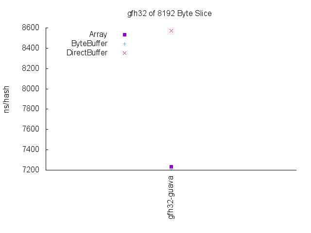

| Algorithm |  Array | ByteBuffer | DirectBuffer |
| --- | ---: | ---: | ---: | 
| [gfh32-guava](#gfh32-guava-latency) | 7234.125185 | 7208.889249 | 8572.867843 |

---
### 8192 Byte Slice Latency (gfh64)
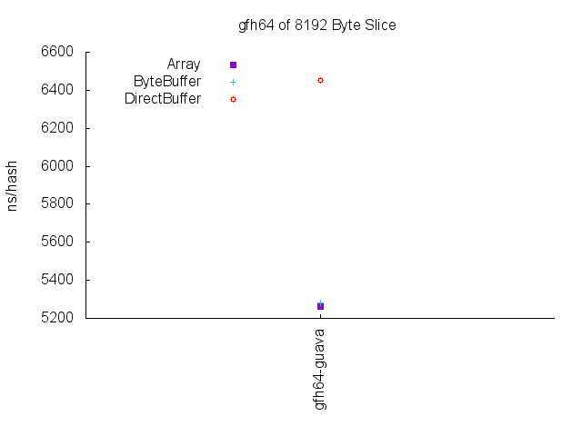

| Algorithm |  Array | ByteBuffer | DirectBuffer |
| --- | ---: | ---: | ---: | 
| [gfh64-guava](#gfh64-guava-latency) | 5262.648075 | 5283.245478 | 6452.966461 |

---
### 8192 Byte Slice Latency (gost)
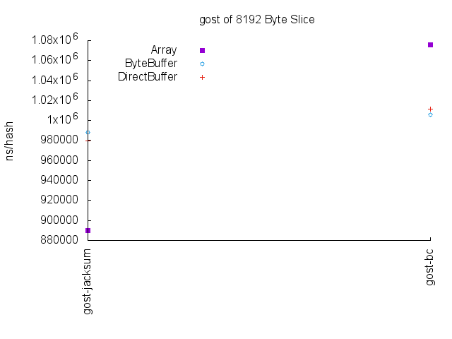

| Algorithm |  Array | ByteBuffer | DirectBuffer |
| --- | ---: | ---: | ---: | 
| [gost-jacksum](#gost-jacksum-latency) | 889656.879256 | 988203.475030 | 979807.050747 |
| [gost-bc](#gost-bc-latency) | 1075966.811909 | 1005802.278530 | 1011139.821560 |

---
### 8192 Byte Slice Latency (has160)
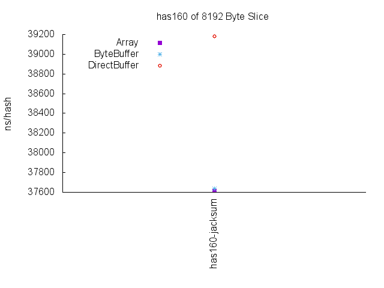

| Algorithm |  Array | ByteBuffer | DirectBuffer |
| --- | ---: | ---: | ---: | 
| [has160-jacksum](#has160-jacksum-latency) | 37617.311632 | 37636.306443 | 39183.361435 |

---
### 8192 Byte Slice Latency (haval128h3)
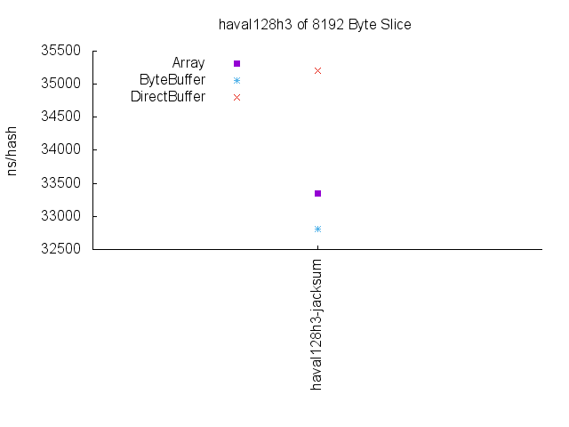

| Algorithm |  Array | ByteBuffer | DirectBuffer |
| --- | ---: | ---: | ---: | 
| [haval128h3-jacksum](#haval128h3-jacksum-latency) | 33353.881656 | 32805.293952 | 35208.110316 |

---
### 8192 Byte Slice Latency (haval128h4)

| Algorithm |  Array | ByteBuffer | DirectBuffer |
| --- | ---: | ---: | ---: | 
| [haval128h4-jacksum](#haval128h4-jacksum-latency) | 45833.141497 | 45014.344550 | 46739.307270 |

---
### 8192 Byte Slice Latency (haval128h5)
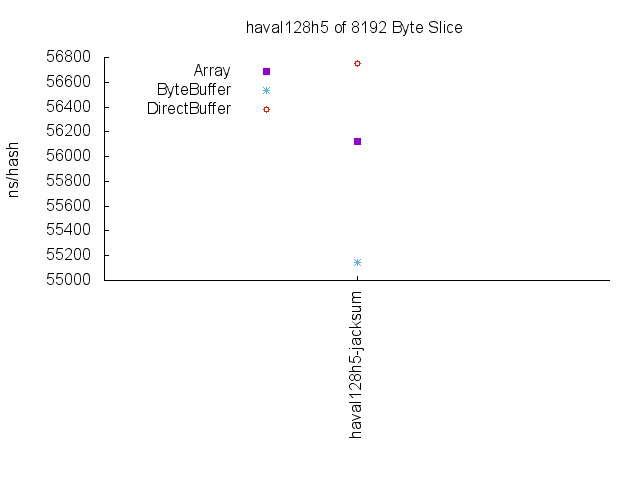

| Algorithm |  Array | ByteBuffer | DirectBuffer |
| --- | ---: | ---: | ---: | 
| [haval128h5-jacksum](#haval128h5-jacksum-latency) | 56117.986844 | 55142.231825 | 56754.106237 |

---
### 8192 Byte Slice Latency (haval160h3)
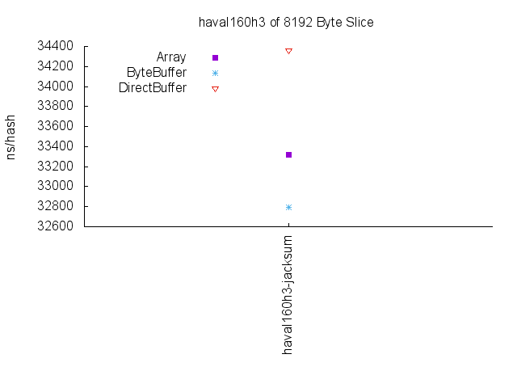

| Algorithm |  Array | ByteBuffer | DirectBuffer |
| --- | ---: | ---: | ---: | 
| [haval160h3-jacksum](#haval160h3-jacksum-latency) | 33317.175275 | 32793.753283 | 34361.357137 |

---
### 8192 Byte Slice Latency (haval160h4)
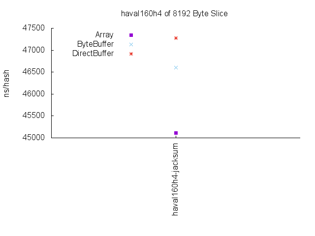

| Algorithm |  Array | ByteBuffer | DirectBuffer |
| --- | ---: | ---: | ---: | 
| [haval160h4-jacksum](#haval160h4-jacksum-latency) | 45117.399427 | 46602.795677 | 47275.778164 |

---
### 8192 Byte Slice Latency (haval160h5)
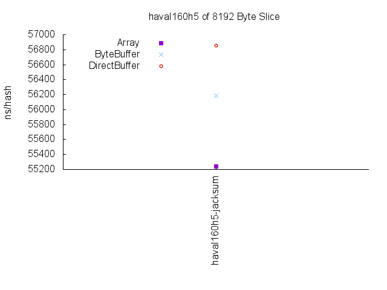

| Algorithm |  Array | ByteBuffer | DirectBuffer |
| --- | ---: | ---: | ---: | 
| [haval160h5-jacksum](#haval160h5-jacksum-latency) | 55238.288489 | 56186.585391 | 56858.401148 |

---
### 8192 Byte Slice Latency (haval192h3)
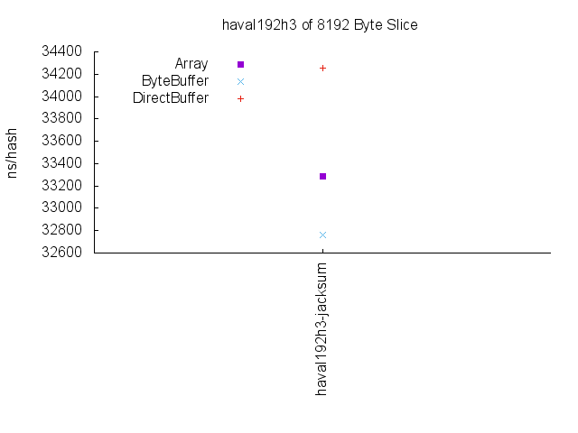

| Algorithm |  Array | ByteBuffer | DirectBuffer |
| --- | ---: | ---: | ---: | 
| [haval192h3-jacksum](#haval192h3-jacksum-latency) | 33284.103360 | 32762.199941 | 34258.316954 |

---
### 8192 Byte Slice Latency (haval192h4)
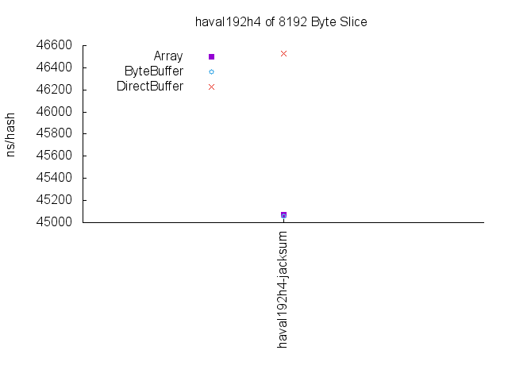

| Algorithm |  Array | ByteBuffer | DirectBuffer |
| --- | ---: | ---: | ---: | 
| [haval192h4-jacksum](#haval192h4-jacksum-latency) | 45069.557121 | 45054.280113 | 46528.950484 |

---
### 8192 Byte Slice Latency (haval192h5)
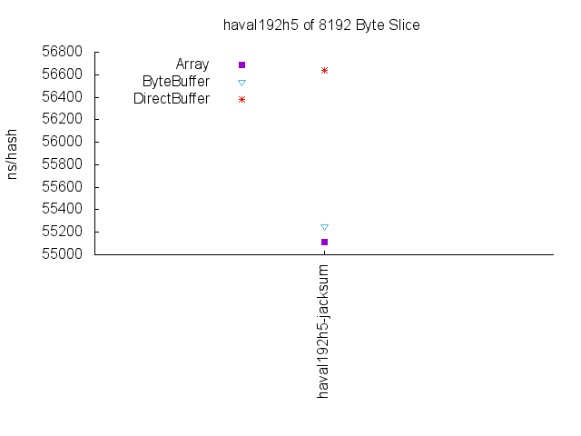

| Algorithm |  Array | ByteBuffer | DirectBuffer |
| --- | ---: | ---: | ---: | 
| [haval192h5-jacksum](#haval192h5-jacksum-latency) | 55109.805545 | 55249.517711 | 56637.043396 |

---
### 8192 Byte Slice Latency (haval224h3)
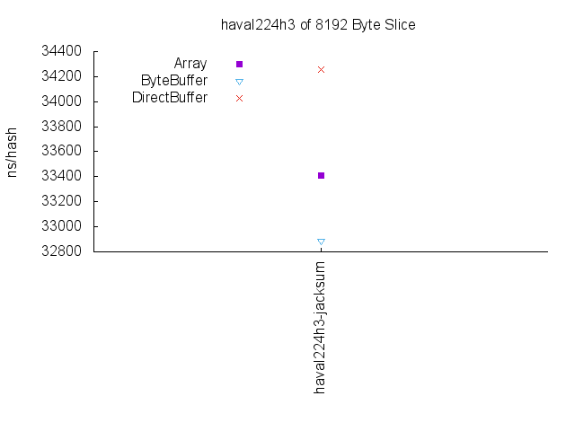

| Algorithm |  Array | ByteBuffer | DirectBuffer |
| --- | ---: | ---: | ---: | 
| [haval224h3-jacksum](#haval224h3-jacksum-latency) | 33411.387081 | 32885.862579 | 34253.354242 |

---
### 8192 Byte Slice Latency (haval224h4)
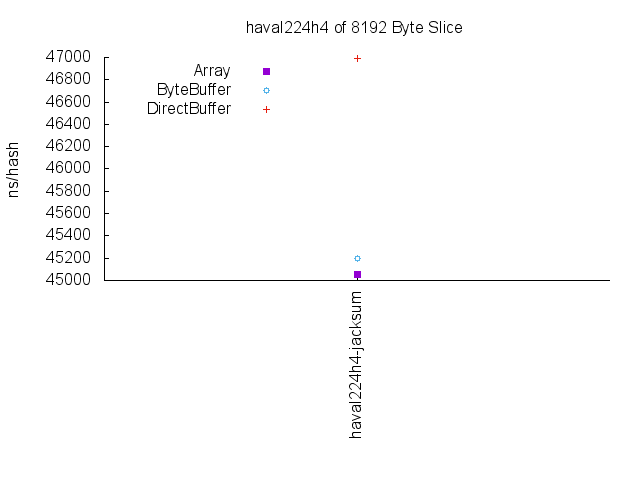

| Algorithm |  Array | ByteBuffer | DirectBuffer |
| --- | ---: | ---: | ---: | 
| [haval224h4-jacksum](#haval224h4-jacksum-latency) | 45055.611212 | 45197.368578 | 46988.812268 |

---
### 8192 Byte Slice Latency (haval224h5)
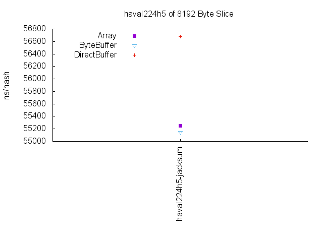

| Algorithm |  Array | ByteBuffer | DirectBuffer |
| --- | ---: | ---: | ---: | 
| [haval224h5-jacksum](#haval224h5-jacksum-latency) | 55252.560104 | 55144.047873 | 56677.173782 |

---
### 8192 Byte Slice Latency (haval256h3)
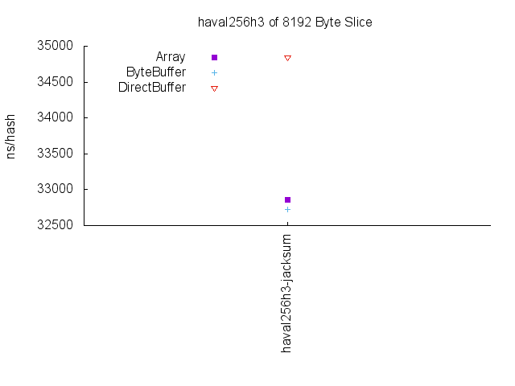

| Algorithm |  Array | ByteBuffer | DirectBuffer |
| --- | ---: | ---: | ---: | 
| [haval256h3-jacksum](#haval256h3-jacksum-latency) | 32862.030587 | 32720.801797 | 34838.525412 |

---
### 8192 Byte Slice Latency (haval256h4)
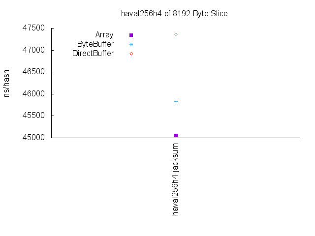

| Algorithm |  Array | ByteBuffer | DirectBuffer |
| --- | ---: | ---: | ---: | 
| [haval256h4-jacksum](#haval256h4-jacksum-latency) | 45060.219433 | 45831.977624 | 47365.557322 |

---
### 8192 Byte Slice Latency (haval256h5)
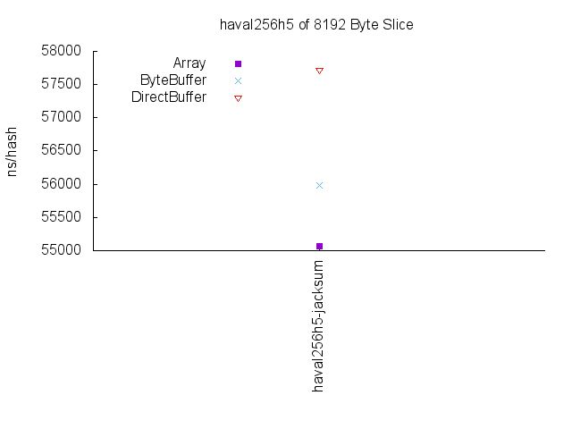

| Algorithm |  Array | ByteBuffer | DirectBuffer |
| --- | ---: | ---: | ---: | 
| [haval256h5-jacksum](#haval256h5-jacksum-latency) | 55062.446166 | 55986.846183 | 57717.208039 |

---
### 8192 Byte Slice Latency (md2)
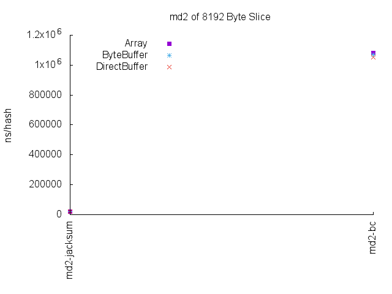

| Algorithm |  Array | ByteBuffer | DirectBuffer |
| --- | ---: | ---: | ---: | 
| [md2-jacksum](#md2-jacksum-latency) | 19616.270403 | 19584.323864 | 21895.509538 |
| [md2-bc](#md2-bc-latency) | 1081200.392218 | 1067269.814371 | 1050663.360549 |

---
### 8192 Byte Slice Latency (md4)
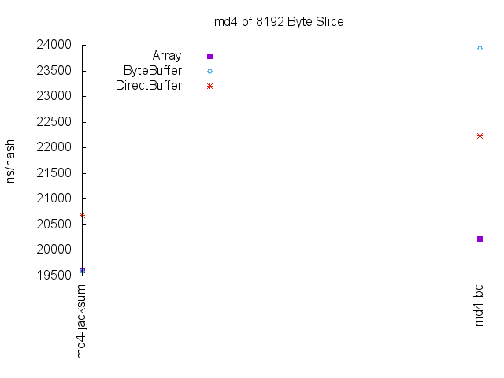

| Algorithm |  Array | ByteBuffer | DirectBuffer |
| --- | ---: | ---: | ---: | 
| [md4-jacksum](#md4-jacksum-latency) | 19612.780280 | 19586.214395 | 20681.523132 |
| [md4-bc](#md4-bc-latency) | 20222.951302 | 23943.649311 | 22235.398595 |

---
### 8192 Byte Slice Latency (md5)
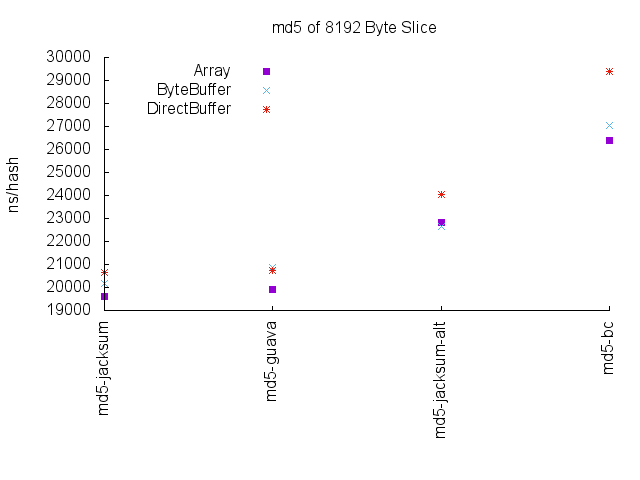

| Algorithm |  Array | ByteBuffer | DirectBuffer |
| --- | ---: | ---: | ---: | 
| [md5-jacksum](#md5-jacksum-latency) | 19593.409446 | 20159.469708 | 20661.679418 |
| [md5-guava](#md5-guava-latency) | 19920.567060 | 20878.201941 | 20753.861016 |
| [md5-jacksum-alt](#md5-jacksum-alt-latency) | 22837.308977 | 22668.137475 | 24023.511173 |
| [md5-bc](#md5-bc-latency) | 26375.480715 | 27059.742983 | 29412.411614 |

---
### 8192 Byte Slice Latency (murmur3h128)
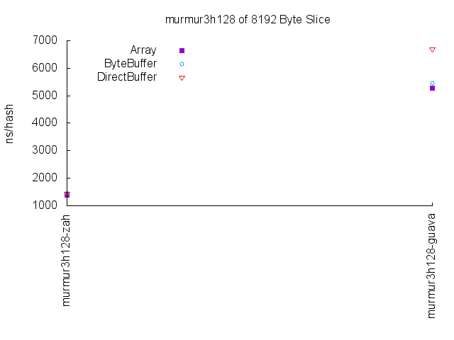

| Algorithm |  Array | ByteBuffer | DirectBuffer |
| --- | ---: | ---: | ---: | 
| [murmur3h128-zah](#murmur3h128-zah-latency) | 1379.090755 | 1472.696930 | 1443.267383 |
| [murmur3h128-guava](#murmur3h128-guava-latency) | 5269.574699 | 5460.068877 | 6684.116962 |

---
### 8192 Byte Slice Latency (murmur3h32)

| Algorithm |  Array | ByteBuffer | DirectBuffer |
| --- | ---: | ---: | ---: | 
| [murmur3h32-guava](#murmur3h32-guava-latency) | 7352.426401 | 7205.696842 | 8169.977227 |

---
### 8192 Byte Slice Latency (ripemd128)
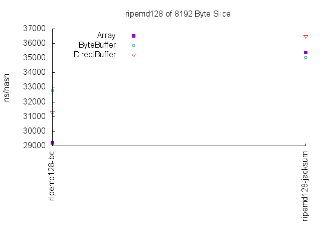

| Algorithm |  Array | ByteBuffer | DirectBuffer |
| --- | ---: | ---: | ---: | 
| [ripemd128-bc](#ripemd128-bc-latency) | 29198.626867 | 32778.869217 | 31251.587359 |
| [ripemd128-jacksum](#ripemd128-jacksum-latency) | 35384.023321 | 35039.469629 | 36479.859401 |

---
### 8192 Byte Slice Latency (ripemd160)
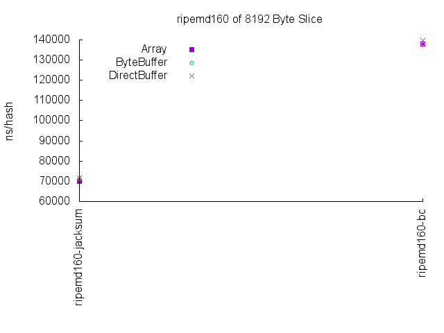

| Algorithm |  Array | ByteBuffer | DirectBuffer |
| --- | ---: | ---: | ---: | 
| [ripemd160-jacksum](#ripemd160-jacksum-latency) | 69897.153076 | 71343.005624 | 71765.484139 |
| [ripemd160-bc](#ripemd160-bc-latency) | 138091.504564 | 137982.622973 | 139710.254016 |

---
### 8192 Byte Slice Latency (ripemd256)
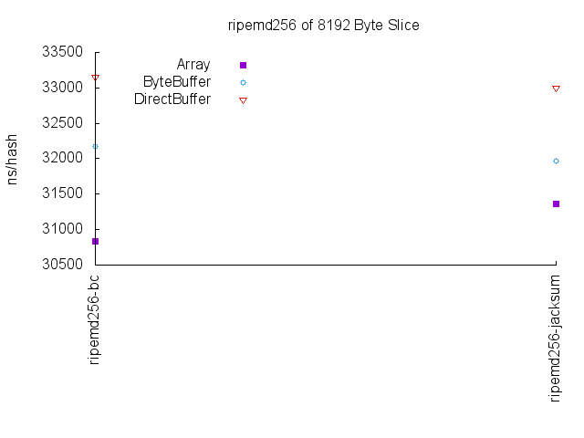

| Algorithm |  Array | ByteBuffer | DirectBuffer |
| --- | ---: | ---: | ---: | 
| [ripemd256-bc](#ripemd256-bc-latency) | 30840.148581 | 32171.590768 | 33149.056581 |
| [ripemd256-jacksum](#ripemd256-jacksum-latency) | 31361.501615 | 31966.961796 | 32997.187031 |

---
### 8192 Byte Slice Latency (ripemd320)
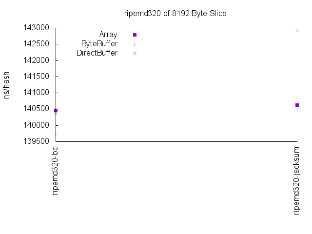

| Algorithm |  Array | ByteBuffer | DirectBuffer |
| --- | ---: | ---: | ---: | 
| [ripemd320-bc](#ripemd320-bc-latency) | 140460.251094 | 139708.870711 | 140366.825407 |
| [ripemd320-jacksum](#ripemd320-jacksum-latency) | 140632.860312 | 140476.223374 | 142927.687622 |

---
### 8192 Byte Slice Latency (sha0)
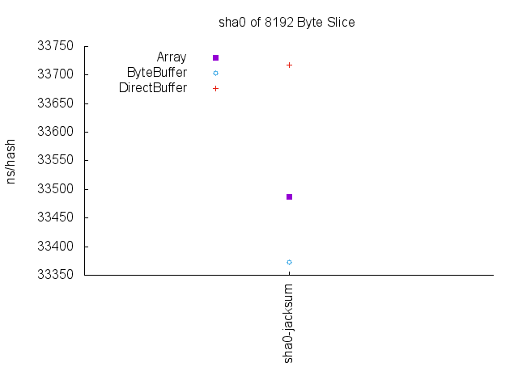

| Algorithm |  Array | ByteBuffer | DirectBuffer |
| --- | ---: | ---: | ---: | 
| [sha0-jacksum](#sha0-jacksum-latency) | 33486.957274 | 33373.151356 | 33716.808801 |

---
### 8192 Byte Slice Latency (sha1)
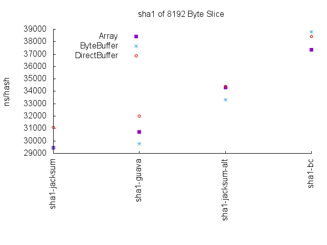

| Algorithm |  Array | ByteBuffer | DirectBuffer |
| --- | ---: | ---: | ---: | 
| [sha1-jacksum](#sha1-jacksum-latency) | 29437.768747 | 29456.503574 | 31113.792839 |
| [sha1-guava](#sha1-guava-latency) | 30739.703914 | 29802.204609 | 32021.373096 |
| [sha1-jacksum-alt](#sha1-jacksum-alt-latency) | 34306.102076 | 33314.033539 | 34400.927399 |
| [sha1-bc](#sha1-bc-latency) | 37374.323379 | 38785.055422 | 38417.875196 |

---
### 8192 Byte Slice Latency (sha224)
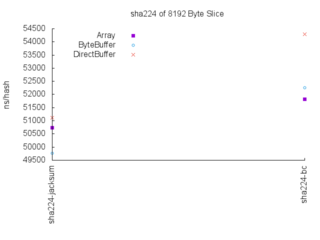

| Algorithm |  Array | ByteBuffer | DirectBuffer |
| --- | ---: | ---: | ---: | 
| [sha224-jacksum](#sha224-jacksum-latency) | 50736.618796 | 49763.560406 | 51110.645141 |
| [sha224-bc](#sha224-bc-latency) | 51814.779484 | 52249.468675 | 54295.095132 |

---
### 8192 Byte Slice Latency (sha256)
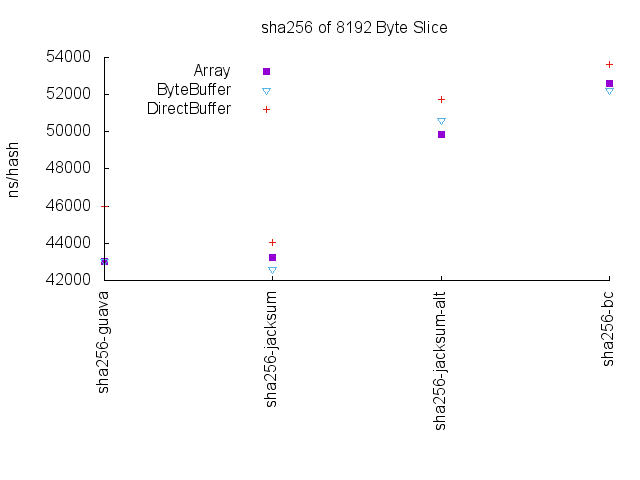

| Algorithm |  Array | ByteBuffer | DirectBuffer |
| --- | ---: | ---: | ---: | 
| [sha256-guava](#sha256-guava-latency) | 43040.533491 | 43033.001197 | 45965.676227 |
| [sha256-jacksum](#sha256-jacksum-latency) | 43226.962375 | 42598.142023 | 44041.724481 |
| [sha256-jacksum-alt](#sha256-jacksum-alt-latency) | 49881.168312 | 50594.527618 | 51763.961782 |
| [sha256-bc](#sha256-bc-latency) | 52627.383582 | 52237.899254 | 53604.876066 |

---
### 8192 Byte Slice Latency (sha3)
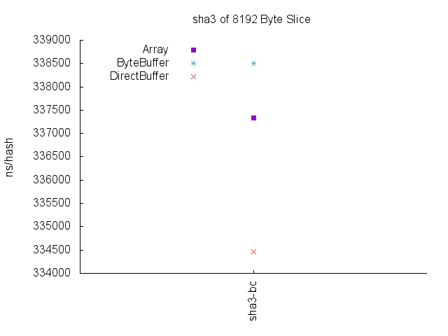

| Algorithm |  Array | ByteBuffer | DirectBuffer |
| --- | ---: | ---: | ---: | 
| [sha3-bc](#sha3-bc-latency) | 337329.878018 | 338511.193979 | 334466.163732 |

---
### 8192 Byte Slice Latency (sha384)
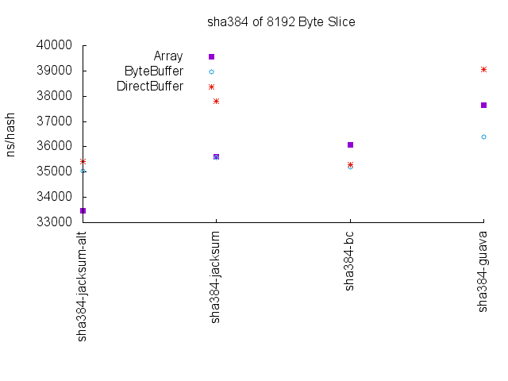

| Algorithm |  Array | ByteBuffer | DirectBuffer |
| --- | ---: | ---: | ---: | 
| [sha384-jacksum-alt](#sha384-jacksum-alt-latency) | 33464.755735 | 35047.741172 | 35414.101662 |
| [sha384-jacksum](#sha384-jacksum-latency) | 35596.735924 | 35581.099846 | 37800.329805 |
| [sha384-bc](#sha384-bc-latency) | 36082.247925 | 35186.367297 | 35280.600619 |
| [sha384-guava](#sha384-guava-latency) | 37638.089833 | 36383.220508 | 39072.810598 |

---
### 8192 Byte Slice Latency (sha512)
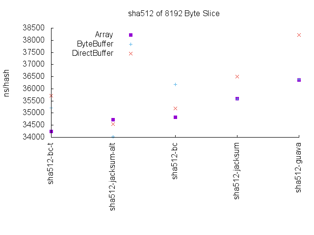

| Algorithm |  Array | ByteBuffer | DirectBuffer |
| --- | ---: | ---: | ---: | 
| [sha512-bc-t](#sha512-bc-t-latency) | 34248.867701 | 35207.793292 | 35721.494459 |
| [sha512-jacksum-alt](#sha512-jacksum-alt-latency) | 34732.116784 | 34016.241952 | 34540.067277 |
| [sha512-bc](#sha512-bc-latency) | 34830.603180 | 36182.648196 | 35183.758354 |
| [sha512-jacksum](#sha512-jacksum-latency) | 35590.719708 | 35577.871893 | 36503.522251 |
| [sha512-guava](#sha512-guava-latency) | 36365.347337 | 36385.863756 | 38217.465302 |

---
### 8192 Byte Slice Latency (sip)
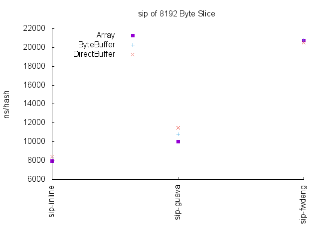

| Algorithm |  Array | ByteBuffer | DirectBuffer |
| --- | ---: | ---: | ---: | 
| [sip-inline](#sip-inline-latency) | 7953.232743 | 8400.773218 | 8444.171623 |
| [sip-guava](#sip-guava-latency) | 9992.884988 | 10802.121830 | 11501.762111 |
| [sip-fwdeng](#sip-fwdeng-latency) | 20748.627698 | 20782.029458 | 20544.968258 |

---
### 8192 Byte Slice Latency (skein1024)
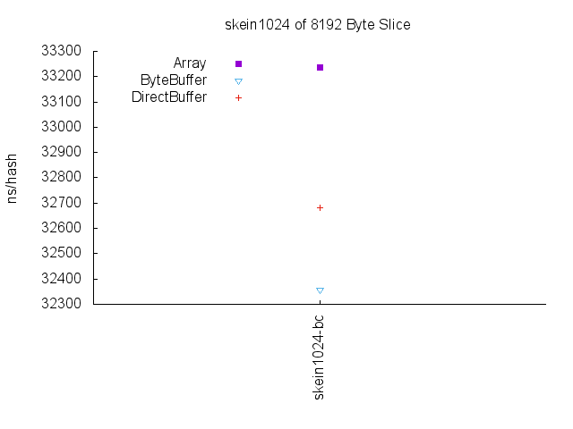

| Algorithm |  Array | ByteBuffer | DirectBuffer |
| --- | ---: | ---: | ---: | 
| [skein1024-bc](#skein1024-bc-latency) | 33235.938759 | 32358.204140 | 32681.886517 |

---
### 8192 Byte Slice Latency (skein256)
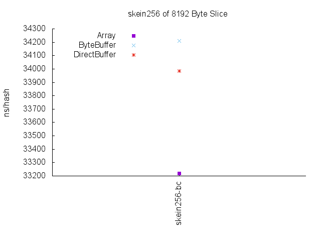

| Algorithm |  Array | ByteBuffer | DirectBuffer |
| --- | ---: | ---: | ---: | 
| [skein256-bc](#skein256-bc-latency) | 33219.408104 | 34208.655919 | 33985.955510 |

---
### 8192 Byte Slice Latency (skein512)
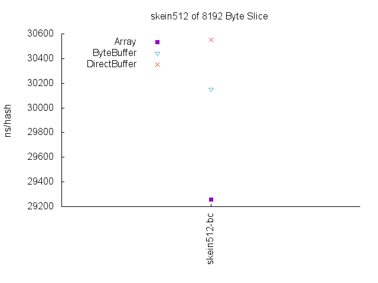

| Algorithm |  Array | ByteBuffer | DirectBuffer |
| --- | ---: | ---: | ---: | 
| [skein512-bc](#skein512-bc-latency) | 29258.842381 | 30151.527259 | 30552.361784 |

---
### 8192 Byte Slice Latency (sm3)
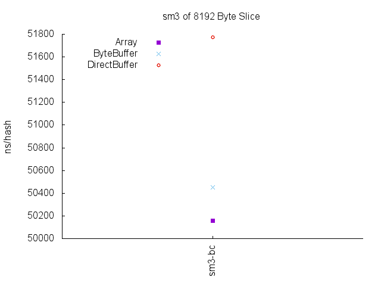

| Algorithm |  Array | ByteBuffer | DirectBuffer |
| --- | ---: | ---: | ---: | 
| [sm3-bc](#sm3-bc-latency) | 50160.031519 | 50452.064662 | 51771.843673 |

---
### 8192 Byte Slice Latency (sum16)
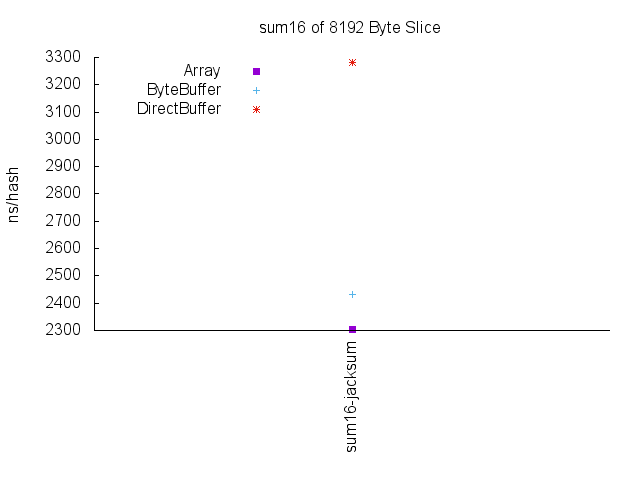

| Algorithm |  Array | ByteBuffer | DirectBuffer |
| --- | ---: | ---: | ---: | 
| [sum16-jacksum](#sum16-jacksum-latency) | 2304.013395 | 2432.397219 | 3279.957098 |

---
### 8192 Byte Slice Latency (sum24)
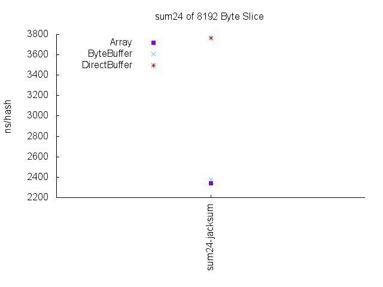

| Algorithm |  Array | ByteBuffer | DirectBuffer |
| --- | ---: | ---: | ---: | 
| [sum24-jacksum](#sum24-jacksum-latency) | 2342.702799 | 2376.471642 | 3767.208513 |

---
### 8192 Byte Slice Latency (sum32)
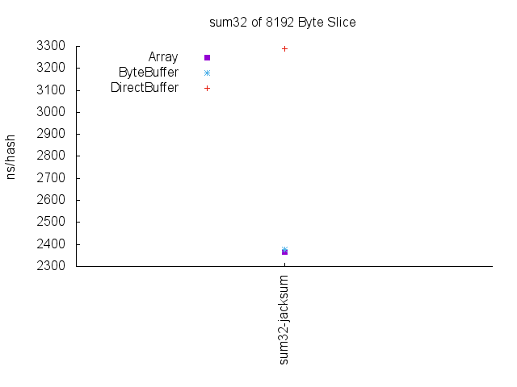

| Algorithm |  Array | ByteBuffer | DirectBuffer |
| --- | ---: | ---: | ---: | 
| [sum32-jacksum](#sum32-jacksum-latency) | 2365.723267 | 2375.652757 | 3289.773825 |

---
### 8192 Byte Slice Latency (sum8)
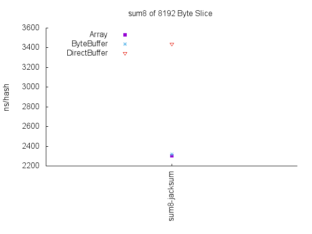

| Algorithm |  Array | ByteBuffer | DirectBuffer |
| --- | ---: | ---: | ---: | 
| [sum8-jacksum](#sum8-jacksum-latency) | 2303.063745 | 2320.452776 | 3436.563948 |

---
### 8192 Byte Slice Latency (sumbsd)
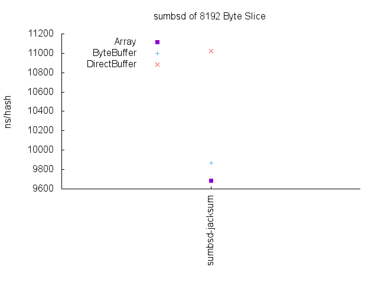

| Algorithm |  Array | ByteBuffer | DirectBuffer |
| --- | ---: | ---: | ---: | 
| [sumbsd-jacksum](#sumbsd-jacksum-latency) | 9685.845923 | 9866.911238 | 11021.658899 |

---
### 8192 Byte Slice Latency (sumsysv)
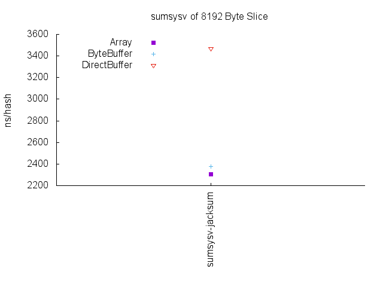

| Algorithm |  Array | ByteBuffer | DirectBuffer |
| --- | ---: | ---: | ---: | 
| [sumsysv-jacksum](#sumsysv-jacksum-latency) | 2305.905916 | 2374.372807 | 3465.361749 |

---
### 8192 Byte Slice Latency (tiger)
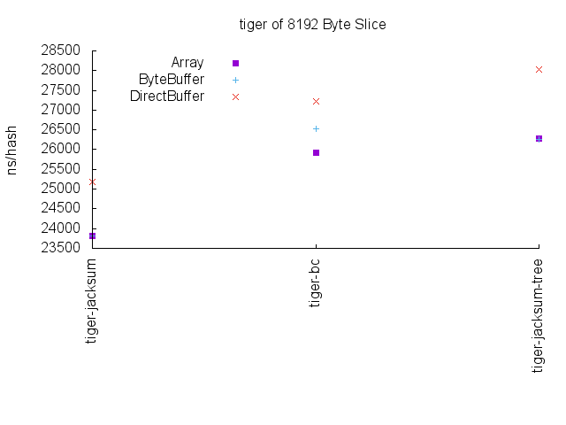

| Algorithm |  Array | ByteBuffer | DirectBuffer |
| --- | ---: | ---: | ---: | 
| [tiger-jacksum](#tiger-jacksum-latency) | 23820.877741 | 23803.295380 | 25183.590013 |
| [tiger-bc](#tiger-bc-latency) | 25926.594270 | 26523.603590 | 27211.088858 |
| [tiger-jacksum-tree](#tiger-jacksum-tree-latency) | 26277.536930 | 26260.512224 | 28032.017864 |

---
### 8192 Byte Slice Latency (tiger128)
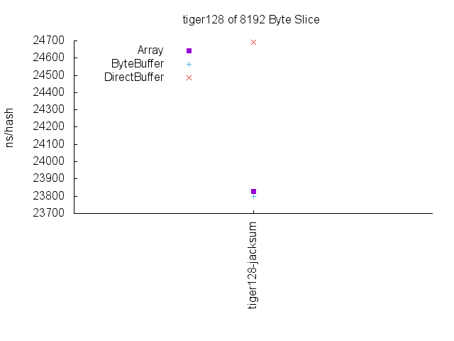

| Algorithm |  Array | ByteBuffer | DirectBuffer |
| --- | ---: | ---: | ---: | 
| [tiger128-jacksum](#tiger128-jacksum-latency) | 23829.608494 | 23797.479342 | 24692.035657 |

---
### 8192 Byte Slice Latency (tiger160)
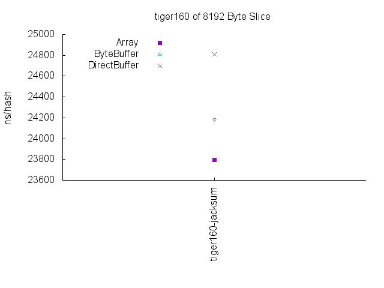

| Algorithm |  Array | ByteBuffer | DirectBuffer |
| --- | ---: | ---: | ---: | 
| [tiger160-jacksum](#tiger160-jacksum-latency) | 23795.541387 | 24179.646856 | 24807.059105 |

---
### 8192 Byte Slice Latency (tiger2)
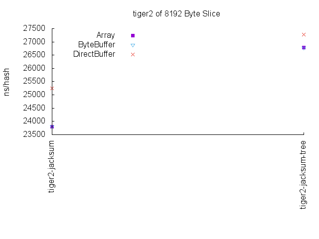

| Algorithm |  Array | ByteBuffer | DirectBuffer |
| --- | ---: | ---: | ---: | 
| [tiger2-jacksum](#tiger2-jacksum-latency) | 23804.803725 | 23792.541837 | 25245.903012 |
| [tiger2-jacksum-tree](#tiger2-jacksum-tree-latency) | 26788.679640 | 26763.321492 | 27267.607425 |

---
### 8192 Byte Slice Latency (whirlpool0)
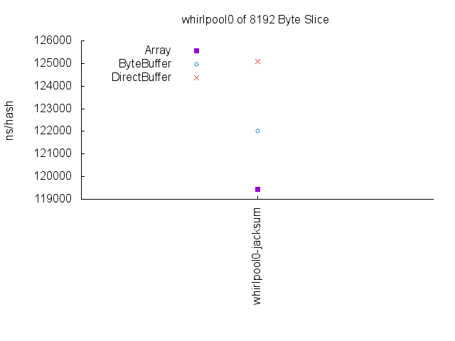

| Algorithm |  Array | ByteBuffer | DirectBuffer |
| --- | ---: | ---: | ---: | 
| [whirlpool0-jacksum](#whirlpool0-jacksum-latency) | 119451.876075 | 122003.693561 | 125098.950761 |

---
### 8192 Byte Slice Latency (whirlpool1)
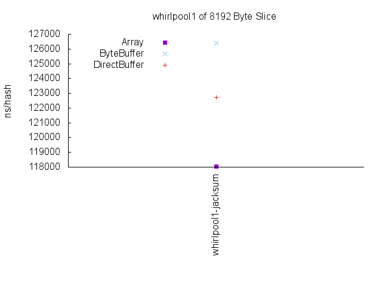

| Algorithm |  Array | ByteBuffer | DirectBuffer |
| --- | ---: | ---: | ---: | 
| [whirlpool1-jacksum](#whirlpool1-jacksum-latency) | 118028.587149 | 126391.688667 | 122728.823475 |

---
### 8192 Byte Slice Latency (whirlpool2)
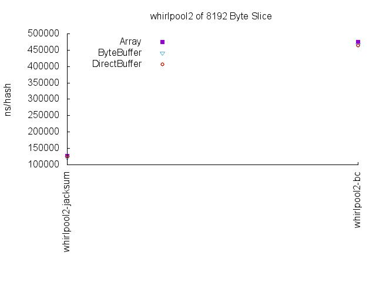

| Algorithm |  Array | ByteBuffer | DirectBuffer |
| --- | ---: | ---: | ---: | 
| [whirlpool2-jacksum](#whirlpool2-jacksum-latency) | 126100.621070 | 121649.213213 | 124708.926885 |
| [whirlpool2-bc](#whirlpool2-bc-latency) | 474744.055776 | 465764.524802 | 463435.770553 |

---
### 8192 Byte Slice Latency (xor8)
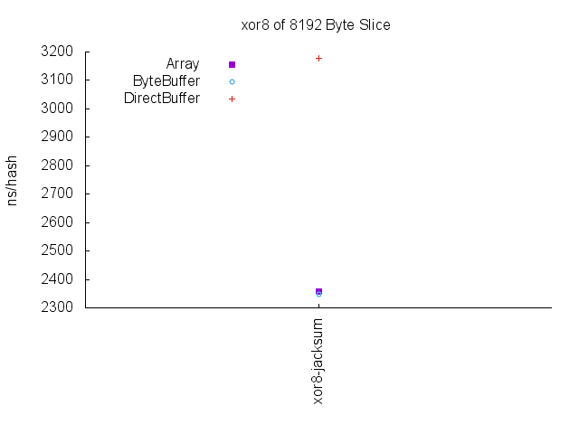

| Algorithm |  Array | ByteBuffer | DirectBuffer |
| --- | ---: | ---: | ---: | 
| [xor8-jacksum](#xor8-jacksum-latency) | 2358.379524 | 2346.841174 | 3179.288314 |

---
### 8192 Byte Slice Latency (xxh32)
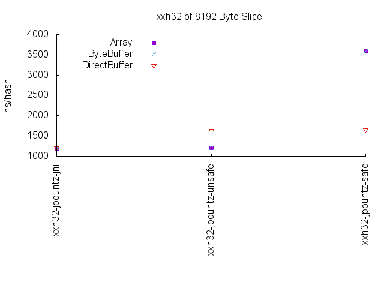

| Algorithm |  Array | ByteBuffer | DirectBuffer |
| --- | ---: | ---: | ---: | 
| [xxh32-jpountz-jni](#xxh32-jpountz-jni-latency) | 1187.898092 | 1210.268644 | 1206.773345 |
| [xxh32-jpountz-unsafe](#xxh32-jpountz-unsafe-latency) | 1211.150038 | 1212.147111 | 1634.835630 |
| [xxh32-jpountz-safe](#xxh32-jpountz-safe-latency) | 3592.209580 | 3590.074817 | 1644.757610 |

---
### 8192 Byte Slice Latency (xxh64)
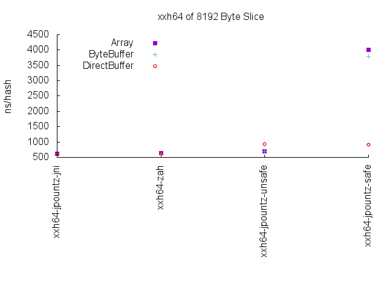

| Algorithm |  Array | ByteBuffer | DirectBuffer |
| --- | ---: | ---: | ---: | 
| [xxh64-jpountz-jni](#xxh64-jpountz-jni-latency) | 620.721180 | 623.863792 | 627.324571 |
| [xxh64-zah](#xxh64-zah-latency) | 630.188956 | 614.777509 | 615.631463 |
| [xxh64-jpountz-unsafe](#xxh64-jpountz-unsafe-latency) | 687.469125 | 687.436656 | 930.866660 |
| [xxh64-jpountz-safe](#xxh64-jpountz-safe-latency) | 4009.622272 | 3782.054234 | 920.637714 |

---
### 16384 Byte Slice Latency (All Hashes)
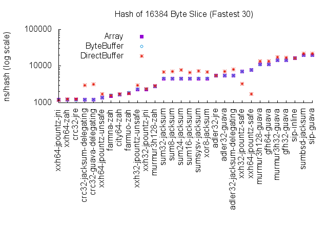

| Algorithm |  Array | ByteBuffer | DirectBuffer |
| --- | ---: | ---: | ---: | 
| [xxh64-jpountz-jni](#xxh64-jpountz-jni-latency) | 1195.621835 | 1198.616192 | 1185.216560 |
| [xxh64-zah](#xxh64-zah-latency) | 1197.272419 | 1220.530897 | 1235.450247 |
| [crc32-jre](#crc32-jre-latency) | 1204.282697 | 1182.261266 | 1263.696042 |
| [crc32-jacksum-delegating](#crc32-jacksum-delegating-latency) | 1207.917226 | 1205.961596 | 3028.317120 |
| [crc32-guava-delegating](#crc32-guava-delegating-latency) | 1226.419348 | 1224.905661 | 3224.611240 |
| [xxh64-jpountz-unsafe](#xxh64-jpountz-unsafe-latency) | 1359.182249 | 1374.501257 | 1756.421680 |
| [farmna-zah](#farmna-zah-latency) | 1497.219652 | 1628.135030 | 1560.919370 |
| [city64-zah](#city64-zah-latency) | 1695.833297 | 1691.485143 | 1710.329326 |
| [farmuo-zah](#farmuo-zah-latency) | 1873.316022 | 1924.789335 | 1789.969921 |
| [xxh32-jpountz-unsafe](#xxh32-jpountz-unsafe-latency) | 2327.549615 | 2384.445636 | 3037.442780 |
| [xxh32-jpountz-jni](#xxh32-jpountz-jni-latency) | 2330.749986 | 2371.317890 | 2379.683354 |
| [murmur3h128-zah](#murmur3h128-zah-latency) | 2835.336991 | 2797.657474 | 2872.197079 |
| [sum32-jacksum](#sum32-jacksum-latency) | 4593.054506 | 4746.274063 | 6917.702330 |
| [sum8-jacksum](#sum8-jacksum-latency) | 4594.242078 | 4594.239808 | 7058.807570 |
| [sum24-jacksum](#sum24-jacksum-latency) | 4594.946542 | 4593.403100 | 7808.524328 |
| [sum16-jacksum](#sum16-jacksum-latency) | 4595.779149 | 4596.817348 | 6608.056315 |
| [sumsysv-jacksum](#sumsysv-jacksum-latency) | 4596.620128 | 4674.609848 | 7336.486208 |
| [xor8-jacksum](#xor8-jacksum-latency) | 4605.085006 | 4682.780977 | 6830.224075 |
| [adler32-jre](#adler32-jre-latency) | 5440.142258 | 5434.752111 | 5505.263296 |
| [adler32-guava](#adler32-guava-latency) | 5458.691916 | 5462.046057 | 7235.458247 |
| [adler32-jacksum-delegating](#adler32-jacksum-delegating-latency) | 5518.416607 | 5439.189236 | 8239.666622 |
| [xxh32-jpountz-safe](#xxh32-jpountz-safe-latency) | 7168.127562 | 7166.766084 | 3284.943814 |
| [xxh64-jpountz-safe](#xxh64-jpountz-safe-latency) | 7942.155491 | 7805.341989 | 1724.955465 |
| [murmur3h128-guava](#murmur3h128-guava-latency) | 11043.132710 | 11011.203494 | 13371.993161 |
| [gfh64-guava](#gfh64-guava-latency) | 11054.973319 | 11062.189364 | 13411.669645 |
| [murmur3h32-guava](#murmur3h32-guava-latency) | 14564.838129 | 14669.210779 | 17408.367604 |
| [gfh32-guava](#gfh32-guava-latency) | 14570.126238 | 14589.357894 | 16757.811413 |
| [sip-inline](#sip-inline-latency) | 16308.051326 | 16629.383378 | 16421.837969 |
| [sumbsd-jacksum](#sumbsd-jacksum-latency) | 19853.181752 | 20059.432583 | 21991.097281 |
| [sip-guava](#sip-guava-latency) | 20249.658502 | 19905.538397 | 22246.293382 |
| [elf-jacksum](#elf-jacksum-latency) | 28819.470948 | 31034.948166 | 32633.325200 |
| [ed2k-jacksum](#ed2k-jacksum-latency) | 29689.894095 | 30379.161583 | 32972.100506 |
| [crc8-jacksum](#crc8-jacksum-latency) | 31446.553103 | 29436.883150 | 35206.914704 |
| [crc16-jacksum](#crc16-jacksum-latency) | 37386.390841 | 36827.475531 | 39096.959208 |
| [crc32-jacksum-fcs32](#crc32-jacksum-fcs32-latency) | 38041.086125 | 38489.575643 | 41790.334131 |
| [crc32-guava-rfc3720](#crc32-guava-rfc3720-latency) | 38270.614133 | 39921.760482 | 43141.574016 |
| [md4-jacksum](#md4-jacksum-latency) | 39195.037416 | 39189.954084 | 41439.359094 |
| [md5-guava](#md5-guava-latency) | 39562.724994 | 39549.104261 | 42610.107137 |
| [md2-jacksum](#md2-jacksum-latency) | 39834.483051 | 40963.686220 | 41454.948627 |
| [md4-bc](#md4-bc-latency) | 40323.557661 | 48547.606479 | 43406.405864 |
| [md5-jacksum](#md5-jacksum-latency) | 40327.126862 | 39247.853504 | 43328.211093 |
| [sip-fwdeng](#sip-fwdeng-latency) | 41978.004506 | 41587.108537 | 40321.596239 |
| [crc64-jacksum](#crc64-jacksum-latency) | 41990.185362 | 41449.549014 | 43943.225083 |
| [fcs16-jacksum](#fcs16-jacksum-latency) | 42066.371871 | 42140.755243 | 44518.452932 |
| [crc32-jacksum-mpeg2](#crc32-jacksum-mpeg2-latency) | 42189.785503 | 42199.146385 | 44602.732500 |
| [cksum-jacksum](#cksum-jacksum-latency) | 42206.762193 | 42353.625402 | 44511.114347 |
| [md5-jacksum-alt](#md5-jacksum-alt-latency) | 45120.302153 | 45045.918701 | 48696.113373 |
| [crc24-jacksum](#crc24-jacksum-latency) | 45144.671452 | 46290.541683 | 50536.562626 |
| [crc32-jacksum-bzip2](#crc32-jacksum-bzip2-latency) | 45152.930226 | 46358.494538 | 50105.007084 |
| [tiger2-jacksum](#tiger2-jacksum-latency) | 47620.605018 | 47704.178434 | 50446.613643 |
| [tiger-jacksum](#tiger-jacksum-latency) | 47625.437315 | 47653.864817 | 52036.245626 |
| [tiger128-jacksum](#tiger128-jacksum-latency) | 47627.340616 | 47650.059724 | 50323.263610 |
| [tiger160-jacksum](#tiger160-jacksum-latency) | 48089.831102 | 49139.349377 | 50304.257131 |
| [tiger-bc](#tiger-bc-latency) | 51587.920281 | 52080.637182 | 50274.376725 |
| [md5-bc](#md5-bc-latency) | 51671.860799 | 55752.094050 | 54745.363897 |
| [tiger-jacksum-tree](#tiger-jacksum-tree-latency) | 52475.834528 | 52552.168555 | 55200.266379 |
| [tiger2-jacksum-tree](#tiger2-jacksum-tree-latency) | 52638.364567 | 52824.142866 | 54277.810537 |
| [ripemd128-bc](#ripemd128-bc-latency) | 58205.905408 | 60372.629264 | 61130.695105 |
| [skein512-bc](#skein512-bc-latency) | 58225.718741 | 60016.610254 | 61897.832273 |
| [sha1-guava](#sha1-guava-latency) | 59236.170922 | 60146.406674 | 61858.380225 |
| [sha1-jacksum](#sha1-jacksum-latency) | 59846.588936 | 59911.952899 | 62527.126752 |
| [ripemd256-bc](#ripemd256-bc-latency) | 61440.035558 | 62962.929639 | 63961.152084 |
| [adler32-jacksum-alt](#adler32-jacksum-alt-latency) | 61749.770897 | 61997.491348 | 64612.843575 |
| [ripemd256-jacksum](#ripemd256-jacksum-latency) | 63459.968498 | 62585.405332 | 65783.388951 |
| [skein1024-bc](#skein1024-bc-latency) | 64165.011597 | 63822.024674 | 68923.895915 |
| [haval192h3-jacksum](#haval192h3-jacksum-latency) | 65464.144240 | 65499.631382 | 68725.071761 |
| [haval128h3-jacksum](#haval128h3-jacksum-latency) | 65467.550592 | 65716.581911 | 68568.486972 |
| [haval256h3-jacksum](#haval256h3-jacksum-latency) | 65467.555659 | 65578.133427 | 69427.770758 |
| [haval160h3-jacksum](#haval160h3-jacksum-latency) | 65554.195251 | 66776.356276 | 69403.276466 |
| [sha0-jacksum](#sha0-jacksum-latency) | 65644.214760 | 64848.241482 | 69335.575602 |
| [skein256-bc](#skein256-bc-latency) | 67013.790413 | 67139.123896 | 68612.296025 |
| [sha1-jacksum-alt](#sha1-jacksum-alt-latency) | 67299.889016 | 66217.836543 | 71422.226597 |
| [sha384-jacksum-alt](#sha384-jacksum-alt-latency) | 67962.457222 | 67393.040120 | 70706.576072 |
| [sha512-jacksum-alt](#sha512-jacksum-alt-latency) | 68214.638801 | 67394.498311 | 72936.492729 |
| [sha512-bc-t](#sha512-bc-t-latency) | 68224.845048 | 69760.116002 | 71817.006918 |
| [haval224h3-jacksum](#haval224h3-jacksum-latency) | 68256.988804 | 66562.000541 | 68671.145880 |
| [sha512-bc](#sha512-bc-latency) | 70843.138936 | 69619.853785 | 73893.797376 |
| [sha512-jacksum](#sha512-jacksum-latency) | 71108.194270 | 71314.739886 | 74400.322123 |
| [sha384-jacksum](#sha384-jacksum-latency) | 71148.419176 | 73572.175958 | 76334.536397 |
| [ripemd128-jacksum](#ripemd128-jacksum-latency) | 71274.939404 | 69454.391944 | 75043.029649 |
| [sha512-guava](#sha512-guava-latency) | 71905.742129 | 71910.308879 | 77068.140678 |
| [sha384-bc](#sha384-bc-latency) | 72803.786771 | 69823.508769 | 69795.825174 |
| [sha384-guava](#sha384-guava-latency) | 74263.170720 | 71923.909749 | 75903.789494 |
| [has160-jacksum](#has160-jacksum-latency) | 74942.327088 | 75552.198222 | 80688.942490 |
| [sha1-bc](#sha1-bc-latency) | 76339.919988 | 74770.842841 | 76344.087076 |
| [sha256-guava](#sha256-guava-latency) | 86941.217643 | 85529.196897 | 89863.826667 |
| [sha256-jacksum](#sha256-jacksum-latency) | 87803.040342 | 85063.136158 | 87759.124345 |
| [haval160h4-jacksum](#haval160h4-jacksum-latency) | 90145.701071 | 90036.751414 | 93300.822099 |
| [haval256h4-jacksum](#haval256h4-jacksum-latency) | 90162.033912 | 91602.923895 | 96218.247999 |
| [haval224h4-jacksum](#haval224h4-jacksum-latency) | 90181.178228 | 90175.288730 | 94438.470408 |
| [haval192h4-jacksum](#haval192h4-jacksum-latency) | 93040.368989 | 90152.340257 | 93317.616715 |
| [haval128h4-jacksum](#haval128h4-jacksum-latency) | 93215.759619 | 90082.647137 | 94945.030444 |
| [sm3-bc](#sm3-bc-latency) | 99413.497860 | 99163.002753 | 102614.345135 |
| [sha224-jacksum](#sha224-jacksum-latency) | 99614.828229 | 99567.637031 | 102412.724643 |
| [sha256-jacksum-alt](#sha256-jacksum-alt-latency) | 99827.603170 | 101130.964638 | 101710.467158 |
| [sha256-bc](#sha256-bc-latency) | 102257.912612 | 105790.024004 | 108002.935777 |
| [sha224-bc](#sha224-bc-latency) | 105130.048967 | 103245.240837 | 106510.011045 |
| [haval256h5-jacksum](#haval256h5-jacksum-latency) | 110283.986240 | 110467.339116 | 115977.301199 |
| [haval224h5-jacksum](#haval224h5-jacksum-latency) | 110331.088423 | 112327.482029 | 113918.423724 |
| [haval160h5-jacksum](#haval160h5-jacksum-latency) | 110353.573192 | 112017.645621 | 113222.191258 |
| [haval192h5-jacksum](#haval192h5-jacksum-latency) | 112205.783413 | 112228.340249 | 117348.834455 |
| [haval128h5-jacksum](#haval128h5-jacksum-latency) | 114032.963030 | 110242.724876 | 113728.071637 |
| [ripemd160-jacksum](#ripemd160-jacksum-latency) | 136768.604708 | 137633.631583 | 143483.504059 |
| [whirlpool2-jacksum](#whirlpool2-jacksum-latency) | 237269.843836 | 235019.859076 | 254877.384410 |
| [whirlpool0-jacksum](#whirlpool0-jacksum-latency) | 240925.706043 | 247507.307539 | 242275.232832 |
| [whirlpool1-jacksum](#whirlpool1-jacksum-latency) | 248414.670650 | 246033.106236 | 245908.406120 |
| [ripemd160-bc](#ripemd160-bc-latency) | 278477.239390 | 271885.033948 | 281042.657865 |
| [ripemd320-bc](#ripemd320-bc-latency) | 281222.063819 | 280532.448717 | 284359.531937 |
| [ripemd320-jacksum](#ripemd320-jacksum-latency) | 283079.534425 | 277964.136997 | 297539.983809 |
| [sha3-bc](#sha3-bc-latency) | 659579.003602 | 677147.608048 | 678664.049053 |
| [whirlpool2-bc](#whirlpool2-bc-latency) | 930449.166652 | 960641.039910 | 933689.950652 |
| [gost-bc](#gost-bc-latency) | 1927451.472465 | 1900320.439612 | 2041883.478587 |
| [gost-jacksum](#gost-jacksum-latency) | 1975078.598033 | 1930125.573236 | 1948766.055005 |
| [md2-bc](#md2-bc-latency) | 2094369.248085 | 2127828.583909 | 2133590.501005 |

---
### 16384 Byte Slice Latency (adler32)
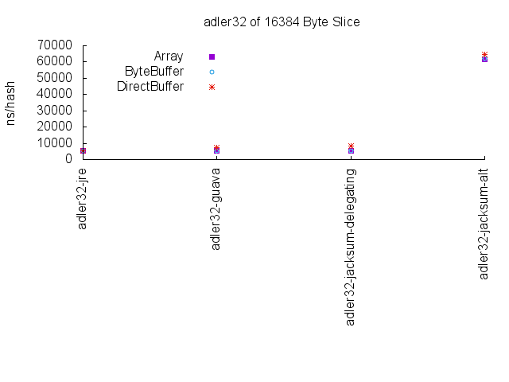

| Algorithm |  Array | ByteBuffer | DirectBuffer |
| --- | ---: | ---: | ---: | 
| [adler32-jre](#adler32-jre-latency) | 5440.142258 | 5434.752111 | 5505.263296 |
| [adler32-guava](#adler32-guava-latency) | 5458.691916 | 5462.046057 | 7235.458247 |
| [adler32-jacksum-delegating](#adler32-jacksum-delegating-latency) | 5518.416607 | 5439.189236 | 8239.666622 |
| [adler32-jacksum-alt](#adler32-jacksum-alt-latency) | 61749.770897 | 61997.491348 | 64612.843575 |

---
### 16384 Byte Slice Latency (city64)
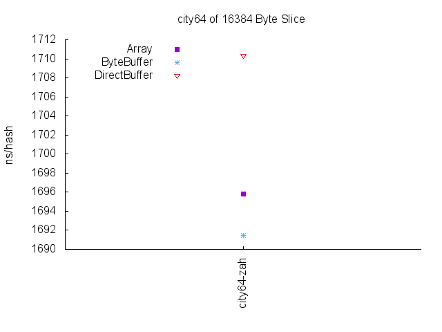

| Algorithm |  Array | ByteBuffer | DirectBuffer |
| --- | ---: | ---: | ---: | 
| [city64-zah](#city64-zah-latency) | 1695.833297 | 1691.485143 | 1710.329326 |

---
### 16384 Byte Slice Latency (cksum)
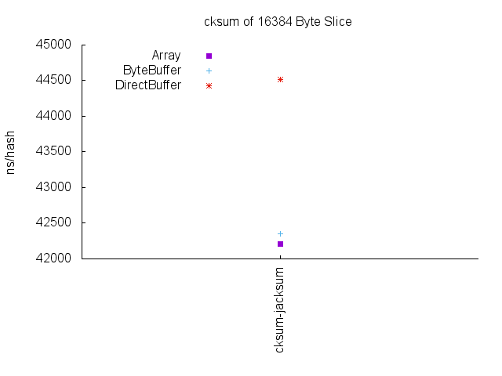

| Algorithm |  Array | ByteBuffer | DirectBuffer |
| --- | ---: | ---: | ---: | 
| [cksum-jacksum](#cksum-jacksum-latency) | 42206.762193 | 42353.625402 | 44511.114347 |

---
### 16384 Byte Slice Latency (crc16)
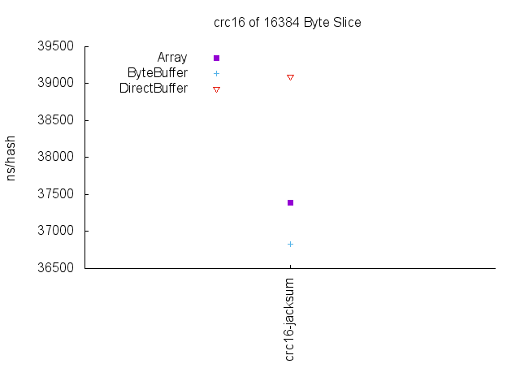

| Algorithm |  Array | ByteBuffer | DirectBuffer |
| --- | ---: | ---: | ---: | 
| [crc16-jacksum](#crc16-jacksum-latency) | 37386.390841 | 36827.475531 | 39096.959208 |

---
### 16384 Byte Slice Latency (crc24)

| Algorithm |  Array | ByteBuffer | DirectBuffer |
| --- | ---: | ---: | ---: | 
| [crc24-jacksum](#crc24-jacksum-latency) | 45144.671452 | 46290.541683 | 50536.562626 |

---
### 16384 Byte Slice Latency (crc32)
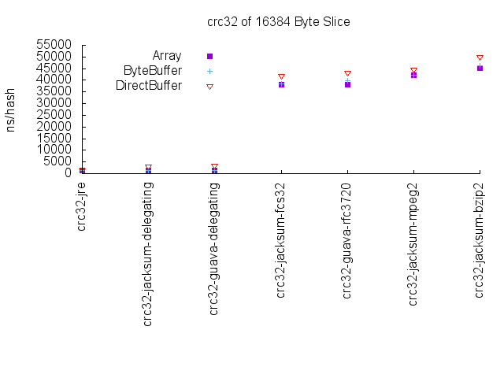

| Algorithm |  Array | ByteBuffer | DirectBuffer |
| --- | ---: | ---: | ---: | 
| [crc32-jre](#crc32-jre-latency) | 1204.282697 | 1182.261266 | 1263.696042 |
| [crc32-jacksum-delegating](#crc32-jacksum-delegating-latency) | 1207.917226 | 1205.961596 | 3028.317120 |
| [crc32-guava-delegating](#crc32-guava-delegating-latency) | 1226.419348 | 1224.905661 | 3224.611240 |
| [crc32-jacksum-fcs32](#crc32-jacksum-fcs32-latency) | 38041.086125 | 38489.575643 | 41790.334131 |
| [crc32-guava-rfc3720](#crc32-guava-rfc3720-latency) | 38270.614133 | 39921.760482 | 43141.574016 |
| [crc32-jacksum-mpeg2](#crc32-jacksum-mpeg2-latency) | 42189.785503 | 42199.146385 | 44602.732500 |
| [crc32-jacksum-bzip2](#crc32-jacksum-bzip2-latency) | 45152.930226 | 46358.494538 | 50105.007084 |

---
### 16384 Byte Slice Latency (crc64)
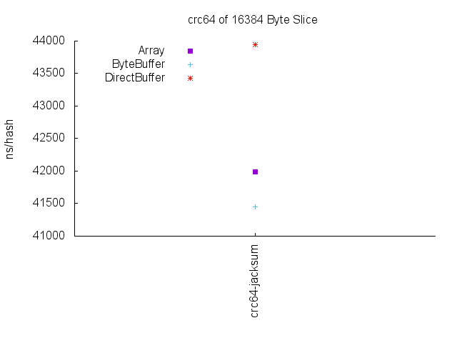

| Algorithm |  Array | ByteBuffer | DirectBuffer |
| --- | ---: | ---: | ---: | 
| [crc64-jacksum](#crc64-jacksum-latency) | 41990.185362 | 41449.549014 | 43943.225083 |

---
### 16384 Byte Slice Latency (crc8)
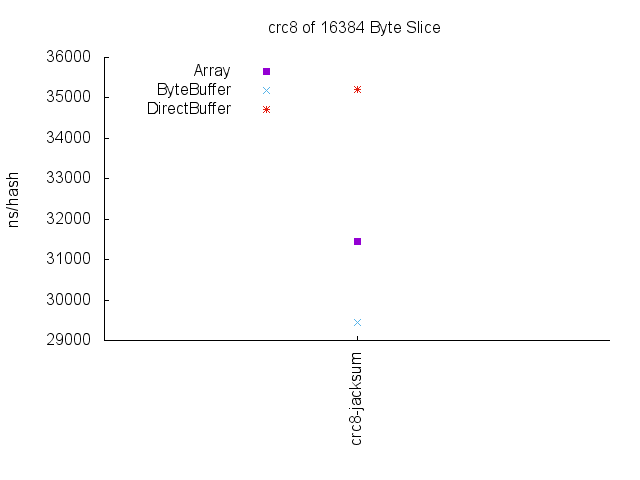

| Algorithm |  Array | ByteBuffer | DirectBuffer |
| --- | ---: | ---: | ---: | 
| [crc8-jacksum](#crc8-jacksum-latency) | 31446.553103 | 29436.883150 | 35206.914704 |

---
### 16384 Byte Slice Latency (ed2k)
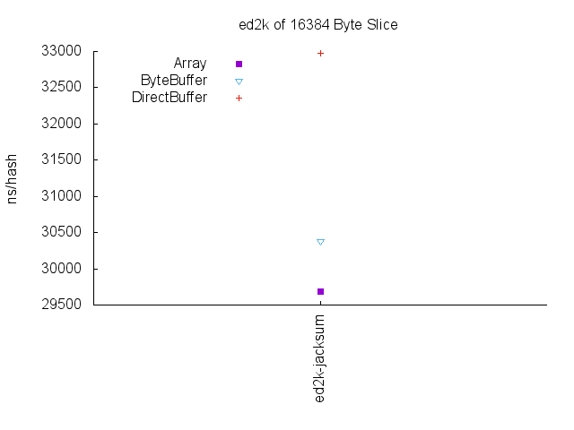

| Algorithm |  Array | ByteBuffer | DirectBuffer |
| --- | ---: | ---: | ---: | 
| [ed2k-jacksum](#ed2k-jacksum-latency) | 29689.894095 | 30379.161583 | 32972.100506 |

---
### 16384 Byte Slice Latency (elf)
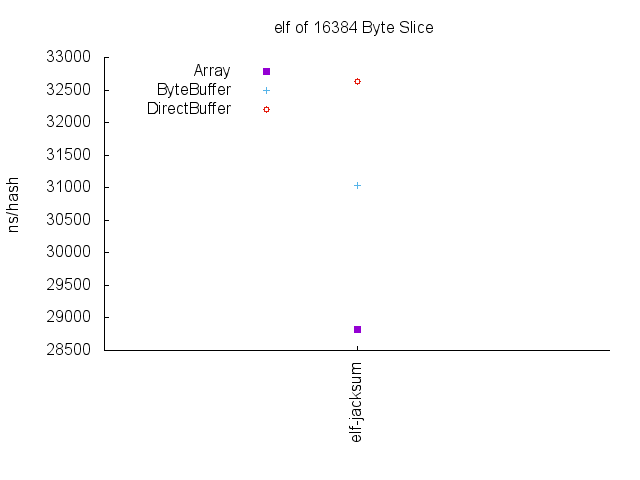

| Algorithm |  Array | ByteBuffer | DirectBuffer |
| --- | ---: | ---: | ---: | 
| [elf-jacksum](#elf-jacksum-latency) | 28819.470948 | 31034.948166 | 32633.325200 |

---
### 16384 Byte Slice Latency (farmna)
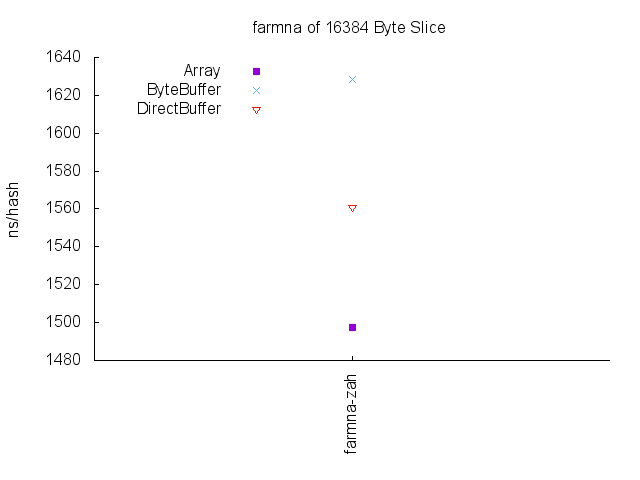

| Algorithm |  Array | ByteBuffer | DirectBuffer |
| --- | ---: | ---: | ---: | 
| [farmna-zah](#farmna-zah-latency) | 1497.219652 | 1628.135030 | 1560.919370 |

---
### 16384 Byte Slice Latency (farmuo)
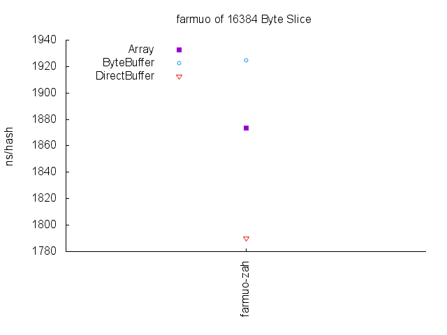

| Algorithm |  Array | ByteBuffer | DirectBuffer |
| --- | ---: | ---: | ---: | 
| [farmuo-zah](#farmuo-zah-latency) | 1873.316022 | 1924.789335 | 1789.969921 |

---
### 16384 Byte Slice Latency (fcs16)
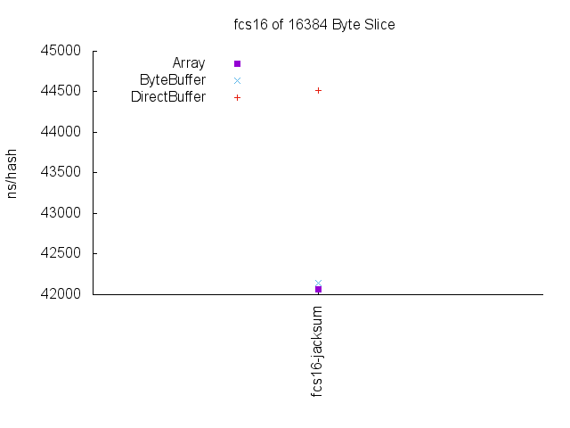

| Algorithm |  Array | ByteBuffer | DirectBuffer |
| --- | ---: | ---: | ---: | 
| [fcs16-jacksum](#fcs16-jacksum-latency) | 42066.371871 | 42140.755243 | 44518.452932 |

---
### 16384 Byte Slice Latency (gfh32)
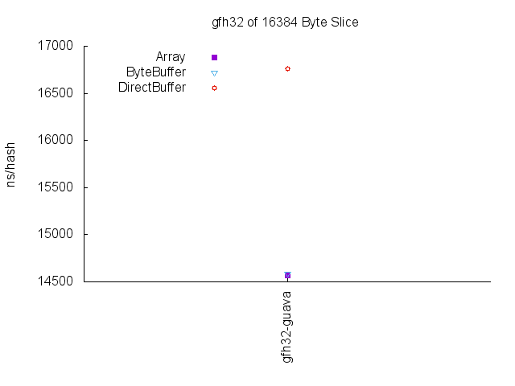

| Algorithm |  Array | ByteBuffer | DirectBuffer |
| --- | ---: | ---: | ---: | 
| [gfh32-guava](#gfh32-guava-latency) | 14570.126238 | 14589.357894 | 16757.811413 |

---
### 16384 Byte Slice Latency (gfh64)
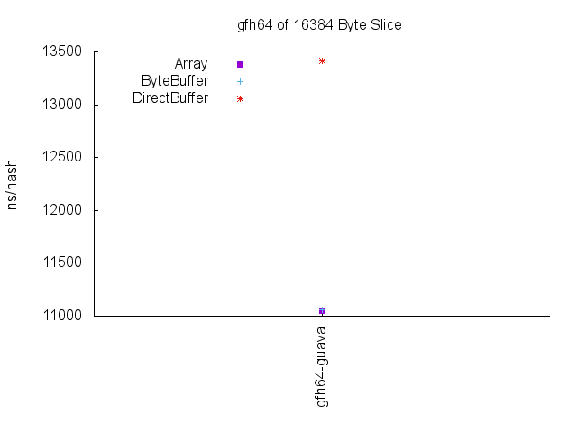

| Algorithm |  Array | ByteBuffer | DirectBuffer |
| --- | ---: | ---: | ---: | 
| [gfh64-guava](#gfh64-guava-latency) | 11054.973319 | 11062.189364 | 13411.669645 |

---
### 16384 Byte Slice Latency (gost)
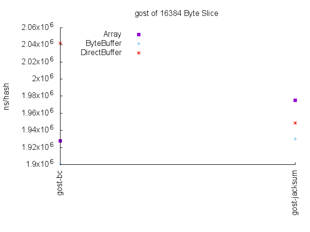

| Algorithm |  Array | ByteBuffer | DirectBuffer |
| --- | ---: | ---: | ---: | 
| [gost-bc](#gost-bc-latency) | 1927451.472465 | 1900320.439612 | 2041883.478587 |
| [gost-jacksum](#gost-jacksum-latency) | 1975078.598033 | 1930125.573236 | 1948766.055005 |

---
### 16384 Byte Slice Latency (has160)
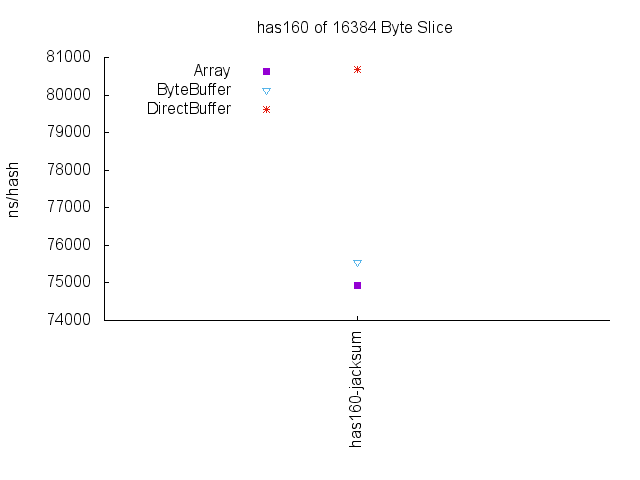

| Algorithm |  Array | ByteBuffer | DirectBuffer |
| --- | ---: | ---: | ---: | 
| [has160-jacksum](#has160-jacksum-latency) | 74942.327088 | 75552.198222 | 80688.942490 |

---
### 16384 Byte Slice Latency (haval128h3)
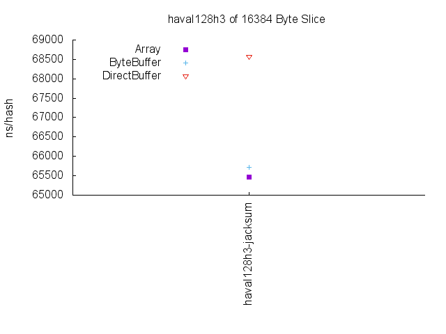

| Algorithm |  Array | ByteBuffer | DirectBuffer |
| --- | ---: | ---: | ---: | 
| [haval128h3-jacksum](#haval128h3-jacksum-latency) | 65467.550592 | 65716.581911 | 68568.486972 |

---
### 16384 Byte Slice Latency (haval128h4)
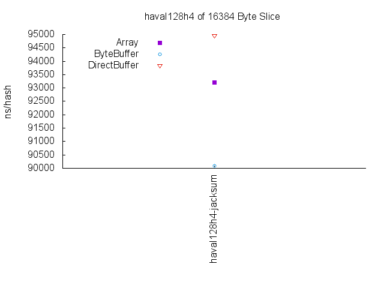

| Algorithm |  Array | ByteBuffer | DirectBuffer |
| --- | ---: | ---: | ---: | 
| [haval128h4-jacksum](#haval128h4-jacksum-latency) | 93215.759619 | 90082.647137 | 94945.030444 |

---
### 16384 Byte Slice Latency (haval128h5)
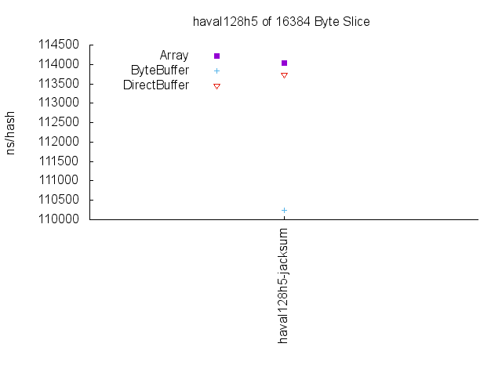

| Algorithm |  Array | ByteBuffer | DirectBuffer |
| --- | ---: | ---: | ---: | 
| [haval128h5-jacksum](#haval128h5-jacksum-latency) | 114032.963030 | 110242.724876 | 113728.071637 |

---
### 16384 Byte Slice Latency (haval160h3)

| Algorithm |  Array | ByteBuffer | DirectBuffer |
| --- | ---: | ---: | ---: | 
| [haval160h3-jacksum](#haval160h3-jacksum-latency) | 65554.195251 | 66776.356276 | 69403.276466 |

---
### 16384 Byte Slice Latency (haval160h4)
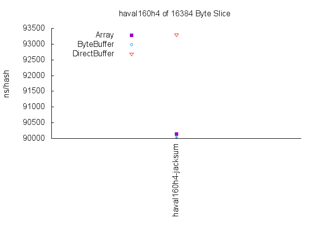

| Algorithm |  Array | ByteBuffer | DirectBuffer |
| --- | ---: | ---: | ---: | 
| [haval160h4-jacksum](#haval160h4-jacksum-latency) | 90145.701071 | 90036.751414 | 93300.822099 |

---
### 16384 Byte Slice Latency (haval160h5)
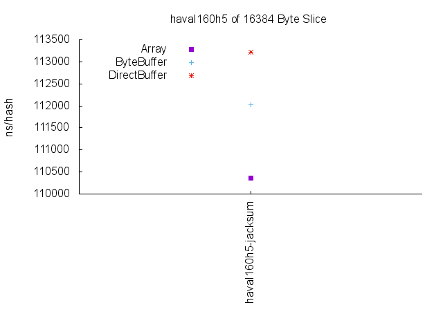

| Algorithm |  Array | ByteBuffer | DirectBuffer |
| --- | ---: | ---: | ---: | 
| [haval160h5-jacksum](#haval160h5-jacksum-latency) | 110353.573192 | 112017.645621 | 113222.191258 |

---
### 16384 Byte Slice Latency (haval192h3)
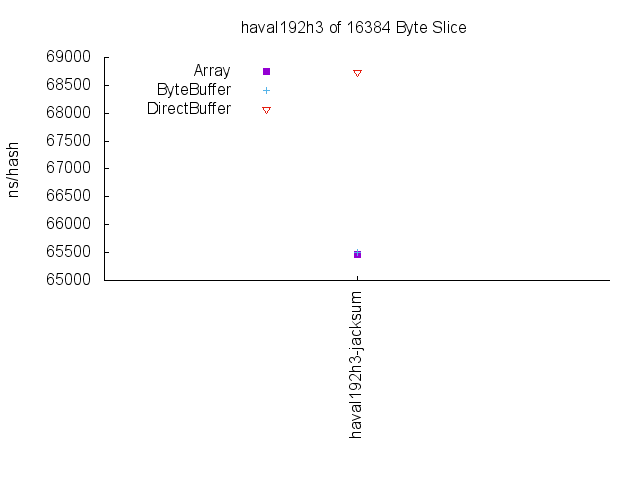

| Algorithm |  Array | ByteBuffer | DirectBuffer |
| --- | ---: | ---: | ---: | 
| [haval192h3-jacksum](#haval192h3-jacksum-latency) | 65464.144240 | 65499.631382 | 68725.071761 |

---
### 16384 Byte Slice Latency (haval192h4)
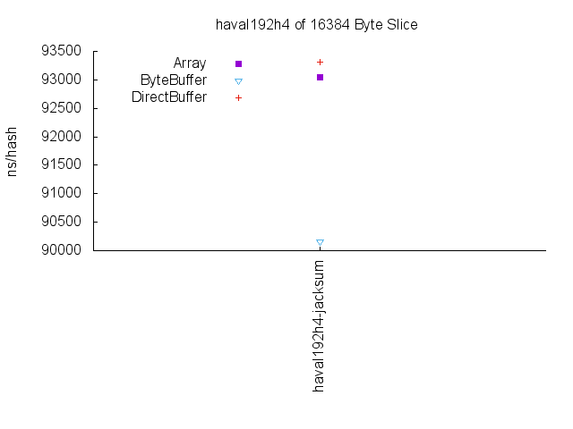

| Algorithm |  Array | ByteBuffer | DirectBuffer |
| --- | ---: | ---: | ---: | 
| [haval192h4-jacksum](#haval192h4-jacksum-latency) | 93040.368989 | 90152.340257 | 93317.616715 |

---
### 16384 Byte Slice Latency (haval192h5)

| Algorithm |  Array | ByteBuffer | DirectBuffer |
| --- | ---: | ---: | ---: | 
| [haval192h5-jacksum](#haval192h5-jacksum-latency) | 112205.783413 | 112228.340249 | 117348.834455 |

---
### 16384 Byte Slice Latency (haval224h3)
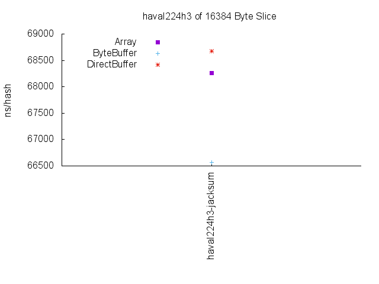

| Algorithm |  Array | ByteBuffer | DirectBuffer |
| --- | ---: | ---: | ---: | 
| [haval224h3-jacksum](#haval224h3-jacksum-latency) | 68256.988804 | 66562.000541 | 68671.145880 |

---
### 16384 Byte Slice Latency (haval224h4)
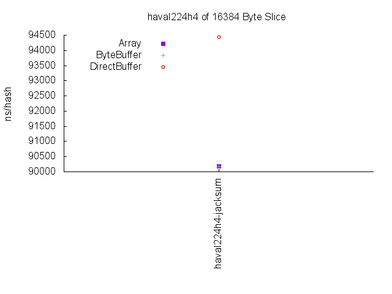

| Algorithm |  Array | ByteBuffer | DirectBuffer |
| --- | ---: | ---: | ---: | 
| [haval224h4-jacksum](#haval224h4-jacksum-latency) | 90181.178228 | 90175.288730 | 94438.470408 |

---
### 16384 Byte Slice Latency (haval224h5)
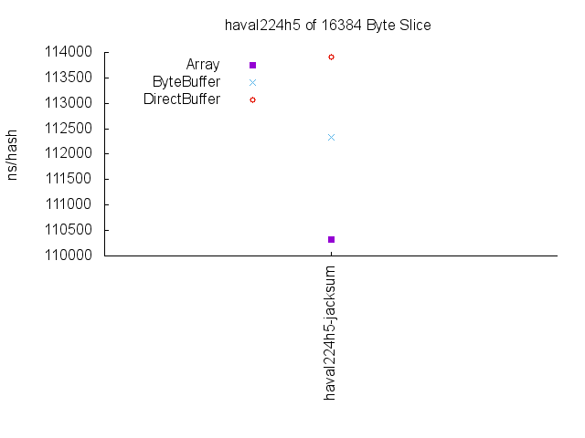

| Algorithm |  Array | ByteBuffer | DirectBuffer |
| --- | ---: | ---: | ---: | 
| [haval224h5-jacksum](#haval224h5-jacksum-latency) | 110331.088423 | 112327.482029 | 113918.423724 |

---
### 16384 Byte Slice Latency (haval256h3)

| Algorithm |  Array | ByteBuffer | DirectBuffer |
| --- | ---: | ---: | ---: | 
| [haval256h3-jacksum](#haval256h3-jacksum-latency) | 65467.555659 | 65578.133427 | 69427.770758 |

---
### 16384 Byte Slice Latency (haval256h4)
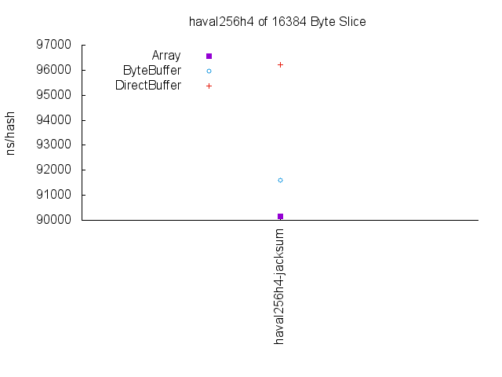

| Algorithm |  Array | ByteBuffer | DirectBuffer |
| --- | ---: | ---: | ---: | 
| [haval256h4-jacksum](#haval256h4-jacksum-latency) | 90162.033912 | 91602.923895 | 96218.247999 |

---
### 16384 Byte Slice Latency (haval256h5)
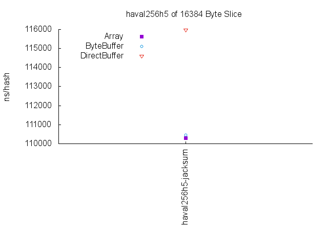

| Algorithm |  Array | ByteBuffer | DirectBuffer |
| --- | ---: | ---: | ---: | 
| [haval256h5-jacksum](#haval256h5-jacksum-latency) | 110283.986240 | 110467.339116 | 115977.301199 |

---
### 16384 Byte Slice Latency (md2)
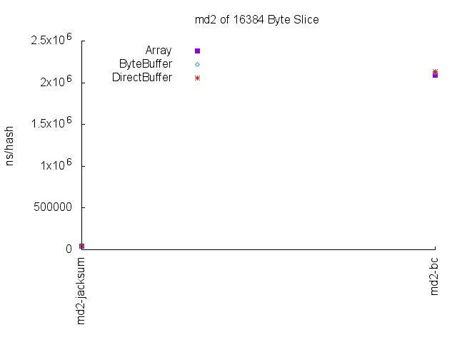

| Algorithm |  Array | ByteBuffer | DirectBuffer |
| --- | ---: | ---: | ---: | 
| [md2-jacksum](#md2-jacksum-latency) | 39834.483051 | 40963.686220 | 41454.948627 |
| [md2-bc](#md2-bc-latency) | 2094369.248085 | 2127828.583909 | 2133590.501005 |

---
### 16384 Byte Slice Latency (md4)
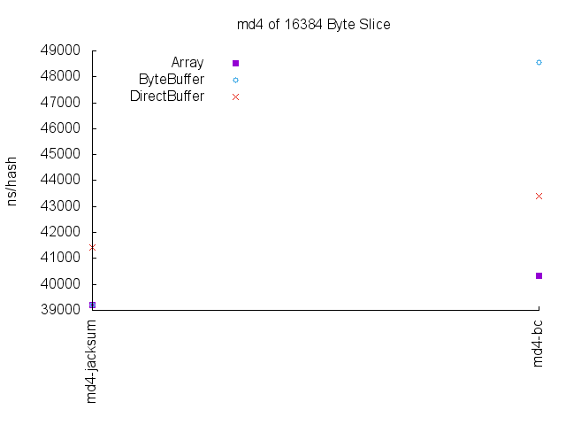

| Algorithm |  Array | ByteBuffer | DirectBuffer |
| --- | ---: | ---: | ---: | 
| [md4-jacksum](#md4-jacksum-latency) | 39195.037416 | 39189.954084 | 41439.359094 |
| [md4-bc](#md4-bc-latency) | 40323.557661 | 48547.606479 | 43406.405864 |

---
### 16384 Byte Slice Latency (md5)
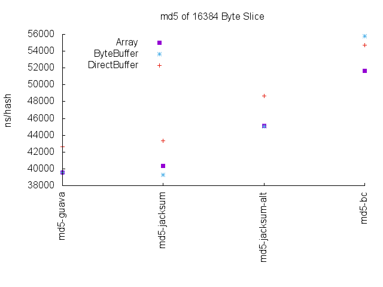

| Algorithm |  Array | ByteBuffer | DirectBuffer |
| --- | ---: | ---: | ---: | 
| [md5-guava](#md5-guava-latency) | 39562.724994 | 39549.104261 | 42610.107137 |
| [md5-jacksum](#md5-jacksum-latency) | 40327.126862 | 39247.853504 | 43328.211093 |
| [md5-jacksum-alt](#md5-jacksum-alt-latency) | 45120.302153 | 45045.918701 | 48696.113373 |
| [md5-bc](#md5-bc-latency) | 51671.860799 | 55752.094050 | 54745.363897 |

---
### 16384 Byte Slice Latency (murmur3h128)
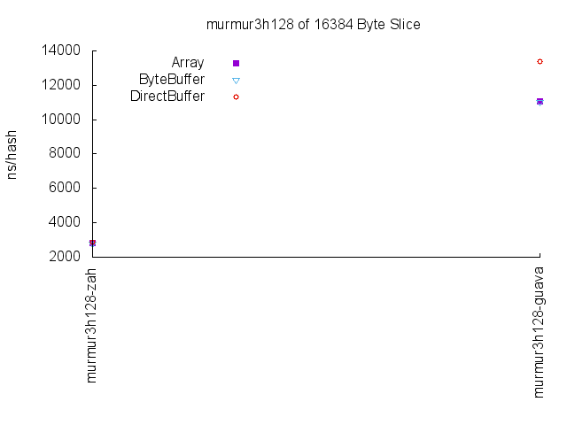

| Algorithm |  Array | ByteBuffer | DirectBuffer |
| --- | ---: | ---: | ---: | 
| [murmur3h128-zah](#murmur3h128-zah-latency) | 2835.336991 | 2797.657474 | 2872.197079 |
| [murmur3h128-guava](#murmur3h128-guava-latency) | 11043.132710 | 11011.203494 | 13371.993161 |

---
### 16384 Byte Slice Latency (murmur3h32)
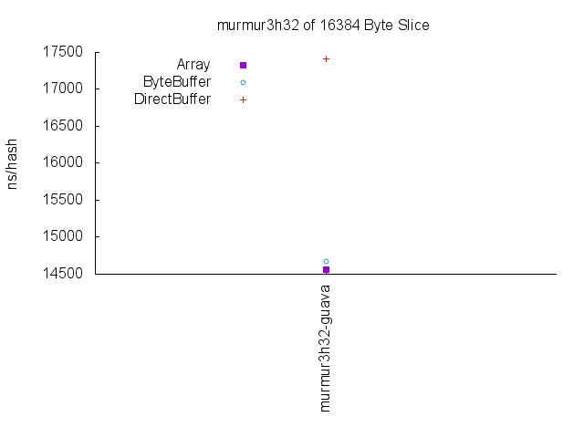

| Algorithm |  Array | ByteBuffer | DirectBuffer |
| --- | ---: | ---: | ---: | 
| [murmur3h32-guava](#murmur3h32-guava-latency) | 14564.838129 | 14669.210779 | 17408.367604 |

---
### 16384 Byte Slice Latency (ripemd128)
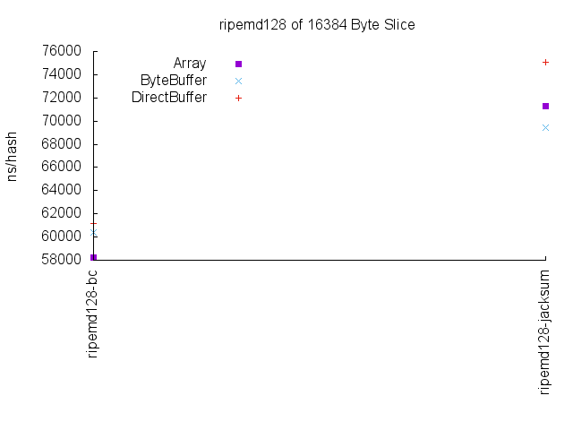

| Algorithm |  Array | ByteBuffer | DirectBuffer |
| --- | ---: | ---: | ---: | 
| [ripemd128-bc](#ripemd128-bc-latency) | 58205.905408 | 60372.629264 | 61130.695105 |
| [ripemd128-jacksum](#ripemd128-jacksum-latency) | 71274.939404 | 69454.391944 | 75043.029649 |

---
### 16384 Byte Slice Latency (ripemd160)
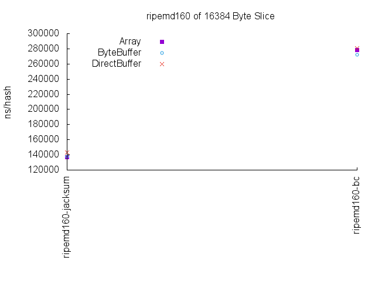

| Algorithm |  Array | ByteBuffer | DirectBuffer |
| --- | ---: | ---: | ---: | 
| [ripemd160-jacksum](#ripemd160-jacksum-latency) | 136768.604708 | 137633.631583 | 143483.504059 |
| [ripemd160-bc](#ripemd160-bc-latency) | 278477.239390 | 271885.033948 | 281042.657865 |

---
### 16384 Byte Slice Latency (ripemd256)
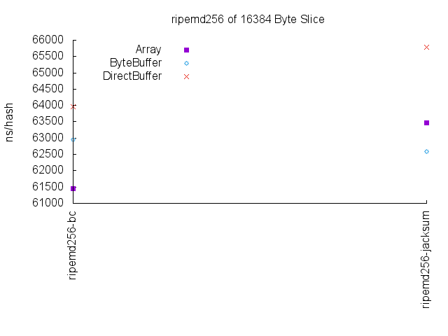

| Algorithm |  Array | ByteBuffer | DirectBuffer |
| --- | ---: | ---: | ---: | 
| [ripemd256-bc](#ripemd256-bc-latency) | 61440.035558 | 62962.929639 | 63961.152084 |
| [ripemd256-jacksum](#ripemd256-jacksum-latency) | 63459.968498 | 62585.405332 | 65783.388951 |

---
### 16384 Byte Slice Latency (ripemd320)
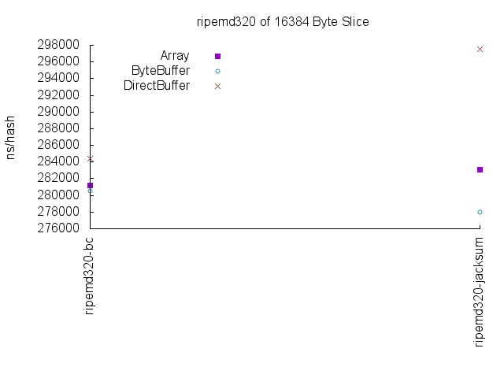

| Algorithm |  Array | ByteBuffer | DirectBuffer |
| --- | ---: | ---: | ---: | 
| [ripemd320-bc](#ripemd320-bc-latency) | 281222.063819 | 280532.448717 | 284359.531937 |
| [ripemd320-jacksum](#ripemd320-jacksum-latency) | 283079.534425 | 277964.136997 | 297539.983809 |

---
### 16384 Byte Slice Latency (sha0)
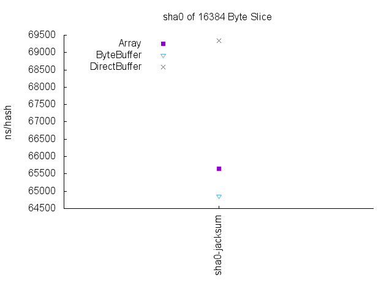

| Algorithm |  Array | ByteBuffer | DirectBuffer |
| --- | ---: | ---: | ---: | 
| [sha0-jacksum](#sha0-jacksum-latency) | 65644.214760 | 64848.241482 | 69335.575602 |

---
### 16384 Byte Slice Latency (sha1)
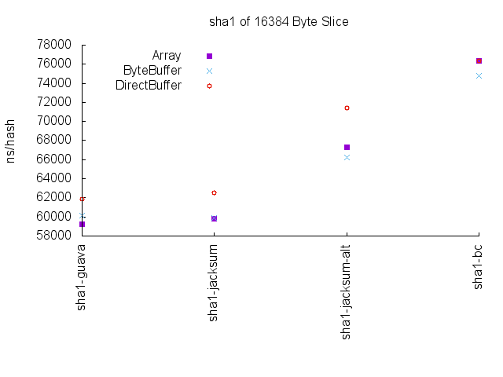

| Algorithm |  Array | ByteBuffer | DirectBuffer |
| --- | ---: | ---: | ---: | 
| [sha1-guava](#sha1-guava-latency) | 59236.170922 | 60146.406674 | 61858.380225 |
| [sha1-jacksum](#sha1-jacksum-latency) | 59846.588936 | 59911.952899 | 62527.126752 |
| [sha1-jacksum-alt](#sha1-jacksum-alt-latency) | 67299.889016 | 66217.836543 | 71422.226597 |
| [sha1-bc](#sha1-bc-latency) | 76339.919988 | 74770.842841 | 76344.087076 |

---
### 16384 Byte Slice Latency (sha224)
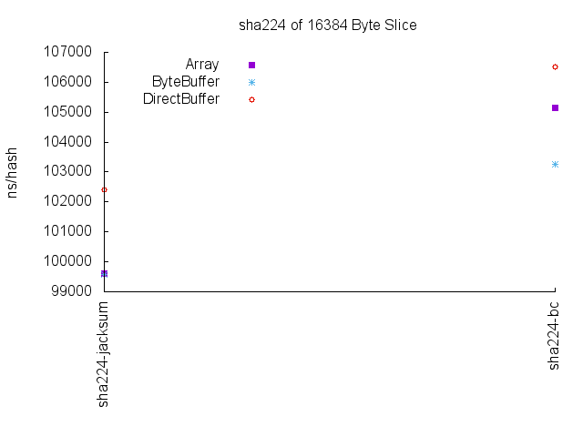

| Algorithm |  Array | ByteBuffer | DirectBuffer |
| --- | ---: | ---: | ---: | 
| [sha224-jacksum](#sha224-jacksum-latency) | 99614.828229 | 99567.637031 | 102412.724643 |
| [sha224-bc](#sha224-bc-latency) | 105130.048967 | 103245.240837 | 106510.011045 |

---
### 16384 Byte Slice Latency (sha256)
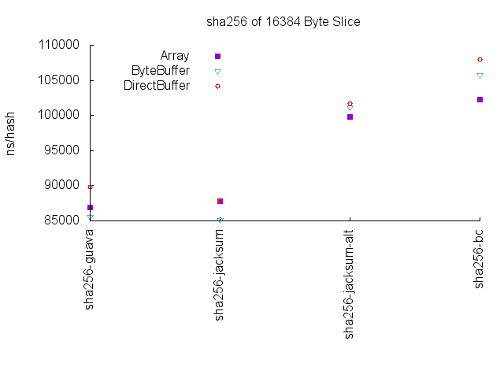

| Algorithm |  Array | ByteBuffer | DirectBuffer |
| --- | ---: | ---: | ---: | 
| [sha256-guava](#sha256-guava-latency) | 86941.217643 | 85529.196897 | 89863.826667 |
| [sha256-jacksum](#sha256-jacksum-latency) | 87803.040342 | 85063.136158 | 87759.124345 |
| [sha256-jacksum-alt](#sha256-jacksum-alt-latency) | 99827.603170 | 101130.964638 | 101710.467158 |
| [sha256-bc](#sha256-bc-latency) | 102257.912612 | 105790.024004 | 108002.935777 |

---
### 16384 Byte Slice Latency (sha3)
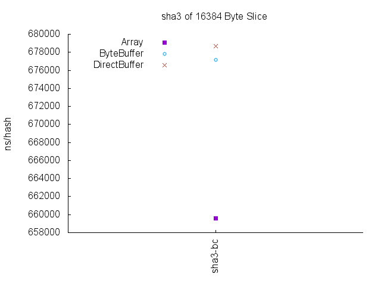

| Algorithm |  Array | ByteBuffer | DirectBuffer |
| --- | ---: | ---: | ---: | 
| [sha3-bc](#sha3-bc-latency) | 659579.003602 | 677147.608048 | 678664.049053 |

---
### 16384 Byte Slice Latency (sha384)
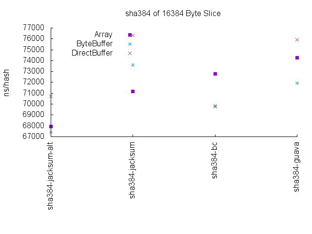

| Algorithm |  Array | ByteBuffer | DirectBuffer |
| --- | ---: | ---: | ---: | 
| [sha384-jacksum-alt](#sha384-jacksum-alt-latency) | 67962.457222 | 67393.040120 | 70706.576072 |
| [sha384-jacksum](#sha384-jacksum-latency) | 71148.419176 | 73572.175958 | 76334.536397 |
| [sha384-bc](#sha384-bc-latency) | 72803.786771 | 69823.508769 | 69795.825174 |
| [sha384-guava](#sha384-guava-latency) | 74263.170720 | 71923.909749 | 75903.789494 |

---
### 16384 Byte Slice Latency (sha512)
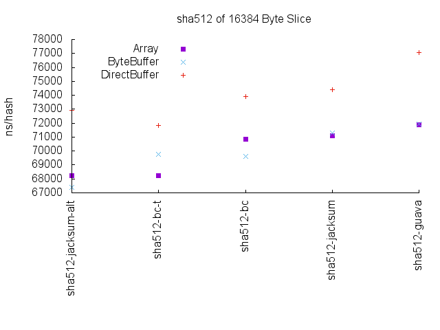

| Algorithm |  Array | ByteBuffer | DirectBuffer |
| --- | ---: | ---: | ---: | 
| [sha512-jacksum-alt](#sha512-jacksum-alt-latency) | 68214.638801 | 67394.498311 | 72936.492729 |
| [sha512-bc-t](#sha512-bc-t-latency) | 68224.845048 | 69760.116002 | 71817.006918 |
| [sha512-bc](#sha512-bc-latency) | 70843.138936 | 69619.853785 | 73893.797376 |
| [sha512-jacksum](#sha512-jacksum-latency) | 71108.194270 | 71314.739886 | 74400.322123 |
| [sha512-guava](#sha512-guava-latency) | 71905.742129 | 71910.308879 | 77068.140678 |

---
### 16384 Byte Slice Latency (sip)
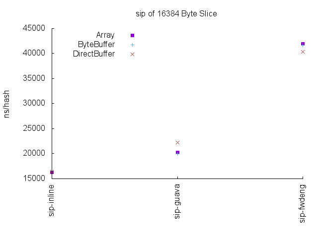

| Algorithm |  Array | ByteBuffer | DirectBuffer |
| --- | ---: | ---: | ---: | 
| [sip-inline](#sip-inline-latency) | 16308.051326 | 16629.383378 | 16421.837969 |
| [sip-guava](#sip-guava-latency) | 20249.658502 | 19905.538397 | 22246.293382 |
| [sip-fwdeng](#sip-fwdeng-latency) | 41978.004506 | 41587.108537 | 40321.596239 |

---
### 16384 Byte Slice Latency (skein1024)
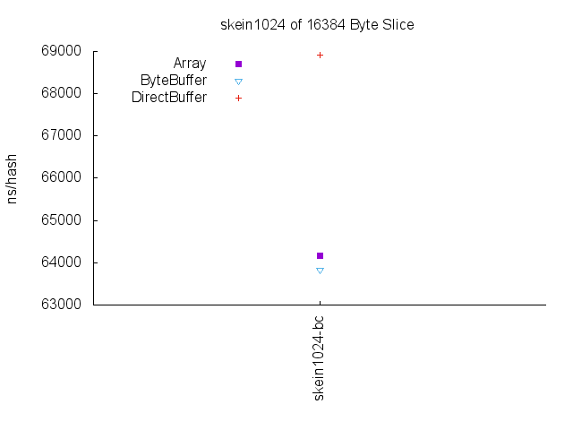

| Algorithm |  Array | ByteBuffer | DirectBuffer |
| --- | ---: | ---: | ---: | 
| [skein1024-bc](#skein1024-bc-latency) | 64165.011597 | 63822.024674 | 68923.895915 |

---
### 16384 Byte Slice Latency (skein256)
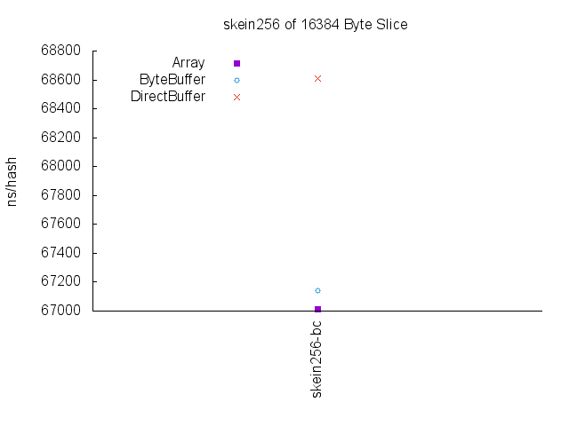

| Algorithm |  Array | ByteBuffer | DirectBuffer |
| --- | ---: | ---: | ---: | 
| [skein256-bc](#skein256-bc-latency) | 67013.790413 | 67139.123896 | 68612.296025 |

---
### 16384 Byte Slice Latency (skein512)
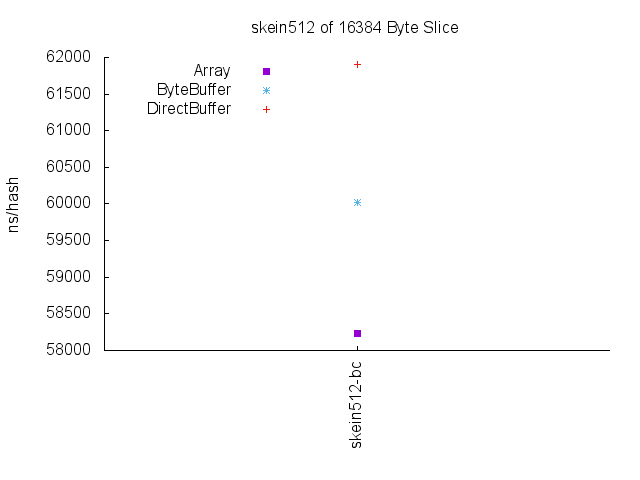

| Algorithm |  Array | ByteBuffer | DirectBuffer |
| --- | ---: | ---: | ---: | 
| [skein512-bc](#skein512-bc-latency) | 58225.718741 | 60016.610254 | 61897.832273 |

---
### 16384 Byte Slice Latency (sm3)
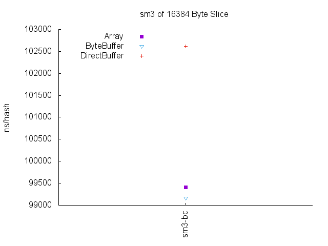

| Algorithm |  Array | ByteBuffer | DirectBuffer |
| --- | ---: | ---: | ---: | 
| [sm3-bc](#sm3-bc-latency) | 99413.497860 | 99163.002753 | 102614.345135 |

---
### 16384 Byte Slice Latency (sum16)
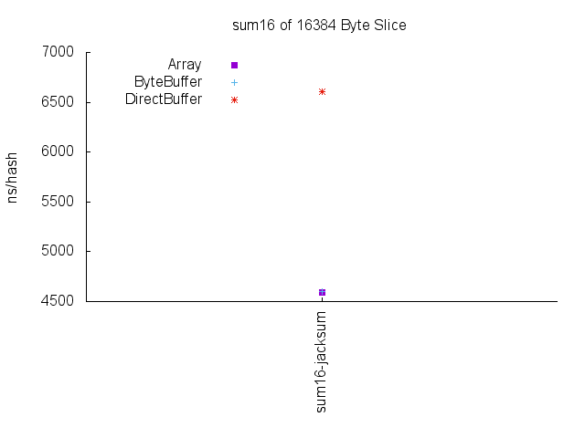

| Algorithm |  Array | ByteBuffer | DirectBuffer |
| --- | ---: | ---: | ---: | 
| [sum16-jacksum](#sum16-jacksum-latency) | 4595.779149 | 4596.817348 | 6608.056315 |

---
### 16384 Byte Slice Latency (sum24)
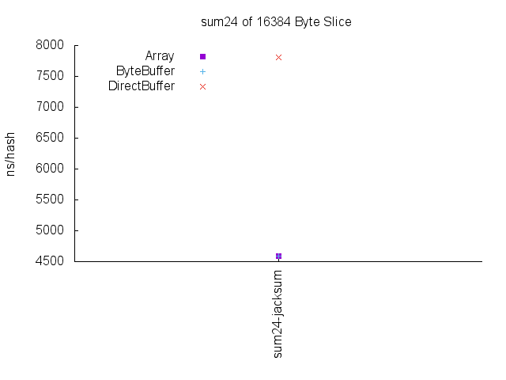

| Algorithm |  Array | ByteBuffer | DirectBuffer |
| --- | ---: | ---: | ---: | 
| [sum24-jacksum](#sum24-jacksum-latency) | 4594.946542 | 4593.403100 | 7808.524328 |

---
### 16384 Byte Slice Latency (sum32)
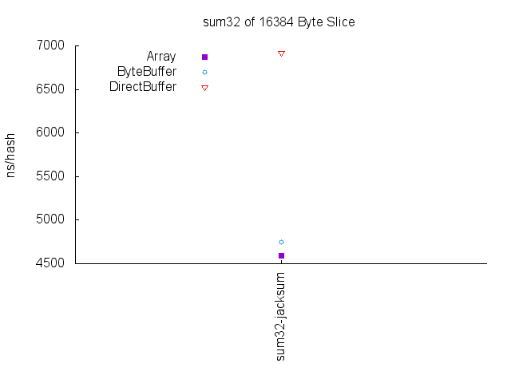

| Algorithm |  Array | ByteBuffer | DirectBuffer |
| --- | ---: | ---: | ---: | 
| [sum32-jacksum](#sum32-jacksum-latency) | 4593.054506 | 4746.274063 | 6917.702330 |

---
### 16384 Byte Slice Latency (sum8)
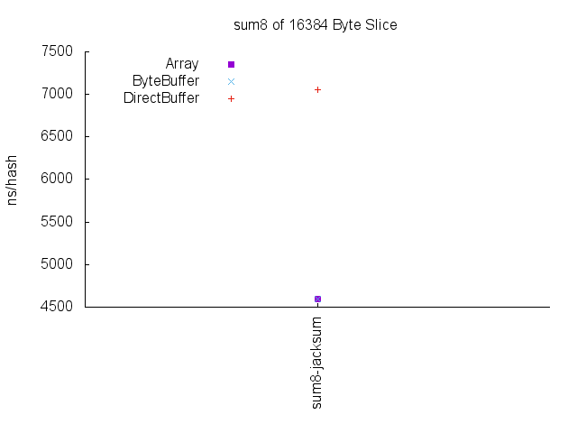

| Algorithm |  Array | ByteBuffer | DirectBuffer |
| --- | ---: | ---: | ---: | 
| [sum8-jacksum](#sum8-jacksum-latency) | 4594.242078 | 4594.239808 | 7058.807570 |

---
### 16384 Byte Slice Latency (sumbsd)
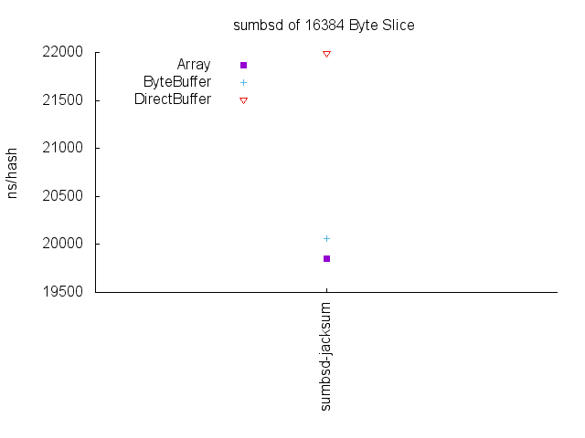

| Algorithm |  Array | ByteBuffer | DirectBuffer |
| --- | ---: | ---: | ---: | 
| [sumbsd-jacksum](#sumbsd-jacksum-latency) | 19853.181752 | 20059.432583 | 21991.097281 |

---
### 16384 Byte Slice Latency (sumsysv)
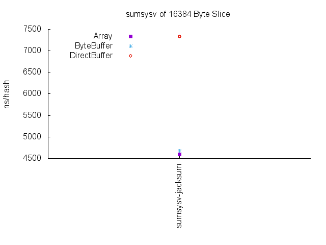

| Algorithm |  Array | ByteBuffer | DirectBuffer |
| --- | ---: | ---: | ---: | 
| [sumsysv-jacksum](#sumsysv-jacksum-latency) | 4596.620128 | 4674.609848 | 7336.486208 |

---
### 16384 Byte Slice Latency (tiger)
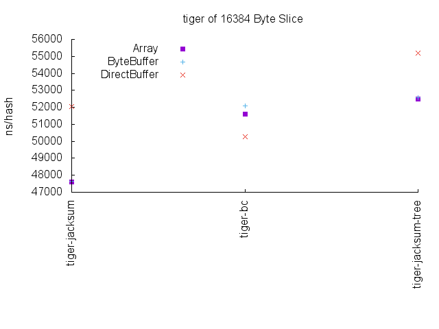

| Algorithm |  Array | ByteBuffer | DirectBuffer |
| --- | ---: | ---: | ---: | 
| [tiger-jacksum](#tiger-jacksum-latency) | 47625.437315 | 47653.864817 | 52036.245626 |
| [tiger-bc](#tiger-bc-latency) | 51587.920281 | 52080.637182 | 50274.376725 |
| [tiger-jacksum-tree](#tiger-jacksum-tree-latency) | 52475.834528 | 52552.168555 | 55200.266379 |

---
### 16384 Byte Slice Latency (tiger128)
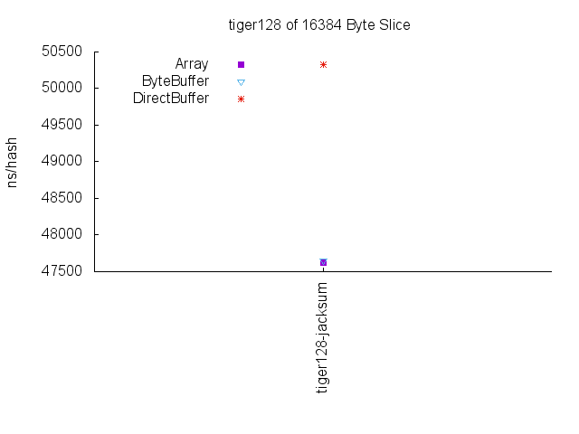

| Algorithm |  Array | ByteBuffer | DirectBuffer |
| --- | ---: | ---: | ---: | 
| [tiger128-jacksum](#tiger128-jacksum-latency) | 47627.340616 | 47650.059724 | 50323.263610 |

---
### 16384 Byte Slice Latency (tiger160)
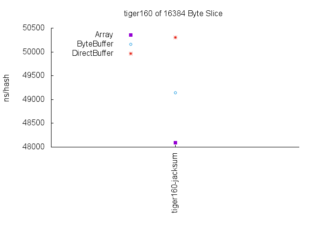

| Algorithm |  Array | ByteBuffer | DirectBuffer |
| --- | ---: | ---: | ---: | 
| [tiger160-jacksum](#tiger160-jacksum-latency) | 48089.831102 | 49139.349377 | 50304.257131 |

---
### 16384 Byte Slice Latency (tiger2)
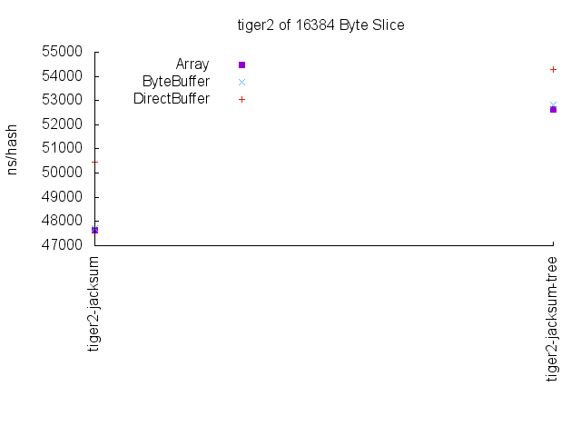

| Algorithm |  Array | ByteBuffer | DirectBuffer |
| --- | ---: | ---: | ---: | 
| [tiger2-jacksum](#tiger2-jacksum-latency) | 47620.605018 | 47704.178434 | 50446.613643 |
| [tiger2-jacksum-tree](#tiger2-jacksum-tree-latency) | 52638.364567 | 52824.142866 | 54277.810537 |

---
### 16384 Byte Slice Latency (whirlpool0)
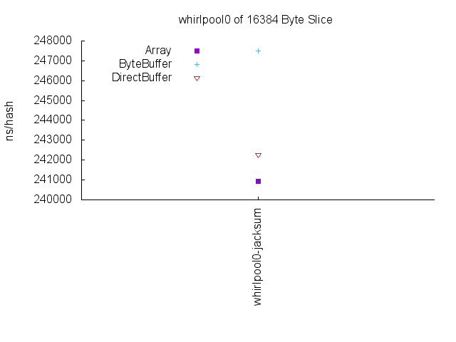

| Algorithm |  Array | ByteBuffer | DirectBuffer |
| --- | ---: | ---: | ---: | 
| [whirlpool0-jacksum](#whirlpool0-jacksum-latency) | 240925.706043 | 247507.307539 | 242275.232832 |

---
### 16384 Byte Slice Latency (whirlpool1)
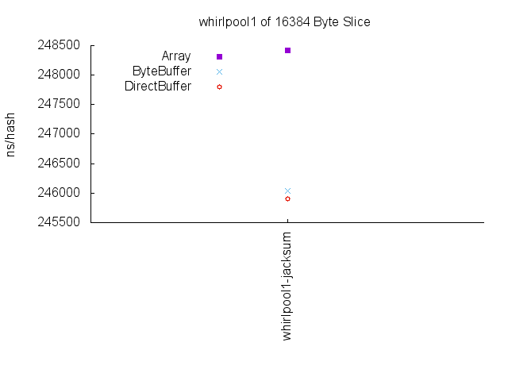

| Algorithm |  Array | ByteBuffer | DirectBuffer |
| --- | ---: | ---: | ---: | 
| [whirlpool1-jacksum](#whirlpool1-jacksum-latency) | 248414.670650 | 246033.106236 | 245908.406120 |

---
### 16384 Byte Slice Latency (whirlpool2)
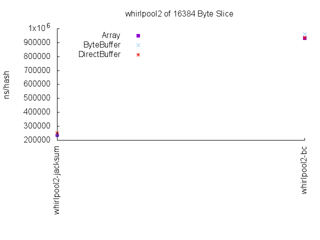

| Algorithm |  Array | ByteBuffer | DirectBuffer |
| --- | ---: | ---: | ---: | 
| [whirlpool2-jacksum](#whirlpool2-jacksum-latency) | 237269.843836 | 235019.859076 | 254877.384410 |
| [whirlpool2-bc](#whirlpool2-bc-latency) | 930449.166652 | 960641.039910 | 933689.950652 |

---
### 16384 Byte Slice Latency (xor8)

| Algorithm |  Array | ByteBuffer | DirectBuffer |
| --- | ---: | ---: | ---: | 
| [xor8-jacksum](#xor8-jacksum-latency) | 4605.085006 | 4682.780977 | 6830.224075 |

---
### 16384 Byte Slice Latency (xxh32)
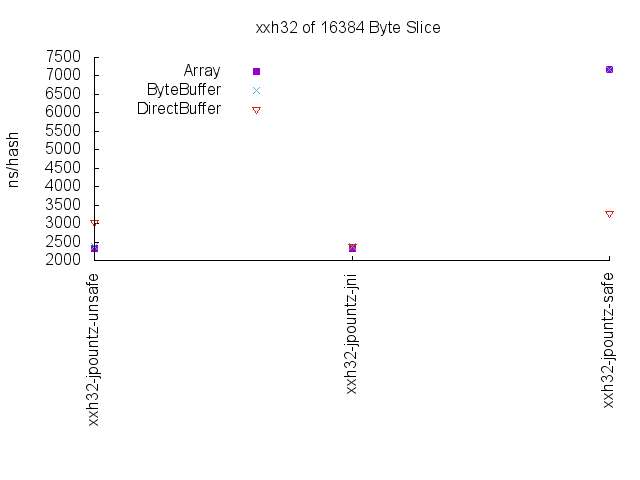

| Algorithm |  Array | ByteBuffer | DirectBuffer |
| --- | ---: | ---: | ---: | 
| [xxh32-jpountz-unsafe](#xxh32-jpountz-unsafe-latency) | 2327.549615 | 2384.445636 | 3037.442780 |
| [xxh32-jpountz-jni](#xxh32-jpountz-jni-latency) | 2330.749986 | 2371.317890 | 2379.683354 |
| [xxh32-jpountz-safe](#xxh32-jpountz-safe-latency) | 7168.127562 | 7166.766084 | 3284.943814 |

---
### 16384 Byte Slice Latency (xxh64)
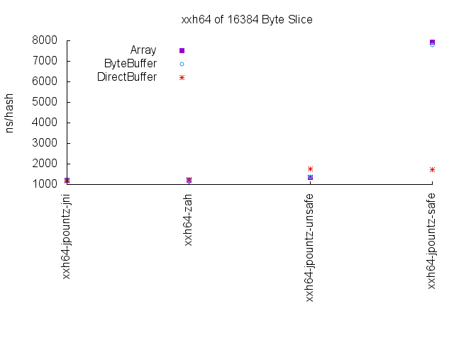

| Algorithm |  Array | ByteBuffer | DirectBuffer |
| --- | ---: | ---: | ---: | 
| [xxh64-jpountz-jni](#xxh64-jpountz-jni-latency) | 1195.621835 | 1198.616192 | 1185.216560 |
| [xxh64-zah](#xxh64-zah-latency) | 1197.272419 | 1220.530897 | 1235.450247 |
| [xxh64-jpountz-unsafe](#xxh64-jpountz-unsafe-latency) | 1359.182249 | 1374.501257 | 1756.421680 |
| [xxh64-jpountz-safe](#xxh64-jpountz-safe-latency) | 7942.155491 | 7805.341989 | 1724.955465 |

---
### 32768 Byte Slice Latency (All Hashes)
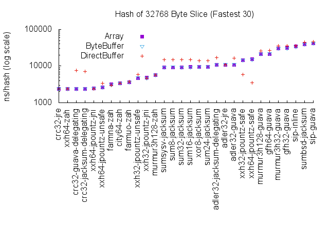

| Algorithm |  Array | ByteBuffer | DirectBuffer |
| --- | ---: | ---: | ---: | 
| [crc32-jre](#crc32-jre-latency) | 2367.824100 | 2374.039993 | 2408.335814 |
| [xxh64-zah](#xxh64-zah-latency) | 2373.834155 | 2377.447948 | 2377.269100 |
| [crc32-guava-delegating](#crc32-guava-delegating-latency) | 2402.712989 | 2379.725237 | 7641.909578 |
| [crc32-jacksum-delegating](#crc32-jacksum-delegating-latency) | 2408.755915 | 2412.241128 | 7120.222218 |
| [xxh64-jpountz-jni](#xxh64-jpountz-jni-latency) | 2448.492317 | 2489.544794 | 2366.758745 |
| [xxh64-jpountz-unsafe](#xxh64-jpountz-unsafe-latency) | 2648.048794 | 2613.473119 | 3454.870889 |
| [farmna-zah](#farmna-zah-latency) | 3137.660098 | 3130.823432 | 2977.565887 |
| [city64-zah](#city64-zah-latency) | 3359.655292 | 3378.359530 | 3437.227411 |
| [farmuo-zah](#farmuo-zah-latency) | 3665.871152 | 3658.280044 | 3714.596409 |
| [xxh32-jpountz-unsafe](#xxh32-jpountz-unsafe-latency) | 4735.699412 | 4818.762454 | 5902.653310 |
| [xxh32-jpountz-jni](#xxh32-jpountz-jni-latency) | 4870.438799 | 4711.205722 | 4719.866076 |
| [murmur3h128-zah](#murmur3h128-zah-latency) | 5720.728116 | 5755.831733 | 5735.545662 |
| [sumsysv-jacksum](#sumsysv-jacksum-latency) | 9182.774237 | 9189.248653 | 15105.468563 |
| [sum8-jacksum](#sum8-jacksum-latency) | 9187.324515 | 9663.692850 | 14910.656719 |
| [sum32-jacksum](#sum32-jacksum-latency) | 9333.718978 | 9351.464831 | 15079.616097 |
| [sum16-jacksum](#sum16-jacksum-latency) | 9463.474828 | 9329.811049 | 14900.720162 |
| [xor8-jacksum](#xor8-jacksum-latency) | 9473.445055 | 9667.806536 | 14019.089357 |
| [sum24-jacksum](#sum24-jacksum-latency) | 9494.107872 | 9473.357813 | 14217.579242 |
| [adler32-jacksum-delegating](#adler32-jacksum-delegating-latency) | 10948.852878 | 10949.761161 | 17001.190973 |
| [adler32-jre](#adler32-jre-latency) | 10948.970317 | 11128.711257 | 10919.308868 |
| [adler32-guava](#adler32-guava-latency) | 10973.319406 | 11157.947783 | 16540.876272 |
| [xxh32-jpountz-safe](#xxh32-jpountz-safe-latency) | 14399.953027 | 14379.987870 | 5889.886494 |
| [xxh64-jpountz-safe](#xxh64-jpountz-safe-latency) | 15532.795526 | 15167.819387 | 3458.865876 |
| [murmur3h128-guava](#murmur3h128-guava-latency) | 21523.153793 | 21522.478439 | 25585.976160 |
| [gfh64-guava](#gfh64-guava-latency) | 21540.586013 | 21893.045800 | 26839.197042 |
| [murmur3h32-guava](#murmur3h32-guava-latency) | 30591.328415 | 30576.896990 | 35792.238497 |
| [gfh32-guava](#gfh32-guava-latency) | 31055.903081 | 30541.167374 | 36221.902568 |
| [sip-inline](#sip-inline-latency) | 34198.450426 | 33578.830808 | 35353.983656 |
| [sumbsd-jacksum](#sumbsd-jacksum-latency) | 38852.912122 | 39483.384838 | 44901.591329 |
| [sip-guava](#sip-guava-latency) | 42188.950548 | 41802.339638 | 45818.317348 |
| [ed2k-jacksum](#ed2k-jacksum-latency) | 59316.155529 | 58601.528859 | 63336.370058 |
| [elf-jacksum](#elf-jacksum-latency) | 61944.268386 | 64451.699457 | 73001.678763 |
| [crc8-jacksum](#crc8-jacksum-latency) | 62947.645612 | 61590.676745 | 72481.824802 |
| [crc16-jacksum](#crc16-jacksum-latency) | 74826.175345 | 74796.757676 | 78997.022489 |
| [crc32-guava-rfc3720](#crc32-guava-rfc3720-latency) | 76561.307125 | 81021.857929 | 83573.042964 |
| [crc32-jacksum-fcs32](#crc32-jacksum-fcs32-latency) | 77426.671043 | 80503.018576 | 82731.606248 |
| [md2-jacksum](#md2-jacksum-latency) | 78440.629880 | 81123.554239 | 86081.799936 |
| [md5-jacksum](#md5-jacksum-latency) | 78479.435703 | 79371.359019 | 86959.622589 |
| [md5-guava](#md5-guava-latency) | 78808.751191 | 78925.625487 | 82878.130469 |
| [md4-jacksum](#md4-jacksum-latency) | 79774.932885 | 78474.171723 | 85131.390423 |
| [md4-bc](#md4-bc-latency) | 82300.557941 | 97392.386004 | 89172.998397 |
| [crc64-jacksum](#crc64-jacksum-latency) | 82759.145361 | 81070.286205 | 91807.862744 |
| [sip-fwdeng](#sip-fwdeng-latency) | 84010.667517 | 80620.682774 | 78917.654072 |
| [fcs16-jacksum](#fcs16-jacksum-latency) | 84247.755133 | 84356.371864 | 90078.329563 |
| [crc32-jacksum-mpeg2](#crc32-jacksum-mpeg2-latency) | 84467.176101 | 84495.149427 | 89701.660785 |
| [cksum-jacksum](#cksum-jacksum-latency) | 87209.415463 | 84336.724066 | 91838.060682 |
| [crc32-jacksum-bzip2](#crc32-jacksum-bzip2-latency) | 87314.427698 | 89529.619608 | 98057.631946 |
| [crc24-jacksum](#crc24-jacksum-latency) | 88765.875792 | 89506.127873 | 98918.182301 |
| [md5-jacksum-alt](#md5-jacksum-alt-latency) | 90244.477944 | 90529.139444 | 97002.668893 |
| [tiger160-jacksum](#tiger160-jacksum-latency) | 95617.937295 | 95564.627500 | 100052.753360 |
| [tiger128-jacksum](#tiger128-jacksum-latency) | 95666.425289 | 95614.171330 | 102823.385964 |
| [tiger2-jacksum](#tiger2-jacksum-latency) | 95668.661513 | 95798.228836 | 100152.450313 |
| [tiger-jacksum](#tiger-jacksum-latency) | 95684.335302 | 95532.190392 | 103794.481980 |
| [tiger-bc](#tiger-bc-latency) | 103107.642516 | 102846.722228 | 102043.971045 |
| [tiger-jacksum-tree](#tiger-jacksum-tree-latency) | 105088.500051 | 108506.220194 | 109806.446695 |
| [tiger2-jacksum-tree](#tiger2-jacksum-tree-latency) | 105121.630621 | 107646.497091 | 110090.465129 |
| [md5-bc](#md5-bc-latency) | 110244.655099 | 117748.192580 | 112445.054223 |
| [skein512-bc](#skein512-bc-latency) | 117603.323425 | 120685.782968 | 124407.250407 |
| [sha1-jacksum](#sha1-jacksum-latency) | 117744.647516 | 117906.331974 | 123125.044505 |
| [sha1-guava](#sha1-guava-latency) | 117981.882192 | 118083.969142 | 123712.141690 |
| [ripemd128-bc](#ripemd128-bc-latency) | 119136.641483 | 124838.778415 | 125643.173312 |
| [adler32-jacksum-alt](#adler32-jacksum-alt-latency) | 123462.183642 | 123806.629125 | 133330.385863 |
| [skein1024-bc](#skein1024-bc-latency) | 126304.224150 | 131026.841858 | 132274.096287 |
| [ripemd256-jacksum](#ripemd256-jacksum-latency) | 126934.171238 | 127518.605236 | 132396.630898 |
| [ripemd256-bc](#ripemd256-bc-latency) | 127537.809131 | 129039.940548 | 133402.202429 |
| [sha0-jacksum](#sha0-jacksum-latency) | 129043.506638 | 134200.562363 | 143507.329247 |
| [haval128h3-jacksum](#haval128h3-jacksum-latency) | 131054.781873 | 131178.678826 | 137215.251129 |
| [haval256h3-jacksum](#haval256h3-jacksum-latency) | 131072.883777 | 131041.839822 | 138839.349490 |
| [haval160h3-jacksum](#haval160h3-jacksum-latency) | 131117.820529 | 131005.231051 | 139584.774636 |
| [haval224h3-jacksum](#haval224h3-jacksum-latency) | 131319.510848 | 131336.589749 | 136950.516293 |
| [skein256-bc](#skein256-bc-latency) | 132722.232662 | 134123.787110 | 139853.339197 |
| [sha1-jacksum-alt](#sha1-jacksum-alt-latency) | 133632.605440 | 132424.471932 | 145887.545063 |
| [sha512-jacksum-alt](#sha512-jacksum-alt-latency) | 133729.699902 | 133863.809379 | 149381.431661 |
| [haval192h3-jacksum](#haval192h3-jacksum-latency) | 135116.246834 | 130928.717374 | 140099.830406 |
| [sha384-jacksum-alt](#sha384-jacksum-alt-latency) | 136986.696756 | 137251.614555 | 140870.011248 |
| [sha512-bc-t](#sha512-bc-t-latency) | 138288.845316 | 136701.839953 | 144768.496757 |
| [ripemd128-jacksum](#ripemd128-jacksum-latency) | 140005.768584 | 137991.751921 | 143917.244915 |
| [sha512-bc](#sha512-bc-latency) | 141215.717594 | 137252.128129 | 151103.985360 |
| [sha384-jacksum](#sha384-jacksum-latency) | 142154.875159 | 144547.630420 | 152384.332533 |
| [sha384-guava](#sha384-guava-latency) | 142944.616093 | 145376.046038 | 152280.304622 |
| [sha512-guava](#sha512-guava-latency) | 143129.492201 | 143007.143830 | 148990.465837 |
| [sha512-jacksum](#sha512-jacksum-latency) | 143182.348013 | 142826.486617 | 147147.066669 |
| [sha384-bc](#sha384-bc-latency) | 143871.167544 | 140067.536373 | 142946.686090 |
| [sha1-bc](#sha1-bc-latency) | 149097.595536 | 149330.625066 | 156648.229021 |
| [has160-jacksum](#has160-jacksum-latency) | 149767.793709 | 151181.929181 | 161530.387076 |
| [sha256-guava](#sha256-guava-latency) | 170666.718417 | 170618.867212 | 177449.670958 |
| [sha256-jacksum](#sha256-jacksum-latency) | 175492.560735 | 175650.524293 | 176070.646381 |
| [haval192h4-jacksum](#haval192h4-jacksum-latency) | 180190.139439 | 180249.733752 | 195371.382296 |
| [haval160h4-jacksum](#haval160h4-jacksum-latency) | 180307.827327 | 186010.073996 | 197616.769318 |
| [haval224h4-jacksum](#haval224h4-jacksum-latency) | 180691.070771 | 180483.915997 | 189966.200871 |
| [haval256h4-jacksum](#haval256h4-jacksum-latency) | 183087.724704 | 180287.417275 | 187718.189136 |
| [haval128h4-jacksum](#haval128h4-jacksum-latency) | 188606.433910 | 180406.628955 | 187385.145508 |
| [sm3-bc](#sm3-bc-latency) | 192101.696050 | 192179.335493 | 210179.201734 |
| [sha256-jacksum-alt](#sha256-jacksum-alt-latency) | 199041.578702 | 202975.809731 | 208238.787568 |
| [sha224-jacksum](#sha224-jacksum-latency) | 202277.837332 | 200535.005982 | 204954.198161 |
| [sha256-bc](#sha256-bc-latency) | 205083.594463 | 205047.193012 | 212128.068063 |
| [sha224-bc](#sha224-bc-latency) | 210658.956568 | 204406.233535 | 213240.668109 |
| [haval224h5-jacksum](#haval224h5-jacksum-latency) | 220445.250235 | 227221.626162 | 227976.060096 |
| [haval128h5-jacksum](#haval128h5-jacksum-latency) | 220678.715688 | 220835.425475 | 231284.279197 |
| [haval256h5-jacksum](#haval256h5-jacksum-latency) | 220892.695990 | 220344.922699 | 229348.841278 |
| [haval160h5-jacksum](#haval160h5-jacksum-latency) | 220985.437938 | 220147.238723 | 231881.654243 |
| [haval192h5-jacksum](#haval192h5-jacksum-latency) | 223687.295661 | 225560.987478 | 233910.099383 |
| [ripemd160-jacksum](#ripemd160-jacksum-latency) | 273426.278905 | 281144.690746 | 287367.731159 |
| [whirlpool2-jacksum](#whirlpool2-jacksum-latency) | 477592.864972 | 483595.473541 | 484870.495298 |
| [whirlpool0-jacksum](#whirlpool0-jacksum-latency) | 481709.199570 | 486994.240514 | 506872.761146 |
| [whirlpool1-jacksum](#whirlpool1-jacksum-latency) | 490858.549844 | 484039.286400 | 494651.475889 |
| [ripemd160-bc](#ripemd160-bc-latency) | 557488.936588 | 544057.128695 | 551639.194452 |
| [ripemd320-jacksum](#ripemd320-jacksum-latency) | 560711.763205 | 558303.618972 | 571272.566146 |
| [ripemd320-bc](#ripemd320-bc-latency) | 560855.382703 | 549574.697472 | 559568.392041 |
| [sha3-bc](#sha3-bc-latency) | 1414006.796925 | 1312413.891464 | 1317443.332599 |
| [whirlpool2-bc](#whirlpool2-bc-latency) | 1798698.956657 | 1789855.819303 | 1784590.637372 |
| [gost-jacksum](#gost-jacksum-latency) | 3838182.895891 | 3798601.250059 | 4082534.895294 |
| [md2-bc](#md2-bc-latency) | 3917943.541302 | 3850885.110270 | 3853516.385053 |
| [gost-bc](#gost-bc-latency) | 4267149.483874 | 4206866.374907 | 4049852.802712 |

---
### 32768 Byte Slice Latency (adler32)
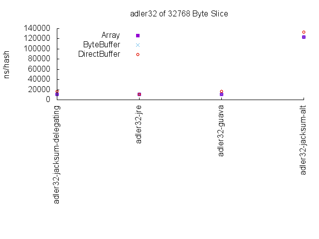

| Algorithm |  Array | ByteBuffer | DirectBuffer |
| --- | ---: | ---: | ---: | 
| [adler32-jacksum-delegating](#adler32-jacksum-delegating-latency) | 10948.852878 | 10949.761161 | 17001.190973 |
| [adler32-jre](#adler32-jre-latency) | 10948.970317 | 11128.711257 | 10919.308868 |
| [adler32-guava](#adler32-guava-latency) | 10973.319406 | 11157.947783 | 16540.876272 |
| [adler32-jacksum-alt](#adler32-jacksum-alt-latency) | 123462.183642 | 123806.629125 | 133330.385863 |

---
### 32768 Byte Slice Latency (city64)
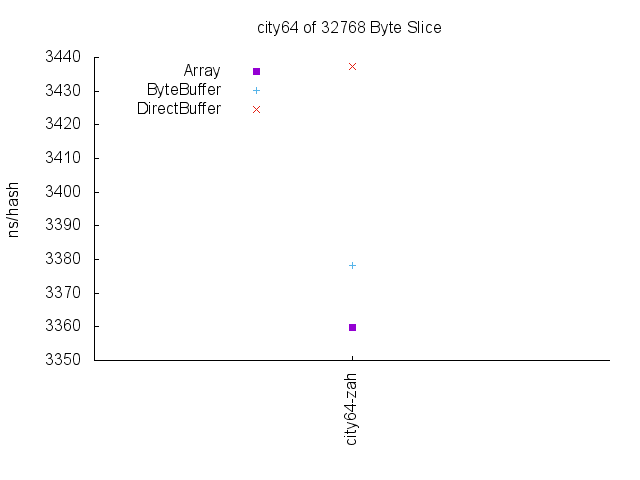

| Algorithm |  Array | ByteBuffer | DirectBuffer |
| --- | ---: | ---: | ---: | 
| [city64-zah](#city64-zah-latency) | 3359.655292 | 3378.359530 | 3437.227411 |

---
### 32768 Byte Slice Latency (cksum)
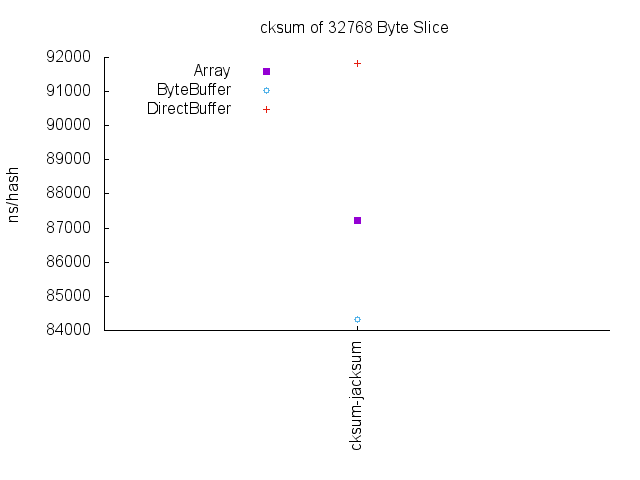

| Algorithm |  Array | ByteBuffer | DirectBuffer |
| --- | ---: | ---: | ---: | 
| [cksum-jacksum](#cksum-jacksum-latency) | 87209.415463 | 84336.724066 | 91838.060682 |

---
### 32768 Byte Slice Latency (crc16)

| Algorithm |  Array | ByteBuffer | DirectBuffer |
| --- | ---: | ---: | ---: | 
| [crc16-jacksum](#crc16-jacksum-latency) | 74826.175345 | 74796.757676 | 78997.022489 |

---
### 32768 Byte Slice Latency (crc24)
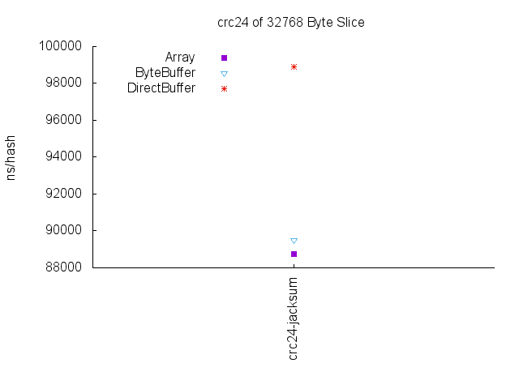

| Algorithm |  Array | ByteBuffer | DirectBuffer |
| --- | ---: | ---: | ---: | 
| [crc24-jacksum](#crc24-jacksum-latency) | 88765.875792 | 89506.127873 | 98918.182301 |

---
### 32768 Byte Slice Latency (crc32)
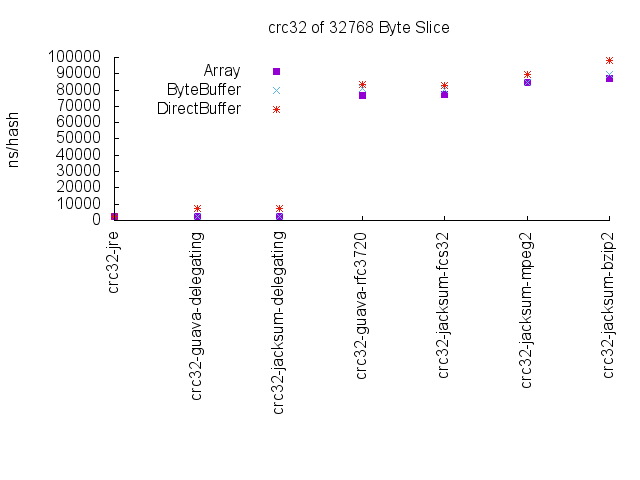

| Algorithm |  Array | ByteBuffer | DirectBuffer |
| --- | ---: | ---: | ---: | 
| [crc32-jre](#crc32-jre-latency) | 2367.824100 | 2374.039993 | 2408.335814 |
| [crc32-guava-delegating](#crc32-guava-delegating-latency) | 2402.712989 | 2379.725237 | 7641.909578 |
| [crc32-jacksum-delegating](#crc32-jacksum-delegating-latency) | 2408.755915 | 2412.241128 | 7120.222218 |
| [crc32-guava-rfc3720](#crc32-guava-rfc3720-latency) | 76561.307125 | 81021.857929 | 83573.042964 |
| [crc32-jacksum-fcs32](#crc32-jacksum-fcs32-latency) | 77426.671043 | 80503.018576 | 82731.606248 |
| [crc32-jacksum-mpeg2](#crc32-jacksum-mpeg2-latency) | 84467.176101 | 84495.149427 | 89701.660785 |
| [crc32-jacksum-bzip2](#crc32-jacksum-bzip2-latency) | 87314.427698 | 89529.619608 | 98057.631946 |

---
### 32768 Byte Slice Latency (crc64)
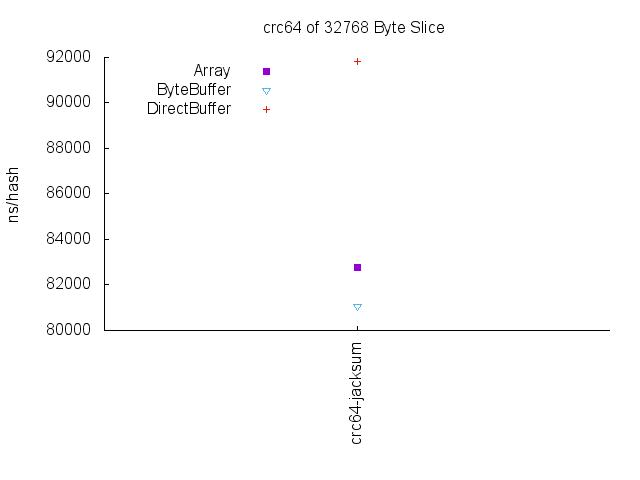

| Algorithm |  Array | ByteBuffer | DirectBuffer |
| --- | ---: | ---: | ---: | 
| [crc64-jacksum](#crc64-jacksum-latency) | 82759.145361 | 81070.286205 | 91807.862744 |

---
### 32768 Byte Slice Latency (crc8)
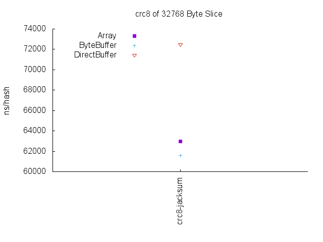

| Algorithm |  Array | ByteBuffer | DirectBuffer |
| --- | ---: | ---: | ---: | 
| [crc8-jacksum](#crc8-jacksum-latency) | 62947.645612 | 61590.676745 | 72481.824802 |

---
### 32768 Byte Slice Latency (ed2k)
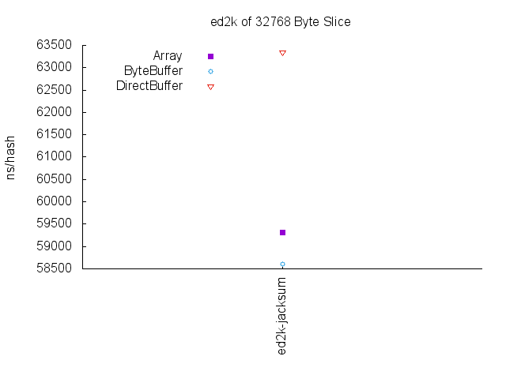

| Algorithm |  Array | ByteBuffer | DirectBuffer |
| --- | ---: | ---: | ---: | 
| [ed2k-jacksum](#ed2k-jacksum-latency) | 59316.155529 | 58601.528859 | 63336.370058 |

---
### 32768 Byte Slice Latency (elf)
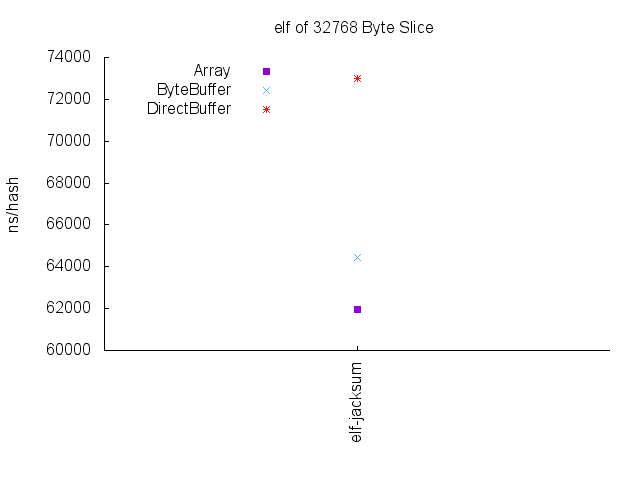

| Algorithm |  Array | ByteBuffer | DirectBuffer |
| --- | ---: | ---: | ---: | 
| [elf-jacksum](#elf-jacksum-latency) | 61944.268386 | 64451.699457 | 73001.678763 |

---
### 32768 Byte Slice Latency (farmna)
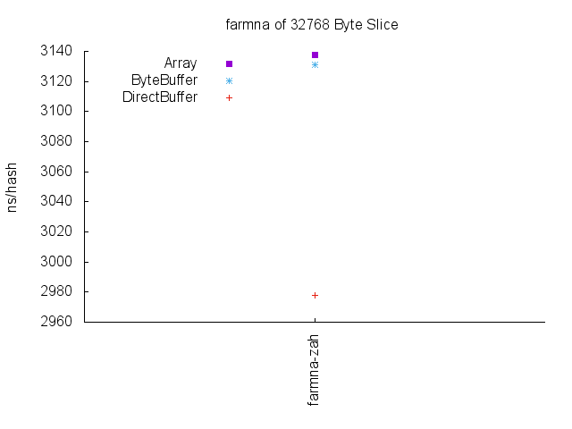

| Algorithm |  Array | ByteBuffer | DirectBuffer |
| --- | ---: | ---: | ---: | 
| [farmna-zah](#farmna-zah-latency) | 3137.660098 | 3130.823432 | 2977.565887 |

---
### 32768 Byte Slice Latency (farmuo)
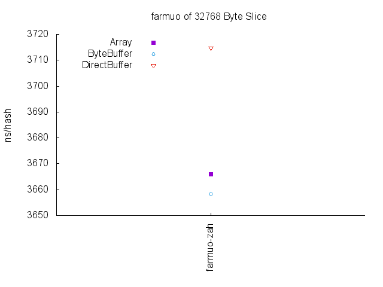

| Algorithm |  Array | ByteBuffer | DirectBuffer |
| --- | ---: | ---: | ---: | 
| [farmuo-zah](#farmuo-zah-latency) | 3665.871152 | 3658.280044 | 3714.596409 |

---
### 32768 Byte Slice Latency (fcs16)
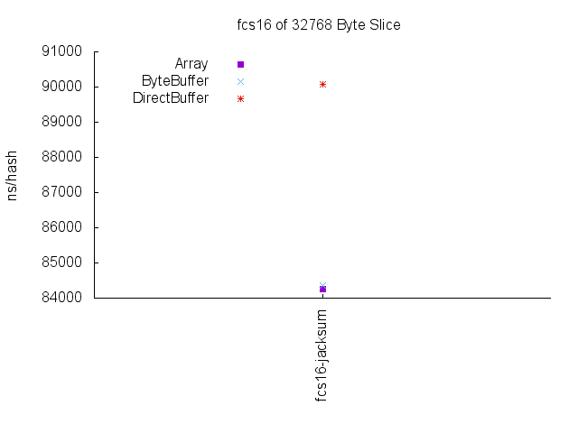

| Algorithm |  Array | ByteBuffer | DirectBuffer |
| --- | ---: | ---: | ---: | 
| [fcs16-jacksum](#fcs16-jacksum-latency) | 84247.755133 | 84356.371864 | 90078.329563 |

---
### 32768 Byte Slice Latency (gfh32)
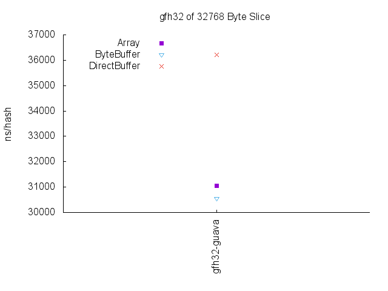

| Algorithm |  Array | ByteBuffer | DirectBuffer |
| --- | ---: | ---: | ---: | 
| [gfh32-guava](#gfh32-guava-latency) | 31055.903081 | 30541.167374 | 36221.902568 |

---
### 32768 Byte Slice Latency (gfh64)
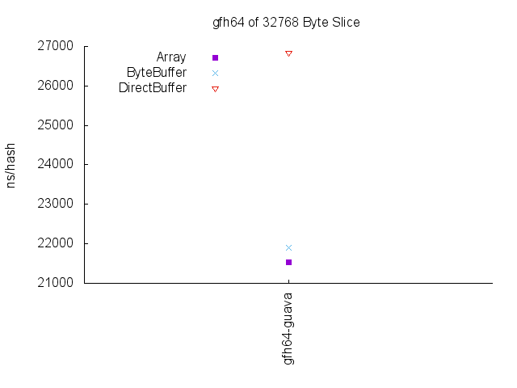

| Algorithm |  Array | ByteBuffer | DirectBuffer |
| --- | ---: | ---: | ---: | 
| [gfh64-guava](#gfh64-guava-latency) | 21540.586013 | 21893.045800 | 26839.197042 |

---
### 32768 Byte Slice Latency (gost)
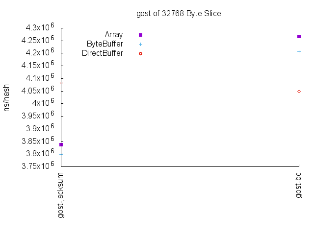

| Algorithm |  Array | ByteBuffer | DirectBuffer |
| --- | ---: | ---: | ---: | 
| [gost-jacksum](#gost-jacksum-latency) | 3838182.895891 | 3798601.250059 | 4082534.895294 |
| [gost-bc](#gost-bc-latency) | 4267149.483874 | 4206866.374907 | 4049852.802712 |

---
### 32768 Byte Slice Latency (has160)
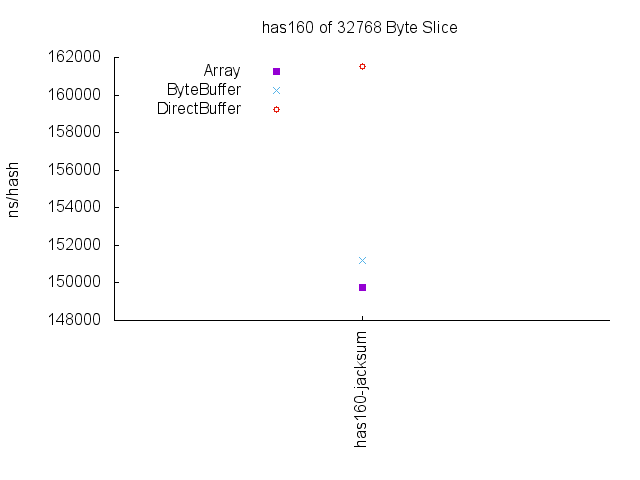

| Algorithm |  Array | ByteBuffer | DirectBuffer |
| --- | ---: | ---: | ---: | 
| [has160-jacksum](#has160-jacksum-latency) | 149767.793709 | 151181.929181 | 161530.387076 |

---
### 32768 Byte Slice Latency (haval128h3)
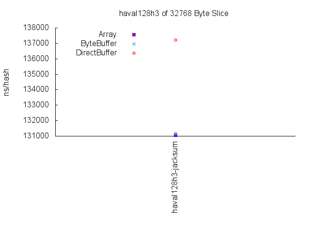

| Algorithm |  Array | ByteBuffer | DirectBuffer |
| --- | ---: | ---: | ---: | 
| [haval128h3-jacksum](#haval128h3-jacksum-latency) | 131054.781873 | 131178.678826 | 137215.251129 |

---
### 32768 Byte Slice Latency (haval128h4)
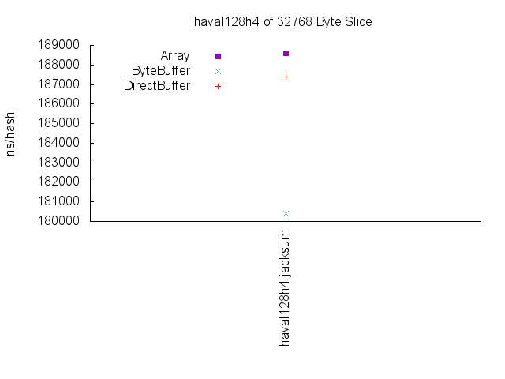

| Algorithm |  Array | ByteBuffer | DirectBuffer |
| --- | ---: | ---: | ---: | 
| [haval128h4-jacksum](#haval128h4-jacksum-latency) | 188606.433910 | 180406.628955 | 187385.145508 |

---
### 32768 Byte Slice Latency (haval128h5)

| Algorithm |  Array | ByteBuffer | DirectBuffer |
| --- | ---: | ---: | ---: | 
| [haval128h5-jacksum](#haval128h5-jacksum-latency) | 220678.715688 | 220835.425475 | 231284.279197 |

---
### 32768 Byte Slice Latency (haval160h3)
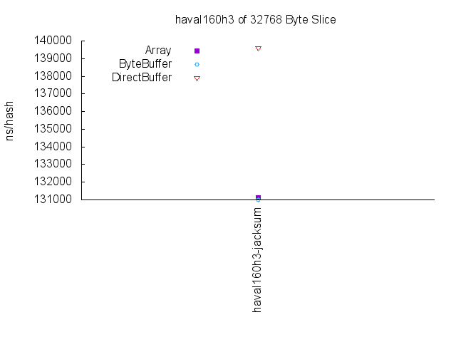

| Algorithm |  Array | ByteBuffer | DirectBuffer |
| --- | ---: | ---: | ---: | 
| [haval160h3-jacksum](#haval160h3-jacksum-latency) | 131117.820529 | 131005.231051 | 139584.774636 |

---
### 32768 Byte Slice Latency (haval160h4)
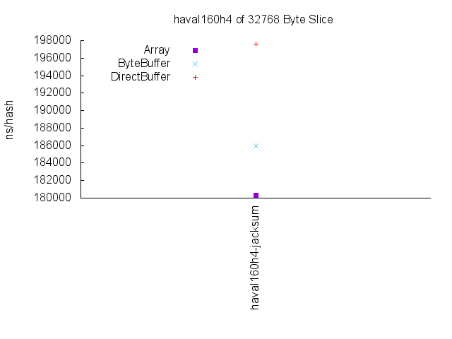

| Algorithm |  Array | ByteBuffer | DirectBuffer |
| --- | ---: | ---: | ---: | 
| [haval160h4-jacksum](#haval160h4-jacksum-latency) | 180307.827327 | 186010.073996 | 197616.769318 |

---
### 32768 Byte Slice Latency (haval160h5)

| Algorithm |  Array | ByteBuffer | DirectBuffer |
| --- | ---: | ---: | ---: | 
| [haval160h5-jacksum](#haval160h5-jacksum-latency) | 220985.437938 | 220147.238723 | 231881.654243 |

---
### 32768 Byte Slice Latency (haval192h3)
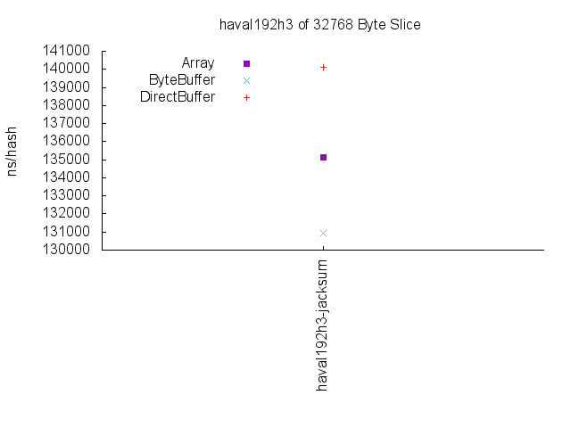

| Algorithm |  Array | ByteBuffer | DirectBuffer |
| --- | ---: | ---: | ---: | 
| [haval192h3-jacksum](#haval192h3-jacksum-latency) | 135116.246834 | 130928.717374 | 140099.830406 |

---
### 32768 Byte Slice Latency (haval192h4)
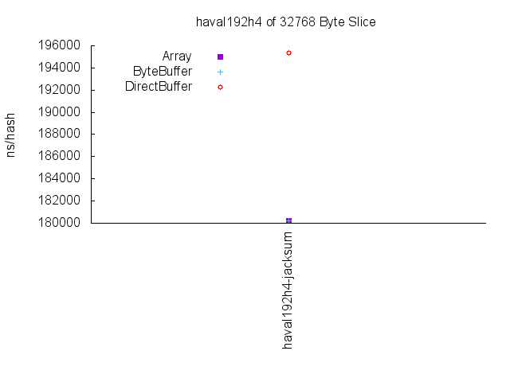

| Algorithm |  Array | ByteBuffer | DirectBuffer |
| --- | ---: | ---: | ---: | 
| [haval192h4-jacksum](#haval192h4-jacksum-latency) | 180190.139439 | 180249.733752 | 195371.382296 |

---
### 32768 Byte Slice Latency (haval192h5)
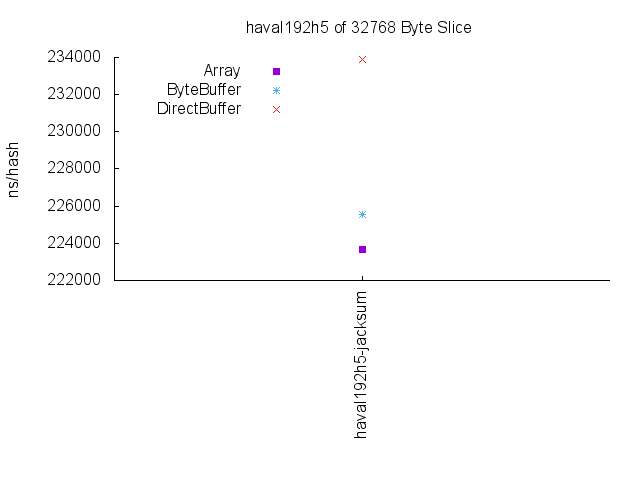

| Algorithm |  Array | ByteBuffer | DirectBuffer |
| --- | ---: | ---: | ---: | 
| [haval192h5-jacksum](#haval192h5-jacksum-latency) | 223687.295661 | 225560.987478 | 233910.099383 |

---
### 32768 Byte Slice Latency (haval224h3)
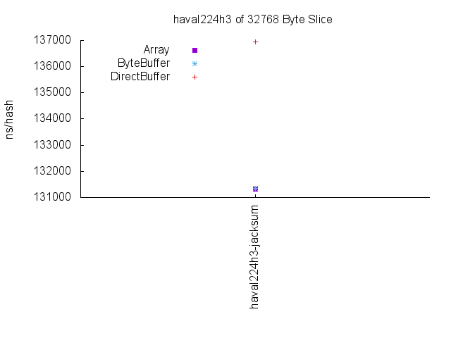

| Algorithm |  Array | ByteBuffer | DirectBuffer |
| --- | ---: | ---: | ---: | 
| [haval224h3-jacksum](#haval224h3-jacksum-latency) | 131319.510848 | 131336.589749 | 136950.516293 |

---
### 32768 Byte Slice Latency (haval224h4)
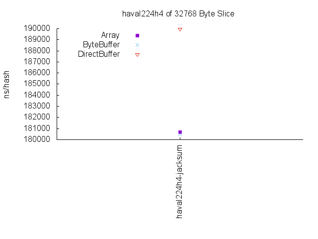

| Algorithm |  Array | ByteBuffer | DirectBuffer |
| --- | ---: | ---: | ---: | 
| [haval224h4-jacksum](#haval224h4-jacksum-latency) | 180691.070771 | 180483.915997 | 189966.200871 |

---
### 32768 Byte Slice Latency (haval224h5)

| Algorithm |  Array | ByteBuffer | DirectBuffer |
| --- | ---: | ---: | ---: | 
| [haval224h5-jacksum](#haval224h5-jacksum-latency) | 220445.250235 | 227221.626162 | 227976.060096 |

---
### 32768 Byte Slice Latency (haval256h3)
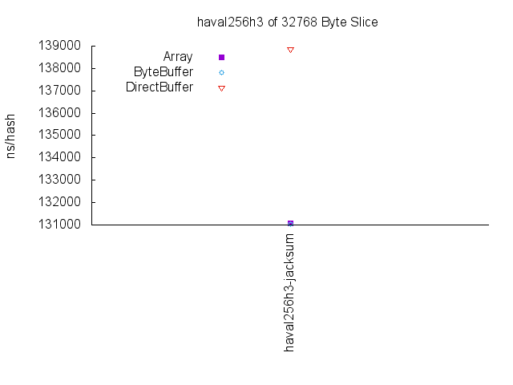

| Algorithm |  Array | ByteBuffer | DirectBuffer |
| --- | ---: | ---: | ---: | 
| [haval256h3-jacksum](#haval256h3-jacksum-latency) | 131072.883777 | 131041.839822 | 138839.349490 |

---
### 32768 Byte Slice Latency (haval256h4)
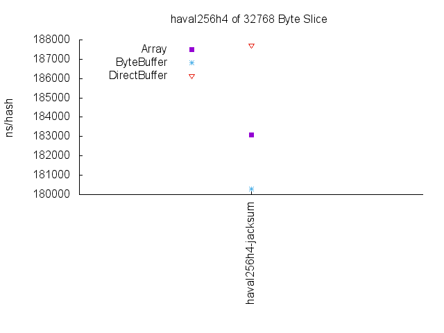

| Algorithm |  Array | ByteBuffer | DirectBuffer |
| --- | ---: | ---: | ---: | 
| [haval256h4-jacksum](#haval256h4-jacksum-latency) | 183087.724704 | 180287.417275 | 187718.189136 |

---
### 32768 Byte Slice Latency (haval256h5)
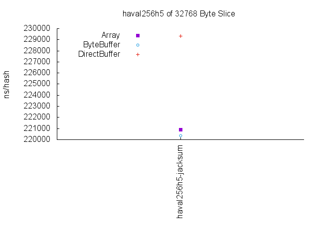

| Algorithm |  Array | ByteBuffer | DirectBuffer |
| --- | ---: | ---: | ---: | 
| [haval256h5-jacksum](#haval256h5-jacksum-latency) | 220892.695990 | 220344.922699 | 229348.841278 |

---
### 32768 Byte Slice Latency (md2)
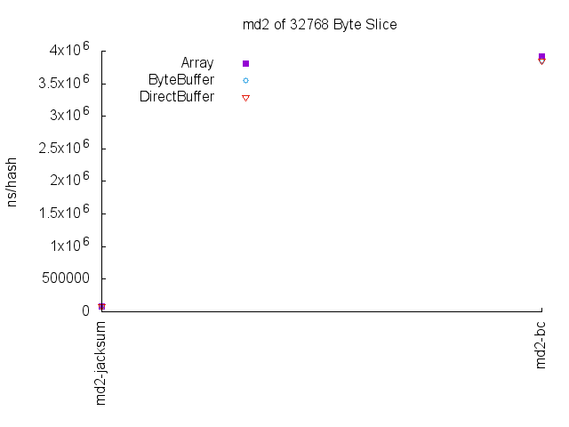

| Algorithm |  Array | ByteBuffer | DirectBuffer |
| --- | ---: | ---: | ---: | 
| [md2-jacksum](#md2-jacksum-latency) | 78440.629880 | 81123.554239 | 86081.799936 |
| [md2-bc](#md2-bc-latency) | 3917943.541302 | 3850885.110270 | 3853516.385053 |

---
### 32768 Byte Slice Latency (md4)
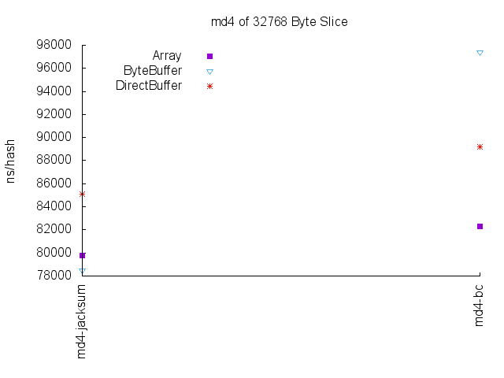

| Algorithm |  Array | ByteBuffer | DirectBuffer |
| --- | ---: | ---: | ---: | 
| [md4-jacksum](#md4-jacksum-latency) | 79774.932885 | 78474.171723 | 85131.390423 |
| [md4-bc](#md4-bc-latency) | 82300.557941 | 97392.386004 | 89172.998397 |

---
### 32768 Byte Slice Latency (md5)
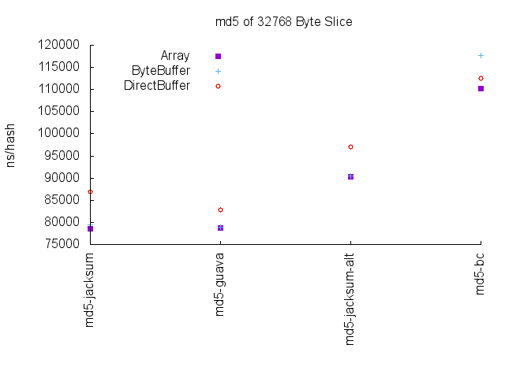

| Algorithm |  Array | ByteBuffer | DirectBuffer |
| --- | ---: | ---: | ---: | 
| [md5-jacksum](#md5-jacksum-latency) | 78479.435703 | 79371.359019 | 86959.622589 |
| [md5-guava](#md5-guava-latency) | 78808.751191 | 78925.625487 | 82878.130469 |
| [md5-jacksum-alt](#md5-jacksum-alt-latency) | 90244.477944 | 90529.139444 | 97002.668893 |
| [md5-bc](#md5-bc-latency) | 110244.655099 | 117748.192580 | 112445.054223 |

---
### 32768 Byte Slice Latency (murmur3h128)
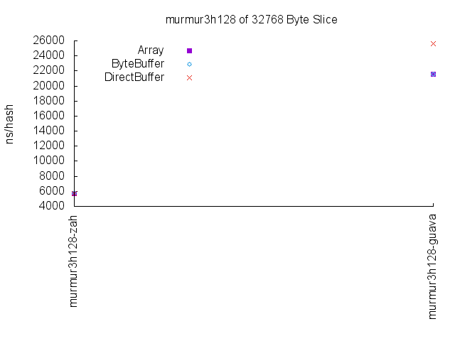

| Algorithm |  Array | ByteBuffer | DirectBuffer |
| --- | ---: | ---: | ---: | 
| [murmur3h128-zah](#murmur3h128-zah-latency) | 5720.728116 | 5755.831733 | 5735.545662 |
| [murmur3h128-guava](#murmur3h128-guava-latency) | 21523.153793 | 21522.478439 | 25585.976160 |

---
### 32768 Byte Slice Latency (murmur3h32)
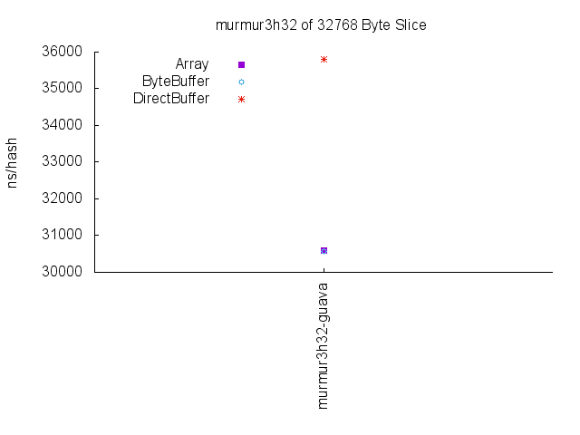

| Algorithm |  Array | ByteBuffer | DirectBuffer |
| --- | ---: | ---: | ---: | 
| [murmur3h32-guava](#murmur3h32-guava-latency) | 30591.328415 | 30576.896990 | 35792.238497 |

---
### 32768 Byte Slice Latency (ripemd128)
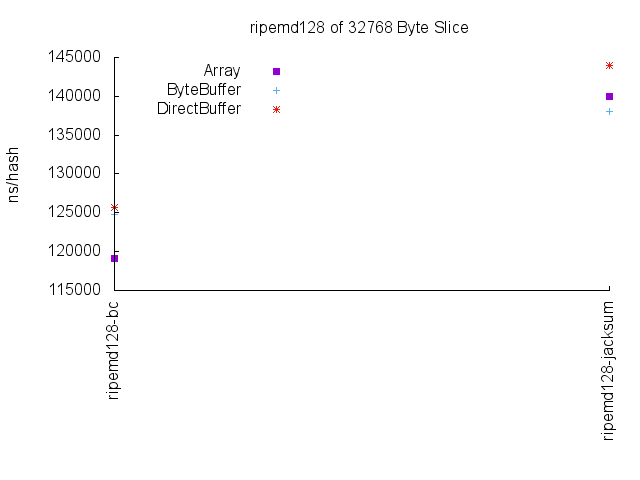

| Algorithm |  Array | ByteBuffer | DirectBuffer |
| --- | ---: | ---: | ---: | 
| [ripemd128-bc](#ripemd128-bc-latency) | 119136.641483 | 124838.778415 | 125643.173312 |
| [ripemd128-jacksum](#ripemd128-jacksum-latency) | 140005.768584 | 137991.751921 | 143917.244915 |

---
### 32768 Byte Slice Latency (ripemd160)
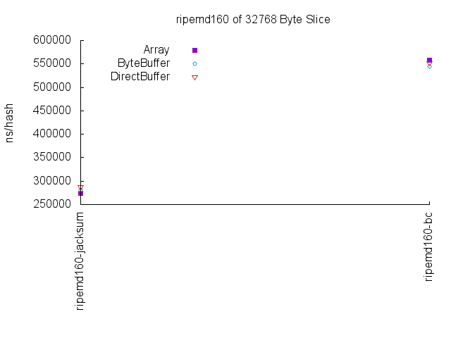

| Algorithm |  Array | ByteBuffer | DirectBuffer |
| --- | ---: | ---: | ---: | 
| [ripemd160-jacksum](#ripemd160-jacksum-latency) | 273426.278905 | 281144.690746 | 287367.731159 |
| [ripemd160-bc](#ripemd160-bc-latency) | 557488.936588 | 544057.128695 | 551639.194452 |

---
### 32768 Byte Slice Latency (ripemd256)
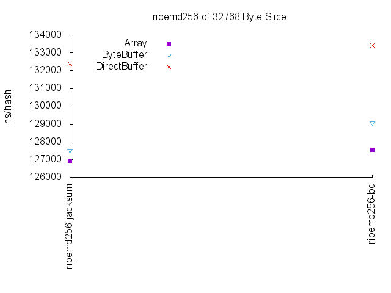

| Algorithm |  Array | ByteBuffer | DirectBuffer |
| --- | ---: | ---: | ---: | 
| [ripemd256-jacksum](#ripemd256-jacksum-latency) | 126934.171238 | 127518.605236 | 132396.630898 |
| [ripemd256-bc](#ripemd256-bc-latency) | 127537.809131 | 129039.940548 | 133402.202429 |

---
### 32768 Byte Slice Latency (ripemd320)
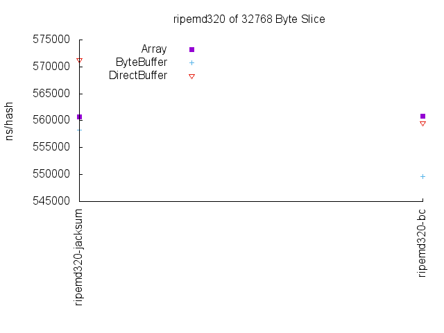

| Algorithm |  Array | ByteBuffer | DirectBuffer |
| --- | ---: | ---: | ---: | 
| [ripemd320-jacksum](#ripemd320-jacksum-latency) | 560711.763205 | 558303.618972 | 571272.566146 |
| [ripemd320-bc](#ripemd320-bc-latency) | 560855.382703 | 549574.697472 | 559568.392041 |

---
### 32768 Byte Slice Latency (sha0)
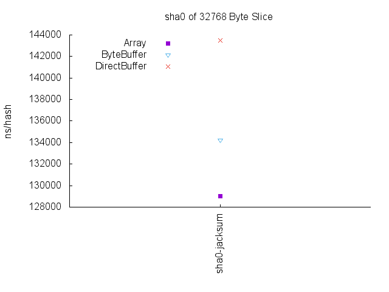

| Algorithm |  Array | ByteBuffer | DirectBuffer |
| --- | ---: | ---: | ---: | 
| [sha0-jacksum](#sha0-jacksum-latency) | 129043.506638 | 134200.562363 | 143507.329247 |

---
### 32768 Byte Slice Latency (sha1)
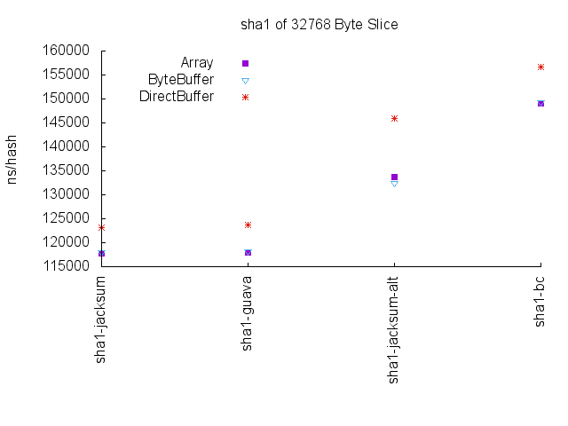

| Algorithm |  Array | ByteBuffer | DirectBuffer |
| --- | ---: | ---: | ---: | 
| [sha1-jacksum](#sha1-jacksum-latency) | 117744.647516 | 117906.331974 | 123125.044505 |
| [sha1-guava](#sha1-guava-latency) | 117981.882192 | 118083.969142 | 123712.141690 |
| [sha1-jacksum-alt](#sha1-jacksum-alt-latency) | 133632.605440 | 132424.471932 | 145887.545063 |
| [sha1-bc](#sha1-bc-latency) | 149097.595536 | 149330.625066 | 156648.229021 |

---
### 32768 Byte Slice Latency (sha224)
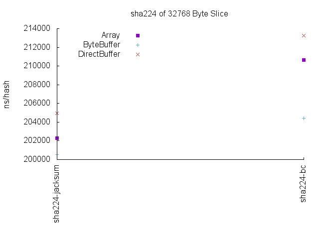

| Algorithm |  Array | ByteBuffer | DirectBuffer |
| --- | ---: | ---: | ---: | 
| [sha224-jacksum](#sha224-jacksum-latency) | 202277.837332 | 200535.005982 | 204954.198161 |
| [sha224-bc](#sha224-bc-latency) | 210658.956568 | 204406.233535 | 213240.668109 |

---
### 32768 Byte Slice Latency (sha256)
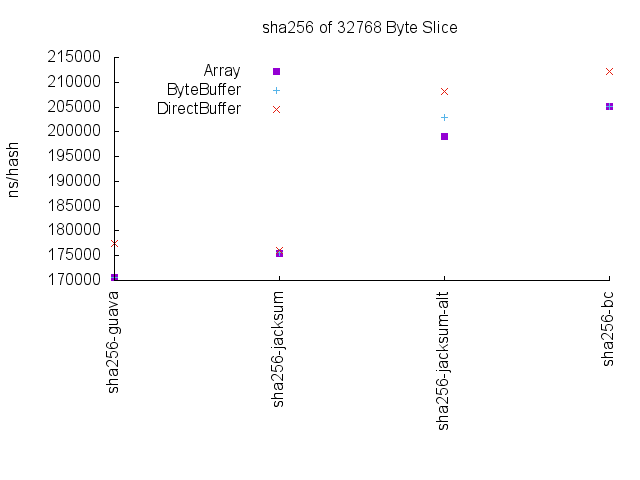

| Algorithm |  Array | ByteBuffer | DirectBuffer |
| --- | ---: | ---: | ---: | 
| [sha256-guava](#sha256-guava-latency) | 170666.718417 | 170618.867212 | 177449.670958 |
| [sha256-jacksum](#sha256-jacksum-latency) | 175492.560735 | 175650.524293 | 176070.646381 |
| [sha256-jacksum-alt](#sha256-jacksum-alt-latency) | 199041.578702 | 202975.809731 | 208238.787568 |
| [sha256-bc](#sha256-bc-latency) | 205083.594463 | 205047.193012 | 212128.068063 |

---
### 32768 Byte Slice Latency (sha3)
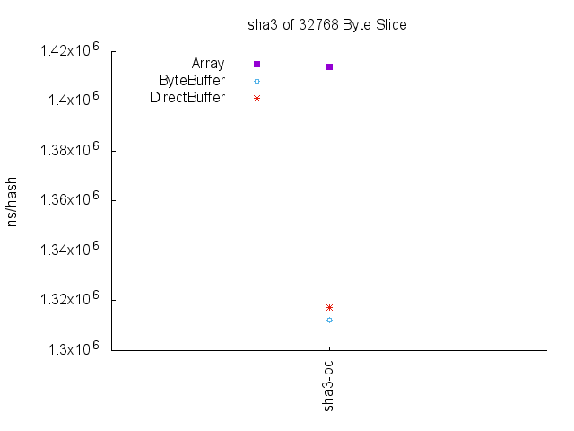

| Algorithm |  Array | ByteBuffer | DirectBuffer |
| --- | ---: | ---: | ---: | 
| [sha3-bc](#sha3-bc-latency) | 1414006.796925 | 1312413.891464 | 1317443.332599 |

---
### 32768 Byte Slice Latency (sha384)
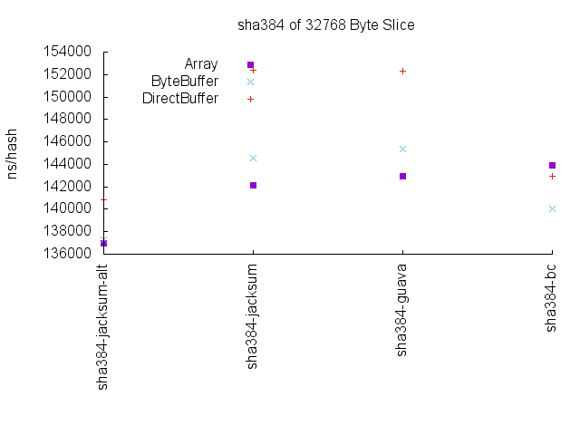

| Algorithm |  Array | ByteBuffer | DirectBuffer |
| --- | ---: | ---: | ---: | 
| [sha384-jacksum-alt](#sha384-jacksum-alt-latency) | 136986.696756 | 137251.614555 | 140870.011248 |
| [sha384-jacksum](#sha384-jacksum-latency) | 142154.875159 | 144547.630420 | 152384.332533 |
| [sha384-guava](#sha384-guava-latency) | 142944.616093 | 145376.046038 | 152280.304622 |
| [sha384-bc](#sha384-bc-latency) | 143871.167544 | 140067.536373 | 142946.686090 |

---
### 32768 Byte Slice Latency (sha512)
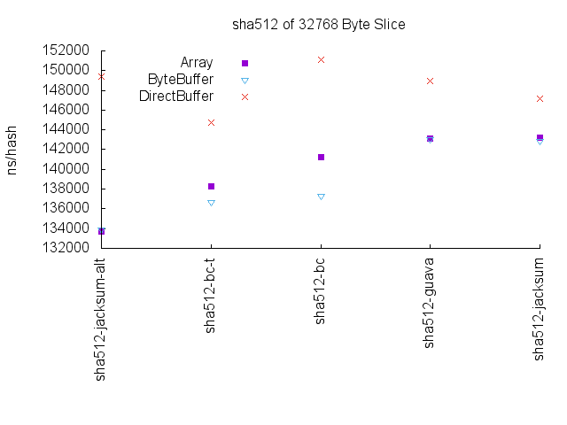

| Algorithm |  Array | ByteBuffer | DirectBuffer |
| --- | ---: | ---: | ---: | 
| [sha512-jacksum-alt](#sha512-jacksum-alt-latency) | 133729.699902 | 133863.809379 | 149381.431661 |
| [sha512-bc-t](#sha512-bc-t-latency) | 138288.845316 | 136701.839953 | 144768.496757 |
| [sha512-bc](#sha512-bc-latency) | 141215.717594 | 137252.128129 | 151103.985360 |
| [sha512-guava](#sha512-guava-latency) | 143129.492201 | 143007.143830 | 148990.465837 |
| [sha512-jacksum](#sha512-jacksum-latency) | 143182.348013 | 142826.486617 | 147147.066669 |

---
### 32768 Byte Slice Latency (sip)
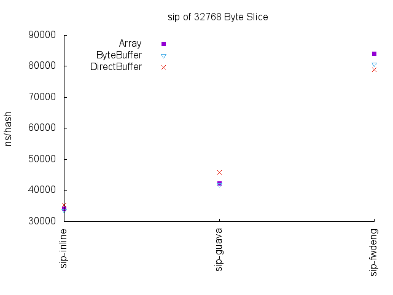

| Algorithm |  Array | ByteBuffer | DirectBuffer |
| --- | ---: | ---: | ---: | 
| [sip-inline](#sip-inline-latency) | 34198.450426 | 33578.830808 | 35353.983656 |
| [sip-guava](#sip-guava-latency) | 42188.950548 | 41802.339638 | 45818.317348 |
| [sip-fwdeng](#sip-fwdeng-latency) | 84010.667517 | 80620.682774 | 78917.654072 |

---
### 32768 Byte Slice Latency (skein1024)
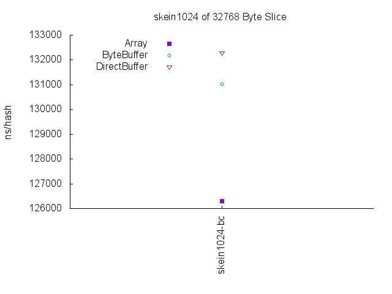

| Algorithm |  Array | ByteBuffer | DirectBuffer |
| --- | ---: | ---: | ---: | 
| [skein1024-bc](#skein1024-bc-latency) | 126304.224150 | 131026.841858 | 132274.096287 |

---
### 32768 Byte Slice Latency (skein256)
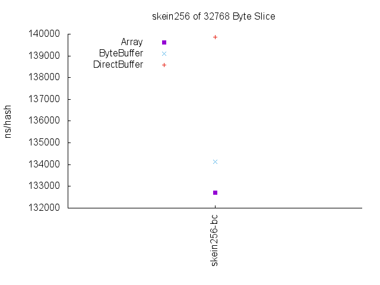

| Algorithm |  Array | ByteBuffer | DirectBuffer |
| --- | ---: | ---: | ---: | 
| [skein256-bc](#skein256-bc-latency) | 132722.232662 | 134123.787110 | 139853.339197 |

---
### 32768 Byte Slice Latency (skein512)

| Algorithm |  Array | ByteBuffer | DirectBuffer |
| --- | ---: | ---: | ---: | 
| [skein512-bc](#skein512-bc-latency) | 117603.323425 | 120685.782968 | 124407.250407 |

---
### 32768 Byte Slice Latency (sm3)
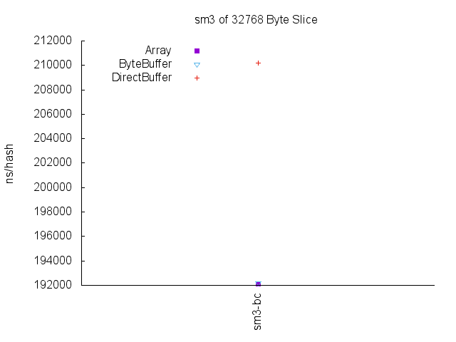

| Algorithm |  Array | ByteBuffer | DirectBuffer |
| --- | ---: | ---: | ---: | 
| [sm3-bc](#sm3-bc-latency) | 192101.696050 | 192179.335493 | 210179.201734 |

---
### 32768 Byte Slice Latency (sum16)
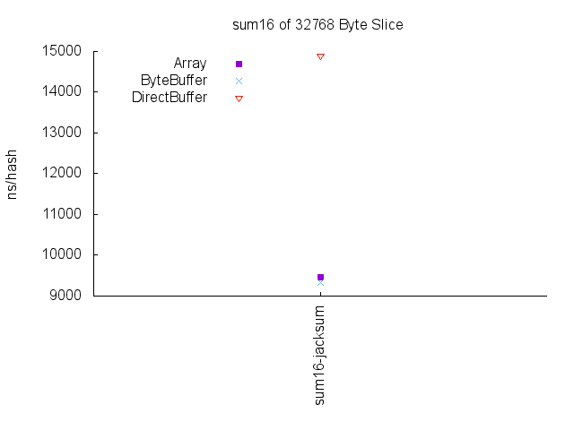

| Algorithm |  Array | ByteBuffer | DirectBuffer |
| --- | ---: | ---: | ---: | 
| [sum16-jacksum](#sum16-jacksum-latency) | 9463.474828 | 9329.811049 | 14900.720162 |

---
### 32768 Byte Slice Latency (sum24)
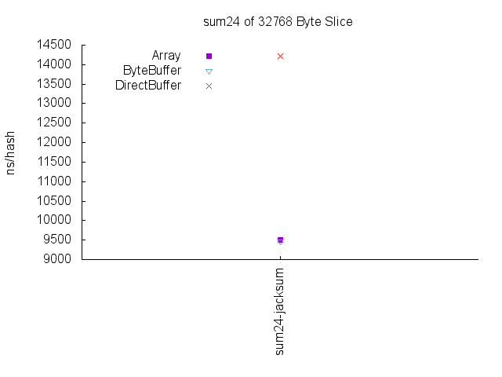

| Algorithm |  Array | ByteBuffer | DirectBuffer |
| --- | ---: | ---: | ---: | 
| [sum24-jacksum](#sum24-jacksum-latency) | 9494.107872 | 9473.357813 | 14217.579242 |

---
### 32768 Byte Slice Latency (sum32)
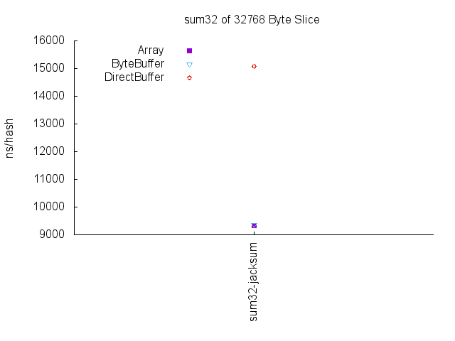

| Algorithm |  Array | ByteBuffer | DirectBuffer |
| --- | ---: | ---: | ---: | 
| [sum32-jacksum](#sum32-jacksum-latency) | 9333.718978 | 9351.464831 | 15079.616097 |

---
### 32768 Byte Slice Latency (sum8)
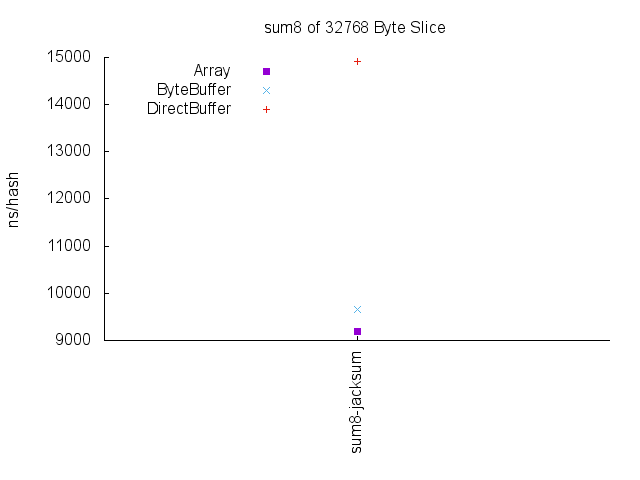

| Algorithm |  Array | ByteBuffer | DirectBuffer |
| --- | ---: | ---: | ---: | 
| [sum8-jacksum](#sum8-jacksum-latency) | 9187.324515 | 9663.692850 | 14910.656719 |

---
### 32768 Byte Slice Latency (sumbsd)
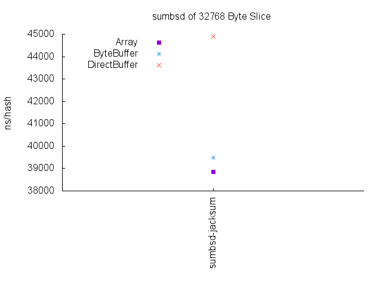

| Algorithm |  Array | ByteBuffer | DirectBuffer |
| --- | ---: | ---: | ---: | 
| [sumbsd-jacksum](#sumbsd-jacksum-latency) | 38852.912122 | 39483.384838 | 44901.591329 |

---
### 32768 Byte Slice Latency (sumsysv)
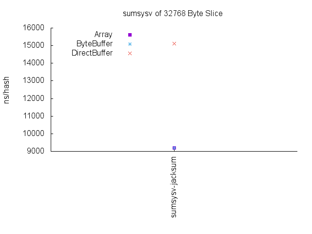

| Algorithm |  Array | ByteBuffer | DirectBuffer |
| --- | ---: | ---: | ---: | 
| [sumsysv-jacksum](#sumsysv-jacksum-latency) | 9182.774237 | 9189.248653 | 15105.468563 |

---
### 32768 Byte Slice Latency (tiger)
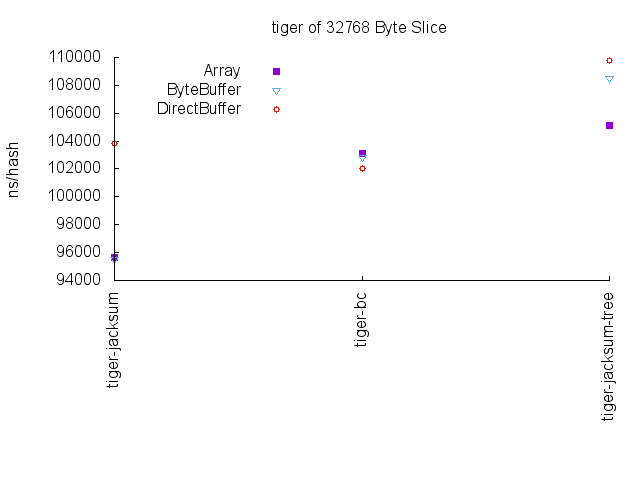

| Algorithm |  Array | ByteBuffer | DirectBuffer |
| --- | ---: | ---: | ---: | 
| [tiger-jacksum](#tiger-jacksum-latency) | 95684.335302 | 95532.190392 | 103794.481980 |
| [tiger-bc](#tiger-bc-latency) | 103107.642516 | 102846.722228 | 102043.971045 |
| [tiger-jacksum-tree](#tiger-jacksum-tree-latency) | 105088.500051 | 108506.220194 | 109806.446695 |

---
### 32768 Byte Slice Latency (tiger128)
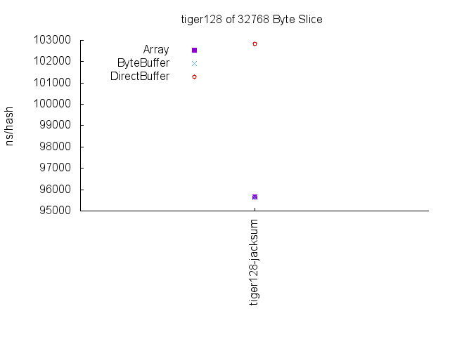

| Algorithm |  Array | ByteBuffer | DirectBuffer |
| --- | ---: | ---: | ---: | 
| [tiger128-jacksum](#tiger128-jacksum-latency) | 95666.425289 | 95614.171330 | 102823.385964 |

---
### 32768 Byte Slice Latency (tiger160)
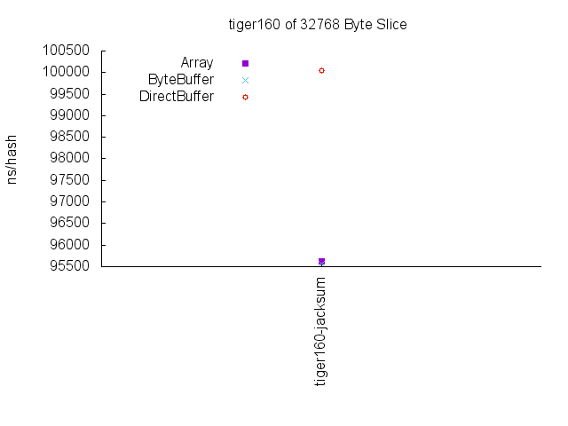

| Algorithm |  Array | ByteBuffer | DirectBuffer |
| --- | ---: | ---: | ---: | 
| [tiger160-jacksum](#tiger160-jacksum-latency) | 95617.937295 | 95564.627500 | 100052.753360 |

---
### 32768 Byte Slice Latency (tiger2)
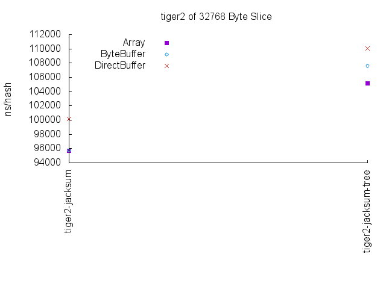

| Algorithm |  Array | ByteBuffer | DirectBuffer |
| --- | ---: | ---: | ---: | 
| [tiger2-jacksum](#tiger2-jacksum-latency) | 95668.661513 | 95798.228836 | 100152.450313 |
| [tiger2-jacksum-tree](#tiger2-jacksum-tree-latency) | 105121.630621 | 107646.497091 | 110090.465129 |

---
### 32768 Byte Slice Latency (whirlpool0)

| Algorithm |  Array | ByteBuffer | DirectBuffer |
| --- | ---: | ---: | ---: | 
| [whirlpool0-jacksum](#whirlpool0-jacksum-latency) | 481709.199570 | 486994.240514 | 506872.761146 |

---
### 32768 Byte Slice Latency (whirlpool1)
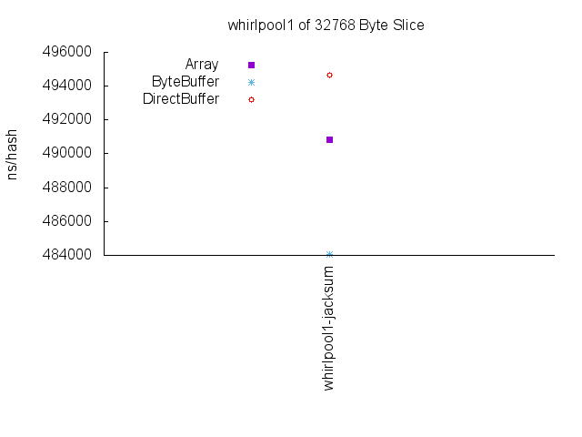

| Algorithm |  Array | ByteBuffer | DirectBuffer |
| --- | ---: | ---: | ---: | 
| [whirlpool1-jacksum](#whirlpool1-jacksum-latency) | 490858.549844 | 484039.286400 | 494651.475889 |

---
### 32768 Byte Slice Latency (whirlpool2)
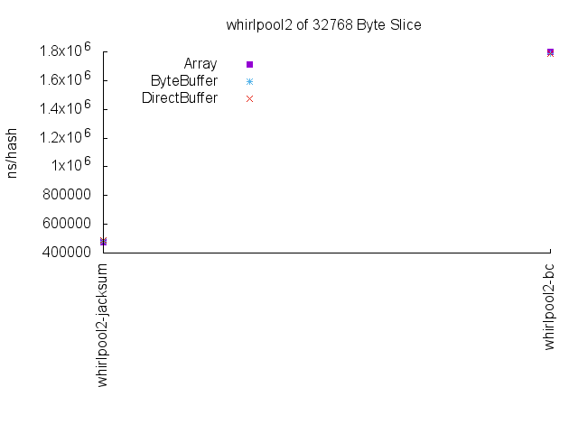

| Algorithm |  Array | ByteBuffer | DirectBuffer |
| --- | ---: | ---: | ---: | 
| [whirlpool2-jacksum](#whirlpool2-jacksum-latency) | 477592.864972 | 483595.473541 | 484870.495298 |
| [whirlpool2-bc](#whirlpool2-bc-latency) | 1798698.956657 | 1789855.819303 | 1784590.637372 |

---
### 32768 Byte Slice Latency (xor8)

| Algorithm |  Array | ByteBuffer | DirectBuffer |
| --- | ---: | ---: | ---: | 
| [xor8-jacksum](#xor8-jacksum-latency) | 9473.445055 | 9667.806536 | 14019.089357 |

---
### 32768 Byte Slice Latency (xxh32)
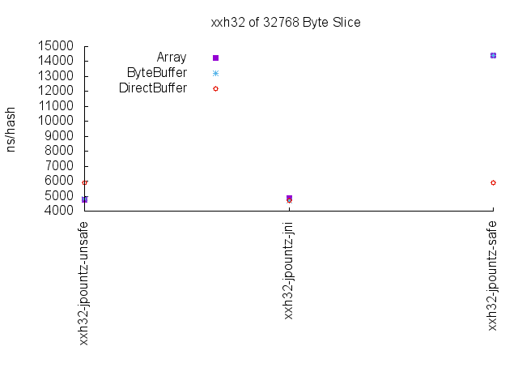

| Algorithm |  Array | ByteBuffer | DirectBuffer |
| --- | ---: | ---: | ---: | 
| [xxh32-jpountz-unsafe](#xxh32-jpountz-unsafe-latency) | 4735.699412 | 4818.762454 | 5902.653310 |
| [xxh32-jpountz-jni](#xxh32-jpountz-jni-latency) | 4870.438799 | 4711.205722 | 4719.866076 |
| [xxh32-jpountz-safe](#xxh32-jpountz-safe-latency) | 14399.953027 | 14379.987870 | 5889.886494 |

---
### 32768 Byte Slice Latency (xxh64)
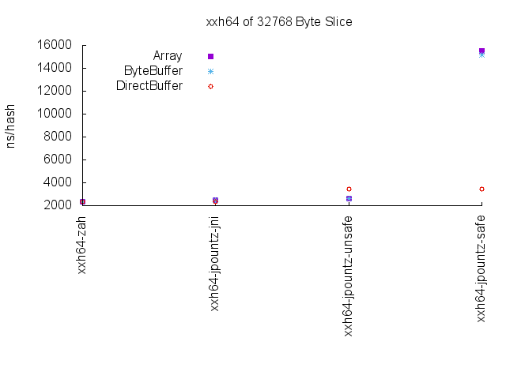

| Algorithm |  Array | ByteBuffer | DirectBuffer |
| --- | ---: | ---: | ---: | 
| [xxh64-zah](#xxh64-zah-latency) | 2373.834155 | 2377.447948 | 2377.269100 |
| [xxh64-jpountz-jni](#xxh64-jpountz-jni-latency) | 2448.492317 | 2489.544794 | 2366.758745 |
| [xxh64-jpountz-unsafe](#xxh64-jpountz-unsafe-latency) | 2648.048794 | 2613.473119 | 3454.870889 |
| [xxh64-jpountz-safe](#xxh64-jpountz-safe-latency) | 15532.795526 | 15167.819387 | 3458.865876 |

---
### adler32-guava Latency
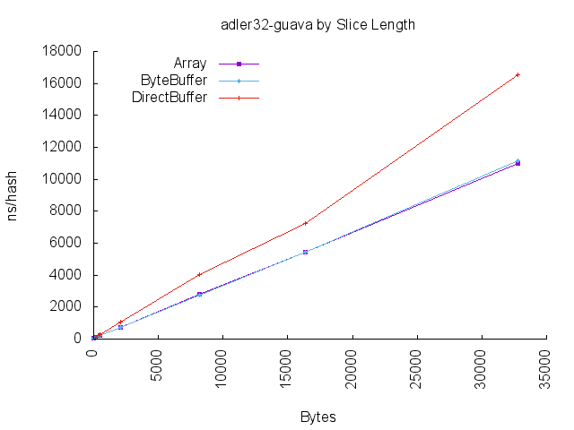

| Length |  Array | ByteBuffer | DirectBuffer |
| --- | ---: | ---: | ---: | 
| [32](#32-byte-slice-latency-all-hashes) | 65.271027 | 72.768945 | 87.154499 |
| [128](#128-byte-slice-latency-all-hashes) | 98.978163 | 98.857358 | 128.619156 |
| [512](#512-byte-slice-latency-all-hashes) | 214.978245 | 217.215930 | 297.879454 |
| [2048](#2048-byte-slice-latency-all-hashes) | 721.447819 | 709.319126 | 1077.842026 |
| [8192](#8192-byte-slice-latency-all-hashes) | 2809.863515 | 2764.640709 | 4025.740884 |
| [16384](#16384-byte-slice-latency-all-hashes) | 5458.691916 | 5462.046057 | 7235.458247 |
| [32768](#32768-byte-slice-latency-all-hashes) | 10973.319406 | 11157.947783 | 16540.876272 |

---
### adler32-jacksum-alt Latency
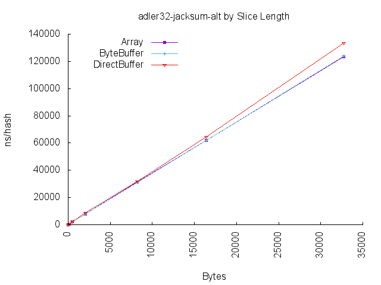

| Length |  Array | ByteBuffer | DirectBuffer |
| --- | ---: | ---: | ---: | 
| [32](#32-byte-slice-latency-all-hashes) | 124.236798 | 124.835395 | 153.169458 |
| [128](#128-byte-slice-latency-all-hashes) | 487.585618 | 490.221938 | 544.286553 |
| [512](#512-byte-slice-latency-all-hashes) | 1967.019523 | 2009.065506 | 2068.387238 |
| [2048](#2048-byte-slice-latency-all-hashes) | 7847.222313 | 8026.303792 | 8601.866320 |
| [8192](#8192-byte-slice-latency-all-hashes) | 31411.840545 | 31008.591644 | 32036.479502 |
| [16384](#16384-byte-slice-latency-all-hashes) | 61749.770897 | 61997.491348 | 64612.843575 |
| [32768](#32768-byte-slice-latency-all-hashes) | 123462.183642 | 123806.629125 | 133330.385863 |

---
### adler32-jacksum-delegating Latency
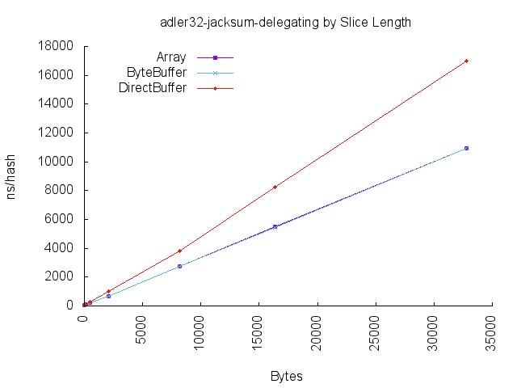

| Length |  Array | ByteBuffer | DirectBuffer |
| --- | ---: | ---: | ---: | 
| [32](#32-byte-slice-latency-all-hashes) | 59.824989 | 56.014738 | 80.450291 |
| [128](#128-byte-slice-latency-all-hashes) | 87.325256 | 85.717392 | 119.325975 |
| [512](#512-byte-slice-latency-all-hashes) | 221.105609 | 209.200820 | 278.218997 |
| [2048](#2048-byte-slice-latency-all-hashes) | 697.548854 | 698.760890 | 1018.304514 |
| [8192](#8192-byte-slice-latency-all-hashes) | 2744.985822 | 2749.587673 | 3793.962084 |
| [16384](#16384-byte-slice-latency-all-hashes) | 5518.416607 | 5439.189236 | 8239.666622 |
| [32768](#32768-byte-slice-latency-all-hashes) | 10948.852878 | 10949.761161 | 17001.190973 |

---
### adler32-jre Latency
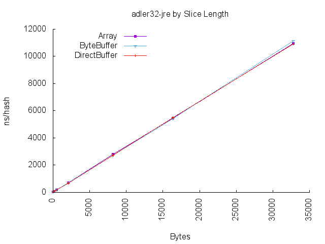

| Length |  Array | ByteBuffer | DirectBuffer |
| --- | ---: | ---: | ---: | 
| [32](#32-byte-slice-latency-all-hashes) | 52.745462 | 54.070963 | 31.751907 |
| [128](#128-byte-slice-latency-all-hashes) | 82.646949 | 82.950818 | 63.919041 |
| [512](#512-byte-slice-latency-all-hashes) | 205.148939 | 204.404292 | 184.631470 |
| [2048](#2048-byte-slice-latency-all-hashes) | 696.348290 | 697.232569 | 672.719813 |
| [8192](#8192-byte-slice-latency-all-hashes) | 2788.847869 | 2741.886234 | 2718.097215 |
| [16384](#16384-byte-slice-latency-all-hashes) | 5440.142258 | 5434.752111 | 5505.263296 |
| [32768](#32768-byte-slice-latency-all-hashes) | 10948.970317 | 11128.711257 | 10919.308868 |

---
### city64-zah Latency
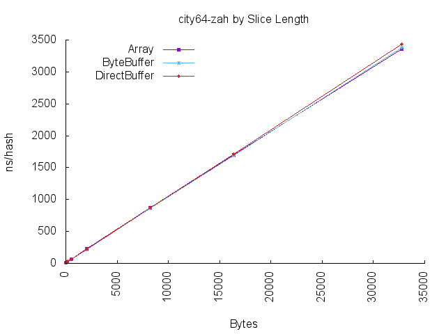

| Length |  Array | ByteBuffer | DirectBuffer |
| --- | ---: | ---: | ---: | 
| [32](#32-byte-slice-latency-all-hashes) | 9.371179 | 10.234099 | 10.632210 |
| [128](#128-byte-slice-latency-all-hashes) | 26.619406 | 27.955296 | 28.934982 |
| [512](#512-byte-slice-latency-all-hashes) | 68.402821 | 68.346159 | 69.185076 |
| [2048](#2048-byte-slice-latency-all-hashes) | 226.574536 | 220.390593 | 222.950013 |
| [8192](#8192-byte-slice-latency-all-hashes) | 870.105479 | 865.475914 | 870.501318 |
| [16384](#16384-byte-slice-latency-all-hashes) | 1695.833297 | 1691.485143 | 1710.329326 |
| [32768](#32768-byte-slice-latency-all-hashes) | 3359.655292 | 3378.359530 | 3437.227411 |

---
### cksum-jacksum Latency
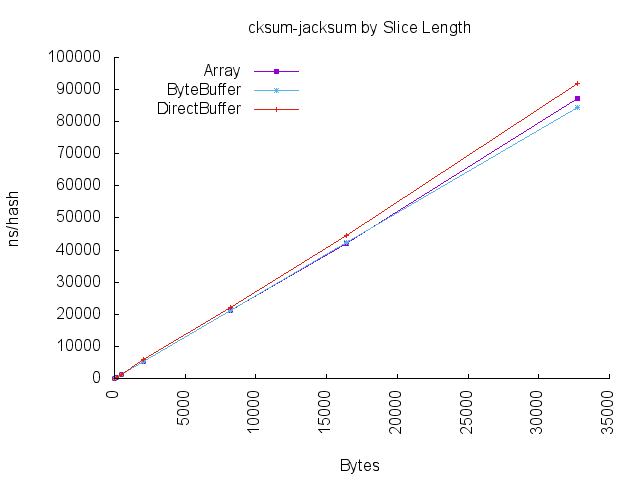

| Length |  Array | ByteBuffer | DirectBuffer |
| --- | ---: | ---: | ---: | 
| [32](#32-byte-slice-latency-all-hashes) | 82.749820 | 84.142845 | 109.351422 |
| [128](#128-byte-slice-latency-all-hashes) | 341.130797 | 331.657412 | 380.549628 |
| [512](#512-byte-slice-latency-all-hashes) | 1321.182867 | 1329.954247 | 1379.158844 |
| [2048](#2048-byte-slice-latency-all-hashes) | 5367.901037 | 5302.539657 | 5780.929134 |
| [8192](#8192-byte-slice-latency-all-hashes) | 21098.784421 | 21036.140208 | 22080.691325 |
| [16384](#16384-byte-slice-latency-all-hashes) | 42206.762193 | 42353.625402 | 44511.114347 |
| [32768](#32768-byte-slice-latency-all-hashes) | 87209.415463 | 84336.724066 | 91838.060682 |

---
### crc16-jacksum Latency
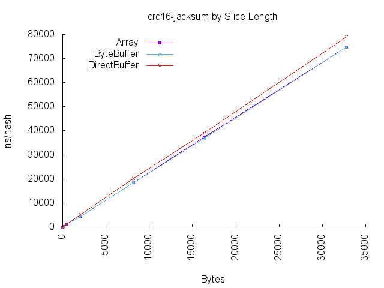

| Length |  Array | ByteBuffer | DirectBuffer |
| --- | ---: | ---: | ---: | 
| [32](#32-byte-slice-latency-all-hashes) | 72.828880 | 71.802730 | 95.284131 |
| [128](#128-byte-slice-latency-all-hashes) | 285.828622 | 286.603249 | 318.908805 |
| [512](#512-byte-slice-latency-all-hashes) | 1146.404300 | 1184.305477 | 1295.853479 |
| [2048](#2048-byte-slice-latency-all-hashes) | 4600.102095 | 4595.303511 | 5171.955134 |
| [8192](#8192-byte-slice-latency-all-hashes) | 18367.279052 | 18391.720419 | 20115.082137 |
| [16384](#16384-byte-slice-latency-all-hashes) | 37386.390841 | 36827.475531 | 39096.959208 |
| [32768](#32768-byte-slice-latency-all-hashes) | 74826.175345 | 74796.757676 | 78997.022489 |

---
### crc24-jacksum Latency
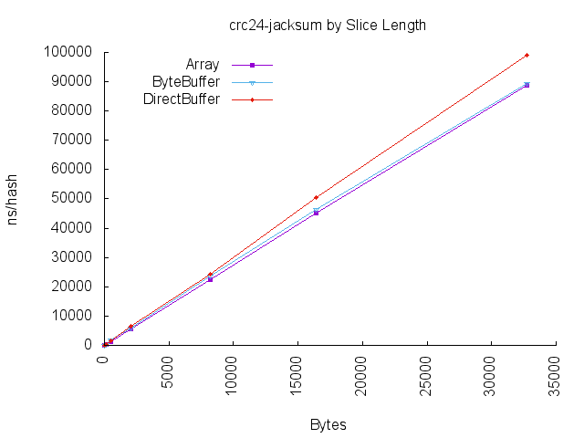

| Length |  Array | ByteBuffer | DirectBuffer |
| --- | ---: | ---: | ---: | 
| [32](#32-byte-slice-latency-all-hashes) | 87.976735 | 107.931053 | 113.492200 |
| [128](#128-byte-slice-latency-all-hashes) | 344.773533 | 427.934637 | 384.259544 |
| [512](#512-byte-slice-latency-all-hashes) | 1372.800296 | 1748.604730 | 1516.571513 |
| [2048](#2048-byte-slice-latency-all-hashes) | 5735.745849 | 5800.694083 | 6487.065463 |
| [8192](#8192-byte-slice-latency-all-hashes) | 22572.263451 | 23574.318455 | 24328.435880 |
| [16384](#16384-byte-slice-latency-all-hashes) | 45144.671452 | 46290.541683 | 50536.562626 |
| [32768](#32768-byte-slice-latency-all-hashes) | 88765.875792 | 89506.127873 | 98918.182301 |

---
### crc32-guava-delegating Latency
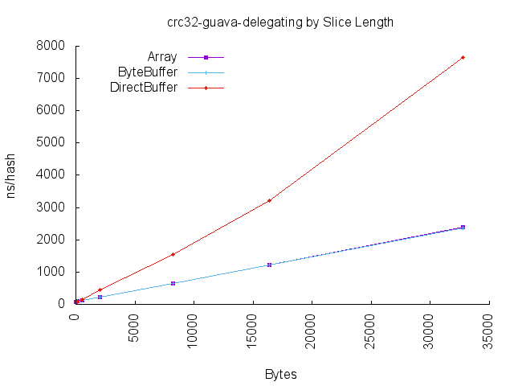

| Length |  Array | ByteBuffer | DirectBuffer |
| --- | ---: | ---: | ---: | 
| [32](#32-byte-slice-latency-all-hashes) | 78.293775 | 78.870315 | 70.379956 |
| [128](#128-byte-slice-latency-all-hashes) | 99.155217 | 102.378960 | 84.921260 |
| [512](#512-byte-slice-latency-all-hashes) | 112.646426 | 122.153289 | 147.162572 |
| [2048](#2048-byte-slice-latency-all-hashes) | 217.718031 | 221.913027 | 457.108426 |
| [8192](#8192-byte-slice-latency-all-hashes) | 649.448690 | 645.791351 | 1534.993018 |
| [16384](#16384-byte-slice-latency-all-hashes) | 1226.419348 | 1224.905661 | 3224.611240 |
| [32768](#32768-byte-slice-latency-all-hashes) | 2402.712989 | 2379.725237 | 7641.909578 |

---
### crc32-guava-rfc3720 Latency
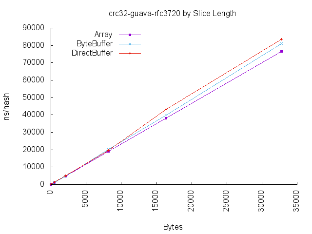

| Length |  Array | ByteBuffer | DirectBuffer |
| --- | ---: | ---: | ---: | 
| [32](#32-byte-slice-latency-all-hashes) | 83.558320 | 91.355592 | 97.569100 |
| [128](#128-byte-slice-latency-all-hashes) | 322.648643 | 307.894974 | 323.656114 |
| [512](#512-byte-slice-latency-all-hashes) | 1201.171189 | 1209.038571 | 1262.544158 |
| [2048](#2048-byte-slice-latency-all-hashes) | 4680.635004 | 4731.046770 | 5096.333853 |
| [8192](#8192-byte-slice-latency-all-hashes) | 19159.160631 | 20120.403489 | 19703.481810 |
| [16384](#16384-byte-slice-latency-all-hashes) | 38270.614133 | 39921.760482 | 43141.574016 |
| [32768](#32768-byte-slice-latency-all-hashes) | 76561.307125 | 81021.857929 | 83573.042964 |

---
### crc32-jacksum-bzip2 Latency
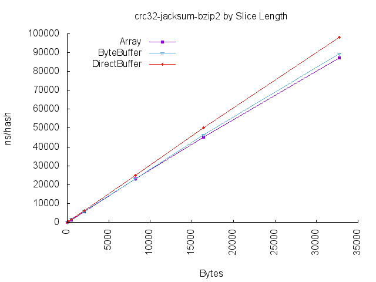

| Length |  Array | ByteBuffer | DirectBuffer |
| --- | ---: | ---: | ---: | 
| [32](#32-byte-slice-latency-all-hashes) | 87.927239 | 111.044385 | 111.471136 |
| [128](#128-byte-slice-latency-all-hashes) | 350.844270 | 427.703133 | 392.215793 |
| [512](#512-byte-slice-latency-all-hashes) | 1372.266267 | 1746.978575 | 1616.978911 |
| [2048](#2048-byte-slice-latency-all-hashes) | 5642.251492 | 5801.160385 | 6290.875131 |
| [8192](#8192-byte-slice-latency-all-hashes) | 22935.425550 | 23189.319844 | 24958.032272 |
| [16384](#16384-byte-slice-latency-all-hashes) | 45152.930226 | 46358.494538 | 50105.007084 |
| [32768](#32768-byte-slice-latency-all-hashes) | 87314.427698 | 89529.619608 | 98057.631946 |

---
### crc32-jacksum-delegating Latency
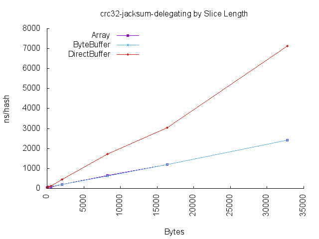

| Length |  Array | ByteBuffer | DirectBuffer |
| --- | ---: | ---: | ---: | 
| [32](#32-byte-slice-latency-all-hashes) | 54.268202 | 54.989588 | 57.128745 |
| [128](#128-byte-slice-latency-all-hashes) | 75.015942 | 75.222874 | 74.413717 |
| [512](#512-byte-slice-latency-all-hashes) | 75.067748 | 99.543410 | 116.679110 |
| [2048](#2048-byte-slice-latency-all-hashes) | 206.439796 | 203.216601 | 445.283629 |
| [8192](#8192-byte-slice-latency-all-hashes) | 651.459114 | 633.685152 | 1712.369109 |
| [16384](#16384-byte-slice-latency-all-hashes) | 1207.917226 | 1205.961596 | 3028.317120 |
| [32768](#32768-byte-slice-latency-all-hashes) | 2408.755915 | 2412.241128 | 7120.222218 |

---
### crc32-jacksum-fcs32 Latency
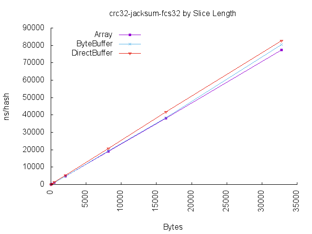

| Length |  Array | ByteBuffer | DirectBuffer |
| --- | ---: | ---: | ---: | 
| [32](#32-byte-slice-latency-all-hashes) | 75.384300 | 75.097666 | 99.196735 |
| [128](#128-byte-slice-latency-all-hashes) | 297.944154 | 296.789276 | 329.328344 |
| [512](#512-byte-slice-latency-all-hashes) | 1211.294164 | 1214.143880 | 1301.537172 |
| [2048](#2048-byte-slice-latency-all-hashes) | 4782.645178 | 4840.327642 | 5447.994639 |
| [8192](#8192-byte-slice-latency-all-hashes) | 18999.473328 | 19367.191782 | 20854.945874 |
| [16384](#16384-byte-slice-latency-all-hashes) | 38041.086125 | 38489.575643 | 41790.334131 |
| [32768](#32768-byte-slice-latency-all-hashes) | 77426.671043 | 80503.018576 | 82731.606248 |

---
### crc32-jacksum-mpeg2 Latency
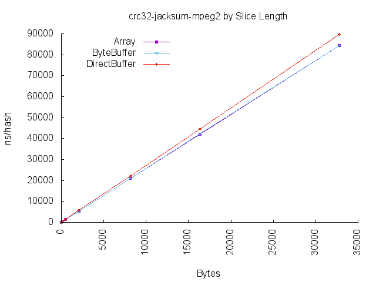

| Length |  Array | ByteBuffer | DirectBuffer |
| --- | ---: | ---: | ---: | 
| [32](#32-byte-slice-latency-all-hashes) | 84.403153 | 80.698946 | 106.412030 |
| [128](#128-byte-slice-latency-all-hashes) | 331.947432 | 330.070152 | 356.193972 |
| [512](#512-byte-slice-latency-all-hashes) | 1320.765174 | 1366.679073 | 1451.028680 |
| [2048](#2048-byte-slice-latency-all-hashes) | 5276.160804 | 5276.292644 | 5987.185068 |
| [8192](#8192-byte-slice-latency-all-hashes) | 21092.337968 | 21090.253626 | 22186.274584 |
| [16384](#16384-byte-slice-latency-all-hashes) | 42189.785503 | 42199.146385 | 44602.732500 |
| [32768](#32768-byte-slice-latency-all-hashes) | 84467.176101 | 84495.149427 | 89701.660785 |

---
### crc32-jre Latency
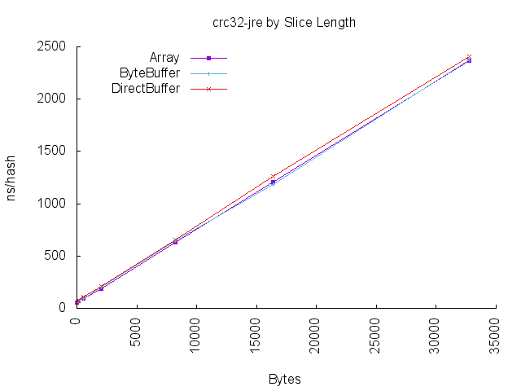

| Length |  Array | ByteBuffer | DirectBuffer |
| --- | ---: | ---: | ---: | 
| [32](#32-byte-slice-latency-all-hashes) | 52.470273 | 54.019944 | 53.100205 |
| [128](#128-byte-slice-latency-all-hashes) | 72.020860 | 72.789507 | 75.062219 |
| [512](#512-byte-slice-latency-all-hashes) | 93.943136 | 97.022289 | 106.078851 |
| [2048](#2048-byte-slice-latency-all-hashes) | 188.562803 | 202.169559 | 211.371477 |
| [8192](#8192-byte-slice-latency-all-hashes) | 630.561420 | 643.883467 | 650.965220 |
| [16384](#16384-byte-slice-latency-all-hashes) | 1204.282697 | 1182.261266 | 1263.696042 |
| [32768](#32768-byte-slice-latency-all-hashes) | 2367.824100 | 2374.039993 | 2408.335814 |

---
### crc64-jacksum Latency
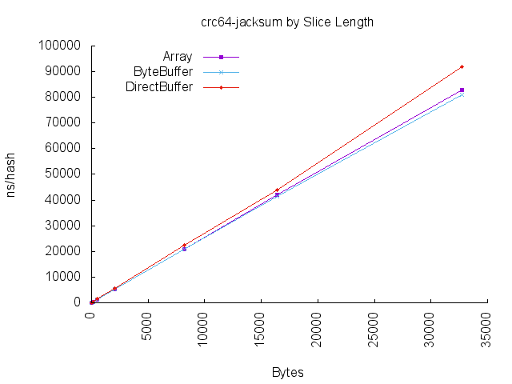

| Length |  Array | ByteBuffer | DirectBuffer |
| --- | ---: | ---: | ---: | 
| [32](#32-byte-slice-latency-all-hashes) | 77.056154 | 77.162800 | 106.517923 |
| [128](#128-byte-slice-latency-all-hashes) | 320.635398 | 319.328052 | 370.884159 |
| [512](#512-byte-slice-latency-all-hashes) | 1290.341730 | 1290.742717 | 1409.780113 |
| [2048](#2048-byte-slice-latency-all-hashes) | 5163.717698 | 5163.604593 | 5657.045530 |
| [8192](#8192-byte-slice-latency-all-hashes) | 20992.668859 | 21006.910741 | 22372.612720 |
| [16384](#16384-byte-slice-latency-all-hashes) | 41990.185362 | 41449.549014 | 43943.225083 |
| [32768](#32768-byte-slice-latency-all-hashes) | 82759.145361 | 81070.286205 | 91807.862744 |

---
### crc8-jacksum Latency
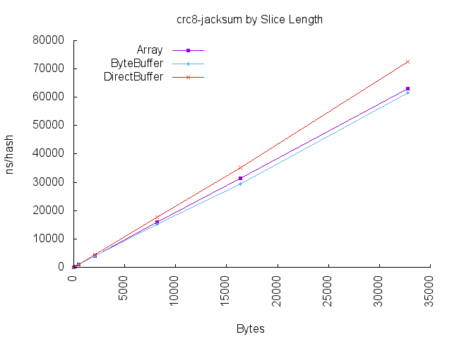

| Length |  Array | ByteBuffer | DirectBuffer |
| --- | ---: | ---: | ---: | 
| [32](#32-byte-slice-latency-all-hashes) | 46.511255 | 50.288317 | 84.570009 |
| [128](#128-byte-slice-latency-all-hashes) | 233.405813 | 230.764919 | 269.316431 |
| [512](#512-byte-slice-latency-all-hashes) | 981.606094 | 944.866863 | 1099.773342 |
| [2048](#2048-byte-slice-latency-all-hashes) | 3930.494915 | 3929.622768 | 4443.592252 |
| [8192](#8192-byte-slice-latency-all-hashes) | 15992.082810 | 15231.515276 | 17593.303078 |
| [16384](#16384-byte-slice-latency-all-hashes) | 31446.553103 | 29436.883150 | 35206.914704 |
| [32768](#32768-byte-slice-latency-all-hashes) | 62947.645612 | 61590.676745 | 72481.824802 |

---
### ed2k-jacksum Latency
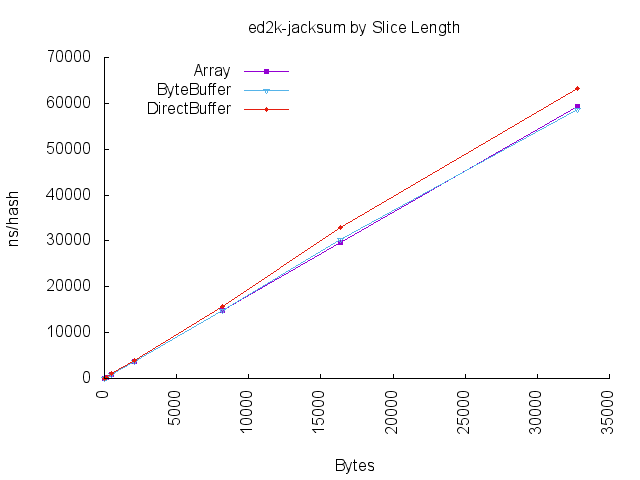

| Length |  Array | ByteBuffer | DirectBuffer |
| --- | ---: | ---: | ---: | 
| [32](#32-byte-slice-latency-all-hashes) | 31.244373 | 33.453851 | 54.266666 |
| [128](#128-byte-slice-latency-all-hashes) | 259.896077 | 271.591167 | 303.298390 |
| [512](#512-byte-slice-latency-all-hashes) | 964.715123 | 957.373184 | 1006.737553 |
| [2048](#2048-byte-slice-latency-all-hashes) | 3766.168842 | 3704.363513 | 4009.910734 |
| [8192](#8192-byte-slice-latency-all-hashes) | 14737.868282 | 14890.558388 | 15720.531813 |
| [16384](#16384-byte-slice-latency-all-hashes) | 29689.894095 | 30379.161583 | 32972.100506 |
| [32768](#32768-byte-slice-latency-all-hashes) | 59316.155529 | 58601.528859 | 63336.370058 |

---
### elf-jacksum Latency
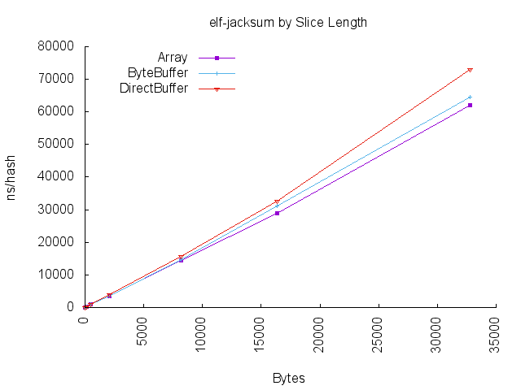

| Length |  Array | ByteBuffer | DirectBuffer |
| --- | ---: | ---: | ---: | 
| [32](#32-byte-slice-latency-all-hashes) | 54.633176 | 56.061971 | 81.824008 |
| [128](#128-byte-slice-latency-all-hashes) | 225.188420 | 224.690236 | 251.180670 |
| [512](#512-byte-slice-latency-all-hashes) | 881.303186 | 899.356532 | 961.062103 |
| [2048](#2048-byte-slice-latency-all-hashes) | 3543.414189 | 3602.052448 | 4028.999007 |
| [8192](#8192-byte-slice-latency-all-hashes) | 14434.419809 | 14684.868442 | 15712.552990 |
| [16384](#16384-byte-slice-latency-all-hashes) | 28819.470948 | 31034.948166 | 32633.325200 |
| [32768](#32768-byte-slice-latency-all-hashes) | 61944.268386 | 64451.699457 | 73001.678763 |

---
### farmna-zah Latency
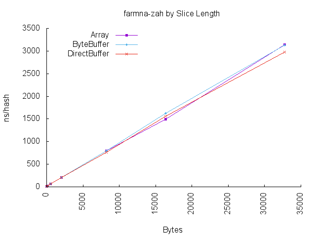

| Length |  Array | ByteBuffer | DirectBuffer |
| --- | ---: | ---: | ---: | 
| [32](#32-byte-slice-latency-all-hashes) | 9.472315 | 10.056119 | 10.854971 |
| [128](#128-byte-slice-latency-all-hashes) | 23.766087 | 24.451787 | 24.275295 |
| [512](#512-byte-slice-latency-all-hashes) | 60.867004 | 63.622633 | 60.551324 |
| [2048](#2048-byte-slice-latency-all-hashes) | 208.719047 | 209.671228 | 202.337150 |
| [8192](#8192-byte-slice-latency-all-hashes) | 796.924494 | 794.274770 | 761.545459 |
| [16384](#16384-byte-slice-latency-all-hashes) | 1497.219652 | 1628.135030 | 1560.919370 |
| [32768](#32768-byte-slice-latency-all-hashes) | 3137.660098 | 3130.823432 | 2977.565887 |

---
### farmuo-zah Latency
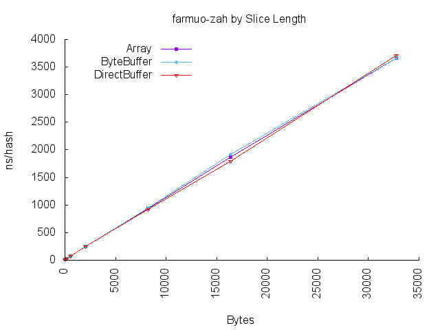

| Length |  Array | ByteBuffer | DirectBuffer |
| --- | ---: | ---: | ---: | 
| [32](#32-byte-slice-latency-all-hashes) | 9.771083 | 10.537306 | 15.040825 |
| [128](#128-byte-slice-latency-all-hashes) | 26.342973 | 26.665337 | 27.393298 |
| [512](#512-byte-slice-latency-all-hashes) | 69.770417 | 72.107689 | 70.237873 |
| [2048](#2048-byte-slice-latency-all-hashes) | 244.041325 | 245.787256 | 244.129301 |
| [8192](#8192-byte-slice-latency-all-hashes) | 939.779413 | 949.825592 | 925.750406 |
| [16384](#16384-byte-slice-latency-all-hashes) | 1873.316022 | 1924.789335 | 1789.969921 |
| [32768](#32768-byte-slice-latency-all-hashes) | 3665.871152 | 3658.280044 | 3714.596409 |

---
### fcs16-jacksum Latency
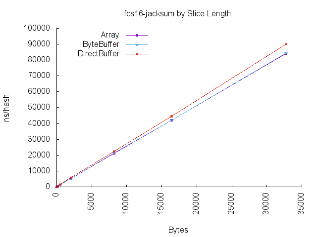

| Length |  Array | ByteBuffer | DirectBuffer |
| --- | ---: | ---: | ---: | 
| [32](#32-byte-slice-latency-all-hashes) | 82.164877 | 80.887029 | 109.613207 |
| [128](#128-byte-slice-latency-all-hashes) | 326.170299 | 326.591237 | 376.264152 |
| [512](#512-byte-slice-latency-all-hashes) | 1315.377454 | 1338.043163 | 1427.876643 |
| [2048](#2048-byte-slice-latency-all-hashes) | 5256.613253 | 5264.648045 | 5813.585179 |
| [8192](#8192-byte-slice-latency-all-hashes) | 21030.727957 | 21395.761131 | 22460.217989 |
| [16384](#16384-byte-slice-latency-all-hashes) | 42066.371871 | 42140.755243 | 44518.452932 |
| [32768](#32768-byte-slice-latency-all-hashes) | 84247.755133 | 84356.371864 | 90078.329563 |

---
### gfh32-guava Latency
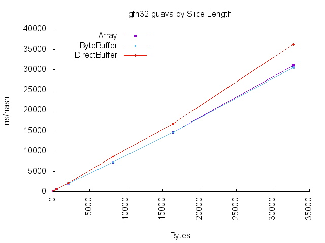

| Length |  Array | ByteBuffer | DirectBuffer |
| --- | ---: | ---: | ---: | 
| [32](#32-byte-slice-latency-all-hashes) | 65.787489 | 84.007148 | 101.911792 |
| [128](#128-byte-slice-latency-all-hashes) | 170.875590 | 152.442230 | 200.115675 |
| [512](#512-byte-slice-latency-all-hashes) | 570.628088 | 562.417285 | 612.120125 |
| [2048](#2048-byte-slice-latency-all-hashes) | 1962.750225 | 2027.869104 | 2103.684847 |
| [8192](#8192-byte-slice-latency-all-hashes) | 7234.125185 | 7208.889249 | 8572.867843 |
| [16384](#16384-byte-slice-latency-all-hashes) | 14570.126238 | 14589.357894 | 16757.811413 |
| [32768](#32768-byte-slice-latency-all-hashes) | 31055.903081 | 30541.167374 | 36221.902568 |

---
### gfh64-guava Latency
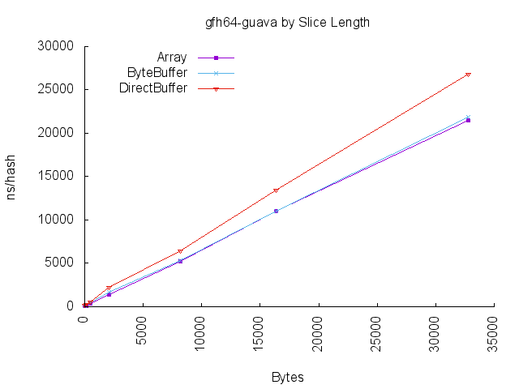

| Length |  Array | ByteBuffer | DirectBuffer |
| --- | ---: | ---: | ---: | 
| [32](#32-byte-slice-latency-all-hashes) | 76.023507 | 136.618197 | 164.480531 |
| [128](#128-byte-slice-latency-all-hashes) | 128.080128 | 207.309956 | 240.848265 |
| [512](#512-byte-slice-latency-all-hashes) | 372.539307 | 449.730059 | 522.796433 |
| [2048](#2048-byte-slice-latency-all-hashes) | 1373.775977 | 1669.349690 | 2206.587240 |
| [8192](#8192-byte-slice-latency-all-hashes) | 5262.648075 | 5283.245478 | 6452.966461 |
| [16384](#16384-byte-slice-latency-all-hashes) | 11054.973319 | 11062.189364 | 13411.669645 |
| [32768](#32768-byte-slice-latency-all-hashes) | 21540.586013 | 21893.045800 | 26839.197042 |

---
### gost-bc Latency
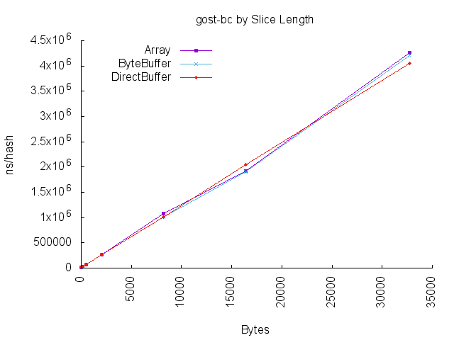

| Length |  Array | ByteBuffer | DirectBuffer |
| --- | ---: | ---: | ---: | 
| [32](#32-byte-slice-latency-all-hashes) | 12417.277712 | 11784.088193 | 11471.223840 |
| [128](#128-byte-slice-latency-all-hashes) | 23406.598338 | 22244.222455 | 22788.043036 |
| [512](#512-byte-slice-latency-all-hashes) | 71319.207921 | 70372.810431 | 71175.135321 |
| [2048](#2048-byte-slice-latency-all-hashes) | 262319.827666 | 266640.222714 | 269259.918521 |
| [8192](#8192-byte-slice-latency-all-hashes) | 1075966.811909 | 1005802.278530 | 1011139.821560 |
| [16384](#16384-byte-slice-latency-all-hashes) | 1927451.472465 | 1900320.439612 | 2041883.478587 |
| [32768](#32768-byte-slice-latency-all-hashes) | 4267149.483874 | 4206866.374907 | 4049852.802712 |

---
### gost-jacksum Latency

| Length |  Array | ByteBuffer | DirectBuffer |
| --- | ---: | ---: | ---: | 
| [32](#32-byte-slice-latency-all-hashes) | 3578.986483 | 3866.976854 | 3681.000480 |
| [128](#128-byte-slice-latency-all-hashes) | 15146.809504 | 14110.913035 | 15216.291229 |
| [512](#512-byte-slice-latency-all-hashes) | 55596.653765 | 55491.380685 | 63427.091369 |
| [2048](#2048-byte-slice-latency-all-hashes) | 248372.078863 | 241167.974473 | 249003.991022 |
| [8192](#8192-byte-slice-latency-all-hashes) | 889656.879256 | 988203.475030 | 979807.050747 |
| [16384](#16384-byte-slice-latency-all-hashes) | 1975078.598033 | 1930125.573236 | 1948766.055005 |
| [32768](#32768-byte-slice-latency-all-hashes) | 3838182.895891 | 3798601.250059 | 4082534.895294 |

---
### has160-jacksum Latency
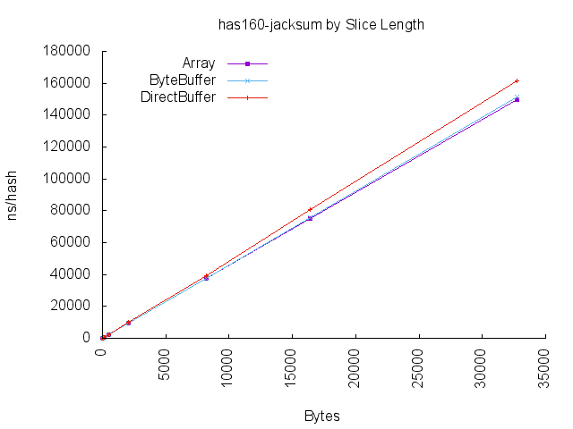

| Length |  Array | ByteBuffer | DirectBuffer |
| --- | ---: | ---: | ---: | 
| [32](#32-byte-slice-latency-all-hashes) | 27.369301 | 16.230991 | 49.013781 |
| [128](#128-byte-slice-latency-all-hashes) | 623.247829 | 623.470353 | 665.436972 |
| [512](#512-byte-slice-latency-all-hashes) | 2386.303497 | 2346.041361 | 2517.890998 |
| [2048](#2048-byte-slice-latency-all-hashes) | 9567.370176 | 9600.140400 | 9890.023218 |
| [8192](#8192-byte-slice-latency-all-hashes) | 37617.311632 | 37636.306443 | 39183.361435 |
| [16384](#16384-byte-slice-latency-all-hashes) | 74942.327088 | 75552.198222 | 80688.942490 |
| [32768](#32768-byte-slice-latency-all-hashes) | 149767.793709 | 151181.929181 | 161530.387076 |

---
### haval128h3-jacksum Latency
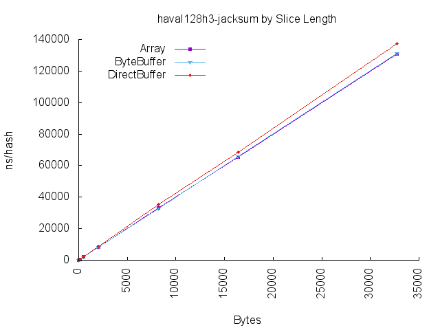

| Length |  Array | ByteBuffer | DirectBuffer |
| --- | ---: | ---: | ---: | 
| [32](#32-byte-slice-latency-all-hashes) | 27.398438 | 18.174107 | 50.597162 |
| [128](#128-byte-slice-latency-all-hashes) | 548.019678 | 546.133877 | 574.890685 |
| [512](#512-byte-slice-latency-all-hashes) | 2082.365879 | 2071.143273 | 2179.012040 |
| [2048](#2048-byte-slice-latency-all-hashes) | 8221.653925 | 8217.883637 | 8741.564333 |
| [8192](#8192-byte-slice-latency-all-hashes) | 33353.881656 | 32805.293952 | 35208.110316 |
| [16384](#16384-byte-slice-latency-all-hashes) | 65467.550592 | 65716.581911 | 68568.486972 |
| [32768](#32768-byte-slice-latency-all-hashes) | 131054.781873 | 131178.678826 | 137215.251129 |

---
### haval128h4-jacksum Latency
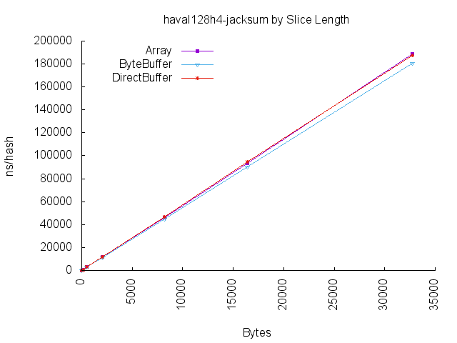

| Length |  Array | ByteBuffer | DirectBuffer |
| --- | ---: | ---: | ---: | 
| [32](#32-byte-slice-latency-all-hashes) | 27.312002 | 19.649075 | 50.483868 |
| [128](#128-byte-slice-latency-all-hashes) | 730.967767 | 723.130395 | 787.276173 |
| [512](#512-byte-slice-latency-all-hashes) | 2853.047014 | 2842.475111 | 2952.678429 |
| [2048](#2048-byte-slice-latency-all-hashes) | 11685.302421 | 11274.811770 | 11698.657205 |
| [8192](#8192-byte-slice-latency-all-hashes) | 45833.141497 | 45014.344550 | 46739.307270 |
| [16384](#16384-byte-slice-latency-all-hashes) | 93215.759619 | 90082.647137 | 94945.030444 |
| [32768](#32768-byte-slice-latency-all-hashes) | 188606.433910 | 180406.628955 | 187385.145508 |

---
### haval128h5-jacksum Latency
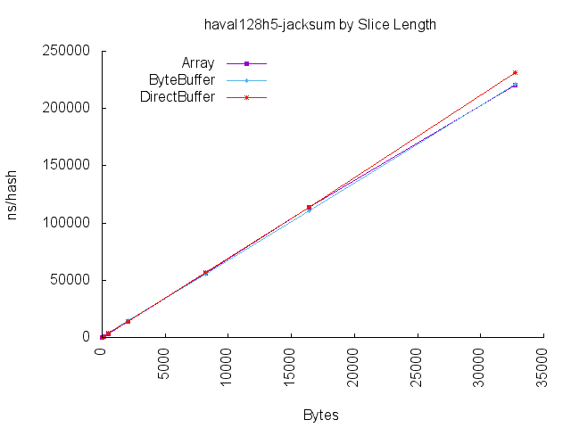

| Length |  Array | ByteBuffer | DirectBuffer |
| --- | ---: | ---: | ---: | 
| [32](#32-byte-slice-latency-all-hashes) | 27.722538 | 17.559816 | 51.542383 |
| [128](#128-byte-slice-latency-all-hashes) | 889.228334 | 879.538559 | 925.637091 |
| [512](#512-byte-slice-latency-all-hashes) | 3484.895473 | 3565.466573 | 3633.920006 |
| [2048](#2048-byte-slice-latency-all-hashes) | 13803.313948 | 14729.142346 | 14304.261491 |
| [8192](#8192-byte-slice-latency-all-hashes) | 56117.986844 | 55142.231825 | 56754.106237 |
| [16384](#16384-byte-slice-latency-all-hashes) | 114032.963030 | 110242.724876 | 113728.071637 |
| [32768](#32768-byte-slice-latency-all-hashes) | 220678.715688 | 220835.425475 | 231284.279197 |

---
### haval160h3-jacksum Latency
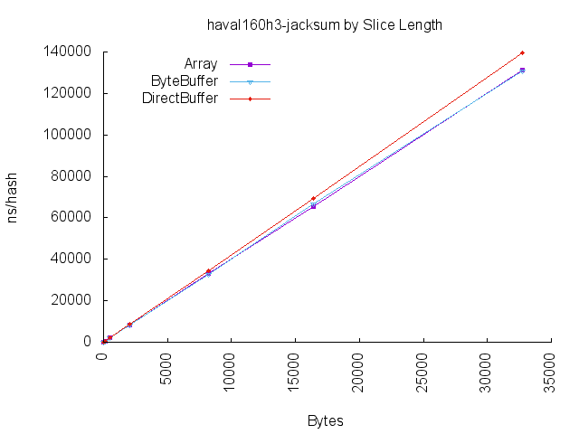

| Length |  Array | ByteBuffer | DirectBuffer |
| --- | ---: | ---: | ---: | 
| [32](#32-byte-slice-latency-all-hashes) | 27.445889 | 17.326930 | 49.457588 |
| [128](#128-byte-slice-latency-all-hashes) | 539.888978 | 531.567061 | 593.417325 |
| [512](#512-byte-slice-latency-all-hashes) | 2080.797159 | 2074.582796 | 2245.328346 |
| [2048](#2048-byte-slice-latency-all-hashes) | 8359.029059 | 8230.391740 | 8669.023781 |
| [8192](#8192-byte-slice-latency-all-hashes) | 33317.175275 | 32793.753283 | 34361.357137 |
| [16384](#16384-byte-slice-latency-all-hashes) | 65554.195251 | 66776.356276 | 69403.276466 |
| [32768](#32768-byte-slice-latency-all-hashes) | 131117.820529 | 131005.231051 | 139584.774636 |

---
### haval160h4-jacksum Latency
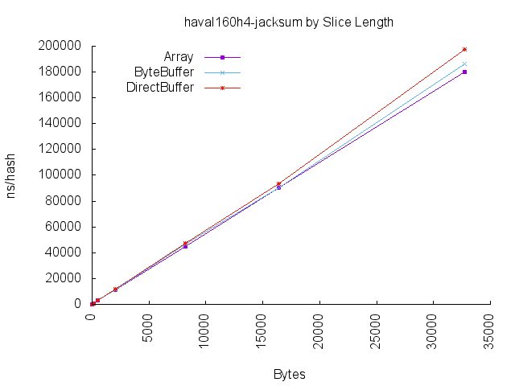

| Length |  Array | ByteBuffer | DirectBuffer |
| --- | ---: | ---: | ---: | 
| [32](#32-byte-slice-latency-all-hashes) | 27.809624 | 17.097564 | 47.818904 |
| [128](#128-byte-slice-latency-all-hashes) | 743.891854 | 739.304135 | 774.577016 |
| [512](#512-byte-slice-latency-all-hashes) | 2854.944542 | 2888.416138 | 2968.585491 |
| [2048](#2048-byte-slice-latency-all-hashes) | 11473.572482 | 11458.672890 | 11756.444860 |
| [8192](#8192-byte-slice-latency-all-hashes) | 45117.399427 | 46602.795677 | 47275.778164 |
| [16384](#16384-byte-slice-latency-all-hashes) | 90145.701071 | 90036.751414 | 93300.822099 |
| [32768](#32768-byte-slice-latency-all-hashes) | 180307.827327 | 186010.073996 | 197616.769318 |

---
### haval160h5-jacksum Latency
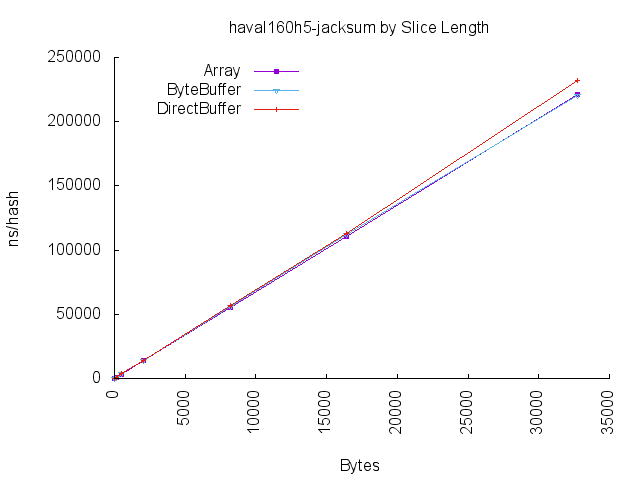

| Length |  Array | ByteBuffer | DirectBuffer |
| --- | ---: | ---: | ---: | 
| [32](#32-byte-slice-latency-all-hashes) | 26.969525 | 17.319205 | 47.559905 |
| [128](#128-byte-slice-latency-all-hashes) | 899.507063 | 879.043905 | 938.960873 |
| [512](#512-byte-slice-latency-all-hashes) | 3479.871937 | 3529.890485 | 3594.552166 |
| [2048](#2048-byte-slice-latency-all-hashes) | 14060.493955 | 13807.854230 | 14372.652048 |
| [8192](#8192-byte-slice-latency-all-hashes) | 55238.288489 | 56186.585391 | 56858.401148 |
| [16384](#16384-byte-slice-latency-all-hashes) | 110353.573192 | 112017.645621 | 113222.191258 |
| [32768](#32768-byte-slice-latency-all-hashes) | 220985.437938 | 220147.238723 | 231881.654243 |

---
### haval192h3-jacksum Latency
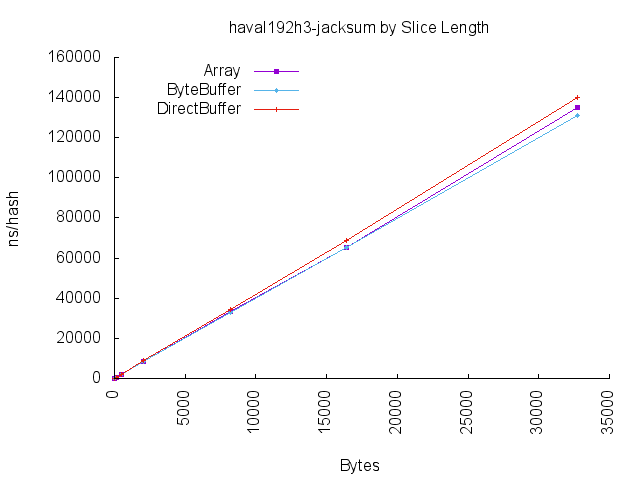

| Length |  Array | ByteBuffer | DirectBuffer |
| --- | ---: | ---: | ---: | 
| [32](#32-byte-slice-latency-all-hashes) | 28.151207 | 17.594317 | 49.877958 |
| [128](#128-byte-slice-latency-all-hashes) | 559.459032 | 547.264771 | 605.498977 |
| [512](#512-byte-slice-latency-all-hashes) | 2127.235342 | 2176.089595 | 2200.349693 |
| [2048](#2048-byte-slice-latency-all-hashes) | 8349.520617 | 8471.049996 | 8995.789350 |
| [8192](#8192-byte-slice-latency-all-hashes) | 33284.103360 | 32762.199941 | 34258.316954 |
| [16384](#16384-byte-slice-latency-all-hashes) | 65464.144240 | 65499.631382 | 68725.071761 |
| [32768](#32768-byte-slice-latency-all-hashes) | 135116.246834 | 130928.717374 | 140099.830406 |

---
### haval192h4-jacksum Latency
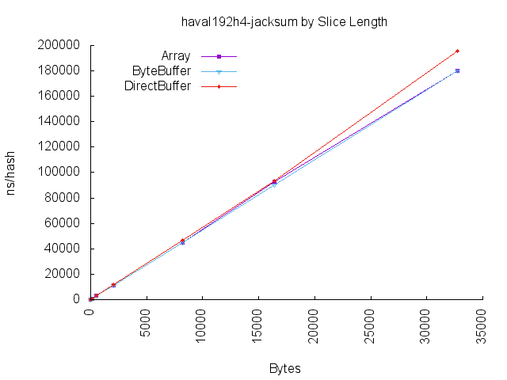

| Length |  Array | ByteBuffer | DirectBuffer |
| --- | ---: | ---: | ---: | 
| [32](#32-byte-slice-latency-all-hashes) | 28.575396 | 17.306791 | 48.564897 |
| [128](#128-byte-slice-latency-all-hashes) | 742.652132 | 723.152875 | 767.970933 |
| [512](#512-byte-slice-latency-all-hashes) | 2901.149250 | 2847.583678 | 2946.891417 |
| [2048](#2048-byte-slice-latency-all-hashes) | 11296.874720 | 11283.013727 | 11700.537667 |
| [8192](#8192-byte-slice-latency-all-hashes) | 45069.557121 | 45054.280113 | 46528.950484 |
| [16384](#16384-byte-slice-latency-all-hashes) | 93040.368989 | 90152.340257 | 93317.616715 |
| [32768](#32768-byte-slice-latency-all-hashes) | 180190.139439 | 180249.733752 | 195371.382296 |

---
### haval192h5-jacksum Latency

| Length |  Array | ByteBuffer | DirectBuffer |
| --- | ---: | ---: | ---: | 
| [32](#32-byte-slice-latency-all-hashes) | 27.824421 | 18.167217 | 51.855771 |
| [128](#128-byte-slice-latency-all-hashes) | 886.532733 | 877.447280 | 931.241540 |
| [512](#512-byte-slice-latency-all-hashes) | 3491.181189 | 3466.945890 | 3582.881844 |
| [2048](#2048-byte-slice-latency-all-hashes) | 13834.518576 | 13837.340236 | 14339.437286 |
| [8192](#8192-byte-slice-latency-all-hashes) | 55109.805545 | 55249.517711 | 56637.043396 |
| [16384](#16384-byte-slice-latency-all-hashes) | 112205.783413 | 112228.340249 | 117348.834455 |
| [32768](#32768-byte-slice-latency-all-hashes) | 223687.295661 | 225560.987478 | 233910.099383 |

---
### haval224h3-jacksum Latency
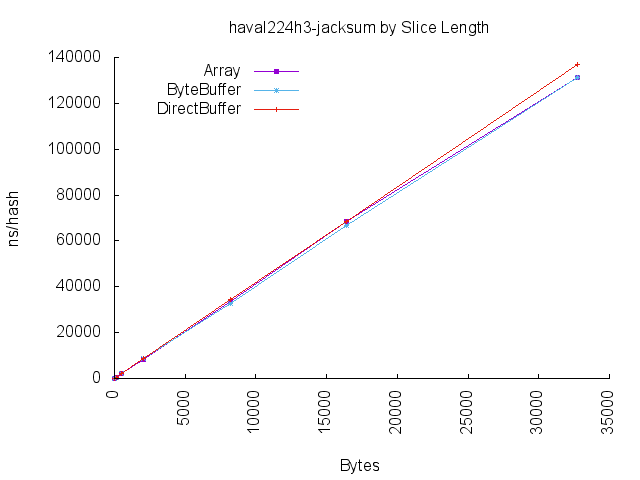

| Length |  Array | ByteBuffer | DirectBuffer |
| --- | ---: | ---: | ---: | 
| [32](#32-byte-slice-latency-all-hashes) | 27.691187 | 18.010980 | 47.458095 |
| [128](#128-byte-slice-latency-all-hashes) | 542.240581 | 532.075373 | 592.671486 |
| [512](#512-byte-slice-latency-all-hashes) | 2097.131689 | 2071.831073 | 2222.664531 |
| [2048](#2048-byte-slice-latency-all-hashes) | 8348.687271 | 8612.655930 | 8865.553621 |
| [8192](#8192-byte-slice-latency-all-hashes) | 33411.387081 | 32885.862579 | 34253.354242 |
| [16384](#16384-byte-slice-latency-all-hashes) | 68256.988804 | 66562.000541 | 68671.145880 |
| [32768](#32768-byte-slice-latency-all-hashes) | 131319.510848 | 131336.589749 | 136950.516293 |

---
### haval224h4-jacksum Latency
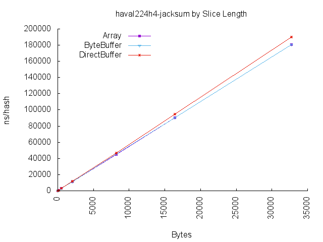

| Length |  Array | ByteBuffer | DirectBuffer |
| --- | ---: | ---: | ---: | 
| [32](#32-byte-slice-latency-all-hashes) | 27.391203 | 17.301698 | 52.446262 |
| [128](#128-byte-slice-latency-all-hashes) | 735.801391 | 739.905636 | 784.557075 |
| [512](#512-byte-slice-latency-all-hashes) | 2859.780433 | 2866.115332 | 3001.039283 |
| [2048](#2048-byte-slice-latency-all-hashes) | 11492.132558 | 11470.016460 | 11878.089193 |
| [8192](#8192-byte-slice-latency-all-hashes) | 45055.611212 | 45197.368578 | 46988.812268 |
| [16384](#16384-byte-slice-latency-all-hashes) | 90181.178228 | 90175.288730 | 94438.470408 |
| [32768](#32768-byte-slice-latency-all-hashes) | 180691.070771 | 180483.915997 | 189966.200871 |

---
### haval224h5-jacksum Latency
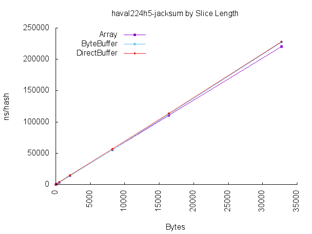

| Length |  Array | ByteBuffer | DirectBuffer |
| --- | ---: | ---: | ---: | 
| [32](#32-byte-slice-latency-all-hashes) | 27.295025 | 17.032103 | 49.030628 |
| [128](#128-byte-slice-latency-all-hashes) | 886.361250 | 891.534272 | 931.348669 |
| [512](#512-byte-slice-latency-all-hashes) | 3476.155542 | 3477.686494 | 3571.073880 |
| [2048](#2048-byte-slice-latency-all-hashes) | 14243.461777 | 13815.614937 | 14699.004726 |
| [8192](#8192-byte-slice-latency-all-hashes) | 55252.560104 | 55144.047873 | 56677.173782 |
| [16384](#16384-byte-slice-latency-all-hashes) | 110331.088423 | 112327.482029 | 113918.423724 |
| [32768](#32768-byte-slice-latency-all-hashes) | 220445.250235 | 227221.626162 | 227976.060096 |

---
### haval256h3-jacksum Latency
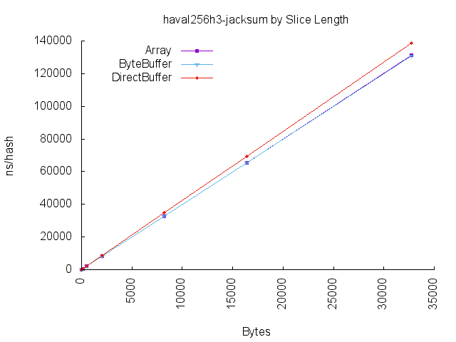

| Length |  Array | ByteBuffer | DirectBuffer |
| --- | ---: | ---: | ---: | 
| [32](#32-byte-slice-latency-all-hashes) | 28.119387 | 17.578468 | 49.188563 |
| [128](#128-byte-slice-latency-all-hashes) | 562.510728 | 529.970968 | 598.520660 |
| [512](#512-byte-slice-latency-all-hashes) | 2084.368553 | 2105.692593 | 2209.218791 |
| [2048](#2048-byte-slice-latency-all-hashes) | 8388.654868 | 8294.691485 | 8754.950887 |
| [8192](#8192-byte-slice-latency-all-hashes) | 32862.030587 | 32720.801797 | 34838.525412 |
| [16384](#16384-byte-slice-latency-all-hashes) | 65467.555659 | 65578.133427 | 69427.770758 |
| [32768](#32768-byte-slice-latency-all-hashes) | 131072.883777 | 131041.839822 | 138839.349490 |

---
### haval256h4-jacksum Latency

| Length |  Array | ByteBuffer | DirectBuffer |
| --- | ---: | ---: | ---: | 
| [32](#32-byte-slice-latency-all-hashes) | 27.811896 | 19.563116 | 48.237946 |
| [128](#128-byte-slice-latency-all-hashes) | 733.054585 | 724.067429 | 808.310941 |
| [512](#512-byte-slice-latency-all-hashes) | 2851.550830 | 2846.722312 | 2956.884459 |
| [2048](#2048-byte-slice-latency-all-hashes) | 11295.581359 | 11472.380412 | 12121.902522 |
| [8192](#8192-byte-slice-latency-all-hashes) | 45060.219433 | 45831.977624 | 47365.557322 |
| [16384](#16384-byte-slice-latency-all-hashes) | 90162.033912 | 91602.923895 | 96218.247999 |
| [32768](#32768-byte-slice-latency-all-hashes) | 183087.724704 | 180287.417275 | 187718.189136 |

---
### haval256h5-jacksum Latency
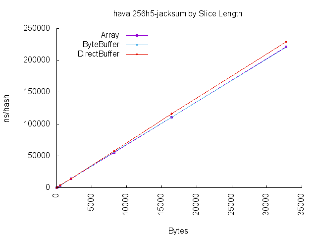

| Length |  Array | ByteBuffer | DirectBuffer |
| --- | ---: | ---: | ---: | 
| [32](#32-byte-slice-latency-all-hashes) | 26.936514 | 18.266894 | 49.937987 |
| [128](#128-byte-slice-latency-all-hashes) | 901.546793 | 896.874556 | 939.402600 |
| [512](#512-byte-slice-latency-all-hashes) | 3476.992815 | 3477.409043 | 3705.798165 |
| [2048](#2048-byte-slice-latency-all-hashes) | 13838.110703 | 14006.529856 | 14287.634197 |
| [8192](#8192-byte-slice-latency-all-hashes) | 55062.446166 | 55986.846183 | 57717.208039 |
| [16384](#16384-byte-slice-latency-all-hashes) | 110283.986240 | 110467.339116 | 115977.301199 |
| [32768](#32768-byte-slice-latency-all-hashes) | 220892.695990 | 220344.922699 | 229348.841278 |

---
### md2-bc Latency
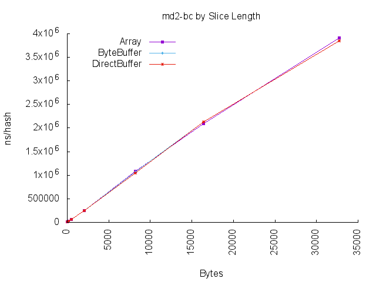

| Length |  Array | ByteBuffer | DirectBuffer |
| --- | ---: | ---: | ---: | 
| [32](#32-byte-slice-latency-all-hashes) | 8244.939818 | 8110.740250 | 8190.390400 |
| [128](#128-byte-slice-latency-all-hashes) | 19293.536113 | 19289.297127 | 19323.773876 |
| [512](#512-byte-slice-latency-all-hashes) | 65572.288221 | 64516.454120 | 65662.676884 |
| [2048](#2048-byte-slice-latency-all-hashes) | 245030.408997 | 245127.213920 | 245118.315018 |
| [8192](#8192-byte-slice-latency-all-hashes) | 1081200.392218 | 1067269.814371 | 1050663.360549 |
| [16384](#16384-byte-slice-latency-all-hashes) | 2094369.248085 | 2127828.583909 | 2133590.501005 |
| [32768](#32768-byte-slice-latency-all-hashes) | 3917943.541302 | 3850885.110270 | 3853516.385053 |

---
### md2-jacksum Latency
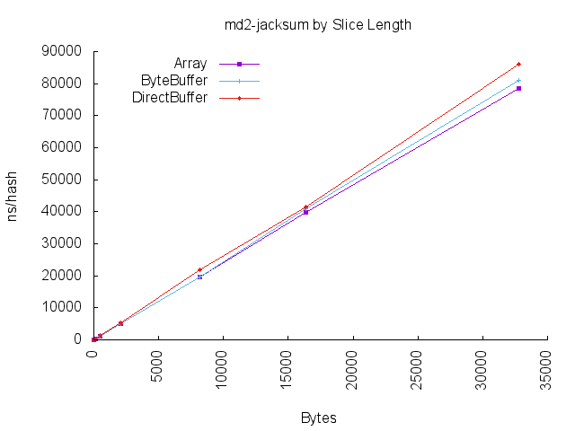

| Length |  Array | ByteBuffer | DirectBuffer |
| --- | ---: | ---: | ---: | 
| [32](#32-byte-slice-latency-all-hashes) | 16.353508 | 16.214258 | 40.289137 |
| [128](#128-byte-slice-latency-all-hashes) | 324.660328 | 325.895128 | 368.772933 |
| [512](#512-byte-slice-latency-all-hashes) | 1238.850148 | 1238.610218 | 1323.075819 |
| [2048](#2048-byte-slice-latency-all-hashes) | 4920.154198 | 4919.058545 | 5434.947067 |
| [8192](#8192-byte-slice-latency-all-hashes) | 19616.270403 | 19584.323864 | 21895.509538 |
| [16384](#16384-byte-slice-latency-all-hashes) | 39834.483051 | 40963.686220 | 41454.948627 |
| [32768](#32768-byte-slice-latency-all-hashes) | 78440.629880 | 81123.554239 | 86081.799936 |

---
### md4-bc Latency
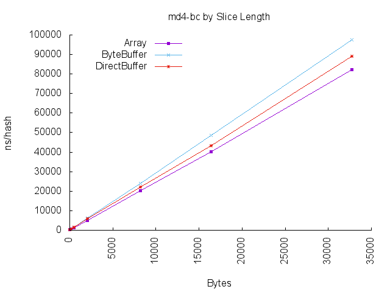

| Length |  Array | ByteBuffer | DirectBuffer |
| --- | ---: | ---: | ---: | 
| [32](#32-byte-slice-latency-all-hashes) | 179.949226 | 181.979485 | 204.483982 |
| [128](#128-byte-slice-latency-all-hashes) | 475.894721 | 524.228877 | 524.161149 |
| [512](#512-byte-slice-latency-all-hashes) | 1396.287709 | 1643.946140 | 1541.340106 |
| [2048](#2048-byte-slice-latency-all-hashes) | 5131.005409 | 6097.044873 | 5803.917014 |
| [8192](#8192-byte-slice-latency-all-hashes) | 20222.951302 | 23943.649311 | 22235.398595 |
| [16384](#16384-byte-slice-latency-all-hashes) | 40323.557661 | 48547.606479 | 43406.405864 |
| [32768](#32768-byte-slice-latency-all-hashes) | 82300.557941 | 97392.386004 | 89172.998397 |

---
### md4-jacksum Latency
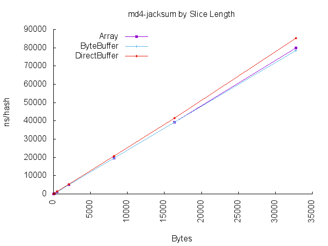

| Length |  Array | ByteBuffer | DirectBuffer |
| --- | ---: | ---: | ---: | 
| [32](#32-byte-slice-latency-all-hashes) | 16.726684 | 16.766292 | 39.985277 |
| [128](#128-byte-slice-latency-all-hashes) | 335.709241 | 318.554773 | 365.811692 |
| [512](#512-byte-slice-latency-all-hashes) | 1256.801513 | 1242.398067 | 1331.836420 |
| [2048](#2048-byte-slice-latency-all-hashes) | 4999.317302 | 4999.474243 | 5417.162067 |
| [8192](#8192-byte-slice-latency-all-hashes) | 19612.780280 | 19586.214395 | 20681.523132 |
| [16384](#16384-byte-slice-latency-all-hashes) | 39195.037416 | 39189.954084 | 41439.359094 |
| [32768](#32768-byte-slice-latency-all-hashes) | 79774.932885 | 78474.171723 | 85131.390423 |

---
### md5-bc Latency
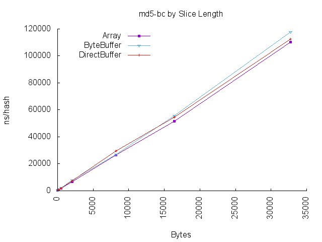

| Length |  Array | ByteBuffer | DirectBuffer |
| --- | ---: | ---: | ---: | 
| [32](#32-byte-slice-latency-all-hashes) | 228.820808 | 225.242643 | 246.889243 |
| [128](#128-byte-slice-latency-all-hashes) | 612.703291 | 661.996465 | 661.336262 |
| [512](#512-byte-slice-latency-all-hashes) | 1816.446229 | 2069.477040 | 1918.580813 |
| [2048](#2048-byte-slice-latency-all-hashes) | 6634.157710 | 7808.592304 | 7352.918831 |
| [8192](#8192-byte-slice-latency-all-hashes) | 26375.480715 | 27059.742983 | 29412.411614 |
| [16384](#16384-byte-slice-latency-all-hashes) | 51671.860799 | 55752.094050 | 54745.363897 |
| [32768](#32768-byte-slice-latency-all-hashes) | 110244.655099 | 117748.192580 | 112445.054223 |

---
### md5-guava Latency
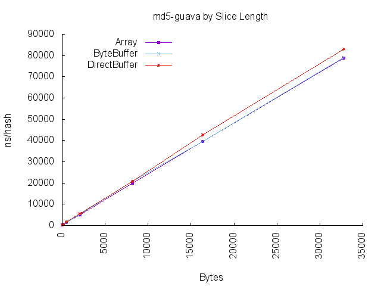

| Length |  Array | ByteBuffer | DirectBuffer |
| --- | ---: | ---: | ---: | 
| [32](#32-byte-slice-latency-all-hashes) | 257.678738 | 253.901836 | 271.285642 |
| [128](#128-byte-slice-latency-all-hashes) | 549.072811 | 573.719528 | 609.746298 |
| [512](#512-byte-slice-latency-all-hashes) | 1469.236528 | 1515.072844 | 1581.897338 |
| [2048](#2048-byte-slice-latency-all-hashes) | 5165.649783 | 5348.642571 | 5529.703605 |
| [8192](#8192-byte-slice-latency-all-hashes) | 19920.567060 | 20878.201941 | 20753.861016 |
| [16384](#16384-byte-slice-latency-all-hashes) | 39562.724994 | 39549.104261 | 42610.107137 |
| [32768](#32768-byte-slice-latency-all-hashes) | 78808.751191 | 78925.625487 | 82878.130469 |

---
### md5-jacksum Latency
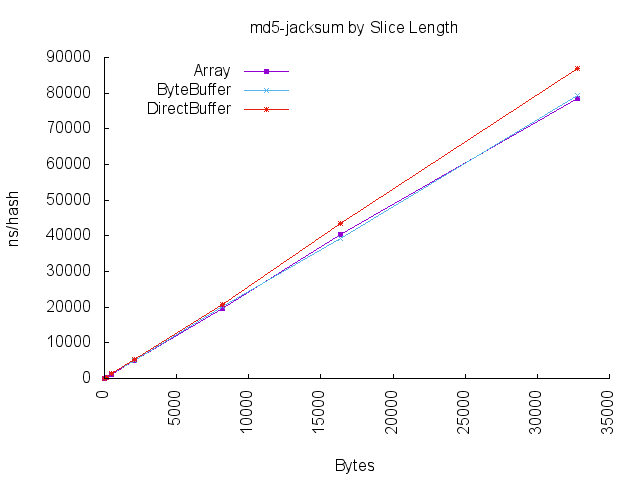

| Length |  Array | ByteBuffer | DirectBuffer |
| --- | ---: | ---: | ---: | 
| [32](#32-byte-slice-latency-all-hashes) | 17.232558 | 16.730379 | 40.482001 |
| [128](#128-byte-slice-latency-all-hashes) | 319.853705 | 324.849053 | 348.487949 |
| [512](#512-byte-slice-latency-all-hashes) | 1239.402118 | 1278.315417 | 1362.038417 |
| [2048](#2048-byte-slice-latency-all-hashes) | 4913.892861 | 4920.629492 | 5417.021652 |
| [8192](#8192-byte-slice-latency-all-hashes) | 19593.409446 | 20159.469708 | 20661.679418 |
| [16384](#16384-byte-slice-latency-all-hashes) | 40327.126862 | 39247.853504 | 43328.211093 |
| [32768](#32768-byte-slice-latency-all-hashes) | 78479.435703 | 79371.359019 | 86959.622589 |

---
### md5-jacksum-alt Latency
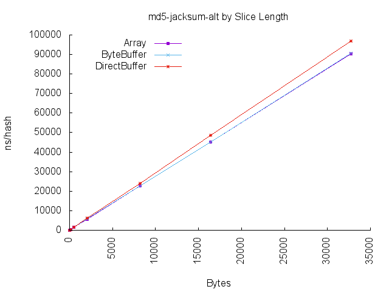

| Length |  Array | ByteBuffer | DirectBuffer |
| --- | ---: | ---: | ---: | 
| [32](#32-byte-slice-latency-all-hashes) | 25.072187 | 16.611801 | 50.702751 |
| [128](#128-byte-slice-latency-all-hashes) | 381.236537 | 377.740835 | 405.293202 |
| [512](#512-byte-slice-latency-all-hashes) | 1429.253324 | 1447.785406 | 1529.625632 |
| [2048](#2048-byte-slice-latency-all-hashes) | 5696.354425 | 5850.506450 | 6129.496230 |
| [8192](#8192-byte-slice-latency-all-hashes) | 22837.308977 | 22668.137475 | 24023.511173 |
| [16384](#16384-byte-slice-latency-all-hashes) | 45120.302153 | 45045.918701 | 48696.113373 |
| [32768](#32768-byte-slice-latency-all-hashes) | 90244.477944 | 90529.139444 | 97002.668893 |

---
### murmur3h128-guava Latency
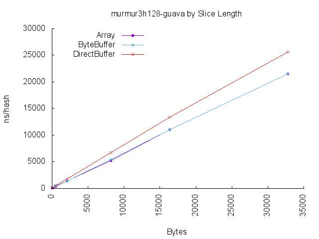

| Length |  Array | ByteBuffer | DirectBuffer |
| --- | ---: | ---: | ---: | 
| [32](#32-byte-slice-latency-all-hashes) | 75.994691 | 141.809475 | 155.106739 |
| [128](#128-byte-slice-latency-all-hashes) | 130.400428 | 197.576468 | 216.515120 |
| [512](#512-byte-slice-latency-all-hashes) | 365.927712 | 454.744841 | 536.996673 |
| [2048](#2048-byte-slice-latency-all-hashes) | 1374.448792 | 1404.891252 | 1748.278050 |
| [8192](#8192-byte-slice-latency-all-hashes) | 5269.574699 | 5460.068877 | 6684.116962 |
| [16384](#16384-byte-slice-latency-all-hashes) | 11043.132710 | 11011.203494 | 13371.993161 |
| [32768](#32768-byte-slice-latency-all-hashes) | 21523.153793 | 21522.478439 | 25585.976160 |

---
### murmur3h128-zah Latency
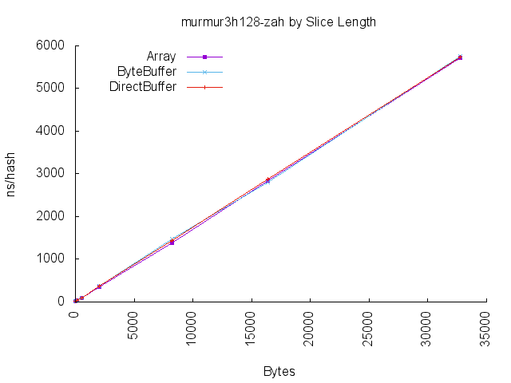

| Length |  Array | ByteBuffer | DirectBuffer |
| --- | ---: | ---: | ---: | 
| [32](#32-byte-slice-latency-all-hashes) | 14.738911 | 15.060878 | 15.636062 |
| [128](#128-byte-slice-latency-all-hashes) | 31.904708 | 37.041997 | 34.074388 |
| [512](#512-byte-slice-latency-all-hashes) | 98.271901 | 97.415523 | 96.679660 |
| [2048](#2048-byte-slice-latency-all-hashes) | 363.464001 | 368.455891 | 379.737144 |
| [8192](#8192-byte-slice-latency-all-hashes) | 1379.090755 | 1472.696930 | 1443.267383 |
| [16384](#16384-byte-slice-latency-all-hashes) | 2835.336991 | 2797.657474 | 2872.197079 |
| [32768](#32768-byte-slice-latency-all-hashes) | 5720.728116 | 5755.831733 | 5735.545662 |

---
### murmur3h32-guava Latency
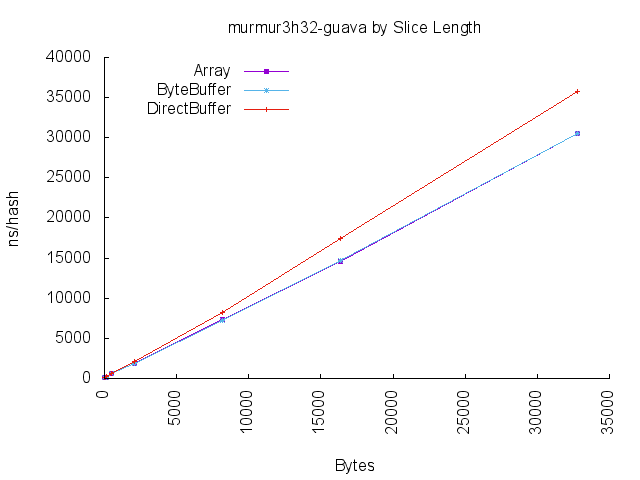

| Length |  Array | ByteBuffer | DirectBuffer |
| --- | ---: | ---: | ---: | 
| [32](#32-byte-slice-latency-all-hashes) | 68.059087 | 76.686605 | 95.884751 |
| [128](#128-byte-slice-latency-all-hashes) | 173.235541 | 153.266125 | 205.711347 |
| [512](#512-byte-slice-latency-all-hashes) | 579.463487 | 570.400044 | 630.370367 |
| [2048](#2048-byte-slice-latency-all-hashes) | 1893.124224 | 1863.441433 | 2140.750350 |
| [8192](#8192-byte-slice-latency-all-hashes) | 7352.426401 | 7205.696842 | 8169.977227 |
| [16384](#16384-byte-slice-latency-all-hashes) | 14564.838129 | 14669.210779 | 17408.367604 |
| [32768](#32768-byte-slice-latency-all-hashes) | 30591.328415 | 30576.896990 | 35792.238497 |

---
### ripemd128-bc Latency
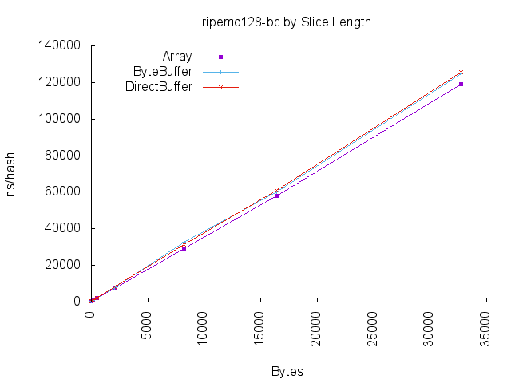

| Length |  Array | ByteBuffer | DirectBuffer |
| --- | ---: | ---: | ---: | 
| [32](#32-byte-slice-latency-all-hashes) | 248.989949 | 253.618201 | 287.808879 |
| [128](#128-byte-slice-latency-all-hashes) | 681.766536 | 727.776043 | 710.128434 |
| [512](#512-byte-slice-latency-all-hashes) | 2009.904304 | 2262.339146 | 2151.430854 |
| [2048](#2048-byte-slice-latency-all-hashes) | 7455.025343 | 8064.060499 | 8496.077719 |
| [8192](#8192-byte-slice-latency-all-hashes) | 29198.626867 | 32778.869217 | 31251.587359 |
| [16384](#16384-byte-slice-latency-all-hashes) | 58205.905408 | 60372.629264 | 61130.695105 |
| [32768](#32768-byte-slice-latency-all-hashes) | 119136.641483 | 124838.778415 | 125643.173312 |

---
### ripemd128-jacksum Latency
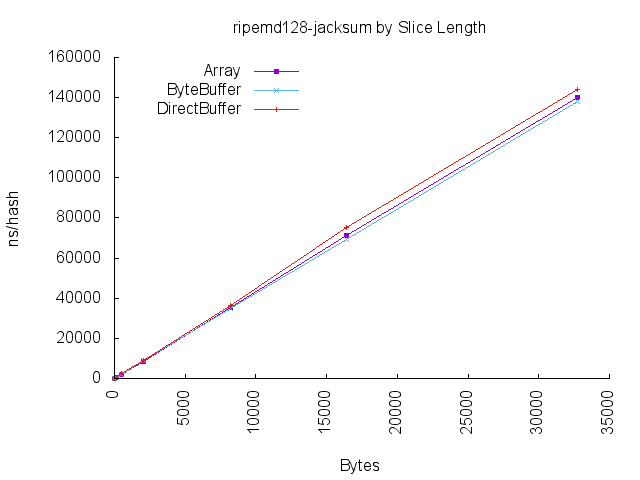

| Length |  Array | ByteBuffer | DirectBuffer |
| --- | ---: | ---: | ---: | 
| [32](#32-byte-slice-latency-all-hashes) | 25.271001 | 15.911424 | 49.135810 |
| [128](#128-byte-slice-latency-all-hashes) | 579.151178 | 569.668833 | 603.309383 |
| [512](#512-byte-slice-latency-all-hashes) | 2198.267822 | 2219.396566 | 2271.665214 |
| [2048](#2048-byte-slice-latency-all-hashes) | 8645.019233 | 8772.219760 | 9029.806093 |
| [8192](#8192-byte-slice-latency-all-hashes) | 35384.023321 | 35039.469629 | 36479.859401 |
| [16384](#16384-byte-slice-latency-all-hashes) | 71274.939404 | 69454.391944 | 75043.029649 |
| [32768](#32768-byte-slice-latency-all-hashes) | 140005.768584 | 137991.751921 | 143917.244915 |

---
### ripemd160-bc Latency

| Length |  Array | ByteBuffer | DirectBuffer |
| --- | ---: | ---: | ---: | 
| [32](#32-byte-slice-latency-all-hashes) | 1093.196939 | 1095.510432 | 1120.904134 |
| [128](#128-byte-slice-latency-all-hashes) | 3302.876096 | 3231.946975 | 3243.021814 |
| [512](#512-byte-slice-latency-all-hashes) | 9538.095458 | 9923.257780 | 9838.279752 |
| [2048](#2048-byte-slice-latency-all-hashes) | 35576.920070 | 36369.735731 | 36690.674862 |
| [8192](#8192-byte-slice-latency-all-hashes) | 138091.504564 | 137982.622973 | 139710.254016 |
| [16384](#16384-byte-slice-latency-all-hashes) | 278477.239390 | 271885.033948 | 281042.657865 |
| [32768](#32768-byte-slice-latency-all-hashes) | 557488.936588 | 544057.128695 | 551639.194452 |

---
### ripemd160-jacksum Latency
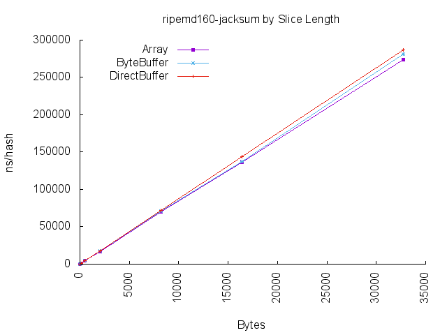

| Length |  Array | ByteBuffer | DirectBuffer |
| --- | ---: | ---: | ---: | 
| [32](#32-byte-slice-latency-all-hashes) | 26.422561 | 16.572974 | 47.483922 |
| [128](#128-byte-slice-latency-all-hashes) | 1115.434884 | 1099.468962 | 1169.014166 |
| [512](#512-byte-slice-latency-all-hashes) | 4318.144853 | 4457.021525 | 4452.159598 |
| [2048](#2048-byte-slice-latency-all-hashes) | 17115.066166 | 17524.846474 | 17878.439509 |
| [8192](#8192-byte-slice-latency-all-hashes) | 69897.153076 | 71343.005624 | 71765.484139 |
| [16384](#16384-byte-slice-latency-all-hashes) | 136768.604708 | 137633.631583 | 143483.504059 |
| [32768](#32768-byte-slice-latency-all-hashes) | 273426.278905 | 281144.690746 | 287367.731159 |

---
### ripemd256-bc Latency
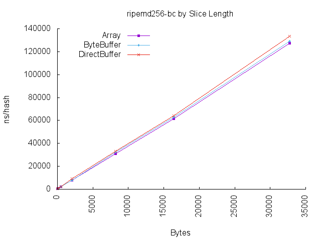

| Length |  Array | ByteBuffer | DirectBuffer |
| --- | ---: | ---: | ---: | 
| [32](#32-byte-slice-latency-all-hashes) | 279.678713 | 277.533346 | 304.388261 |
| [128](#128-byte-slice-latency-all-hashes) | 764.441718 | 736.278005 | 750.847495 |
| [512](#512-byte-slice-latency-all-hashes) | 2164.842757 | 2214.297569 | 2324.868401 |
| [2048](#2048-byte-slice-latency-all-hashes) | 7889.392231 | 8065.192977 | 9206.994335 |
| [8192](#8192-byte-slice-latency-all-hashes) | 30840.148581 | 32171.590768 | 33149.056581 |
| [16384](#16384-byte-slice-latency-all-hashes) | 61440.035558 | 62962.929639 | 63961.152084 |
| [32768](#32768-byte-slice-latency-all-hashes) | 127537.809131 | 129039.940548 | 133402.202429 |

---
### ripemd256-jacksum Latency
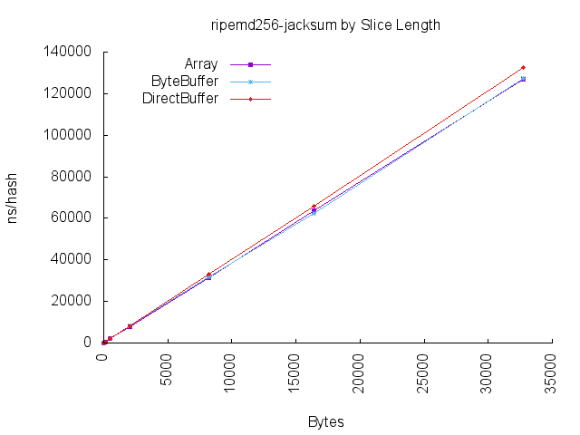

| Length |  Array | ByteBuffer | DirectBuffer |
| --- | ---: | ---: | ---: | 
| [32](#32-byte-slice-latency-all-hashes) | 56.004434 | 52.627018 | 76.931849 |
| [128](#128-byte-slice-latency-all-hashes) | 525.717050 | 518.715667 | 549.662474 |
| [512](#512-byte-slice-latency-all-hashes) | 2025.056689 | 1993.426911 | 2147.309462 |
| [2048](#2048-byte-slice-latency-all-hashes) | 7845.169270 | 8184.427039 | 8450.913708 |
| [8192](#8192-byte-slice-latency-all-hashes) | 31361.501615 | 31966.961796 | 32997.187031 |
| [16384](#16384-byte-slice-latency-all-hashes) | 63459.968498 | 62585.405332 | 65783.388951 |
| [32768](#32768-byte-slice-latency-all-hashes) | 126934.171238 | 127518.605236 | 132396.630898 |

---
### ripemd320-bc Latency
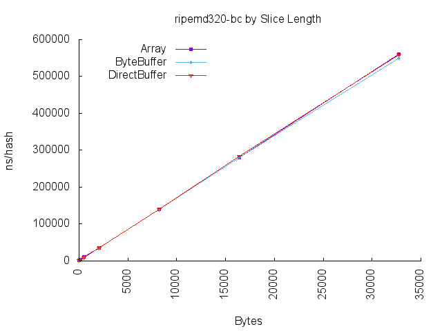

| Length |  Array | ByteBuffer | DirectBuffer |
| --- | ---: | ---: | ---: | 
| [32](#32-byte-slice-latency-all-hashes) | 1113.478088 | 1113.957163 | 1160.326577 |
| [128](#128-byte-slice-latency-all-hashes) | 3239.820602 | 3242.984844 | 3273.326707 |
| [512](#512-byte-slice-latency-all-hashes) | 10346.011929 | 9906.668624 | 9785.519035 |
| [2048](#2048-byte-slice-latency-all-hashes) | 35540.277889 | 36215.587549 | 35926.394360 |
| [8192](#8192-byte-slice-latency-all-hashes) | 140460.251094 | 139708.870711 | 140366.825407 |
| [16384](#16384-byte-slice-latency-all-hashes) | 281222.063819 | 280532.448717 | 284359.531937 |
| [32768](#32768-byte-slice-latency-all-hashes) | 560855.382703 | 549574.697472 | 559568.392041 |

---
### ripemd320-jacksum Latency
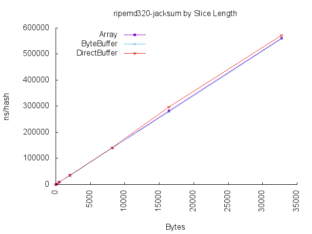

| Length |  Array | ByteBuffer | DirectBuffer |
| --- | ---: | ---: | ---: | 
| [32](#32-byte-slice-latency-all-hashes) | 52.618920 | 52.244864 | 71.058638 |
| [128](#128-byte-slice-latency-all-hashes) | 2217.065834 | 2198.668685 | 2320.452049 |
| [512](#512-byte-slice-latency-all-hashes) | 8826.423105 | 8675.551743 | 8955.934613 |
| [2048](#2048-byte-slice-latency-all-hashes) | 35051.258918 | 34430.223304 | 36241.545577 |
| [8192](#8192-byte-slice-latency-all-hashes) | 140632.860312 | 140476.223374 | 142927.687622 |
| [16384](#16384-byte-slice-latency-all-hashes) | 283079.534425 | 277964.136997 | 297539.983809 |
| [32768](#32768-byte-slice-latency-all-hashes) | 560711.763205 | 558303.618972 | 571272.566146 |

---
### sha0-jacksum Latency
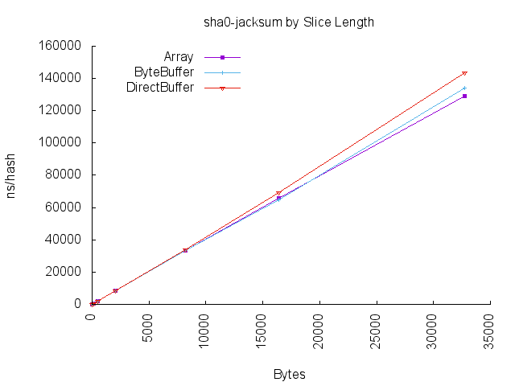

| Length |  Array | ByteBuffer | DirectBuffer |
| --- | ---: | ---: | ---: | 
| [32](#32-byte-slice-latency-all-hashes) | 26.885603 | 16.562425 | 46.665839 |
| [128](#128-byte-slice-latency-all-hashes) | 530.868682 | 531.734576 | 569.629707 |
| [512](#512-byte-slice-latency-all-hashes) | 2055.613129 | 2078.403367 | 2142.795679 |
| [2048](#2048-byte-slice-latency-all-hashes) | 8240.257648 | 8404.130349 | 8503.486933 |
| [8192](#8192-byte-slice-latency-all-hashes) | 33486.957274 | 33373.151356 | 33716.808801 |
| [16384](#16384-byte-slice-latency-all-hashes) | 65644.214760 | 64848.241482 | 69335.575602 |
| [32768](#32768-byte-slice-latency-all-hashes) | 129043.506638 | 134200.562363 | 143507.329247 |

---
### sha1-bc Latency
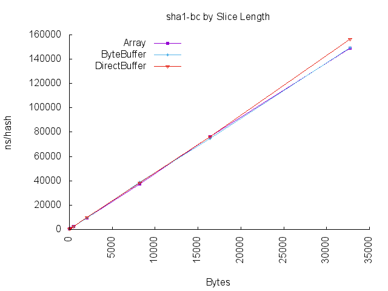

| Length |  Array | ByteBuffer | DirectBuffer |
| --- | ---: | ---: | ---: | 
| [32](#32-byte-slice-latency-all-hashes) | 328.655545 | 326.144092 | 356.754173 |
| [128](#128-byte-slice-latency-all-hashes) | 880.955083 | 879.147817 | 904.165479 |
| [512](#512-byte-slice-latency-all-hashes) | 2664.690172 | 2628.933959 | 2647.546082 |
| [2048](#2048-byte-slice-latency-all-hashes) | 9691.255313 | 9584.505862 | 9974.902689 |
| [8192](#8192-byte-slice-latency-all-hashes) | 37374.323379 | 38785.055422 | 38417.875196 |
| [16384](#16384-byte-slice-latency-all-hashes) | 76339.919988 | 74770.842841 | 76344.087076 |
| [32768](#32768-byte-slice-latency-all-hashes) | 149097.595536 | 149330.625066 | 156648.229021 |

---
### sha1-guava Latency
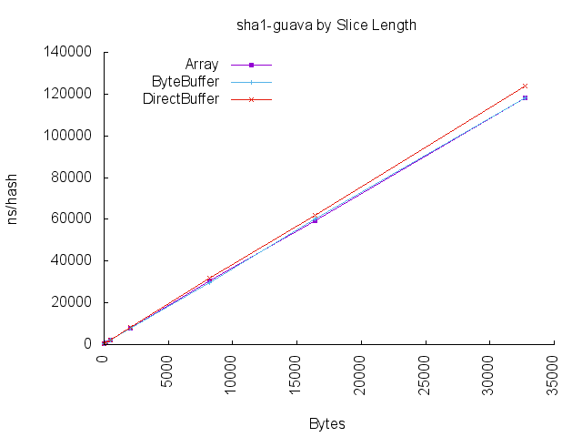

| Length |  Array | ByteBuffer | DirectBuffer |
| --- | ---: | ---: | ---: | 
| [32](#32-byte-slice-latency-all-hashes) | 360.893654 | 355.379882 | 414.988452 |
| [128](#128-byte-slice-latency-all-hashes) | 810.612960 | 822.623094 | 877.096928 |
| [512](#512-byte-slice-latency-all-hashes) | 2213.794600 | 2227.388851 | 2310.486970 |
| [2048](#2048-byte-slice-latency-all-hashes) | 7724.931316 | 7840.171385 | 8071.956091 |
| [8192](#8192-byte-slice-latency-all-hashes) | 30739.703914 | 29802.204609 | 32021.373096 |
| [16384](#16384-byte-slice-latency-all-hashes) | 59236.170922 | 60146.406674 | 61858.380225 |
| [32768](#32768-byte-slice-latency-all-hashes) | 117981.882192 | 118083.969142 | 123712.141690 |

---
### sha1-jacksum Latency
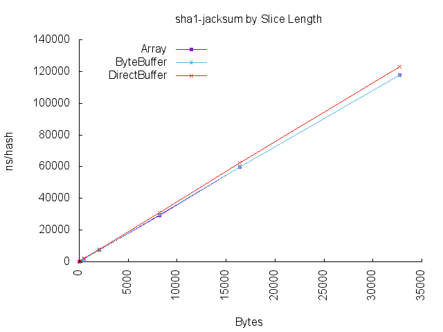

| Length |  Array | ByteBuffer | DirectBuffer |
| --- | ---: | ---: | ---: | 
| [32](#32-byte-slice-latency-all-hashes) | 16.182980 | 16.868222 | 35.251783 |
| [128](#128-byte-slice-latency-all-hashes) | 481.708802 | 471.338550 | 506.656381 |
| [512](#512-byte-slice-latency-all-hashes) | 1894.684994 | 1909.197192 | 2068.011241 |
| [2048](#2048-byte-slice-latency-all-hashes) | 7371.471889 | 7618.318420 | 7887.438042 |
| [8192](#8192-byte-slice-latency-all-hashes) | 29437.768747 | 29456.503574 | 31113.792839 |
| [16384](#16384-byte-slice-latency-all-hashes) | 59846.588936 | 59911.952899 | 62527.126752 |
| [32768](#32768-byte-slice-latency-all-hashes) | 117744.647516 | 117906.331974 | 123125.044505 |

---
### sha1-jacksum-alt Latency
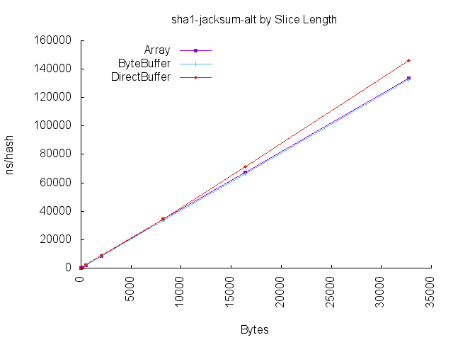

| Length |  Array | ByteBuffer | DirectBuffer |
| --- | ---: | ---: | ---: | 
| [32](#32-byte-slice-latency-all-hashes) | 27.072699 | 16.322722 | 45.940299 |
| [128](#128-byte-slice-latency-all-hashes) | 553.960873 | 543.958111 | 592.026080 |
| [512](#512-byte-slice-latency-all-hashes) | 2173.384320 | 2197.369861 | 2298.805383 |
| [2048](#2048-byte-slice-latency-all-hashes) | 8441.042913 | 8305.288594 | 9125.606182 |
| [8192](#8192-byte-slice-latency-all-hashes) | 34306.102076 | 33314.033539 | 34400.927399 |
| [16384](#16384-byte-slice-latency-all-hashes) | 67299.889016 | 66217.836543 | 71422.226597 |
| [32768](#32768-byte-slice-latency-all-hashes) | 133632.605440 | 132424.471932 | 145887.545063 |

---
### sha224-bc Latency
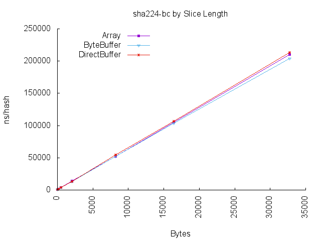

| Length |  Array | ByteBuffer | DirectBuffer |
| --- | ---: | ---: | ---: | 
| [32](#32-byte-slice-latency-all-hashes) | 440.338253 | 437.944799 | 465.823079 |
| [128](#128-byte-slice-latency-all-hashes) | 1243.429678 | 1218.112777 | 1255.919660 |
| [512](#512-byte-slice-latency-all-hashes) | 3685.181884 | 3656.670748 | 3824.320105 |
| [2048](#2048-byte-slice-latency-all-hashes) | 13892.476019 | 13359.508261 | 13522.896564 |
| [8192](#8192-byte-slice-latency-all-hashes) | 51814.779484 | 52249.468675 | 54295.095132 |
| [16384](#16384-byte-slice-latency-all-hashes) | 105130.048967 | 103245.240837 | 106510.011045 |
| [32768](#32768-byte-slice-latency-all-hashes) | 210658.956568 | 204406.233535 | 213240.668109 |

---
### sha224-jacksum Latency
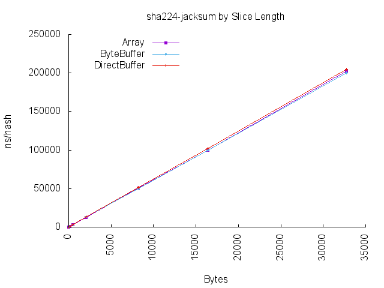

| Length |  Array | ByteBuffer | DirectBuffer |
| --- | ---: | ---: | ---: | 
| [32](#32-byte-slice-latency-all-hashes) | 26.770137 | 16.751738 | 49.463225 |
| [128](#128-byte-slice-latency-all-hashes) | 807.190964 | 818.520700 | 840.647792 |
| [512](#512-byte-slice-latency-all-hashes) | 3193.523939 | 3215.357327 | 3247.441326 |
| [2048](#2048-byte-slice-latency-all-hashes) | 12478.015525 | 12864.590170 | 12978.089355 |
| [8192](#8192-byte-slice-latency-all-hashes) | 50736.618796 | 49763.560406 | 51110.645141 |
| [16384](#16384-byte-slice-latency-all-hashes) | 99614.828229 | 99567.637031 | 102412.724643 |
| [32768](#32768-byte-slice-latency-all-hashes) | 202277.837332 | 200535.005982 | 204954.198161 |

---
### sha256-bc Latency
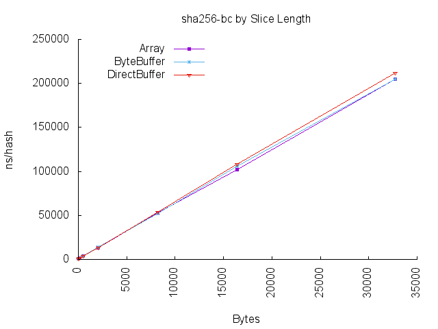

| Length |  Array | ByteBuffer | DirectBuffer |
| --- | ---: | ---: | ---: | 
| [32](#32-byte-slice-latency-all-hashes) | 442.272461 | 445.909846 | 477.776745 |
| [128](#128-byte-slice-latency-all-hashes) | 1229.312702 | 1221.345276 | 1259.111341 |
| [512](#512-byte-slice-latency-all-hashes) | 3613.390007 | 3716.719013 | 3739.987120 |
| [2048](#2048-byte-slice-latency-all-hashes) | 13172.747988 | 13786.366382 | 13614.931734 |
| [8192](#8192-byte-slice-latency-all-hashes) | 52627.383582 | 52237.899254 | 53604.876066 |
| [16384](#16384-byte-slice-latency-all-hashes) | 102257.912612 | 105790.024004 | 108002.935777 |
| [32768](#32768-byte-slice-latency-all-hashes) | 205083.594463 | 205047.193012 | 212128.068063 |

---
### sha256-guava Latency
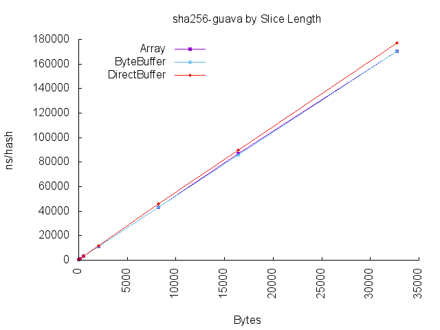

| Length |  Array | ByteBuffer | DirectBuffer |
| --- | ---: | ---: | ---: | 
| [32](#32-byte-slice-latency-all-hashes) | 451.755319 | 469.386547 | 498.064362 |
| [128](#128-byte-slice-latency-all-hashes) | 1159.972921 | 1144.968024 | 1163.927108 |
| [512](#512-byte-slice-latency-all-hashes) | 3164.954196 | 3163.760432 | 3318.951548 |
| [2048](#2048-byte-slice-latency-all-hashes) | 11089.078245 | 11093.729959 | 11874.861333 |
| [8192](#8192-byte-slice-latency-all-hashes) | 43040.533491 | 43033.001197 | 45965.676227 |
| [16384](#16384-byte-slice-latency-all-hashes) | 86941.217643 | 85529.196897 | 89863.826667 |
| [32768](#32768-byte-slice-latency-all-hashes) | 170666.718417 | 170618.867212 | 177449.670958 |

---
### sha256-jacksum Latency
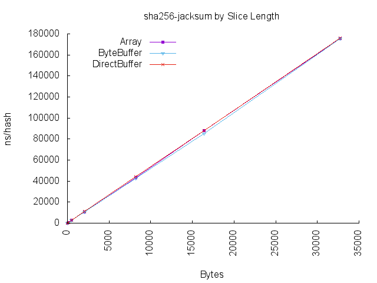

| Length |  Array | ByteBuffer | DirectBuffer |
| --- | ---: | ---: | ---: | 
| [32](#32-byte-slice-latency-all-hashes) | 23.317316 | 23.144894 | 47.942644 |
| [128](#128-byte-slice-latency-all-hashes) | 685.295005 | 681.106158 | 717.009550 |
| [512](#512-byte-slice-latency-all-hashes) | 2729.615109 | 2732.801974 | 2819.309391 |
| [2048](#2048-byte-slice-latency-all-hashes) | 10656.071056 | 10834.213098 | 11203.027271 |
| [8192](#8192-byte-slice-latency-all-hashes) | 43226.962375 | 42598.142023 | 44041.724481 |
| [16384](#16384-byte-slice-latency-all-hashes) | 87803.040342 | 85063.136158 | 87759.124345 |
| [32768](#32768-byte-slice-latency-all-hashes) | 175492.560735 | 175650.524293 | 176070.646381 |

---
### sha256-jacksum-alt Latency
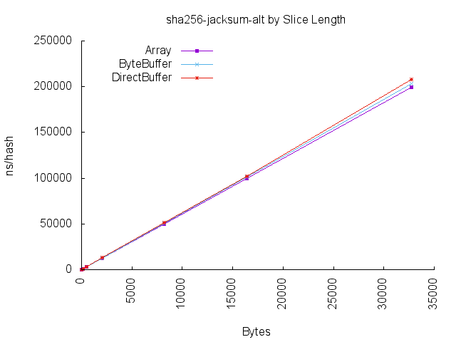

| Length |  Array | ByteBuffer | DirectBuffer |
| --- | ---: | ---: | ---: | 
| [32](#32-byte-slice-latency-all-hashes) | 26.511528 | 20.654966 | 47.980174 |
| [128](#128-byte-slice-latency-all-hashes) | 806.131831 | 807.984786 | 864.007935 |
| [512](#512-byte-slice-latency-all-hashes) | 3155.373272 | 3135.362109 | 3230.758683 |
| [2048](#2048-byte-slice-latency-all-hashes) | 12739.555893 | 12467.833562 | 12883.443626 |
| [8192](#8192-byte-slice-latency-all-hashes) | 49881.168312 | 50594.527618 | 51763.961782 |
| [16384](#16384-byte-slice-latency-all-hashes) | 99827.603170 | 101130.964638 | 101710.467158 |
| [32768](#32768-byte-slice-latency-all-hashes) | 199041.578702 | 202975.809731 | 208238.787568 |

---
### sha384-bc Latency
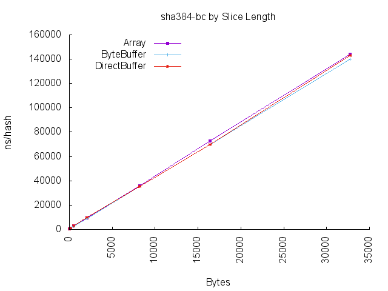

| Length |  Array | ByteBuffer | DirectBuffer |
| --- | ---: | ---: | ---: | 
| [32](#32-byte-slice-latency-all-hashes) | 575.866382 | 574.705178 | 592.623019 |
| [128](#128-byte-slice-latency-all-hashes) | 1125.718115 | 1098.624735 | 1100.558416 |
| [512](#512-byte-slice-latency-all-hashes) | 2827.445202 | 2708.213756 | 2785.106434 |
| [2048](#2048-byte-slice-latency-all-hashes) | 9430.372970 | 9183.237017 | 9843.966534 |
| [8192](#8192-byte-slice-latency-all-hashes) | 36082.247925 | 35186.367297 | 35280.600619 |
| [16384](#16384-byte-slice-latency-all-hashes) | 72803.786771 | 69823.508769 | 69795.825174 |
| [32768](#32768-byte-slice-latency-all-hashes) | 143871.167544 | 140067.536373 | 142946.686090 |

---
### sha384-guava Latency

| Length |  Array | ByteBuffer | DirectBuffer |
| --- | ---: | ---: | ---: | 
| [32](#32-byte-slice-latency-all-hashes) | 822.212571 | 782.182974 | 859.145226 |
| [128](#128-byte-slice-latency-all-hashes) | 1410.272099 | 1284.483675 | 1402.134668 |
| [512](#512-byte-slice-latency-all-hashes) | 3113.161779 | 3010.421268 | 3091.964538 |
| [2048](#2048-byte-slice-latency-all-hashes) | 9644.109600 | 9796.608380 | 10408.229685 |
| [8192](#8192-byte-slice-latency-all-hashes) | 37638.089833 | 36383.220508 | 39072.810598 |
| [16384](#16384-byte-slice-latency-all-hashes) | 74263.170720 | 71923.909749 | 75903.789494 |
| [32768](#32768-byte-slice-latency-all-hashes) | 142944.616093 | 145376.046038 | 152280.304622 |

---
### sha384-jacksum Latency
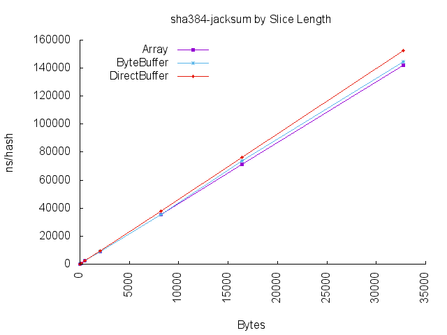

| Length |  Array | ByteBuffer | DirectBuffer |
| --- | ---: | ---: | ---: | 
| [32](#32-byte-slice-latency-all-hashes) | 23.473363 | 23.760894 | 47.955513 |
| [128](#128-byte-slice-latency-all-hashes) | 597.226542 | 573.681246 | 626.820703 |
| [512](#512-byte-slice-latency-all-hashes) | 2248.947885 | 2254.616372 | 2435.706127 |
| [2048](#2048-byte-slice-latency-all-hashes) | 9055.937713 | 9191.582618 | 9507.713367 |
| [8192](#8192-byte-slice-latency-all-hashes) | 35596.735924 | 35581.099846 | 37800.329805 |
| [16384](#16384-byte-slice-latency-all-hashes) | 71148.419176 | 73572.175958 | 76334.536397 |
| [32768](#32768-byte-slice-latency-all-hashes) | 142154.875159 | 144547.630420 | 152384.332533 |

---
### sha384-jacksum-alt Latency
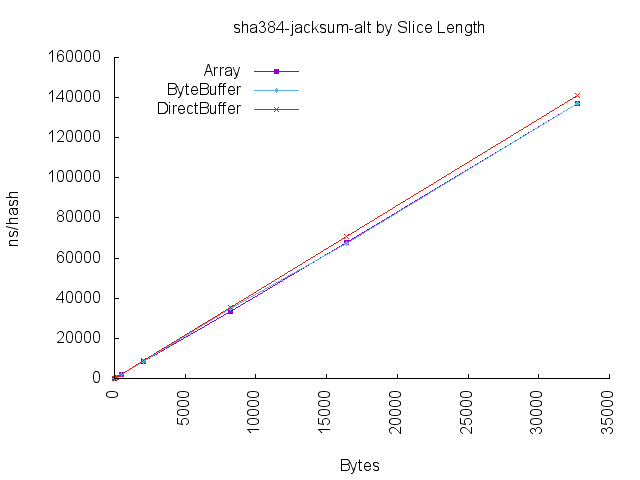

| Length |  Array | ByteBuffer | DirectBuffer |
| --- | ---: | ---: | ---: | 
| [32](#32-byte-slice-latency-all-hashes) | 27.155319 | 16.252988 | 50.760304 |
| [128](#128-byte-slice-latency-all-hashes) | 557.663204 | 562.682616 | 622.412188 |
| [512](#512-byte-slice-latency-all-hashes) | 2127.047541 | 2138.210604 | 2194.417674 |
| [2048](#2048-byte-slice-latency-all-hashes) | 8539.584263 | 8388.429315 | 9051.174388 |
| [8192](#8192-byte-slice-latency-all-hashes) | 33464.755735 | 35047.741172 | 35414.101662 |
| [16384](#16384-byte-slice-latency-all-hashes) | 67962.457222 | 67393.040120 | 70706.576072 |
| [32768](#32768-byte-slice-latency-all-hashes) | 136986.696756 | 137251.614555 | 140870.011248 |

---
### sha3-bc Latency
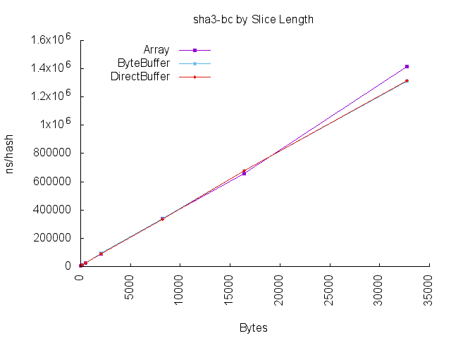

| Length |  Array | ByteBuffer | DirectBuffer |
| --- | ---: | ---: | ---: | 
| [32](#32-byte-slice-latency-all-hashes) | 5385.500863 | 5580.671714 | 5335.028124 |
| [128](#128-byte-slice-latency-all-hashes) | 10693.416145 | 10702.327342 | 10526.549348 |
| [512](#512-byte-slice-latency-all-hashes) | 26145.106850 | 26077.381685 | 26789.865299 |
| [2048](#2048-byte-slice-latency-all-hashes) | 88000.457520 | 92264.146110 | 89096.038414 |
| [8192](#8192-byte-slice-latency-all-hashes) | 337329.878018 | 338511.193979 | 334466.163732 |
| [16384](#16384-byte-slice-latency-all-hashes) | 659579.003602 | 677147.608048 | 678664.049053 |
| [32768](#32768-byte-slice-latency-all-hashes) | 1414006.796925 | 1312413.891464 | 1317443.332599 |

---
### sha512-bc Latency
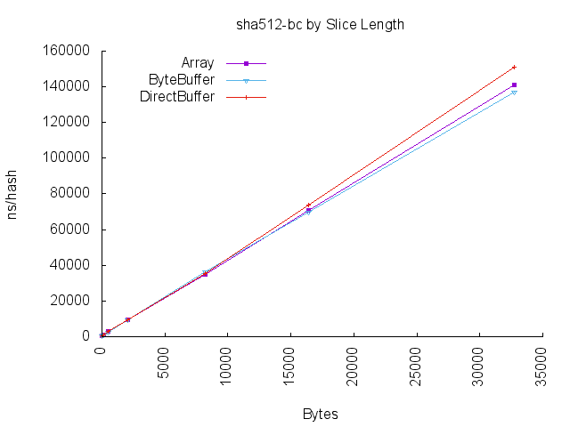

| Length |  Array | ByteBuffer | DirectBuffer |
| --- | ---: | ---: | ---: | 
| [32](#32-byte-slice-latency-all-hashes) | 572.528707 | 579.508070 | 625.447447 |
| [128](#128-byte-slice-latency-all-hashes) | 1109.139602 | 1138.022637 | 1101.412037 |
| [512](#512-byte-slice-latency-all-hashes) | 2811.479111 | 2715.074652 | 2822.243705 |
| [2048](#2048-byte-slice-latency-all-hashes) | 9498.215658 | 9318.863508 | 9562.669473 |
| [8192](#8192-byte-slice-latency-all-hashes) | 34830.603180 | 36182.648196 | 35183.758354 |
| [16384](#16384-byte-slice-latency-all-hashes) | 70843.138936 | 69619.853785 | 73893.797376 |
| [32768](#32768-byte-slice-latency-all-hashes) | 141215.717594 | 137252.128129 | 151103.985360 |

---
### sha512-bc-t Latency

| Length |  Array | ByteBuffer | DirectBuffer |
| --- | ---: | ---: | ---: | 
| [32](#32-byte-slice-latency-all-hashes) | 558.124847 | 590.605361 | 592.509380 |
| [128](#128-byte-slice-latency-all-hashes) | 1066.341038 | 1114.886172 | 1096.593415 |
| [512](#512-byte-slice-latency-all-hashes) | 2651.644842 | 2699.618052 | 2789.668874 |
| [2048](#2048-byte-slice-latency-all-hashes) | 8951.666063 | 9011.287243 | 9682.719756 |
| [8192](#8192-byte-slice-latency-all-hashes) | 34248.867701 | 35207.793292 | 35721.494459 |
| [16384](#16384-byte-slice-latency-all-hashes) | 68224.845048 | 69760.116002 | 71817.006918 |
| [32768](#32768-byte-slice-latency-all-hashes) | 138288.845316 | 136701.839953 | 144768.496757 |

---
### sha512-guava Latency
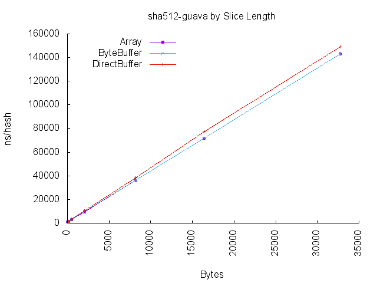

| Length |  Array | ByteBuffer | DirectBuffer |
| --- | ---: | ---: | ---: | 
| [32](#32-byte-slice-latency-all-hashes) | 781.438840 | 790.819223 | 822.731767 |
| [128](#128-byte-slice-latency-all-hashes) | 1344.692613 | 1302.084768 | 1369.220583 |
| [512](#512-byte-slice-latency-all-hashes) | 3038.562518 | 2975.691499 | 3245.565762 |
| [2048](#2048-byte-slice-latency-all-hashes) | 9655.479716 | 9833.869636 | 10356.521827 |
| [8192](#8192-byte-slice-latency-all-hashes) | 36365.347337 | 36385.863756 | 38217.465302 |
| [16384](#16384-byte-slice-latency-all-hashes) | 71905.742129 | 71910.308879 | 77068.140678 |
| [32768](#32768-byte-slice-latency-all-hashes) | 143129.492201 | 143007.143830 | 148990.465837 |

---
### sha512-jacksum Latency
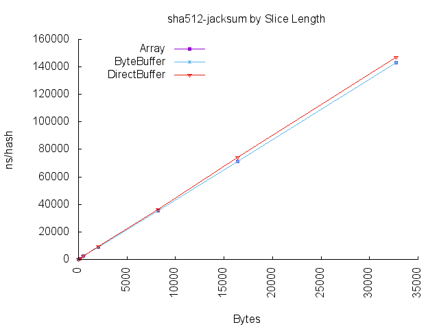

| Length |  Array | ByteBuffer | DirectBuffer |
| --- | ---: | ---: | ---: | 
| [32](#32-byte-slice-latency-all-hashes) | 22.344955 | 23.270439 | 45.048825 |
| [128](#128-byte-slice-latency-all-hashes) | 572.823835 | 582.044235 | 622.704875 |
| [512](#512-byte-slice-latency-all-hashes) | 2252.926501 | 2251.502958 | 2430.324202 |
| [2048](#2048-byte-slice-latency-all-hashes) | 8914.005227 | 8899.677735 | 9382.403050 |
| [8192](#8192-byte-slice-latency-all-hashes) | 35590.719708 | 35577.871893 | 36503.522251 |
| [16384](#16384-byte-slice-latency-all-hashes) | 71108.194270 | 71314.739886 | 74400.322123 |
| [32768](#32768-byte-slice-latency-all-hashes) | 143182.348013 | 142826.486617 | 147147.066669 |

---
### sha512-jacksum-alt Latency
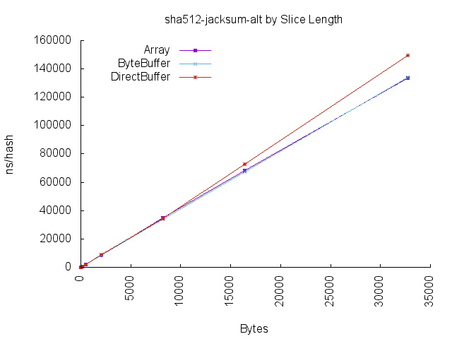

| Length |  Array | ByteBuffer | DirectBuffer |
| --- | ---: | ---: | ---: | 
| [32](#32-byte-slice-latency-all-hashes) | 27.112835 | 16.575769 | 53.347152 |
| [128](#128-byte-slice-latency-all-hashes) | 551.192462 | 560.068813 | 605.871528 |
| [512](#512-byte-slice-latency-all-hashes) | 2122.899995 | 2117.126492 | 2241.533837 |
| [2048](#2048-byte-slice-latency-all-hashes) | 8613.489225 | 8527.270558 | 8889.295772 |
| [8192](#8192-byte-slice-latency-all-hashes) | 34732.116784 | 34016.241952 | 34540.067277 |
| [16384](#16384-byte-slice-latency-all-hashes) | 68214.638801 | 67394.498311 | 72936.492729 |
| [32768](#32768-byte-slice-latency-all-hashes) | 133729.699902 | 133863.809379 | 149381.431661 |

---
### sip-fwdeng Latency
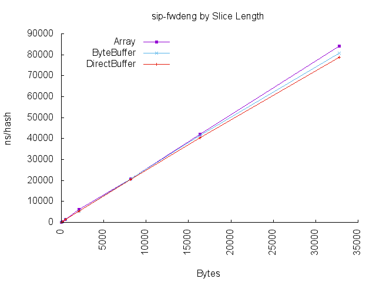

| Length |  Array | ByteBuffer | DirectBuffer |
| --- | ---: | ---: | ---: | 
| [32](#32-byte-slice-latency-all-hashes) | 114.728517 | 128.844616 | 132.614877 |
| [128](#128-byte-slice-latency-all-hashes) | 343.764549 | 373.523899 | 367.125814 |
| [512](#512-byte-slice-latency-all-hashes) | 1303.526293 | 1344.293500 | 1316.223162 |
| [2048](#2048-byte-slice-latency-all-hashes) | 6088.124004 | 5361.850637 | 5399.694579 |
| [8192](#8192-byte-slice-latency-all-hashes) | 20748.627698 | 20782.029458 | 20544.968258 |
| [16384](#16384-byte-slice-latency-all-hashes) | 41978.004506 | 41587.108537 | 40321.596239 |
| [32768](#32768-byte-slice-latency-all-hashes) | 84010.667517 | 80620.682774 | 78917.654072 |

---
### sip-guava Latency
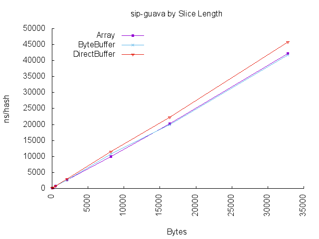

| Length |  Array | ByteBuffer | DirectBuffer |
| --- | ---: | ---: | ---: | 
| [32](#32-byte-slice-latency-all-hashes) | 127.901378 | 127.761490 | 140.568389 |
| [128](#128-byte-slice-latency-all-hashes) | 228.240335 | 259.279886 | 263.275990 |
| [512](#512-byte-slice-latency-all-hashes) | 726.109760 | 737.647059 | 832.549302 |
| [2048](#2048-byte-slice-latency-all-hashes) | 2681.484149 | 2680.280693 | 3020.471944 |
| [8192](#8192-byte-slice-latency-all-hashes) | 9992.884988 | 10802.121830 | 11501.762111 |
| [16384](#16384-byte-slice-latency-all-hashes) | 20249.658502 | 19905.538397 | 22246.293382 |
| [32768](#32768-byte-slice-latency-all-hashes) | 42188.950548 | 41802.339638 | 45818.317348 |

---
### sip-inline Latency
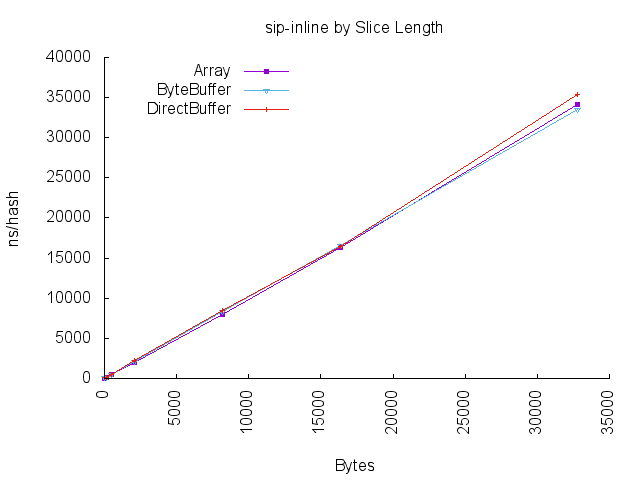

| Length |  Array | ByteBuffer | DirectBuffer |
| --- | ---: | ---: | ---: | 
| [32](#32-byte-slice-latency-all-hashes) | 52.077752 | 75.768631 | 76.893076 |
| [128](#128-byte-slice-latency-all-hashes) | 139.514489 | 160.306260 | 160.810535 |
| [512](#512-byte-slice-latency-all-hashes) | 501.054790 | 528.702971 | 522.946182 |
| [2048](#2048-byte-slice-latency-all-hashes) | 2008.121525 | 2159.966842 | 2274.129989 |
| [8192](#8192-byte-slice-latency-all-hashes) | 7953.232743 | 8400.773218 | 8444.171623 |
| [16384](#16384-byte-slice-latency-all-hashes) | 16308.051326 | 16629.383378 | 16421.837969 |
| [32768](#32768-byte-slice-latency-all-hashes) | 34198.450426 | 33578.830808 | 35353.983656 |

---
### skein1024-bc Latency

| Length |  Array | ByteBuffer | DirectBuffer |
| --- | ---: | ---: | ---: | 
| [32](#32-byte-slice-latency-all-hashes) | 1058.753688 | 1076.207092 | 1139.946381 |
| [128](#128-byte-slice-latency-all-hashes) | 1056.620887 | 1135.110275 | 1099.825223 |
| [512](#512-byte-slice-latency-all-hashes) | 2562.839289 | 2667.936618 | 2600.276996 |
| [2048](#2048-byte-slice-latency-all-hashes) | 8456.723186 | 8528.021555 | 8885.550348 |
| [8192](#8192-byte-slice-latency-all-hashes) | 33235.938759 | 32358.204140 | 32681.886517 |
| [16384](#16384-byte-slice-latency-all-hashes) | 64165.011597 | 63822.024674 | 68923.895915 |
| [32768](#32768-byte-slice-latency-all-hashes) | 126304.224150 | 131026.841858 | 132274.096287 |

---
### skein256-bc Latency
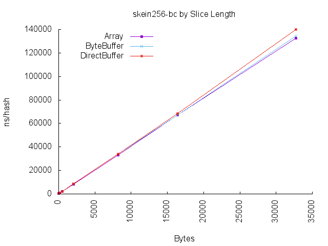

| Length |  Array | ByteBuffer | DirectBuffer |
| --- | ---: | ---: | ---: | 
| [32](#32-byte-slice-latency-all-hashes) | 331.241042 | 330.132634 | 344.313706 |
| [128](#128-byte-slice-latency-all-hashes) | 720.090715 | 723.562690 | 750.304314 |
| [512](#512-byte-slice-latency-all-hashes) | 2262.145232 | 2335.781075 | 2334.138273 |
| [2048](#2048-byte-slice-latency-all-hashes) | 8347.115145 | 8630.962604 | 8741.587015 |
| [8192](#8192-byte-slice-latency-all-hashes) | 33219.408104 | 34208.655919 | 33985.955510 |
| [16384](#16384-byte-slice-latency-all-hashes) | 67013.790413 | 67139.123896 | 68612.296025 |
| [32768](#32768-byte-slice-latency-all-hashes) | 132722.232662 | 134123.787110 | 139853.339197 |

---
### skein512-bc Latency
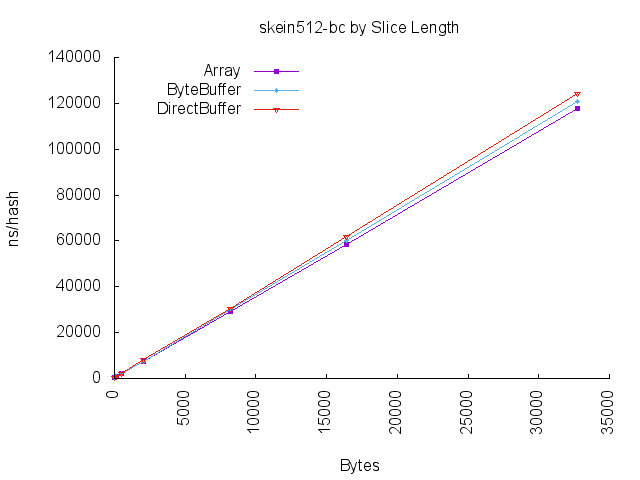

| Length |  Array | ByteBuffer | DirectBuffer |
| --- | ---: | ---: | ---: | 
| [32](#32-byte-slice-latency-all-hashes) | 527.434598 | 528.291191 | 571.003922 |
| [128](#128-byte-slice-latency-all-hashes) | 751.728020 | 760.824098 | 800.083689 |
| [512](#512-byte-slice-latency-all-hashes) | 2127.826411 | 2220.708475 | 2212.301455 |
| [2048](#2048-byte-slice-latency-all-hashes) | 7593.475387 | 7501.177495 | 8154.689646 |
| [8192](#8192-byte-slice-latency-all-hashes) | 29258.842381 | 30151.527259 | 30552.361784 |
| [16384](#16384-byte-slice-latency-all-hashes) | 58225.718741 | 60016.610254 | 61897.832273 |
| [32768](#32768-byte-slice-latency-all-hashes) | 117603.323425 | 120685.782968 | 124407.250407 |

---
### sm3-bc Latency

| Length |  Array | ByteBuffer | DirectBuffer |
| --- | ---: | ---: | ---: | 
| [32](#32-byte-slice-latency-all-hashes) | 425.018453 | 407.229386 | 438.960034 |
| [128](#128-byte-slice-latency-all-hashes) | 1167.151710 | 1159.808647 | 1237.963627 |
| [512](#512-byte-slice-latency-all-hashes) | 3527.197396 | 3440.853847 | 3517.541049 |
| [2048](#2048-byte-slice-latency-all-hashes) | 12843.195244 | 12602.441732 | 13321.398141 |
| [8192](#8192-byte-slice-latency-all-hashes) | 50160.031519 | 50452.064662 | 51771.843673 |
| [16384](#16384-byte-slice-latency-all-hashes) | 99413.497860 | 99163.002753 | 102614.345135 |
| [32768](#32768-byte-slice-latency-all-hashes) | 192101.696050 | 192179.335493 | 210179.201734 |

---
### sum16-jacksum Latency
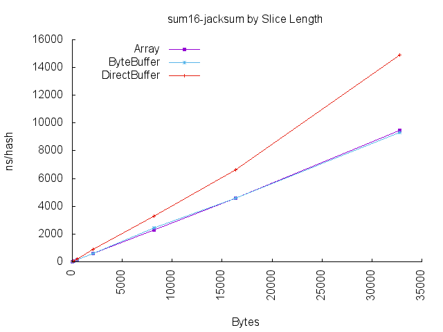

| Length |  Array | ByteBuffer | DirectBuffer |
| --- | ---: | ---: | ---: | 
| [32](#32-byte-slice-latency-all-hashes) | 19.046816 | 19.703949 | 42.962086 |
| [128](#128-byte-slice-latency-all-hashes) | 42.176340 | 42.849856 | 71.021321 |
| [512](#512-byte-slice-latency-all-hashes) | 153.620772 | 154.154775 | 211.250651 |
| [2048](#2048-byte-slice-latency-all-hashes) | 604.723983 | 603.185412 | 907.505875 |
| [8192](#8192-byte-slice-latency-all-hashes) | 2304.013395 | 2432.397219 | 3279.957098 |
| [16384](#16384-byte-slice-latency-all-hashes) | 4595.779149 | 4596.817348 | 6608.056315 |
| [32768](#32768-byte-slice-latency-all-hashes) | 9463.474828 | 9329.811049 | 14900.720162 |

---
### sum24-jacksum Latency
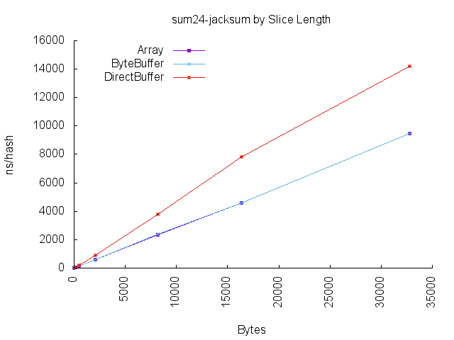

| Length |  Array | ByteBuffer | DirectBuffer |
| --- | ---: | ---: | ---: | 
| [32](#32-byte-slice-latency-all-hashes) | 19.384805 | 19.560981 | 42.013252 |
| [128](#128-byte-slice-latency-all-hashes) | 41.409458 | 42.344083 | 71.685797 |
| [512](#512-byte-slice-latency-all-hashes) | 152.573620 | 156.647188 | 209.786959 |
| [2048](#2048-byte-slice-latency-all-hashes) | 589.951658 | 603.009492 | 873.966883 |
| [8192](#8192-byte-slice-latency-all-hashes) | 2342.702799 | 2376.471642 | 3767.208513 |
| [16384](#16384-byte-slice-latency-all-hashes) | 4594.946542 | 4593.403100 | 7808.524328 |
| [32768](#32768-byte-slice-latency-all-hashes) | 9494.107872 | 9473.357813 | 14217.579242 |

---
### sum32-jacksum Latency
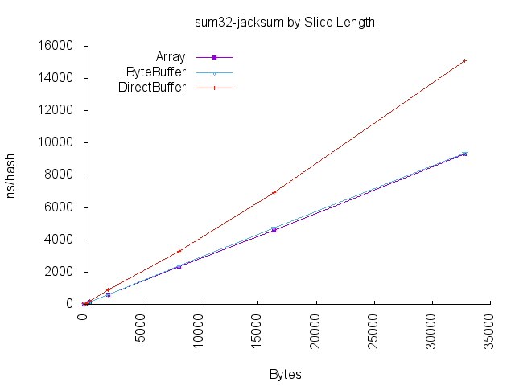

| Length |  Array | ByteBuffer | DirectBuffer |
| --- | ---: | ---: | ---: | 
| [32](#32-byte-slice-latency-all-hashes) | 19.099153 | 18.759441 | 40.877827 |
| [128](#128-byte-slice-latency-all-hashes) | 41.625842 | 42.794848 | 67.468717 |
| [512](#512-byte-slice-latency-all-hashes) | 152.818536 | 165.053443 | 217.483782 |
| [2048](#2048-byte-slice-latency-all-hashes) | 582.426823 | 593.781158 | 906.281918 |
| [8192](#8192-byte-slice-latency-all-hashes) | 2365.723267 | 2375.652757 | 3289.773825 |
| [16384](#16384-byte-slice-latency-all-hashes) | 4593.054506 | 4746.274063 | 6917.702330 |
| [32768](#32768-byte-slice-latency-all-hashes) | 9333.718978 | 9351.464831 | 15079.616097 |

---
### sum8-jacksum Latency
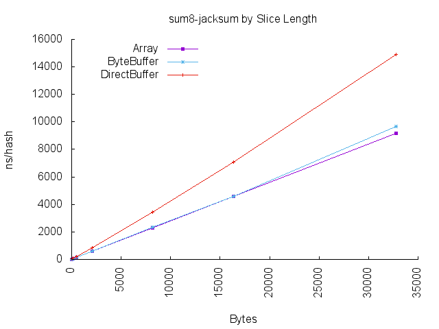

| Length |  Array | ByteBuffer | DirectBuffer |
| --- | ---: | ---: | ---: | 
| [32](#32-byte-slice-latency-all-hashes) | 19.415197 | 18.525588 | 42.438977 |
| [128](#128-byte-slice-latency-all-hashes) | 42.125528 | 43.052587 | 74.879483 |
| [512](#512-byte-slice-latency-all-hashes) | 155.236700 | 154.621885 | 219.891631 |
| [2048](#2048-byte-slice-latency-all-hashes) | 594.449558 | 592.322384 | 862.241060 |
| [8192](#8192-byte-slice-latency-all-hashes) | 2303.063745 | 2320.452776 | 3436.563948 |
| [16384](#16384-byte-slice-latency-all-hashes) | 4594.242078 | 4594.239808 | 7058.807570 |
| [32768](#32768-byte-slice-latency-all-hashes) | 9187.324515 | 9663.692850 | 14910.656719 |

---
### sumbsd-jacksum Latency
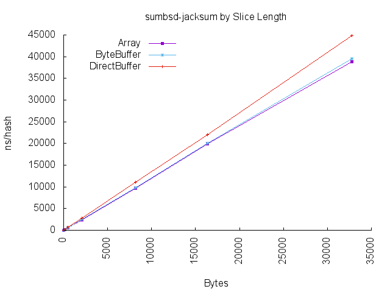

| Length |  Array | ByteBuffer | DirectBuffer |
| --- | ---: | ---: | ---: | 
| [32](#32-byte-slice-latency-all-hashes) | 40.749409 | 41.739838 | 65.223945 |
| [128](#128-byte-slice-latency-all-hashes) | 154.562323 | 158.375344 | 192.788488 |
| [512](#512-byte-slice-latency-all-hashes) | 607.677076 | 621.102501 | 696.210238 |
| [2048](#2048-byte-slice-latency-all-hashes) | 2423.104141 | 2512.261781 | 2859.546409 |
| [8192](#8192-byte-slice-latency-all-hashes) | 9685.845923 | 9866.911238 | 11021.658899 |
| [16384](#16384-byte-slice-latency-all-hashes) | 19853.181752 | 20059.432583 | 21991.097281 |
| [32768](#32768-byte-slice-latency-all-hashes) | 38852.912122 | 39483.384838 | 44901.591329 |

---
### sumsysv-jacksum Latency
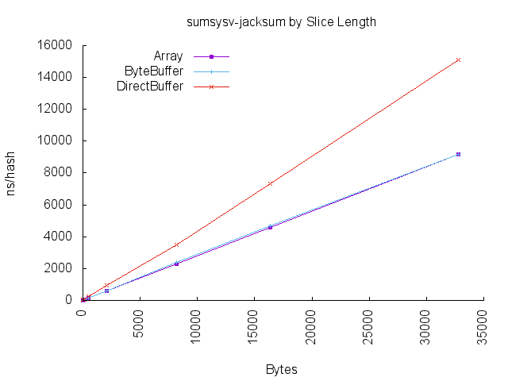

| Length |  Array | ByteBuffer | DirectBuffer |
| --- | ---: | ---: | ---: | 
| [32](#32-byte-slice-latency-all-hashes) | 17.264615 | 19.440393 | 41.196096 |
| [128](#128-byte-slice-latency-all-hashes) | 41.656149 | 43.424274 | 69.784069 |
| [512](#512-byte-slice-latency-all-hashes) | 154.109715 | 155.403570 | 225.207782 |
| [2048](#2048-byte-slice-latency-all-hashes) | 584.544391 | 611.486724 | 964.002204 |
| [8192](#8192-byte-slice-latency-all-hashes) | 2305.905916 | 2374.372807 | 3465.361749 |
| [16384](#16384-byte-slice-latency-all-hashes) | 4596.620128 | 4674.609848 | 7336.486208 |
| [32768](#32768-byte-slice-latency-all-hashes) | 9182.774237 | 9189.248653 | 15105.468563 |

---
### tiger128-jacksum Latency
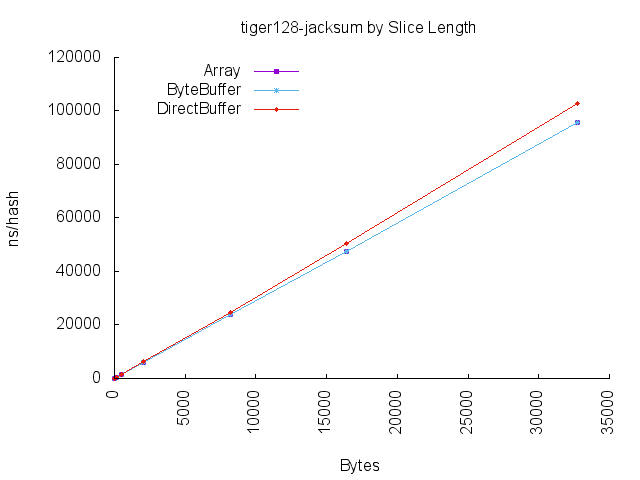

| Length |  Array | ByteBuffer | DirectBuffer |
| --- | ---: | ---: | ---: | 
| [32](#32-byte-slice-latency-all-hashes) | 26.517212 | 16.714373 | 49.090501 |
| [128](#128-byte-slice-latency-all-hashes) | 398.065657 | 396.903712 | 436.365051 |
| [512](#512-byte-slice-latency-all-hashes) | 1509.672594 | 1523.208649 | 1596.274867 |
| [2048](#2048-byte-slice-latency-all-hashes) | 5983.469563 | 5972.696108 | 6390.244790 |
| [8192](#8192-byte-slice-latency-all-hashes) | 23829.608494 | 23797.479342 | 24692.035657 |
| [16384](#16384-byte-slice-latency-all-hashes) | 47627.340616 | 47650.059724 | 50323.263610 |
| [32768](#32768-byte-slice-latency-all-hashes) | 95666.425289 | 95614.171330 | 102823.385964 |

---
### tiger160-jacksum Latency
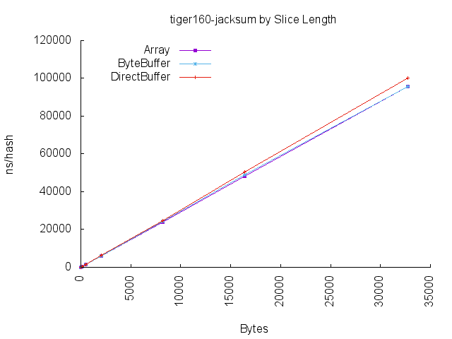

| Length |  Array | ByteBuffer | DirectBuffer |
| --- | ---: | ---: | ---: | 
| [32](#32-byte-slice-latency-all-hashes) | 26.539995 | 16.671177 | 48.617407 |
| [128](#128-byte-slice-latency-all-hashes) | 397.641100 | 385.808962 | 443.121401 |
| [512](#512-byte-slice-latency-all-hashes) | 1538.954170 | 1498.279644 | 1570.478425 |
| [2048](#2048-byte-slice-latency-all-hashes) | 5978.441319 | 6057.188990 | 6467.379106 |
| [8192](#8192-byte-slice-latency-all-hashes) | 23795.541387 | 24179.646856 | 24807.059105 |
| [16384](#16384-byte-slice-latency-all-hashes) | 48089.831102 | 49139.349377 | 50304.257131 |
| [32768](#32768-byte-slice-latency-all-hashes) | 95617.937295 | 95564.627500 | 100052.753360 |

---
### tiger2-jacksum Latency
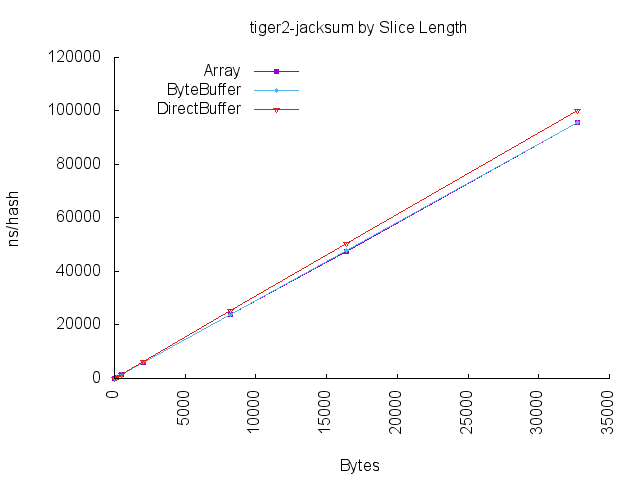

| Length |  Array | ByteBuffer | DirectBuffer |
| --- | ---: | ---: | ---: | 
| [32](#32-byte-slice-latency-all-hashes) | 26.452172 | 19.718379 | 48.222673 |
| [128](#128-byte-slice-latency-all-hashes) | 398.676126 | 386.343501 | 438.507288 |
| [512](#512-byte-slice-latency-all-hashes) | 1508.675028 | 1499.225492 | 1568.578034 |
| [2048](#2048-byte-slice-latency-all-hashes) | 5969.104635 | 5959.338337 | 6248.480188 |
| [8192](#8192-byte-slice-latency-all-hashes) | 23804.803725 | 23792.541837 | 25245.903012 |
| [16384](#16384-byte-slice-latency-all-hashes) | 47620.605018 | 47704.178434 | 50446.613643 |
| [32768](#32768-byte-slice-latency-all-hashes) | 95668.661513 | 95798.228836 | 100152.450313 |

---
### tiger2-jacksum-tree Latency
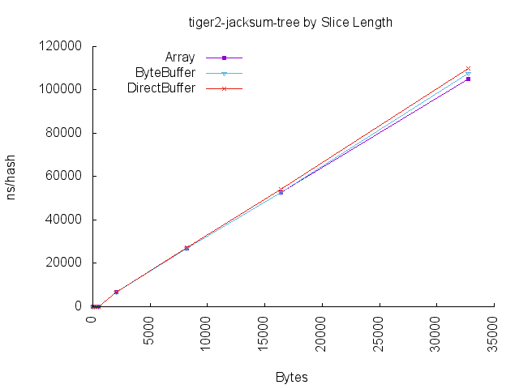

| Length |  Array | ByteBuffer | DirectBuffer |
| --- | ---: | ---: | ---: | 
| [32](#32-byte-slice-latency-all-hashes) | 28.010209 | 27.054205 | 45.968022 |
| [128](#128-byte-slice-latency-all-hashes) | 34.400234 | 29.254862 | 49.697730 |
| [512](#512-byte-slice-latency-all-hashes) | 48.292336 | 36.689362 | 95.338044 |
| [2048](#2048-byte-slice-latency-all-hashes) | 6585.876981 | 6600.663960 | 6871.653170 |
| [8192](#8192-byte-slice-latency-all-hashes) | 26788.679640 | 26763.321492 | 27267.607425 |
| [16384](#16384-byte-slice-latency-all-hashes) | 52638.364567 | 52824.142866 | 54277.810537 |
| [32768](#32768-byte-slice-latency-all-hashes) | 105121.630621 | 107646.497091 | 110090.465129 |

---
### tiger-bc Latency
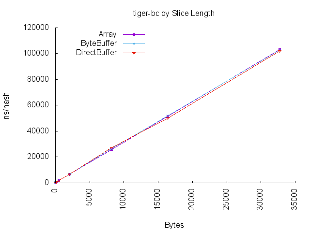

| Length |  Array | ByteBuffer | DirectBuffer |
| --- | ---: | ---: | ---: | 
| [32](#32-byte-slice-latency-all-hashes) | 240.163514 | 247.612121 | 275.684132 |
| [128](#128-byte-slice-latency-all-hashes) | 647.795690 | 659.962336 | 627.895714 |
| [512](#512-byte-slice-latency-all-hashes) | 1846.524279 | 1878.908775 | 1865.407438 |
| [2048](#2048-byte-slice-latency-all-hashes) | 6760.177310 | 6798.656148 | 6779.394203 |
| [8192](#8192-byte-slice-latency-all-hashes) | 25926.594270 | 26523.603590 | 27211.088858 |
| [16384](#16384-byte-slice-latency-all-hashes) | 51587.920281 | 52080.637182 | 50274.376725 |
| [32768](#32768-byte-slice-latency-all-hashes) | 103107.642516 | 102846.722228 | 102043.971045 |

---
### tiger-jacksum Latency
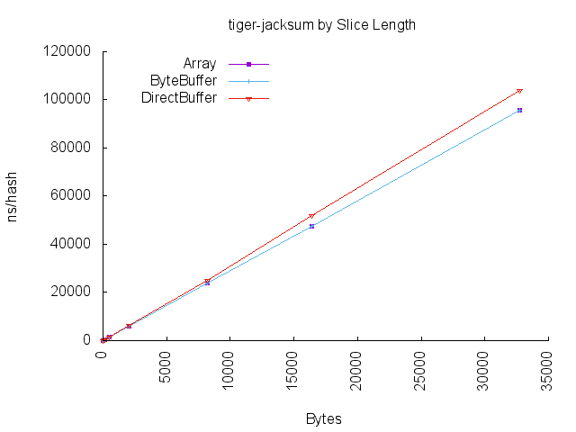

| Length |  Array | ByteBuffer | DirectBuffer |
| --- | ---: | ---: | ---: | 
| [32](#32-byte-slice-latency-all-hashes) | 26.972008 | 17.642335 | 48.598221 |
| [128](#128-byte-slice-latency-all-hashes) | 397.043672 | 394.948457 | 454.520711 |
| [512](#512-byte-slice-latency-all-hashes) | 1536.626050 | 1554.161804 | 1668.308340 |
| [2048](#2048-byte-slice-latency-all-hashes) | 5974.086091 | 6082.912700 | 6396.536859 |
| [8192](#8192-byte-slice-latency-all-hashes) | 23820.877741 | 23803.295380 | 25183.590013 |
| [16384](#16384-byte-slice-latency-all-hashes) | 47625.437315 | 47653.864817 | 52036.245626 |
| [32768](#32768-byte-slice-latency-all-hashes) | 95684.335302 | 95532.190392 | 103794.481980 |

---
### tiger-jacksum-tree Latency
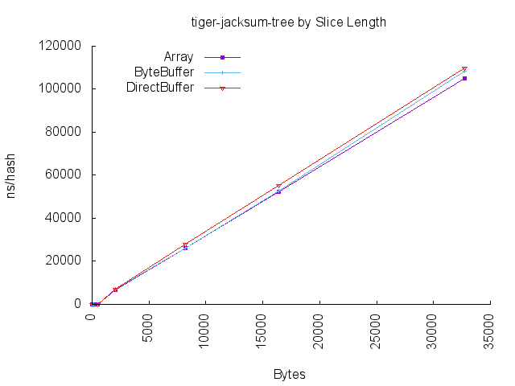

| Length |  Array | ByteBuffer | DirectBuffer |
| --- | ---: | ---: | ---: | 
| [32](#32-byte-slice-latency-all-hashes) | 26.404538 | 24.544187 | 48.096382 |
| [128](#128-byte-slice-latency-all-hashes) | 29.479784 | 28.548432 | 50.516798 |
| [512](#512-byte-slice-latency-all-hashes) | 35.736062 | 36.781896 | 92.957105 |
| [2048](#2048-byte-slice-latency-all-hashes) | 6594.933233 | 6933.191633 | 6988.504020 |
| [8192](#8192-byte-slice-latency-all-hashes) | 26277.536930 | 26260.512224 | 28032.017864 |
| [16384](#16384-byte-slice-latency-all-hashes) | 52475.834528 | 52552.168555 | 55200.266379 |
| [32768](#32768-byte-slice-latency-all-hashes) | 105088.500051 | 108506.220194 | 109806.446695 |

---
### whirlpool0-jacksum Latency
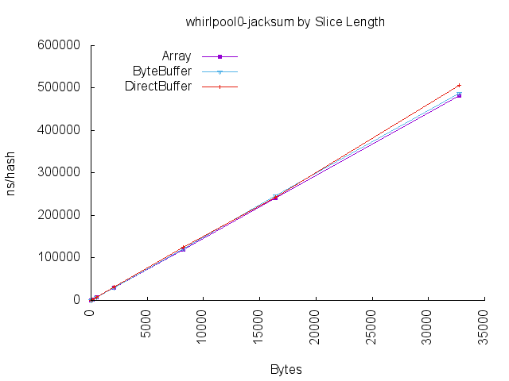

| Length |  Array | ByteBuffer | DirectBuffer |
| --- | ---: | ---: | ---: | 
| [32](#32-byte-slice-latency-all-hashes) | 26.450107 | 16.439875 | 51.060297 |
| [128](#128-byte-slice-latency-all-hashes) | 1871.931920 | 1900.590175 | 1969.397364 |
| [512](#512-byte-slice-latency-all-hashes) | 7511.591465 | 7611.339759 | 7807.501981 |
| [2048](#2048-byte-slice-latency-all-hashes) | 30047.760865 | 30666.678283 | 31346.117975 |
| [8192](#8192-byte-slice-latency-all-hashes) | 119451.876075 | 122003.693561 | 125098.950761 |
| [16384](#16384-byte-slice-latency-all-hashes) | 240925.706043 | 247507.307539 | 242275.232832 |
| [32768](#32768-byte-slice-latency-all-hashes) | 481709.199570 | 486994.240514 | 506872.761146 |

---
### whirlpool1-jacksum Latency
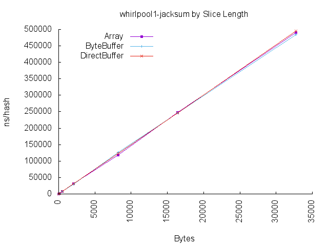

| Length |  Array | ByteBuffer | DirectBuffer |
| --- | ---: | ---: | ---: | 
| [32](#32-byte-slice-latency-all-hashes) | 26.456510 | 16.303539 | 49.985844 |
| [128](#128-byte-slice-latency-all-hashes) | 1941.368634 | 1996.925363 | 2045.660494 |
| [512](#512-byte-slice-latency-all-hashes) | 7526.689865 | 7810.942690 | 7906.165514 |
| [2048](#2048-byte-slice-latency-all-hashes) | 30851.540937 | 29882.266757 | 31216.760148 |
| [8192](#8192-byte-slice-latency-all-hashes) | 118028.587149 | 126391.688667 | 122728.823475 |
| [16384](#16384-byte-slice-latency-all-hashes) | 248414.670650 | 246033.106236 | 245908.406120 |
| [32768](#32768-byte-slice-latency-all-hashes) | 490858.549844 | 484039.286400 | 494651.475889 |

---
### whirlpool2-bc Latency
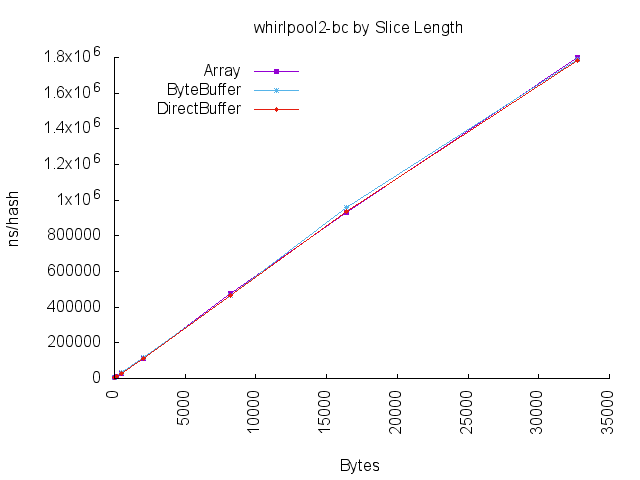

| Length |  Array | ByteBuffer | DirectBuffer |
| --- | ---: | ---: | ---: | 
| [32](#32-byte-slice-latency-all-hashes) | 6174.274958 | 6089.172409 | 6433.394938 |
| [128](#128-byte-slice-latency-all-hashes) | 9481.194390 | 9358.954313 | 9858.439148 |
| [512](#512-byte-slice-latency-all-hashes) | 30523.729149 | 31388.141528 | 30079.471281 |
| [2048](#2048-byte-slice-latency-all-hashes) | 114415.215644 | 118324.356564 | 112896.350057 |
| [8192](#8192-byte-slice-latency-all-hashes) | 474744.055776 | 465764.524802 | 463435.770553 |
| [16384](#16384-byte-slice-latency-all-hashes) | 930449.166652 | 960641.039910 | 933689.950652 |
| [32768](#32768-byte-slice-latency-all-hashes) | 1798698.956657 | 1789855.819303 | 1784590.637372 |

---
### whirlpool2-jacksum Latency
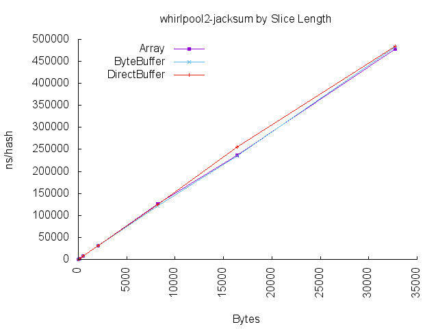

| Length |  Array | ByteBuffer | DirectBuffer |
| --- | ---: | ---: | ---: | 
| [32](#32-byte-slice-latency-all-hashes) | 27.231707 | 19.014094 | 52.706949 |
| [128](#128-byte-slice-latency-all-hashes) | 1975.138802 | 1890.685823 | 2022.295810 |
| [512](#512-byte-slice-latency-all-hashes) | 7626.596560 | 7536.595077 | 7987.130736 |
| [2048](#2048-byte-slice-latency-all-hashes) | 31177.428483 | 31337.746053 | 30856.798042 |
| [8192](#8192-byte-slice-latency-all-hashes) | 126100.621070 | 121649.213213 | 124708.926885 |
| [16384](#16384-byte-slice-latency-all-hashes) | 237269.843836 | 235019.859076 | 254877.384410 |
| [32768](#32768-byte-slice-latency-all-hashes) | 477592.864972 | 483595.473541 | 484870.495298 |

---
### xor8-jacksum Latency
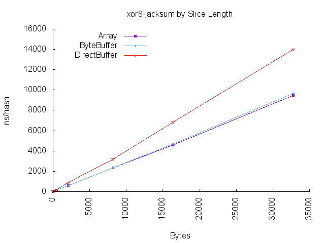

| Length |  Array | ByteBuffer | DirectBuffer |
| --- | ---: | ---: | ---: | 
| [32](#32-byte-slice-latency-all-hashes) | 15.863849 | 17.432694 | 43.135984 |
| [128](#128-byte-slice-latency-all-hashes) | 41.275511 | 45.085445 | 69.036549 |
| [512](#512-byte-slice-latency-all-hashes) | 159.208858 | 155.525975 | 208.018888 |
| [2048](#2048-byte-slice-latency-all-hashes) | 585.807937 | 586.894836 | 896.589664 |
| [8192](#8192-byte-slice-latency-all-hashes) | 2358.379524 | 2346.841174 | 3179.288314 |
| [16384](#16384-byte-slice-latency-all-hashes) | 4605.085006 | 4682.780977 | 6830.224075 |
| [32768](#32768-byte-slice-latency-all-hashes) | 9473.445055 | 9667.806536 | 14019.089357 |

---
### xxh32-jpountz-jni Latency
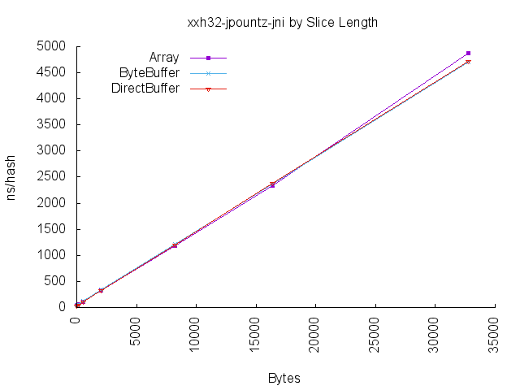

| Length |  Array | ByteBuffer | DirectBuffer |
| --- | ---: | ---: | ---: | 
| [32](#32-byte-slice-latency-all-hashes) | 45.331361 | 44.359186 | 33.846985 |
| [128](#128-byte-slice-latency-all-hashes) | 56.865669 | 56.574434 | 47.332192 |
| [512](#512-byte-slice-latency-all-hashes) | 108.804278 | 119.280746 | 102.275736 |
| [2048](#2048-byte-slice-latency-all-hashes) | 328.498221 | 341.500726 | 329.404169 |
| [8192](#8192-byte-slice-latency-all-hashes) | 1187.898092 | 1210.268644 | 1206.773345 |
| [16384](#16384-byte-slice-latency-all-hashes) | 2330.749986 | 2371.317890 | 2379.683354 |
| [32768](#32768-byte-slice-latency-all-hashes) | 4870.438799 | 4711.205722 | 4719.866076 |

---
### xxh32-jpountz-safe Latency
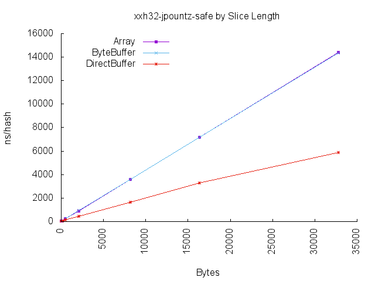

| Length |  Array | ByteBuffer | DirectBuffer |
| --- | ---: | ---: | ---: | 
| [32](#32-byte-slice-latency-all-hashes) | 26.121419 | 28.370377 | 27.194754 |
| [128](#128-byte-slice-latency-all-hashes) | 67.444133 | 71.496034 | 50.906318 |
| [512](#512-byte-slice-latency-all-hashes) | 233.550211 | 238.202337 | 131.298480 |
| [2048](#2048-byte-slice-latency-all-hashes) | 908.723718 | 956.047806 | 436.988791 |
| [8192](#8192-byte-slice-latency-all-hashes) | 3592.209580 | 3590.074817 | 1644.757610 |
| [16384](#16384-byte-slice-latency-all-hashes) | 7168.127562 | 7166.766084 | 3284.943814 |
| [32768](#32768-byte-slice-latency-all-hashes) | 14399.953027 | 14379.987870 | 5889.886494 |

---
### xxh32-jpountz-unsafe Latency
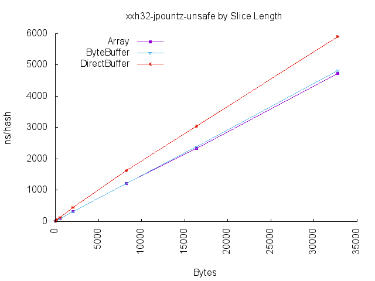

| Length |  Array | ByteBuffer | DirectBuffer |
| --- | ---: | ---: | ---: | 
| [32](#32-byte-slice-latency-all-hashes) | 14.513508 | 17.110996 | 26.892453 |
| [128](#128-byte-slice-latency-all-hashes) | 32.296354 | 32.922869 | 50.017485 |
| [512](#512-byte-slice-latency-all-hashes) | 102.609195 | 99.509120 | 129.674785 |
| [2048](#2048-byte-slice-latency-all-hashes) | 322.034960 | 324.484844 | 446.085015 |
| [8192](#8192-byte-slice-latency-all-hashes) | 1211.150038 | 1212.147111 | 1634.835630 |
| [16384](#16384-byte-slice-latency-all-hashes) | 2327.549615 | 2384.445636 | 3037.442780 |
| [32768](#32768-byte-slice-latency-all-hashes) | 4735.699412 | 4818.762454 | 5902.653310 |

---
### xxh64-jpountz-jni Latency
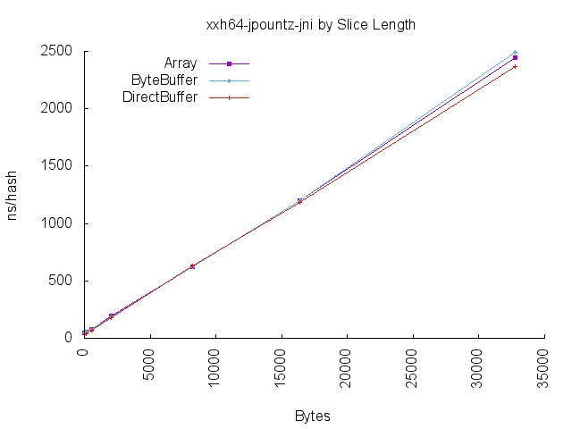

| Length |  Array | ByteBuffer | DirectBuffer |
| --- | ---: | ---: | ---: | 
| [32](#32-byte-slice-latency-all-hashes) | 44.830751 | 45.678168 | 36.185883 |
| [128](#128-byte-slice-latency-all-hashes) | 51.023885 | 55.354021 | 42.751683 |
| [512](#512-byte-slice-latency-all-hashes) | 77.120173 | 79.010407 | 70.784956 |
| [2048](#2048-byte-slice-latency-all-hashes) | 191.421272 | 189.584197 | 179.477872 |
| [8192](#8192-byte-slice-latency-all-hashes) | 620.721180 | 623.863792 | 627.324571 |
| [16384](#16384-byte-slice-latency-all-hashes) | 1195.621835 | 1198.616192 | 1185.216560 |
| [32768](#32768-byte-slice-latency-all-hashes) | 2448.492317 | 2489.544794 | 2366.758745 |

---
### xxh64-jpountz-safe Latency
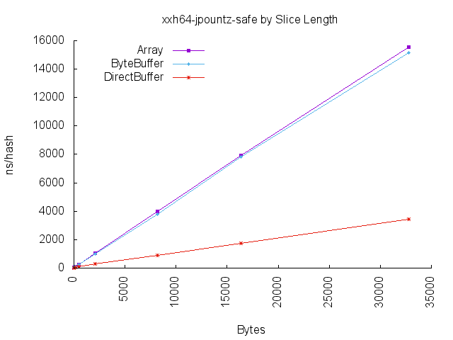

| Length |  Array | ByteBuffer | DirectBuffer |
| --- | ---: | ---: | ---: | 
| [32](#32-byte-slice-latency-all-hashes) | 28.592931 | 37.955735 | 21.856295 |
| [128](#128-byte-slice-latency-all-hashes) | 78.210169 | 78.440963 | 44.950956 |
| [512](#512-byte-slice-latency-all-hashes) | 261.340423 | 254.371295 | 97.476778 |
| [2048](#2048-byte-slice-latency-all-hashes) | 1031.682640 | 985.398496 | 278.585199 |
| [8192](#8192-byte-slice-latency-all-hashes) | 4009.622272 | 3782.054234 | 920.637714 |
| [16384](#16384-byte-slice-latency-all-hashes) | 7942.155491 | 7805.341989 | 1724.955465 |
| [32768](#32768-byte-slice-latency-all-hashes) | 15532.795526 | 15167.819387 | 3458.865876 |

---
### xxh64-jpountz-unsafe Latency
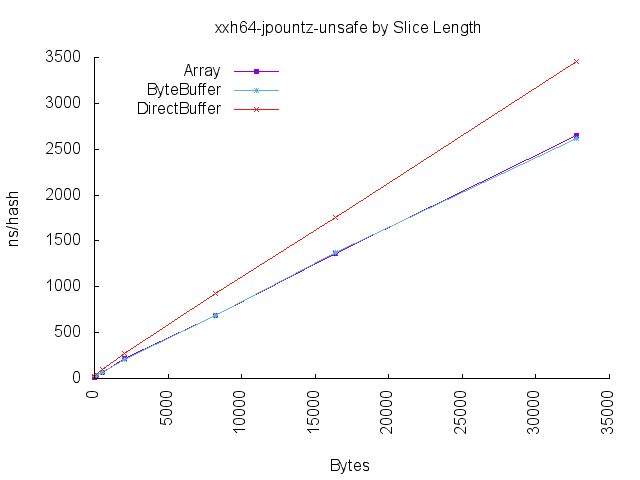

| Length |  Array | ByteBuffer | DirectBuffer |
| --- | ---: | ---: | ---: | 
| [32](#32-byte-slice-latency-all-hashes) | 16.185075 | 26.851060 | 22.351076 |
| [128](#128-byte-slice-latency-all-hashes) | 27.708782 | 29.209727 | 45.589571 |
| [512](#512-byte-slice-latency-all-hashes) | 68.061547 | 68.952579 | 95.897739 |
| [2048](#2048-byte-slice-latency-all-hashes) | 213.141728 | 208.549035 | 273.978135 |
| [8192](#8192-byte-slice-latency-all-hashes) | 687.469125 | 687.436656 | 930.866660 |
| [16384](#16384-byte-slice-latency-all-hashes) | 1359.182249 | 1374.501257 | 1756.421680 |
| [32768](#32768-byte-slice-latency-all-hashes) | 2648.048794 | 2613.473119 | 3454.870889 |

---
### xxh64-zah Latency

| Length |  Array | ByteBuffer | DirectBuffer |
| --- | ---: | ---: | ---: | 
| [32](#32-byte-slice-latency-all-hashes) | 17.243445 | 17.621031 | 17.697338 |
| [128](#128-byte-slice-latency-all-hashes) | 23.774723 | 30.902095 | 24.738725 |
| [512](#512-byte-slice-latency-all-hashes) | 54.173173 | 57.009608 | 56.746202 |
| [2048](#2048-byte-slice-latency-all-hashes) | 171.053692 | 178.464064 | 173.499855 |
| [8192](#8192-byte-slice-latency-all-hashes) | 630.188956 | 614.777509 | 615.631463 |
| [16384](#16384-byte-slice-latency-all-hashes) | 1197.272419 | 1220.530897 | 1235.450247 |
| [32768](#32768-byte-slice-latency-all-hashes) | 2373.834155 | 2377.447948 | 2377.269100 |

---
Generated from [JMH CSV](jmh-result.csv) on Fri, 04 Dec 2015 20:15:53 +0000 by [Hash-Bench](https://github.com/benalexau/hash-bench).
